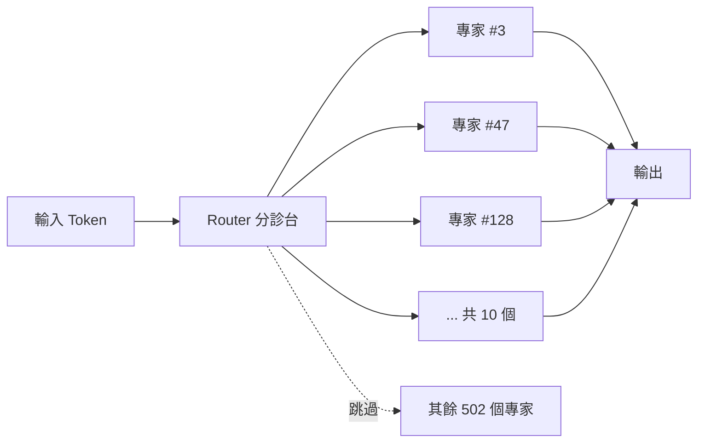

# 本地 LLM 推理入門指南

> 這份指南幫助你理解「在自己電腦上跑大型語言模型」所需的核心概念。
> 讀完後你將能判斷一個模型能不能在你的硬體上跑、跑多快、需要多少記憶體。

---

## 目錄

- [1. 什麼是本地推理？](#1-什麼是本地推理)
- [2. 本地推理 vs 雲端 API](#2-本地推理-vs-雲端-api)
- [3. GPU 運算框架：Metal vs CUDA](#3-gpu-運算框架metal-vs-cuda)
- [4. 統一記憶體 vs 獨立 VRAM](#4-統一記憶體-vs-獨立-vram)
- [5. MoE 架構：為什麼大模型能在消費級硬體上跑](#5-moe-架構為什麼大模型能在消費級硬體上跑)
- [6. 記憶體需求計算](#6-記憶體需求計算)
- [7. 推理速度：tok/s 的意義](#7-推理速度toks-的意義)
- [8. 本地推理的軟體堆疊](#8-本地推理的軟體堆疊)
- [9. 常見問題排查](#9-常見問題排查)

---

## 1. 什麼是本地推理？

**推理（Inference）** 是指把一段文字丟給已經訓練好的模型，讓它產生回應的過程。你每次跟 ChatGPT 或 Claude 對話，背後都在做推理。

**本地推理**就是把這個過程搬到你自己的電腦上跑，不需要連網、不需要 API Key、不需要付費。模型的檔案下載到你的硬碟，推理完全在你的 CPU 和 GPU 上完成。

這跟**訓練（Training）**不同：
- **訓練**：用大量資料「教」模型學會語言能力，需要巨大算力（數千張 GPU 跑數週）
- **推理**：用已經訓練好的模型來回答問題，算力需求小得多（一台筆電就能跑）

---

## 2. 本地推理 vs 雲端 API

| 面向 | 本地推理 | 雲端 API（如 ChatGPT、Claude） |
|---|---|---|
| **隱私** | 資料完全不離開你的電腦 | 資料傳送到雲端伺服器 |
| **費用** | 免費（只需電費） | 按 token 計費 |
| **速度** | 取決於你的硬體 | 通常較快（企業級 GPU） |
| **模型品質** | 受限於能跑的模型大小 | 可用最大最強的模型 |
| **離線使用** | 完全離線可用 | 需要網路連線 |
| **設定難度** | 需要自己安裝設定 | 註冊帳號就能用 |

**什麼時候適合本地推理？**
- 處理機密或敏感資料，不想上傳到雲端
- 大量重複性工作，不想付 API 費用
- 網路環境不穩定或受限
- 想學習和實驗 AI 模型

---

## 3. GPU 運算框架：Metal vs CUDA

### 為什麼需要 GPU？

GPU（圖形處理器）原本是設計來畫圖的（遊戲、影片），但它有一個特性非常適合 AI：**能同時做大量簡單的平行運算**。

AI 模型的核心運算是矩陣乘法 — 想像成幾百萬個數字的加法和乘法，彼此之間互不相依，可以同時進行。CPU 像一個很聰明的人，一次處理一件複雜的事；GPU 像一千個普通工人，同時各做一件簡單的事。矩陣乘法剛好是後者擅長的。

### 但 GPU 不能直接跑 AI

你不能直接叫 GPU「幫我跑模型」，你需要一層軟體來把 AI 的運算指令翻譯成 GPU 能理解的操作。這就是 **GPU 運算框架**的角色。

### CUDA（NVIDIA）

```
AI 應用 → PyTorch → CUDA → NVIDIA GPU
```

- 2007 年推出，歷史悠久，生態系最成熟
- 只能用在 NVIDIA 的 GPU 上
- 整個 AI 產業（PyTorch、TensorFlow）幾乎都建立在 CUDA 上
- NVIDIA 在 AI 領域的主導地位，不只是硬體強，更因為軟體生態系都綁在 CUDA 上

### Metal（Apple）

```
AI 應用 → MLX → Metal → Apple Silicon GPU
```

- Apple 自家的 GPU 運算框架
- 只能用在 Apple 的晶片上（M1/M2/M3/M4 系列）
- 原本用於遊戲和圖形渲染，近年擴展到 AI 推理
- Apple 基於 Metal 打造了 MLX 框架，專門用於機器學習

### 它們不是函式庫，是平台

CUDA 和 Metal 都不只是一個函式庫，而是涵蓋完整工具鏈的**平台（platform）**：

| 組成部分 | CUDA | Metal |
|---|---|---|
| GPU 程式語言 | CUDA C/C++ | Metal Shading Language |
| 編譯器 | nvcc | Metal Compiler |
| 驅動程式層 | NVIDIA Driver | Apple GPU Driver |
| 運算函式庫 | cuBLAS、cuDNN | MPS（Metal Performance Shaders） |

一般開發者不會直接碰這些底層，而是透過上層框架（PyTorch、MLX）間接使用。

### 如果沒有 GPU 運算框架？

模型就只能用 CPU 跑，速度會慢 10-50 倍。這就是為什麼 llmfit 會在頂部顯示你有哪些 GPU 後端可用 — 這決定了你的推理速度。

---

## 4. 統一記憶體 vs 獨立 VRAM

### 傳統架構（NVIDIA 電腦）

```
┌──────────────────┐     ┌──────────────────┐
│   CPU             │     │   GPU（顯卡）     │
│                    │     │                    │
│   RAM: 64 GB      │ ←→ │   VRAM: 24 GB     │
│  （系統記憶體）    │複製  │  （顯卡記憶體）    │
└──────────────────┘     └──────────────────┘
```

- CPU 和 GPU 各有各的記憶體
- 資料要從 RAM 複製到 VRAM 才能讓 GPU 使用，這個過程耗時
- 能跑多大的模型，受限於 VRAM 的大小（通常只有 8-24 GB）
- VRAM 不夠的話，模型就跑不了或必須用 CPU 補上（速度大降）

### Apple 統一記憶體架構

```
┌──────────────────────────────┐
│      統一記憶體：64 GB         │
│                                │
│   CPU ──┐                      │
│          ├──→ 同一塊記憶體      │
│   GPU ──┘                      │
└──────────────────────────────┘
```

- CPU 和 GPU **共用同一塊記憶體**，不需要複製資料
- GPU 能存取全部 64 GB，不像 NVIDIA 受限於 VRAM
- 代價是：系統、應用程式、GPU 全部一起用這 64 GB，所以模型實際能用的空間 = 64 GB 減去系統和其他程式佔用的部分

### 實際影響

以 M3 Max 64 GB 為例，跑 Qwen3-Coder-Next（需要 40.8 GB）：

| 項目 | NVIDIA RTX 4090（24 GB VRAM） | Apple M3 Max（64 GB 統一） |
|---|---|---|
| 模型需要 40.8 GB | 裝不進 VRAM，無法純 GPU 跑 | 裝得下，完全 GPU 執行 |
| 剩餘可用 | RAM 還有 64 GB 給系統用 | 64 - 40.8 = 23.2 GB 給系統用 |

Apple Silicon 的優勢是**記憶體大**（最高 512 GB），劣勢是 GPU 計算速度不如高階 NVIDIA 顯卡。所以它適合跑「大但不用跑太快」的模型。

---

## 5. MoE 架構：為什麼大模型能在消費級硬體上跑

### 傳統模型（Dense）

傳統模型在推理每個 token 時，會用到**全部**的參數。一個 70B 參數的模型，每個 token 都要經過 700 億個參數的計算。

### MoE（Mixture of Experts）混合專家架構

想像一間有 **512 位專科醫生**的大醫院。每次有病人進來，不會叫全部 512 位醫生一起看診，而是由一個「分診台」（router）判斷病人的問題適合哪些科別，然後只派 **10 位最相關的醫生**去處理。



對模型來說：
- **512 個專家** = 512 組獨立的神經網路參數，各自擅長不同領域
- **每個 token 只啟用 10 個** = 模型內部有一個 router 網路，根據輸入動態選出最適合的 10 組
- **啟用數量是固定的** — 訓練時就決定了「top-10 out of 512」，寫死在模型結構裡，推理時不會動態調整

### MoE 的好處

| 指標 | Dense 70B | MoE 79.7B（10/512） |
|---|---|---|
| 總知識量 | 70B 參數 | 79.7B 參數 |
| 每個 token 的計算量 | 全部 70B | 只有約 1.5B（10 個專家） |
| 記憶體佔用（載入模型） | 全部載入 | 全部載入（40.8 GB） |
| 活躍計算記憶體 | 等同載入量 | 僅 1.8 GB |
| 推理速度 | 較慢 | 快很多 |

MoE 的本質是**用空間換時間** — 所有專家都載入記憶體，但每次只算一小部分。

### 不同模型的 MoE 設定

| 模型 | 總專家數 | 每次啟用 |
|---|---|---|
| Mixtral 8x7B | 8 | 2 |
| DeepSeek-V3 | 256 | 8 |
| Qwen3-Coder-Next | 512 | 10 |

---

## 6. 記憶體需求計算

### 粗估公式

```
模型記憶體需求 ≈ 參數量（B）× 每個參數的位元數（bytes）
```

以 79.7B 參數為例：

| 精度 | 每參數大小 | 總記憶體需求 |
|---|---|---|
| FP16（原始） | 2 bytes | 79.7 × 2 = 159.4 GB |
| Q8（8-bit 量化） | 1 byte | 79.7 × 1 = 79.7 GB |
| Q4（4-bit 量化） | 0.5 bytes | 79.7 × 0.5 = 39.9 GB |

這就是為什麼**量化**這麼重要 — 它讓原本裝不下的模型變成裝得下。

### 實際需求還要加上

- **KV Cache**：模型記住對話歷史所需的記憶體，上下文越長佔越多
- **系統開銷**：作業系統和其他程式的記憶體
- **安全餘量**：避免系統開始用 swap（硬碟當記憶體），速度會暴跌

所以 llmfit 顯示的 `Min VRAM`（40.8 GB）是模型本體，`Min RAM`（44.5 GB）包含系統開銷，`Rec RAM`（74.2 GB）是建議的舒適值。

### 怎麼判斷你的電腦能不能跑？

```
如果 Min VRAM ≤ 你的 GPU 記憶體 → 能跑（GPU 模式）
如果 Min VRAM > GPU 記憶體    → 部分 CPU 跑（速度慢）或跑不了
```

在 Apple Silicon 上：
```
如果 Min VRAM ≤ 統一記憶體 × 0.7 → 跑起來舒適
如果 Min VRAM ≤ 統一記憶體 × 0.9 → 勉強能跑，其他程式要關掉
如果 Min VRAM > 統一記憶體       → 跑不了
```

---

## 7. 推理速度：tok/s 的意義

**tok/s（tokens per second）** 是模型每秒能產生多少個 token。

### Token 是什麼？

Token 不等於一個字。模型把文字拆成更小的單位來處理：
- 英文中，一個 token 大約是 3/4 個單字（"Hello" = 1 token, "unbelievable" = 3 tokens）
- 中文中，一個常用字大約是 1-2 個 token

### 速度感受參考

| tok/s | 體感 |
|---|---|
| < 5 | 非常慢，像在等網頁載入 |
| 5-15 | 可接受，比打字稍快 |
| 15-40 | 流暢，像即時對話 |
| 40-100 | 快速，文字快速湧出 |
| > 100 | 極快，幾乎是瞬間完成 |

llmfit 顯示 Qwen3-Coder-Next 預估 146.7 tok/s，屬於極快的等級。這得益於 MoE 架構（每次只算 10 個專家）和 Apple Silicon 的統一記憶體。

### 影響速度的因素

1. **GPU 算力** — GPU 越強越快
2. **記憶體頻寬** — 資料從記憶體搬到 GPU 的速度（Apple Silicon 的優勢之一）
3. **模型大小** — 參數越多越慢
4. **量化等級** — 量化越多，計算量越小，越快
5. **是否全部在 GPU 上** — 部分用 CPU 會大幅變慢
6. **上下文長度** — 對話越長，KV Cache 越大，速度逐漸下降

---

## 8. 本地推理的軟體堆疊

理解各個工具之間的層級關係：

```
┌─────────────────────────────────────────────┐
│  使用者介面層（你直接操作的）                  │
│  Ollama / LM Studio / Open WebUI             │
├─────────────────────────────────────────────┤
│  推理引擎層（負責載入模型、做計算）            │
│  llama.cpp / MLX / vLLM                       │
├─────────────────────────────────────────────┤
│  GPU 運算框架層（跟硬體溝通）                  │
│  Metal / CUDA                                 │
├─────────────────────────────────────────────┤
│  硬體層                                        │
│  Apple M 系列 GPU / NVIDIA GPU                │
└─────────────────────────────────────────────┘
```

你平常接觸的是最上層（例如 `ollama run qwen3`），底下的層級自動運作。但理解這個架構有助於：
- 知道為什麼安裝 Ollama 就能跑（它內建 llama.cpp）
- 知道為什麼 llmfit 會推薦不同的 Runtime（MLX vs llama.cpp）
- 排查問題時知道該查哪一層

---

## 9. 常見問題排查

### 模型載入失敗 / 記憶體不足

**症狀**：錯誤訊息提到 "out of memory" 或模型載入後系統極度卡頓。

**解法**：
1. 關掉佔記憶體的程式（瀏覽器、IDE）
2. 換用更小的量化版本（Q4 → Q3 → Q2）
3. 換用參數量更小的模型

### 推理速度很慢

**症狀**：tok/s 遠低於預期。

**可能原因**：
1. 模型部分跑在 CPU 上（記憶體不夠放進 GPU）
2. 系統正在用 swap（硬碟當記憶體）
3. 上下文太長，KV Cache 佔用過多記憶體

**排查方式**：
- 查看推理引擎的 log，確認是否 100% GPU offload
- 用活動監視器查看記憶體壓力是否為紅色

### GPU 沒被使用

**症狀**：推理全部跑在 CPU 上。

**可能原因**：
1. 沒有安裝 GPU 運算框架（Metal / CUDA）
2. 推理引擎不支援你的 GPU
3. 驅動程式版本太舊

---

## 相關指南

- [模型量化與 GGUF 格式指南](Quantization_GGUF_Guide.md) — 理解量化等級和模型檔案格式
- [Ollama 實戰指南](Ollama_Guide.md) — 最簡單的本地推理工具
- [MLX 入門指南](MLX_Guide.md) — Apple Silicon 上的高效推理框架
