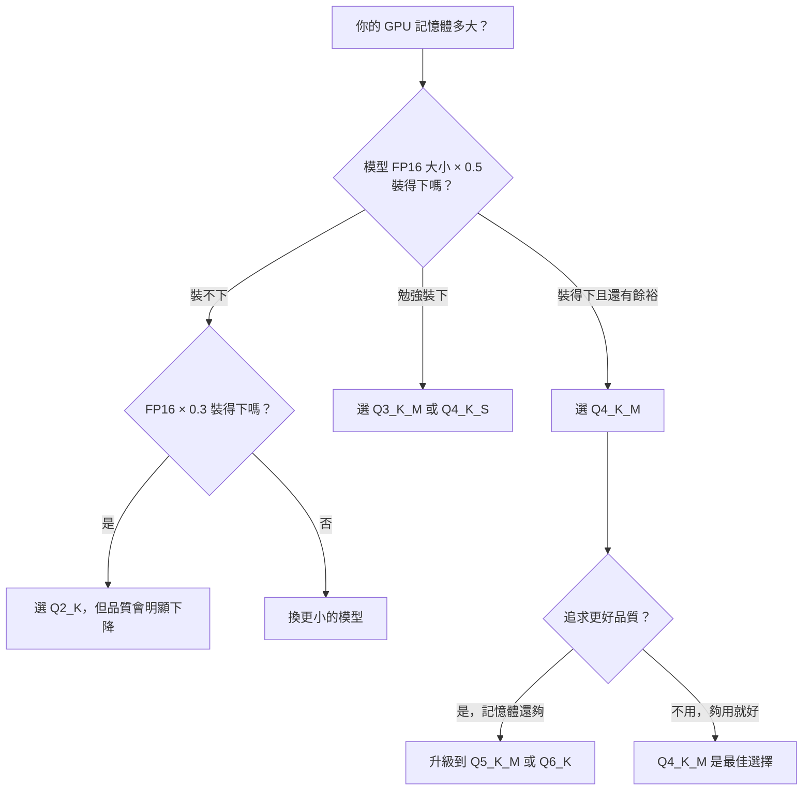

# 模型量化與 GGUF 格式快速學習指南

> 這份指南幫助你理解「量化」和「GGUF」— 讓大型語言模型塞進消費級硬體的關鍵技術。
> 讀完後你將能看懂量化等級命名、知道怎麼選擇適合自己硬體的量化版本。

---

## 目錄

- [1. 什麼是量化？](#1-什麼是量化)
- [2. 為什麼需要量化？](#2-為什麼需要量化)
- [3. 量化等級比較](#3-量化等級比較)
- [4. K-quant 命名規則](#4-k-quant-命名規則)
- [5. 怎麼選量化等級](#5-怎麼選量化等級)
- [6. GGUF 格式是什麼](#6-gguf-格式是什麼)
- [7. 模型下載來源](#7-模型下載來源)
- [8. 量化的實際操作](#8-量化的實際操作)
- [9. 常見問題排查](#9-常見問題排查)

---

## 1. 什麼是量化？

模型訓練完成後，每個參數是一個**浮點數**（例如 `0.00382471`）。這些數字原本用 16-bit（2 bytes）或 32-bit（4 bytes）的精度儲存，非常精確但也非常佔空間。

**量化（Quantization）** 就是把這些高精度的數字「四捨五入」成更粗略的格式，用更少的位元來表示。

打個比方：
- **原始精度（FP16）**：溫度是 23.847°C — 精確到小數點後三位
- **量化後（Q4）**：溫度大約 24°C — 只保留整數，但夠用了

模型參數也是一樣。大多數參數不需要那麼精確，稍微「四捨五入」不會顯著影響模型的輸出品質。

---

## 2. 為什麼需要量化？

因為原始模型太大了，一般電腦裝不下。

以 Qwen3-Coder-Next（79.7B 參數）為例：

| 精度 | 每參數大小 | 模型總大小 | 能跑嗎？（64 GB 記憶體） |
|---|---|---|---|
| FP32（全精度） | 4 bytes | ~319 GB | 完全不行 |
| FP16（半精度） | 2 bytes | ~159 GB | 不行 |
| Q8_0（8-bit） | ~1 byte | ~80 GB | 勉強，記憶體全佔滿 |
| **Q4_K_M（4-bit）** | ~0.5 byte | ~41 GB | **可以，還有餘裕** |
| Q2_K（2-bit） | ~0.3 byte | ~24 GB | 輕鬆，但品質明顯下降 |

量化讓原本需要 159 GB 的模型壓縮到 41 GB，而品質幾乎沒有損失。這就是為什麼本地推理幾乎都使用量化模型。

---

## 3. 量化等級比較

以下是 llama.cpp 支援的主要量化等級，從最高品質到最低品質排列：

| 量化類型 | 每參數位元數（bpw） | 品質 | 適用場景 |
|---|---|---|---|
| **Q8_0** | ~8.5 bpw | 幾乎無損 | 記憶體充足時的首選 |
| **Q6_K** | ~6.6 bpw | 非常高 | 品質優先，記憶體較充裕 |
| **Q5_K_M** | ~5.7 bpw | 高 | 品質與大小的好平衡 |
| **Q5_K_S** | ~5.6 bpw | 高 | 比 M 版稍小 |
| **Q4_K_M** | ~4.9 bpw | 中高（推薦） | **最常用的量化等級** |
| **Q4_K_S** | ~4.7 bpw | 中高 | 比 M 版稍小 |
| **Q3_K_M** | ~4.3 bpw | 中 | 記憶體緊張時的選擇 |
| **Q3_K_S** | ~3.6 bpw | 中低 | 犧牲品質換空間 |
| **Q2_K** | ~3.2 bpw | 低 | 極端壓縮，品質損失明顯 |

> **bpw = bits per weight**，每個參數用多少位元儲存。原始 FP16 是 16 bpw。

### 品質損失有多大？

以 perplexity（困惑度，越低越好）為指標，相對 FP16 的品質：

```
Q8_0:   99% 品質保留 — 幾乎看不出差異
Q6_K:   98% 品質保留 — 極小損失
Q4_K_M: 95-97% 品質保留 — 日常使用完全夠用
Q3_K_M: 90-93% 品質保留 — 開始能感覺到差異
Q2_K:   80-85% 品質保留 — 明顯變笨
```

這就是為什麼 **Q4_K_M 是最受歡迎的量化等級** — 它在品質和大小之間取得了最佳平衡。

---

## 4. K-quant 命名規則

量化等級的命名看起來像亂碼（`Q4_K_M`），但其實有規律：

```
Q4_K_M
│ │ │
│ │ └── 大小等級：S（Small）/ M（Medium）/ L（Large）
│ └──── 演算法：K = k-quant（較新、較智慧的量化方法）
└────── 位元數：4-bit 量化
```

### 各部分解釋

**第一部分 — 位元數（Q2 / Q3 / Q4 / Q5 / Q6 / Q8）**

每個參數用多少位元儲存。數字越大，精度越高，檔案也越大。

**第二部分 — 演算法（K）**

`K` 代表 **k-quant** 演算法。這是 llama.cpp 開發的一種「智慧量化」方法 — 它不是把所有參數用同樣的位元數壓縮，而是根據每層參數的重要程度，給重要的層更高精度、不重要的層更低精度。

沒有 `K` 的量化（如 `Q8_0`、`Q4_0`）是早期的「均勻量化」，所有層用同樣精度。K-quant 在同樣大小下品質更好。

**第三部分 — 大小等級（S / M / L）**

在同一個位元數內的精細調整：
- **S（Small）**：更積極壓縮，檔案小，品質稍差
- **M（Medium）**：平衡選擇（最常用）
- **L（Large）**：較保守壓縮，檔案大，品質稍好

### 常見量化等級速查

| 名稱 | 白話翻譯 |
|---|---|
| Q4_K_M | 4-bit 智慧量化，中等大小 — **最常用** |
| Q4_K_S | 4-bit 智慧量化，小一點 |
| Q5_K_M | 5-bit 智慧量化，中等大小 — 品質更好但更大 |
| Q8_0 | 8-bit 均勻量化 — 幾乎無損 |
| Q2_K | 2-bit 智慧量化 — 極端壓縮 |

---

## 5. 怎麼選量化等級

### 決策流程



### 簡單原則

1. **記憶體夠用就選 Q4_K_M** — 這是社群公認的最佳平衡點
2. **記憶體很充裕？升級到 Q5_K_M 或 Q6_K** — 多花記憶體換更好品質
3. **記憶體緊張？降級到 Q3_K_M** — 犧牲一些品質換空間
4. **千萬別用 Q2_K 除非別無選擇** — 品質損失太大
5. **與其用大模型的低量化，不如用小模型的高量化** — 例如 70B Q2 通常不如 32B Q4

### llmfit 的建議

llmfit 會根據你的硬體自動推薦最佳量化。例如 M3 Max 64 GB 跑 Qwen3-Coder-Next，它推薦 Q4_K_M 並給出 99/100 的適配分數 — 意思是這個組合非常合適。

---

## 6. GGUF 格式是什麼

### 一句話解釋

**GGUF（GPT-Generated Unified Format）** 是目前本地推理最通用的模型檔案格式，由 llama.cpp 專案定義和維護。

### 為什麼需要統一格式？

模型訓練完成後，原始權重的儲存格式五花八門（PyTorch 的 `.bin`、Safetensors 的 `.safetensors`）。這些格式是為訓練設計的，直接拿來推理效率不高。

GGUF 格式專門為**推理最佳化**，它把以下資訊全部打包在一個檔案裡：

| 包含的內容 | 說明 |
|---|---|
| 模型權重 | 已經量化好的參數 |
| 模型架構資訊 | 層數、維度、attention head 數量等 |
| Tokenizer | 把文字轉成 token 的工具 |
| 量化資訊 | 用了什麼量化方法 |
| 其他中繼資料 | 作者、授權、訓練資訊等 |

### GGUF 的優點

- **一個檔案搞定** — 不用另外下載 tokenizer 或設定檔
- **跨平台** — 同一個 GGUF 檔可以在 Ollama、llama.cpp、LM Studio 上跑
- **高效載入** — 格式設計讓模型可以快速載入記憶體（支援 mmap）
- **社群標準** — 幾乎所有本地推理工具都支援

### GGUF 的前身

```
GGML → GGMF → GGJT → GGUF
```

GGUF 是最新版，解決了之前格式的各種問題。如果你看到 `.ggml` 結尾的檔案，那是舊格式，建議用 GGUF 版本。

---

## 7. 模型下載來源

### Hugging Face

模型的「GitHub」，幾乎所有開源模型都在這裡。你可以在 Hugging Face 上找到同一個模型的各種量化版本。

### 常見的 GGUF 提供者

| 提供者 | 說明 | 特點 |
|---|---|---|
| **unsloth** | 專注量化最佳化的團隊 | 提供各種量化等級，品質穩定 |
| **ggml-org** | GGUF 格式的官方維護者 | 最權威的來源 |
| **TheBloke**（已較少更新） | 早期最知名的量化提供者 | 歷史模型量化版本豐富 |
| **bartowski** | 社群活躍的量化貢獻者 | 覆蓋新模型速度快 |

### 下載方式

**透過 Ollama（最簡單）：**
```bash
ollama pull qwen3:latest
```
Ollama 會自動下載適合你硬體的量化版本。

**透過 llmfit：**
```bash
llmfit download unsloth/Qwen3-Coder-Next-GGUF --quant Q4_K_M
```
指定下載特定量化等級。

**透過 Hugging Face 直接下載：**

在 Hugging Face 頁面找到 GGUF 檔案（通常命名如 `model-Q4_K_M.gguf`），直接下載。

---

## 8. 量化的實際操作

### 你通常不需要自己做量化

社群已經幫大多數模型做好各種量化版本了。你只需要**下載**對應的 GGUF 檔即可。

### 如果你真的需要自己量化

使用 llama.cpp 的 `llama-quantize` 工具：

```bash
# 先把模型轉成 GGUF 格式
python convert_hf_to_gguf.py /path/to/model/

# 再做量化
./llama-quantize input-f16.gguf output-Q4_K_M.gguf Q4_K_M
```

還可以使用 **importance matrix（imatrix）** 來提升量化品質 — 它會根據模型在實際資料上的表現，決定哪些參數更重要，給予更高精度：

```bash
# 使用 imatrix 提升量化品質
./llama-quantize --imatrix imatrix.dat input.gguf output.gguf Q4_K_M
```

---

## 9. 常見問題排查

### 下載了 GGUF 檔但不知道怎麼用

- **用 Ollama**：`ollama create my-model -f Modelfile`（Modelfile 裡指定 GGUF 路徑）
- **用 llama.cpp**：`./llama-cli -m model.gguf -p "Hello"`
- **用 LM Studio**：直接把 GGUF 檔拖進去

### 不確定該下載哪個量化版本

1. 先看你有多少可用記憶體
2. 預設選 Q4_K_M
3. 如果記憶體充裕，試試 Q5_K_M 或 Q6_K
4. 如果記憶體不夠，降到 Q3_K_M

### 量化後模型輸出品質變差

- 確認不是 Q2_K — 這個等級品質損失本來就大
- 試試升級到 Q5_K_M 或 Q6_K
- 確認模型來源可靠（從 unsloth 或 ggml-org 下載）

---

## 相關指南

- [本地 LLM 推理入門指南](Local_LLM_Inference_Guide.md) — 本地推理的基礎概念
- [Ollama 實戰指南](Ollama_Guide.md) — 用 Ollama 跑量化模型
- [MLX 入門指南](MLX_Guide.md) — Apple Silicon 上的替代推理引擎
