# 第1章 基於基礎模型構建AI應用入門
如果只能用一個詞來描述2020年後的AI，那就是**規模**（scale）。像ChatGPT、Gemini和Midjourney等應用背後的AI模型規模如此龐大，以至於它們消耗了全球電力的相當一部分，同時甚至面臨著耗盡公開可用的網際網路資料的風險。

AI模型的規模擴大帶來了兩個主要影響。其一，AI模型變得更加強大，能夠完成更多任務，進而催生更多的應用。越來越多的人和團隊利用AI提高生產力、創造經濟價值並改善生活質量。

- 業內經常將大語言模型簡稱為大模型，但本書中的大模型（large model）包括大語言模型（LLM）和多模態大模型（LMM），兩者一起即後文提到的“基礎模型”。對於“大語言模型”，本書保留全稱，或者使用英文縮寫LLM。——編者注

其二，訓練大語言模型（large language model，LLM）
 [ *](#footnote-10-36)需要大量資料、算力以及專業人才，而這些資源只有少數組織能夠負擔得起。這促使**模型即服務**（model as a service，MaaS）興起：由少數組織開發的模型以服務的形式提供給其他人使用。現在，任何希望利用AI構建應用的人都可以使用這些模型，而無須提前投入資源自行開發模型。

簡而言之，對AI應用的需求增加了，而構建AI應用的門檻降低了。這使得**AI工程**——基於現成模型構建應用——成為增長最快的工程學科之一。

基於ML模型構建應用並不是新鮮事。在LLM興起之前，AI早已驅動了許多應用，包括產品推薦、欺詐檢測和客戶流失預測。儘管將AI應用投入生產的許多原則保持不變，但新一代大規模、現成可用的模型帶來了新的可能性和新的挑戰，這正是本書關注的重點。

本章首先概述基礎模型，它們是推動AI工程迅速發展的關鍵催化劑。接下來，我會討論一系列成功的AI應用案例，每個案例都說明了AI擅長的和暫時還不擅長的領域。AI的能力每天都在擴展，預測其未來的可能性變得越來越困難。然而，現有的應用模式可以幫助我們發現當前的機會，併為AI未來的應用方式提供線索。

- 在本書中，我使用傳統ML來指代所有基礎模型之前的ML。

在本章的結尾，我將概述新的AI技術棧，包括基礎模型帶來了哪些變化，哪些方面保持不變，以及今天的AI工程師與傳統ML工程師角色有何不同。

## 1.1 AI工程的興起
基礎模型源自大語言模型，而大語言模型最初只是普通的語言模型。儘管像ChatGPT和GitHub Copilot這樣的應用給人以“橫空出世”的感覺，但它們實際上是數十年技術進步的成果，最早的語言模型可以追溯到20世紀50年代。本節將回顧從語言模型到AI工程演變過程中的關鍵突破。

### 1.1.1 從語言模型到大語言模型
儘管語言模型已經存在了一段時間，但沒有**自監督**方法的出現，它們就無法發展到今天的規模。本節將簡要介紹語言模型和自監督的含義。如果你已經熟悉這些內容，可以跳過。

**1. 語言模型**

**語言模型**對一種或多種語言的統計資訊進行編碼。直觀地說，這些資訊告訴我們一個詞在特定上下文中出現的可能性。例如，給定上下文“My favorite color is _____”（我最喜歡的顏色是____），一個英語語言模型預測blue（藍色）出現的可能性比car（車）更大。

語言的統計特性早在幾個世紀前就被發現了。在1905年的故事《跳舞的人》中，夏洛克·福爾摩斯利用英語的簡單統計資訊，破解了一系列神秘的火柴人符號。由於英語中最常見的字母是e，福爾摩斯推斷最常出現的火柴人符號一定代表字母e。

後來，Claude Shannon在第二次世界大戰期間使用更復雜的統計方法破譯敵方電文。他關於如何對英語建模的研究成果發表在1951年的里程碑式論文“Prediction and Entropy of Printed English”中。這篇論文中提出的許多概念，包括熵（entropy），至今仍被用於語言建模。

早期的語言模型通常只涉及一種語言。然而，如今的語言模型可以涵蓋多種語言。

- 在本書中，token未翻譯，使用原始英文；在圖靈的其他大模型圖書中，token在大多數情況下譯為“詞元”。——編者注

- 對於非英語語言，有時一個Unicode字元可能會被表示為多個token。

語言模型的基本單位是token。根據模型的不同，一個token可以是一個字元、一個單詞，或者一個單詞的一部分（例如-tion）。例如，ChatGPT背後的模型GPT-4將短句“I can't wait to build awesome AI applications”（我等不及建立超棒的AI應用了）分成了9個token，如圖1-1所示。注意，在這個例子中，單詞can't被分成了兩個token：can和't。你可以在OpenAI的網站上檢視不同OpenAI模型如何對文字進行分詞。

> **圖片描述：GPT-4 分詞範例。句子 "I can't wait to build awesome AI applications" 被分成9個不同顏色的 token。**

圖1-1：GPT-4對短句進行分詞的範例

將原始文字拆分成token的過程稱為分詞（tokenization）。對於GPT-4，一個token的平均長度大約是一個單詞長度的

> **圖片描述：數學分數 3/4，表示一個 token 的平均長度約為一個英文單詞長度的四分之三。**。因此，100個token大約相當於75個單詞。

模型能夠處理的所有token的集合稱為模型的**詞表**（vocabulary）。你可以用少量的token構建大量不同的單詞，這類似於用字母表中的字母構建許多單詞。Mixtral 8x7B模型的詞表大小為32,000個token，GPT-4的詞表大小為100,256個token。分詞方法和詞表大小由模型開發者決定。

> **圖片描述：O'Reilly 書籍裝飾圖示，藍色烏鴉剪影。**

 為什麼語言模型以token，而不是單詞或字元為單位？主要有以下三個原因。

1. 與字元相比，token允許模型將單詞拆分為有意義的組成部分。例如，cooking可以拆分為cook和ing，這兩個部分都攜帶了原單詞的一些含義。

2. 因為token數比單詞數少，這減小了模型的詞表，使模型更加高效（第2章會討論）。

3. token還能幫助模型處理未知單詞。例如，一個虛構的單詞chatgpting可以拆分為chatgpt和ing，幫助模型理解其結構。token在數量上比單詞少，同時又比單個字元攜帶更多的含義，實作了二者之間的平衡。

語言模型主要有兩種類型：**掩碼語言模型**（masked language model）和**自回歸語言模型**（autoregressive language model）。它們的區別在於預測一個token時所能使用的資訊。

**掩碼語言模型**

掩碼語言模型透過上下文資訊（即缺失token前後的內容）來預測序列中任意位置缺失的token。本質上，掩碼語言模型的訓練目標就是填空。例如，給定上下文“My favorite _____ is blue”（我最喜歡的_____是藍色），掩碼語言模型應預測空白處最可能的詞是color。一個著名的掩碼語言模型範例是BERT（bidirectional encoder representations from transformers，基於Transformer的雙向編碼器表示），參見Devlin等在2018年發表的論文“BERT: Pre-training of Deep Bidirectional Transformers for Language Understanding”。

截至本書撰寫時，掩碼語言模型通常用於情感分析和文字分類等非生成任務。它們也適用於需要理解整體上下文的任務，例如程式碼除錯，這類任務要求模型同時理解程式碼前後的內容以識別錯誤。

**自回歸語言模型**

- 自迴歸語言模型有時也被稱為因果語言模型（causal language model）。

- 從技術上講，像BERT這樣的掩碼語言模型，雖然並不擅長文字生成，但經過一些處理，也可以用於文字生成。

自迴歸語言模型僅利用前序token來預測序列中的下一個token。例如，它會預測“My favorite color is _____”中空白處接下來可能出現的token。自迴歸語言模型可以連續地逐個生成token。目前，自迴歸語言模型是文字生成任務的首選模型，因此比掩碼語言模型更受歡迎。

圖1-2展示了這兩種語言模型。

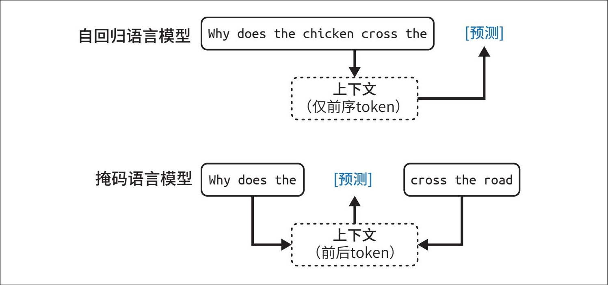

> **圖片描述：自迴歸語言模型與掩碼語言模型的對比示意圖。上方為自迴歸語言模型僅利用前序 token 預測；下方為掩碼語言模型利用前後 token 預測缺失部分。**

圖1-2：自迴歸語言模型與掩碼語言模型

> **圖片描述：O'Reilly 書籍裝飾圖示，藍色烏鴉剪影。**

 在本書中，除非明確說明，否則語言模型均指自迴歸語言模型。

語言模型的輸出是開放式的。語言模型可以利用其固定且有限的詞表，構建出無限種可能的輸出。能夠生成開放式輸出的模型被稱為**生成式**模型，因此出現了**生成式**AI（generative AI）這一術語。

你可以將語言模型看作一種**補全機器**：給定一段文字（提示詞），它會嘗試補全該文字。以下是一個範例。

提示詞（來自使用者）：To be or not to be

補全（來自語言模型）：，that is the question.

需要注意的是，補全結果是基於機率的預測，並不能保證正確。這種語言模型的機率特性讓人們在實際使用過程中既愛又恨。我們將在第2章進一步探討這一點。

儘管聽起來很簡單，但補全功能非常強大。許多工，包括翻譯、摘要、程式設計和解決數學問題，都可以被視作補全任務。例如，給定提示“How are you in French is …”（“你好嗎”在法語中是……），語言模型可能會將其補全為“Comment ça va”，從而有效地實作了語言之間的翻譯。

再舉一個例子，給定提示詞：

Question: Is this email likely spam? Here's the email: <email content>

Answer:

語言模型可能會將其補全為“Likely spam”（很可能是垃圾郵件），這樣就將語言模型轉變成了垃圾郵件分類器。

雖然補全功能很強大，但補全並不等同於進行對話。例如，你向一臺補全機器提出問題，它可能會透過新增另一個問題來補全你的話，而不是回答你的問題。2.3節將討論如何讓模型適當地回應使用者的請求。

**2. 自監督**

語言建模只是眾多ML演算法中的一種。此外，還有用於目標檢測、主題建模、推薦系統、天氣預報、股票價格預測等的模型。那麼，為什麼偏偏是語言模型成為規模化方法的核心，並最終引爆了ChatGPT時刻呢？

答案是語言模型可以透過**自監督**的方式進行訓練，而許多其他模型則需要**監督**訓練。監督訓練是指使用標註好的資料來訓練ML演算法的過程，而獲取這些標註資料通常成本高昂且耗時較長。自監督訓練有助於突破這種資料標註的瓶頸，從而能夠建立更大的資料集供模型學習，有效地實作了模型的規模化擴展。具體解釋如下。

在監督訓練中，你需要對範例進行標註，以展示你希望模型學習的行為，然後用這些範例來訓練模型。模型訓練完成後，就可以應用於新的資料了。例如，要訓練一個欺詐檢測模型，你需要使用帶有“欺詐”或“非欺詐”標籤的交易範例。一旦模型從這些範例中完成了學習，就可以使用該模型來預測某筆交易是否屬於欺詐。

21世紀10年代AI模型的成功主要依賴監督學習。開啟深度學習革命的模型AlexNet（Krizhevsky等，“ImageNet Classification with Deep Convolutional Neural Networks”，2012）就是一種監督學習模型。經過訓練，AlexNet可識別ImageNet資料集中的100多萬張圖片，並將每張圖片歸類為1000個類別之一，例如“汽車”“氣球”或“猴子”。

- 實際的資料標註成本取決於多種因素，包括任務複雜性、資料規模（通常資料集越大，每個樣本的成本越低）以及標註服務提供商。例如，截至2024年9月，Amazon SageMaker Ground Truth對少於5萬張圖片的標註收費為每張8美分，而超過100萬張圖片時，每張僅收費2美分。

監督學習的一個缺點是資料標註成本高、耗時長。如果標註一張圖片的成本是5美分，那麼為ImageNet標註100萬張圖片就需要花費5萬美元。如果你希望每張圖片由兩個人分別標註，以便交叉檢查標註質量，那麼成本就會翻倍。由於現實世界中的物體遠遠超過1000種，如果想要擴展模型的能力以識別更多物體，就需要新增更多類別的標籤。如果擴展到100萬個類別，僅標註成本就會增加到5000萬美元。

標註日常物體是一項大多數人無須專門訓練就能完成的任務，因此成本相對較低。然而，並非所有標註任務都如此簡單。例如，為英語-拉丁語翻譯模型生成拉丁語譯文的成本更高；而判斷CT掃描影像中是否存在癌症跡象，其標註成本則可能高得驚人。

自監督學習有助於突破資料標註的瓶頸。在自監督學習中，模型不需要人工標註的標籤，而是可以直接從輸入資料中自行推斷標籤。語言建模就是一種自監督學習，因為每個輸入序列同時提供了標籤（待預測的token）和用於預測這些標籤的上下文。例如，句子“I love street food.”（我喜歡街頭小吃。）可以產生6個訓練樣本，如表1-1所示。

表1-1：句子“I love street food.”用於語言建模的訓練樣本

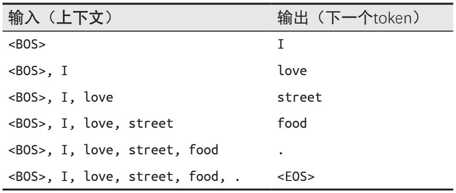

> **圖片描述：語言建模訓練範例表格。以句子 "I love street food." 為例，展示6個訓練樣本，每步從上下文預測下一個 token。**

> **圖片描述：O'Reilly 書籍裝飾圖示，藍色烏鴉剪影。**
- 這類似於人類知道何時停止講話的重要性。

在表1-1中，<BOS>和<EOS>分別標記序列的開始和結束。這些標記對於語言模型處理多個序列是必需的。模型通常將每個標記視為一個特殊的token。尤其是序列結束標記<EOS>非常重要，它能夠幫助語言模型判斷何時結束響應。

 自監督學習不同於無監督學習。在自監督學習中，標籤是從輸入資料中推斷出來的；而在無監督學習中，則根本不需要標籤。

自監督學習意味著語言模型可以直接從文字序列中學習，而不需要任何標註。由於文字序列隨處可見——書籍、部落格文章、新聞報道以及Reddit評論等，因此可以構建大量的訓練資料，使語言模型能夠擴展為LLM。

- 在學校裡，我學到的模型引數包括模型權重和模型偏置。然而，如今我們通常用模型權重來指代所有引數。

然而，LLM並不是一個嚴格的科學術語。一個語言模型究竟要多大才算**大**？今天被認為大的模型，明天可能就會被視為小。通常，模型的大小以其**參數**（parameter）量來衡量。引數是ML模型中的變數，在訓練過程中不斷更新。一般來說，模型引數越多，其學習指定行為的能力就越強。

- 模型擁有1.17億個引數，我們稱該模型為1.17億引數模型，或者模型引數規模為1.17億。——編者注

2018年6月，OpenAI發布了首個GPT（generative pre-trained transformer，生成式預訓練Transformer）模型，擁有1.17億個引數，當時被認為是很大的模型。到了2019年2月，OpenAI推出了擁有15億個引數的GPT-2，1.17億個引數的模型便降級為小模型了。在撰寫本書時，模型引數達到千億級才稱得上大模型。或許有一天，這個規模也會被認為很小。

- 更大的模型需要更多訓練資料，這似乎有些違反直覺。如果一個模型更強大，難道不應該用更少的樣本就能學習嗎？實際上，我們並不是要用相同的資料讓一個大模型達到小模型的效能水平，而是要儘可能提高模型的效能。

在進入下一節之前，我想先討論一個通常被視為理所當然的問題：**為什麼更大的模型需要更多的資料**？更大的模型擁有更強的學習能力，因此需要更多的訓練資料來最大化其效能。雖然你也可以用小資料集來訓練大模型，但這樣做會浪費計算資源。使用較小的模型在這個資料集上可能獲得相似甚至更好的結果。

### 1.1.2 從大語言模型到基礎模型
儘管語言模型能夠完成令人驚歎的任務，但它們的能力僅限於文字。作為人類，我們不僅透過語言文字，還透過視覺、聽覺、觸覺來感知世界。AI要在現實世界中發揮作用，處理文字之外的資料是必不可少的。

正因如此，語言模型正逐步擴展，以涵蓋更多的資料模態。GPT-4V和Claude 3能夠理解影像和文字，一些模型甚至還能理解影片、3D資源、蛋白質結構等。將更多的資料模態整合到語言模型中，可以使其變得更加強大。OpenAI在2023年發表的論文“GPT 4V(ision) System Card”中指出：“將額外的模態（如影像輸入）整合到LLM中，被一些人視為AI研究與開發的關鍵前沿。”

儘管許多人仍然將Gemini和GPT-4V稱為LLM，但對其更準確的稱呼應是**基礎模型**（Bommasani等，“On the Opportunities and Risks of Foundation Models”，2021）。**基礎**一詞體現了這些模型在AI應用中的重要性，也表明了可以將它們作為基礎，進一步構建以滿足不同的需求。

基礎模型標誌著AI研究對傳統結構的一次突破。長期以來，AI研究一直按照資料模態劃分：自然語言處理（natural language processing，NLP）只處理文字，電腦視覺只處理視覺。純文字模型可用於翻譯和垃圾郵件檢測等任務，純影像模型可用於目標檢測和影像分類，純音訊模型則可用於語音識別（語音轉文字，speech-to-text，STT）和語音合成（文字轉語音，text-to-speech，TTS）。

能夠處理多種資料模態的模型稱為**多模態模型**（multimodal model）。生成式多模態模型也稱為多模態大模型（large multimodal model，LMM）。語言模型在生成下一個token時僅基於文字token，而多模態模型則基於文字和影像（或模型支援的其他模態）token生成下一個token，如圖1-3所示。

> **圖片描述：多模態模型架構示意圖。文本 token 和視覺 token 匯入多模態模型，輸出下一個 token "Puppy"。**

圖1-3：多模態模型可以同時利用文字和視覺token的資訊生成下一個token

與語言模型一樣，多模態模型也需要資料來實作規模擴展。自監督學習同樣適用於多模態模型。例如，OpenAI使用了一種稱為**自然語言監督**的自監督學習來訓練他們的語言-影像模型CLIP（OpenAI，“CLIP: Connecting text and images”，2021）。他們並沒有為每張圖片手動生成標籤，而是在網際網路上尋找同時出現的（影像，文字）對。透過這種方式，他們構建了一個包含4億個（影像，文字）對的資料集，其規模是ImageNet資料集的400倍，且無人工標註成本。藉助這個資料集，CLIP成為首個不需要額外訓練即可泛化到多個影像分類任務的模型。

> **圖片描述：O'Reilly 書籍裝飾圖示，藍色烏鴉剪影。**

 本書使用“基礎模型”這一術語來指代大語言模型和多模態大模型。

需要注意的是，CLIP並不是生成式模型——它並非被訓練用於生成開放式輸出。CLIP是一種**嵌入模型**（embedding model），訓練目標是生成文字和影像的聯合嵌入（joint embedding）。3.3.3節將詳細討論嵌入的概念。目前，你可以將嵌入理解為旨在捕捉原始資料含義的向量。像CLIP這樣的多模態嵌入模型是生成式多模態模型（如Flamingo、LLaVA和Gemini，Gemini之前稱為Bard）的基礎。

基礎模型也標誌著從特定任務模型向通用模型的轉變。過去，模型通常是針對特定任務開發的，比如情感分析或翻譯。一個為情感分析訓練的模型無法進行翻譯任務，反之亦然。

**而基礎模型由於其規模和訓練方式，能夠勝任廣泛的任務。**通用模型在未經調整的情況下，就能較好地完成許多工。例如，LLM既能做情感分析，也能做翻譯。不過，通常可以對通用模型進行微調，使其在特定任務上的表現最優。

圖1-4展示了Super-NaturalInstructions基準（Wang等，“Super-NaturalInstructions: Generalization via Declarative Instructions on 1600+ NLP Tasks”，2022）用於評估基礎模型的任務，體現了基礎模型能夠執行的任務類型。

假設你正在與一家零售商合作，構建一個為其網站生成產品描述的應用。一個開箱即用的模型或許能夠生成準確的描述，但可能無法體現品牌的調性或突出品牌想要傳達的資訊，生成的營銷話術可能讓人感覺流於空泛。

你可以使用多種技術來引導模型生成你想要的內容。例如，你可以精心設計詳細的指令，並提供理想的產品描述範例，這種方法稱為**提示工程。**你還可以將模型連線到客戶評論資料函式庫，讓模型利用這些資訊生成更好的描述。這種利用資料函式庫補充指令的方法稱為**檢索增強生成**（RAG）。此外，你也可以在高質量的產品描述資料集上對模型進行進一步訓練，即**微調。**

提示工程、RAG和微調是三種非常常見的AI工程技術，你可以使用這些技術將模型調整至適合自己的需求。本書的其餘部分將詳細討論這些技術。

將現有的強大模型適配到你的任務上，通常比從零開始構建一個模型要容易得多——例如，可能只需10個樣本和一個週末，而不是100萬個樣本和6個月。基礎模型使得開發AI應用的成本更低，並縮短了產品上市的時間。具體需要多少資料來調整模型，取決於你使用的技術。本書在討論每種技術時，也會涉及這個問題。然而，針對特定任務構建模型仍然有很多優勢，例如，這些模型可能規模更小，從而更快、更便宜。

是自己構建模型，還是利用現有的模型，這是一個經典的“購買還是自建”（buy-or-build）的問題，團隊需要根據自身情況做出決策。本書中的討論將有助於你做出這一決定。

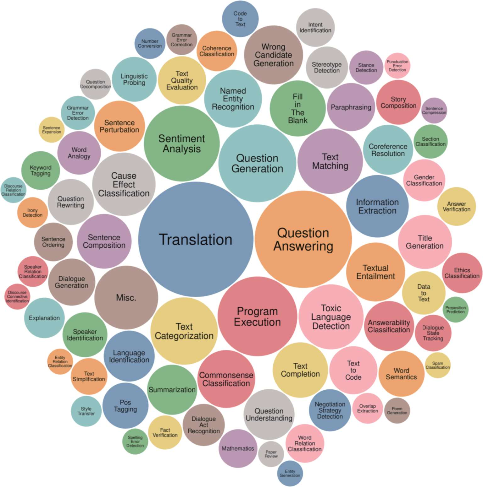

> **圖片描述：GPT-3 能夠執行的 NLP 任務氣泡圖。中心為翻譯和問答，周圍分佈情感分析、文字分類、程式執行、摘要等數十種任務。**

圖1-4：Super-NaturalInstructions基準中的任務範圍（Wang等，2022）

### 1.1.3 從基礎模型到AI工程
**AI工程**是指在基礎模型之上構建應用的過程。人們構建AI應用的歷史已經超過10年了——這一過程通常被稱為ML工程或MLOps（ML operations，機器學習運維）。那麼，為什麼我們現在要談論AI工程呢？

如果說傳統ML工程是圍繞“開發ML模型”展開的，那麼AI工程則是圍繞“利用已有模型”來構建應用。強大的基礎模型變得易於獲取和使用，推動了以下三個關鍵因素的形成，三者共同為AI工程這一新興學科的快速發展創造了理想條件。

**因素1：通用的AI能力**

基礎模型的強大之處不僅在於它們能更好地完成現有任務，還在於它們能勝任更多任務。過去認為不可能實作的應用現在已成為可能，以前未曾想到的應用如今也開始湧現，甚至今天認為不可能的應用，明天也可能成為現實。這使得AI覆蓋了更多生活場景，也促使AI應用的使用者群和需求大幅增長。

例如，由於AI現在的寫作能力已經達到甚至超過人類水平，它可以自動化或部分自動化所有需要溝通的任務，而幾乎所有任務都涉及溝通。AI被用於撰寫電子郵件、回覆客戶請求、解釋複雜合同。任何擁有電腦的人都可以使用AI工具，快速生成定製的高質量圖片和影片，製作營銷材料，編輯專業頭像，將藝術概念視覺化，為書籍繪製插圖，等等。AI甚至可以用於合成訓練資料、開發演算法和編寫程式碼，這些都將有助於未來訓練出更強大的模型。

**因素2：AI投資的增加**

ChatGPT的成功促使風險資本和企業對AI的投資大幅增加。隨著AI應用的構建成本降低、上市速度加快，AI的投資回報變得更具吸引力。企業紛紛加速將AI整合到自己的產品和流程中。Scribd公司應用研究高階經理Matt Ross告訴我，從2022年4月到2023年4月，對於他所在團隊的AI應用場景，AI成本已經大約降低了兩個數量級。

- 參見“AI investment forecast to approach $200 billion globally by 2025”。作為對比，美國公立中小學的總支出約為9000億美元，僅為預計AI投資的9倍。

高盛研究（Goldman Sachs Research）估計，到2025年，美國在AI領域的投資可能接近1000億美元，全球投資可能達到2000億美元。AI經常作為一種競爭優勢被提及。FactSet發現（參見“Highest Number of S&P 500 Companies Citing ‘AI' on Q2 EarningsCalls in Over 10 Years”），在2023年第二季度的財報電話會議中，三分之一的標普500公司提到了AI，這一比例是前一年的3倍。圖1-5顯示了2018年至2023年間在財報電話會議中提及AI的標普500公司的數量。

根據WallStreetZen的資料，在財報電話會議中提及AI的公司，其股價漲幅高於未提及AI的公司：前者平均上漲4.6%，而後者為2.4%（參見“Mention AI in earnings calls …and watch that share price leap”）。目前尚不清楚這是因果關係（AI使這些公司更成功）還是相關關係（公司之所以成功，是因為它們迅速適應了新技術）。

**因素3：構建AI應用的門檻降低**

由OpenAI和其他模型提供商推廣的模型即服務方式，使得利用AI構建應用變得更加容易。在這種方式下，模型透過API對外提供服務，接收使用者請求並返回模型輸出。如果沒有這些API，使用AI模型就需要自行搭建基礎設施來託管模型和提供服務。而現在，你只需透過簡單的API呼叫就能使用強大的模型。

不僅如此，AI還使得以極少的程式碼構建應用成為可能。首先，AI可以為你編寫程式碼，讓沒有軟體工程背景的人也能快速將想法轉化為程式碼，並呈現給使用者。其次，你可以直接用自然語言與這些模型互動，而無須使用程式語言。**現在，任何人——我是說任何人——都可以開發AI應用。**

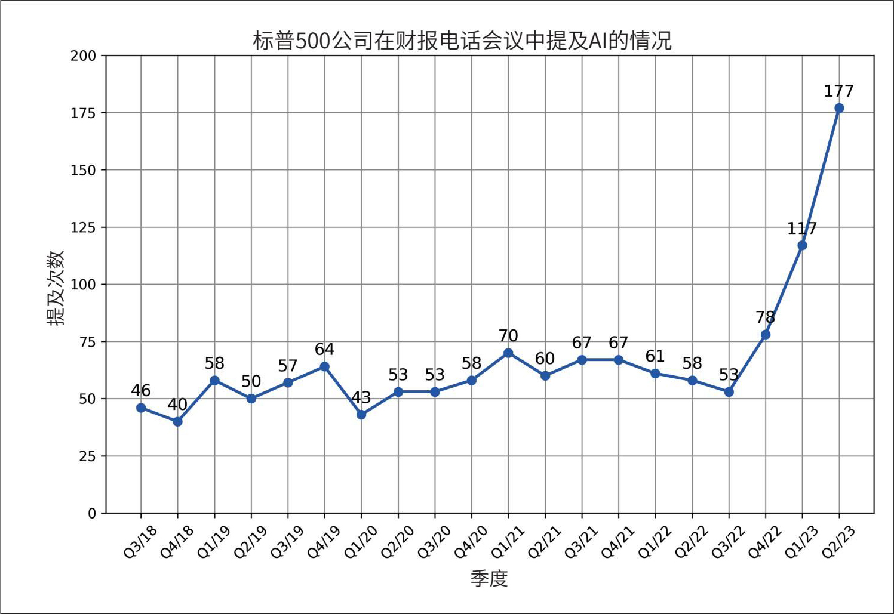

> **圖片描述：標普500公司在財報電話會議中提及 AI 的次數折線圖（Q3/18-Q2/23），2023年Q2急升至177次。**

圖1-5：在財報電話會議中提及AI的標普500公司數量在2023年達到歷史新高。資料來源：FactSet

由於開發基礎模型所需的資源巨大，目前只有大型企業（如谷歌、Meta、微軟、百度、騰訊）、政府（如日本、阿聯酋）以及資金充裕且雄心勃勃的初創公司（如OpenAI、Anthropic、Mistral）才有能力完成這一過程。在2022年9月的一次採訪中，OpenAI的CEO Sam Altman表示，對絕大多數人而言，最大的機遇在於將這些模型適配到具體的應用場景中（參見“AI for the Next Era”）。

世界迅速抓住了這一機遇。AI工程迅速崛起，成為增長最快的工程學科之一。AI工程工具的普及速度遠超以往任何軟體工程工具。在不到兩年的時間內，4個開源AI工程工具（AutoGPT、Stable Diffusion web UI、LangChain、Ollama）在GitHub上的星標數（star）已超過了比特幣專案，並有望超越包括React和Vue在內的最受歡迎的Web開發框架。圖1-6展示了AI工程工具與Vue、React等工具的GitHub星標數增長情況。

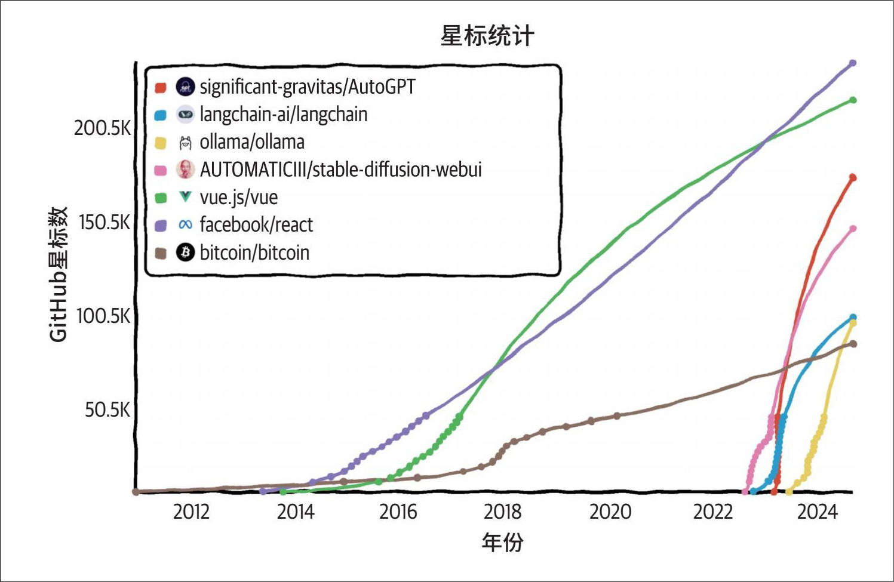

> **圖片描述：GitHub 星標統計折線圖（2012-2024），顯示 AutoGPT、LangChain、ollama 等 AI 專案在2023年後星標爆發性增長。**

圖1-6：根據GitHub星標數統計，開源AI工程工具的增長速度超過了其他任何軟體工程工具

LinkedIn在2023年8月的一項調查顯示，在個人資料中新增“生成式AI”“ChatGPT”“提示工程”和“提示詞設計”等術語的專業人士數量，每月平均增長75%（參見“Future of Work Report: AI at Work”）。C**o**m**p**u**t**e**r**W**o**r**l**d*則宣稱，“教AI如何表現是增長最快的職業技能”（參見“Teaching AI to behave is the fastest-growing career skill”）。

**為什麼使用“AI工程”這一術語**

目前有很多術語用來描述基於基礎模型構建應用的過程，包括“ML工程”“MLOps”“AIOps”“LLMOps”等。那麼，為什麼我在本書中選擇了“AI工程”這一術語呢？

我沒有選擇“ML工程”這一術語，因為正如1.4.2節所述，使用基礎模型與使用傳統ML模型存在幾個重要方面的差異。“ML工程”這一術語不足以體現這種區別。不過，要涵蓋這兩個過程，“ML工程”確實是一個很好的術語。

我沒有選擇所有以“Ops”結尾的術語，因為儘管這個過程確實包含一些運維（Ops）的成分，但更重要的是對基礎模型進行調整（工程），以實作你想要的功能。

最後，我調查了20位正在基於基礎模型開發應用的人，詢問他們會用什麼術語來描述自己的工作。大多數人更傾向於使用“AI工程”。我決定尊重大家的意見。

快速擴大的AI工程師社群展現出了非凡的創造力，開發出了眾多令人興奮的應用。下一節將探討一些最常見的應用模式。

## 1.2 基礎模型的應用場景
如果你還沒有開始構建AI應用，我希望前面的內容已經說服你，現在正是開始的絕佳時機。如果你已經有了應用構想，可以直接跳到1.3節。如果你正在尋找靈感，本節將介紹一系列經過行業驗證且前景廣闊的應用場景。

- 趣聞：截至2024年9月16日，“There's An AI For That”網站列出了16,814個AI，涵蓋了14,688項任務和4803種工作。

基於基礎模型構建的AI應用似乎無窮無盡。無論你想到什麼樣的應用場景，可能都有對應的AI應用。
 [ *](#footnote-10-46)要列出所有AI應用場景是不可能的。

即使嘗試對這些應用場景進行分類也是一項挑戰，因為不同的調研使用了不同的分類方法。例如，AWS（亞馬遜雲服務）將企業生成式AI應用場景分為3類：客戶體驗、員工的工作效率和流程最佳化（參見AWS網站“在組織中實作生成式人工智慧的商業價值”頁面）。2024年O'Reilly的一項調研則將應用場景分為8類：程式設計、資料分析、客戶支援、營銷文案、其他文案、研究、網頁設計和藝術（參見“Generative AI in the Enterprise”）。

一些組織，如德勤（Deloitte），則根據價值獲取方式對應用場景進行分類，例如降低成本、提升流程效率、促進增長和加速創新（參見德勤網站“The AI Dossier”頁面）。在價值獲取方面，Gartner還設立了一個“業務連續性”的類別，意味著如果組織不採用生成式AI，可能會面臨倒閉的風險（參見“Gartner Experts Answer the Top Generative AI Questions for Your Enterprise”）。在Gartner於2023年調研的2500名高管中，有7%的人表示業務連續性是他們採用生成式AI的動機。

Eloundou等對不同職業受AI影響的程度進行了出色的研究（“GPTs are GPTs: An Early Look at the Labor Market Impact Potential of Large Language Models”，2023）。他們將一項任務定義為“受影響”（exposed）的標準是，AI及AI驅動的軟體能夠將完成該任務所需的時間減少至少50%。如果一個職業的受影響程度為80%，意味著該職業80%的任務會受到影響。根據該研究，受影響程度達到或接近100%的職業包括口譯員和翻譯員、報稅員、網頁設計師和作家。其中的一些職業如表1-2所示。完全不受AI影響的職業包括廚師、石匠和運動員，這在意料之中。這項研究很好地展示了AI適合哪些應用場景。

表1-2：人工標註的AI受影響程度最高的職業。α*組表示直接受AI模型的影響，*β*組和*ζ*組表示受AI驅動的軟體的影響（Eloundou等，2023）

 *

（續）

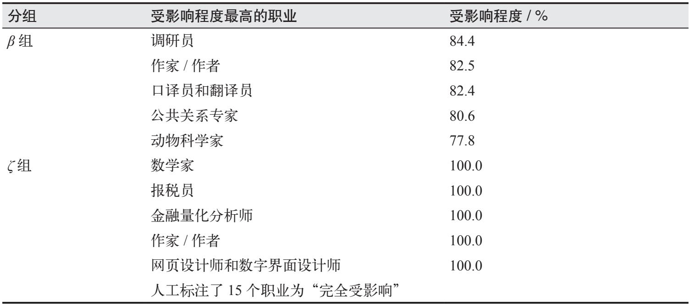

> **圖片描述：GPT 對各職業影響程度表格，數學家、報稅員等受影響程度達100%。**
- 探索不同的AI應用可能是我撰寫本書過程中最享受的事情之一。看到人們不斷構建出各種應用非常有趣。你可以在我維護的開源AI應用列表（參見Chip Huyen個人網站“Open Source LLM Tools”）中找到這些應用。該列表每12小時更新一次。

在分析應用場景時，我同時考察了消費級和企業級應用。為了理解消費級應用，我研究了205個在GitHub上至少擁有500個星標的開源AI應用。為了理解企業應用場景，我就AI戰略問題採訪了50家公司，並閱讀了超過100份案例研究。我將這些應用分為8類，如表1-3所示。此處列出的清單可作為參考。當你在第2章學習瞭如何構建基礎模型，以及在第3章學習瞭如何評估這些模型後，你將更清楚地瞭解基礎模型可以且應該應用於哪些場景。

表1-3：消費級應用和企業級應用中常見的生成式AI應用場景

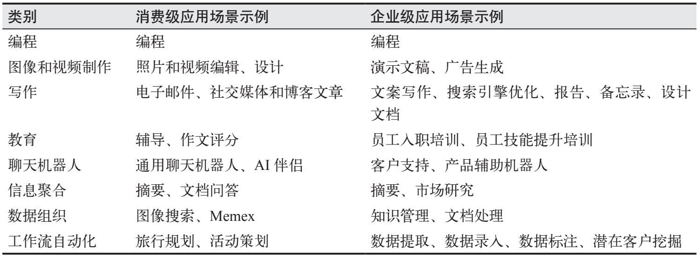

> **圖片描述：AI 應用場景分類表格，包含消費級與企業級的程式設計、影片製作、寫作、教育等場景。**

由於基礎模型具有通用性，基於這些模型構建的應用可以解決多種問題。這意味著一個應用可能屬於多個類別。例如，一個機器人既可以提供陪伴，也可以聚合資訊；一個應用可以幫助你從PDF中提取結構化資料，同時還能回答關於該PDF的問題。

圖1-7展示了205個開源應用中各類應用場景的分佈情況。需要注意的是，教育、資料組織和寫作類應用場景所佔的比例較小，並不意味著這些應用場景不受歡迎，而只是說明這些方面的應用並未普遍開源。這些應用的開發者可能認為它們更適合企業級應用場景。

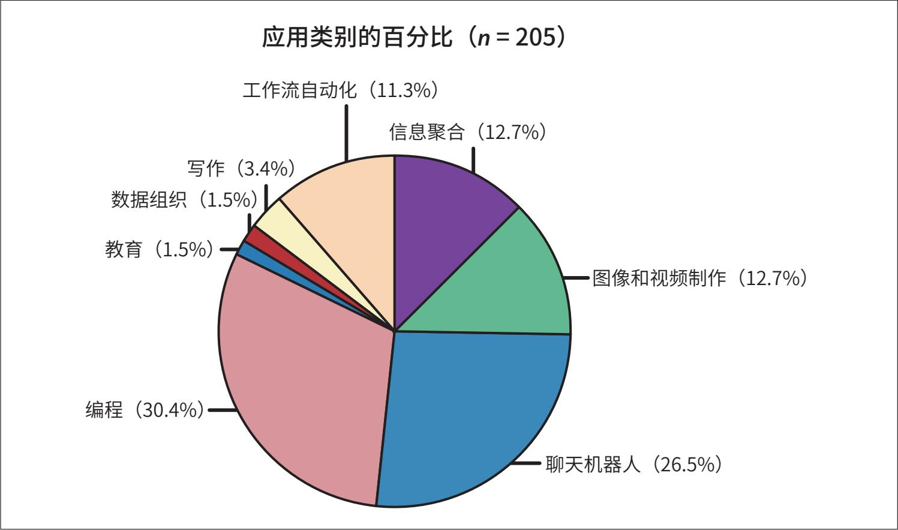

> **圖片描述：AI 應用類別圓餅圖（n=205），程式設計30.4%、聊天機器人26.5%為前兩大類。**

圖1-7：GitHub上205個開源倉函式庫中各類應用場景的分佈情況

企業界通常更傾向於風險較低的應用。例如，2024年a16z的一份增長報告（“16 Changes to the Way Enterprises Are Building and Buying Generative AI”）顯示，企業部署面向內部的應用（如內部知識管理應用），比部署面向外部的應用（如客服機器人）速度更快，如圖1-8所示。內部應用有助於企業發展自身的AI工程能力，同時最大程度地降低資料隱私、合規性以及災難性故障方面的風險。同樣，儘管基礎模型本身是開放式的，可以用於任何任務，但許多基於基礎模型構建的應用仍然是封閉式的，比如分類任務。分類任務更容易評估，因此風險也更易把控。

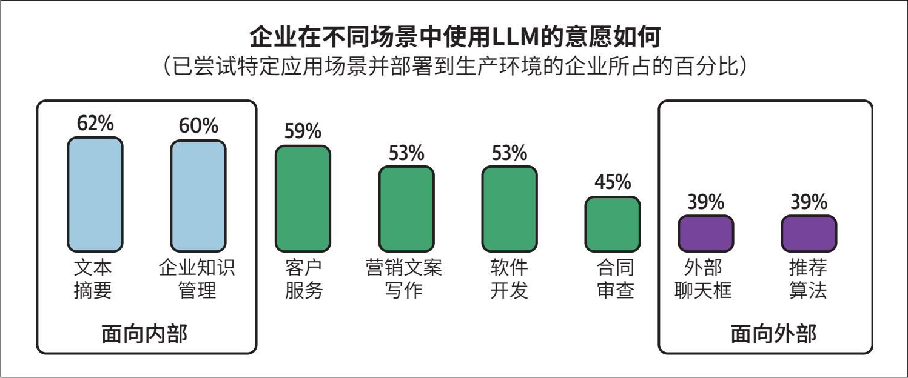

> **圖片描述：企業使用 LLM 意願長條圖，文本摘要62%和知識管理60%佔比最高。**

圖1-8：企業更願意部署面向內部的應用

即使已經看過幾百個AI應用，我每週仍然會發現令人驚訝的新應用。在網際網路發展的早期，很少有人預見到社交媒體會成為網際網路的主導應用場景。隨著我們逐漸掌握如何充分利用AI，未來占主導地位的應用場景可能同樣會出乎我們的意料。幸運的話，這將是一個令人驚喜的意外。

### 1.2.1 程式設計
在多項生成式AI調查中，程式設計無疑是最受歡迎的應用場景。AI程式設計工具之所以廣受歡迎，一方面是因為AI在程式設計方面表現出色，另一方面是因為早期的AI工程師本身就是程式設計師，他們更容易接觸程式設計領域的挑戰。

將基礎模型用於生產環境的早期成功案例之一是程式碼補全工具GitHub Copilot。該工具在推出僅兩年後，年度經常性收入就超過了1億美元（參見“Microsoft's GitHub AI Coding Assistant Exceeds $100 Million in Recurring Revenue”）。截至本書撰寫時，AI驅動程式設計的初創公司已籌集了數億美元資金，其中，Magic在2024年8月籌集了3.2億美元（參見“Generative AI coding startup Magic lands $320M investment from Eric Schmidt, Atlassian and others”），Anysphere同期籌集了6000萬美元（參見“Series A and Magic”）。開源程式設計工具如gpt-engineer和screenshot-to-code在一年內都在GitHub上獲得了5萬個星標，更多類似工具也在快速湧現。

除了通用程式設計輔助工具，還有許多專注於特定程式設計任務的工具。以下是一些任務範例及相應專案舉例。

·從網頁和PDF中提取結構化資料（如AgentGPT）。

·將自然語言轉換為程式碼（如DB-GPT、SQL Chat、PandasAI）。

·基於設計圖或截圖生成程式碼，使其渲染出與給定影像外觀一致的網站（如screenshot-to-code、draw-a-ui）。

·在不同程式語言或框架之間進行程式碼翻譯（如GPT-Migrate、AI Code Translator）。

·編寫文件（如Autodoc）。

·建立測試（如PentestGPT）。

·生成提交資訊（如AI Commits）。

顯然，AI可以完成許多軟體工程任務。但問題是，AI是否能夠實作軟體工程的完全自動化。對此，NVIDIA公司CEO黃仁勳預測AI將取代人類軟體工程師，並表示我們應該停止鼓勵孩子學習程式設計（參見“Jensen Huang says kids shouldn't learn to code — they should leave it up to AI”）。在一段洩露的錄音中，AWS的CEO Matt Garman也表示，在不久的將來，大部分開發人員將不再編寫程式碼。他並不是說軟體開發者會消失，而是指他們的工作內容將發生轉變（參見“In a leaked recording, Amazon cloud chief tells employees that most developers could stop coding soon as AI takes over”）。

然而與此同時，許多軟體工程師堅信自己永遠不會被AI取代，這種想法既有技術原因，也有情感原因（人們通常不願承認自己可以被取代）。

軟體工程包含許多工，AI在某些任務上表現更好。麥肯錫（McKinsey）的研究人員發現，AI可以幫助開發人員將文件編寫方面的生產力提高一倍，將程式碼編寫和程式碼重構方面的生產力提高25%到50%。但在高度複雜的任務中，生產力的提升則很有限，如圖1-9所示（參見“Unleashing developer productivity with generative AI”）。在我與AI程式設計工具開發者的交流中，許多人告訴我，他們注意到AI在前端開發方面的表現遠遠優於後端開發。

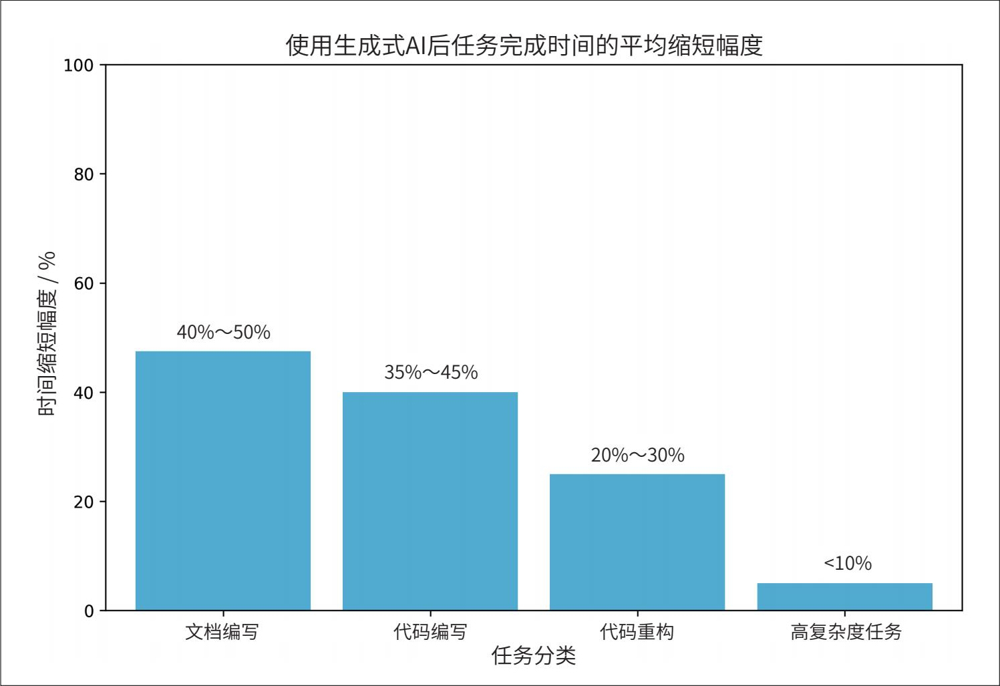

> **圖片描述：生成式 AI 任務時間縮短幅度長條圖，文檔編寫縮短40-50%，高複雜度任務不到10%。**

圖1-9：AI可以顯著提高開發人員的生產力，尤其是在簡單任務上，但在高度複雜的任務上效果較弱。資料來源：麥肯錫

無論AI是否會取代軟體工程師，AI肯定能提高他們的生產力。這意味著企業現在可以用更少的工程師完成更多的工作。AI也可能會顛覆外包行業，因為外包的任務通常是企業核心業務之外較簡單的任務。

### 1.2.2 圖像和影片制作
得益於AI的機率性特徵，它非常適合創意任務。一些最成功的AI初創公司的專案都集中在創意應用領域，例如用於影像生成的Midjourney、用於照片編輯的Adobe Firefly，以及用於影片生成的Runway、Pika Labs和Sora。截至2023年年底，成立僅1年半的Midjourney的年度經常性收入已達到2億美元（參見“AI Startup Midjourney Expects $200 Million in Revenue”）。截至2023年12月，在蘋果應用商店“圖形與設計”類別的十大免費應用中，有一半的應用名稱包含“AI”。我預計不久之後，圖形與設計類應用將預設整合AI功能，不再需要在名稱中特意強調“AI”。第2章將更詳細地討論AI的機率性特徵。

如今，從LinkedIn到TikTok，使用AI生成社交媒體的個人頭像已屢見不鮮。許多求職者認為，AI生成的頭像能幫助他們展現最佳形象，提高獲得工作的機會（參見“Couldan AI-created profile picture help you get a job？”）。人們對AI生成頭像的看法發生了顯著變化：2019年，Facebook曾出於安全原因禁止使用AI生成頭像的賬戶（參見“Facebook Removes Accounts With AI-Generated Profile Photos”）；而到了2023年，許多社交媒體應用都提供了工具，讓使用者可以使用AI生成個人頭像。

- 由於企業通常在廣告和營銷上花費大量資金，因此在這些領域實作自動化可以大幅削減成本。平均而言，企業預算的11%用於營銷。參見“Marketing Budgets Vary by Industry”（Christine Moorman，《華爾街日報》，2017）。

在企業領域，廣告和營銷迅速引入了AI技術。AI可以直接生成宣傳圖片和影片，也有助於創意頭腦風暴，或生成初稿供人類專家進一步修改完善。你可以使用AI生成多個版本的廣告，並測試哪一個最受目標受眾歡迎。AI還可以根據季節和地點生成廣告的不同版本，例如，針對秋季場景，你可以使用AI改變樹葉的顏色；針對冬季場景，則可以給地面新增積雪效果。

### 1.2.3 寫作
AI輔助寫作由來已久。如果使用智慧手機，你可能已經熟悉自動糾錯和自動補全功能，這些功能都是由AI驅動的。寫作是AI的理想應用場景，因為我們經常需要寫作，這項工作可能相當枯燥，而且我們對錯誤的容忍度較高。如果模型給出的建議你不喜歡，直接忽略即可。LLM擅長寫作並不令人意外，因為它們本身的訓練目標就是文字補全。為了研究ChatGPT對寫作的影響，美國麻省理工學院的一項研究（Noy和Zhang，“Experimental evidence on the productivity effects of generative artificial intelligence”，2023）向453名受過大學教育的專業人士分配了特定職業的寫作任務，並隨機讓其中一半人使用ChatGPT。結果顯示，使用ChatGPT的參與者平均完成任務的時間減少了40%，輸出質量提高了18%。ChatGPT有助於縮小不同從業者之間輸出質量的差距，這意味著它對那些寫作能力較弱的人幫助更大。在實驗中接觸過ChatGPT的參與者，在實驗結束兩週後在實際工作中使用ChatGPT的可能性是其他人的2倍，兩個月後仍然使用的可能性是其他人的1.6倍。

對消費者來說，AI的使用場景也很明顯。許多人使用AI幫助他們更好地溝通。例如，你可以在郵件草稿中宣洩憤怒，然後讓AI將其改寫得更為友善；你也可以給出要點，讓AI生成完整的段落。一些人表示，當前，他們在傳送重要郵件前都會先讓AI潤色一下。

- 我發現AI對於本書的撰寫就非常有幫助，我也能預見AI將自動化寫作過程中的許多環節。在創作小說時，我經常請AI幫我構思接下來可能發生的情節，或某個角色可能如何應對某種情況。我仍在評估哪些類型的寫作可以自動化，哪些類型的寫作無法自動化。

學生們正在使用AI撰寫論文，作家們也在使用AI創作圖書。許多初創公司已經開始利用AI生成兒童讀物、同人小說、言情小說和奇幻小說。與傳統圖書不同，AI生成的圖書可以實作互動，情節能夠根據讀者的喜好而變化，這意味著讀者可以主動參與到故事創作過程中。一款兒童閱讀應用甚至能夠識別孩子難以掌握的單詞，並圍繞這些單詞生成相應的故事。

Google文件、Notion和Gmail等筆記和電子郵件應用都使用AI幫助使用者改善寫作。寫作輔助應用Grammarly透過微調模型，使使用者的寫作更加流暢、連貫和清晰（Raheja等，“CoEdIT: Text Editing by Task-Specific Instruction Tuning”，2023）。

然而，AI的寫作能力也可能被濫用。2023年，《紐約時報》報道稱，亞馬遜平臺上充斥著大量粗製濫造的AI生成的旅遊指南，這些書籍配有AI生成的作者簡介、網站連結以及熱情洋溢的評論（參見“A New Frontier for Travel Scammers: A.I.-Generated Guidebooks”）。

在企業層面，AI寫作在銷售、營銷和日常團隊溝通中非常普遍。許多經理告訴我，他們一直在使用AI輔助撰寫績效報告。AI能夠幫助人們撰寫高效的陌生客戶營銷郵件、廣告文案和產品描述。客戶關係管理（CRM）應用（如HubSpot和Salesforce）也為企業使用者提供了生成網頁內容和外聯郵件的工具。

- 我猜想，我們將變得對網際網路上的內容極度不信任，以至於只會閱讀由我們信任的人或品牌生成的內容。

AI似乎在SEO（search engine optimization，搜尋引擎最佳化）方面尤其擅長，這可能是因為許多AI模型的訓練資料來自網際網路，而網際網路上充滿經過SEO最佳化的文字。AI在SEO方面表現如此出色，以至於催生了新一代的“內容農場”。這些內容農場建立垃圾網站，並用AI生成的內容填充，以在Google搜尋結果中獲得較高排名，從而吸引流量，然後透過廣告交易平臺獲利。2023年6月，NewsGuard發現141個知名品牌的近400個廣告出現在由AI生成內容的垃圾網站上。其中一個垃圾網站每天生成1200篇文章（參見“Funding the Next Generation of Content Farms: Some of the World's Largest Blue Chip Brands Unintentionally Support the Spread of Unreliable AI-Generated News Websites”）。如果不採取措施加以遏制，未來的網際網路上將充斥著AI生成的內容，其前景著實讓人擔憂。

### 1.2.4 教育
每當ChatGPT宕機時，OpenAI的Discord伺服器上就會湧入大量學生，抱怨無法完成作業。包括紐約市公立學校和洛杉磯聯合學區在內的多個教育委員會，曾因擔心學生利用ChatGPT作弊而迅速禁止了它，但僅幾個月後又撤銷了這一決定（參見“ChatGPT In Schools: Here's Where It's Banned—And How It Could Potentially Help Students”和“DespiteCheating Fears, Schools Repeal ChatGPT Bans”）。

學校與其禁止AI，不如將其融入教學，幫助學生更高效地學習。AI可以總結教科書內容，併為每個學生生成個性化的課程計劃。令人費解的是，既然我們深知因材施教的重要性，連廣告都可以做到個性化推送，教育領域卻還做不到。AI可以幫助每名學生將學習材料調整為最適合自己的形式。聽覺型學習者可以讓AI大聲朗讀材料；喜歡動物的學生可以使用AI調整視覺化內容，新增更多動物元素；那些覺得閱讀程式碼比閱讀數學公式更容易的人，可以要求AI將數學公式轉換成程式碼。

AI在語言學習方面尤其有幫助，因為你可以要求AI模擬不同的場景進行角色扮演。Pajak和Bicknell發現，在課程建立的四個階段中，AI在課程個性化階段的幫助最大，如圖1-10所示（“At Duolingo, humans and AI work together to create a high-quality learning experience”，多鄰國部落格，2022）。

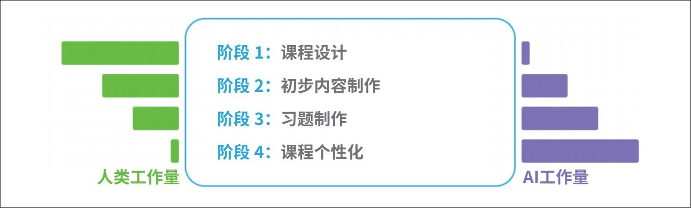

> **圖片描述：教育領域人類與 AI 工作量對比圖，從課程設計到課程個性化，AI 工作量逐步增加。**

圖1-10：在多鄰國課程建立的四個階段中，AI都可以發揮作用，但在課程個性化階段最為有用。圖片來自Pajak和Bicknell，多鄰國，2022

AI可以生成測驗題，包括選擇題和開放式問題，並評估答案。AI還能成為辯論夥伴，因為在針對同一話題提出不同觀點方面，它遠比普通人在行。例如，可汗學院為學生提供了由AI驅動的教學助手，也為教師提供了課程助理（參見“Harnessing GPT-4 so that all students benefit. A nonprofit approach for equal access”，以及Khanmigo官網）。我見過的一種創新教學方法是：教師給出一篇由AI生成的作文，讓學生找出其中的錯誤並改正。

儘管許多教育公司積極採用AI來打造更好的產品，但也有不少公司發現自己的市場被AI搶佔了。例如，幫助學生完成家庭作業的公司Chegg，因為學生紛紛轉向AI尋求幫助，其股價從2022年11月ChatGPT發布時的28美元暴跌至2024年9月的2美元（參見“Chegg Embraced AI. ChatGPT Ate Its Lunch Anyway”）。

如果說AI取代某種技能是一種風險，那麼AI作為導師幫助人們學習技能則是一種機遇。對於許多技能而言，AI可以幫助人們快速入門，隨後人們便能自主學習，最終達到比AI更高的水平。

### 1.2.5 聊天機器人
聊天機器人的用途極為廣泛。它們可以幫助我們查詢資訊、解釋概念以及進行頭腦風暴。AI可以成為你的伴侶和心理治療師。它還能模擬各種人格，讓你與任何喜歡的人的“數字分身”交流。“數字伴侶”在極短的時間內迅速流行起來，甚至有些人花在與機器人交流上的時間已經多過與人類交流（參見Reddit上的討論帖“Spent more time on Character AI than speaking to humans”，以及文章“Is it so wrong to spend two hours a day chatting with bots? How about twelve?”）。有人擔心AI會破壞正常的婚戀關係（參見“AI girlfriends are ruining an entire generation of men”和“AI girlfriends are here and they're posing a threat to a generation of men”）。

在研究領域，人們還發現可以利用一組聊天機器人模擬一個社會，從而開展社會動態研究（Park等，“Generative Agents: Interactive Simulacra of Human Behavior”，2023）。

對企業來說，最受歡迎的機器人是客服機器人。這些機器人能比人工客服更快地回應客戶，從而幫助企業節省成本並改善客戶體驗。AI也可以作為產品的輔助工具，引導客戶完成一些煩瑣的任務，比如提交保險理賠、報稅或查詢公司政策。

- 令我驚訝的是，蘋果和亞馬遜將生成式AI技術整合到Siri和Alexa中所花費的時間如此之長。一位朋友認為，這可能是因為這些公司對質量和合規性有更高的要求，並且開發語音介面需要比開發聊天介面更長的時間。

ChatGPT的成功引發了基於文字的聊天機器人的熱潮。然而，文字並非唯一的互動形式，語音助手（如Google Assistant、Siri和Alexa）已經存在多年。3D聊天機器人在遊戲中已經很常見，並且在零售和營銷領域也逐漸流行起來。

- 宣告：我是Convai的顧問。

AI驅動的3D角色的應用場景之一是智慧NPC（non-player character，非玩家角色，參見NVIDIA展示的Inworld和Convai）。NPC對於推動許多遊戲的故事情節至關重要。在沒有AI的情況下，NPC通常只能執行簡單的指令碼動作，並且對話範圍有限。AI可以讓這些NPC變得更加智慧。智慧機器人可以改變現有遊戲（如《模擬人生》和《上古卷軸》）的互動模式，並使過去不可能實作的新型遊戲成為可能。

### 1.2.6 信息聚合
許多人認為，我們的成功取決於過濾和消化有用資訊的能力。然而，處理電子郵件、Slack訊息和新聞資訊有時會讓人不堪重負。幸運的是，AI可以幫助我們解決這個問題。AI已被證明能夠有效地聚合和總結資訊。根據Salesforce 2023年的報告“Generative AI Snapshot Research”，74%的生成式AI使用者會使用AI來提煉複雜觀點和總結資訊（參見“New AI Usage Data Shows Who's Using AI — and Uncovers a Population of ‘Super-Users’”）。

對消費者來說，有許多應用可以處理文件（如合同、宣告、論文），並支援以對話的方式檢索資訊，這種應用場景也被稱為“文件對話”（talk-to-your-docs）。AI可以幫助我們總結網站內容、研究資料，並根據我們選定的主題生成報告。在撰寫本書的過程中，我發現AI在總結和比較論文方面非常有幫助。

資訊聚合與提煉對企業運營至關重要。高效的資訊聚合與資訊提煉能夠減輕中層管理的負擔，有助於實作組織精簡。當Instacart推出內部提示詞共享平臺時，他們發現最受歡迎的提示詞模板之一是“快速分解”（Fast Breakdown，參見“Scaling Productivity with Ava — Instacart's Internal AI Assistant”）。該模板要求AI對會議記錄、電子郵件和Slack對話進行總結，提取事實、未解決的問題和待辦事項。這些待辦事項隨後可以自動插入專案追蹤工具，並分配給相應的負責人。

AI還可以幫助人們挖掘潛在客戶的關鍵資訊，並對競爭對手進行分析。

收集的資訊越多，組織這些資訊就越重要，因此資訊聚合與資料組織密切相關。

### 1.2.7 資料組織
毋庸置疑，未來我們將持續產生海量資料：智慧手機使用者將繼續拍攝照片和影片，公司將繼續記錄有關產品、員工和客戶的一切資訊，每年人們都會簽署數十億份合同。照片、影片、日誌和PDF檔案都屬於非結構化或半結構化的資料，以便於檢索的方式組織這些資料至關重要。

- 我目前在Google相簿中儲存了超過40,000份照片和影片檔案。如果沒有AI，我幾乎不可能在需要時找到想要的照片。

AI可以有效地幫助人們實作這些目標。AI能夠自動為圖片和影片生成文字描述，或將文字查詢與視覺內容進行匹配。像Google相簿這樣的服務已經在使用AI來呈現符合搜尋請求的圖片。Google圖片搜尋則更進一步：如果沒有現成的圖片符合使用者需求，它甚至可以生成一些。

- 就我個人而言，我還發現AI擅長解釋資料和圖表。當遇到資訊過多、令人困惑的圖表時，我會請ChatGPT幫我逐步解析。

AI在資料分析方面表現出色。它可以編寫程式生成資料視覺化內容，識別異常值，並完成收入預測等任務。

企業可以利用AI從非結構化資料中提取結構化資訊，用於資料整理和搜尋。簡單的應用場景包括自動從信用卡、駕照、收據、票據以及電子郵件頁尾提取資訊。更復雜的應用場景包括從合同、報告、圖表等內容中提取資料。據估計，到2030年，智慧資料處理（intelligent data processing，IDP）行業的市場規模將達到128.1億美元，年增長率為32.9%（參見“Intelligent Document Processing Market Size to Surpass USD 12.81 billion by 2030,exhibiting a CAGR of 32.9%”）。

### 1.2.8 工作流自動化
歸根結底，AI應儘可能實作自動化。對終端使用者而言，自動化可以幫助他們完成日常煩瑣的任務，例如預訂餐廳、申請退款、規劃旅行以及填寫表單等。

對於企業而言，AI可以自動化處理重複性任務，例如潛在客戶管理、發票開具、報銷、客戶請求管理、資料錄入等。其中一個特別有趣的應用場景是利用AI模型合成資料，再用這些資料來改進模型本身。你可以使用AI為資料建立標籤，並引入人工來進一步最佳化這些標籤。我們將在第8章討論資料合成。

- 在本書中，“智慧體”即“AI智慧體”，在個別敘述中會保留AI。——編者注

許多工需要訪問外部工具。例如，為了預訂餐廳，一個應用可能需要許可權開啟搜尋引擎查詢餐廳電話號碼，使用你的手機撥打電話，並將預約新增到你的日曆中。能夠規劃並使用工具的AI被稱為**智能體**。人們對智慧體已經近乎痴迷，這種熱情並非毫無根據——AI智慧體有潛力極大地提高生產力，並創造巨大的經濟價值。智慧體是第6章的核心話題。

探索各種AI應用充滿了樂趣。我最喜歡做的事情之一就是暢想自己能構建哪些不同的應用。然而，並非所有的應用都值得構建。下一節將討論在構建AI應用之前我們應該考慮哪些因素。

## 1.3 規劃AI應用
面對AI近乎無限的潛力，很多人都迫不及待地想要動手搭建自己的AI應用。如果你只是為了好玩或學習，那就放手去做吧——動手實踐是學習的最佳途徑之一。在基礎模型剛起步那會兒，好幾位AI負責人跟我說，他們都鼓勵團隊多嘗試開發AI應用，藉此提升能力。

然而，如果你以此為職業，或許應該停下來思考一下：你為什麼要構建這個應用？應該如何著手？利用基礎模型做一個炫酷的演示很容易，但要打造一個盈利的產品卻很難。

### 1.3.1 應用場景評估
首先要問的是：你為什麼想要構建這個應用？和許多商業決策一樣，構建AI應用通常是對風險和機遇的一種回應。以下是一些不同風險級別的範例，按風險從高到低排列。

·**如果不這樣做，擁有AI的競爭對手可能會淘汰你。**如果AI對你的業務構成重大生存威脅，那麼採用AI就必須成為最高優先順序的事項。在Gartner 2023年的研究中，7%的受訪者表示業務連續性是他們採用AI的原因（參見“Gartner Experts Answer the Top Generative AI Questions for Your Enterprise”）。這種情況在涉及文件處理和資訊聚合的業務中更為常見，例如金融分析、保險和資料處理領域。同時，這種情況在廣告、網頁設計和影像製作等創意工作中也屢見不鮮。你可以參考2023年OpenAI的研究“GPTs are GPTs: An Early Look at the Labor Market Impact Potential of Large Language Models”（Eloundou等，2023），瞭解各行業在AI衝擊下的風險排名。

·**如果不這樣做，就會錯失提升利潤和生產力的機會。**大多數企業採用AI都是為了抓住它帶來的機遇。AI幾乎能助力所有業務的運營：可以透過生成更有效的文案、產品描述和視覺營銷素材來降低獲客成本；可以透過改善客戶支援和定製使用者體驗來提高使用者留存率；此外，還可以幫助企業進行銷售線索生成、內部溝通、市場調研和競爭對手追蹤。

- 不過，對於規模較小的初創公司來說，可能必須優先專注於產品，因為這類公司甚至負擔不起專人去探索新技術。

·**你可能還不確定AI如何融入你的業務，但也不想被時代拋下。**雖然企業不應盲目追逐每一個熱點，但許多企業正是因為遲遲不行動而失敗（比如柯達、百視達和黑莓）。如果條件允許，投入資源去了解一項全新的、變革性的技術如何影響你的業務，並不是壞事。對於規模較大的企業，這可以成為研發部門職責的一部分。

找到開發該應用的充分理由後，你可能會考慮是否需要自行構建。如果AI對你的業務構成生存威脅，你可能會選擇自主開發，而不是將其外包給競爭對手。然而，如果你只是利用AI來提高利潤和生產力，市場上可能有很多現成的解決方案供你選擇，這些方案能幫你節省時間和成本，同時獲得更好的效果。

**1. AI與人在應用中的角色**

AI在產品中所扮演的角色決定了應用的開發方式及其需求。蘋果公司提供了一份出色的文件，闡述了AI在產品中的不同應用方式[參見蘋果開發者網站“人機介面指南”（Human Interface Guidelines）中“機器學習”（Machine learning）部分]。以下是與當前討論相關的三個關鍵點。

**關鍵性與輔助性**

如果一個應用在沒有AI的情況下仍然可以執行，那麼AI對該應用而言就是輔助性的。例如，Face ID如果沒有AI驅動的人臉識別功能就無法執行，而Gmail即使沒有智慧撰寫（Smart Compose）功能也仍然可以使用。

AI對應用越關鍵，使用者對AI的準確性和可靠性的要求就越高。當AI並非應用的核心功能時，使用者對AI犯錯的容忍度通常會更高。

**被動式與主動式**

被動式功能是在使用者請求或進行特定操作後才做出響應，而主動式功能則是在有機會時主動提供響應。例如，聊天機器人屬於被動式功能，而Google地圖的交通提醒則屬於主動式功能。

由於被動式功能是針對事件做出的響應，因此通常（但並非總是）需要快速反應。另一方面，主動式功能可以提前計算並在適當時機展示，因此對延遲的敏感度較低。

由於使用者並未主動請求，如果主動式功能的質量較差，使用者可能會覺得這些功能具有侵入性或令人厭煩。因此，主動式預測和生成通常對質量有更高的要求。

**動態與靜態**

動態功能會根據使用者回饋持續更新，而靜態功能則是定期更新。例如，Face ID需要隨著使用者面部隨時間變化而不斷更新。然而，Google相簿中的物體檢測功能可能只在軟體升級時才會更新。

在AI的情境下，動態特性可能意味著每個使用者擁有自己的模型，模型持續根據使用者資料進行微調，或者採用其他個性化機制，例如ChatGPT的記憶功能，使其能夠記住每個使用者的偏好。而靜態特性可能是多個使用者共享一個模型，在這種情況下，只有在共享模型更新時，功能才會更新。

此外，明確人在應用中的角色也很重要。AI是為人類提供後臺支援，還是直接做出決策，抑或兩者兼而有之？以客服機器人為例，AI的回答可以有以下幾種使用方式。

·AI提供多個回答選項，供人工客服參考，以便更快地撰寫回復。

·AI僅處理簡單請求，將更復雜的請求轉交給人工客服。

·AI直接處理所有請求，無人工介入。

將人類納入AI決策過程的方式稱為**人在回路**（human-in-the-loop）。

2023年，微軟提出了一個逐步提高AI產品自動化程度的框架，稱為“爬行-行走-奔跑”（Crawl-Walk-Run，參見“From discussion to deployment: 4 key lessons in generative AI”）。

1. 爬行：必須有人類參與。

2. 行走：AI可以直接與內部員工互動。

3. 奔跑：自動化程度提高，可能包括AI直接與外部使用者互動。

隨著AI系統質量的提高，人類的角色可能會隨之變化。例如，在初期評估AI能力時，可以使用AI為人工客服生成建議。如果人工客服對AI建議的接受率很高，比如95%的建議被直接採用，那麼你就可以讓客戶直接與AI互動，處理這些簡單請求。

**2. AI產品的防御性**

如果你將AI應用作為獨立產品進行銷售，那麼考慮產品的防禦性就非常重要。低門檻既是福也是禍：如果你很容易就開發出了某個產品，那麼你的競爭對手同樣容易複製。你有哪些護城河可以用來保護你的產品？

- 在生成式AI發展的早期，有一個流行的笑話：AI初創公司其實只是OpenAI或Claude的“套殼”（wrapper）。

從某種意義上說，在基礎模型之上構建應用意味著你在這些模型之上提供了一個額外的層。這也意味著，如果底層模型的能力不斷擴展，你所提供的這一層可能會被模型本身所取代，從而使你的應用過時。舉個例子，假設你基於ChatGPT構建了一個PDF解析應用，前提是ChatGPT無法很好地解析PDF，或者無法大規模地解析PDF。一旦這個前提不再成立，你的競爭力就會減弱。當然，即使在這種情況下，如果你的PDF解析應用是基於開源模型構建的，並且面向那些希望內部託管模型的使用者，那麼這個應用依然可能有意義。

一家大型風險投資公司的普通合夥人告訴我，她見過許多初創公司的整個產品其實都可以成為Google文件或Microsoft 365中的一個功能。如果這些產品真的火了，谷歌或微軟只需安排三名工程師，用兩週時間就能複製出來，那麼這些初創公司又該如何應對？

在AI領域，競爭優勢一般有三種：技術、資料和分發（將產品推向使用者的能力）。在基礎模型時代，大多數公司的核心技術非常相似，而分發優勢則很可能屬於大公司。

- 在撰寫本書的過程中，幾乎每次與AI初創公司交流時我都會聽到“資料飛輪”（data flywheel）這個詞。

資料優勢的情況則更加微妙。大公司可能擁有更多現成的資料。然而，如果一家初創公司能夠率先進入市場，並收集足夠的使用資料來持續改進產品，那麼資料將成為它的護城河。即使在某些情況下使用者資料無法直接用於訓練模型，使用資訊也能提供關於使用者行為和產品缺陷的寶貴洞察，從而指導資料收集和訓練過程。

- 宣告：我是Photoroom的投資人。

有許多成功的公司，它們最初的產品或許只是更大產品中的一個功能模組——Calendly原本是Google日曆的一個功能，Mailchimp原本是Gmail的一個功能，Photoroom原本是Google相簿的一個功能。很多初創公司最終超越了體量更大的競爭對手，而它們的起點往往是開發那些被大公司忽視的功能。也許你的產品會成為下一個這樣的例子。

### 1.3.2 設定目標
一旦你決定要自己構建一個出色的AI應用，下一步就是明確目標：你將如何衡量成功？最重要的指標是它將如何影響你的業務。例如，你要構建一個客服機器人，業務指標可以包括以下內容。

·你希望聊天機器人自動處理客戶訊息的比例是多少？

·聊天機器人應該幫助你多處理多少訊息？

·使用聊天機器人後，你的響應速度能提高多少？

·聊天機器人能為你節省多少人力成本？

聊天機器人能夠回覆更多訊息，但這並不意味著使用者一定會滿意，因此追蹤使用者滿意度和回饋非常重要。10.2節將討論如何設計回饋系統。

為了確保產品準備充分後再呈現給使用者，需要明確界定產品的實用性門檻，即產品必須達到怎樣的表現才算實用。實用性門檻可能包括以下幾類指標。

·質量指標：衡量聊天機器人回覆的質量。

·延遲指標：包括TTFT（time to first token，首個token響應時間）、TPOT（time per output token，每個輸出token響應時間）和總延遲。什麼樣的延遲是可接受的，取決於具體的應用場景。如果當前所有使用者請求都由人工處理，中位響應時間為1小時，那麼只要AI的響應比1小時快，可能就算足夠好。

·成本指標：每次推理請求的成本。

·其他指標：例如可解釋性和公平性。

如果你還不確定要使用哪些指標，不用擔心，本書後續將詳細介紹其中許多指標。

### 1.3.3 裡程碑規劃
設定了可衡量的目標後，你需要制訂實作計劃。如何實作目標取決於你的起點。你需要評估現有模型以瞭解其能力，現有模型的能力越強，你需要做的工作就越少。例如，你的目標是自動處理60%的客戶支援工單，而你想使用的模型已經能夠自動處理30%的工單，那麼你需要投入的工作量會比模型完全無法處理的情況要小得多。

經過評估，你的目標很可能會調整。例如，你可能意識到將應用提升到實用性門檻所需的資源超過了潛在回報，從而決定不再繼續推進。

規劃AI產品時需要考慮“最後一公里”的挑戰。基礎模型的初步成功可能具有誤導性。由於基礎模型本身的能力已經相當出色，構建一個有趣的演示可能並不需要太多時間。然而，一個好的初步演示並不意味著最終產品也會很好。你可能只需一個週末就能做出演示，但要開發出真正的產品可能需要數月甚至數年。

在UltraChat的論文中，Ding等提道：“從0到60很容易，但從60到100卻變得極具挑戰性。”（“Enhancing Chat Language Models by Scaling High-quality Instructional Conversations”，2023）。LinkedIn也表達了類似的觀點（“Musings on building a Generative AI product”，2024）。他們花了1個月就實作了期望體驗的80%。這種初步的成功使他們嚴重低估了進一步改進產品所需的時間。他們發現，最終達到期望體驗的95%以上又花了4個月。大量時間花在解決產品瑕疵和處理幻覺問題上，每額外提升1%都舉步維艱，令人沮喪。

### 1.3.4 維護
產品規劃並不會在實作目標後就結束，你還需要考慮產品隨時間推移可能發生的變化，以及如何進行維護。AI產品的維護面臨著AI領域快速變化的額外挑戰。在過去10年中，AI領域的發展速度非常快，未來10年可能也會繼續保持這種快速發展的勢頭。今天基於基礎模型構建應用，意味著你需要做好準備，搭上這趟高速列車。

許多變化是積極的。例如，模型的某些局限性正在得到解決，上下文長度越來越長，模型輸出質量越來越高。模型**推理**（根據輸入計算輸出的過程）也變得更快、更便宜。圖1-11展示了從2022年到2024年，MMLU（Massive Multitask Language Understanding，大規模多工語言理解，Hendrycks等，Measuring Massive Multitask Language Understanding，2020）這一流行的基礎模型基準測試中，模型效能和推理成本的變化趨勢。

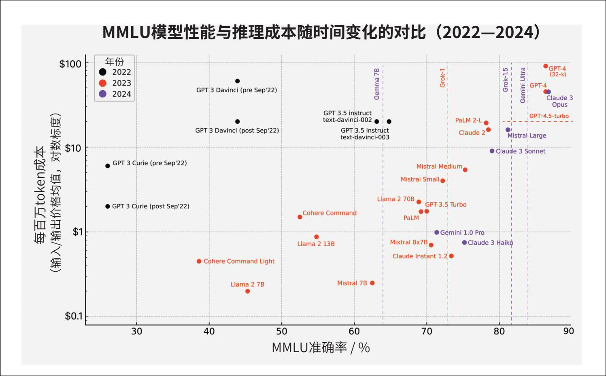

> **圖片描述：MMLU 效能與推理成本散佈圖（2022-2024），顯示模型效能提升而成本持續下降的趨勢。**

圖1-11：AI推理成本隨時間迅速下降。圖片來源：Katrina Nguyen，“The cost of AI reasoning is going to drastically decrease”，2024

然而，即使是這些積極的變化，也可能給工作流程帶來麻煩。你需要時刻保持警惕，並對每項技術投資進行成本效益分析。今天的最佳選擇可能明天就會變成最差的選擇。例如，你決定自建模型，這看起來比付費使用模型提供商的服務更便宜，但3個月後你發現模型提供商的價格降了一半，導致自建模型反而更貴。再如，你投資了第三方解決方案，並圍繞它調整了基礎設施，結果提供商卻因為融資失敗而倒閉。

有些變化更容易適應。例如，隨著模型提供商逐漸採用相同的API標準，替換模型API提供商變得更加容易。然而，由於每個模型都有其獨特之處，各有優劣勢，開發人員在使用新模型時仍需調整工作流程、提示詞和資料。如果沒有適當的版本控制和評估基礎設施，這個過程可能會非常麻煩。

- 指美國《關於安全、可靠、值得信賴地開發和使用人工智慧的行政命令》（14110號命令），已於2025年1月撤銷。——編者注

有些變化更難適應，尤其是涉及監管的變化。許多國家和地區將AI相關技術視為國家和地區安全問題，這意味著AI所需的資源，包括算力、人才和資料，都受到嚴格監管。例如，據估計，歐盟出臺的《通用資料保護條例》（GDPR）使企業為合規付出了90億美元的成本（參見“The GDPR Racket: Who's Making Money from This $9bn Business Shakedown”）。隨著新法規對算力資源的買賣施加更多限制，算力的可用性可能會在一夜之間發生變化（參見美國2023年10月的行政命令）。如果你的GPU提供商突然被禁止向你所在的國家和地區出售GPU，你就會陷入困境。

有些變化甚至可能是致命的。例如，圍繞智慧財產權（intellectual property，IP）和AI使用的法規仍在不斷演變。如果你的產品是基於使用他人資料訓練的模型構建的，你能確保產品的智慧財產權始終屬於你嗎？我接觸過的許多高度依賴智慧財產權的公司，比如遊戲工作室，都因擔心未來可能會失去智慧財產權而對使用AI持謹慎態度。

如果你仍決定構建AI產品，我們接下來看看構建這些應用所需的工程技術棧。

## 1.4 AI工程技術棧
AI工程的飛速發展同時也帶來了大量的炒作和“錯失恐懼症”（fear of missing out，FOMO）。每天都有大量新的工具、技術、模型和應用湧現，讓人應接不暇。與其試圖追趕不斷變化的潮流，不如來看看AI工程的基本組成部分。

要理解AI工程，首先要認識到AI工程是從ML工程演變而來的。當一家公司開始嘗試基礎模型時，自然會由現有的ML團隊來主導這一工作。一些公司將AI工程視為與ML工程等同，如圖1-12所示。

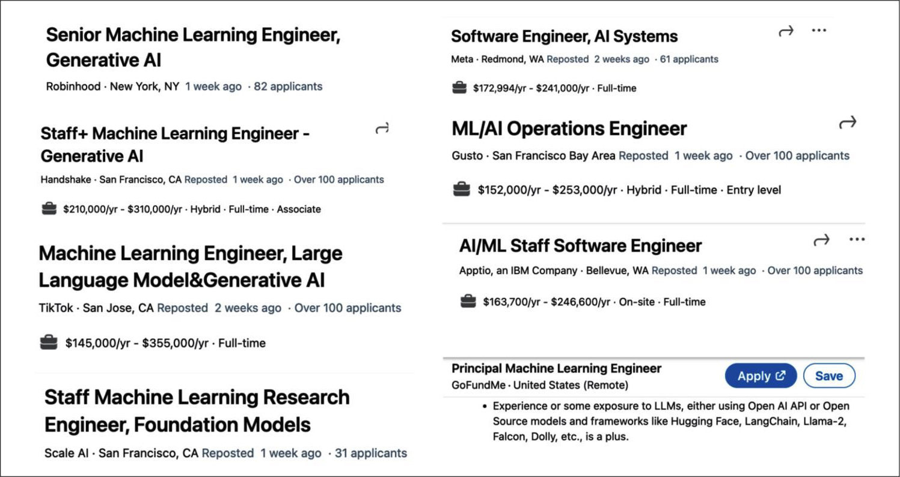

> **圖片描述：LinkedIn AI 工程職位招聘截圖，薪資範圍14萬至35萬美元。**

圖1-12：如2023年12月17日LinkedIn上的職位標題所示，許多公司將AI工程和ML工程歸為同一類別

一些公司則為AI工程單獨設立職位描述，如圖1-13所示。

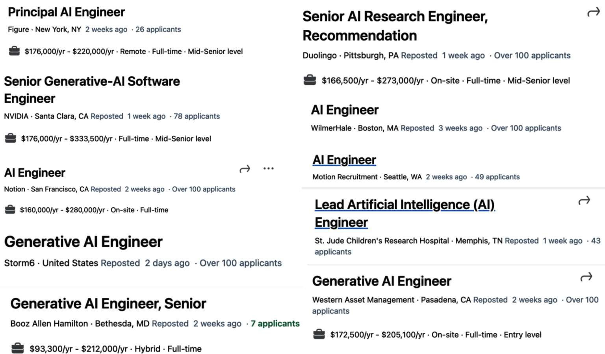

> **圖片描述：更多 LinkedIn AI 工程師職位截圖，包括 Principal AI Engineer、Generative AI Engineer 等。**

圖1-13：如2023年12月17日LinkedIn上的職位標題所示，一些公司為AI工程單獨設立職位描述

無論組織如何定位AI工程師和ML工程師，這兩個角色之間都有很大的重疊。現有的ML工程師可以透過學習AI工程技能來拓寬就業前景。然而，也存在一些AI工程師此前並無ML經驗。

為了更好地理解AI工程及其與傳統ML工程的區別，本節接下來將分解AI應用構建過程中的各層，並探討每層在AI工程和ML工程中的作用。

### 1.4.1 AI工程技術棧的三層結構
任何AI應用的工程技術棧都包含三層：應用開發層、模型開發層和基礎設施層。在開發AI應用時，通常從最上層開始，根據需要逐步向下推進。

**應用開發層**

得益於模型的廣泛可用性，任何人都可以利用這些模型開發應用。這一層在過去兩年中最為活躍，且仍在快速發展。應用開發涉及為模型設計優質的提示詞並提供必要的上下文。這一層需要嚴格的評估。此外，優秀的應用還需要良好的介面設計。

**模型開發層**

這一層提供了模型開發工具，包括建模、訓練、微調和推理最佳化框架。由於資料在模型開發中佔據核心地位，因此這一層也包含資料集工程。模型開發同樣需要嚴格的評估。

**基礎設施層**

位於技術棧最底層的是基礎設施，包括用於模型服務、資料和計算管理以及監控的工具。這三層及各自職責的範例如圖1-14所示。

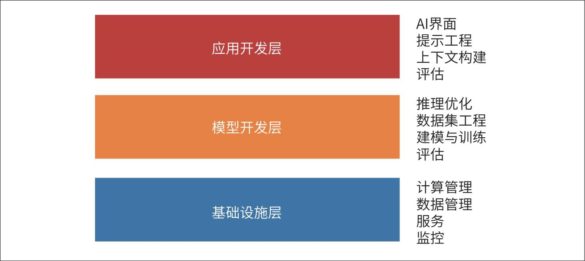

> **圖片描述：AI 工程技術棧三層架構圖：應用開發層、模型開發層、基礎設施層。**

圖1-14：AI工程技術棧的三層結構

為了瞭解基礎模型出現後生態系統的發展情況，我在2024年3月搜尋了GitHub上所有與AI相關且至少獲得500個星標的倉函式庫。鑑於GitHub的普及程度，我認為這些資料能夠很好地反映生態系統的狀況。我也將應用和模型的倉函式庫納入了分析，它們分別是應用開發層和模型開發層的產物。我一共找到了920個倉函式庫。圖1-15展示了各類別的倉函式庫逐月累計的數量情況。

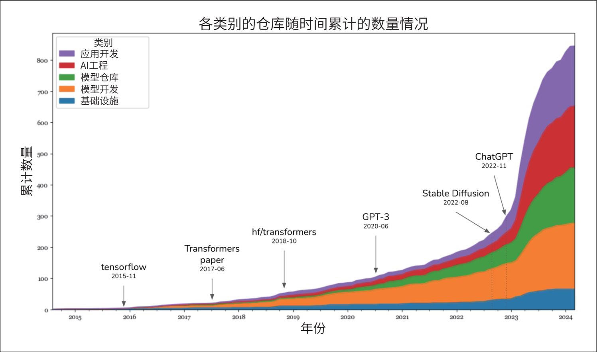

> **圖片描述：AI 開源倉庫累計數量面積圖（2015-2024），標註 TensorFlow、ChatGPT 等關鍵節點。**

圖1-15：各類別的倉函式庫隨時間累計的數量情況

資料顯示，在Stable Diffusion和ChatGPT推出後的2023年，AI工具的數量出現了大幅增長。2023年增長最快的類別是應用開發層。基礎設施層也有一定增長，但遠低於其他層的增長幅度，這是意料之中的。儘管模型和應用發生了變化，但核心基礎設施需求（資源管理、服務、監控等）依然保持不變。

這就引出了下一個要點。儘管人們對基礎模型的熱情和創造力達到了前所未有的高度，但構建AI應用的許多原則並未改變。對於企業級應用場景而言，AI應用仍然需要解決業務問題，因此，將業務指標對映到ML指標（反之亦然）依然至關重要。我們仍然需要進行系統化的實驗。在傳統ML工程中，我們會嘗試不同的超引數；而對於基礎模型，則需要嘗試不同的模型、提示詞、檢索演算法、取樣變數等（取樣變數將在第2章討論）。我們仍然希望模型執行速度更快、成本更低。構建回饋迴圈仍然很重要，這樣我們才能利用生產資料迭代改進應用。

這意味著過去10年裡ML工程師所積累和分享的許多經驗仍然適用。這些集體經驗使每個人都能更容易地上手構建AI應用。然而，在這些經久不衰的原則之上，AI工程還帶來了許多獨特的創新，我們將在本書中進行探討。

### 1.4.2 AI工程與ML工程
雖然部署AI應用的基本原則沒有改變，但理解變化也同樣重要。這對於希望調整現有平臺以適應新的AI應用場景的團隊，以及希望瞭解哪些技能能幫助自己在新市場中保持競爭力的開發人員來說，都很有幫助。

總體而言，今天使用基礎模型構建應用與傳統ML工程相比，主要有以下三個方面的不同。

·在沒有基礎模型的情況下，你必須為自己的應用訓練模型。而在AI工程中，你使用的是別人已經訓練好的模型。這意味著AI工程更少關注建模和訓練，而更多關注模型的適配。

- 一位世界500強公司的AI負責人曾告訴我，他的團隊知道如何使用10塊GPU，卻不知道如何使用1000塊GPU。

·AI工程所使用的模型規模更大，消耗更多計算資源，並且比傳統ML工程具有更高的延遲，這意味著在訓練效率和推理最佳化方面面臨更大的壓力。計算密集型模型帶來的直接結果是，許多公司現在需要更多GPU，使用比以往更大的計算叢集，這也意味著對熟悉GPU和大規模叢集的工程師的需求增加了。

·AI工程使用的模型能夠產生開放式輸出。這種開放式輸出使模型能夠靈活地應用於更多任務，但也更難評估，從而使得評估成為AI工程中一個更為重要的問題。

簡而言之，AI工程與ML工程的區別在於，AI工程更少關注模型開發，而更多關注模型的適配和評估。在本章中，我多次提到模型適配，因此在繼續之前，我想確保我們對模型適配的含義有一致的理解。一般來說，根據是否需要更新模型權重，模型適配技術可以分為兩類。

**基於提示詞的技術：包括提示工程，無須更新模型權重即可實現模型適配。**我們透過給模型提供指令和上下文來適配模型，而不是修改模型本身。提示工程更容易上手，所需資料也更少。許多成功的應用僅透過提示工程就能實作。它的易用性使你能夠嘗試更多模型，從而增加找到適合應用的模型的機會。然而，對於複雜任務或效能要求嚴格的應用，僅靠提示工程是不夠的。

**微調：微調則需要更新模型權重，即透過修改模型本身來適配模型。**通常來說，微調技術更復雜，也需要更多的資料，但它們能夠顯著提升模型的質量，降低模型的延遲和成本。很多工如果不修改模型權重是無法實作的，比如模型訓練時未接觸過的新任務。

現在，我們將深入應用開發層和模型開發層，看看在AI工程的背景下，每層分別發生了怎樣的變化。我們從當前的ML工程師更熟悉的內容開始。本節將概述開發AI應用所涉及的各類流程，這些流程的具體運作方式將在本書後續章節中詳細討論。

**1. 模型開發**

模型開發是傳統ML工程中最常見的一層，主要包含三個職責：建模與訓練、資料集工程、推理最佳化。此外，評估也是必要的一環，但由於大多數人最初會在應用開發層接觸到評估，因此我將在下一部分討論。

**建模與訓練。**建模與訓練是指設計模型架構、訓練模型並對其進行微調的過程。此類工具包括谷歌的TensorFlow、Hugging Face的Transformers和Meta的PyTorch。

開發ML模型需要專業的ML知識，包括瞭解不同類型的ML演算法（如分群、邏輯迴歸、決策樹和協同過濾）以及神經網路架構（如前饋神經網路、迴圈神經網路、卷積神經網路和Transformer）。此外，還需要理解模型的學習機制，涉及梯度下降、損失函式、正則化等概念。

隨著基礎模型的出現，構建AI應用不再強制要求具備ML知識。我遇到過許多優秀且成功的AI應用開發者，他們對學習梯度下降毫無興趣。然而，ML知識仍然極具價值，因為它能擴展你的工具箱，並在模型表現不如預期時幫你排查問題。

**訓練、預訓練、微調和後訓練的區別**

訓練必然涉及改變模型權重，但並非所有對模型權重的改變都屬於訓練。例如，量化（quantization）是一種降低模型權重精度的過程，雖然技術上改變了權重的數值，但通常不被視為訓練。

術語“訓練”（training）通常作為一個統稱，涵蓋預訓練（pre-training）、微調（finetuning）

和後訓練（post-training），這三個術語分別對應不同的訓練階段。

**預訓練**

- 他們也獲得了極其豐厚的薪酬（參見“A.I. Researchers Are Making More Than $1 Million, Even at a Nonprofit”）。

預訓練是指從頭開始訓練一個模型，其權重通常是隨機初始化的。對於LLM而言，預訓練通常涉及訓練模型進行文字補全。在所有訓練步驟中，預訓練往往最耗費資源。例如，InstructGPT模型的預訓練佔用了整體計算和資料資源的98%（Ouyang等，“Training language models to follow instructions with human feedback”，2022）。預訓練也十分耗時，過程中的微小錯誤可能會造成巨大的經濟損失，並嚴重拖慢專案進度。由於資源密集的特性，預訓練已成為少數人的遊戲，但正因為如此，具備大模型預訓練專業知識的人才非常搶手。

## 微調
微調是指在已經訓練好的模型的基礎上繼續訓練——模型權重繼承自之前的訓練過程。由於模型經過預訓練已經具備了一定的知識，因此微調通常比預訓練所需的資源（例如資料和算力）更少。

## 後訓練
很多人使用“後訓練”一詞來表示在預訓練階段之後繼續訓練模型的過程。從概念上講，後訓練和微調是等同的，可以互換使用。然而，人們有時會用這兩個術語來區分不同的目標。模型開發者進行的訓練通常稱為後訓練。例如，OpenAI可能會在模型發布之前進行後訓練，以使其更好地遵循指令。應用開發者進行的訓練則稱為微調。例如，你可能會對OpenAI的模型（該模型本身可能已經過後訓練）進行微調，以適應具體需求。

- 如果你覺得“預訓練”和“後訓練”這些術語缺乏想象力，有這種想法的遠不止你一個。AI研究界擅長很多事，但起名字不是強項。我們之前已經提到過，“大語言模型”幾乎算不上一個科學術語，因為“大”這個詞本身就很模糊。我真的希望人們不要再發表標題為“x is all you need”的論文了。

預訓練和後訓練構成了一個連續的訓練過程。兩者的流程和使用的工具非常相似，其差異將在第2章和第7章中進一步探討。

有些人使用“訓練”這一術語來指代提示工程，這是不正確的。我曾讀過一篇B**u**s**i**n**e**s**s** **I**n**s**i**d**e**r*的文章（參見“I fed ChatGPT my childhood journal entries to talk to my inner child. The results were very therapeutic.”），作者聲稱她“訓練”ChatGPT來模仿年輕的自己。她是透過將自己童年的日記輸入ChatGPT來實作這一點的。從口語角度看，作者使用“訓練”一詞尚可理解，因為她確實是在教模型做事。但從技術角度講，透過輸入上下文來教模型如何行動，實際上做的是提示工程。同樣，我也見過有人提及“微調”，而實際上他們做的也是提示工程。

**資料集工程。**資料集工程是指為訓練和適配AI模型而進行的資料收集、生成和標註工作。在傳統ML工程中，大多數應用場景是封閉式的——模型的輸出局限於預定義的值。例如，垃圾郵件分類只有“垃圾郵件”和“非垃圾郵件”兩種輸出。然而，基礎模型則是開放式的。標註開放式查詢要比標註封閉式查詢困難得多——判斷一封郵件是否為垃圾郵件顯然比撰寫一篇文章容易。因此，資料標註對AI工程來說是一個更大的挑戰。

另一個區別是，傳統ML工程更多地處理表格資料，而基礎模型則處理非結構化資料。在AI工程中，資料處理更多涉及去重、分詞、上下文檢索和質量控制，包括剔除敏感資訊和有害資料。第8章將重點討論資料集工程。

許多人認為，隨著模型的商品化程度越來越高，資料將成為主要的差異化因素，這使得資料集工程比以往任何時候都更加重要。你需要多少資料取決於所用的適配技術。從頭訓練模型通常比微調需要更多資料，而微調又比提示工程需要更多資料。

無論需要多少資料，具備資料專業知識在評估模型時都大有裨益，因為訓練資料能提供關於該模型優缺點的重要線索。

**推理優化。**推理最佳化是指讓模型執行得更快、更經濟。這一直是ML工程的重要內容。使用者永遠不會拒絕更快的模型，公司也總能從更低成本的推理中獲益。然而，隨著基礎模型規模的擴大，推理成本和延遲也隨之增加，推理最佳化變得越來越重要。

基礎模型的一個挑戰是它們通常是**自回歸**的，即逐個生成token。如果模型生成一個token需要10毫秒，那麼生成100個token就需要1秒，更長的輸出耗時更久。隨著使用者的耐心消耗殆盡，將AI應用的延遲降低到典型網際網路應用所期望的100毫秒（參見“Location,Location, Partition: How to Beat Latency as Cloud Grows”），已成為一個巨大的挑戰。因此，推理最佳化現已成為工業界和學術界一個活躍的子領域。

表1-4總結了隨著AI工程的發展，模型開發各職責的重要性是如何變化的。

表1-4：進入基礎模型時代，模型開發各職責的重要性變化

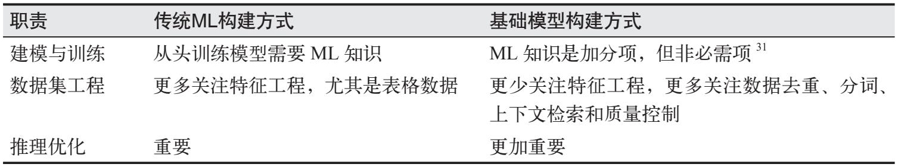

> **圖片描述：傳統 ML 與基礎模型構建方式的職責對比表格（建模訓練、資料集工程、推理最佳化）。**

注31：很多人可能會質疑這一說法，認為ML知識是必需的。

第7章至第9章將討論推理最佳化技術，包括量化、蒸餾和並行化。

**2. 應用開發**

在傳統ML工程中，團隊使用自研模型構建應用，模型質量是差異化的關鍵。而在基礎模型時代，許多團隊使用的是相同的模型，因此必須透過應用開發過程來實作差異化。

- 本書提到的AI介面不局限於前端使用者介面（UI），也泛指使用者與AI互動的系統、機制。——編者注

應用開發層包括以下職責：評估、提示工程、AI介面。

**評估。**評估旨在降低風險並發現機會。在整個模型適配過程中，評估都必不可少。評估用於選擇模型、對進展進行基準測試、確定應用是否準備好部署，以及在生產環境中發現問題和改進空間。

評估在ML工程中一直很重要，在基礎模型時代則尤為關鍵。第3章將討論評估基礎模型的挑戰。簡而言之，這些挑戰主要源於基礎模型的開放性和生成能力。例如，在欺詐檢測等封閉式ML任務中，通常存在預期的結果，你可以將模型的輸出與之對比。如果模型的輸出與預期不同，你就知道模型出錯了。然而，對於聊天機器人這類任務，一段提示詞可能有許多種回答，因此不可能列出一個詳盡的預期結果列表來與模型的回答進行比較。

此外，大量適配技術的存在也使評估變得更加困難。一個系統在使用某種技術時表現不佳，但在使用另一種技術時可能表現得很好。例如，谷歌在2023年12月發布Gemini時聲稱，Gemini在MMLU基準測試中表現優於ChatGPT（Hendrycks等，“Measuring Massive Multitask Language Understanding”，2020）。谷歌使用了一種名為CoT@32的提示工程技術對Gemini進行評估（參見“Gemini: A Family of Highly Capable Multimodal Models”）。在這種技術中，人們給Gemini展示了32個樣本，而只給ChatGPT展示了5個樣本。當兩者都只有5個樣本時，ChatGPT表現更好，如表1-5所示。

表1-5：不同的提示詞可能導致模型表現差異很大，如Gemini技術報告（2023年12月）所示

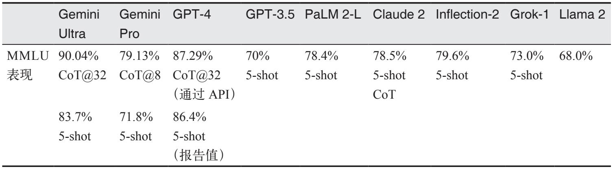

> **圖片描述：各大模型 MMLU 基準測試表現，Gemini Ultra 90.04%最高，Llama 2 為68.0%。**

**提示工程。**提示工程是指僅透過輸入提示詞來引導AI模型表現出期望的行為，而無須改變模型權重。Gemini的評估案例凸顯了提示工程對模型效能的影響。藉助不同的提示工程技術，Gemini Ultra在MMLU上的表現從83.7%提升到了90.04%。

僅憑提示詞，模型就能實作驚人的功能。恰當的提示詞可以讓模型按照期望的方式完成任務，並以指定的格式輸出結果。提示工程不僅僅是告訴模型做什麼，還包括為模型提供完成特定任務所需的上下文和工具。對於上下文較長的複雜任務，可能還需要為模型提供一個記憶管理系統，以便模型追蹤歷史資訊。第5章將討論提示工程，第6章將討論上下文構建（context construction）。

**AI界面。**AI介面是指為終端使用者建立的與AI應用互動的介面。在基礎模型問世之前，只有具備足夠資源開發AI模型的組織才能開發AI應用，這些應用通常嵌入在組織已有的產品中。例如，欺詐檢測被嵌入Stripe、Venmo和PayPal中，推薦系統則是社交網路和媒體應用（如Netflix、TikTok和Spotify）的一部分。

得益於基礎模型，任何人都可以構建AI應用。你可以將AI應用作為獨立產品發布，也可以將其嵌入其他產品中，包括第三方開發的產品。例如，ChatGPT和Perplexity是獨立產品；而GitHub Copilot通常作為VS Code的外掛使用；Grammarly則通常作為Google文件的瀏覽器擴展使用；Midjourney既可以透過其獨立的網頁應用使用，也可以透過整合在Discord中使用。

因此，我們需要相應的工具來為獨立的AI應用提供介面，或使AI更易於整合到現有產品中。以下是一些流行的AI應用介面形式。

- Streamlit、Gradio和Plotly Dash是構建AI網頁應用的常用工具。

·獨立的網頁、桌面和移動應用。

·瀏覽器擴展，允許使用者在瀏覽網頁時快速向AI模型傳送查詢。

·整合到Slack、Discord、微信和WhatsApp等聊天應用中的聊天機器人。

·許多產品（包括VS Code、Shopify和Microsoft 365）提供的API。開發者可以利用這些API將AI作為外掛或附加元件整合到自己的產品中；AI智慧體也可以利用這些API與外界互動，詳見第6章。

儘管聊天介面最為常用，但AI介面也可以是語音形式（如語音助手）或具身形式（如用於增強現實和虛擬現實）。

這些新型AI介面也為收集和提取使用者回饋帶來了新途徑。對話介面使使用者更易於透過自然語言提供回饋，但這種回饋往往更難提取。使用者回饋設計將在第10章中討論。

表1-6總結了相比在傳統ML工程中，應用開發各職責的重要性在AI工程中是如何變化的。

表1-6：AI工程與ML工程中應用開發各職責的重要性對比

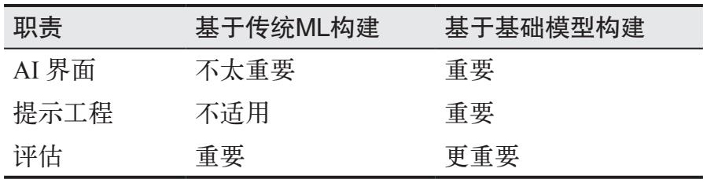

> **圖片描述：傳統 ML 與基礎模型構建的 AI 介面、提示工程、評估職責對比表格。**

### 1.4.3 AI工程與全棧工程
- Anton Bacaj曾告訴我：“AI工程其實就是在軟體工程的技術棧中加入了AI模型。”

隨著人們對應用開發——尤其是使用者介面重視程度的提高，AI工程與全棧開發的距離日益縮小。介面重要性的提升促使AI工具的設計發生演變，旨在吸引更多前端工程師加入。傳統ML工程通常以Python為中心。在基礎模型出現之前，最流行的ML框架大多隻支援Python API。如今，雖然Python仍然流行，但對JavaScript API的支援也在不斷完善，例如LangChain.js、Transformers.js、OpenAI的Node函式庫以及Vercel的AI SDK。

許多AI工程師來自傳統ML領域，同時也有越來越多的AI工程師來自網頁開發或全棧開發領域。與傳統ML工程師相比，全棧工程師的優勢在於他們能夠快速將想法轉化為演示產品，獲取回饋並快速進行迭代。

在傳統ML工程中，通常需要先收集資料並訓練模型，最後才構建產品。然而，如今AI模型已現成可用，因此可以先構建產品，待產品展現出潛力後，再在資料和模型上進行投入，如圖1-16所示。

> **圖片描述：ML 工程（資料→模型→產品）與 AI 工程（產品→資料→模型）的流程對比。**

圖1-16：新的AI工程工作流青睞那些能夠快速迭代的人。圖片重繪自Shawn Wang，“The Rise of the AI Engineer”，2023

在傳統ML工程中，模型開發和產品開發通常是相互分離的過程：在許多組織中，ML工程師很少參與產品決策。然而，隨著基礎模型的出現，AI工程師往往會更加深入地參與產品的構建過程。

## 1.5 小結
本章主要有兩個目的：一是解釋由於基礎模型的出現，AI工程作為一門獨立學科逐漸興起；二是概述基於這些模型構建應用所需的流程。希望本章已實作了這一目標。作為概述內容，本章僅簡要介紹了許多概念，這些概念將在本書後續進一步深入探討。

本章討論了近年來AI的快速發展，回顧了一些最顯著的轉變，例如從語言模型向大語言模型的演進，這得益於一種稱為自監督的訓練方法。隨後，本章闡述了語言模型如何融合其他資料模態演變為基礎模型，以及基礎模型如何催生了AI工程。

AI工程的快速發展得益於基礎模型湧現出的新能力所帶來的眾多應用。本章討論了一些最成功的應用模式，涵蓋面向消費者和麵向企業的應用。儘管已有大量AI應用投入生產，但AI工程仍處於早期階段，未來還有無數創新等待實作。

在構建應用之前，一個重要但經常被忽視的問題是：是否真的應該構建這個應用。本章討論了這一問題，並介紹了構建AI應用時需要考慮的主要因素。

雖然AI工程是一個新術語，但它是從ML工程演變而來的。ML工程是一門涵蓋廣泛的學科，涉及使用各種ML模型構建應用。ML工程中的許多原則在AI工程中仍然適用。然而，AI工程不僅帶來了新的挑戰，也催生了新的解決方案。本章最後一節討論了AI工程技術棧，以及它相較於ML工程發生了哪些變化。

AI工程有一個方面特別難以用文字描述，那就是整個社群匯聚的巨大的熱情、豐富的創造力和卓越的工程人才。這種集體熱情往往令人應接不暇，因為新技術、新發現和新的工程成就似乎正不斷湧現。

所幸，由於AI擅長資訊聚合，它可以幫助我們彙總和總結所有這些新進展。但工具的幫助畢竟有限，一個領域越是令人感到紛繁複雜，就越需要一個框架來幫助我們釐清思路。本書的目的正是提供這樣一個框架。

本書的其餘部分將循序漸進地探討這一框架，首先從AI工程的基礎構建模組——基礎模型講起，正是它們讓如此多令人驚歎的應用成為了可能。