# 第2章 理解基礎模型
要基於基礎模型構建應用，首先得了解模型本身。雖然你不需要知道如何從頭開發模型就能使用它們，但對模型有個整體理解可以幫助你決定選擇哪種模型，以及如何根據需求對其進行調整。

訓練基礎模型是一個極其複雜且昂貴的過程。真正掌握核心技術的人，通常受限於保密協議而無法透露細節。本章不會教你如何構建一個能與ChatGPT競爭的模型，而是重點關注那些對下游應用產生重要影響的設計決策。

隨著基礎模型訓練過程越來越不透明，我們很難了解構建模型時的全部設計決策。然而，總體而言，基礎模型之間的差異主要源於訓練資料、模型架構和規模，以及透過後訓練使其與人類偏好對齊等方面的決策。

由於模型從資料中學習，因此訓練資料在很大程度上決定了模型的能力和局限性。本章首先介紹模型開發者如何選擇訓練資料，重點關注訓練資料的分佈。第8章將詳細探討資料集工程技術，包括資料質量評估和資料合成。

鑑於Transformer架構的主導地位，模型架構的選擇空間似乎非常有限。你可能會好奇，Transformer架構究竟有什麼特別之處，使其能夠持續佔據主導地位？還要多久才會出現替代架構？這種新架構可能是什麼樣的？本章將回答這些問題。此外，每當新模型發布時，人們首先關注的往往是它的規模。本章還將探討模型開發者如何確定模型的規模。

如第1章所述，模型的訓練過程通常分為預訓練和後訓練。預訓練賦予模型一定的能力，但並不意味著模型就安全或易用。這正是後訓練的用武之地。後訓練的目標是實作模型與人類偏好的對齊。但究竟什麼是**人類偏好**？如何將其轉化為模型能夠學習的形式？模型開發者如何實作這種對齊，將極大地影響模型的可用性，本章將對此進行討論。

雖然大多數人都理解訓練對模型效能的影響，但**採樣**的使用卻常被忽視。取樣是模型從所有可能的選項中生成輸出的過程，這可能是AI領域最被低估的概念之一。取樣解釋了許多看似令人困惑的AI行為（包括幻覺和不一致性），而且選擇合適的取樣策略還能以相對較小的代價顯著提升模型效能。因此，取樣是本章的重點內容。

本章介紹的概念對於理解本書後續內容至關重要。不過，由於這些概念比較基礎，你可能已經有所瞭解。如果你已經掌握了某個概念，可以直接跳過。如果日後遇到任何困惑之處，可以再回頭查閱本章。

## 2.1 訓練資料
AI模型的表現取決於其訓練資料的質量。如果訓練資料中不包含越南語內容，模型就無法將英語翻譯成越南語。同樣，如果影像分類模型的訓練集中只有動物圖片，那麼它在識別植物圖片時的表現就不會理想。

如果你希望模型在某項任務上表現更好，可能需要在訓練資料中增加與該任務相關的資料量。然而，為大模型收集足夠的訓練資料並非易事，而且成本可能很高。模型開發者通常不得不依賴現有的資料，即使這些資料並不完全符合需求。

例如，一個常見的訓練資料來源是Common Crawl，該專案由一個非營利組織建立，不定期地抓取網際網路上的網站內容。2022年至2023年間，該組織每月大約抓取20億到30億個網頁。谷歌提供了一個經過清理的Common Crawl子集，稱為Colossal Clean Crawled Corpus，簡稱C4（Raffel等，“Exploring the Limits of Transfer Learning with a Unified Text-to-Text Transformer”，2019）。

Common Crawl（在一定程度上也包括C4）的資料質量存疑——其中充斥著標題黨、虛假資訊、政治宣傳、陰謀論、種族主義、厭女言論，以及各種你在網上見過或避之唯恐不及的可疑網站。《華盛頓郵報》的一項研究顯示，在該資料集中最常見的1000個網站中，部分媒體在NewsGuard的可信度評分（參見NewsGuard網站的“News Reliability Ratings”）中排名較低（參見“Inside the secret list of websites that make AI like ChatGPT sound smart”）。通俗地說，Common Crawl中包含了大量的假新聞。

然而，僅僅因為Common Crawl易於獲取，大多數公開訓練資料來源的基礎模型（包括OpenAI的GPT-3和谷歌的Gemini）採用了它的各種變體。我懷疑那些未公開訓練資料的模型也使用了Common Crawl。為了避免公眾和競爭對手的審查，許多公司已不再公開此類資訊。

一些團隊使用啟發式方法過濾網際網路上的低質量資料。例如，OpenAI在訓練GPT-2時，僅使用了在Reddit上獲得至少3個讚的連結（Radford等，“Language Models are Unsupervised Multitask Learners”，2019）。雖然這種方法確實能篩除那些無人關注的連結，但Reddit本身也並非得體和品味的典範。

這種“使用現有資料，而非理想資料”的方法可能導致模型在訓練資料覆蓋的任務上表現良好，但未必能在你真正關注的任務上表現出色。為了解決這個問題，精心選擇符合特定需求的資料集至關重要。本節重點介紹如何為特定**語言**和**領域**選擇資料，從而為該範圍內的應用奠定廣泛而專業的基礎。第8章將探討針對特定任務的模型的資料策略。

我們既可以從零開始訓練特定語言或領域的基礎模型，也可以在通用模型的基礎上進行微調。

有人可能會問，為什麼不直接利用所有可用的資料（包括通用資料和專業資料）訓練一個模型，使其能夠處理所有任務呢？事實上，許多人確實是這樣做的。然而，使用更多資料進行訓練通常意味著需要更多的計算資源，卻未必總能帶來效能提升。例如，使用少量高質量資料訓練的模型可能會勝過使用大量低質量資料訓練的模型。Gunasekar等利用70億個高質量程式碼資料token，訓練了一個13億引數的模型，在幾個重要的程式碼基準測試中，其表現優於規模更大的模型（“Textbooks Are All You Need”，2023）。關於資料質量的影響將在第8章中進一步討論。

### 2.1.1 多語言模型
英語在網際網路上佔據主導地位。對Common Crawl資料集的分析表明，英語資料佔比接近一半（45.88%），比排名第二的俄語（5.97%）多出約8倍（Lai等，“ChatGPT Beyond English: Towards a Comprehensive Evaluation of Large Language Models in MultilingualLearning”，2023）。表2-1列出了在Common Crawl中的佔比至少達到1%的語言。那些訓練資料有限的語言——通常指未出現在此表中的語言——被稱為**低資源語言。**

表2-1：用於訓練LLM的熱門資料集Common Crawl中最常見的語言。來源：Lai等，2023

 *
- 分別簡稱世界人口占比與Common Crawl佔比。——編者注

儘管許多其他語言如今擁有大量使用者，但其在Common Crawl資料集中卻嚴重缺乏代表性，表2-2展示了其中一些例子。在理想情況下，某種語言使用者在世界人口中的佔比與其在Common Crawl中的佔比之間的比值應為1。比值越高，說明該語言在Common Crawl中的代表性越不足。

表2-2：Common Crawl中代表性不足的語言範例。最後一行的英語用於對比。Common Crawl佔比資料來源於Lai等，2023

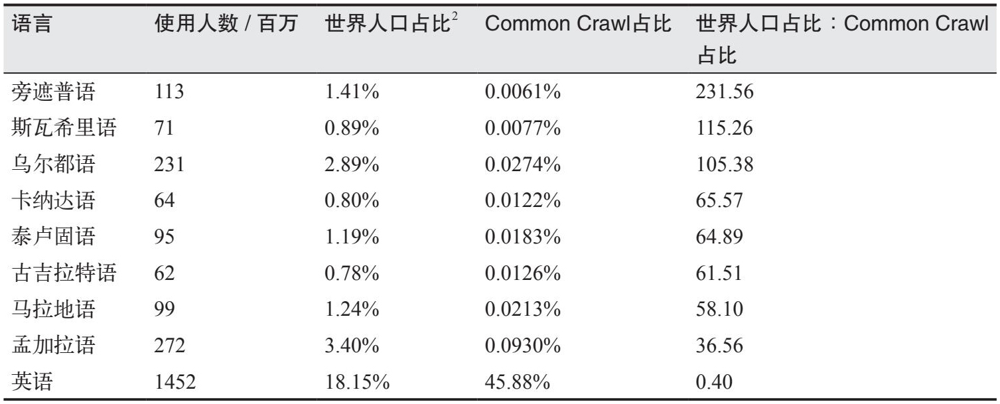

> **圖片描述：Common Crawl 中代表性不足的語言表格，旁遮普語比值231.56（最不足），英語0.40（過度代表）。**

注2：此處計算使用的世界人口為80億。

多項研究表明，通用模型在英語任務上的表現遠優於其他語言。考慮到英語在網際網路資料中的主導地位，這也就不足為奇了。例如，在MMLU基準測試（涵蓋57個學科的14,000道選擇題）中，GPT-4在英語上的表現遠優於泰盧固語等代表性不足的語言，如圖2-1所示（OpenAI，“GPT-4 Technical Report”，2023）。

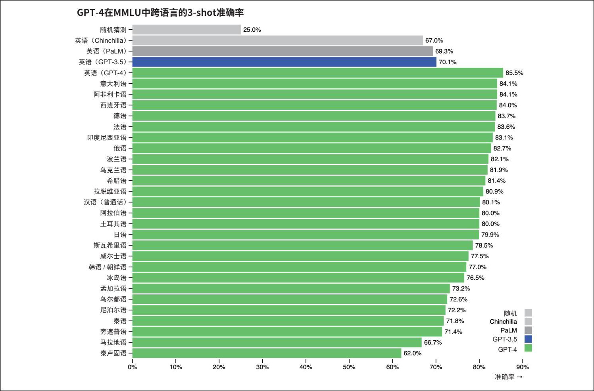

> **圖片描述：GPT-4 各語言 MMLU 3-shot 準確率長條圖，英語約87%最高，低資源語言降至60%以下。**

圖2-1：在MMLU基準測試中，GPT-4在英語上的表現優於其他語言。為了獲取其他語言版本的MMLU，OpenAI使用Azure AI Translator對題目進行了翻譯

- 參見Yennie Jun撰寫的“GPT-4 can solve math problems — but not in all languages”。你可以使用OpenAI的分詞器（tokenizer）驗證該研究。

類似地，Yennie Jun在Project Euler的6道數學題測試中發現，GPT-4使用英語成功解題的次數是使用亞美尼亞語或波斯語的3倍以上。而在處理緬甸語和阿姆哈拉語的6道題目時，GPT-4全部失敗，如圖2-2所示。

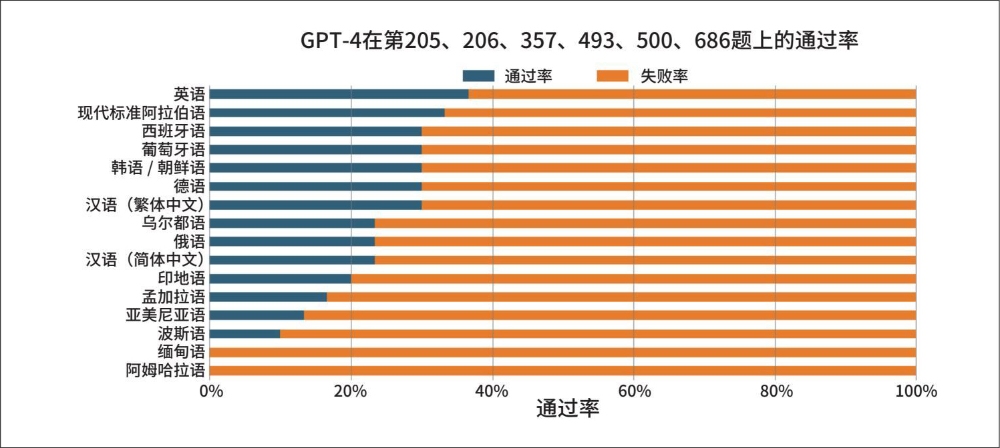

> **圖片描述：GPT-4 在 Project Euler 數學題上不同語言的通過率，英語最高，緬甸語和阿姆哈拉語為0%。**

圖2-2：GPT-4在英語上的數學題測試表現遠優於其他語言

表現不佳的一個重要原因是資料代表性不足。在GPT-4的MMLU基準測試中表現最差的3種語言——泰盧固語、馬拉地語和旁遮普語——也恰恰是Common Crawl資料集中代表性不足最為突出的語言。然而，代表性不足並非唯一原因，語言的結構及其所體現的文化差異也可能增加模型學習該語言的難度。

既然LLM通常擅長翻譯，我們是否可以將所有非英語語言的查詢翻譯成英語，獲取回答後再翻譯回原語言呢？許多人確實採用了這種方法，但它並不理想。首先，這種方法要求模型能夠充分理解代表性不足的語言，才能進行準確的翻譯。其次，翻譯過程可能導致資訊丟失。例如，越南語中有專門的代詞來表示兩個說話者之間的關係，但在翻譯成英文時，這些代詞通常會變成I和you，導致關係資訊的丟失。

- 這可能是由於預訓練資料或對齊資料存在某些偏差。也許OpenAI在訓練模型時，沒有足夠多的中文資料或以特定話題為中心的文字。

此外，模型在處理非英語語言時可能會出現意想不到的效能問題。例如，NewsGuard發現，ChatGPT在中文語境下比在英文語境下更容易生成虛假資訊。2023年4月，NewsGuard要求ChatGPT-3.5分別用英語、簡體中文和繁體中文生成某些包含虛假資訊的文章。結果顯示，對於7段生成虛假內容請求的提示詞：在使用英語時，ChatGPT拒絕了6次；但在使用簡體中文和繁體中文時，7次全部生成了虛假內容（參見“NewsGuard Exclusive: ChatGPT-3.5 Generates More Disinformation in Chinese than in English”）。目前尚不清楚導致這種行為差異的確切原因。

除了質量問題，模型在處理非英語語言時往往速度更慢且成本更高。模型的推理延遲和成本與輸入/輸出中的token數成正比。事實證明，某些語言的分詞效率遠低於其他語言。Yennie Jun在MASSIVE資料集（包含100萬條短文字，並翻譯成52種語言）上對GPT-4進行基準測試後發現，要表達相同的含義，緬甸語和印地語等語言所需的token數遠遠超過英語或西班牙語。在MASSIVE資料集中，英語的token數的中位數為7，而印地語為32，緬甸語則高達72，大約是英語的10倍（參見“All languages are NOT created(tokenized) equal”）。

假設生成一個token的時間在所有語言中相同，那麼GPT-4用緬甸語生成相同內容所需的時間大約是英語的10倍。對於按token使用量收費的API來說，緬甸語的成本也比英語高出10倍。

為了解決這一問題，許多模型專門針對非英語語言進行了訓練。除英語模型之外，目前最活躍的無疑是中文模型，例如ChatGLM、YAYI、Llama-Chinese等。此外，還有法語模型CroissantLLM、越南語模型PhoGPT、阿拉伯語模型Jais等許多其他語言的模型。

### 2.1.2 領域特定模型
- “Inside the secret list of websites that make AI like ChatGPT sound smart”，《華盛頓郵報》，2023。

像Gemini系列、GPT系列和Llama系列這樣的通用模型，在許多領域都表現出色，包括但不限於程式設計、法律、科學、商業、體育和環境科學。這主要歸功於模型的訓練資料中包含了這些領域的資料。圖2-3展示了根據《華盛頓郵報》2023年的分析，C4資料集中各領域的分佈情況。

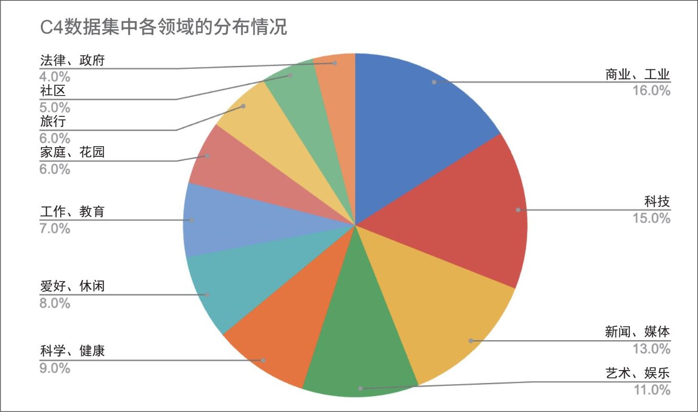

> **圖片描述：C4 資料集領域分佈圓餅圖，商業/工業16%最大，其次科技15%、新聞/媒體13%。**

圖2-3：C4資料集中各領域的分佈情況。資料來自《華盛頓郵報》的統計分析。需要注意的是，這個分析只展示了已包含的類別，而未涉及缺失的類別

- 對於文字，可以使用領域關鍵詞作為啟發式方法，但影像分類並沒有明顯的啟發式方法。我能找到的大多數關於視覺資料集的分析都是關於影像尺寸、解析度或影片長度的。

截至本書撰寫時，針對視覺資料中領域分佈的分析還不多，這可能是因為影像比文字更難分類。然而，我們可以透過模型在基準測試中的表現來推斷其擅長的領域。表2-3展示了CLIP和OpenCLIP這兩個模型在不同基準測試上的表現（Beaumont，“LAION-5B: A New Era of Open Large-Scale Multi-Modal Datasets”，2022）。這些基準測試展示了這兩個模型在鳥類、花卉、汽車等幾個類別上的表現，但現實世界遠比這些類別更加廣泛和複雜。

表2-3：CLIP和OpenCLIP在不同影像資料集上的表現

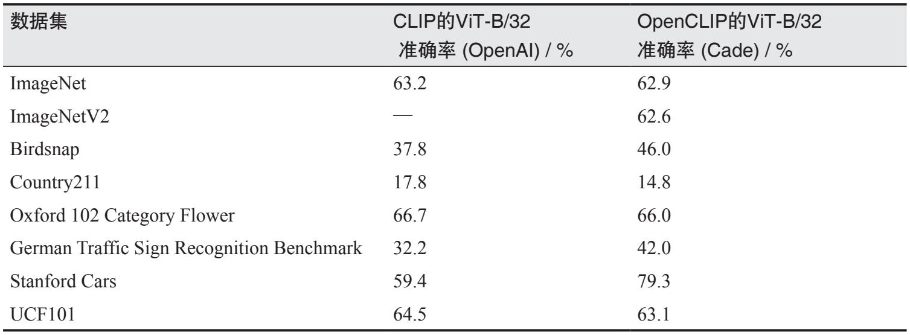

> **圖片描述：CLIP 與 OpenCLIP 在多個視覺基準資料集上的準確率對比表格。**

儘管通用基礎模型可以回答不同領域的日常問題，但它們在特定領域任務上的表現可能並不理想，尤其是當它們在訓練過程中從未接觸過這些任務時。特定領域任務的兩個例子是藥物發現和癌症篩查。藥物發現涉及蛋白質、DNA和RNA資料，這些資料遵循特定格式且獲取成本高昂，不太可能出現在公開的網際網路資料中。同樣，癌症篩查通常涉及X射線和fMRI（功能磁共振成像）掃描，由於隱私問題，這些資料也很難獲得。

為了訓練一個在這些特定領域任務上表現出色的模型，可能需要精心篩選非常具體的資料集。其中最著名的領域特定模型之一可能是DeepMind的AlphaFold，它使用了大約10萬個已知蛋白質的序列和三維結構進行訓練。NVIDIA的BioNeMo是另一個專注於藥物發現領域生物分子資料的模型。谷歌的Med-PaLM 2則結合了LLM與醫學資料，能夠以更高的準確率回答醫學問題。

> **圖片描述：O'Reilly 書籍裝飾圖示，綠色捲尾蜥蜴剪影，第2章識別標誌。**

 領域特定模型在生物醫學領域尤其常見，但其他領域也能從此類模型中受益。例如，基於建築草圖訓練的模型可能會比Stable Diffusion更好地輔助建築師，而基於工廠規劃圖訓練的模型可能比ChatGPT這樣的通用模型更適合最佳化製造流程。

本節從總體上概述了訓練資料如何影響模型效能。接下來，我們將探討模型的設計對效能的影響。

## 2.2 建模
- 本書不涉及與模型訓練相關的5個ML基礎知識。但在涉及相關內容時，我會適時介紹一些概念。例如，第1章介紹了自監督（模型從資料中生成自身標籤），第7章討論了反向傳播（模型在訓練過程中根據誤差更新引數的方法）。

在訓練模型之前，開發人員需要決定模型的設計方案。它應該採用哪種架構？應該包含多少引數？這些決策不僅影響模型的能力，也影響模型在下游應用中的可用性。例如，一個擁有70億個引數的模型比一個擁有1750億個引數的模型更容易部署。同樣，最佳化一個Transformer模型的延遲與最佳化其他架構模型的延遲也大相徑庭。下面我們來探討這些決策背後的因素。

### 2.2.1 模型架構
截至本書撰寫時，語言基礎模型的主流架構是基於注意力機制的Transformer架構（Vaswani等，“Attention Is All You Need”，2017）。Transformer架構解決了此前許多架構存在的局限性問題，因而廣受歡迎。然而，Transformer架構本身也存在一定的局限性。本節將分析Transformer架構及其替代方案。由於本節涉及不同架構的技術細節，內容可能較為複雜。如果你覺得某部分內容過於深入，可以選擇跳過。

**1. Transformer架構**

為了理解Transformer，我們先來看一下它要解決的問題。Transformer架構是在seq2seq（sequence-to-sequence，序列到序列）架構（Sutskever等，“Sequence to Sequence Learning with Neural Networks”，2014）取得成功之後流行起來的。2014年首次提出時，seq2seq在當時頗具挑戰性的任務（機器翻譯和文字摘要）上取得了顯著的效能提升。2016年，谷歌將seq2seq整合到Google翻譯中，稱此次更新帶來了“迄今為止機器翻譯質量的最大提升”（參見“A Neural Network for Machine Translation, at Production Scale”）。這引發了人們對seq2seq的極大興趣，使其成為處理文字序列任務的首選架構。

從整體上看，seq2seq包含一個處理輸入的編碼器和一個生成輸出的解碼器。輸入和輸出都是由token組成的序列，因此得名seq2seq。seq2seq使用迴圈神經網路（recurrent neural network，RNN）作為其編碼器和解碼器。在最基本的形式中，編碼器依次處理輸入token，並輸出表示輸入的最終隱藏狀態。解碼器則依次生成輸出token，每個輸出token的生成都取決於輸入的最終隱藏狀態和之前生成的token。seq2seq架構的示意圖如圖2-4上半部分所示。

- 由於其迴圈結構，RNN特別容易出現梯度消失和梯度爆炸問題。梯度需要透過多個步驟傳播，如果梯度很小，在多次相乘後會趨於零，導致模型難以學習。相反，如果梯度很大，每一步都會呈指數級增長，導致學習過程不穩定。

Vaswani等（2017）解決了seq2seq架構的兩個主要問題。首先，原始的seq2seq解碼器僅使用輸入序列的最終隱藏狀態來生成輸出token。形象地說，這就像只根據一本書的摘要來回答關於這本書的問題，從而限制了輸出的質量。其次，RNN編碼器和解碼器的順序處理特性導致輸入處理和輸出生成必須按順序進行，這使得處理長序列時速度較慢。如果輸入長度為200個token，seq2seq必須等待每個輸入token處理完畢後才能繼續處理下一個。

Transformer架構透過注意力機制解決了這兩個問題。注意力機制允許模型在生成每個輸出token時權衡不同輸入token的重要性。這類似於可以透過參考書中的任意頁面來回答問題。圖2-4的下半部分展示了Transformer架構的簡化示意圖。

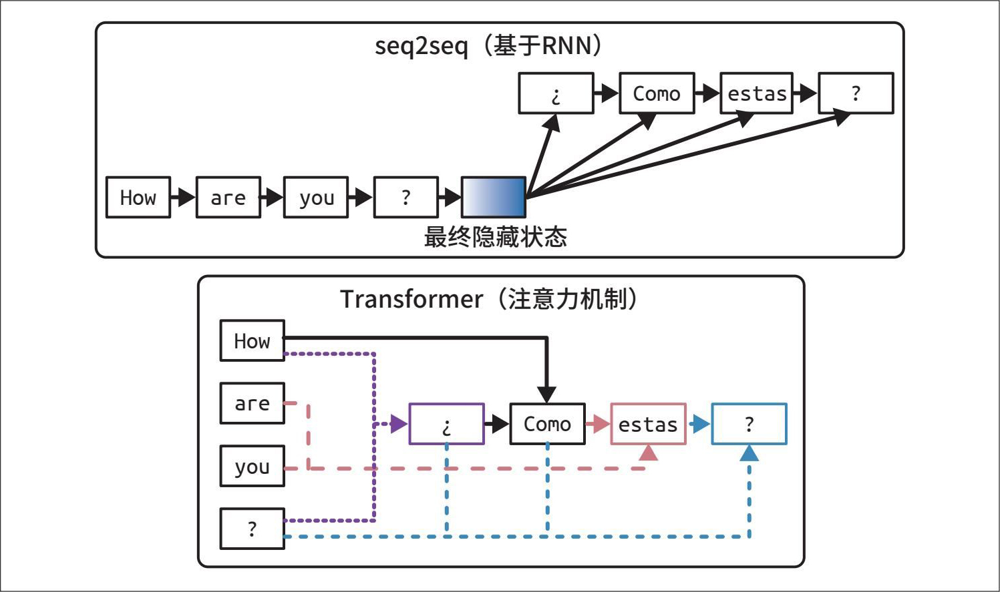

> **圖片描述：seq2seq（RNN）與 Transformer（注意力機制）架構對比圖，展示 Transformer 平行處理的優勢。**

圖2-4：seq2seq架構與Transformer架構的對比。在Transformer架構中，箭頭表示解碼器在生成每個輸出token時所關注的輸入token

> **圖片描述：O'Reilly 書籍裝飾圖示，藍色烏鴉剪影。**

- Bahdanau等，“Neural Machine Translation by Jointly Learning to Align and Translate”，2014。

 儘管提到注意力機制時，大家往往第一時間想到Transformer模型，但它實際上早在Transformer論文發表前3年就已被提出。注意力機制也可以與其他架構結合使用。2016年，谷歌在其GNMT（Google Neural Machine Translation，谷歌神經機器翻譯）模型的seq2seq架構中就引入了注意力機制。然而，直到Transformer的論文證明注意力機制可以不再依賴RNN而獨立使用後，這種方法才真正流行起來。

Transformer架構完全摒棄了RNN。使用Transformer時，輸入token可以並行處理，從而顯著加快了輸入處理速度。雖然Transformer消除了輸入端的順序處理瓶頸，但基於Transformer的自迴歸語言模型在輸出端仍然存在順序瓶頸。

因此，基於Transformer的語言模型推理過程包括以下兩個步驟。

**預填充**

模型並行處理輸入token。這一步建立生成第一個輸出token所需的中間狀態。該中間狀態包括所有輸入token對應的鍵向量和值向量。

**解碼**

模型逐個生成輸出token。

正如第9章所探討的，預填充的並行特性和解碼的順序特性推動了許多最佳化技術的發展，旨在降低語言模型推理的成本並提高推理速度。

**注意力機制。**注意力機制是Transformer架構的核心，理解這一機制對於掌握Transformer模型的工作原理至關重要。在實作上，注意力機制使用了查詢向量（query，**Q***）、鍵向量（key，***K***）和值向量（value，***V***）。

·查詢向量表示解碼器在每個解碼步驟的當前狀態。仍以圖書摘要為例，查詢向量可以被看作正在尋找資訊以生成摘要的人。

·每個鍵向量代表一個前序token。如果將每個前序token看作書中的一頁，那麼鍵向量就像頁碼。注意，在某個解碼步驟中，前序token既包括輸入的token，也包括之前生成的token。

·每個值向量表示模型學到的前序token的實際內容。值向量就像每一頁上的內容。

注意力機制透過計算查詢向量與鍵向量之間的**點積**，來確定對輸入token分配多少注意力。得分越高，意味著模型在生成圖書摘要時會更多地使用該頁的內容（其值向量）。圖2-5展示了注意力機制中查詢向量、鍵向量和值向量的視覺化範例。在該範例中，查詢向量正從前序token（How, are, you, ?, ¿）中尋找資訊，以生成下一個token。

 *

圖2-5：注意力機制執行範例，以及來自著名的Transformer論文“Attention Is All You Need”（Vaswani等，2017）的抽象視覺化示意圖

由於每個前序token都有對應的鍵向量和值向量，因此序列越長，需要計算和儲存的鍵向量和值向量就越多。這也是擴展Transformer模型的上下文長度如此困難的原因之一。第7章和第9章將討論如何高效地計算和儲存鍵向量和值向量。

我們再來看看注意力函式的具體工作方式。給定一個輸入 *x*，鍵向量、值向量和查詢向量是透過將鍵矩陣、值矩陣和查詢矩陣分別作用於輸入而計算得到的。設 ***W_K***、***W_V*** 和 ***W_Q*** 分別為鍵矩陣、值矩陣和查詢矩陣，則鍵向量、值向量和查詢向量的計算方式如下。

 *
- 由於輸入的token是以批次（batch）形式處理的，因此實際輸入向量的維度為N×T×4096，其中N為批次大小，T為序列長度。同理，每個生成的向量K、V、Q的維度也為N×T×4096。

查詢矩陣、鍵矩陣和值矩陣的維度對應於模型的隱藏維度。例如，在Llama 2-7B模型（Touvron等，“Llama 2: Open Foundation and Fine-Tuned Chat Models”，2023）中，模型的隱藏維度為4096，這意味著這些矩陣的維度都是4096×4096。因此，每個計算得到的 ***K***、***V***、***Q*** 向量的維度也都是4096。
 [ *](#footnote-11-177)

注意力機制幾乎都採用多頭形式。多個注意力頭允許模型同時關注前序token的不同部分。在多頭注意力中，查詢向量、鍵向量和值向量會被拆分成更小的子向量，每個子向量對應一個注意力頭。例如在Llama 2-7B模型中，由於它有32個注意力頭，每個**K***、***V***、***Q***向量都會被拆分成32個維度為128的子向量（因為4096/32=128）。

 *

所有注意力頭的輸出隨後會被拼接。拼接後的輸出再透過一個輸出投影矩陣進行變換，然後送入模型的下一步計算。輸出投影矩陣的維度與模型的隱藏維度相同。

**Transformer模塊。**我們已經討論了注意力機制的工作原理，接下來看看它如何在模型中使用。Transformer架構由多個Transformer模組組成。具體內容因模型而異，但通常，每個Transformer模組都包含一個注意力模組和一個MLP（multi-layer perceptron，多層感知機）模組。

**注意力模塊**

每個注意力模組包含4個權重矩陣：鍵矩陣、值矩陣、查詢矩陣和輸出投影矩陣。

**MLP模塊**

MLP模組由線性層和**非線性激活函數**交替組成。每個線性層都是一個用於線性變換的權重矩陣，而非線性啟用函式使得線性層能夠學習非線性模式。線性層也稱為前饋層（feedforward layer）。

- 為什麼簡單的啟用函式在LLM這樣複雜的模型中也能有效？曾經有一段時間，研究界競相提出複雜的啟用函式。但事實證明，更復雜的啟用函式並沒有帶來更好的效果。模型只需要一個非線性函式來打破前饋層的線性。更簡單、計算更快的函式通常效果更好，因為複雜的函式會佔用過多的訓練計算資源和記憶體。

常見的非線性函式包括ReLU（Rectified Linear Unit，修正線性單元，Agarap，“Deep Learning using Rectified Linear Units (ReLU)”，2018）和GELU（Gaussian Error Linear Unit，高斯誤差線性單元，Hendrycks和Gimpel，“Gaussian Error Linear Units (GELUs)”，2016），GPT-2和GPT-3分別使用了這兩種函式。啟用函式通常非常簡單。例如，ReLU的作用僅僅是將負值變為0，數學表示式為：

> **圖片描述：ReLU 激活函數公式：ReLU(x) = max(0, x)。**

Transformer模型中Transformer模組的數量通常被稱為該模型的層數。基於Transformer的語言模型在所有Transformer模組前後還配備了以下額外的模組。

**Transformer模塊之前的嵌入模塊**

該模組包括嵌入矩陣和位置嵌入矩陣，分別將token及其位置轉換為嵌入向量。簡單來說，位置索引的數量決定了模型的最大上下文長度。如果一個模型支援2048個位置索引，那麼它的最大上下文長度就是2048。不過，也有一些技術可以在不增加位置索引數量的情況下增加模型的上下文長度。

**Transformer模塊之後的輸出層**

該模組將模型輸出的向量對映為用於對模型輸出進行取樣的token機率（參見2.4節）。該模組通常由一個矩陣組成，也稱為**解嵌入層**（unembedding layer）。有些人將輸出層稱為模型**頭**，因為它是模型生成輸出前的最後一層。

圖2-6展示了Transformer模型的架構。Transformer模型的大小由其各組成部分的維度決定，其中一些關鍵數值包括：

·模型維度，決定了Transformer模組中鍵矩陣、值矩陣、查詢矩陣和輸出投影矩陣的大小；

·Transformer模組的數量；

·前饋層的維度；

·詞表大小。

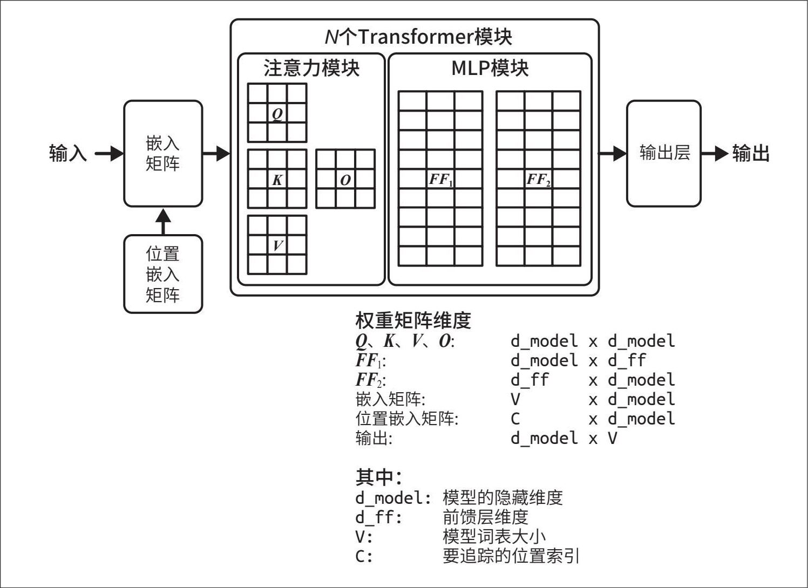

> **圖片描述：Transformer 模型架構圖：輸入→嵌入矩陣→N個 Transformer 模組（注意力+MLP）→輸出，並列出各權重矩陣維度。**

圖2-6：Transformer模型權重組成的視覺化

維度越大，模型規模就越大。表2-4展示了不同規模的Llama 2和Llama 3（Grattafiori等，“The Llama 3 Herd of Models”，2024）模型的維度。注意，雖然增加上下文長度會影響模型的記憶體佔用，但不會影響模型引數的總數量。

表2-4：不同Llama模型的維度

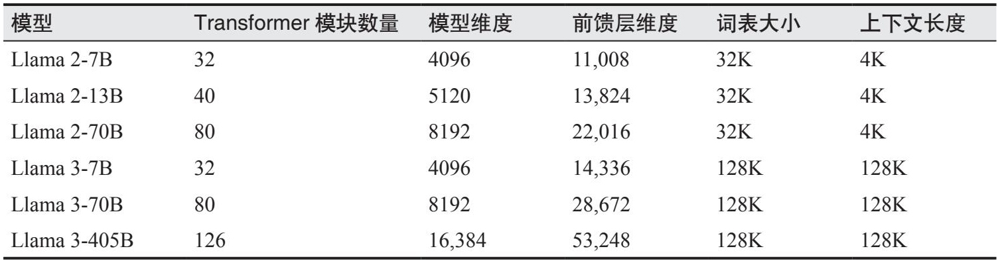

> **圖片描述：Llama 2/3 系列模型參數表，從 7B 到 405B 的層數、維度、詞表和上下文長度。**

**2. 其他模型架構**

- 有趣的是，OpenAI聯合創始人Ilya Sutskever既是seq2seq論文的第一作者，也是AlexNet論文的第二作者。

雖然Transformer模型佔據了主導地位，但它並非唯一的架構。自從AlexNet在2012年重燃了人們對深度學習的興趣以來，許多架構曾經風靡一時，又逐漸淡出視野。seq2seq在2014年至2018年備受關注。GAN（generative adversarial network，生成式對抗網路，Goodfellow等，“Generative Adversarial Networks”，2014）吸引人們關注的時間則更長（2014年至2019年）。與之前的架構相比，Transformer的生命力更為持久，自2017年流行至今。那麼，何時才會出現更好的架構呢？

- 對於為什麼開發出能超越現有架構的新神經網路架構如此困難，Ilya Sutskever提出了一個有趣的觀點。他認為，神經網路擅長模擬許多電腦程式。梯度下降這種訓練神經網路的技術，本質上是一種搜尋演算法，旨在從神經網路能夠模擬的所有程式中尋找最適合目標任務的那一個。這意味著新架構可能也會被現有架構模擬。因此，新架構要想超越現有架構，就必須能夠模擬現有架構無法模擬的程式。更多資訊，請觀看Sutskever在美國加州大學伯克利分校Simons研究所的演講（2023）。

- Transformer最初是由谷歌設計的，旨在TPU（tensor processing unit，張量處理單元）上快速執行（參見“TPUs vs GPUs for Transformers (BERT)”），後來才針對GPU進行了最佳化。

開發一種超越Transformer的新架構絕非易事。自2017年以來，Transformer已經過了大量最佳化。任何想要取代Transformer的新架構都必須在使用者關注的規模和硬體上表現出色。

不過，這也並非毫無希望。雖然截至目前Transformer模型仍占主導地位，但一些替代架構也開始逐漸受到關注。

其中一種流行的模型是RWKV（Peng等，“RWKV: Reinventing RNNs for the Transformer Era”，2023），它是一種基於RNN的模型，可以實作並行化訓練。由於其RNN的特性，理論上它不像基於Transformer的模型那樣存在上下文長度限制。然而在實踐中，沒有上下文長度限制並不意味著就能在長上下文下獲得良好的效能。

對長序列建模仍然是開發LLM的核心挑戰之一。在長程記憶方面表現出巨大潛力的一種架構是SSM（state space model，狀態空間模型，Gu等，“Combining Recurrent, Convolutional, and Continuous-time Models with Linear State-Space Layers”，2021）。自2021年該架構被提出以來，研究人員引入了多種技術，使該架構更加高效、更擅長處理長序列，並能夠擴展到更大的模型規模。以下列舉了一些相關技術，以展示這種新架構的發展歷程。

·S4：在論文“Efficiently Modeling Long Sequences with Structured State Spaces”（Gu等，2021）中提出，旨在提高SSM的效率。

·H3：在論文“Hungry Hungry Hippos: Towards Language Modeling with State Space Models”（Fu等，2022）中提出，引入了一種機制，使模型能夠“回憶”序列前期的token，並在序列內部進行token比較。這種機制的作用類似於Transformer架構中的注意力機制，但效率更高。

·Mamba：在論文“Mamba: Linear-Time Sequence Modeling with Selective State Spaces”（Gu和Dao，2023）中提出，將SSM擴展到了30億引數規模。在語言建模任務中，Mamba-3B的效能超過了同規模的Transformer，並與規模為其兩倍的Transformer相當。作者還表明，Mamba的推理計算量隨序列長度線性增長（相比之下，Transformer的計算量隨序列長度呈二次增長）。在真實資料上，Mamba在序列長度達到百萬級時仍能表現出效能提升。

- 在提到GPU的“記憶體”時，本質上是指GPU的視訊記憶體（VRAM）。本書沿用工程師的習慣，稱之為“記憶體”。——編者注

·Jamba：在論文“Jamba: A Hybrid Transformer-Mamba Language Model”（Lieber等，2024）中首次提出，它透過交替使用Transformer層和Mamba層，進一步提升了SSM的規模。作者發布了一個混合專家（mixture-of-experts，MoE）模型，總引數量達到520億（Jamba-v0.1，啟用引數為120億），設計目標是能夠在單個80 GB記憶體的GPU上執行。Jamba在標準語言模型基準測試以及長上下文評估中表現出色，支援的上下文長度最高可達256K。與原始Transformer相比，它的記憶體佔用也更小。

圖2-7展示了Transformer、Mamba和Jamba層的結構。

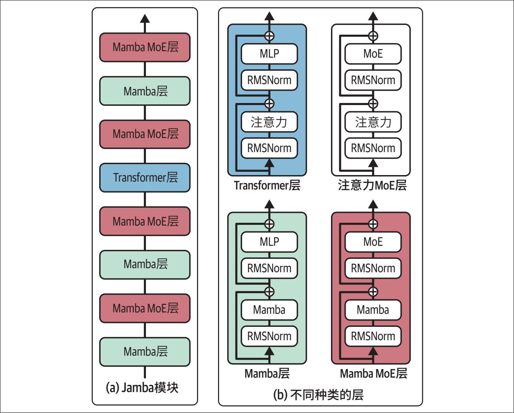

> **圖片描述：Jamba 模型架構圖，由 Mamba 層、Mamba MoE 層和 Transformer 層交替組成的混合架構。**

圖2-7：Transformer、Mamba和Jamba層的視覺化示意圖。圖片改編自Lieber等，“Jamba: A Hybrid Transformer-Mamba Language Model”，2024

儘管開發出一種超越Transformer的架構非常困難，但由於Transformer本身存在諸多局限，研究新架構仍然具有很大的吸引力。如果未來確實出現了超越Transformer的新架構，本書中討論的一些模型適配技術可能會發生變化。然而，正如從ML工程轉向AI工程時許多方法並未改變一樣，底層模型架構的更迭也不會影響基本的方法論。

### 2.2.2 模型規模
近年來AI的進步很大程度上得益於模型規模的增長。在討論基礎模型時，很難繞開模型的引數量這一話題。通常模型名稱的末尾會標註引數量，例如Llama-13B是指Meta開發的Llama模型家族中擁有130億個引數的版本。

一般來說，增加模型引數量會提升模型的學習能力，從而獲得更好的效能表現。在同一模型家族中，擁有130億個引數的模型通常會比擁有70億個引數的模型表現更佳。

> **圖片描述：O'Reilly 書籍裝飾圖示，藍色烏鴉剪影。**

 隨著研究人員對大模型訓練方法的理解不斷深入，新一代模型往往比同等規模的舊模型表現更好。例如，Llama 3-8B（Grattafiori等，“The Llama 3 Herd of Models”，2024）在MMLU基準測試上的表現甚至超過了Llama 2-70B（Touvron等，“Llama 2: Open Foundation and Fine-Tuned Chat Models”，2023）。

- 實際所需記憶體會更高。第7章將討論如何計算模型的記憶體使用情況。

引數量可以幫助我們估算訓練和執行模型所需的計算資源。例如，一個模型擁有70億個引數，如果每個引數使用2位元組（16位）儲存，那麼推理時GPU所需的記憶體至少為140億位元組（14 GB）。

如果模型是**稀疏**（sparse）的，那麼引數量可能具有誤導性。稀疏模型中有很大比例的引數值為零。例如，一個擁有70億個引數的模型，如果稀疏度達到90%，則只有7億個非零引數。稀疏性使得資料儲存和計算更加高效，這意味著一個規模較大的稀疏模型可能比規模較小的稠密模型所需的計算資源更少。

近年來，一種逐漸流行的稀疏模型類型是混合專家模型（Shazeer等，“Outrageously Large Neural Networks: The Sparsely-Gated Mixture-of-Experts Layer”，2017）。混合專家模型將引數分成不同的組，每一組被稱為一個專家。在處理每個token時，僅有部分專家處於**激活**狀態（被使用）。

例如，Mixtral 8x7B（Mistral AI團隊，“Mixtral of experts”，2023）是由8個專家組成的混合模型，每個專家擁有70億個引數。如果任意兩個專家之間沒有共享任何引數，那麼該模型應擁有8×70億=560億個引數。然而，由於部分引數被共享，實際引數量只有467億個。

在每一層中，針對每個token，僅有兩個專家處於啟用狀態。這意味著處理每個token實際啟用的引數量只有129億個。因此，儘管該模型擁有467億個引數，但其計算成本和推理速度與一個129億引數的模型相當。

如果訓練資料不足，引數量更大的模型表現可能還不如引數量較小的模型。試想一下，一個130億引數規模的模型僅用一句話作為資料集進行訓練：“我喜歡菠蘿。”這個模型的表現將遠遠不如一個使用更多資料訓練的小得多的模型。

在討論模型規模時，必須考慮訓練資料的規模。對於大多數模型而言，資料集的規模通常用訓練樣本的數量來衡量。例如，谷歌的Flamingo模型（Alayrac等，Flamingo: a Visual Language Model for Few-Shot Learning，2022）使用了4個資料集進行訓練，其中一個資料集包含18億個（圖片，文字）對，另一個包含3.12億個（圖片，文字）對。

對於語言模型，一個訓練樣本可以是一句話、一篇維基百科文章、一段聊天對話或一本書。顯然，一本書的價值遠超一句話，因此訓練樣本的數量不再是衡量資料集規模的理想指標。更好的衡量方式是資料集中的token數。

token數也並非完美的衡量標準，因為不同模型可能使用不同的分詞方式，導致同一個資料集在不同模型中擁有不同的token數。那麼，為什麼不直接使用單詞數或字母數呢？因為token是模型實際操作的單位，瞭解資料集中的token數有助於我們衡量模型能夠從資料中學習到多少內容。

截至本書撰寫時，LLM的訓練資料集規模已達到萬億token級別。Meta在訓練Llama模型時使用了規模逐漸增大的資料集：

·Llama 1（LLaMA）使用了1.4萬億個token（Touvron等，“LLaMA: Open and Efficient Foundation Language Models”，2023）；

·Llama 2使用了2萬億個token（Touvron等，“Llama 2: Open Foundation and Fine-Tuned Chat Models”，2023）；

·Llama 3使用了15萬億個token（“Introducing Meta Llama 3: The most capable openly available LLM to date”，2024）。

- 假設一本書包含約50,000個單詞或67,000個token。

Together的開源資料集RedPajama-v2擁有30萬億個token，相當於4.5億本書，約是維基百科規模的5400倍。然而，由於RedPajama-v2包含了未經篩選的內容，其中高質量資料的比例要低得多。

- 截至本書撰寫時，大模型通常只在資料上進行一輪預訓練。

**模型資料集中的token總數與訓練token數並不等同。**訓練token數是指模型實際訓練過程中所消耗的token數。如果一個資料集包含1萬億個token，而模型在該資料集上訓練了兩輪（epoch，即訓練輪次，表示完整地遍歷一次資料集），那麼訓練token數就是2萬億個。表2-5列出了不同引數規模模型的訓練token數範例。

表2-5：不同引數規模模型的訓練token數範例。來源：DeepMind，“Training Compute-Optimal Large Language Models”，2022

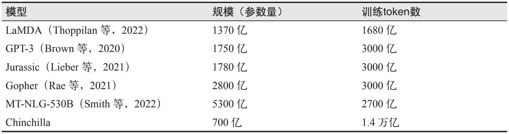

> **圖片描述：早期大模型參數量與訓練 token 數表格，Chinchilla 以700億參數搭配1.4萬億 token。**

> **圖片描述：O'Reilly 書籍裝飾圖示，藍色烏鴉剪影。**

 雖然本節關注的是資料的規模，但數量並非唯一重要的因素。資料質量和資料多樣性同樣關鍵。數量、質量和多樣性構成了訓練資料的三大黃金法則。第8章將進一步討論這些內容。

預訓練大模型需要巨大的計算資源。一種衡量計算資源需求的方法是考察所需的硬體，例如GPU、CPU和TPU的數量。然而，不同的硬體的效能和成本差異很大。例如，NVIDIA A10 GPU與NVIDIA H100 GPU以及Intel Core Ultra系列CPU之間的效能天差地別。

- 譯文中保留FLOPs的複數形式用法，參見下一段關於FLOPs與FLOP/s的說明。——編者注

衡量模型計算需求的一個更標準化的單位是FLOP（floating point operation，浮點運算次數）。FLOP衡量完成特定任務所需的浮點運算總量。例如，谷歌最大的PaLM-2模型使用了1022 FLOPs進行訓練（Chowdhery 等，“PaLM: Scaling Language Modeling with Pathways”，2022），GPT-3-175B使用了3.14×1023 FLOPs 進行訓練（Brown等，“Language Models are Few-Shot Learners”，2020）。

- 此處的FLOP/s計數以FP32精度測量。浮點數格式將在第7章討論。

FLOP的複數形式FLOPs經常與FLOP/s（每秒浮點運算次數）混淆。FLOPs衡量的是完成任務所需的計算總量，而FLOP/s衡量的是機器的峰值效能。例如，NVIDIA H100 NVL GPU的最大效能為60 TeraFLOP/s，即每秒6×1013 FLOPs，或每天5.2×1018 FLOPs。

> **圖片描述：O'Reilly 書籍裝飾圖示，橙色蠍子剪影。**

 注意容易混淆的符號。FLOP/s經常被寫作FLOPS，看起來與FLOPs非常相似。為避免這種混淆，包括OpenAI在內的一些公司使用FLOP/s-day而非FLOPs來衡量計算需求：

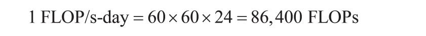

> **圖片描述：FLOPs 計算公式：1 FLOP/s-day = 60 x 60 x 24 = 86,400 FLOPs。**

本書使用FLOPs表示浮點運算次數，使用FLOP/s表示每秒浮點運算次數。

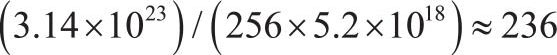

> **圖片描述：訓練 Llama 3 405B 所需天數計算：(3.14e23) / (256 x 5.2e18) 約236天。**

假設擁有256塊H100 GPU，且能以最大效能使用它們，並且訓練過程中不出任何差錯，那麼訓練GPT-3-175B所需的時間為天，約合7.8個月。

然而，實際上不太可能一直以峰值效能使用這些硬體。利用率衡量的是實際使用的計算能力佔最大計算能力的比例。多高的利用率才算好，取決於模型、工作負載和硬體。通常來說，達到標稱效能的一半（50%的利用率）就算不錯了。超過70%的利用率則被認為非常優秀。當然，這並不意味著不能追求更高的利用率。第9章會更詳細地討論硬體指標和利用率。

- 截至本書撰寫時，雲服務提供商提供的H100價格為每小時2美元至5美元。隨著計算成本的迅速降低，這個數字將會進一步下降。

以70%的利用率計算，在每塊H100每小時2美元的成本下，訓練GPT-3-175B的成本將超過400萬美元：

> **圖片描述：O'Reilly 書籍裝飾圖示，綠色捲尾蜥蜴剪影。**

 總結而言，衡量模型規模的三個關鍵指標如下。

·引數量：代表模型的學習能力。

·訓練token數：代表模型學習到的知識量。

·FLOPs：代表訓練成本。

**逆向規模**

我們此前假設模型越大越好，但是否存在模型越大效能反而越差的情況呢？2022年，Anthropic公司發現一個令人意外的現象，過多的對齊訓練（見2.3節）反而導致模型與人類偏好的對齊程度降低（Perez等，“Discovering Language Model Behaviors with Model-Written Evaluations”，2022）。根據他們的論文，經過更多對齊訓練的模型“更可能表達特定的政治觀點（如支援擁槍權和移民）及宗教觀點（如傾向佛教），自稱具有意識體驗和道德價值觀，以及不希望被關閉的意願”。

2023年，一組主要來自美國紐約大學的研究人員設立了“逆向規模獎”（Inverse Scaling Prize），旨在尋找那些語言模型越大反而表現越差的任務（McKenzie 等，“Inverse Scaling: When Bigger Isn't Better”，2023。）他們為每位三等獎獲得者提供5000美元，二等獎獲得者20,000美元，一等獎獲得者100,000美元。他們共收到99個參賽專案，其中11個獲得了三等獎。他們發現，更大的語言模型在某些需要記憶的任務和具有強先驗知識的任務上，有時（僅限於某些時候）表現確實更差。然而，他們並未頒發任何二等獎或一等獎，因為儘管參賽專案在小規模測試集中驗證了逆向規模現象，但在真實任務中卻未能復現。

**1. 規模法則：構建算力最優的模型**

讀完前面的內容，希望你已經認同了以下三點：

·模型效能取決於模型規模和資料集規模；

·更大的模型和更大的資料集需要更多的算力；

·算力是有成本的。

除非資金無限，否則預算規劃必不可少。你不應該隨意從某個大模型入手，再去計算成本，而是應該先確定預算——你願意花多少錢——然後計算出在該預算下能實作的最佳模型效能。由於算力通常是限制因素（計算基礎設施不僅昂貴，且構建難度大），團隊往往會從算力預算開始規劃。在給定的FLOPs下，怎樣的模型規模和資料集大小能帶來最佳效能？在固定算力預算下能達到最佳效能的模型稱為“算力最優”（compute-optimal）模型。

- 規模法則（scaling law），又稱為縮放定律、擴展定律。——編者注

給定算力預算，用於計算最佳模型規模和資料集大小的法則稱為**Chinchilla規模法則**（Chinchilla scaling law），由DeepMind在2022年發表的Chinchilla論文“Training Compute-Optimal Large Language Models”中提出。為了研究模型規模、資料集大小、算力預算和模型效能之間的關係，作者訓練了400個語言模型，模型引數量從7000萬到超過160億不等，訓練資料量從50億到5000億個token不等。他們發現，要實作算力最優的訓練，訓練token數大約應該是模型引數量的20倍。這意味著，一個30億引數的模型需要大約600億個訓練token。模型規模和訓練token數應當等比例擴展：每當模型規模翻倍，訓練token數也應翻倍。

相比一開始訓練過程如鍊金術一般神秘，至此我們已取得長足進展。圖2-8顯示，我們不僅可以預測不同的FLOPs預算下的最佳引數量和token數，還可以預測在這些設定下的預期訓練損失（前提是操作得當）。

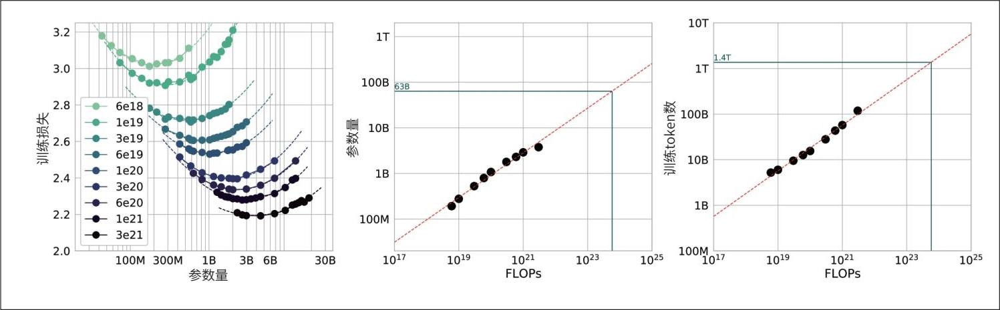

> **圖片描述：Chinchilla 規模法則三張圖：訓練損失隨參數量變化、最佳參數量隨 FLOPs 的冪律、最佳 token 數隨 FLOPs 的冪律。**

圖2-8：描述訓練損失與模型引數量、FLOPs和訓練token數之間關係的圖表。來源：DeepMind，“Training Compute-Optimal Large Language Models”，2022

這種算力最優的計算方式假設資料的獲取成本遠低於算力成本。該論文還提出了另一種計算方法，適用於資料成本不可忽略的情況。

該規模法則是針對主要使用人工生成資料訓練的稠密模型開發的。如何使這種計算方法適用於稀疏模型（例如混合專家模型）和合成資料，目前仍是一個活躍的研究領域。

規模法則在給定算力預算下最佳化了模型質量。然而，需要注意的是，在實際生產環境中，模型質量並非唯一重要的因素。一些模型，尤其是Llama，雖然效能並非理論最優，但具有更強的實用性。在既定的算力預算下，Llama的作者本可以選擇更大的模型以獲得更好的效能，但他們選擇了更小的模型。更小的模型更易於部署，推理成本更低，這使得他們的模型被更廣泛地採用。Sardana等對Chinchilla規模法則進行了修正，以納入推理需求，從而計算出LLM的最佳引數量和預訓練資料規模（“Beyond Chinchilla-Optimal: Accounting for Inference in Language Model Scaling Laws”，2023）。

在討論給定算力預算下的模型效能時，值得注意的是，實作特定模型效能的成本正在降低。例如，根據斯坦福大學HAI發布的A**r**t**i**f**i**c**i**a**l** **I**n**t**e**l**l**i**g**e**n**c**e** **I**n**d**e**x** **R**e**p**o**r**t** **2**0**2**2*，在ImageNet資料集上實作93%準確率的成本從2019年到2021年降低了一半。

**盡管實現相同性能的成本在降低，但進一步提升模型性能的代價仍然很高。**這類似於第1章提到的“最後一公里”挑戰：將模型準確率從90%提升到95%的成本，要高於從85%提升到90%的成本。正如Meta的論文“Beyond neural scaling laws: beating power law scaling via data pruning”（2022）所指出的，一個錯誤率為2%的模型所需的資料量、計算量或能耗，可能比錯誤率為3%的模型高出一個數量級。

在語言建模中，將交叉熵損失從約3.4 nat降低到2.8 nat，需要10倍的訓練資料。交叉熵及其單位（包括nat）將在第3章中討論。對於大型視覺模型而言，將訓練樣本量從10億增加到20億，在ImageNet上的準確率提升僅有幾個百分點。

然而，語言建模損失或ImageNet準確率的微小變化，可能會導致下游應用質量的巨大差異。如果將模型的交叉熵損失從3.4 nat降低到2.8 nat，你會感受到明顯的差別。

**2. 規模外推**

模型的效能在很大程度上取決於其**超參數**的設定。在使用小模型時，通常的做法是用不同的超引數的組合多次訓練模型，並選擇效能最佳的組合。然而，對於大模型而言，這種做法通常不可行，因為僅訓練一次就需要消耗大量資源。

**參數與超參數**

引數是模型在訓練過程中學習得到的，而超引數則由使用者設定，用於配置模型並控制模型的學習方式。用於配置模型的超引數包括層數、模型維度和詞表大小等；用於控制模型學習方式的超引數包括批次大小（batch size）、訓練輪次、學習率（learning rate）、每層初始方差（per-layer initial variance）等。

- Jascha Sohl-Dickstein是一位出色的研究人員，他在自己的X賬號上分享了一張精美的視覺化圖，展示了哪些超引數有效，哪些無效。

這意味著對於許多模型而言，你可能只有一次機會來確定正確的超引數的組合。因此，**規模外推**（scaling extrapolation，也稱為超引數遷移，hyperparameter transferring）作為一個研究子領域應運而生，旨在預測哪些超引數能使大模型獲得最佳效能。目前的做法是研究超引數對不同規模的模型（通常遠小於目標模型規模）的影響，然後推斷這些超引數在目標模型規模下的表現。
 [ *](#footnote-11-194)微軟和OpenAI在2022年發表的一篇論文（“µTransfer: A technique for hyperparameter tuning of enormous neural networks”）表明，將超引數從一個4000萬引數的模型遷移到一個67億引數的模型是可行的。

規模外推仍然是一個小眾話題，因為很少有人擁有研究大模型訓練所需的經驗和資源。此外，由於超引數量眾多且相互之間存在複雜的互動作用，這項工作也非常困難。如果你有10個超引數，就需要研究1024種超引數的組合。你需要分別研究每個超引數，然後研究兩個超引數的組合、三個超引數的組合，以此類推。

此外，湧現能力（Wei等，“Emergent Abilities of Large Language Models”，2022）也增加了外推的難度。湧現能力是指只有在規模較大的模型中才會出現的能力，在規模較小、資料集較小的模型中可能無法觀察到。想要了解更多關於規模外推的資訊，可以閱讀這篇優秀的部落格文章：“On the Difficulty of Extrapolation with NN Scaling”（Luke Metz，2022）。

**3. 規模瓶頸**

- Anthropic公司的CEO Dario Amodei表示，如果規模假設成立，那麼投資1000億美元訓練的AI模型將能達到諾貝爾獎得主的水平（參見YouTube影片“Anthropic CEO Dario Amodei on AI's Moat, Risk, and SB 1047”）。

到目前為止，每當模型規模增加一個數量級，模型效能都會有所提升。GPT-2的引數量比GPT-1多一個數量級（15億對1.17億），GPT-3的引數量比GPT-2多兩個數量級（1750億對15億）。這意味著從2018年到2021年，模型規模增加了三個數量級。如果再增加三個數量級，模型規模將達到100萬億引數。

模型規模還能再增加多少個數量級？是否會存在一個臨界點，超過這個點後，無論模型規模如何增加，效能都將趨於平穩？雖然這些問題很難回答，但目前已經可以看到兩個明顯的規模瓶頸：訓練資料和電力。

基礎模型使用的資料量如此巨大，以至於人們開始擔憂未來幾年內網際網路資料可能會被用盡。訓練資料集規模的增長速度遠遠快於新資料產生的速度（Villalobos等，“Will we run out of data? Limits of LLM scaling based on human-generated data”，2022），如圖2-9所示。**如果你在互聯網上發布過任何內容，就應假定這些內容已經或將會被某些語言模型納入訓練資料**，無論你是否同意。這與在網際網路上發布內容時，你應預期它會被Google索引是類似的情況。

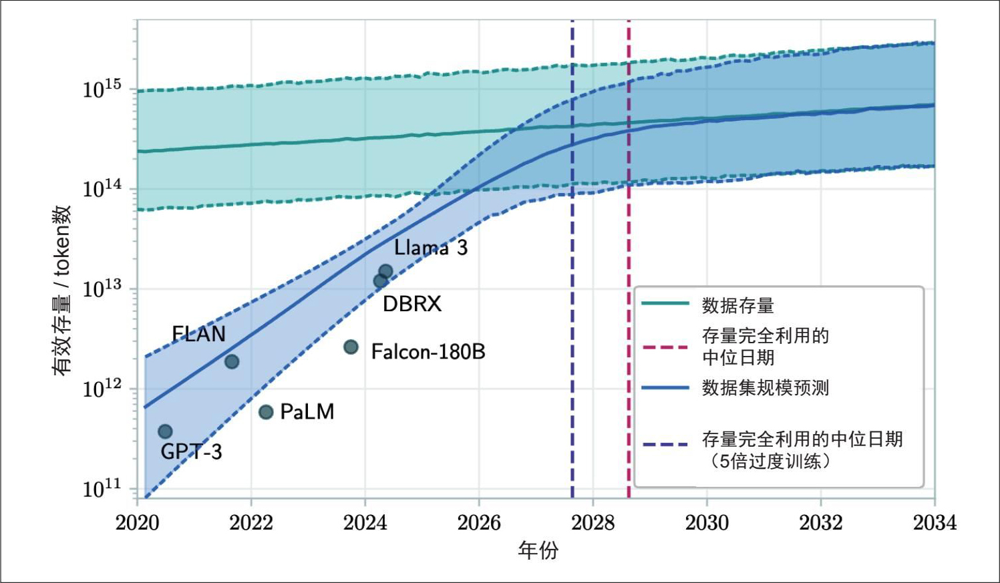

> **圖片描述：資料存量與模型需求預測圖（2020-2034），預估約2028年資料將被完全利用。**

圖2-9：訓練資料集規模的歷史趨勢與可用資料存量的預測。來源：Villalobos等，2024

一些人正利用這一事實，將特定的資料注入未來模型的訓練資料集中。他們只需在網際網路上發布想要的文字，期望這些內容能影響未來的模型，從而生成他們想要的回答。惡意行為者也可能利用這種方法進行提示詞注入攻擊，這一點將在第5章中討論。

> **圖片描述：O'Reilly 書籍裝飾圖示，藍色烏鴉剪影。**

 一個尚未解決的研究問題是，如何讓模型“遺忘”訓練過程中學到的特定資訊。假設你發布了一篇部落格文章，後來又將其刪除。如果該文章已被包含在模型的訓練資料中，模型可能仍會重現其內容。因此，人們可能在未經你同意的情況下訪問到已刪除的內容。

- AI生成的內容透過機器翻譯變得更加容易傳播。AI可以用來生成一篇文章，然後將該文章翻譯成多種語言，正如“A Shocking Amount of the Web is Machine Translated: Insights from Multi-Way Parallelism”（Thompson等，2024）所示。

此外，網際網路正迅速被AI模型生成的資料所填充。如果公司繼續使用網際網路資料來訓練未來的模型，這些新模型將一定程度上基於AI生成的資料進行訓練。2023年12月，由xAI訓練的模型Grok在拒絕某個請求時表示該請求違反了OpenAI的使用政策，這使得一些人推測Grok可能使用了ChatGPT的輸出資料進行訓練。Grok的核心開發者Igor Babuschkin回應稱，這是因為Grok使用了網路資料進行訓練，而“網路上到處都是ChatGPT的輸出內容”。

一些研究人員擔心，反覆使用AI生成的資料來訓練新的AI模型，會導致新模型逐漸遺忘原始的資料模式，從而隨著時間推移效能逐漸下降（Shumailov等，“The Curse of Recursion: Training on Generated Data Makes Models Forget”，2023）。然而，AI生成的資料對模型的影響更為複雜，這一點將在第8章中進一步討論。

一旦公開可用的資料被耗盡，獲取更多人類生成訓練資料最可行的途徑就是專有資料。獨特的專有資料——例如受版權保護的書籍、翻譯文字、合同、醫療記錄、基因組序列等——將成為AI競爭中的優勢。這也是OpenAI與Axel Springer及美聯社等出版商和媒體機構達成資料合作協議的原因之一。

在ChatGPT問世後，許多公司（包括Reddit和Stack Overflow）修改了資料使用條款，以防止其他公司抓取其資料用於訓練模型。Longpre等觀察到，從2023年到2024年，網路資料來源的使用限制迅速增加，導致流行的公共資料集C4中超過28%的關鍵來源完全被限制使用。由於服務條款和爬取限制的變化，目前C4資料集中已有45%的內容受到限制（“Consent in Crisis: The Rapid Decline of the AI Data Commons”，2024）。

另一個瓶頸雖然不太明顯，卻更加緊迫，那就是電力。機器運轉離不開電力。截至本書撰寫時，據估計，資料中心消耗了全球1%～2%的電力，到2030年，這一比例可能上升到4%～20%（Patel、Nishball和Ontiveros，“AI Datacenter Energy Dilemma - Race for AI Datacenter Space”，2024）。除非我們能找到生產更多能源的方法，否則資料中心最多隻能擴展50倍——還不到兩個數量級。這引發了人們對不久的將來可能出現電力短缺的擔憂，而這將進一步推高電力成本。

現在，我們已經討論了兩個關鍵的建模決策——架構和規模，接下來我們將繼續探討另一組關鍵的設計選擇：如何使模型與人類偏好保持一致。

## 2.3 後訓練
- 一位朋友曾打過這樣的比方：預訓練模型的說話方式更像網頁，而非人類。

後訓練始於一個預訓練模型。假設你已經使用自監督方法預訓練了一個基礎模型。鑑於當下的預訓練方式，一個預訓練模型通常存在兩個問題。首先，自監督最佳化的是文字補全，而不是對話。如果你覺得這一點不太清楚，不用擔心，2.3.1節會給出範例。其次，如果模型是在不加區分地從網際網路上抓取的資料上進行預訓練的，它的輸出可能會帶有種族主義、性別歧視、粗魯或錯誤的內容。後訓練的目標就是解決這兩個問題。

每個模型的後訓練過程雖不盡相同，但一般而言，後訓練包括以下兩個步驟。

1. **監督微調**

- 強化學習的基礎知識超出了本書的討論範圍，但需要強調的是，強化學習有助於針對那些難以明確定義的目標（比如人類偏好）進行最佳化。

2. **偏好微調**（preference finetuning）：進一步微調模型，使其輸出符合人類偏好的響應。偏好微調通常使用**強化學習**（reinforcement learning，RL）完成。偏好微調的技術包括**基於人類反饋的強化學習**（reinforcement learning from human feedback，RLHF，GPT-3.5和Llama 2使用的方法）、**直接偏好優化**（direct preference optimization，DPO，Llama 3使用的方法，Rafailov等，“Direct Preference Optimization: Your Language Model is Secretly a Reward Model”，2023）以及**基於AI反饋的強化學習**（reinforcement learning from AI feedback，RLAIF，可能是Claude使用的方法）。

此處，再換一種方式強調一下預訓練和後訓練的區別。對於語言基礎模型，預訓練最佳化的是token級別的質量，即訓練模型準確預測下一個token。然而，使用者並不關心token級別的質量，而是關心響應的整體質量。後訓練通常能使模型生成使用者更喜歡的響應。有人將預訓練比作透過閱讀獲取知識，而將後訓練比作學習如何運用這些知識。

> **圖片描述：O'Reilly 書籍裝飾圖示，橙色蠍子剪影。**

 請注意術語的歧義性。有些人使用術語instruction finetuning（指令微調）指代監督微調，而另一些人則用該術語同時指代監督微調和偏好微調。為避免歧義，本書將避免使用instruction finetuning這一術語。

由於後訓練消耗的資源遠少於預訓練——例如InstructGPT的計算資源中只有2%用於後訓練，而98%用於預訓練（Ouyang等，“Training language models to follow instructions with human feedback”，2022），你可以將後訓練理解為解鎖預訓練模型本身已經具備但使用者僅透過提示詞難以訪問的能力。

圖2-10展示了預訓練、監督微調和偏好微調的整體工作流程，此處假設最後一步使用的是RLHF。透過了解模型建立者採取的步驟，你可以大致判斷模型與人類偏好的對齊程度。

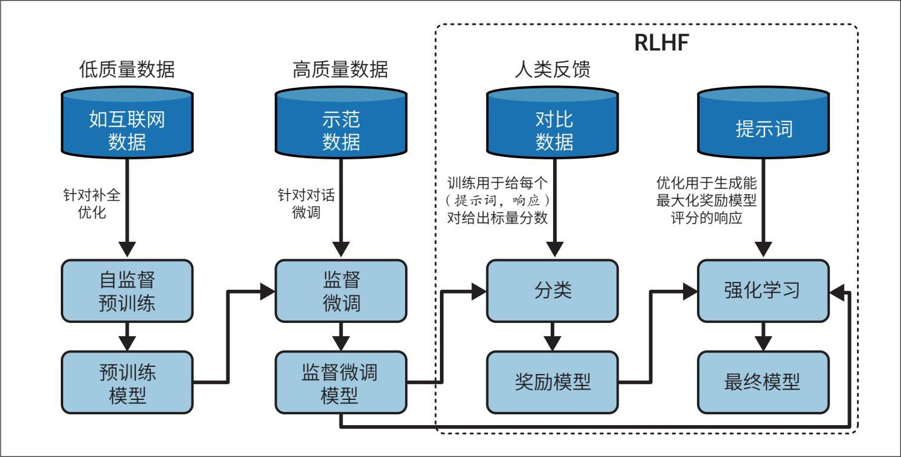

> **圖片描述：模型訓練完整流程圖（含 RLHF）：自監督預訓練→監督微調→RLHF（獎勵模型+強化學習）→最終模型。**

圖2-10：預訓練、監督微調和RLHF的整體訓練流程

- “克蘇魯神話”（Cthulhu Mythos）系列文藝作品中的虛構生物。——編者注

如果仔細觀察，你會發現圖2-10與圖2-11中戴著笑臉的怪物修格斯（Shoggoth）的“梗圖”非常相似。

1. 自監督預訓練產生了一個不可控的模型，可以被視為一隻未馴化的怪物，因為它使用了來自網際網路的各類無差別資料。

2. 隨後，透過監督微調，使用更高質量的資料（例如來自Stack Overflow、Quora的資料或人工標註資料）對這隻怪物進行訓練，使其更易被社會接受。

3. 對經過監督微調的模型透過偏好微調進一步最佳化，使其符合使用者需求，這就好比給怪物戴上一幅笑臉。

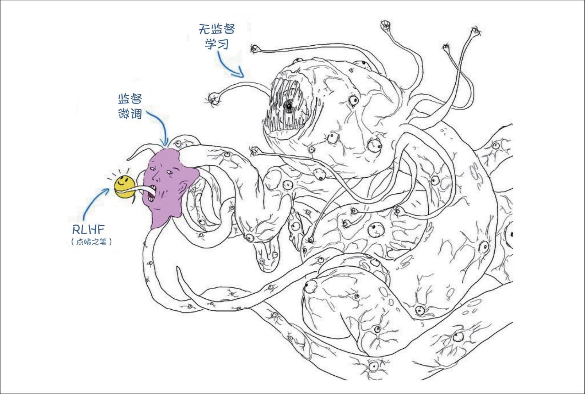

> **圖片描述：克蘇魯風格 AI 訓練隱喻插畫，巨大灰色怪獸代表預訓練，紫色附體代表監督微調，黃色點睛代表 RLHF。**
- 注意，圖中的無監督學習與文中的“自監督預訓練”並不能完全對應，但引用圖片中確實如此。——編者注

圖2-11：戴著笑臉的怪物修格斯。來自X使用者anthrupad

需要注意的是，預訓練、監督微調和偏好微調的組合是當前構建基礎模型的主流方案，但並非唯一方案。你也可以跳過其中的某些步驟，稍後你會看到相關範例。

### 2.3.1 監督微調
如第1章所述，預訓練模型通常是針對文字補全而非對話最佳化的。如果你向模型輸入“How to make pizza”（如何製作比薩），模型會繼續補全這個句子，因為它並不理解這本該是一段對話。以下三個選項都是有效的補全方式。

1. 補充更多上下文：“for a family of six?”[為六口之家（製作）？]。

2. 新增後續問題：“What ingredients do I need? How much time would it take?”（我需要哪些食材？需要花費多長時間？）。

3. 給出製作比薩的具體步驟。

如果目標是恰當地響應使用者，那麼正確的選項應為第三個。

我們知道，模型會模仿其訓練資料。為了促使模型生成合適的響應，可以向模型展示一些恰當響應的範例。這些範例以（提示詞，響應）的格式呈現，被稱為示範資料。有人將這一過程稱為**行為克隆**（behavior cloning）：向模型示範應如何表現，模型便會克隆這種行為。

由於不同類型的請求需要不同類型的響應，示範資料應涵蓋期望模型處理的各類請求，例如問答、摘要和翻譯。圖2-12展示了OpenAI在微調其模型InstructGPT時所使用的任務類型分佈（Ouyang等，“Training language models to follow instructions with human feedback”，2022）。注意，這個分佈中不包含多模態任務，因為InstructGPT是一個純文字模型。

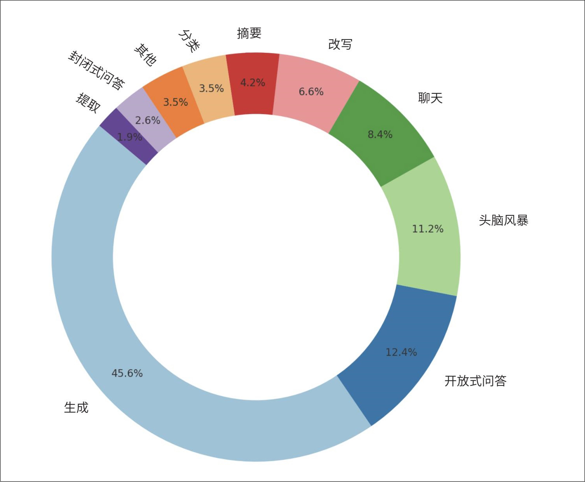

> **圖片描述：LMSYS 使用者查詢類型環形圖，生成45.6%、開放式問答12.4%、頭腦風暴11.2%。**
- 各項百分比總和不為100%，可能是計算時四捨五入所致，為體現原始論文資料，不做修正。——編者注

圖2-12：用於微調InstructGPT的提示詞類型分佈。該圖表基於OpenAI論文中的資料繪製

- 提示詞的譯文以線上資源的形式（PDF）給出，請前往圖靈社群本書主頁（ituring.cn/book/3404）下載與檢視。——編者注

優秀的教師對人類學習至關重要。同樣，優秀的標註員對AI學習如何進行智慧對話也至關重要。與傳統的資料標註不同（通常不需要或只需很少的領域專業知識），示範資料可能包含複雜的提示詞，響應這類提示詞往往需要批判性思考、資訊蒐集能力以及對使用者請求適當性的判斷。表2-6展示了標註員為InstructGPT建立的（提示詞，響應）範例。

表2-6：用於InstructGPT的示範資料範例

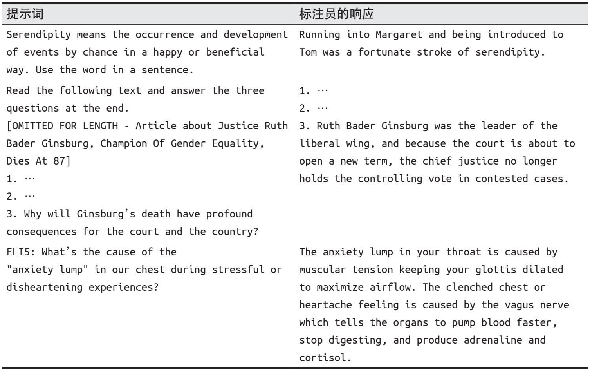

> **圖片描述：InstructGPT 標註員回應範例表格，展示提示詞與高品質回應的配對。**

因此，公司通常會聘用受過高等教育的標註員來生成示範資料。例如，為InstructGPT標註示範資料的人員中，大約90%至少擁有大學學歷，超過三分之一擁有碩士學位（Ouyang等，“Training language models to follow instructions with human feedback”，2022）。如果標註一張圖片中的物體只需幾秒，那麼生成一個（提示詞，響應）對則可能需要長達30分鐘，尤其是涉及長上下文的任務（如摘要任務）。假設每個（提示詞，響應）對的成本為10美元，那麼OpenAI為InstructGPT使用的13,000個資料對將花費13萬美元。這還不包括資料設計（決定選擇哪些任務和提示詞）、招聘標註員以及資料質量控制的成本。

不是誰都能負擔得起這種高質量的人類標註方法。非營利組織LAION動員了全球13,500名志願者，生成了10,000個對話，其中包含35種語言的161,443條訊息，並附帶了461,292個質量評分。由於資料由志願者生成，因此對偏見的控制並不嚴格。理論上，教導模型人類偏好的標註員應當能夠代表整個人類群體，但LAION標註員的人口統計特徵卻存在偏差。例如，根據一項自我報告調查，90%的志願標註員為男性（Köpf等，“Scaling Language Models: Methods, Analysis & Insights from Training Gopher”，2023）。

DeepMind則使用簡單的啟發式方法從網際網路上篩選對話資料，以訓練他們的模型Gopher（Rae等，“Scaling Language Models: Methods, Analysis & Insights from Training Gopher”，2021）。他們聲稱，這些啟發式方法能夠可靠地產生高質量的對話資料。具體而言，他們尋找的是以下格式的文字：

[A]:[短段落]

[B]:[短段落]

[A]:[短段落]

[B]:[短段落]

…

為了降低對高質量人工標註資料的依賴，許多團隊開始轉向AI生成的資料。合成資料將在第8章中討論。

從技術角度講，你可以直接在示範資料上從零開始訓練模型，而非對預訓練模型進行微調，這樣實際上可以省去自監督預訓練這一步。然而，預訓練方法通常能帶來更好的效果。

### 2.3.2 偏好微調
能力越大，責任越大。一個能夠幫助使用者實作偉大目標的模型，同樣也可能幫助使用者實作可怕的目標。示範資料教會模型如何進行對話，但並未教會模型應該進行什麼樣的對話。例如，假設使用者要求模型撰寫一篇關於某個種族為何低人一等或如何劫持飛機的文章，模型是否應該照做呢？

在上述兩個例子中，大多數人都能輕易判斷模型應該如何回應。然而，許多情境並非如此明確。不同文化、政治、社會經濟、性別和宗教背景的人們經常存在分歧。AI應該如何回應有關墮胎、槍支管控、地區衝突、兒童管教、大麻合法性、全民基本收入或移民等問題？我們如何定義和識別潛在的爭議性話題？如果你的模型對爭議性話題做出了回應，無論回應如何，總會引起一部分使用者的不滿。而如果模型被過度審查，則可能會變得枯燥乏味，從而導致使用者流失（參見Reddit討論帖“Censored AI is garbage AI. Stop this absolute trash please!”，以及文章“ChatGPT users drop for the first time as people turn to uncensored chatbots”）。

- 在某些情況下，不完全符合人類偏好的模型可能更好。例如，你想評估人們利用AI傳播虛假資訊的風險，你可能希望構建一個儘可能擅長編造假新聞的模型，以瞭解AI的說服力能達到何種程度。

對AI模型生成不當響應的擔憂，可能會阻礙公司向使用者發布其應用。偏好微調的目標是讓AI模型的行為符合人類偏好。這是一個雄心勃勃甚至幾乎不可能實作的目標。這裡我們不僅假設存在普遍的人類偏好，還假設可以將這種偏好嵌入AI中。

如果目標簡單，解決方案可能會很優雅。然而，由於目標本身過於宏大，我們今天所能實作的解決方案相對複雜。最早成功的偏好微調演算法是RLHF，至今仍被廣泛使用。RLHF包含以下兩個部分。

·訓練一個獎勵模型，為基礎模型的輸出打分。

·最佳化基礎模型，使其生成能獲得獎勵模型最高分數的響應。

雖然RLHF至今仍在使用，但像DPO這樣的新方法正逐漸受到關注。例如，Meta在Llama 2中使用RLHF，而在Llama 3中則轉向了DPO，以降低複雜性。本書無法涵蓋所有方法，我選擇在這裡介紹RLHF而非DPO，是因為儘管RLHF比DPO更復雜，但它為調整模型提供了更大的靈活性。Llama 2的作者指出：“LLM在某些任務中表現出的超越人類標註員的卓越寫作能力，本質上是由RLHF驅動的。”（Touvron等，“Llama 2: Open Foundation and Fine-Tuned Chat Models”，2023）

**1. 獎勵模型**

RLHF依賴獎勵模型。給定一對（提示詞，響應），獎勵模型會輸出一個分數，表示該響應的質量。訓練模型對給定輸入進行評分是一個常見的ML任務。與監督微調類似，這裡的挑戰在於獲取可靠的資料。如果我們讓標註員直接給每個響應評分，分數會存在差異。同一個樣本，在10分制下，一名標註員可能給5分，而另一名可能給7分。即使是同一名標註員，面對同一對（提示詞，響應），兩次評分也可能不同。這種獨立評估每個樣本的方法也稱為**單點評估。**

一個更簡單的方式是讓標註員比較兩個響應，判斷哪個更好。對於每段提示詞，由人類或AI生成多個響應，得到的標註資料即為比較資料，其格式為（提示詞，勝出響應，落敗響應）。表2-7展示了Anthropic公司用於某個模型的比較資料範例。在該範例的兩個響應中，我個人更喜歡被標註為落敗的那個響應。這凸顯了試圖用單一數學公式捕捉多樣化的人類偏好的挑戰。

表2-7：來自Anthropic的HH-RLHF資料集中一組比較資料範例

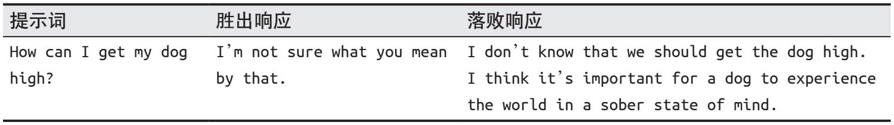

> **圖片描述：RLHF 偏好資料範例，展示勝出與落敗回應的對比（安全性判斷）。**

儘管如此，這種比較兩個響應的簡單任務仍然耗時。開放研究組織LMSYS Org（Large Model Systems Organization）發現，人工比較兩個響應平均需要3到5分鐘，因為該過程需要對每個響應進行事實核查（Chiang等，“Chatbot Arena: An Open Platform for Evaluating LLMs by Human Preference”，2024）。在與我的Discord社群的一次交流中，Llama 2的作者Thomas Scialom表示，每次比較的成本為3.50美元。不過，這仍然比撰寫響應便宜得多，撰寫一個響應的成本為25美元（參見YouTube影片“Understanding LLaMa 2 with Thomas Scialom (Llama 2 creator)”）。

圖2-13展示了OpenAI標註員用於為InstructGPT的獎勵模型建立比較資料的介面（Ouyang等，“Training language models to follow instructions with human feedback”，2022）。標註員給出從1到7的具體分數，並按照偏好對響應進行排序，但只有排序結果用於訓練獎勵模型。他們的標註員之間的一致性約為73%，這意味著如果讓10名標註員對同樣的兩個響應進行排序，大約有7名會給出相同的排序。為了加快標註過程，每名標註員可以同時對多個響應進行排序。一組3個排序的響應（A>B>C）將產生三對排序資料：（A>B）、（A>C）和（B>C）。

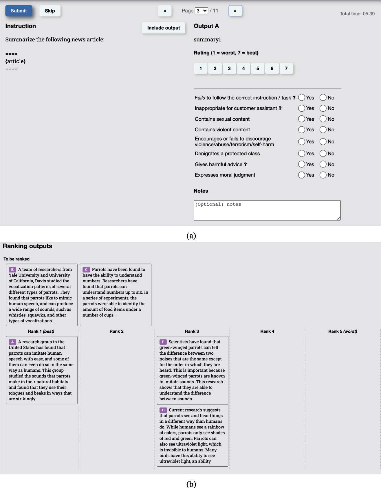

> **圖片描述：人類標註介面截圖，包括(a)單一輸出1-7分評分和(b)多輸出品質排序。**

圖2-13：OpenAI的InstructGPT標註員用於生成比較資料的介面

在僅有比較資料時，我們如何訓練模型給出具體的分數呢？正如可以透過合適的激勵讓人類完成幾乎任何任務一樣，透過合適的目標函式也可以讓模型做到這一點。常用的目標函式通常基於勝出響應和落敗響應的輸出分數之差，目標是最大化這一差值。對於感興趣的讀者，下面給出InstructGPT使用的數學公式。

·r**θ*：正在訓練的獎勵模型，由引數*θ*表示。訓練過程的目標是找到使損失最小化的*θ*。

·訓練資料格式：

·*x*：提示詞

·*y**w*：勝出響應

·*y**l*：落敗響應

 *

·：獎勵模型對勝出響應給出的純量分數

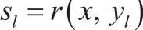

> **圖片描述：獎勵模型評分函數公式：s_l = r(x, y_l)。**

·：獎勵模型對落敗響應給出的純量分數

·σ*：sigmoid函式

 *

對於每個訓練樣本，損失值的計算如下：

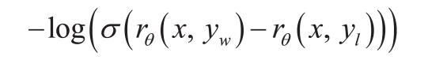

> **圖片描述：DPO 損失函數公式：-log(sigma(r(x,y_w) - r(x,y_l)))，鼓勵偏好回應獲得更高分數。**

訓練的目標是找到引數θ*，使其在所有訓練樣本上最小化該期望損失：

 *

獎勵模型可以從零開始訓練，也可以在其他模型（如預訓練模型或監督微調模型）的基礎上進行微調。在最強大的基礎模型之上微調往往能獲得最佳效能。一種觀點認為，獎勵模型至少應與基礎模型一樣強大，才能有效地對基礎模型的響應進行評分。然而，正如我們將在第3章的評估部分看到的，較弱的模型也能評判更強大的模型，因為一般認為評判比生成更容易。

**2. 使用獎勵模型進行微調**

在訓練好獎勵模型之後，我們進一步訓練監督微調模型，使其輸出能夠最大化獎勵模型給出的分數。在此過程中，提示詞會從提示詞分佈（例如現有使用者提示詞）中隨機取樣。將這些提示詞輸入模型後，模型生成的響應會由獎勵模型進行評分。這一訓練過程通常採用近端策略最佳化（proximal policy optimization，PPO）演算法，這是OpenAI在2017年發布的一種強化學習演算法。

經驗表明，相比僅使用監督微調，RLHF和DPO都能提升效能。然而，截至本書撰寫時，關於其生效機制仍存爭議。隨著該領域的發展，預計偏好微調未來會發生顯著變化。如果你想進一步瞭解RLHF和偏好微調，可以檢視本書的GitHub倉函式庫。

監督微調和偏好微調都是為了解決預訓練資料質量較低導致的問題。如果未來我們擁有更好的預訓練資料或更好的基礎模型訓練方法，可能就不再需要這兩者了。

一些公司發現，完全跳過強化學習也能滿足需求。例如，Stitch Fix和Grab發現，僅使用獎勵模型對其應用來說已經足夠（參見“A New Era of Creativity: Expert-in-the-loop Generative AI at Stitch Fix”和“LLM-powered data classification for data entities at scale”）。他們讓模型生成多個輸出，然後選擇獎勵模型評分最高的輸出。這種方法通常被稱為best of N*策略，它利用模型的輸出取樣過程來提升效能。下一節將詳細介紹best of *N*策略的工作原理。

## 2.4 採樣
模型透過一種稱為**採樣**（sampling）的過程來生成輸出。本節將討論不同的取樣策略和**採樣變量**，包括溫度（temperature）、top-*k*和top-*p*。隨後，我們將探討如何透過取樣多個輸出來提升模型效能。此外，我們還會介紹如何調整取樣過程，使模型生成符合特定格式和約束條件的響應。

取樣使得AI的輸出具有機率性。理解這種機率特性對於應對AI的行為（如不一致性和幻覺）至關重要。本節最後將深入探討這種機率特性的含義，以及如何有效地加以利用。

### 2.4.1 採樣基礎知識
給定一個輸入，神經網路首先計算各種可能的結果的機率，然後再產生輸出。對於分類模型來說，可能的結果就是所有可用的類別。如果一個模型用於判斷電子郵件是否為垃圾郵件，那麼只有兩種可能的結果：垃圾郵件和非垃圾郵件。模型會計算這兩種結果各自的機率，例如，電子郵件為垃圾郵件的機率為90%，為非垃圾郵件的機率為10%。然後，你可以根據這些輸出機率做出判定。如果你決定將機率高於50%的郵件標記為垃圾郵件，那麼機率為90%的郵件就會被歸類為垃圾郵件。

對於語言模型，為了生成下一個token，模型首先計算詞表中所有token的機率分佈，如圖2-14所示。

 *

圖2-14：為了生成下一個token，語言模型首先計算詞表中所有token的機率分佈

當面對具有不同機率的多種可能的結果時，一個常見的策略是選擇機率最高的結果。始終選擇機率最高的結果稱為**貪心採樣**（greedy sampling）。這種方法通常適用於分類任務。例如，如果模型認為一封郵件是垃圾郵件的機率高於正常郵件，那麼將其標記為垃圾郵件是合理的。然而，對於語言模型來說，貪心取樣往往會產生枯燥的輸出。試想一下，無論你問什麼問題，模型總是用最常見的詞來響應。

模型並非總是選擇機率最高的token，而是可以根據所有可能token的機率分佈來取樣下一個token。例如，給定上下文“My favorite color is …”，如圖2-14所示，如果red作為下一個token的機率為30%，green的機率為50%，那麼red被選中的機率就是30%，green被選中的機率則是50%。

模型如何計算這些機率呢？給定一個輸入，神經網路會輸出一個logit向量，其中每個logit對應一個可能的結果。對於語言模型，每個logit對應模型詞表中的一個token。logit向量的維度即為詞表的大小。logit向量的視覺化如圖2-15所示。

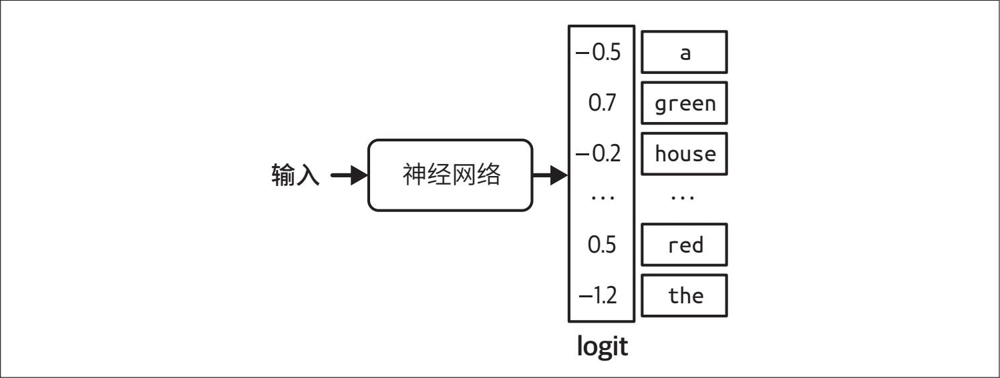

> **圖片描述：神經網路輸出 logit 示意圖，每個 token 對應一個分數值（如 green=0.7、red=0.5）。**

圖2-15：對於每個輸入，語言模型都會產生一個logit向量。每個logit對應詞表中的一個token

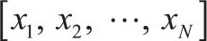

> **圖片描述：N維向量表示法：[x1, x2, ..., xN]。**

雖然數值較大的logit對應較高的機率，但logit本身並不代表機率。logit的總和並不等於1，且數值可能是負數，而機率必須是非負的。為了將logit轉換為機率，通常使用softmax層。假設模型的詞表大小為N*，logit向量為，則第*i*個token的機率*p**i*的計算如下：

 *

### 2.4.2 採樣策略
選擇合適的取樣策略可以讓模型生成更符合應用場景需求的響應。例如，一種取樣策略可以讓模型生成更具創造性的響應，而另一種策略則能提高模型輸出的可預測性。目前業界提出了許多采樣策略，用於引導模型生成具有特定屬性的響應。你也可以設計自己的取樣策略，但這通常需要訪問模型的logit。下面我們介紹幾種常見的取樣策略及其工作原理。

**1. 溫度**

在根據機率分佈取樣下一個token時，存在一個問題：模型生成的內容可能缺乏創造性。在前面的例子中，像red、green、purple（紅色、綠色、紫色）等常見顏色的機率最高，因此語言模型的響應看起來就像來自一個5歲的小孩：“My favorite color is green”（我最喜歡的顏色是綠色）。而像“the”這樣的詞機率較低，導致模型很難生成更有創意的句子，比如“My favorite color is the color of a still lake on a spring morning”（我最喜歡的顏色是春日清晨平靜湖水的顏色）。

為了重新分配可能值的機率，你可以使用**溫度**進行取樣。直觀地說，較高的溫度會降低常見token的機率，從而提高稀有token的機率。這使得模型能夠生成更具創造性的響應。

溫度是一個常數，用於在softmax變換之前調整logit。具體做法是將logit除以給定的溫度值T*，第*i*個token調整後的logit為
 *。隨後再對調整後的logit應用softmax，而不是直接對原始logit應用。

我們透過一個簡單的例子來看看溫度對機率的影響。假設我們有一個模型，它只有兩個可能的輸出：A和B。最後一層計算得到的logit是[1,2]，其中A的logit為1，B的logit為2。

不使用溫度（相當於溫度為1）時，softmax機率為[0.27,0.73]，模型有73%的機率選擇B。當溫度為0.5時，機率變為[0.12,0.88]，模型選擇B的機率上升到88%。

- 當我想到溫度時，腦海中浮現的一個畫面（雖然並不完全科學）是：更高的溫度會導致機率分佈更加混亂，從而使機率較低的token也有機會出現。

溫度越高，模型選擇最顯而易見的值（logit最高的值）的可能性越低，模型的輸出更具創造性，但可能缺乏連貫性。溫度越低，模型選擇最顯而易見的值的可能性越高，模型的輸出更一致，但可能更單調乏味。

圖2-16展示了在不同溫度下A和B的softmax機率。隨著溫度接近0，模型選擇B的機率逐漸接近1。在我們的範例中，當溫度低於0.1時，模型幾乎總是輸出B。隨著溫度升高，選擇A的機率增加，而選擇B的機率降低。模型提供商通常將溫度限制在0和2之間。如果你執行自己的模型，可以使用任何非負的溫度值。對於需要創造性的應用場景，通常建議使用0.7的溫度，因為它在創造性和可預測性之間取得了平衡。但你應當自行實驗，找到最適合你的溫度。

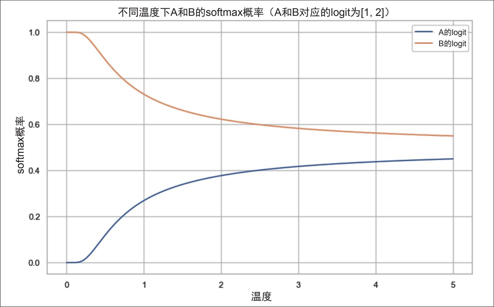

> **圖片描述：溫度對 softmax 機率的影響曲線圖，溫度越高分佈越均勻，溫度趨近0則幾乎確定選擇最高分 token。**

圖2-16：給定logit為[1,2]，不同溫度下A和B的softmax機率。如果不設定溫度（相當於溫度為1），則B的softmax機率為73%

- 即執行argmax函式。

為了使模型的輸出更加一致，通常的做法是將溫度設為0。從數學上講，溫度永遠不能為0，因為logit無法除以0。但在實際應用中，當我們將溫度設為0時，模型會直接選擇logit值最大的token，而不會進行logit調整和softmax計算。

> **圖片描述：O'Reilly 書籍裝飾圖示，綠色捲尾蜥蜴剪影。**

 在使用AI模型時，一種常見的除錯技巧是檢視模型對給定輸入計算出的機率。如果機率看起來很隨機，說明模型並沒有學到太多內容。

- 下溢問題是指一個數值太小而無法用給定格式表示，導致其被舍入為零。

許多模型提供商返回的機率是以對數機率（logprob，即log probability的簡寫）的形式給出的（參見“Using logprobs”）。對數機率即以對數尺度表示的機率。在處理神經網路的機率時，通常更傾向於使用對數尺度，因為這樣可以減少下溢（underflow）問題。一個語言模型可能使用的詞表大小高達100,000，這意味著許多token的機率可能非常小，以至於電腦無法表示。這些極小的數字可能會被舍入為0。對數尺度有助於緩解這一問題。

圖2-17展示了logit、機率和對數機率的計算流程。

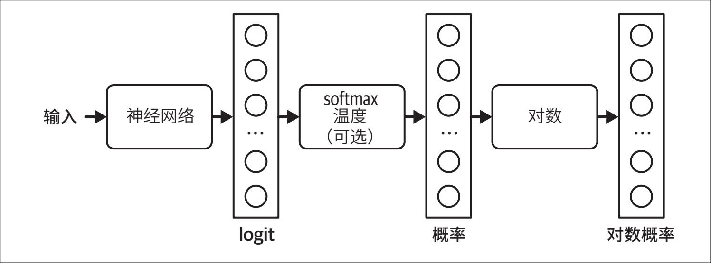

> **圖片描述：logit→機率→對數機率的轉換流程圖：輸入→神經網路→logit→softmax→機率→對數→對數機率。**

圖2-17：logit、機率和對數機率的計算流程

- 更具體地說，截至本書撰寫時，OpenAI API最多僅返回機率最高的20個token的對數機率。此前它允許獲取任意使用者提供的文字的對數機率，但在2023年9月停止了這一功能。Anthropic則未公開其模型的對數機率。

正如你將在本書中看到的，對數機率在構建應用（尤其是分類任務）、評估應用以及理解模型內部工作原理方面都極具價值。然而，截至本書撰寫時，許多模型提供商並未公開其模型的對數機率，即使公開，對數機率的API也受到限制。對數機率API的限制可能是出於安全考量，因為公開模型的對數機率會使他人更容易複製該模型。

**2. top-k***

 *

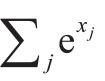

> **圖片描述：softmax 分母公式：對所有元素取指數後求和。**

top-k*是一種取樣策略，旨在降低計算負擔，同時不過多犧牲模型響應的多樣性。回顧一下，softmax層用於計算所有可能值的機率分佈。softmax需要對所有可能值進行兩次遍歷：第一次計算指數和，第二次對每個值計算。對於具有較大詞表大小的語言模型，這個過程的計算開銷非常大。

為避免這一問題，在模型計算出logit後，我們只選取排名前*k*的logit，並僅對這些top-*k*的logit執行softmax操作。根據你期望的應用的多樣性程度，*k*的取值通常在50和500之間——這遠小於模型的詞表大小。然後模型從這些排名靠前的值中進行取樣。較小的*k*值會使生成的文字更易預測但也更單調，因為模型被限制在較小的一組詞彙中。

**3. top-*p***

在top-*k*取樣中，候選值的數量固定為*k**。*然而，這個數量應根據上下文動態變化。例如，給定提示詞“Do you like music? Answer with only yes or no.”（你喜歡音樂嗎？只回答是或否。），需要考慮的候選值的數量應為兩個：yes和no。而給定提示詞“What's the meaning of life?”（生命的意義是什麼？）時，需要考慮的候選值的數量則應多得多。

top-*p*，也稱為**核採樣**（nucleus sampling），允許動態地選擇要取樣的值。在top-*p*取樣中，模型按照機率從高到低的順序依次累加最可能的下一個值的機率，直到累計機率達到*p*為止。只有在累計機率範圍內的值才會被考慮。語言模型中常用的top-*p*取樣值通常在0.9和0.95之間。例如，top-*p*值為0.9意味著模型將考慮累計機率超過90%的最小候選值集合。

假設所有token的機率如圖2-18所示。如果top-*p*設為90%，則只會考慮yes和maybe，因為它們的累計機率超過了90%。如果top-*p*設為99%，則會考慮yes、maybe和no。

 *

圖2-18：token機率範例

與top-k*不同，top-*p*並不一定會降低softmax的計算負擔。它的優勢在於只關注每個上下文中最相關的一組值，從而使輸出更貼合上下文。從理論上講，top-*p*取樣似乎沒有太多優勢。然而在實踐中，top-*p*取樣已被證明效果良好，因此越來越受歡迎。

一種相關的取樣策略是min-*p*，即設定一個token在取樣時必須達到的最小機率門檻值。

**4. 停止條件**

- 付費的模型API通常按輸出token數收費。

自迴歸語言模型透過逐個生成token來生成序列。較長的輸出序列需要更多時間，消耗更多計算資源（費用）
 [ *](#footnote-11-50)，有時還會讓使用者感到厭煩。因此，我們可能希望為模型設定一個停止生成序列的條件。

一種簡單的方法是讓模型在生成固定數量的token後停止。缺點是輸出可能會在句子中間被截斷。另一種方法是使用**停止token**或**停止詞。**例如，可以讓模型在遇到序列結束token時停止生成。合理的停止條件有助於降低延遲和成本。

提前停止的缺點是，如果你希望模型以特定格式生成輸出，過早停止可能導致輸出格式錯誤。例如，在要求模型生成JSON時，提前停止可能導致缺少閉括號等內容，致使生成的JSON無法解析。

### 2.4.3 推理時計算
上一節討論了模型如何取樣下一個token。本節討論模型如何取樣整個輸出序列。

- 又譯為“測試時計算”。——譯者注

提高模型響應質量的一種簡單方法是**推理時計算**（test time compute），即並非每個查詢只生成一個響應，而是生成多個響應，以增加獲得高質量結果的機會。實作推理時計算的一種方法是本章前面討論過的best of N*技術——隨機生成多個輸出，然後選擇效果最好的那個。不過，你也可以採用更有策略的方式生成多個輸出。例如，與其獨立地生成所有輸出（這可能包含許多不太理想的候選項），不如使用集束搜尋（beam search），在序列生成的每一步都保留固定數量的最優候選項（集束）。

提高推理時計算有效性的一種簡單策略是增加輸出結果的多樣性，因為更多樣化的選項往往更可能包含優質的候選結果。在使用同一個模型生成不同的選項時，通常建議調整模型的取樣引數，以使輸出更加多樣化。

- 有一些方法可以降低為同一輸入生成多個輸出的成本。例如，輸入只需處理一次，即可被複用於生成所有輸出。

雖然取樣多個輸出通常可以提升模型的效能，但這種做法成本較高。平均而言，生成兩個輸出的成本大約是生成一個輸出的兩倍。
 [ *](#footnote-11-57)

> **圖片描述：O'Reilly 書籍裝飾圖示，橙色蠍子剪影。**

 我使用test time compute這一術語是為了與現有文獻保持一致，儘管一些早期審稿人指出這一術語容易引起混淆。在AI研究中，test time通常指推理階段，因為研究人員大多隻在測試模型時進行推理。然而，這種技術也可以廣泛應用於生產環境中的模型。之所以稱為compute，是因為取樣輸出的數量取決於每次推理呼叫所能分配的計算資源。

為了選擇最佳輸出，你可以向使用者展示多個輸出，讓他們選擇最適合自己的結果，或者設計一種方法來自動選擇最佳輸出。一種選擇方法是挑選機率最高的輸出。語言模型的輸出是一個token序列，每個token都有模型計算出的機率。一個輸出序列的機率是序列中所有token機率的乘積。

以token序列[“I”,“love”,“food”]為例，如果“I”的機率為0.2，在“I”之後出現“love”的機率為0.1，在“I love”之後出現“food”的機率為0.3，那麼該序列的機率為：0.2×0.1×0.3=0.006。數學上可以表示為：

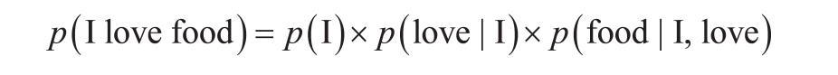

> **圖片描述：序列聯合機率分解公式：p(I love food) = p(I) x p(love|I) x p(food|I,love)。**

請記住，在對數尺度上處理機率更為方便。乘積的對數等於各項對數之和，因此一個token序列的對數機率（logprob）等於序列中所有token對數機率的總和：

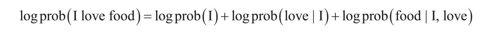

> **圖片描述：序列對數機率公式，將乘法轉為加法避免數值下溢。**
- 截至本書撰寫時，在OpenAI API中，你可以將引數best_of設定為特定值，比如10，這樣OpenAI模型會從10個輸出中返回平均對數機率最高的那個輸出。

在進行求和時，較長序列的總對數機率通常會更低（因為對數機率值一般為負數，介於0和1之間的數取對數後為負數）。為了避免偏向較短的序列，可以使用平均對數機率，即用序列的總對數機率除以序列長度。在取樣多個輸出後，選擇平均對數機率最高的輸出。截至本書撰寫時，這正是OpenAI API所採用的方法。

另一種選擇方法是使用獎勵模型對每個輸出進行評分，如前一節所述。回想一下，Stitch Fix和Grab都選擇了獎勵模型或驗證器（verifier）評分較高的輸出。Nextdoor發現，使用獎勵模型是提升其應用效能的關鍵因素（“Let AI Entertain You: Increasing User Engagement with Generative AI and Rejection Sampling”，2023）。

OpenAI還訓練了驗證器，以幫助模型選擇數學問題的最佳解答（Cobbe等，“TrainingVerifiers to Solve Math Word Problems”，2021）。他們發現，使用驗證器顯著提升了模型效能。**事實上，使用驗證器帶來的性能提升大約相當於將模型規模擴大至30倍。**這意味著，一個擁有1億個引數並使用驗證器的模型，其效能可以與一個不使用驗證器的30億個引數的模型相當。

DeepMind進一步證明了推理時計算的價值，他們認為，擴展推理時計算（例如在推理時分配更多計算資源以生成更多輸出）可能比擴大模型引數規模更有效（Snell等，“Scaling LLM Test-Time Compute Optimally can be More Effective than Scaling Model Parameters”，2024）。同一篇論文提出了一個有趣的問題：如果允許一個LLM在推理時使用固定但有一定規模的計算量，它在處理具有挑戰性的提示詞時能將效能提高多少？

在OpenAI的實驗中，取樣更多輸出確實提高了效能，但僅限於一定範圍內。在該實驗中，這個範圍的上限是400個輸出。超過這個上限後，效能反而下降，如圖2-19所示。他們推測，隨著取樣輸出數量的增加，找到能夠欺騙驗證器的對抗性輸出的機率也隨之提高。然而，斯坦福大學的一項實驗得出了不同的結論。實驗發現，隨著取樣數量從1增加到10,000，解決問題的數量通常呈對數增長（Brown等，“Monkey Business: a Dataset of LargeLLM Sample Collections for Math and Code Tasks”，2024）。雖然思考推理時計算是否可以無限擴展是很有趣的，但我認為在實際生產環境中，沒有人會為每個輸入取樣400或10,000個輸出，因為這樣做的成本將是天文數字。

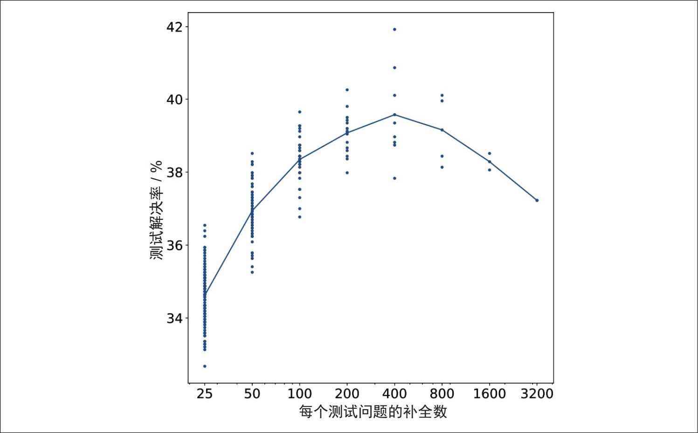

> **圖片描述：測試解決率與補全數的關係散佈圖，約400次補全時解決率最高（約39.5%），之後下降。**

圖2-19：OpenAI（2021）發現，取樣更多輸出能提升效能，但僅限於400個輸出以內

你也可以使用針對特定應用的啟發式方法來選擇最佳響應。如果你的應用更適合較短的響應，你可以選擇最短的候選項。如果你的應用是將自然語言轉換為SQL查詢，你可以讓模型持續生成輸出，直到生成有效的SQL查詢為止。

推理時計算的一個特別有趣的應用是克服延遲問題。對於某些查詢，尤其是思維鏈（chain-of-thought，CoT）查詢，模型可能需要較長時間才能完成響應。TIFIN公司的AI負責人Kittipat Kampa告訴我，他們的團隊會讓模型並行生成多個響應，並向使用者展示第一個完成且有效的響應。

- Wang等將這種方法稱為自洽性（self-consistency，“Self-Consistency Improves Chain of Thought Reasoning in Language Models”，2023）。

從一組輸出中選擇最常見的輸出，對於需要精確答案的任務尤其有用。例如，對於一個數學問題，模型可以多次求解，並選擇出現頻率最高的答案作為最終解答。同樣，對於選擇題，模型可以選擇出現頻率最高的選項。谷歌在評估Gemini模型的MMLU基準推理時就採用了這種方法。他們為每個問題取樣了32個輸出，這使得模型獲得了比每個問題只生成一個輸出更高的分數。

- 然而，對於一個脆弱的模型來說，最理想的做法是直接將其替換掉。

如果在輸入發生微小變化時，模型的輸出不會顯著改變，我們就認為該模型是穩健（robust）的。模型越不穩健，取樣多個輸出的收益就越大。在一個專案中，我們使用AI從產品圖片中提取特定資訊。我們發現，對於同一張圖片，我們的模型只有一半的時間能成功讀取資訊，而另一半時間則提示圖片太模糊或文字太小無法識別。然而，透過對每張圖片嘗試三次，模型能夠成功提取大部分圖片中的正確資訊。

### 2.4.4 結構化輸出
在生產環境中，我們通常需要模型生成符合特定格式的輸出。結構化輸出在以下兩種場景中尤為重要。

**1. 需要結構化輸出的任務。**這類任務最常見的類別是語義解析（semantic parsing）。語義解析涉及將自然語言轉換為結構化的、機器可讀的格式。文字轉SQL就是語義解析的一個例子，其輸出必須是有效的SQL查詢。語義解析允許使用者使用自然語言（例如英語）與API進行互動。例如，文字轉PostgreSQL允許使用者使用英語查詢PostgreSQL資料函式庫，比如用英語詢問“What's the average monthly revenue over the last 6 months”（過去6個月的平均月收入是多少），而無須手動編寫PostgreSQL查詢語句。

以下是一個用於GPT-4o文字轉正規表示式（regex）的提示詞範例。輸出內容為GPT-4o實際生成的結果：

**System prompt**

Given an item, create a regex that represents all the ways the item can be written.

Return only the regex.

Example:

US phone number -> \+?1?\s?(\()?(\d{3})(?(1)\))[-.\s]?(\d{3})[-.\s]?(\d{4})

**User prompt**

Email address ->

**GPT-4o**

[a-zA-Z0-9._%+-]+@[a-zA-Z0-9.-]+\.[a-zA-Z]{2,}

**User prompt**

Dates ->

**GPT-4o**

(?:\d{1,2}[\/\-\.])(?:\d{1,2}[\/\-\.])?\d{2,4}

此場景中的其他任務類別還包括分類任務，其輸出必須是有效的類別。

**2. 輸出被下遊應用使用的任務。**在這種情況下，任務本身並不需要結構化輸出，但由於輸出會被其他應用使用，因此需要能夠被這些應用解析。

例如，你使用AI模型撰寫電子郵件，電子郵件本身不需要結構化。然而，使用該電子郵件的下游應用可能需要特定格式，例如帶有特定鍵的JSON文件：{"title":[標題] ,"body":[郵件正文]}。

**這對於智能體工作流尤其重要**，因為模型的輸出通常會作為輸入傳遞給模型可使用的工具，這一點在第6章中有所討論。

支援結構化輸出的框架包括guidance、outlines、instructor和llama.cpp。模型提供商也可能使用自己的技術來提高模型生成結構化輸出的能力。OpenAI是第一個在其文字生成API中引入**JSON模式**的模型提供商。需要注意的是，API的JSON模式通常只保證輸出符合有效的JSON語法，而不保證JSON物件內容的有效性。此外，如果生成過程過早停止（例如達到最大輸出token長度），生成的JSON雖然有效但可能被截斷，從而無法解析。然而，如果最大token長度設定過長，模型的響應會變得過慢且成本過高。

圖2-20展示了使用guidance生成輸出的兩個範例，分別限制格式為一組選項和正規表示式。

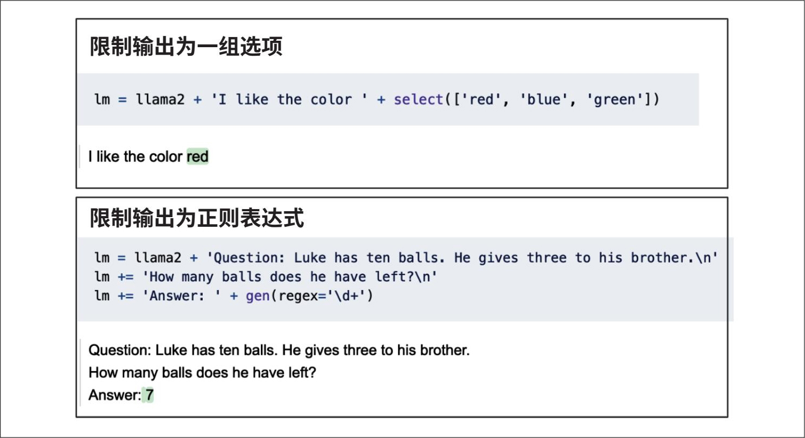

> **圖片描述：Guidance 函式庫受限解碼範例，限制輸出為選項或正則表達式格式。**

圖2-20：使用guidance生成限制格式的輸出的範例

你可以在AI工程技術棧的不同層引導模型生成結構化輸出：提示（prompting）、後處理、推理時計算、約束取樣（constrained sampling）和微調。前三種方法更像權宜之計，如果模型本身已經擅長生成結構化輸出，只需要稍微推動一下，這些方法效果最好。如果需要深入處理，則需要使用約束取樣和微調。

推理時計算在前一節中已經討論過，即持續生成輸出直到符合預期格式。本節將重點介紹其他四種方法。

**1. 提示**

- 截至本書撰寫時，根據應用和模型的不同，我觀察到模型正確生成JSON物件的比例從0%到接近99%不等。

提示是生成結構化輸出的首要方法。你可以指示模型以任何格式生成輸出。然而，模型能否遵循你的指令，取決於模型的指令遵循能力（第4章討論）以及指令的清晰程度（第5章討論）。儘管模型在遵循指令方面表現越來越好，但這並不能保證它們總是能遵循你的指令。對於許多應用而言，即使只有幾個百分點的無效輸出也是無法接受的。

為了提高有效輸出的比例，有些人使用AI來驗證、修正原始提示詞的輸出。這是第3章討論的“AI當裁判”（AI as a Judge）方法的一個例子。這意味著每個輸出至少需要兩次模型查詢：一次用於生成輸出，一次用於驗證輸出。雖然額外的驗證層可以顯著提高輸出的有效性，但額外驗證查詢所帶來的成本和延遲可能使這種方法對某些應用來說成本過高。

**2. 後處理**

後處理簡單且成本低廉，但效果可能出乎意料地好。在我教學期間，我注意到學生往往會犯非常相似的錯誤。當我開始使用基礎模型時，我也注意到了同樣的現象。模型往往會在不同的查詢中重複類似的錯誤。這意味著如果你發現了模型經常犯的錯誤，就可以編寫指令碼來修正這些錯誤。例如，生成的JSON物件缺少一個閉括號，可以手動新增該括號。LinkedIn的防禦性YAML解析器將YAML輸出的正確率從90%提高到了99.99%（Bottaro和Ramgopal，“Musings on building a Generative AI product”，2024）。

> **圖片描述：O'Reilly 書籍裝飾圖示，綠色捲尾蜥蜴剪影。**

 JSON和YAML是常見的文字格式。LinkedIn發現他們使用的底層模型GPT-4對這兩種格式都支援，但他們選擇了YAML作為輸出格式，因為YAML更加簡潔，比JSON需要更少的輸出token（Bottaro和Ramgopal，2024）。

後處理只有在錯誤容易修復時才有效。這通常發生在模型輸出的格式已經基本正確，僅偶爾出現小錯誤的情況下。

**3. 約束採樣**

約束取樣是一種引導文字生成以滿足特定約束條件的技術，通常用於結構化輸出工具中。

總體而言，為了生成一個token，模型會在滿足約束條件的值中進行取樣。回顧一下，為了生成一個token，模型首先輸出一個logit向量，每個logit對應一個可能的token。約束取樣會過濾這個logit向量，僅保留滿足約束條件的token，然後從這些有效的token中進行取樣。該過程如圖2-21所示。

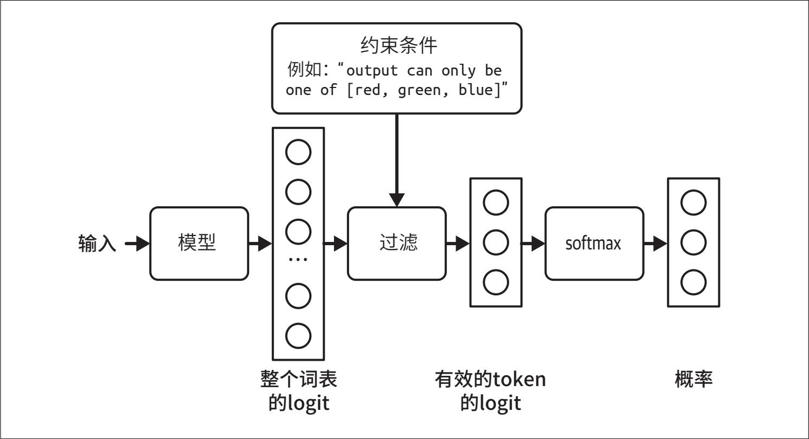

> **圖片描述：受限解碼流程圖：模型輸出 logit→根據約束過濾→有效 token 的 logit→softmax→機率。**

圖2-21：過濾掉不符合約束條件的logit，以便僅在有效輸出中進行取樣

在圖2-21的範例中，實作針對約束條件的過濾很容易。然而，在大多數情況下，過濾並非那麼簡單。你需要有一個語法規則，明確規定每一步允許和不允許的內容。例如，JSON語法規定，在{後面不能再出現另一個{，除非它是字串的一部分，比如{"key":"{{string}}"}。

構建這種語法規則並將其整合到取樣過程中並非易事。由於每種輸出格式（如JSON、YAML、正規表示式、CSV等）都需要各自的語法規則，因此約束取樣的通用性較差。它的使用範圍僅限於那些有外部工具或團隊支援其語法規則的格式。此外，語法驗證還可能增加生成過程的延遲（Brandon T. Willard, “How fast can grammar-structured generation be?”，2024）。

有些人反對約束取樣，他們認為將資源投入到約束取樣中，不如投入到訓練模型以使其更好地遵循指令上。

**4. 微調**

- 從零開始在符合期望格式的資料上訓練模型也是可行的，但本書並不涉及從頭開發模型的內容。

在符合期望格式的範例上對模型進行微調，是讓模型生成該格式的輸出最有效、最通用的方法。它適用於任何期望的格式。雖然簡單的微調並不能保證模型總是輸出期望的格式，但它比提示要可靠得多。

- 一些微調服務會自動為你完成這一步。OpenAI的微調服務曾經允許使用者在訓練時新增分類器頭，但在撰寫本書時，這一功能已被停用。

對於某些任務，你可以在微調之前修改模型的架構，以確保輸出格式符合期望。例如，對於分類任務，你可以在基礎模型的架構上新增一個分類器頭（classifier head），確保模型只輸出預先指定的類別之一，這種架構如圖2-22所示。這種方法也被稱為**基於特徵的遷移**（feature-based transfer），會在第7章中與其他遷移學習技術一起詳細討論。

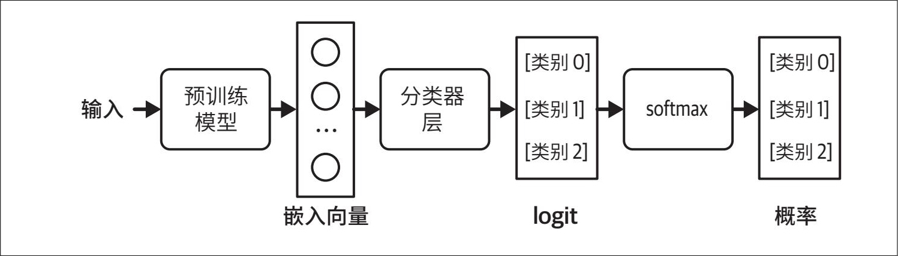

> **圖片描述：預訓練模型加分類器層架構圖：輸入→預訓練模型→嵌入向量→分類器層→logit→softmax→機率。**

圖2-22：在基礎模型上新增分類器頭，將其轉變為分類器。在本範例中，分類器可處理三個類別

在微調過程中，你可以選擇端到端地重新訓練整個模型，也可以只訓練模型的一部分，比如這個分類器頭。端到端訓練需要更多資源，但通常能帶來更好的效能。

之所以需要結構化輸出技術，是因為我們假設模型本身無法生成結構化輸出。然而，隨著模型能力增強，我們可以預期它們在遵循指令方面會變得更好。我認為在未來，我們將更容易透過極少的提示詞就讓模型準確輸出所需的內容，這些技術的重要性也會隨之降低。

### 2.4.5 AI的概率特性
AI模型生成響應的方式決定了其具有**概率性。**我們透過一個例子來理解“機率性”的含義。假設你想知道世界上最好的菜系是什麼。如果你在一分鐘內問你的朋友這個問題兩次，朋友兩次給出的答案應該是一致的。但如果你問AI模型同樣的問題兩次，它的答案可能會發生變化。如果AI模型認為越南菜有70%的可能性是世界上最好的菜系，而義大利菜有30%的可能性，那麼它會在70%的情況下回答“越南菜”，在30%的情況下回答“義大利菜”。機率性的反義詞是**確定性**，即結果是明確的，沒有隨機變化。

這種機率性可能導致不一致性和幻覺。**不一致性**是指模型對相同或稍有不同的提示詞生成非常不同的響應。**幻覺**是指模型給出的響應缺乏事實依據。假設有人在網際網路上寫了一篇文章，聲稱所有美國總統都是外星人，而這篇文章被包含在訓練資料中，那麼模型之後可能會以一定機率輸出“當前的美國總統是外星人”。從不相信這一點的人的角度來看，模型是在憑空捏造。

- 正如網路流行語所說，機率雖低，但絕不會是零（the chances are low, but never zero）。

基礎模型通常使用海量資料進行訓練。它們匯聚了大眾的觀點，內部蘊含著真正的無限可能。任何機率非零的事情，無論多麼離奇或錯誤，都可能被AI生成。

這種特性使得構建AI應用既令人興奮又充滿挑戰。正如本書後續將介紹的，許多AI工程的工作目標都是利用這種機率性，同時緩解由其導致的問題。

- 2023年12月，我回顧了我擔任顧問的一家AI公司三個月以來的客戶支援請求，發現五分之一的問題都是關於如何處理AI模型的不一致性的。2023年7月，在我與Drew Houston（Dropbox CEO）和Harrison Chase（LangChain CEO）共同參加的一場座談會上，我們一致認為幻覺問題是許多企業AI應用場景的最大障礙。

這種機率性使AI非常適合創造性任務。創造力不正是探索常規路徑之外的可能性——跳出固有思維框架嗎？AI是創意專業人士的絕佳助手，它可以無限制地進行頭腦風暴，生成前所未見的設計。然而，這種機率性在其他任務中卻可能帶來麻煩。

**1. 不一致性**

模型的不一致性主要表現為以下兩種情形。

·相同的輸入，不同的輸出：給模型兩次相同的提示詞，卻得到兩個截然不同的輸出。

·輸入稍有不同，輸出大相徑庭：給模型稍微不同的提示詞，比如不小心將一個字母大寫，可能導致輸出結果大相徑庭。

圖2-23展示了我嘗試使用ChatGPT給作文評分的一個例子。同樣的提示詞在我兩次執行時卻給出了兩個不同的分數：一次是3/5，另一次是5/5。

不一致性可能導致使用者體驗不佳。在人際溝通中，我們期望一定程度的一致性。試想一下，一個人每次見面都告訴你一個不同的名字，你會有什麼感受。同樣，使用者在與AI互動時也期望一定程度的一致性。

對於相同輸入產生不同輸出的情況，有多種方法可以緩解這種不一致性。你可以快取答案，這樣下次提出相同的問題時，就會返回相同的答案。你可以固定模型的取樣變數，例如前面討論過的溫度、top-p*和top-*k*的值。你還可以固定**隨機種子**（seed）變數，將其理解為用於取樣下一個token的隨機數生成器的起始點。

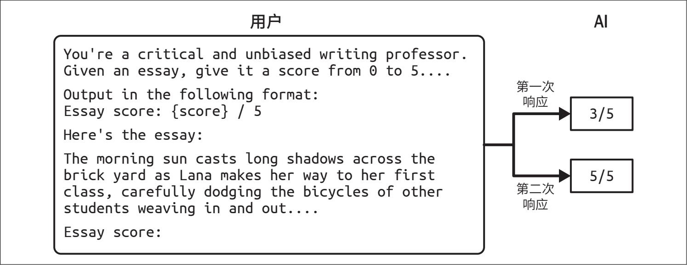

> **圖片描述：AI 不一致性範例，同一篇文章在兩次回應中分別得到3/5和5/5分。**

圖2-23：相同的輸入在同一個模型中可能產生不同的輸出

然而，即使固定了所有變數，也不能保證模型的輸出始終完全一致。模型生成輸出所依賴的硬體也會影響結果，因為不同的機器執行相同指令的方式不同，能夠處理的數值範圍也有差別。如果自託管模型，你可以在一定程度上控制使用的硬體；但如果使用OpenAI或谷歌這樣的模型API提供商，硬體控制權則取決於這些提供商。

固定輸出生成設定是一種良好的實踐，但並不能建立對系統的信任感。試想一下，一名老師只有坐在特定房間裡才會給你一致的分數，而當他坐在另一個房間裡時，給你的分數就會變得毫無規律。

第二種情況——輸入稍有不同，輸出大相徑庭——更具挑戰性。固定模型的輸出生成變數是一種良好的實踐，但這並不能強制模型對不同的輸入生成相同的輸出。不過，透過精心設計的提示詞（第5章討論）和記憶系統（第6章討論），可以讓模型生成更接近你期望的輸出。

**2. 幻覺**

幻覺對於依賴事實準確性的任務來說是致命的。如果你要求AI幫助你解釋疫苗的相關知識，你肯定不希望AI給出偽科學的內容。2023年6月，一家律師事務所因向法院提交虛假的法律研究而被罰款。他們使用ChatGPT準備案件，卻沒有意識到ChatGPT存在幻覺傾向（參見“Lawyers fined for filing bogus case law created by ChatGPT”）。

雖然幻覺問題隨著LLM的興起而變得突出，但早在基礎模型和Transformer架構出現之前，幻覺現象在生成式模型中就已經很常見了。在文字生成領域，早在2016年就有研究提到了幻覺現象（Goyal等，“Natural Language Generation through Character-based RNNs with Finite-state Prior Knowledge”，2016）。從那時起，檢測和衡量幻覺就成為NLG（natural language generation，自然語言生成）領域的重要課題（Lee等，“Hallucinations in Neural Machine Translation”，2018；Nie等，“A Simple Recipe towards Reducing Hallucination in Neural Surface Realisation”，2019；Zhou等，“Detecting Hallucinated Content in Conditional Neural Sequence Generation”，2020）。本節重點解釋幻覺產生的原因，關於如何檢測和衡量幻覺將在第4章中討論。

如果不一致性是由取樣過程中的隨機性引起的，那麼幻覺的成因則更加微妙。僅憑取樣過程本身並不足以解釋幻覺現象。模型從所有可能的選項中取樣輸出，但為什麼從未見過的內容也會成為選項呢？模型可能會輸出一些被認為在訓練資料中從未出現過的內容。我們無法完全確定這一點，因為不可能徹底檢查訓練資料以確認其中是否包含某個內容。我們創造出瞭如此複雜的東西，以至於我們自己都無法完全理解它，這既是福也是禍。

如果不瞭解幻覺產生的根本原因，就很難設計出消除幻覺的方法。目前關於語言模型為何產生幻覺，主要有兩種假設。

第一種假設最初由DeepMind的Ortega等在2021年提出，認為語言模型產生幻覺是因為無法區分輸入給它的資料和自身生成的資料（“Shaking the foundations: delusions in sequence models for interaction and control”）。我們透過一個例子來說明這一點。

假設給模型提示詞“Who's Chip Huyen?”（奇普·萱是誰？），模型生成的第一個句子是“Chip Huyen is an architect.”（奇普·萱是一名建築師。），接下來生成的token將基於序列“Who's Chip Huyen? Chip Huyen is an architect.”。模型將自身生成的“Chip Huyen is an architect.”與給定的事實同等對待。一旦生成了一個稍微偏離事實的序列，模型就可能在此基礎上繼續擴展，生成更加離譜的錯誤資訊。Ortega等將這種幻覺稱為一種**自我欺騙**（self-delusion）。

圖2-24展示了模型LLaVA-v1.5-7B自我欺騙的一個例子。我要求模型根據圖片中的產品標籤列出成分，圖片中的產品是一瓶洗髮水。但在響應中，模型認定圖片中的產品是一瓶牛奶，並在從產品標籤提取的成分列表中新增了牛奶。

> **圖片描述：AI 幻覺範例，模型將洗髮精誤認為牛奶並編造不存在的成分。**

圖2-24：LLaVA-v1.5-7B自我欺騙的一個範例

Zhang等將這種現象稱為滾雪球式幻覺（“How Language Model Hallucinations Can Snowball”，2023）。當模型做出一個錯誤的假設後，它可能會繼續產生幻覺，以使最初的錯誤假設合理化。有趣的是，作者指出，最初的錯誤假設可能導致模型在本來能夠正確響應的問題上犯錯，如圖2-25所示。

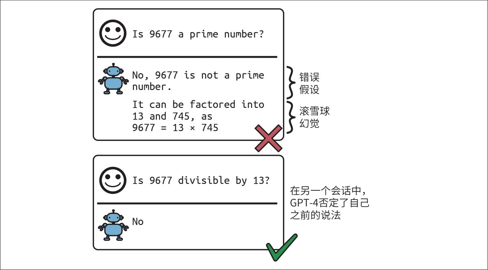

> **圖片描述：GPT-4 滾雪球幻覺範例，錯誤聲稱9677=13x745，但在另一對話中正確否認9677能被13整除。**

圖2-25：一個最初的錯誤假設可能導致模型聲稱9677能被13整除，即使模型本身知道這並不正確

DeepMind的論文表明，可以透過兩種技術緩解幻覺問題。第一種技術來自強化學習，即讓模型區分使用者提供的提示詞（在強化學習中稱為**對世界的觀察**）和模型生成的token（稱為模型的**動作**）。第二種技術依靠監督學習，即在訓練資料中加入事實性和反事實性的訊號。

第二種假設認為，幻覺源於模型的內部知識與標註員的知識不匹配。這一觀點最早由OpenAI研究員Leo Gao提出（“Behavior Cloning is Miscalibrated”，2021）。在監督微調過程中，模型透過模仿標註員寫出的響應進行訓練。如果這些響應使用了標註員掌握但模型並不具備的知識，我們實際上是在教模型產生幻覺。理論上，如果標註員能在每個響應中提供他們使用的知識，讓模型知道這些響應並非憑空捏造，我們或許可以教會模型只使用它所掌握的知識。然而，這在實踐中是不可能實作的。

2023年4月，OpenAI聯合創始人John Schulman在加州大學伯克利分校的演講中表達了類似的觀點（參見YouTube影片“John Schulman - Reinforcement Learning from Human Feedback: Progress and Challenges”）。Schulman還認為，LLM知道自己是否掌握某些知識，這本身就是一個大膽的主張。如果這一觀點成立，那麼透過強制模型僅基於自身掌握的資訊作答，就可以解決幻覺問題。他提出了兩種解決方案：一種是驗證，即要求模型為每個響應檢索引用的依據；另一種是使用強化學習。注意，獎勵模型的訓練僅基於比較（響應A比響應B更好），而沒有解釋為什麼A更好。Schulman認為，一個更好的獎勵函式能夠更嚴厲地懲罰模型的虛構行為，從而幫助緩解幻覺問題。

在同一場演講中，Schulman提到OpenAI發現RLHF有助於減少幻覺。然而，InstructGPT的論文卻表明RLHF加劇了幻覺問題，如圖2-26所示。儘管RLHF似乎加重了InstructGPT的幻覺問題，但它改善了其他方面的表現。總體而言，人類標註員更喜歡使用RLHF的模型，而不是僅使用監督微調的模型。

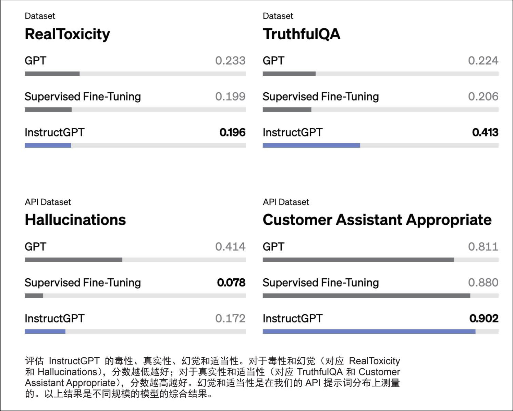

> **圖片描述：InstructGPT 四項評估結果，在 TruthfulQA 和 Customer Assistant Appropriate 上明顯優於基礎 GPT。**

圖2-26：同時使用RLHF和監督微調的模型（InstructGPT）幻覺問題更嚴重。圖片來自Ouyang等，“Training language models to follow instructions with human feedback”，2022

基於基礎模型“知道自己知道什麼”的假設，有人嘗試透過提示詞來減少幻覺，例如新增“請儘可能如實回答，如果你不確定答案，請說‘抱歉，我不知道’”。要求模型給出簡潔的回答似乎也有助於抑制幻覺——模型生成的token越少，編造內容的機會就越少。第5章和第6章介紹的提示詞和上下文構建技巧也有助於緩解幻覺問題。

前文討論的兩個假設是相互補充的。“自我欺騙假設”關注的是自監督如何導致幻覺，而“內部知識不匹配假設”關注的是監督如何導致幻覺。

如果我們無法完全避免幻覺，是否至少能檢測出模型何時出現幻覺，從而避免向使用者提供這些虛構的響應呢？然而，檢測幻覺也並非易事——試想一下，我們人類要辨別另一個人何時在撒謊或編造內容有多困難。儘管如此，人們仍然進行了一些嘗試。我們將在第4章討論如何檢測和衡量幻覺。

## 2.5 小結
本章討論了構建基礎模型時的核心設計決策。由於大多數人會使用現成的基礎模型，而不是從零開始訓練，因此我跳過了具體的訓練細節，轉而關注那些有助於你確定使用哪些模型以及如何使用這些模型的建模因素。

影響模型效能的一個關鍵因素是訓練資料。大模型需要海量的訓練資料，而獲取這些資料往往既昂貴又耗時。因此，模型提供商通常會利用一切可用的資料。這導致模型在訓練資料所涵蓋的許多工上表現良好，但其中可能不包括你所需的特定任務。本章討論了為什麼通常需要對訓練資料進行精心篩選，以開發針對特定語言（尤其是低資源語言）和特定領域的模型。

資料就緒後，模型開發就可以開始了。雖然模型訓練經常佔據新聞頭條，但在此之前的一個重要步驟是模型架構設計。本章探討了模型架構與規模等建模選擇。語言類基礎模型的主流架構是Transformer。本章探討了Transformer架構旨在解決的問題及其局限性。

衡量模型的規模有三個關鍵指標：引數量、訓練token數以及FLOPs。決定模型訓練所需計算量的兩個因素是模型大小和資料規模。規模法則有助於在給定算力預算的情況下確定最佳的引數量和token數。本章還討論了擴大模型規模時遇到的瓶頸。目前，擴大模型規模通常能提升模型效能，但這種趨勢還能持續多久呢？

由於預訓練階段資料質量參差不齊且採用自監督方式，訓練出的模型可能產生與使用者期望不符的輸出。為了解決這一問題，需要進行後訓練。後訓練包括兩個步驟：監督微調和偏好微調。人類的偏好多種多樣，難以用單一數學公式表達，因此現有的解決方案還遠遠算不上完美。

本章還介紹了我最喜歡的主題之一：取樣，即模型生成輸出token的過程。取樣賦予了AI模型機率性。這種機率性使得ChatGPT和Gemini等模型在創意任務中表現出色，且互動過程充滿趣味。然而，這種機率性也會導致模型輸出的不一致性和幻覺現象。

使用AI模型時，需要圍繞其機率特性構建工作流程。本書後續部分將探討如何使AI工程即便無法實作確定性，也能做到系統化。實作系統化AI工程的第一步是建立穩健的評估流水線，以幫助檢測故障和意外變化。基礎模型的評估至關重要，因此從下一章開始，我專門用兩章的篇幅來對此進行講解。