# 第3章 評估方法論

AI的應用越廣泛，發生災難性故障的可能性就越大。在基礎模型問世以來不長的時間內，我們已經見證了許多故障案例：一名男子在聊天機器人的慫恿下自殺（參見“‘He Would Still Be Here’: Man Dies by Suicide After Talking with AI Chatbot, Widow Says”），有律師提交了由AI臆造的虛假證據（參見“Humiliated lawyers fined $5,000 for submitting ChatGPT hallucinations in court”），加拿大航空公司因其AI聊天機器人向乘客提供錯誤資訊而被判賠償（參見“11 famous AI disasters”）。如果缺乏對AI輸出進行質量控制的方法，那麼在許多應用中，AI帶來的風險可能會超過其收益。

- 2023年12月，OpenAI聯合創始人Greg Brockman在X上表示：“出人意料的是，很多時候，僅靠評估就夠了。”

隨著各團隊加速採用AI，許多人很快意識到，AI應用落地的最大障礙在於評估。對於某些應用而言，確定評估方法可能會佔據開發工作的大部分精力。

鑑於評估的重要性和複雜性，本書專門用兩章來討論。本章介紹針對開放式模型的不同的評估方法、運作機制及其侷限性。下一章則重點講解如何利用這些方法為你的應用選擇模型，並構建評估流水線來對其進行評估。

雖然我用單獨的章節來討論評估，但必須將其置於整個系統的背景下，而不能孤立看待。評估的目標是降低風險並發現機會。為了降低風險，你首先需要確定系統可能失敗的環節，並圍繞這些環節設計評估方法。這通常需要重新設計系統，以增強對故障的可見性。如果不清楚系統可能會在哪些地方失效，那麼再多的評估指標或工具也無法使系統變得穩健。

- 根據2023年a16z的一項研究，70位決策者中有6位僅憑口碑來評估模型（參見“16 Changes to the Way Enterprises Are Building and Buying Generative AI”）。

- 也被稱為“憑感覺檢查”（vibe check，即不依賴資料，而是靠人的直覺判斷好壞，類似於vibe coding的隨性風格。——譯者注）。

在深入探討評估方法之前，我們需要先認識到評估基礎模型所面臨的挑戰。由於評估難度大，許多人滿足於**口口相傳**（例如，聽說某個模型表現不錯）或憑直覺觀察結果。這種做法不僅會帶來更多風險，還會減緩應用的迭代速度。我們需要進行系統化的評估，以使結果更加可靠。

由於許多基礎模型都包含語言模型元件，本章將簡要介紹用於評估語言模型的指標，包括交叉熵和困惑度。這些指標對於指導語言模型的訓練和微調至關重要，且在許多評估方法中被廣泛採用。

評估基礎模型極具挑戰性，因為它們是開放式的。我將介紹應對這些挑戰的最佳實踐。對於許多應用而言，人工評估仍然不可或缺。然而，鑑於人工評估效率低且成本高，我們的目標是實作評估過程的自動化。本書重點關注自動化評估，涵蓋精確評估和主觀評估。

在主觀評估中，一種迅速崛起的方法是“AI當裁判”，即使用AI來評估AI的輸出。這種方法之所以屬於主觀範疇，是因為評分取決於所使用的AI裁判模型和提示詞。這種方法在業界迅速獲得關注，但也引發了強烈反對，反對者認為AI在這項重要任務上還不足以讓人信賴。我非常期待深入探討這一話題，也希望你能同樣感興趣。

## 3.1 評估基礎模型的挑戰
評估ML模型一直以來都很困難。隨著基礎模型的出現，評估變得難上加難。與傳統ML模型相比，評估基礎模型更具挑戰性，這背後有諸多原因。

- 當OpenAI的GPT-o1於2024年9月釋出時，菲爾茲獎得主陶哲軒（Terence Tao）將與該模型合作的體驗比作與“一名平庸但並非完全無能的研究生”共事。他推測，再經過一兩次迭代，AI就可能達到“稱職的研究生”的水平。針對他的評價，許多人開玩笑說，如果我們已經到了需要最頂尖的人類智慧來評估AI模型的地步，那麼未來的模型可能就沒有人有資格評估了。

首先，AI模型越智慧，對其進行評估就越困難。大多數人都能判斷一年級學生的數學解答是否正確，但很少有人能判斷博士級別的數學解答是否正確。如果一本書的摘要胡言亂語，人們很容易判斷它不好；但如果摘要邏輯清晰，判斷起來就困難得多。要驗證摘要的質量，你可能需要先讀過這本書。這引出了一個推論：對於複雜任務，評估可能會耗費更多的時間。你不能再僅憑響應在表面上是否通順來評估，還需要進行事實核查、推理，甚至結合領域專業知識。

其次，基礎模型的開放式特性對基於標準答案評估模型的傳統方法提出了挑戰。在傳統ML中，大多數任務都是封閉式的。例如，一個分類模型只能輸出預期類別中的一個。要評估分類模型，你可以將其輸出與預期輸出進行比較。如果預期輸出是類別X，而模型輸出了類別Y，那麼模型就是錯誤的。然而，對於開放式任務，給定一個輸入，可能存在許多正確的響應，要窮舉所有正確的輸出以此進行比對是不可能的。

再次，大多數基礎模型都被視為“黑盒”，這要麼是因為模型提供商選擇不公開模型的細節，要麼是因為應用開發者缺乏理解這些細節所需的專業知識。模型架構、訓練資料和訓練過程等細節往往能揭示模型的諸多優勢和劣勢。如果缺乏這些細節，你就只能透過觀察模型的輸出結果來對其進行評估。

此外，公開可用的評估基準測試已被證明難以充分評估基礎模型。在理想情況下，評估基準測試應該覆蓋模型的全部能力。隨著AI的發展，基準測試也需要不斷演進。一旦模型在某個基準測試上取得滿分，該基準便會飽和。對於基礎模型而言，基準測試飽和的速度正越來越快。例如，2018年推出的GLUE（General Language Understanding Evaluation，通用語言理解評估，Wang等，“GLUE: A Multi-Task Benchmark and Analysis Platform for Natural Language Understanding”，2018）基準在推出僅一年後就飽和了，因此研究人員在2019年推出了SuperGLUE（Wang等，“SuperGLUE: A Stickier Benchmark for General-Purpose Language Understanding Systems”，2019）。類似地，NaturalInstructions（Mishra等，“Cross-Task Generalization via Natural Language Crowdsourcing Instructions”，2021）被Super-NaturalInstructions（Wang等，2022）所取代。2020年推出的MMLU曾是許多早期基礎模型依賴的重要基準，但到2024年已基本被MMLU-Pro（Wang等，“MMLU-Pro: A More Robust and Challenging Multi-Task Language Understanding Benchmark”，2024）所取代。

最後，通用模型的評估範圍已經擴大。對於特定任務模型，評估通常衡量其在訓練任務上的表現。然而，對於通用模型，評估不僅要考察模型在已知任務上的表現，還要探索模型能夠完成的新任務，這些任務可能超出了人類能力的範圍。因此，評估承擔了探索AI潛力和侷限性的額外職責。

好訊息是，評估面臨的新挑戰催生了許多新方法和新基準。如圖3-1所示，2023年上半年，每月發表的LLM評估論文數量呈指數級增長，從每月2篇增長到接近每月35篇。

	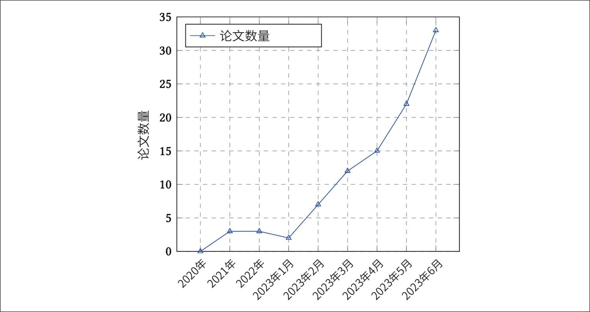

> **圖片描述：折線圖，顯示 LLM 評估相關論文數量隨時間的變化趨勢。X 軸為時間（從 2020 年至 2023 年 6 月），Y 軸為論文數量（0-35）。2020 年至 2022 年期間論文數量維持在個位數，2023 年起呈指數級增長，從每月約 3 篇迅速攀升至 2023 年 6 月的約 33 篇。**

圖3-1：LLM評估論文數量隨時間的變化趨勢。圖片來自Chang等，“A Survey on Evaluation of Large Language Models”，2023

- 我使用關鍵詞“LLM”“GPT”“generative”“Transformer”，搜尋了所有至少有500個星標的儲存庫。我還透過個人網站向社群徵集了遺漏的儲存庫。

在我對GitHub上排名前1000的AI相關儲存庫（按星標數排名）的分析中，我發現有超過50個儲存庫專門用於評估（截至2024年5月。參見Chip Huyen個人網站“Open Source LLM Tools”頁面）。按建立日期繪製的評估儲存庫數量圖顯示，儲存庫數量呈指數級增長，如圖3-2所示。

	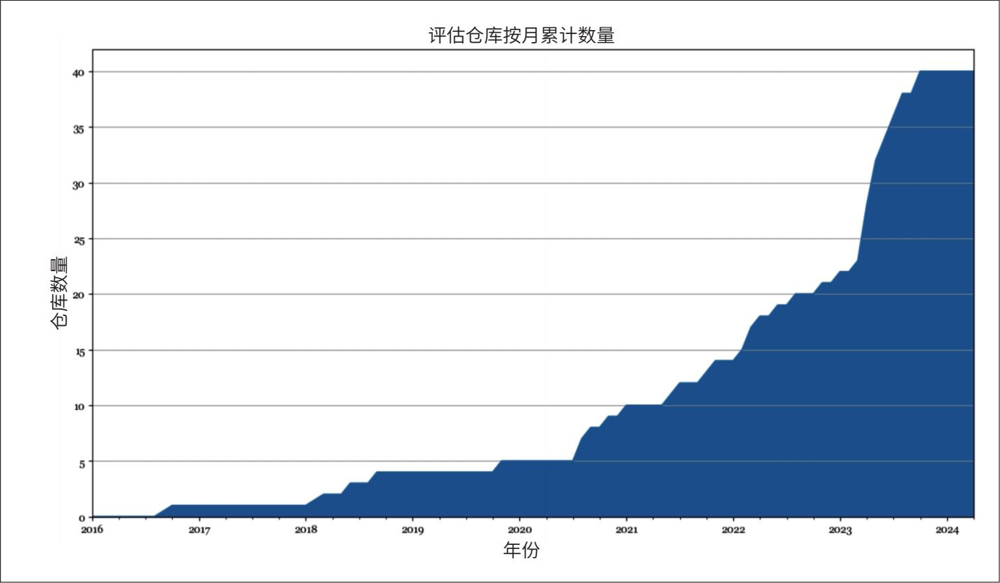

> **圖片描述：面積圖，顯示 GitHub 上評估相關儲存庫按月累計數量。X 軸為年份（2016-2024），Y 軸為儲存庫數量（0-40）。2016 至 2020 年間增長緩慢，維持在 5 個以下；2020 年後開始加速，2023 年起呈現爆發式增長，至 2024 年累計接近 40 個。**

圖3-2：GitHub上最受歡迎的1000個AI儲存庫中開源評估儲存庫的數量

壞訊息是，儘管人們對評估的興趣與日俱增，但與AI工程流程的其他環節相比，評估仍然滯後。來自DeepMind的Balduzzi等在論文（“Re-evaluating evaluation”，2018）中指出：“與演算法開發相比，評估方法的開發幾乎沒有得到系統性的關注。”根據該論文，實驗結果幾乎只用於改進演算法，很少用於改進評估方法。Anthropic公司意識到評估領域投資不足，呼籲政策制定者增加政府資金和撥款，用於開發新的評估方法以及分析現有評估方法的穩健性（參見“Challenges in evaluating AI systems”）。

如圖3-3所示，跟建模與訓練、AI編排工具的數量相比，評估工具的數量較少，這進一步表明，評估方面的投資落後於AI領域的其他方面。

由於基礎設施投入不足，導致人們難以進行系統性評估。當被問及如何評估AI應用時，許多人告訴我，他們只是憑直覺觀察結果。許多人只有一小套常用的提示詞用來評估模型，這些提示詞的選擇往往是臨時性的，通常基於個人經驗，而非應用的實際需求。在專案啟動初期，這種臨時方法或許還能勉強應付，但對於應用迭代來說，這是遠遠不夠的。本書的重點正是介紹系統性的評估方法。

	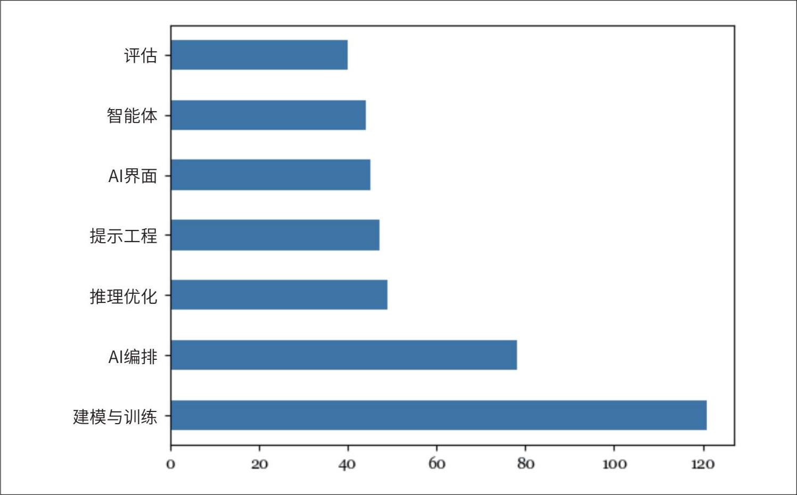

> **圖片描述：水平長條圖，比較 GitHub 上前 1000 個 AI 儲存庫中不同類別的開源工具數量。由上至下依序為：評估（約 38 個）、智慧體（約 42 個）、AI 介面（約 44 個）、提示工程（約 46 個）、推理最佳化（約 48 個）、AI 編排（約 78 個）、建模與訓練（約 120 個）。評估工具的數量明顯少於其他類別。**

圖3-3：根據我整理的GitHub上最受歡迎的1000個AI儲存庫的資料，評估工具的開源數量落後於AI工程的其他方面

## 3.2 理解語言建模指標
- 儘管二者之間存在很強的相關性，但語言建模的效能並不能完全解釋下游任務的表現。這仍然是一個活躍的研究領域。

基礎模型是從語言模型演變而來的。許多基礎模型的主要組成部分仍然是語言模型。對於這些模型而言，語言模型元件的效能通常與基礎模型在下游應用中的表現密切相關（Liu等，“Same Pre-training Loss, Better Downstream: Implicit Bias Matters for Language Models”，2023）。因此，大致瞭解語言建模指標對於理解下游任務的表現非常有幫助。

如第1章所述，語言建模已有數十年曆史，由Claude Shannon 1951年的論文“Prediction and Entropy of Printed English”推廣開來。自那時起，用於指導語言模型開發的指標並未發生太大變化。大多數自迴歸語言模型都是使用交叉熵或其相關指標——困惑度進行訓練的。在閱讀論文和模型報告時，你可能還會遇到BPC（bits-per-character，每字元位元數）和BPB（bits-per-byte，每位元組位元數），這兩者都是交叉熵的變體。這四個指標——交叉熵、困惑度、BPC和BPB——彼此密切相關。如果你知道其中一個指標的值，並掌握必要的資訊，就可以計算出其他三個指標的值。雖然我將它們稱為語言建模指標，但它們實際上適用於任何生成token（包括非文字token）序列的模型。

回顧一下，語言模型編碼了關於語言的統計資訊（給定上下文中某個token出現的可能性）。從統計角度講，給定上下文“I like drinking __”（我喜歡喝___），下一個詞更可能是tea（茶），而不是charcoal（木炭）。模型捕獲的統計資訊越多，預測下一個token的能力就越強。

用ML術語來說，語言模型學習的是其訓練資料的分佈。模型學習得越好，對訓練資料中下一個token的預測就越準確，其訓練交叉熵也就越低。與任何ML模型一樣，你不僅關心模型在訓練資料上的表現，更關心它在實際生產資料上的表現。一般來說，你的資料與模型訓練資料越接近，模型在你的資料上的表現就越好。

與本書其他部分相比，本節的數學內容較多。如果你覺得難以理解，可以跳過數學部分，專注於對這些指標的解釋。即使你不訓練或微調語言模型，理解這些指標也有助於評估哪些模型適合你的應用。這些指標偶爾也可用於某些評估和資料去重技術，本書後續章節會有相關討論。

### 3.2.1 熵
- 如第1章所述，一個token可以是一個字元、一個單詞或一個單詞的一部分。Claude Shannon在1951年提出熵的概念時，他使用的token是字元。他自己對熵的描述如下：“熵是一種統計引數，從某種意義上衡量了語言文字中每個字母平均產生了多少資訊。如果以最有效的方式將語言轉換為二進位制數字（0或1），則熵就是表示原始語言中每個字母平均所需的二進位制數字的數量。”

**熵**衡量的是一個token平均攜帶的資訊量。熵越高，每個token攜帶的資訊量越大，表示該token所需的位元數越多。

我們用一個簡單的例子來說明這一點。假設你想建立一種語言來描述正方形內的位置，如圖3-4所示。如果你的語言只有2個token，如圖3-4中的(a)所示，每個token只能告訴你位置是在上半部分還是下半部分。由於只有2個token，用1個位元就足以表示它們。因此，這種語言的熵為1。

如果你的語言有4個token，如圖3-4中的(b)所示，每個token都能給出更具體的位置：左上、右上、左下或右下。然而，由於現在有4個token，你需要用2個位元來表示它們。這種語言的熵為2。後一種語言的熵更高，因為每個token攜帶了更多資訊，但每個token也需要更多位元來表示。

	

> **圖片描述：示意圖，展示兩種描述正方形內位置的語言。(a) 左側正方形被水平線分為上下兩部分（標記 1 和 2），代表 2 個 token、熵為 1 的語言。(b) 右側正方形被十字線分為四個象限（標記 1、2、3、4），代表 4 個 token、熵為 2 的語言。說明熵越高，每個 token 攜帶的資訊量越大。**

圖3-4：兩種描述正方形內位置的語言。與左側語言(a)相比，右側語言(b)的token攜帶了更多資訊，但也需要更多位元來表示

直觀地講，熵衡量了預測語言中下一個token的難度。語言的熵越低（語言的每個token攜帶的資訊越少），語言就越容易預測。在前面的例子中，只有2個token的語言比有4個token的語言更容易預測（因為你只需在2個可能的token中進行預測，而不是4個）。這就好像，如果你能完美預測我接下來要說什麼，那麼我所說的話就沒有提供任何新資訊。

### 3.2.2 交叉熵
當你在資料集上訓練一個語言模型時，你的目標是讓模型學習該訓練資料的分佈。換句話說，你的目標是讓模型預測訓練資料中接下來會出現什麼。語言模型在資料集上的交叉熵衡量了語言模型預測該資料集中下一個token的難度。

模型在訓練資料上的交叉熵取決於以下兩個因素。

·訓練資料本身的可預測性，以訓練資料的熵衡量。

·語言模型所捕獲的分佈與訓練資料的真實分佈之間的差異程度。

熵和交叉熵使用相同的數學符號H*表示。設*P*為訓練資料的真實分佈，*Q*為語言模型學習到的分佈，則有以下關係。

·訓練資料的熵為*H*（*P*）。

·*Q*相對於*P*的差異可以用KL（Kullback-Leibler）散度來衡量，數學表示為*D*KL（*P*‖*Q*）。

·模型相對於訓練資料的交叉熵為：。

交叉熵不是對稱的，Q*相對於*P*的交叉熵*H*（*P**，**Q*）與*P*相對於*Q*的交叉熵*H*（*Q**，**P*）並不相同。

語言模型的訓練目標是最小化其相對於訓練資料的交叉熵。如果語言模型完美地學習了訓練資料，那麼模型的交叉熵將與訓練資料的熵完全相同。這時，分佈*Q*相對於分佈*P*的KL散度將為0。你可以將模型的交叉熵理解為模型對訓練資料的熵的近似。

### 3.2.3 BPC與BPB
熵和交叉熵的單位是位元。如果一個語言模型的交叉熵是6位元，那麼該語言模型需要6位元來表示每個token。

由於不同模型採用不同的分詞方法，例如一個模型使用單詞作為token，而另一個模型使用字元作為token，因此不同模型之間每個token的位元數並不具備可比性。一些人會使用BPC作為替代指標。如果每個token的位元數為6，且平均每個token包含2個字元，那麼BPC為6/2=3。

BPC的一個複雜之處在於不同的字元編碼方案。例如，ASCII編碼每個字元使用7位元，而UTF-8編碼每個字元可能使用8到32位元不等。因此，一個更標準化的指標是BPB，即語言模型表示原始訓練資料中每位元組所需的位元數。如果BPC為3，且每個字元為7位元（即7/8位元組），那麼BPB為3/（7/8）≈3.43。

交叉熵告訴我們語言模型在壓縮文字方面的效率。一個語言模型的BPB為3.43，意味著它可以用3.43位元表示原始資料的每位元組（8位元），因此該語言模型可以將原始訓練文字壓縮到原始大小的一半以下。

### 3.2.4 困惑度
**困惑度**是熵或交叉熵的指數形式，通常縮寫為PPL。給定一個真實分佈為的資料集，其困惑度定義為：

語言模型（學習到的分佈為Q*）在該資料集上的困惑度定義為：

如果交叉熵衡量的是模型預測下一個token的難度，那麼困惑度衡量的則是模型在預測下一個token時的不確定程度。不確定性越高，意味著下一個token可能的選項越多。

考慮一個語言模型，它能夠完美地編碼如圖3-4(b)所示的4個位置。該語言模型的交叉熵為2位元。當該語言模型嘗試預測正方形中的一個位置時，它必須從22=4個可能的選項中選擇。因此，該語言模型的困惑度為4。

到目前為止，我一直使用位元作為熵和交叉熵的單位。每個位元可以表示2個唯一的值，因此上述困惑度公式以2為底。

- 許多人偏好使用自然對數而非以2為底的對數，原因之一是自然對數具有某些特性，使得數學計算更簡單。例如，自然對數函式ln(x)的導數為1/x。

流行的ML框架（包括TensorFlow和PyTorch）使用自然對數（natural log，簡寫為nat）作為熵和交叉熵的單位。自然對數以常數e為底，如果使用自然對數作為單位，則困惑度是以e為底的指數：

	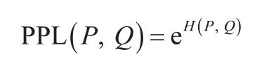

> **圖片描述：數學公式，顯示困惑度的定義：PPL(P, Q) = e^{H(P, Q)}，即困惑度等於自然常數 e 的交叉熵次方。**

由於位元和自然對數單位之間容易產生混淆，許多人在報告語言模型效能時會使用困惑度而非交叉熵。

### 3.2.5 困惑度的解釋與應用場景
如前所述，交叉熵、困惑度、BPC和BPB都是衡量語言模型預測準確性的指標。這些指標的值越低，說明模型對文字的預測越準確。本書將使用困惑度作為預設的語言建模指標。請記住，模型在預測給定資料集中的後續內容時，不確定性越大，困惑度就越高。

困惑度的高低取決於資料本身以及困惑度的具體計算方式，比如模型能訪問之前多少個token。以下是一些一般規律。

**結構化程度越高的數據，困惑度通常越低**

結構化程度越高的資料越容易預測。例如，HTML程式碼比日常文字更容易預測。如果看到一個HTML的開始標籤<head>，你就可以預測附近應該會有一個閉合標籤</head>。因此，模型在HTML程式碼上的預期困惑度會低於在日常文字上的困惑度。

**詞表越大，困惑度越高**

直觀地講，可選的token越多，模型預測下一個token就越困難。例如，一個模型在兒童讀物上的困惑度通常會低於該模型在《戰爭與和平》上的困惑度。對於同一資料集，比如英文資料，基於字元（預測下一個字元）的困惑度往往低於基於單詞（預測下一個單詞）的困惑度，因為可選的字元數量遠小於可選的單詞數量。

**上下文長度越長，困惑度越低**

模型可利用的上下文長度越長，預測下一個token時的不確定性就越低。1951年，Claude Shannon在評估其模型的交叉熵時，使用了最多10個前序token作為條件來預測下一個token。截至當前，模型的困惑度通常可以基於500到10,000個甚至更多的前序token來計算，具體取決於模型的最大上下文長度。

作為參考，困惑度低至3甚至更低的情況並不少見。假設一種語言中所有token出現的機率相等，那麼困惑度為3意味著模型有三分之一的機率正確預測下一個token。考慮到模型的詞表通常包含幾萬甚至幾十萬個token，這種預測準確率是非常驚人的。

除了指導語言模型的訓練，困惑度在AI工程流程的許多環節中也發揮著重要作用。最典型的一點是，困惑度是衡量模型能力的一個有效代理指標。如果模型在預測下一個token方面表現不佳，那麼它在下游任務上的表現很可能也不理想。OpenAI的GPT-2報告顯示，規模更大的模型（通常也更強大）在一系列資料集上始終表現出更低的困惑度，如表3-1所示。遺憾的是，隨著對模型資訊的保密程度越來越高，許多公司已經不再公開報告其模型的困惑度。

表3-1：更大的GPT-2模型在不同資料集上始終表現出更低的困惑度。來源：OpenAI，“Language Models are Unsupervised Multitask Learners”，2018

	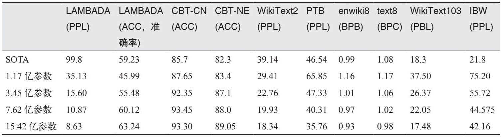

> **圖片描述：表格，展示 GPT-2 論文中不同模型規模在多個語言建模基準測試上的表現。列包括 LAMBADA (PPL)、LAMBADA (ACC)、CBT-CN (ACC)、CBT-NE (ACC)、WikiText2 (PPL)、PTB (PPL)、enwiki8 (BPB)、text8 (BPC)、WikiText103 (PBL)、IBW (PPL)。行從 SOTA 到 15.42 億參數的模型，清楚顯示模型規模越大，各項指標表現越好。**
	

> **圖片描述：O'Reilly 書籍裝飾圖案——橘色蠍子剪影，用於標示注意事項或警告區塊。**
- 如果你不清楚監督微調和RLHF的含義，請回顧第2章。

- 第7章會討論量化。

 困惑度可能並不是評估經過監督訓練和RLHF等後訓練的模型的理想代理指標。後訓練旨在教會模型如何完成任務。當模型在任務執行上表現更好時，它預測下一個token的能力反而可能會變差。事實上，語言模型經過後訓練後，其困惑度通常會變高。一些觀點認為後訓練會導致熵坍縮。同樣，量化——一種降低模型數值精度並減少記憶體佔用的技術——也可能以意想不到的方式改變模型的困惑度。

回顧一下，模型對某段文字的困惑度衡量的是該模型預測這段文字的難度。對於給定的模型而言，它對在訓練過程中見過並記住的文字的困惑度最低。因此，困惑度可以用來檢測某段文字是否出現在模型的訓練資料中。這對於檢測資料汙染很有用——如果模型在某個基準資料集上的困惑度很低，那麼該基準資料集很可能已被包含在模型的訓練資料中，從而導致模型在相應基準測試上的表現不可信。這種方法也可用於訓練資料去重，例如，僅當新資料的困惑度較高時，才將其新增到現有的訓練資料集中。

在面對難以預測的文字時，困惑度最高，例如表達不尋常觀點的文字（如“我的狗在空閒時間教量子物理”）或無意義的文字（如“home cat go eye”）。因此，困惑度也可以用來檢測異常文字。

困惑度及其相關指標幫助我們理解底層語言模型的效能，這是間接瞭解模型在下游任務上的表現的一種方式。本章後續部分將討論如何直接衡量模型在下游任務上的表現。

**如何使用語言模型計算文本的困惑度**

模型對某段文字的困惑度衡量的是模型預測該文字的難度。給定一個語言模型X和一個token序列[x*1,*x*2,…,*x**n*]，模型X對該序列的困惑度為：

	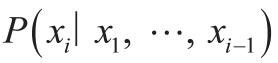

> **圖片描述：數學公式，表示條件機率 P(x_i | x_1, ..., x_{i-1})，即在給定前 i-1 個 token 的條件下，第 i 個 token 出現的機率。**

其中，表示模型X在給定前序tokenx*1,…,*x**i**-**1*的情況下，對token *x**i*所賦予的機率。

要計算困惑度，你需要獲得語言模型對每一個後續token分配的機率（或對數機率）。遺憾的是，並非所有商業模型都會公開其對數機率，具體內容已在第2章中討論過。

## 3.3 精確評估
在評估模型效能時，區分精確評估和主觀評估非常重要。精確評估能給出明確且無歧義的判斷。例如，一道選擇題的正確答案是A，而你選擇了B，那麼你的答案就是錯誤的，這一點毫無爭議。而作文評分則是主觀的，一篇作文的得分往往取決於評分者。同一個評分者在不同時間對同一篇作文評分，也可能給出不同的分數。如果有明確的評分標準，作文評分可以變得更加精確。正如你將在下一節看到的，使用AI當裁判時，評估本質上是主觀的。評估結果可能會因裁判模型和提示詞的不同而有所差異。

接下來將介紹兩種能夠產生精確評分的評估方法：功能正確性和與參考資料的相似度度量。請注意，本節關注的是對開放式響應（任意文字生成）的評估，而非封閉式響應（如分類任務）。這並不是因為基礎模型不用於封閉式任務。事實上，許多基礎模型系統至少包含一個分類元件，通常用於意圖分類或評分。本節之所以關注開放式評估，是因為封閉式評估方法已經非常成熟。

### 3.3.1 功能正確性
功能正確性評估是指根據系統是否實作了預期功能來進行評估。例如，你要求模型建立一個網站，那麼生成的網站是否滿足了你的需求？又例如，你要求模型在某家餐廳預訂座位，模型是否成功完成了預訂？

功能正確性是評估任何應用效能的終極指標，因為它直接衡量了應用是否實作了預期目標。然而，功能正確性並不總是容易衡量，其評估過程也很難完全自動化。

程式碼生成任務是功能正確性評估可以實作自動化的典型範例。在程式碼生成任務中，功能正確性有時被稱為**執行準確性。**假設你要求模型編寫一個Python函式gcd(num1, num2)，用於計算兩個數num1 和num2 的最大公約數。可以將生成的程式碼輸入到Python直譯器中，以檢查程式碼是否有效；如果有效，再檢查它是否能針對給定的一對數(num1, num2)輸出正確的結果。例如，對於(num1=15, num2=20)，如果函式gcd(15, 20)沒有返回正確答案5，那麼你就可以判定該函式是錯誤的。

早在AI被用於編寫程式碼之前，自動驗證程式碼的功能正確性就已是軟體工程的標準實踐。程式碼通常透過單元測試進行驗證，即在不同場景下執行程式碼，以確保它生成預期的輸出。功能正確性評估正是LeetCode和HackerRank等程式設計平臺用來驗證提交方案的方法。

用於評估AI程式碼生成能力的流行基準測試，例如OpenAI的HumanEval和谷歌的MBPP，都使用功能正確性作為評估指標。文字轉SQL任務的基準測試，如Spider（Yu等，2018）、BIRD-SQL（Li等，2023）和WikiSQL（Zhong等，2017）也依賴功能正確性。

一個基準測試問題通常配備一組測試用例。每個測試用例包含預期的程式碼執行場景以及在該場景下的預期輸出。以下是HumanEval中一個問題及其測試用例的範例：

**問題**

from typing import List

def has_close_elements(numbers: List[float], threshold: float) -> bool:

      """ 檢查給定列表中是否存在任意兩個數之間的距離小於給定閾值。

      >>> has_close_elements([1.0, 2.0, 3.0], 0.5) False

      >>> has_close_elements([1.0, 2.8, 3.0, 4.0, 5.0, 2.0], 0.3) True

      """

**測試用例（每個assert語句代表一個測試用例）**

def check(candidate):

      assert candidate([1.0, 2.0, 3.9, 4.0, 5.0, 2.2], 0.3)==True

      assert candidate([1.0, 2.0, 3.9, 4.0, 5.0, 2.2], 0.05)==False

      assert candidate([1.0, 2.0, 5.9, 4.0, 5.0], 0.95)==True

      assert candidate([1.0, 2.0, 5.9, 4.0, 5.0], 0.8)==False

      assert candidate([1.0, 2.0, 3.0, 4.0, 5.0, 2.0], 0.1)==True

      assert candidate([1.1, 2.2, 3.1, 4.1, 5.1], 1.0)==True

      assert candidate([1.1, 2.2, 3.1, 4.1, 5.1], 0.5)==False

在評估模型時，每個問題都會生成若干個程式碼樣本，數量記為*k*。如果模型生成的*k*個程式碼樣本中的任意一個透過了該問題的所有測試用例，則認為模型解決了該問題。最終得分稱為pass@*k*，即解決的問題數量佔所有問題數量的比例。例如，共有10個問題，假設模型解決了其中5個，那麼該模型的pass@3得分就是50%。模型生成的程式碼樣本越多，解決每個問題的機會就越大，因此最終得分也越高。這意味著，理論上pass@1應低於pass@3，而pass@3又應低於pass@10。

- 挑戰在於，雖然許多複雜任務具有可測量的目標，但AI目前還不足以端到端地完成這些複雜任務，因此AI可能只被用於解決任務的一部分。有時候，評估部分解決方案比評估最終結果更困難。試想一下，你想評估某人下國際象棋的能力，評估最終的比賽結果（贏/輸/和棋）要比評估單獨一步棋的好壞要容易得多。

另一類可以自動評估功能正確性的任務是遊戲機器人。例如，你建立了一個玩《俄羅斯方塊》的機器人，可以根據它獲得的分數來判斷其表現。通常，具有可測量目標的任務都可以使用功能正確性進行評估。例如，你要求AI安排工作負載以最佳化能源消耗，那麼AI的表現可以透過節省了多少能源來衡量。

### 3.3.2 與參考數據的相似度度量
如果你關注的任務無法透過功能正確性自動評估，一種常見的方法是將AI的輸出與參考資料進行比較。例如，要求模型將一句法語翻譯成英語，你可以將生成的英語翻譯與參考英語翻譯進行比較。

參考資料中的每個範例都遵循（輸入，參考響應）的格式。一個輸入可能對應多個參考響應，例如一個法語句子可能有多種英語翻譯。參考響應也被稱為真實答案或標準響應。需要參考資料的評估指標稱為**基於參考的指標**，不需要參考資料的稱為**無參考指標。**

由於這種評估方法依賴參考資料，因此其瓶頸在於參考資料生成的數量和速度。參考資料通常由人類生成，也越來越多地由AI生成。使用人工生成資料作為參考意味著我們將人類表現視為黃金標準，AI的表現是相對於人類表現來衡量的。然而，人工生成資料成本高昂且耗時，因此許多人轉而使用AI生成參考資料。雖然AI生成的資料可能仍需人工稽核，但稽核所需的勞動量遠低於從零開始生成參考資料所需的勞動量。

生成的響應與參考響應越相似，通常被認為越好。衡量兩個開放文字之間相似度的方法主要有以下4種。

·讓評估員判斷兩個文字是否相同。

·精確匹配：生成的響應是否與某個參考響應完全一致。

·詞彙相似度：生成的響應與參考響應在表面形式上有多相似。

·語義相似度：生成的響應與參考響應在含義（語義）上有多接近。

兩個響應可以由人工或AI進行比較。AI評估正變得越來越普遍，這將在下一節中重點介紹。

本節主要介紹人工設計的評估指標：精確匹配、詞彙相似度和語義相似度。精確匹配的評分是二元的（匹配或不匹配），而另外兩種評分則是連續的數值（例如介於0和1之間，或-1和1之間）。儘管使用AI當裁判簡單靈活，但由於人工設計的相似度度量方法具有明確性，因此在工業界仍被廣泛使用。
	

> **圖片描述：O'Reilly 書籍裝飾圖案——藍色烏鴉剪影，用於標示提示或建議區塊。**

 本節討論如何使用相似度度量方法來評估生成輸出的質量。此外，相似度度量還可以應用於許多其他場景，包括但不限於以下用途。

**檢索與搜索**

查詢與查詢相似的專案。

**排序**

根據與查詢的相似程度對專案進行排序。

**聚類**

根據專案之間的相似程度將它們分組。

**異常檢測**

檢測與其他專案最不相似的專案。

### 數據去重
移除與其他專案過於相似的專案。

本節討論的技術將在本書後續章節中反覆出現。

**1. 精確匹配**

如果生成的響應與參考響應之一完全一致，則視為精確匹配。精確匹配適用於需要簡短、準確答案的任務，例如簡單的數學問題、常識性問題和知識問答類問題。以下是一些選用精確匹配的輸入範例。

·2+3等於多少？

·第一位獲得諾貝爾獎的女性是誰？

·我當前的賬戶餘額是多少？

·填空題：巴黎之於法國，就像_____之於英國。

精確匹配也有一些考慮格式問題的變體。一種變體是隻要生成的輸出中包含參考答案，就視為匹配。例如問題“2+3等於多少？”，參考答案是“5”，這種變體會接受所有包含“5”的輸出，包括“答案是5”和“2+3等於5”。

然而，這種變體有時會導致錯誤答案被誤判為正確答案。例如問題“安妮·弗蘭克出生於哪一年？”，安妮·弗蘭克出生於1929年6月12日，因此正確答案是1929年。如果模型輸出“1929年9月12日”，雖然輸出中包含了正確的年份，但整體事實是錯誤的。

除了簡單任務，精確匹配很少適用。例如法語句子“Comment ça va?”（你好嗎？），可能的英語翻譯有許多，比如“How are you?”“How is everything?”“How are you doing?”。如果參考資料只包含這三個翻譯，而模型生成了“How is it going?”，那麼模型的響應將被標記為錯誤。原始文字越長、越複雜，可能的翻譯就越多。窮舉所有可能的正確響應幾乎是不可能的。對於複雜任務，詞彙相似度和語義相似度效果更好。

**2. 詞匯相似度**

詞彙相似度用於衡量兩個文字在詞彙層面的重疊程度。為此，可以先將每個文字拆分成更小的token。

最簡單的詞彙相似度度量方法是計算兩個文字共有的token數。例如，參考響應為“My cats scare the mice”（我的貓會把老鼠嚇跑），生成的兩個響應分別為：

·“My cats eat the mice”（我的貓會吃老鼠）

·“Cats and mice fight all the time”（貓和老鼠總是打來打去）

假設每個token是一個單詞。如果只計算單個單詞的重疊情況，第一個響應包含了參考響應中5個單詞裡的4個（相似度分數為80%），而第二個響應只包含了5個單詞中的3個（相似度分數為60%）。因此，第一個響應被認為與參考響應更相似。

衡量詞彙相似度的一種方法是**近似字符串匹配**，通常被稱為**模糊匹配。**它透過計算將一個文字轉換為另一個文字所需的編輯次數（**編輯距離**）來衡量兩者之間的相似程度。常見的三種編輯操作如下所述。

·刪除：brad -> bad

·插入：bad -> bard

·替換：bad -> bed

一些模糊匹配方法還將兩個字母的交換（例如mats -> mast）視為一種編輯操作。然而，也有一些方法將每次交換視為兩次編輯操作：一次刪除和一次插入。例如，從bad到bard需要一次編輯，而從bad到cash則需要三次編輯，因此bad與bard的相似度高於其與cash的相似度。

- 根據具體需求，可能還需要進行一些預處理，例如決定是否將“cats”和“cat”或“will not”和“won't”視為不同的token。

衡量詞彙相似度的另一種方法是n*-gram相似度，這種方法基於token序列（*n*-gram）的重疊情況，而不是單個token。1-gram（unigram）指單個token，2-gram（bigram）指包含兩個token的序列。例如，“My cats scare the mice”包含四個2-gram：“my cats”“cats scare”“scare the”“the mice”。你可以計算參考響應中的*n*-gram在生成的響應中出現的百分比。

常見的詞彙相似度指標包括BLEU、ROUGE、METEOR++、TER和CIDEr。它們的區別在於計算重疊程度的具體方式。在基礎模型出現之前，BLEU、ROUGE及類似指標非常常見，尤其是在翻譯任務中。自從基礎模型興起後，使用詞彙相似度指標的基準測試逐漸減少。目前仍然使用這些指標的基準測試範例包括WMT、COCO Captions和GEMv2。

這種方法的一個缺點是需要精心準備一套全面的參考響應。如果參考響應集中沒有類似的答案，即使生成的響應很好，也可能得到較低的相似度分數。例如，Adept在一些基準測試中發現，其模型Fuyu表現不佳並非因為模型輸出錯誤，而是因為參考資料中缺少部分正確答案（Bavishi等，“Fuyu-8B: A Multimodal Architecture for AI Agents”，2023）。圖3-5展示了一個影像描述任務的範例，其中Fuyu生成了正確的描述，卻因參考資料的侷限性而得分較低。

	

> **圖片描述：CIDEr 指標範例圖。上方為一張倫敦大笨鐘的夜景照片，車流光軌清晰可見。下方列出 Fuyu 模型的描述（「A nighttime view of Big Ben and the Houses of Parliament」）與多條人類參考描述。CIDEr 分數為 0.4，因為沒有參考描述提到「大笨鐘」或「議會」，說明 CIDEr 指標依賴參考文本的詞彙重疊，可能無法準確反映描述品質。**

圖3-5：Fuyu生成了正確的描述，但因參考描述的侷限性導致分數較低的範例

此外，參考響應本身也可能是錯誤的。例如，WMT 2023 Metrics共享任務（專注於評估機器翻譯的評價指標）的組織者報告稱，他們在資料中發現了許多質量較差的參考翻譯。低質量的參考資料是無參考指標在與基於參考的指標競爭中表現出較強相關性的原因之一（Freitag等，“Results of WMT23 Metrics Shared Task: Metrics Might Be Guilty but ReferencesAre Not Innocent”，2023）。

這種測量方法的另一個缺點是，更高的詞彙相似度分數並不總是意味著更好的響應。例如，在程式碼生成基準HumanEval上，OpenAI發現，錯誤的解決方案和正確的解決方案的BLEU分數相近。這表明最佳化BLEU分數並不等同於最佳化功能正確性（Chen等，“Evaluating Large Language Models Trained on Code”，2021）。

**3. 語義相似度**

詞彙相似度衡量的是兩個文字在字面上的相似程度，而不是它們的含義是否一致。比如，“What's up?”和“How are you?”這兩句話，雖然從詞彙上看不同——它們使用的單詞和字母幾乎沒有重疊。然而，從語義上看，它們的含義（“你好嗎？”）卻很接近。反之，看起來相似的文字可能含義完全不同，例如“Let's eat, grandma”（我們吃飯吧，奶奶）和“Let's eat grandma”（我們吃掉奶奶吧）表達的意思完全不同。

**語義相似度**旨在計算文字在語義層面的相似程度。這首先需要將文字轉換為一種稱為**嵌入向量**的數值表示。例如，句子“the cat sits on a mat”（貓坐在墊子上）可能被表示為一個嵌入向量：[0.11, 0.02, 0.54]。因此，語義相似度也被稱為**嵌入相似度。**

3.3.3節討論了嵌入的工作原理。目前，我們先假設你已經有一種方法可以將文字轉換為嵌入向量。兩個嵌入向量之間的相似度可以使用餘弦相似度等指標來計算。兩個完全相同的嵌入向量的相似度分數為1，而兩個完全相反的嵌入向量的相似度分數為-1。

**這裡使用的是文本範例，但語義相似度也可以用於計算其他數據模態（如圖像和音頻）的嵌入向量之間的相似度。**文字的語義相似度有時也被稱為語義文字相似度。

	

> **圖片描述：O'Reilly 書籍裝飾圖案——橘色蠍子剪影，用於標示注意事項或警告區塊。**

 雖然我們將語義相似度歸入精確評估的類別，但它也可以被視為主觀評估，因為不同的嵌入演算法可能會產生不同的嵌入向量。然而，只要給定兩個嵌入向量，它們之間相似度分數的計算就是精確的。

從數學角度講，設**A***是生成的響應的嵌入向量，***B***是參考響應的嵌入向量，***A***和***B***之間的餘弦相似度計算公式為

其中：

· **A** · **B** 表示向量 *A* 和向量 *B* 的點積；

	

> **圖片描述：數學符號，顯示向量 A 的範數 ||A||，用於餘弦相似度的計算公式中。**

·表示向量**A***的歐幾里得範數（也稱為L2範數），如果***A***為[0.11，0.02，0.54]，則。

語義相似度的指標包括BERTScore（Zhang等，“BERTScore: Evaluating Text Generation with BERT”，2019，其嵌入向量由BERT生成）和MoverScore（Zhao等，“MoverScore: Text Generation Evaluating with Contextualized Embeddings and Earth Mover Distance”，2019，其嵌入向量由多種演算法混合生成）。

與詞彙相似度相比，語義相似度不需要極為全面的參考響應集。然而，語義相似度的可靠性取決於底層嵌入演算法的質量。如果嵌入質量不佳，即使兩個文字含義一致，它們的語義相似度分數也可能較低。這種評估方法的另一個缺點是，底層的嵌入演算法可能需要大量的計算資源和時間。

在繼續討論AI當裁判方法之前，先簡要介紹一下嵌入的概念。嵌入是語義相似度的核心，也是本書中許多主題的基礎，包括第6章的向量搜尋和第8章的資料去重。

### 3.3.3 嵌入簡介
由於電腦只能處理數字，模型需要將輸入資料轉換為電腦可識別的數值表示。**嵌入正是一種旨在捕捉原始數據含義的數值表示形式。**

- 雖然一個擁有10,000個元素的向量空間看起來維度很高，但它仍遠低於原始資料的維度。因此，嵌入向量被視為複雜資料在低維空間中的一種表示。

嵌入的結果是一個向量。例如，句子“the cat sits on a mat”可以表示為一個嵌入向量：[0.11, 0.02, 0.54]。這裡我僅用了一個小型向量作為範例，實際上，嵌入向量的維度（向量中元素的個數）通常在100和10,000之間。

- 還有一些模型生成的是詞嵌入（word embedding），而非文件嵌入（document embedding），例如word2vec（Mikolov等，“Efficient Estimation of Word Representations in Vector Space”，2013）和GloVe（Pennington等，“GloVe: Global Vectors for Word Representation”，2014）。

專門用於生成嵌入向量的模型包括開源模型BERT、CLIP和Sentence Transformers。此外，也有一些以API形式提供的專有嵌入模型。表3-2展示了一些常見模型的嵌入向量維度。

表3-2：常見模型的嵌入向量維度

	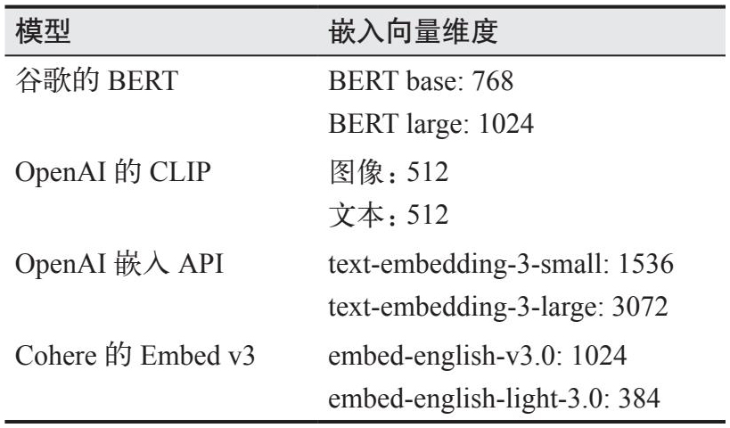

> **圖片描述：表格，列出常見嵌入模型及其嵌入向量維度。包括：Google BERT（base: 768, large: 1024）、OpenAI CLIP（圖像: 512, 文本: 512）、OpenAI 嵌入 API（text-embedding-3-small: 1536, text-embedding-3-large: 3072）、Cohere Embed v3（embed-english-v3.0: 1024, embed-english-light-3.0: 384）。**

由於許多機器學習模型通常需要先將輸入資料轉換為向量表示，因此包括GPT系列和Llama系列在內的許多模型也包含生成嵌入向量的步驟。2.2.1節展示了Transformer模型中的嵌入層。如果你能訪問這些模型的中間層，也可以用它們來提取嵌入向量。不過，這些嵌入向量的質量可能不如專用嵌入模型生成的質量高。

嵌入演算法的目標是生成能夠捕捉原始資料本質的嵌入向量。我們該如何驗證這一點呢？畢竟嵌入向量[0.11, 0.02, 0.54]看起來與原始文字“the cat sits on a mat”毫無相似之處。

總體而言，如果含義更相似的文字擁有距離更近的嵌入向量（以餘弦相似度或相關指標衡量），那麼該嵌入演算法就被認為是優質的。例如，相較於“AI research is super fun”（AI研究非常有趣）的嵌入向量，“the cat sits on a mat”的嵌入向量應該在距離上更接近“the dog plays on the grass”（狗在草地上玩）的嵌入向量。

你也可以根據嵌入在具體任務中的實用性來評估其質量。嵌入被廣泛應用於分類、主題建模、推薦系統和RAG等任務。一個用於衡量嵌入在多項任務上的質量的通用基準是MTEB（Massive Text Embedding Benchmark，大規模文字嵌入基準測試，Muennighoff等，“MTEB: Massive Text Embedding Benchmark”，2023）。

這裡雖以文字為例，但任何資料都可以擁有嵌入向量表示。例如，電商解決方案Criteo（Vasile等，“Meta-Prod2Vec - Product Embeddings Using Side-Information for Recommendation”，2016）和Coveo（參見Coveo官方文件“Product embeddings and vectors”）均會為產品生成嵌入向量。Pinterest則為影像、圖結構、查詢甚至使用者生成嵌入向量（Zhai等，“Representation Learning for Recommender Systems”，2021）。

- unified representation of language, images, and point clouds，統一語言、影像和點雲表示。

一個新的前沿領域是為不同模態的資料建立聯合嵌入。CLIP是最早能夠將文字和影像等不同模態資料對映到聯合嵌入空間的重要模型之一（Radford等，“Learning Transferable Visual Models From Natural Language Supervision”，2021）。ULIP（Xue等，“ULIP: Learning a Unified Representation of Language, Images, and Point Clouds for 3D Understanding”，2022）旨在建立文字、影像和3D點雲的統一表示。ImageBind（Girdhar等，“ImageBind: One Embedding Space To Bind Them All”，2023）則學習跨文字、影像和音訊等6種不同模態的聯合嵌入表示。

圖3-6展示了CLIP的架構。CLIP使用（影像，文字）對進行訓練。與影像對應的文字可以是該影像的說明或相關評論。對於每個（影像，文字）對，CLIP使用文字編碼器將文字轉換為文字嵌入，使用影像編碼器將影像轉換為影像嵌入，然後將這兩個嵌入向量投影到一個聯合嵌入空間中。訓練目標是使影像的嵌入向量與對應文字的嵌入向量在聯合空間中儘可能接近。

	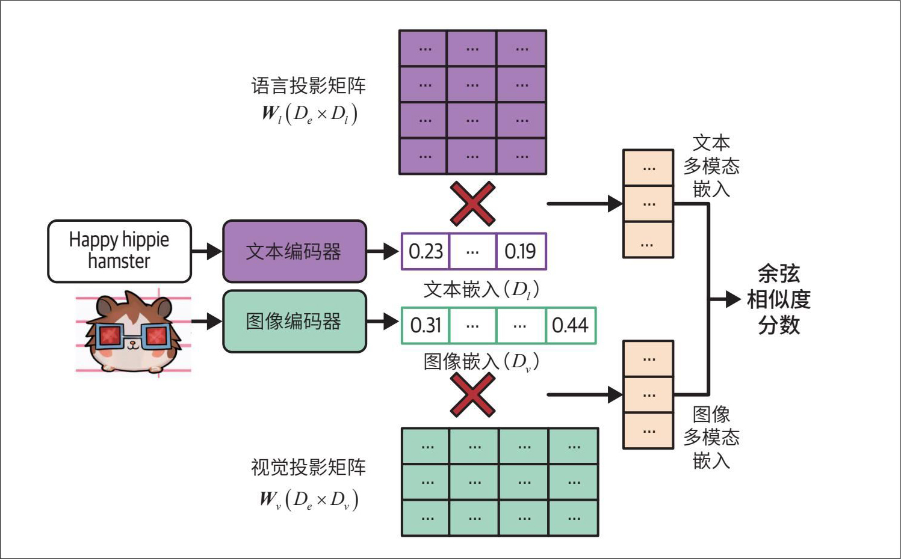

> **圖片描述：架構流程圖，展示多模態嵌入模型的運作方式。左側輸入為文字「Happy hippie hamster」和一張倉鼠圖片，分別透過文字編碼器和圖像編碼器生成文字嵌入（D_t 維）和圖像嵌入（D_i 維）。接著透過語言投影矩陣和視覺投影矩陣將嵌入投影到共享的多模態空間，最終計算餘弦相似度分數。**

圖3-6：CLIP的架構（Radford等，2021）

能夠表示不同模態資料的聯合嵌入空間稱為**多模態嵌入空間。**在文字-影像聯合嵌入空間中，一張“釣魚男子”的圖片的嵌入向量應當更接近文字“一名漁夫”的嵌入向量，而不是文字“時裝秀”的嵌入向量。這種聯合嵌入空間允許我們比較和組合不同模態的嵌入向量。例如，這種方法可以實作基於文字的影像搜尋：給定一段文字，找到與該文字最接近的影像。

## 3.4 AI當裁判
- 注意不要將術語“AI裁判”與AI在法庭中擔任法官（judge）的應用場景混淆。

鑑於評估開放式響應面臨的挑戰，許多團隊不得不依賴人工評估。既然AI已經成功實作了許多困難任務的自動化，那麼能否也將評估任務自動化呢？使用AI來評估AI的方法稱為“AI當裁判”（AI as a Judge）或“LLM當裁判”。這類用於評估其他AI模型的AI模型稱為AI裁判（AI judge）。

- 2017年，我在NeurIPS的MEWR研討會上提出了一種利用更強大的語言模型自動評估機器翻譯的方法。遺憾的是，由於生活中的其他事務，我未能繼續這一研究方向。

儘管利用AI自動化評估的想法由來已久，但直到2020年GPT-3釋出後，AI模型才真正具備了這種能力。截至本書撰寫時，AI當裁判已經成為生產環境中評估AI模型的常用方法之一，甚至可能是最常用的方法。在2023年和2024年，我見到的大多數AI評估初創公司的演示中都以某種形式使用了AI當裁判的模式。“LangChain State of AI 2023”報告指出，其平臺上58%的評估是由AI裁判完成的。同時，AI當裁判也是一個活躍的研究領域。

### 3.4.1 為什麼用AI當裁判
與人類評估員相比，AI裁判速度更快、更易用且成本相對較低。此外，它們無須參考資料即可工作，這意味著它們適用於缺乏參考資料的生產環境。

你可以要求AI模型根據任何標準來評判輸出內容：正確性、重複性、毒性、健康性、幻覺，等等。這類似於你可以要求一個人對任何事情發表意見。你可能會想：“人的意見並不總是可信的。”確實如此，同樣，AI的判斷也並非總是可信的。然而，由於每個AI模型都是對海量資料的聚合，因此AI模型有可能做出反映普遍觀點的判斷。透過為合適的模型設計恰當的提示詞，你可以在廣泛的主題上獲得相當不錯的評判結果。

研究表明，某些AI裁判與人類評估員的相關性很高。2023年，Zheng等發現，在他們的評估基準MT-Bench上，GPT-4與人類評估員的一致性達到85%，甚至高於人類評估員之間81%的一致性（“Judging LLM-as-a-Judge with MT-Bench and Chatbot Arena”）。AlpacaEval的作者Dubois等也發現，他們的AI裁判與由人工評估的LMSYS Chat Arena排行榜的相關性近乎完美（達到0.98，“Length-Controlled AlpacaEval: A Simple Way to Debias Automatic Evaluators”，2024）。

AI不僅可以評估響應，還可以解釋自己的判斷，這在需要審查評估結果時尤其有用。圖3-7展示了GPT-4解釋其判斷的一個範例。

AI作為評判工具的靈活性使其適用於廣泛的應用場景，對於某些應用來說，它甚至是唯一的自動評估選項。即使AI的判斷不如人類的判斷準確，它們仍可能足以指導應用的開發，併為你啟動專案提供足夠的信心。

	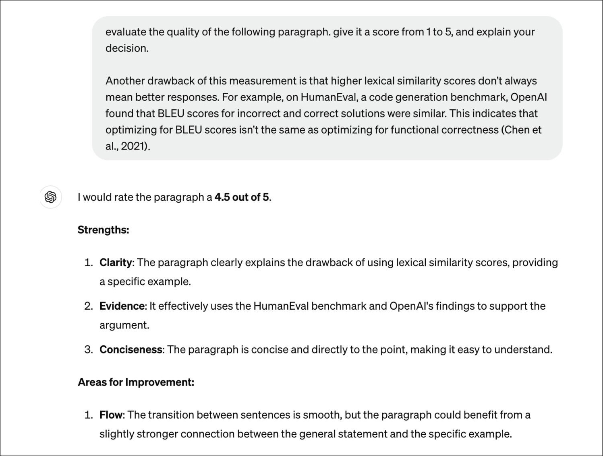

> **圖片描述：截圖，展示使用 AI 裁判評估文字段落品質的範例。上方方框中為提示詞（「evaluate the quality of the following paragraph, give it a score from 1 to 5, and explain your decision」）。AI 裁判給出 4.5 分（滿分 5 分），並從清晰度、論據支援、簡潔性三方面列出優點，同時提出改進建議（段落之間的銜接可以更流暢）。**

圖3-7：AI裁判不僅可以給出評分，還能解釋其決策

### 3.4.2 如何用AI當裁判
你可以透過多種方式使用AI進行評估。例如，利用AI獨立評估一個響應的質量，將該響應與參考資料進行對比，或將該響應與另一個響應進行比較。以下是這三種方法的簡單範例提示詞。

·根據原始問題獨立評估一個響應的質量。

“Given the following question and answer, evaluate how good the answer is

for the question. Use the score from 1 to 5.

- 1 means very bad.

- 5 means very good.

Question: [QUESTION]

Answer: [ANSWER]

Score:”

·將生成的響應與參考響應進行對比，以評估生成的響應是否與參考響應一致。這可以作為替代人工設計的相似度度量方法的一種方案。

“Given the following question, reference answer, and generated answer,

evaluate whether this generated answer is the same as the reference answer.

Output True or False.

Question: [QUESTION]

Reference answer: [REFERENCE ANSWER]

Generated answer: [GENERATED ANSWER]”

·比較兩個響應，確定哪個更好，或預測使用者更可能偏好哪個。這對於生成用於後訓練對齊的資料（參見第2章）、推理時計算（參見第2章）以及使用比較評估進行模型排名（3.5節將討論）非常有幫助。

“Given the following question and two answers, evaluate which answer is

better. Output A or B.

Question: [QUESTION]

A: [FIRST ANSWER]

B: [SECOND ANSWER]

The better answer is:”

通用AI裁判可以根據任何標準來評估響應。如果你正在構建一個角色扮演聊天機器人，你可能希望評估其回答是否符合設定的角色，例如“這個回答聽起來像甘道夫說的嗎？”如果你正在構建一個生成產品宣傳圖片的應用，你可能會問：“請按從1到5的分數評價這張圖片中產品的可信度。”表3-3展示了一些AI工具提供的常用的內建“AI當裁判”標準。

表3-3：截至2024年9月，一些AI工具提供的內建“AI當裁判”標準範例。注意，隨著工具的發展，這些內建標準可能會發生變化

	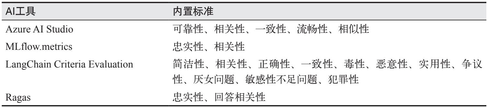

> **圖片描述：表格，列出主流 AI 評估工具及其內建評估標準。Azure AI Studio 支援可靠性、相關性、一致性、流暢性、相似性；MLflow.metrics 支援忠實性、相關性；LangChain Criteria Evaluation 支援簡潔性、相關性、正確性、一致性、毒性、惡意性、實用性、爭議性、厭女問題、敏感性不足問題、犯罪性；Ragas 支援忠實性、回答相關性。**

需要注意的是，AI當裁判尚未標準化。Azure AI Studio的相關性評分可能與MLflow的相關性評分差異很大。這些評分取決於裁判工具所使用的底層模型和提示詞。

向AI裁判提供提示詞與向任何AI應用提供提示詞類似。一般來說，提供給AI裁判的提示詞應清晰地說明以下內容。

·模型要執行的任務，例如評估生成的響應與問題之間的相關性。

·模型評估時應遵循的標準，例如“你主要判斷生成的響應是否包含足夠的資訊，能夠根據標準答案響應給定的問題。”指令越詳細越好。

·評分體系，可以是以下幾種之一。

·分類，例如好/壞，或者相關/不相關/中立。

·離散數值，例如從1到5。離散數值可以看作分類的一種特殊情況，其中每個類別具有數值含義而非語義含義。

·連續數值，例如0和1之間，用於評估相似程度。
	

> **圖片描述：O'Reilly 書籍裝飾圖案——綠色捲尾猴剪影，用於標示範例或補充說明區塊。**

 相比處理數字，語言模型通常更擅長處理文字。據報道，AI裁判在分類任務上的表現優於數值評分體系。

對於數值評分體系，離散評分的效果似乎優於連續評分。經驗表明，離散評分的範圍越大，模型的表現往往越差。典型的離散評分範圍通常是從1到5。

包含範例的提示詞已被證明表現更好。如果你使用1到5分制的評分體系，應包含不同分值的範例響應，並儘可能說明某個響應獲得特定評分的原因。第5章將討論提示詞的最佳實踐。

以下是Azure AI Studio用於**相關性**標準的部分提示詞範例（參見Azure官方文件“Observability in generative AI”）。它解釋了任務、評估標準、評分體系、一個低分輸入範例以及該輸入獲得低分的理由。為簡潔起見，提示詞的一部分已被省略。

Your task is to score the relevance between a generated answer and the question based on the ground truth answer in the range between 1 and 5, and please also provide the scoring reason.

Your primary focus should be on determining whether the generated answer contains sufficient information to address the given question according to the ground truth answer. …

If the generated answer contradicts the ground truth answer, it will receive a low score of 1-2.

For example, for the question "Is the sky blue?" the ground truth answer is "Yes, the sky is blue." and the generated answer is "No, the sky is not blue."

In this example, the generated answer contradicts the ground truth answer by stating that the sky is not blue, when in fact it is blue.

This inconsistency would result in a low score of 1-2, and the reason for the low score would reflect the contradiction between the generated answer and the ground truth answer.

圖3-8展示了一個AI裁判範例，用於評估給定問題的答案的質量。

	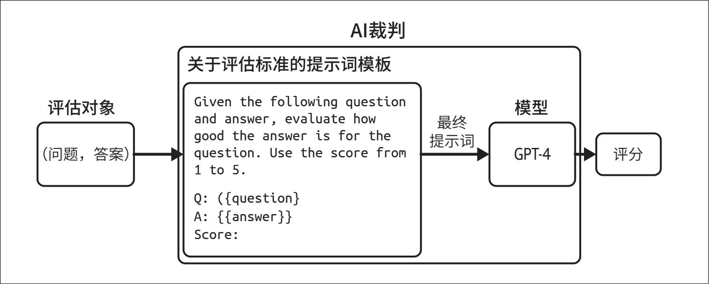

> **圖片描述：流程圖，說明 AI 裁判的工作原理。左側為評估對象（問題與答案），中間為關於評估標準的提示詞模板（包含評分指令和問答佔位符），組合後生成最終提示詞，送入模型（如 GPT-4）進行評分，最終輸出分數。**

圖3-8：一個AI裁判範例，用於評估給定問題的答案的質量

AI裁判不僅僅是一個模型，更是一個包含模型和提示詞的系統。改變模型、提示詞或模型的取樣引數都會產生不同的結果。

### 3.4.3 AI當裁判的局限性
儘管AI當裁判有很多優勢，但許多團隊對其應用持謹慎態度。用AI來評估AI似乎是在進行“自我驗證”。AI本身的機率特性使其看起來不夠可靠，難以作為評估工具。此外，AI裁判可能會給應用帶來不小的成本和延遲。鑑於這些限制，一些團隊將AI當裁判視為一種備用方案，只有在沒有其他方法評估系統時，尤其是在生產環境中，才會考慮使用。

**1. 不一致性**

要使一種評估方法值得信賴，其結果必須保持一致。然而，AI裁判和所有AI應用一樣，都具有機率性。同一個AI裁判，針對同樣的輸入，在使用不同提示詞時可能給出不同的評分。即使是同一個AI裁判，在相同的提示詞下重複執行，也可能給出不同的評分。這種不一致性使得評估結果難以復現，也難以讓人信服。

雖然可以提高AI裁判的一致性（第2章討論瞭如何透過取樣引數實作這一點），但Zheng等指出，在提示詞中加入評估範例可以將GPT-4的一致性從65%提高到77.5%（“Judging LLM-as-a-Judge with MT-Bench and Chatbot Arena”，2023）。然而，他們也承認，高一致性並不意味著高準確性——AI裁判可能會持續犯同樣的錯誤。此外，加入更多範例會使提示詞變長，而更長的提示詞意味著更高的推理成本。在Zheng等的實驗中，增加提示詞中的範例數量導致GPT-4的成本增加至4倍。

**2. 標準的模糊性**

與許多人類設計的評估指標不同，AI當裁判的評估指標並未標準化，這導致它們容易被誤解和誤用。截至本書撰寫時，開源工具MLflow、Ragas和LlamaIndex都內建了**忠實性**（faithfulness）這一標準，用於衡量生成的輸出對給定上下文的忠實程度，但它們的定義和評分體系各不相同。如表3-4所示，MLflow使用1到5分制的評分體系，Ragas使用0或1，而LlamaIndex的提示詞則要求AI裁判輸出YES或NO。

表3-4：不同工具對同一評估標準的預設提示詞差異很大

	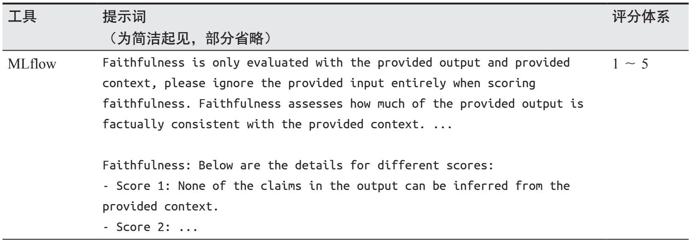

> **圖片描述：表格，展示 MLflow 工具用於忠實性評估的提示詞和評分體系。提示詞要求僅根據提供的輸出和上下文評估忠實性，評分範圍為 1 到 5 分。其中 Score 1 表示輸出中沒有任何陳述可以從上下文推導出來。**

（續）

	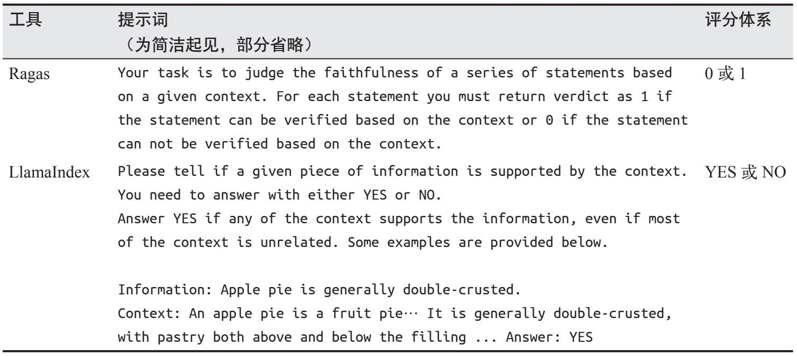

> **圖片描述：表格，展示 Ragas 和 LlamaIndex 工具用於忠實性評估的提示詞和評分體系。Ragas 使用 0 或 1 的二元評分（根據上下文逐一驗證陳述）；LlamaIndex 使用 YES 或 NO 判斷（只要上下文中任何部分支援該資訊即回答 YES），並附有範例說明。**

這三個工具輸出的忠實性評分無法直接比較。如果給定一個（上下文，答案）組合，MLflow給出的忠實性評分為3，Ragas輸出1，而LlamaIndex輸出NO，你會採信哪個評分呢？

應用會隨著時間不斷演變，但在理想情況下，評估應用的方法應該保持固定。這樣，評估指標才能用於監控應用的變化。然而，AI裁判本身也是一種AI應用，這意味著它們也可能隨時間發生變化。

假設上個月你的應用一致性得分是90%，而本月得分變成了92%。這是否意味著你的應用一致性提高了呢？除非你能確保兩次使用的AI裁判完全一致，否則很難回答這個問題。如果本月AI裁判使用的提示詞與上個月不同呢？也許你更換了一段效果稍好的提示詞，或者同事修正了上個月提示詞中的一個拼寫錯誤，導致本月的評判變得更寬鬆。

如果應用和AI裁判由不同的團隊管理，這種情況可能會變得尤其令人困惑。負責AI裁判的團隊可能在未通知應用團隊的情況下更改了評判邏輯。因此，應用團隊可能會錯誤地將評估結果的變化歸因於應用本身的變化，而非評判方式的變化。
	

> **圖片描述：O'Reilly 書籍裝飾圖案——綠色捲尾猴剪影，用於標示範例或補充說明區塊。**

 如果你無法獲知AI裁判所使用的模型和提示詞，就不要輕易相信任何AI裁判。

評估方法的標準化需要時間。隨著該領域的發展以及更多保障措施的引入，我希望未來的AI裁判能夠變得更加標準化、更加可靠。

**3. 成本和延遲的增加**

你可以在實驗階段和生產階段使用AI裁判來評估應用。許多團隊在生產環境中使用AI裁判作為防護手段，以降低風險，只向使用者展示AI裁判認定合格的響應。

- 在某些情況下，評估成本甚至可能佔據預算的大部分，超過生成響應的成本。

使用強大的模型來評估響應，成本可能很高。如果你使用GPT-4來生成並評估響應，那麼呼叫GPT-4的次數將翻倍，API成本也大約翻倍。如果你想要評估3個標準，涉及3段評估提示詞——比如整體響應質量、事實一致性和毒性——那麼你的API呼叫次數將增加至4倍。

- 抽查與抽樣含義相同。

你可以使用能力較弱的模型作為AI裁判以降低成本（參見3.4.4節），也可以透過抽查（spot-checking）來降低成本，即只評估部分響應。抽查意味著你可能會遺漏某些失敗案例。評估的樣本比例越大，對評估結果的置信度就越高，但成本也隨之增加。要在成本和置信度之間找到平衡，需要反覆試驗。第4章將進一步討論這一過程。總的來說，AI裁判的成本遠低於人工評估。

在生產流程中使用AI裁判可能會增加延遲。如果你在向使用者返回響應之前進行評估，就會面臨權衡：風險降低了，但延遲增加了。對於延遲要求嚴格的應用來說，這種額外的延遲可能導致該方案不可行。

**4. AI裁判的偏差**

人類評估員存在偏差，AI裁判同樣存在偏差。不同的AI裁判具有不同的偏差。本節將介紹一些常見的偏差。瞭解你的AI裁判所具有的偏差，有助於你正確解讀它們的評分，甚至減輕這些偏差的影響。

AI裁判通常存在**自我偏差**（self-bias），即模型偏愛自己生成的響應，勝過其他模型生成的響應。模型計算最可能響應的機制，也會導致其給自身生成的響應打出較高的分數。在Zheng等2023年的實驗中，GPT-4對自身響應的偏愛程度高出10%，而Claude 1對自身響應的偏愛程度則高出25%（“Judging LLM-as-a-Judge with MT-Bench and Chatbot Arena”）。

許多AI模型存在首位偏差。AI裁判在對專案進行成對比較或處理選項列表時，可能更偏愛排在前面的響應。這種偏差可以透過多次重複相同測試並改變選項順序，或透過精心設計提示詞來緩解。AI的這種位置偏差與人類相反，人類偏愛最後看到的響應（Lambert，“Evaluating and uncovering open LLMs”，2023），這種現象被稱為**近因偏差**（recency bias）。

- Saito等（2023）發現，人類也偏愛較長的響應，但程度要輕得多。

一些AI裁判存在**冗長偏差**（verbosity bias），即偏愛更長的響應，而不論其質量如何。Wu和Aji發現，GPT-4和Claude 1都更偏愛存在事實錯誤但篇幅較長的響應（約100個單詞），而非較短但正確的響應（約50個單詞，“Style Over Substance: Evaluation Biases for Large Language Models”，2023）。Saito等研究了創造性任務中的這一偏差，發現當兩個響應長度差異足夠大時（例如一個響應的長度是另一個的2倍），AI裁判幾乎總是偏愛較長的響應（“Verbosity Bias in Preference Labeling by Large Language Models”，2023）。然而，Zheng等（2023）和Saito等（2023）都發現，GPT-4比GPT-3.5更不容易受到這種偏差的影響，這表明隨著模型能力的增強，這種偏差可能會逐漸消失。

除了上述偏差，AI裁判還具有所有AI應用共有的侷限性，包括隱私和智慧財產權問題。如果使用專有模型作為裁判，就需要將資料傳送給該模型。如果模型提供商未披露其訓練資料，你就無法判斷該裁判在商業上的安全性。

儘管使用AI當裁判存在上述侷限，但其眾多優勢讓我相信這種方法的應用範圍將繼續擴大。然而，AI裁判的使用應輔以精確的評估方法及人工評估。

### 3.4.4 哪些模型可以作為裁判
對於充當裁判的模型，其能力既可以強於或弱於被評判的模型，也可以與之相當。每種情況各有利弊。

乍一看，使用更強大的模型作為裁判似乎更合理。畢竟，閱卷人難道不應該比考生掌握更多知識嗎？更強大的模型不僅能做出更精準的評判，還能幫助較弱的模型生成更好的響應。

你可能會疑惑：既然能使用更強大的模型，為什麼還要用較弱的模型生成響應呢？答案在於成本和延遲。你可能沒有足夠的預算使用更強的模型生成所有響應，因此通常只用它評估一小部分結果。例如，使用廉價的內部模型生成響應，而僅使用GPT-4評估其中的1%。

更強大的模型對某些應用來說可能速度太慢。你可以使用快模型生成響應，同時在後臺使用更強但較慢的模型進行評估。如果強模型判定弱模型的響應不佳，可以採取補救措施，例如用強模型的響應進行替換。注意，相反的模式也很常見：使用強模型生成響應，同時在後臺執行弱模型進行評估。

以更強大的模型為裁判會帶來兩個挑戰。首先，最強的模型將沒有合適的裁判來評判。其次，我們需要一種替代的評估方法來確定究竟哪個模型最強。

- 這種技術有時被稱為自我批評或自我提問。

使用模型評判自身，即**自我評估**或**自我批評**，聽起來像在作弊，尤其是考慮到自我偏差的存在。然而，自我評估對於“健全性檢查”非常有效。如果一個模型認為自己的響應是錯誤的，那麼這個模型很可能並不可靠。除了健全性檢查，讓模型對自身進行評估還可以促使模型改進其響應（Press等，“Measuring and Narrowing the Compositionality Gap in Language Models”，2022；Gou等，“CRITIC: Large Language Models Can Self-Correct with Tool-Interactive Critiquing”，2023；Valmeekam等，“Can Large Language Models Really Improve by Self-critiquing Their Own Plans?”，2023）。下面這個例子展示了自我評估可能的形式。

提示詞 [使用者]：What's 10+3?

初始響應 [AI]：30

自我批評 [AI]：Is this answer correct?

最終響應 [AI]：No it's not. The correct answer is 13.

一個尚未解決的問題是，AI裁判是否可以比被評判的模型更弱。一些人認為，評判任務比生成任務更容易，就像任何人都可以對一首歌是否好聽發表意見，但並非每個人都能寫歌。因此，較弱的模型理論上應該也能評判更強模型的輸出。

Zheng等（2023）發現，更強的模型與人類偏好的相關性更高，這使得人們傾向於選擇預算範圍內最強的模型。然而，這個實驗僅限於通用裁判模型。我感興趣的一個研究方向是小型專用裁判模型。這類模型經過訓練，能夠依據特定的標準和評分體系進行特定的評判。對於特定任務，小型專用裁判模型可能比更大的通用裁判模型更可靠。

由於AI裁判的用途多種多樣，因此也衍生出了許多專用AI裁判。下面我將介紹三類專用AI裁判：獎勵模型、基於參考的裁判模型和偏好模型。

**獎勵模型**

獎勵模型接收一個（提示詞，響應）對，並對響應在給定提示詞下的質量進行評分。多年來，獎勵模型已成功應用於RLHF。Cappy就是谷歌開發的一個獎勵模型（Tan等，“Cappy: Outperforming and Boosting Large Multi-Task LMs with a Small Scorer”，2023）。給定一個（提示詞，響應）對，Cappy會輸出一個介於0和1之間的分數，表示響應的正確程度。Cappy是一個輕量級評分模型，僅有3.6億個引數，比通用基礎模型小得多。

**基於參考的裁判模型**

- BLEURT的分數範圍容易引起混淆，大致在-2.5和1.0之間。這凸顯了AI評判標準模糊性的挑戰：評分範圍可能是任意的。

基於參考的裁判模型根據一個或多個參考響應來評估生成的響應。這種裁判模型可以輸出一個相似度分數或質量分數（描述生成的響應與參考響應相比質量如何）。例如，BLEURT（Sellam等，“BLEURT: Learning Robust Metrics for Text Generation”，2020）接收一個（候選響應，參考響應）對，並輸出兩者之間的相似度分數。Prometheus（Kim等，“Prometheus: Inducing Fine-grained Evaluation Capability in Language Models”，2023）接收（提示詞，生成的響應，參考響應，評分標準），假設參考響應的分數為5，則輸出一個介於1和5之間的質量分數。

**偏好模型**

偏好模型以（提示詞，響應1，響應2）作為輸入，輸出兩個響應中哪一個更好（更受使用者青睞）。這是專用裁判模型中較為令人興奮的發展方向之一。能夠預測人類偏好將開啟許多可能性。如第2章所述，偏好資料對於將AI模型與人類偏好對齊至關重要，但獲取這些資料既困難又昂貴。擁有一個良好的人類偏好預測器通常能使評估變得更容易，也能提升模型使用的安全性。目前已有許多構建偏好模型的嘗試，包括PandaLM（Wang等，“PandaLM: An Automatic Evaluation Benchmark for LLM Instruction TuningOptimization”，2023）和JudgeLM（Zhu等，“JudgeLM: Fine-tuned Large Language Models are Scalable Judges”，2023）。圖3-9展示了PandaLM的輸出範例。它不僅輸出哪個響應更好，還會解釋其判斷依據。

	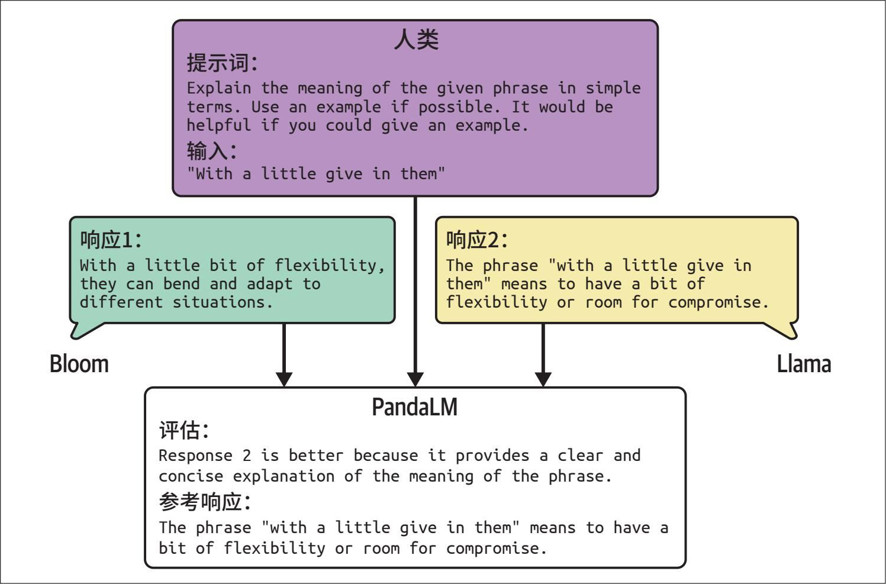

> **圖片描述：流程圖，展示 PandaLM 比較評估的工作方式。人類提供提示詞（「Explain the meaning of the given phrase in simple terms」），輸入短語「with a little give in them」，分別由 Bloom 和 Llama 兩個模型生成回應。PandaLM 評估後判定 Response 2（Llama）更好，因為它提供了更清晰簡潔的解釋，並附上參考回應進行比對。**

圖3-9：給定一段人類提示詞和兩個響應，PandaLM的輸出範例。圖片來自Wang等（2023），為提高可讀性略作修改。原始圖片遵循Apache License 2.0

儘管存在一些侷限，AI當裁判的方法仍然非常靈活且強大。使用成本更低的模型作為裁判，使得這種方法更加實用。我身邊許多最初持懷疑態度的同事，現在也開始在生產環境中越來越多地依賴這種方法。

讓AI充當裁判令人興奮，而我們接下來要討論的方法同樣引人入勝。它的靈感來自遊戲設計，這是一個非常迷人的領域。

## 3.5 使用比較評估對模型進行排名
通常，你評估模型並不是因為關心它們的具體分數，而是想知道哪個模型最適合你。你真正想要的是模型的排名。你可以使用單點評估（pointwise evaluation）或比較評估（comparative evaluation）來對模型進行排名。

- 例如使用利克特量表（Likert scale）。

單點評估分別獨立評估每個模型，然後根據它們的分數進行排名。例如，你想知道哪位選手最好，可以單獨評估每位選手並打分，然後選擇分數最高的選手。

而比較評估將模型相互比較，並根據比較結果計算排名。在同一場舞蹈比賽中，你可以讓所有選手同時跳舞，請評委指出他們最喜歡哪位選手，最後選擇多數評委偏好的選手。

響應的質量具有主觀性，因此對其進行比較評估通常比單點評估更容易。例如，比較兩首歌曲哪一首更好，比給每首歌曲單獨打出具體分數更容易。

在AI領域，比較評估首次由Anthropic在2021年用於對不同模型進行排名（Askell等，“A General Language Assistant as a Laboratory for Alignment”，2021）。這種方法也支援了廣受歡迎的LMSYS Chatbot Arena排行榜，該排行榜透過社群的模型兩兩比較分數來對模型進行排名。

許多模型提供商在生產環境中使用比較評估來評估他們的模型。圖3-10展示了ChatGPT要求使用者比較兩個並排輸出的範例。這些輸出可能來自不同的模型，也可能來自同一模型但使用了不同的取樣引數。

	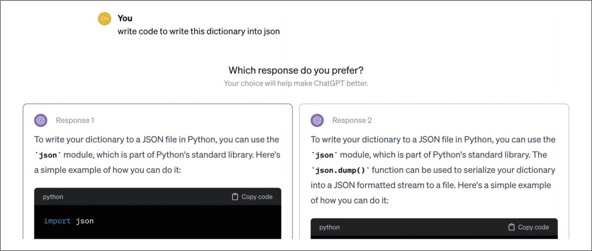

> **圖片描述：截圖，展示 Chatbot Arena 的比較評估介面。使用者輸入提示「write code to write this dictionary into json」，畫面並排顯示兩個匿名模型的回應（Response 1 和 Response 2），使用者需選擇偏好的回應。兩個回應都建議使用 Python 的 json 模組，但解釋方式略有不同。**

圖3-10：ChatGPT偶爾會要求使用者比較兩個並排輸出的範例

每次請求時，系統會選擇兩個或更多模型進行響應。評估員（可以是人類或AI）會選出表現更好的模型。許多開發者允許出現平局，以避免在兩個響應表現同樣好或同樣差時隨機選出一個勝者。

需要特別注意的是，**並非所有問題都適合根據偏好來回答**，很多問題應當依據正確性來回答。比如，你問模型：“手機輻射和腦腫瘤之間是否存在關聯？”模型給出“是”和“否”兩個選項讓你選擇。基於偏好的投票可能會產生誤導性訊號，如果用這些訊號來訓練模型，可能導致模型行為偏離預期。

要求使用者進行選擇也可能引發不滿。比如，你因為不知道答案而向模型提出數學問題，模型卻給出兩個答案並讓你選擇更喜歡的一個。如果你本來就知道正確答案，也就不會去問模型了。

在收集使用者的比較回饋時，一個挑戰是確定哪些問題適合透過偏好投票來決定。基於偏好的投票只有在投票者對相關主題有足夠了解時才有效。這種方法通常適用於AI充當實習生或助手的場景，即AI幫助使用者更快地完成他們本身就知道如何完成的任務；而不適用於使用者要求AI完成他們自己也不懂的任務的場景。

需要注意的是，比較評估不應與A/B測試混淆。在A/B測試中，使用者每次只看到一個候選模型的輸出；而在比較評估中，使用者同時看到多個模型的輸出。

每次比較稱為一場**對局**（match）。這一過程會產生一系列比較結果，如表3-5所示。

表3-5：模型兩兩比較歷史記錄範例

	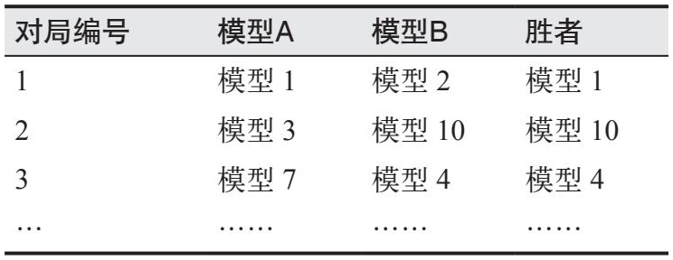

> **圖片描述：表格，展示模型兩兩比較的歷史記錄範例。欄位包括對局編號、模型 A、模型 B 和勝者。範例顯示：對局 1 中模型 1 勝模型 2，對局 2 中模型 10 勝模型 3，對局 3 中模型 4 勝模型 7，以此類推。**

模型A比模型B更受偏好的機率稱為A對B的**勝率**（win rate）。我們可以透過檢視A與B之間所有對局的結果，計算A獲勝的百分比，從而得到這個勝率。

如果只有兩個模型，排名很簡單，獲勝次數更多的模型排名更高。但當模型數量增加時，排名就變得更具挑戰性。假設我們有5個模型，它們之間的兩兩勝率如表3-6所示。從這些資料中並不能明顯看出這5個模型應該如何排名。

表3-6：5個模型的勝率範例（“A≫B”列表示模型A對模型B的勝率）

	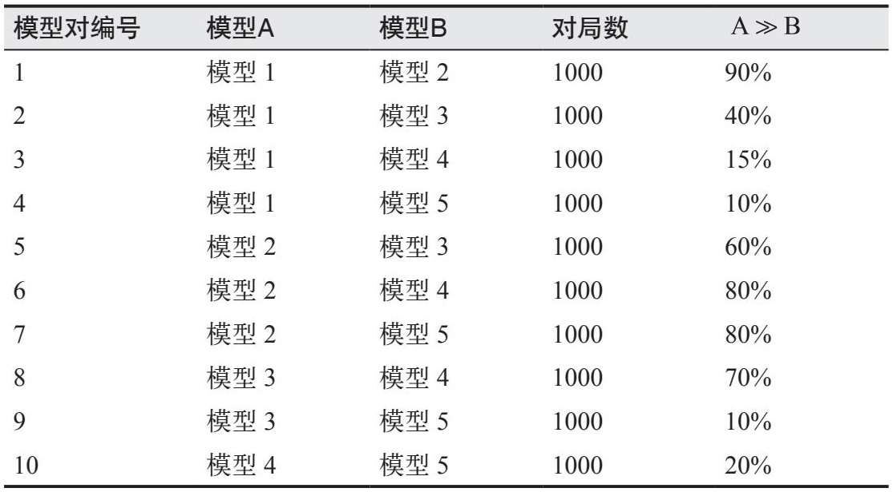

> **圖片描述：表格，展示 5 個模型兩兩之間的完整勝率資料。欄位包括模型對編號（1-10）、模型 A、模型 B、對局數（均為 1000 場）和 A 勝過 B 的比率。例如模型 1 對模型 2 的勝率為 90%，模型 2 對模型 3 為 60%，模型 2 對模型 4 為 80% 等，用於計算排名和 Elo 評分。**

在獲得比較訊號後，比較評估會使用一種**評分算法**（rating algorithm）來計算模型的排名。通常，這種演算法首先根據比較訊號為每個模型計算一個分數，然後再根據分數對模型進行排名。

- 儘管Chatbot Arena已不再使用Elo演算法，但其開發者在一段時間內仍將模型分數稱為“Elo分數”。他們對Bradley-Terry演算法得到的分數進行了縮放處理，使其看起來像Elo分數。這種縮放方法相當複雜：首先將每個分數乘以400（Elo演算法中使用的比例），再加上1000（Elo演算法的初始分數），然後進行重新縮放，使得Llama-13B模型的分數為800。

比較評估在AI領域尚屬新興，但在其他行業已有近百年的歷史，尤其在體育和電子遊戲領域非常流行。許多為這些領域開發的評分演算法可以經過改進用於評估AI模型，比如Elo演算法、Bradley-Terry演算法和TrueSkill演算法。LMSYS Chatbot Arena最初使用Elo演算法計算模型排名，但後來改用Bradley-Terry演算法，因為他們發現Elo演算法對評估員和提示詞的順序較為敏感。

**如果對於任意一對模型，排名較高的模型在對陣排名較低的模型時獲勝可能性更高，那麼這個排名就是正確的。**也就是說，如果模型A的排名高於模型B，那麼使用者在超過半數的情況下應當更偏好模型A而非模型B。

從這個角度來看，模型排名本質上是一個預測問題。我們根據歷史對局結果計算排名，並用它來預測未來的對局結果。不同的排名演算法可能產生不同的排名，而排名並沒有絕對的標準答案。排名的質量取決於它對未來對局結果的預測能力。我對Chatbot Arena排名的分析表明，其生成的排名質量較高，至少對於那些有足夠多對局資料的模型對而言確實如此。具體分析請參見本書的GitHub儲存庫。

### 3.5.1 比較評估面臨的挑戰
在單點評估中，最困難的部分是設計基準測試和指標以收集正確的訊號，而計算模型排名的分數則相對容易。相比之下，在比較評估中，無論是訊號收集還是模型排名都極具挑戰性。本節將介紹比較評估中常見的三個挑戰。

**1. 可擴展性瓶頸**

比較評估需要大量資料。隨著模型數量的增加，需要比較的模型對數量呈二次方增長。2024年1月，LMSYS使用了244,000次比較，評估了57個模型。儘管總次數聽起來很多，但平均每對模型僅有153次比較（57個模型對應1596對模型）。考慮到我們希望基礎模型能夠完成的任務範圍非常廣泛，這個數字其實並不大。

幸運的是，我們並不總是需要直接比較兩個模型來確定哪個更好。排名演算法通常假設具有**傳遞性**（transitivity）。如果模型A排名高於模型B，且模型B排名高於模型C，那麼根據傳遞性，我們可以推斷模型A排名高於模型C。這意味著，如果演算法確定A優於B，且B優於C，那麼無須直接比較A和C，也能知道A優於C。

然而，目前尚不清楚這種傳遞性假設是否完全適用於AI模型。許多分析Elo演算法用於AI評估的論文指出，傳遞性假設存在侷限（Boubdir等，“Elo Uncovered: Robustness and Best Practices in Language Model Evaluation”，2023；Balduzzi等，“Re-evaluating Evaluation”，2018；Munos等，“Nash Learning from Human Feedback”，2023）。這些論文認為人類偏好並不一定具有傳遞性。此外，非傳遞性也可能出現，因為不同的模型對可能由不同的評估員在不同的提示詞下進行評估。

評估新模型也存在挑戰。在獨立評估中，只需對新模型進行評估即可；而在比較評估中，新模型必須與現有模型進行對比，這可能會改變現有模型的排名。

這也使得評估私有模型變得困難。假設你利用內部資料為公司構建了一個模型，並希望將其與公開模型進行比較，以決定是否採用公開模型。如果你想對自己的模型進行比較評估，很可能需要自己收集比較訊號並建立排行榜，或者付費委託公開排行榜為你進行私有評估。

透過更好的匹配演算法，可以緩解可擴充套件性瓶頸。到目前為止，我們假設每次對局中的模型都是隨機選擇的，因此所有模型對出現的次數大致相同。然而，並非所有模型對都需要進行同等次數的比較。一旦我們對某一模型對的比較結果有了足夠的信心，就可以停止讓它們相互匹配。一個高效的匹配演算法應該優先抽取那些能最大限度地降低整體排名不確定性的匹配。

**2. 缺乏標準化和質量控制**

收集比較訊號的一種方式是像LMSYS Chatbot Arena那樣向社群眾包。任何人都可以訪問網站，輸入一段提示詞，獲取兩個匿名模型的響應，並投票選出表現更好的那個。只有在投票完成後，模型的名稱才會被揭曉。

- 隨著Chatbot Arena越來越受歡迎，試圖操縱排名的情況也開始變得常見。雖然沒有人承認試圖操縱排名，但一些模型開發者告訴我，他們確信競爭對手在嘗試這樣做。

這種方法的好處是能夠捕捉到廣泛的訊號，並且相對難以被操縱。然而，其缺點是難以實施標準化和質量控制。

首先，任何能上網的人都可以使用任意提示詞來評估這些模型，而對於什麼才算“更好的響應”並沒有統一的標準。我們很難指望志願者去核實響應的真實性，因此他們可能會在不知情的情況下偏好那些聽起來更好但實際上錯誤的響應。

有些人偏好禮貌且溫和的響應，而有些人更喜歡不加過濾的響應。這既有好處也有壞處。好處是它能捕捉到真實環境中的人類偏好，壞處則是這種偏好可能並不適用於所有應用場景。例如，使用者要求模型講一個不合適的笑話，而模型拒絕了，使用者可能會給它差評。然而，作為應用開發者，你可能更希望模型拒絕此類請求。一些使用者甚至可能惡意選擇有害的響應作為更好的選項，從而汙染排名。

其次，眾包的比較工作要求使用者在他們的實際工作環境之外評估模型。由於缺乏真實世界的背景，這些測試提示詞可能無法反映模型在現實世界中的實際使用方式。人們往往只是使用腦海中最先想到的提示詞，而不太可能使用複雜的提示詞技巧。

在LMSYS Chatbot Arena 2023年釋出的33,000條提示詞（參見Chatbot Arena Conversations資料集）中，有180條是“hello”和“hi”，佔資料的0.55%，而這還沒有計算“hello!”“hello.”“hola”“hey”等變體。此外，還有許多腦筋急轉彎。例如，“X有3個姐妹，每個姐妹都有一個兄弟，那麼X有幾個兄弟？”這個問題被問了44次。

簡單的提示詞容易響應，這導致模型之間的效能差異難以體現。使用過多簡單的提示詞來評估模型可能會汙染排名。

如果一個公開排行榜不支援複雜的上下文構建（例如從內部資料庫檢索相關文件來增強上下文），那麼它的排名就無法反映該模型在你的RAG系統中的實際表現。生成高質量響應的能力與檢索最相關文件的能力截然不同。

實作標準化的一種可能的方式是限制使用者僅使用一組預先確定的提示詞。然而，這可能會影響排行榜捕捉多樣化使用場景的能力。LMSYS則允許使用者使用任意提示詞，但隨後會利用內部模型過濾出難度較高的提示詞，並僅使用這些高難度提示詞對模型進行排名。

另一種方法是僅使用值得信賴的評估員。我們可以訓練評估員根據特定標準比較兩個響應，或者訓練他們使用實用提示詞和複雜的提示詞技巧。這是Scale在其私有比較排行榜（SEAL排行榜）中採用的方法。這種方法的缺點是成本較高，並且可能大幅減少我們能夠獲得的比較數量。

還有一種選擇是將比較評估整合到你的產品中，讓使用者在工作流程中評估模型。例如，在程式碼生成任務中，你可以在使用者的程式碼編輯器中提供兩個程式碼片段，讓使用者選擇更好的一個。許多聊天應用已經在使用這種做法。然而，如前所述，使用者可能並不知道哪個程式碼片段更好，因為他們未必是專家。

此外，使用者可能不會認真閱讀兩個選項，而只是隨機選一個。這可能會給結果引入大量噪聲。不過，少數正確投票的使用者提供的訊號有時足以幫助我們確定哪個模型更好。

**一些團隊更傾向於使用AI而非人類評估員。AI可能不如訓練有素的人類專家，但可能比隨機的互聯網使用者更可靠。**

**3. 從比較性能到絕對性能**

對於許多應用，我們並不一定需要最好的模型，而是需要一個“足夠好”的模型。比較評估能告訴我們哪個模型更好，但並不能告訴我們一個模型究竟有多好，或者是否滿足我們的使用需求。假設我們知道模型B比模型A排名更高，以下任何一種情況都有可能成立。

·模型B很好，但模型A很差。

·模型A和模型B都很差。

·模型A和模型B都很好。

你需要其他形式的評估來確定哪種情況是真實的。

假設我們正在使用模型A進行客戶支援，它可以解決70%的工單。現在考慮模型B，它在與模型A的比較中勝率是51%。目前尚不清楚51%的勝率如何轉化為模型B實際能夠解決的請求數量。一些業內人士告訴我，根據他們的經驗，勝率變化1%在某些應用中可能帶來巨大的效能提升，但在其他應用中可能只帶來微小的提升。

在決定是否用模型B替換模型A時，人類偏好並非唯一因素。我們還需要考慮成本等其他因素。如果不知道預期的效能提升幅度，就很難進行成本效益分析。如果模型B的成本是模型A的2倍，那麼僅憑比較評估並不足以幫助我們判斷模型B帶來的效能提升是否值得投入額外的成本。

### 3.5.2 比較評估的未來
鑑於比較評估存在諸多侷限，你可能會懷疑它的前景。實際上，比較評估有諸多優勢。首先，如2.3節所述，人們發現比較兩個輸出比給每個輸出單獨打分更容易。隨著模型變得越來越強，甚至超過人類表現，人類評估員可能無法再給模型的響應打出具體分數。然而，他們或許仍能察覺到差異，這時比較評估可能會成為唯一的選擇。例如，Llama 2的論文指出，當模型的寫作能力超出最優秀的人類標註員時，人類仍然可以透過比較兩個答案來提供有價值的回饋（Touvron等，“Llama 2: Open Foundation and Fine-Tuned Chat Models”，2023）。

其次，比較評估旨在捕捉我們真正關心的質量——人類偏好。它減輕了不斷建立新基準以追趕AI不斷增長的能力的壓力。一旦模型表現達到完美分數，基準測試便會失效；與之不同，只要不斷推出更新、更強的模型，比較評估就永遠不會飽和。

比較評估相對難以操縱，因為沒有簡單的作弊方法（比如基於參考資料訓練模型）。因此，許多人更信任公開的比較評估排行榜的結果，而非其他公開排行榜。

比較評估可以為我們提供其他方式無法獲得的、具有區分力的模型資訊。在離線評估中，它可以很好地補充基準測試；在線上評估中，它可以與A/B測試相輔相成。

## 3.6 小結
AI模型越強大，發生災難性故障的風險就越高，這使得評估變得尤為重要。同時，評估開放式的強大模型也更具挑戰性。這些挑戰促使許多團隊轉向人工評估。讓人類參與健全性檢查總是有益的，在許多情況下，人工評估甚至是必不可少的。然而，本章主要關注的是各種自動評估方法。

本章首先討論了為什麼基礎模型比傳統ML模型更難評估。儘管許多新的評估技術正在開發中，但在評估方面的投入仍然滯後於模型和應用開發的投入。

由於許多基礎模型包含語言模型元件，我們深入探討了語言建模指標，包括困惑度和交叉熵。在與許多人交流後，我發現他們對這些指標感到困惑，因此我專門加入了一節內容，講解如何解釋這些指標，並在評估和資料處理中有效利用它們。

接下來，本章轉向了評估開放式響應的不同方法，包括功能正確性、相似度評分以及“AI當裁判”。前兩種評估方法是精確的，而AI當裁判的評估則是主觀的。

與精確評估不同，主觀評估指標高度依賴裁判，評分需要結合裁判的背景來解釋。不同AI裁判對同一質量的響應給出的評分可能無法直接比較。與所有AI應用一樣，AI裁判也需要不斷迭代，這意味著它們的判斷會發生變化。這使得將它們作為基準來追蹤應用變化的可靠性較低。儘管AI裁判很有前景，但仍應輔以精確評估、人工評估或兩者結合。

在評估模型時，一種方法是獨立評估每個模型，然後根據分數進行排名。另一種方法是利用比較訊號進行排名：在兩個模型中，哪一個表現更好？比較評估在體育（尤其是國際象棋）領域很常見，目前在AI評估中也逐漸受到關注。比較評估和後訓練對齊過程都需要偏好訊號，而收集這些訊號的成本較高，這推動了偏好模型的發展。偏好模型即專用的AI裁判，用於預測使用者更喜歡哪個響應。

儘管語言建模指標和人工設計的相似性度量方法早已存在，但AI當裁判與比較評估方法的普及，直到基礎模型出現後才逐漸興起。許多團隊正在探索如何將這些方法整合到他們的評估流水線中。下一章將探討如何構建可靠的評估流水線，以評估開放式應用。