# 第6章 RAG與智能體

要完成一項任務，模型既需要知道執行任務的指令，也需要具備完成任務所需的資訊。就像人類在缺乏資訊時更容易給出錯誤答案一樣，AI模型在缺乏上下文時也更容易犯錯或產生幻覺。在特定應用中，指令通常對所有查詢通用，而上下文則需為每個查詢量身定製。上一章討論瞭如何為模型撰寫良好的指令，本章將重點介紹如何為每個查詢構建相關的上下文。

構建上下文的兩種主要模式是RAG和智慧體。RAG模式允許模型從外部資料來源檢索相關資訊，智慧體模式則允許模型使用網路搜尋和新聞API等工具來收集資訊。

RAG模式主要用於構建上下文，而智慧體模式的功能遠不止於此。外部工具可以幫助模型克服自身的不足並擴充套件其能力。更重要的是，這些工具賦予了模型直接與外界互動的能力，從而能夠自動化處理我們生活中的諸多事務。

RAG和智慧體模式之所以令人興奮，是因為它們為本已強大的模型帶來了全新的能力。在短時間內，它們成功地激發了人們的集體想象力，催生了令人驚歎的演示和產品，讓許多人相信它們代表著未來。本章將詳細介紹這兩種模式的工作原理及其前景。

## 6.1 RAG

RAG是一種透過從外部記憶源檢索相關資訊來增強模型生成能力的技術。外部記憶源可以是內部資料庫、使用者的歷史聊天記錄或網際網路。

- 該模型使用的是一種稱為LSTM（long short-term memory，長短期記憶）網路的迴圈神經網路。在2018年Transformer架構興起之前，LSTM一直是自然語言處理領域深度學習的主流架構。

**檢索-生成**（retrieve-then-generate）模式最早由Chen等在2017年的論文“Reading Wikipedia to Answer Open-Domain Questions”中提出。在該論文中，系統首先檢索與問題最相關的5個維基百科頁面，然後模型利用這些頁面中的資訊（讀取其中的內容）來生成答案，如圖6-1所示。

	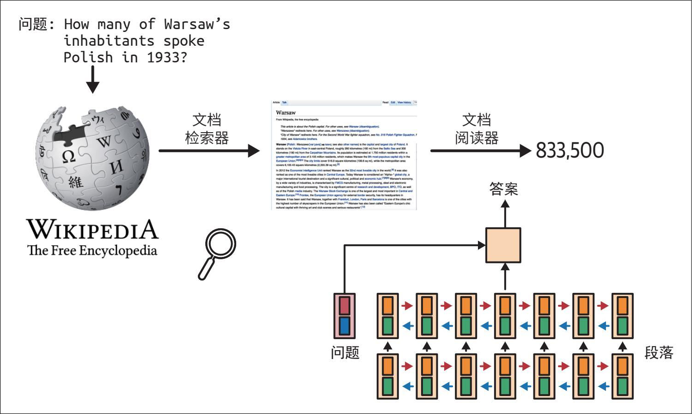

> **圖片描述：** 此圖展示了早期檢索-生成模式的架構。左側為維基百科標誌和文件檢索器，中間為檢索到的維基百科頁面（Warsaw條目），右側為文件閱讀器模型架構圖（多層神經網路），接收問題和段落作為輸入，輸出答案「833,500」。範例問題為「How many of Warsaw's inhabitants spoke Polish in 1933?」。

圖6-1：檢索-生成模式。論文將該模型稱為文件閱讀器

- 大約在同一時間，Facebook的另一篇論文“How Context Affects Language Models’ Factual Predictions”（Petroni等，2020）也表明，將預訓練語言模型與檢索系統結合可以顯著提高模型在事實性問題上的表現。

術語RAG最早出現在論文“Retrieval-Augmented Generation for Knowledge-Intensive NLP Tasks”（Lewis等，2020）中。該論文提出將RAG作為知識密集型任務的解決方案，因為在這些任務中無法將所有可用知識直接輸入模型。在RAG中，只有經檢索器判定與查詢最相關的資訊才會被提取並輸入模型。Lewis等發現，獲取相關資訊可以幫助模型生成更詳細的響應，同時減少幻覺現象。

- 感謝Chetan Tekur提供該範例。

例如，對於查詢“Can Acme's fancy-printer-A300 print 100pps?”（某品牌的fancy-printer-A300印表機的列印速度可以達到每秒100頁嗎？），如果模型獲得了fancy-printer-A300的規格資訊，它就能給出更好的響應。

可以將RAG視為一種為每個查詢構建特定上下文，而不是對所有查詢使用相同上下文的技術。這種技術有助於管理使用者資料，因為它允許你僅在涉及特定使用者的查詢中包含該使用者的資料。

對於基礎模型而言，上下文構建相當於傳統ML模型中的特徵工程。二者目的相同：為模型提供處理輸入所需的資訊。

- 帕金森（Parkinson）定律通常表述為“工作量會擴充套件到佔滿所有可用的完成時間”。我有一個類似的理論，即應用的上下文會擴充套件到佔滿所使用的模型支援的上下文長度限制。

在基礎模型發展的早期階段，RAG成為最常見的模式之一。它的主要目的是突破模型的上下文長度限制。許多人認為，只要模型的上下文長度足夠長，RAG就會被淘汰。我並不認同這一觀點。首先，無論模型的上下文長度多長，總會有應用需要更長的上下文長度。畢竟，可用資料的數量只會隨時間增加。人們不斷生成並新增新資料，卻很少刪除舊資料。上下文長度雖然在快速擴充套件，但仍然無法滿足應用的資料需求。

其次，能夠處理長上下文的模型並不一定能有效地利用這些上下文，這一點在5.1.3節已有討論。上下文越長，模型越有可能關注到上下文中錯誤的部分。每增加一個上下文token都會帶來額外的成本，並可能增加延遲。RAG允許模型僅利用與每個查詢最相關的資訊，減少輸入token數，同時還能提升模型的效能。

當前，擴充套件上下文長度的工作與提高模型利用上下文效率的工作正在並行進行。如果模型提供商未來引入類似檢索或注意力的機制，幫助模型篩選上下文中最關鍵的部分，我也不會感到意外。
	

> **圖片描述：** 此圖為書中的裝飾性插圖，展示一隻藍紫色的烏鴉剪影，用於標示章節中的重要說明或備註。

 Anthropic建議，對於Claude模型，如果“你的知識庫小於200,000個token（大約500頁材料），你可以直接將整個知識庫放入傳送給模型的提示詞中，而無須使用RAG或類似方法”（Anthropic，“Introducing Contextual Retrieval”，2024）。如果其他模型開發者也能為他們的模型提供類似的關於何時使用RAG以及何時依賴長上下文的指導，將會非常有幫助。

### 6.1.1 RAG架構

- 圖中的生成式模型充當生成器。——編者注

一個RAG系統包含兩個元件：一個從外部記憶源檢索資訊的檢索器（retriever），一個基於檢索到的資訊生成響應的生成器（generator）。圖6-2展示了一個RAG系統的架構。

	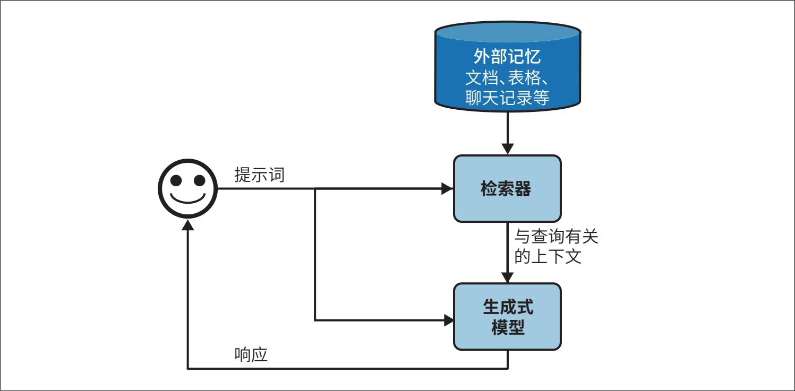

> **圖片描述：** 此圖展示了基本的RAG架構流程圖。頂部藍色圓柱體代表「外部記憶」（文檔、表格、聊天記錄等）。使用者發送提示詞，依次經過：檢索器（從外部記憶檢索相關上下文）→生成式模型（結合提示詞和上下文生成響應）→將響應返回使用者。箭頭清楚標示資料流方向。

圖6-2：一個基本的RAG架構

在最初的RAG論文中，Lewis等將檢索器和生成式模型聯合訓練（“Retrieval-Augmented Generation for Knowledge-Intensive NLP Tasks”，2020）。而在如今的RAG系統中，這兩個元件通常是獨立訓練的。許多團隊使用現成的檢索器和模型來構建他們的RAG系統。不過，對整個RAG系統進行端到端的微調可以顯著提升其效能。

RAG系統的成敗取決於檢索器的質量。檢索器有兩個主要功能：索引和查詢。索引是對資料進行處理，以便之後能夠快速檢索。查詢是指根據輸入的問題檢索出與之相關的資料。如何索引資料取決於你之後希望如何檢索這些資料。

現在我們已經介紹了主要元件，接下來透過一個範例來了解RAG系統的運作方式。為簡單起見，我們假設外部記憶是一個文件資料庫，例如公司的備忘錄、合同和會議記錄等。一個文件可能包含10個token，也可能包含100萬個token，如果直接檢索整個文件，可能會導致上下文長度過度膨脹。為了避免這種情況，可以將每個文件拆分成更易處理的塊（chunk）。具體的拆分策略將在本章後續部分討論。目前，我們假設所有文件都已拆分成可處理的塊。對於每個查詢，我們的目標是檢索與該查詢最相關的資料塊。通常還需要進行一些簡單的後處理，將檢索到的資料塊與使用者的輸入組合起來，生成最終的提示詞，然後將這段最終的提示詞輸入生成式模型。
	

> **圖片描述：** 此圖為書中的裝飾性插圖，展示一隻藍紫色的烏鴉剪影，用於標示章節中的提示或注意事項。

 在本章中，我使用術語“文件”同時指代“文件”和“塊”，因為從技術上講，文件塊本身也是一種文件。我這樣做是為了使本書的術語與經典的自然語言處理和資訊檢索（information retrieval，IR）術語保持一致。

### 6.1.2 檢索算法

- 資訊檢索的概念最早可追溯到20世紀20年代，Emanuel Goldberg在專利中描述了一種用於搜尋儲存在膠片上的文件的“統計機器”。參見“The History of Information Retrieval Research”（Sanderson和Croft，Proceedings of the IEEE，100：Special Centennial Issue，2012）。

檢索並非RAG獨有。資訊檢索已有百年曆史，它是搜尋引擎、推薦系統、日誌分析等應用的核心支撐。許多為傳統檢索系統開發的演演算法也可應用於RAG。鑑於資訊檢索領域研究成果豐富且產業支援廣泛，很難在短短幾頁內詳述。因此，本節僅概述其主要內容。關於資訊檢索更深入的資源，請參閱本書的GitHub倉庫。
	

> **圖片描述：** 此圖為書中的裝飾性插圖，展示一隻藍紫色的烏鴉剪影，用於標示章節中的提示或注意事項。

 檢索通常侷限於單個資料庫或系統，而搜尋則涉及跨多個系統的檢索。在本章中，“檢索”和“搜尋”這兩個術語可互換使用。

檢索的核心思想是根據文件與給定查詢的相關性對文件進行排序。不同檢索演演算法的區別在於相關性分數的計算方式。接下來，我將介紹兩種常見的檢索機制：基於詞項（term-based）的檢索和基於嵌入（embedding-based）的檢索。

**稀疏檢索與稠密檢索**

在相關文獻中，檢索演演算法常被劃分為稀疏檢索（sparse retrieval）與稠密檢索（dense retrieval）。然而，本書選擇採用“基於詞項”與“基於嵌入”的分類方式。

稀疏檢索器使用**稀疏向量**表示資料。稀疏向量是指大部分數值為0的向量。基於詞項的檢索通常被視為稀疏檢索，因為每個詞項都可以用稀疏的**獨熱向量**（one-hot vector）表示，即僅有一位數值為1，其餘數值均為0的向量。向量的長度等於詞表的大小，數值為1的位置對應該詞項在詞表中的索引。

假設我們有一個簡單的詞典{"food": 0, "banana": 1, "slug": 2}，那麼，"food"、"banana"和"slug"的獨熱向量分別為[1, 0, 0]、[0, 1, 0]和[0, 0, 1]。

稠密檢索器使用**稠密向量**表示資料。稠密向量是指大部分數值不為0的向量。基於嵌入的檢索通常被視為稠密檢索，因為嵌入向量通常是稠密的。然而，也存在稀疏的嵌入向量。例如，SPLADE（Sparse Lexical and Expansion，稀疏詞彙與擴充套件）是一種使用稀疏嵌入向量的檢索演演算法（Formal等，“SPLADE: Sparse Lexical and Expansion Model for First Stage Ranking”，2021）。它利用BERT生成嵌入向量，但透過正則化使大部分嵌入值趨於0。這種稀疏性使得嵌入操作更加高效。

如果按照稀疏與稠密的分類方式，SPLADE會被歸類到基於詞項的演演算法中，儘管SPLADE的運作方式、優勢和劣勢更接近稠密嵌入檢索，而非基於詞項的檢索。採用基於詞項與基於嵌入的分類方式可以避免這種歸類偏差。

**1. 基於詞項的檢索**

給定一個查詢，找到相關文件最直接的方法是使用關鍵詞。這種方法通常被稱為**詞匯檢索**（lexical retrieval）。例如，給定查詢“AI engineering”，模型會檢索出所有包含“AI engineering”的文件。然而，這種方法存在以下兩個問題。

·很多文件可能包含給定的詞項，而模型的上下文視窗可能無法容納所有這些文件。一種啟發式方法是選擇包含該詞項次數最多的文件。其假設是，一個詞項在文件中出現的次數越多，這個文件與該詞項的相關性就越高。一個詞項在文件中出現的次數稱為詞頻（term frequency，TF）。

·一段提示詞可能很長，幷包含許多詞項，其中一些詞項比其他詞項更重要。例如，提示詞“Easy-to-follow recipes for Vietnamese food to cook at home”（簡單易學的越南菜家庭烹飪食譜）包含了9個詞項：easy-to-follow、recipes、for、Vietnamese、food、to、cook、at、home。你希望關注更具資訊量的詞項，比如Vietnamese和recipes，而不是for和at。因此，你需要一種方法來識別重要的詞項。

一個直觀的想法是，一個詞項在越多的文件中出現，它所攜帶的資訊量就越少。for和at可能會出現在大多數文件中，所以它們的資訊量較少。因此，一個詞項的重要性與包含該詞項的文件數量成反比。這個指標稱為逆文件頻率（inverse document frequency，IDF）。要計算一個詞項的IDF，首先統計包含該詞項的文件數量，然後用文件總數除以這個數量。如果共有10個文件，其中5個文件包含某個詞項，那麼該詞項的IDF為10/5=2。一個詞項的IDF值越高，它的重要性就越高。

TF-IDF是一種結合了詞頻（TF）和逆文件頻率（IDF）兩個指標的演演算法。從數學上講，文件D*相對於查詢*Q*的TF-IDF分數的計算過程如下。

·設*t*1，*t*2，…，*t**q*為查詢*Q*中的詞項。

·給定一個詞項*t*，該詞項在文件*D*中的TF記為*f*（*t**，**D*）。

·設N*為文件的總數，*C*（*t*）為包含詞項*t*的文件數量。詞項*t*的IDF值可以表示為。

·簡單地說，文件D*相對於查詢*Q*的TF-IDF分數定義為*f*（*t**i*，*D*）。

兩個常見的基於詞項的檢索方案是Elasticsearch和BM25。Elasticsearch（Shay Banon，2010）基於Lucene構建，使用一種稱為倒排索引（inverted index）的資料結構。這是一種將詞項對映到包含該詞項的文件的字典。這種字典結構使得給定一個詞項時，可以快速檢索到相關文件。索引中還可能儲存額外的資訊，例如詞頻和文件計數（即包含該詞項的文件數量），這些資訊有助於計算TF-IDF分數。表6-1展示了一個倒排索引的範例。

表6-1：倒排索引的簡化範例

- 如果想進一步瞭解BM25，推薦閱讀BM25作者撰寫的論文“The Probabilistic Relevance Framework: BM25 and Beyond”（Robertson和Zaragoza，Foundations and Trends in Information Retrieval, Vol.3, No.4. 2009）。

Okapi BM25是Best Matching演演算法的第25代版本，由Robertson等在20世紀80年代開發。它的評分器是對TF-IDF的改進。與TF-IDF相比，BM25透過文件長度對詞頻分數進行了正規化處理。較長的文件更可能包含某個詞項，並具有更高的詞頻值，BM25對此進行了修正。

- Perplexity公司的CEO Aravind Srinivas曾發推文表示：“要在BM25或全文搜尋的基礎上實作真正的改進是很困難的。”

BM25及其變體（如BM25+、BM25F）在工業界仍被廣泛使用，並作為強大的基準，用於與現代更復雜的檢索演演算法（例如下一節將討論的基於嵌入的檢索）進行比較。

我此前略過的一個步驟是分詞（tokenization），即將查詢拆分為單獨的詞項。最簡單的方法是將查詢拆分成單個單詞，將每個單詞視為單獨的詞項。然而，這種方法可能導致多詞詞項被拆分成單個單詞，從而失去原有的含義。例如，“hot dog”會被拆分成“hot”和“dog”，這樣一來，這兩個單詞都無法保留原始詞項的含義。應對這一問題的一種方法是將最常見的n*-gram視為單獨的詞項。例如2-gram “hot dog”很常見，那麼它就會被視為一個單獨的詞項。

此外，通常還需要將所有字元轉換為小寫，去除標點符號，並刪除停止詞（如the、and、is等）。基於詞項的檢索方案通常會自動處理這些操作。經典的自然語言處理工具包，如NLTK、spaCy和斯坦福大學的CoreNLP，也提供了分詞功能。

第4章討論瞭如何根據兩個文字之間的*n*-gram重疊程度來衡量它們的詞彙相似度。我們能否根據文件與查詢之間的*n*-gram重疊程度來檢索文件呢？答案是肯定的。這種方法在查詢和文件的長度相似時效果最好。如果文件遠長於查詢，那麼文件包含查詢中*n*-gram的可能性就會提高，導致許多文件的重疊分數都很高，從而難以區分真正相關的文件與不太相關的文件。

**2. 基於嵌入的檢索**

基於詞項的檢索是在詞彙層面計算相關性，從而忽略了語義。如第3章所述，文字的字面形式並不一定能反映其含義，這可能導致返回的文件與使用者意圖無關。例如，查詢“transformer architecture”（Transformer架構）可能會返回有關電氣裝置（變壓器結構）或電影《變形金剛》（*Tra**nsf**orm**ers*）的文件。基於嵌入的檢索則旨在根據文件與查詢之間的語義相似度對文件進行排序。這種方法也被稱為**語義檢索**（semantic retrieval）。

在基於嵌入的檢索中，索引增加了一個步驟：將原始資料塊轉換為嵌入向量。儲存生成的嵌入向量的資料庫稱為**向量資料庫**（vector database）。查詢過程則包括以下兩個步驟，如圖6-3所示。

1. 嵌入模型：使用與索引階段相同的嵌入模型，將查詢轉換為嵌入向量。

2. 檢索器：根據檢索器確定的標準，獲取與查詢嵌入向量最接近的*k*個資料塊，*k*值取決於具體應用場景、生成式模型和查詢本身。

圖6-3：基於嵌入（語義）的檢索器工作原理示意圖

- RAG檢索流程與傳統推薦系統有許多相似的步驟。

這裡展示的基於嵌入的檢索流程是簡化的。實際的語義檢索系統可能包含其他元件，例如用於對候選項重新排序的重排序器（reranker），以及用於降低延遲的快取（cache）。

在基於嵌入的檢索中，我們再次運用了第3章中討論過的“嵌入”的概念。這裡再提醒一下，嵌入通常生成一個向量，旨在保留原始資料的關鍵特徵。如果嵌入模型質量不高，基於嵌入的檢索器就無法有效工作。

基於嵌入的檢索還引入了一個新元件——向量資料庫，用於儲存向量。然而，儲存是相對容易的部分，真正的難點在於向量搜尋。給定一個查詢嵌入向量，向量資料庫負責在資料庫中找到與該向量相近的向量並返回。為此，向量必須以一種便於快速、高效搜尋的方式進行索引和儲存。

與生成式AI應用所依賴的許多其他機制一樣，向量搜尋並非生成式AI獨有。它廣泛應用於搜尋、推薦、資料組織、資訊檢索、分群、欺詐檢測等任何使用嵌入的場景。

向量搜尋通常被視為近鄰搜尋問題。例如，給定一個查詢，找到與之最近的k*個向量。最樸素的解決方案是*k*近鄰（*k*-nearest neighbors，*k*-NN）演演算法，其工作方式如下。

1. 使用餘弦相似度等指標，計算查詢嵌入向量與資料庫中所有向量之間的相似度分數。

2. 根據相似度分數對所有向量進行排序。

3. 返回相似度分數最高的*k*個向量。

這種樸素的解決方案能夠確保結果精確，但計算量大且速度慢，僅適用於小型資料集。

對於大型資料集，通常使用近似最近鄰（approximate nearest neighbor，ANN）演演算法進行向量搜尋。鑑於向量搜尋的重要性，業界已經開發了許多相關演演算法和庫。流行的向量搜尋庫包括FAISS（Facebook AI Similarity Search，Johnson等，“Billion-scale similarity search with GPUs”，2017）、谷歌的ScaNN（Scalable Nearest Neighbors，Sun等，“Announcing ScaNN: Efficient Vector Similarity Search”，2020）、Spotify的Annoy（Bernhardsson，2013）以及HNSW（Malkov和Yashunin，2016）。

大多數應用開發人員不會自己實作向量搜尋，因此我只是簡要介紹幾種方法，瞭解這些方法對評估解決方案很有幫助。

一般來說，向量資料庫將向量組織成桶（bucket）、樹（tree）或圖（graph）。向量搜尋演演算法的區別主要在於所使用的啟發式方法，這些方法是為了提高找到相近向量的機率。此外，向量也可以經過量化（降低精度）或稀疏化處理，以降低計算複雜度，提高處理效率。如果想進一步瞭解向量搜尋，Zilliz撰寫了一系列非常優秀的文章（“Vector Database 101:Everything You Need to Know”）。以下是一些重要的向量搜尋演演算法。

**LSH（locality-sensitive hashing，局部敏感哈希）**

這是一種功能強大且用途廣泛的演演算法，不僅適用於向量。它透過將相似的向量雜湊到同一個桶中來加快相似度搜尋，以犧牲一定的準確性為代價換取效率的提升。FAISS和Annoy都實作了該演演算法。（關於該演演算法的論文請參考：Indyk和Motwani，Approximate Nearest Neighbors Towards Removing the Curse of Dimensionality，1999。）

**HNSW（Hierarchical Navigable Small World，分層可導航小世界）**

HNSW構建了一個多層圖結構，其中節點表示向量，邊連線相似的向量，透過遍歷圖的邊來實作近鄰搜尋。作者提供了開源實作，FAISS和Milvus也實作了該演演算法。（關於該演演算法請參考其GitHub倉庫：nmslib/hnswlib，Malkov和Yashunin，2016。）

**乘積量化（product quantization）**

該演演算法將每個向量分解為多個子向量，即簡化為低維表示形式，隨後使用這些低維表示計算距離，從而大幅提升處理速度。乘積量化是FAISS的關鍵組成部分，幾乎所有主流的向量搜尋庫都支援該演演算法。（關於該演演算法的論文請參考：Jégou等，“Product Quantization for Nearest Neighbor Search”，2011。）

**IVF（inverted file index，倒排文件索引）**

IVF使用*k*均值分群演演算法將相似的向量組織到同一個簇中。通常會根據資料庫中向量的數量設定簇數，使得每個簇平均包含100到10,000個向量。在查詢時，IVF找到與查詢嵌入向量最接近的若干簇質心，這些簇中的向量組成候選鄰居集。IVF與乘積量化共同構成了FAISS的核心。（關於該演演算法的論文請參考：Sivic和Zisserman，“Video Google: a text retrieval approach to object matching in videos”，2003。）

**Annoy（Approximate Nearest Neighbors Oh Yeah）**

Annoy是一種基於樹的方法。它構建多個二叉樹，每棵樹使用隨機標準將向量分割成不同的簇，比如隨機選取一個超平面，並據此將向量拆分到兩個分支裡。在搜尋過程中，它遍歷這些樹以收集候選鄰居。Spotify已經開源了該演演算法的實作。（關於該演演算法請參考其GitHub倉庫：spotify/annoy，Bernhardsson，2013。）

還有其他向量搜尋演演算法，例如微軟的SPTAG（Space Partition Tree and Graph，空間分割槽樹與圖）和FLANN（Fast Library for Approximate Nearest Neighbors，近似最近鄰快速庫）。

儘管隨著RAG的興起，向量資料庫逐漸成為一個獨立的類別，但實際上任何能夠儲存向量的資料庫都可以稱為向量資料庫。許多傳統資料庫已經或正在擴充套件支援向量儲存和向量搜尋功能。

**3. 檢索算法比較**

由於檢索技術歷史悠久，已有許多成熟的解決方案，因此無論是基於詞項的檢索還是基於嵌入的檢索，都相對容易上手。每種方法各有優劣。

基於詞項的檢索在索引和查詢階段通常比基於嵌入的檢索快得多。詞項提取比生成嵌入向量更快，從詞項對映到包含該詞項的文件，其計算開銷也比近鄰搜尋更小。

基於詞項的檢索“開箱即用”的效果也很好。像Elasticsearch和BM25這樣的方案已經成功支撐了許多搜尋和檢索應用。然而，這種方法的簡單性也意味著可調節的元件較少，因此效能最佳化的空間有限。

基於嵌入的檢索可透過持續最佳化，在效能上超越基於詞項的檢索。最佳化手段包括：對嵌入模型和檢索器進行獨立微調、聯合最佳化，或與生成式模型進行端到端的協同最佳化。然而，將資料轉換為嵌入向量可能會丟失關鍵詞（如EADDRNOTAVAIL (99)等錯誤碼或產品名稱），導致後續難以檢索到這些內容。這種侷限性可以透過結合兩種檢索方式（即混合檢索）來解決，本章後續部分將對此進行討論。

檢索器的質量主要取決於檢索結果的質量。RAG評估框架通常使用兩個指標：**上下文精度**（context precision）和**上下文召回率**（context recall），分別簡稱精度和召回率。

**上下文精度**

在所有檢索到的文件中，與查詢相關的文件所佔的百分比是多少？

**上下文召回率**

在所有與查詢相關的文件中，被檢索到的文件所佔的百分比是多少？

計算這些指標需要準備一個包含測試查詢和文件的評估集。對於每個測試查詢，需要標註每個測試文件是否相關。這種標註可以由人類或AI裁判完成，隨後即可在該評估集上計算檢索器的精度和召回率。

在實際生產中，部分RAG框架只支援上下文精度，而不支援上下文召回率。這是因為要計算特定查詢的上下文召回率，需要標註資料庫中所有文件與該查詢的相關性。相比之下，上下文精度的計算更為簡單，只需將檢索到的文件與查詢進行比較即可，這通常可以藉助AI裁判完成。

如果關注檢索結果的排序質量（例如更相關的文件應排在前面），那麼可以使用NDCG（normalized discounted cumulative gain，正規化折損累計增益）、MAP（mean average precision，平均精度均值）和MRR（mean reciprocal rank，平均倒數排名）等指標。

對於語義檢索，還需要評估嵌入的質量。如第3章所述，嵌入可以單獨進行評估——如果相似度更高的文件擁有更接近的嵌入向量，則說明嵌入質量較好。此外，也可以透過嵌入向量在特定任務中的表現來評估其質量。例如，MTEB基準（Muennighoff等，“MTEB: Massive Text Embedding Benchmark”，2023）就評估了嵌入向量在檢索、分類和分群等廣泛任務中的表現。

檢索器的質量也應置於整個RAG系統的背景下進行評估。歸根結底，優秀的檢索器應該能夠幫助系統生成高質量的響應。生成式模型輸出的評估方法在第3章和第4章中有所討論。

語義檢索系統的效能優勢是否值得投入，取決於對成本和延遲的權衡，尤其是在查詢階段。由於RAG系統的大部分延遲來自輸出生成（特別是長文字），因此**查詢嵌入向量生成和向量搜索所增加的延遲相對於RAG整體延遲而言可能並不顯著。**即便如此，這種額外延遲仍可能影響使用者體驗。

另一個需要考慮的問題是成本。生成嵌入向量會產生費用。如果你的資料經常變化並需要頻繁重新生成嵌入向量，這個問題就尤為突出。試想，如果每天都要為1億個文件重新生成嵌入向量！此外，根據所使用的向量資料庫型別，向量儲存和向量搜尋的成本也可能很高。一家公司在向量資料庫上的花費佔其模型API總支出的五分之一甚至一半的情況並不少見。

表6-2展示了基於詞項的檢索和基於嵌入的檢索在速度、效能和成本方面的對比。

表6-2：基於詞項的檢索和基於嵌入的檢索在速度、效能和成本方面的對比

在檢索系統中，索引和查詢之間存在一定的權衡。索引越詳細，檢索就越準確，但索引過程也會更慢，並且佔用更多記憶體。試想一下構建一個潛在客戶的索引，新增更多細節（例如姓名、公司、電子郵件、電話、興趣）可以更容易找到相關人員，但構建索引所需的時間更長，儲存需求也更大。

一般來說，像HNSW這樣詳細的索引可以提供較高的準確性和較快的查詢速度，但構建索引耗時較長，記憶體佔用也較高。相比之下，像LSH這樣簡單的索引建立起來更快，記憶體佔用更少，但查詢速度較慢且準確性較低。

ANN-Benchmarks網站使用4個主要指標在多個資料集上比較了不同的ANN演演算法，綜合考量了索引和查詢之間的權衡。

**召回率**

演演算法找到的最近鄰數量佔實際最近鄰數量的比例。

**每秒查詢數（QPS）**

演演算法每秒能夠處理的查詢數量。這對於高流量應用至關重要。

**構建時間**

構建索引所需的時間。如果需要頻繁更新索引（例如資料經常變化），此指標尤其重要。

**索引大小**

演演算法建立的索引大小，這對於評估演演算法的可擴充套件性和儲存需求至關重要。

此外，BEIR（Benchmarking IR）是一個用於檢索的評估框架，支援在14個常見的檢索基準上評估檢索系統（Thakur等，“BEIR: A Heterogenous Benchmark for Zero-shot Evaluation of Information Retrieval Models”，2021）。

綜上所述，對RAG系統質量的評估應當涵蓋各個元件及端到端流程。為此，建議執行以下操作。

1. 評估檢索質量。

2. 評估最終的RAG輸出。

3. 評估嵌入質量（針對基於嵌入的檢索）。

4. 組合檢索演演算法。

由於不同的檢索演演算法各有明顯優勢，生產環境中的檢索系統通常會組合多種方法。將基於詞項的檢索跟基於嵌入的檢索相結合的方式稱為**混合搜索**（hybrid search）。

不同的演演算法可以按順序使用。首先，利用一種計算成本較低但精度也較低的檢索器（例如基於詞項的檢索器）獲取候選文件；然後，使用一種精度更高但成本也更高的方法（例如k*近鄰演演算法）從這些候選文件中篩選出最佳結果——這一步也通常稱為**重排序**（reranking）。

比如，給定詞項“transformer”，可以先獲取所有包含單詞transformer的文件，無論這些文件是關於電氣裝置、神經網路結構還是電影的；隨後，利用向量搜尋從這些文件中找出真正與查詢相關的文件。再比如，考慮查詢“Who's responsible for the most sales to X?”（誰對X的銷售額最高？），可以先利用關鍵詞X獲取所有與X相關的文件，再使用向量搜尋來檢索與“誰的銷售額最高”相關的上下文。

不同的演演算法也可以並行使用，形成整合（ensemble）。檢索器是根據文件與查詢的相關性分數對文件進行排序的。系統可以同時使用多個檢索器獲取候選文件，再將這些結果組合成最終的排序列表。

一種用於組合不同排序結果的常用演演算法是倒數排名融合（reciprocal rank fusion，RRF）（Cormack等，“Reciprocal Rank Fusion outperforms Condorcet and individual Rank Learning Methods”，2009）。該演演算法根據文件在各個檢索器中的排名為其分配分數。直觀地說，如果文件排名第一，其分數為1/1=1；如果排名第二，分數為1/2=0.5。排名越靠前，分數越高。

文件的最終分數是它在所有檢索器中的分數之和。如果某文件在一個檢索器中排名第一，在另一個檢索器中排名第二，那麼它的總分為1+0.5=1.5。這只是對RRF的簡化說明，旨在展示基本原理。實際計算文件*D*分數（Score）的公式更復雜，如下所示。

其中——

·n*是排序列表的數量，每個排序列表由一個檢索器生成。

·*r**i*（*D*）是文件在第*i*個檢索器中的排名。

·*k*是一個常數，用於避免除數為0，並控制排名較低的文件的影響程度。*k*的典型取值為60。

### 6.1.3 檢索優化

針對不同的任務，採用特定的策略可以提高檢索到相關文件的機率。本節將討論4種策略：分塊策略、重排序、查詢重寫和上下文檢索。

**1. 分塊策略**

資料的索引方式取決於後續的檢索方式。上一節介紹了不同的檢索演演算法及其索引策略，當時的討論基於文件已被拆分為可管理的塊這一假設。本節將介紹不同的分塊策略。這一點非常重要，因為你採用的分塊策略可能會顯著影響檢索系統的效能。

最簡單的策略是按某種單位將文件拆分成長度等長的塊。常見的單位包括字元、單詞、句子和段落。例如，你可以將每個文件拆分成2048個字元或512個單詞的塊，也可以將每個文件拆分成固定數量的句子（例如20個句子）或段落（例如每個段落作為一個單獨的塊）。

也可以採用遞迴拆分法，使用逐漸減小的單位拆分文件，直到每個塊都符合設定的最大長度。例如，先將文件按章拆分；如果某章太長，再將其拆分為段落；如果某段仍然太長，再拆分為句子。這種方法可以降低相關文字被隨意截斷的可能性。

特定型別的文件可能適合更具針對性的分塊策略。例如，有專門為不同程式語言開發的拆分工具（如py-tree-sitter-languages）。問答類文件可以按問題-答案對進行拆分，每一對構成一個塊。中文文字可能需要採用與英文文字不同的拆分方式。

當文件被拆分成互不重疊的塊時，重要上下文可能會在中間被截斷，從而導致關鍵資訊丟失。比如文字“I left my wife a note”（我留給我妻子一張便條），如果被拆分成“I left my wife”和“a note”，這兩個塊都無法傳達原始文字的關鍵資訊。採用重疊拆分可以確保重要的邊界資訊至少被包含在一個塊中。例如，將塊大小設定為2048個字元，則可以將重疊大小設定為20個字元。

需要注意的是，塊大小不應超過生成式模型的最大上下文長度。對於基於嵌入的方式，塊大小也不應超過嵌入模型的上下文限制。

另一種方法是使用生成式模型的分詞器將文件拆分成以token為單位的塊。例如，若使用Llama 3作為生成式模型，首先使用Llama 3的分詞器對文件進行分詞，然後再以token為邊界將文件拆分成塊。以token為單位進行分塊更便於後續模型的處理。然而，這種方法的缺點是，如果切換到另一個使用不同分詞器的生成式模型，就需要重新對資料進行索引。

無論選擇哪種策略，塊大小都是一個重要因素。較小的塊可以容納更多樣化的資訊，因為在模型的上下文視窗限制下，塊越小，能放入的塊數量就越多。更多的塊可以為模型提供更廣泛的資訊，從而幫助模型生成更好的響應。

然而，較小的塊可能會導致重要資訊丟失。假設一個文件全文包含關於主題X的重要資訊，但X只在文件的前半部分被提及。如果將這個文件分成兩個塊，文件的後半部分可能就無法被檢索到，模型也就無法利用其中的資訊。

較小的塊大小還可能增加計算開銷，這對於基於嵌入的檢索尤為明顯。將塊大小減半意味著需要索引的塊數量翻倍，需要生成和儲存的嵌入向量數量也翻倍，你的向量檢索規模也隨之翻倍，這可能會降低查詢速度。

因此，不存在通用的最佳塊大小或重疊大小，你需要透過實驗找到最適合應用場景的設定。

**2. 重排序**

檢索器生成的初始文件排名可以透過重排序（reranking）進一步最佳化，以提高準確性。當為了適應模型的上下文長度或減少輸入的token數而需要精簡檢索到的文件時，重排序尤其有用。

6.1.2節討論了一種常見的重排序模式，即先使用成本較低但精度也較低的檢索器獲取候選文件，再使用成本更高但精度也更高的機制對這些候選文件進行重排序。

文件也可以根據時間進行重排序，給予最新資料更高的權重。這對於新聞聚合、郵件對話（例如能回答關於郵件問題的聊天機器人）或股票市場分析等對時效性敏感的應用非常有用。

上下文重排序與傳統搜尋重排序的不同之處在於，文件具體位置的影響略有不同。在傳統搜尋中，排名（例如第一名或第五名）至關重要。而在上下文重排序中，雖然文件的順序仍然重要（因為它會影響模型處理文件的效果），但正如5.1.3節所討論的，模型通常能更好地理解上下文開頭和結尾處的文件。不過，只要文件被包含在內，其順序的影響就不像在搜尋排名中那麼顯著。

**3. 查詢重寫**

查詢重寫也被稱為查詢重構、查詢規範化，有時也稱為查詢擴充套件。考慮以下對話。

使用者：When was the last time John Doe bought something from us?

AI：John last bought a Fruity Fedora hat from us two weeks ago, on January 3, 2030.

使用者：How about Emily Doe?

最後一個問題“How about Emily Doe?”（Emily Doe呢？）在沒有上下文的情況下是模糊的。如果直接使用這個查詢來檢索文件，很可能會得到無關的結果。你需要重寫這個查詢，以反映使用者實際想問的內容。新的查詢本身應當清晰、明確。在這個例子中，查詢應被重寫為“When was the last time Emily Doe bought something from us?”（Emily Doe上次從我們這裡買東西是什麼時候？）。

雖然我把查詢重寫放在本節介紹，但它並非RAG所特有。在傳統搜尋引擎中，查詢重寫通常使用啟發式方法完成。在AI應用中，也可以利用其他AI模型進行查詢重寫，使用類似於“Given the following conversation, rewrite the last user input to reflect what the user is actually asking”（根據以下對話，重寫使用者最後的輸入，以反映使用者實際的提問內容）的提示詞。圖6-4展示了ChatGPT如何使用這段提示詞重寫查詢。

圖6-4：你可以使用其他生成式模型來重寫查詢

查詢重寫可能涉及複雜的邏輯，尤其是當需要進行身份解析或整合其他知識時。例如，使用者問“How about his wife?”（他的妻子呢？），你首先需要查詢資料庫以確定“他的妻子”是誰。如果你沒有這些資訊，重寫模型應當承認該查詢無法被有效重寫，而不是憑空編造一個名字，給出錯誤的答案。

**4. 上下文檢索**

上下文檢索的核心思想是為每個內容塊增加相關上下文，以便更容易檢索到相關的內容塊。一種簡單的方法是為塊新增後設資料，例如標籤和關鍵詞。在電子商務領域，可以透過產品描述和使用者評論來增強產品資訊。圖片和影片也可以透過標題或說明文字進行查詢。

後設資料還可以包含從塊中自動提取的實體。如果文件包含特定術語，例如錯誤碼EADDRNOTAVAIL (99)，將這些術語新增到文件的後設資料中，即使文件已經轉換為嵌入向量，系統也能透過關鍵詞檢索到它。

- 一些團隊回饋，當資料以問答格式組織時，他們的檢索系統表現最佳。

你還可以為每個塊增加它能夠響應的問題。比如在客戶支援場景中，可以為每篇文章新增相關的問題。關於如何重置密碼的文章可以新增諸如“如何重置密碼？”“我忘記了密碼”“我無法登入”，甚至“救命，我找不到我的賬戶”等查詢語句。

如果一個文件被拆分成多個塊，有些塊可能缺乏必要的上下文資訊，導致檢索器無法理解其含義。為了避免這種情況，可以為每個塊新增來自原始文件的上下文資訊，比如原始文件的標題和摘要。Anthropic使用AI模型生成簡短的上下文（通常為50～100個token），用於解釋該塊及其與原始文件的關係。以下是Anthropic用於此目的的提示詞（Anthropic，“Introducing Contextual Retrieval”，2024）。

<document>

{{WHOLE_DOCUMENT}}

</document>

Here is the chunk we want to situate within the whole document:

<chunk>

{{CHUNK_CONTENT}}

</chunk>

Please give a short succinct context to situate this chunk within the overall document

for the purposes of improving search retrieval of the chunk. Answer only with the

succinct context and nothing else.

針對每個資料塊生成的上下文會被新增到該塊之前，隨後由檢索演演算法進行索引。圖6-5展示了Anthropic採用的這一過程。

	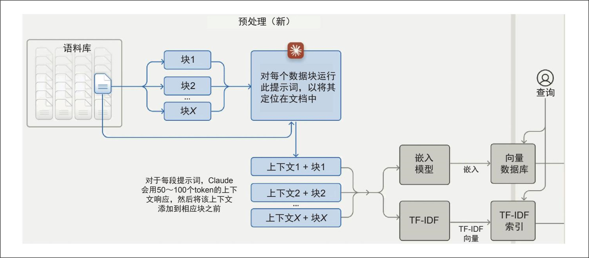

> **圖片描述：** 此圖展示了Anthropic的上下文檢索預處理流程。語料庫被拆分為多個塊，Claude為每個塊生成50-100個token的上下文說明。處理後得到「上下文+塊」的組合，再透過雙路徑索引：嵌入模型生成向量存入向量資料庫，以及TF-IDF生成索引。查詢時可同時利用兩種索引進行檢索。

圖6-5：Anthropic為每個資料塊新增了一段簡短的上下文，用於說明該塊在原始文件中的位置，從而使檢索器更容易根據指定查詢找到相關塊。圖片來自“Introducing Contextual Retrieval”（Anthropic，2024）

**評估檢索解決方案**

在評估檢索解決方案時，重點考慮以下幾個關鍵因素。

·檢索機制：支援哪些檢索機制？是否支援混合搜尋？

·向量支援：如果是向量資料庫，支援哪些嵌入模型和向量搜尋演演算法？

·可擴充套件性：可擴充套件性如何（涵蓋資料儲存和查詢流量兩方面）？是否適用於你的流量模式？

·索引效率：索引資料耗時多久？支援一次性批次處理（如新增、刪除）多少資料？

·效能延遲：對於不同的檢索演演算法，查詢延遲是多少？

·定價：如果是託管式解決方案，定價結構如何？是基於文件/向量的數量，還是基於查詢的數量計費？

這份清單未涵蓋企業級功能，如訪問控制、合規性、資料平面與控制平面的分離等。

### 6.1.4 超越文本的RAG

上一節討論了基於文字的RAG系統，其外部資料來源均為文字文件。實際上，外部資料來源也可以是多模態資料或表格資料。

**1. 多模態RAG**

如果生成器是多模態的，其上下文不僅可以透過文字檔案增強，還可以利用外部影像、影片、音訊等進行增強。為簡潔起見，這裡以影像為例，但任何其他模態均適用。當給定一個查詢時，檢索器會同時獲取與該查詢相關的文字和影像。例如，當查詢為“What's the color of the house in the Pixar movie U**p*?”（皮克斯電影《飛屋環遊記》中房子是什麼顏色的？）時，檢索器可以獲取一張《飛屋環遊記》中房子的圖片，來輔助模型回答，如圖6-6所示。

圖6-6：多模態RAG可以同時使用文字和影像來增強查詢（出於版權原因，此處未使用電影《飛屋環遊記》的真實圖片）

如果影像帶有後設資料（如標題、標籤和說明文字），則可以透過這些後設資料進行檢索。例如，影像的說明文字與查詢相關，則可以檢索到該影像。

如果你希望根據影像內容進行檢索，則需要一種方法來比較影像與查詢之間的相似度。如果查詢是文字，則需要一個多模態嵌入模型，能夠同時為影像和文字生成嵌入向量。假設使用CLIP（Radford等，“Learning Transferable Visual Models From Natural Language Supervision”，2021）作為多模態嵌入模型，則檢索過程如下。

1. 為所有資料（文字和影像）生成CLIP嵌入向量，並將其儲存在向量資料庫中。

2. 給定一個查詢，生成該查詢的CLIP嵌入向量。

3. 在向量資料庫中檢索與查詢嵌入向量相近的影像和文字。

**2. 使用表格資料的RAG**

大多數應用不僅處理文字和影像等非結構化資料，還會處理表格資料。許多查詢可能需要從資料表中獲取資訊才能回答。使用表格資料增強上下文的工作流程與經典的RAG流程有顯著差異。

假設你在一家名為Kitty Vogue的電子商務網站工作，該網站專門銷售貓咪時尚用品。系統中包含一個名為sales的訂單表，如表6-3所示。

表6-3：虛構電子商務網站Kitty Vogue的訂單表sales範例

	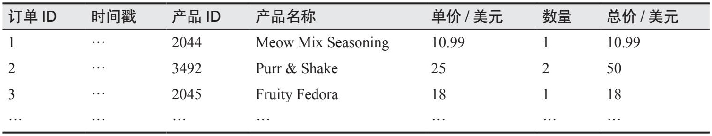

> **圖片描述：** 此表格展示了虛構電子商務網站Kitty Vogue的訂單表範例，包含訂單ID、時間戳、產品ID、產品名稱、單價、數量、總價等欄位，以三筆貓咪時尚產品（Meow Mix Seasoning、Purr & Shake、Fruity Fedora）的訂單資料為範例。

為了回答“How many units of Fruity Fedora were sold in the last 7 days?”（過去7天內Fruity Fedora賣出了多少件？），系統需要查詢該表中所有涉及Fruity Fedora的訂單，並將這些訂單中的數量相加。假設該表支援SQL查詢，則SQL查詢語句可能如下所示。

SELECT SUM(units) AS total_units_sold

FROM sales

WHERE product_name='Fruity Fedora'

AND timestamp >=DATE_SUB(CURDATE(), INTERVAL 7 DAY);

該工作流程如圖6-7所示。為了執行該流程，系統必須具備生成和執行SQL查詢的能力。

1. 文字轉SQL：根據使用者查詢和給定的表結構，確定需要執行的SQL查詢。文字轉SQL是語義解析的一個範例，已在第2章中討論過。

2. SQL執行：在資料庫中執行該SQL查詢。

3. 生成：根據SQL查詢結果和使用者原始查詢生成最終響應。

在文字轉SQL階段，如果可用表格數量過多，導致無法將所有表的模式納入模型上下文，則可能需要一箇中間步驟來預測每個查詢應涉及哪些表。文字轉SQL既可由生成最終響應的同一模型完成，也可由專用文字轉SQL模型完成。

	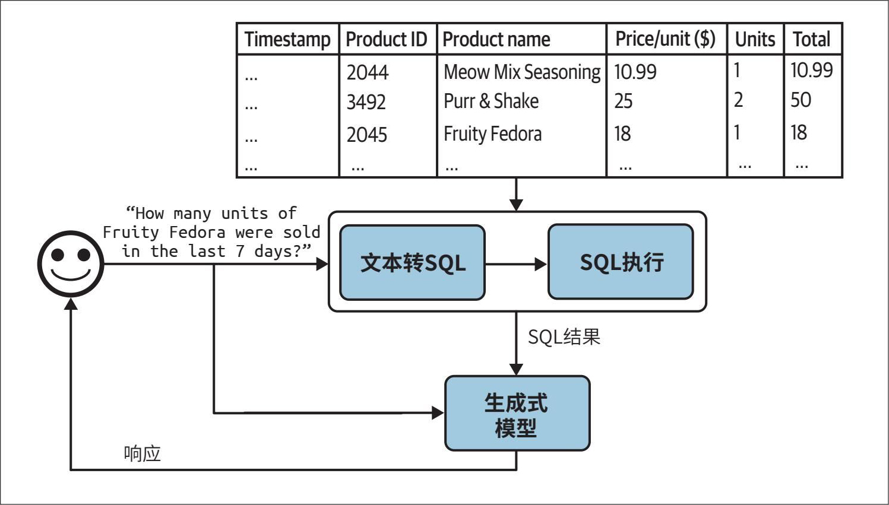

> **圖片描述：** 此圖展示了使用表格資料的RAG系統工作流程。頂部為銷售資料表，使用者查詢「Fruity Fedora過去7天賣了多少件？」後，流程經過三步：文本轉SQL→SQL執行→生成式模型生成自然語言響應。

圖6-7：使用表格資料增強上下文的RAG系統

在本節中，我們討論了檢索器和SQL執行器等工具如何協助模型處理更多查詢並生成更高質量的響應。那麼，為模型提供更多工具是否能進一步提升其能力呢？工具的使用是智慧體模式的核心特徵，我們將在下一節對此進行討論。

## 6.2 智能體

- 中文版參見《人工智慧：現代方法（第4版）》，人民郵電出版社，2022年。——編者注

許多人認為智慧體是AI的終極形態。Stuart Russell和Peter Norvig在經典著作Art**ifi**cia**l** **Int**ell**ige**nce**:** **A** **Mod**ern** **App**roach*（Prentice Hall，1995）中，將AI研究領域定義為“對理性智慧體的研究與設計”。

基礎模型所展現出的前所未有的能力為智慧體應用開啟了大門，這在過去是難以想象的。藉助這些新能力我們終於能夠開發自主、智慧的智慧體，作為我們的助手、同事和教練。它們可以幫助我們建立網站、收集資料、規劃旅行、做市場調研、管理客戶賬戶、自動化資料錄入、為面試做準備、面試候選人、談判交易等。可能性幾乎無窮無盡，這類智慧體所蘊含的潛在經濟價值也極其巨大。

	

> **圖片描述：** 此圖為書中的裝飾性插圖，展示一隻橘紅色的蠍子剪影，用於標示章節中的警告或重要提示。

 AI驅動的智慧體仍是一個新興領域，目前尚未形成成熟的理論框架來定義、開發和評估它們。本節嘗試在現有文獻的基礎上構建一個框架，但隨著該領域的不斷發展，這一框架也會持續演進。與本書其他部分相比，本節內容更具探索性。

本節將首先給出智慧體的概述，然後探討決定智慧體能力的兩個關鍵方面：工具和規劃。

智慧體以新的方式執行，也會出現新的故障模式。本節最後將討論如何評估智慧體，以識別和度量這些故障。

儘管智慧體是一個相對新穎的概念，但它建立在本書前面已介紹過的一些概念之上，包括自我批評、思維鏈以及結構化輸出。

### 6.2.1 智能體概述

- 我們通常將agent翻譯為“智慧體”，但在個別用法中翻譯為“代理”更為合適，因此本書會酌情處理。另外，這段話主要討論的是英文語境下agent一詞的用法，為了方便理解，我們保留了原書中的英文。——編者注

術語agent（智慧體/代理）已經在許多不同的工程語境中被廣泛使用，包括但不限於software agent（軟體代理）、intelligent agent（智慧體）、user agent（使用者代理）、conversational agent（對話代理）和reinforcement learning agent（強化學習智慧體）。那麼，究竟什麼是智慧體呢？

- Artifcial Intelligence: A Modern Approach（1995）將智慧體（agent）定義為任何能夠透過感測器感知環境，並透過執行器作用於環境的事物。

智慧體是任何能夠感知其環境並作用於環境的事物。這意味著智慧體的特徵由其所處的環境和它能夠執行的一系列動作所共同決定。

智慧體所處的**環境**（environment）由其具體的應用場景決定。如果你開發一個智慧體來玩遊戲，例如《我的世界》（Min**ecr**aft*）、圍棋、《刀塔》（*DOT**A** **2*），那麼遊戲就是它的環境。如果你希望智慧體從網際網路上抓取文件，那麼網際網路就是它的環境。如果你的智慧體是一個烹飪機器人，那麼廚房就是它的環境。自動駕駛汽車智慧體的環境則是道路系統及其周邊區域。

AI智慧體能夠執行的**動作集合**（set of actions）透過其可使用的**工具**（tools）得到擴充套件。你每天接觸的許多生成式AI應用本質上都是智慧體，只不過它們使用的工具比較簡單。ChatGPT就是一個智慧體，它可以搜尋網頁、執行Python程式碼以及生成影像。RAG系統也是智慧體，而文字檢索器、影像檢索器和SQL執行器則是它們的工具。

智慧體的環境和其工具集之間存在著強依賴關係。環境決定了智慧體可能使用的工具。例如，環境是國際象棋棋局，那麼智慧體唯一可能的動作就是符合規則的棋步。然而，智慧體的工具集也會限制它所能夠執行的環境。例如，一個機器人唯一的動作是游泳，那麼它只能被限制在水環境中活動。

圖6-8展示了一個名為SWE-agent（Yang等，“SWE-agent: Agent-Computer Interfaces Enable Automated Software Engineering”，2024）的智慧體的視覺化範例，該智慧體構建在GPT-4之上，它的環境是一臺帶有終端和檔案系統的電腦。它的動作集合包括瀏覽程式碼倉庫、搜尋檔案、檢視檔案和編輯程式碼行。

AI智慧體的目標是完成使用者在輸入中指定的任務。在AI智慧體中，AI作為大腦處理接收到的資訊，包括任務和來自環境的回饋，規劃一系列動作以完成任務，並判斷任務是否已完成。

圖6-8：SWE-agent（Yang等，2024）是一個程式設計智慧體，其環境為電腦，動作包括瀏覽、搜尋和編輯。改編自原始圖片，原圖基於CC BY 4.0授權

我們回到Kitty Vogue範例中使用表格資料的RAG系統。這是一個簡單的智慧體，具有三個動作：響應生成、SQL查詢生成和SQL查詢執行。給定查詢“Project the sales revenue for Fruity Fedora over the next three months”（預測未來三個月Fruity Fedora的銷售收入），智慧體可能會執行以下動作序列。

1. 推理如何完成該任務。它可能判斷，為了預測未來的銷售額，首先需要獲得過去5年的銷售資料。注意，智慧體的推理過程會以AI回覆的訊息內容呈現。

2. 呼叫SQL查詢生成工具，生成獲取過去5年的銷售資料所需的SQL查詢語句。

3. 呼叫SQL查詢執行工具，執行該查詢語句。

4. 推理工具輸出的結果，以及這些結果如何幫助預測銷售額。它可能判斷這些資料不足以進行可靠的預測，例如存在缺失值，因此還需要過去營銷活動的資訊。

5. 呼叫SQL查詢生成工具，生成對過去營銷活動的查詢。

6. 呼叫SQL查詢執行工具。

7. 判斷新獲得的資訊已經足以支援對未來銷售額的預測，隨後生成預測結果。

8. 推理任務成功完成。

相比非智慧體的使用場景，智慧體通常需要更強大的模型，原因主要有以下兩點。

·錯誤的累積效應：智慧體通常需要執行多步操作才能完成任務，隨著步驟數增加，總體準確率會下降。如果模型每一步的準確率為95%，那麼經過10步後，總體準確率將降至約60%；經過100步後，總體準確率僅約為0.6%。

·更高的風險：由於能夠使用工具，智慧體可以執行影響更大的任務，但任何錯誤都可能導致更嚴重的後果。

- 在智慧體發展早期，人們對智慧體的一大抱怨是：它們只擅長燒光你的API配額。

一個需要許多步驟的任務可能耗費大量的時間和金錢。然而，如果智慧體能夠自主執行，就可以節省大量的人力時間，使所投入的成本物有所值。

在給定環境下，一個智慧體在環境中的成功取決於它所能使用的工具庫以及其AI規劃器的能力。我們首先來看一下模型可以使用的不同型別的工具。

### 6.2.2 工具

一個系統並不一定非要訪問外部工具才能被稱為智慧體。然而，如果沒有外部工具，智慧體的能力將十分有限。僅就模型本身而言，通常只能執行單一型別的動作。例如，LLM可以生成文字，影像生成器可以生成影像。外部工具則可以極大拓展智慧體的能力邊界。

工具既可以幫助智慧體感知環境，也可以幫助其作用於環境。其中，用於感知環境的稱為**只讀動作**，而用於對環境執行操作的則稱為**寫入動作。**

本節將概述外部工具，至於如何使用工具，將在6.2.3節中討論。

智慧體所能訪問的工具集構成了其工具庫。由於工具庫決定了智慧體的能力範圍，因此需要仔細考量為智慧體提供哪些工具，以及提供多少工具。雖然更多的工具能賦予智慧體更強的能力，但工具越多，智慧體理解並有效使用這些工具的難度通常也越大。確定合適的工具庫往往需要透過實驗，這一點將在6.2.3節中進一步探討。

根據智慧體所處的環境，可以設計出多種不同的工具。總體而言，可以考慮三類工具：知識增強（上下文構建）、能力擴充套件，以及寫入動作（允許智慧體作用於環境的工具）。

**1. 知識增強**

我希望到目前為止，本書已經讓你意識到“相關上下文”對模型回覆質量的重要性。一類重要的工具是那些能夠增強智慧體知識的工具，其中一些我們已經討論過了，如文字檢索器、影像檢索器和SQL執行器。其他工具還包括內部系統介面（人員搜尋、庫存API）、Slack檢索、電子郵件閱讀器等。

這類工具中有許多可以讓模型訪問組織內部的流程與資訊，從而提升模型的能力。同時，工具也可以讓模型訪問公共資訊，尤其是來自網際網路的資訊。

網頁瀏覽是最早被整合到ChatGPT等聊天機器人中的功能之一，也是最受期待的功能之一。網頁瀏覽可以防止模型資訊過時。一旦模型的訓練資料過時，模型本身也會隨之過時。如果模型的訓練資料截止到上週，那麼除非在上下文中提供了本週的資訊，否則它將無法回答涉及本週資訊的問題。如果沒有網頁瀏覽功能，模型將無法提供天氣、新聞、即將到來的活動、股票價格、航班狀態等資訊。

我用“網頁瀏覽”作為一個統稱，涵蓋所有訪問網際網路的工具，既包括網頁瀏覽器，也包括特定的API，例如搜尋API、新聞API、GitHub API，或X、LinkedIn、Reddit等社交媒體API。

儘管網頁瀏覽可以讓你的智慧體引用最新的資訊，生成更好的響應並減少幻覺，但它也可能讓智慧體接觸到網際網路上海量的“垃圾資訊”。因此，請謹慎選擇你的網際網路API。

**2. 能力擴展**

你需要考慮的第二類工具，是那些用來彌補AI模型固有侷限性的工具。這些工具可以顯著提升模型的表現。例如，眾所周知，AI模型在數學計算方面表現不佳。如果你問模型199,999除以292等於多少，它很可能會算錯。然而，如果模型能夠使用計算器，這個計算就變得非常簡單。與其試圖訓練模型精通算術，不如直接給模型提供一個計算器工具，這在資源利用上要高效得多。

還有一些簡單的工具也可以顯著提升模型的能力，包括日曆、時區轉換器、單位轉換器（例如從磅到千克）以及翻譯工具（用於翻譯模型不擅長的語言）。

更復雜但功能更強大的工具之一是程式碼直譯器。你無須訓練模型理解程式碼，而是可以讓模型訪問程式碼直譯器，由它來執行程式碼片段，返回結果或分析程式碼錯誤。藉助這一能力，你的智慧體可以充當程式設計助手、資料分析師，甚至是研究助理（能夠編寫程式碼來開展實驗並報告結果）。不過，自動執行程式碼也會帶來程式碼注入攻擊的風險，這一點已在5.3節中討論過。採取適當的安全措施對於保護你和使用者的安全至關重要。

外部工具可以讓僅支援文字或僅支援影像的模型轉變為多模態模型。例如，一個只能生成文字的模型可以將“文字轉影像”的模型作為工具，從而既能生成文字又能生成影像。當收到文字請求時，智慧體的AI規劃器會決定呼叫文字生成、影像生成，或同時呼叫兩者。這就是ChatGPT同時生成文字和影像的方式——它使用DALL·E作為其影像生成器。智慧體還可以使用程式碼直譯器生成圖表，使用LaTeX編譯器渲染數學公式，或使用瀏覽器把HTML程式碼渲染成網頁。

同樣，一個只能處理文字輸入的模型可以使用影像描述工具來處理影像，使用轉錄工具來處理音訊，還可以使用OCR（optical character recognition，光學字元識別）工具來讀取PDF檔案。

**與僅使用提示詞或微調相比，使用工具可以顯著提高模型的性能。**Chameleon的研究表明，一個由GPT-4驅動並配備13種工具的智慧體，在多個基準測試中的表現優於單獨使用的GPT-4。該智慧體使用的工具包括知識檢索、查詢生成器、影像描述器、文字檢測器和必應搜尋等（Lu等，“Chameleon: Plug-and-Play Compositional Reasoning with Large Language Models”，2023）。

- “最佳少樣本結果”是指在少樣本（few-shot）學習設定下，已有方法或模型在該基準測試上取得的最佳效能。——編者注

在科學問答基準測試ScienceQA上，Chameleon將已發表的最佳少樣本結果提高了11.37%。在表格數學解題基準TabMWP（Lu等，2022）上，Chameleon將準確率提高了17%。

**3. 寫入動作**

到目前為止，我們討論的都是隻讀動作，這類動作允許模型從資料來源中讀取資訊。但工具也可以執行寫入動作，從而修改資料來源。比如，一個SQL執行器不僅可以檢索資料表（讀取），還可以修改或刪除資料表（寫入）；電子郵件API不僅可以讀取郵件，還可以回覆郵件；銀行API不僅可以查詢你的當前餘額，還可以發起銀行轉賬。

寫入動作使系統能夠完成更多型別的任務。它們可以幫助你自動化整個客戶拓展流程：研究潛在客戶，尋找聯絡方式，撰寫郵件，傳送初始郵件，閱讀回覆，跟進客戶，提取訂單資訊，將新訂單更新到資料庫中，等等。

然而，讓AI自動介入我們的生活也會引發擔憂。正如你不會授予一名實習生刪除生產資料庫的許可權一樣，你也不應該允許一個不可靠的AI發起銀行轉賬。對系統能力及其安全措施的信任至關重要。你需要確保系統具備防護措施，防止被惡意利用去執行有害動作。

當我在聽眾面前談論自主AI智慧體時，經常有人提到自動駕駛汽車：“如果有人黑進汽車系統，把你綁架怎麼辦？”由於涉及物理世界，自動駕駛汽車更容易引發聯想。但即使不在物理世界中，AI系統同樣可能造成傷害。它可能操縱股市、侵犯版權、破壞隱私、強化偏見、傳播錯誤資訊、進行意識形態操縱等，這些問題在5.3節中已經討論過。

這些擔憂完全合理，任何希望利用AI的組織都必須認真對待安全問題。然而，這並不意味著AI系統永遠不應該被賦予在現實世界中行動的能力。既然我們可以放心地把人類送入太空，我也希望有一天，我們能建立足夠完善的安全機制，讓人們可以放心地信任自主AI系統。此外，人類同樣會犯錯。就我個人而言，我更願意相信自動駕駛汽車，而不是隨便一個陌生人來開車載我。

- 在工程實踐中，函式呼叫等同於工具呼叫（tool calling）。目前主流大模型的API均已支援工具呼叫能力，且相關介面的核心引數名普遍採用tools。——譯者注

正如合適的工具能極大提高人類的生產力——試想在沒有Excel的情況下開展業務，或者在沒有起重機的情況下建造摩天大樓會怎樣？——工具也能幫助模型完成更多工。許多模型提供商已經支援模型使用工具，這一功能通常被稱為函式呼叫（function calling）。展望未來，我預計大多數模型都會支援類似函式呼叫的能力，以便使用各種工具。

### 6.2.3 規劃

基礎模型智慧體的核心是負責解決任務的模型本身。一項任務由其目標和約束條件共同定義。例如，一項任務是“在預算5000美元的前提下，規劃一次從舊金山到印度的兩週旅行”，其中目標是制定兩週的旅行方案，約束條件是預算上限。

複雜任務通常需要規劃。規劃過程的輸出是一個計劃，即完成任務所需步驟的路線圖。有效的規劃通常要求模型理解任務、考慮實作任務的不同方案，並從中選擇最佳方案。

如果你參加過專案規劃會議，就會知道規劃是一件很難的事情。作為一個重要的計算問題，規劃已經被廣泛研究，要全面介紹它可能需要幾本書。這裡我只能做一個非常簡要的介紹。

**1. 規劃概述**

對於給定任務，通常有許多可能的分解方式，但並非所有分解方式都能成功完成任務。即便在所有可行的解決方案中，有些方案也比其他方案更高效。考慮這樣一個問題：“有多少家沒有營收的公司完成了至少10億美元的融資？”解決這個問題有很多種路徑，作為範例，我們考慮以下兩種方案。

·找出所有沒有營收的公司，然後根據融資規模進行篩選。

·找出所有融資至少10億美元的公司，然後根據營收情況進行篩選。

第二種方案更高效，因為沒有營收的公司遠遠多於融資達到10億美元的公司。在只有這兩個方案的情況下，一個聰明的智慧體應該選擇第二個方案。

你可以在同一段提示詞中同時進行規劃與執行。例如，給模型一段提示詞，讓它一步一步地思考（比如使用思維鏈提示詞），然後在同一段提示詞中執行這些步驟。但如果模型生成了一個包含1000個步驟的計劃，最終卻無法實作目標怎麼辦？在缺乏監督的情況下，智慧體可能會花上數小時執行這些步驟，浪費大量時間和API呼叫成本，最後你才發現它毫無進展。

為了避免低效執行，**規劃**最好與**執行**解耦。你可以先要求智慧體生成一個計劃，只有在這個計劃透過**驗證**後才執行。計劃驗證可以使用啟發式方法。例如，一個簡單的啟發式規則是：排除包含無效動作的計劃。如果生成的計劃要求執行Google搜尋，而智慧體並不具備Google搜尋許可權，那麼這個計劃就是無效的。另一個簡單的啟發式規則是：排除所有步驟數超過X的計劃。你也可以使用AI裁判來驗證計劃：讓模型評估計劃是否合理，或給出改進建議。

如果生成的計劃被評估為不佳，你可以要求規劃器重新生成一個計劃；如果計劃被評估為良好，就執行。如果計劃涉及外部工具，系統會藉助函式呼叫來執行相應的工具。執行計劃後得到的輸出也需要再次進行評估。需要注意的是，生成的計劃不一定必須覆蓋整個任務的端到端全過程，它也可以只針對某個子任務生成區域性計劃。整個過程如圖6-9所示。

	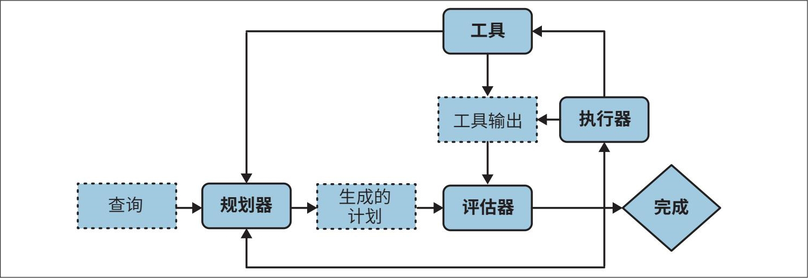

> **圖片描述：** 此圖展示了將規劃與執行分離的智能體架構流程圖。從「查詢」開始，經規劃器生成計劃、評估器驗證、執行器呼叫工具，工具輸出再由評估器評估，最終判斷任務是否完成。不合理的計劃會回饋給規劃器重新生成，形成可循環迭代的閉環系統。

圖6-9：將規劃與執行分離，僅執行經過驗證的計劃

- 大多數智慧體工作流都相當複雜，涉及多個元件，因此，從廣義上講，大多數智慧體是多智慧體系統。

你的系統現在包含三個元件：一個用於生成計劃，一個用於驗證計劃，另一個用於執行計劃。如果你將每個元件都視為一個智慧體，那麼這便構成了一個多智慧體系統。

為了加快流程，你可以不再按順序生成計劃，而是並行生成多個計劃，然後讓評估器選擇最有前景的那個。這再次體現了延遲與成本之間的權衡，因為同時生成多個計劃會增加額外的成本。

規劃需要理解任務背後的意圖：使用者透過這個查詢想要做什麼？通常使用意圖分類器來輔助智慧體進行規劃。如5.2.3節所述，意圖分類可以透過另一段提示詞完成，或使用專門為此任務訓練的分類模型來完成。意圖分類機制可以看作多智慧體系統中的另一個智慧體。

明確意圖有助於智慧體選擇合適的工具。例如，在客戶支援場景中，如果查詢涉及賬單問題，智慧體可能需要呼叫工具來獲取使用者最近的付款記錄；但如果查詢是關於如何重置密碼，智慧體則可能需要訪問文件檢索工具。
	

> **圖片描述：** 此圖為書中的裝飾性插圖，展示一隻綠色的捲尾動物剪影，用於標示章節中的提示或注意事項。

 有些查詢可能超出智慧體的能力範圍。意圖分類器應能將這些請求歸類為“IRRELEVANT”（無關），這樣智慧體就可以禮貌地拒絕，而不是浪費算力去嘗試解決無法完成的任務。

到目前為止，我們一直假設智慧體自動完成全部三個階段：計劃生成、計劃驗證和計劃執行。實際上，人類可以在上述任意階段參與，以輔助智慧體執行並降低風險。人類專家可以提供計劃、幫助驗證計劃，或者親自執行計劃的部分內容。例如，對於智慧體難以生成完整計劃的複雜任務，人類專家可以先給出一個宏觀計劃，再由智慧體對其進行細化。如果計劃涉及高風險操作，比如更新資料庫或合併程式碼變更，系統可以在執行前請求人類明確批准，或者交由人類執行這些操作。要實作這一點，你需要清晰定義智慧體在每個動作中可被授予的自動化程度。

總的來說，解決一項任務通常包含以下過程。需要注意的是，反思（reflection）並不是智慧體的必備步驟，但它能顯著提升智慧體的表現。

1. **計劃生成：**為完成任務制訂計劃。計劃是一系列可管理的動作，因此該過程也稱為任務分解。

2. **反思與錯誤修正**：評估生成的計劃。如果計劃不合適，則生成一個新計劃。

3. **執行**：執行計劃中列出的動作，這通常涉及呼叫特定的函式。

4. **反思與錯誤修正**：在得到動作結果後，評估這些結果並判斷目標是否已實作。識別並糾正錯誤。如果目標尚未完成，則生成新計劃。

在本書中，你已經瞭解了一些有關計劃生成和反思的技巧。當你要求模型“逐步思考”時，你實際上是在要求它進行任務分解；當你要求模型“檢查你的答案是否正確”時，你實際上是在要求它進行反思。

**2. 基礎模型作為規劃器**

一個懸而未決的問題是：基礎模型的規劃能力到底有多強？許多研究人員認為，至少基於自迴歸語言模型構建的基礎模型，並不具備真正的規劃能力。Meta首席AI科學家Yann LeCun明確表示，自迴歸LLM無法進行規劃（2023）。在文章“Can LLMs Really Reasonand Plan?”中，Kambhampati（2023）認為，LLM擅長知識提取，但不擅長規劃。他指出，那些聲稱LLM具備規劃能力的論文，往往混淆了LLM所提取的一般規劃知識與可執行的具體計劃。“LLM生成的計劃在普通使用者看來可能合情合理，一旦執行就有可能出現互動問題和錯誤。”

然而，儘管有大量經驗證據表明LLM不擅長規劃，但目前還不清楚這究竟是因為我們尚未掌握正確使用LLM的方法，還是因為LLM從根本上就無法進行規劃。

**規劃的核心是一個搜索問題。**你需要在通往目標的不同路徑之間進行搜尋，預測每條路徑的結果（獎勵），並選擇最有希望的路徑。很多時候，你可能會發現根本不存在一條可以通向目標的路徑。

**搜索通常需要回溯。**假設你處於某一步，有A和B兩個可能的動作。在執行動作A後，你進入了一個不理想的狀態，這時你需要回到之前的狀態，轉而選擇動作B。

有些人認為，自迴歸模型只能前向生成動作，無法回溯生成替代動作，因此得出結論：自迴歸模型無法進行規劃。然而，這一結論並不一定成立。在沿著包含動作A的路徑執行一段時間後，如果模型判斷該路徑不可行，它可以修改路徑，改用動作B，從而在效果上實作“回溯”。此外，模型也可以在任意時刻重新開始，選擇另一條路徑。

LLM或許不擅長規劃的另一個原因是，它們缺乏規劃所需的工具。要進行規劃，不僅需要了解可用的動作，還需要知道每個動作可能產生的結果。舉個簡單的例子：假設你想爬上一座山，你可以執行的動作包括向右轉、向左轉、轉身或直行。然而，如果向右轉會導致你掉下懸崖，你就不會考慮這個動作。從技術角度來看，一個動作會將你從一個狀態帶到另一個狀態，因此你必須知道執行動作後的狀態，才能判斷是否執行該動作。

這意味著，僅僅提示模型生成一系列動作（如流行的思維鏈技術所做的那樣）是不夠的。論文“Reasoning with Language Model is Planning with World Model”（Hao等，2023）提出，由於包含了大量關於世界的資訊，LLM能夠預測每個動作的結果。LLM可以利用這種結果預測能力生成連貫的規劃。

即使AI模型本身無法規劃，它仍然可以成為規劃系統的一部分。或許可以透過為LLM增加配備搜尋工具和狀態追蹤系統來幫助它進行規劃。

**基礎模型與強化學習規劃器的對比**

**智能體**是強化學習中的核心概念。根據維基百科的定義，強化學習是一個“研究智慧體如何在動態環境中執行動作，以最大化累積獎勵”的領域。

強化學習智慧體和基礎模型智慧體在很多方面都很相似，它們都由所處的環境和可能執行的動作來定義。兩者的主要區別在於規劃器的工作方式不同。在強化學習智慧體中，規劃器由強化學習演演算法訓練而成，訓練這樣的規劃器往往需要大量時間和資源。而在基礎模型智慧體中，模型本身就是規劃器，可以透過提示詞或微調來提高其規劃能力，通常所需時間和資源更少。

然而，基礎模型智慧體並不排斥藉助強化學習演演算法來提升效能。我認為，從長遠來看，基礎模型智慧體和強化學習智慧體很可能會逐漸融合。

**3. 計劃生成**

將模型轉化為規劃器最簡單的方法是利用提示工程。假設你想建立一個智慧體，幫助客戶瞭解Kitty Vogue的產品。你為這個智慧體提供了三個外部工具：按價格檢索產品、檢索熱門產品和檢索產品資訊。以下是一段用於生成計劃的範例提示詞。該提示詞僅用於演示，實際生產環境中的提示詞通常複雜得多。

**SYSTEM PROMPT**

Propose a plan to solve the task. You have access to 5 actions: get_today_date()

fetch_top_products(start_date, end_date, num_products)

fetch_product_info(product_name)

generate_query(task_history, tool_output)

generate_response(query)

The plan must be a sequence of valid actions.

Examples

Task: "Tell me about Fruity Fedora"

Plan: [fetch_product_info, generate_query, generate_response]

Task: "What was the best selling product last week?"

Plan: [fetch_top_products, generate_query, generate_response]

Task: {USER INPUT}

Plan:

關於這個範例，有以下兩點需要注意。

·此處使用的計劃格式（函式列表，引數由智慧體推斷）只是構建智慧體控制流程的眾多方式之一。

·generate_query函式接收任務的當前歷史記錄以及最近的工具輸出，以生成一個供響應生成器使用的查詢。每一步的工具輸出都會被追加到任務歷史記錄中。

給定使用者輸入“What's the price of the best-selling product last week?”（上週最暢銷產品的價格是多少？），生成的計劃可能如下所示。

1. get_time()

2. fetch_top_products()

3. fetch_product_info()

4. generate_query()

5. generate_response()

你可能會問：“每個函式所需的引數怎麼辦？”實際上，很難提前預測具體引數，因為它們通常需要從前一步的工具輸出中提取。如果第一步get_time()輸出了"2030-09-13"，那麼智慧體可以推斷下一步應如下呼叫。

retrieve_top_products(

      start_date="2030-09-07",

      end_date="2030-09-13",

      num_products=1

)

現實中，資訊往往不足以唯一確定函式的引數值。例如，當使用者詢問“最暢銷產品的平均價格是多少？”時，以下問題就沒有明確答案。

·使用者希望考慮多少個最暢銷的產品？

·使用者關心的是上週、上個月，還是有史以來最暢銷的產品？

這意味著，模型經常需要透過猜測來填補引數資訊，而猜測很容易出錯。

由於動作序列及其相關引數均由AI模型生成，因此難免會產生幻覺。幻覺可能導致模型呼叫無效函式，或者使用錯誤引數呼叫本來有效的函式。通常用於提升模型整體效能的技術，同樣適用於提升模型的規劃能力。

以下是一些提升智慧體規劃能力的方法。

·編寫更好的系統提示詞，並提供更多範例。

·更清晰地描述工具及其引數，讓模型更好地理解工具。

·重構函式本身，使其更加簡單，例如將一個複雜函式拆解為兩個更簡單的函式。

·使用更強大的模型。一般而言，模型越強，規劃能力越好。

·對模型進行微調，以提升其在計劃生成方面的能力。

**函數調用。**許多模型提供商都支援模型使用工具，這實際上已將其模型轉變為智慧體。工具就是函式，因此呼叫工具通常被稱為**函數調用。**不同模型API的具體工作方式有所差異，但一般而言，函式呼叫的工作流程如下。

1. 建立工具清單

宣告所有你希望模型使用的工具。對於每個工具，都需要描述其執行入口點（例如函式名）、引數和文件（例如函式的作用及所需引數）。

2. 指定智慧體可以使用哪些工具

由於不同的查詢可能需要不同的工具，許多API允許你為每個查詢指定可用工具列表。一些API還允許你進一步控制工具的使用方式。

required

模型必須使用至少一個工具。

none

模型不應使用任何工具。

auto

模型自行決定是否使用工具。

函式呼叫的範例如圖6-10所示。圖中範例使用虛擬碼編寫，以適配多種API。如需使用特定API，請參考對應文件。

	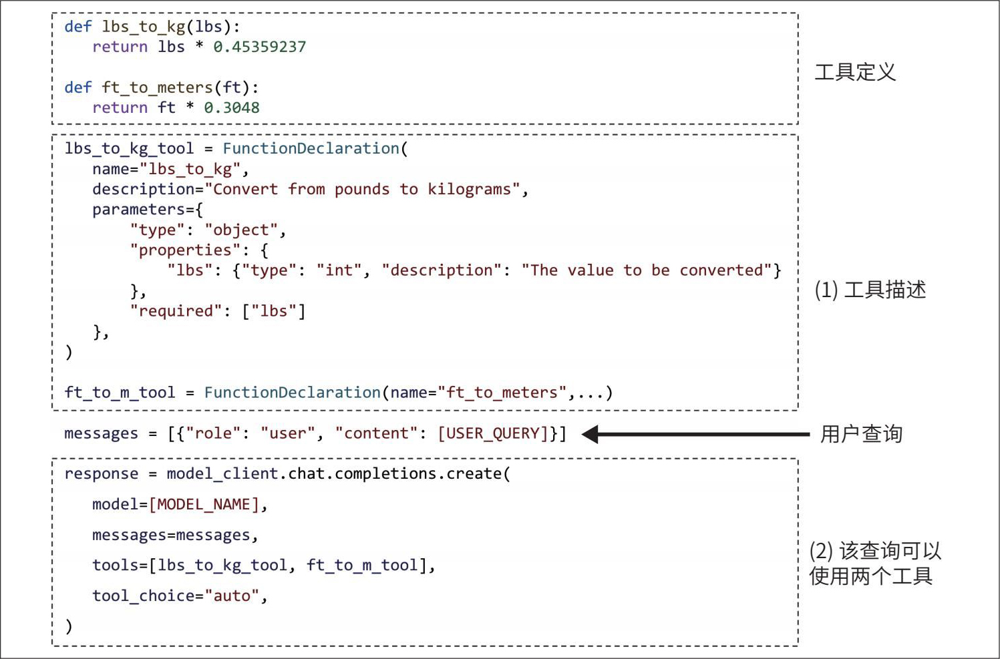

> **圖片描述：** 此圖展示了函式呼叫的程式碼範例。包含工具定義（lbs_to_kg和ft_to_meters兩個函式的名稱、描述、參數）、使用者查詢、以及模型呼叫（使用completions.create傳入工具列表，tool_choice設為auto讓模型自行決定是否使用工具）。

圖6-10：模型使用兩個簡單的工具的範例

給定一個查詢，圖6-10所定義的智慧體將自動生成要使用的工具及其引數。（注意：一些函式呼叫API會強制保證函式呼叫本身有效，但無法保證引數值一定正確。）

例如，對於使用者查詢“How many kilograms are 40 pounds?”（40磅是多少千克？），智慧體可能會判斷需要使用工具lbs_to_kg_tool，並將引數值設為40。其響應可能如下所示。

response=ModelResponse(

   finish_reason='tool_calls',

   message=chat.Message(

       content=**None**,

       role='assistant',

       tool_calls=[

           ToolCall(

               function=Function(

                   arguments='{"lbs":40}',

                   name='lbs_to_kg'),

               type='function')

        ])

)

根據這個響應，你可以呼叫函式lbs_to_kg(lbs=40)，並使用其輸出生成對使用者的回覆。
	

> **圖片描述：** 此圖為書中的裝飾性插圖，展示一隻綠色的捲尾動物剪影，用於標示章節中的提示或注意事項。

 在使用智慧體時，務必要求系統報告每次函式呼叫所使用的引數值，並檢查這些值是否合理。

**計劃粒度。**計劃是完成任務所需步驟的路線圖，路線圖可以有不同的粒度。以制訂年度計劃為例，季度計劃的粒度比月度計劃更粗，而月度計劃的粒度又比周計劃更粗。

粒度本質上是規劃與執行之間的一種權衡。粒度更細的計劃更難生成，但更易執行；粒度更粗的計劃更易生成，卻更難執行。解決這一權衡的一種方法是分層規劃：首先使用規劃器生成宏觀計劃（例如季度計劃），然後針對每個季度，使用相同或不同的規劃器生成更細緻的月度計劃。

此前的所有計劃生成範例都直接使用了具體的函式名。這種做法的粒度非常細，存在一個問題：智慧體的工具清單可能隨時間發生變化。例如，獲取當前日期的函式get_time()可能會被重新命名為get_current_time()。一旦工具發生變化，就需要更新提示詞和所有範例。此外，基於具體函式名編寫的規劃器難以在不同工具API和應用場景間複用。

如果之前已基於舊的工具清單對模型進行了微調，那麼當工具清單變化時，還需要重新微調模型。

為避免這個問題，可以使用更接近自然語言的方式生成計劃，這種方式比使用具體的函式名抽象層次更高。例如，對於查詢“What's the price of the best-selling product last week?”（上週最暢銷產品的價格是多少？），可以指示智慧體輸出如下計劃：

1. 獲取當前日期

2. 檢索上週最暢銷的產品

3. 檢索產品資訊

4. 生成查詢

5. 生成響應

使用自然語言有助於規劃器更好地適應工具API的變化。如果模型主要是在自然語言上訓練的，那麼它在理解和生成自然語言計劃方面可能表現更好，且不容易產生幻覺。

- Chameleon將這種翻譯器稱為程式生成器（Lu等，“Chameleon: Plug-and-Play Compositional Reasoning with Large Language Models”，2023）。

這種方法的缺點是，需要一個翻譯器將每個自然語言動作翻譯成可執行命令。不過，相比規劃任務，翻譯任務要簡單得多，可以交給能力較弱的模型完成，產生幻覺的風險也更低。

**復雜計劃。**此前的計劃範例均為順序執行：下一個動作總是在上一個動作完成之後才執行。動作執行的順序稱為**控制流**（control flow）。順序執行只是控制流的一種形式，其他典型形式包括並行執行、條件執行（if語句）和迴圈執行（for迴圈）。下面對每種控制流做簡要說明，並將順序執行作為對比。

**順序執行**

在任務A完成後執行任務B，通常是因為任務B依賴於任務A。例如，SQL查詢只有在自然語言輸入翻譯完成之後才能執行。

**並行執行**

給定任務A，透過同時執行任務B和任務C來完成任務A。例如，給定查詢“為我找到售價低於100美元的暢銷產品”，智慧體可能首先檢索銷量排名前100的產品，再並行檢索這100個產品的價格。

**條件執行**

根據上一步的輸出結果來決定執行任務B還是任務C。例如，智慧體先檢查NVIDIA的財報，再根據財報結果決定是買入還是賣出NVIDIA的股票。

**循環執行**

重複執行任務A，直到滿足某個條件。例如，不斷生成隨機數，直到生成一個質數為止。

圖6-11展示了這些控制流。

在傳統軟體工程中，控制流的條件往往是精確的；而在AI驅動的智慧體中，控制流的決策則由AI模型做出。具有非順序控制流的計劃更難生成，也更難翻譯為可執行命令。

在評估智慧體框架時，需要檢查它支援哪些控制流。例如，系統需要訪問10個網站，是否支援併發訪問？並行執行可以顯著降低使用者可感知的延遲。

	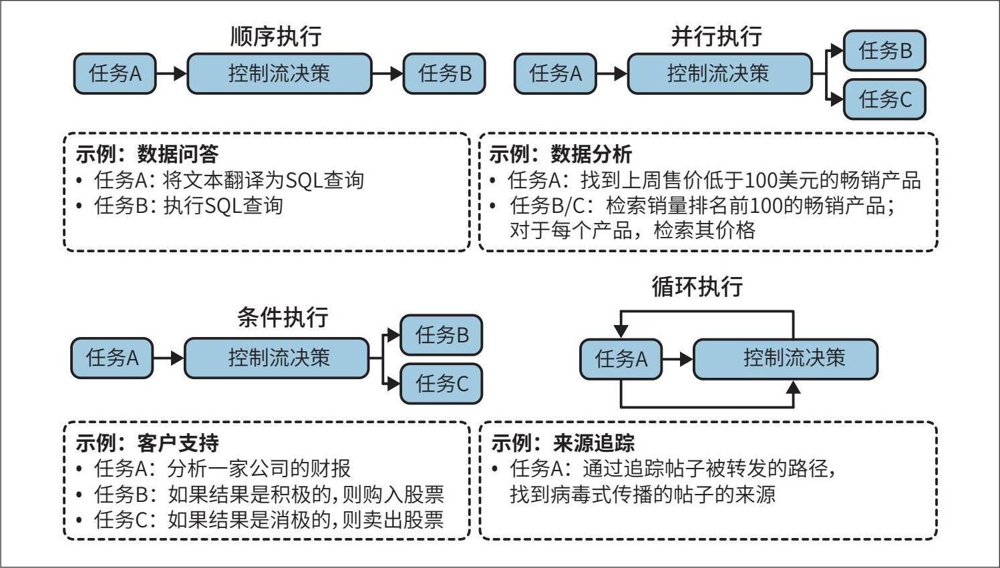

> **圖片描述：** 此圖展示了智能體的四種控制流模式：（1）順序執行——任務依次完成；（2）並行執行——多個任務同時進行；（3）條件執行——根據條件決定執行哪個任務；（4）循環執行——重複執行直到滿足條件。每種模式附有具體範例說明和藍色控制流決策圖示。

圖6-11：智慧體的幾種控制流範例

**4. 反思與錯誤修正**

即使是最好的計劃，也需要不斷評估和調整，以最大化成功的可能性。雖然反思對於智慧體的執行並非嚴格必要，但對於智慧體的成功卻往往必不可少。

在任務執行過程中，反思在以下多個環節都很有用。

·收到使用者查詢後，評估請求是否可行。

·在初始計劃生成後，評估計劃是否合理。

·在每一步執行後，評估當前執行是否處於正確的軌道。

·在整個計劃執行完畢後，判斷任務是否真正完成。

反思與錯誤修正是兩種相輔相成的機制：反思產生洞見，有助於發現需要糾正的錯誤。

反思可以由同一個智慧體透過自我批評提示詞來完成，也可以由單獨的元件來完成，例如專用評分器——一種為每個結果輸出具體分數的模型。

由ReAct（Yao等，“ReAct: Synergizing Reasoning and Acting in Language Models”，2022）首次提出的“推理與動作交替進行”的模式，現已成為智慧體的常見正規化。Yao等使用“推理”（reasoning）一詞同時涵蓋了規劃和反思兩個過程。在每一步中，智慧體被要求解釋其思考過程（規劃），接著執行動作，然後分析觀察結果（反思），如此迴圈，直到智慧體認為任務完成為止。通常會透過範例來提示智慧體按以下格式輸出。

**Thought 1: …**

**Act 1: …**

**Observation 1: …**

…[持續進行，直到反思確定任務已完成] …

**Thought N: …**

**Act N: Finish** [對查詢的響應]

圖6-12展示了一個遵循ReAct框架的智慧體在回答HotpotQA問題時的執行範例。HotpotQA是一個多跳問題回答基準資料集（Yang等，“HotpotQA: A Dataset for Diverse, Explainable Multi-hop Question Answering”，2018）。

	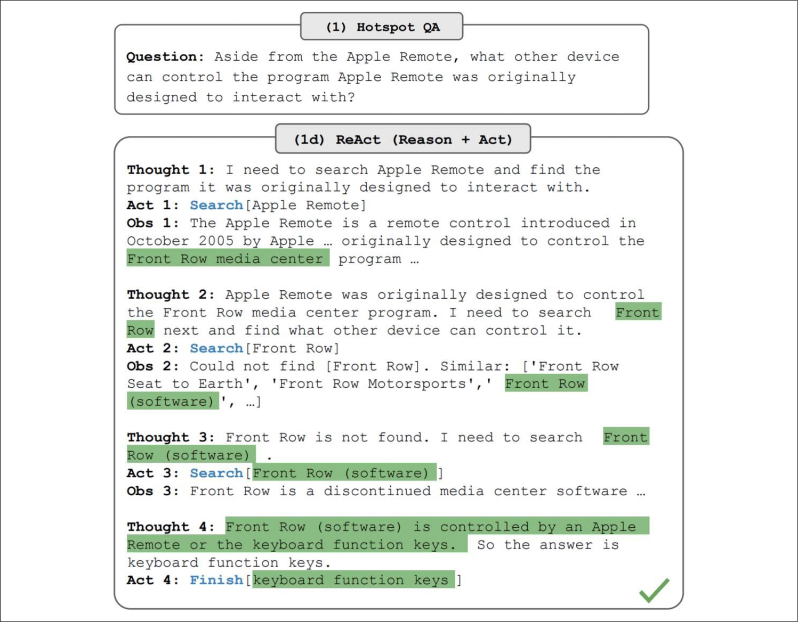

> **圖片描述：** 此圖展示了ReAct智能體在回答HotpotQA問題時的執行範例。智能體經過四輪「思考-動作-觀察」循環，逐步搜尋Apple Remote、Front Row等關鍵字，最終找到答案「keyboard function keys」（以綠色高亮標示）。

圖6-12：ReAct智慧體的執行範例。圖片來自ReAct論文（Yao等，2022），圖片基於CC BY 4.0授權

- 這讓我想起了強化學習中的演員-評論家（actor-critic，AC）智慧體方法（Konda和Tsitsiklis，“Actor-Critic Algorithms”，1999）。

你也可以在多智慧體環境中實作反思：一個智慧體負責規劃與執行動作，另一個智慧體則在每一步或每隔若干步對結果進行評估。

如果智慧體的響應未能完成任務，你可以提示智慧體反思失敗的原因，並給出改進思路。基於這些建議，智慧體會生成新的計劃，從而實作“從錯誤中學習”。例如，在一個程式碼生成任務中，評估器可能發現生成的程式碼未能透過1/3的測試用例。智慧體隨後反思失敗的原因可能是“未考慮陣列元素全為負數的情況”。接著，執行器會生成新的程式碼，將“全負陣列”這一情況也納入考慮。

這正是Reflexion（Shinn等，“Reflexion: Language Agents with Verbal Reinforcement Learning”，2023）所採用的方法。在該框架中，反思被拆分為兩個模組：一個用於評估結果的評估器，以及一個用於分析失敗原因的自我反思模組。圖6-13展示了Reflexion智慧體的執行範例。作者使用“軌跡”（trajectory）一詞來表示計劃。在每一步中，經過評估和自我反思後，智慧體會提出一條新的軌跡。

與計劃生成相比，反思相對容易實作，卻能帶來驚人的效能提升。其代價是更高的延遲和成本。思考、觀察和部分動作都可能需要生成大量token，這會增加成本和使用者可感知的延遲，尤其是在包含許多中間步驟的任務中。為了促使智慧體嚴格遵循既定格式，ReAct和Reflexion的作者都在提示詞中加入了大量範例，這一做法既增加了輸入token的成本，也減少了用於其他資訊的上下文空間。

	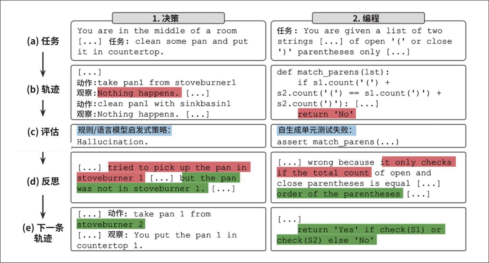

> **圖片描述：** 此圖展示了Reflexion智能體的執行範例，包含任務描述、執行軌跡、評估（紅色標示錯誤）、反思（分析失敗原因）、修正後的下一條軌跡（藍色標示改進）。展示了智能體如何透過反思錯誤，在下一輪中生成更正確的方案。

圖6-13：Reflexion智慧體的執行範例。圖片來自Reflexion的GitHub倉庫

**5. 工具選擇**

由於工具通常對任務的成功至關重要，因此為智慧體選擇合適的工具尤為關鍵。應為智慧體配備哪些工具，既取決於其環境和任務，也取決於驅動智慧體的AI模型本身。

關於如何選擇最優工具集，目前尚無放之四海而皆準的指南。智慧體相關文獻中使用的工具種類繁多。例如，Toolformer對GPT-J進行了微調，使其學會使用5種工具（Schick等，“Toolformer: Language Models Can Teach Themselves to Use Tools”，2023）；Chameleon使用了13種工具（Lu等，“Chameleon: Plug-and-Play Compositional Reasoning with Large Language Models”，2023）；而Gorilla則嘗試提示智慧體從1645個API中選擇正確的API呼叫（Patil等，“Gorilla: Large Language Model Connected with Massive APIs”，2023）。

工具越多，智慧體潛在的能力就越強。但與此同時，有效使用這些工具的難度也會增大，這類似於人類難以同時熟練掌握大量工具。此外，工具數量的增加意味著工具描述也會變多，可能會突破模型的上下文長度限制。

與構建其他AI應用時的許多決策一樣，工具選擇也需要透過實驗與分析來完成。以下是一些輔助你做決策的方法。

·比較智慧體在使用不同工具集時的表現。

·進行消融實驗，觀察移除某個工具後智慧體的效能下降的程度。如果移除某個工具後效能沒有下降，則應將其移除。

·找出智慧體經常在使用中出錯的工具。如果某個工具對智慧體來說過於難用，例如即使用了大量提示甚至微調，模型仍無法學會合理使用該工具，則應考慮更換工具。

·繪製工具呼叫的分佈圖，觀察哪些工具使用頻率最高，哪些工具幾乎不用。圖6-14展示了Chameleon（Lu等，2023）中GPT-4和ChatGPT在工具使用模式上的差異。

	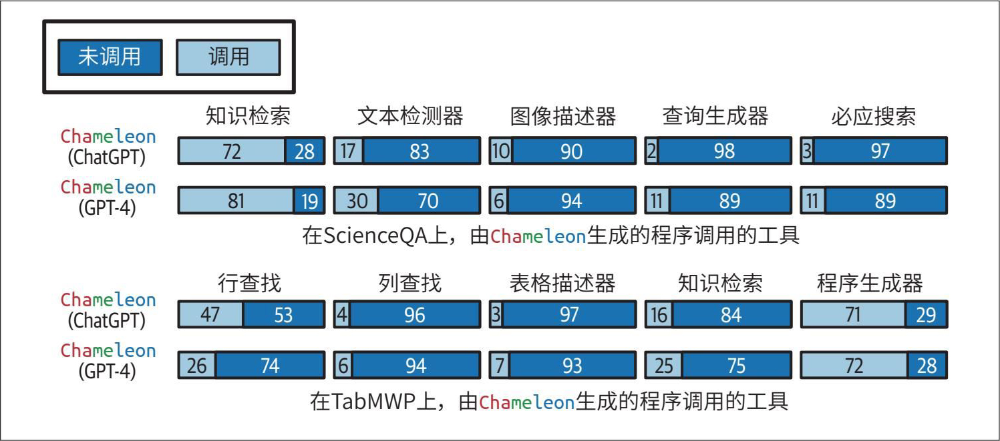

> **圖片描述：** 此圖展示了Chameleon研究中不同模型在ScienceQA和TabMWP任務上的工具使用模式對比。使用水平條形圖比較ChatGPT和GPT-4對各工具的調用頻率，結果顯示不同任務和模型展現出顯著不同的工具偏好模式。

圖6-14：不同模型和任務展現出不同的工具使用模式。圖片來自Lu等（2023），改編自原始圖片（基於CC BY 4.0授權）

Lu等（2023）的實驗還揭示了以下兩點。

1. 不同任務需要不同的工具。例如，ScienceQA（科學問答任務）比TabMWP（表格數學解題任務）更依賴知識檢索工具。

2. 不同模型對工具的偏好不同。例如，相比ChatGPT，GPT-4傾向於使用更廣泛的工具；ChatGPT更偏好影像描述工具，而GPT-4則更偏好知識檢索工具。
	

> **圖片描述：** 此圖為書中的裝飾性插圖，展示一隻綠色的捲尾動物剪影，用於標示章節中的提示或注意事項。

 在評估智慧體框架時，需要考察它支援哪些規劃器和工具。不同框架可能在工具型別上各有側重。例如，AutoGPT側重社交媒體API（如Reddit、X和維基百科），而Composio則更注重企業級API（如Google Apps、GitHub和Slack）。

由於需求可能會隨時間變化，因此還需要評估擴充套件智慧體及整合新工具的難易程度。

作為人類，我們不僅透過使用現有工具提升效率，還透過組合簡單的工具創造出更強大的工具。AI能否利用初始工具來創造新工具呢？

Chameleon（Lu等，2023）提出了工具轉移（tool transition）的研究方向：在呼叫工具X之後，智慧體呼叫工具Y的機率有多大？圖6-15展示了一個工具轉移的範例。如果兩個工具經常被連續使用，它們就可以組合成一個更大的工具。如果智慧體能夠意識到這一點，它就可以自主地將初始工具組合起來，持續構建更復雜的工具。

	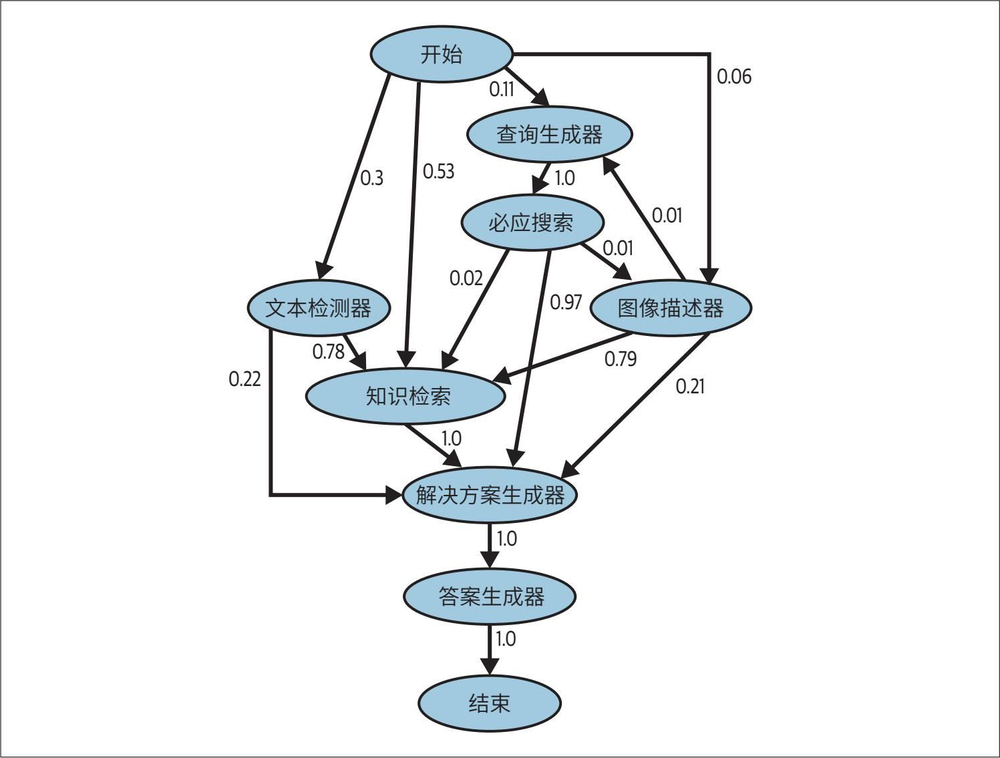

> **圖片描述：** 此圖展示了工具轉移樹（Tool Transition Tree）。有向圖中各節點代表工具（開始、查詢生成器、必應搜索、圖像描述器、文本檢測器、知識檢索、解決方案生成器、答案生成器、結束），邊上的數字表示工具間的轉移機率，揭示了智能體在解決任務時的工具調用序列模式。

圖6-15：Lu等（2023）提出的工具轉移樹。改編自原始圖片，原圖基於CC BY 4.0授權

Voyager提出了一種技能管理器（skill manager），用於追蹤智慧體新學到的技能（工具），以便日後複用（Wang等，“Voyager: An Open-Ended Embodied Agent with Large Language Models”，2023）。每個技能都是一段程式碼程式。當技能管理器判斷新建立的技能是有用的（例如成功完成了任務），就會將該技能新增到技能庫（概念上類似於工具庫）中。之後，智慧體可以從技能庫中檢索並呼叫該技能來完成其他任務。本節前面提到，智慧體在環境中的成功取決於其工具庫和規劃能力，任一方面出現問題都可能導致智慧體故障。下一節將討論智慧體的故障模式以及如何對其進行評估。

### 6.2.4 智能體的故障模式與評估

評估的目的在於發現故障。智慧體執行的任務越複雜，可能出現的故障點就越多。除了第3章和第4章討論過的所有AI應用共有的故障模式外，智慧體還有一些由規劃、工具執行和效率等因素引起的特有故障模式，其中有些模式比其他模式更容易被發現。

要評估一個智慧體，需要識別其故障模式，並統計每種故障模式發生的頻率。

為了說明這些故障模式，我建立了一個簡單的基準測試，你可以在本書的GitHub倉庫中檢視。此外，還有一些針對智慧體的基準測試和排行榜，例如Berkeley函式呼叫排行榜（Berkeley Function-Calling Leaderboard）、AgentOps評估工具集以及TravelPlanner基準測試。

**1. 規劃故障**

規劃是一項極具挑戰性的任務，可能會出現多種形式的失敗。最常見的規劃故障模式是“工具使用失敗”。智慧體生成的計劃可能包含以下一種或多種錯誤。

**無效工具**

例如，生成的計劃中呼叫了bing_search（必應搜尋），但bing_search並不在智慧體的工具庫中。

**工具有效，但參數無效**

例如，呼叫lbs_to_kg（磅轉千克）時傳入了兩個引數。lbs_to_kg雖然在工具庫中，但該工具僅需一個引數lbs。

**工具有效，但參數值錯誤**

例如，呼叫lbs_to_kg時雖然引數量正確，但數值錯誤地使用了100，而正確值應為120。

另一種常見的規劃故障模式是“目標失敗”：智慧體未能實作目標。這可能是因為計劃無法滿足任務需求，或者雖然滿足了需求，但未遵守約束條件。例如，你要求模型規劃一次從美國舊金山到越南河內的兩週旅行，預算為5000美元。智慧體可能規劃了一次從舊金山到胡志明市的旅行，或者規劃了一次從舊金山到河內的兩週旅行，但預算卻遠超限制。

在智慧體評估中，一個經常被忽略的約束是時間。在許多情況下，智慧體花費的時間並不重要，因為將任務分配給智慧體後，只需在任務完成時檢視結果即可。然而，在某些場景下，智慧體的價值會隨時間推移而降低。例如，你要求智慧體準備一份資助申請，但智慧體在申請截止日期之後才完成，那便沒什麼實際價值了。

一種有趣的規劃故障模式源於“反思錯誤”：智慧體確信自己已經完成了任務，但實際上並未完成。例如，你要求智慧體將50個人分配到30個酒店房間中，智慧體可能只分配了40個人，卻堅稱任務已經完成。

為了評估智慧體在規劃方面的故障表現，可以建立一個規劃資料集，其中每個樣本都是一個二元組（任務，工具清單）。對於每個任務，使用智慧體生成若干個計劃，並計算以下指標。

1. 在生成的所有計劃中，有多少是有效的？

2. 對於給定的任務，智慧體平均需要生成多少個計劃才能得到一個有效計劃？

3. 在所有工具呼叫中，有多少是有效的？

4. 無效工具被呼叫的頻率是多少？

5. 有效工具被以無效引數呼叫的頻率是多少？

6. 有效工具被以錯誤引數值呼叫的頻率是多少？

分析智慧體的輸出以尋找規律：智慧體在哪些型別的任務上更容易失敗？能否提出假設解釋原因？智慧體經常在哪些工具上犯錯？如果某些工具對智慧體來說難以駕馭，可以透過最佳化提示詞、提供更豐富的範例或進行微調來改進。如果這些方法都無效，可能需要考慮用更易用的工具替代。

**2. 工具故障**

工具故障是指使用了正確的工具，但工具輸出錯誤的情況。一種情況是工具直接給出了錯誤的輸出。例如，一個影像描述工具返回了錯誤的描述，或者一個SQL查詢生成器生成了錯誤的SQL查詢語句。

如果智慧體只生成宏觀計劃，並依賴翻譯模組將動作轉換為可執行命令，那麼翻譯模組的錯誤也會導致故障。

工具故障也可能是因為智慧體無法訪問完成任務所需的正確工具。一個明顯的例子是，任務涉及從網際網路上獲取當前股票價格，而智慧體卻沒有網際網路訪問許可權。

工具故障取決於具體工具，每個工具都需要獨立測試。務必列印出每次工具呼叫及其輸出，以便進行檢查和評估。如果你使用了翻譯器，請建立基準測試來評估它。

檢測缺失工具導致的故障需要你瞭解在相應的任務中本來應該使用哪些工具。如果你的智慧體經常在某個特定領域失敗，可能是因為它缺乏該領域的工具。建議與人類領域專家 合作，觀察他們在處理類似任務時的工具使用情況。

**3. 效率故障**

智慧體即使能使用正確的工具生成有效的計劃並完成任務，效率也可能不高。評估效率時可關注以下幾點。

·智慧體平均需要多少步才能完成一個任務？

·智慧體完成一個任務的平均成本是多少？

·每個動作通常需要多長時間？是否存在特別耗時或昂貴的動作？

你可以將這些指標與基準進行比較，基準可以是另一個智慧體或人類操作者。在將AI智慧體與人類進行比較時，請記住人類和AI的操作方式差異很大，因此對人類來說高效的操作可能對AI來說效率低下，反之亦然。例如，訪問100個網頁對一次只能檢視一個頁面的人類來說可能效率低下，但對能併發訪問所有網頁的AI智慧體來說卻是輕而易舉的。

在本章中，我們詳細討論了RAG和智慧體系統的工作原理。這兩種模式通常都涉及處理超出模型上下文限制的資訊。引入記憶系統來補充模型上下文，可以顯著提升模型處理資訊的能力。接下來，我們將探討記憶系統的工作方式。

## 6.3 記憶

記憶是指模型保留和利用資訊的機制。記憶系統對於知識密集型應用（如RAG）和多步驟應用（如智慧體）尤為重要。RAG系統依靠記憶來擴充套件上下文，隨著資訊的檢索，上下文可能在多輪互動中不斷增長。智慧體系統需要記憶來儲存指令、範例、上下文、工具清單、計劃、工具輸出、反思等內容。雖然RAG和智慧體對記憶的需求更為迫切，但對於任何需要保留資訊的AI應用來說，記憶都是有益的。

AI模型通常具備以下三種主要的記憶機制。

**內部知識**

模型本身即是一種記憶機制，因為它保留了訓練資料中的知識。這些知識構成了模型的內部知識。除非模型本身更新，否則內部知識不會發生變化。模型在處理所有查詢時均可訪問這些知識。

**短期記憶**

模型的上下文也是一種記憶機制。對話中的歷史訊息可被新增到模型的上下文中，使模型能利用這些資訊生成後續響應。模型的上下文可視為短期記憶，因為它不會在不同的任務（查詢）間持久存在。短期記憶訪問速度快，但容量有限，通常用於儲存當前任務最關鍵的資訊。

**長期記憶**

模型透過檢索訪問的外部資料來源（例如RAG系統）同樣是一種記憶機制。這可視為模型的長期記憶，因為它能在不同的任務間持久存在。與內部知識不同，長期記憶中的資訊可以在不更新模型的情況下進行刪除。

人類也擁有類似的記憶機制。例如，如何呼吸屬於內部知識，除非遇到嚴重問題，通常不會遺忘。短期記憶包含與當前活動直接相關的資訊，比如剛認識的人的名字。長期記憶則透過書籍、電腦、筆記等工具得到擴充套件。

選擇哪種記憶機制來儲存資料，取決於資料的使用頻率。所有任務都必需的資訊應透過訓練或微調納入模型的內部知識；查閱頻率較低的資訊應儲存在長期記憶中；短期記憶則用於儲存即時的、特定於上下文的資訊。這三種記憶機制如圖6-16所示。

	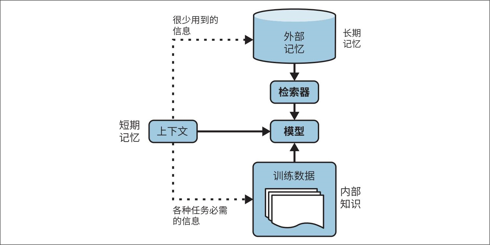

> **圖片描述：** 此圖展示了智能體的三種記憶機制層次結構：（1）長期記憶——外部記憶圓柱體透過檢索器連接模型，儲存不常用資訊；（2）短期記憶——上下文方塊直接連接模型，儲存當前對話資訊；（3）內部知識——訓練資料連接模型，代表模型透過訓練獲得的知識。三種機制協同工作為模型提供不同層次的資訊支援。

圖6-16：三種記憶機制：智慧體的資訊層次結構

記憶對於人類至關重要。隨著AI應用的發展，開發人員很快意識到記憶對AI模型同樣重要。許多針對AI模型的記憶管理工具應運而生，眾多模型提供商也已整合了外部記憶系統。為AI模型引入記憶系統好處很多，以下僅列舉其中幾個。

**管理會話中的信息溢出**

智慧體在執行任務的過程中會獲取大量新資訊，這些資訊可能超出智慧體的上下文長度限制。溢位的資訊可以儲存在長期記憶系統中。

**在會話之間保持信息**

如果每次尋求AI教練的建議時，都需要重新講述你的全部經歷，體驗就會非常糟糕。如果AI助手總是忘記你的偏好，使用起來也會非常煩人。訪問對話歷史可以讓AI根據你的情況個性化其動作。例如，當你請求圖書推薦時，如果模型記得你曾表示非常喜歡《三體》，它就可以推薦類似的圖書。

**提升模型的一致性**

假設你兩次問我同一個主觀問題，比如讓模型給一個笑話打分，如果我記得之前的回答，就更可能給出一致的答案。同樣，如果AI模型能夠參考之前的回答，它就能調整未來的回答，使其保持一致。

**保持資料結構的完整性**

由於文字本質上是非結構化的，因此基於文字模型上下文儲存的資料也是非結構化的。你可以將結構化資料放入上下文中，例如逐行輸入一個表格，但無法保證模型能理解這是一個表格。如果擁有一個能夠儲存結構化資料的記憶系統，就能幫助智慧體保持資料結構的完整性。例如，你要求智慧體尋找潛在的銷售線索，智慧體可以利用Excel表格來儲存這些線索。智慧體還可以利用佇列來儲存待執行的動作序列。

AI模型的記憶系統通常包含以下兩項功能。

·記憶管理：管理哪些資訊應該儲存在短期記憶和長期記憶中。

·記憶檢索：從長期記憶中檢索與任務相關的資訊。

記憶檢索類似於RAG檢索，因為長期記憶是一種外部資料來源。在本節中，我將重點介紹記憶管理。記憶管理通常包括兩個操作：**添加**記憶和**刪除**記憶。如果儲存空間無限，或許無須執行刪除操作。這種情況更適用於長期記憶，因為外部儲存相對廉價且易於擴充套件。然而，短期記憶受限於模型的最大上下文長度，因此需要制定策略來決定新增和刪除哪些資訊。

長期記憶可用於儲存短期記憶中溢位的資訊。具體操作取決於希望為短期記憶分配多少空間。對於給定的查詢，輸入模型的上下文包括短期記憶以及從長期記憶中檢索到的資訊。因此，一個模型的短期記憶容量取決於上下文中有多少空間需要分配給從長期記憶中檢索到的資訊。例如，若預留了30%的上下文空間給檢索內容，那麼模型最多隻能使用上下文限制的70%作為短期記憶。當達到這一閾值時，溢位的資訊可以轉移到長期記憶中。

與本章此前討論的許多元件類似，記憶管理並非AI應用所獨有，它一直是所有資料系統的基石。業界已經開發出許多策略來高效地利用記憶。

- 對於人類對話而言，如果最初幾條訊息只是寒暄，情況可能恰恰相反。

- 基於使用頻率的策略（例如刪除最少使用的資訊）更具挑戰性，因為需要一種方法來判定模型何時使用了某條資訊。

最簡單的策略是FIFO（first in first out，先進先出）。最先加入短期記憶的資訊將最先被移至外部儲存。當對話變長時，像OpenAI這樣的API提供商可能會開始移除對話開頭的訊息。像LangChain這樣的框架則允許保留最近的N*條訊息或最近的*N*個token。在長對話中，這種策略假設早期的訊息與當前的討論相關性較低。然而，這種假設可能存在嚴重的偏差。在某些對話中，最早的訊息可能包含最多的關鍵資訊，尤其是當早期訊息明確了對話目的時。FIFO策略雖然實作簡單，但可能導致模型丟失重要資訊。

更復雜的策略涉及去除冗餘。人類語言中包含冗餘，這有助於增強清晰度並避免誤解。如果能自動檢測冗餘資訊，記憶佔用將顯著減少。

去除冗餘的一種方法是利用對話摘要，摘要可透過相同或不同的模型生成。摘要若與命名實體追蹤相結合，往往能取得不錯的效果。Bae等在此基礎上更進一步，在獲得摘要後，致力於將原有記憶與摘要遺漏的關鍵資訊結合，構建新的記憶。為此，他們開發了一個分類器，針對記憶中的每個句子和摘要中的每個句子，判斷是僅將其中之一加入新記憶、兩者都加入、還是兩者皆不加入（“Keep Me Updated! Memory Management in Long-term Conversations”，2022）。

Liu等採用了一種反思方法（“Think-in-Memory: Recalling and Post-thinking Enable LLMs with Long-Term Memory”，2023），在每次執行動作之後，他們要求智慧體完成以下兩項任務。

1. 對剛剛生成的資訊進行反思。

2. 判斷這些新資訊應該插入記憶、與現有記憶合併，還是替換其他資訊，尤其是當舊資訊已經過時並與新資訊衝突時。

面對相互矛盾的資訊，有的策略選擇保留最新資訊，有的策略則要求AI模型判斷保留哪一個。如何處理矛盾取決於具體的應用場景。矛盾的存在可能會導致智慧體產生困惑，但也可能促使智慧體從不同視角進行思考。

## 6.4 小結

鑑於RAG的流行和智慧體展現出的潛力，早期讀者回饋這是他們最感興趣的一章。

本章首先介紹了RAG，這是兩者中較早出現的模式。許多工需要大量的背景知識，其規模通常超出了模型的上下文視窗大小。例如，程式碼輔助工具可能需要訪問整個程式碼庫，研究助手可能需要分析多本圖書。RAG最初是為了解決模型上下文長度限制而開發的，在提高資訊利用效率的同時，也提升了響應質量並降低了成本。在基礎模型出現的早期，人們便意識到RAG模式在廣泛應用中的巨大價值，隨後RAG迅速被消費者和企業級應用所採納。

RAG採用了一種兩步流程：首先從外部記憶中檢索相關資訊，然後利用這些資訊生成更準確的響應。RAG系統的成敗取決於其檢索器的質量。基於詞項的檢索器（如Elasticsearch和BM25）實作起來更為輕量，並且可以提供較強的基準效能。基於嵌入的檢索器計算量較大，但有潛力超越基於詞項的檢索器。

基於嵌入的檢索依靠向量搜尋實作，而向量搜尋也是許多核心網際網路應用（如搜尋和推薦系統）的基礎。為這些應用開發的許多向量搜尋演演算法同樣適用於RAG。

可將RAG模式視為一種特殊的智慧體，其中檢索器是模型可以使用的一種工具。這兩種模式都允許模型繞過上下文長度限制，並保持資訊的時效性，但智慧體的能力遠不止於此。智慧體由其所處的環境和可使用的工具定義。在AI驅動的智慧體中，AI充當規劃者，分析給定任務，權衡不同方案並選擇最優解。複雜的任務可能需要多個步驟才能解決，這就要求模型具備強大的規劃能力。透過反思和記憶系統，模型的規劃能力可得到進一步增強，從而幫助其追蹤任務進展。

賦予模型的工具越多，模型的能力就越強，從而能夠解決更具挑戰性的任務。然而，智慧體的自動化程度越高，發生故障造成的後果可能就越嚴重。工具的使用使智慧體面臨諸多安全風險，這些風險已經在第5章中討論過了。為了確保智慧體在現實世界中正常執行，必須實施嚴格的防禦機制。

RAG和智慧體都需要處理大量資訊，這些資訊量通常會超過底層模型的最大上下文長度。因此，需要引入記憶系統來管理和利用模型掌握的所有資訊。本章最後將簡要討論這一元件的具體形式。

RAG和智慧體都是基於提示詞的方法，因為它們僅透過輸入來影響模型的效果，而不修改模型本身。儘管這類方法已經能夠支撐許多卓越的應用，但修改底層模型可以帶來更多可能性。如何修改模型將是下一章的主題。