# 第7章 微調

微調是指透過進一步訓練整個模型或其中的一部分，使模型適應特定任務的過程。第5章和第6章討論了基於提示詞的方法，即透過提示詞、上下文和工具來引導模型，而微調則是透過調整模型權重來實作模型的適配。

微調可以從多方面最佳化模型：既能提高模型在特定領域（如程式設計或醫療問答）的能力，也能增強模型的安全性。但微調最常見的用途是提高模型遵循指令的能力，尤其是確保模型的輸出符合特定的風格和格式。

雖然微調有助於構建更符合使用者需求的定製化模型，但這通常需要更多的前期投入。我經常聽到這樣的問題：什麼時候應該進行微調？什麼時候應該使用RAG？本章先對微調進行概述，然後討論微調與否的理由，並提供一個簡單的框架，幫助你在微調和其他方法之間做出選擇。

與基於提示詞的方法相比，微調會佔用更多的記憶體。鑑於當前基礎模型的規模，直接進行微調所需的記憶體往往超過單塊GPU的容量。這使得微調成本高昂且實施困難。正如本章所討論的，降低記憶體需求是許多微調技術的主要動機之一。7.3節將專門介紹影響模型記憶體佔用的因素，這對於理解微調技術非常重要。

在微調領域中，PEFT（parameter-efficient finetuning，引數高效微調）已成為佔據主導地位的記憶體最佳化方法。本章將探討PEFT及其與傳統微調的區別，並概述其不斷演進的技術，重點關注一種極具吸引力的“基於介面卡（adapter）”技術。

瞭解機器學習模型的內部運作機制有助於使用基於提示詞的方法，但這並非必須。然而，微調屬於模型訓練範疇，因此你需要具備一定的機器學習知識。機器學習的基礎知識超出了本書的範圍，如果你想快速回顧相關內容，可以訪問本書的GitHub倉庫提供的資源連結。本章將介紹一些與微調直接相關的核心概念。

這一章對我來說是技術上最具挑戰性的一章，並非因為概念複雜，而是因為涉及的範圍非常廣泛。因此，閱讀起來也會有一定難度。如果你覺得陷入了與自身工作無關的細節，可以隨時跳過這些內容。

我們有很多內容要討論，現在就開始吧！

## 7.1 微調概述
微調始於一個**基座模型**（base model），這個模型已具備目標任務所需的部分能力。微調的目標是讓這個模型在特定任務中的表現更好。

微調是實作**遷移學習**（transfer learning）的一種方式。遷移學習這一概念最早由Bozinovski和Fulgosi於1976年在論文“The Influence of Pattern Similarity and Transfer of Learning upon Training of a Base Perceptron B2”中提出。遷移學習關注的是如何將從一個任務中獲得的知識遷移到新的相關任務中，以加快在新任務中的學習速度。這在概念上類似於人類技能的遷移，例如會彈鋼琴的人學習其他樂器往往更容易。

在遷移學習領域，早期的一個大規模成功案例是谷歌的多語言神經機器翻譯系統（Johnson等，“Google's Multilingual Neural Machine Translation System: Enabling Zero-ShotTranslation”，2016）。該模型將從葡萄牙語-英語和英語-西班牙語翻譯任務中學到的知識遷移到葡萄牙語-西班牙語翻譯任務中，即使訓練資料中並沒有葡萄牙語-西班牙語的翻譯示例。

自深度學習興起之初，遷移學習就為訓練資料有限或成本高昂的任務提供瞭解決方案。它的核心思想是，先在資料充足的任務上訓練基座模型，再將知識遷移到目標任務中。

LLM從文字補全（擁有海量資料的任務）預訓練中獲得的知識可以遷移到法律問答、文字轉SQL等資料稀缺的專業任務中。這種遷移學習的能力是基礎模型的核心價值。

遷移學習提高了**樣本效率**（sample efficiency），使模型能透過更少的樣本達到相同的效果。一個**樣本高效**（sample-efficient）的模型能有效地從較少的樣本中學習。例如，從頭開始訓練一個法律問答模型可能需要幾百萬個樣本，而基於一個優秀的基座模型進行微調可能只需要幾百個樣本。

在理想情況下，模型需要學習的大部分知識已經存在於基座模型中，微調只是進一步最佳化模型的行為。OpenAI在關於InstructGPT的論文“Training Language Models to Follow Instructions with Human Feedback”中提出，可以將微調視為解鎖模型已有，但使用者僅憑提示工程難以訪問的能力。

 微調並不是實作遷移學習的唯一方法，另一種方法是基於特徵的遷移。這種方法先訓練一個模型從資料中提取特徵，通常以嵌入向量的形式呈現，然後將這些特徵供另一個模型使用。在第2章中，我簡要提到了基於特徵的遷移，討論瞭如何透過新增分類器頭將基礎模型的部分能力重新用於分類任務。

基於特徵的遷移在電腦視覺領域非常常見。例如，2015—2019年，許多人使用在ImageNet資料集上訓練的模型從影像中提取特徵，並將這些特徵用於其他電腦視覺任務，如目標檢測或影像分割。

微調是模型訓練過程的一部分，也是模型預訓練的延續。由於預訓練之後的訓練通常被歸為微調，因此微調的形式多樣。第2章已經討論了兩種微調方式：監督微調和偏好微調。我們快速回顧一下這些方法及其應用開發要點。

模型的訓練始於**預訓練**，通常採用自監督學習的方式進行。自監督學習使模型能夠從大量未標註的資料中學習。對於語言模型，自監督資料通常只是不需要人工標註的**文本序列**。

在使用成本較高的特定任務資料對預訓練模型進行微調之前，我們可以先利用成本較低的任務相關資料，透過自監督學習進行微調。例如，要微調一個用於法律問答的模型，在使用昂貴的帶標註（問題，答案）資料進行微調之前，可以先用原始法律文件進行微調。同樣，要微調一個越南語圖書摘要生成模型，可以先在大量越南語文字上進行微調。這種**自監督微調**（self-supervised finetuning）也被稱為**繼續預訓練**（continued pre-training）。

如第1章所述，語言模型可以分為自迴歸語言模型和掩碼語言模型。自迴歸語言模型使用前序token作為上下文來預測下一個token。掩碼語言模型則使用被掩蓋位置前後的token來填空。類似地，在監督微調中，也可以微調模型來預測下一個token，即填空。以填空的形式進行的微調也稱為**填充式微調**（infilling finetuning），特別適用於文字編輯和程式碼除錯等任務。即使模型最初是以自迴歸方式預訓練的，也可以對其進行填充式微調。

模型在自監督學習過程中可以從海量資料中學習，從而獲得對世界的豐富理解，但使用者可能難以提取這些知識用於自己的任務，或者模型的行為可能與人類偏好不一致。監督微調則使用高質量的標註資料進一步最佳化模型，使其更符合人類的使用方式和偏好。

在**監督微調**過程中，模型使用（輸入，輸出）對進行訓練：輸入可以是一條指令，輸出則是一個響應。響應可以是開放式的，例如圖書摘要任務；也可以是封閉式的，例如分類任務。高質量的指令資料往往難以建立且成本高昂，尤其是需要保證事實一致性、領域專業性或政治正確性的指令。第8章將討論如何獲取指令資料。

我們也可以透過強化學習對模型進行微調，以生成最符合人類偏好的響應。偏好微調需要比較資料，這些資料通常採用（提示詞，勝出響應，落敗響應）的格式。

透過微調來擴充套件模型的上下文長度在技術上是可行的。**長上下文微調**（long-context finetuning）通常需要修改模型的架構，例如調整位置嵌入。較長的序列意味著token有更多可能的位置，而位置嵌入必須能夠處理這些位置。與其他微調技術相比，長上下文微調的實作難度較大，且可能導致處理短序列時效能下降。

圖7-1展示了從基座模型Llama 2開始，利用不同的微調技術構建各類Code Llama模型（Rozière等，“Code Llama: Open Foundation Models for Code”，2024）的過程。透過長上下文微調，研究人員成功地將模型的最大上下文長度從4096個token增加到16,384個token，以適應更長的程式碼檔案。圖中的指令微調是指監督微調。

	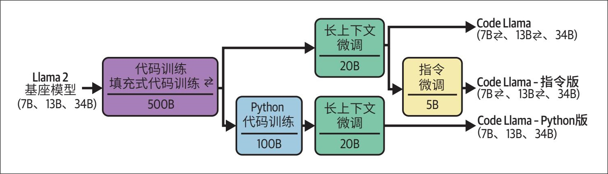

> **圖片描述：** 此流程圖展示了從 Llama 2 基座模型（7B、13B、34B）出發，透過不同微調技術構建各類 Code Llama 模型的過程。上方路徑：基座模型先經過程式碼訓練與填充式程式碼訓練（500B token），再進行長上下文微調（20B token），產出 Code Llama（7B、13B、34B）。部分模型再經指令微調（5B token）產出 Code Llama 指令版。下方路徑：基座模型先經 Python 程式碼訓練（100B token），再進行長上下文微調（20B token），產出 Code Llama Python 版（7B、13B、34B）。

圖7-1：使用不同的微調技術構建各類Code Llama模型。圖片改編自Rozière等（2024）的論文，基於CC BY 4.0授權

模型開發者和應用開發者都可以對模型進行微調。模型開發者通常會在釋出模型之前，利用不同的微調技術對模型進行後訓練，並且可能釋出多個經不同程度微調的模型版本，以便應用開發者選擇最適合自己的版本。

應用開發者可能會對一個預訓練模型進行微調，但更常見的情況是對一個已經經過後訓練的模型進行微調。模型的最佳化程度越高，其知識與特定任務越相關，應用開發者需要做的適配工作就越少。

## 7.2 何時進行微調
在著手微調之前，需審慎評估其必要性。與基於提示詞的方法相比，微調需要更多的資源，不僅包括資料和硬體資源，還包括機器學習領域的專業人才。因此，通常建議在充分嘗試提示工程之後再考慮微調。需要注意的是，微調和基於提示詞的方法並不是互斥的，在實際應用中往往需要結合使用。

### 7.2.1 進行微調的原因
微調的主要目的是提高模型的質量，包括通用能力和特定任務能力。微調的常見用途還包括引導模型輸出特定結構（如JSON或YAML格式）。

在各類基準測試中表現優異的通用模型，未必能勝任你的特定任務。若模型在你的任務領域訓練不足，使用自有資料對其進行微調將格外有效。

例如，一個開箱即用的模型可能擅長將文字轉換為標準SQL，但在處理冷門的SQL方言時表現不佳。在這種情況下，使用包含該SQL方言的資料對模型進行微調會有所幫助。同樣，如果模型在處理基於標準SQL的常規查詢時表現良好，但在處理客戶特定查詢時頻頻出錯，那麼用客戶特定查詢微調模型可能會改善效果。

微調的一個極具價值的應用場景是緩解偏見，其思路是，如果基座模型從訓練資料中繼承了某些偏見，那麼可以透過微調讓模型接觸經過精心篩選的資料來抵消這些偏見（Wang和Russakovsky，“Overwriting Pretrained Bias with Finetuning Data”，2023）。例如，某模型總是將CEO職位與男性化名字聯絡起來，那麼用包含大量女性CEO示例的資料集對其微調，就可以緩解這種偏見。Garimella等在論文“Demographic-Aware Language Model Fine tuning as a Bias Mitigation Technique”中指出，用女性作者撰寫的文字微調類BERT語言模型，可以減少性別偏見；而用非洲作者撰寫的文字微調模型，可以減少種族偏見。

雖然可以對大模型進行微調以進一步提升效能，但更常見的是對小模型進行微調。小模型資源佔用少，不僅易於微調，在生產環境中的執行成本也更低、推理速度更快。

一種常見的方法是利用大模型生成的資料微調小模型，使其模仿大模型的行為。由於這種方法將大模型的知識“提煉”到小模型中，因此被形象地稱為**蒸餾**（distillation）。第8章將結合其他資料合成技術對這種方法進行討論。

針對特定任務微調後的小模型，在該任務上的表現可能優於未經微調的超大模型。例如，Grammarly發現，微調後的Flan-T5模型（Chung等，“Scaling Instruction-Finetuned Language Models”，2022）在各類寫作輔助任務上的表現超過了專門用於文字編輯的GPT-3變體模型，儘管Flan-T5模型的規模只有GPT-3變體模型的1/60。這次微調僅使用了82,000個（指令，輸出）資料對，遠少於從頭訓練文字編輯模型通常所需的資料量。

在基礎模型的早期發展階段，最強大的模型往往是商業閉源的，微調許可權受限，且可用於微調的有競爭力的模型並不多。然而，隨著開源社群不斷湧現出各類高質量模型（適用於不同的專業領域），微調變得更加可行且具有吸引力。

### 7.2.2 不進行微調的原因
儘管微調可以在多個方面最佳化模型，但在很大程度上，許多最佳化效果也可以透過其他方式實作。微調可以提升模型的效能，但精心設計的提示詞和上下文往往也可以做到這一點。雖然微調有助於生成結構化輸出，但如第2章所述，許多其他技術也能實作這一目標。

- 有人將這種現象稱為“對齊稅”（參見Bai等在2022年發表的論文“Training a Helpful and Harmless Assistant with Reinforcement Learning from Human Feedback”），但這一術語可能會與“偏離人類偏好的懲罰”混淆。

雖然針對特定任務的微調可以提升模型在該任務上的表現，但也可能導致模型在其他任務上的效能下降。當希望模型能夠處理多樣化的提示詞時，這種情況會令人困擾。

假設你需要一個模型來處理三種型別的查詢：產品推薦、訂單修改和一般回饋。最初的模型在產品推薦和一般回饋方面表現良好，但在訂單修改方面表現較差。為解決這個問題，你使用包含訂單修改（查詢，響應）對的資料集對模型進行微調。微調後的模型可能確實在訂單修改任務上表現更好，但在另外兩個任務上的表現變差。

在這種情況下該怎麼辦呢？你可以用涵蓋關注查詢型別的資料來微調模型，而不僅僅是訂單修改資料。如果很難讓一個模型在所有任務上都表現良好，那麼可以考慮為不同任務使用單獨的模型。如果你希望將這些獨立的模型組合成一個以簡化部署和使用，也可以考慮將它們合併，本章後續部分將討論具體方法。

如果你剛啟動一個專案，通常不應該將微調作為首選方案，因為微調需要較高的前期投入和持續的維護成本。

第一，你需要資料。人工標註資料的獲取往往緩慢且成本高昂，對需要批判性思考和領域專業知識的任務來說，更是如此。雖然使用開源資料和AI生成的資料可以降低成本，但其質量參差不齊。

第二，你需要具備模型訓練的相關知識。你需要評估並選擇合適的基座模型進行微調。根據你的需求和資源，選擇可能會受到限制。雖然微調框架和API簡化了微調過程中的許多步驟，但你仍然需要理解如何調整訓練引數（如學習率、最佳化器原理）、確定資料集大小、解決過擬合或欠擬合問題，以及如何在整個過程中評估模型。

第三，你需要考慮如何部署微調後的模型。是自託管模型還是使用API服務？較大的模型（尤其是LLM）的推理最佳化並非易事（詳見第9章）。如果你已經有內部託管模型的經驗，那麼技術門檻會相對低一些。

更重要的是，你需要制定監控、維護和更新模型的策略並規劃預算。微調模型的迭代往往趕不上基座模型的進化速度。如果一個新的基座模型在特定任務上的表現優於現有微調模型的表現，那麼效能提升到什麼程度你才會考慮切換到新的基座模型？如果一個新的基座模型暫時沒有超過現有模型，但經微調後有潛力超越，你是否會嘗試對它進行實驗？

- 許多企業不願意更換它們認為“足夠好”的技術。如果所有企業都迅速採用更優的方案，傳真機早就該被淘汰了。

在許多情況下，切換到更好的模型只能帶來微小的漸進式改進，因此你的微調任務可能優先順序較低，資源會被優先分配給回報更大的專案，比如實作新的應用場景。

AI工程實驗應該從提示詞開始，並遵循第5章討論的最佳實踐。只有當使用提示詞無法滿足需求時，才應探索更高階的解決方案。請確保你已經充分測試了各種提示詞，因為模型的表現可能因提示詞的不同而有很大差異。

- 我還發現一種情況，部分工程師明知並不一定要微調，卻仍堅持要做，只因他們想學習微調的方法。作為一名熱衷學習新技能的工程師，我完全理解這種心態。然而，如果你身處管理崗位，就很難區分微調是出於真實業務需求還是個人意願了。

許多與我交流過的從業者分享了類似的經歷：有人抱怨基於提示詞的方法無效，堅持進行微調。但經過調查發現，他們對提示詞進行的實驗非常有限且缺乏系統性——指令不清晰、樣本未能反映實際資料、評估指標定義不明確。在改進實驗流程後，提示詞的質量顯著提高，完全能夠滿足他們的應用需求。

**微調領域特定任務**

我們需要警惕這樣一種觀點：認為通用模型在領域特定任務上表現不佳，因此必須針對特定任務進行微調或訓練。隨著通用模型能力的提升，它們在領域特定任務上的表現日益精進，甚至可能超越專用模型。

早期具有代表性的專用模型是彭博於2023年3月推出的BloombergGPT。當時市面上最強的一批模型都是專有模型，而彭博希望擁有一箇中等規模、在金融任務上表現良好且能夠在內部託管以處理敏感資料的模型。BloombergGPT擁有500億個引數，訓練過程耗費130萬小時的A100 GPU算力，計算成本（不含資料成本）在130萬和260萬美元之間（Wu等，“BloombergGPT: A Large Language Model for Finance”，2023）。

- 0314代表該GPT-4版本的釋出日期，即3月14日。標註具體日期十分重要，因為不同版本模型的效能差異顯著。

同月，OpenAI釋出了GPT-4 0314版本。Li等（2023）的研究（參見“Are ChatGPT and GPT-4 General-Purpose Solvers for Financial Text Analytics? A Study on Several Typical Tasks”）表明，GPT-4 0314在多個金融基準測試中的表現顯著優於BloombergGPT，表7-1展示了其中兩個基準測試的詳細結果。

表7-1：GPT-4等通用模型在金融領域的表現可能超過金融專用模型

	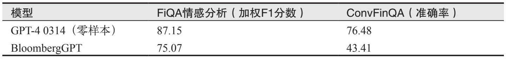

> **圖片描述：** 此表格比較 GPT-4 0314（零樣本）與 BloombergGPT 在兩項金融基準測試中的表現。FiQA 情感分析（加權 F1 分數）：GPT-4 為 87.15，BloombergGPT 為 75.07。ConvFinQA（準確率）：GPT-4 為 76.48，BloombergGPT 為 43.41。結果顯示通用模型 GPT-4 在金融任務上大幅超越專用的 BloombergGPT。

在此之後，多款效能與GPT-4相當的中等規模的模型問世，包括Claude 3.5 Sonnet、Llama 3-70B-Instruct和Qwen2-72B-Instruct。後兩者為開放權重模型，支援使用者自託管。

由於基準測試無法完全反映模型的實際應用表現，BloombergGPT可能在彭博的特定業務場景中表現尚佳。透過此次模型訓練，彭博團隊積累了寶貴經驗，有助於未來更好地開發和運營模型。

無論是微調還是提示詞實驗，都需要系統化的流程。開展提示詞實驗有助於建立評估流水線、資料標註指南和實驗追蹤規範，這些都是微調的基礎。

在**提示詞緩存**（prompt caching）技術（詳見第9章）出現之前，微調的一大優勢是能夠最佳化token用量。提示詞中包含的示例越多，模型使用的輸入token就越多，從而增加延遲和成本。用這些示例微調模型，可以避免在每段提示詞中重複包含示例，從而可以使用更簡短的提示詞，如圖7-2所示。

	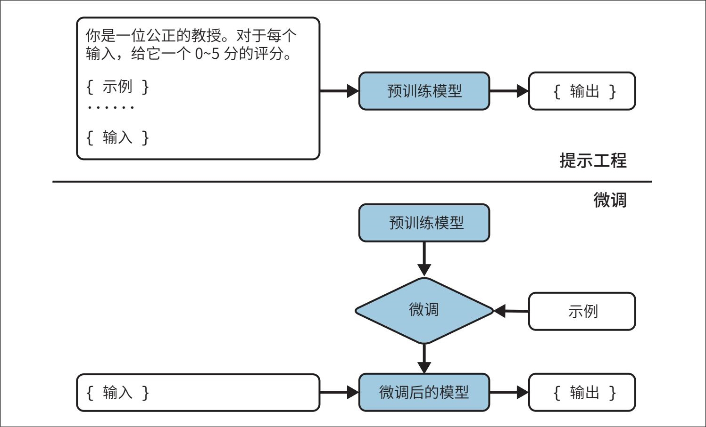

> **圖片描述：** 此圖對比提示工程與微調兩種方法。上半部分（提示工程）：將包含範例和輸入的長提示詞送入預訓練模型產生輸出。下半部分（微調）：先用範例對預訓練模型進行微調，微調後的模型只需接收簡短的輸入即可產生輸出，無需在每次提示中重複包含範例。

圖7-2：用示例微調模型，而不是在每段提示詞中包含示例

在引入提示詞快取技術後，由於可以快取重複的提示詞片段以供複用，微調的這一優勢不再明顯。然而，提示詞可包含的示例數量仍然受限於最大上下文長度，而微調則不存在示例數量的限制。

### 7.2.3 微調與RAG
當你透過提示工程充分提升了模型效能後，可能會疑惑下一步是採用RAG還是進行微調。這取決於模型面臨的問題是源於資訊缺失還是行為表現。

**如果模型因為信息缺失而表現不佳，那麼使用能夠讓模型訪問相關信息源的RAG系統可以有效解決問題。**涉及資訊的問題通常導致模型輸出的內容存在事實性錯誤或過時，以下是兩種典型場景。

**模型缺乏相關信息**

公共模型通常不包含私有資訊。當模型缺乏這些資訊時，要麼明確告知無相關資訊，要麼編造一個答案（幻覺）。

**模型的信息已經過時**

例如詢問：“Taylor Swift發行了多少張專輯？”正確答案是11張，但模型回答10張。這可能是因為模型的訓練資料截止日期早於最新專輯的發行日期。

Ovadia等（2024）在論文“Fine-Tuning or Retrieval? Comparing Knowledge Injection in LLMs”中指出，對於需要最新資訊的任務（例如涉及時事的問題），RAG的表現優於微調。不僅如此，如表7-2所示，使用基座模型的RAG系統甚至優於使用微調模型的RAG系統。這一發現表明，**盡管微調可以提升模型在特定任務上的表現，但可能會導致模型在其他方面的性能下降。**

表7-2：在Ovadia等（2024）整理的關於時事的問答任務中，RAG的表現優於微調。FT-reg和FT-par是作者使用的兩種微調方法

	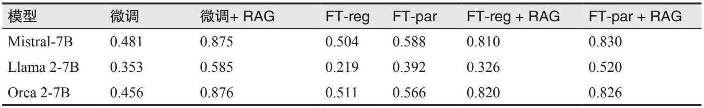

> **圖片描述：** 此表格展示在 Ovadia 等（2024）的時事問答任務中，不同方法的準確率比較。三個模型（Mistral-7B、Llama 2-7B、Orca 2-7B）分別在「微調」、「微調+RAG」、「FT-reg」、「FT-par」、「FT-reg+RAG」、「FT-par+RAG」六種配置下的表現。結果顯示「微調+RAG」在所有模型上均獲得最高分，且 RAG 的加入顯著提升了效能。

**如果模型存在行為問題，那麼微調可能更有效。**行為問題的一種表現是模型輸出的內容雖然事實正確，但與任務要求不符。例如，你要求模型生成軟體專案的技術規格說明，以提供給工程團隊。雖然模型生成的規格說明準確無誤，但缺乏團隊所需的具體細節。在這種情況下，使用定義明確的技術規格資料對模型進行微調，可以提高輸出內容的相關性。

行為問題的另一種表現是模型未能遵循預期的輸出格式。例如，你要求模型編寫HTML程式碼，但模型生成的程式碼存在語法錯誤。這可能是因為模型在訓練資料中見過的HTML程式碼不足。在微調過程中讓模型接觸更多的HTML程式碼，可以糾正這一問題。

語義解析任務成功與否，取決於模型能否以預期格式生成輸出，因此通常需要進行微調。第2章和第6章對語義解析進行了簡要討論。在此提醒一下，語義解析是指將自然語言轉換為結構化格式（如JSON）。效能強大的現有模型通常能很好地處理常見的、較簡單的語法格式，如JSON、YAML和正規表示式。然而，對於網際網路上示例較少的語法格式（例如某個不太流行的工具的領域特定語言或複雜的語法格式），模型的表現可能不盡如人意。

- 一些研究人員（如“The Llama 3 Herd of Models”的作者Grattafiori等）堅持這樣一個原則：後訓練階段的目標應該是讓模型瞭解自己知道什麼，而不是為其增添知識。

**簡而言之，RAG關注事實，而微調關注形式。**RAG系統為模型提供外部知識，以構建更準確、資訊更豐富的答案，有助於減少模型的幻覺問題。微調則幫助模型理解並遵循特定的語法規則和風格。如果使用足夠多的高質量資料進行微調，可能會減少幻覺，但如果資料質量較差，微調反而可能加劇幻覺問題。

如果你的模型同時存在資訊和行為方面的問題，建議先從RAG入手。通常來說，RAG更容易實作，因為你無須考慮如何篩選訓練資料或託管微調後的模型。在實施RAG時，應首先嚐試基於詞項的簡單檢索方法（如BM25），而不是直接使用需要向量資料庫的複雜方案。

此外，RAG帶來的效能提升通常比微調帶來的效能提升更顯著。Ovadia等（2024）的研究表明，在MMLU基準測試（Hendrycks等，“Measuring Massive Multitask Language Understanding”，2021）的幾乎所有問題類別中，對於Mistral-7B、Llama 2-7B和Orca 2-7B這三種模型，RAG的表現都優於微調。

然而，RAG和微調並非互斥的，有時可以結合使用，以最大限度地提升應用的效能。在同一個實驗中，Ovadia等（2024）的研究（參見“Fine-Tuning or Retrieval? Comparing Knowledge Injection in LLMs”）表明，在微調模型的基礎上加入RAG，能夠在43%的情況下最佳化模型在MMLU基準測試中的表現。但值得注意的是，在該實驗中，與單獨使用RAG相比，結合使用微調和RAG在57%的情況下並未提升模型的效能。

適用於所有應用的通用工作流程並不存在。圖7-3展示了在應用開發過程中可能採取的一些路徑。箭頭標識了可嘗試的後續步驟。該流程圖的設計靈感來自OpenAI在2023年公佈的一個示例工作流程。

	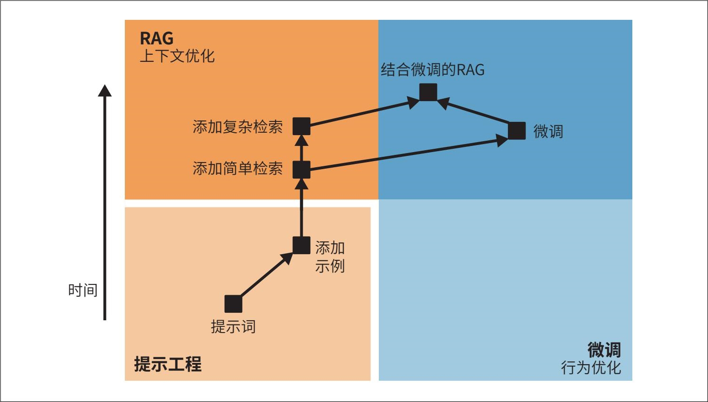

> **圖片描述：** 此流程圖展示應用開發的決策路徑。圖分為兩個區域：左側橙色區域為「提示工程」，右側藍色區域為「微調（行為最佳化）」，上方區域為「RAG（上下文最佳化）」。從提示詞出發，依序可嘗試新增範例、新增簡單檢索、新增複雜檢索（RAG 路徑）或微調（微調路徑），最終可結合微調與 RAG。箭頭標示了各步驟之間的可能進階方向。

圖7-3：應用開發流程示例。在簡單檢索（如基於詞項的檢索）之後，嘗試進行復雜檢索（如混合搜尋）還是微調，取決於具體應用及其故障模式

因此，將模型適配到任務的工作流程可能如下所示。注意，在進行任何適配步驟之前，你應當定義評估標準並設計評估流水線（如第4章所述）。該評估流水線將作為衡量進展的基準。評估並非僅在開始時進行，而應貫穿整個開發過程。

1. 嘗試僅透過提示詞讓模型完成任務。使用第5章介紹的提示工程最佳實踐，包括對提示詞進行系統性的版本管理。

2. 在提示詞中新增更多示例。根據具體應用場景，所需示例數量可能在1和50個之間。

3. 如果你的模型因缺乏資訊頻繁失敗，可以將其連線到相關資料來源。開始使用RAG時，先嚐試一些基本的檢索方法，如基於詞項的檢索。即使是簡單的檢索，新增相關且準確的知識也能在一定程度上提升模型的效能。

4. 根據模型的故障模式，你可以考慮下一步採取以下措施。

a. 如果模型仍然頻繁出現與資訊相關的問題，你可以嘗試使用更高階的RAG方法，例如基於嵌入的檢索。

b. 如果模型仍然存在行為問題，比如持續生成無關、不規範或不安全的響應，你可以選擇進行微調。基於嵌入的檢索會在推理過程中引入額外的元件，從而增加推理的複雜性；而微調會增加模型開發的複雜性，但不會改變推理過程。

5. 結合使用RAG和微調，可以進一步提升模型的效能。

如果在權衡微調和其他替代技術的利弊後，你決定對模型進行微調，那麼本章接下來的內容將為你提供相關指導。我們先來看看微調的首要挑戰——記憶體瓶頸。

## 7.3 內存瓶頸
由於微調對記憶體的需求較高，因此許多微調技術旨在減少記憶體佔用。要理解這些技術為何有效及如何運作，需要先了解造成記憶體瓶頸的原因，這也能幫助你選擇最適合自己的微調方法。

除了解釋微調的記憶體瓶頸，本節還將介紹一些簡易計算公式，幫助你快速估算各個模型的記憶體使用情況。這種估算有助於你判斷部署或微調模型所需的硬體配置。

由於記憶體估算涉及對底層機器學習和計算概念的詳細分析，因此本節包含大量技術細節。如果你已經熟悉這些概念，可以直接跳過。

**理解內存瓶頸的核心要點**

如果你決定跳過本節，可以速覽以下核心要點。如果你對其中任何一個要點感到陌生，本節的內容能幫助你理解。

1. 由於基礎模型的規模龐大，記憶體成為制約其應用的主要瓶頸，無論是在推理階段還是微調階段都是如此。微調因涉及神經網路訓練，所需的記憶體通常遠高於推理所需的記憶體。

2. 在微調過程中，影響模型記憶體佔用的主要因素包括模型引數量、可訓練引數量及數值表示精度。

3. 可訓練引數量越多，記憶體佔用越多。你可以透過減少可訓練引數量來降低微調的記憶體需求，這正是PEFT的設計初衷。

- 為簡化估算，本書採用1000作為單位換算係數。

4. 量化是指將模型從高位寬表示轉換為低位寬表示，是一種直接且高效的減少模型記憶體佔用的方法。以一個擁有130億個引數的模型為例，使用FP32意味著每個權重需要4位元組，總共需要52 GB記憶體。如果能將每個數值減少到僅需2位元組，那麼所需的記憶體將降至26 GB。

5. 推理通常使用儘可能低的位寬，例如16位、8位，甚至4位。

6. 訓練對數值精度更加敏感，因此在較低精度下訓練模型更為困難。訓練通常採用混合精度模式，即部分操作使用較高精度（如32位），部分操作使用較低精度（如16位或8位）。

### 7.3.1 反向傳播與可訓練參數
在微調過程中，決定模型記憶體佔用的一個關鍵因素是**可訓練參數**（trainable parameter）的數量。可訓練引數是指在微調過程中可以更新的引數。在預訓練階段，所有模型引數都會更新；在推理階段，沒有任何模型引數會更新；而在微調階段，部分或全部模型引數可能會更新。保持不變的引數稱為**凍結參數**（frozen parameter）。

- 除了反向傳播，進化策略是訓練神經網路的一種頗具前景的方法。例如，Maheswaranathan等（2019）提出，將隨機搜尋與替代梯度相結合，而不是使用真實梯度來更新模型權重（參見“Guided Evolutionary Strategies: Augmenting Random Search with Surrogate Gradients”）。另一種有趣的方法是直接回饋對齊（Arild Nøkland，“Direct Feedback Alignment Provides Learning in Deep Neural Networks”，2016）。

每個可訓練引數所需的記憶體取決於模型的訓練方式。截至本書撰寫時，神經網路通常使用一種稱為**反向傳播**（backpropagation）的機制進行訓練。使用反向傳播時，每個訓練步驟包含兩個階段。

1. 前向傳播：從輸入計算輸出的過程。

2. 反向傳播：利用前向傳播中聚合的訊號更新模型權重的過程。

推理階段只執行前向傳播，而訓練階段則同時執行前向傳播和反向傳播。反向傳播的工作原理概括如下。

1. 將前向傳播的計算輸出與預期輸出（真實標籤）進行比較。如果兩者不同，說明模型存在誤差，需要調整引數。計算輸出與預期輸出之間的差異稱為**損失**（loss）。

- 如果某個引數不可訓練，則無須更新，因此也不必計算它的梯度。

2. 計算每個可訓練引數對誤差的貢獻程度，這個值稱為**梯度**（gradient）。從數學上講，梯度是透過求解損失函式對每個可訓練引數的導數得到的。每個可訓練引數都對應一個梯度。如果某個引數的梯度較大，說明它對損失的貢獻較大，需要更大的調整。

3. 根據各個可訓練引數對應的梯度調整引數。每個引數的調整幅度取決於**優化器**（optimizer）。常見的最佳化器包括SGD（stochastic gradient descent，隨機梯度下降）和Adam。對基於Transformer的模型來說，Adam是目前應用最廣泛的最佳化器。

圖7-4展示了一個示例神經網路（包含三個引數和一個非線性啟用函式）的前向傳播和反向傳播過程。以這個簡單的神經網路為例是為了簡化視覺化效果。

	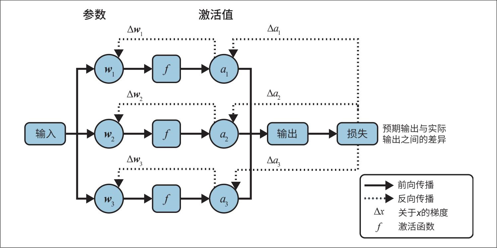

> **圖片描述：** 此圖展示一個簡單神經網路的前向傳播與反向傳播過程。網路包含三個參數（w1、w2、w3），每個參數後接非線性啟用函式 f，產生啟用值（a1、a2、a3）。輸入經前向傳播（實線箭頭）計算出輸出，再與預期輸出比較計算損失。反向傳播（虛線箭頭）沿相反方向計算各參數的梯度（Δw1、Δw2、Δw3）和啟用值的梯度（Δa1、Δa2、Δa3）。

圖7-4：一個簡單神經網路的前向傳播和反向傳播過程

在反向傳播過程中，每個可訓練引數都需要儲存一些額外的值，包括梯度和最佳化器狀態。因此，可訓練引數越多，儲存這些額外值所需的記憶體也就越多。

### 7.3.2 內存計算
瞭解模型所需的記憶體有助於你選擇合適的硬體。在通常情況下，你可能已經擁有硬體，需要評估其是否有足夠的記憶體來執行某個模型。如果一個模型的推理需要30 GB記憶體，那麼只有24 GB記憶體的晶片就無法滿足需求。

模型的記憶體佔用取決於模型本身、工作負載和用於減少記憶體使用的各種最佳化技術。由於難以涵蓋所有最佳化技術和工作負載，本節只給出近似計算公式，以便你大致瞭解執行一個模型（無論是推理還是訓練）所需的記憶體。
	

> **圖片描述：** 此為 O'Reilly 書籍的裝飾性插圖，描繪一隻藍紫色的烏鴉（或渡鴉）側身站立的剪影，背景為白色帶淺藍色方框。此圖為章節分隔用的裝飾圖案。

 推理階段和訓練階段的記憶體特性不同，這是第9章所討論的訓練晶片和推理晶片存在差異的原因之一。

**1. 推理所需的內存**

推理階段僅涉及前向傳播，該過程需要佔用記憶體來儲存模型權重。假設模型引數量為N*，每個引數所需的記憶體為*M*，則載入模型權重所需的記憶體為：

*N*×*M*

前向傳播還需要儲存啟用值。Transformer模型需要為注意力機制儲存鍵-值（key-value）向量。啟用值和鍵-值向量所需的記憶體隨序列長度和批次大小線性增加。

對於許多應用，可以假設啟用值和鍵-值向量所需的記憶體約為模型權重記憶體的20%。如果你的應用使用了更長的上下文或更大的批次大小，則實際所需的記憶體會更多。在此假設下，模型的記憶體佔用為：

*N*×*M*×1.2

以一個擁有130億個引數的模型為例。如果每個引數佔用2位元組，則模型權重所需的記憶體為130億×2位元組=26 GB。因此，推理所需的總記憶體為26 GB×1.2=31.2 GB。

- 有人說，直到遇到“執行時錯誤：CUDA記憶體不足”這個報錯，才算真正涉足AI領域。

- 想要了解更多關於推理記憶體計算的細節，可以參考Carol Chen於2022年3月釋出在kipply上的部落格“Transformer Inference Arithmetic”。

模型的記憶體佔用隨模型規模的增大而迅速增加。隨著模型越來越大，記憶體往往成為執行模型的瓶頸。一個擁有700億個引數的模型，如果每個引數佔用2位元組，僅權重就需要高達140 GB的記憶體。

**2. 訓練所需的內存**

在訓練模型時，你需要為模型的權重和啟用值分配記憶體，這一點前面已經討論過。此外，你還需要為梯度和最佳化器狀態分配記憶體，這部分記憶體隨可訓練引數量的增加而增加。

總體而言，訓練所需的記憶體的計算公式為：

訓練所需的記憶體=模型權重所需的記憶體+啟用值所需的記憶體+梯度所需的記憶體+最佳化器狀態所需的記憶體

	

> **圖片描述：** 此為 O'Reilly 書籍的裝飾性插圖，描繪一隻綠色的捲尾猴（或類似靈長類動物）的剪影，尾巴捲曲向上。此圖為章節分隔用的裝飾圖案。

 在反向傳播過程中，每個可訓練引數需要儲存一個梯度，且根據最佳化器的不同，還需儲存0～2個最佳化器狀態。

·普通的SGD最佳化器沒有額外狀態。

·動量最佳化器為每個可訓練引數儲存一個值。

·Adam最佳化器為每個可訓練引數儲存兩個值。

假設你使用Adam最佳化器更新一個擁有130億個引數的模型。由於每個可訓練引數需要儲存梯度和最佳化器狀態共計3個值，如果每個值佔用2位元組，則梯度和最佳化器狀態所需的記憶體為：

130億×3×2位元組=78 GB

然而，如果只有10億個可訓練引數，則梯度和最佳化器狀態所需的記憶體僅為：

10億×3×2位元組=6 GB

需要注意的是，上述公式基於啟用值記憶體小於模型權重記憶體的假設，但在實際情況中，啟用值所需的記憶體可能要大得多。如果為了計算梯度而儲存啟用值，那麼啟用值所需的記憶體可能遠遠超過模型權重所需的記憶體。圖7-5展示了在不同規模的Megatron模型中，啟用值所需記憶體與模型權重所需記憶體的對比情況，該圖引用自Korthikanti等（2022）的論文“Reducing Activation Recomputation in Large Transformer Models”。

- 想要了解更多關於計算訓練所需記憶體的細節，可參考Anthony等在2023年4月釋出於EleutherAI上的部落格“Transformer Math 101”。

減少啟用值所需記憶體的一種方法是避免儲存所有啟用值。與其儲存啟用值以供複用，不如在需要時重新計算。這種技術稱為**梯度檢查點**（gradient checkpointing）或**激活值重計算**（activation recomputation）。雖然這種方法降低了記憶體需求，但由於增加了計算量，訓練時間相應延長。

	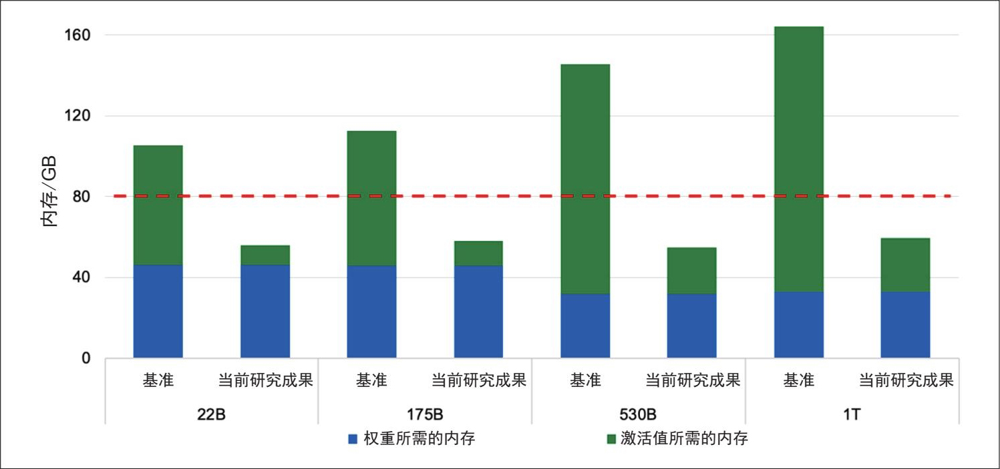

> **圖片描述：** 此長條圖比較不同規模 Megatron 模型（22B、175B、530B、1T）中權重與啟用值所需記憶體的對比。藍色區塊為權重所需記憶體，綠色區塊為啟用值所需記憶體。紅色虛線標示 80 GB 的 GPU 記憶體限制。每種規模均有「基準」和「當前研究成果」兩組資料。結果清楚顯示啟用值所需記憶體可能遠超模型權重所需記憶體，而當前研究成果有效降低了啟用值記憶體。

圖7-5：啟用值所需的記憶體可能遠遠超過模型權重所需的記憶體

### 7.3.3 數值表示
在之前的記憶體計算中，我們假設每個數值佔用2位元組記憶體。模型中每個數值所佔用的記憶體直接決定模型的整體記憶體佔用。如果將每個數值的記憶體佔用減半，模型權重所需的記憶體也會隨之減半。

在討論如何減少單個數值的記憶體佔用之前，有必要先了解數值的表示方式。神經網路中的數值通常採用浮點數表示。最常見的浮點數格式是遵循電氣電子工程師學會（IEEE）制定的浮點數運算標準（IEEE 754）的FP系列格式。

·FP32使用32位（4位元組）表示一個浮點數，這種格式稱為單精度（single precision）。

·FP64使用64位（8位元組）表示一個浮點數，這種格式稱為雙精度（double precision）。

·FP16使用16位（2位元組）表示一個浮點數，這種格式稱為半精度（half precision）。

- 谷歌將BF16稱為“Cloud TPU實作高效能的秘訣”。

儘管FP64在許多通用計算中仍是主流（截至本書撰寫時，FP64仍是NumPy和pandas的預設格式），但由於其記憶體佔用較高，在神經網路中應用甚少。相比之下，FP32和FP16更為常見。此外，BF16（BFloat16）和TF32（TensorFloat-32）在AI計算中也得到了廣泛應用。BF16由谷歌設計，用於最佳化TPU上的AI效能，而TF32則由NVIDIA設計，專用於GPU。

- 整數格式也被稱為定點（fixed point）格式。

數值也可以用整數表示。雖然目前整數表示不如浮點數表示常見，但其受關注度正日益提升。常見的整數格式包括INT8（8位整數）和INT4（4位整數）。

- 範圍位被稱為指數位，精度位被稱為有效數位。

每種浮點數格式通常使用1位表示數值的符號（正或負），其餘的位則分配給範圍和精度。

**範圍**

範圍位決定該格式能夠表示的數值區間。位數越多，能夠表示的範圍越廣。這類似於數字的位數越多，能表示的數值越大。

**精度**

精度位決定數值的精確程度。減少精度位數會降低數值的精度。例如，將10.1234轉換為僅支援兩位小數的格式，該值變為10.12，其精度比原始值的精度低。

- 通常，格式名稱末尾的數字表示其佔用的位數，但TF32實際上只有19位，而不是32位。這樣命名可能是為了暗示它與FP32的相容性。不過，為何不命名為TF19確實讓我困惑不已。我在NVIDIA的一位前同事說出了他的猜想，即人們可能對不符合常規的格式（19位）持懷疑態度，所以命名為TF32更容易被接納。

圖7-6展示了不同浮點數格式中範圍位和精度位的分配情況。

	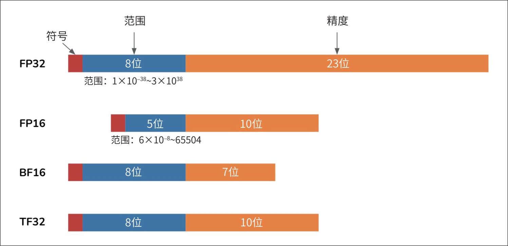

> **圖片描述：** 此圖展示不同浮點數格式的位元分配方式。每種格式均包含符號位（紅色）、範圍位（藍色）和精度位（橙色）。FP32：1 位符號 + 8 位範圍 + 23 位精度，範圍 1×10⁻³⁸ ~ 3×10³⁸。FP16：1 位符號 + 5 位範圍 + 10 位精度，範圍 6×10⁻⁸ ~ 65504。BF16：1 位符號 + 8 位範圍 + 7 位精度。TF32：1 位符號 + 8 位範圍 + 10 位精度。

圖7-6：不同浮點數格式中的範圍位和精度位

位數更多的格式通常精度更高。將高精度格式的數值轉換為低精度格式（如從FP32轉換為FP16）意味著犧牲精度。降低精度可能導致數值偏移或產生誤差。表7-3展示了將FP32格式的數值轉換為FP16、BF16和TF32格式的情況。

表7-3：從FP32轉換為低精度格式（轉換後的不精確值以斜體顯示）

	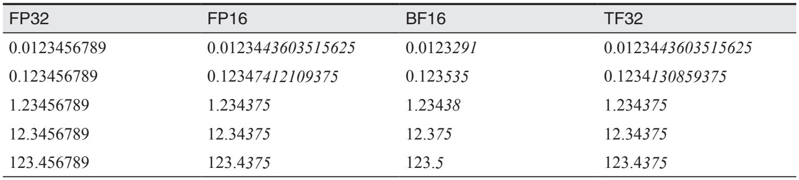

> **圖片描述：** 此表格展示 FP32 數值轉換為 FP16、BF16、TF32 格式後的精度變化（第一部分）。列出多個 FP32 原始值（如 0.0123456789、0.123456789 等）在各格式下的轉換結果，顯示不同格式造成的精度損失程度各異。

（續）

	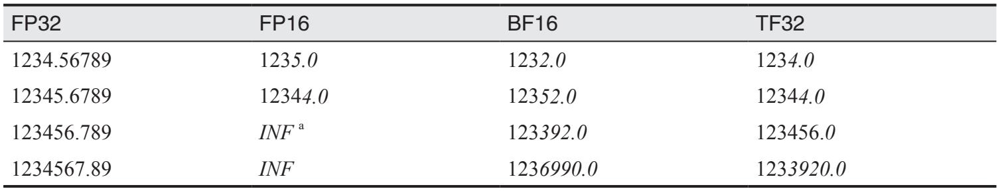

> **圖片描述：** 此表格為精度轉換表的延續（第二部分），展示較大數值的轉換情況。當數值超出 FP16 範圍時（如 123456.789、1234567.89），FP16 顯示為 INF（無窮大）。BF16 雖然不會溢位，但精度損失較大（如 1234.56789 變為 1232.0）。TF32 在大數值上保持較好的平衡。

a 超出FP16範圍的數值會被舍入為無窮大（INF）。

注意，在表7-3中，儘管BF16和FP16的總位數相同，但BF16分配給範圍的位數多於精度位數，這使得BF16能夠表示FP16無法表示的較大數值，不過這也導致BF16的精度低於FP16。例如，1234.56789在FP16中表示為1235.0（數值變化約為0.035%），而在BF16中表示為1232.0（數值變化約為0.208%）。

	

> **圖片描述：** 此為 O'Reilly 書籍的裝飾性插圖，描繪一隻橙紅色的蠍子剪影。此圖為章節分隔用的裝飾圖案。
- FP16和BF16的混淆問題在Llama 3.1上依然存在。

 在使用模型時，務必以模型預設的數值格式進行載入。如果使用了錯誤的格式，可能導致模型效能發生顯著變化。例如，Llama 2的權重採用BF16格式，但許多團隊曾錯誤地以FP16格式載入，結果發現模型質量遠低於宣傳的水平。儘管這一誤解浪費了不少時間，但也促使許多人學習與數值表示相關的知識。

- 設計數值格式是一門極具吸引力的學科。若能設計出不影響系統效能的低精度格式，將大幅降低系統成本，提升執行速度，進而催生新的應用場景。

選擇何種數值格式，取決於工作負載中的數值分佈（所需的數值範圍）、任務對數值微小變化的敏感度，以及底層硬體的支援情況。

### 7.3.4 量化
表示模型數值所需的位數越少，記憶體佔用越少。例如，一個擁有100億個引數的模型，如果使用32位格式儲存權重，則需要40 GB記憶體；但如果使用16位格式儲存，則只需20 GB。降低精度（也稱為量化）是一種低成本且極為有效的減少模型記憶體佔用的方法。這種方法實作簡單，並且適用於各種任務和架構。在機器學習領域，低精度格式通常指位數少於標準FP32的任何格式。

**量化與降低精度的區別**

嚴格來說，只有當目標格式為整數時才稱為量化。然而，在實際應用中，“量化”一詞通常泛指所有將數值轉換為更低精度格式的技術。為了與相關文獻保持一致，本書使用“量化”一詞來指代精度的降低。

進行量化時，需確定量化的物件（內容）和時機。

**量化的內容**

- 在基於Transformer的模型中，記憶體佔用的另一個主要來源是KV（鍵-值）快取，第9章將對此進行討論。

在理想情況下，應優先量化記憶體佔用最多的部分，但也需權衡量化對模型效能的影響。如7.3.2節所述，在推理階段，記憶體佔用的主要來源是模型的權重和啟用值。權重量化比啟用值量化更普遍，因為權重量化對效能的影響通常更易控，且精度損失較小。

**量化的時機**

量化可以在訓練期間或訓練後進行。**訓練後量化**（post-training quantization，PTQ）是指在模型完成全部訓練後再進行量化。PTQ是目前最主流的量化方式，對通常不參與模型訓練的AI應用開發者來說，這種方法尤為適用。

**1. 推理量化**

在深度學習的早期階段，業界通常使用32位的FP32格式訓練和部署模型。從21世紀10年代末開始，16位甚至更低精度的模型部署方式日益普及。例如，Dettmers等在這方面做出了出色的工作，他們透過LLM.int8()將LLM量化為8位（“LLM.int8(): 8-bit Matrix Multiplication for Transformers at Scale”，2022），還透過QLoRA將LLM量化為4位（“QLoRA: Efficient Finetuning of Quantized LLMs”，2023）。

你也可以採用**混合精度**的方式部署模型，即在可能的情況下降低數值精度，而在必要時保持較高精度。為了在裝置上部署模型，2024年蘋果公司採用了一種量化方案，混合使用2位和4位格式，平均每個權重僅需3.5位。同年，為了迎接4位神經網路時代的到來，NVIDIA釋出了新的GPU架構——Blackwell，支援4位浮點數的模型推理。

- 遵循所有IEEE原則的最小浮點數位數是4位。

當精度降到8位及以下時，數值表示會變得更加複雜。你可以繼續使用浮點數格式來儲存引數值，如使用FP8（8位）和FP4（4位）等**迷你浮點**（minifloat）格式，但更常見的做法是將引數值轉換為整數格式，如INT8或INT4。

- Rastegari等創辦了一家專注於模型壓縮的初創公司Xnor.ai。2020年年初，該公司被蘋果公司以2億美元收購。

量化雖然有效，但其效果存在物理極限。每個數值不可能少於1位，儘管一些研究嘗試了1位表示，例如BinaryConnect（Courbariaux等，“BinaryConnect: Training Deep Neural Networks with Binary Weights During Propagations”，2015）、XNOR-Net（Rastegari等，“XNOR-Net: ImageNet Classification Using Binary Convolutional Neural Networks”，2016）和BitNet（Wang等，“BitNet: Scaling 1-bit Transformers for Large Language Models”，2023）。

2024年，微軟研究人員（Ma等，“The Era of 1-bit LLMs: All Large Language Models are in 1.58 Bits”）宣佈，我們正進入1位LLM時代。他們推出了BitNet b1.58——一種基於Transformer的語言模型，每個引數僅需1.58位，其效能可與16位的Llama 2（Touvron等，“Llama 2: Open Foundation and Fine-Tuned Chat Models”，2023）相媲美。具體效能對比如表7-4所示。

表7-4：BitNet b1.58與Llama 2在不同基準測試和不同模型規模（最高至39億引數）下的效能對比

	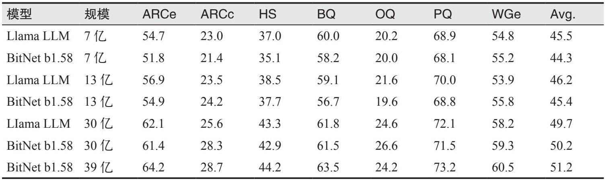

> **圖片描述：** 此表格比較 BitNet b1.58 與 Llama LLM 在不同基準測試和不同模型規模下的效能。涵蓋 7 億、13 億、30 億和 39 億參數的模型，測試包含 ARCe、ARCc、HS、BQ、OQ、PQ、WGe 等基準。結果顯示 BitNet b1.58（每個參數僅 1.58 位元）的效能可與 16 位元的 Llama 相媲美，在部分基準上甚至略優。

降低精度不僅可以減少記憶體佔用，還往往能提高計算速度。首先，它支援更大的批次大小，使模型能夠並行處理更多輸入。其次，降低精度加快了計算速度，進一步減少了推理延遲和訓練耗時。以兩個數字相加為例，假設逐位相加時每位耗時t*納秒，那麼進行32位加法運算需要32*t*納秒，而進行16位加法運算僅需16*t*納秒。然而，由於格式轉換需要額外的計算開銷，降低精度並不總是能減少延遲。

降低精度也存在缺點。每次轉換通常會導致數值發生微小變化，而微小誤差的累積可能導致效能顯著下降。如果某個數值超出了低精度格式所能表示的範圍，它可能會被轉換為無窮大或某個任意值，進而導致模型質量進一步下降。如何在儘量減少對模型效能影響的情況下降低精度，是模型開發者、硬體製造商和應用開發者積極研究的熱點。

低精度推理已經成為一種標準做法。通常先以較高精度格式對模型進行訓練，以實作最佳效能，再降低精度用於推理。主流的機器學習框架（包括PyTorch、TensorFlow和Hugging Face Transformers）都提供了只需幾行程式碼即可輕鬆實作的PTQ功能。

由於一些邊緣裝置僅支援量化推理，因此針對裝置端推理的框架（如TensorFlow Lite和PyTorch Mobile）也提供了PTQ功能。

**2. 訓練量化**

在訓練過程中進行量化目前還不像PTQ那樣普及，但正逐漸受到關注。訓練量化有兩個明確的目標。

·生成一個在低精度推理時仍能表現良好的模型。這是為了解決PTQ導致的模型效能下降問題。

·縮短訓練時間和降低訓練成本。量化可以減少模型的記憶體佔用，使我們可以在成本更低的硬體上訓練模型，或者在相同的硬體上訓練更大的模型。此外，量化還能加速計算，從而進一步降低成本。

一種量化技術可能有助於實作上述目標中的一個或兩個。

**量化感知訓練**（quantization-aware training，QAT）的目標是建立一個在低精度推理時仍能保持高質量的模型。在QAT的過程中，模型會模擬低精度（例如8位）的計算行為，學習如何在低精度下輸出高質量結果。然而，QAT並不會縮短模型的訓練時間，因為其計算仍然以高精度進行。由於需要額外模擬低精度行為，QAT甚至可能延長訓練時間。

- 在訓練過程中，模型權重透過多個步驟進行更新。微小的舍入誤差可能在訓練過程中累積，使模型難以達到理想的效能。此外，損失值的計算需要較高的精度，損失值的微小變化可能導致引數更新方向錯誤。

直接以低精度訓練模型則可以同時實作上述兩個目標。業界已有人嘗試以低精度訓練模型（Hubara等，“Quantized Neural Networks: Training Neural Networks with Low Precision Weights and Activations”，2016；Jacob等，“Quantization and Training of Neural Networks for Efficient Integer-Arithmetic-Only Inference”，2017）。Character.AI在2024年透露，他們能夠完全以INT8精度訓練模型，這不僅消除了訓練/部署與推理精度之間的不匹配問題，還顯著提高了訓練效率。然而，以低精度進行訓練更具挑戰性，因為反向傳播對精度降低更為敏感。

- 個人經歷：我在NVIDIA團隊的大部分工作是圍繞混合精度訓練展開的，成果可參見“Mixed Precision Training for NLP and Speech Recognition with OpenSeq2Seq”（Huyen等，NVIDIA開發者技術部落格，2018）。

低精度訓練通常採用混合精度的方式，其中權重的副本以較高精度儲存，而其他數值（如梯度和啟用值）則以較低精度儲存。你也可以將對精度不太敏感的權重值以較低精度計算，而將對精度敏感的權重值以較高精度計算。例如，LLM-QAT（Liu等，“LLM-QAT: Data-Free Quantization Aware Training for Large Language Models”，2023）將權重和啟用值量化為4位，但將嵌入向量保持在16位。

模型中應採用較低精度的部分，可以透過許多機器學習框架提供的**自動混合精度**（automatic mixed precision，AMP）功能自動設定。

訓練的不同階段也可以採用不同的精度級別。例如，先以較高精度訓練模型，再以較低精度進行微調。這種情況在基礎模型中尤為常見：從頭開始訓練模型的團隊通常是擁有足夠算力進行高精度訓練的組織；模型釋出後，算力較少的開發者便可以採用低精度對模型進行微調。

## 7.4 微調技術
前文已闡明為什麼微調大規模模型需要海量記憶體。微調所需的記憶體越多，能夠負擔得起的人就越少。旨在減少模型記憶體佔用的技術降低了微調的門檻，讓更多人能夠將模型適配到自己的應用中。本節將重點介紹以PEFT為核心的記憶體高效型微調技術。

本書還將介紹**模型合並**（model merging），這是一種令人興奮且更具實驗性的定製模型構建方法。儘管模型合併通常不被視為微調，但我仍將其包含在本節中，因為它與微調是互補的。微調是將單個模型調整到適應特定需求，而模型合併則是將多個模型（通常是經過微調的模型）組合起來，以達到同樣的目的。

雖然組合多個模型並不是一個新概念，但新型模型和微調技術的出現催生了許多創造性的模型合併方法，這也使得撰寫本節內容格外有趣。

### 7.4.1 PEFT
在微調發展的早期階段，模型規模較小，人們可以對整個模型進行微調。這種方法稱為**全量微調**（full finetuning）。在全量微調中，可訓練引數量與模型引數量完全相同。

全量微調的過程與訓練類似，二者的主要區別在於，訓練從隨機初始化的模型權重開始，而微調從經過預訓練的模型權重開始。

如7.3.2節所述，可訓練引數越多，所需的記憶體就越多。以一個擁有70億（7B）個引數的模型為例：

·如果使用FP16這樣的16位格式，僅載入模型權重就需要14 GB記憶體；

·使用Adam最佳化器對該模型進行全量微調（同樣使用16位格式），則額外需要7B×3×2位元組=42 GB記憶體；

·模型權重、梯度和最佳化器狀態所需的總記憶體為14 GB+42 GB=56 GB。

56 GB超過了大多數消費級GPU的記憶體容量，這類GPU通常只配備12～24 GB記憶體，即使是高階GPU，最多也只有48 GB。況且該記憶體估算尚未包含啟用值所需的記憶體。
	

> **圖片描述：** 此為 O'Reilly 書籍的裝飾性插圖，與 image_220 相同，描繪一隻藍紫色烏鴉的剪影。此圖為章節分隔用的裝飾圖案。

 為了使模型適配特定硬體，可以減少模型的記憶體佔用，或者提高硬體記憶體的使用效率。量化和PEFT等技術有助於減少模型的整體記憶體佔用。CPU解除安裝等技術則側重於更高效地利用硬體記憶體，例如不必將整個模型都載入到GPU上，而是將多餘的記憶體需求解除安裝到CPU上，DeepSpeed（Rasley等，“DeepSpeed: System Optimizations Enable Training Deep Learning Models with Over 100 Billion Parameters”，2020）便是應用此方法的典範。

- 在部分微調中，通常會微調靠近輸出層的層，因為這些層往往更具任務特異性，而靠前的層通常捕捉更通用的特徵。

此外，全量微調（尤其是監督微調和偏好微調）通常需要大量高質量的標註資料，而大多數人難以負擔這些資料成本。由於全量微調對記憶體和資料的需求都很高，人們開始採用部分微調方法。在部分微調中，只更新模型的一部分引數。如果一個模型有10層，你可以凍結前9層，只微調最後一層，這樣可將可訓練引數量減少到全量微調引數量的10%。

雖然部分微調可以減少記憶體佔用，但其引數效率較低。要達到接近全量微調的效能，部分微調往往需要調整大量引數。Houlsby等（2019）的研究（參見“Parameter-Efficient Transfer Learning for NLP”）表明，對於BERTLARGE模型（Devlin等，“BERT: Pre-training of Deep Bidirectional Transformers for Language Understanding”，2018），需要更新大約25%的引數，才能在GLUE基準（Wang等，“GLUE: A Multi-Task Benchmark and Analysis Platform for Natural Language Understanding”，2018）上達到與全量微調相當的效能。圖7-7展示了不同的可訓練引數量下部分微調的效能曲線。

這引出了一個關鍵問題：如何在大幅減少可訓練引數的同時，達到接近全量微調的效能？為了解決這個問題，人們提出了PEFT技術。雖然並不存在明確的閾值來界定一種微調方法是否為引數高效，但一般來說，如果一種技術能在使用比全量微調少幾個數量級的可訓練引數的情況下，達到接近全量微調的效能，那麼它就被認為是引數高效的。

	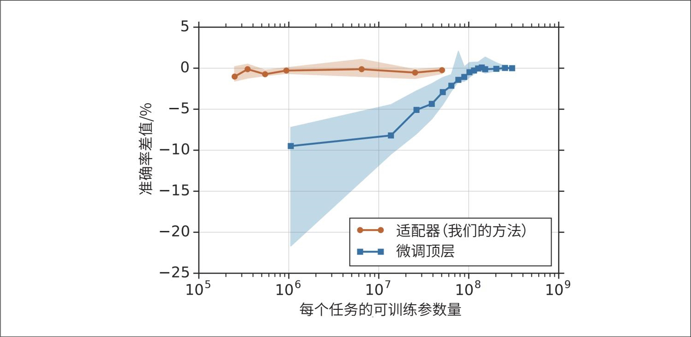

> **圖片描述：** 此折線圖比較部分微調（藍色線）與介面卡方法（橙色線）在不同可訓練參數量下的效能表現。X 軸為每個任務的可訓練參數量（對數尺度，10⁵ 至 10⁹），Y 軸為準確率差值（相對於全量微調，以百分比計）。橙色介面卡曲線幾乎在所有參數量下都接近 0%（與全量微調相當），而藍色部分微調曲線在參數量較少時效能顯著下降（-10% 至 -25%），需要接近 10⁸ 個參數才能達到全量微調的水準。

圖7-7：藍色的曲線表明，部分微調需要大量的可訓練引數才能達到與全量微調相當的效能

PEFT的概念由Houlsby等（2019）提出。他們指出，透過在模型的合適位置插入額外的引數，可以用少量的可訓練引數實作強大的微調效能。他們在BERT模型的每個Transformer層中插入了兩個介面卡模組，如圖7-8所示。

	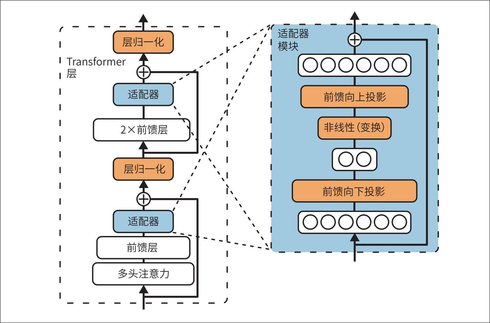

> **圖片描述：** 此圖展示 Houlsby 等（2019）提出的介面卡模組在 Transformer 層中的插入位置。左側為 Transformer 層結構：多頭注意力 → 介面卡 → 前饋層（2 層）→ 介面卡 → 層歸一化。右側放大顯示介面卡模組內部結構：前饋向下投影 → 非線性啟用（轉換）→ 前饋向上投影，並帶有殘差連接。

圖7-8：Houlsby等（2019）透過在BERT模型的每個Transformer層中插入兩個介面卡模組，並僅更新這些介面卡模組，就能用少量的可訓練引數實作強大的微調效能

在微調過程中，他們保持模型的原始引數不變，僅更新介面卡模組的引數。此時，可訓練引數量即為介面卡中的引數量。在GLUE基準測試中，他們僅使用了全量微調時3%的可訓練引數，就得到了與全量微調相差不超過0.4%的效能表現。圖7-7中橙色的曲線展示了全量微調與不同規模的介面卡微調之間的效能差異。

然而，這種方法的缺點是會增加微調後模型的推理延遲。介面卡引入了額外的層，使得前向傳播過程增加了更多計算步驟，從而減慢了推理速度。

PEFT使得在更經濟的硬體上進行微調成為可能，從而讓更多開發者能夠使用這種技術。PEFT方法通常不僅引數高效，而且樣本高效。全量微調可能需要幾萬到幾百萬個樣本才能實作顯著的質量提升，而一些PEFT方法只需幾千個樣本就能實作出色的效能表現。

鑑於PEFT的顯著優勢，相關技術正快速發展。下面將概述這些技術，然後深入介紹最常見的PEFT技術——LoRA。

**1. PEFT技術**

當前的PEFT技術大致分為兩類：**基於適配器的方法**（adapter-based method）和**基於軟提示的方法**（soft prompt-based method）。當然，未來很可能會出現新的類別。

基於介面卡的方法是指所有涉及向模型權重中新增額外模組的方法，例如由Houlsby等（2019）開發的方法（參見“Parameter-Efficient Transfer Learning for NLP”）。由於基於介面卡的方法涉及新增引數，因此也被稱為**加法式方法**（additive method）。

截至本書撰寫時，LoRA（Hu等，“LoRA: Low-Rank Adaptation of Large Language Models”，2021）是最流行的基於介面卡的方法，下文將專門介紹LoRA。其他基於介面卡的方法包括與LoRA幾乎同時出現的BitFit（Zaken等，“BitFit: Simple Parameter-efficient Fine-tuning for Transformer-based Masked Language-models”，2021）。較新的基於介面卡的方法有IA3（Liu等，“Few-Shot Parameter-Efficient Fine-Tuning is Better and Cheaper than In-Context Learning”，2022），其高效的混合任務批處理策略使它在多工微調中極具吸引力，在某些場景中甚至超過了LoRA和全量微調。LongLoRA（Chen等，“LongLoRA: Efficient Fine tuning of Long-Context Large Language Models”，2023）是LoRA的一種變體，結合了注意力修改技術，以擴充套件模型的上下文長度。

如果說基於介面卡的方法是向模型架構中新增可訓練引數，那麼基於軟提示的方法則是透過引入特殊的可訓練token來修改模型處理輸入的方式。這些額外的token與輸入token一起被輸入模型。之所以被稱為**軟提示**（soft prompt），是因為它們與輸入（硬提示，hard prompt）一樣，也能引導模型的行為。不過，軟提示與硬提示有兩個顯著區別。

·硬提示是人類可讀的，通常包含離散的token，例如“I”“write”“a”和“lot”。相反，軟提示是連續的向量，類似於嵌入向量，不具備人類可讀性。

·硬提示是靜態的，不可訓練，而軟提示可以在微調過程中透過反向傳播進行最佳化，從而針對特定任務進行調整。

軟提示常被描述為提示工程和微調的結合體。圖7-9展示瞭如何同時使用軟提示和硬提示來引導模型的行為。

	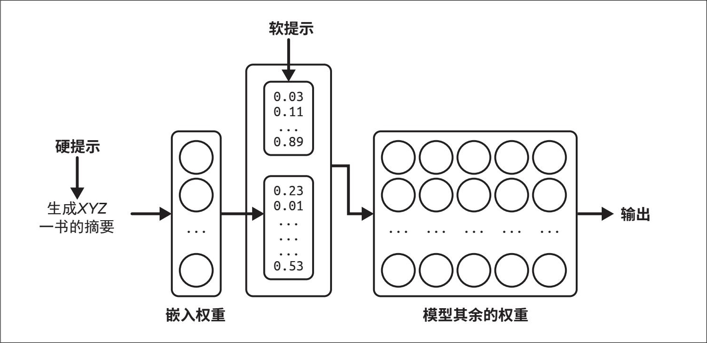

> **圖片描述：** 此圖展示硬提示與軟提示結合使用的方式。左側輸入為硬提示（人類可讀的離散 token，如「生成 XYZ 一書的摘要」），經嵌入權重層處理後，與軟提示（連續向量，如 [0.03, 0.11, ..., 0.89]）合併送入模型其餘權重層，最終產生輸出。軟提示是可訓練的連續數值向量，在微調過程中透過反向傳播進行最佳化。

圖7-9：結合使用硬提示和軟提示，以改變模型的行為

- 我從未遇到過任何一個人能當場清晰地解釋這些技術之間的區別。

**軟提示調優**（soft prompt tuning）作為一個子領域，包含一系列名稱相似、容易混淆的方法，例如prefix-tuning（Li和Liang，“Prefix-Tuning: Optimizing Continuous Prompts for Generation”，2021）、P-Tuning（Liu等，“GPT Understands, Too”，2021）和prompt tuning（Lester等，“The Power of Scale for Parameter-Efficient Prompt Tuning”，2021）。它們之間的主要區別在於軟提示的插入位置。例如，prefix-tuning在每個Transformer層的輸入前新增軟提示token，而prompt tuning只在嵌入輸入前新增軟提示token。目前許多PEFT框架內建了這些方法的實作，你可以按需選擇。

為探究哪些PEFT方法被廣泛使用，我在2024年10月分析了PEFT的GitHub倉庫中的1000多個公開問題。分析基於這樣的假設：如果有人使用了某種方法，他們更可能報告相關錯誤或提出相關問題。圖7-10展示了分析結果。對於P-Tuning，我搜尋了關鍵詞“p_tuning”和“p tuning”，以涵蓋不同的拼寫方式。

從分析結果可以明顯看出，LoRA佔據主導地位。軟提示方法的應用相對較少，但似乎正逐漸受到一些使用者的關注，這些使用者希望獲得比提示工程更豐富的定製化功能，卻又不想投入大量精力進行微調。

由於LoRA廣受歡迎，下面將重點介紹LoRA的工作原理，以及它如何解決早期基於介面卡的方法遇到的難題。即使你不使用LoRA，這一深入探討也能為你提供一個框架，以便探索其他微調方法。

	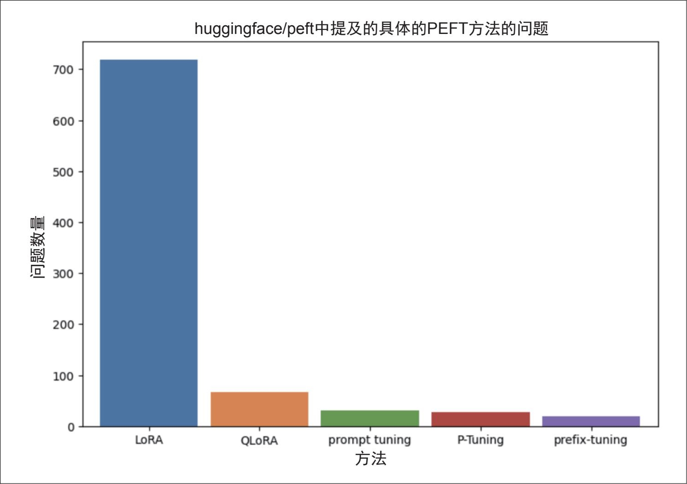

> **圖片描述：** 此長條圖展示 huggingface/peft GitHub 倉庫中各 PEFT 方法對應的問題數量。LoRA 以約 720 個問題遙遙領先，QLoRA 約 70 個，prompt tuning 約 30 個，P-Tuning 約 30 個，prefix-tuning 約 20 個。此圖清楚顯示 LoRA 在 PEFT 技術中佔據絕對主導地位。

圖7-10：GitHub倉庫huggingface/peft中不同微調方法對應的問題數量。這可以作為估計每種技術流行程度的一個指標

**2. LoRA**

與Houlsby等（2019）提出的基於介面卡的方法（參見“Parameter-Efficient Transfer Learning for NLP”）不同，LoRA（Hu等，“LoRA: Low-Rank Adaptation of Large Language Models”，2021）引入額外引數的方式不會增加推理延遲。LoRA並不是在基座模型中引入額外的層，而是使用可以合併回原始層的模組。

LoRA可應用於單獨的權重矩陣。它將給定的權重矩陣分解為兩個較小矩陣的乘積，並更新這兩個小矩陣，最終將其合併回原始矩陣。

以一個維度為n**×**m*的權重矩陣***W***為例，LoRA的工作方式如下。

·確定較小矩陣的維度。設該值為*r*，構造兩個矩陣：***A***（維度為*n**×**r*）和***B***（維度為*r**×**m*）。它們的乘積為***WAB***，其維度與***W***相同。這裡的*r*稱為LoRA的秩。

·將***WAB***加到原始權重矩陣***W***上，建立一個新的權重矩陣***W'***。在模型中用***W'***替代原來的***W***。你可以使用一個超引數*α*來控制***WAB***對新矩陣的貢獻程度：

·在微調過程中，僅更新矩陣**A***和***B***中的引數，保持矩陣***W***不變。

圖7-11展示了這一過程。

圖7-11：將LoRA應用於權重矩陣**W***時，需將***W***分解為兩個矩陣***A***和***B***的乘積。在微調過程中，僅更新矩陣***A***和***B***，矩陣***W***保持不變

 LoRA建立在低秩分解（low-rank factorization）這一歷史悠久的降維技術之上，其核心思想是將一個大矩陣分解為兩個較小的矩陣的乘積，從而減少引數量，降低計算量和記憶體需求。例如，將一個9×9的矩陣分解為兩個維度分別為9×1和1×9的矩陣的乘積，原始矩陣有81個引數，而分解後的兩個矩陣總共只有18個引數。

第一個分解矩陣的列數和第二個分解矩陣的行數對應於分解的秩。原始矩陣通常是**滿秩**（full-rank）的，而兩個較小的矩陣則表示對原始矩陣的低秩近似。雖然矩陣分解可以顯著減少引數量，但這種方法是有損的，因為它只是對原始矩陣的近似。秩越大，分解所能保留的原始矩陣的資訊就越多。

與基於介面卡的方法類似，LoRA在引數和樣本的使用上都非常高效。矩陣分解使得LoRA能夠使用更少的可訓練引數。關於LoRA的論文表明，對於GPT-3，在多個任務中，LoRA僅使用約470萬個可訓練引數（相當於全量微調引數量的0.0027%），就能獲得與全量微調相當甚至更好的效果。

**為什麼LoRA有效？**像LoRA這樣的引數高效方法已經非常流行，以至於很多人認為這是理所當然的。但引數高效性為什麼可以實作呢？如果一個模型在預訓練時需要大量引數才能學習某些行為，那麼在微調時改變這些行為難道不也需要大量引數嗎？

同樣的問題也適用於資料。如果一個模型需要大量資料來學習某種行為，那麼要顯著改善這種行為難道不也需要大量資料嗎？為什麼預訓練一個模型需要幾百萬甚至幾十億個樣本，而微調時卻只需幾百或幾千個樣本就能有效地改變模型的行為呢？

許多論文指出，儘管LLM擁有大量引數，但其內在維度非常低，具體參見“Measuring the Intrinsic Dimension of Objective Landscapes”（Li等，2018）、“Intrinsic DimensionalityExplains the Effectiveness of Language Model Fine-Tuning”（Aghajanyan等，2020）和“LoRA: Low-Rank Adaptation of Large Language Models”（Hu等，2021）。這些研究表明，**預訓練隱式地最小化了模型的內在維度。**令人驚訝的是，更大的模型在預訓練後往往具有更低的內在維度。這意味著預訓練實際上起到了壓縮機制的作用，有利於後續任務。換句話說，一個LLM訓練得越充分，就越容易用少量可訓練引數和少量資料進行微調。

你可能會想，既然低秩分解的效果這麼好，那為什麼不在預訓練階段也使用LoRA呢？與其先預訓練一個大模型，再僅在微調階段應用低秩分解，我們能否從一開始就對模型進行分解並進行預訓練呢？低秩預訓練可以顯著減少模型引數量，從而大幅縮短模型的預訓練時間並降低成本。

21世紀10年代，許多研究人員嘗試訓練低秩神經網路，並取得了一些成果，例如Sainath等（2013）的“Low-rank matrix factorization for Deep Neural Network training with high-dimensional output targets”、Povey等（2018）的“Semi-Orthogonal Low-Rank Matrix Factorization for Deep Neural Networks”和Jaderberg等（2014）的“Speeding up Convolutional Neural Networks with Low Rank Expansions”等。

低秩分解已在較小規模的模型上被證明是有效的。例如，透過應用各種分解策略，包括用1×1卷積替代3×3卷積，SqueezeNet（Iandola等，“SqueezeNet: AlexNet-level accuracy with 50×fewer parameters and <0.5MB model size”，2016）在ImageNet資料集上實作了與AlexNet相當的準確率，但引數量減少至原來的1/50。

近期嘗試訓練低秩LLM的研究包括ReLoRA（Lialin等，“ReLoRA: High-Rank Training Through Low-Rank Updates”，2023）和GaLore（Zhao等，“GaLore: Memory-Efficient LLM Training by Gradient Low-Rank Projection”，2024）等。ReLoRA適用於引數規模高達13億的基於Transformer的模型。GaLore在10億引數規模下能達到與滿秩模型相當的效能，並在70億引數規模下展現出良好的潛力。

或許在不遠的將來，研究人員可以開發出一種方法，將低秩預訓練擴充套件到幾千億引數的規模。然而，如果Aghajanyan等的觀點正確，即預訓練會隱式地壓縮模型的內在維度，那麼滿秩預訓練仍然是必要的，它可以充分降低模型的內在維度，使低秩分解能夠發揮作用。探究在切換到低秩訓練之前究竟需要多少滿秩訓練，將是一個非常有趣的課題。

**LoRA的配置。**應用LoRA時，需要確定將LoRA應用於哪些權重矩陣，以及每個分解的秩。下面將討論做出這些決策需考慮的因素。

LoRA可以應用於每個單獨的權重矩陣。因此，LoRA的效率不僅取決於應用於哪些矩陣，還取決於模型的架構，因為不同的架構具有不同的權重矩陣。

- 要有效利用LoRA最佳化模型，需深入理解該模型的架構。第2章闡述了基於Transformer的模型權重的組成。若需獲取模型權重的精確構成，請查閱對應專案的技術白皮書。

雖然也有一些將LoRA應用於其他架構（如卷積神經網路）的研究，例如“Parameter-Efficient Fine-Tuning for Medical Image Analysis: The Missed Opportunity”（Dutt等，2023）、“Convolution Meets LoRA: Parameter Efficient Finetuning for Segment Anything Model”（Zhong等，2024）和“ConvLoRA and AdaBN based Domain Adaptation via Self-Training”（Aleem等，2024），但LoRA主要還是用於Transformer模型。LoRA最常應用於注意力模組中的四個權重矩陣：查詢矩陣（**W***q）、鍵矩陣（***W***k）、值矩陣（***W***v）和輸出投影矩陣（***W***o）。

通常，LoRA會被統一應用於模型中所有同型別的矩陣。例如，將LoRA應用於查詢矩陣意味著將LoRA應用於模型中的所有查詢矩陣。

理論上，你可以將LoRA應用於所有注意力矩陣。但在實際應用中，通常會受限於硬體記憶體，只能容納固定數量的可訓練引數。在可訓練引數量固定的情況下，應該將LoRA應用於哪些矩陣才能使效能最大化呢？

在對GPT-3-175B進行微調時，Hu等（2021）將可訓練引數預算設定為1800萬，約佔模型總引數量的0.01%。在此預算下，他們可以選擇以下幾種LoRA應用方式：

1. 對一個矩陣應用秩為8的LoRA；

2. 對兩個矩陣應用秩為4的LoRA；

3. 對四個矩陣應用秩為2的LoRA。

 GPT-3-175B擁有96個Transformer層，模型維度為12,288。如果對全部矩陣應用秩為2的LoRA，每層的可訓練引數量為(12,288×2×2)×4=196,608，整個模型的可訓練引數量則為18,874,368。

他們發現，在WikiSQL（Zhong等，“Seq2SQL: Generating Structured Queries from Natural Language Using Reinforcement Learning”，2017）和MultiNLI（Multi-Genre Natural Language Inference，多型別自然語言推理）基準測試中，對四個矩陣應用秩為2的LoRA表現最佳（見表7-5）。如果只能選擇兩個注意力矩陣，通常選擇查詢矩陣和值矩陣會取得最好的效果。

表7-5：在1800萬可訓練引數預算下的LoRA效能表現

	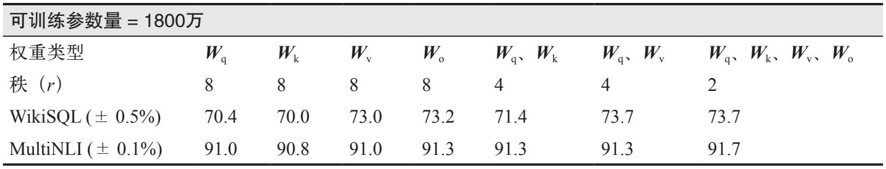

> **圖片描述：** 此表格展示在 1800 萬可訓練參數預算下，將 LoRA 應用於 GPT-3-175B 不同權重矩陣的效能比較。列出了對單一矩陣（Wq、Wk、Wv、Wo，秩=8）、兩個矩陣（Wq+Wk、Wq+Wv，秩=4）和四個矩陣（Wq+Wk+Wv+Wo，秩=2）的 WikiSQL 和 MultiNLI 準確率。結果顯示對四個矩陣應用秩為 2 的 LoRA 表現最佳（WikiSQL: 73.7, MultiNLI: 91.7）。

經驗觀察表明，將LoRA應用於更多的權重矩陣（包括前饋矩陣）通常能獲得更好的結果。例如，Databricks公司指出，將LoRA應用於所有前饋層時，效能提升最為顯著。Fomenko等（2024）指出，基於前饋層的LoRA可以與基於注意力層的LoRA互補，但在記憶體受限的情況下，基於注意力層的LoRA通常效果更好（參見“A Note on LoRA”）。

LoRA的優勢在於，儘管其效能取決於r*，但研究表明，**對於許多應用場景，較小的r（如4～64）通常已足夠。**r*越小，意味著LoRA的引數越少，從而減少記憶體佔用。

- 截至本書撰寫時，一些微調框架（如Fireworks）僅允許LoRA的秩最大為32。不過，這種限制可能並非出於效能考慮，更可能是受其硬體記憶體的制約。

LoRA的作者發現一個令人意外的現象：增大r*的值並不會提高微調效能。這一發現與Databricks公司的報告一致，即“將*r*增大到某個值以上可能不會帶來模型輸出質量的明顯提升”。一些人認為，較大的r*甚至可能帶來負面影響，因為它可能導致過擬合。然而，在某些情況下，可能需要更大的秩。Raschka（2023）發現，在他的任務中，將*r*設為256時獲得了最佳效能（參見“Practical Tips for Finetuning LLMs Using LoRA (Low-Rank Adaptation)”）。另一個可以配置的LoRA超引數是*α*，它決定了在合併過程中矩陣乘積***WAB***對新矩陣的貢獻程度：。在實際應用中，常見的*α*值使得*α*和*r*的比值在1∶8和8∶1之間，但最佳比值因情況而異。例如，如果*r*較小，你可能希望*α*較大；如果*r*較大，你可能希望*α*較小。你需要透過實驗確定適合具體應用場景的最佳*α*和*r*的組合。

**部署LoRA適配器。**LoRA不僅能讓你使用更少的記憶體和資料來微調模型，還能憑其模組化特性簡化多個模型的部署。為了理解這一優勢，我們來看看如何部署一個經過LoRA微調的模型。

通常，部署經過LoRA微調的模型有以下兩種方式。

1. 在部署微調後的模型之前，將LoRA的權重***A***和權重***B***合併到原始模型中，生成新的矩陣***W'***。由於推理過程中無須進行額外計算，因此不會增加延遲。

2. 在部署時保持***W***、***A***和***B***分離，在推理過程中再將***A***和***B***合併回***W***，這會引入額外的延遲。

如果你只需要部署一個LoRA模型，第一種方式通常更好；如果需要部署多個共享同一個基座模型的LoRA模型，即**多LoRA部署**（multi-LoRA serving），第二種方式通常更合適。圖7-12展示了在多LoRA部署中保持LoRA介面卡分離的架構。

圖7-12：在多LoRA部署中，保持LoRA介面卡分離可以複用相同的滿秩矩陣**W***

對於多LoRA部署，雖然第二種方式會增加延遲，但能顯著降低儲存需求。假設你使用LoRA為每個客戶微調一個模型，如果有100個客戶，最終會得到100個微調後的模型，且它們共享同一個基座模型。若使用第一種方式，你需要儲存100個滿秩矩陣***W'***；若使用第二種方式，你只需儲存一個滿秩矩陣***W***和100組較小的介面卡矩陣（***A, B***）。

為了更直觀地理解這一點，假設原始矩陣***W***的維度為4096×4096（約1680萬個引數）。如果LoRA的秩為8，則矩陣***A***和***B***的引數量為4096×8×2=65,536。

·在第一種方式中，100個滿秩矩陣***W'***總共需要1680萬×100=1.68億個引數。

·在第二種方式中，一個滿秩矩陣***W***和100組小矩陣（***A, B***）總共需要1680萬+65,536×100≈2335萬個引數。

第二種方式還可以加快任務之間的切換速度。假設你當前正在使用客戶X的模型為其提供服務，當需要切換到為客戶Y提供服務時，無須載入客戶Y的完整權重矩陣，只需載入其LoRA介面卡即可，這能顯著縮短載入時間。雖然將矩陣***A***和***B***分開儲存會帶來額外的延遲，但透過一些最佳化技術可以將其降至最低。本書的GitHub倉庫中包含具體的實作方法。

多LoRA部署使得組合多個專用模型更加容易。你不再需要用一個龐大的模型來處理多個任務，而是可以為每個任務分別配備一個LoRA介面卡。例如，蘋果公司在2024年使用多個LoRA介面卡，將同一個擁有30億個引數的基座模型適配到不同的iPhone功能中。同時，藉助量化技術進一步減少基座模型和介面卡的記憶體佔用，使得這些模型都能在裝置端執行。

- 你可以透過標籤adapter、peft或LoRA來搜尋這些介面卡。

LoRA介面卡的模組化特性意味著它們可以被共享和複用。目前已經有一些公開可用的、經過微調的LoRA介面卡，你可以像使用預訓練模型一樣使用它們。你可以在Hugging Face平臺或者AdapterHub等專案中找到這些介面卡。

你可能會問：“LoRA聽起來很棒，那它有什麼缺點呢？”LoRA的主要缺點是效能不如全量微調。此外，它的實作難度高於全量微調，因為它涉及修改模型的實作，這要求使用者理解模型的架構並具備一定的程式設計技能。不過，這個問題通常只存在於較冷門的基座模型中。針對主流基座模型，Hugging Face的PEFT、Axolotl、unsloth和LitGPT等框架通常提供了開箱即用的LoRA支援。

**量化LoRA。**LoRA的快速興起催生了眾多變體。一些變體旨在進一步減少可訓練引數量。然而，如表7-6所示，LoRA介面卡所需記憶體與模型權重所需記憶體相比極少。僅減少LoRA引數量對減少整體記憶體佔用的作用微乎其微。

表7-6：LoRA介面卡所需記憶體與模型權重所需記憶體的對比

	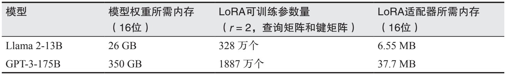

> **圖片描述：** 此表格比較 LoRA 介面卡所需記憶體與模型權重所需記憶體。Llama 2-13B：模型權重 26 GB，LoRA 可訓練參數 328 萬個，介面卡記憶體僅 6.55 MB。GPT-3-175B：模型權重 350 GB，LoRA 可訓練參數 1887 萬個，介面卡記憶體僅 37.7 MB。結果清楚顯示 LoRA 介面卡的記憶體佔用相對於模型權重可忽略不計。
- QLoRA並非唯一的量化LoRA研究成果。許多實驗室進行了相關研究，但並未公開。

相比減少LoRA的引數量，更有效的方法是在微調過程中對模型的權重、啟用值和/或梯度進行量化，從而減少記憶體佔用。QLoRA（Dettmers等，“QLoRA: Efficient Finetuning of Quantized LLMs”，2023）是早期的一種極具前景的LoRA量化版本。在LoRA的原始論文中，微調時模型權重使用16位儲存，而QLoRA使用4位儲存，僅在前向傳播和反向傳播計算時將其反量化（轉換）為BF16格式。

QLoRA使用的4位格式為NF4（NormalFloat-4），其量化依據是：預訓練權重通常服從以0為中位數的正態分佈。除了4位量化，QLoRA還使用分頁最佳化器，當GPU記憶體不足，尤其是在處理較長序列時，自動在CPU和GPU之間傳輸資料。這些技術使得在單個48 GB GPU上微調一個擁有650億個引數的模型成為可能。

研究者在4位模式下微調了多個模型，包括從7B到65B的Llama模型，由此得到的Guanaco模型系列在公開基準測試和對比評估中展現出了競爭力。表7-7展示了2023年5月以GPT-4為裁判時，Guanaco模型、GPT-4和ChatGPT的Elo評分。儘管Guanaco-65B並未超越GPT-4，但比ChatGPT更受青睞。

表7-7：2023年5月Guanaco模型與流行模型的Elo評分對比（以GPT-4為裁判）。實驗來自QLoRA論文（Dettmers等，2023）

	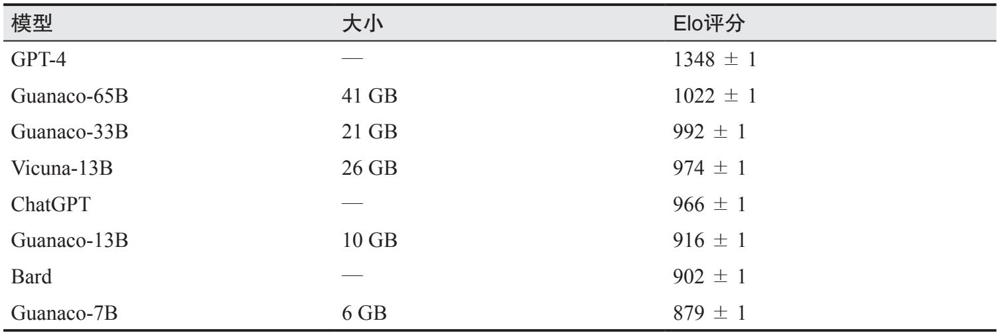

> **圖片描述：** 此表格展示 2023 年 5 月 Guanaco 系列模型（透過 QLoRA 微調）與主流模型的 Elo 評分對比（以 GPT-4 為裁判）。GPT-4 得分 1348，Guanaco-65B（41 GB）得分 1022，Guanaco-33B（21 GB）得分 992，Vicuna-13B（26 GB）得分 974，ChatGPT 得分 966，Guanaco-13B（10 GB）得分 916，Bard 得分 902，Guanaco-7B（6 GB）得分 879。

QLoRA的主要侷限是NF4量化的計算成本較高。雖然QLoRA可以減少記憶體佔用，但由於量化和反量化步驟需要額外開銷，可能會延長訓練時間。

由於量化LoRA具有節省記憶體的潛力，因此該研究領域十分活躍。除了QLoRA，其他相關研究還包括QA-LoRA（Xu等，“QA-LoRA: Quantization-Aware Low-Rank Adaptation of Large Language Models”，2023）、ModuLoRA（Yin等，“ModuLoRA: Finetuning 2-Bit LLMson Consumer GPUs by Integrating with Modular Quantizers”，2023）和IR-QLoRA（Qin等，“Accurate LoRA-Finetuning Quantization of LLMs via Information Retention”，2024）。

### 7.4.2 模型合並與多任務微調
如果說微調是透過修改單個模型來建立定製模型，那麼模型合併則是透過組合多個模型來達成此目的。相較於單純的微調，模型合併提供了更大的靈活性。你可以將兩個現有的模型合併，建立一個更實用的新模型。你也可以在合併之前對其中的任意或全部模型進行微調。

雖然合併後的模型不一定需要再次微調，但微調通常可以進一步提升其效能。如果不進行微調，模型合併甚至可以在沒有GPU的情況下完成，這對缺乏大量計算資源的獨立開發者來說頗具吸引力。

模型合併的目標是構建一個價值超越各組成部分之和的單體模型。這種增值可能源於效能的提升。例如，你有兩個模型，它們在同一任務的不同方面各有所長，你可以將它們合併，新模型在該任務上的表現可能優於原有的兩個模型。假設一個模型能回答前60%的問題，另一個模型能回答後60%的問題，合併後也許能回答80%的問題。

增值也可能源於記憶體佔用的減少，從而降低成本。例如，兩個模型分別執行不同的任務，你可以將它們合併，新模型能夠同時勝任這兩類任務且引數更少。這對於基於介面卡的模型尤其有吸引力。如果兩個模型是在同一個基座模型上微調得到的，那麼你可以將它們的介面卡合併成一個。

模型合併的一個重要應用場景是多工微調。如果不使用模型合併，進行多工微調通常需要採用以下方法之一。

**同時微調（simultaneous finetuning）**

這種方法是指建立一個包含所有任務示例的資料集，並在該資料集上微調模型，使模型同時學習所有任務。然而，由於同時學習多個技能通常更困難，這種方法一般需要更多的資料和更長的訓練時間。

**順序微調（sequential finetuning）**

這種方法是指標對每個任務，分別且按順序地微調模型。例如，先在任務A上訓練模型，然後在任務B上訓練模型，以此類推。這種方法假設模型一次學習一個任務更容易。但遺憾的是，神經網路容易出現災難性遺忘（Kirkpatrick等，“Overcoming catastrophic forgetting in neural networks”，2016）。當模型在新任務上接受訓練時，可能會忘記如何執行先前學過的任務，導致在先前任務上的效能顯著下降。

模型合併為多工微調提供了另一種方法。你可以並行地分別針對不同任務微調模型，完成後將這些模型合併。分別針對每個任務進行微調能使模型更好地掌握特定任務，且由於不存在順序學習，災難性遺忘的風險更低。

當你需要將模型部署到手機、筆記本電腦、汽車、智慧手錶和倉儲機器人等裝置時，模型合併也是很好的選擇。裝置端部署通常面臨記憶體容量受限的挑戰，與其將多個執行不同任務的模型植入裝置，不如將這些模型合併成一個能夠執行多個任務且記憶體佔用大幅減少的模型。

- 我寫的《機器學習系統設計》一書中有一節專門介紹雲端和邊緣端的機器學習。

裝置端部署在資料不能離線（通常出於隱私原因）、網路訪問受限或不穩定的場景中必不可少。此外，它還能顯著降低推理成本。能將轉移到使用者裝置上的計算任務越多，需支付給資料中心的費用就越少。

模型合併是實作**聯邦學習**（federated learning，McMahan等，“Communication-Efficient Learning of Deep Networks from Decentralized Data”，2016）的一種方式。在聯邦學習中，多個裝置使用各自的資料訓練同一個模型。如果你將模型X*部署到多個裝置上，每個裝置上的模型*X*都可以使用本地資料繼續獨立學習。一段時間後，你會得到模型*X*的多個副本，每個副本都在不同的資料上進行了訓練。你可以將這些副本合併成一個新的基座模型，集合所有組成模型的學習成果。

將多個模型組合以獲得更佳效能的思路源於**模型集成方法**（model ensemble method）。根據維基百科的定義，整合方法是將多個學習演演算法組合起來，以獲得優於單個演演算法的預測效能。模型合併通常將組成模型的引數混合，而整合方法通常只組合模型的輸出，保持每個組成模型的完整性。

- 你可以透過我寫的《機器學習系統設計》一書瞭解更多關於整合方法的內容。

例如，在整合方法中，給定一個查詢，你可能使用三個模型生成三個不同的答案，然後基於這三個答案，透過簡單的多數投票或另一個可訓練的機器學習模組生成最終答案。雖然整合方法通常能提升效能，但由於每個請求需要多次推理呼叫，因此推理成本較高。

圖7-13對比了整合方法和模型合併方法。正如整合模型曾經在各排行榜中佔據主導地位一樣，目前Hugging Face的Open LLM Leaderboard中排名靠前的許多模型是合併模型。

	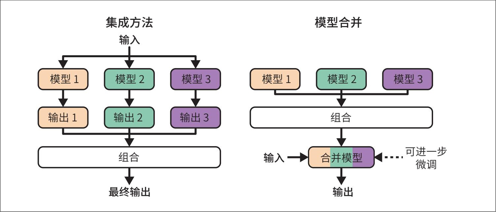

> **圖片描述：** 此圖對比集成方法與模型合併方法的工作原理。集成方法（左側）：將輸入同時送入三個獨立模型，各自產生輸出，最後組合為最終輸出。模型合併（右側）：先將三個模型的參數組合成一個合併模型，再用合併模型處理輸入產生輸出，可選擇性地進一步微調。

圖7-13：整合方法與模型合併方法的工作原理

目前許多模型合併技術仍處於實驗階段，隨著學界對其底層理論理解的深入，這些技術可能會迭代更新。因此，我將從宏觀層面介紹模型合併方法，而非拘泥於具體技術。

模型合併方法的差異體現在各組成模型引數的組合方式上。這裡介紹三種方法：求和（summing）、層堆疊（layer stacking）和拼接（concatenation）。圖7-14直觀地展示了它們的區別。

	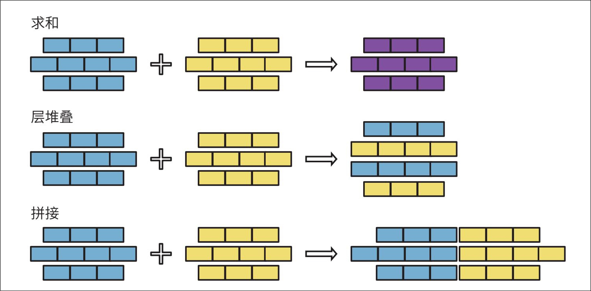

> **圖片描述：** 此圖展示三種模型合併方法的視覺化對比。求和：兩組層（藍色、黃色）對應元素相加，產生混合層（紫色+黃色）。層堆疊：將兩組層垂直堆疊，保留各自的完整層。拼接：將兩組層水平拼接，每層的寬度為兩個原始層之和。

圖7-14：三種主要的模型合併方法：求和、層堆疊和拼接

在合併模型時，你可以混合使用多種方法，例如對某些層進行求和，對其他層進行堆疊。下面我們分別探討這些方法。

**1. 求和**

這種方法的核心在於將組成模型權重的值相加。我將介紹兩種求和方法：**線性組合**（linear combination）和**球面線性插值**（spherical linear interpolation，SLERP）。如果兩個模型的引數處於不同量級，例如一個模型的引數值遠大於另一個模型的引數值，則需要在求和之前對模型進行重新縮放，使它們的引數值處於相同的範圍內。

**線性組合。**線性組合包括平均和加權平均兩種形式。給定兩個模型A*和*B*，它們的加權平均計算如下：

公式中的A*和*B*代表模型或其引數。

圖7-15展示了當時如何對兩個層進行線性組合。

	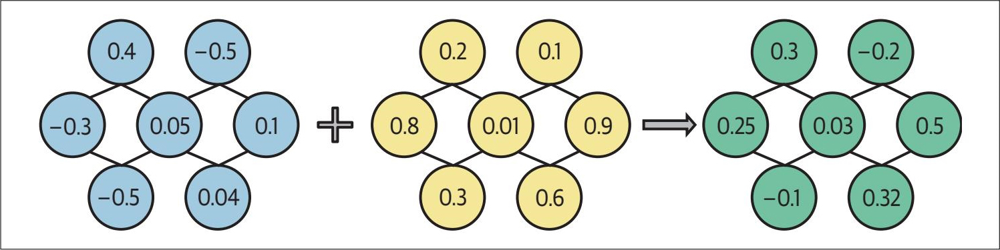

> **圖片描述：** 此圖展示透過求平均值進行參數合併的具體範例。兩個神經網路（藍色和黃色節點）中對應位置的權重值進行平均，產生合併後的網路（綠色節點）。例如：藍色 0.4 + 黃色 0.2 → 綠色 0.3，藍色 -0.3 + 黃色 0.8 → 綠色 0.25。

圖7-15：透過求平均值實作引數合併

- 平均法不僅適用於權重，也適用於嵌入向量。例如，給定一個句子，你可以使用詞嵌入演演算法為句中的每個單詞生成嵌入向量，然後將這些單詞向量平均合併為句子向量。剛接觸機器學習時，我難以相信平均法居然真的有效。當簡單的元件被正確使用時，竟能創造出如此令人驚歎的複雜系統（如AI），這簡直太神奇了！

線性組合方法看似簡單，效果卻出奇地好。早在20世紀90年代初，研究人員就開始探索透過線性組合多個模型來構建更優模型的思想（Perrone，“Improving Regression Estimation: Averaging Methods for Variance Reduction with Extensions to General Convex Measure Optimization”，1993）。線性組合也常用於聯邦學習（Wang等，“Federated Learning with Matched Averaging”，2020）。

你可以對整個模型或模型的特定元件進行線性組合。“模型湯”（model soups）的研究表明，對多個微調模型的全部權重取平均，可以提高準確性，且不會增加推理時間（Wortsman等，“Model Soups: Averaging Weights of Multiple Fine-tuned Models Improves Accuracy without Increasing Inference Time”，2022）。不過，更常見的做法是對特定的元件（如介面卡）進行線性組合以實作模型合併。

雖然理論上可以對任意模型集合進行線性組合，但**線性組合對基於同一基座模型微調所得的模型效果最佳。**在這種情況下，我們可以藉助**任務向量**（task vector）的概念來理解線性組合：一旦你為特定任務微調了一個模型，從該模型中減去基座模型的引數，得到的向量就能捕捉該任務的本質。任務向量也被稱為**delta參數**。如果使用LoRA進行微調，則可以根據LoRA權重構建任務向量。

任務向量使我們能夠進行**任務算術**（task arithmetic，Ilharco等，“Editing Models with Task Arithmetic”，2022），例如透過將兩個任務向量相加來組合任務能力，或透過減去任務向量來削弱特定能力。任務減法對於消除模型的不良行為（如去除面部識別等侵入性功能）或修正預訓練過程中產生的偏見非常有效。

當待合併的元件具有相同的架構和規模時，線性組合的實作非常簡單。即使模型的架構或規模不同，線性組合也同樣適用。例如，一個模型的層比另一個大，你可以將其中一個或兩個層投影到相同的維度，再進行組合。

一些研究提出，在平均之前先對模型進行對齊，以確保功能相關的引數被一起平均，例如論文“Model Fusion via Optimal Transport”（Singh和Jaggi，2019）、“Git Re-Basin: Merging Models modulo Permutation Symmetries”（Ainsworth等，2022）和“Merging by MatchingModels in Task Parameter Subspaces”（Tam等，2023）提到的方法。雖然組合對齊後的引數在理論上是合理的，但引數對齊操作具有一定難度，因此這種方法在簡單的線性組合中並不常見。

**球面線性插值。**球面線性插值常簡稱為SLERP，也是一種常見的模型合併方法。它基於同名的數學運算。
	

> **圖片描述：** 此為 O'Reilly 書籍的裝飾性插圖，與前文相同的藍紫色烏鴉剪影。此圖為章節分隔用的裝飾圖案。

 插值是指根據已知值估計未知值的過程。在模型合併的情境下，未知值是合併後的模型，已知值則是各個組成模型。線性組合和SLERP都屬於插值技術。

由於SLERP的公式涉及較多數學知識，並且模型合併工具通常已經實作了該方法，因此這裡不再詳細介紹。直觀地講，你可以將待合併的向量看作球面上的點。要合併兩個向量，首先在球面上畫出這兩個點之間的最短路徑，這類似於在地球表面畫出兩個城市之間的最短路徑。合併後的結果向量就是這條最短路徑上的某個點，具體位置取決於插值因子。你可以將插值因子設定為0～1的任意值。當插值因子小於0.5時，合併後的向量會更靠近第一個向量，這意味著第一個任務向量對結果的貢獻更大。當插值因子為0.5時，表示選擇路徑正中間的點，如圖7-16中的藍色點所示。

	

> **圖片描述：** 此圖展示 SLERP（球面線性插值）的幾何原理。一個圓（代表球面）上有兩個黑色端點，分別對應向量 t1（指向上方）和 t2（指向右方）。紅色弧線表示兩點間的最短球面路徑。藍色向量 m 指向弧線的中點（藍色點），代表插值因子為 0.5 時的合併結果。

圖7-16：SLERP對兩個向量t*1和*t*2的作用方式。紅色弧線表示它們在球面上的最短路徑。根據插值因子的不同，合併後的向量可以是路徑上的任意一點。當插值因子為0.5時，向量*m*即為合併後的結果向量

作為一種數學運算，SLERP的定義僅針對兩個向量，這意味著一次只能合併兩個向量。若需合併兩個以上的向量，可以依次進行SLERP，例如先合併向量***A***和向量***B***，再將結果與向量***C***合併。

- 假設在微調過程中變化最顯著的引數對目標任務最關鍵。

**剪枝（pruning）冗餘的任務特定參數。**在微調過程中，模型的許多引數會被調整。然而，這些調整大多很微小，對模型在任務中的表現並沒有顯著貢獻。這類引數被視為**冗餘的**（redundant）。

在論文“TIES-Merging: Resolving Interference When Merging Models”中，Yadav等（2023）指出，可以重置大部分任務向量引數，且對效能的影響極小，如圖7-17所示。重置是指將微調後的引數恢復為基座模型中的原始值，實際上就是將對應的任務向量引數設為0（回顧一下，任務向量是透過從微調模型中減去基座模型而得到的）。

	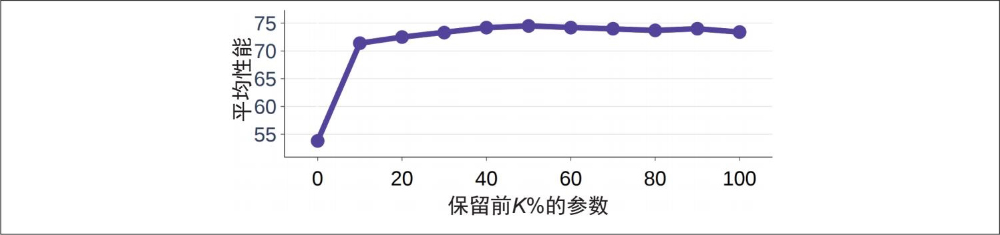

> **圖片描述：** 此折線圖展示任務向量參數剪枝對模型效能的影響。X 軸為保留前 K% 的參數，Y 軸為平均效能。曲線顯示保留前 10% 的參數時效能約 54，保留前 20% 時效能急升至約 72，此後隨著保留比例增加效能緩慢上升並趨於平穩（約 73-75）。說明僅保留前 20% 的任務向量參數即可達到與保留全部參數相當的效能。

圖7-17：在Yadav等的實驗中，保留前20%的任務向量引數，模型的效能與保留全部（100%）引數時的效能相當

- TIES是Trim, elect sign and merge的縮寫，DARE是drop and rescale的縮寫。這確實容易讓人困惑。

- 當任務向量被剪枝後，它們會變得更稀疏，但微調後的模型本身並不會變稀疏。在這種情況下，剪枝不是為了減少記憶體佔用或降低推理延遲，而是為了提升模型效能。

冗餘引數雖然對單個模型無害，但可能對合並後的模型造成負面影響。TIES（Yadav等，“TIES-Merging: Resolving Interference When Merging Models”2023）和DARE（Yu等，“Language Models are Super Mario: Absorbing Abilities from Homologous Models as a Free Lunch”，2023）等合併技術在合併任務向量之前，會對其中的冗餘引數進行剪枝。這種做法可以顯著提高最終合併模型的質量。需要合併的模型數量越多，剪枝就越重要，因為單個任務中的冗餘引數干擾其他任務的可能性會隨之增大。

**2. 層堆疊**

這種方法是指從一個或多個模型中提取不同的層（如提取模型1的第一層和模型2的第二層），並將它們堆疊在一起。這種方法也被稱為**直通式合並**（passthrough-merging）或**拼接式合並**（franken-merging），它可以創造出具有獨特架構和引數量的模型。與求和合並方法不同，透過層堆疊得到的合併模型通常需要進一步微調才能達到良好的效能。

拼接式合併的一個早期成功案例是Goliath-120B（由alpindale於2023年建立）。該模型由兩個微調後的模型（Llama 2-70B和Euryale）合併而成，它從每個模型的80層中各取了72層進行組合。

層堆疊也可以用於訓練**混合專家**（MoE）模型，這種方法最早由Komatsuzaki等（2022）在論文“Sparse Upcycling: Training Mixture-of-Experts from Dense Checkpoints”中提出。與從頭訓練MoE模型不同，這種方法選取一個預訓練模型，複製其中的某些層或模組，然後新增一個**路由器**（router）來將每個輸入傳送到最合適的副本。隨後，對合並後的模型和路由器進行進一步訓練以最佳化效能。圖7-18展示了這一過程。

	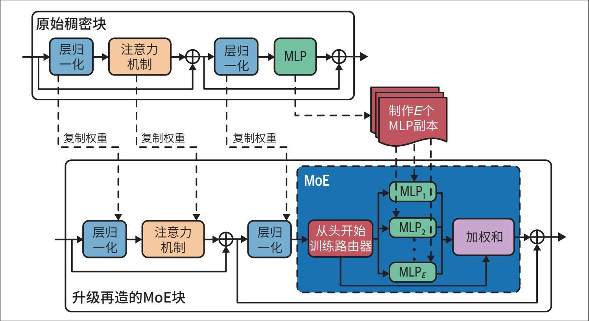

> **圖片描述：** 此圖展示利用預訓練模型建立混合專家（MoE）模型的過程。上方為原始稠密模型區塊（層歸一化 → 注意力機制 → 層歸一化 → MLP）。下方為升級後的 MoE 區塊：保留原始的注意力機制部分，但 MLP 被複製為多個副本（MLP1、MLP2、...、MLPn），並新增一個從頭開始訓練的路由器來決定每個輸入應發送到哪個 MLP 副本。

圖7-18：利用預訓練模型建立MoE模型。圖片改編自Komatsuzaki等（2022）的論文

Komatsuzaki等的研究表明，透過層堆疊得到的模型的效能優於從頭訓練的MoE模型的效能。Together AI使用這種方法，將六個較弱的開源模型混合，建立了Mixture-of-Agents，該模型在某些基準測試中達到了與OpenAI的GPT-4o相當的效能（Wang等，“Mixture-of-Agents Enhances Large Language Model Capabilities”，2024）。

層堆疊的一個有趣應用場景是**模型擴容**（model upscaling）。模型擴容研究的是如何使用更少的資源建立更大的模型。有時，你可能希望擁有比現有模型更大的模型，因為更大的模型通常效能更好。例如，你的團隊最初訓練了一個適合40 GB GPU的模型，後來你們獲得了一臺配備80 GB GPU的新機器，這使部署一個更大的模型成為可能。這時，你無須從頭開始訓練新模型，而是可以利用層堆疊技術，基於現有模型構建一個更大的模型。

一種層擴容方法是**深度擴展**（depthwise scaling）。Kim等（2023）使用這種技術，基於一個擁有32層、70億個引數的模型建立了SOLAR 10.7B模型（參見“SOLAR 10.7B: Scaling Large Language Models with Simple yet Effective Depth Up-Scaling”）。具體步驟如下。

1. 複製原始的預訓練模型。

2. 對特定層進行求和（將兩個層相加合併為一個層）並將剩餘的層堆疊起來，以合併兩個模型。需要精心選擇被求和的層，以匹配目標模型的規模。對SOLAR 10.7B模型中的16個層求和，因此最終模型的層數為32×2-16=48。

3. 進一步訓練擴容後的模型，以達到目標效能。

圖7-19展示了這一過程。

	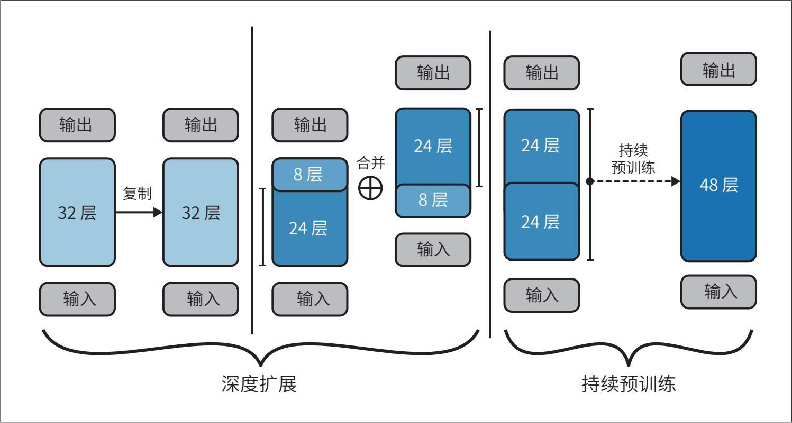

> **圖片描述：** 此圖展示使用深度擴展方法從 32 層模型建立 48 層模型的過程。步驟：(1) 複製原始 32 層模型；(2) 對兩個副本各取部分層（24 層和 8 層）；(3) 合併：將一個副本的 8 層與另一個副本的 24 層求和，再堆疊剩餘的 24 層；(4) 持續預訓練合併後的 48 層模型。

圖7-19：使用深度擴充套件方法，基於32層模型建立48層模型。原圖基於CC BY 4.0授權，為提高可讀性，本圖略做修改

**3. 拼接**

除了以不同方式將組成模型的引數相加，你還可以將它們拼接起來。拼接後元件的引數量是所有組成元件的引數量之和。如果合併兩個秩分別為r*1和*r*2的LoRA介面卡，合併後介面卡的秩將為*r*1+*r*2，如圖7-20所示。

	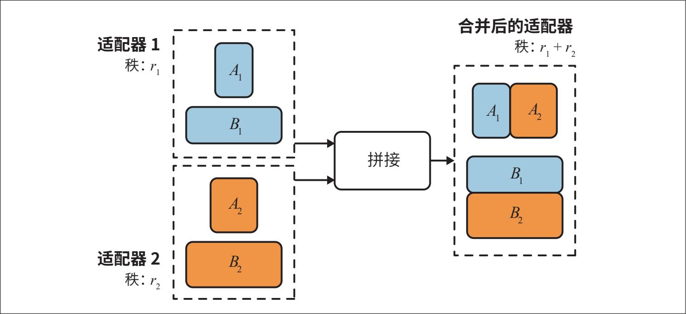

> **圖片描述：** 此圖展示使用拼接方法合併兩個 LoRA 介面卡的過程。介面卡 1（秩 r1）包含矩陣 A1 和 B1，介面卡 2（秩 r2）包含矩陣 A2 和 B2。拼接後的介面卡秩為 r1 + r2，A1 和 A2 水平拼接形成新的 A 矩陣，B1 和 B2 垂直堆疊形成新的 B 矩陣。

圖7-20：如果使用拼接方法合併兩個LoRA介面卡，合併後介面卡的秩將是兩個介面卡的秩的和

- 對於是否在本書中納入拼接技術，我曾糾結良久，最終為了內容的完整性，還是決定將其收錄進來。

通常不推薦使用拼接方法，因為與分別部署不同的模型相比，它並不能減少記憶體佔用。拼接或許能帶來更好的效能，但效能的提升可能並不足以抵消引入額外引數帶來的成本。

### 7.4.3 微調策略
本章已經討論了多種微調方法、它們解決的問題及其工作原理。本節將重點介紹一些更實用的微調策略。

**1. 基座模型和微調框架**

儘管微調涉及的決策環節（如是否微調、資料獲取及模型維護）頗具挑戰，但實際執行過程相對直觀。核心在於選擇基座模型、微調方法和微調框架。

**基座模型。**第4章介紹了模型選擇的標準，包括模型規模、許可協議和基準測試效能等，這些標準同樣適用於微調。在AI專案初期探索可行性時，建議優先使用預算範圍內最強大的模型。如果最強大的模型都無法達到預期，較弱的模型通常表現更差。反之，如果最強大的模型能夠滿足你的需求，就可以嘗試使用較弱的模型，並以初始模型的表現作為基準進行對比。

就微調而言，不同專案的初始模型可能有所不同。OpenAI的微調最佳實踐文件給出了兩種開發路徑示例，即**漸進路徑**（progression path）和**蒸餾路徑**（distillation path）。

漸進路徑如下。

- 大學期間，我犯過一個慘痛的錯誤：我讓模型通宵訓練，結果8小時後模型崩潰了，原因是我試圖把檢查點儲存到一個不存在的資料夾中。這導致此前取得的訓練成果全部丟失。

1. 使用成本最低、最快的模型測試微調程式碼，確保程式碼執行無誤。

2. 使用一箇中等規模的模型驗證資料質量。如果訓練損失未隨資料量增加而下降，說明資料可能存在問題。

3. 使用最好的模型進行幾次實驗，探索效能提升的極限。

4. 一旦獲得良好的結果，就使用所有模型進行一次訓練，以繪製成本-效能曲線，並選出最適合實際場景的模型。

蒸餾路徑如下。

1. 基於小規模資料集，使用預算範圍內最強大的模型訓練出儘可能好的模型。由於基座模型效能強大，通常只需較少的資料即可達到良好的效果。

2. 使用這個微調後的模型生成更多的訓練資料。

3. 使用新的資料集訓練一個成本更低的模型。

由於微調通常在提示詞實驗之後進行，因此在理想情況下，開始微調時你已經對不同模型的行為有了相當深入的瞭解。你應該根據這種理解來規劃微調開發路徑。

**微調方法。**像LoRA這樣的介面卡技術雖然成本較低，但通常無法達到與全量微調同等水平的效能。如果你剛接觸微調，可以先嚐試LoRA之類的方法，如果不能滿足需求再轉向全量微調。

微調方法的選擇也取決於你的資料量。根據基座模型和任務的不同，全量微調通常至少需要幾千個樣本，甚至更多。然而，PEFT方法僅需少量資料即可展現良好的效能。如果你的資料集較小，比如只有幾百個樣本，全量微調的效果可能不如LoRA的效果。

此外，還要考慮你需要多少個微調後的模型，以及你希望如何部署這些模型。使用LoRA等基於介面卡的方法能更高效地部署共享同一基座的多個模型。當使用LoRA時，你只需部署一個完整的模型，而使用全量微調則需要部署多個完整的模型例項。

**微調框架。**最簡單的微調方式是使用微調API，你只需上傳資料並選擇基座模型即可。與模型推理API類似，微調API可以由模型提供商、雲服務提供商或第三方提供。這種方法的侷限性在於你只能使用API所支援的基座模型。此外，API可能不會提供所有可用於最佳化微調效能的引數選項。因此，微調API適合希望快速、便捷地完成任務的使用者，對於想要更多自定義選項的使用者可能受限。

你也可以使用眾多優秀的微調框架進行微調，例如LLaMA-Factory、unsloth、PEFT、Axolotl和LitGPT。這些框架支援多種微調方法，尤其是基於介面卡的技術。如果你想進行全量微調，許多基座模型在GitHub上提供了開源的訓練程式碼，你可以直接使用這些程式碼並在自己的資料上進行訓練。Llama Police提供了更全面且最新的微調框架和模型倉庫列表。

自主微調提供了更大的靈活性，但你需要自行準備必要的計算資源。如果你只使用基於介面卡的技術，中等效能的GPU即可滿足大多數模型的需求。若需要更多算力，可以選擇與雲服務提供商無縫整合的框架。

如果你計劃使用多臺機器進行模型微調，則需要採用支援分散式訓練的框架，例如DeepSpeed、PyTorch Distributed和ColossalAI。

**2. 微調超參數**

根據基座模型和微調方法的不同，有許多超引數可供調整以提升效率。針對具體應用場景，請查閱你所使用的基座模型或微調框架的技術文件來了解特定的超引數。這裡，我將介紹一些通用且重要的超引數。

**學習率。**學習率決定了模型引數在每一步學習中的更新幅度。如果將學習過程看作尋找通往目標的路徑，那麼學習率就是每一步的步長。如果步長太小，可能需要很長時間才能達到目標；如果步長太大，則可能越過目標，導致模型無法收斂。

不存在通用的最佳學習率。你需要嘗試不同的學習率（範圍通常為10-7～10-3），以確定最佳取值。一種常見的做法是，取預訓練階段結束時的學習率，並將其乘以一個0.1～1的常數。

你可以透過損失曲線判斷學習率是否合適。如果損失曲線波動很大，很可能是學習率過大；如果損失曲線穩定但下降速度很慢，則可能是學習率過小。應在保持損失曲線穩定的前提下，儘可能增大學習率。

你也可以在訓練過程中調整學習率，比如在訓練初期使用較大的學習率，在接近訓練結束時使用較小的學習率。用於確定訓練過程中學習率變化方式的演演算法稱為**學習率調度**（learning rate schedules）。

- 雖然學界普遍認為批次大小過小會導致訓練不穩定，但我尚未找到明確解釋其原因的資料。如果你有相關參考資料，請分享給我。

**批次大小。**批次大小決定模型在每一步更新權重時所使用的樣本量。批次大小過小（如小於8）可能導致訓練不穩定。較大的批次大小有助於聚合來自不同樣本的訊號，從而使更新更加穩定可靠。

一般來說，批次越大，模型處理訓練樣本的速度就越快。然而，批次大小越大，執行模型所需的記憶體也越多。因此，批次大小受硬體條件的限制。這體現了成本與效率之間的權衡：更昂貴的計算資源可以實作更快的微調。

- 我曾嘗試尋找首次提出梯度累積的論文，但未能找到。早在2016年，“Ako: Decentralised Deep Learning with Partial Gradient Exchange”（Watcharapichat等，第七屆ACM雲端計算研討會論文集）中就提到了梯度累積在深度學習中的應用。這個概念似乎源自分散式訓練，即不同機器上計算的梯度需要被累積起來，用於更新模型權重。

截至本書撰寫時，計算資源仍然是微調的瓶頸。在通常情況下，模型規模很大，而記憶體有限，因此只能使用較小的批次大小。這可能導致模型權重更新不穩定。為了解決這個問題，你可以跨多個批次累積梯度，待累積了足夠數量的梯度後再更新模型權重，而不是在每個批次後立即更新。這種技術稱為**梯度累積**（gradient accumulation）。

當計算成本不是最重要的因素時，你可以嘗試不同的批次大小，以確定哪個批次大小能帶來最佳的模型效能。

**epoch數量。**一個epoch表示對訓練資料的一次完整遍歷。epoch數量決定每個訓練樣本被訓練的次數。

小型資料集通常比大型資料集需要更多的epoch。對於擁有數百萬個樣本的資料集，1～2個epoch可能已足夠；而對於只有幾千個樣本的資料集，在4～10個epoch後效能仍有可能繼續提升。

訓練損失和驗證損失之間的差異可以為確定epoch數量提供重要參考。如果兩者都持續穩定下降，說明模型可以從更多的epoch（以及更多的資料）中受益，此時可以考慮增加epoch數量。如果訓練損失繼續下降而驗證損失開始上升，說明模型對訓練資料發生過擬合，此時可以嘗試減少epoch數量。

**提示詞損失權重。**在監督微調中，每個樣本都包含提示詞和響應，二者在訓練過程中都會對模型的損失產生影響。然而，在推理階段，提示詞通常由使用者提供，模型只需生成響應。因此，在訓練過程中，響應token對模型損失的貢獻應大於提示詞token。

提示詞損失權重決定提示詞相較於響應對損失的貢獻程度。如果該權重為100%，則提示詞和響應對損失的貢獻相同，意味著模型從二者中學習的程度相等。如果該權重為0%，則模型只從響應中學習。在通常情況下，該權重預設為10%，意味著模型主要從響應中學習，但也會從提示詞中學習一些內容。

## 7.5 小結
除了評估，微調是本書中最具挑戰性的部分。本章涉及的概念範圍極廣：既包含遷移學習等傳統概念，也涵蓋PEFT等新興技術；既涉及低秩分解等基礎理論，也包含模型合併等實驗性方法；既有記憶體計算等數學內容，也有超引數調優等實戰策略。將這些多元內容組織成連貫且易於理解的結構，確實是一項艱鉅的任務。

微調本身並不難。許多微調框架會自動處理訓練過程，甚至可以推薦常用的微調方法和合理的超引數預設值。

然而，微調涉及的背景知識很複雜。你需要先考慮是否應該對模型進行微調。本章開頭分別討論了進行微調和不進行微調的理由。此外，本章還探討了一個被頻繁提及的問題：什麼時候微調，什麼時候使用RAG？

在技術發展的早期階段，微調與預訓練類似，都需要更新模型的全部權重。然而，隨著模型規模的擴大，全量微調對大多數開發者來說變得不切實際。微調過程中需要更新的引數越多，所需的記憶體就越大。大多數開發者並不具備足夠的資源（包括硬體、時間和資料）來對基礎模型進行全量微調。

許多微調技術的開發出於同樣的動機：在儘可能小的記憶體佔用下實作良好的效能。例如，PEFT透過減少可訓練引數量來降低微調對記憶體的需求，而量化訓練則透過減少表示每個數值所需的位數來緩解記憶體瓶頸。

在概述PEFT後，本章詳細介紹了LoRA及其工作原理和優勢。LoRA的許多特性廣受開發者歡迎。除了引數高效和資料高效，它還具有模組化特性，極大簡化了多個LoRA模型的部署與組合。

組合微調模型的思路引出了模型合併的概念。模型合併的目標是將多個模型合併成一個模型，使其效能優於單獨使用元件模型時的效能。本章討論了模型合併的多種應用場景，包括裝置端部署、模型擴容，還介紹了模型合併的一般方法。

業內常說：微調本身不難，難的是獲取用於微調的資料。獲得高質量的標註資料（尤其是指令資料）頗具挑戰性。下一章將深入探討這些挑戰。