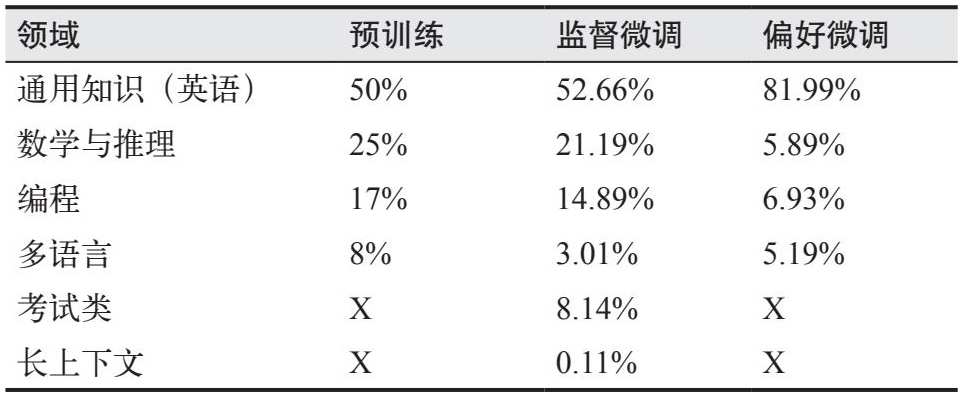
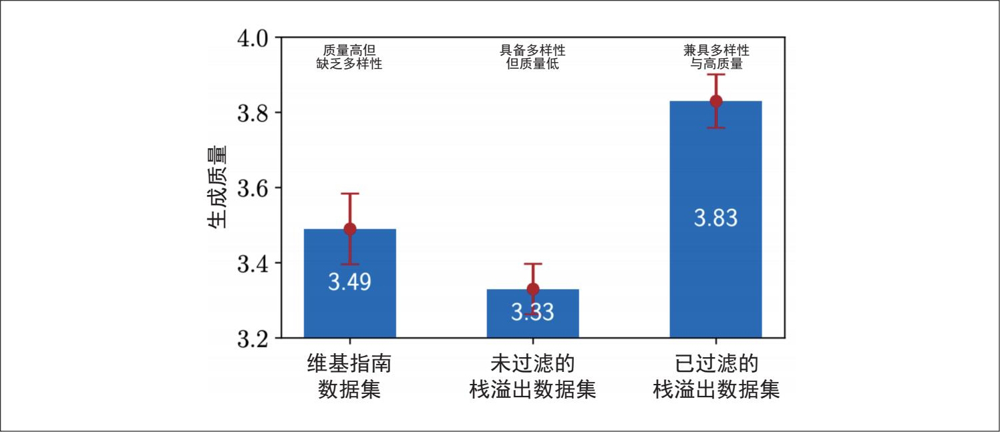
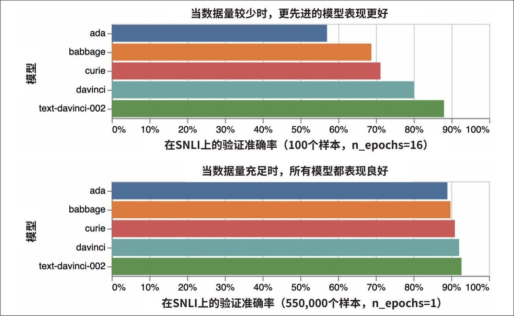
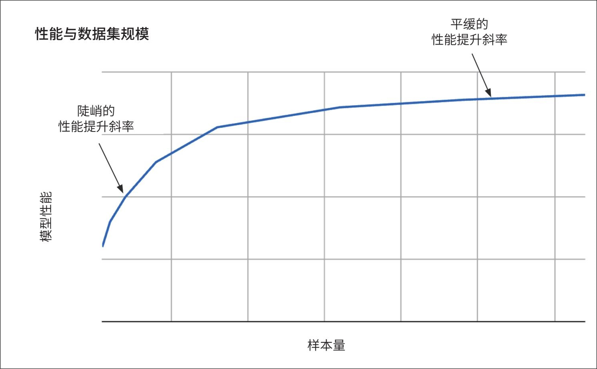
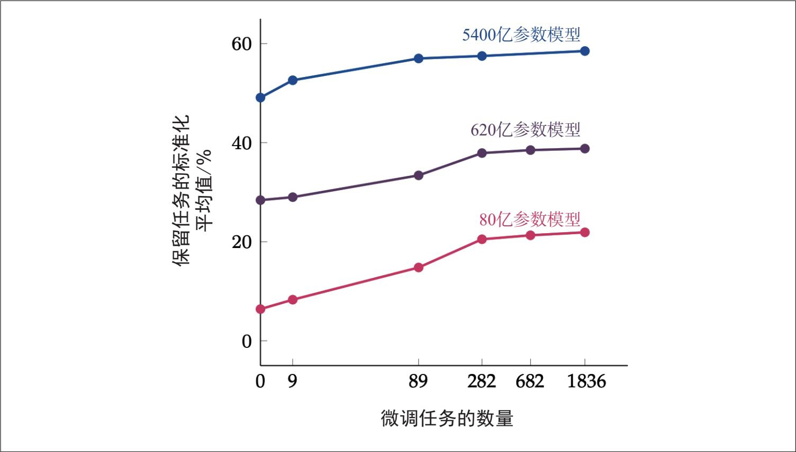
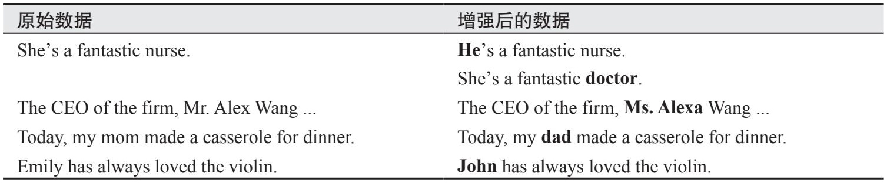
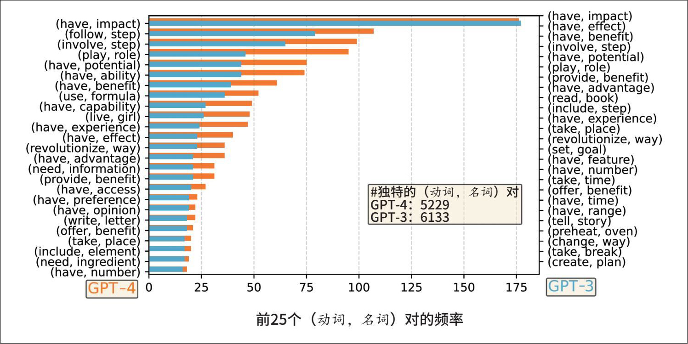
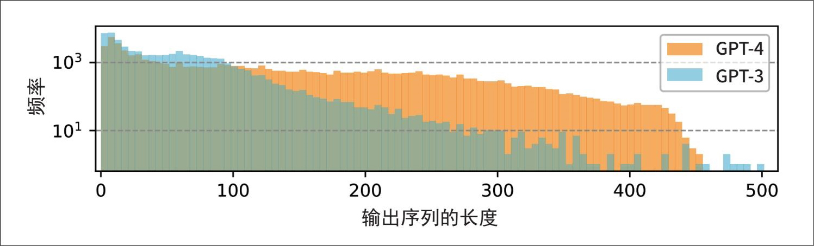
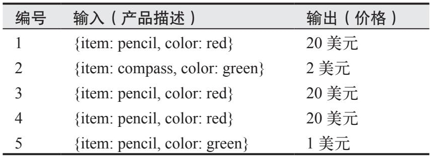
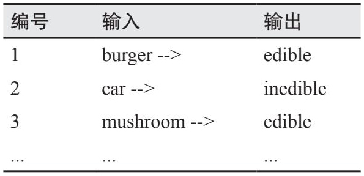

# 第8章 資料集工程

模型的質量取決於訓練資料的質量。如果沒有高質量的資料，即使擁有頂尖的機器學習團隊和無限的計算資源，也無法微調出一個優秀的模型。資料集工程的目標是構建一個能夠幫助你訓練出最佳模型的資料集，且在理想情況下，成本應控制在預算範圍內。

- 資料的重要性日益凸顯，這一點從GPT-3和GPT-4的資料投入變化中就能看出。2020年，在GPT-3的貢獻名單中，只有兩個人負責資料收集、過濾、去重及訓練資料的重疊分析。3年後，情況發生了巨大變化。在GPT-4的貢獻名單中，有80個人參與了不同的資料處理過程，這還不包括OpenAI透過資料提供商僱用的資料標註員。即使是看似簡單的ChatML格式，也有11個人參與其中，且多為資深研究員。在2016年的AMA（ask me anything）帖子中，OpenAI聯合創始人Wojciech Zaremba曾表示，他們計劃使用公開可用的資料集進行大部分研究。

能夠負擔得起從頭開發模型的公司越來越少，更多的公司開始透過最佳化資料來提升自身AI的表現。隨著模型對資料的需求不斷增加，資料處理變得更具挑戰性，這就需要在人才和基礎設施方面投入更多資源。

資料相關工作（data operations）已經從順帶處理的邊緣任務演變為專職專崗。如今，許多AI公司會配備資料標註員、資料集構建人員以及資料質量工程師，這些崗位人員要麼直接融入核心工程團隊，要麼與核心工程團隊緊密協作。

如果說模型領域因為產品眾多而令人眼花繚亂，那麼資料領域更加複雜，各種資料集和技術層出不窮。本章將概述資料領域的情況，並介紹構建自有資料集時需要考量的因素。

本章將首先介紹資料策展（data curation），回答幾個核心問題：你需要什麼資料？需要多少資料？高質量的資料意味著什麼？接下來討論資料合成和資料處理技術。資料的策展、生成和處理並不是線性過程，你可能需要在不同步驟之間反覆迭代。

對於同一個模型，不同的訓練階段旨在培養模型的不同能力，因此需要屬性各異的資料集。例如，預訓練階段的資料量通常以token數衡量，而監督微調階段的資料量通常以樣本量衡量。然而，從宏觀層面看，這些階段的資料策展過程遵循相同的原則。本章將重點關注訓練後的資料，因為這類資料與應用開發者的關聯更為密切。不過，當預訓練資料的經驗對訓練後的資料具有啟發性時，我也會將其納入討論。

儘管存在一些可供遵循的最佳實踐和能夠實作部分流程自動化的工具，但大部分資料工作依然離不開艱辛的勞作，需要付出大量汗水和努力。

**AI的資料中心視角**

在AI開發過程中，人們對資料的關注日益增加，催生了**以資料為中心的AI**（data-centric AI），它與**以模型為中心的AI**（model-centric AI）形成了鮮明對比。

·以模型為中心的AI致力於透過最佳化模型來提升AI效能，包括設計新架構、擴大模型規模或開發新的訓練技術。

·以資料為中心的AI致力於透過最佳化資料來提升AI效能，包括開發新的資料處理技術和建立高質量的資料集，以便用更少的資源訓練出更好的模型。

在深度學習發展早期，許多AI基準測試是以模型為中心的。例如給定ImageNet資料集，人們嘗試使用相同的資料集訓練出效能最佳的模型。近年來，越來越多的基準測試轉向以資料為中心：給定相同的模型，人們嘗試開發能讓該模型表現最好的資料集。

2021年，吳恩達（Andrew Ng）發起了一場以資料為中心的AI競賽，要求參賽者基於同一基礎資料集進行最佳化，具體手段包括修正錯誤標籤、增加邊緣案例示例、資料增強等。

2023年，DataComp（Gadre等，“DataComp: In Search of the Next Generation of Multimodal Datasets”，2023）舉辦了一場競賽，目標是建立最適合訓練CLIP模型（Radford等，“Learning Transferable Visual Models From Natural Language Supervision”，2021）的資料集。競賽使用標準化指令碼在每個提交的資料集上訓練CLIP模型，並根據訓練出的模型在38個下游任務中的表現來評估資料集的質量。2024年，他們舉辦了類似的競賽，旨在評估用於訓練引數規模從4.12億到70億的語言模型的資料集（Li等，“DataComp-LM: In Search of the Next Generation of Training Sets for Language Models”，2024）。其他類似的以資料為中心的基準測試包括DataPerf（MLCommons，2023）和dcbench（Eyuboglu和Karlaš，2022）。

以模型為中心和以資料為中心的劃分為相關研究指引了方向。然而在實際應用中，要取得實質性的技術進步，通常需要同時在模型和資料兩個方面進行投入。

## 8.1 資料策展
雖然不是所有AI模型的問題都能透過資料解決，但資料通常是解決方案中的關鍵部分。優質資料可以使模型更強大、更安全，並能處理更長的上下文。相反，劣質資料可能導致模型偏見加劇、幻覺現象增多。資料中的錯誤不僅會損害模型效能，還會浪費資源。

- 如果使用大量資料，僅確保資料合規就可能是一項全職工作。

資料策展是一門科學，需要相關人員深入理解模型的學習機制。資料集構建者應與應用開發者和模型開發者緊密協作。在小型團隊中，這些角色可能由一人兼任——負責訓練模型的人也負責獲取資料。然而，資料需求較高的組織通常會設立專門的崗位。

需要的資料型別取決於具體任務和模型的學習目標。自監督微調需要序列資料；監督微調需要（指令，響應）格式的資料；偏好微調需要（提示詞，勝出響應，落敗響應）格式的資料。訓練獎勵模型既可以使用偏好微調的資料格式，也可以使用帶標註分數的（（指令，響應），分數）格式的資料。

訓練資料應體現你希望模型學習的行為。獲取高質量的資料標註本就充滿挑戰，若想教會模型CoT推理和工具使用等複雜行為，則更是難上加難。我們透過以下兩個例子來理解原因。

**CoT推理**

如第5章所述，CoT提示詞會引導模型在給出最終答案前逐步解決問題。為了教會模型生成分步響應，訓練資料中應包含CoT風格的響應內容。研究“Scaling Instruction-Finetuned Language Models”（Chun等，2024）表明，在微調資料中加入分步響應，可以顯著提升不同規模的模型在CoT任務中的表現。在某些任務中，準確率甚至接近翻倍。

生成多步驟的響應可能非常煩瑣且耗時——逐步解釋如何解決一道數學題要比直接給出最終答案困難得多。為了說明這一點，以下提供兩個示例：一個僅包含最終答案，另一個則使用了CoT。這兩個示例均來自Chun等（2024）的研究。

**Instruction:** Please answer the following question. What is the boiling point of Nitrogen?

**Response (without CoT): **-320.4F

**CoT instruction:** Answer the following question by reasoning step-by-step. The cafeteria had 23 apples. If they used 20 for lunch and bought 6 more, how many apples do they have?

**Response (with CoT): **The cafeteria had 23 apples originally. They used 20 to make lunch.

So they had 23 - 20=3. They bought 6 more apples, so they have 3 + 6=9.

因此，相比其他指令資料集，CoT資料集並不常見。

**工具使用**

鑑於模型在預訓練階段獲取了大量知識，許多模型或許能憑直覺知道如何使用某些工具。我們可以透過向模型展示工具使用的示例，進一步提升其能力。目前，通常的做法是請領域專家建立工具使用資料，其中每段提示詞對應一個需要呼叫工具的任務，而響應則是完成該任務所需的具體操作。例如，你想透過資料來微調一個模型，使其充當個人助理，你可能需要諮詢專業的個人助理，瞭解他們通常執行哪些型別的任務、如何執行及需要哪些工具。如果你直接請人類專家解釋如何完成任務，他們可能因記憶偏差或認為某些步驟不重要而有所遺漏。因此，你通常需要觀察人類實際執行這些任務的過程，以保障資料的準確性。

然而，對人類高效的方式未必對AI也高效，反之亦然。因此，人類標註的資料可能並不適合AI智慧體。例如，人類可能更喜歡使用網頁介面，而模型使用API更便捷。人類在搜尋某一內容時，可能會先開啟瀏覽器，然後將查詢內容複製並貼上到搜尋欄，再逐個檢視結果。模型則可以直接向搜尋API傳送查詢請求，並一次性處理所有結果。因此，許多人依靠模擬和其他合成技術來生成工具使用資料，本章稍後將對此進行探討。

工具使用資料可能還需要特殊的格式。在典型的對話資料中，使用者和AI輪流發言，每一輪僅包含一條訊息。然而，在工具使用場景中，AI可能需要在每一輪生成多條訊息，且分別傳送給不同的接收方。例如，AI可能向程式碼直譯器傳送一條訊息，同時向使用者傳送另一條訊息（如告知使用者它正在做什麼）。為了支援這種機制，Llama 3（Grattafiori等，“The Llama 3 Herd of Models”，2024）的研發團隊設計了一種多訊息對話格式，其中包含指定每條訊息的來源和目的地的訊息頭，以及用於明確人類和AI互動輪次起始位置的特殊對話邊界標記。

在為具有對話介面的應用進行資料策展時，你需要考慮所需的資料型別：單輪資料還是多輪資料，或者二者兼需。單輪資料有助於訓練模型對單條指令做出響應，而多輪資料則教會模型如何處理任務——許多現實任務涉及多輪互動。例如，當收到使用者查詢時，模型可能需要先明確使用者的意圖，然後開始處理任務。在模型給出響應後，使用者可能會提供修正意見或補充資訊，以便進行下一步操作。

單輪資料相對簡單，獲取難度較低；而多輪資料往往需要透過構建特定場景或設計更復雜的互動才能捕捉。

資料策展不僅僅是建立新資料以幫助模型學習新行為，也包括剔除既有資料以幫助模型摒棄不良行為。假設你負責開發類似於ChatGPT的聊天機器人，使用者抱怨該聊天機器人有些傲慢，令人反感並浪費他們的token。例如，當使用者要求驗證某個陳述是否正確時，聊天機器人可能回應：“該陳述是正確的，但風格可以改進得更好。”隨後，它繼續未經請求地改寫該陳述。

經調查發現，訓練資料中有若干帶有主動附加建議的標註示例。於是你要求從訓練資料中刪除這些示例，並申請獲取新的示例，以確保在進行事實核查時不附帶未經請求的改寫。

不同的應用可能需要具有不同特徵的資料，不同的訓練階段也需要不同的資料組合。但從整體來看，資料策展需遵循三大標準：資料質量、資料覆蓋度和資料量。

為了直觀地理解這些術語，不妨將模型訓練比作烹飪。輸入模型的資料就是食材。資料質量相當於食材的品質——如果食材變質了，就無法做出美味的食物。資料覆蓋度相當於食材的配比（例如，糖不能太多，也不能太少）。資料量則對應食材的總需求量。下面我們詳細探討這些概念。

### 8.1.1 資料質量
少量高質量的資料往往優於大量含噪資料（如無關或不一致的資料）。Yi模型系列的建立者發現，1萬條精心設計的指令優於幾十萬條含噪指令（Young等，“Yi: Open Foundation Models by 01.AI”，2024）。

類似地，論文“LIMA: Less Is More for Alignment”（Zhou等，2023）表明，一個擁有650億個引數的Llama模型，經過1000條精心篩選的提示詞和響應資料微調後，生成的答案在43%的情況下與GPT-4的響應相當或更受青睞（經人工評估）。然而，資料樣本過少也有缺點——LIMA的穩健性不如產品級模型。

Llama 3的研發團隊也得出了類似結論。值得注意的是，他們發現人工生成的資料往往更容易出現錯誤和不一致問題，尤其是在涉及具有細微差別的安全策略時。這促使他們開發了AI輔助標註工具，以確保資料質量。

- 雖然我熱愛寫作，但我不喜歡試圖把所有人的觀點濃縮成一個統一的定義。IBM從七個維度定義資料質量，分別是完整性、唯一性、有效性、及時性、準確性、一致性和適用性。維基百科則增加了可訪問性、可比性、可信度、靈活性和合理性。這些定義大多關注廣泛應用場景中的資料質量，而我關注的是用於微調的資料質量。

雖然大多數人明白資料質量的重要性，但究竟什麼是高質量資料呢？簡單來說，能幫助你高效、可靠地完成工作的資料就是高質量資料，但具體定義因使用者而異。一般而言，高質量資料應具備六大特徵：相關性強、符合任務要求、一致性高、格式規範、足夠獨特和合規。一些特定的應用場景可能還有其他要求。

**相關性強**

訓練樣本應與模型的目標訓練任務緊密相關。例如，任務是回答現代法律問題，那麼19世紀的法律資料可能不具備相關性；但如果任務是研究19世紀的法律體系，那麼這些資料就高度相關。

**符合任務要求**

標註應符合任務的具體要求。如果任務要求事實一致性，那麼標註應確保事實準確。如果任務要求創造性，那麼標註應富有創意。如果任務不僅要求給出評分，還要求提供評分依據，那麼標註應同時包含評分和理由。如果任務要求答案簡潔，那麼標註應簡潔明瞭。

我使用“符合任務要求”而非“準確”或“正確”，因為根據任務的不同，單純的準確或正確的響應可能並不是使用者真正想要的。

**一致性高**

標註應在不同樣本和不同標註員之間保持一致。如果兩個標註員對同一個樣本進行標註，他們的標註結果不應差異過大。以作文評分（1～5分）任務為例，得分相同的兩篇作文，其質量是否真的相當？標註不一致會使模型感到困惑，從而增加學習難度。

完善的標註指南對於確保標註既符合任務要求又保持一致性至關重要。

**格式規範**

- 我至今仍記得一個棘手的故障案例：資料中有一列本應是浮點數，卻被錯誤地儲存為整型，導致數值被四捨五入，引發了一些令人費解的模型行為。

所有樣本都應遵循模型預期的格式要求。冗餘的格式標記會干擾模型學習，應將其刪除。例如，從網站抓取產品評論時，應刪除HTML標籤。此外，還需注意末尾的空格、換行符，以及大小寫不一致和數字格式不統一等問題。

**足夠獨特**

- 雖然這裡並非指資料的獨特性，但擁有別人沒有的資料可能極具價值。

這是指資料集中應包含足夠獨特的樣本。在模型訓練的背景下，重複的資料可能會引入偏差並導致資料汙染。我使用“足夠獨特”這個詞，是因為不同的應用場景對資料重複的容忍程度可能不同。

**合規**

資料應符合所有相關的內部和外部政策（包括法律法規）要求。如果禁止使用包含PII的資料來訓練模型，那麼訓練資料中不應包含任何PII資料。

在開始建立資料之前，明確這些特徵非常重要。本節討論的技術旨在生成具備這些特徵的資料。

### 8.1.2 資料覆蓋度
模型的訓練資料應覆蓋其預期解決的所有問題範圍。現實世界中的使用者通常面臨各種各樣的問題，他們表達這些問題的方式也千差萬別。因此，擁有能夠捕捉應用多樣化使用模式的資料，對於實作優異的模型效能至關重要。資料覆蓋度要求資料具有足夠的多樣性，因此許多人也將這一特性稱為**資料多樣性**（data diversity）。

例如，一些使用者傾向於撰寫包含大量參考資訊的詳細指令，而另一些使用者偏好簡短指令，那麼微調資料應同時包含這兩類示例；如果使用者的查詢通常包含拼寫錯誤，則微調資料也應包含帶有拼寫錯誤的示例；如果你的應用支援多種程式語言，那麼訓練資料應包含使用者關注的程式語言的相關示例。

不同的應用對資料多樣性的維度要求各異。例如，法英翻譯工具不需要語言多樣性，但可能會受益於主題、長度和表達風格的多樣性；面向全球客戶推薦產品的聊天機器人不一定需要領域多樣性，但語言多樣性和文化多樣性非常重要。

對於聊天機器人等通用場景下的應用，微調資料應具備多樣性，涵蓋廣泛的主題和表達模式。Ding等（2023）認為，進一步提升聊天語言模型效能最直接的方法是提高訓練過程中所使用資料的質量和多樣性（參見“Enhancing Chat Language Models by Scaling High-quality Instructional Conversations”）。為了開發Nemotron（Adler等，“Nemotron-4 340B Technical Report”，2024），NVIDIA的研究人員致力於建立一個具備任務多樣性、主題多樣性和指令多樣性的資料集，其中包括不同輸出格式的指令、不同輸出長度的指令，以及開放式響應和是非響應的指令。論文“The Data Addition Dilemma”（Shen等，2024）表明，在某些情況下，增加更多異質資料反而導致效能下降。

Meta指出，Llama 3（Grattafiori等，“The Llama 3 Herd of Models”，2024）在模型架構方面與之前的Llama版本並無顯著差異。Llama 3效能的提升主要得益於資料質量和多樣性的改進，以及訓練規模的擴大。Llama 3的論文詳細介紹了三個訓練階段（預訓練、監督微調和偏好微調）的資料覆蓋情況。雖然本章重點關注後訓練資料，但考察同一模型在不同訓練階段的資料組合有助於對比並突出每個階段的考慮因素。

在三個訓練階段中，一個始終存在的多樣性維度是領域多樣性，但其具體含義在不同階段有所不同，如表8-1所示。該表僅展示了宏觀領域分類，並未包括更細粒度的主題，例如數學領域中的幾何學。後訓練資料還有其他未在表中體現的多樣性維度，例如token數（包括上下文和響應）和對話輪次。Llama 3在後訓練階段使用合成資料，因此還存在另一個維度——人工生成資料與AI生成資料的比例。

表8-1：對於Llama 3，不同訓練階段的最佳領域資料組合不同

	

> **圖片描述：** 此表格展示 Llama 3 在不同訓練階段的最佳領域資料組合。三個階段分別為預訓練、監督微調和偏好微調。領域包括：通用知識（英語）（50% / 52.66% / 81.99%）、數學與推理（25% / 21.19% / 5.89%）、程式設計（17% / 14.89% / 6.93%）、多語言（8% / 3.01% / 5.19%）、考試類（X / 8.14% / X）、長上下文（X / 0.11% / X）。注意數學和程式碼資料在預訓練和監督微調階段佔比近半。

值得注意的是，在預訓練和監督微調階段，數學與推理（後簡稱數學）和程式碼資料的token總量幾乎佔訓練資料的一半。雖然我們尚不清楚網際網路上數學和程式碼資料的確切佔比，但可以確定這一比例遠低於50%。Llama 3的研發團隊指出，使用少量高質量的程式碼和數學資料對模型進行退火訓練（隨著學習率逐漸降低，逐步增加程式碼和數學資料的訓練方式），可以顯著提升模型在關鍵基準測試中的表現。這印證了業界共識：在提升模型的推理能力方面，高質量的程式碼和數學資料比自然語言文字更有效。

在偏好微調階段，程式碼和數學資料的佔比明顯更低（合計12.82%），這可能是因為此階段的目標是反映使用者偏好的真實分佈。

這引出了一個問題：我們如何確定合適的資料組合？一種簡單的方法是選擇能準確反映真實應用場景使用情況的資料組合。你也可以透過實驗來尋找最佳的資料組合。例如，Meta進行了與2.2.2節所討論的規模外推類似的規模法則實驗。研發團隊分別用每個候選資料組合訓練幾個小模型，並以此預測大模型在該資料組合下的表現。最終確定的資料組合是根據實驗結果得出的最佳方案。

為評估資料多樣性和資料質量的影響，Zhou等（2023）進行了一項實驗（參見“LIMA: Less Is More for Alignment”）。他們分別使用三個規模相同（均含2000個樣本）但特徵不同的資料集，訓練了一個擁有70億個引數的語言模型。第一個資料集質量高但缺乏多樣性；第二個資料集具備多樣性但質量低；第三個資料集兼具多樣性與高質量。圖8-1展示了三種訓練方案下模型的生成質量。

	

> **圖片描述：** 此長條圖展示在三種不同特徵的資料集上微調 70 億參數模型的生成品質比較。「維基指南資料集」（質量高但缺乏多樣性）：3.49 分；「未過濾的 Stack Overflow 資料集」（具備多樣性但質量低）：3.33 分；「已過濾的 Stack Overflow 資料集」（兼具多樣性與高質量）：3.83 分。結果顯示兼具多樣性與高質量的資料集表現最佳。

圖8-1：在兼具多樣性與高質量的資料集上進行微調的70億引數模型，其表現優於僅在多樣化或僅在高質量資料集上微調的同一模型的表現。圖片來自Zhou等（2023）的論文，基於CC BY 4.0授權

### 8.1.3 資料量
詢問需要多少資料，就像詢問需要多少錢一樣，答案因具體情況而異。在一個極端案例中，Jeremy Howard和Jonathan Whitaker（參見“Can LLMs learn from a single example?”）做了一個有趣的實驗，展示了LLM僅透過單個樣本就能完成學習。在另一個極端案例中，一些團隊使用幾百萬個樣本來微調模型。

雖然幾百萬個樣本聽起來很多，但與從頭訓練基礎模型所需的資料量相比，其實很少。這裡舉一個例子作為參考：Llama 2和Llama 3分別使用了2萬億和16萬億個token進行訓練，如果每個樣本包含2000個token，相當於分別使用了10億和80億個樣本。
	

> **圖片描述：** 此為 O'Reilly 書籍的裝飾性插圖，描繪一隻藍紫色的烏鴉剪影。此圖為章節分隔用的裝飾圖案。

 你可能會想：既然我有幾百萬個樣本，為什麼不直接從頭訓練一個模型呢？你確實可以嘗試從頭訓練，並且應該評估一下這樣做能否提高效能。雖然在預訓練模型基礎上進行微調通常比從頭訓練更高效，但在某些情況下，尤其是當你擁有大量訓練資料時，微調的效果可能反而更差。這是因為一種稱為僵化（ossification）的現象——預訓練可能導致模型權重相對“凍結”，使其難以很好地適應微調資料（Hernandez等，“Scaling Laws for Transfer”，2021）。較小的模型比較大的模型更容易出現僵化現象。

除了資料質量和資料多樣性，還有三個因素會影響你所需的資料量。

## 微調技術
全量微調通常能帶來最佳效能，但它所需的資料量比LoRA等PEFT方法所需的資料量高几個數量級。如果你擁有幾萬到幾百萬個（指令，響應）對，可以嘗試進行全量微調；如果你只有幾百或幾千個樣本，使用PEFT可能效果更好。

**任務復雜度**

簡單任務（如判斷產品評論是正面的還是負面的）所需的資料量遠少於複雜任務（如針對財務報告進行問答）所需的資料量。

**基座模型的性能**

基座模型的效能越接近目標效能，達到目標效能所需的樣本量就越少。假設規模更大的基座模型效能更好，那麼你可能需要更少的樣本來微調大模型。這與預訓練階段相反——在預訓練階段，模型規模越大，通常需要越多的訓練資料。

OpenAI的微調指南表明，當樣本較少（如100個）時，更先進的模型在微調後表現更好。這可能是因為更先進的模型具有更好的初始效能。然而，在使用大量樣本（如550,000個）進行微調後，實驗中五個模型的表現都非常接近，如圖8-2所示。

	

> **圖片描述：** 此圖展示不同模型在不同資料量下微調後的效能比較。上方圖表：100 個樣本時（n_epochs=16），更先進的模型（text-davinci-002）在 SNLI 驗證準確率上明顯優於較弱模型（ada、babbage、curie、davinci）。下方圖表：550,000 個樣本時（n_epochs=1），五個模型的驗證準確率非常接近，均達到約 90% 以上。

圖8-2：當只有100個樣本時，更先進的模型在微調後的表現明顯更好；而當使用550,000個樣本時，所有模型在微調後的表現都非常接近。實驗資料來自SNLI（Stanford Natural Language Inference，斯坦福自然語言推理）語料庫

簡而言之，如果資料量較少，可以考慮對更先進的模型使用PEFT方法；如果資料量較多，則可以對較小的模型進行全量微調。

在投入資源構建大規模資料集之前，可以先嚐試使用一個精心設計的小資料集（如包含50個樣本）進行微調，觀察能否提升模型效能。如果這個小資料集足以讓你實作期望的效能，那便是理想的情況。如果模型效能明顯提升，說明增加資料量可能會進一步提高效能。反之，如果使用小資料集進行微調沒有帶來任何改善，那麼即便採用更大的資料集，通常也不會起作用。

但是，切勿輕易得出“使用小資料集進行微調無法改善模型”的結論。除了資料量，還有許多因素會影響微調的結果，例如超引數的選擇（如學習率過高或過低）、資料質量、提示詞的設計等。**在絕大多數情況下，使用50～100個樣本進行微調後，你應該能看到性能的提升。**
	

> **圖片描述：** 此為 O'Reilly 書籍的裝飾性插圖，描繪一隻綠色捲尾猴的剪影。此圖為章節分隔用的裝飾圖案。

 先使用質量較低或相關性較弱的資料對模型進行微調，可以減少對高質量資料的需求量。以下是這種方法的三個示例。

**自監督學習 → 監督學習**

假設你想微調一個模型來回答法律問題，現有的（問題，答案）資料集規模很小，但你擁有大量法律文件，那麼可以先用法律文件以自監督學習的方式微調模型，然後用（問題，答案）資料集進一步微調。

**低相關性資料 → 高相關性資料**

假設你想微調一個模型來對產品評論進行情感分類，但你只有少量產品評論情感資料，而有大量推特情感資料，那麼可以先用推特情感資料微調模型，然後用產品評論情感資料進一步微調，以實作情感分類。

**合成資料 → 真實資料**

- 在《機器學習系統設計》一書中，我還介紹了其他降低標註資料需求的技術，包括弱監督學習、半監督學習和主動學習。

假設你想微調一個模型來根據醫療報告預測病情。由於任務的敏感性，真實資料十分有限。此時，你可以使用AI模型合成大量資料，先用這些合成資料微調模型，然後用真實資料進一步微調。這種方法的實施難度較高，因為你需要執行兩次不同的微調任務，並協調它們之間的過渡。如果操作不當，可能消耗更多計算資源，卻得到一個比直接用高質量資料微調更差的模型。

利用小資料集進行實驗有助於你估計還需要多少資料。你可以用當前資料集的不同子集對模型進行微調，並繪製模型效能隨資料集規模變化的曲線。如果曲線陡峭（效能隨資料集規模的增大快速上升），說明增加資料量能顯著提升效能；如果曲線趨於平緩，說明即使資料量翻倍，效能提升也很有限。圖8-3展示了這種曲線的一個示例。

圖8-3所示的效能提升曲線相當典型。在大多數情況下，增加訓練樣本量會產生收益遞減效應：隨著資料集規模的擴大，相同數量的新增樣本帶來的效能提升幅度越來越小。例如，最初的1000個樣本可能會使模型的準確率提高10個百分點，但隨後增加的1000個樣本可能只會使準確率提高5個百分點。

雖然增加微調樣本的數量通常能提升模型效能，但樣本的多樣性也同樣重要。論文“Scaling Instruction-Finetuned Language Models”（Chung等，2022）表明，當微調任務的數量從9個增加到282個時，模型效能顯著提升。然而，在任務的數量超過282個後，效能提升開始趨於平緩——儘管當任務的數量增加到1836個時效能仍有所提升，但提升幅度已很小，如圖8-4所示。這表明模型在微調過程中接觸多樣化的任務能帶來顯著收益。

	

> **圖片描述：** 此折線圖展示效能與資料集規模的關係曲線。X 軸為樣本量，Y 軸為模型效能。曲線呈現典型的對數增長特徵：初期（「陡峭的效能提升斜率」）效能快速上升，後期（「平緩的效能提升斜率」）增長趨於平穩。此曲線說明增加訓練樣本量會產生收益遞減效應。

▲圖8-3：不同資料集規模對應的效能提升曲線可以幫助你估計增加訓練樣本對模型效能的影響

	

> **圖片描述：** 此折線圖展示微調任務數量對不同規模模型效能的影響。X 軸為微調任務數量（0 至 1836），Y 軸為保留任務的標準化平均值。三條曲線分別代表 5400 億參數模型（藍色，最高，約 50-58%）、620 億參數模型（紫色，中間，約 30-39%）和 80 億參數模型（粉色，最低，約 7-22%）。所有模型在任務數從 9 增加到 282 時效能顯著提升，之後趨於平穩。

▲圖8-4：微調任務的多樣性（以任務的數量衡量）會影響模型效能。圖片來自Chung等（2022）的論文，基於CC BY 4.0授權

資料的多樣性體現在任務型別（如摘要生成、問答）、主題多樣性（如時尚、金融、科技）和預期輸出格式（如JSON格式輸出、是非判斷）等方面。

用於微調的資料量不僅取決於你的需求，還取決於你的預算。如果你的資料標註預算為1萬美元，每個樣本的標註成本為2美元，那麼你最多可獲得5000個樣本。此外，你可能還需要平衡資料預算和計算資源預算：在資料上投入更多資金意味著用於計算資源的資金會減少，反之亦然。

### 8.1.4 資料獲取與資料標注
資料獲取的目標是生成一個規模足夠大且質量和多樣性符合需求的資料集，同時確保資料處理方式尊重使用者隱私並符合相關法規。資料獲取涉及多種收集方法，包括獲取公開資料、購買專有資料、標註資料和合成資料等。目前有一個小眾但逐漸興起的研究領域專注於**資料獲取策略**：如何在給定預算下，最有效地獲取滿足特定需求的資料集。

- 我聽過太多公司在宣傳時提到資料飛輪，以至於覺得創辦AI初創公司而不提資料飛輪“不合行規”。

然而，最重要的資料通常源自你自己的應用。如果能構建一個**資料飛輪**（data flywheel），利用使用者生成的資料不斷改進產品，你將獲得巨大的競爭優勢。應用資料之所以理想，是因為它與你的任務高度契合且完全相關。換句話說，它與你關注的資料分佈一致，而這在其他資料來源中極難實作。使用者生成的資料可以是使用者主動建立的內容、系統在使用者使用過程中產生的資料，或是使用者回饋。第10章將討論如何設計使用者回饋系統。

在投入資源建立自己的資料之前，應首先檢查已有的資料集。資料市場規模龐大，既提供開源資料，也涵蓋專有資料，其中可能正好有能夠滿足你的需求的資料。但在實際應用中，通常需要採用組合搭配的方式：透過多個渠道，從多個資料來源獲取資料。例如，建立一個（指令，響應）資料集的過程可能如下所示。

1. 尋找具有理想特徵的現有資料集。假設你找到一個包含10,000個樣本的有潛力的資料集。

2. 移除低質量指令。假設經過這一步，剩餘9000個樣本。

3. 篩選響應質量較差的指令並單獨留存。假設你發現了3000個這樣的樣本，這樣就剩下6000個樣本，其中每條指令的響應質量都較高。

4. 為3000個響應質量較差的高質量指令手動編寫響應。完成後，資料集中有9000個高質量樣本。

5. 若發現針對主題X的資料不足，可以先手動建立100個關於X的指令模板，再借助AI模型，基於這些模板合成2000條指令。

6. 手動標註這2000條合成指令。現在你的資料集中有11,000個樣本。

當然，這只是對資料集實際整理過程的簡化描述，省略了大部分步驟，以節省篇幅並避免你陷入煩瑣的細節。例如，在實際過程中可能會遇到多種情況：你發現許多標註並不實用，因此需要更新標註指南並重新標註；更糟糕的是，你可能發現一些標註存在事實錯誤，需要聘請另一批標註員對原始標註進行事實核查；或者你可能發現每個模板生成100條合成指令會降低資料的多樣性，因此需要建立更多模板，減少每個模板生成的指令數量，等等。

**公開資料集資源**

以下是一些查詢公開資料集的資源。雖然你應該充分利用現有的資料，但切勿盲目信任，必須仔細檢查和驗證。

在使用資料集之前，一定要檢查其許可協議，並儘可能瞭解資料的來源。即使某個資料集採用允許商業使用的許可協議，也仍有可能存在部分資料來自不允許商業使用的來源的情況。

1. Hugging Face和Kaggle分別託管了幾十萬個資料集。

2. 谷歌提供了一個非常優秀但經常被忽視的資料集搜尋工具——Dataset Search。

3. 政府的開放資料平臺通常是開放資料的重要提供者。例如，美國的Data.gov託管了幾十萬個資料集，印度的data.gov.in託管了幾萬個資料集。

4. 密歇根大學社會研究所下屬的ICPSR（政治與社會研究校際聯盟）提供了幾萬個與社會研究相關的資料集。

5. 加州大學歐文分校的機器學習倉庫和OpenML是兩個較早的資料集倉庫，各自託管了幾千個資料集。

6. Open Data Network提供了幾萬個資料集。

7. 雲服務提供商通常託管一些開放資料集，其中最著名的是AWS的Open Data。

8. 機器學習框架通常內建一些小型資料集，使用框架時可以直接載入，例如TensorFlow Datasets。

9. 一些評估工具託管了適用於PEFT的大規模評估基準資料集。例如，Eleuther AI的lm-evaluation-harness託管了400多個基準資料集，每個資料集平均包含2000多個樣本。

10. 斯坦福大型網路資料集庫（Stanford Large Network Dataset Collection）是一個優秀的圖資料集倉庫。

通常，你需要為微調任務標註自己的資料。資料標註的挑戰不僅在於標註過程本身，還在於制定清晰的標註指南。例如，你需要明確說明什麼是好的響應，以及它為什麼好——響應是否內容正確但毫無幫助？評分為3分和4分的響應之間有什麼區別？無論是人工標註還是AI輔助標註，都需要明確的標註指南。

包括LinkedIn在內的一些團隊表示，制定標註指南是其AI工程中極具挑戰性的環節之一。令人擔憂的是，由於標註工作耗時費力，人們經常中途放棄，轉而寄希望於模型能自己找出正確答案。雖然很多模型足夠強大，偶爾可以成功，但對許多應用來說，依賴模型自行摸索風險太大。

令人欣慰的是，標註指南與第4章討論的評估指南本質上是通用的。這進一步說明了為何應投入更多精力精心制定評估指南和整理評估資料。如果具備相應條件，你可以對評估樣本進行擴充，或將其用作種子樣本來合成新資料。8.2節將討論實作方法。

## 8.2 資料增強與資料合成
資料、算力與人才並稱AI領域的三大核心挑戰。長期以來，整個行業都致力於以程式化的方式生成資料。常用的兩種方法是**資料增強**（data augmentation）和**資料合成**（data synthesis）。

- 在我寫的《機器學習系統設計》一書中，第4章專門討論了資料增強。

·資料增強是利用已有資料（真實資料）建立新資料。例如，給定一張真實的貓的影像，你可以透過翻轉來建立一張新的影像。

·資料合成是人工生成資料以替代或者補充真實資料的過程。例如，模擬游標在網頁中的移動軌跡，從而生成反映機器人移動行為的資料。

換句話說，增強資料衍生自真實資料，而合成資料並不是真實資料。然而，由於增強和合成的目標都是實作資料建立的自動化，因此這兩個術語有時會被混用。本章將使用“資料合成”一詞來指代這兩種方法。

人工生成資料在軟體工程領域有著悠久的歷史。最初，它被用於生成虛假資料以進行測試。例如，Faker和Chance等庫可以生成姓名、地址、電話號碼和電子郵件地址等簡單格式的測試資料。假設你開發了一個解析郵寄地址的程式，則可以使用虛假資料生成器生成不同國家和地區的地址，以確保程式能夠正確解析所有格式的地址。

如今，AI已能夠生成與人工生成資料難以區分的內容，使得合成病歷記錄、合同檔案、財務報表、產品描述、影像、影片廣告等更復雜的資料成為可能。這不僅降低了資料生成的難度，還拓展了合成資料的應用場景。

儘管合成資料有望顯著緩解對人工生成資料的依賴壓力，但它並不能完全取代人工資料。正如8.2.3節所討論的，在許多應用場景中，混合使用人工生成資料與AI生成資料通常能帶來最佳效果。

### 8.2.1 為什麼要進行資料合成
合成資料備受關注的原因有很多。你可以透過合成資料來最佳化資料的三個要素：數量、覆蓋度和質量。此外，合成資料還有助於緩解隱私顧慮並輔助模型蒸餾。

**增加資料量**

資料合成的首要價值是能夠實作資料的規模化生成，從而為AI模型的訓練和測試提供充足的資料。理論上，更多的資料有助於模型泛化到更廣泛的任務場景。這在真實資料稀缺或獲取難度極大的場景下（如罕見天氣狀況、深海探測資料和自動駕駛事故資料等）尤為關鍵。

**提高資料覆蓋度**

你可以生成具有目標特徵的資料，以提升模型效能或使模型表現出特定行為。例如，你可以生成非常短或非常長的文字。你也可以建立包含毒性言論的對話資料，用於訓練毒性檢測模型。反之，如果真實資料中存在毒性內容，你可以合成安全的資料。利用AI合成對抗樣本的做法也十分常見。此外，你還可以生成稀有類別資料，以解決類別不平衡的問題。例如，Gekhman等（2022）在論文“TrueTeacher: Learning Factual Consistency Evaluation with Large Language Models”中使用LLM生成了事實不一致的摘要，並用這些摘要訓練模型以檢測事實不一致性。

Anthropic在論文“Discovering Language Model Behaviors with Model-Written Evaluations”（Perez等，2022）中討論了多種資料合成技術，旨在生成特定資料集，用於測試154種AI行為，包括性格特徵、政治立場、倫理觀念和社會偏見等。研究發現，在語言模型生成的資料集與人工生成的資料集的直接對比中，語言模型生成的資料集的質量接近甚至有時超過人工生成的資料集的質量。

換句話說，你可以使用合成資料來提高資料覆蓋度：生成有針對性的資料，以覆蓋現有資料不足的領域。

**提高資料質量**

- 還有一個明顯的例子我未在正文中提及：當你想訓練一個模型來檢測AI生成的內容時，需要使用AI生成的內容作為訓練樣本。

儘管人們通常認為合成資料的質量不如人工生成資料的質量，但有時情況恰恰相反，因為人類可能存在固有的侷限性。例如前文提到的工具使用資料，人類和AI在操作模式和工具偏好上存在根本差異。另一個例子是生成複雜的數學問題——AI可以生成比普通人類專家所能構想的複雜得多的問題。

一些團隊也更傾向於使用AI生成偏好資料。雖然每個人的偏好相對穩定，但不同個體之間的表現差異往往很大，這不僅與個人偏好有關，還受情緒和動機的影響。相比之下，AI生成的偏好評分更加一致和可靠。

**緩解隱私顧慮**

在因隱私問題而無法使用真實使用者資料的場景中，合成資料往往成為唯一的選擇。例如，在醫療領域，由於法律法規限制，使用真實患者記錄訓練模型非常困難甚至不可行，這時你可以生成不包含任何敏感資訊的合成患者記錄；在保險領域，你可以使用合成的理賠資料替代包含個人和財務資訊的真實理賠資料。

**輔助模型蒸餾**

有時，你可能希望訓練一個模型來模仿另一個模型的行為，其目標通常是建立一個更經濟、更快速的模型（蒸餾模型），使其效能與原始模型的效能相當。這可以透過使用原始模型生成的資料來訓練蒸餾模型實作。

以上只是人們選擇進行資料合成的眾多原因中的幾個。由於合成資料具有不可否認的吸引力，越來越多的模型開始使用合成資料進行訓練，也有越來越多的資料合成技術被開發出來。

### 8.2.2 傳統的資料合成方法
- 很多精彩的遊戲離不開程式化生成技術的支援。例如，《我的世界》（Minecraft）和《無人深空》（No Man's Sky）藉助噪聲函式和分形演演算法構建出廣闊的沉浸式虛擬世界；《龍與地下城》（Dungeons & Dragons）利用程式化生成技術建立隨機的地下城、任務和遭遇事件，透過注入不可預測性和無限可能性元素，增強遊戲的吸引力。

資料合成並非AI領域獨有的，它在軟體測試、遊戲和機器人技術領域有悠久歷史。利用演演算法生成資料也稱為**程序化生成**（procedural generation），以區別於**手動生成**（manual generation）。程式化生成在遊戲領域應用廣泛，可即時生成關卡、地圖、道具和角色等內容。這些領域使用的大部分資料生成技術也適用於AI領域。

傳統的資料合成方法主要有兩種：基於規則的資料合成和模擬。先進的AI模型的出現催生了一種新方法——利用AI進行資料合成。本節將簡要介紹兩種傳統方法，8.2.3節再詳細介紹AI驅動的資料合成方法。

**1. 基於規則的資料合成**

生成資料最簡單的方法是使用預定義的規則和模板。例如，要生成信用卡交易資料，可以先建立一個交易模板，再使用隨機生成器（如Faker）填充模板中的欄位。

交易模板示例。

交易ID：[唯一識別符號]

日期：[年-月-日]

時間 [時：分：秒]

金額：[交易金額]

商戶名稱：[商戶/店鋪名稱]

商戶類別：[類別程式碼]

地點：[國家, 省份, 城市]

支付方式：[信用卡/簽帳金融卡/現金/線上支付]

交易狀態：[已完成/待處理/失敗]

交易描述：[交易說明]

鑑於交易資料的敏感性，許多欺詐檢測模型在使用真實資料之前，會先使用這類透過模板生成的合成資料進行訓練，以驗證模型的可行性。

使用模板生成具有特定結構的文件也很常見，例如生成發票、簡歷、稅務表格、銀行對賬單、活動日程表、產品目錄、合同、配置檔案等。模板還可以用於生成遵循特定語法規則的資料，例如正規表示式和數學方程式。你可以使用模板生成數學方程式供AI模型求解。DeepMind使用1億個合成樣本訓練出具備奧林匹克競賽水平的幾何模型AlphaGeometry（Trinh等，“Solving Olympiad Geometry without Human Demonstrations”，2024）。

對現有資料應用簡單的變換可以程式化地生成新資料。例如，你可以對影像進行隨機旋轉、裁剪、縮放或擦除部分割槽域等操作。一張翻轉後的貓的影像，其內容仍然是一隻貓；一張經過輕微裁剪的足球比賽影像，依然呈現足球比賽場景。Krizhevsky等（2012）在著名的AlexNet論文“ImageNet Classification with Deep Convolutional Neural Networks”中展示了這種技術的實用價值，他們使用該技術對ImageNet資料集（Deng等，“ImageNet: A Large-Scale Hierarchical Image Database”，2009）進行了資料增強。

對於文字，你可以隨機用語義相似的單詞替換某個單詞，前提是這種替換不會改變句子的含義或情感。例如，原句“She's a **fantastic** nurse”可以生成一個新示例：“She's a **great** nurse”。

這種方法可用於緩解資料中潛在的偏見。如果擔心資料中存在性別偏見，例如“護士”一詞與女性相關聯，而“醫生”一詞與男性相關聯，你可以將具有典型性別指向的單詞替換為與之相對的單詞，比如將“she”替換為“he”，如表8-2所示。

表8-2：資料增強有助於緩解資料中的某些偏見

	

> **圖片描述：** 此表格展示資料增強如何緩解性別偏見。原始資料與增強後的資料對比：「She's a fantastic nurse」→ 增強為「He's a fantastic nurse」和「She's a fantastic doctor」；「The CEO of the firm, Mr. Alex Wang」→「The CEO of the firm, Ms. Alexa Wang」；「Today, my mom made a casserole」→「Today, my dad made a casserole」；「Emily has always loved the violin」→「John has always loved the violin」。透過替換性別指向詞來平衡資料。

你可以使用同義詞詞典或在詞嵌入空間中搜尋距離較近的詞來尋找語義相似的詞。除了簡單的詞語替換，你還可以要求AI改寫或翻譯文字，我們稍後進行討論。

一種有趣的資料變換方式是**擾動**（perturbation）：向現有資料中新增噪聲以生成新資料。最初，研究人員發現對資料樣本進行輕微擾動就能欺騙模型，使其做出錯誤分類。例如，向船舶影像中新增白噪聲，可能導致模型將船舶誤判為汽車。論文“One Pixel Attack for Fooling Deep Neural Networks”（Su等，2017）表明，僅透過修改一個畫素，就能使Kaggle CIFAR-10測試資料集中67.97%的自然影像和ImageNet測試資料集中16.04%的影像被錯誤分類。這種技術若被惡意利用，將帶來嚴重風險。攻擊者可能誘導AI模型將其誤識別為授權員工，或者使自動駕駛汽車將隔離帶誤識別為車道，從而引發事故。

你可以使用經過擾動處理的資料來訓練模型。擾動不僅可以提高模型的效能，還可以增強模型抵抗攻擊的穩定性（Goodfellow等，“Maxout Networks”，2013；Moosavi-Dezfooli等，“DeepFool: a simple and accurate method to fool deep neural networks”，2015）。2019年，Hendrycks和Dietterich透過對ImageNet影像應用15種常見的視覺干擾（如改變亮度、新增雪花、改變對比度和新增噪聲），建立了ImageNet-C和ImageNet-P資料集（參見“Benchmarking Neural Network Robustness to Common Corruptions and Perturbations”）。

擾動也可應用於文字資料。例如，在訓練BERT時，研究人員將1.5%的token隨機替換為其他詞語，發現這種擾動小幅提升了模型的效能（Devlin等，“BERT: Pre-training of Deep Bidirectional Transformers for Language Understanding”，2018）。

視覺資料增強可以透過更復雜的演演算法實作。Snap公司在2022年的案例研究中展示瞭如何透過增強自有視覺資料資產來建立未被充分體現的邊緣案例，並減少資料中的隱性偏見。研發團隊以給定的角色為基礎，合成出具有不同膚色、體型、髮型、服飾，甚至不同面部表情的類似角色。這些經過增強的資料資產隨後被用於訓練AI模型。

**2. 模擬**

在現實世界中透過實驗收集資料可能成本高昂且存在安全隱患，因此你可以透過虛擬方式模擬這些實驗。例如，要測試自動駕駛汽車在高速公路上遇到馬時的反應，若使用真馬進行實地實驗會非常危險，而在虛擬環境中模擬該場景可以安全地完成測試。自動駕駛模擬引擎的典型示例包括CARLA（Dosovitskiy等，“CARLA: An Open Urban Driving Simulator”，2017）、Waymo的SimulationCity和特斯拉的舊金山模擬系統。

類似地，在虛擬環境中模擬機器人的訓練資料也十分常見。假設你想訓練機器人完成倒咖啡的動作，但並不清楚機器人的每個關節具體該如何運動才能成功完成動作，則可以模擬不同關節運動的多個場景，並僅使用成功倒出咖啡的場景資料來訓練機器人。

透過模擬，你能夠以極低的成本進行多次實驗，同時避免事故和物理損壞。在模擬環境中表現良好的機器人未必能在現實世界中正常執行，但如果在模擬環境中失敗了，那麼在現實世界中也很可能失敗。需要注意的是，無論模擬系統多麼複雜，它們都是對現實世界的簡化。Sim2Real是一個專門研究如何將模擬環境中訓練的演演算法適配到現實世界的子領域。

模擬常用於生成工具使用類資料。如前所述，人類設計的動作對AI智慧體來說未必總是最高效的，而模擬有助於發現人類忽略的動作。針對給定的查詢，你可以模擬不同的動作序列，執行這些序列並進行驗證，然後將最有效的動作序列作為該查詢的標準響應。

模擬在生成罕見事件資料方面極具價值。例如，金融領域的研究人員可以模擬公司上市或重大破產等情景，以分析這些事件對市場的影響；製造商可以模擬材料缺陷或裝配故障，以生成資料來訓練異常檢測和質量控制模型。同樣，氣候科學家可以透過模擬地球系統，建立氣溫變化、降水模式和極端天氣場景的各種變體。這些合成資料隨後被輸入AI模型，使模型能夠從更廣泛的潛在情景中學習。

基於規則的技術和基於模擬的技術在許多應用場景中發揮了重要作用，但直到AI能夠生成逼真且高質量的資料時，資料合成技術才真正迎來飛速發展。接下來，我們將探討這些方法。

### 8.2.3 AI驅動的資料合成方法
正如人工生成資料的方式幾乎無限，AI生成資料的手段也多種多樣。這裡討論的技術雖不全面，但足以幫你建立對AI生成資料的整體認知。

**強大的AI模型為模擬技術開闢了新的可能性。**AI可以模擬任意程式的結果。例如，StableToolBench（Guo等，“StableToolBench: Towards Stable Large-Scale Benchmarking on Tool Learning of Large Language Models”，2024）展示瞭如何使用AI模擬API，而無須實際呼叫它們。假設你想訓練模型與一組API互動，可以使用AI模型模擬這些呼叫的預期結果，而不是進行實際的API呼叫（實際呼叫可能成本高昂或速度緩慢）。

AI還可以模擬人類行為。例如，你想訓練一個下國際象棋的機器人。人類對弈可能需要較長時間，而與AI對手的較量則會快得多。OpenAI在訓練Dota 2機器人時使用了一個模擬器，能讓機器人每天進行相當於人類約180年的對弈量。機器人透過與自己對戰（這種方法被稱為自我對弈）進行學習，隨著時間的推移，不斷制定並最佳化策略。類似地，DeepMind也使用自我對弈方法，從幾百萬盤圍棋對弈中收集資料來訓練AlphaGo（Silver等，“Mastering the Game of Go with Deep Neural Networks and Tree Search”，2016）。

自我對弈不僅對遊戲機器人有用，也適用於通用AI智慧體。你可以讓AI使用不同的策略相互協商，以確定哪種策略更有效。你也可以讓模型的一個版本扮演遇到問題的客戶，另一個版本扮演客服人員。

**AI的改寫和翻譯能力可以用於擴充現有的資料集。**例如，給定查詢“How to reset my password?”，AI可以將其改寫成三個新的查詢：

1. “I forgot my password.”

2. “How can I change my password?”

3. “Steps to reset passwords.”

Yu等（2023）對MATH和GSM-8K資料集中的15,000個樣本進行了多種方式的改寫，建立了一個名為MetaMath的新資料集，包含近400,000個樣本。研究結果表明，使用這個新資料集訓練的模型在相關數學基準測試中的表現超過了規模更大的模型（參見“MetaMath: Bootstrap Your Own Mathematical Questions for Large Language Models”）。

通常，人們會使用AI將高資源語言（網路資料更豐富的語言）翻譯成低資源語言，以輔助訓練低資源語言模型。這種方法對於訓練專門處理低資源語言（如克丘亞語、寮國語）的小模型非常有用。

你可以透過**回譯**（back-translation）來驗證翻譯質量。假設原始英語句子為X*，翻譯後的寮國語句子為*Y*，你可以使用另一個模型將翻譯後的句子翻譯回原語言，得到*X**'*，然後將*X**'*與原始句子*X*進行比較。如果兩者差異很大，則*X*的翻譯質量可能不佳。

AI不僅可以翻譯自然語言，還可以翻譯程式語言。你可以使用AI將程式碼從一種程式語言轉換成另一種程式語言。Llama 3的研發團隊透過程式碼翻譯技術使其SFT資料集涵蓋更廣泛的程式語言（Grattafiori等，“The Llama 3 Herd of Models”，2024）。事實上，Llama 3的訓練在很大程度上依賴於合成資料，研發團隊採用了許多創造性的方法來生成有效的資料。

例如，他們使用回譯方法生成程式碼解釋和文件。首先使用AI為程式碼片段生成解釋和文件，再利用AI，根據這些解釋和文件反向生成程式碼。只有當生成的程式碼片段與原始程式碼片段一致時，才會將生成的解釋和文件用於模型的微調。

AI可以為預訓練和後訓練生成資料，不過合成資料在後訓練中的應用頻率遠高於在預訓練中的應用頻率。這可能是因為預訓練的目標是增加模型的知識，而AI雖然能以不同的形式合成已有的知識，但很難創造全新的知識。

然而，隨著網際網路上充斥著大量AI生成內容，依賴網際網路資料的模型很可能已經在合成資料上完成了預訓練。目前已出現一些合成資料集，例如Cosmopedia。該資料集由Mixtral-8x7B-Instruct-v0.1生成，包含250億個token，涵蓋合成的教科書、部落格文章、故事、帖子和WikiHow風格的文章。

在後訓練階段採用資料合成也日益普遍，因為後訓練資料（包括指令資料和偏好資料）通常需要投入最多的精力來建立。使用AI從多個響應中篩選最優的響應相對簡單（第3章已介紹相關內容），主要挑戰是要考慮模型的偏差，例如**首位偏差**（first-position bias），即模型更傾向於選擇第一個選項。為解決此問題，NVIDIA的研究人員讓AI裁判進行兩次評估，並在第二次評估時交換響應的順序。只有當AI裁判兩次都選擇了相同的選項時，他們才採集有效的（提示詞，勝出響應，落敗響應）三元組資料。

下面將重點介紹如何使用AI合成用於監督微調的指令資料。

**1. 指令資料合成**

在監督微調過程中，每個示例都包含一條指令和一個響應。AI可以用於合成指令、合成響應或同時合成兩者。例如，可以使用AI生成指令，再由人工撰寫響應；也可以由人工撰寫指令，再使用AI生成響應。

·在生成指令時，為確保生成的指令數量充足且能覆蓋應用場景，可以先列出你希望資料集包含的主題、關鍵詞和/或指令型別，然後針對列表中的每一項生成一定數量的指令。你也可以從一組模板開始，為每個模板生成一定數量的示例。需要注意的是，列表和模板也可以由AI生成。

·在生成響應時，可以針對每條指令生成一個或多個響應。

例如，為了建立多輪對話資料集UltraChat（Ding等，“Enhancing Chat Language Models by Scaling High-quality Instructional Conversations”，2023），研究人員首先讓ChatGPT生成30個與日常生活各方面相關的主題，例如技術、飲食、時尚、自然、教育、金融、旅行等。然後，對於每個主題，他們要求ChatGPT生成30～50個子主題。接下來，研究人員使用同一個模型為這些子主題生成指令及相應的響應。

類似地，為了訓練Alpaca（Taori等，“Alpaca: A Strong, Replicable Instruction-Following Model”，2023），斯坦福大學的研究人員基於Self-Instruct種子資料集（Wang等，“Self-Instruct: Aligning Language Models with Self-Generated Instructions”，2022）中的175個（指令，響應）示例開展工作。這些示例旨在涵蓋多樣且具有實用價值的應用場景。隨後，研究人員使用GPT-3系列text-davinci-003模型生成了52,000個與這些種子示例類似的（指令，響應）對，如圖8-5所示。

圖8-5：用於訓練Alpaca的種子任務示例和生成任務示例

此外，還有許多創造性的方法可以合成具有特定特徵的指令資料。正如人類撰寫長文字比撰寫短文字更難一樣，AI生成高質量的長響應也比生成短指令更具挑戰性。響應越長，AI產生幻覺的風險就越高。如果我們結合使用人類生成的響應和AI生成的指令會怎樣呢？一些研究人員，如Köksal等（“LongForm: Effective Instruction Tuning with Reverse Instructions”，2023）、Li等（“Self-Alignment with Instruction Backtranslation”，2023）和Chen等（“DoG-Instruct: Towards Premium Instruction-Tuning Data via Text-Grounded Instruction Wrapping”，2023）採用了反向指令方法：以現有的高質量長篇內容（如故事、圖書和維基百科文章）為基礎，利用AI生成能夠引匯出這些內容的提示詞。這種方法能生成質量更高的指令資料，並可避免AI生成響應時出現幻覺問題。

- 這意味著理論上可以訓練出一個能夠持續自我改進的模型。然而，這在實踐中是否可行仍有待驗證。

透過反向指令方法，我們可以在不增加人工標註資料的情況下開發出越來越強大的模型。Li等（2023）展示了具體的實作方式。

1. 從少量種子示例開始，訓練一個較弱的模型。

2. 使用這個較弱的模型為現有的高質量內容生成指令，從而建立高質量指令資料。

3. 用這些新的高質量指令資料對較弱的模型進行微調。

4. 重複上述步驟，直到達到理想的效能。

另一種創造性的方法是使用合成資料對模型進行微調，使其能夠理解更長的上下文。例如，當前模型最多隻能處理8000個token，但你希望它能處理128,000個token，那麼長上下文微調過程可能如下。

1. 將長文件拆分為較短的片段（如每個片段不超過8000個token）。

2. 為每個短片段生成若干個（問題，答案）對。

3. 對於每個（問題，答案）對，使用原始長文件作為上下文，這個文件可能超過8000個token，但比目標長度短。這種方法可訓練模型利用擴充套件的上下文來響應問題。

關於Llama 3的論文“The Llama 3 Herd of Models”（Grattafiori等，2024）提供了豐富的細節，使其成為指令資料合成的絕佳研究案例。前文已提及Llama 3合成資料的兩種方法：程式碼翻譯和程式碼回譯。這兩種方法都是基於現有的程式碼片段生成更多資料的。此外，論文作者還使用AI從零開始合成了編碼指令資料，具體流程如下。

1. 使用AI生成大量涵蓋多種主題的程式設計問題描述。

2. 根據問題描述和程式語言，生成相應的解決方案。Grattafiori等發現，加入良好的程式設計通用規則和CoT推理有助於提高響應質量。

為確保生成資料的質量，他們採用了嚴格的正確性分析和錯誤修正流程。

1. 使用解析器和程式碼檢查工具執行生成的程式碼，以捕獲語法錯誤，例如缺少匯入項或變數未初始化等。

2. 利用單元測試捕捉執行時執行錯誤。值得一提的是，他們使用AI生成單元測試。

- 他們觀察到大約20%的解決方案最初存在錯誤，但能夠自我修正，這表明模型從執行回饋中學習並提高了效能。

3. 若解決方案在某個步驟失敗，提示模型修正程式碼。提示中包括原始問題描述、錯誤的解決方案以及來自解析器、程式碼檢查工具和單元測試的回饋。最終，只有透過所有檢查的示例才會被納入監督微調資料集。

透過結合使用程式碼翻譯、程式碼回譯和程式碼生成這三種方法，Llama 3的資料合成流程展現出令人矚目的效果。這三種方法的協作方式總結如下。

1. 使用AI生成問題描述。

2. 使用AI為每個問題生成不同程式語言的解決方案。

3. 使用AI生成單元測試來測試生成的程式碼。

4. 提示AI修正合成程式碼中的錯誤。

5. 使用AI將生成的程式碼翻譯成不同的程式語言，並過濾未透過測試的翻譯程式碼。

6. 使用AI生成關於程式碼的對話，包括程式碼解釋和補充文件，並過濾未透過回譯驗證的解釋和文件。

透過上述流程，Grattafiori等為Llama 3.1的監督微調生成了超過270萬個與合成程式碼相關的樣本。

**2. 資料驗證**

鑑於資料質量對模型效能的重要性，找到一種驗證資料質量的方法至關重要。AI生成資料的質量可以用與評估其他AI輸出相同的方式來衡量，即透過功能正確性和AI裁判。

雖然本節關注的是合成資料，但大多數技術也可用於評估一般訓練資料的質量。

回想一下第4章提到的評估驅動開發的理念：企業更傾向於建立可被評估的應用。類似地，人們也更傾向於合成可被驗證的資料。程式設計是基礎模型的主流應用場景之一，因為其功能可被評估。出於同樣的原因，程式碼相關示例也是十分常見的合成資料。用於訓練Llama 3的大部分合成資料與程式碼相關。研究人員採用的三種資料合成方法都能產生可透過程式碼執行和回譯進行程式化驗證的資料。

對於無法透過功能正確性進行驗證的合成資料，通常使用AI驗證器。AI驗證器可以是通用AI裁判，也可以是專用的評分器。驗證問題可以用多種方式來定義。最簡單的形式是，AI驗證器為每個生成示例打分（1～5分），或者將每個示例分類為“好”或“壞”。你也可以向基礎模型描述質量要求，並指示模型判斷資料示例是否滿足這些要求。

如果你關注資料的事實一致性，可以使用第4章討論的事實不一致性檢測技術，過濾可能包含幻覺的示例。

根據具體的應用場景和生成資料的特性，你也可以採用更具創造性的驗證方法。例如，你希望合成資料能夠模擬真實資料，那麼可以透過二者的區分難度來衡量資料質量。你可以訓練一個AI內容檢測器來識別AI生成的資料，如果檢測器能夠輕鬆區分真實資料和合成資料，那麼說明合成資料質量不佳。又如，你希望合成資料的質量接近高質量學術成果的水平，則可以訓練一個分類器來預測生成的論文是否會被NeurIPS（神經資訊處理系統大會及研討會）這樣的頂級會議接收，並捨棄被預測為拒收的論文。

你還可以使用模型檢測每個生成示例的主題，然後移除與任務無關的示例。如果你期望所有資料都遵循類似的模式，也可以使用異常檢測方法來識別異常值——異常示例的質量通常較低。

與真實資料類似，合成資料也可以透過啟發式方法進行過濾。通常，你可能希望移除空白或對應用來說過短的示例；如果示例過長，則可能希望截斷或移除它們。你可以根據關鍵詞、使用者/作者、建立日期、後設資料或來源來過濾資料。例如，論文“Self-Instruct: Aligning Language Models with Self-Generated Instructions”（Wang等，2022）的作者使用以下啟發式方法過濾生成的示例：

·重複的示例

·過長或過短的指令

·指令相同但響應不同的示例

·輸出內容與輸入內容重複的示例

儘管存在許多評估合成資料的技術，但評估工作仍然充滿挑戰。與其他AI應用一樣，AI生成資料的最終質量檢驗標準是其在實際應用中的表現，即能否提升模型效能，合成資料已在許多模型中透過這一檢驗。

**3. AI生成資料的局限性**

合成資料的實用價值日益凸顯，人們不禁暢想：未來或許再也不必擔心人工標註資料的問題。儘管隨著時間的推移，合成資料的作用會越發重要，但AI生成的資料可能永遠無法完全取代人工生成的資料。這其中有四個主要原因：資料質量存在差異、模仿具有侷限性、存在潛在的**模型坍塌**（model collapse）問題，以及AI生成資料會模糊資料來源。

**質量控制。**AI生成的資料可能質量較差，正如人們常說的，“垃圾進，垃圾出”。如前所述，如果無法驗證合成資料的質量，人們會對使用合成資料持謹慎態度。因此，開發可靠的資料評估方法和指標對於提高合成資料的實用性至關重要。

**表層模仿。**正如論文“The False Promise of Imitating Proprietary LLMs”（Gudibande等，2023）所警告的那樣，透過模仿獲得的效能可能僅停留在表面。該研究表明，模仿模型擅長模仿教師模型的風格，但在事實準確性和泛化到訓練資料之外的任務方面可能存在不足。

- 人工標註也可能出現同樣的問題。如果人工標註員利用他們具備但模型不具備的知識來回答問題，那麼實際上是在教模型產生幻覺。

更糟糕的是，模仿可能迫使學生模型產生幻覺。試想一下，如果教師模型能夠回答複雜的數學問題，那麼它對這些問題的回答就是解題過程。如果用這些解題過程來訓練學生模型，實際上是教會學生模型生成看起來像解題過程的答案——學生模型並不具備解答這些問題的能力。Gudibande等（2023）指出，提高推理能力的關鍵在於提高基座模型的質量。

- 同一研究團隊後續在論文“AI Models Collapse When Trained on Recursively Generated Data”中對模型坍塌做了進一步闡釋，該論文在2024年7月發表於Nature。

**潛在的模型坍塌。**目前尚不清楚模型可以基於多少AI生成的資料進行訓練。一些研究表明，**遞歸地**（recursively）使用AI生成的資料進行訓練會導致模型出現不可逆的缺陷，使其效能隨著時間的推移而下降。在論文“The Curse of Recursion: Training on Generated Data Makes Models Forget”中，Shumailov等（2023）將這種現象稱為模型坍塌，並證實該現象存在於多種模型（包括變分自編碼器、高斯混合模型和LLM等）中。模型坍塌可能貫穿預訓練和後訓練階段。

一種可能的解釋是，AI模型更傾向於生成機率較高的事件（如未患癌症），而較少生成機率較低的事件（如患癌症）。經過多次迭代後，機率較高的事件在生成資料中的佔比越來越高，而機率較低的事件則越來越少。這導致模型隨著時間的推移更傾向於輸出常見事件，逐漸遺忘罕見事件。

在論文“Is Model Collapse Inevitable? Breaking the Curse of Recursion by Accumulating Real and Synthetic Data”中，Gerstgrasser等（2024）指出，當整個訓練資料集都是合成資料時，模型坍塌是不可避免的，但透過混合使用合成資料與真實資料，可以避免這種情況。Bertrand等（“On the Stability of Iterative Retraining of Generative Models on their own Data”，2023）和Dohmatob等（“A Tale of Tails: Model Collapse as a Change of Scaling Laws”，2024）也得出了類似的結論。然而，這些論文都未明確給出合成資料與真實資料的混合比例。

一些研究人員已經成功地利用大量合成資料提升了模型效能。例如，Li等（2024）在論文“Common 7B Language Models Already Possess Strong Math Capabilities”中表明，在對Llama 2-7B模型進行數學問題微調時，合成資料幾乎與真實資料一樣有效。在他們的實驗中，當合成資料的規模擴大到約100萬個樣本時，並未出現明顯的效能飽和現象。同樣，Nemotron-4-340B-Instruct模型（NVIDIA，2024）在監督微調和偏好微調階段使用了98%的合成資料。不過，這些實驗僅進行了單輪模型迭代。

AI生成的資料也可能固化既有偏見。Taori和Hashimoto（2023）在論文“Data Feedback Loops: Model-driven Amplification of Dataset Biases”中指出，當訓練資料包含之前模型的輸出時，模型中存在的任何偏見都可能被放大。他們發現，模型的輸出越忠實於原始訓練資料分佈的特徵，回饋迴圈就越穩定，從而最大限度地降低偏見放大的風險。

**資料溯源困難。**AI生成資料的這一侷限性更為隱蔽。AI生成會模糊資料的來源。AI模型受其訓練資料的影響，有時可能在使用者不知情的情況下直接“複述”訓練資料，這帶來了風險。假設你使用模型X生成資料來訓練自己的模型，如果模型X的訓練資料存在侵權問題，那麼你的模型也可能涉嫌侵權。

再設想一下，之後你使用基準測試B來評估自己的模型，結果顯示效能很好。然而，如果模型X也曾用基準測試B的資料進行訓練，那麼這一結果就有被汙染的風險。缺乏清晰的資料溯源使得評估模型的商業可行性和效能變得困難。

我們已經討論瞭如何使用AI生成資料、如何評估生成的資料及生成資料存在的侷限性。在8.2.4節中，我們將轉向討論資料合成的一個特殊應用場景——**模型蒸餾**（model distillation）。在這種場景下，AI生成的資料並不只是輔助性的，而是必不可少的。

### 8.2.4 模型蒸餾
模型蒸餾也稱**知識蒸餾**（knowledge distillation），是一種訓練小模型（學生模型）模仿大模型（教師模型）的方法（Hinton等，“Distilling the Knowledge in a Neural Network”，2015）。大模型的知識被蒸餾到小模型中，“模型蒸餾”一詞即源於此。

傳統上，模型蒸餾的目標是獲得更小的模型以便部署。部署大模型往往資源消耗巨大，而透過蒸餾，可以構建一個更小、更快的學生模型，同時保持與教師模型相當的效能。以從BERT蒸餾而來的DistilBERT模型為例，其規模比BERT減少了40%，但保留了97%的語言理解能力，且速度提高了60%（Sanh等，“DistilBERT, a Distilled Version of BERT: Smaller, Faster, Cheaper and Lighter”，2019）。

學生模型既可以像DistilBERT一樣從頭開始訓練，也可以像Alpaca一樣基於預訓練模型進行微調。2023年，Taori等使用text-davinci-003（一個擁有1750億個引數的模型）生成的資料，對Llama-7B（Llama的70億引數版本）進行了微調，得到的Alpaca模型的表現與text-davinci-003的表現相近，但規模僅為教師模型的4%。
	

> **圖片描述：** 此為 O'Reilly 書籍的裝飾性插圖，描繪一隻藍紫色的烏鴉剪影。此圖為章節分隔用的裝飾圖案。

 並非所有模型都可以被蒸餾。許多模型的許可協議禁止使用其輸出資料來訓練其他模型，尤其是訓練競品模型。

合成指令資料通常與基於介面卡的技術（如LoRA）結合使用。例如，BuzzFeed使用OpenAI的text-davinci-003模型生成的資料，透過LoRA技術對Flan-T5模型進行微調，得到的模型將推理成本降低了80%，但其實際效能表現仍有待觀察。

需要注意的是，並非所有使用合成資料的訓練都屬於模型蒸餾。模型蒸餾的核心理念是將教師模型的效能作為學生模型的基準。然而在實際應用中，可以使用合成資料訓練出比教師模型更大、更強的學生模型。

- 將Mixtral這樣的混合專家模型與Nemotron-4這樣的稠密模型進行引數量的比較並不完全公平，但教師模型（Mixtral）比學生模型（Nemotron-4）小這一結論仍然成立。

8.2.3節討論的基於反向指令的模型自舉（Li等，“Self-Alignment with Instruction Backtranslation”，2023）就是一個例子。另一個例子是NVIDIA的Nemotron-4。NVIDIA的研究團隊首先預訓練了一個擁有3400億個引數的基座模型。隨後，使用Mixtral-8x7B-Instruct-v0.1（一個擁有560億個引數的混合專家模型）生成的指令資料和偏好資料對該基座模型進行微調（Jiang等，2024）。最終得到的學生模型Nemotron-4-340B-Instruct在多種任務中的表現超過了教師模型（NVIDIA，2024）。

論文“The Llama 3 Herd of Models”指出，雖然使用更強大的模型生成的資料進行訓練可以顯著提升模型效能，但不加甄別地使用模型自身生成的資料進行訓練不僅無法提升效能，甚至可能導致效能退化。然而，透過引入合成資料的質量驗證機制，並僅使用經過驗證的合成資料，研究團隊能夠利用模型自身生成的資料持續改進模型。

## 8.3 資料處理
我們需要根據具體應用場景的需求對資料進行處理。本節將討論一些資料處理步驟以供參考。

我發現閱讀公開資料集細節的模型論文很有幫助，因為這些論文通常包含研究人員整理、生成和處理資料的寶貴經驗。
	

> **圖片描述：** 此為 O'Reilly 書籍的裝飾性插圖，描繪一隻綠色捲尾猴的剪影。此圖為章節分隔用的裝飾圖案。

 當面對海量資料時，每一個處理步驟都可能耗費數小時甚至數天。以下是一些有助於提高處理效率的建議。

·按照節省時間和計算資源的原則安排資料處理步驟。如果清理每個樣本所需的時間比去重的時間長，可能需要先刪除重複樣本，再進行清理。但如果去重所需的時間比過濾低質量資料的時間長，則應先過濾低質量資料。

·在將處理指令碼應用到全量資料之前，務必進行試執行，以驗證指令碼是否按預期工作。

·避免直接修改原始資料，建議保留原始資料的副本，原因有二：

·你或其他團隊可能需要以不同的方式處理資料，以用於其他應用；

·指令碼中的錯誤可能會破壞你的資料。

### 8.3.1 資料檢查
假設你已梳理公開資料和內部資料並收集了一個原始資料集，那麼接下來的首要任務是檢查資料，以評估其質量。

**獲取資料的基本信息和統計特徵。**資料來自哪裡？資料經過了怎樣的處理？資料還被用於哪些場景？

**繪制token、輸入長度和響應長度等的分布圖。**資料是否使用了特殊token？哪些token較常見？你能否分析出資料中主題和語言的分佈情況？這些主題和語言與你的任務關聯性如何？

你可以創造性地使用統計方法來理解資料。例如，微軟的一個研究團隊使用（動詞，名詞）對和響應長度的分佈來比較GPT-3和GPT-4在同一組指令下生成內容的差異，如圖8-6和圖8-7所示（Peng等，“Instruction Tuning with GPT-4”，2023）。這種分析不僅有助於評估資料，也有助於評估模型。

	

> **圖片描述：** 此水平長條圖展示 GPT-4 與 GPT-3 在指令資料中前 25 個（動詞，名詞）搭配的頻率分布比較。橙色為 GPT-4（共 6133 種搭配），藍色為 GPT-3。最常見的搭配包括 (have, impact)、(follow, step)、(improve, step) 等。GPT-4 展現出更廣泛、更多樣的動名詞搭配分布。

1圖8-6：統計資料中（動詞，名詞）對（該名詞為直接賓語）的分佈情況。圖片來自論文“Instruction Tuning with GPT-4”（Peng等，2023）

	

> **圖片描述：** 此直方圖比較 GPT-4（橙色）和 GPT-3（淺藍色）的輸出序列長度分布。X 軸為輸出序列長度（0-500），Y 軸為頻率（對數尺度）。兩者在短序列處頻率最高，但 GPT-4 在較長序列（200-450）處的頻率明顯高於 GPT-3，顯示 GPT-4 傾向於生成更長的回應。

▲圖8-7：GPT-4和GPT-3的響應長度的分佈情況。圖片來自論文“Instruction Tuning with GPT-4”（Peng等，2023）

GPT-4似乎擁有更廣泛、更多樣的動名詞搭配，並傾向於生成更長的響應。

**從資料來源、時間、標注員等維度繪制這些分布圖。**你是否注意到某些問題模式傾向於獲得更長或更短的響應，或者更高或更低的評分？是否存在異常值？這些異常值的成因可能是什麼？如何處理這些異常值？

如果評分遵循正態分佈，那麼所有標註員的評分是否都符合正態分佈？你可能會發現某些標註員傾向於給出更短的響應或偏向更高的評分，你需要決定如何處理這些標註資料。

如果每個樣本有多個標註，你需要計算標註員之間的不一致程度。檢查存在標註衝突的樣本，並解決這些衝突。

你可以使用多種資料探索工具，但這些工具無法取代人工資料檢查。在我參與的每個專案中，通常**只需花15分鍾仔細查看資料，就能獲得一些洞察，從而避免後續數小時的麻煩。**OpenAI的聯合創始人Greg Brockman曾發文表示：“人工檢查資料可能是機器學習領域中最被低估的高價值的活動。”

請仔細檢查你的資料，看看樣本是否合理。對於帶標註的資料，可以挑選一些嘗試自己進行標註，看看標註結果是否與已有標註一致。這能幫助你瞭解標註的可信度。

**對響應進行事實核查。**樣本的獨特性如何？是否存在查詢相同但響應不同的樣本？是否存在響應相同但查詢不同的樣本？

### 8.3.2 資料去重
重複資料可能扭曲資料分佈，並將偏差引入模型。以表8-3所示的資料集為例，其中重複的條目可能導致模型錯誤地認為所有紅色物品都應定高價。重複資料還可能汙染測試集。當將重複資料拆分到訓練集和測試集中時，可能出現一個樣本在訓練集中，而它的重複樣本在測試集中的情況。

表8-3：一個包含重複樣本的玩具資料集

	

> **圖片描述：** 此表格展示一個包含重複樣本的玩具資料集，用以說明資料重複的問題。五筆記錄中，三筆為相同的紅色鉛筆（pencil, red, 20 美元），造成資料分布偏斜。另外兩筆為綠色指南針（compass, green, 2 美元）和綠色鉛筆（pencil, green, 1 美元）。此重複可能導致模型錯誤地認為所有紅色物品都應定高價。

多項研究表明，訓練資料重複會對模型效能產生負面影響（Lee等，“Deduplicating Training Data Makes Language Models Better”，2021；Tirumala等，“D4: Improving LLMPretraining via Document De-Duplication and Diversification”，2023）。Anthropic的一項研究表明，即使保持90%的訓練資料的唯一性，只將0.1%的資料重複100次，也可能導致一個8億引數模型的效能下降到4億引數模型的水平（Hernandez等，“Scaling Laws and Interpretability of Learning from Repeated Data”，2022）。即便重複資料不會損害模型效能，也會浪費時間和計算資源。

根據資料的不同，重複的形式多種多樣，其中一些難以檢測。例如，在文件資料集中可能存在以下重複型別。

·整篇文件重複：同一文件出現多次。

·文件內重複：例如，同一段落在一篇文件中出現兩次。

·跨文件重複：例如，同一句流行的引用出現在多個文件中。

何種內容被視為重複取決於具體的定義。例如，你希望處理文件級別、段落級別、句子級別還是token級別的重複？兩段文字必須完全一致才算重複，還是重疊度達80%即可判定為重複？如果兩個列表包含相同的專案但順序不同，它們是否被視作重複？

去重任務可以利用與相似度度量相同的技術（第3章已討論）。資料去重還可用於身份解析，即判斷兩個身份（如兩個社交媒體賬號）是否屬於同一主體。以下是一些具體的資料去重方法。

**成對比較（pairwise comparison）**

計算資料集中每個樣本與其他樣本的相似度得分，可以使用第3章討論的精確匹配、n*-gram匹配、模糊匹配或語義相似度評分等方法。然而，這種方法在處理大規模資料集時成本較高。

**哈希（hashing）**

透過雜湊函式將樣本分入不同的桶（bucket）中，僅檢查落入同一桶中的樣本是否重複。與雜湊相關的去重方法包括MinHash和布隆過濾器（Bloom filter）。

**降維（dimensionality reduction）**

首先使用降維技術降低資料的維度，然後進行成對比較。第6章討論的許多向量搜尋技術適用於此方法。

- 我的一個開源庫lazyNLP支援使用布隆過濾器進行重疊估計和去重。

透過快速搜尋，你可以找到許多輔助去重的庫，例如dupeGuru、Dedupe、datasketch、TextDistance、TheFuzz和deduplicate-text-datasets。

### 8.3.3 資料清理與過濾
為了讓模型表現良好且安全，需要對資料進行清理。

你可能需要先移除無關的格式標記。由於許多公開資料集是從網際網路上抓取的，因此多餘的HTML標籤非常常見。除非你想讓模型學習HTML標籤，否則應將其移除。Databricks發現，移除多餘的Markdown和HTML標記後，模型的準確率提高了20%，同時輸入的token長度減少了60%。

你需要清理所有不符合政策要求的資料，例如PII、敏感資料、受版權保護的資料或毒性資料。第4章討論的技術可以幫助你實作這一點。此外，還要移除所有停用欄位，例如郵編、姓名和性別。

你可能還希望移除低質量的資料，可以使用8.2.3節討論的資料驗證技術來進行檢測。

人工資料檢查在這一階段尤為重要。仔細審視資料有助於你發現一些模式，這些模式可以作為檢測低質量資料的啟發式規則。有些啟發式規則可能並不明顯。例如，Kern等（2024）的研究（參見“Annotation Sensitivity: Training Data Collection Methods Affect ModelPerformance”）表明，標註員在標註任務後期的標註質量較低，這可能是因為標註員感到無聊或疲勞。

如果資料量超過了實際需求或計算預算，你可以進一步篩選（過濾）資料。例如，採用**主動學習**（active learning）技術選擇對模型學習最有幫助的樣本，或運用**重要性採樣**（importance sampling）方法找到對任務最重要的樣本。這些方法的有效性取決於是否有合適的方法來評估每個訓練樣本的重要性。Meta的研究人員在關於**資料剪裁**（data pruning）的論文“Beyond Neural Scaling Laws: Beating Power Law Scaling via Data Pruning”（Sorscher等，2022）中指出，找到有效的資料剪裁指標可以顯著降低現代深度學習的資源成本。

### 8.3.4 資料格式化
在完成資料去重和清理後，你需要將資料轉換成微調模型所需的格式。如第5章所述，每個模型都使用特定的分詞器，並要求資料遵循特定的對話模板。如果資料格式與對話模板不符，可能導致模型行為異常。

如果你正在進行監督微調，資料很可能以（指令，響應）的格式呈現。指令可以進一步分解為（系統提示詞，使用者提示詞）。如果你已從提示工程進階至微調階段，那麼用於微調的指令可能與提示工程使用的指令有所不同。在微調過程中，指令通常不需要包含任務描述或示例。當訓練樣本充足時，模型可以直接從這些樣本中學習任務的預期行為。

假設你在使用基座模型執行食物分類任務時採用以下3-shot（三樣本）指令：

Label the following item as either edible or inedible.

Item: burger

Label: edible

Item: car

Label: inedible

Item: mushroom

Label: edible

Item: {INPUT}

Label:

微調時，3-shot提示詞中包含的所有示例都可以轉化為訓練樣本。用於微調的訓練資料如表8-4所示。

表8-4：食物分類任務的訓練資料

	

> **圖片描述：** 此表格展示食物分類任務的微調訓練資料格式範例。三筆記錄：(1) burger --> edible，(2) car --> inedible，(3) mushroom --> edible。資料使用簡潔的「輸入 --> 輸出」格式，省略了原始提示詞中的任務描述和範例，因為模型可直接從訓練樣本中學習任務行為。

微調完成後，你可以使用非常簡單的提示詞，例如：

{INPUT} -->

這比基座模型使用的提示詞簡短得多。因此，如果你擔心指令的輸入token成本，可以透過微調來控制。

不同的微調資料格式可能影響模型微調後的效能。透過實驗來確定最適合特定任務的資料格式將很有幫助。

當使用微調後的模型時，請確保輸入的提示詞與微調資料的格式保持一致。例如，訓練資料使用的提示詞格式是“burger -->”，那麼以下任何一種提示詞都可能引發問題。

·“burger”：缺少末尾的箭頭。

·“Item: burger -->”：存在多餘的字首。

·“burger -->”：末尾多了一個空格。

## 8.4 小結
雖然建立訓練資料的實際過程非常複雜，但構建資料集的原則相當簡單。要構建用於訓練模型的資料集，首先需明確希望模型學習的行為，然後設計相應的資料集來體現這些行為。鑑於資料的重要性，許多團隊已設立專門的資料崗位，負責獲取合適的資料集，同時確保資料符合隱私保護和合規要求。

所需的資料不僅取決於具體的應用場景，也取決於訓練階段。預訓練階段與監督微調、偏好微調階段所需的資料不同。然而，不同訓練階段的資料集設計都必須考慮三個要素：數量、覆蓋度和質量。

儘管模型訓練的資料量往往更受關注，但擁有高質量且覆蓋範圍足夠廣的資料同樣重要。少量高質量的資料可能比大量含噪資料表現更好。同樣，許多團隊發現，增加資料集的多樣性是提升模型效能的關鍵。

由於獲取高質量資料的難度較大，許多團隊開始轉向合成資料。雖然程式化生成資料一直是人們追求的目標，但直到AI能夠生成逼真且複雜的資料，合成資料才成為更多應用場景的可行解決方案。本章討論了不同的資料合成技術，並深入探討了用於微調的指令資料合成方法。

與真實資料一樣，合成資料在用於訓練模型之前也必須經過質量評估。評估AI生成的資料與評估其他AI輸出一樣棘手，人們更傾向於使用能夠被可靠評估的生成資料。

資料處理之所以具有挑戰性，是因為資料集建立過程中的許多步驟難以自動化。標註資料很難，制定標註指南更難；自動化生成資料頗具難度，而自動化驗證資料質量的難度更高。雖然資料合成技術有助於生成更多資料，但構想所需資料的思考過程、制定標註指南的工作及對細節的關注等無法自動化。

然而，具有挑戰性的問題往往會催生創造性的解決方案。在為本章進行研究時，我注意到資料集設計中蘊含驚人的創造力——人們構建和評估資料的方法多種多樣。我希望本章討論的資料合成和驗證技術能為你設計資料集提供靈感。

假設你已經精心構建了一個出色的資料集，並用它訓練出一個優秀的模型，那麼該如何部署這個模型呢？下一章將討論如何最佳化推理過程，以降低延遲和成本。