# 第9章 推理優化

儘管新模型不斷迭代，但有一點始終至關重要：讓模型表現更優、成本更低、速度更快。到目前為止，本書已經討論了多種提升模型效能的技術。本章將重點關注如何讓模型執行得更快、成本更低。

無論模型的效能多麼出色，如果執行速度太慢，使用者可能會失去耐心。更糟的是，模型的預測結果可能失去價值，比如一個預測次日股票價格的模型需要兩天才能計算出結果，便毫無意義。同樣，如果模型的成本過高，那麼投資回報率也將難以達到預期。

推理最佳化可以在模型、硬體和服務三個層面進行。在模型層面，可以減小訓練後模型的規模或開發更高效的架構（如消除Transformer模型中注意力機制的計算瓶頸）。在硬體層面，可以設計效能更強的硬體。而推理服務則在給定硬體上執行模型以響應使用者請求，它可以整合針對特定硬體的模型最佳化技術。此外，在服務層面，還需要考慮負載情況和流量模式，以高效分配資源，從而降低延遲和成本。

因此，推理最佳化是一個跨學科領域，通常需要模型研究人員、應用開發人員、系統工程師、編譯器設計師、硬體架構師，乃至資料中心運維人員協同合作。

本章將討論AI推理中的瓶頸及應對技術，重點關注模型層面和服務層面的最佳化，並對AI加速器進行概述。

本章還將探討效能指標和權衡策略。一些技術既能加速模型，又可降低成本，例如降低模型的精度可以使模型更小、更快。但在通常情況下需要進行權衡，例如效能更好的硬體可以讓模型執行更快，但往往成本更高。

隨著開源模型的日益普及，越來越多的團隊開始構建自己的推理服務。即使你不親自實作這些推理最佳化技術，瞭解這些技術也有助於評估推理服務和框架。如果你的應用在延遲和成本方面遇到問題，請繼續閱讀，本章或許能幫助你診斷問題根源並找到潛在的解決方案。

## 9.1 理解推理優化

- 如第7章所述，推理階段僅涉及前向傳播，而訓練階段同時涉及前向傳播和反向傳播。

- 我的朋友Mark Saroufim曾指出，模型的訓練成本與推理成本之間存在一種有趣的關係。假設你是模型提供商，設T為總訓練成本，p為每次推理的收費，N為可售出的推理呼叫次數。只有當你透過模型推理獲得的收入超過訓練成本（T

	AI模型的生命週期包括兩個截然不同的階段：訓練和推理。訓練是指構建模型的過程，而推理是指使用模型為給定輸入計算輸出的過程。
	除非你需要訓練或微調模型，否則在大多數情況下只需要關注推理階段。

本節首先概述推理的基本概念，為討論後續內容建立統一的術語體系。如果你已經熟悉這些概念，可以直接閱讀自己感興趣的部分。

### 9.1.1 推理概述

在生產環境中，執行模型推理的元件稱為推理伺服器。推理伺服器託管可用的模型並能訪問必要的硬體資源。它根據應用程式的請求（例如使用者輸入的提示詞）分配資源來執行相應的模型，並將響應結果返回給使用者。推理伺服器是更廣泛的推理服務的一部分，推理服務還負責在請求到達推理伺服器前進行接收、路由，有時還會進行預處理。圖9-1展示了一個簡單的推理服務的示意圖。

	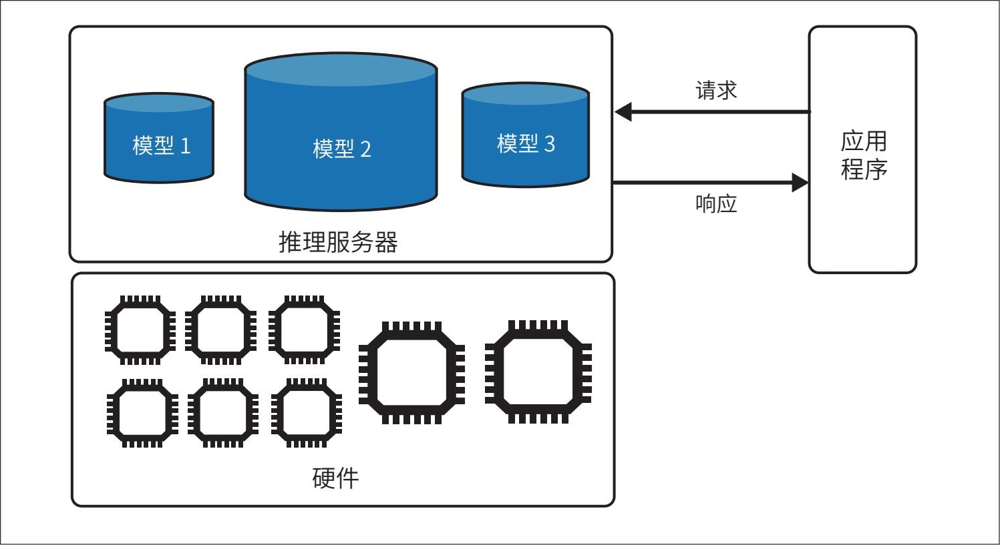

> **圖片描述：** 此圖展示一個簡單的推理服務架構。上方框內為「推理伺服器」，包含三個模型（模型1、模型2、模型3），以藍色圓柱體表示。右側為「應用程式」方塊，透過「請求」和「回應」雙向箭頭與推理伺服器通訊。下方框為「硬體」層，顯示多個處理器晶片圖示，代表支撐推理伺服器運作的底層硬體資源。

圖9-1：一個簡單的推理服務

OpenAI和谷歌等提供的模型API都屬於推理服務。如果你使用這類服務，則無須實施本章討論的大部分技術。但如果你選擇自託管模型，就需要負責構建、最佳化和維護推理服務。

**1. 計算瓶頸**

最佳化的關鍵在於識別瓶頸並加以解決。例如，為最佳化交通，城市規劃者會找出擁堵點並採取疏導措施。同樣，推理伺服器的設計應致力於解決其所服務的推理任務的計算瓶頸。計算瓶頸主要有兩種型別：計算受限（compute-bound）和內存帶寬受限（memory bandwidth-bound）。

計算受限

計算受限是指任務的完成時間主要由計算量決定。例如，密碼破解通常是計算受限的，因為破解加密演演算法需要大量的數學計算。

內存帶寬受限

記憶體頻寬受限是指任務受限於系統內部的資料傳輸速率，例如記憶體與處理器之間的資料傳輸速率。如果你將資料儲存在CPU記憶體中，但在GPU上訓練模型，就必須將資料從CPU傳輸到GPU，這個過程可能耗時較長。這種情況可簡稱為帶寬受限（bandwidth-bound）。在相關文獻中，記憶體頻寬受限通常也被稱為內存受限（memory-bound）。

術語歧義：內存受限與帶寬受限

- 根據我的經驗，具有系統背景的人（如最佳化工程師和GPU工程師）通常將記憶體受限理解為頻寬受限，而具有AI背景的人（如機器學習工程師和AI工程師）通常將記憶體受限理解為記憶體容量受限。

有些人使用“記憶體受限”來指代任務的完成時間受限於記憶體容量而非記憶體頻寬的情況。這種情況通常發生在硬體記憶體不足以處理任務時，例如機器的記憶體不足以儲存整個網際網路的資料。這種“記憶體受限”通常表現為工程師所熟知的錯誤：OOM（out-of-memory，記憶體溢位）。

這種限制通常可以透過將任務拆分成更小的部分來緩解。例如，當GPU記憶體受限而無法容納整個模型時，可以將模型拆分儲存在GPU記憶體和CPU記憶體中。這種拆分會導致計算速度變慢，因為資料在CPU與GPU之間傳輸需要時間。但如果資料傳輸速率足夠快，這個問題的影響就會減弱。因此，記憶體容量限制實際上往往取決於記憶體頻寬。

- 該論文使用“記憶體受限”指代記憶體頻寬受限。

計算受限和記憶體頻寬受限的概念源於論文“Roofline: An Insightful Visual Performance Model for Multicore Architectures”（Williams等，2009）。
	從數學角度看，可以根據操作的算術強度（arithmetic intensity），即每訪問1位元組記憶體所執行的算術運算次數來判斷其為計算受限還是記憶體頻寬受限。NVIDIA Nsight等效能分析工具可透過屋頂圖（roof line chart）直觀地展示工作負載是屬於計算受限還是記憶體頻寬受限，如圖9-2所示。屋頂圖因形似屋頂而得名，現已成為分析硬體效能的常用工具。

	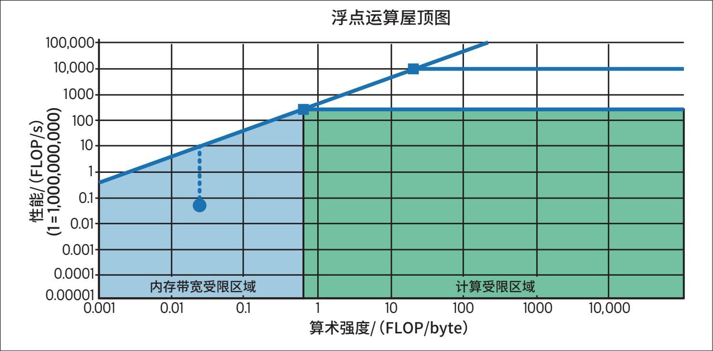

> **圖片描述：** 此圖為浮點運算屋頂圖（Roofline Chart），使用對數座標。X軸為「算術強度」（FLOP/byte），Y軸為「效能」（FLOP/s）。圖中有一條斜線和一條水平線構成屋頂形狀。左下方藍色區域標示為「記憶體頻寬受限區域」，右上方綠色區域標示為「計算受限區域」。藍色圓點標示在記憶體頻寬受限區域中，方形標記位於計算受限區域中，說明不同工作負載可能落在不同的效能瓶頸區域。

圖9-2：屋頂圖可以幫助你直觀地判斷一個操作屬於計算受限還是記憶體頻寬受限。該圖使用對數座標

不同的最佳化技術旨在緩解不同的瓶頸。例如，計算受限的工作負載可以透過分散到更多晶片上或使用計算能力更強（如FLOP/s更高）的晶片來加速，而記憶體頻寬受限的工作負載可以透過使用頻寬更高的晶片來加速。

不同的模型架構和工作負載會呈現出不同型別的計算瓶頸。例如，Stable Diffusion等影像生成模型的推理通常是計算受限的，而自迴歸語言模型的推理通常是記憶體頻寬受限的。

以語言模型的推理為例。回顧第2章，基於Transformer的語言模型的推理包括兩個步驟：預填充和解碼。

預填充

- 預填充實際上是為Transformer模型初始化KV快取。

模型並行處理輸入token。
	一次能處理多少個token取決於硬體在給定時間內的運算能力。因此，預填充是計算受限的。

解碼

模型每次生成一個輸出token。從宏觀層面看，這一步通常涉及載入大型矩陣（如模型權重），這受限於硬體的資料載入速度。因此，解碼是記憶體頻寬受限的。

圖9-3展示了預填充和解碼的過程。

	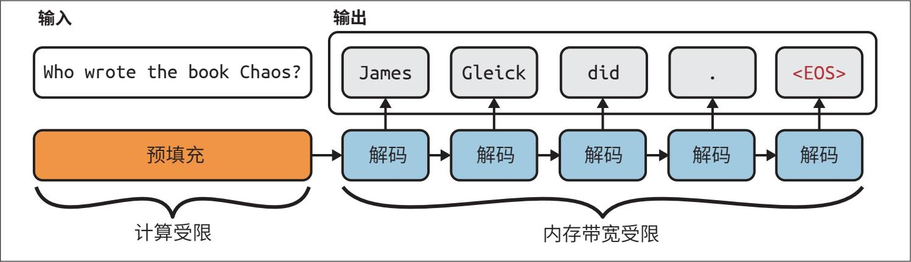

> **圖片描述：** 此圖展示自迴歸語言模型推理的兩個步驟。左側「輸入」為 "Who wrote the book Chaos?"，經過橘色的「預填充」步驟（標示為計算受限）。右側「輸出」依序生成 "James"、"Gleick"、"did"、"."、"<EOS>"，每一步經過藍色的「解碼」步驟（標示為記憶體頻寬受限）。弧形箭頭表示每個解碼步驟依賴前一個步驟的輸出。

圖9-3：自迴歸語言模型的推理包括兩個步驟：預填充和解碼。<EOS>表示序列結束token

由於預填充和解碼階段具有不同的計算特徵，在生產環境中通常將它們分離到不同的機器上進行處理，以實作解耦。9.2.2節將詳細討論這種技術。

影響LLM推理伺服器中預填充和解碼計算量（進而影響其效能瓶頸）的因素包括上下文長度、輸出長度和請求批處理策略。較長的上下文通常會導致記憶體頻寬成為效能瓶頸，但透過巧妙的最佳化技術（本章稍後將討論）可以消除這一瓶頸。

截至本書撰寫時，由於Transformer架構的廣泛應用和現有加速器技術的侷限，許多AI和資料工作負載受限於記憶體頻寬。然而，未來軟體和硬體的進步將有望使AI和資料工作負載向計算受限轉變。

**2. 在線推理API與批處理推理API**

許多服務提供商提供兩種型別的推理API：線上推理API和批處理推理API。

·線上推理API以最佳化延遲為目標，請求一經到達即被處理。

- 在執行推理服務時，將推理API分為線上推理API和批處理推理API有助於優先處理對延遲要求更高的請求。假設推理伺服器在不降低延遲的情況下每秒最多處理X個請求，但實際需求是每秒處理Y個請求，且Y>X。在理想情況下，延遲要求不高的使用者可以將請求傳送到批處理推理API，這樣推理服務就可以優先處理線上推理API的請求。

·批處理推理API以最佳化成本為目標。如果你的應用對延遲的要求不嚴格，可以將請求傳送到批處理推理API，以實作更高效的處理。較高的延遲允許使用更廣泛的最佳化技術，包括批次處理多個請求和使用成本更低的硬體。例如，截至本書撰寫時，Google Gemini和OpenAI均提供批處理推理API，其成本降低了50%，但週轉時間顯著延長（通常以小時而非秒或分鐘計）。

線上推理API可以在不明顯影響延遲的情況下對請求進行批處理，9.2.2節將對此進行討論。線上推理API與批處理推理API的真正區別在於，線上推理API關注更低的延遲，而批處理推理API關注更高的吞吐量。

面向客戶的應用場景（如聊天機器人和程式碼生成）通常需要更低的延遲，因此傾向於使用線上推理API。對延遲要求不高的應用場景則更適合使用批處理推理API，這類應用場景包括：

·生成合成資料

·定期報告，例如彙總Slack訊息、分析社交媒體上的品牌輿情，以及分析客戶支援工單

·新客戶入駐（需要處理客戶上傳的全部文件）

·模型遷移（需要重新處理所有資料）

·為大規模客戶群生成個性化推薦或新聞簡報

·透過重新索引組織資料來更新知識庫

API通常預設返回完整的響應。然而，在自迴歸解碼過程中，模型生成完整的響應可能需要較長時間，而使用者往往缺乏耐心。許多線上推理API提供流式模式（streaming mode），即每生成一個token就立即返回，從而縮短了使用者等待第一個token的時間。這種模式的缺點是，無法在向使用者展示之前對響應進行評分，從而增加了使用者看到不良響應的風險。不過，一旦檢測到風險，仍可以事後更新或刪除響應。

	

> **圖片描述：** 此圖為 O'Reilly 書籍系列的裝飾性圖示，繪有一隻橘紅色的蠍子剪影，置於淺色邊框內。此為章節間的視覺分隔元素。

 基礎模型的批處理推理與傳統機器學習的批處理推理有所不同。在傳統機器學習中：

·線上推理是指在請求到達之後計算預測結果；

·批處理推理是指在請求到達之前預先計算預測結果。

- 如9.2.2節所述，通常可以提前知道應用的系統提示詞，但很難預測具體的使用者查詢。

對於輸入有限且可預測的應用場景（如推薦系統），預先計算是可行的。例如，可以提前為所有使用者生成推薦結果，當請求到達（如使用者訪問網站）時，直接調取預先計算的預測結果。然而，在基礎模型的應用場景中，輸入通常是開放式的，很難預測所有使用者的提示詞。

### 9.1.2 推理性能指標

在進行最佳化之前，明確需要最佳化的指標至關重要。從使用者的角度來看，核心指標是延遲（響應質量是模型的屬性，而非推理服務的屬性）。然而，應用開發者還必須考慮吞吐量和利用率，因為這些指標影響應用的成本。

**1. 延遲、TTFT和TPOT**

延遲衡量的是從使用者傳送查詢到收到完整響應的時間。對於自迴歸生成（尤其是在流式模式下），整體延遲可以分解為以下幾個指標。

TTFT

- 在聊天機器人發展初期，有人抱怨機器人響應得太快，顯得不自然（參見2017年5月Ry Crozier的報道“Lufthansa Delays Chatbot's Responses to Make it More ‘Human’”）。不過，隨著人們對聊天機器人越來越熟悉，這種現象已不復存在。

TTFT（time to first token，首個token的生成時間）衡量的是使用者傳送查詢後生成第一個token所需的時間。它對應於預填充階段的持續時間，並取決於輸入的長度。使用者對不同應用的TTFT可能存在不同預期。例如，使用者希望對話式聊天機器人瞬時響應
	，而對於長文件摘要任務，則可以接受更長的等待時間。

TPOT

TPOT（time per output token，每個輸出token的生成時間）衡量的是在生成第一個token之後，生成每個輸出token平均所需的時間。如果生成每個token需要100 ms，那麼生成1000個token將需要100 s。

在流式模式下，使用者隨著每個token的生成逐個閱讀，因此TPOT應短於人類閱讀一個token所需的時間，但不必過短。一個快速閱讀者閱讀一個token約需120 ms，因此TPOT在120 ms左右（每秒生成6～8個token）即可滿足大多數應用場景的需求。

TBT和ITL

- LinkedIn使用TBT，而NVIDIA使用ITL。

TPOT指標的變體包括TBT（time between tokens，token間隔時間）和ITL（inter-token latency，token間延遲）。
	兩者都用於衡量輸出token之間的時間間隔。

整體延遲=TTFT+TPOT×（輸出token數）。

- Anyscale的一項實驗表明，100個輸入token對整體延遲的影響大約等同於1個輸出token對整體延遲的影響。

整體延遲相同的兩個應用可能會因TTFT和TPOT不同而帶來不同的使用者體驗。使用者是希望立即獲得第一個token而接受後續生成token的間隔時間較長，還是願意稍加等待第一個token以換取之後更快的生成速度？應用開發者需要透過使用者研究來確定最佳的使用者體驗。將更多的計算資源從解碼階段轉移到預填充階段，可以以犧牲TPOT為代價來最佳化TTFT，反之亦然。

需要注意的是，使用者感知的TTFT和TPOT可能與模型的實際值有所不同，尤其是在涉及CoT或智慧體查詢的場景中，模型會生成一些不向使用者展示的中間步驟。為此，一些團隊使用首個token發布時間（time to publish）這一指標，以明確表示衡量的是使用者實際看到第一個token所需的時間。

考慮這樣一個場景：使用者傳送查詢後，模型執行以下步驟。

1. 生成一個由一系列動作組成的計劃，這個計劃不會展示給使用者。

2. 執行這些動作並記錄輸出，這些輸出也不會展示給使用者。

3. 根據輸出生成最終的響應並展示給使用者。

從模型的角度來看，第一個token在步驟1中生成，此時模型內部開始token生成過程。然而，使用者只能看到步驟3中生成的最終輸出的第一個token，因此從使用者的角度來看，TTFT要長得多。

由於延遲是一個分佈概念，平均值可能具有誤導性。假設10個請求的TTFT分別為100 ms、102 ms、100 ms、100 ms、99 ms、104 ms、110 ms、90 ms、3000 ms、95 ms，則這些請求的平均TTFT為390 ms，這讓推理服務看起來比典型情況慢。這可能是因為某個請求遇到了網路錯誤，或者某段特別長的提示詞需要超長的預填充時間。無論是哪種情況，你都應該進行調查。當請求量很大時，導致平均延遲失真的異常值幾乎不可避免。

關注延遲的百分位數通常更具參考價值，因為它們可以反映特定比例請求的延遲情況。最常用的百分位數是第50百分位數，簡稱p50（中位數）。如果中位數是100 ms，意味著一半請求的TTFT超過100 ms，另一半請求的TTFT則少於100 ms。關注百分位數還有助於發現異常值，這些異常值可能是某些問題的徵兆。通常需要關注的百分位數包括p90、p95和p99。此外，繪製TTFT值與輸入長度的關係圖也很有幫助。

**2. 吞吐量與有效吞吐量**

吞吐量衡量的是推理服務針對所有使用者和請求，每秒生成的輸出token數。

有些團隊在計算吞吐量時同時統計輸入token數和輸出token數。然而，由於處理輸入token（預填充階段）和生成輸出token（解碼階段）存在不同的計算瓶頸，並且在現代推理伺服器中常被解耦處理，因此應該分別計算輸入吞吐量和輸出吞吐量。當沒有任何修飾語時，吞吐量通常指輸出token的吞吐量。

吞吐量通常以每秒生成的token數（tokens per second，TPS）來衡量。如果服務面向多個使用者，也會使用使用者每秒token數來評估系統隨使用者數量增加的擴充套件能力。

吞吐量也可以用給定時間內完成的請求數來衡量。許多應用使用每秒請求數（requests per second，RPS）作為指標。但對於基於基礎模型構建的應用，一個請求可能耗時數秒，因此常以每分鐘請求數（requests per minute，RPM）為指標。追蹤這一指標有助於理解推理服務處理併發請求的能力。如果併發請求過多，部分服務提供商可能會觸發限流。

吞吐量與計算成本直接相關。通常，吞吐量越高，計算成本越低。假設系統的計算成本為每小時2美元，吞吐量為100 TPS，則每生成100萬個輸出token的成本約為5.56美元。如果每次請求平均生成200個輸出token，那麼解碼1000個請求的成本約為1.11美元。

預填充成本也可以用類似方法計算。如果硬體成本為每小時2美元，且每分鐘可以完成100個請求的預填充處理，那麼1000個請求的預填充成本約為0.33美元。

每次請求的總成本是預填充成本與解碼成本之和。在上述例子中，處理1000個請求的總成本為1.11美元+0.33美元=1.44美元。

吞吐量的表現取決於模型、硬體和工作負載。較小的模型和高階晶片通常能實作更高的吞吐量。輸入/輸出長度穩定的工作負載比長度多變的工作負載更易於最佳化。

即使模型規模、硬體配置和工作負載類似，直接比較吞吐量也可能只能得到近似結果，因為token數取決於token的構成，而不同模型使用的分詞器不同。因此，更好的做法是使用每次請求的成本（cost per request）等指標來比較推理伺服器的效率。

與大多數軟體應用一樣，AI應用也需要權衡延遲與吞吐量。批處理（batching）等技術可以提高吞吐量，但會增加延遲。LinkedIn AI團隊在部署生成式AI產品一年後的總結報告中提到，如果願意犧牲TTFT和TPOT，實作吞吐量翻倍甚至翻三倍並不罕見。

鑑於這種權衡，僅僅根據吞吐量和成本來選擇推理服務可能導致糟糕的使用者體驗。因此，一些團隊開始關注有效吞吐量（goodput）。這是一個借鑑自網路領域並適用於LLM應用的指標，用於衡量每秒滿足軟件級目標（software-level objective，SLO）的請求數。

假設你的應用有以下目標：TTFT最多為200 ms，TPOT最多為100 ms。若你的推理服務每秒可以完成10個請求，但其中只有3個滿足SLO，那麼該服務的有效吞吐量為每秒3個請求。圖9-4展示了這種情況的視覺化示意圖。

**3. 利用率、MFU和MBU**

利用率指標用於衡量資源的使用效率，通常指資源實際使用量與其總可用容量之比。

GPU利用率（GPU utilization）是一個常見但經常被誤解的指標，NVIDIA對此也負有一定責任。NVIDIA官方用於監控GPU使用情況的工具是nvidia-smi，其中smi為system management interface（系統管理介面）的縮寫。該工具顯示的一個指標是GPU利用率，它表示GPU處於活躍狀態（正在執行核心）的時間百分比。例如，在GPU叢集上執行推理任務10小時，如果GPU在其中的5小時處於活躍狀態，那麼GPU利用率為50%。

	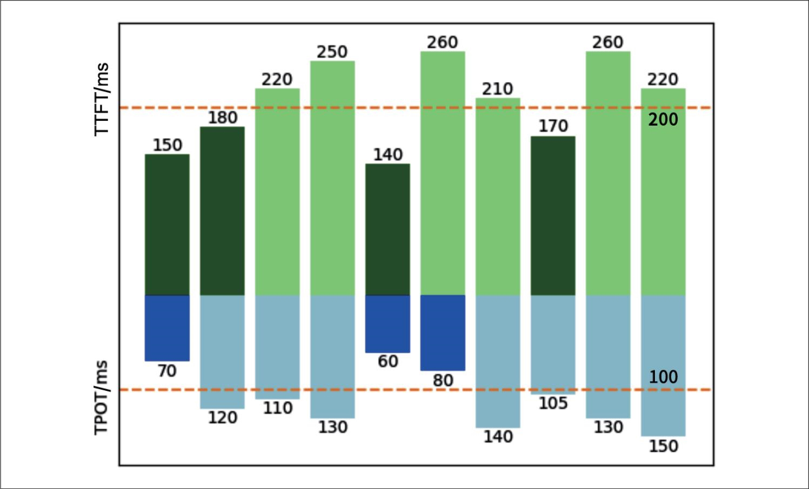

> **圖片描述：** 此圖為有效吞吐量（Goodput）的視覺化長條圖。圖中展示10個請求的TTFT（上方綠色長條）和TPOT（下方藍色長條）指標。兩條橘色虛線分別標示TTFT和TPOT的SLO閾值。部分請求超過閾值（即不滿足SLO），只有3個請求同時滿足TTFT和TPOT的SLO要求，因此有效吞吐量為每秒3個請求。

圖9-4：如果一個推理服務每秒可以完成10個請求，但只有3個滿足SLO，那麼它的有效吞吐量為每秒3個請求

然而，處於活躍狀態並不等同於高效處理任務。簡單來說，假設有一個微型GPU，每秒能執行100次運算。根據nvidia-smi對利用率的定義，即使這塊GPU每秒只執行1次運算，利用率也可能顯示為100%。

如果你付費使用一臺每秒能執行100次運算的機器，卻只用它執行1次運算，那麼這無疑是浪費資金。因此，nvidia-smi的GPU利用率指標實用性有限。實際更有價值的利用率指標是機器在指定時間內實際執行的運算量佔理論最大運算量的比例。這個指標稱為MFU（model FLOP/s utilization，模型每秒浮點運算利用率），以區別於NVIDIA的GPU利用率指標。

- 人們長期以來一直關注FLOP/s利用率，但術語MFU是在關於PaLM的論文“PaLM: Scaling Language Modeling with Pathways”（Chowdhery等，2022）中首次提出的。

MFU是實際測量的吞吐量（以TPS為單位）與系統在峰值FLOP/s下理論最大吞吐量的比值。如果在晶片製造商宣稱的峰值FLOP/s下晶片的吞吐量為100 TPS，但在實際推理服務中只能達到20 TPS，那麼MFU為20%。

同樣，由於記憶體頻寬成本高昂，硬體頻寬的使用效率也備受關注。MBU（model bandwidth utilization，模型頻寬利用率）衡量的是實際使用的記憶體頻寬佔理論最大記憶體頻寬的百分比。如果晶片的峰值頻寬是1 TB/s，而推理任務只使用了500 GB/s，那麼MBU為50%。

計算LLM推理任務所使用的記憶體頻寬非常簡單：

使用的記憶體頻寬=引數量×每個引數佔用的位元組數×吞吐量

MBU的計算公式如下：

MBU=使用的記憶體頻寬/理論頻寬

例如，你使用一個FP16精度的70億引數模型（每個引數佔用2位元組），並達到100 TPS的吞吐量，那麼使用的記憶體頻寬為：

7×109×2×100=1400 GB/s

這凸顯了量化的重要性（第7章曾討論）。每個引數佔用的位元組數越少，模型消耗的頻寬就越少。

如果這是在一個理論記憶體頻寬為2 TB/s的A100-80GB GPU上完成的，那麼MBU為：

（1400 GB/s）/（2 TB/s）=70%

吞吐量（以TPS為單位）與MBU、MFU之間均存線上性關係，因此有時人們用吞吐量來指代MBU和MFU。

MFU和MBU的優劣取決於模型、硬體和工作負載。計算受限的工作負載通常具有較高的MFU和較低的MBU，而記憶體頻寬受限的工作負載通常表現出較低的MFU和較高的MBU。

- 晶片製造商可能採用我稱之為“峰值FLOP/s包裝”的營銷策略——在特定條件（如使用特殊形狀的稀疏矩陣）下進行實驗，以提高峰值FLOP/s。更高的峰值FLOP/s包裝讓它們的晶片更具吸引力，但這會導致使用者在實際場景中更難實作較高的MFU。

得益於更強的可預測性，訓練過程的工作負載可以透過更高效的最佳化手段（如更優的批處理）提升效能，因此訓練任務的MFU通常高於推理任務的MFU。在推理過程中，由於預填充階段是計算受限的，而解碼階段是記憶體頻寬受限的，因此預填充階段的MFU通常高於解碼階段的MFU。截至本書撰寫時，對於模型訓練，MFU超過50%通常被視為表現良好，但在特定硬體上可能難以實作。
	表9-1展示了一些模型和加速器晶片的MFU。

表9-1：來自“PaLM: Scaling Language Modeling with Pathways”（Chowdhery等，2022）的MFU範例

	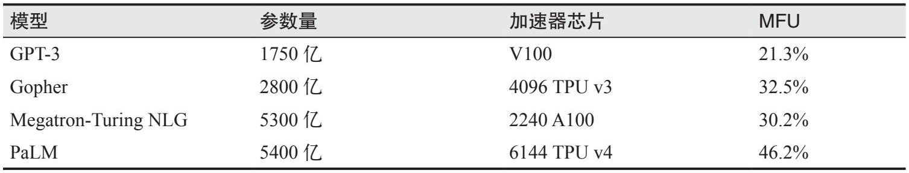

> **圖片描述：** 此為MFU範例表格，列出四個模型的參數量、使用的加速器晶片及對應的MFU值：GPT-3（1750億參數，V100，MFU 21.3%）、Gopher（2800億參數，4096顆TPU v3，MFU 32.5%）、Megatron-Turing NLG（5300億參數，2240顆A100，MFU 30.2%）、PaLM（5400億參數，6144顆TPU v4，MFU 46.2%）。

圖9-5展示了在不同硬體上使用FP16精度的Llama 2-70B模型進行推理時的MBU。隨著併發使用者數量的增加，每秒的計算負載增加，使得工作負載從記憶體頻寬受限轉變為計算受限，這可能導致MBU下降。

	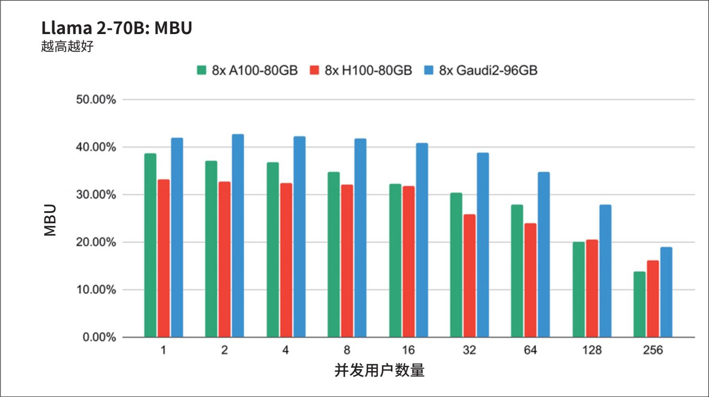

> **圖片描述：** 此圖為Llama 2-70B模型在三種不同晶片上的MBU（模型頻寬利用率）長條圖。X軸為並發使用者數量（1至256），Y軸為MBU百分比（0%至50%）。三種晶片分別為8x A100-80GB（綠色）、8x H100-80GB（紅色）、8x Gaudi2-96GB（藍色）。隨著並發使用者數量增加，三種晶片的MBU均呈下降趨勢，從約35-42%降至約14-20%。

圖9-5：FP16精度的Llama 2-70B模型在三種不同晶片上的頻寬利用率。隨著併發使用者數量的增加，MBU逐漸下降。圖片來自“LLM Training and Inference with Intel Gaudi 2 AI Accelerators”（Databricks，2024）

利用率指標有助於追蹤系統的效率。在相同硬體上執行相似工作負載時，更高的利用率通常意味著更高的服務效率。然而，我們的目標並非單純追求晶片的最高利用率，而是關注如何以更快的速度、更低的成本完成任務。如果成本和延遲都增加了，那麼再高的利用率也毫無意義。

### 9.1.3 AI加速器

軟體執行的速度和成本取決於其依託的硬體。儘管存在一些通用的最佳化技術，但深入理解硬體有助於實作更深層次的最佳化。本節將從推理的角度剖析硬體，但相關內容同樣適用於訓練場景。

- 20世紀60年代，電腦只能執行單層神經網路，這類網路的能力非常有限。AI先驅Marvin Minsky和Seymour Papert在其著作Perceptrons: An Introduction to Computational Geometry（麻省理工學院出版社，1969）中提出，即便引入隱藏層，神經網路也難以實作重大突破。他們的觀點是：“關於後一種（含隱藏層）機器的計算能力，我們幾乎一無所知。我們認為它的能力與低階感知機的能力相比，不會有顯著提升。”由於當時缺乏足夠的計算能力來反駁這一觀點，該論斷被廣泛引用，成為20世紀70年代AI研究資金枯竭的關鍵原因之一。

AI模型的發展與硬體的進步始終緊密相連。缺乏足夠強大的算力正是導致20世紀70年代第一次AI寒冬的因素之一。

- 關於是否應該重新命名GPU的討論從未間斷，因為GPU的用途早已遠超圖形處理（Jon Peddie，“Chasing Pixels”，2018）。NVIDIA的CEO黃仁勳在一次採訪中表示，當GPU開始流行並具備更多功能後，他們曾考慮將其更名為更通用的名稱，比如GPGPU（通用GPU）或XGU。但最終決定不改名，因為他們相信購買GPU的人足夠了解這款產品，能夠理解GPU的用途遠超其名稱所示。

2012年深度學習的復興也與計算能力密切相關。AlexNet（Krizhevsky等，“ImageNet Classification with Deep Convolutional Neural Networks”，2012）之所以廣受歡迎，一個公認的原因是它首次成功地使用GPU來訓練神經網路。
	在GPU用於深度學習之前，如果想訓練達到AlexNet規模的模型，就必須使用幾千個CPU，例如谷歌在AlexNet釋出前幾個月推出的模型。相比之下，少量的GPU更易獲取，由此引發了深度學習的研究熱潮。

**1. 什麼是加速器**

加速器是一種專為加速特定型別的計算任務而設計的晶片。AI加速器專門用於AI任務，目前主流的AI加速器是GPU。在21世紀20年代初的AI熱潮中，最大的經濟驅動力無疑來自NVIDIA。

CPU和GPU的主要區別在於：CPU為通用計算設計，GPU則專為並行處理設計。

·CPU擁有少量高效能核心，高階消費級裝置通常有多達64個核心。雖然多核CPU能有效處理多執行緒任務，但CPU更擅長處理需要高單執行緒效能的任務，例如執行作業系統、管理輸入/輸出（I/O）操作或處理複雜的序列流程。

- 根據論文“Data Movement Is All You Need: A Case Study on Optimizing Transformers”（Ivanov等，2021）和“Scalable MatMul-free Language Modeling”（Zhu等，2024）的研究，矩陣乘法（常簡稱為matmul）在神經網路所有浮點運算中的佔比估計超過90%。

·GPU擁有幾千個規模較小、效能相對較弱的核心，專為可拆分為大量小型獨立計算的任務（如圖形渲染和機器學習）而最佳化。在機器學習任務中，最常見的運算是矩陣乘法（matrix multiplication），這種運算高度可並行化。

儘管追求高效的並行處理提高了計算能力，但也給記憶體設計和功耗帶來了挑戰。

NVIDIA GPU的成功促使許多專為加速AI任務而設計的晶片問世，包括AMD的新一代GPU、谷歌的TPU（張量處理單元）、英特爾的Habana Gaudi、Graphcore的IPU（智慧處理單元）、Groq的LPU（語言處理單元）、Cerebras的QPU（晶圓級量子處理單元）等，未來還將有更多類似的產品湧現。

儘管許多晶片既能用於訓練又能用於推理，但目前的一個重要趨勢是開發推理專用晶片。Desislavov等的調研（“Trends in AI Inference Energy Consumption: Beyond the Performance-vs-Parameter Laws of Deep Learning”，2023）指出，在許多系統中，推理成本可能超過訓練成本；在已部署的AI系統中，推理成本佔機器學習總成本的比例高達90%。

如第7章所述，由於反向傳播的需求，訓練過程需要更多記憶體，並且通常難以採用低精度計算。此外，訓練通常以提升吞吐量為目標，而推理則旨在儘量降低延遲。

因此，專為推理設計的晶片通常針對低精度和更快的記憶體訪問進行最佳化，而不是追求大容量記憶體。這類晶片的典型代表包括Apple Neural Engine、AWS Inferentia和MTIA（Meta訓練與推理加速器）。專為邊緣計算設計的晶片，如谷歌的Edge TPU和NVIDIA Jetson Xavier，通常也以適配推理任務為核心目標。

- 晶片可以為特定模型架構而設計，模型架構也可以為充分發揮晶片效能而設計。例如，Transformer最初由谷歌設計，以便在TPU上高效執行，後來才針對GPU進行最佳化。

此外，還有專為不同模型架構設計的晶片，例如專門用於Transformer的晶片。
	目前，許多晶片以資料中心為主要應用場景進行設計，而面向消費級裝置（如手機和筆記本電腦）的專用晶片也日益增多。

不同的硬體架構具有不同的記憶體佈局和持續演進的專用計算單元。這些計算單元針對特定的資料型別（如純量、向量或張量）進行最佳化，如圖9-6所示。

	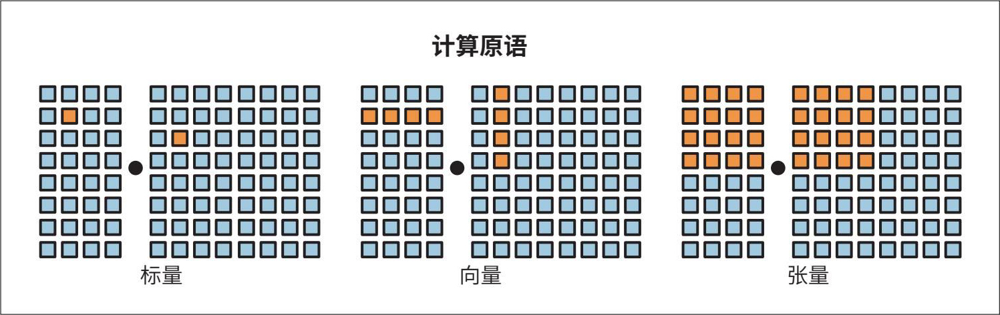

> **圖片描述：** 此圖展示三種不同的計算原語（Compute Primitives）。左側為「標量」運算，顯示單一元素的乘法操作；中間為「向量」運算，顯示兩組向量的元素級乘法；右側為「張量」運算，顯示兩個矩陣的乘法操作。每組皆以網格方塊視覺化呈現，橘色方塊為運算元素，藍色方塊為結果。

圖9-6：不同的計算原語（不可拆分的計算單元）。圖片靈感源自Chen等（2018）的論文“TVM: An Automated End-to-End Optimizing Compiler for Deep Learning”

一款晶片可能同時擁有多種不同的計算單元，分別針對各種資料型別進行最佳化。例如，傳統GPU支援向量運算，但許多現代GPU包含專門為矩陣和張量計算最佳化的張量核心；TPU則將張量運算作為其主要計算原語進行設計。為了在特定硬體架構上高效執行模型，需要充分考慮架構的記憶體佈局和計算原語。

晶片的規格說明包含許多細節，這些細節在針對特定應用場景評估晶片時頗具價值。然而，在大多數應用場景中，最核心的特性通常是計算能力、記憶體容量與記憶體頻寬，以及功耗。下面將以GPU為例來說明這些特性。

**2. 計算能力**

計算能力通常以晶片在單位時間內能夠執行的運算次數來衡量。最常用的指標是FLOP/s（常寫作FLOPS），代表晶片每秒可執行的浮點運算次數的峰值。然而，在實際應用中很難達到這一峰值。實際FLOP/s與理論FLOP/s之比是衡量利用率的重要指標。

晶片每秒可執行的運算次數取決於數值精度——精度越高，晶片能執行的運算次數越少。例如，將兩個32位數相加所需的計算量通常是將兩個16位數相加所需計算量的兩倍。不過，由於不同晶片的最佳化方式不同，晶片在給定時間內執行32位運算的次數往往並不正好是執行16位運算次數的一半。若需回顧數值精度的概述，請參閱7.3.3節。

表9-2展示了NVIDIA H100 SXM晶片在不同精度格式下的FLOP/s規格。

表9-2：NVIDIA H100 SXM晶片的FLOP/s規格

	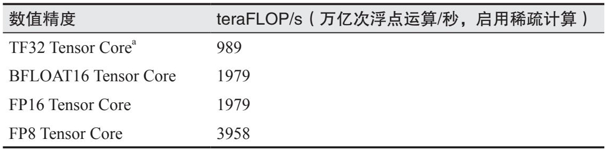

> **圖片描述：** 此為NVIDIA H100 SXM晶片的FLOP/s規格表格。列出四種數值精度及其對應的teraFLOP/s（啟用稀疏計算）：TF32 Tensor Core（989）、BFLOAT16 Tensor Core（1979）、FP16 Tensor Core（1979）、FP8 Tensor Core（3958）。備註標示TF32為19位格式而非32位格式。

a 回顧第7章可知，TF32是一種19位格式，而非32位格式。

**3. 內存容量與內存帶寬**

由於GPU擁有大量並行工作的核心，資料需要頻繁地從記憶體傳輸到這些核心，因此資料傳輸速率非常重要。當在應用中處理涉及大量權重矩陣和訓練資料的AI模型時，資料傳輸速率尤為關鍵——必須快速傳輸大量資料以確保核心高效執行。因此，GPU記憶體需要比CPU記憶體具備更高的頻寬和更低的延遲，這就要求GPU記憶體採用更先進的儲存技術。這也是GPU記憶體比CPU記憶體成本更高的原因之一。

- 中低端GPU可能使用GDDR（圖形雙倍資料速率）記憶體。

具體來說，CPU通常使用DDR SDRAM（雙倍資料速率同步動態隨機存取儲存器），它具有二維結構；GPU，尤其是高階GPU，通常使用HBM（高頻寬記憶體），它採用三維堆疊結構。

加速器的記憶體效能主要透過容量和帶寬衡量。評估這些指標時，必須結合加速器所處的系統環境進行考量。GPU等加速器通常與三個層次的記憶體互動，如圖9-7所示。

	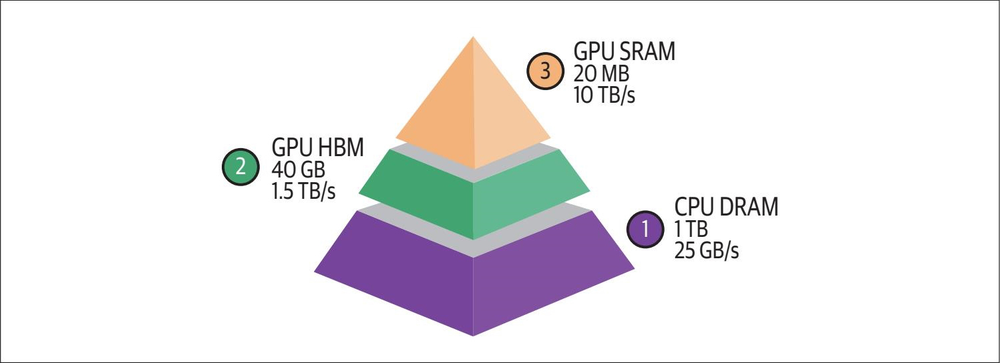

> **圖片描述：** 此圖為AI加速器的記憶體層次結構金字塔圖。底層（紫色，標記1）為CPU DRAM，容量1 TB，頻寬25 GB/s；中層（綠色，標記2）為GPU HBM，容量40 GB，頻寬1.5 TB/s；頂層（橘色，標記3）為GPU SRAM，容量20 MB，頻寬10 TB/s。由下至上，容量遞減但頻寬遞增。

圖9-7：AI加速器的記憶體層次結構。圖中數字僅供參考，實際數值因晶片而異

CPU內存（DRAM）

加速器通常與CPU協同部署，因此可以訪問CPU記憶體（也稱為系統記憶體、主機記憶體或CPU DRAM）。

在各類記憶體中，CPU記憶體的頻寬通常最低，其資料傳輸速率一般為25～50 GB/s。不過，CPU記憶體容量差異較大，普通筆記本電腦的CPU記憶體容量通常為16～64 GB，而高階工作站的CPU記憶體容量可能達到1 TB甚至更多。

GPU高帶寬內存（HBM）

這是GPU的專用記憶體，由於離GPU更近，其訪問速度比CPU記憶體的訪問速度更快。

HBM能提供極高的頻寬，資料傳輸速率通常為256 GB/s～1.5 TB/s，甚至更快。這種速率對於高效處理大規模資料傳輸和高吞吐量任務至關重要。消費級GPU通常擁有24～80 GB的HBM。

GPU片上SRAM

這種記憶體直接整合在晶片內部，用於儲存被頻繁訪問的資料和指令，以實作近乎即時的訪問。它包括由SRAM構成的L1和L2快取，部分架構還包括L3快取。這些快取屬於更廣義的片上記憶體，片上記憶體還包括暫存器檔案和共享記憶體等其他元件。

SRAM的資料傳輸速率極快，通常超過10 TB/s。但GPU SRAM的容量較小，一般不超過40 MB。

GPU的許多最佳化工作圍繞如何充分利用這種記憶體層次結構展開。然而，截至本書撰寫時，PyTorch和TensorFlow等主流框架尚未提供對記憶體訪問的細粒度控制。這促使許多AI研究人員和工程師開始關注GPU程式語言，例如CUDA（統一計算裝置架構）、Triton（由OpenAI研發）和ROCm（Radeon開放計算平臺），其中ROCm是AMD提供的開源方案，可以替代NVIDIA專有的CUDA。

**4. 功耗**

晶片依賴電晶體進行計算，每一次計算都透過電晶體的開關狀態切換來完成，這一過程會消耗能量。一塊GPU可能擁有幾百億個電晶體，例如NVIDIA A100擁有540億個電晶體，而NVIDIA H100擁有800億個電晶體。當加速器全速執行時，幾百億個電晶體快速切換狀態，這會消耗大量能量併產生大量熱量。為散去這些熱量，必須配備冷卻系統，而冷卻系統本身也會消耗電能，從而進一步增加資料中心的整體能耗。

晶片的能耗可能對環境造成巨大影響，這促使企業加大對綠色資料中心技術的投資力度。一塊NVIDIA H100晶片若以峰值效能持續執行一年，耗電量約為7000 kWh。

- 在建設配備幾萬塊GPU的資料中心時，主要挑戰是確定能夠保障充足電力供應的選址。建設大規模資料中心需要統籌考慮電力供應、網路傳輸速率和地緣政治限制。例如，偏遠地區可能提供更便宜的電力，但會增加網路延遲，這使得資料中心對推理等具有嚴格延遲要求的應用場景缺乏吸引力。

作為對比，美國普通家庭的年均用電量約為10,000 kWh。由此可見，電力是制約算力規模擴張的一大瓶頸。

加速器通常會標明其最大功耗（maximum power draw）或熱設計功耗（thermal design power，TDP）。

·最大功耗表示晶片在滿負荷執行時可能達到的峰值功耗。

·TDP表示晶片在典型工作負載下執行時，冷卻系統需要散發的最大熱量。雖然TDP並非功耗的精確測量值，但可以反映預期的功耗水平。對於CPU和GPU，最大功耗通常約為TDP的1.1～1.5倍，確切關係取決於具體架構和工作負載。

如果你選擇使用雲服務，則無須擔心冷卻或電力問題。然而，瞭解這些數值有助於你理解加速器對環境的影響及整體電力需求。

加速器選型指南

選擇何種加速器取決於具體的工作負載。如果工作負載是計算受限的，應選擇具有更高FLOP/s的晶片。如果工作負載是記憶體頻寬受限的，則應選擇頻寬更高、記憶體容量更大的晶片。

在評估購買哪種晶片時，需要重點考慮以下三個問題。

·該硬體能否執行你的工作負載？

·執行這些工作負載需要多長時間？

·成本是多少？

FLOP/s、記憶體容量和記憶體頻寬是幫助你回答前兩個問題的三個關鍵指標。最後一個問題則比較簡單。雲服務提供商通常按使用量計費，並且不同提供商之間的價格差異不大。如果你選擇自行購買硬體，則可以根據初始購買價格和持續的電力消耗來計算成本。

## 9.2 推理優化的實現

推理最佳化可以在模型、硬體或服務層面進行。為說明三者的區別，我們用射箭來類比。模型層面的最佳化類似於製作更精良的箭；硬體層面的最佳化類似於訓練更強、更優秀的射手；服務層面的最佳化則類似於完善整個流程，包括弓和瞄準條件。

在理想情況下，為提高速度和降低成本而最佳化模型時，不應降低模型的質量。然而，許多最佳化技術可能導致模型效能下降。圖9-8展示了Llama系列模型在不同基準測試中的表現，這些模型由不同的推理服務提供商提供。

	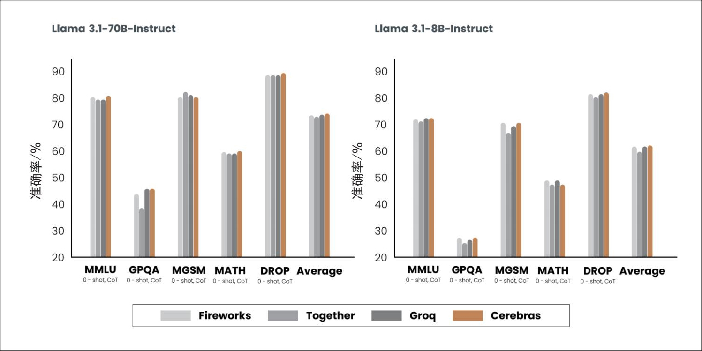

> **圖片描述：** 此圖為Llama系列模型在不同推理服務提供商的基準測試比較。左側為Llama 3.1-70B-Instruct，右側為Llama 3.1-8B-Instruct。X軸為不同基準測試（MMLU、GPQA、MGSM、MATH、DROP、Average），Y軸為準確率（%）。四家提供商分別以不同顏色表示：Fireworks（淺灰）、Together（灰）、Groq（深灰）、Cerebras（橘色）。各提供商的結果存在差異，顯示最佳化技術會影響模型表現。

圖9-8：推理服務提供商使用的最佳化技術可能改變模型的行為，導致不同提供商的模型質量略有差異。該實驗由Cerebras公司於2024年開展

由於硬體設計超出了本書的範圍，因此下文將主要討論模型和服務層面的最佳化技術。雖然這些技術是分開論述的，但請記住，在實際生產環境中，最佳化通常涉及多個層面的技術。

### 9.2.1 模型優化

模型層面的最佳化旨在提高模型的效率，通常透過修改模型本身實作，這可能會改變模型的行為。截至本書撰寫時，許多基礎模型採用Transformer架構，幷包含自迴歸語言模型元件。這些模型在規模、自迴歸解碼機制和注意力機制三方面的特點使得推理過程需要消耗大量資源。下面我們將討論應對這些挑戰的方法。

**1. 模型壓縮**

模型壓縮涉及縮小模型規模的技術。通常，縮小模型規模也能提高模型的推理速度。本書已經討論了兩種模型壓縮技術：量化和蒸餾。量化是指降低模型引數的精度以減少記憶體佔用並提高吞吐量，具體技術細節詳見第7章。蒸餾是指訓練一個小模型以模仿大模型的行為，第8章對相關內容進行了介紹。

模型蒸餾技術表明，用更少的引數捕捉大模型的行為是可行的。那麼，在大模型內部是否存在一個引數子集，能夠捕捉整個模型的行為呢？這正是剪枝技術的核心思想。

在神經網路領域，剪枝有兩種含義。一種是移除神經網路中的完整節點，這意味著改變網路架構並減少引數量。另一種是找到對預測影響最小的引數並將其置為零，這不會減少引數的總數，只會減少非零引數量，從而提升模型稀疏度，減少模型的儲存空間並加快計算速度。

經過剪枝的模型可以直接使用，也可以進一步微調，以調整剩餘引數並恢復因剪枝過程導致的效能下降。剪枝有助於發現更有前景的模型架構（Liu等，“Rethinking the Value of Network Pruning”，2018）。經過剪枝的架構（規模小於剪枝前的架構）也可以從頭開始訓練（Zhu等，“To Prune, or not to Prune: Exploring the Efficacy of Pruning for Model Compression”，2017）。

文獻中已有許多令人鼓舞的剪枝成果。例如，論文“The Lottery Ticket Hypothesis: Finding Sparse, Trainable Neural Networks”（Frankle和Carbin，2019）表明，剪枝可以將某些經過訓練的網路的非零引數量減少90%以上，從而減少記憶體佔用並提高速度，同時不損失準確性。然而，截至本書撰寫時，剪枝在實際應用中並不常見。這是因為，剪枝的實施難度較高（需要使用者理解原始模型的架構），並且其帶來的效能提升通常遠低於其他最佳化方法。此外，剪枝還會導致模型稀疏化，而並非所有硬體架構都能有效利用這種稀疏性。

目前，權重量化是最受歡迎的模型壓縮方法，因為它易於使用、對許多模型開箱即用，並且非常有效。將模型的精度從32位降低到16位可使其記憶體佔用量減少一半。然而，量化技術已經接近極限——每個數值無法低於1位。蒸餾方法也很常見。透過蒸餾可以得到一個規模較小的模型，其行為表現足以滿足實際需求，且可與規模較大的模型相媲美。

**2. 突破自回歸解碼瓶頸**

- 每個token生成步驟都需要將整個模型的引數從加速器的高頻寬記憶體傳輸到計算單元，因此該操作對頻寬要求很高。由於模型每次只能生成一個token，這個過程僅消耗少量的FLOP/s，導致計算效率低下。

如第2章所述，自迴歸語言模型逐個生成token。如果生成一個token需要100 ms，那麼生成包含100個token的響應將需要10 s。
	這個過程不僅速度緩慢，而且成本高昂。在各模型API提供商的計費體系中，一個輸出token的成本大約是一個輸入token成本的2～4倍。Anyscale在一項實驗中發現，一個輸出token對延遲的影響可能與100個輸入token的影響相當（Kadous等，“Reproducible Performance Metrics for LLM inference”，2023）。因此，即使稍微提高自迴歸生成過程的效率，也能顯著改善使用者體驗。

隨著模型最佳化領域的快速發展，新的技術不斷湧現，以突破這個看似無解的瓶頸。也許有一天將出現不再受此瓶頸限制的架構。這裡介紹的技術旨在說明可能的解決方案，而這些技術仍在不斷發展中。

推測解碼（speculative decoding）。推測解碼（也稱推測取樣）使用一個速度更快但能力較弱的模型來生成一系列token，然後由目標模型進行驗證。目標模型是你真正想要使用的模型。速度更快的模型稱為草稿模型或提議模型，因為它生成了初步的輸出。

假設輸入token序列為x*1，*x*2，…，*x**t*。

1. 草稿模型生成長度為*K*的token序列：*x**t**+**1*，*x**t**+**2*，…，*x**t**+**K*。

2. 目標模型並行驗證這*K*個生成的token。

3. 目標模型從左到右接受最長的草稿token子序列，即目標模型認可使用的部分。

4. 假設目標模型接受了*j*個草稿token，即*x**t**+**1*，*x**t**+**2*，…，*x**t**+**j*。目標模型隨後額外生成一個token，即*x**t**+**j**+**1*。

該過程返回步驟1，由草稿模型在給定*x*1，*x*2，…，*x**t*，*x**t**+**1*，*x**t**+**2*，…，*x**t**+**j*的條件下生成*K*個token。該過程如圖9-9所示。

圖9-9：草稿模型生成長度為K*的token序列，目標模型接受它認可的最長的子序列。圖片來自論文“Blockwise Parallel Decoding for Deep Autoregressive Models”（Stern等，2018）

如果沒有草稿token被接受，這個迴圈只產生一個由目標模型生成的token。如果所有草稿token都被接受，這個迴圈將產生*K*+1個token，其中*K*個token由草稿模型生成，1個token由目標模型生成。

如果所有草稿序列都被拒絕，那麼目標模型必須在進行驗證之外生成完整的響應，這可能導致延遲增加。然而，基於以下認知，這種情況完全可以避免。

1. 目標模型驗證token序列所需的時間比生成token序列所需的時間短，因為驗證過程可以並行化，而生成過程是序列化的。推測解碼有效地將解碼過程的計算特徵轉變為預填充過程的計算特徵。

2. 在輸出token序列中，有些token比其他token更容易預測。我們可以找到一個較弱的草稿模型來準確預測這些更容易預測的token，從而提高草稿token的接受率。

- 這也意味著如果MFU已達上限，推測解碼的應用價值就會顯著降低。

3. 解碼過程受限於記憶體頻寬，這意味著在解碼過程中通常存在空閒的FLOP，可用於免費驗證。

接受率取決於具體領域。對於遵循特定結構的文字（如程式碼），接受率通常較高。K*值越大，意味著目標模型需要發起的驗證呼叫次數越少，但會導致草稿token的接受率降低。草稿模型可以採用任意架構，但在理想情況下應與目標模型共享相同的詞表和分詞器。你可以訓練一個自定義的草稿模型，也可以使用現有的較弱的模型。

例如，為了加快Chinchilla-70B的解碼過程，DeepMind訓練了一個擁有40億個引數的同架構草稿模型（Chen等，“Accelerating Large Language Model Decoding with Speculative Sampling”，2023）。該草稿模型生成一個token僅需1.8 ms，而目標模型生成一個token需要14.1 ms。這使得整體響應延遲降低了一半以上，同時不影響響應質量。類似的加速效果也在T5-XXL模型上實作了（Laviathan等，“Fast Inference from Transformers via Speculative Decoding”，2022）。

推測解碼技術因實作相對簡單且不影響模型質量而廣受關注。例如，在PyTorch中僅需50行程式碼即可實作。目前，該技術已被整合到流行的推理框架（如vLLM、TensorRT-LLM和llama.cpp）中。

帶參考的推理（inference with reference）。模型的響應經常需要參考輸入中的token。例如，當要求模型回答有關附帶文件的問題時，模型可能會逐字複述文件中的文字片段；當要求模型修復程式碼漏洞時，模型可能會大量複用原始程式碼，僅做少量修改。與其讓模型重新生成這些重複的token，不如直接從輸入中複製它們，從而加快生成速度。這正是帶參考的推理的核心思想。

帶參考的推理與推測解碼類似，但它不是使用一個模型生成草稿token，而是直接從輸入中選擇草稿token。該技術的關鍵挑戰在於設計一種演演算法，在每個解碼步驟中識別上下文中最相關的文字片段。最簡單的方法是找到與當前token匹配的文字片段。

與推測解碼不同，帶參考的推理不需要額外的模型。然而，它僅適用於上下文與輸出之間存在大量重疊的生成場景，例如檢索系統、程式碼生成或多輪對話。在論文“Inference with Reference: Lossless Acceleration of Large Language Models”（Yang等，2023）中，這種技術在上述場景中實作了兩倍的生成速度提升。

圖9-10展示了帶參考文字的兩個推理結果範例。

圖9-10：帶參考文字的兩個推理結果範例。從輸入中成功複製的文字片段以紅色和綠色顯示。圖片來自Yang等（2023）的論文，基於CC BY 4.0授權

並行解碼（paralleldecoding）。除了使用草稿token加速自迴歸生成，還有一些技術旨在打破生成過程中的序列依賴關係。給定token序列x*1，*x*2，…，*x**t*，這些技術嘗試同時生成*x**t**+**1*，*x**t**+**2*，…，*x**t**+**k*。這意味著模型在尚未確定前一個token（*x**t**+**1*）的情況下生成了下一個token（*x**t**+**2*）。

這種方法之所以可行，是因為現有序列的資訊通常足以預測後續幾個token。例如，給定序列“the cat sits”，即使不知道下一個token是“on”“under”還是“behind”，仍然可以預測後續token是“the”。

並行token可以由同一個解碼器生成，例如Lookahead（前瞻）解碼（Fu等，“Break the Sequential Dependency of LLM Inference Using Lookahead Decoding”，2024）；也可以由不同的解碼頭生成， 例如Medusa（Cai等，“Medusa: Simple LLM Inference Acceleration Framework with Multiple Decoding Heads”，2024）。在Medusa中，原始模型被擴充套件為包含多個解碼頭，每個解碼頭都是一個小型神經網路層，經訓練後專門預測特定位置的後續token。如果原始模型被訓練用於預測下一個token（*x**t**+**1*），那麼第*k*個解碼頭將用於預測token *x**t**+**k**+**1*。這些解碼頭與原始模型一起訓練，但原始模型的引數保持凍結狀態。NVIDIA聲稱，在其HGX H200平臺上，採用Medusa技術可使Llama 3.1模型的token生成速度提升1.9倍（Eassa等，“Low Latency Inference Chapter 1: Up to 1.9×Higher Llama 3.1 Performance with Medusa on NVIDIA HGX H200 with NVLink Switch”，2024）。

- 雅可比方法（Jacobi method）是一種迭代演演算法，允許對解的多個部分同時且獨立地進行更新。

然而，由於這些token並非按順序生成的，因此需要經過驗證，以確保它們彼此之間以及與上下文之間保持一致。並行解碼的一個關鍵環節是驗證與整合。Lookahead解碼使用雅可比方法
	來驗證生成的token，其工作流程如下。

1. 並行生成K*個未來的token。

2. 驗證這*K*個token與上下文之間的一致性和連貫性。

3. 如果一個或多個token未透過驗證，模型不會重新生成全部token，而是僅重新生成或調整未透過驗證的token。

模型不斷最佳化生成的token，直到所有token都透過驗證並被整合到最終的輸出中。這類並行解碼演演算法也被稱為雅可比解碼。

Medusa使用一種基於樹結構的注意力機制來驗證與整合token。每個Medusa頭在每個位置生成多個候選項，這些候選項隨後被組織成樹狀結構，以便系統選擇最優序列。該過程如圖9-11所示。

圖9-11：在Medusa中，每個頭在每個token位置預測多個候選項，系統隨後從這些候選項中選擇最優序列。圖片改編自Cai等（2024）的論文，基於CC BY 4.0授權

雖然打破序列依賴關係的想法很有吸引力，但並行解碼並不直觀，一些技術（如Medusa）的實作也可能較為複雜。

**3. 注意力機制優化**

如第2章所述，生成下一個token需要用到之前所有token的鍵向量和值向量。這意味著：

·生成token x**t*時，需要token *x*1，*x*2，…，*x**t**-**1*的鍵向量和值向量；

·生成token *x**t**+**1*時，需要token *x*1，*x*2，…，*x**t**-**1*，*x**t*的鍵向量和值向量。

在生成token *x**t**+**1*時，無須重新計算token *x*1，*x*2，…，*x**t**-**1*的鍵向量和值向量，而是直接複用前一步計算好的向量。這意味著只需計算token *x**t*的鍵向量和值向量即可。用於儲存供複用的鍵向量和值向量的快取稱為KV快取。新計算的鍵向量和值向量隨後被追加到KV快取中，如圖9-12所示。

圖9-12：為避免在每個解碼步驟中重複計算鍵向量和值向量，可使用KV快取儲存這些向量以供複用
	

> **圖片描述：** 此圖為 O'Reilly 書籍系列的裝飾性圖示，繪有一隻藍紫色烏鴉（或渡鴉）的剪影，站在一條橫線上，置於藍色邊框內。此為章節內提示框的視覺標記。

 KV快取僅在推理階段使用，而不用於訓練階段。在訓練階段，由於序列中的所有token都已知，因此下一個token的生成計算可以一次性並行完成，而無須像推理階段那樣逐步進行。因此，訓練階段不需要KV快取。

- 自迴歸模型的注意力計算的次數為O(n²)。

由於生成一個token需要對之前所有的token計算注意力分數，因此注意力計算的次數隨序列長度的增加呈指數級增長。
	KV快取的大小則隨序列長度的增加呈線性增長。

KV快取的大小還會隨批次大小的增加而增加。根據谷歌的一篇論文的估算，對於一個引數量超過5000億的多頭注意力模型，若批次大小為512，上下文長度為2048，則KV快取總量可達3 TB（Pope等，“Efficiently Scaling Transformer Inference”，2022）。這相當於該模型權重總量的3倍。

KV快取的大小最終受限於可用的硬體儲存空間，這成為執行長上下文應用的瓶頸。此外，將龐大的快取載入到記憶體中傳輸耗時較長，這對延遲敏感型應用來說可能是一個問題。

注意力機制的計算和記憶體需求使得模型難以處理更長的上下文。

業界已開發出許多技術來提高注意力機制的效率。這些技術大致可分為三類：重新設計注意力機制、最佳化KV快取，以及為注意力計算編寫核心。

KV緩存的計算方法

在不進行任何最佳化的情況下，KV快取所需記憶體的計算公式如下：

2×B*×*S*×*L*×*H*×*M*

·*B*：批次大小

·*S*：序列長度

·*L*：Transformer層數

·*H*：模型維度

·*M*：快取資料格式（如FP16或FP32）佔用的位元組數

隨著上下文長度的增加，該數值會急劇膨脹。例如，Llama 2-13B模型有40層，模型維度為5120。當批次大小為32，序列長度為2048，每個數值佔用2位元組時，在不進行任何最佳化的情況下，其KV快取所需記憶體為：

2×32×2048×40×5120×2位元組≈54 GB

重新設計注意力機制。此類技術涉及改變注意力機制的核心工作方式。儘管這些技術有助於最佳化推理效能，但由於它們直接改變了模型的架構，因此只能在訓練階段或微調階段應用。

例如，在生成新token時，局部窗口注意力（local windowed attention）不再關注之前所有的token，而只關注固定大小視窗內的鄰近token（Beltagy等，“Longformer: The Long-Document Transformer”，2020）。這將有效序列長度限制在固定視窗大小內，從而減少了KV快取的佔用和注意力計算量。如果平均序列長度為10,000個token，則將視窗大小設為1000個token，可使KV快取的大小降至原來的十分之一。

區域性視窗注意力可以與全域性注意力交替使用，前者用於捕捉鄰近上下文資訊，後者用於捕捉文件中與任務相關的特定資訊。

跨層注意力（cross-layer attention，Brandon等，“Reducing Transformer Key-Value Cache Size with Cross-Layer Attention”，2024）和多查詢注意力（multi-query attention，Shazeer，“Fast Transformer Decoding: One Write-Head is All You Need”，2019）都透過減少鍵-值對的數量來減少KV快取的記憶體佔用。跨層注意力在相鄰層之間共享鍵向量和值向量。如果三個層共享同一組鍵-值向量，則KV快取的大小將變為原來的三分之一。多查詢注意力在多個查詢頭之間共享鍵-值向量。

分組查詢注意力（grouped-query attention，Ainslie等，“GQA: Training Generalized Multi-Query Transformer Models from Multi-Head Checkpoints”，2023）是多查詢注意力的一種泛化形式。它不再為所有查詢頭分配同一組鍵-值對，而是將查詢頭分成多個更小的組，僅在同一組內的查詢頭之間共享鍵-值對。這種方式使得查詢頭數量和鍵-值對數量能夠實作更靈活的平衡。

AI聊天機器人平臺Character.AI公佈的資料顯示，其平均對話長度達到180條訊息（2024年資料）。由於序列通常較長，推理吞吐量的主要瓶頸在於KV快取的大小。透過採用三種注意力機制設計——多查詢注意力、交錯式區域性注意力與全域性注意力，以及跨層注意力——研究人員成功地將KV快取的大小減少至原來的1/20以下。更重要的是，KV快取的大幅縮減意味著記憶體不再是應用處理高併發請求的瓶頸。

優化KV緩存。KV快取的管理方式對於緩解推理過程中的記憶體瓶頸、實作更大規模的批處理至關重要，尤其是在長上下文的應用場景中。目前，研究人員正積極開發多種技術對此進行最佳化。

vLLM是發展最快的推理框架之一，因引入PagedAttention技術而廣受歡迎。PagedAttention技術透過將KV快取劃分為非連續的記憶體塊來最佳化記憶體管理，減少記憶體碎片，並實作靈活的記憶體共享，從而提高了LLM的服務效率（Kwon等，“Efficient Memory Management for Large Language Model Serving with PagedAttention”，2023）。

其他技術包括KV快取量化（Hooper等，“KVQuant: Towards 10 Million Context Length LLM Inference with KV Cache Quantization”，2024；Kang等，“GEAR: An Efficient KV Cache Compression Recipe for Near-Lossless Generative Inference of LLM”，2024）、自適應KV快取壓縮（Ge等，“Model Tells You What to Discard: Adaptive KV Cache Compression for LLMs”，2023）以及選擇性KV快取（Liu等，“Keyformer: KV Cache Reduction Through Key Tokens Selection for Efficient Generative Inference”，2024）。

為注意力計算編寫內核。這種方法並不改變注意力機制的設計或最佳化儲存方式，而是關注注意力分數的計算方式，並尋找提高計算效率的途徑。當這種方法充分結合執行計算的硬體特性時，效果最佳。為特定晶片最佳化的程式碼稱為核心。下文將進一步討論核心的編寫。

FlashAttention是著名的注意力計算最佳化核心。如圖9-13所示，該核心將Transformer模型中常用的多個運算元融合在一起，從而加快了執行速度。

圖9-13：FlashAttention是一種融合了多個常見運算元的核心。該圖改編自採用BSD 3-Clause許可協議的原始圖片

**4. 內核與編譯器**

核心是為特定硬體加速器（如GPU或TPU）最佳化的專用程式碼片段。它們通常用於執行需要反覆執行的計算密集型程式，並常以並行方式執行，以最大化硬體加速器的效能。

- 卷積運算經常用於影像生成模型，例如Stable Diffusion。

常見的AI運算（包括矩陣乘法、注意力計算和卷積運算）都有專用核心，以便在不同硬體上實作更高效的計算。

編寫核心需要深入理解底層硬體架構，包括記憶體層次結構（如快取、全域性記憶體、共享記憶體和暫存器），以及資料如何在不同層次之間訪問和傳輸。

此外，核心通常使用CUDA（用於NVIDIA GPU）、Triton（由OpenAI開發的一種用於編寫自定義核心的語言）和ROCm（用於AMD GPU）等底層程式語言或框架編寫。這些語言允許對執行緒管理和記憶體訪問進行細粒度控制，但相較於大多數AI工程師熟悉的Python等語言，它們的學習難度更高。

由於存在這樣的技術門檻，編寫核心曾是隻有少數人掌握的神秘技術。NVIDIA和AMD等晶片製造商會聘請最佳化工程師編寫核心，以使它們的硬體在AI工作負載中高效執行；而PyTorch和TensorFlow等AI框架則聘請核心工程師來最佳化框架在不同加速器上的效能。

隨著推理最佳化需求的增加和加速器的普及，越來越多的AI工程師開始對編寫核心產生興趣。網上有許多優秀的核心編寫教程，這裡將介紹四種常用的計算加速技術。

向量化（vectorization）

對於一個迴圈或巢狀迴圈，不再逐個處理資料元素，而是同時處理記憶體中連續的多個資料元素。這樣可以減少資料I/O操作，從而降低延遲。

並行化（parallelization）

將輸入陣列（或n*維陣列）劃分為多個獨立的資料塊，可以在不同的核心或執行緒上同時處理這些塊，從而加快計算速度。

循環分塊（looptiling）

根據硬體的記憶體佈局和快取特性最佳化迴圈中的資料訪問順序。這種最佳化依賴於硬體特性：在CPU上高效的分塊模式，在GPU上可能表現不佳。

算子融合（operatorfusion）

將多個運算元合併到一次計算過程中，以避免冗餘的記憶體訪問。例如，當兩個迴圈對同一個陣列進行操作時，可以將它們融合成一個迴圈，從而減少資料讀寫次數。

向量化、並行化和迴圈分塊可以廣泛應用於不同的模型，但要實作運算元融合，則需要對模型中的特定運算元和架構有更深入的理解。因此，運用運算元融合需要最佳化工程師投入更多的精力。

核心是針對特定硬體架構進行最佳化的。這意味著每當新的硬體架構問世時，都需要開發新的核心。例如，FlashAttention最初主要是為NVIDIA A100 GPU開發的。後來，針對H100 GPU推出了FlashAttention-3（Shah等，“FlashAttention-3: Fast and Accurate Attention with Asynchrony and Low-precision”，2024）。

模型指令碼規定了執行該模型所需的一系列操作。為了在特定硬體（如GPU）上執行這些程式碼，必須將其轉換為與該硬體相容的形式，這個過程稱為底層化（lowering）。負責執行底層化轉換的工具稱為編譯器（compiler）。編譯器橋接了機器學習模型與執行它們的硬體。在底層化過程中，只要條件允許，這些操作就會被轉換為專用核心，以便在目標硬體上更高效地執行。

PyTorch推理優化案例研究

圖9-14展示了PyTorch團隊透過以下最佳化步驟，提升Llama-7B模型吞吐量的效果。

1. 呼叫torch.compile將模型編譯為更高效的核心。

2. 將模型權重量化為INT8型別。

3. 進一步將模型權重量化為INT4型別。

4. 新增推測解碼。

	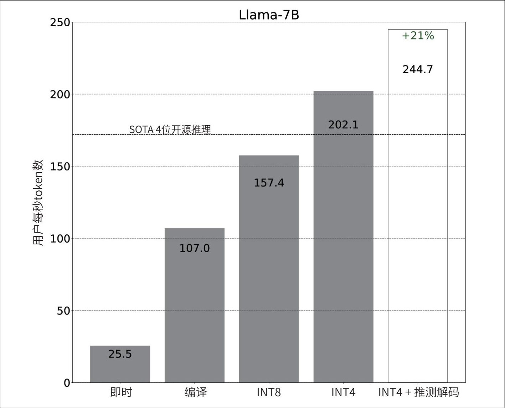

> **圖片描述：** 此圖為PyTorch推理最佳化的效能提升長條圖，展示Llama-7B模型在A100 GPU上的吞吐量。X軸列出五種最佳化配置：即時執行（25.5 tokens/s）、編譯（107.0）、INT8量化（157.4）、INT4量化（202.1）、INT4+推測解碼（244.7，額外提升21%）。虛線標示SOTA 4位開源推理的基準線。Y軸為每秒token數。

圖9-14：PyTorch中不同最佳化技術帶來的吞吐量提升

實驗在配備80 GB記憶體的A100 GPU上執行。目前尚不清楚這些最佳化步驟對模型輸出質量的具體影響。

- 許多公司將專有核心視為商業機密。擁有能夠以更低成本、更高效率執行模型的核心是一種競爭優勢。

編譯器既可以是獨立工具，例如Apache TVM和MLIR（Multi-Level Intermediate Representation，多級中間表示），也可以整合在機器學習和推理框架中，例如torch.compile（PyTorch中的功能）、XLA（Accelerated Linear Algebra，加速線性代數，最初由TensorFlow開發，現有一個名為OpenXLA的開源版本），以及內建於TensorRT中的編譯器（針對NVIDIA GPU最佳化）。AI公司可能擁有自主研發的編譯器，並配備為加速自身工作負載而設計的專有核心。

### 9.2.2 推理服務優化

大多數服務層面的最佳化技術專注於資源管理。在資源（算力和記憶體）總量固定，而工作負載（使用者發出的可能涉及不同模型的推理請求）動態變化的情況下，服務層面的最佳化技術旨在高效地將資源分配給工作負載，以降低延遲和成本。與許多模型層面的最佳化技術不同，服務層面的最佳化技術不會修改模型，也不應改變輸出質量。

**1. 批處理**

批處理是降低成本的一種簡單方法。在生產環境中，推理服務可能同時收到多個請求。與單獨處理每個請求相比，批次處理在相近時間內到達的請求可以顯著提高服務的吞吐量。如果將單獨處理每個請求類比為每個人都開自己的車出行，那麼批處理就像大家乘坐一輛公交車出行。公交車雖然可以運送更多人，但可能延長每個人的行程時間。然而，如果能夠智慧地進行批處理，可將對延遲的影響降到最低。

批處理的三種主要技術是靜態批處理（static batching）、動態批處理（dynamic batching）和連續批處理（continuous batching）。

最簡單的批處理技術是靜態批處理。服務將固定數量的輸入組合成一個批次。這就像一輛公交車必須等到所有座位都坐滿才出發。靜態批處理的缺點是，所有請求都必須等待批次填滿後才能執行。因此，批次中的第一個請求必須一直等待，直到最後一個請求到達，無論這會造成多久的延遲。

動態批處理則為每個批次設定了一個最大時間視窗。如果批次大小為4，時間視窗為100 ms，則伺服器會在收到4個請求或者時間達到100 ms時（以先到者為準）處理批次。這就像一輛公交車，要麼坐滿即發車，要麼按固定時間表發車。這種方法可以控制延遲，避免較早到達的請求被較晚到達的請求拖延。它的缺點是進行處理時批次可能並不總是滿的，導致浪費計算資源。圖9-15為靜態批處理和動態批處理的示意圖。

在這兩種批處理的實作中，必須等批次中的所有請求全部完成才能返回響應。對LLM來說，不同請求的處理時間可能存在巨大差異。如果批次中的一個請求只需生成10個響應token，而另一個請求需要生成1000個響應token，那麼短響應必須等待長響應完成後才能返回給使用者。這給短請求帶來不必要的延遲。

	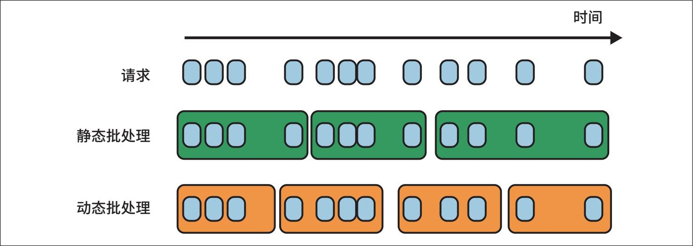

> **圖片描述：** 此圖比較靜態批處理和動態批處理的運作方式。頂部為請求到達的時間軸。中間「靜態批處理」（綠色方塊）等待固定數量的請求到齊後才一起處理。底部「動態批處理」（橘色方塊）在固定時間窗口內收集到的請求立即處理，即使批次未滿也會啟動。時間軸由左至右表示時間流逝。

圖9-15：動態批處理可以控制延遲，但計算效率可能較低

連續批處理允許批次中的響應在完成後立即返回給使用者。它的工作原理是選擇性地批處理那些不會導致一個響應的生成阻塞另一個響應的操作，這種方法最早在論文“Orca: A Distributed Serving System for Transformer-Based Generative Models”（Yu等，2022）中提出。當批次中的某個請求完成並返回響應後，服務在該請求的位置加入另一個請求，從而實作批處理的連續性。這就像一輛公交車，在一名乘客下車後立即接上另一名乘客，以最大化載客率。連續批處理的示意圖如圖9-16所示。

	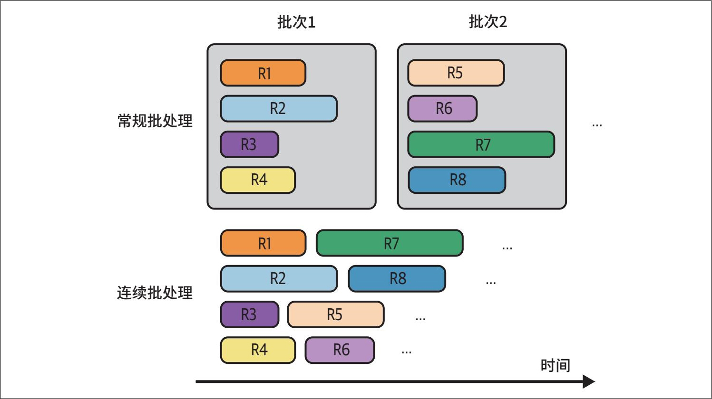

> **圖片描述：** 此圖比較常規批處理與連續批處理。上半部「常規批處理」中，批次1的四個請求（R1-R4）必須全部完成後才開始批次2（R5-R8）。下半部「連續批處理」中，R1完成後其位置立即由R7填入，R3完成後由R5填入，各請求完成即返回，不必等待整個批次結束。不同顏色代表不同請求，X軸為時間軸。

圖9-16：連續批處理將完成的響應立即返回給使用者，並在該位置處理新的請求

**2. 將預填充和解碼解耦**

LLM推理包括兩個步驟：預填充和解碼。由於預填充是計算受限的，而解碼是記憶體頻寬受限的，因此在同一臺機器上同時執行這兩個步驟會導致它們爭奪資源，從而顯著延長TTFT和TPOT。假設一塊GPU在接近其峰值計算能力的狀態下同時處理預填充任務和解碼任務，它或許還能處理一個計算量較小的解碼任務。但如果向這塊GPU新增一個新查詢，則意味著同時引入一個預填充任務和一個解碼任務，而這個預填充任務可能會佔用現有解碼任務的計算資源，從而延長這些請求的TPOT。

將預填充和解碼解耦是一種常見的推理服務最佳化技術。“DistServe: Disaggregating Prefill and Decoding for Goodput-optimized Large Language Model Serving”（Zhong等，2024）和“Inference Without Interference: Disaggregate LLM Inference for Mixed Downstream Workloads”（Hu等，2024）表明，對於各種流行的LLM和應用，將預填充操作和解碼操作分配到不同的例項（如不同的GPU），可以在滿足延遲要求的同時顯著提高處理請求的吞吐量。儘管解耦需要將中間狀態從預填充例項傳輸到解碼例項，但論文指出，在現代GPU叢集（如節點內使用NVLink等高頻寬連線）中，通訊開銷並不顯著。

- Meta公司2024年的演講“Llama Inference at Meta”涉及對預填充例項與解碼例項的比例的探討。

預填充例項與解碼例項的比例取決於許多因素，包括工作負載特徵（如更長的輸入序列需要更多的預填充計算）和延遲要求（如希望最佳化TTFT還是TPOT）等。如果輸入序列通常較長且希望優先最佳化TTFT，這個比例可以在2∶1和4∶1之間。如果輸入序列較短且希望優先最佳化TPOT，這個比例可以在1∶2和1∶1之間。

**3. 提示詞緩存**

應用中的許多提示詞包含重疊的文字片段。提示詞快取的作用是儲存這些重疊片段以供反覆使用，模型只需對它們進行一次處理。在不同的提示詞中，一種常見的重疊文字片段是系統提示詞。如果沒有提示詞快取，模型在處理每次查詢時都必須重新處理系統提示詞；而使用提示詞快取後，只需在首次查詢時處理一次即可。

提示詞快取對於涉及長文件的查詢非常有用。如果許多使用者查詢與同一個長文件（如一本書或一個程式碼庫）相關，那麼可以將這個長文件快取起來，以便在不同的查詢中反覆使用。提示詞快取對於長對話也很有用，它可以將之前訊息的處理結果快取起來，以供預測後續訊息時反覆使用。

提示詞快取的示意圖如圖9-17所示。提示詞快取也被稱為上下文快取（context cache）或字首快取（prefix cache）。

	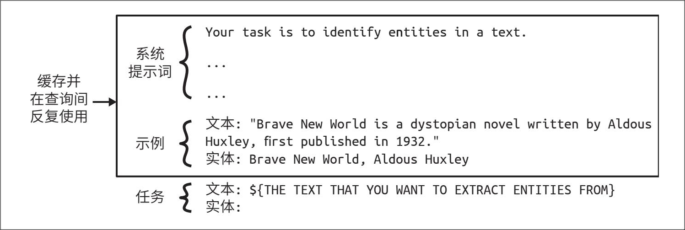

> **圖片描述：** 此圖展示提示詞快取的運作方式。一個完整的提示詞被分為三部分：「系統提示詞」（頂部）、「範例」（中間）和「任務」（底部）。左側標示「快取並在查詢間反覆使用」，箭頭指向系統提示詞和範例部分，表示這些重疊片段只需處理一次即可在多個查詢中反覆使用。範例內容為實體擷取任務。

圖9-17：透過提示詞快取，不同提示詞中的重疊片段可以被快取並反覆使用

對於具有較長系統提示詞的應用，提示詞快取可以顯著降低延遲和成本。如果系統提示詞有1000個token，而應用每天生成100萬次模型API呼叫，那麼提示詞快取每天可以節省處理大約10億個重複輸入token的開銷。然而，這也要付出一定代價。與KV快取類似，提示詞快取可能佔用大量記憶體空間。除非使用整合此功能的模型API，否則實作提示詞快取需要大量的工程開發工作。

- 儘管llama.cpp也提供了提示詞快取，但截至本書撰寫時，它似乎僅能快取完整的提示詞，並且僅對同一聊天會話中的查詢有效。它的官方文件內容有限，根據我對程式碼的理解推測，在長對話場景中，它會快取之前的訊息，僅處理最新的訊息。

自Gim等在2023年11月首次提出提示詞快取（參見“Prompt Cache: Modular Attention Reuse for Low-Latency Inference”）以來，該技術被迅速整合到各類模型API中。截至本書撰寫時，Google Gemini提供了這一功能，快取的輸入token比普通輸入token的價格優惠75%，但使用者需要額外支付快取儲存費用（截至本書撰寫時，價格為每小時每百萬token1.00美元）。Anthropic也推出了提示詞快取方案，宣稱可實作最高90%的成本節約（快取上下文越長，節約效果越明顯）和最高75%的延遲降低。提示詞快取在不同場景中對成本和延遲的影響如表9-3所示。

表9-3：提示詞快取對成本和延遲的影響（資料來源：Anthropic，2024）

	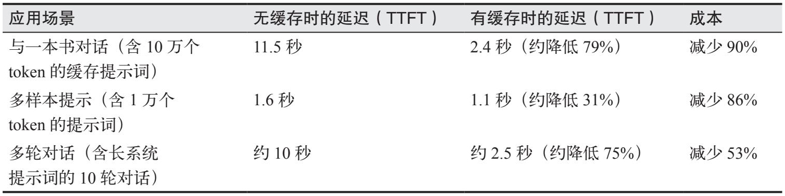

> **圖片描述：** 此為提示詞快取對成本和延遲影響的表格。列出三個應用場景：(1) 與一本書對話（含10萬個token的快取提示詞）：TTFT從11.5秒降至2.4秒（約降低79%），成本減少90%；(2) 多樣本提示（含1萬個token的提示詞）：TTFT從1.6秒降至1.1秒（約降低31%），成本減少86%；(3) 多輪對話（含長系統提示詞的10輪對話）：TTFT從約10秒降至約2.5秒（約降低75%），成本減少53%。

**4. 並行化**

加速器專為並行處理而設計，而並行化策略是高效能運算的核心。目前，新型並行化策略不斷湧現，這裡僅介紹幾種作為參考。適用於所有模型的並行化策略可分為兩類：數據並行（data parallelism）和模型並行（model parallelism）。此外，還有一類專門針對LLM的策略，即上下文並行和序列並行（context and sequence parallelism）。一種最佳化技術可能同時涉及多種並行化策略。

- 在訓練過程中，這種技術被稱為資料並行。

副本並行（replica parallelism）是最易實作的策略，它只是簡單地建立待部署模型的多個副本。
	更多的副本能讓你同時處理更多請求，但也意味著需要消耗更多的晶片資源。將不同規模的模型部署到不同晶片上的問題本質上是一個裝箱問題（bin-packing problem），當涉及更多的模型、副本和晶片時，這個問題會變得更加複雜。

假設你有若干個不同規模（如分別擁有80億、130億、340億和700億個引數）的模型，以及具有不同記憶體容量（如24 GB、40 GB、48 GB和80 GB）的GPU。為簡單起見，假設所有模型都採用8位精度。

·如果晶片數量固定，你需要決定為每個模型建立多少個副本，以及每個副本應使用哪種GPU，以最大化系統效能。例如，應該在一個40 GB的GPU上部署三個130億引數的模型，還是應該將這塊GPU預留給一個340億引數的模型？

·如果模型副本數量固定，你需要決定購買哪種晶片以最小化成本。這種情況在現實中很少出現。

通常，模型可能因規模過大而無法在單臺機器上完整部署。模型並行是指將一個模型拆分到多臺機器上執行。當採用模型並行策略時，將模型部署到晶片上的問題會變得更加複雜。

拆分模型的方法有多種。推理階段最常見的方法是張量並行（tensor parallelism），也稱為算子內並行（intra-operator parallelism）。推理過程涉及對多維張量的一系列運算元運算，例如矩陣乘法。這種方法將參與運算元運算的張量劃分到多個裝置上，有效地將該運算元運算分解成多個並行執行的較小的計算任務，從而加快計算速度。以兩個矩陣相乘為例，你可以按列拆分其中一個矩陣，如圖9-18所示。

	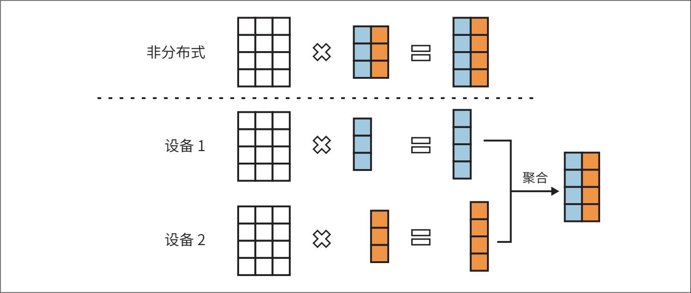

> **圖片描述：** 此圖展示矩陣乘法中的張量並行（Tensor Parallelism）。上方「非分布式」顯示完整的矩陣乘法運算。下方以虛線分隔後，展示矩陣被拆分到兩個設備上：設備1和設備2各處理部分矩陣乘法，然後透過「聚合」步驟將結果合併成完整的輸出。橘色和藍色方塊分別代表不同部分的資料。

圖9-18：矩陣乘法中的張量並行

張量並行有兩個優勢。首先，它使得部署無法在單臺機器上執行的大模型成為可能。其次，它能降低延遲。然而，額外的通訊開銷可能會削弱這種延遲優勢。

另一種拆分模型的方法是流水線並行（pipeline parallelism），它將模型的計算劃分為不同的階段，並將每個階段分配到不同的裝置上。當資料流經模型時，每個階段處理資料流中的特定部分，各個階段並行工作，從而實作計算的重疊。圖9-19展示了在四臺機器上實作流水線並行的情況。

	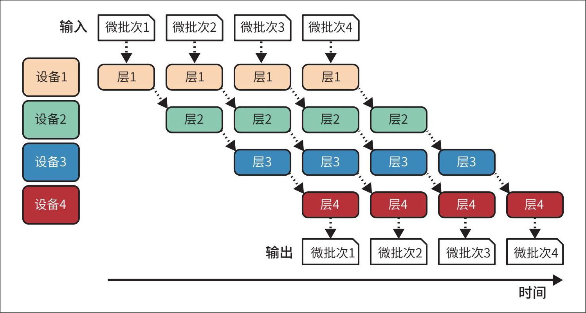

> **圖片描述：** 此圖展示流水線並行（Pipeline Parallelism）的運作方式。四個設備分別處理模型的四個層（層1至層4），資料以微批次（微批次1至微批次4）依序流經各層。圖中展示了錯開執行的時間排程，當設備1完成微批次1的層1處理後，設備2開始處理微批次1的層2，同時設備1開始處理微批次2的層1。X軸為時間軸，最終產出四個微批次的輸出。

圖9-19：流水線並行實作模型分段的並行執行

如圖9-19所示，一個批次可以被拆分成更小的微批次。當一個微批次在一臺機器上完成處理後，其輸出會被傳遞到下一臺機器上的後續模型段進行處理。

雖然使用流水線並行能夠實作在多臺機器上部署大模型，但由於流水線各階段之間存在額外的通訊，這種方法會增加每個請求的總延遲。因此，在對延遲要求嚴格的應用場景中，通常避免使用流水線並行，而傾向於使用副本並行。然而，流水線並行在訓練中應用廣泛，因為它有助於提高吞吐量。

還有兩種不太常見但值得簡要提及的技術——上下文並行（context parallelism）和序列並行（sequence parallelism），它們體現了並行化技術的多樣性。這兩種技術都是為了更高效地處理較長的輸入序列而開發的。

上下文並行是將輸入序列拆分到不同裝置上分別處理。例如，輸入序列的前半部分在機器1上處理，後半部分在機器2上處理。

序列並行是將處理整個輸入所需的不同運算元分配到不同的機器上。例如，輸入同時需要注意力計算和前饋計算，則可以在機器1上處理注意力計算，在機器2上處理前饋計算。

## 9.3 小結

模型的可用性在很大程度上取決於其推理成本和延遲。更低的推理成本使AI驅動的決策更具經濟效益，而更快的推理速度則拓展了AI的應用場景。鑑於推理最佳化的巨大潛力，許多優秀的人才投身於這一領域，不斷提出創新方法。

在著手提高效率之前，首先需要理解如何衡量效率。本章介紹了常見的推理效能指標，包括延遲、吞吐量和利用率。對於基於語言模型的推理，延遲可以進一步分為TTFT和TPOT。TTFT主要受預填充階段影響，而TPOT受解碼階段影響。吞吐量指標則與成本直接相關。

延遲和吞吐量之間存在權衡關係：如果能夠接受較高的延遲，則可能降低成本；而要降低延遲，通常意味著需要增加成本。

模型的執行效率還取決於底層硬體。因此，本章簡要介紹了AI硬體及在不同加速器上最佳化模型所需的關鍵技術。

本章隨後介紹了不同的推理最佳化技術。鑑於模型API的廣泛可用性，大多數應用開發者會直接使用這些API及其內建的最佳化功能，而不是自己實作。雖然這些技術可能並非與所有應用開發者都相關，但我認為了解可行的最佳化技術有助於評估模型API的效率。

本章還重點介紹了模型層面和推理服務層面的最佳化。模型層面的最佳化通常需要修改模型本身，這可能導致模型行為發生改變，而推理服務層面的最佳化通常保持模型不變，僅改變模型的服務方式。

模型層面的最佳化技術既包括與模型無關的技術（如量化和蒸餾），也包括針對特定模型架構的定製化最佳化方法。例如，Transformer模型的一個關鍵瓶頸在於注意力機制，因此許多最佳化技術致力於提高注意力機制的效率，包括KV快取管理和最佳化注意力計算核心；自迴歸語言模型的一個主要瓶頸在於其自迴歸解碼過程，因此出現了許多專門針對該問題的最佳化技術。

推理服務層面的最佳化技術包括各種批處理和並行化策略。此外，還有專門為自迴歸語言模型開發的技術，包括將預填充和解碼解耦，以及提示詞快取。

最佳化技術的選擇取決於具體的工作負載。例如，KV快取對長上下文工作負載的重要性遠高於其對短上下文工作負載的重要性，而提示詞快取則對提示詞較長且包含重疊片段或多輪對話的工作負載至關重要。最佳化技術的選擇還取決於效能需求。如果低延遲優先於成本考量，那麼可以選擇增加副本數量。雖然更多的副本需要額外的機器，但每臺機器處理的請求數量減少，因此可以為每個請求分配更多資源，從而縮短響應時間。

在各種應用場景中，具有重要影響力的最佳化技術通常包括量化（適用廣泛）、張量並行（降低延遲並支援大規模模型部署）、副本並行（易於實作）及注意力機制最佳化（能顯著加速Transformer模型）。

推理最佳化是本書介紹的模型適配技術中的最後一項內容。下一章將探討如何將這些技術整合到一個協同工作的完整系統中。