# 第10章 AI工程架構與使用者反饋


到目前為止，本書已經介紹了大量將基礎模型適配到具體應用的技術。本章將討論如何將這些技術整合在一起，構建成功的產品。


鑑於當前AI工程技術和工具種類繁多，人們在選擇合適的工具時可能感覺無從下手。為簡化選擇過程，本章將循序漸進地展開討論。首先介紹最簡單的基礎模型應用架構，剖析這種架構存在的問題，然後逐步新增元件來解決這些問題。


我們可以花費大量時間思考如何構建成功的應用，但驗證應用是否真正達成目標的唯一方法是將其交付給使用者使用。使用者回饋一直是指導產品開發的重要依據，對AI應用來說，回饋不僅是改進產品的參考，更是最佳化模型的資料來源，其作用尤為關鍵。雖然對話式介面使使用者提供回饋更加容易，但也加大了開發人員提取有效訊號的難度。本章將闡述不同型別的對話式AI回饋，並探討如何在保障使用者體驗的前提下構建高效的回饋收集系統。


## 10.1 AI工程架構


一個成熟完善的AI架構往往十分複雜。本節將模擬開發團隊在實際生產中可能採用的演進流程，從最簡單的架構開始，逐步新增更多元件。儘管AI應用種類繁多，但它們包含許多通用元件。這裡提出的架構已經在多家企業得到驗證，具備廣泛的適用性，當然特定應用的需求可能有所不同。


最簡單的架構形式是應用接收查詢並將其傳送給模型，模型生成響應並返回給使用者，如圖10-1所示。這種架構沒有上下文增強和安全防護機制，也沒有進行最佳化。圖中的模型API涵蓋第三方API（如OpenAI、谷歌、Anthropic）和自託管模型（第9章討論瞭如何為自託管模型構建推理伺服器）。


圖10-1：執行AI應用的最簡單的架構


以這個簡單的架構為起點，你可以根據需求逐步新增更多元件。流程通常如下。


1. 為模型提供外部資料來源訪問許可權和資訊收集工具，以增強模型的上下文輸入。


2. 設定安全防護措施，以保障系統和使用者安全。


3. 新增路由器和閘道器，以支援複雜的流水線並提高安全性。


4. 利用快取技術最佳化延遲和成本。


5. 新增複雜邏輯和執行動作，以最大限度地發揮系統的能力。


上述流程是我在實際生產中經常看到的。但請注意，每個專案的需求可能不同，你應當根據實際情況選擇最合適的順序。


監控與可觀測性是任何應用進行質量控制和效能改進都不可或缺的部分，本節將在上述流程的最後對其進行討論。在此之後，本節還將介紹AI流水線編排，即如何將所有元件連線起來。


### 10.1.1 增強上下文


平臺的初期擴充套件通常涉及引入機制，幫助系統構建模型響應每個查詢所需的相關上下文。如第6章所述，我們可以透過多種檢索機制（包括文字檢索、影像檢索和表格資料檢索）構建上下文，也可以藉助工具增強上下文，這些工具允許模型透過API（如網路搜尋、新聞、天氣、事件等領域的API）自動收集資訊。

- 三家提供商的主要模型產品分別為GPT系列、Claude、Google Gemini。——編者注


上下文構建類似於基礎模型的特徵工程，它為模型提供生成輸出所需的必要資訊。由於上下文構建對系統輸出質量至關重要，因此得到了模型API提供商的普遍支援。例如，OpenAI、Anthropic和谷歌
	等提供商允許使用者上傳檔案，並支援模型使用工具。


然而，正如模型的能力各不相同，這些提供商對上下文構建的支援也存在差異。例如，它們可能會限制使用者上傳的文件型別和數量。專用的RAG解決方案允許上傳的文件數量通常僅受限於向量資料庫的容量，而通用的模型API可能只允許使用者上傳少量文件。不同的框架在檢索演演算法和其他檢索配置（如分塊大小）方面也存在差異。同樣，在工具使用方面，各種解決方案所支援的工具型別和執行模式也有所不同，例如是否支援並行函式執行或長時間執行的任務等。


加入上下文構建後，架構如圖10-2所示。

	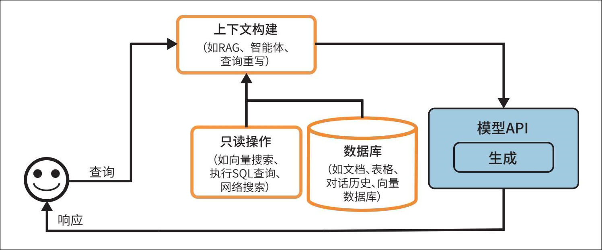

> **圖片描述：** 此圖展示包含上下文構建的AI應用架構。使用者發送查詢後，系統透過「上下文構建」模組（包含RAG、智慧體、查詢重寫等）進行處理。「只讀操作」模組（向量搜尋、SQL查詢、網路搜尋）從「資料庫」（文檔、表格、對話歷史、向量資料庫）中檢索資訊。最終由「模型API」的「生成」功能產生回應並返回給使用者。

圖10-2：包含上下文構建的架構


### 10.1.2 設置防護措施


設定防護措施有助於降低風險，保護系統和使用者的權益。只要存在風險暴露的場景，就應設定相應的防護措施。一般來說，防護措施可分為輸入防護措施和輸出防護措施兩類。


**1. 輸入防護措施**


輸入防護措施主要防範兩類風險：向外部API洩露隱私資訊和執行可能危害系統的惡意提示詞。第5章討論了攻擊者如何利用提示詞攻擊應用，以及相應的防範手段。需要注意的是，雖然我們可以透過防護措施降低風險，但由於模型生成的機率特性及不可避免的人為失誤，風險永遠無法被完全消除。


向外部API洩露隱私資訊是使用外部模型API時特有的風險，因為這涉及將資料傳送到組織外部。導致此類風險的原因包括：

- 一個案例是，三星公司的一名員工將公司的專有資訊輸入ChatGPT，意外洩露了公司機密。


·員工將公司機密或使用者隱私資訊複製到提示詞中，傳送給第三方API

·應用開發人員將公司內部政策和資料寫入應用的系統提示詞中


·工具從內部資料庫檢索隱私資訊並將其新增到上下文中


目前還沒有絕對可靠的方法消除使用第三方API的潛在洩露風險，但你可以透過工具自動檢測敏感資料來有效降低風險。常見的敏感資料類別包括：


·個人資訊（身份證號碼、電話號碼、銀行賬戶）


·人臉生物特徵


·涉及公司智慧財產權或特權資訊的特定關鍵詞和短語


許多敏感資料檢測工具使用AI識別潛在的敏感資訊，例如判斷一個字串是否符合有效家庭住址的格式。如果發現查詢包含敏感資訊，則攔截整個查詢，或者從查詢中移除敏感資訊。例如，你可以用佔位符[PHONE NUMBER]對使用者的電話號碼進行掩碼處理。如果生成的響應包含此佔位符，則可以透過PII對映表將佔位符對映回原始資訊，從而實作資訊的去掩碼。使用佔位符處理敏感資訊的流程範例如圖10-3所示。

	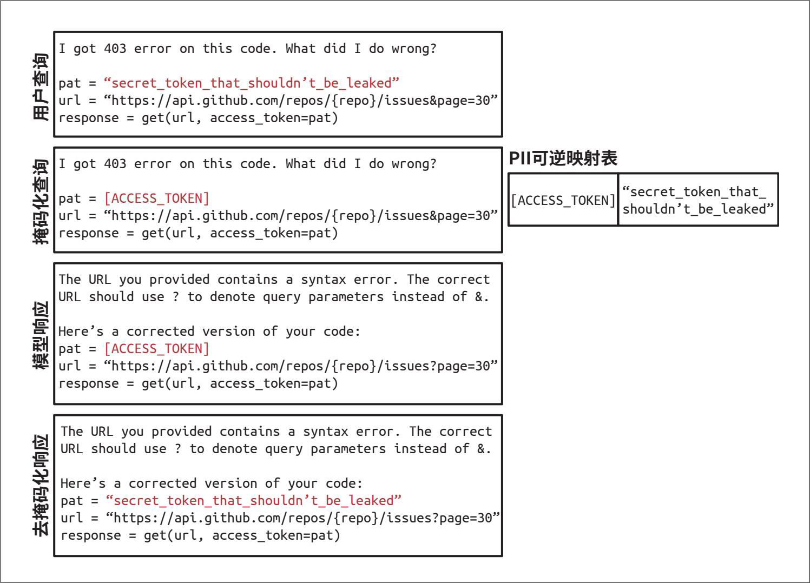

> **圖片描述：** 此圖展示使用PII可逆對映表對敏感資訊進行掩碼和去掩碼的流程。上方顯示使用者查詢中包含敏感token（如API密鑰），經「匿名化器」將敏感資訊替換為佔位符[ACCESS_TOKEN]後送入模型。右側的「PII可逆對映表」記錄佔位符與原始資訊的對應關係。模型回應中的佔位符經「去匿名化器」還原為原始資訊後返回給使用者。

圖10-3：使用PII可逆對映表對敏感資訊進行掩碼和去掩碼的範例，避免將敏感資訊傳送到外部API


**2. 輸出防護措施**


模型可能出現多種形式的故障。輸出防護措施有兩個主要功能：


·捕獲輸出故障


·明確故障處理策略

- 使用者有時會要求模型返回空響應。


要捕獲未達標準的輸出，首先需要了解各種故障的表現形式。最容易檢測的故障是模型在不應返回空響應時返回了空內容。
	不同應用的故障表現形式各不相同，主要分為質量類故障（詳見第4章）和安全類故障（詳見第5章）兩大類。這裡快速回顧一下兩類故障。


·質量類故障


·響應格式不符合預期。例如，應用期望獲得JSON格式，但模型生成了無效的JSON。


·產生與事實不一致的幻覺。


·響應的整體質量差。例如，你要求模型寫一篇文章，但文章質量很差。


·安全類故障


·包含種族主義內容、色情內容或涉及非法活動的毒性響應。


·洩露隱私或敏感資訊。


·觸發遠端工具或程式碼執行。


·存在品牌風險，如錯誤地描述你的公司或競爭對手。


回顧第5章的內容可知，實施安全措施時，不僅要追蹤安全故障，還要關注誤拒率。一些系統的安全措施可能過於嚴格，甚至攔截了合法請求，這不僅干擾使用者的工作流程，還會降低使用者體驗。


許多故障可以透過簡單的重試邏輯來緩解。AI模型具有機率性，這意味著如果你重試同一個查詢，可能會得到不同的響應。例如，當響應為空時，你可以重試多次，直到獲得有效響應。同樣，如果響應格式錯誤，也可以重試，直到響應格式正確。


然而，重試策略會帶來額外的延遲和成本。每次重試都意味著發起新一輪的API呼叫。如果在請求失敗後才進行重試，使用者感知的延遲將翻倍。為了降低延遲，可以採用並行呼叫的方法。例如，對於每個查詢，無須等待第一次查詢失敗後進行重試，而是同時向模型傳送兩次相同的請求，並在獲得兩個響應後擇優選取。這種方法雖增加了冗餘API呼叫的數量，但能將延遲控制在可接受範圍內。


對於難以處理的請求，通常需要依賴人工介入。例如，可以將包含特定關鍵詞的查詢轉交給人工客服。一些團隊使用專用模型來判斷何時需要人工介入。例如，有的團隊在情感分析模型檢測到使用者訊息中存在憤怒情緒時啟動人工接管；有的團隊則在對話進行一定輪次後轉交給人工，以避免使用者陷入迴圈往復的無效互動中。


**3. 防護措施的實施**

- 一些讀者告訴我，為追求低延遲而忽略防護機制的想法令他們非常擔憂。


實施防護措施需要在可靠性與延遲之間進行權衡。儘管防護措施至關重要，但部分團隊認為低延遲更為關鍵。為了避免應用延遲顯著增加，這些團隊最終決定不實施防護措施。

此外，輸出防護措施在流式補全模式下可能效果不佳。在預設情況下，系統會在生成完整的響應後再展示給使用者，這可能需要較長時間。在流式補全模式下，新生成的token會即時地流式傳輸給使用者，從而縮短使用者的等待時間。這種模式的缺點是難以對部分生成的響應進行有效評估，可能導致不安全的內容在被攔截之前就已經傳輸給使用者。


需要實施多少防護措施取決於你是自託管模型還是使用第三方API。雖然在這兩種方式下，你都可以在現有基礎上實施防護措施，但使用第三方API可以減少需要實施的防護措施的數量，因為API提供商通常會預設提供許多防護措施。自託管模型則意味著無須將請求傳送到外部，從而減少了對某些輸入防護措施的需求。


考慮到應用可能在不同環節出現問題，你可以在多個層面實施防護措施。模型提供商通常會為其模型內建防護措施，以提升安全性和效率。然而，模型提供商必須在安全性和靈活性之間取得平衡。嚴格的限制雖能提升安全性，但也可能降低模型在特定場景下的可用性。


應用開發者也可以自行實施防護措施。5.3.4節討論了許多相關技術。市面上有許多現成的解決方案，如Meta的Purple Llama、NVIDIA的NeMo Guardrails、Azure的PyRIT、Azure的AI內容過濾器、Perspective API和OpenAI的內容稽核API等。由於輸入風險和輸出風險存在重疊，這些方案通常會同時提供對輸入和輸出的保護。一些模型閘道器也提供了防護功能，10.1.3節將對此進行討論。


加入防護措施後，架構如圖10-4所示。我將評分器放在模型API之下，因為評分器通常由體量更小、速度更快的AI模型驅動。你也可以將評分器部署在輸出防護模組中。

	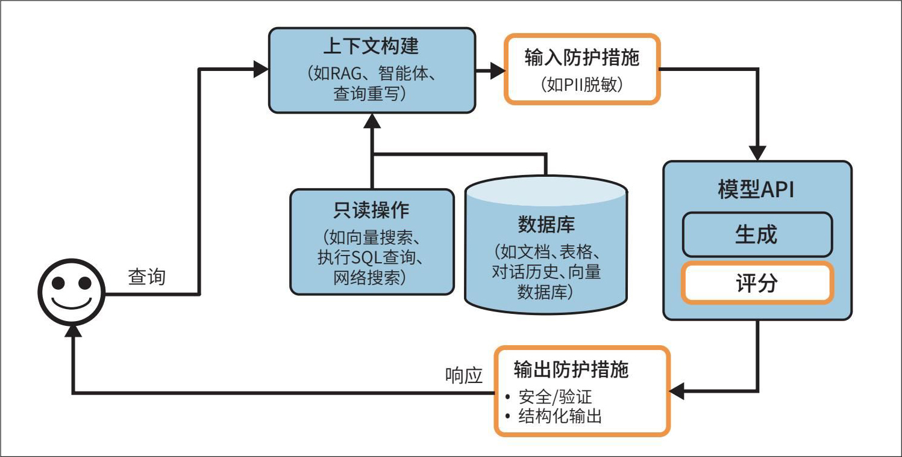

> **圖片描述：** 此圖展示加入輸入防護措施和輸出防護措施後的AI應用架構。在上下文構建之後新增了「輸入防護措施」模組（如PII脫敏），在模型API內新增了「評分」功能，模型回應經過「輸出防護措施」模組（安全/驗證、結構化輸出）檢查後才返回給使用者。

圖10-4：加入輸入防護措施和輸出防護措施後的架構


### 10.1.3 添加路由器和模型網關


隨著規模不斷擴大，應用所涉及的模型越來越多，路由器和模型閘道器應運而生，以幫助使用者管理多模型服務的複雜性和成本。


**1. 路由器**


與其用同一個模型處理所有查詢，不如針對不同型別的查詢採用差異化的解決方案。這種方法具有雙重優勢：首先，它允許使用專用模型，專用模型在處理特定查詢時往往比通用模型表現更好。例如，你可以分別部署專注於技術故障排查的模型和專注於賬單問題的模型。其次，這種方法有助於節約成本。例如，你可以將簡單的查詢路由到成本更低的模型，而非全都使用昂貴的高階模型。


路由器通常包含一個意圖分類器（intent classifier），用於識別使用者的意圖並將查詢路由到相應的解決方案。例如，客服機器人的處理邏輯可能如下。


·如果使用者想重置密碼，路由到關於密碼找回的常見問題解答頁面。


·如果使用者請求更正賬單錯誤，路由給人工客服。


·如果使用者請求排查技術問題，路由到故障排查專用機器人。


意圖分類器可以防止系統陷入超出服務範圍的對話。如果查詢被判定為不合適，聊天機器人可以使用預設的回覆禮貌地拒絕回答，而無須浪費API呼叫。例如，使用者詢問：“你在即將到來的選舉中會投票給誰？”聊天機器人可以回答：“作為聊天機器人，我沒有投票能力。如果您對我們的產品有疑問，我很樂意提供幫助。”


此外，意圖分類器有助於檢測模糊查詢並請求澄清。例如，針對多義詞“Freezing”（凍結/嚴寒），系統可能追問“您是指賬戶凍結，還是在討論天氣？”或者簡單詢問“能否請您詳細說明一下？”。


除了意圖分類，路由器還能輔助模型決策。例如，對於能執行多種操作的智慧體，路由器可作為下一步動作預測器（next-action predictor），判斷是呼叫程式碼直譯器還是搜尋API；對於具備記憶系統的模型，路由器可預測應從記憶庫的哪個部分提取資訊。假設使用者上傳了關於墨爾本的文件並詢問“墨爾本最可愛的動物是什麼？”，模型需決定是基於文件回答，還是聯網搜尋。


意圖分類器和下一步動作預測器可以基於基礎模型實作。許多團隊將規模較小的語言模型（如GPT-2、BERT和Llama-7B）改造成意圖分類器，也有很多團隊選擇從頭訓練規模更小的分類器。路由器的關鍵在於速度快且成本低，以避免顯著增加系統的延遲和開銷。


當將查詢路由到上下文長度限制不同的模型時，可能需要相應地調整查詢的上下文。假設有一個包含1000個token的查詢，計劃使用上下文長度限制為4096個token的模型進行處理。此時系統執行了一個動作（如網路搜尋），返回了包含8000個token的上下文。在這種情況下，你可以選擇截斷查詢的上下文以適應原本計劃使用的模型，或者將查詢路由到支援更長上下文的模型。


由於路由功能通常由模型實作，在架構圖（見圖10-5）中，我將其置於模型API模組內。與評分器類似，路由器通常比生成內容的模型更小、更輕量。

	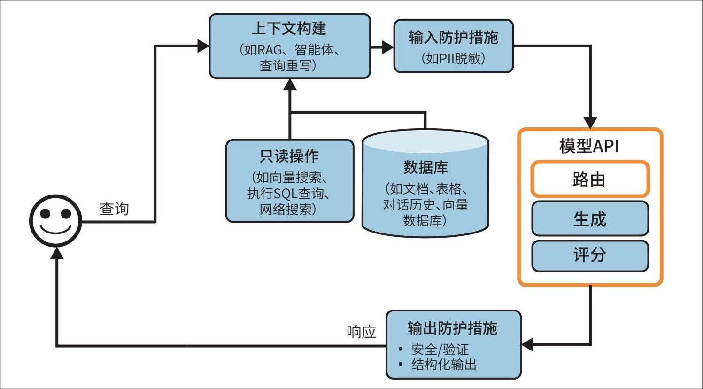

> **圖片描述：** 此圖展示加入路由功能後的AI應用架構。模型API模組內現包含三個子元件：「路由」（決定查詢分配）、「生成」（產生回應）和「評分」（評估品質）。其餘元件（上下文構建、輸入/輸出防護措施、資料庫、只讀操作）與前一版本相同。

圖10-5：路由幫助系統為每個查詢選擇最優方案


將路由器與其他模型組合在一起，可以更方便地管理模型。但需要注意的是，路由通常發生在檢索之前。例如，在檢索之前，路由器可以幫助判斷某個查詢是否屬於服務範圍；如果是，再判斷其是否需要進行檢索。路由也可以發生在檢索之後，例如判斷是否應將查詢轉交給人工客服。不過，“路由—檢索—生成—評分”是一種更為常見的AI應用模式。


**2. 模型網關**


模型閘道器是一箇中間層，允許組織以統一且安全的方式與不同的模型進行互動。模型閘道器最基本的功能是為各類模型（包括自託管模型和商業API提供的模型）提供統一的API。引入模型閘道器能顯著簡化程式碼維護。如果某個模型的API發生變化，只需更新閘道器即可，無須更新所有依賴該API的應用。圖10-6展示了模型閘道器的宏觀架構。

	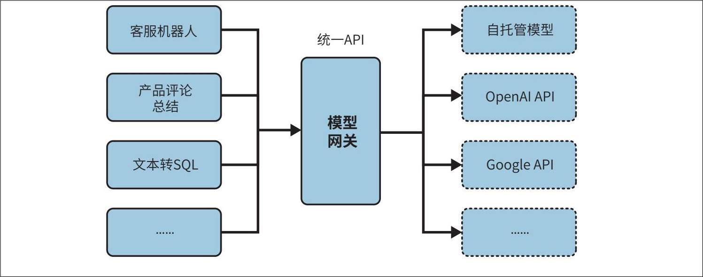

> **圖片描述：** 此圖展示模型閘道器（Model Gateway）的架構。左側為不同的應用場景（客服機器人、產品評論總結、文本轉SQL等），透過統一API連接到中央的「模型閘道器」方塊。閘道器右側以虛線框表示多個後端模型服務：自託管模型、OpenAI API、Google API等。閘道器充當中間層，為各應用提供統一的存取介面。

圖10-6：模型閘道器提供統一API，以與不同模型互動

- 該範例僅做演示，不包含錯誤檢查或最佳化，不可直接執行。


模型閘道器最基礎的形態本質上是一個統一的包裝器。以下程式碼範例展示了模型閘道器的一種實作思路。

```python
import google.generativeai as genai
import openai

def openai_model(input_data, model_name, max_tokens):
    openai.api_key = os.environ["OPENAI_API_KEY"]
    response = openai.Completion.create(
        engine=model_name,
        prompt=input_data,
        max_tokens=max_tokens
    )
    return {"response": response.choices[0].text.strip()}

def gemini_model(input_data, model_name, max_tokens):
    genai.configure(api_key=os.environ["GOOGLE_API_KEY"])
    model = genai.GenerativeModel(model_name=model_name)
    response = model.generate_content(input_data, max_tokens=max_tokens)
    return {"response": response["choices"][0]["message"]["content"]}

@app.route('/model', methods=['POST'])
def model_gateway():
    data = request.get_json()
    model_type = data.get("model_type")
    model_name = data.get("model_name")
    input_data = data.get("input_data")
    max_tokens = data.get("max_tokens")

    if model_type == "openai":
        result = openai_model(input_data, model_name, max_tokens)
    elif model_type == "gemini":
        result = gemini_model(input_data, model_name, max_tokens)
    return jsonify(result)
```


模型閘道器具備訪問控制和成本管理功能。你無須將敏感的組織OpenAI API Key分發給每個使用者，只需開放模型閘道器的訪問許可權，從而建立一個集中且可控的接入點。模型閘道器還可以實作細粒度的訪問控制，允許指定特定使用者或應用訪問特定模型。此外，模型閘道器可以監控和限制API的呼叫情況，有效防止濫用並實作成本管理。


模型閘道器還可用於實作回退策略，以應對速率限制或API故障（後者較常見）。當主API不可用時，模型閘道器可以將請求路由到備用模型，在短暫等待後重試，或採取其他優雅的方式處理故障，確保應用平穩執行而不中斷。


由於請求和響應都會經過閘道器，因此閘道器也是實作負載均衡、日誌記錄和分析等功能的理想位置。一些閘道器甚至提供快取和防護機制。


閘道器的實作相對簡單，目前市面上有許多成熟的閘道器產品，例如Portkey的AI Gateway、MLflow AI Gateway、Wealthsimple的LLM Gateway、TrueFoundry、Kong和Cloudflare。


在我們的架構中，模型閘道器模組取代了原有的模型API模組，如圖10-7所示。

	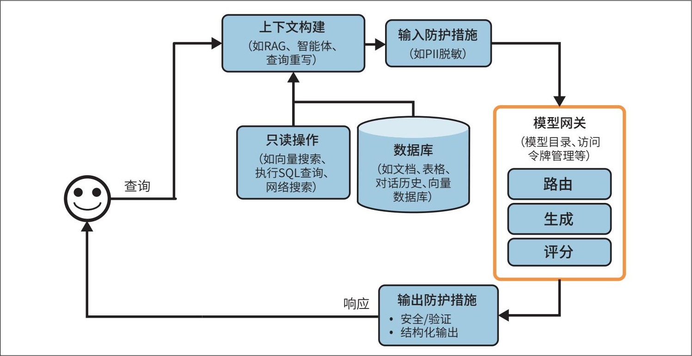

> **圖片描述：** 此圖展示新增路由和模型閘道器後的完整AI應用架構。原本的「模型API」被橘色邊框的「模型閘道器」取代，內含「模型目錄、訪問令牌管理等」功能，以及路由、生成、評分三個子模組。其餘架構元件（上下文構建、輸入/輸出防護措施、資料庫、只讀操作）保持不變。

圖10-7：新增路由和模型閘道器後的架構

	

> **圖片描述：** 此圖為 O'Reilly 書籍系列的裝飾性圖示，繪有一隻藍紫色烏鴉（或渡鴉）的剪影。此為章節內提示框的視覺標記。


 雖然類似的抽象層（如工具閘道器）也可以用於訪問各類工具，但截至本書撰寫時，這種模式尚不普及，因此本書未做討論。


### 10.1.4 透過快取技術降低延遲


快取作為降低延遲和成本的重要手段，一直是軟體應用不可或缺的部分。許多傳統軟體的快取思想同樣適用於AI應用。第9章已討論了推理快取技術，包括KV快取和提示詞快取。本節將重點關注系統快取。由於快取技術已相當成熟，且有大量相關文獻，因此這裡僅進行概括性介紹。一般來說，系統快取主要有兩種機制：精確快取和語義快取。


**1. 精確緩存**


精確快取的機制是，只有當請求的內容與快取項完全一致時，才使用快取結果。例如，使用者要求模型對某個產品進行總結，系統會檢查快取中是否已有該產品的總結。如果有，則直接返回快取結果；如果沒有，則對產品進行總結並快取結果。


精確快取也常用於基於嵌入的檢索，以避免重複執行向量搜尋。如果傳入的查詢已存在於向量搜尋快取中，則直接讀取結果；否則，執行向量搜尋並快取結果。


對於涉及多步推理（如CoT）或耗時操作的查詢（如檢索、SQL執行或網路搜尋），快取的優勢尤為明顯。


精確快取可以基於記憶體儲存實作，以實作快速檢索。考慮到記憶體容量限制，也可以使用PostgreSQL、Redis等資料庫或分層儲存來實作，從而平衡速度和儲存容量。制定快取淘汰策略對於管理快取容量和維持效能至關重要。常見的快取淘汰策略包括最近最少使用（LRU）、最不經常使用（LFU）和先進先出（FIFO）。


查詢是否應存入快取，取決於該查詢被再次呼叫的機率。使用者專屬查詢（如“最近我的訂單狀態如何？”）被其他使用者反覆使用的機率較小，因此不應快取。同樣，快取具有時效性的查詢（如“天氣如何？”）意義也不大。許多團隊會訓練分類器來預測某個查詢是否值得快取。

	

> **圖片描述：** 此圖為 O'Reilly 書籍系列的裝飾性圖示，繪有一隻橘紅色的蠍子剪影。此為章節內警告框的視覺標記。

 如果處理不當，快取可能導致資料洩露。假設你在一家電子商務網站工作，使用者X提出了一個看似通用的問題：“電子產品的退貨政策是什麼？”由於網站的退貨政策與使用者的會員等級相關，因此係統首先檢索使用者X的資訊，然後生成包含X個人資訊的回覆。如果系統誤將此查詢視為通用問題並快取了答案，當使用者Y提出相同的問題時，系統將直接返回快取結果，導致X的個人資訊被洩露給Y。


**2. 語義緩存**


與精確快取不同，語義快取的機制是，即使查詢與快取項僅語義相似而不完全相同，也會使用快取項。例如，一個使用者詢問：“越南的首都是哪裡？”模型回答：“河內。”稍後，另一個使用者詢問：“越南的首都是哪個城市？”這個問題與前一個問題的語義相同，只是措辭略有不同。藉助語義快取，系統可以複用前一個查詢的答案，無須重新計算。這能提高快取命中率並降低成本，但也可能影響模型的效能。


語義快取只有在具備可靠的方法來判斷兩個查詢是否相似的情況下才有效。一種常見的方法是利用語義相似度（如第3章所述），流程如下。


·使用嵌入模型生成當前查詢的嵌入向量。


·透過向量搜尋找出快取中與當前向量相似度最高的嵌入向量（設相似度分數為X*）。


·如果*X*大於預設的相似度閾值，則認為快取查詢與當前查詢相似，返回快取結果。如果*X*未達閾值，則處理當前查詢，並將當前查詢及其嵌入向量和處理結果一起存入快取。


這種方法需要一個向量資料庫來儲存快取查詢的嵌入向量。


與其他緩存技術相比，語義緩存的價值更具爭議，因為它的許多組件容易出錯。語義快取的成功依賴於高質量的嵌入向量、有效的向量搜尋及可靠的相似度度量標準。設定合適的相似度閾值也頗具難度，通常需要反覆試驗。如果系統錯誤地匹配了查詢，那麼返回的響應將是錯誤的。


此外，由於涉及向量搜尋，語義快取可能耗時且耗費計算資源。向量搜尋的速度和成本取決於快取嵌入向量的規模。


如果快取命中率較高，即大部分查詢能由快取直接響應，那麼語義快取仍具有應用價值。然而，在引入語義快取的複雜性之前，請務必評估相關的效率、成本和效能風險。


加入快取系統後，架構如圖10-8所示。KV快取和提示詞快取通常由模型API提供商實作，因此未在此圖中體現。如果要顯示，我會將它們放在模型閘道器模組中。圖中新增的箭頭表示將生成的響應新增到快取中。


圖10-8：新增快取後的AI應用架構


### 10.1.5 添加智能體模式


到目前為止，我們討論的應用架構仍然相對簡單，每個查詢都遵循順序處理流程。然而，正如第6章所述，應用流程可能更加複雜，包括迴圈、並行執行和條件分支。第6章討論的智慧體模式可以幫助我們構建複雜的應用。例如，系統在生成輸出後，可能發現任務尚未完成，需要再次執行檢索以獲取更多資訊。隨後，原始響應與新檢索到的上下文一起傳入同一個模型或另一個模型，從而形成一個迴圈，如圖10-9所示。

	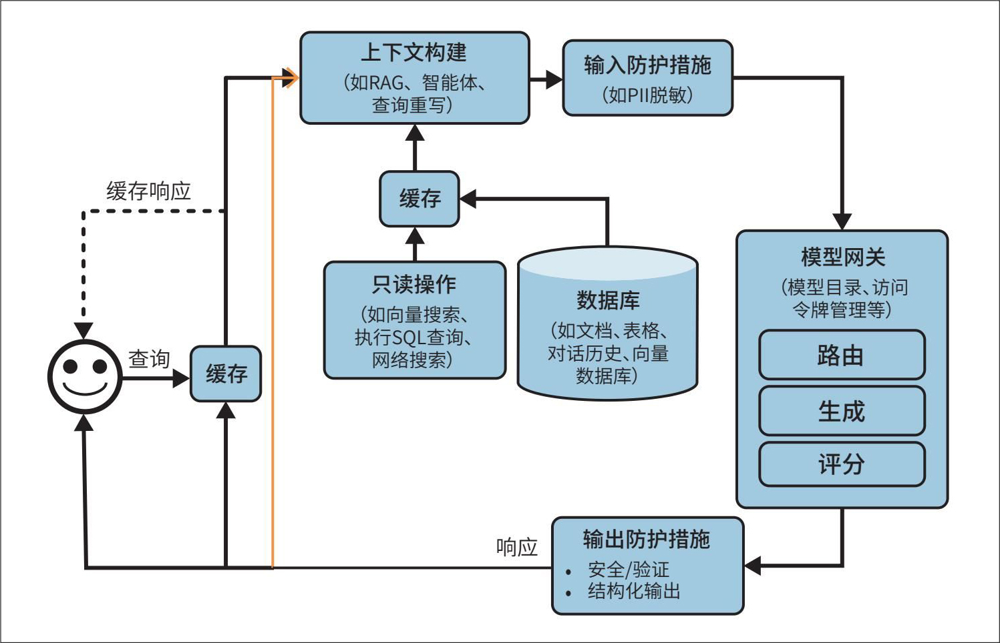

> **圖片描述：** 此圖展示新增快取後的AI應用架構。與前一版本相比，新增了兩個「快取」模組：一個位於使用者查詢入口處（用虛線箭頭標示快取回應路徑），另一個位於上下文構建與只讀操作之間。黃色箭頭表示將生成的回應存入快取的流程。其餘架構元件（模型閘道器、輸入/輸出防護措施等）保持不變。

圖10-9：黃色箭頭表示生成的響應回饋給系統，從而實作更復雜的應用模式


模型的輸出也可以用於觸發寫入動作，例如撰寫電子郵件、下訂單或發起銀行轉賬。寫入動作允許系統直接對環境進行修改。如第6章所述，寫入動作雖然可以極大地提高系統的能力，但也帶來了更高的風險。因此，賦予模型執行寫入動作的許可權時必須格外謹慎。加入寫入動作後，架構如圖10-10所示。

	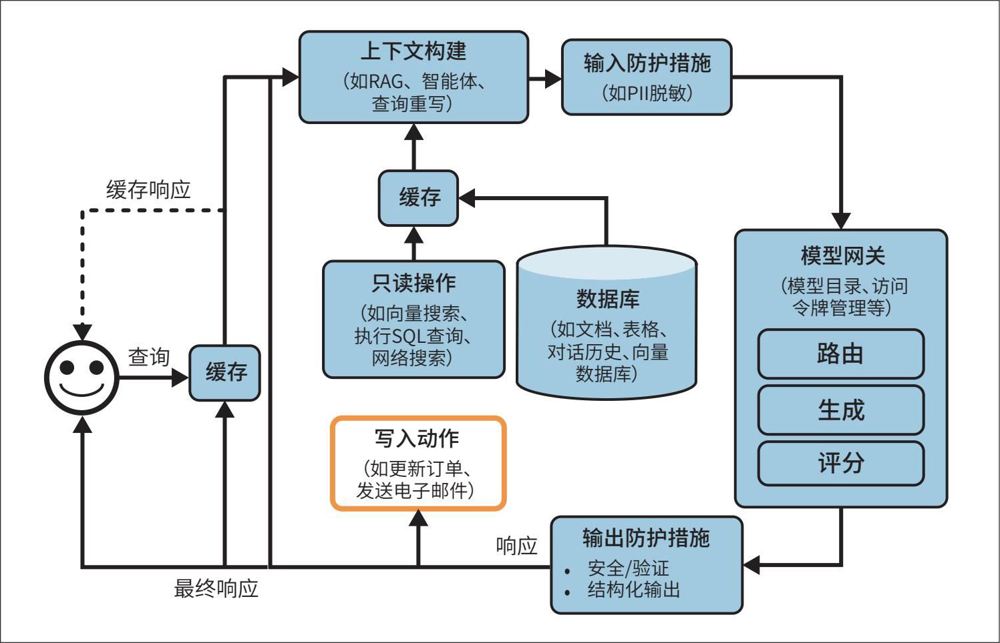

> **圖片描述：** 此圖展示允許系統執行寫入動作的AI應用架構。與前一版本相比，新增了黃色箭頭表示回饋迴路——模型的回應可以回饋到系統中進行進一步處理。底部新增「寫入動作」模組（如更新訂單、發送電子郵件），並標示「最終回應」路徑。虛線箭頭和實線箭頭分別表示快取路徑和主要資料流。

圖10-10：一種允許系統執行寫入動作的應用架構


如果你已經按照上述步驟進行操作，應用架構可能已經變得相當複雜。雖然複雜的系統可以執行更多工，但也會引入更多的故障。眾多的潛在故障點也增加了除錯難度。10.1.6節將介紹提高系統可觀測性的最佳實踐。


### 10.1.6 監控與可觀測性


雖然我將可觀測性放在構建架構流程之後單獨介紹，但它實際上應該是產品設計的核心組成部分，而非事後的補充。產品越複雜，可觀測性就越重要。

- 截至本書撰寫時，幾家頭部可觀測性公司（包括Datadog、Splunk、Dynatrace、New Relic）的總市值接近1000億美元。

- 《機器學習系統設計》中也有一章專門討論監控。該章的早期草稿可在我的部落格文章“Data Distribution Shifts and Monitoring”中找到。


可觀測性是所有軟體工程領域的通用實踐，已經形成了一個龐大的產業，擁有成熟的最佳實踐，以及大量現成的商業解決方案和開源解決方案。
	為了避免重複造輪子，本節將重點關注基於基礎模型構建的應用所特有的內容。本書的GitHub倉庫提供了更多關於可觀測性的學習資源。

監控的目標與評估的目標相同——降低風險並發現機會。監控不僅有助於降低應用故障、安全攻擊和資料漂移等風險，還可以幫助你發現最佳化應用和節約成本的機會。此外，透過讓系統效能視覺化，監控能明確責任歸屬。


你可以透過以下三個指標（來自DevOps社群）評估系統的可觀測性質量。


·MTTD（mean time to detection，平均檢測時間）：從問題發生到被檢測到所需的時間。


·MTTR（mean time to response，平均響應時間）：從檢測到問題到解決問題所需的時間。


·CFR（change failure rate，變更失敗率）：導致需要修復或回滾的變更（或部署）所佔的百分比。如果你不清楚系統的CFR，說明需要重新設計平臺以提升可觀測性。


CFR較高並不一定意味著監控系統不佳，但你應該重新審視評估流水線，以便在部署前攔截不良變更。評估和監控需要緊密協同：評估指標應與監控指標保持一致，也就是說，一個在評估階段表現良好的模型，在監控階段也應該表現穩定。同時，應將在監控階段發現的問題及時回饋到評估流水線中。


#### 監控與可觀測性

自21世紀10年代中期起，業界傾向於用“可觀測性”（observability）這一術語來代替“監控”（monitoring）。監控不對系統內部狀態與其輸出之間的關係做任何假設。監控系統的外部輸出雖然有助於判斷系統內部何時出現問題，但未必能幫助我們找出問題所在。


可觀測性比傳統監控有更強的前提假設：系統的內部狀態可以透過其外部輸出推斷。當具備可觀測性的系統出現問題時，我們能夠透過檢視系統的日誌和指標來確定問題所在，而無須重新部署程式碼。可觀測性的核心在於對系統進行埋點（instrumentation），以確保收集和分析足夠的執行時資訊，從而在出現問題時定位根源。


在本書中，我將使用“監控”指代追蹤系統資訊的行為，而使用“可觀測性”指代對系統進行埋點、追蹤和除錯的整個過程。


**1. 指標**


提及監控，大多數人首先想到的是指標。然而，指標本身並不是目的。坦率地說，大多數公司並不關心應用的輸出相關性得分，除非它有實際用途。指標的核心價值是告訴你何時出現問題，並幫助你發現最佳化系統的機會。


在確定要追蹤哪些指標之前，明確需要防範的故障模式並圍繞這些故障設計指標至關重要。如果你不希望應用產生幻覺，那麼應設計能夠檢測幻覺的指標，比如檢測應用的輸出能否從上下文中推匯出來。如果你不希望應用耗盡API預算，則需追蹤與API成本相關的指標，例如每個請求的輸入/輸出token數、快取成本和快取命中率等。


由於基礎模型生成的輸出具有開放性，因此故障形式多種多樣。指標設計不僅需要分析思維和統計知識，通常還需要創造力。具體應該追蹤哪些指標高度依賴於具體的應用場景。


本書已經介紹了許多不同型別的模型質量指標（第4～6章和本章後續部分），以及計算這些指標的多種方法（第3章和第5章）。這裡，我將快速回顧一下。


最容易追蹤的故障型別是格式錯誤，因為它們容易被發現和驗證。例如，你期望模型輸出JSON格式的資料，則可以追蹤模型輸出無效JSON的頻率，以及其中可被簡單修復（如缺少閉括號）與難以修復（如缺少預期的鍵）的比例。


對於開放式生成任務，可以考慮監控事實一致性和與生成質量相關的指標，例如簡潔性、創造性或積極性。許多此類指標可以利用AI裁判自動計算。


如果涉及安全問題，你可以追蹤與內容毒性相關的指標，並檢測輸入和輸出中是否包含隱私和敏感資訊。同時，應記錄安全防護措施被觸發的頻率，以及系統拒絕響應的頻率。此外，還要檢測系統收到的異常查詢，因為這些查詢可能暴露重要的極端案例或提示詞攻擊。


模型質量也可以透過使用者的自然語言回饋和互動資料推斷。例如，你可以輕鬆追蹤以下指標。


·使用者中途停止生成的頻率是多少？


·每次對話平均包含多少輪互動？


·每次輸入的平均token數是多少？使用者是在使用你的應用處理更復雜的任務，還是在學習使用更簡潔的提示詞？


·每次輸出的平均token數是多少？某些模型是否比其他模型更冗長？某些型別的查詢是否更容易導致冗長的響應？


·模型輸出的token分佈情況如何？隨著時間的推移發生了怎樣的變化？模型的輸出多樣性是增加了還是減少了？


與長度相關的指標也很重要，因為更長的上下文和響應通常意味著更高的延遲和成本。


應用流水線中的每個元件都應有獨立的指標。例如，在RAG應用中，檢索質量通常可以透過上下文相關性和上下文精度來評估；向量資料庫則可以透過索引資料所需的儲存空間和查詢資料所需的時間來評估。


你可能需要追蹤多個指標，衡量這些指標之間的相關性，尤其是它們與業務核心指標（北極星指標，north star metrics）的相關性非常有價值。常見的核心指標包括DAU（daily active user，日活躍使用者數）、會話時長（使用者積極使用應用的時間）和訂閱量等。與核心指標高度相關的技術指標可能會為你提供最佳化核心指標的思路，而完全不相關的指標則可能告訴你哪些方面不值得投入精力。


追蹤延遲對於理解使用者體驗至關重要。如第9章所述，常見的延遲指標如下。


·TTFT：生成第一個token所需的時間。


·TPOT：在生成第一個token之後，後續每個輸出token平均所需的時間。


·總延遲：完成整個響應所需的總時間。


建議按使用者維度追蹤這些指標，以瞭解系統在使用者量增加時的擴充套件效能。


此外，成本控制也不容忽視。相關指標包括查詢次數，以及輸入和輸出token的總量，例如TPS。如果你使用的API有速率限制，那麼追蹤每秒請求數非常重要，這能確保你不超額度，避免服務中斷。


在計算指標時，你可以選擇抽樣檢查或全面檢查。抽樣檢查是抽取資料的子集進行分析，以快速發現問題；全面檢查則評估每個請求，以獲得完整的效能檢視。具體選擇哪種方法取決於系統需求和可用資源，結合使用兩種方法通常能形成更均衡的監控策略。


在計算指標時，確保能夠按相關的維度進行細分，比如按使用者、版本釋出、提示詞/鏈的版本、提示詞/鏈的型別以及時間。這種細粒度的分析有助於理解效能波動，並精準定位具體問題。


**2. 日志和追蹤**


通常，我們透過指標來監控系統的整體健康狀況。指標是宏觀的彙總資料，能讓你一眼看懂系統的執行趨勢。但是，指標回答不了所有問題。例如，當監測到某項活動的突發峰值時，你可能會疑惑：“這種情況以前發生過嗎？”這時候就需要查閱日誌。


如果說指標是代表屬性和事件的數值，那麼日誌就是一份只增不減的事件流水賬。在生產環境中，一個典型的除錯過程通常如下。


·指標報警，告訴你5分鐘前出事了，但它沒法告訴你具體出了什麼事。


·你需要檢視大約5分鐘前的事件日誌，以確定具體情況。


·將日誌中的錯誤資訊與指標進行關聯分析，確認問題根源。


要實作快速檢測，指標的計算必須即時高效；要實作快速響應，日誌必須隨時可用且易於訪問。如果日誌延遲了15分鐘，那麼你必須等待日誌到達，才能追蹤5分鐘前發生的問題。


由於無法預知哪些日誌會被查閱，因此記錄日誌的一般原則是記錄所有內容，包括記錄所有配置資訊，例如模型API端點、模型名稱、取樣設定（如temperature、top-p*、top-*k*、停止條件等）及提示詞模板等；記錄使用者查詢、傳送給模型的最終提示詞、輸出結果及中間輸出；如果呼叫了任何工具，需記錄工具呼叫行為及工具輸出；記錄元件的啟動時間、結束時間、崩潰發生時間等。在記錄日誌時，務必為其新增標籤和ID，以便明確日誌在系統中的來源。


記錄所有內容意味著日誌數量會迅速增加。目前，許多用於自動化日誌分析和異常檢測的工具已由AI驅動。


雖然全量手動處理日誌並不現實，但每天手動檢查部分生產資料極具價值，這能幫助你直觀地瞭解使用者如何使用你的應用。Shankar等（2024）發現，隨著開發者接觸更多資料，他們對輸出優劣的判斷標準也會發生變化，這促使他們最佳化提示詞以提高獲得優質響應的機率，並更新評估流水線以捕捉劣質響應（參見“Who Validates the Validators? Aligning LLM-Assisted Evaluation of LLM Outputs with Human Preferences”）。


如果把日誌看作一系列相對獨立的事件，那麼追蹤則是透過關聯相關事件，重建完整的事務或流程時間線，展示從開始到結束的每一步之間的聯絡。簡而言之，追蹤就是對請求在各個系統元件和服務中執行路徑的詳細記錄。在AI應用中，追蹤可以完整呈現從使用者傳送查詢到系統返回最終響應的整個過程，包括系統執行的操作、檢索到的文件及傳送給模型的最終提示詞。此外，若條件允許，追蹤還應顯示每個步驟所花費的時間和相關成本。圖10-11展示了LangSmith中視覺化的請求追蹤範例。

	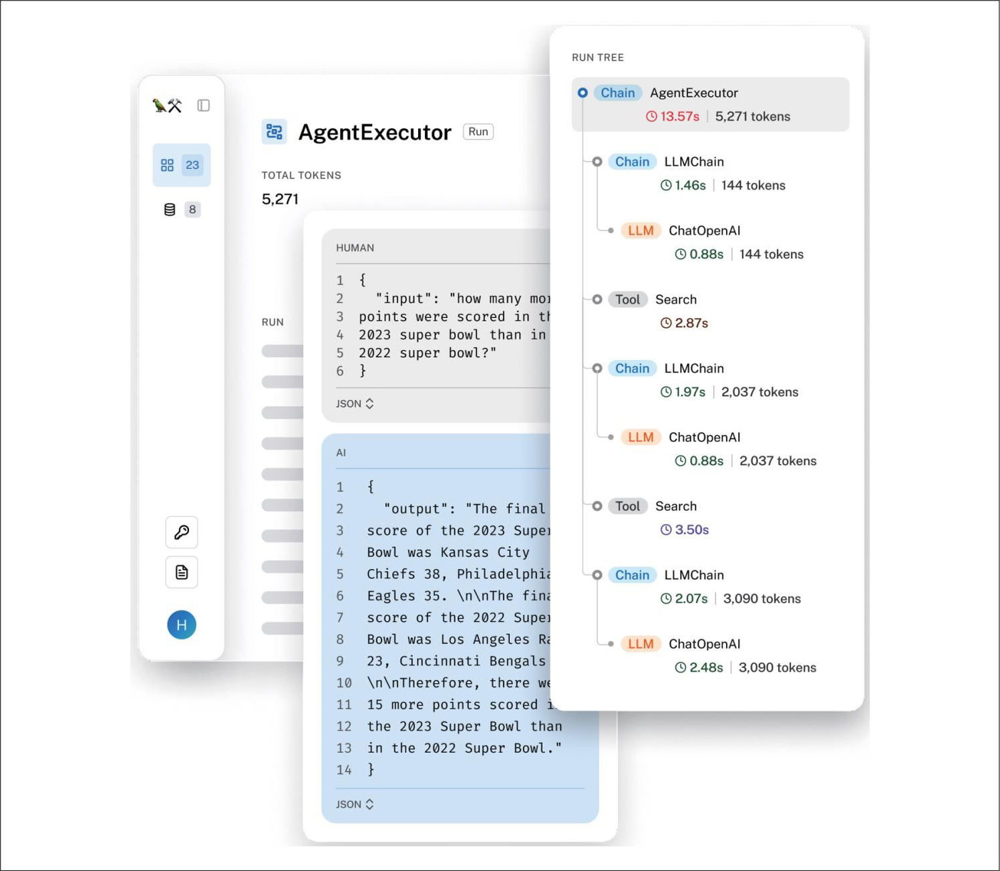

> **圖片描述：** 此圖展示LangSmith中請求追蹤的視覺化範例。左側顯示請求的詳細資訊，包含AgentExecutor的執行結果、總token數（5,271）、使用者輸入和模型輸出的JSON格式資料。右側為「RUN TREE」執行樹狀結構，展示各步驟的執行時間和token消耗，包括LLMChain、ChatOpenAI、Search等元件的層級關係和執行耗時。

圖10-11：LangSmith中視覺化的請求追蹤範例


在理想情況下，你能夠逐步追蹤每個查詢在系統中的轉化過程。如果某個查詢失敗，你能夠準確定位問題發生在哪一步：是處理錯誤、檢索到的上下文不相關，還是模型生成了錯誤的響應。


**3. 漂移檢測**


系統的組成部分越多，可能發生變化的環節就越多。在AI應用中，常見的變化主要包括以下幾類。


系統提示詞變化


應用的系統提示詞可能在你不知情的情況下發生變化，原因多種多樣。例如，系統提示詞基於某個提示詞模板構建，而該模板被更新了；或者某位同事發現了拼寫錯誤並進行了修正。只需透過簡單的邏輯，就能監測到應用的系統提示詞何時發生了變化。


使用者行為變化


隨著時間的推移，使用者會逐漸適應技術。例如，人們已經學會如何構建查詢，以在Google搜尋中獲得更好的結果，或者如何讓自己的文章在搜尋結果中排名更高。在有自動駕駛汽車執行的區域，人們甚至掌握了迫使自動駕駛汽車讓行的方法（Liu等，“Ready to Bully Automated Vehicles on Public Roads?”，2020）。類似地，你的使用者也可能透過調整行為來獲得更好的使用效果。例如，使用者可能學會了透過編寫指令使響應更加簡潔。這可能導致響應長度隨時間逐漸縮短。如果你只關注指標，可能難以發現這種趨勢的成因，需要進行深入調查才能瞭解根本原因。


底層模型變化


當透過API使用模型時，可能會出現API的版本號未發生變化，但底層模型已更新的情況。如第4章所述，模型提供商並不總是公開這些更新，你需要自行檢測是否發生了變化。同一API的不同版本可能對效能產生顯著影響。例如，Chen等（2023）發現，GPT-4和GPT-3.5的2023年3月版本與2023年6月版本的基準測試得分存在明顯差異（參見“How is ChatGPT's Behavior Changing over Time?”）。同樣，Voiceflow報告稱，從gpt-3.5-turbo-0301切換到gpt-3.5-turbo-1106時，模型效能約下降了10%。


### 10.1.7 AI流水線編排


AI應用可能會變得相當複雜——往往涉及多個模型、多資料庫檢索，以及各種工具的呼叫。編排器（orchestrator）用於定義這些元件如何協同工作，從而構建端到端的流水線，同時確保資料在各個元件之間無縫流轉。從宏觀層面看，編排器的運作分為兩步：元件定義和鏈式組合。


組件定義

- 正因如此，一些編排工具致力於成為模型閘道器。事實上，許多工具想發展為能夠完成所有任務的端到端平臺。


你需要告訴編排器系統所使用的元件，包括各類模型、用於檢索的外部資料來源，以及系統可呼叫的工具。模型閘道器可以簡化模型的新增過程。
	你還需要告訴編排器是否使用了任何用於評估和監控的工具。


鏈式組合


鏈式組合本質上是函式組合：將不同的函式（元件）串聯起來。在鏈式組合（流水線）中，你需要告訴編排器從接收使用者查詢到完成任務所需的步驟。以下是一個步驟範例。


1. 處理原始查詢。


2. 根據處理後的查詢檢索相關資料。


3. 將原始查詢與檢索到的資料組合，構建符合模型預期格式的提示詞。


4. 模型根據提示詞生成響應。


5. 對響應進行評估。


6. 如果響應質量達標，則返回給使用者；如果不達標，則將查詢轉交給人工操作員。


編排器負責在元件之間傳遞資料，並應提供相關工具，確保當前步驟的輸出符合下一步驟的格式要求。在理想情況下，當資料流因元件故障或資料不匹配等錯誤而中斷時，編排器應及時發出通知。

	

> **圖片描述：** 此圖為 O'Reilly 書籍系列的裝飾性圖示，繪有一隻橘紅色的蠍子剪影。此為章節內警告框的視覺標記。

 AI流水線編排器不同於通用的工作流編排器（如Airflow或Metaflow）。


當為具有嚴格延遲要求的應用設計流水線時，應儘可能並行執行多個任務。例如，系統中同時存在路由元件（決定將查詢傳送到哪裡）和PII移除元件，這兩個元件的任務便可以並行處理。


目前市面上有許多AI編排工具，包括LangChain、LlamaIndex、Flowise、Langflow和Haystack等。由於檢索和工具呼叫是常見的應用模式，許多RAG和智慧體框架也具備編排功能。


雖然在專案初期直接使用編排工具很有吸引力，但建議你先嘗試在不依賴編排工具的情況下構建應用。引入任何外部工具都會增加複雜性。編排工具可能會掩蓋系統執行的關鍵細節，使得理解和除錯系統變得困難。


一旦應用開發進入後期，你可能會發現引入編排工具的確能顯著提高效率。在評估編排工具時，請注意以下三個方面。


集成性與可擴展性


評估編排工具是否支援當前正在使用或未來可能採用的元件。例如，你想使用Llama模型，需檢查編排工具是否支援該模型。由於模型、資料庫和框架的種類繁多，編排工具不可能支援所有元件，因此你還需要考慮編排工具的可擴充套件性，即如果它不支援某個特定元件，要實作對該元件的支援，修改難度有多大。


對復雜流水線的支持


隨著應用複雜度的提升，你可能需要管理涉及多個步驟和條件邏輯的複雜流水線。支援分支、並行處理和錯誤處理等高階功能的編排工具能幫助你高效地管理複雜流水線。


易用性、性能和可伸縮性


考量編排工具的易用性，優先選擇API直觀、文件詳盡且社群支援強大的產品，這可以顯著降低你和團隊的學習成本。應避免使用會觸發隱性API呼叫或給應用帶來延遲的編排工具。此外，還要確保工具能夠隨著應用數量、開發人員數量和流量的增加而有效擴充套件。


## 10.2 使用者反饋


- 與商業應用相比，開源應用的一個主要缺點是收集使用者回饋的難度較大。使用者可以自行部署開源應用，而開源應用的釋出者無法得知應用的具體使用情況。


使用者回饋在軟體應用中一直髮揮著關鍵作用，主要體現在兩個方面：評估應用效能和指導開發方向。在AI應用中，使用者回饋的作用尤為重要。使用者回饋屬於專有資料，而資料構成了競爭優勢。要構建第8章討論的資料飛輪，設計良好的使用者回饋系統必不可少。

使用者回饋不僅可以用於為個體定製個性化模型，還可以用於改進模型的後續版本。隨著資料日益稀缺，專有資料價值倍增。若能快速推出產品並儘早吸引使用者，就可以收集資料，進而不斷最佳化模型，從而形成競爭壁壘。


需要牢記的是，使用者回饋即使用者資料。利用使用者回饋時需要像對待其他資料一樣謹慎。應尊重使用者隱私，使用者有權瞭解自己的資料被如何使用。


### 10.2.1 提取對話反饋


傳統上，回饋可以分為顯式回饋和隱式回饋。顯式回饋是使用者在應用明確請求回饋時提供的資訊，例如點贊/點踩、投票支援/投票反對、星級評分，或對“我們解決您的問題了嗎？”這類問題的回答。顯式回饋在各種應用中的形式基本一致——畢竟詢問使用者是否喜歡某物的方式有限，因此顯式回饋往往更容易理解。


隱式回饋則是從使用者行為中推斷出的資訊。例如，使用者購買了系統推薦的產品，這意味著推薦效果很好。哪些行為可以被視為隱式回饋取決於使用者在特定應用中可以執行的操作，因此隱式回饋的形式高度依賴於具體應用場景。基礎模型催生了大量新的應用，隨之而來的還有許多新的隱式回饋型別。


許多AI應用採用的對話介面使使用者更容易給出回饋。使用者可以像日常對話一樣，肯定AI的表現或糾正其錯誤。使用者向AI發出指令時使用的語言既能反饋應用的性能，也能反映使用者的偏好。


假設你正在使用AI助手規劃澳大利亞之旅。當你請AI為你在悉尼尋找需要入住三晚的酒店時，AI給出了以下回答。


以下是悉尼適合入住三晚的三家酒店的建議。


1. Historic Rocks Boutique Hotel（岩石區）


價格：約400美元/晚


周邊環境：街道迷人，靠近標誌性景點


2. Stylish Surry Hills House Hotel（薩里山）


價格：約200美元/晚


周邊環境：時尚街區，有充滿活力的咖啡館和藝術畫廊


3. Chill Bondi Beachside Hotel（邦迪海灘）


價格：約300美元/晚


周邊環境：海濱位置，適合放鬆和城市探索


你對這三個建議的回應將體現你的偏好。如果你回答“好的，幫我預訂靠近畫廊的那一家”，說明你對藝術感興趣。如果你回答“沒有200美元以下的嗎”，則體現出你對價格較為敏感，也表明AI助手尚未完全理解你的需求。


從對話中提取的使用者回饋可以用於評估、開發和個性化定製。


·評估：提取指標以監控應用效能。


·開發：訓練未來的模型或指導其開發方向。


·個性化定製：為每位使用者提供定製化的應用體驗。


隱式的對話回饋既可以從使用者訊息的內容中推斷，也可以從使用者的互動模式中推斷。由於回饋融入了日常對話，因此提取難度較高。雖然對對話線索的直覺可以幫助你初步確定需要關注的訊號，但要真正理解這些回饋，需要進行嚴謹的資料分析和使用者研究。


儘管對話回饋隨著聊天機器人的普及才受到廣泛關注，但其實早在ChatGPT問世的前幾年，這已經是一個活躍的研究領域。自21世紀10年代末以來，強化學習社群一直在嘗試讓強化學習演演算法從自然語言回饋中學習，其中許多研究取得了令人鼓舞的成果（Fu等，“From Language to Goals: Inverse Reinforcement Learning for Vision-Based Instruction Following”，2019；Goyal等，“Using Natural Language for Reward Shaping in Reinforcement Learning”，2019；Zhou和Small，“Inverse Reinforcement Learning with Natural Language Goals”，2020；Sumers等，“Learning Rewards from Linguistic Feedback”，2020）。自然語言回饋對於早期的對話式AI應用也具有重要意義，例如亞馬遜Alexa（Ponnusamy等，“Feedback-Based Self-Learning in Large-Scale Conversational AI Agents”，2019；Park等，“A Scalable Framework for Learning from Implicit User Feedback to Improve Natural Lssanguage Understanding in Large-Scale Conversational AI Systems”，2020）、Spotify的語音控制功能（Xiao等，“Let Me Ask You This: How Can a Voice Assistant Elicit Explicit User Feedback?”，2021）及Yahoo！語音助手（Hashimoto和Sassano，“Detecting Absurd Conversations from Intelligent Assistant Logs by Exploiting User Feedback Utterances”，2018）。


**1. 自然語言反饋**


從訊息內容中提取的回饋稱為自然語言回饋。在實際生產環境中，追蹤以下訊號對於監控應用的表現具有重要價值。


提前終止。如果使用者提前終止響應，例如中途停止生成響應、退出應用（適用於網頁和移動應用）、命令模型停止（適用於語音助手），或者讓智慧體陷入閒置狀態（如不告訴智慧體下一步該選擇哪個選項），這通常意味著對話進展不順利。


錯誤修正。如果使用者在後續對話中以“不”或“我的意思是”等開頭，那麼意味著模型的響應很可能出現了偏差。


為了修正錯誤，使用者可能會嘗試重新表述自己的請求。圖10-12展示了使用者試圖糾正模型理解偏差的一個範例。透過啟發式方法或機器學習模型可有效檢測嘗試重新表述的行為。

	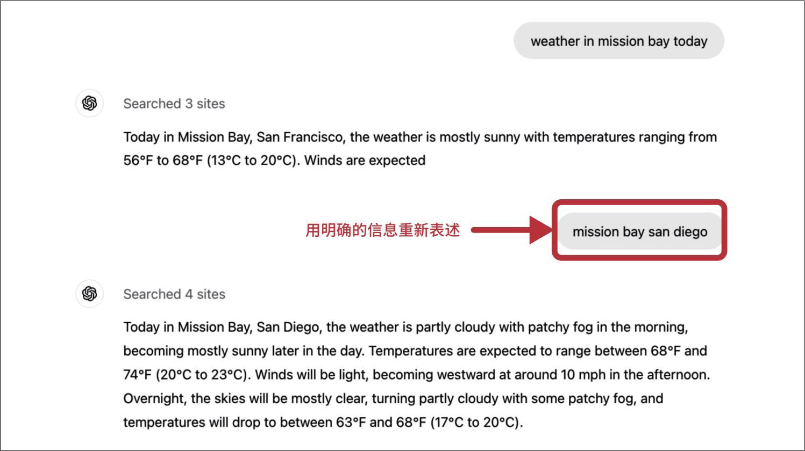

> **圖片描述：** 此圖展示使用者嘗試修正模型理解偏差的對話範例。使用者查詢 "weather in mission bay today"，模型搜尋了3個網站後返回San Francisco Mission Bay的天氣。使用者以紅色箭頭標註「用明確的資訊重新表述」，改為輸入 "mission bay san diego"。模型隨後搜尋了4個網站，正確返回San Diego Mission Bay的天氣資訊。此範例說明使用者如何透過重新表述來糾正模型的誤解。

圖10-12：由使用者提前終止生成和重新表述問題可以推斷，模型誤解了原始請求的意圖


使用者還可能指出具體的改進方式。例如，使用者要求模型總結一個故事，而模型混淆了人物角色，使用者可能給出回饋：“Bill是嫌疑人，不是受害者。”模型應能根據這種回饋修改總結內容。


這種修正性回饋在智慧體應用場景中尤為常見，使用者可能透過回饋引導智慧體採取更合適的動作。例如，使用者給智慧體指派了對XYZ公司進行市場分析的任務，可能會補充“你還應該檢視XYZ公司的GitHub頁面”或“檢視CEO在X平臺的賬號資料”等回饋。


有時，使用者要求模型自行修正，例如給出“你確定嗎”“再檢查一下”“給出資訊來源”等回饋。這並不一定意味著模型給出了錯誤答案，但可能意味著模型的響應缺乏使用者想要的細節，或表明使用者不信任模型。


一些應用允許使用者直接編輯模型的響應。例如，使用者要求模型生成程式碼，隨後對生成的程式碼進行了修改，這就是一個非常強烈的訊號，表明模型生成的原始程式碼未完全滿足使用者需求。


使用者的編輯也是偏好資料的寶貴來源。回顧一下，偏好資料通常以（查詢，勝出響應，落敗響應）的形式呈現，可以用於使模型與人類偏好對齊。每次使用者編輯都構成一個偏好範例，其中模型生成的原始響應為落敗響應，而使用者編輯後的響應為勝出響應。


抱怨。使用者常常只是抱怨應用的輸出結果，而不嘗試修正它們。例如，使用者可能抱怨答案錯誤、不相關、有毒、冗長、缺乏細節或只是質量差。表10-1展示了透過對FITS（Feedback for Interactive Talk & Search）資料集進行自動分群得到的8組自然語言回饋（Xu等，“Learning New Skills after Deployment: Improving Open-Domain Internet-Driven Dialogue with Human Feedback”，2022）。


表10-1：基於自動分群FITS資料集得到的回饋型別。結果來自“System-Level Natural Language Feedback”（Yuan等，2023）

	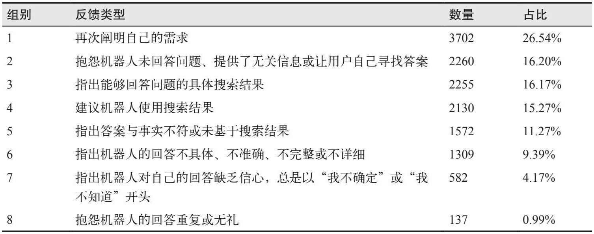

> **圖片描述：** 此為基於FITS資料集自動分群得到的8組自然語言回饋類型表格。列出各組別、回饋類型、數量和占比：(1) 再次闡明自己的需求（3702，26.54%）；(2) 抱怨機器人未回答問題或提供無關資訊（2260，16.20%）；(3) 指出能夠回答問題的具體搜尋結果（2255，16.17%）；(4) 建議機器人使用搜尋結果（2130，15.27%）；(5) 指出答案與事實不符（1572，11.27%）；(6) 指出回答不具體或不完整（1309，9.39%）；(7) 指出回答缺乏信心（582，4.17%）；(8) 抱怨回答重複或無禮（137，0.99%）。

瞭解機器人在哪些方面未能滿足使用者需求對於改進系統至關重要。如果使用者不喜歡冗長的回答，你可以修改提示詞，使機器人的回答更簡潔。如果使用者因為答案缺乏細節而不滿意，你可以引導機器人給出更具體的回答。


情緒。抱怨也可能只是單純的負面情緒表達（如沮喪、失望、嘲諷等），而沒有解釋具體原因，例如發出“唉”這類感嘆。雖然聽起來有些極端，但分析使用者在與機器人對話過程中的情緒變化能幫助你評估機器人的表現。一些呼叫中心會全程追蹤使用者在通話過程中的聲音狀態。如果使用者的聲音越來越大，往往意味著服務出現了問題。如果使用者開始時很生氣，但對話結束時很愉快，則說明問題可能已得到解決。


自然語言回饋也可以從模型的回覆中推斷出來。一個重要的訊號是模型的拒絕率（refusal rate）。如果模型經常回復“抱歉，我無法回答這個問題”或“作為語言模型，我無法……”，使用者可能會感到不滿。


**2. 其他對話反饋**


除了訊息內容，使用者的互動行為也能提供多種型別的回饋。


重新生成。許多應用允許使用者選擇重新生成響應，有時還會呼叫不同的模型來生成響應。使用者選擇重新生成可能是因為他們對模型生成的響應不滿意，但也可能是覺得當前響應尚可，只是想獲得更多選項進行對比。這在影像生成或故事創作等創意類場景中尤為常見。


相較於訂閱制應用，重新生成的訊號對按使用量計費的應用可能更具參考價值。這是因為在按使用量計費的情況下，使用者不太可能僅僅出於好奇而支付額外的費用去重新生成。


就個人而言，我經常在處理複雜請求時選擇重新生成，以驗證模型響應的一致性。如果兩次響應相互矛盾，則二者都不可信。


重新生成響應後，有些應用可能會明確要求使用者對結果進行比較，如圖10-13所示。這種“更好”或“更差”的資料同樣可以用於偏好微調。

	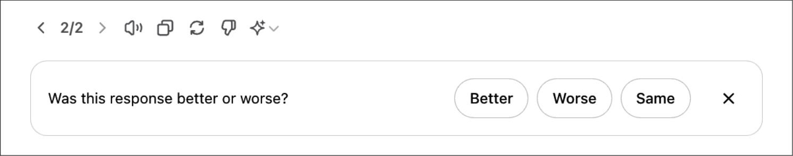

> **圖片描述：** 此圖展示ChatGPT重新生成回應後的比較回饋介面。頂部顯示回應編號「2/2」及多個操作按鈕。下方為回饋區塊，詢問 "Was this response better or worse?"，提供三個選項按鈕：「Better」、「Worse」和「Same」，以及一個關閉按鈕。

圖10-13：重新生成響應後，ChatGPT會請求使用者提供比較回饋


對話管理。使用者在管理對話時採取的操作（如刪除、重新命名、分享和收藏）也可以作為回饋訊號。刪除對話通常是一個強烈的負面訊號，表明對話質量不佳，除非使用者只是為了刪除尷尬或隱私的內容。重新命名對話可能意味著對話內容很有價值，但自動生成的標題不夠準確。


對話長度。另一個常見的回饋訊號是每次對話的輪數（the number of turns per conversation）。這種訊號是正面的還是負面的取決於應用型別。對AI陪伴類應用來說，較長的對話通常意味著使用者體驗良好。但對於以提高生產效率為目標的聊天機器人（如客服機器人），較長的對話可能意味著機器人未能有效幫助使用者解決問題。


對話多樣性。對話長度也可以與對話多樣性（dialogue diversity）結合起來分析。對話多樣性可以透過不同的token或話題數來衡量。如果對話很長，但機器人一直重複幾句話，可能意味著使用者陷入了對話迴圈。


顯式回饋更容易解釋，但需要使用者投入額外精力。由於許多使用者可能不願意進行額外操作，顯式回饋往往較稀少，尤其是在使用者基數較小的應用中。此外，顯式回饋還受響應偏差的影響。例如，感到不滿的使用者可能更傾向於主動投訴或給出負面評價，導致回饋資料看起來比實際情況更偏向負面。


隱式回饋更為豐富——其形式只受限於你的想象力——但噪聲也更大，且解釋起來更具挑戰性。例如，分享對話這個行為可能是負面訊號，也可能是正面訊號。比如，我有一個朋友常在模型犯了明顯錯誤時分享對話，而另一個朋友則通常與同事分享有用的對話。因此，通過使用者研究來了解每個行為背後的真正動機至關重要。

- 你不僅可以收集關於AI應用的回饋，還可以使用AI來分析這些回饋。


引入更多訊號有助於更清晰地判斷使用者的真實意圖。如果使用者在分享連結後重新表述了問題，可能表明之前的對話沒有達到預期。從對話中提取、解釋和利用隱式回饋是一個規模雖小但正在發展的研究領域。

### 10.2.2 反饋設計


如果你不確定應該收集哪些回饋，10.2.1節的內容或許能給你一些啟發。


本節將討論何時及如何收集這些有價值的回饋。


**1. 何時收集反饋**


回饋可以且應該貫穿使用者的整個使用過程。使用者應該隨時有機會提供回饋，尤其是在發現錯誤時。但需要注意的是，回饋收集機制應該是非侵入式的，不應干擾使用者的正常工作流程。以下列舉了幾個適合收集使用者回饋的時機。


在初始階段。當使用者剛完成註冊時，收集回饋可以幫助應用對使用者進行校準。例如，人臉識別應用必須先掃描使用者的面部才能正常工作；語音助手可能會要求使用者朗讀一句話，以識別使用者的聲音並啟用喚醒詞（用於啟用語音助手的詞語，如“Hey Google”）；語言學習應用可能會問使用者幾個問題，以評估使用者的技能水平。對於某些應用（如人臉識別應用），校準是必要的。但對於其他應用，初始回饋應當是可選的，因為強制回饋會增加使用者嘗試產品的阻力。如果使用者未指定偏好，可以預設使用中性選項，之後透過使用者的行為逐步校準。


當出現問題時。當模型產生幻覺、誤拒合理請求、生成不良圖片或響應時間過長時，應允許使用者及時上報故障。你可以提供差評、重新生成或切換模型等選項。使用者也可能直接在對話中回饋，比如“你錯了”“太老套了”或“我想要更簡短的回答”等。


在理想情況下，即使產品出現問題，使用者也仍然能夠完成他們的任務。例如，當模型錯誤地對產品進行了分類時，應允許使用者手動編輯類別。若使用者與AI協作仍無法解決問題，應提供人工協助選項。許多客服機器人在對話拖沓或使用者表現出沮喪情緒時，主動提供轉接人工客服的選項。

- 我希望文字轉語音也能有類似影像修復的功能。目前文字轉語音應用在95%的情況下表現良好，但另外5%的情況著實令人失望。AI可能會讀錯名字，或者不能在對話中正確停頓。我希望有應用能讓我只修正錯誤的部分，而不必重新生成整段音訊。


人類與AI協作的一個例子是影像生成中的修復（inpainting）功能。
	如果生成的影像並不完全符合使用者的要求，使用者可以選擇影像中的某個區域，並透過提示詞描述如何改進。圖10-14展示了使用DALL·E進行影像修復的範例。這一功能既能夠幫助使用者獲得更理想的結果，也可以為開發者提供高質量的回饋。

	

> **圖片描述：** 此圖展示DALL·E的影像修復（Inpainting）功能範例。上方為四張日式浮世繪風格的貓咪插畫，使用者選取其中一張並輸入 "change the cat's expression to happy"。下方DALL·E回應已更新插畫，展示一隻表情快樂的貓咪在櫻花叢中的畫面，保留了原始的浮世繪和漫畫混合風格。

圖10-14：DALL·E中影像修復功能的範例


當模型置信度較低時。當模型對某個操作不確定時，可以請求使用者回饋以確認意圖。例如，當收到論文摘要生成請求時，如果模型不確定使用者更喜歡簡短的概括性摘要還是逐節展開的詳細摘要，則可以同時輸出兩種摘要供使用者選擇（假設生成兩種摘要不會延長使用者的等待時間）。使用者可以選擇他們更喜歡的摘要。這種比較訊號可用於偏好微調。圖10-15展示了在生產環境中進行比較評估的範例。

	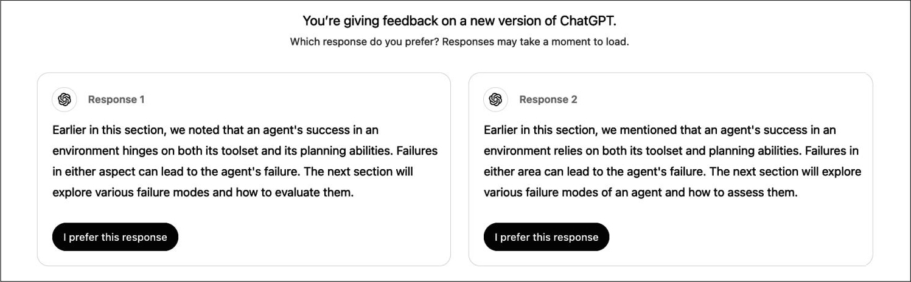

> **圖片描述：** 此圖展示ChatGPT的並排比較回饋介面。標題為 "You're giving feedback on a new version of ChatGPT. Which response do you prefer?"。左側「Response 1」和右側「Response 2」各顯示一段關於智慧體成功因素的英文段落，用詞略有不同。每個回應下方各有一個 "I prefer this response" 按鈕，供使用者選擇偏好的回應。

圖10-15：ChatGPT的兩個響應的並排比較範例

- 當我在活動中提出這個問題時，大家對於這個問題的反應往往不一致。一些人認為展示完整的響應能提供更多資訊，幫助使用者做出更可靠的選擇；另一些人則認為，一旦使用者閱讀了完整的響應，就沒有動力再去展開閱讀可能更好的響應。


向使用者同時展示兩個完整的響應供其選擇，本質上是在收集使用者的顯式回饋。然而，使用者可能沒時間閱讀或不願費心比較，導致回饋結果存在噪聲。一些應用（如Google Gemini）只展示每個響應的開頭部分，如圖10-16所示。使用者需展開才能閱讀。這種“展開”行為本身就體現了使用者認為哪個響應更具吸引力，不過目前尚不清楚哪種方式能獲得更可靠的回饋。

	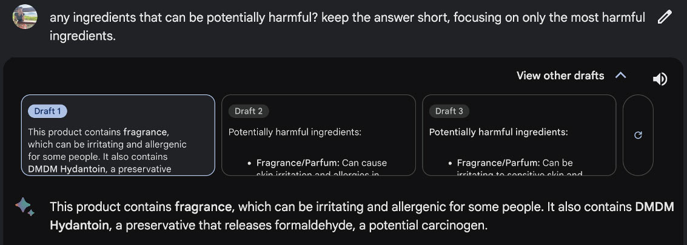

> **圖片描述：** 此圖展示Google Gemini的草稿比較功能。使用者詢問關於有害成分的問題，系統展示三個草稿（Draft 1、Draft 2、Draft 3）。使用者可點擊「View other drafts」展開檢視不同版本。已選擇的Draft 1完整顯示，列出含有fragrance和DMDM Hydantoin等潛在有害成分的分析結果。此功能讓使用者能比較不同草稿的回應品質。

圖10-16：Google Gemini並排展示部分響應以獲取對比回饋。使用者必須單擊展開他們想要進一步閱讀的響應，這種行為本身就體現了使用者認為哪個響應更有吸引力


另一個例子是照片管理應用，它能自動為照片新增標籤，以便響應諸如“顯示X的所有照片”這樣的查詢。當應用不確定兩張照片中的主角是否相同時，可以請求使用者回饋，如圖10-17所示。

	

> **圖片描述：** 此圖展示Google相簿的使用者回饋請求介面。畫面上方為標題 "Same or different cat?"，下方並排顯示兩張卡通風格的貓咪圖片（由ChatGPT生成）。底部提供三個選項：「Same」（打勾圖示）、「Different」（禁止圖示）和「Not sure」（問號圖示），供使用者判斷兩張照片中是否為同一隻貓。

圖10-17：當不確定時，Google相簿會請求使用者回饋。這兩張關於貓的圖片由ChatGPT生成


你可能會疑惑：當結果良好時，如何收集回饋呢？使用者可以透過點贊、收藏或分享等操作來表達滿意。然而，蘋果的人機互動指南建議，不要同時請求正面回饋和負面回饋。應用在預設情況下應該產生良好的結果。如果對好的結果也請求回饋，可能會給使用者留下好結果只是例外情況的印象。歸根結底，如果使用者滿意，他們自然會繼續使用你的應用。


不過，我與許多人交流後發現，他們認為使用者在遇到特別出色的內容時，應該有提供回饋的渠道。某熱門AI產品的產品經理提到，他們的團隊非常需要正面回饋，因為這能揭示使用者真正喜愛並願意積極回饋的高價值功能。藉助這些資訊，團隊能夠集中精力最佳化這些功能，而不是將資源分散在眾多低價值功能上。


部分開發者因為擔心介面變得雜亂或打擾使用者而避免請求正面回饋。其實這種風險可以透過限制回饋請求的頻率來控制。例如，當使用者基數很大時，每次只向1%的使用者展示回饋請求，就能在不影響大部分使用者體驗的情況下收集足夠的回饋。需要注意的是，請求回饋的使用者比例越小，出現回饋偏差的風險就越高。但只要使用者樣本足夠多，這些回饋仍然能提供有價值的產品洞察。


**2. 如何收集反饋**


回饋應無縫融入使用者的工作流程。使用者應能輕鬆地提供回饋，而無須額外的煩瑣操作。回饋收集過程不應干擾使用者體驗，同時允許使用者輕鬆忽略回饋請求。此外，應透過合理的激勵措施鼓勵使用者提供高質量的回饋。


Midjourney的影像生成功能常被視為優秀回饋設計的典範。針對每段提示詞，Midjourney會生成一組（四張）圖片，併為使用者提供以下選項（見圖10-18）。

	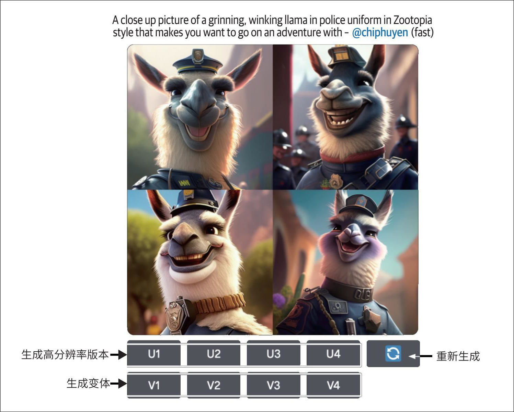

> **圖片描述：** 此圖展示Midjourney的工作流程及隱式回饋收集機制。頂部顯示一段文字提示詞，描述一隻穿著警察制服的羊駝。下方生成四張不同風格的卡通羊駝圖片。底部提供操作選項：「生成高解析度版本」按鈕（U1-U4）、「生成變體」按鈕（V1-V4）和「重新生成」按鈕。這些操作本身即構成使用者的隱式回饋訊號。

圖10-18：Midjourney的工作流程使應用能夠收集隱式回饋


1. 為任意一張圖片生成高解析度版本。


2. 為任意一張圖片生成變體。


3. 重新生成。


這些選項向Midjourney傳遞了不同的訊號。選項1和選項2告訴Midjourney，使用者認為四張圖片中哪一張最有潛力。選項1對所選圖片給出了最強的正面訊號，選項2則給出了較弱的正面訊號。選項3表示沒有一張圖片足夠好。不過，即使現有圖片不錯，使用者也可能選擇重新生成，以檢視其他可能的結果。


像GitHub Copilot這樣的程式碼助手，通常會以較淺的顏色顯示建議內容的草稿，如圖10-19所示。使用者可以按Tab鍵接受建議，或者繼續輸入以忽略建議，這兩種操作都提供了回饋。

	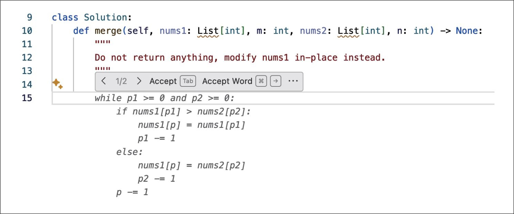

> **圖片描述：** 此圖展示GitHub Copilot的程式碼建議介面。編輯器中顯示Python程式碼，Copilot以淡灰色文字顯示建議的程式碼片段（merge sort相關邏輯）。第14行出現Copilot建議提示，顯示 "1/2 > Accept [Tab] Accept Word [⌘] [→] ..." 等操作選項，使用者可按Tab鍵接受建議或繼續輸入以忽略。

圖10-19：GitHub Copilot使使用者能夠輕鬆地接受或拒絕建議


ChatGPT和Claude等獨立AI應用面臨的最大挑戰是它們並未深度融入使用者的日常工作流程，因此很難像GitHub Copilot等整合產品那樣收集高質量的回饋。例如，當Gmail推薦了一封郵件草稿時，它可以追蹤該草稿的使用或編輯情況，但如果使用者使用ChatGPT撰寫了一封郵件，ChatGPT無法知曉生成的郵件最終是否被採用。


從產品分析的角度看，回饋資料本身已極具價值。例如，僅透過點贊/點踩資料就能統計使用者對產品的滿意度分佈。但如果要進行更深入的分析，就需要結合回饋的上下文，例如最近的5～10輪對話。這些上下文可以幫助你定位問題。然而，如果沒有使用者的明確授權，可能無法獲得這些上下文，尤其是當上下文可能包含PII時。


因此，一些產品會在服務協議中加入相關條款，向使用者申請資料訪問許可權，用於資料分析與產品迭代最佳化。對於沒有此類條款的應用，使用者回饋可能會與使用者資料捐贈流程相關聯，即在使用者提交回饋時，請求使用者捐贈（如分享）他們最近的互動資料。例如，當使用者提交回饋時，介面可能會彈出核取方塊，詢問使用者是否願意分享最近的資料作為回饋的上下文資訊。


向使用者說明回饋的用途可以激勵他們提供更多、更好的回饋。你需要明確告知使用者，他們的回饋是用於個性化產品體驗、統計整體使用情況，還是用於訓練新模型。如果使用者擔心隱私問題，應承諾不會使用他們的資料訓練模型，或者僅在本地進行處理（前提是必須嚴格信守這些承諾）。


不要要求使用者去做不可能完成的事情。例如收集對比訊號時，不應讓使用者在他們不理解的選項之間做選擇。我曾經遇到這種情況：ChatGPT讓我在一個統計問題的兩個可能答案之間做選擇，如圖10-20所示。我完全不知道該選哪個，真希望當時有一個“我不知道”的選項。

	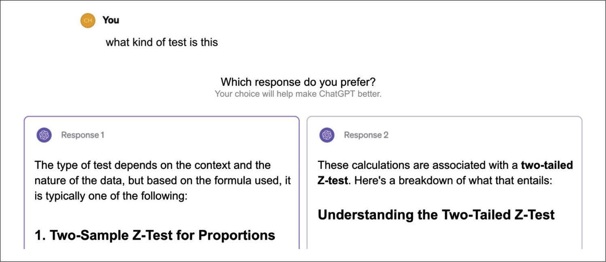

> **圖片描述：** 此圖展示ChatGPT要求使用者在兩個回應之間進行偏好選擇的介面。使用者問題為 "what kind of test is this"。Response 1解釋測試類型取決於資料的上下文和性質。Response 2直接指出這是一個「two-tailed Z-test」並進行詳細說明。每個回應下方有 "I prefer this response" 按鈕。此範例說明對於有明確正確答案的數學問題，不應以偏好形式收集回饋。

圖10-20：ChatGPT要求使用者選擇他們偏好的回答的範例。然而，對於這種數學問題，正確答案不應該以偏好問題的形式給出


如果圖示和提示資訊能幫助使用者理解選項，則應該在設計中新增。應避免使用可能讓使用者感到困惑的設計，因為模糊不清的指示可能導致回饋失真。我舉辦過一次GPU最佳化研討會，當時使用Luma收集回饋。當檢視負面回饋時，我很困惑：明明使用者的文字回饋是積極的，但星級評分只有1星（滿分5星）。深入調查後發現，Luma在回饋表單中使用表情符號代表星級評分，但代表1星評分的憤怒表情被放在了5星評分的位置上，如圖10-21所示。

	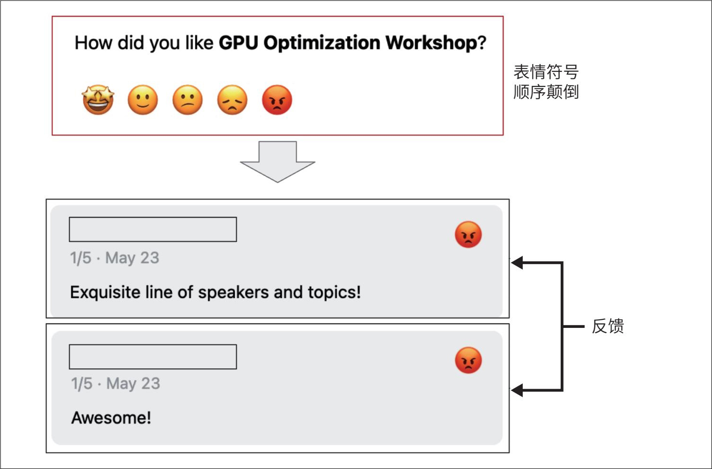

> **圖片描述：** 此圖展示Luma回饋表單中表情符號順序顛倒導致的使用者誤操作。上方為回饋問題 "How did you like GPU Optimization Workshop?"，下方排列五個表情符號，但順序從左至右為：開心、微笑、中性、不開心、憤怒——與通常的1至5星評分順序相反。右側標註「表情符號順序顛倒」。下方兩個實際回饋範例顯示，使用者文字回饋為正面（"Exquisite line of speakers!"、"Awesome!"），但因點擊了最右側的憤怒表情（誤以為是5星），實際給出了1星評分。

圖10-21：由於Luma將代表1星評分的憤怒表情放在了5星評分的位置上，一些使用者在給出積極評價時錯誤地選擇了1星評分


你還需要注意使用者回饋是私密的還是公開的。例如，某使用者表示喜歡某內容，是否要將這一資訊展示給其他使用者？在Midjourney發展初期，使用者的回饋（如選擇生成高解析度的圖片、生成圖片的變體或重新生成圖片）都是公開的。

- 參見“Ted Cruz Blames Staffer for ‘Liking’ Porn Tweet”（Nelson和Everett，POLITICO，2017）及“Kentucky Senator Whose Twitter Account ‘Liked’ Obscene Tweets Says He Was Hacked”（Liam Niemeyer，WKU Public Radio，2023）。


回饋訊號的可見性會深刻影響使用者行為、使用者體驗及回饋質量。使用者在私密環境下往往更坦率，因為他們的行為被評判的可能性較低
	，這可能帶來質量更高的回饋訊號。2024年，X（原Twitter）將“點贊”設為私密的。X的所有者Elon Musk表示，這一變化使點贊數量顯著增加。


然而，私密的回饋訊號可能降低內容的可發現性和可解釋性。例如，隱藏點贊會導致使用者難以發現他們的聯絡人喜歡的推文。當平臺根據聯絡人的點贊行為推薦內容時，使用者可能無法理解為什麼某些推文會出現在自己的動態中。


### 10.2.3 反饋的局限性


毫無疑問，使用者回饋對應用開發者具有極高的價值。然而，回饋也有自身的侷限性。


**1. 偏差**


與其他資料一樣，使用者回饋也存在偏差。理解這些偏差並圍繞它們設計回饋系統非常重要。每個應用都有特定的偏差，以下是一些常見的回饋偏差範例，可以幫助你瞭解需要注意的情況。


寬容偏差


寬容偏差是指使用者傾向於給出比實際體驗更積極的評價，通常是為了避免衝突（覺得有必要表現得友善），或者僅僅因為這是最省事的選擇。試想一下，當你趕時間時，一個應用要求你對一筆交易進行評分。雖然你對這筆交易並不滿意，但你知道如果給出負面評價，就需要提供理由，於是你直接給出好評以求儘快結束。這也正是不應該讓使用者為提供回饋而付出額外精力的原因。


在5星評分體系中，4星和5星通常表示體驗良好。但在實際場景中，使用者可能會迫於壓力給出5星，而只有在出現嚴重問題時才給4星。例如，據Uber 2014年的資料，該平臺上司機的平均評分為4.8分，低於4.6分的司機可能面臨賬號被停用的風險。


這種偏差不一定是致命問題。例如，Uber的目標是區分優秀的司機和不合格的司機，即使存在普遍高分的偏差，其評分體系似乎也能實作這一目標。關鍵在於透過分析使用者評分的分佈情況來識別並適應這種偏差。

- 此處建議的選項僅用於展示如何重新設計選項，並未經過驗證。


如果希望獲得更細緻的回饋，可以嘗試去除低評分附帶的強烈負面含義，以減輕使用者的心理負擔。例如，不要向使用者展示1～5的數字評分，而是提供如下描述性選項
	：


·“很棒的行程，很棒的司機。”


·“相當不錯。”


·“沒什麼可抱怨的，但也沒什麼特別出色的。”


·“本可以更好。”


·“不要再給我匹配這個司機了。”


隨機性


使用者經常給出隨機回饋，這並非出於惡意，而是因為他們缺乏動力去提供深思熟慮的意見。例如，當兩個較長的響應並排顯示供使用者對比評價時，使用者可能不願意仔細閱讀，而是隨機選擇其中一個；在Midjourney中，使用者也可能只是隨機選擇一張圖片來生成變體。


位置偏差


選項的位置可能影響使用者對該選項的感知。例如，使用者通常更傾向於選擇第一個建議而非第二個。如果使用者選擇了第一個建議，並不一定意味著該建議更好。


在設計回饋系統時，可以透過隨機調整選項的位置或構建位置校正模型（根據選項的位置計算其真實成功率）來減少這種偏差。


偏好偏差


除了前面提到的幾種偏差，還有許多因素會影響使用者回饋，本書討論過部分案例。例如，在並排比較中，使用者可能偏好較長的響應，即使較長的響應準確性較低，因為長度比準確性更容易被直觀感知。另一種偏差是近因偏差（recency bias），即使用者在比較兩個答案時，往往偏愛後看到的那個答案。


仔細檢查使用者回饋以發現其中的偏差至關重要。理解這些偏差將幫助你正確解讀回饋，避免做出誤導性的產品決策。


**2. 惡性反饋循環**


請記住，使用者回饋具有侷限性，你只能獲得使用者對你所展示內容的回饋。


在利用使用者回饋來調整模型行為的系統中，可能會出現惡性反饋循環（degenerate feedback loop）。當預測結果本身影響了使用者回饋，而這些回饋又進一步影響模型的下一輪迭代時，就會產生惡性回饋迴圈，從而放大初始偏差。


假設你正在構建一個影片推薦系統。排名靠前的影片被優先展示，因此獲得更多點選，這進一步強化了系統關於“這些影片是最佳選擇”的認知。最初，影片A和影片B之間的差異可能很小，但由於影片A排名靠前，獲得了更多點選，系統便持續提升它的排名。隨著時間的推移，影片A的排名大幅提升，而影片B逐漸沉寂。這種回饋迴圈導致熱門影片持續霸榜，而新影片難以脫穎而出。這種現象也被稱為曝光偏差、流行度偏差或資訊繭房，是一個被廣泛研究的經典問題。


惡性回饋迴圈還可能改變產品的定位和使用者群體。假設最初只有少數使用者回饋他們喜歡貓的照片，系統捕捉到這一訊號後開始生成更多關於貓的照片。這吸引了更多愛貓人士，他們進一步回饋貓的照片很好，促使系統生成更多與貓相關的內容。不久，這個應用就變成了愛貓人士的聚集地。這裡以貓的照片為例，同樣的機制也可能放大其他更具危害性的偏差，例如種族主義、性別歧視或對露骨內容的偏好等。


根據使用者回饋調整產品，還可能使對話式智慧體變成一個“迎合者”。多項研究表明，基於使用者回饋訓練的模型可能傾向於提供它認為使用者想要的內容，即使這些內容並非最準確或最有益的（Stray，“The AI Learns to Lie to Please You: Preventing Biased Feedback Loops in Machine-Assisted Intelligence Analysis”，2023）。Sharma等（2023）的研究表明，基於人類回饋訓練的AI模型傾向於迎合使用者，更可能給出與使用者觀點一致的響應（參見“Towards Understanding Sycophancy in Language Models”）。


使用者回饋對於提升使用者體驗至關重要，但如果不加甄別地使用，可能會固化偏見甚至毀掉產品。在將回饋融入產品之前，務必明確這些回饋的侷限性及其潛在影響。


## 10.3 小結


如果說之前的每一章都專注於AI工程的某個具體方面，那麼本章則整體探討了如何在基礎模型之上構建應用。


本章內容分為兩部分。第一部分討論了AI應用的常見架構。雖然具體應用的架構可能有所不同，但這種宏觀架構為理解不同元件如何協同工作提供了一個框架。我透過逐步構建這一架構的方式，討論了每一步所面臨的挑戰及應對這些挑戰的技術。


雖然為了保持系統的模組化和可維護性有必要將元件分離開來，但這種分離並非絕對的。元件之間的功能可能存在多種重疊方式。例如，防護措施既可以整合到推理服務或模型閘道器中，也可以作為獨立元件來實作。


每增加一個元件都可能使系統更強大、更安全或更快速，但同時會增加系統的複雜性，引入新的故障模式。監控與可觀測性是任何複雜系統都不可或缺的組成部分。可觀測性涉及理解系統如何發生故障，圍繞故障設計指標和警報，並確保系統的設計能夠使這些故障易於檢測和追蹤。儘管軟體工程和傳統機器學習中的許多可觀測性最佳實踐和工具同樣適用於AI工程應用，但基礎模型引入了新的故障模式，需要額外的指標和設計考量。


與此同時，對話式介面豐富了使用者回饋的型別，你可以利用這些回饋進行資料分析、產品最佳化和資料飛輪的構建。本章的第二部分討論了各種形式的對話回饋，以及如何透過應用設計來高效地收集這些回饋。


傳統上，使用者回饋設計通常被視為產品團隊的職責，而非工程團隊的職責，因此經常被工程師忽視。然而，由於使用者回饋是持續最佳化AI模型的重要資料來源，越來越多的AI工程師開始參與這一過程，以確保獲得所需的資料。這進一步印證了第1章提出的觀點：與傳統機器學習工程相比，AI工程正逐漸向產品端靠攏。這是因為，資料飛輪的重要性日益提升，產品體驗已成為核心競爭力。


許多AI挑戰本質上是系統層面的問題。要解決這些問題，通常需要跳出區域性限制，從系統整體的角度進行思考。單個問題可能由不同元件獨立解決，也可能需要多個元件協同工作才能解決。透徹理解整個系統對於解決實際問題、發掘新的可能性及確保安全性至關重要。