# 第2章　隨機性與基礎統計學

本章介紹如何在演算法中表達隨機性，並回顧一些統計學的基本思想——這些都是我們會在本書中用到的。

## 2.1　為什麼這一章出現在這裡

我們經常想要討論不同的資料段之間的關係，但不需要單獨討論每段資料。從某種意義上說，大部分資料是“相同的”的嗎？還是它們的分佈跨越了一個很廣的範圍而存在“差異”？是否有一些奇怪的資料看起來不太合群？資料間是否存在某種連接了部分或是所有資料段的模式？

這些問題在機器學習中是很重要的，因為我們對資料瞭解得越多，就能更好地去選擇和設計用於研究和控制資料的工具。

打個比方，假設我們需要把兩塊木板和一小塊給定的金屬連接起來，如果給定的金屬是釘子，我們就要選用錘子；如果給定的金屬是螺絲，我們就要選用螺絲刀。透過分析得到的資料，我們就可以選擇最合適的工具來從資料中獲得最大的價值。

這些工具給出了語言和概念，讓我們可以討論大型資料集，但它們往往都是和**統計學**捆綁在一起的。

讓我們來直面一個真相：你可能不會讀一本機器學習的書，因為你想了解的是統計學。但是這些想法是如此重要，以至於你至少需要熟悉一些機器學習的內容。從論文和源程式碼註釋到館藏文獻，統計的思想和語言在機器學習中無處不在，至少了解一個資料集的基本統計情況對於選擇一個合適的用於學習資料的工具和演算法來說是不可或缺的。

因此，我們將盡力精簡本章的篇幅並突出重點，即涵蓋核心思想，但不深入研究數學理論或細節。我們的目標是建立對於統計學的充分理解和直覺，以在進行機器學習時做出正確的決定。

與統計學思想有著緊密聯繫的是隨機數，我們本章會介紹更多有關**隨機數**（random number）的概念，而不僅是庫中的一個例程。

即便你已經熟悉統計學和隨機數的相關知識，或者確實不在意它們，也應快速瀏覽一下這部分內容，這樣就會知道我們在本書中使用的一些語言，在書中遇到這些概念時，也知道到哪裡去找。

## 2.2　隨機變量

隨機數在許多機器學習演算法中都起著重要的作用，我們會使用各種工具來控制隨機數的種類以及對它們的選擇，而不是憑空挑選任意的數字。

這種思想是這樣的，當有人跟我們說：“從1～10選一個數字”，這時他就把我們的選擇限制在這個範圍內的10個**整數**（integer）中。當魔術師讓我們“選擇一張牌”時，他們通常會給我們一副有52張的牌，讓我們從中任選一張。在這兩個例子中，我們的選擇都來自有限數量的選項（分別是10個和52張）。但是我們也可以有無數個選擇。有人可能會讓我們“從1～10中選出一個實數”，然後我們就可以選擇3.3724或者6.9858302，抑或是1和10之間無限多的**實數**（real number）中的任何一個。

在談論數字的範圍時，我們經常討論的是它們的“平均值”，這裡有3種不同的常見的平均值類型，讓我們在此命名它們，以免日後混淆。

作為示例，我們列出了5個數字：1、3、4、4、13。

**均值**（mean）是我們日常用語中所說的“平均”，它是由所有條目之和除以列表中的條目數得到的。在上述示例中，我們將所有列表元素相加得到25，有5個元素，那麼均值是25/5，也即5。

**眾數**是列表中出現頻率最高的值。在上述示例中，4出現了兩次，其他3個值都只出現了一次，因此4是眾數。如果沒有值出現的頻率比其他任何值都高，就說列表沒有眾數。

把列表數字按照從小到大的順序排列時，中間的數字是**中位數**（median）。在已經排好序的列表中，左邊是1和3，右邊是4和13，中間是4，所以4是中位數。如果一個列表包含偶數個條目，中位數就是兩個中間條目的平均值，對於列表1、3、4、8，中位數是3和4的平均值，也就是3.5。

讓我們用一個類比來進一步研究這些問題。假設我們是攝影師，要給一篇關於汽車垃圾場的文章配上很多報廢汽車的照片，為此我們去了一個汽車垃圾場，那裡有數百輛報廢的車輛，很有冒險的感覺。

我們與汽車垃圾場場主溝通，並談妥了她為我們尋找每一輛可拍攝汽車的價格。為了讓這件事更有趣，她在辦公室裡放置了一個老式的嘉年華輪盤，每輛車都對應著一個條框，各個條框的大小是相同的，如圖2.1所示。

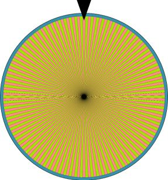

> **圖片描述：** 此圖為嘉年華輪盤的示意圖，呈現一個大型圓形轉盤，被均等分割成許多細長條框，每個條框對應一輛汽車。轉盤上方有一個黑色指針，當輪盤停下時，指針所指的條框即為被選中的車輛。各條框以交替的黃色和粉紅色標示，代表不同的車號。

圖2.1　汽車垃圾場場主的嘉年華輪盤。每輛車都對應一個大小相同的條框，每個條框都對應一個數字，當輪盤停下來時，她就會帶我們去拍指針所指的車

我們一付錢，她就轉動輪盤，當輪盤停下來時，她會記下車號，然後出去用拖車把相應的車輛拖到我們面前。

我們拍了幾張照片，她就會把車還到停車場。如果我們想再拍一輛車，就需要再付錢，她會再次轉動輪盤，重複上述過程。

對於我們而言，她帶給我們的每一輛車都是**隨機選擇**的，因為我們事先不知道是哪一輛。但汽車也不是完全任意的，因為我們在開始之前就知道一些關於車輛的資訊，例如，它不可能是未來的汽車，也不可能是一輛沒有停在該停車場的汽車。所以汽車垃圾場場主並沒有（透過她的嘉年華輪盤）選擇所有可能的車輛，而選擇的是她可以選擇的特定選項。

假設我們的任務目標是拍攝5種不同類型汽車的照片：轎車、皮卡、麵包車、SUV和貨車。我們想知道當她每次轉動輪盤並從停車場裡隨機取出一輛車時，該車是其中一種的機率。

為了解決這個問題，假設我們進入汽車垃圾場檢查了每一輛車，並把每一輛車歸到這5種類型中的一種，結果如圖2.2所示。

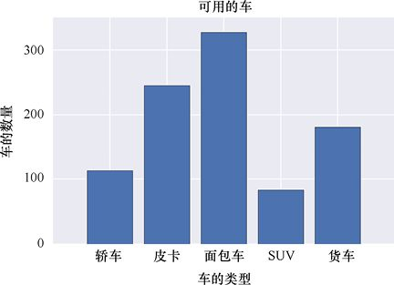

> **圖片描述：** 此圖為一張條形圖，標題為「可用的車」。橫軸為「車的類型」，列出五種車型：轎車、皮卡、麵包車、SUV、貨車。縱軸為「車的數量」，範圍從0到約350。麵包車數量最多（約330輛），其次是皮卡（約250輛）、貨車（約180輛）、轎車（約110輛），SUV最少（約90輛）。

圖2.2　該汽車垃圾場中有5種不同類型的汽車，每種類型的車的數量用條形圖加以表示

在這個汽車垃圾場中，有近950輛汽車，其中麵包車最多，其次是皮卡、貨車、轎車和SUV。因為這裡的每一輛車被選中的機率相等，那麼旋轉一次輪盤後，我們最有可能得到一輛麵包車。

但是具體而言，我們有多大可能得到一輛麵包車呢？為了回答這個問題，我們可以用每一個條形塊的高度除以汽車的總數，就可以得出我們得到選擇給定類型的汽車的機率，如圖2.3所示。

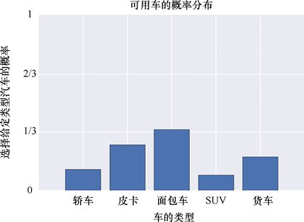

> **圖片描述：** 此圖為機率分佈條形圖，標題為「可用車的機率分佈」。橫軸為「車的類型」（轎車、皮卡、麵包車、SUV、貨車），縱軸為「選擇給定類型汽車的機率」，範圍從0到1。麵包車的機率最高（約1/3），所有條形高度加總為1，形成一個完整的機率分佈。

圖2.3　如果我們進入汽車垃圾場，並且隨機選擇一輛車，那麼得到每種類型的車的機率取決於有多少輛這種類型的車，並且與車的總數有關。最終我們一定會得到什麼東西，因此所有機率加起來應該等於1。如果將所有可能性包含進來而且所有機率加起來已經為1，就可以稱其為機率分佈

為了將圖2.3中的數字轉換為百分比，我們將它們乘以100%，例如，麵包車在條形圖中的高度是0.34，就說有34%的機會得到一輛麵包車。

如果我們把所有5根條形的高度加起來，就會發現其總和是1。每個條形塊的高度被稱為我們得到這種類型的車的**機率**（probability）。只有所有條形塊相加會得到1，才能使用這個術語，這告訴我們得到某物的機率是1（或100%），或者說是必然的。如果這些條形塊加起來不等於1，那麼我們可以把這些條形圖稱為各種各樣的非正式名稱（如“得到這種車的期望”），但是不能把它們稱為機率。

我們將圖2.3稱為**機率分佈**（probability distribution），因為它將100%的機率“分佈”在5個可能選項中。我們有時也會說，圖2.3是圖2.2的**正規化**（normalized）版本。這裡的“正規化”意味著這些值加起來等於1，在這種情況下，“歸一”的用法來自它在數學中的含義。

我們可以將機率分佈表示為一個簡化的嘉年華輪盤，如圖2.4所示。指針指向給定區域的機率是透過佔輪盤圓周的部分來表達的，我們在這裡所畫出的比例與圖2.3中的相同。

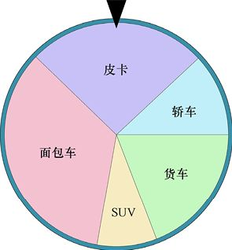

> **圖片描述：** 此圖為一個簡化的嘉年華輪盤（圓餅圖），將圓盤依機率分佈比例分成五個區域：面包車佔最大面積，其次為皮卡、貨車、轎車，SUV佔最小面積。上方有黑色指針，顯示旋轉後指到各類型車的相對機率。

圖2.4　一個簡化的嘉年華輪盤。這告訴我們如果汽車垃圾場場主旋轉圖2.1中的輪盤，我們會得到什麼樣的車。每種車型的圓周佔比遵循圖2.3中的機率分佈

大多數情況下，在電腦上生成隨機數時，我們並沒有嘉年華輪盤，而是依賴軟體去模擬這個過程。我們會給例程一個值列表，比如圖2.3中的各個條形的高度，然後讓它返回一個值。我們會設定希望能在34%的情況下得到“麵包車”，26%的情況下得到“皮卡”，以此類推。

要從選項列表中“隨機”選擇一個值（每個選項都有自己的機率），就需要做一些工作。為了方便起見，我們將這個選擇的過程打包到一個稱為**隨機變量**（random variable）的概念中。這個術語可能會讓程式設計師感到困惑，因為程式設計師認為“變量”是一種被命名的可以存儲資料的存儲空間。但是，我們在這裡使用的術語是來自它在數學中的用法，有著不同的含義。

隨機變量不是一個存儲的空間，而是一個**函數**（function），意味著它將一些資訊作為輸入，併產出一些資訊作為輸出[Wikipedia17c]。在這種情況下，隨機變量的輸入是機率分佈（或者說是它能產生的每個可能值的機率），而它的輸出則是一個特定的根據機率選擇的值，生成這個值的過程稱為從隨機變量中**抽取**（draw）值。

我們把圖2.3稱為機率分佈，但也可以把它看作一個函數，也就是說，對於每個輸入值（在本例中是車的類型），它會返回一個輸出值（得到那種類型的車的機率）。這樣想，我們就得到了一個更加完整和正式的名字：**機率分佈函數**（probability distribution function）或者**pdf**（通常小寫）。有時人們也會用更加隱晦的名字來指代這種分佈：**機率質量函數**（probability mass function）或**pmf**。

我們的機率分佈函數有著有限數量的選項，每個選項都有一個機率，因此我們也可以進一步專門化它的名稱，將其稱為**離散機率分佈**（discrete probability distribution）（末尾加不加“函數”都可以）。這個名稱表明它的選項是離散的（如整數），而不是連續的（如實數）。

我們可以很容易地創建連續的機率分佈。假設我們想知道汽車垃圾場場主展示給我們的每輛車裡還剩下多少油，油量就是一個連續的變量，因為它可以取任意的實數（當然，是測量儀器可測範圍內的實數。這裡假設測量是如此精確，以至於我們可以把它看作連續值）。

圖2.5顯示了汽油測量的連續圖。這幅圖展示了不同返回值的機率，不只是一些特定值，而是任意實數，這裡這個實數是在0（油箱是空的）和1（油箱是滿的）之間的。

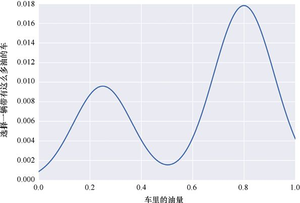

> **圖片描述：** 此圖為一條連續機率分佈曲線。橫軸為「車裡的油量」（0到1），縱軸為「選擇一輛帶有這麼多油的車」的機率（0到0.018）。曲線呈雙峰形狀，在0.25附近和0.8附近各有一個高峰，0.5附近為低谷，顯示大部分車輛油量集中在偏低或偏高的範圍。

圖2.5　一個連續範圍內值的機率分佈，所有機率之和仍然是1。注意，縱軸範圍為0～0.018

像圖2.5這樣的分佈稱為**連續機率分佈**（continuous probability distribution，cpd）或**機率密度函數**，後一個術語也被縮寫為pdf，但是上下文通常會清楚地表明縮寫所指代的內容。

圖2.5顯示了從0到約0.02的輸入值，但輸入是可以跨越任何範圍的，唯一的條件與之前一樣，即圖表必須進行正規化，這意味著所有值加起來必須等於1。當曲線連續時，曲線下方面積為1。

大多數情況下，我們是透過選擇一個符合自身要求的分佈來使用隨機數的，然後呼叫庫函數來從這一分佈中產生一個值（也就是說，我們從給定分佈的隨機變量中抽取了一個值）。

我們可以在需要的時候創建自己的分佈，但是大多數庫會提供一些分佈。這些分佈基本上可以涵蓋大多數情況。這樣我們就可以使用這些預先構建的、預先正規化的分佈來控制隨機數。

### 實踐中的隨機數

我們一直在討論透過一個分佈來構建一個隨機數，這裡有必要暫停一下，來看看這個概念在理論與實踐表現中有什麼不同。

這裡的“隨機”指的是“不可預測的”，不僅是說這個數字很難預測，比如一個燈泡能用多久。因為如果有足夠的資訊，我們就能算出燈泡的使用壽命。但是相比之下，隨機數從根本上來說就是不可預測的（要得出一個數字或一串數字何時從“難以預測”轉變為“不可預測”是一個很大的挑戰，遠遠超出了本書[Marsaglia02]的範疇）。

使用電腦很難得到不可預測的隨機數[Wikipedia17b]，問題在於正常運行的電腦程式是具有**確定性的**（deterministic），這意味著給定的輸入總是會產生相同的輸出。所以從根本上說，如果我們能夠訪問源程式碼，那麼一個電腦程式永遠不會出乎我們的意料。給我們“隨機數”的庫的例程也只是一些程式。和其他程式一樣，每當我們呼叫這些例程時，如果足夠仔細地觀察它在做什麼，就能夠預測它的返回值，換句話說，這並不是隨機的。為了強調這一點，我們有時把這些演算法稱為**偽隨機數生成器**，稱它們產生的是**偽隨機數**（pseudo-random number）。

假設我們正在編寫一個使用偽隨機數的程式，隨後出現了一些問題。為了調試這個問題，我們希望它再次按照相同的操作形式運行，換句話說，我們希望它返回錯誤發生時使用的偽隨機數流。

我們之所以能做到這一點，是因為偽隨機數生成器以序列的形式生成它們的輸出，每個新的值都建立在對以前的值的計算之上。為此，我們會給這個例程一個名為**種子**的數字。許多庫的程式都是從一個種子開始的，這個種子來自當前的時間，或者是從鼠標指針移動那一刻起的毫秒數，抑或是其他我們無法預先預測的值，這使得第一個輸出變得不可預測，併為下一個輸出奠定了基礎。

因此，在開始要求產生輸出之前，我們可以手動設置種子，這樣在每次運行程式時，都會得到相同的偽隨機數序列。

如果我們不想的話，就不需要設定種子。隨機數字可以透過不斷變化、不可預知的場景照片來生成，就像熔岩燈牆[Schwab17]那樣。真實的隨機數也可以透過真實的物理資料來在線獲取，例如大氣噪聲導致的天線上的靜電干擾[Random17]。通常，以這種形式獲取值要比使用內置的偽隨機數生成器慢得多，但是當我們需要真正的隨機數時，這就是一種選擇。

一種可能的折中方法是從物理資料中收集一組真正的隨機數，然後將它們存儲在文件中。之後，就像使用只有一個種子的某個偽隨機數生成器一樣，每次都會得到相同的值，但我們知道這些值是隨機的。當然，每次使用相同的數字序列意味著它們不再是不可預測的，因此這種技術在系統的設計和調試階段可能會顯得尤為有用。

在實踐中，我們很少使用前綴“偽”來表示軟體生成的隨機數，但要記住是有這麼一個東西存在的，因為每個偽隨機數生成器都存在一些風險，它們創建的數字可能具有一些可辨別的模式 [Austin17]，而這些模式可能會對學習演算法產生影響。幸運的是，一個不可預測的種子和一個精心設計的偽隨機演算法的結合就可以為我們提供一系列值來很好地模擬所需的真正隨機數。也許隨著機器學習的發展，一些演算法將會出現，它們會對“接近”隨機的數字序列和真正隨機的數字序列之間的差異表現得很敏感，這可能會迫使我們採取新的策略來生成這些值，而現在似乎還沒到那個時候。

## 2.3　一些常見的分佈

目前，我們已經瞭解了隨機數的來源，以及如何使用隨機變量從分佈中選擇值。現在讓我們來看看一些流行的分佈，這些分佈通常用於生成機器學習演算法中使用的隨機數。

大部分的這些分佈都是作為內置例程由主要的庫提供的，因此可以很容易加以指定和使用。

我們用**連續**（continuous）的形式來展示這些分佈，而大多數庫會提供分佈的連續和離散兩個版本，或者可能會提供一個通用的例程，讓我們可以根據需要將任何連續的分佈轉換為離散版本。

### 2.3.1　均勻分佈

圖2.6所示為**均勻分佈**（uniform distribution）的例子。基本的均勻分佈是：除了0和1之間，其他區間的值都是0，0～1的值是1。0和1這兩個數字正好在兩個定義交界的地方，這裡我們把0和1處的值都設為1。

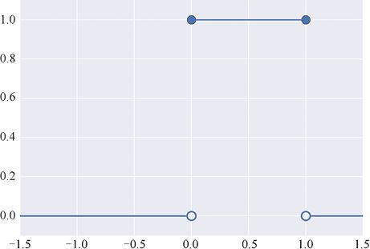

> **圖片描述：** 此圖展示均勻分佈的函數圖形。在x=0到x=1之間，函數值為1（以實線表示），其餘位置函數值為0。在x=0和x=1處，上方實心圓點表示該值屬於上方的線段（值為1），下方空心圓點表示不屬於下方線段。整個圖形呈階梯狀。

圖2.6　一個均勻分佈的例子。在這個版本中，0～1的輸入（包括0和1）所產生的輸出都是1， 而其他輸入產生的輸出都是0。按照慣例，圖中不可見的部分被假定為圖兩端的輸入所顯示的值，因此圖中所示區域的右側和左側的輸入處處為0

在這個圖中，看起來0處有兩個值，1處也有兩個值，但其實不是這樣的，我們的慣例是：非實心的圈（如下方線上的圈）表示“這一點不是直線的一部分”，而實心圈（如上方線上的圈）表示“這一點是直線的一部分”。因此，在輸入值0和1處，圖形的輸出是1。

這是一個常見的定義，但是有些方式會使得其中一個或者兩個輸出為0。這通常需要做一些檢查。

這種分佈有兩個基本特性：首先，我們只能得到0～1的值，因為所有其他值的機率都是0；其次，0～1的每個值都是等可能的，我們得到0.25、0.33或0.793718的機率是一樣的。

我們說圖2.6所示的值在0～1的範圍內是分佈**均勻的**，或者說它們是**常數**（constant），抑或說是**平面**（flat）的。這告訴我們，這個範圍內的所有值是等機率的。我們也說它們**有限的**（finite），意思是所有非零值在某個特定的範圍內（即可以肯定地說0和1是它能返回的最小值和最大值）。

通常，創建均勻分佈的庫函數會允許我們去選擇非零區域開始和結束的地方，而不是固定在0和1。除了預設的0～1的選項，最受歡迎的應該是−1～1，庫會對一些細節進行處理，比如調整函數的高度來使其下方的面積始終為1（這是將任何圖表轉換為機率分佈的條件）。

### 2.3.2　正態分佈

在均勻分佈之後，下一個最流行的分佈可能是**正態分佈**（normal distribution），也叫作**高斯分佈**（Gaussian distribution），或者簡單地稱其為**鐘形曲線**（bell curve）。與均勻分佈不同，正態分佈的曲線是平滑的，沒有尖銳的拐角或者突然的跳躍。圖2.7顯示了一些典型的正態分佈。

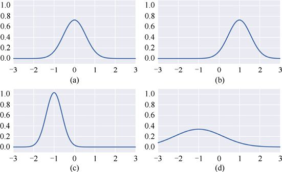

> **圖片描述：** 此圖包含四個子圖(a)(b)(c)(d)，分別展示不同參數的正態（高斯）分佈曲線。(a)中心在0的標準正態分佈；(b)中心右移至1的正態分佈；(c)中心在-1且更窄更高的正態分佈；(d)中心在-1且更寬更矮的正態分佈。所有曲線下方面積均為1。

圖2.7　一些典型的正態分佈。其基本形狀可以向左或向右移動，也可以在高低間進行縮放，抑或將其進行拉伸或壓縮。總之，經過這些變換後，它也仍然是正態分佈的。(a)典型正態分佈；(b)正態分佈的中心移動到1；(c)正態分佈的中心移動到−1，同時形狀變得更加狹窄，為了使曲線下方的面積保持在1，庫會自動調整圖形的垂直比例；(d)正態分佈的中心移動到−1，同時形狀變得更加寬大，同樣，為了使曲線下方的面積保持在1，庫會自動調整圖形的垂直比例，因為圖形更寬了，所以高度降低

圖2.7中的4條曲線形狀基本相同，形狀的變化只是由曲線的水平移動或是水平縮放（即拉伸或壓縮）引起的。這種水平縮放使得庫自動地在垂直方向縮放曲線，因此曲線下方的面積加起來始終是1。

其實垂直縮放對我們來說並不重要，因為我們只關心樣本的輸出。圖2.8顯示了我們從每個分佈中提取到的一些有代表性的樣本。可以看到，它們聚集在分佈的值比較高的地方（也就是說，得到一個有著這些值的樣本的機率比較高）較多，而在分佈的值比較低的地方（得到一個有著這些值的樣本的機率比較低）較少。這些點（代表樣本值）在垂直方向的上下起伏是沒有意義的，只是為了便於觀察。

對於正態分佈來說，除了平滑隆起的區域，其他位置都近乎為0。不過，當接近凸起的兩端時，其值會越來越接近於0，但從未達到0。所以我們說，這個分佈的寬度是**無限的**（infinite）。在實際操作中，我們有時會將偏離中心點一定距離的值**夾斷**（clamp），並假設超出該距離的部分為0，從而得到一個有限的分佈。

正態分佈在很多領域（包括機器學習）都很流行，因為從生物學到天氣的大量實際測量的觀察，人們發現它們的返回值都遵循正態分佈。同時，正態分佈的數學性質在很廣泛的領域都很容易使用。

使用符合正態分佈的隨機變量產生的值被稱為**正態分佈集**（normally distributed），有時也被稱為**正態偏差**（normal deviation）。我們也說它們**擬合**（fit）或者遵循正態分佈。

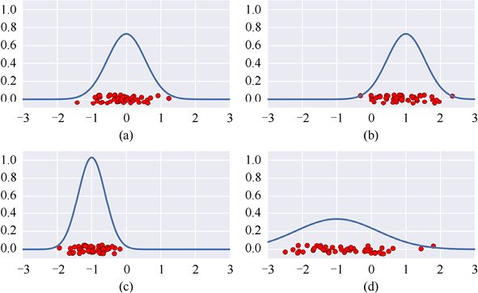

> **圖片描述：** 此圖包含四個子圖(a)(b)(c)(d)，在各正態分佈曲線下方繪製了紅色樣本點。每個子圖的樣本點聚集在分佈峰值附近（機率高的區域），在分佈尾部較稀疏。點的垂直位置是隨機的，僅為便於觀察。

圖2.8　每個點的水平位置展示了從各個分佈中提取到的樣本值，點的垂直位置沒有什麼特殊含義，只是為了讓它們更容易區分

每個正態分佈由兩個數字定義：**均值**（凸起的中心的位置）和**標準差**（standard deviation）（形狀的水平拉伸或壓縮）。

**均值**告訴我們凸起的中心的位置，圖2.9顯示了圖2.7中的4個正態分佈以及它們的平均值。正態分佈一個很好的性質是：它的均值同時也是中位數和眾數。

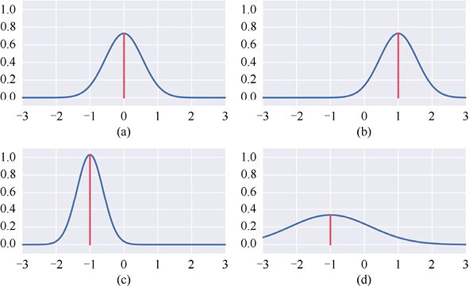

> **圖片描述：** 此圖包含四個子圖(a)(b)(c)(d)，每個正態分佈曲線上都標出了紅色豎線表示均值位置。(a)均值在0；(b)均值在1；(c)均值在-1；(d)均值在-1。均值位於曲線中心最高點的正下方。

圖2.9　正態分佈的均值是凸起的中心的位置，這裡用豎線表示

標準差則是一個數字，通常由小寫希臘字母*σ*（sigma）表示，用於表示凸起的寬度。想象一下從凸起的中心開始對稱地向外移動，直到囊括曲線下方68%的面積，那麼從凸起中心到該區域的任意一端的距離就是標準差，所以“標準差”只是一個距離。圖2.10顯示了4個正態分佈，其中一個標準差是用中心到陰影區域的任意邊的距離表示的。

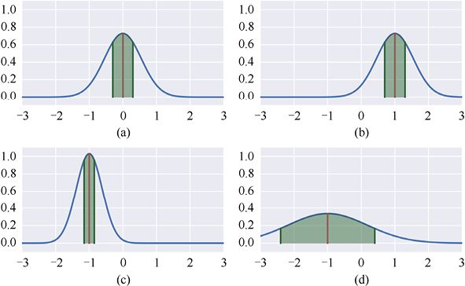

> **圖片描述：** 此圖包含四個子圖(a)(b)(c)(d)，展示正態分佈的標準差概念。每個圖中以深綠色陰影標出距均值一個標準差範圍內的面積，約佔曲線下方總面積的68%。標準差越大，陰影區域越寬。

圖2.10　標準差是衡量一個正態分佈的“拉伸”程度的指標，陰影區域顯示的是曲線下方的面積。陰影部分約佔總面積的68%，從均值（或者說中心）到陰影區域任意邊的距離就是正態分佈的標準差

如果再對稱地從中心向外移動一個標準差，就會將曲線下約95%的面積封閉起來，再對稱地從中心向外移動一個標準差，就會將曲線下約99.7%的面積封閉起來，如圖2.11所示。因為是使用的標準差*σ*，所以這個性質有時會被稱為3*σ***法則**，有時也被稱為68-95-99.7**法則**。

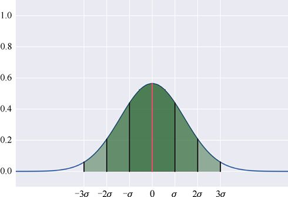

> **圖片描述：** 此圖展示3σ法則（68-95-99.7法則）。一條正態分佈曲線下方以不同深淺的綠色陰影標出-3σ到3σ的區域。橫軸標記了-3σ、-2σ、-σ、0、σ、2σ、3σ的位置。一個標準差範圍內佔68%面積，兩個標準差佔95%，三個標準差佔99.7%。

圖2.11　標準差可以幫助我們求出事件發生的機率。沿著橫軸距離均值一個標準差的範圍內的點（如果均值是0，那麼範圍就是（−*σ*，*σ*））佔所有值的68%左右，而兩個標準差範圍內的點則佔所有值的95%左右，3個標準差範圍內的點佔所有值的99.7%左右

換句話說，如果由正態分佈繪出了1000個樣本，就有大約680個樣本將分佈在距離均值不超過一個標準差的範圍內（或者是在−*σ*～*σ*的範圍內），大約950個樣本將分佈在距離均值不超過兩個標準差的內（或者是在−2*σ*～2*σ*的範圍內），大約997個樣本將分佈在距離均值不超過3個標準差的內（或者是在−3*σ*～3*σ*的範圍內）。

總之，均值顯示了曲線的中心位置，而標準差顯示了曲線的伸展情況。標準差越大，曲線就會越寬，因為68%的截斷距離會變得更遠。

有時人們用一個不一樣但與之相關的值來代替標準差，這個值稱為**方差**（variance）。方差就是標準差自身的平方，有時在計算中這個值使用起來會更方便。

正態分佈的吸引力不僅在於它的數學性質，還在於它自然地描述了許多真實世界的統計資料。如果我們測量一些地區成年男性的身高、向日葵的大小抑或果蠅的壽命，就會發現這些資料都趨於正態分佈。

### 2.3.3　伯努利分佈

另一個有用的特殊分佈稱為**伯努利分佈**（Bernoulli distribution），這個離散分佈只返回兩個可能的值：0和1。伯努利分佈的一個常見例子是拋擲硬幣得到正反面的分佈。

我們用字母*p*來描述得到1的機率。由於兩個機率相加必須得1（忽略奇怪的著陸情況，硬幣必須正面或反面著陸），這意味著返回0的機率是1−*p*。

圖2.12直觀地顯示了拋擲一枚質地均勻的硬幣和一枚質地不均勻的硬幣的情況。

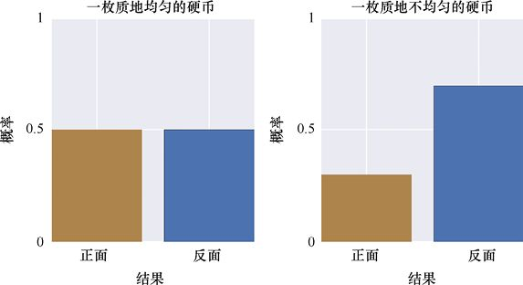

> **圖片描述：** 此圖包含兩個子圖(a)(b)，展示伯努利分佈。(a)標題「一枚質地均勻的硬幣」，正面和反面各佔0.5的機率；(b)標題「一枚質地不均勻的硬幣」，正面機率約0.3，反面機率約0.7。縱軸為「機率」，橫軸為「結果」。

(a)　　　　　　　　　　　　　　　　(b)

圖2.12　伯努利分佈告訴我們得到0或1的機率。(a)在每次拋擲一枚質地均勻的硬幣時，獲得正面或反面的機率相等；(b)拋擲一枚質地不均勻的硬幣出現反面的機率是70%，出現正面的機率是30%

我們可以把這兩個值標記為0和1（或者是正面和反面）以外的東西，例如，如果我們在看照片，它們就可能是一張貓的照片和一張不是貓的照片。

如果我們畫出了大量的值並找到它們的均值，那麼這很可能就是該分佈的均值。伯努利分佈的均值是*p*。關於伯努利分佈的眾數和中位數的描述有點麻煩，此處不再贅述。

伯努利分佈似乎有點過於簡單了，因為它描述的是一種簡單的情況。它的價值在於：它給了我們一種方法來表示得到一個分佈的兩個值中任意一個的機率，所以使用了與本節中其他分佈相同的形式來表達。這意味著我們可以使用與處理複雜分佈時相同的方程和程式碼來處理這種更簡單的情況。

### 2.3.4　多項式分佈

伯努利分佈只返回兩個可能值中的一個，但是假設我們正在做一個實驗，需要從更多的數字（或者說更多的可能性）中返回一個呢？例如，我們不再進行只可能出現正面或反面的拋擲硬幣，而是改為拋擲一個20面的骰子，就會得到20個值中的任意一個。

為了模擬拋擲骰子的結果，隨機變量需要返回1～20中的一個數字。在這種情況下，構建一個列表是很有效的。列表中除了我們取出的那一項（它被設為1），其他項都為0。當我們構建機器學習系統來將輸入分為不同的類別時，構建列表會非常有用，例如描述照片中出現的是50種不同動物中的哪一種。

下面我們來演示這個想法。假設我們要從5個值中進行選擇，於是將它們標記為1、2、3、4和5。如果要返回的是4，就會返回一個包含5個數字的列表，除了第4個位置的1，其他位置的數字都是0，這個列表是“0，0，0，1，0”。

每當要從這個隨機變量中抽取一個值時，我們就會得到一個包含4個0和1個1的列表。每個位置是否為1的機率是由選項1～5中被選擇的機率給出的。

這個分佈的名稱是一個合成詞（或者說是兩個詞的混合），因為這是對兩種輸出的伯努利分佈的推廣，將其推廣為多項輸出。我們可以稱之為“多項式伯努利分佈”，但是若把這些詞混在一起，就稱之為**多項式分佈**（multinoulli distribution），有時也簡單地稱之為**類別分佈**（categorical distribution）。

我們可以使用多項式分佈來猜測生日，奇怪的是，所有生日的機率並不都是一樣的，至少在美國2000年前後的10年內是這樣的[Stiles16]。我們可以用一個多項式分佈表示365個可能的生日的機率。如果我們從這個分佈中抽取一個隨機變量，就會得到一個擁有365個值的列表，除了一個1，其他的都是0。如果我們一遍又一遍地這樣做，1就會更頻繁地出現在更有可能的出生日期那裡。

### 2.3.5　期望值

如果我們從任意的機率分佈中選擇一個值，然後選擇另一個，之後再選擇一個，隨著時間的推移，我們就能構建一個包含很多值的列表。

如果這些值是數字，那麼它們的平均值就稱為**期望值**（expected value）。注意，期望值可能不是從分佈中提取的值！例如，如果1、3、5、7都是等可能的，那麼我們對於這些將要提取的隨機變量的期望值就是（1+3+5+7）/4（即4），這個值我們永遠無法從分佈中得到。

## 2.4　獨立性

到目前為止，我們所看到的隨機變量都是完全不相關的。我們從一個分佈中抽取一個值的動作與我們之前抽取過其他任何的值都沒關係，每次都是在一個全新的世界抽取一個新的隨機變量。

我們稱這些變量為**自變量**（independent），它們不依賴於任何其他的值。這種變量是最簡單的隨機變量，因為我們不用考慮兩個或多個隨機變量是如何相互影響的。

相反，有的隨機變量是相互依賴的。例如，假設我們有幾種不同動物的毛髮長度的分佈：狗、貓、倉鼠等。我們需要先從動物列表中隨機選擇一種動物，然後據此來選擇適當的毛髮長度分佈，之後從這個分佈中得到一個值並以此作為動物毛髮的值。在這裡，對動物種類的選擇不依賴於其他因素，所以它是一個自變量。但是毛髮長度取決於所選擇的動物，所以它是一個**因變量**（dependent）。

### 獨立同分布（i.i.d）變量

許多機器學習技術中的數學和演算法都是被設計來處理從具有相同分佈的隨機變量中提取的多個值的，並且這些值之間相互獨立。

這種要求已經非常普遍了，以至於這些變量都有了一個特殊的名稱**i.i.d**，即**獨立同分布**（independent and identically distributed）（這個首字母縮略詞很不同尋常，因為它幾乎都是用小寫字母書寫的，字母之間用句點隔開）。例如，我們可能會看到用這種方法描述的一種技術：“當輸入為i.i.d時，該演算法會提供最好的結果。”

而短語“同分布”只是“從相同分佈中選擇”的一種簡潔的表達方式。

## 2.5　抽樣與放回

在機器學習中，我們經常透過隨機選擇現有資料集中的一些元素來構建新的資料集。我們將在2.6節中進行這種操作，並尋找樣本集的均值。

讓我們考慮兩種不同的方法來透過現有資料集生成新資料集，其中關鍵的問題是：從資料集中選擇一個元素時，我們是將它從資料集中移除，還是僅複製這個元素並使用它？

打個比方，假設我們去圖書館找幾本短篇書，為了保持趣味性，我們把它們放在桌子上堆成一小堆，之後從中隨機挑選。

一種方法是從書堆中隨機選擇一本書，之後把它帶回並放到桌子上，然後再回到書堆進行挑選，這樣我們就可以挑選出一堆隨機選擇的書了。注意，因為我們已經把挑選出的每一本書都放在桌子上，所以不可能選到同一本書兩次（我們可以選擇已經選過的書的另一印本，但已經不是同一本書了）。

另一種方法是從書堆裡選擇一本書，並將整本書複印（只是做一個比喻，我們暫時忽略法律和道德問題），然後把書放回它原來的地方，並把影印本放在桌子上。然後我們返回書堆，再一次隨機拿起一本書、複印、歸還之後把它放入書堆裡，一遍又一遍，這樣我們就擁有一堆複印的書了。注意，我們將在複印之後把每本書還回書堆，這種情況下，是有可能選到同一本書並把它複製兩次的。

在機器學習中，構建新資料集時，我們可以遵循這兩種方法中的任何一種。每從訓練集中選擇一個資料，我們可以從資料集中刪除它（這樣我們就不能再選擇它了），也可以只是複製它並將它返回到資料集（這樣我們就可以再次選擇它）。

上述兩種方法所得到的結果是全然不同的類型，無論是從明顯的表面還是從不那麼明顯的統計資料上都可以看得出。一些機器學習演算法被設計成只適用於這兩種方法中的一種。那麼現在就讓我們更仔細地看一看這些備選方案。我們想要創建一個**選擇**列表，而這個列表是從一個初始對象**池**中選擇出來的。

### 2.5.1　有放回抽樣

首先，讓我們看一下對元素進行復制的方法，在這裡，初始狀態是保持原樣的，如圖2.13所示。我們把這種方法稱為**有放回抽樣**（或稱為**SWR**），因為我們可以認為是將元素取出，為其製作一個副本，用副本替換原來的元素。

有放回抽樣最明顯的一個含義是：我們可能會多次使用同一個元素。在極端情況下，整個新建立的資料集都是一個元素的多個副本。

第二個含義是，我們可以創建一個比原始資料小的、大小相同的抑或更大的新資料集。由於原始資料集並不發生改變，因此只要我們願意，就可以不斷地選擇元素。

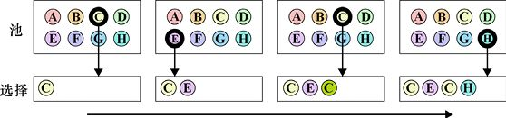

> **圖片描述：** 此圖展示有放回抽樣的過程。上方為「池」（含A至H八個元素），下方為「選擇」區域。透過四個步驟，依序選出C、E、C、H，每次選取後將原元素放回池中。其中元素C被選了兩次，說明有放回抽樣可重複選取同一元素。

圖2.13　有放回抽樣。每從池中移除一個元素，都會將它的一個副本放入選擇區域中，然後再把原來的元素放回池中。透過這種技術，我們可以建立選擇列表，但是原始的池是不會改變的，所以我們就有機會多次選擇一個相同的項。在這個例子中，我們兩次選擇了元素C

這一過程的統計學含義是：選擇是相互**獨立**的。沒有任何過去的背景，選擇完全不受之前的選擇的影響，也不會影響未來的選擇。

要明白這一點，讓我們看看圖2.13所示池中的8個元素，每個元素被選中的機率都是1/8。可以看到，我們首先選擇的是元素C。

現在新資料集裡有了元素C，但是在選擇之後，我們會把這個元素“重置”回原來的資料集中，再次查看原始資料集時，8個元素仍然全部存在，如果再次進行選擇，每個元素仍有1/8的機率被選中。

這種取樣的一個日常例子是：在庫存充足的咖啡店裡點一杯咖啡，比如我們點了一杯香草拿鐵之後，香草拿鐵這個選項也不會從菜單上被刪除，還可供其他顧客選擇。

### 2.5.2　無放回抽樣

另一種透過隨機選擇去構建新資料集的方法是：從原始資料集中刪除所選擇的元素，並將其放到新資料集中。因為沒有進行復制，所以原始資料集丟失了一個元素。這種方法稱為**無放回抽樣**（又稱為**SWOR**），如圖2.14所示。

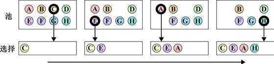

> **圖片描述：** 此圖展示無放回抽樣的過程。上方為「池」（含A至H八個元素），下方為「選擇」區域。依序選出C、E、A、H，每次選取後元素從池中移除，因此池中可選元素逐漸減少，不會出現重複選取的情況。

圖2.14　無放回抽樣。每從池中移除一個元素，我們就會將其放入所選擇的區域。因為沒有把它重新放回池中，所以無法再次選擇這一元素

讓我們比較一下SWR與SWOR的含義。首先，在SWOR中，對任何元素的選擇都不能超過一次，因為我們從原始資料集中刪除了它。其次，在SWOR中，新資料集可以比原來的更小，或者是大小相同，但是不能變得更大。最後，在SWOR中，選擇是相互依賴的。圖2.14中，每個元素第一次被選中的機率為1/8。但是當選擇元素C後，我們沒有用副本替換它，所以如果回到原始資料集，就只剩下7個元素可用，即每個元素有1/7的機率被選中。選擇這些元素中的任何一個的機率都增加了，因為可供選擇的元素變少了。

如果再選擇另一個元素，剩下的每個元素就都有1/6的機率被選中，以此類推。在選擇了7個元素後，最後一個元素被選中的機率就有100%。

無放回抽樣的一個常見示例是玩撲克牌遊戲，每發一張牌，它就會從整副牌中“消失”，在重新收回牌或是洗牌之前是無法再發出的。

### 2.5.3　做選擇

假設我們想透過從原始資料集中選擇來構建一個比原始資料集小的新資料集，可以採用有放回抽樣和無放回抽樣兩種方式。

與無放回抽樣相比，有放回抽樣可以產生更多可能的新資料集，讓我們來看看這一點。假設原始資料集中只有3個對象（A、B和C），而我們需要一個包含兩個對象的新資料集。採用無放回抽樣只能得到3種可能的新資料集：（A，B）、（A，C）和（B，C）；而採用有放回抽樣，不僅可以得到這3個，還可以得到（A，A）、（B，B）和（C，C）。

一般來說，有放回抽樣總是可以為我們提供一組有更多可能性的新資料集。還有很多關於統計特性的有趣差異，但是我們不展開討論。

要記住的重要一點是：“是否放回”會對構建新資料集產生影響。

## 2.6　Bootstrapping演算法

有時我們想要知道某個資料集的一些統計資料，但是這個資料集太大了，對它進行操作並不可行。打個比方，假設我們想知道現在世界上所有活著的人的平均身高。對於這個問題，沒有一種切實可行的方法去測量每個人的身高，所以我們需要另一種方法。

通常我們會選取資料集的一部分來解答這類問題，然後對這一部分進行測量。我們可以求出幾千人的身高，然後透過計算這些測量值的均值來近似求出所有人的平均身高。

我們把世界上的所有人稱為**總體**（population）。因為人數太多，所以我們會從中歸納出一個規模合理的群體。我們希望這個群體能代表總體，故將這個較小的群體稱為**樣本集**（sample set）。樣本集是在無放回的情況下構建的，因此每從總體中選擇一個值並將其放入樣本集，這個值在總體中就會被刪除，不能再次被選擇。

透過仔細認真地構建樣本集，我們希望就所要度量的屬性而言，這個樣本集可以成為總體的合理代表。圖2.15用21個元素表達了總體的概念，樣本集則包含了來自總體的12個元素。

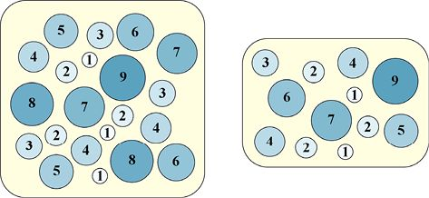

> **圖片描述：** 此圖包含兩個子圖(a)(b)。(a)展示總體，包含21個大小不一的圓形元素（標有數字1-9），代表完整的資料集合。(b)展示樣本集，僅包含12個元素，是從總體中無放回地抽取而成。

(a)　　　　　　　　　　　　　　　　　　　　　　　　　 (b)

圖2.15　從總體中創建了一個樣本集。(a)總體，在本例中，總體包含21個元素；(b)樣本集，在本例中，樣本集只包含12個元素

現在我們測量樣本集的均值，以此作為總體均值的估計值。在這個小例子中，我們可以計算出總體的均值，大概是4.3，而樣本集的均值約為3.8，這一匹配並不是很完美，但也不算是大錯特錯。

大多數情況下，我們無法測量總體的值（這是一開始我們構建樣本集的原因），所以只能透過找到樣本集的均值得到答案。但是，這個樣本集表現得有多好呢？它是我們可以依賴的對總體的一個好的估量嗎？很難說。

如果可以用**置信區間**（confidence interval）來表示結果，就更好了。雖然目前我們還沒有深入討論這個概念，但是可以對置信區間做一個表述：“我們有98%的機率確定總體的均值在3.1和4.5之間。”

要做出一個這樣的表述，我們就需要知道區間的上界和下界（在這裡是3.1和4.5），並衡量我們對該值存在於該區間範圍內信心的大小（這裡是98%）。通常，我們會為當前的任務設定一個所需的信心，然後再找到該信心所對應的範圍的上下值。

**Bootstrapping**演算法可以幫助我們找到讓我們表達信心的值[Efron93] [Ong14]。我們可以像之前說的身高的例子那樣利用它來討論均值。同時，我們也可以用Bootstrapping來表示對於標準差的信心，又或者用我們感興趣的其他統計學度量。

這個過程包括兩個基本步驟：第一步是我們在圖2.15中看到的那樣，根據原始的總體創建一個樣本集；第二步則涉及對樣本集進行**重取樣**（resampling）以生成一些新資料集，而這些新資料集中的每一個都稱為**bootstrap**。

為了創建bootstrap，我們先要確定需要從初始樣本集中選擇多少元素。儘管我們通常使用較少的元素，但是理論上可以選擇小於樣本集資料量的任意數量的元素。然後我們會從樣本集中有放回地隨機抽取多個元素（在這裡，我們可能會多次選擇相同的元素）。這個過程如圖2.16所示。

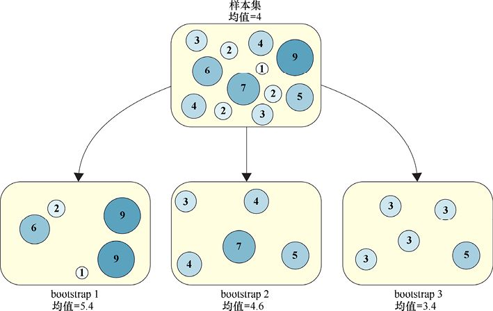

> **圖片描述：** 此圖展示Bootstrap的建立過程。頂部為樣本集（含12個元素，均值=4），底部為3個bootstrap子集，每個包含5個有放回地從樣本集中隨機選出的元素。Bootstrap 1均值=5.4，Bootstrap 2均值=4.6，Bootstrap 3均值=3.4。注意Bootstrap 1中元素9出現了兩次。

圖2.16　創建bootstrap。樣本集有12個元素，而每個bootstrap有5個元素，即每個bootstrap從樣本集中有放回地隨機選擇了5個元素

抽取必須要是有放回的，因為我們可能想要構建與樣本集大小相同的bootstrap。在本例中，我們可能會設定每個bootstrap中包含12個值，如果不進行有放回的抽取，那麼每個bootstrap都將與樣本集相同。

有了這些bootstrap，我們就可以測量它們每一個的均值。如果我們在直方圖上畫出這些平均值（圖2.17），就會發現，如之前討論過的那樣，它們傾向於形成一個高斯分佈。這個結果是自然形成的，與選擇的具體值無關。就這個圖來說，總體是0～1000的1000個整數，之後我們從這個資料集中隨機抽取500個值來創建一個樣本集，然後又創建了1000個bootstrap，每個bootstrap包含20個元素。

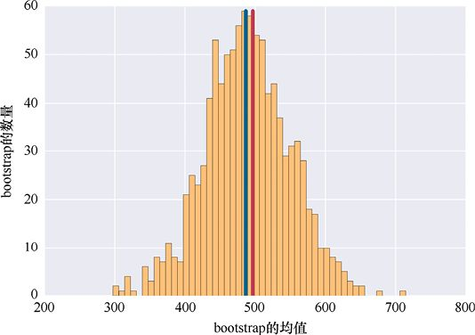

> **圖片描述：** 此圖為Bootstrap均值的直方圖。橫軸為「bootstrap的均值」（200-800），縱軸為「bootstrap的數量」（0-60）。直方圖呈現近似高斯分佈的鐘形。藍色豎線標示樣本集均值（約490），紅色豎線標示總體均值（約500），兩者非常接近。

圖2.17　直方圖展示了具有給定平均值的bootstrap的數量，在490左右的藍色豎線是樣本集的均值，在500左右的紅色豎線是總體的均值

既然已經知道了總體，就可以計算它的均值，大約是500。樣本集的均值也非常接近總體的均值，大約是490。bootstrap則幫助我們確定：我們應該在多大程度上信任490這個值。

無須進行數學計算，bootstrap均值近似於高斯曲線，它會告訴我們需要知道的一切。假設我們想找到有著80%的置信區間，它將包含總體的均值，就只需要去掉bootstrap值中最低的和最高的10% [Brownlee17]。圖2.18顯示了一個方框，畫出了我們認為置信區間有80%的值，其中包含已知的真實值500。可以看到，我們有80%的信心去確定總體的均值在410和560之間。

回顧一下，我們想知道一些描述**總體**的**性質**（可能是其均值或方差），假設由於某種原因，我們不能對總體進行操作，因此不能直接測量這種性質。為了得到這些值，我們透過抽取總體中的一些值形成了一個**樣本集**，然後再從中選出一些bootstrap（每個bootstrap透過對樣本集元素進行有放回的取樣得到）。透過觀察bootstrap的統計資料，我們就可以得到一個置信區間，從而知道我們有多大的信心去確定總體的均值是否在某個區間中。

bootstrap是很吸引人的，因為我們可以使用小型的bootstrap（每個bootstrap可能只包含10個或20個元素），這種小容量意味著對每個bootstrap程式的構建和處理都可以非常快地進行。為了彌補這種小容量的缺點，我們經常會構建數千個bootstrap。所構建的bootstrap越多，結果就越接近高斯曲線，也就越能精確地確定置信區間。

在後續章節中，我們將再次使用bootstrap的思想來從更簡單的工具集合中構建強大的機器學習工具。

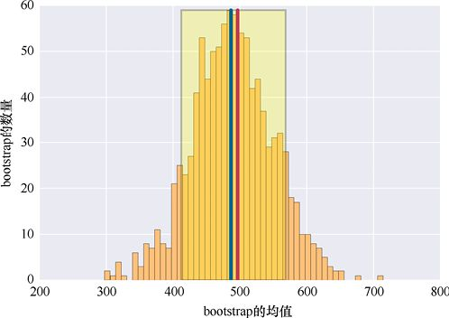

> **圖片描述：** 此圖在Bootstrap均值直方圖上加了一個淺黃色方框，標示出80%置信區間，範圍大約從410到560。方框內包含了80%的bootstrap均值，藍色和紅色豎線均位於方框內，說明我們有80%的信心確定總體均值在此範圍內。

圖2.18　我們有80%的信心去確定這個方框裡包含總體的均值

## 2.7　高維空間

我們通常會認為各種各樣的物體佔據著（或者說“生活在”）一個或另一個想象的、抽象的空間。有些空間會有成百上千的維度，以至於我們無法繪製出。但是，因為我們將經常談論這樣的“空間”，所以需要對此類空間的含義有一個大致的瞭解，這很重要。

這一空間的基本含義是，空間的每個維度（或者軸）都指向一種單獨的度量方式。如果我們有一段資料，這段資料中只有一個測量值（如溫度），就可以用一個只有單個值的列表來表示它。從視覺上，我們僅用一條線就可以表示測量值的大小，如圖2.19所示。我們將這條線稱為**一維空間**（one-dimensional space）。

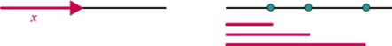

> **圖片描述：** 此圖包含兩個子圖(a)(b)，展示一維空間。(a)顯示一條帶箭頭的水平線，標記為x軸；(b)在x軸上放置了3個小圓點，並從左端畫出對應長度的線段，代表各資料點在一維空間中的位置。

(a)　　　　　　　　　　　　　　　　　　　　　　　　　(b)

圖2.19　具有單個值的資料段只需要一個軸（或者說維度）就可以繪製。(a)我們通常用*x*表示橫軸；(b)包含3段資料，其相對應的線表示它們的大小，從*x*軸的左邊開始測量

如果我們有兩段資訊，如溫度和風速，那麼需要兩個維度（或者一個有兩項的列表）來保存資料。我們可以透過兩個軸進行表示，如圖2.20所示。點的位置是這樣確定的，沿*x*軸移動測量得到第一個度量值，然後沿*y*軸移動測量得到第二個度量值。我們稱之為一個**二維空間**（two-dimensional space）。

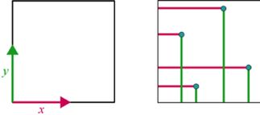

> **圖片描述：** 此圖包含兩個子圖(a)(b)，展示二維空間。(a)顯示由x軸和y軸構成的二維平面；(b)在平面上繪製了4個資料點，每個點透過粉紅色和綠色的線段顯示其在x軸和y軸上的座標值。

(a)　　　　　　　　　　　　　　　　　　　 (b)

圖2.20　如果資料有兩個值，我們就用兩個維度（或者說軸）來繪製它。(a)我們通常用*y*表示垂直方向；(b)包含4段資料，每段資料在二維空間中的位置都由兩個值確定，一個值代表*x*，而另一個值代表*y*

如果每段資料有3個值，那麼需要一個可以容納3個值的列表，而這3個維度可以用3個軸來表示，如圖2.21所示。我們稱之為**三維空間**（three-dimensional space）。

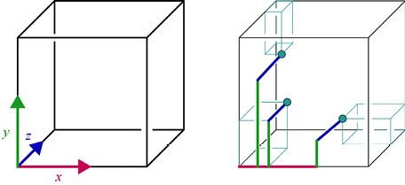

> **圖片描述：** 此圖包含兩個子圖(a)(b)，展示三維空間。(a)顯示由x軸（紅色）、y軸（綠色）和z軸（藍色）構成的三維立方體框架；(b)在立方體中繪製了幾個資料點，透過輔助線和方框顯示每個點在三個軸上的座標位置。

(a)　　　　　　　　　　　　　　　　　　　　　　　 (b)

圖2.21　如果每段資料有3個值，就用3個維度（或者說軸）去繪製它。(a)一般第3個軸的方向是垂直於紙面進出的，並標記為*z*；(b)三維空間中的一些點，我們透過它們所在位置沿*x*、*y*和*z*軸的長度定位它們。其中的盒子只是為了幫助我們看到點在立方體中的位置

如果有4個值呢？儘管做出了很多大膽的嘗試，但是仍然沒有一種可以被廣泛接受的方法來繪製四維空間，尤其是在二維空間上進行繪製（[Banchoff90]和[Norton14]）。當上升到五維、十維或是二十維的空間時，二維空間更是限制我們的一大原因。

這些高維度空間看起來似乎很深奧、很罕見，但實際上它們很常見，我們每天都可以見到。為了證實這一點，讓我們考慮一下用什麼樣的空間來表示一張照片。

假設有一個灰度圖像是500像素×500像素的，那麼該用多大的空間來表示這個圖像呢？一條邊上有500個像素，那麼整個圖像就是500像素×500像素=250000個像素。其中的每個像素都包含一個值，或者說它們都包含一個度量值。從整個空間的一個角落開始，向右移動（沿著*x*軸）第一個像素值給定的距離，然後向上移動（沿著*y*軸）第二個像素值給定的距離，再向後移動（沿著*z*軸）第三個像素值給定的距離，之後沿著第四個軸移動由第四個像素給定的距離。以此類推，隨後是第五個軸、第六個軸等，讓每個像素都沿著它們相對應的軸移動，這些軸都是不同的。

因為有250000個像素，所以需要250000個維度。這是一個很大的維度！有時，每個像素也可能需要3個值，就需要3 × 250000=750000個維度。

我們畫不出750000維的圖像，甚至無法在腦海中描繪出一個維度如此多的圖像。但是，機器學習演算法可以像處理二維或三維空間那樣輕鬆地處理這樣的空間。數學和演算法並不關心一個空間有多少個維度。

要記住的關鍵是：在這個龐大的空間中，每條資料都是**單獨的點**，就像二維空間中的點用兩個數字告訴我們它在平面上的位置一樣，750000維空間中的點只是用750000個數字告訴我們它在這個龐大空間中的位置。因此可以說，圖像是由一個巨大的“圖像空間”中的一個點表示的。

我們把有很多維度的空間稱為**高維空間**（high-dimensional space），而對於多少維才算“高”維這一點，目前還沒有一個正式的、統一的規定，但是這個短語常用於描述那些超出我們可以合理繪製的範圍的空間，也就是高於三維的空間。當然，大多數人認為數十或數百個維度才稱得上“高”維。

本書所用演算法最大的優點之一就是：它們可以處理任意維度的資料，甚至可以處理近一百萬維的圖像。當涉及更多的資料時，演算法的運行速度會變慢，但是它運行的流程不會發生任何更改。

本書頻繁使用的資料可以被抽象成高維空間中的點。我們會側重於對剛剛看到的概念進行直觀的概括，而不是深入數學中。我們會把“空間”看作對直線、正方形和立方體的巨大（無法可視化的）類比，其中每段資料都由用一個點表示。

## 2.8　協方差和相關性

有時變量之間可能相互關聯，例如，一個變量告知我們室外溫度，另一個變量告知我們是否會下雪。如果溫度很高，就不會下雪，所以透過對其中一個變量的瞭解可以知道另一個變量的一些資訊。在這種情況下，這種關係是**負相關的**：隨著溫度的升高，下雪的可能性降低；反之，下雪的可能性升高。

而另一個變量也可能是在告訴我們在當地河裡游泳的人的人數，溫度和游泳人數之間的聯繫就是**正相關的**，因為在溫暖的日子裡我們會看到更多人游泳，反之，則沒有那麼多人游泳。

能夠找到這些關係並確定兩個變量之間的聯繫的緊密程度是很有用的。

### 2.8.1　協方差

假設有兩個變量，我們注意到它們之間有一個特定的模式：當其中任意一個變量的值增加時，另一個變量的值就會以這個增加數量的固定倍數增加；而當任意一個變量減小時，同樣的事情也會發生。例如，假設變量*A*增加3，變量*B*就增加6；之後，*B*增加4，*A*會增加2；然後*A*減小4，*B*會減小8。在每一個例子中，*B*增加或減小的量都是*A*增加或減小的量的2倍，所以固定倍數是2。

如果我們在兩個變量之間發現了這樣的一種關係（任何倍數都可以，而不僅是2），就稱這兩個變量是**共變的**，我們用**協方差**（covariance）來衡量兩個變量之間的這種聯繫的強度。

如果我們發現一個值增加而另一個值也增加，那麼協方差就是一個正數。這兩個變量的步調越一致，協方差就越大。

討論協方差的經典方法是繪製一個圖，並在這個二維圖形上繪製一些點，如圖2.22所示。這種圖稱為**散點圖**。座標軸被標記為*x*和*y*，用於替代我們感興趣的兩個變量。

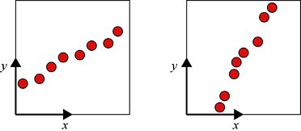

> **圖片描述：** 此圖包含兩個散點圖(a)(b)，展示正協方差。(a)中的點呈現明顯的從左下到右上的趨勢，顯示較強的正協方差；(b)中的點同樣有正向趨勢但散佈更廣，表示較弱的正協方差。

(a)　　　　　　　　　　　　　　　　　　　　　　　(b)

圖2.22　對協方差的闡述。(a)沿*x*軸從左到右的每一對點在*y*軸方向上的變化量大致相同，這是正的協方差；(b)*x*軸方向的值有一點多變，說明正協方差較弱

假設*x*是第一個值，*y*是第二個值。如果*x*增加時（在圖2.22中是指點向右移動）*y*也增加（在圖2.22中是指點向上移動），就說這兩個變量有著**正協方差**（positive covariance）。*y*的變化與*x*的變化越一致，協方差就越大。

一個非常大的正協方差表明這兩個變量是一起變化的，所以每當它們中的一個改變了一個給定的量，那麼另一個也會改變一個不完全相同但是又趨於一致的量。

此外，如果一個值隨著另一個值的增加而減小，就說變量有**負協方差**（negative covariance），如圖2.23所示。

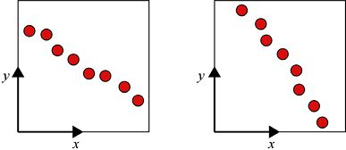

> **圖片描述：** 此圖包含兩個散點圖(a)(b)，展示負協方差。(a)中的點呈現從左上到右下的趨勢，當x增加時y減小，顯示較強的負協方差；(b)中的趨勢類似但散佈更廣，表示較弱的負協方差。

(a)　　　　　　　　　　　　　　　　　　　　　　 (b)

圖2.23　*x*軸方向上相鄰兩點在*y*軸方向上的變化總是大致相同的，但是當*x*變大時，*y*就會變小，這種形式的關聯就稱為負協方差

如果兩個變量之間完全沒有一致的、能夠相互匹配的變化，就說它們之間的協方差為0，如圖2.24所示。

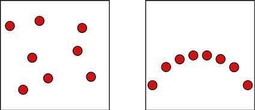

> **圖片描述：** 此圖包含兩個散點圖(a)(b)，展示協方差為0的情況。(a)中的點隨機分散，沒有明顯趨勢；(b)中的點排列成半圓弧形，雖然存在明顯的幾何關係，但協方差仍為0，因為變化不是線性的倍數關係。

(a)　　　　　　　　　　　　　　　　　　　　　　　(b)

圖2.24　這兩組資料點的協方差都為0。如果我們沿著*x*軸從一點移動到另一點，*y*值在大小和方向上的變化都沒有一個統一的規律

我們所說的協方差思想只在變量之間的變化是彼此的倍數時才有效。如圖2.24b所示，資料之間可能存在一個清晰的關係（這裡的點構成了一個圓的一部分），但是協方差仍然為0，因為它們之間的變化是不一致的。

### 2.8.2　相關性

協方差是一個有用的概念，但存在一個問題：由於它的定義方式，它沒有考慮過兩個變量的單位，這使得我們很難確定資料之間的相關性的強弱。

例如，假設我們需要測量一把吉他上的12個變量：木頭的厚度、琴頸的長度、音符共鳴的時間、琴絃的張力等。我們有可能找到這些測量值兩兩之間的協方差，但無法透過比較它們來確定哪一對資料的關係最強（或是哪一對最弱），因為它們的單位不同——木材的厚度可能以毫米為單位，琴絃共振的時間可能以秒為單位，等等。我們會得到每對測量值的協方差，但是無法比較它們。

我們實際能夠瞭解到的只有協方差的符號：正值表示正相關，負值表示負相關，0 表示不相關。

只有符號能為我們提供價值是有問題的，因為我們想要比較不同的變量集。那樣我們才能從中找到有用的資訊，如哪些變量之間有著最強的正相關和負相關，而哪些變量之間有著最弱的正相關和負相關。

為了得到一個可以進行上述比較的度量值，我們可以透過計算得到一個與之前稍稍不同的數字，稱為**相關係數**（correlation coefficient），或者稱**相關性**（correlation）。這個值只要在計算協方差時增加一個步驟就能得到。透過這步計算，我們會得到一個不依賴於變量單位的數字。我們可以把相關係數看作縮小版的協方差，其值在−1～1。

由於相關係數很好地避免了單位的問題，因此要比較不同變量集合的關係的強度時，相關係數就是一個很好的工具。

因為相關係數永遠不能超出−1～1這個範圍，所以我們只需要關心1、−1和它們之間的值。“1”說明資料**完全正相關**（perfect positive correlation），而“−1”說明資料**完全負相關**（perfect negative correlation）。

完全正相關的資料很容易看出來：所有點都沿著一條直線下降，從東北角到西南角，如圖2.25所示。

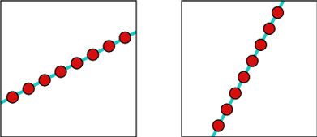

> **圖片描述：** 此圖包含兩個散點圖(a)(b)，展示完全正相關（相關係數=1）。兩個圖中的所有點都精確地排列在一條從左下到右上的直線上，只是斜率不同。相鄰點間向右和向上移動的量完全一致。

(a)　　　　　　　　　　　　　　　　　　　　　　(b)

圖2.25　兩相鄰點之間向右移動和向上移動的量是一樣的，這兩個圖都展現了完全正相關關係（或者說相關係數為1）

那麼，點與點之間什麼樣的關係會得到正相關關係，即相關係數在0和1之間呢？這種情況是：*y*值會隨著*x*的增加而增加，但是增加的比例不會是常數，我們甚至無法預測這個增加比例會發生多大的變化，但是知道*x*的增加會導致*y*的增加，而*x*的減小也會導致*y*的減小。圖2.26為一些相關係數在0～1的正相關的點的點圖，這些點越接近直線，那麼它們的相關係數就越接近1。如果這個值接近於0，相關性就很弱（或者說是很低）；如果它在0.5附近，相關性就是中等的；如果它在1附近，相關性就很強（或者說是很高）。

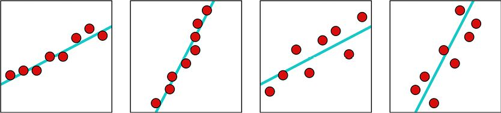

> **圖片描述：** 此圖包含四個散點圖(a)(b)(c)(d)，展示正相關性逐漸降低的過程。(a)相關性接近1，點幾乎排成直線；(b)(c)(d)中的點逐漸散開，相關性依次降低。散佈越大，相關係數越接近0。

(a)　　　　　　　　　　　　　　　　　　　　 (b)　　　　　　　　　　　　　　　　　　　　　(c)　　　　　　　　　　　　　　　　　　　　　　 (d)

圖2.26　正相關性逐漸降低的示例。從(a)中接近1的值開始，(b)、(c)、(d)中的相關性相繼變低。一般來說，點離直線越近，相關性越高

現在我們看看相關係數為0時的情況。不相關意味著一個變量的變化與另一個變量的變化沒有關係，我們無法預測接下來會發生什麼（或者說下一個點的位置）。回顧一下就會發現，相關性只是協方差的縮小版，當協方差為0時，相關性也為0。圖2.27展示了一些相關性為0的點。

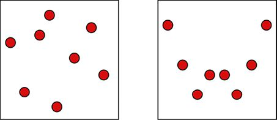

> **圖片描述：** 此圖包含兩個散點圖(a)(b)，展示相關性為0的情況。兩個圖中的點分佈隨機，沒有任何線性趨勢，x值的變化與y值的變化之間沒有可預測的關係。

(a)　　　　　　　　　　　　　　　　　　　　　　　　　　　(b)

圖2.27　這些點的相關性為0。這些點向右移動時，垂直方向上並沒有出現一致的運動

負相關和正相關一樣，只是變量是反向變化的：當*x*增加時，*y*減小。一些負相關的例子如圖2.28所示。

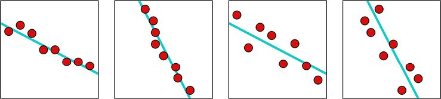

> **圖片描述：** 此圖包含四個散點圖(a)(b)(c)(d)，展示負相關性逐漸降低的過程。(a)相關係數接近-1，點幾乎排成從左上到右下的直線；(b)(c)(d)中的點逐漸散開，負相關性依次減弱。

(a)　　　　　　　　　　　　　　　 (b)　　　　　　　　　　　　　　　 (c)　　　　　　　　　　　　　　　(d)

圖2.28　(a)為相關係數接近－1的情況。從(b)到(d)，負相關係數逐漸向0靠近

與正相關類似，如果相關係數接近於0，相關性就很弱（或者說是很低）；如果它在−0.5附近，相關性就是中等的；如果它在−1附近，相關性就很強（或者說是很高）。

最後，圖2.29展示了資料集完全負相關的（或者說相關係數為－1）的情況。

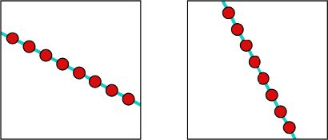

> **圖片描述：** 此圖包含兩個散點圖(a)(b)，展示完全負相關（相關係數=-1）。所有點精確地排列在一條從左上到右下的直線上，只是斜率不同。每向右移動一步，下降的量均完全相同。

(a)　　　　　　　　　　　　　　　　　　　　　　　(b)

圖2.29　這些圖均為完全負相關（或者說相關係數為－1）。每向右移動到下一個點，下降的量均相同

還有幾個術語值得一提，因為它們會不時地出現在文檔和文獻中。如前所述，對於兩個變量的討論通常稱為**單相關**（simple correlation）。我們也可以找到更多變量之間的關係，這稱為**多重相關**（multiple correlation）。如果我們有一堆變量，但是隻研究其中兩個變量是如何相互影響的，就稱為**偏相關**。

如果兩個變量呈現完全正相關或是完全負相關關係（即相關係數的值為+1和−1），就稱這兩個變量是**線性相關**（linear correlation）的，因為（正如我們所看到的那樣）所有點位於一條線上。其他任何相關係數描述的變量則稱為**非線性相關**（non-linear correlation）的。

圖2.30總結了線性相關中不同值的含義。

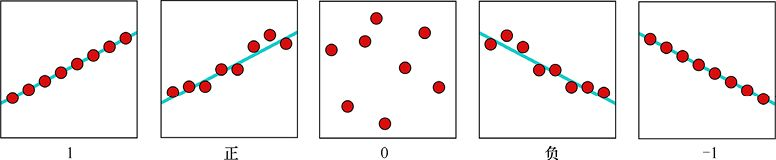

> **圖片描述：** 此圖包含五個散點圖(a)(b)(c)(d)(e)，展示線性相關中不同值的含義。從左到右依次為：完全正相關(+1)、較強正相關、無相關(0)、較強負相關、完全負相關(-1)。

(a)　　　　　　　　　　　　　　　 (b)　　　　　　　　　　　　　　　　(c)　　　　　　　　　　　　　　　 (d)　　　　　　　　　　　　　 (e)

圖2.30　線性相關中不同值的含義

## 2.9　Anscombe四重奏

本章的統計資料告訴了我們關於資料的很多資訊，但並不意味著統計資料告訴了我們一切。

有一個我們被統計資料愚弄的著名例子：有4個不同的二維資料集合，它們看起來一點都不像，但都有相同的均值、方差、相關係數和擬合直線。這些資料以發明這4個資料集的數學家命名（[Anscombe73]），稱為Anscombe**四重奏**（Anscombe’s quartet）——它們的值可以在網上很輕鬆地獲得（[Wikipedia17a]）。

圖2.31展示了這4個資料集以及它們的最佳擬合直線。

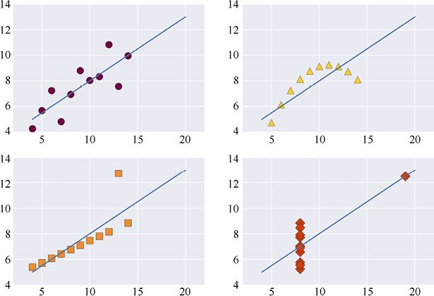

> **圖片描述：** 此圖展示Anscombe四重奏的4個資料集，以2x2的網格排列。每個子圖中繪有散點和一條最佳擬合直線。儘管4個資料集的散點分佈看起來完全不同（包括線性、曲線、離群點和垂直群集等模式），但它們共享相同的統計特徵值。

圖2.31　Anscombe四重奏中的4個資料集以及它們的最佳擬合直線

這4個資料集的驚人之處在於每個資料集中*x*值的均值均為9.0，*y*值的均值均為7.5，每組*x*值的標準差均為3.16，每組*y*值的標準差均為1.94。每個資料集中*x*和*y*之間的相關係數均為0.82，而每個資料集的最佳擬合直線在*y*軸的截距均為3，斜率均為0.5。

換句話說，4個資料集的7個統計度量都具有相同的值。實際上，如果我們在這4幅圖上延伸出更多資料，有的統計度量值就會產生不同，但是它們依然非常接近，所以幾乎可以認為它們是一樣的。

圖2.32疊加了4個資料集中的所有點以及它們的最佳擬合直線。因為4條最佳擬合直線是一樣的，所以我們在圖中只能看到1條。

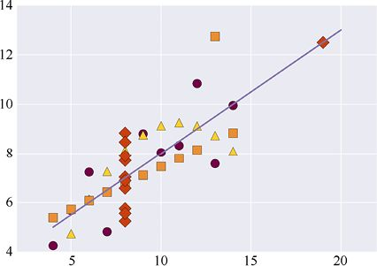

> **圖片描述：** 此圖將Anscombe四重奏的4個資料集疊加在同一張圖上。不同的點標記代表來自不同的資料集，但由於4個資料集的最佳擬合直線完全相同，因此圖中只能看到一條擬合直線。

圖2.32　Anscombe四重奏的4個資料集以及其最佳擬合直線的疊加

Anscombe四重奏的寓意是：不要認為統計資料透露了關於任何一組資料的全部情況。得到了一組資料的統計資訊是一個很好的起點，但是統計資料不能告訴我們需要知道的一切。要想很好地利用資料，我們還需要仔細觀察並且深入理解它。

這4個資料集雖然有名，但並不特別。如果我們想，就可以製作出更多具有相同（或近乎相同）統計資料的不同資料集（[Matejka17]）。

## 參考資料

[Anscombe73]　F. J. Anscombe, *Graphs in Statistical Analysis*,American Statistician, 27. 1973.

[Austin17]　David Austin, *Random Numbers：Nothing Left to Chance*, American Mathematical Society, 2017.

[Banchoff90]　Thomas F. Banchoff, *Beyond the Third Dimension： Geometry, Computer Graphics, and Higher Dimensions*, Scientific American Library, W H Freeman, 1990.

[Brownlee17]　Jason Brownlee, *How to Calculate Bootstrap Confidence Intervals for Machine Learning Results in Python*, Machine Learning Mastery blog, 2017.

[Efron93]　Bradley Efron and Robert J. Tibshirani, *An Introduction to the Bootstrap*, Chapman and Hall/CRC Monographs on Statistics & Applied Probability (Book 57), 1993.

[Marsaglia02]　George Marsaglia and Wai Wan Tsang, *Some Difficult-to-pass Tests of Randomness*, Journal of Statistical Software, Volume 7, Issue 3, 2002.

[Matejka17]　Justin Matejka, George Fitzmaurice, *Same Stats, Different Graphs： Generating Datasets with Varied Appearance and Identical Statistics through Simulated Annealing*, Proceedings of the 2017 CHI Conference on Human Factors in Computing Systems, pgs 1290–1294, 2017.

[Norton14]　John D. Norton, *What is A Four Dimensional Space Like?*, Department of History and Philosophy of Science, University of Pittsburgh, 2014.

[Ong14]　Desmond C. Ong, *A Primer to Bootstrapping*, Department of Psychology, Stanford University, 2014.

[Random17]　Random.org, *Random Integer Generator*, 2017.

[Schwab17]　Katharine Schwab, *The Hardest Working Office Design in America Encrypts Your Data-With Lava Lamps*, Co.Design blob, 2017.

[Stiles16]　Matt Stiles, *How Common is Your Birthday? This Visualization Might Surprise You*, The Daily Viz, 2016.

[Wikipedia17a]　Wikipedia authors, *Anscombe’s Quartet*, 2017.

[Wikipedia17b]　Wikipedia authors, *Random Number Generation*, 2017.

[Wikipedia17c]　Wikipedia authors, *Random Variable*, 2016.

