# 第3章　機率

機率用於描述我們對資料有多大的信心，以據此得出可以多大程度上信任系統所產生的結論。

## 3.1　為什麼這一章出現在這裡

**機率**是一種工具，用來幫助我們確定事件發生的可能性。零機率意味著事件不會發生，而100%的機率意味著事件肯定會發生。我們也可以用機率來表達信心，例如相信某個水果有80%的機率熟了，或者某支球隊會贏得一場比賽。

機率是機器學習的支柱之一，許多論文會使用機率論的語言去描述技術，許多文檔也會採用這種方式，例如，一些庫函數會要求其輸入資料具有一些基本的機率屬性。為了正確地使用庫以獲得優質的結果，我們需要先對機率有足夠的瞭解，然後再去閱讀和理解這些描述。

機率是一門龐大的學科，有許多深奧的門類。像所有深奧的科目一樣，學習機率中的新技巧意味著掌握新的知識，然而學得越多，就越能夠意識到還有很多東西要去學習！

我們的重點是明智且良好地使用機器學習工具，因此只需要掌握一些基本術語和概念。本章涵蓋了所有這些內容。換句話說，本章介紹的不是我們計算自己的統計資料可能用到的工具，而是一些概念——這些概念幫助我們更好地理解如何基於資料去使用工具，以達到預期。

本章將重點介紹機率的一些基本概念、我們經常使用的度量方法以及一個稱為**混淆矩陣**的特殊應用。關於本章討論的所有內容以及機率這一領域諸多其他內容的更廣泛、更深入的討論，讀者可以參考專門研究機率的書（[Jaynes03]和[Walpole11]）。

## 3.2　飛鏢遊戲

**飛鏢遊戲**（dart throwing）是討論基本機率時的經典示例。

這個例子最基本的想法是：我們在一個房間裡，面對一堵牆站著，手裡拿著若干枚飛鏢。我們沒有在牆上掛軟木靶子，而是畫了一些不同顏色和大小的區域。我們會把飛鏢投擲到牆上，然後記下飛鏢擊中的顏色區域（背景也算是一個區域），如圖3.1所示。

在這個場景下，假設飛鏢總是會落到牆上的某個地方（而不是落到地板或天花板上），所以飛鏢擊中牆壁**某處**的機率是100%，這是一個確定的事情。

本章用數字和百分比來描述機率，1.0的機率對應100%，0.75的機率對應75%，以此類推。

現在，讓我們更仔細地看一下投擲飛鏢的場景。在現實場景中，飛鏢更有可能投擲到正對著我們的那部分牆，而不是投擲到離我們很遠的地方。但是為了當前的討論，我們假設投擲到牆上的**任何**點的機率都是一樣的。也就是說，牆上的每一個點都有同樣的機會被飛鏢擊中。換言之，正如我們在第2章中討論的，任何點被擊中的機率都是由均勻分佈給出的。這並不是很符合現實情況，但我們只是用飛鏢遊戲作為一個比喻，所以也不需要它和現實情況一樣精確。如果我們考慮從很遠的距離向一面很小的牆投擲飛鏢，那麼這種約束（假設）可能更容易被接受。

> **圖片描述：** 此圖描繪一個人面對牆壁投擲飛鏢的場景。牆上塗有多塊不同顏色（藍色、橘色、青色、綠色、粉色）和形狀的區域，人物手持飛鏢準備投擲。這是討論機率的經典「飛鏡遊戲」場景設定。

圖3.1　向牆上投擲飛鏢。牆上是各種顏色的顏料

接下來討論的核心將以“對不同區域的比較”和“擊中不同區域的機率”為基礎。記住，背景也是作為一個區域存在的（在圖3.1中，它是白色的牆）。

這裡有一個例子，圖3.2中的牆上有一個圓，當我們投擲飛鏢時，已知擊中牆的機率是1，那麼擊中圓的機率是多少？

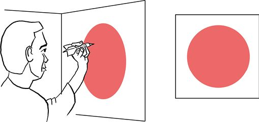

> **圖片描述：** 此圖展示一個人面對牆壁投擲飛鏡的場景，牆上畫有一個紅色大圓。右側正面圖清楚顯示紅色圓佔據了牆面的一部分面積，用於說明擊中圓的機率與面積比的關係。

圖3.2　一定可以擊中牆壁的前提下，擊中圓的機率是多少

假設牆的面積是2m2，而圓的面積是1m2，即圓覆蓋了牆的面積的一半。我們的規則是擊中牆上每個點的可能性都相同，那麼投擲飛鏢時，就會有50%的機會（或者說0.5的機率）讓飛鏢落在圓內。這個值是透過面積的比值得到的。圓越大，它所包圍的點就越多，被擊中的可能性也就越大。

我們可以用一張已經繪製出面積比的圖來說明這一點：如果將一個圖畫在另一個上面，那麼擊中上面圓形的機率就是圓的面積與牆的面積的比值。

舉個例子，圖3.3展示了圓的面積相對於牆的面積的比值，圓的面積是1，而牆的面積是2，所以比值是1/2（或者說0.5）。其實在這裡，準確的數字並沒有那麼重要。這些圖只是提供一種可視的方式來幫助我們找到所討論的區域，讓我們對它們的相對大小有一個直觀的感受。

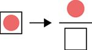

> **圖片描述：** 此圖以分數符號展示機率的計算方式。上方為一個紅色圓（代表目標區域），下方為一個長方形（代表整面牆）。飛鏡擊中圓的機率等於圓的面積除以牆的面積，即1/2=0.5。

圖3.3　飛鏢擊中圖3.2中的圓的機率是由圓的面積與牆的面積之比給出的，這裡用“分數”符號表示

圖3.3準確地展示了相關區域，上方圓的面積是下方方框的面積的1/2。當其中一個圖比另一個大得多時，使用完整尺寸的圖就可能會使圖解很尷尬，因此我們有時可能會縮小區域以使結果圖更適合頁面。因為面積比不會改變，所以這樣做是可行的。需要記住的是：設置這些機率是為了闡明一種圖形的面積與另一種圖形的面積的對比關係。

## 3.3　初級機率學

在談論機率時，我們經常會用大寫字母來命名抽象事件，如*A*、*B*、*C*等。“*A*的機率”就是指事件*A*發生的機率。我們可以透過“在牆上畫圓”來代表這個機率。這時，圓的面積與牆的面積的比值就是事件*A*發生的機率。

回想一下，當我們向牆上投擲飛鏢時，它總是會擊中牆上的**某處**，而且它擊中牆上的任何位置的**機會都是相同的**。所以如果事件*A*是“飛鏢落在圓裡”，那麼“*A*發生的機率”就是另一種表達“把飛鏢投擲向牆壁後，它會落在圓裡”的機率的方式。圖3.4以圖形的方式展示了這一點。

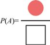

> **圖片描述：** 此圖以面積比的形式展示P(A)的計算。上方為一個粉紅色圓形區域（事件A），下方為代表整面牆的方框。P(A)即為圓的面積與牆面積之比。

圖3.4　我們把“飛鏢落在圓裡”稱為“事件*A*”，那麼事件*A*發生的機率就由圖3.3中面積的比值給出，我們把這個機率寫成*P*(*A*)

為了節省空間，我們通常只說“事件*A*的機率”而不說“事件*A*發生的機率”。進一步簡化，我們通常將“事件*A*的機率”寫成*P*(*A*)[一些作者會使用小寫的*p*，寫作*p*(*A*)]。

在本例中，*P*(*A*)是圓的面積除以牆的面積。這一機率是指，當投擲飛鏢時，飛鏢落在圓裡而不是牆的其他部分的機率。

我們把*P*(*A*)稱為**簡單機率**（simple probability），有時也稱其為*A*的**邊際機率**。稍後我們會看到“邊際”這個詞的來源。

## 3.4　條件機率

現在我們討論的事件不是一個而是兩個。這兩個事件中的任何一個都可能發生，也可能同時都發生，抑或兩者都不發生。

例如，我們可能想要知道若某人正在喝水，他出於口渴喝水的機率。這兩件事是相關的，但它們不一定同時發生。有的人可能會出於多種多樣的原因喝水，比如為了緩解咳嗽，或者為了吞下一顆藥丸。毋庸置疑，出於以上原因喝水時，他們不一定口渴。我們稱兩個不以任何方式相互依存的事件是**獨立的**。

我們的目標是在假設某一事件已經發生（或正在發生）的情況下，找到另一事件發生的機率。我們可能會問“假設有人在喝水，那麼他口渴的機率是多少?”或者“假設有人渴了，那麼他喝水的機率是多少？”。

換句話說，我們知道一個事件發生了，想知道另一個事件發生的機率。

為了儘可能簡略，我們把兩個事件寫成“*A*”和“*B*”。*A*代表“渴”，如果*A*是真的，那麼這個人就是口渴的；如果*A*是假的，那麼這個人就不口渴。*B*代表“喝水”，如果*B*是真的，那麼這個人就是在喝水；如果*B*是假的，那麼這個人就沒在喝水。與之前類似，我們可以討論*P*(*A*)的大小，它在這種情況下簡潔地表達了一個人口渴的機率，也可以討論*P*(*B*)的大小，即指一個人喝水的機率。

在已知*B*為真的前提下，求*A*為真的機率，我們把它寫成*P*(*A*|*B*)，這稱為給定*B*的條件下*A*的**條件機率**（conditional probability）。換句話說，是“在已知*B*為真的條件下，*A*為真的機率”，或者更簡單地表達為“在給定*B*的條件下，*A*為真的機率”。如果我們對另一種情況感興趣，也可以討論*P*(*B*|*A*)，即已知*A*為真的條件下，*B*為真的機率。

我們可以用圖示來說明這一點。圖3.5a是牆，上面有兩個重疊的斑點，被標記為*A*和*B*。*P*(*A*|*B*)是指已知飛鏢落在*B*上，它也落在*A*上的機率。圖3.5b形象地展示了這一比例，比例上方的形狀是*A*和*B*的共有部分，也就是它們重疊的部分。

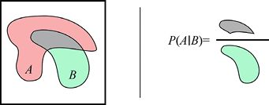

> **圖片描述：** 此圖包含兩個子圖(a)(b)。(a)展示牆上有A（粉紅色）和B（綠色）兩個重疊區域。(b)展示條件機率P(A|B)的計算：分子為A與B重疊部分的面積（灰色），分母為B的整個面積（綠色）。

(a)　　　　　　　　　　　　　　　　　　　(b)

圖3.5　條件機率告訴我們在假設一件事已經發生的情況下另一件事發生的機率。在這個場景中我們想知道，當已知飛鏢落在*B*上時，它也落在*A*上的機率。(a)被畫上了兩個斑點的牆面；(b)已知事件*B*發生的情況下，事件*A*發生的機率是*A*、*B*重疊的面積除以*B*的面積

圖3.5告訴我們如何在已知飛鏢落入*B*區域的情況下，求它落在*A*區域的機率，即用*A*和*B*重疊的面積除以*B*的面積。

*P*(*A*|*B*)是一個可以透過使用飛鏢對其進行估計的正數。想法如下：每一個飛鏢都會落在牆上的某個區域（在本例中，有4個區域：“*A*”“*B*”“*A*和*B*的重疊區域”以及“*A*和*B*之外的牆面”）中。透過計算所有落在*A*和*B*的重疊區域以及*B*區域的飛鏢，我們可以得到一個關於*P*(*A*|*B*)的粗略的值。落在重疊區域的飛鏢數量與落在*B*區域的飛鏢數量的比值可以告訴我們：飛鏢落在*B*區域的前提下也落在*A*區域的機率。

讓我們來看看這是怎麼回事。在圖3.6中，我們向圖3.5a中的牆上投擲一些飛鏢，投擲點遍及整個區域，且沒有哪兩個點距離非常近。飛鏢尖是如此小，以至於我們可以把它們近似看作一個不容易看到的點。為了便於觀察，我們用一個黑色的圓圈代替它，圓圈的中心表示飛鏢投擲到的位置。

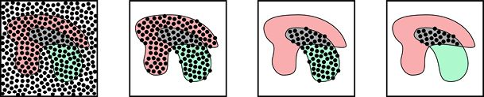

> **圖片描述：** 此圖包含四個子圖(a)(b)(c)(d)，展示透過投擲飛鏡估計P(A|B)的過程。(a)飛鏡散佈在牆上；(b)篩選出落在A或B區域的飛鏡；(c)進一步篩出落在B區域的66個飛鏡；(d)其中23個同時落在A和B重疊區域，因此P(A|B)約為23/66≈0.35。

(a)　　　　　　　　　　　　　　　　 (b)　　　　　　　　　　　　　　　　(c)　　　　　　　　　　　　　　　　 (d)

圖3.6　透過向牆上投擲飛鏢來找到*P*(*A*|*B*)。(a)飛鏢被投擲到牆上；(b)落在*A*區域或*B*區域的所有飛鏢；(c)落在*B*區域的所有飛鏢；(d)落在*A*和*B*重疊區域的所有飛鏢

在圖3.6a中，我們看到了被投擲到牆上的全部飛鏢；在圖3.6b中，我們分離出了落在*A*區域或*B*區域的飛鏢（記住，只有每個黑圈的中心才算數）；在圖3.6c中，我們可以看到有66個飛鏢落在了*B*區域；在圖3.6d中，我們可以看到有23個飛鏢落在*A*和*B*的重疊區域。至此，我們可以求出所需要的比值為23/66（約0.35）——這個比值估算了飛鏢落在*B*區域的情況下也落在*A*區域的機率。

現在我們就可以知道為什麼之前說“牆上的每個點都有相同的被擊中的可能性”：這樣就可以根據落在某個區域的飛鏢數量去估計該區域的相對大小。

注意，這並沒有告訴我們彩色區域的絕對面積（如帶平方釐米這樣的單位的數字）。它只是告訴我們一個區域對於另一個區域的相對大小，這也是我們唯一真正關心的度量值（如果牆的尺寸翻倍，那麼帶顏色區域的面積也會翻倍，飛鏢落在每個區域的機率不會改變）。

*A*和*B*重疊的面積越大，飛鏢同時落在兩個區域中的可能性就越大。如果*A*區域涵蓋了*B*區域，如圖3.7所示。那麼當飛鏢落在*B*區域的時候，它就**一定**也落在*A*區域上，這時飛鏢同時落在兩個區域中的機率就是100%，或者說*P*(*A*|*B*)=1。

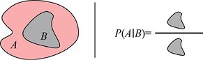

> **圖片描述：** 此圖包含兩個子圖(a)(b)。(a)展示A區域完全涵蓋B區域的情況。(b)展示P(A|B)=1，因為A和B的重疊區域等於整個B區域，已知飛鏡在B中，則必定也在A中。

(a)　　　　　　　　　　　　　　　(b)

圖3.7　(a)牆上有兩個新的斑點；(b)因為*A*區域涵蓋*B*區域，所以已知飛鏢落在*B*區域的情況下，其落在*A*區域的機率為1。*A*和*B*的重疊區域的面積等於*B*區域的面積

此外，如果*A*和*B*區域完全不重疊，如圖3.8所示。那麼在已知飛鏢落在*B*區域中的情況下，它也落在*A*區域中的機率就是0，或者說*P*(*A*|*B*)=0。

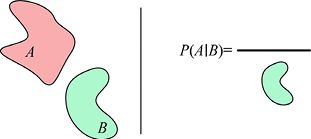

> **圖片描述：** 此圖包含兩個子圖(a)(b)。(a)展示A區域和B區域完全不重疊的情況。(b)展示P(A|B)=0，因為重疊面積為0，已知飛鏡在B中，則不可能同時在A中。

(a)　　　　　　　　　　　　　　　　 (b)

圖3.8　(a)牆上又有兩個新的斑點；(b)已知飛鏢落在*B*區域的情況下，它也落在*A*區域的機率為0，因為*A*區域和*B*區域並不重疊。形象化的比例顯示重疊區域為0，0除以任何東西都仍舊得0

為了好玩，讓我們換一種方式，求解一下*P*(*B*|*A*)，即**已知飛鏢落在***A***區域中**，求它落在*B*區域中的機率。使用與圖3.5的牆上相同的斑點分佈，結果如圖3.9所示。

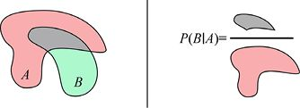

> **圖片描述：** 此圖包含兩個子圖(a)(b)，展示P(B|A)的計算。(a)與之前相同的牆面和A、B區域。(b)P(B|A)的分子為重疊面積，分母為A的整個面積，結果與P(A|B)不同。

(a)　　　　　　　　　　　　　　　　　(b)

圖3.9　條件機率*P*(*B*|*A*)是在已知飛鏢落在*A*區域的前提下，求出它落在*B*區域中的機率。所以我們需要找到重疊的面積，然後除以*A*區域的面積

這種方式的求解邏輯是不變的，使用重疊區域的面積除以*A*區域的面積。得到的比值可以告訴我們*B*區域與*A*區域重疊面積的相對大小。重疊的面積越大，飛鏢同時落在*A*區域和*B*區域中的可能性就越大。

注意，區域命名的順序很重要。從圖3.5和圖3.9可以看出，*P*(*A*|*B*)不等於*P*(*B*|*A*)。已知*A*區域、*B*區域和它們重疊面積的大小的情況下，*P*(*A*|*B*)要大於*P*(*B*|*A*)。

在不知道具體值是多少的情況下，我們也可以使用諸如*P*(*A*|*B*)這樣的表達式。甚至我們可能不知道*A*和*B*的形狀是什麼，更不知道*A*和*B*的面積是多大。當我們說諸如*P*(*A*|*B*)這樣的表達式（在沒有明確給出*A*和*B*的值的情況下）“告訴我們”或是“給了我們”已知*B*發生的情況下*A*發生的機率時，所指的是：如果弄清楚*A*和*B*是什麼，我們就可以透過*A*和*B*的區域大小去計算*P*(*A*|*B*)。

換句話說，表達式*P*(*A*|*B*)是一種簡寫（或者說規範），以供輸入為*A*和*B*並且返回機率的演算法使用。

同樣的說法也適用於*P*(*A*)、*P*(*B*)以及我們會在這一章中看到的其他類似的表達式。它們是對產生數值的演算法的引用，這些數值是當我們得到輸入值時計算出來的。

## 3.5　聯合機率

在3.4節中，我們學習了一種方法，可以在已知一個事件已經發生的情況下，求得另一個事件發生的機率，那麼如果我們不知道這兩個事件是否已經發生了呢？

在事先不知道其中任何一個事件發生機率的情況下，知道兩個事件同時發生的機率會很有幫助。

回到我們的飲水的例子，一個人既口渴**又在**喝水的機率是多少呢？或者回到我們投擲飛鏢的例子，落在牆上的飛鏢有多大機率同時落在*A*區域和*B*區域中呢?

我們把*A*和*B*同時發生的機率寫為*P*(*A*,*B*)，在這裡，我們可以把逗號看作“和”的意思。*P*(*A*,*B*)代表著“*A*和*B*都為真的機率”，讓我們大聲讀出它的名字“*A*和*B*的機率”。

我們把它稱為*A*和*B*的**聯合機率**（joint probability）。

回到投擲飛鏢的例子，在這裡，透過找到*A*區域和*B*區域重疊的面積與牆的面積的比值，我們就可以得到聯合機率*P*(*A*,*B*)。我們要求的是飛鏢同時落在*A*區域和*B*區域的機率，也就是“落在兩個區域重疊的地方的機率”與“落在任何地方的機率”的比較，如圖3.10所示。

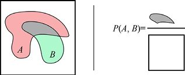

> **圖片描述：** 此圖包含兩個子圖(a)(b)，展示聯合機率P(A,B)。(a)牆上有A和B兩個重疊區域。(b)P(A,B)的計算為A和B重疊面積除以整面牆的面積，代表飛鏡同時落在A和B區域的機率。

(a)　　　　　　　　　　　　 　　　　 (b)

圖3.10　*A*和*B*同時發生的機率稱為它們的聯合機率，寫作*P*(*A*,*B*)。這個值可以透過用*A*和*B*重疊的面積除以整個牆的面積得到。*P*(*A*,*B*)指的是隨機投擲飛鏢時飛鏢同時落在*A*區域和*B*區域的機率

還可以從另一種方式來看待這個問題，這個方式有點微妙，但是很有趣也很實用。它是基於我們在3.4節所說的條件機率。

條件機率*P*(*A*|*B*)指的是在已知飛鏢擊中*B*區域的情況下擊中*A*區域的機率。但從概念的另一個角度看，如果**知道**擊中了*B*區域，那麼條件機率就給出了這種情況下我們同時也擊中*A*區域的機率，並且假設我們可以知道隨機擊中*B*區域的機率是*P*(*B*)，那麼我們是否可以據此得到同時擊中*A*區域和*B*區域的聯合機率呢？

讓我們仔細思考一下這個問題，假設*B*區域的面積覆蓋了一半的牆面[即*P*(*B*)=1/2]，而*A*區域的面積可以覆蓋1/3的*B*區域[即*P*(*A*|*B*)=1/3]。那麼一半的飛鏢都會落在*B*區域上，而這一半中的1/3又會落在*A*區域中。假設我們投擲了60支飛鏢，就有一半（或者說30支飛鏢）落在*B*區域中，然後這一半中的1/3（或者說10支飛鏢）會落在*A*區域中，所以同時落在*A*和*B*區域[即*P*(*A*,*B*)]的機率就是10/60（或者說1/6）。

這個例子向我們展示了一條一般規律：我們可以透過找到 *P*(*A*|*B*)，然後乘以 *P*(*B*)來發現*P*(*A*,*B*)。這裡有非常值得我們注意的一點：僅使用*P*(*A*|*B*)和*P*(*B*)，就可以求出*P*(*A*,*B*)！我們把它寫成*P*(*A*,*B*)=*P*(*A*|*B*)×*P*(*B*)。而在實踐中，我們通常不會寫出乘法符號，而是寫為*P*(*A*,*B*)=*P*(*A*|*B*)*P*(*B*)，在這樣的表達式中，乘法符號是隱含的。

圖3.11展示了我們剛才透過面積圖來完成的工作。

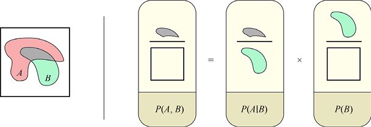

> **圖片描述：** 此圖包含兩個子圖(a)(b)，展示聯合機率P(A,B)=P(A|B)P(B)的推導。透過面積比的方式，將重疊面積除以牆面積，分解為條件機率乘以邊際機率的形式。

(a)　　　　　　　　　　　　　　　　　　　　　　　　　　　　　　　　　　 (b)

圖3.11　另一種考慮聯合機率*P*(*A*,*B*)的方法。*P*(*A*,*B*)就是飛鏢同時落在*A*區域和*B*區域的機率（或者說*A*和*B*事件同時發生的機率），如圖3.10所示

圖3.11中使用的小技巧是把這些符號的機率當作實際的分數，這樣我們就可以消去*B*區域。為了更清楚地看到這一點，在圖3.12的第三行中，我們對等號右邊的項進行了重新排列。第三行最右邊的部分是“*B*區域的面積”除以“*B*區域的面積”，也就是1，所以這一項可以被忽略，從而等號左右相等。

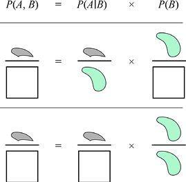

> **圖片描述：** 此圖展示三行公式推導過程。第一行為原始公式P(A,B)=P(A|B)P(B)；第二行以面積圖符號表示；第三行重新排列各項，展示B區域面積如何在分子分母中互相抵消。

圖3.12　我們可以重新排列圖3.11中的各項，以便更好地看到*B*區域的面積是如何被抵消的。第一行是原始公式；第二行是我們在圖3.11中看到的符號版本；在第三行，我們將兩個綠色區域重新排列到了右邊（在這裡我們把它們當作真正的分數）。這樣，最右邊的項就是1，等號左右是一樣的

我們也可以用另一種方式來做：透過求解*P*(*B*|*A*)來求出已知飛鏢落在*A*區域的情況下落在*B*區域的機率，然後乘以落在*A*區域的機率[或者說*P*(*A*)]，即*P*(*A*,*B*)=*P*(*B*|*A*)*P*(*A*)。圖3.13直觀地展示了這一點。結果和以前一樣，是我們所期望的。在符號表示上，*P*(*B*,*A*)=*P*(*A*,*B*)，因為它們都表示同時落在*A*區域**和***B*區域中的機率，在這個表達式中，*A*和*B*的順序是無關緊要的。

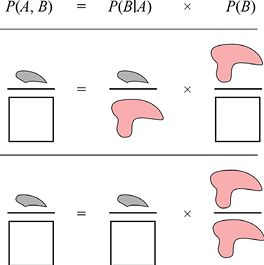

> **圖片描述：** 此圖展示P(A,B)=P(B|A)P(A)的另一種推導方式，包含三行。第一行為原始公式；第二行為圖示表示；第三行證明等式成立，A區域面積在分子分母中抵消。

圖3.13　就像我們在圖3.12中所做的那樣，這幅圖也求解了*P*(*A*,*B*)的聯合機率。這次是從飛鏢落在*A*區域的機率開始，然後乘以（假設已經落在*A*區域）落在*B*區域的機率[*P*(*B*|*A*)]。第一行是原始公式；第二行是公式的形象表達；第三行與圖3.12中相同，對公式的項進行了重新排列，表明公式的正確性

這些想法可能有點難以接受，通常需要編造一些小場景應用來輔助理解。想象一下不同的區域以及它們之間如何進行重疊，或者甚至可以把*A*和*B*想象成實際情況。

例如，讓我們想象一個冰淇淋店的場景，人們可以在那裡買到各種口味的冰淇淋，蛋筒裝冰淇淋或是杯裝的冰淇淋都可以。我們可以這樣假設：如果有人訂購香草冰淇淋，我們就說*V*事件為真；如果有人訂購蛋筒裝冰淇淋，我們就說*C*事件為真。至此，*P*(*V*)代表任意一位顧客訂購香草冰淇淋的可能性，而*P*(*C*)代表任意一位顧客訂購蛋筒裝冰淇淋的可能性。*P*(*V*|*C*)則告訴我們一位訂購蛋筒裝冰淇淋的顧客選擇香草口味的可能性有多大，而*P*(*C*|*V*)則告訴我們一位訂購香草冰淇淋的顧客選擇蛋筒裝的可能性有多大。*P*(*V*,*C*)則告訴我們任意一位顧客訂購香草蛋筒裝冰淇淋的可能性有多大。

## 3.6　邊際機率

到這裡，我們遇到了本節標題所說的**邊際機率**（marginal probability）。這似乎是一個奇怪的搭配：“邊際”與機率有什麼關係？“邊際”一詞來自包含預計算機率表格的書，其思想是：我們（或者列印機）需要去彙總機率表的每一行，並將彙總後的總數寫在頁面的邊緣處（[Andale17]）。

讓我們回到冰淇淋店這個例子來闡述這個想法。在圖3.14中，我們展示了一些顧客最近的訂購行為。需要說明的是：冰淇淋店剛剛開張，只供應香草和巧克力兩種口味的冰淇淋，有蛋筒裝和杯裝兩種樣式可選。根據昨天來的150人的訂購情況，透過將每行或每列中的數字相加（相加後的數字在“邊緣”處給出）併除以總顧客數量，我們就可以知道某位顧客購買杯裝或蛋筒裝冰淇淋的機率，也可以知道他購買香草或巧克力口味的冰淇淋的機率。

注意，某位顧客買杯裝**或**蛋筒裝冰淇淋的機率加起來是1，因為每位顧客都會選擇一種樣式。同樣，每位顧客都會選擇一種口味的冰淇淋（香草或巧克力），所以購買香草冰淇淋和巧克力冰淇淋的機率加起來也是1。總的來說，任何一個事件的各種結果的機率加起來都會是1，因為我們可以百分之百地確定其中一個選項會發生。

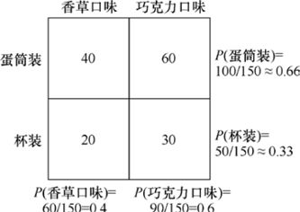

> **圖片描述：** 此圖展示冰淇淋店的邊際機率表格。2x2表格中列出150位顧客的訂購資料：蛋筒裝香草40人、蛋筒裝巧克力60人、杯裝香草20人、杯裝巧克力30人。右側和下方顯示邊際機率：P(蛋筒裝)≈0.66、P(杯裝)≈0.33、P(香草口味)=0.4、P(巧克力口味)=0.6。

圖3.14　統計最近前來冰淇淋店的150位顧客的訂購行為的邊際機率

## 3.7　測量的正確性

在後續章節中，我們經常需要對資料進行分類。本節將關注最簡單的情況，即探尋一段資料是否屬於某個特定類別。

例如，我們可能會想要知道“一張照片中是否有狗”“颶風是否會襲擊陸地”“股票是否會發生重大變化”抑或“我們的高科技圍場是否牢固到可以容納基因工程創造的超級恐龍”（提示：它們不能）。

理所當然地，我們會盡最大努力做出最準確的決定，而“如何定義我們所說的‘準確’”就成為至關重要的一環。

衡量“準確”最簡單的方法就是計算“判斷錯誤的結果”的數量，但這個方法不是很有啟發性。如果我們想要透過錯誤來改進表現，就需要去明確做出錯誤預測的原因。

這種討論的應用範圍遠遠不止於機器學習範疇。下面所說的內容可以幫助我們去診斷和解決各種各樣的問題，不管這些問題是來自特定的任務還是日常生活（在那裡，我們根據自己為事物分配的標籤做出判斷）。

在深入討論之前，我們需要注意這裡所使用的兩個術語：**精度**（precision）和**準確率（**accuracy**）**。它們在不同的領域有著不同的含義。在本書中，我們會堅持用它們在機率和機器學習領域通常使用的含義，並會對它們進行詳細的定義（在本章中）。要注意的是，這些術語在很多地方都有著不同的含義（或者只是作為模糊的概念出現）。

### 3.7.1　樣本分類

讓我們來具體看看手頭的任務。我們想要知道一段給定的資料片段（或者說**樣本**）是否在給定的類別中。以問題的形式敘述，那就是：“這個樣本屬於這個類別嗎？”。你只能回答“是”或“否”，不能回答“可能是”。

如果答案是“是”，我們就稱樣本為**真**或**陽性**；如果答案是“否”，我們就稱樣本為**假**或**陰性**。

我們對從分類器中得到的結果與觀察到的真實（或者說正確）結果進行比較，藉此來討論準確率。我們把手動賦予樣本的陽性或陰性稱為它的**真值**（ground truth）或**實際值（**actual value**）**，而將分類器（無論是人還是電腦）返回的值稱為**預測值**（predicted value）。在完美的情況下，預測值總是與基礎真值相匹配，然而在現實世界中，經常會有錯誤發生，我們的目標就是描述這些錯誤。

我們用二維資料進行說明。也就是說，我們所用的每個**樣本**或**資料點**（data point）都有兩個值。這兩個值可能是一個人的身高和體重，也可能是天氣測量中的溼度和風速，還有可能是音符的頻率和音量。然後，我們會在二維網格上繪製每一個資料，其中*x*軸對應一個測量值，*y*軸對應另一個測量值。

每個樣本都將屬於兩個**類別**（或者說**類**）中的一個，我們稱之為**類別0**和**類別1**（或**0類**和**1類**）。為了表明樣本類別，我們用了不同的顏色和形狀標註。圖3.15顯示了兩個類別的二維資料示例。

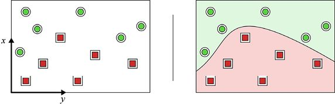

> **圖片描述：** 此圖包含兩個子圖(a)(b)。(a)展示二維平面上的資料點，綠色圓圈代表類別0，紅色方塊代表類別1。(b)在兩組資料之間畫了一條分界曲線，將空間分為兩個區域，淺色為陽性區域，深色為陰性區域。

(a)　　　　　　　　　　　　　　　　　　　　　　　　　　　　　　　　　　 (b)

圖3.15　來自兩個不同類別的二維資料。(a)每個樣本都有*x*值和*y*值，可以將它們放在同一個平面上，我們用不同的顏色和形狀標註了兩組不同類別的樣本；(b)我們可以透過在兩組資料之間劃一條界線來把它們分開。圖中繪製的只是無數可能邊界中的一個

無論是透過人工還是電腦，我們最終都會展示分類結果：繪製一條**邊界**（或者說曲線）去區分這些資料點的集合。邊界可能是平滑的，也可能是曲折的，但繪製它都是為了代表分類器。我們可以把它看作對分類器決策過程的一種總結，曲線一側的所有點將被預測為一個類別，而另一側的所有點將被預測為另一個類別。

有時，我們說邊界有“陽性”的一面和“陰性”的一面。當我們認為分類器在回答問題時，這樣對邊界進行說明就是與分類相匹配的，“這個樣本屬於給定的分類嗎？”，如果回答是“真”，或者說陽性，那麼預測值就是“是”，反之就是“否”。

邊界的性質可以透過一個指向“陽性”一側的箭頭來表示，如圖3.16a所示。但如果把樣本也繪製進去，標記箭頭就會使得圖表很混亂。因此，我們可以借用天氣圖中的一些符號來進行表示（見[MetService16]）。在天氣圖中，我們用**等壓線**表示冷熱鋒面的交界處，並用一些小符號來指向感興趣的溫度區域。在圖3.16b中，我們用暖鋒等壓線替換箭頭，小三角形指向邊界的“陽性”的一側。

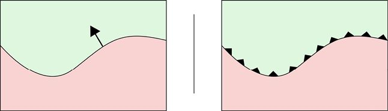

> **圖片描述：** 此圖包含兩個子圖(a)(b)。(a)展示一條曲線將空間分為兩側，箭頭指向「陽性」側。(b)以暖鋒等壓線符號（帶小三角形的曲線）替代箭頭，三角形指向陽性一側。

(a)　　　　　　　　　　　　　　　　　　　　　　　　　　　　　　　　　　　　　　　　(b)

圖3.16　這條曲線把空間分成兩個區域。(a)我們可以用箭頭來指出邊界的“陽性”的一側；(b)我們也可以用暖鋒等壓線符號來指出邊界的“陽性”的一側

這裡用來進行說明的原始資料集包含20個樣本，如圖3.17所示。我們將一個類別的樣本手動標記為綠色圓圈，將另一個類別的樣本標記為紅色方塊。所以這裡的顏色或形狀都是對應於它們的基礎真值的，而不是分類器為它們劃分的值。

分類器的邊界將圖分割成兩個區域，我們用淺色陰影表示“陽性”區域，用深色陰影表示“陰性”區域。淺色區域內的每個點都被歸類為“陽性”，而深色區域內的每個點都被歸類為“陰性”。

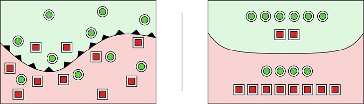

> **圖片描述：** 此圖包含兩個子圖(a)(b)。(a)展示20個樣本的分類結果，曲線將空間分為淺色（陽性）和深色（陰性）區域，部分樣本被錯誤分類。(b)將相同資料整理為示意圖，便於計數正確和錯誤分類的樣本數。

(a)　　　　　　　　　　　　　　　　　　　　　　　　　　　　　　　　　　　　　　　　　　　 (b)

圖3.17　原始資料集包含20個樣本，用暖鋒等壓線符號指向“陽性”方向。我們已經給綠色圓圈貼上了“陽性”標籤，給紅色方塊貼上了“陰性”標籤。(a)分類器的曲線可以很好地對樣本進行分類，但也會出錯；(b)同一個圖表的示意圖

完美的情況應該是所有綠色圓圈都在淺色區域內，而所有紅色方塊都在深色區域內。但從圖3.17可以看到，這個分類器也犯了一些錯誤。

圖3.17a展示了我們測量過的資料。但是現在，我們不關心點的位置或者曲線的形狀，而是關心有多少點被正確地分類，又有多少點被錯誤地分類，導致它們落在了邊界的正確的一邊和錯誤的一邊。因此，在圖3.17b中，我們對圖形進行了整理，這樣可以更容易對樣本進行計數。

在圖3.17b中，10個圓圈中有6個被正確識別為“陽性”，而10個方塊中有8個被正確識別為“陰性”，分別有兩個方塊和4個圓圈被分到了錯誤的一側。

圖3.17指出了我們在真實資料集上運行分類器時常常會發生的情況：一些資料被正確分類，而另一些資料沒有。如果分類器（對於我們來說）不能足夠準確地對資料進行分類，我們就需要採取一些行動去修改分類器（甚至是放棄它，再創建一個新的）。所以，能夠有效地去衡量一個分類器的表現是很重要的。

接下來，讓我們探索一些解決這件事情的方法。

### 3.7.2　混淆矩陣

我們希望能夠以某種方式去描述圖3.17中的錯誤，從而說明分類器的性能（或者說它的預測與給定的標籤相匹配的程度）。

我們可以創建一個有兩列兩行的小表格，每一列表示一個預測值，而每一行表示一個實際值。這樣我們就得到了一個2×2的網格，這個網格通常稱為**混淆矩陣**（confusion matrix）。這是個有點奇怪的名字，指的是矩陣會如何向我們展示分類器對某些資料的預測發生錯誤（或者說混淆）。圖3.18復現了分類器的輸出結果，並生成了它的混淆矩陣。

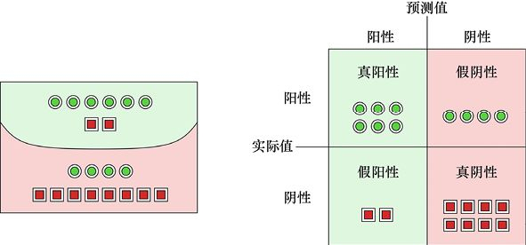

> **圖片描述：** 此圖包含兩個子圖(a)(b)。(a)重現了分類結果的示意圖。(b)展示對應的混淆矩陣：真陽性(TP)=6個綠圈、假陰性(FN)=4個綠圈、假陽性(FP)=2個紅方塊、真陰性(TN)=8個紅方塊。矩陣橫軸為預測值，縱軸為實際值。

(a)　　　　　　　　　　　　　　　　　　　　　　　　　　　　　　　　　　　　　　 (b)

圖3.18　(a)復現了圖3.17b中的內容，並由此總結出了一個混淆矩陣；(b)這個混淆矩陣可以說明這4個類別各有多少個樣本

圖3.18b中共有4個單元格，每個單元格都有一個慣用名稱——這個名稱描述了預測值和實際值的特定組合。6個被正確地標記（或者說預測）為“陽性”的圓圈被歸類到**真陽性**（true positive）類別。換句話說，它們的預測值為“陽性”，而它們本身的值也為“陽性”，對於“陽性”的預測是正確（或者說真）的。

4個被錯誤地標記為“陰性”的圓圈被歸類到**假陰性**（false negative）類別。換句話說，它們被錯誤（或者說假）地貼上了“陰性”的標籤。8個紅色方塊被正確地分類為“陰性”，所以它們都屬於**真陰性**（true negative）類別。

那兩個被錯誤預測為“陽性”的紅色方塊就屬於**假陽性**（false positive）類別，因為它們被錯誤（或者說假）地標記為“陽性”。

我們可以將這4個類別全部用兩個字母的縮寫來代表，這樣可以更簡潔地進行表達，並用一個數字來表述每個類別中有多少樣本。圖3.19展示了混淆矩陣的常規表達形式。然而需要注意的是，人們對於標籤放置的順序並沒有普遍的共識。有些人把預測值放在左邊，而把實際值放在上面；有些人則會將“陽性”和“陰性”兩種類別放在明顯相反的位置。遇到混淆矩陣時，最重要的就是去查看標籤以確保我們知道每個框代表什麼。

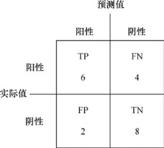

> **圖片描述：** 此圖展示常規形式的混淆矩陣，以TP、FP、FN、TN標記四個單元格，數值分別為6、2、4、8。橫軸標記為「預測值」（陽性/陰性），縱軸標記為「實際值」（陽性/陰性）。

圖3.19　用常規形式展現了圖3.18中的混淆矩陣。注意，並不是所有人都將各個標籤如圖中所示的位置放置，所以遇到一個混淆矩陣後，檢驗標籤位置是很重要的

### 3.7.3　混淆矩陣的解釋

混淆矩陣可能會讓人感到迷惑。現在我們用一個全新的、具體的例子來介紹它的各個類別。

討論混淆矩陣的經典方法是用醫學診斷的方式進行的，其中“陽性”表示某人處在某種特定狀態，“陰性”則表示健康。讓我們設想以下場景。

假設我們作為公共衛生工作者來到一個小鎮，這裡的人患上了一種可怕的（但是完全是想象出來的）疾病（稱為**Morbus Pollicus**，又名MP）。任何患有MP的人都需要立即進行切除拇指的手術，否則會在數小時內死於此疾病。

我們必須正確診斷出誰患有MP，而誰並未患病。拇指對人很重要，但如果要活下來的唯一方法是失去拇指，那麼可能有大多數人願意接受手術。但是，如果一個人的生命**沒有**受到威脅，那麼我們絕對不會想要去做出任何導致其拇指被切除的錯誤診斷。

假設有一個檢測MP的測試，這個測試緩慢且昂貴，但是我們知道這種測試方法是完全值得信賴的。“陽性”的診斷結果代表這個人患有MP，“陰性”的診斷結果則代表他們並未患病。

透過這個測試，我們對鎮上的每個人進行了檢查，然後知道他們是否患有MP。但是這個可靠測試是緩慢且昂貴的，並且需要一個有專門設備的實驗室才能進行，不夠便捷。我們擔心未來這種疾病暴發，於是根據剛剛得到的資料開發了一種快速、便宜、便攜的新血液測試設備，這樣就可以立即預測受試者是否患有MP。

我們的目標是儘可能地使用便宜且快速的血液測試方法，而只在必要的時候使用昂貴而緩慢的測試。理想的情況是：如果血液測試結果為“真”，受試者就真的得了這種病，需要馬上進行切除拇指的手術；如果血液測試結果為“假”，受試者就沒有得這種病，不用採取任何治療措施，可以回家。由此可以看出，血液測試的結果是非常重要的！

實際上，我們還需要對血液測試進行完善，因為這個測試結果並不完全可靠。這個便宜且快速的測試存在兩個問題：首先，它可能會漏診患病者，當受試者患有MP時，測試也可能呈現為“陰性”；其次，它可能在受試者未患病的情況下給出“陽性”結果，例如這個受試者最近吃了（或喝了）一些東西，導致血液測試出現了錯誤的診斷。

我們知道血液測試尚有缺陷，但是在疫情現場，這是我們檢測受試者是否患上MP的唯一手段。所以，在找到更好的測試方法之前，我們需要確定這個測試的正確率、錯誤率、錯誤發生的時間以及錯誤發生的方式。

綜上所述，我們去到一個小鎮（那裡有一些人患有MP），並特意為昂貴、緩慢但準確的測試建立了一個實驗室，然後用昂貴的和便宜的兩種方法來檢測每一個人。透過將所有測試結果放入混淆矩陣的4個類別中，我們就可以對比透過快速血液測試得到的結果和（透過緩慢且昂貴的測試得到的）真實結果的差別。

（1）**真陽性**意味著受試者患有MP，快速血液測試也表明他們患有MP，那麼我們就需要採取行動來挽救他們的生命。

（2）**真陰性**意味著受試者並未患有MP，快速血液測試也表明他們未患有MP，那麼這個人沒有生命危險，不需要救治。

（3）**假陽性**意味著受試者未患有MP，但快速血液測試表明他們患有MP。這會導致我們切除了健康人的拇指——這是一個很嚴重的錯誤。

（4）**假陰性**意味著受試者患有MP，但快速血液測試表明他們未患有MP。這會導致我們不會採取行動，而這個患者將死亡——這是一個更嚴重的錯誤。

真陽性和真陰性都是“正確”的預測，而假陰性和假陽性都是“不正確”的預測。假陽性意味著我們對未患病者採取治療措施，而假陰性則意味著某人有死亡的危險。快速血液測試越精確，它所返回的真陽性和真陰性類別的預測就會更多，其他選項會更少。

雖然我們喜歡使用緩慢且昂貴的測試，但這是不實際的，所以需要了解快速血液測試。

圖3.20展示了一個關於MP測試的定性的混淆矩陣。

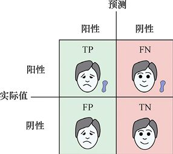

> **圖片描述：** 此圖展示MP疾病檢測的定性混淆矩陣，用表情符號表示：真陽性（正確檢出患病者，悲傷但存活）、真陰性（正確判定健康者，開心）、假陽性（健康者被誤判為患病，做了不必要的手術）、假陰性（患病者被漏診，面臨死亡危險）。

圖3.20　一個關於MP測試的定性的混淆矩陣。這些面部表情顯示了一個人對於測試結果的反應。圖中的點表示這個人是否真的患有MP。其中，真陽性和真陰性都是正確的診斷結果，但是假陰性意味著我們沒能檢測出一個患病的人，他將面對死亡，而假陽性意味著我們會給一個健康的人做手術。後面我們會統計每個類別的樣本數量

我們可以把每個類別的數量加到混淆矩陣的各個單元格中，之後利用這些值來回答關於群體和測試的問題。最後的結果以數值形式給出，來告知我們做得怎麼樣。這一部分我們會在後續章節中講解。

但在深入研究這些數字和得分之前，我們看一個與混淆矩陣相關的很重要的問題。這個問題常常被忽視，由此可能會帶來可怕的現實後果，因此我們必須密切關注這個問題。

看上去，有些問題提出得非常合理，但是如果我們不小心，這些問題就可能會導致一些非常錯誤的結論。

假設我們現在問這樣一個問題：“有多少患有MP的人做了測試並且被正確地分類？”從表面上看，這是一種很有用的衡量準確率的方法，但它可能是非常具有誤導性的。

先假設測試總是返回“真”，那麼上述問題的答案就是：測試正確地預測出了所有（100%）患有MP的人。換句話說，對於上述問題來說，測試做得簡直**完美**。但是，在這個測試中，我們可能會得出很多錯誤的答案，因為一部分未患有MP的人也會被診斷為陽性，這些錯誤的結果將導致許多不必要的操作。

這種情況下，我們根本不需要測試。“測試”可能只是一張印著“真”的紙。聽起來我們有一個很棒的測試，因為它排除了其他可能的診斷結果。如果我們只是想要對某種特定的診斷結果進行完美的記錄，只需要對每個進門的人都做出這樣的診斷就可以了，這是一個很可怕的過程。

或者，我們也可能會問：“測試將多少人正確地分類為健康？”與之前一樣，我們也只看一個診斷結果，所以可以簡單地給每個受試者診斷為“假”，那麼測試在這個問題上就是100%準確的。畢竟，每個健康的人都被判斷為未患病，但是那些真正患病的人都會死。

我們非常容易犯“問錯問題”這樣的錯誤，特別是當情況變得複雜的時候。為此，人們開發出了另一套術語，使得我們不容易偶然提出錯誤的問題。

### 3.7.4　允許錯誤分類

在學習如何對系統的性能進行正確的衡量之前，請注意，我們有時也需要假陽性或假陰性。

例如，假設我們在一家公司工作，這家公司的業務是生產幾十個流行電視角色的玩具雕像。這種產品很暢銷，所以生產線都是滿負荷運營，這樣可以儘可能多地去生產雕像。我們負責包裝雕像，並將其運送給零售商。這些小雕像運到工廠時都被混雜放置在運輸箱裡，所以我們需要先把它們分類，併為每一組找到合適的包裝，然後把每個小雕像放進正確的包裝裡，把包裝放進對應的運輸箱，並運送到零售商店。

突然有一天，我們被告知公司失去了一個角色的銷售權，這個角色叫Glasses McGlassface。如果我們不小心運出了這種小雕像，就會被起訴。所以，防止這種雕像被運出工廠是很重要的。然而，生產線仍在運轉，如果我們去更新機器，將無法完成其他訂單。我們能想出的首選辦法是繼續製作這些已經被禁止銷售的小雕像，待制作完成後，我們會找出它們並將其扔進一個箱子中，以確保沒有Glasses McGlassface被運出工廠。圖3.21展示了這種情況。

> **圖片描述：** 此圖展示Glasses McGlassface雕像的分類場景。第一行為所有雕像；第二行為因可能是禁售角色而被移除的雕像（含一個假陽性）；第三行為透過檢測、準備運出的雕像。

圖3.21　Glasses McGlassface是第一行的第一個人物。我們需要移除任何有可能是這個角色的雕像。第一行：所有雕像。第二行：因為可能是Glasses McGlassface而被我們移除的雕像。第三行：將要運出去的雕像。在中間一行中，有一個假陽性，或者說有一個不是Glasses McGlassface的雕像被移除了

為了使檢測這些雕像的過程更有效率，我們安裝了一個攝像頭，去檢測每一個傳送帶上的雕像。每當它看到一個被禁止的角色，就會有一隻機器手臂把它撿起來，並放到箱子裡。

我們應該如何為這個攝像頭編程呢？只要運出一個已經被禁止的角色，我們就會被起訴，需要賠償一大筆錢，所以最好謹慎行事。如果攝像頭認為一個雕像可能是被禁止的角色，就應該把它移除。我們可以在後期將被錯誤移除的雕像重新裝箱售賣。

在這種情況下，假陽性（被錯誤歸類為禁止類別的玩具雕像）只是一個小小的插曲，但假陰性（意外運送違禁玩具雕像）是要付出巨大代價的。因此，在這種情況下，我們可以採取這樣的策略：在一定程度上允許假陽性的存在（只要沒有太多的假陽性）。

假設下一步是質量控制，在這一步中，我們要確保正確繪製每個雕像。我們剛剛收到來自工廠的備註，說畫眼睛的機器人可能出問題了，所以我們需要特別注意眼睛，只有眼睛被正確繪製的雕像才能夠透過這一步。如果雕像**沒有**眼睛，就要把這個雕像從生產線上拿下來。所以我們需要去尋找眼睛的部分，如果找不到雕像的眼睛，就會有另一隻機器手臂把雕像從生產線上拿下來，並放到另一個箱子裡，如圖3.22所示。

> **圖片描述：** 此圖展示眼睛品質檢測的分類場景。第一行為被掃描的所有雕像；第二行為判定有眼睛的雕像；第三行為被分類為缺少眼睛的雕像，其中包含一個假陰性（有眼睛但被誤判為沒有）。

圖3.22　一組新的雕像。我們正在尋找眼睛被漏畫的雕像，想要避免將這類雕像運送出去。我們在尋找眼睛，而“陽性”的結果是雕像有眼睛。第一行：被掃描的雕像。第二行：有眼睛的雕像。第三行：分類為缺少眼睛的雕像。其中有一個雕像有眼睛，但被認為是缺少眼睛的，所以他是假陰性

在這種情況下，我們是要找出**肯定**有眼睛的雕像——它們將被判別為“陽性”。這意味著我們要移除任何沒有眼睛的雕像。因為如果出售了一個沒有眼睛的雕像，那麼情況將變得很糟糕。

所以我們只會使那些肯定為“陽性”的雕像透過，我們會非常小心，以杜絕“假陽性”（或者說一個沒有眼睛的雕像）。在這個例子中，我們錯誤地將一個有眼睛的雕像歸類為沒有眼睛，這是一個假陰性。但在這裡，假陰性是允許的，因為此後我們可以再把它重新裝箱售賣。

所以在這種情況下，我們的規則是：假陽性是非常可怕的，但假陰性只是一個小煩惱。這是與上一次相反的政策。

總而言之，真陽性和真陰性的情況是很容易處理的。我們應該如何應對假陽性和假陰性的情況則取決於實際場景和我們的目標。正確認識“我們的問題是什麼”以及“我們的規則是什麼”是非常重要的，知道了這兩點，我們就能知道如何應對這些錯誤的分類。

接下來，讓我們回到前面說過的術語。這些術語可以幫助我們很好地描述分類器的性能表現。

### 3.7.5　準確率

我們在本節中討論的每個術語都是由混淆矩陣中的4個值構建的。為了便於討論，我們將使用常見的縮寫：TP表示真陽性，FP表示假陽性，TN表示真陰性，FN表示假陰性。

描述分類器質量的第一個術語稱為**準確率**（accuracy）。準確率是一個0和1之間的數字，是對於正確預測頻率的一般衡量標準。所以它就是兩個“正確”的值（即TP與TN的和）除以測量的樣本總數，如圖3.23所示。與接下來的所有圖一樣，在這個圖中，每一個步驟中涉及的點數都會被展現出來，沒有涉及的會被省略。

我們希望準確率是1.0，但通常會低於1.0。在圖3.23中，準確率為0.7（或者說70%），這並不是很好。雖然準確率並不能告訴我們預測錯誤的方式，但是它確實給了我們一個大概的感覺，告訴我們大概有多大程度得到了正確的結果，所以準確率是一個粗略的衡量標準。

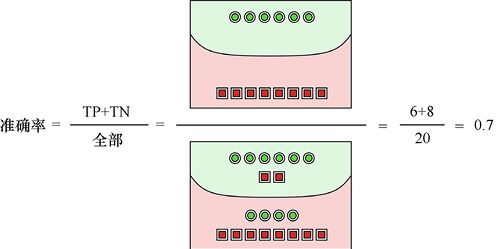

> **圖片描述：** 此圖展示準確率的計算公式與過程。準確率=(TP+TN)/全部=(6+8)/20=0.7。上方展示正確分類的6個綠圈和8個紅方塊，下方展示錯誤分類的2個紅方塊和4個綠圈。

圖3.23　準確率是一個0和1之間的數字，用於表示正確預測的頻率。我們可以透過創建一個分數來找到它。分子是被正確分類的點的個數，而分母則是點的總數。在這裡，20個點中有6個圓圈和8個方塊被正確地分類，所以準確率是14/20（或者說0.7）

為了更好地控制預測的質量，讓我們來看一看另外兩種方法。

### 3.7.6　精度

**精度**（也稱為**陽性預測值**，或PPV）可以告訴我們：樣本中被正確地標記為“陽性”的樣本數量佔總的“陽性”的樣本數量的百分比。從數字上看，它是TP相對於TP+FP的值。換句話說，**精度告訴我們有多少被預測為“陽性”的樣本真的是“陽性”的***。*

如果精度為1.0，那麼由我們預測標記為“陽性”的每個樣本實際都為“陽性”。隨著百分比的下降，我們對預測的信心也隨之下降。例如，如果精度是0.8，我們就只能有80%的信心確定被預測為“陽性”的樣本實際上為“陽性”。圖3.24直觀地展示了這個想法。

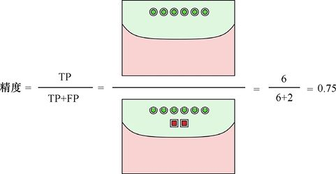

> **圖片描述：** 此圖展示精度（Precision）的計算：精度=TP/(TP+FP)=6/8=0.75。上方為6個正確標記為陽性的綠色圓圈，下方為2個錯誤標記為陽性的紅色方塊。

圖3.24　精度的值是指“真陽性”的樣本總數與我們標記為“陽性”的樣本總數的商。在這裡，我們有6個圓圈被正確地標記為“陽性”，而兩個方塊被錯誤地標記為“陽性”，因此精度為0.75（或者說6/8）

精度小於1.0意味著我們將一些樣品錯誤地標記為“陽性”。如果回到之前的醫療案例中，精度小於1.0就意味著我們要去做一些不必要的手術。

精度的一個重要的特點就是：它不能告訴我們是否真的找到了所有“陽性”的對象，即所有患有MP的人。精度忽略了被標記為“陰性”的“陽性”的對象。

我們可以用A類和B類這樣更加通用的術語來表述。那麼精度小於1.0則告訴我們那些被預測為A類但實際上是B類樣本的比例。如圖3.25所示，標記為A和B的兩個團是由真正在這兩類中的樣本組成的，而對角分割線表示了我們將樣本預測為A類還是B類。

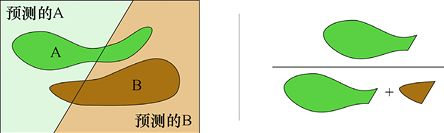

> **圖片描述：** 此圖展示精度的通用說明。以A類和B類標記兩組樣本，對角線代表分類邊界。精度是「被正確標記為A類的元素數量」與「被標記為A類的元素總數」的比值。

圖3.25　精度是指“被正確標記為屬於A類的元素數量”與“被標記為A類的元素總數”的比值

### 3.7.7　召回率

第三個衡量標準是**召回率**（recall），也稱為**靈敏度**（sensitivity）、**命中率**或**真陽性率**（true positive rate），它告訴我們被正確預測為“陽性”的樣本的百分比。

召回率是1.0表示我們發現了所有“陽性”的樣本。召回率越小，表示我們錯過的“陽性”樣本越多，如圖3.26所示。

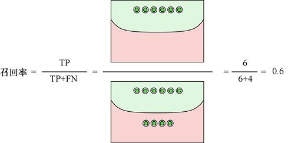

> **圖片描述：** 此圖展示召回率（Recall）的計算：召回率=TP/(TP+FN)=6/10=0.6。上方為6個正確標記為陽性的綠圈，下方為4個被錯誤標記為陰性的綠圈（漏掉的陽性樣本）。

圖3.26　召回率是指被正確標記為“陽性”樣本的總數與應該被標記為“陽性”的樣本總數的商。這裡有6個正確標記的圓圈，但我們錯誤地把4個“陽性”樣本標記為“陰性”，所以召回率為0.6（或者說6/10）

我們也可以用A、B類的方式來考慮這個問題，如圖3.27所示。

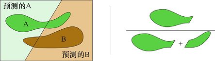

> **圖片描述：** 此圖展示召回率的通用說明。以A類和B類標記兩組樣本，召回率是「被標記為A類的元素數量」除以「實際為A類的元素數量」。

圖3.27　召回率表明了我們對A類樣本進行預測的結果好壞。它是一個比值，是由被我們標記為A類的元素數量除以實際為A類的元素數量得到的

當召回率小於1.0時，就意味著我們漏掉了一些實際為“陽性”的樣本。如果是前面所述的醫療案例，這就意味著我們會將一些已經被感染的MP患者誤診為未患病，導致即使那些人正處於危險之中，我們也不會給這些人做手術。

### 3.7.8　關於精度和召回率

讓我們用一個具體的例子來看看精度和召回率。假設我們有一個包含500個頁面的內測版維基百科，然後對短語“犬隻訓練”進行搜索。

假設搜索引擎返回的每一個關於“犬隻訓練”的頁面都是真的與“犬隻訓練”相關的，就稱這個結果是“陽性”的。從某種意義上來說，這是我們想看到的。而每個不應該返回的頁面都是“陰性”的，因為我們不想看到它。圖3.28為按頁面相關度劃分的4類結果，以及我們給出的“真/假”與“陽性/陰性”組合的4類結果。

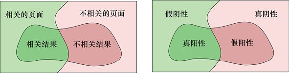

> **圖片描述：** 此圖包含兩個子圖(a)(b)。(a)展示搜尋結果頁面的四個區域：相關的頁面和不相關的頁面，以及搜尋引擎返回的相關結果和不相關結果。(b)將相同概念映射到混淆矩陣：真陽性、假陽性、假陰性、真陰性。

(a)　　　　　　　　　　　　　　　　　　　　　　　　　　　　　　　　　　　　　(b)

圖3.28　用返回的網頁搜索結果來描述我們的4個類別。中間圈出的區域是搜索的結果。(a)可以看到，在維基百科中有與“犬隻訓練”相關的和不相關的頁面，並會在搜索中得到每種頁面中的一些結果，其他的則被遺漏。(b)展示了這4個類別是如何與真、假、陽性和陰性的組合相對應的

先介紹準確率，它是有著正確標籤的頁面相對於維基百科中頁面總數的比值。系統判定每個頁面是否相關越精準，準確率就越能夠接近1.0，如圖3.29所示。

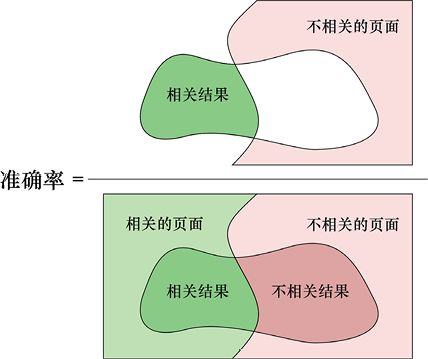

> **圖片描述：** 此圖展示搜尋引擎的精度與召回率計算範例。在500頁面中搜尋「犬隻訓練」，展示了如何從混淆矩陣中計算精度和召回率。

圖3.29　準確率是指系統正確判斷出的與搜索詞相關或不相關的頁面數量與維基百科中頁面總數的比值

接下來介紹精度。在這種情況下，精度是指搜索結果中與“犬隻訓練”相關的結果數量與總的搜索結果數量的比值，如圖3.30所示。搜索引擎的精度越高，得到的相關搜索（真陽性）就越多。如果搜索引擎的精度低，就會得到很多不相關的結果（假陽性）。

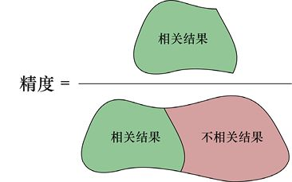

> **圖片描述：** 此圖展示兩個假設性搜尋引擎的精度和召回率比較。每個引擎都有不同的精度-召回率組合，說明兩者之間通常存在取捨關係。

圖3.30　精度是“得到的相關的結果的數量”與“得到的所有結果的數量”的比值

最後來看召回率，看完我們就會明白這個看似奇怪的名字的意義。在這種情況下，召回率是“返回的相關結果的數量”與“整個資料庫中**應該**返回的全部結果的數量”的比值。也就是說，如果召回率是1.0，那麼系統將100%召回（或者說檢索出）它應該獲得的全部頁面。如果召回率是0.8，那麼系統將丟失20%它應有的頁面。那些被遺漏的頁面就是“假陰性”：系統將它們標記為“陰性”，並且沒有召回（或者說檢索出）它們，但這些頁面是應該被召回的，如圖3.31所示。

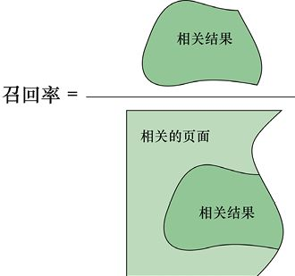

> **圖片描述：** 此圖展示F1分數的計算公式和範例。F1分數是精度和召回率的調和平均數：F1 = 2×精度×召回率/(精度+召回率)，用於平衡精度和召回率的單一度量。

圖3.31　召回率是“系統召回（或者說返回）的相關結果的數量”與“系統應該召回的結果總數量”之比

### 3.7.9　其他方法

我們已經知道了準確率、召回率和精度的衡量標準，而在討論機率和機器學習時，還會用到許多其他術語（見[Wikipedia16]）。除了接下來會討論的f1**分數**，其餘大多數術語在本書的其他地方都不會出現，但我們會對它們加以總結並給出一個“一站式”的參考，如表3.1所示。

不需要費心去記憶任何不熟悉的術語及其含義，這張表的目的只是在你需要的時候提供一個能夠方便查找這些東西的途徑。

這張表理解起來有些複雜，我們提供了另一種圖形化的展示方法，使用的是我們在圖3.17中的樣本分佈，如圖3.32所示。

表3.1　混淆矩陣中常見的術語

        |

名稱

        |

別名

        |

簡寫

        |

定義

        |

解釋

       |

        |

真陽性

        |

擊中

        |

TP

        |

標記為陽性的“陽性”樣本

        |

被正確標記的“陽性”樣本

       |

        |

真陰性

        |

拒絕

        |

TN

        |

標記為陰性的“陰性”樣本

        |

被正確標記的“陰性”樣本

       |

        |

假陽性

        |

假警報，錯誤類型Ⅰ

        |

FP

        |

標記為陽性的“陰性”樣本

        |

被錯誤標記的“陰性”樣本

       |

        |

假陰性

        |

漏掉，錯誤類型Ⅱ

        |

FN

        |

標記為陰性的“陽性”樣本

        |

被錯誤標記的“陽性”樣本

       |

        |

召回率

        |

靈敏度，真陽性率

        |

TPR

        |

TP/(TP+FN)

        |

被正確標記的“陽性”樣本的百分比

       |

        |

特異性

        |

真陰性率

        |

SPC，TNR

        |

TN/(TN+FP)

        |

被正確標記的“陰性”樣本的百分比

       |

        |

精度

        |

陽性預測值

        |

PPV

        |

TP/(TP+FP)

        |

被標記為“陽性”實際也為“陽性”的樣本的百分比

       |

        |

陰性預測值

        |

NPV

        |

TN/(TN+FN)

        |

被標記為“陰性”實際也為“陰性”的樣本的百分比

       |

        |

假陰性率

        |

FNR

        |

FN/(TP+FN) =1−TPR

        |

被錯誤標記的“陽性”樣本的百分比

       |

        |

假陽性率

        |

誤檢率

        |

FPR

        |

FP/(FP+TN) =1−SPC

        |

被錯誤標記的“陰性”樣本的百分比

       |

        |

錯誤發現率

        |

FDR

        |

FP/(TP+FP) =1−PPV

        |

實際為“陰性”但是被標記為“陽性”的樣本的百分比

       |

        |

正確發現率

        |

TDR

        |

FN/(TN+FN) =1−NPV

        |

實際為“陽性”但是被標記為“陰性”的樣本的百分比

       |

        |

準確率

        |

ACC

        |

(TP+TN)/(TP+TN+FP+FN)

        |

被正確標記的樣本百分比

       |

        |

f1分數

        |

f1

        |

(2*TP)/((2*TP) +FP+FN)

        |

當錯誤減少時，f1會接近1

       |

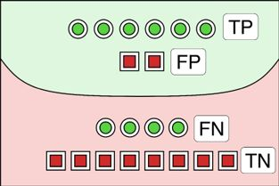

> **圖片描述：** 此圖展示靈敏度（召回率）與特異度（真陰性率）之間的關係，以及ROC曲線的基本概念。

圖3.32　圖3.17中的資料分為真陽性（TP）、假陽性（FP）、假陰性（FN）和真陰性（TN）4個類別

從上至下看圖3.32，有6個“陽性”樣本被標記正確（TP=6），2個“陰性”樣本被標記錯誤（FP=2），4個“陽性”樣本被標記錯誤（FN=4），8個“陰性”樣本被標記正確（TN=8）。

有了這些點，我們就可以用不同的方式去組合這4個數字（或者說它們的圖）來解釋表3.1中的各種度量方法。圖3.33展示了我們是如何使用相關的資料片段來計算出各種度量的。

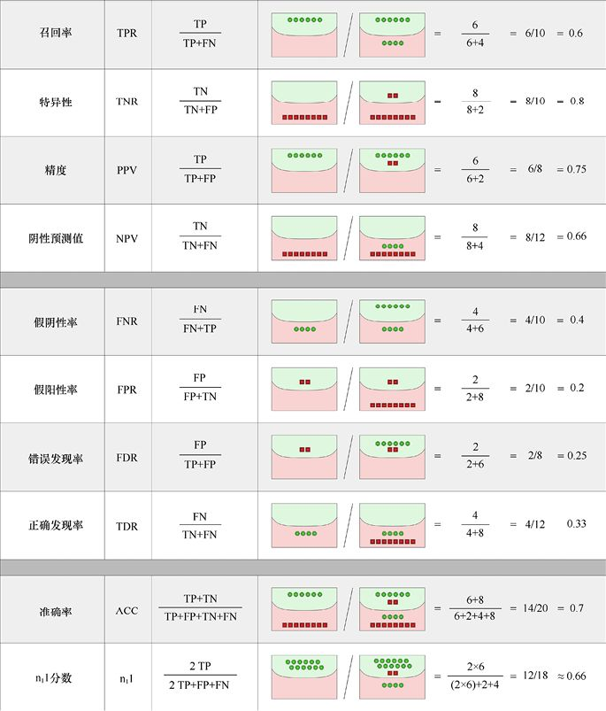

> **圖片描述：** 此圖展示ROC曲線的示意圖，橫軸為假陽性率（1-特異度），縱軸為真陽性率（靈敏度/召回率）。曲線越靠近左上角，分類器的性能越好。

圖3.33　我們用圖3.32中的資料將表3.1中的統計度量方法以可視化的形式展現出來

### 3.7.10　同時使用精度和召回率

準確率是一種常見的度量方法，但在機器學習中，精度和召回率出現得更頻繁，因為它們更有助於描述分類器的性能，並以此去與其他分類器進行比較。但是，如果單獨考慮它們其中的一個，精度和召回率就都可能會產生誤導，因為極端條件可以單獨給予精度或召回率一個完美的值，但整體表現非常糟糕。

為了瞭解這一點，我們重新討論一下兩種極端情況：**完美精度**和**完美召回率**。

有一種方法可以創建具有完美精度的邊界曲線，那就是檢查所有樣本，然後找到最肯定為“真”的那一個並畫出曲線，這樣所選擇的點就是唯一的“陽性”樣本，而其他的都是“陰性”樣本，如圖3.34所示。

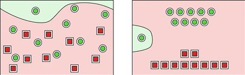

> **圖片描述：** 此圖包含兩個子圖，展示兩個不同分類器的分類結果。左圖展示一個分類器的分界線和樣本分佈，右圖展示另一個分類器的結果，說明不同分類器可能有不同的精度-召回率組合。

(a)　　　　　　　　　　　　　　　　　　　　　　　 (b)

圖3.34　(a)這條邊界曲線為這次分類提供了一個完美的精度。可以注意到，所有方塊都被正確地分類為“陰性”樣本，但是隻有一個圓圈被正確地分類為“陽性”樣本，而其他9個圓圈都被錯誤地分類為“陰性”樣本。(b)(a)的示意圖

這樣的分類是怎麼提供完美精度的呢？記住，精度是指真陽性樣本的數量（這裡只有1個）除以被標記為“陽性”的樣本的數量（同樣是1個），所以得到的分數是1/1（或者說是1），這是一個“完美”的結果。但是它的準確率和召回率都很糟糕，如圖3.35所示。

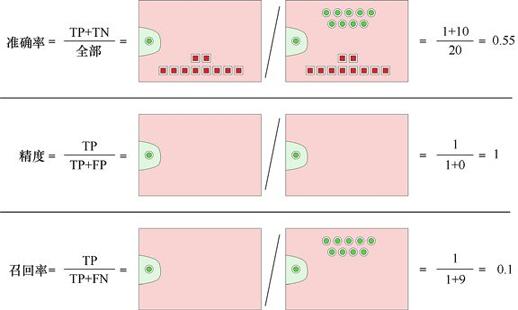

> **圖片描述：** 此圖展示ROC曲線分析的進一步說明，展示曲線下面積（AUC）的概念，AUC越大代表分類器整體性能越好。

圖3.35　這些結果都有一條相同的邊界曲線，這條曲線把一個圓圈分類為“陽性”，把其他的都分類為“陰性”。由於精度的定義，這樣的劃分使得我們獲得了完美的精度1，但準確率是0.55，召回率則是0.1，這兩種評估方式的結果都很糟糕

我們對召回率使用同樣的方法。創建一條有著完美召回率的邊界曲線更加容易，我們要做的就是給每件事都貼上“陽性”的標籤，如圖3.36所示。

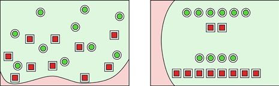

> **圖片描述：** 此圖展示多個分類器的ROC曲線比較，說明如何透過比較不同曲線的AUC來選擇最佳分類器。

(a)　　　　　　　　　　　　　　　　　　　　　　　　　 (b)

圖3.36　(a)這條邊界曲線為這次分類提供了一個完美召回率。需要注意的是，10個圓圈全部被正確地分類為“陽性”，但10個方塊也全部被錯誤地分類為“陽性”。(b)(a)的示意圖

這樣做讓我們獲得了完美的召回率。因為召回率是指被正確分類為“陽性”樣本的數量（這裡是10個）除以“陽性”樣本總數（同樣也是10個），所以10/10是1，得到了完美的召回率。而這種情況下的準確率和精度都很差，如圖3.37所示。

### 3.7.11　f1分數

同時觀察精度和召回率是很有幫助的，但在結合一些數學知識後，我們可以形成單一的衡量標準，即f1**分數**（f1 score）。這是一種特殊類型的“平均”，我們稱之為**調和平均數**。它為我們展示了一個結合精度和召回率的單一數字（公式出現在圖3.32和圖3.34的最後幾行）。

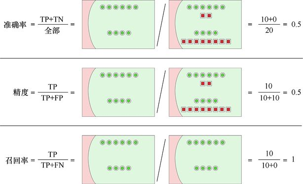

> **圖片描述：** 此圖展示ROC曲線上的特定操作點和對應的混淆矩陣，說明如何根據實際需求選擇適當的閾值。

圖3.37　這些結果都有一個相同的邊界曲線，這個曲線將所有樣本都分類為“陽性”。因為每個“陽性”樣本都被正確分類了，所以我們獲得了完美的召回率。然而，最終得到的準確率和精度都非常差

一般來說，當精度或召回率較低時，f1分數也會較低，而當兩項指標都接近1時，f1分數才會接近1，如圖3.38所示。

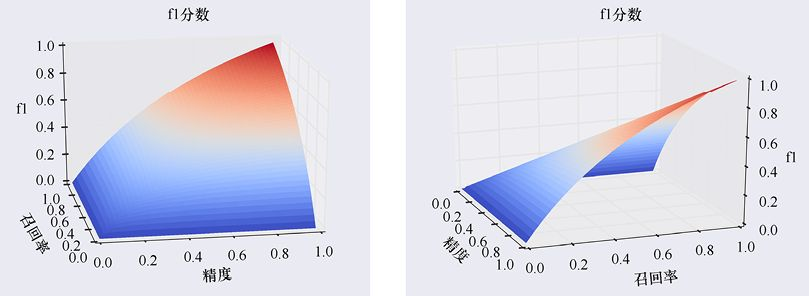

> **圖片描述：** 此圖展示不同閾值設定下分類器性能的變化，包括精度、召回率和F1分數如何隨閾值變化。

圖3.38　當精度或召回率為0時，f1分數為0；而當兩者均為1時，f1分數為1。在這兩個狀態之間，隨著兩種衡量標準的值的增加，f1分數會慢慢上升

## 3.8　混淆矩陣的應用

回到MP疾病的例子，在混淆矩陣中加入一些數字，並就這些數字對快速但不準確的血液測試的質量水平提出一些問題。回想之前說過的，我們會同時用緩慢但準確的測試（可以為我們提供**基礎真值**）和快速但不準確的血液測試來為鎮上的每個人做檢測。

檢測結果顯示血液測試似乎有很高的召回率。我們發現99%的情況下，MP患者都可以被正確診斷。因為召回率（TPR）是0.99，所以假陰性率（FNR）是0.01，其中包含了我們**沒有**正確診斷出的MP患者。

對於那些未患有MP的人來說，這個測試的效果有一點差。特異性（TNR）是0.98，也就是說，如果我們診斷出100個人未患有MP，那麼其中就有98個人真的未患病，這意味著假陽性率（FPR）是0.02，也就是說，其中會有2人被誤診為患有MP。

假設我們剛剛聽說，在一個有10 000人的新城鎮暴發了一場疑似MP的疫情。根據以往資料，我們預計有1%的人已經被感染。

**這是至關重要的資訊**。我們不是盲目地去測試每一個人，而是**已經知道**大多數人未患有MP，只有1/100的人患病。但是，即使只有一個人患病，那也是一條生命，所以我們要以最快的速度到達那裡。

到達鎮上後，我們讓每個人都到市政廳來進行測試。假設有一個人的測試結果出現“陽性”，他應該怎麼想？他又有多大的可能性真的患有MP？如果相反，有一個人的測試結果出現“陰性”，那他又有多大的可能性真的未患有MP？

我們可以透過構建一個混淆矩陣來回答這些問題。這時，如果我們掉進了陷阱，就可能會將上述的值直接放入相應的框中來構建混淆矩陣，如圖3.39所示。但這個矩陣是**不完整的**，這會使我們得到**錯誤的答案**。

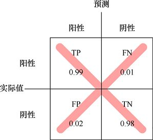

> **圖片描述：** 此圖展示一個理想分類器和一個隨機分類器的ROC曲線對比。理想分類器的曲線緊貼左上角，隨機分類器的曲線為對角線。

圖3.39　這**不是**我們要找的混淆矩陣，這個矩陣假設患有MP和未患有MP的機率各佔50%。我們知道事實並非如此，但這個圖忽略了“只有1%的人患病”這個已知資訊

這個矩陣存在的問題是忽略了我們上面提到的關鍵資訊：現在鎮上只有1%的人患有MP。圖3.39中的混淆矩陣假設患有和未患有MP的機會均等，而事實並非如此。

繪製正確的矩陣需要考慮鎮上的10 000人，然後根據我們對感染率和血液測試結果的瞭解來分析我們能夠透過測試得到什麼。

先粗略看一下圖3.40。我們從左邊開始，鎮上有10 000個人。最基本的已知資訊是：根據以往的經驗，每100個人中就有1個人（或者說1%的人）患有MP。這一點體現在圖上方的那條路徑上。我們劃分出了10 000人中的1%（或者說100人）患有MP，而血液測試會正確地診斷出其中的99個人患病、1個人未患病。看完這條路徑後，讓我們回到初始的人群，在下方的路徑上跟蹤另外99%的**沒有**被感染的人。透過血液測試將正確診斷出這9900人中的98%（即9702人）為陰性，而這9900人中將有2%的人（即198人）得到不正確的診斷結果——他們將被診斷為患有MP。

圖3.40告訴我們應該使用哪些值來填充混淆矩陣，因為這些值的計算是包含了我們已知的1%的感染率的。我們預計（平均）有99個真陽性、1個假陰性、9702個真陰性以及198個假陽性。透過這些值我們可以繪製出如圖3.41所示的正確的混淆矩陣。

現在我們有了正確的表格，可以回答下面的問題了。

假設某人的測試結果呈“陽性”，那麼他真的患有MP的機率是多少？也就是在已知測試結果呈“陽性”的情況下，一個人真的患有MP的條件機率是多少?

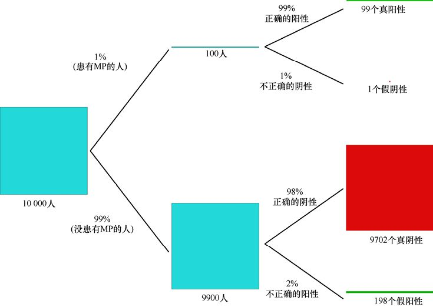

> **圖片描述：** 此圖展示提升度曲線（lift chart）的概念，說明分類器相對於隨機選擇的改善程度。

圖3.40　透過對感染率和測試結果的瞭解來計算得到我們預期的結果分佈

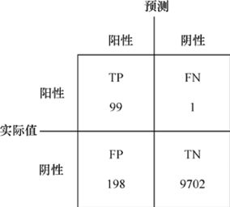

> **圖片描述：** 此圖展示累積增益曲線，橫軸為已檢查的樣本百分比，縱軸為已找到的陽性樣本百分比。

圖3.41　結合已知的1%的感染率，為血液測試繪製的正確的混淆矩陣。混淆矩陣中的值均來自圖3.40

換句話說，得到的陽性結果中有多少人是真正的患者？也就是TP/（TP+FP）的比值，我們看到的這個式子是精度的定義。

這種情況下，是99/（99+198）（或者說0.33、33%）。這說明測試有99%的機率正確診斷人們的患病情況。但是，當得出一個陽性結果時，這個人有2/3的機率**未**患病。換句話說，**大多數的陽性診斷結果都是錯誤的**。

之所以會得出這一令人驚訝的結果，是因為健康人口基數太大，而每個人都有一定的機率（很小的）被誤診為患病。這兩者合起來的結果就很驚人。

由此我們得到這樣的結論：如果有人的診斷結果為陽性，我們不應該立即採取行動。換言之，我們應該將這個結果看作一個做緩慢但準確的測試的信號。

讓我們用區域圖來看看這些數字。我們不得不改變區域的大小，以便能夠看清它們，並在圖3.42中對它們進行標記。

之前討論過，精度告訴我們診斷結果為“陽性”的人實際上真的患有MP的機率。圖3.42也說明了這一點。我們可以從精度中看到，血液測試錯誤地將198名未患有MP的人標記為陽性。雖然這只是鎮上10 000人中很小的一部分，但與僅有100人患了MP相比，這足以引起我們的重視，我們應該更加仔細地審視每一個陽性診斷。

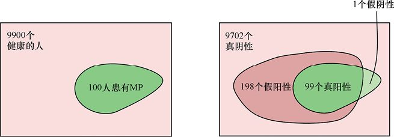

> **圖片描述：** 此圖展示多分類情況下的混淆矩陣擴展，從2x2矩陣擴展為更大的矩陣以處理多個類別。

(a)　　　　　　　　　　　　　　　　　　　　　　　　　　　　　　　　　　　　　　　　(b)

圖3.42　(a)所有人中有100人患有MP，9900人未患有MP。(b)測試結果。它幾乎正確地診斷了所有患有MP的人，但是也錯誤地將198個沒有患病的人診斷為“陽性”。注意：圖中的區域並沒有按照實際比例繪製

如果有人得到一個陰性結果，會發生什麼？能說明他們真的未患病嗎？TN/（TN+FN）的值可以說明這一點，我們稱之為陰性預測值。在這種情況下，陰性預測值的大小是9702/（9702+1），它大於0.999（或者說99.9%）。所以如果有人的診斷結果是“陰性”，血液測試就只有1/10 000的機率出錯（這個人患有MP）。

總而言之，一個陽性的診斷結果意味著某人確實患有MP的機率是33%，而陰性的診斷結果則意味著99.9%的機率某人未患有MP。

圖3.43還展示了一些其他的度量方法。召回率告訴我們被正確診斷為陽性的人佔實際為陽性的人的百分比。因為我們只漏掉了一個人，所以這個值是99%。而特異性告訴我們被正確診斷為陰性的人佔實際為陰性的人的百分比。因為我們只將1個人誤診為陰性，所以這個結果也非常接近1。

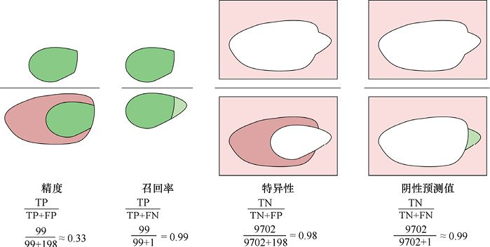

> **圖片描述：** 此圖展示多分類問題中的精度和召回率計算方式，包括微平均和巨集平均等不同計算策略。

圖3.43　根據圖3.42的結果，描繪出了4個與我們的血液測試相關的統計資料

因此，在10 000人中，我們只會漏掉1個MP病例，但會得到近200個誤診為陽性（即假陽性）的病例，這可能會讓人們陷入過度的恐慌和擔憂。有些人甚至可能立即去進行手術，而不去等待另一個更加漫長的測試。

MP疾病的例子是虛構的，但現實世界中充滿了人們基於錯誤的混淆矩陣或錯誤的問題來做出的決定，並且很多決定都與非常嚴重的健康問題有關。例如，因為外科醫生錯誤地理解了乳房檢查的結果，向病人提出了糟糕的諮詢建議（見[Levitin16]），導致許多女性做了不必要的乳房切除手術。男性也有類似的問題，許多醫生會因為對不斷升高的PSA水平（診斷前列腺癌的證據，見[Kirby11]）的統計資料存在誤解，而提出一些不好的建議。機率和統計學是微妙的，從始至終，我們都需要確保使用了正確的資料併合理地對這些資料進行解釋。

現在我們意識到，不應該被一些“99%準確率”甚至是“正確識別出99%的陽性病例”的測試所欺騙。在這個只有1%的人被感染的小鎮上，任何一個被診斷為陽性的人都很可能沒有真正感染這種疾病。

這意味著，從廣告到科學，任何情況下，統計資料都需要被密切關注，並且需要被放到應用環境中去理解。通常，像“精密”和“準確”這樣的術語的應用是非常口語化（或者說很隨意）的，這使得它們更難被理解。即使這些術語在技術場景中被使用，對準確率和其他相關度量方法的無力的解釋很容易誤導人們做出錯誤的決定。正如我們之前看到的那樣，可以透過測試只找到一個明顯患有MP的人，然後宣佈他是陽性的，而其他人都是陰性的，這樣我們就可以非常誠實地說測試有著100%的精度。圖3.44再次展示了這個想法。

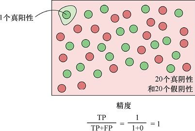

> **圖片描述：** 此圖展示一個極端的分類場景。左上角標出唯一的1個真陽性（綠色圓圈），右側大片粉色區域包含20個真陰性（紅色圓圈）和20個假陰性（綠色圓圈，即被漏診的患病者）。底部顯示精度計算公式：精度=TP/(TP+FP)=1/(1+0)=1，即100%精度，但這是一個極為誤導性的結果。

圖3.44　測試僅識別了一個明顯的患有MP的病例（左上角的綠色圓圈）並判斷它為陽性。而其他所有人都被歸為陰性，不管他們是患有MP（綠色圓圈）還是未患有MP（紅色圓圈）。這時，我們仍然可以誠實地說，測試有著100%的精度

## 參考資料

[Andale17]　Andale, *Marginal Distribution*, Statistics How To Blog, 2017.

[Jaynes03]　E. T. Jaynes, *Probability Theory: The Logic of Science*, Cambridge University Press, 2003.

[Kirby11]　Roger Kirby, *Small Gland, Big Problem*, Health Press, 2011

[Levitin16]　Daniel J. Levitin, *A Field Guide to Lies: Critical Thinking in the Information Age*, Dutton, 2016.

[MetService16]　Meteorological Service of New Zealand Ltd., *How to Read Weather Maps*, 2016.

[Walpole11]　Ronald E. Walpole, Raymond H. Myers, Sharon L. Myers, Keying E. Ye, *Probability and Statistics for Engineers and Scientists (9th Edition)*, Pearson, 2011.

[Wikipedia16]　Wikipedia, *Sensitivity and Specificity*, 2016.

