# 第4章　貝氏定理

這是一種讓我們能快速、準確地結合真實發生的事件和對事件的期望來思考機率的方法。

## 4.1　為什麼這一章出現在這裡

在第3章中，我們提到了一些有關機率的知識。在更深入地瞭解機率時，我們發現，涉及如何思考機率這一課題，有兩種最基本的思想派系。

一種是學校裡經常提到的方法，即**頻率論者**（frequentist）法則，這種方法有很多能憑藉常識理解的地方。另一種方法稱為**貝氏**（Bayesian）法則，這種方法雖然比較少見，但在機器學習領域中的應用範圍很廣。這有很多原因，其中最重要的一點就是它不僅能讓我們明確地判斷出應該如何思考正在研究的情境，也給了我們一種明確判斷出期望的方法。這意味著如果我們有理由相信一些關於過程或者結果的事情，就可以最大化地利用這些資訊，比我們原本更快地得到答案，或者得到更好的質量，甚至兩者皆可。

本章介紹貝氏機率論的基礎。它能夠讓我們對機器學習的論文以及關於貝氏理論的文獻有一個初步的認識。

這一領域的名字來源於一個重要的公式，稱為**貝氏規則**（Bayes’ Rule）或**貝氏定理**（Bayes’ Theorem）。這個定理最早是在20世紀70年代由托馬斯·貝氏（Thomas Bayes）提出的。這是一個範圍很廣的話題，我們只會涉及它的廣義形式（見[Kruschke14]）。

人們在日常生活中經常會用到貝氏機率論（或者是貝氏定理）。每當我們想要知道在基於一些特定資訊的情況下，對於確定某個感興趣的問題的答案有多少把握時，貝氏定理就是首選工具。

## 4.2　頻率論者法則以及貝氏法則

很多數學系統都只有一種常規的方法，例如，兩數相加只有一種方法。機率論則有所不同，因為它至少有兩種解決方法，這兩種方法各有優缺點。

很多人都比較熟悉**頻率論者**法則，因為我們一般學習的就是這種方法，而且也會在日常討論中用到。在本章中，我們會接觸**貝氏**法則。這種方法在機器學習領域應用比較廣泛，但一般不為人們所熟知。

頻率論者法則和貝氏法則的區別有很深的哲學根基，通常體現在用於建立各自機率理論的數學公式和邏輯上的細微不同（見[VanderPlas14]）。所以想要很詳細地概括它們的不同是一件很困難的事情。除此之外，描述這兩種機率論方法不同點的挑戰也被稱作“難以取捨”（見[Genovese04]）。

讓我們來看看這些哲學思想的大體區別，具體細節就不深究了。這可以幫助我們建立貝氏理論的基本框架，也是貝氏方法的基石。

### 4.2.1　頻率論者法則

一般來說，一個持有頻率論觀點的人（被稱作**頻率論者**）是不相信任何具體的測量或觀測的，因為它們只是真實、潛在數值的一種估計。例如，如果我們想要知道一座山的高度，頻率論者會假設每次測量都至少比真實值偏高或者偏低一點。這種態度的核心是相信真相永遠存在，並且任務就是找到真相。也就是說，山有一個確切的、完全真實的高度，如果我們做了足夠多的觀測且每次觀測都很認真，就能找到那個真實高度的數值。

想要找到這個真實高度的數值，頻率論者會結合很多次觀測的結果。雖然頻率論者會認為每次觀測結果都是不準確的，但他們也會將每次觀測的結果視為在真實值的附近，並且很接近真實值。所以如果觀測的次數很多，那麼出現最頻繁的數值最有可能是真實值。這種對於最常出現的數值的關注就是**頻率論**（frequentism）這個名字的由來。真實值是由很多次測量共同發現的，出現最頻繁的數值有最大的影響力。

### 4.2.2　貝氏法則

雖然大致的思路與頻率論者法則相似，但是貝氏法則相信測量的結果。相應地，遵循這種方法的人[被稱作**貝氏論者**]相信每一次觀測都是某樣事物準確測量的結果，雖然每一次都會有些不同。貝氏論者的觀點是，在過程的最後不存在一個等待去被發現的“真實的”數值。例如，每一次對於一座山高度的測量都描述了從地面上某一點到某個靠近山頂的點的距離，但每一次它們都不會是完全相同的點。所以即使每一次測量都和其他測量結果不一樣，每一個測量值也在某種程度上都是精確的。一座山有“真實”高度的觀點是毫無意義的。

相反，對於一件事情來說只有固定的幾種可能性，每種都有自己可能發生的機率。當觀測的次數越來越多時，這些可能性的範圍就會越來越小，但它們永遠不會消失。“真相”被認為是一種只能用機率來描述的模糊概念。這種方法的一個特點就是沒有“真實值”，如果測量出來的值一直都在變化，那麼貝氏方法的結果會自然地去適應這種變化。

### 4.2.3　討論

這兩種有關機率的方法引發了一個有趣的社會現象。一些嚴肅的機率學家相信只有頻率論方法才有可取之處，而認為貝氏方法完全是謬論；另一些人的想法則恰恰與此相反。很多人沒有這麼極端，但依舊有自己的偏好，會認為某種方法在思考機率學問題上相對來說更加“正確”一些。當然，很多人也會認為兩種方法在不同情況下都會有各自的優勢。

讓我們藉助一個例子用相對簡單的方式來比較兩個方法。

假設我們想要知道一支鈍鉛筆的長度，這支鉛筆末端還有一塊用過的橡皮擦，那麼我們會小心翼翼地將鉛筆與一把精確的直尺對齊，然後測量它的長度。當然，我們會重複很多次，可能最後會得到很多不同但很接近的數值。

對於頻率論者來說，鉛筆的長度只有一個確定的數值，任務就是找到這個數值。每一次測量都被認為是不可靠且有誤差的，可能由於讀數方法不合適或者對筆頭和筆末端的位置定義不同而產生一些偏差。結合所有測量值，我們就可以將誤差消除，使得某個數值中沒有誤差。最終，仔細地觀測這些測量值，出現最多的數值就最有可能是正確答案。

貝氏論者不會認為鉛筆的長度有一個完全精確的數值，而是認為可能會有幾個可能的數值，每個數值都有各自的機率。我們一開始相信測量值是唯一的，然後將測量出不同結果的現象解釋為在鉛筆的長度這一資料上始終存在不確定性。鉛筆頭的鈍角以及末端易脫落的橡皮擦都意味著鉛筆的長度並沒有一個確切的答案，只存在一個範圍，範圍中的每一個值都有自己的可信度。我們要做的就是用測量值來逐漸地改善每一個鉛筆長度值的機率。

頻率論方法和貝氏方法的區別大部分時候都很微妙，但它們確實引導了兩種不同的處理資料和得出資訊的方式。在處理現實生活中的資料時，我們對於如何思考機率的選擇很大程度上影響著我們可以問出或者回答哪種問題（見[Stark16]）。

## 4.3　拋硬幣

在討論機率時，人們喜歡以拋硬幣作為例子（見[Cthaeh16a]和[Cthaeh16b]）。這是一種常用的方法，因為它為所有人所熟知，而且每次拋硬幣只有兩種結果：正面或者反面。這就讓數學計算變得簡單，以至於我們一般都可以手動計算最後的結果。雖然我們不會在舉一些小例子前做任何數學計算，但拋硬幣依舊是一種觀察背後原理的極佳方法，所以我們會用它作為例子。

所謂“一枚**公平**（fair）的硬幣”，是指一枚拋出後正面朝上和背面朝上機率相等的硬幣，反之，則稱為“一枚不公平的硬幣”（即使它看起來、感覺上是公平的）。要描述一枚不公平硬幣，我們需要知道它正面朝上的機率，即它的**偏置**（bias）。一枚偏置為0.1的硬幣會有10%的機率正面朝上，一枚偏置為0.8的硬幣會有80%的機率正面朝上。如果一枚硬幣的偏置為0.5，那麼正面朝上和背面朝上的機率就是相等的，這樣它就是公平硬幣了。我們一般會將偏置為0.5的硬幣定義為公平硬幣。

圖4.1所示的就是3枚不同的硬幣，每一行表示一枚硬幣。每行中左側的圖代表連續拋100次硬幣後正面朝上的情況，每行中右側的圖是每次拋完硬幣後我們估計的硬幣的偏置，這個偏置是透過計算正面朝上的次數除以當前總拋擲次數得出的。

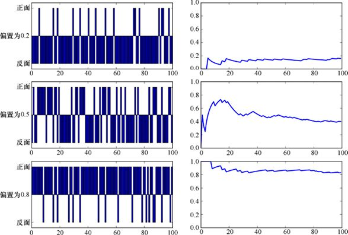

> **圖片描述：** 此圖展示三枚不同偏置硬幣各拋100次的結果。每行對應一枚硬幣，左側圖以豎線標示每次拋擲正面朝上的情況，右側圖為累計偏置估計值的變化曲線。第一行：偏置0.2的硬幣，估計值收斂到0.2附近。第二行：偏置0.5的公平硬幣，估計值收斂到0.5。第三行：偏置0.8的硬幣，估計值收斂到0.8。

圖4.1　一枚硬幣的偏置體現了它正面朝上的可能性。每行的圖都是一枚硬幣的實驗結果。左側圖顯示了連續拋100次硬幣後正面朝上的情況，右側圖是偏置的估計值。第一行：一枚偏置為0.2的硬幣。第二行：一枚偏置為0.5的硬幣。第三行：一枚偏置為0.8的硬幣

其中右側圖顯示的是頻率論者找到偏置的方法。讓我們再來看看貝氏論者會怎麼估算一枚硬幣的偏置。

## 4.4　這枚硬幣公平嗎

假設我們有一個朋友，她是一名深海考古學家。她的最新發現是一艘古代沉船。這艘沉船上有一個箱子，箱子中有一塊帶標記的板和兩枚看上去完全相同的硬幣。她認為這是一個遊戲，甚至和同事重新制訂了這個遊戲的一些規則。

遊戲的關鍵在於兩枚看上去相同的硬幣中只有一枚是公平硬幣。另一枚硬幣是不公平的且有2/3的機率會正面朝上（也就是偏置為2/3）。偏置為2/3和偏置為1/2的差距並不是很大，但足夠以此來構建一個遊戲。這枚不公平硬幣的設計十分巧妙，以至於僅看外表甚至拿起來觸摸它，都分辨不出哪枚硬幣是不公平的，哪枚是公平的。

這個遊戲需要玩家試著找到哪枚硬幣是不公平的，哪枚硬幣是公平的，期間可以用到虛張聲勢和打賭等方法。當遊戲結束時，玩家透過旋轉硬幣的方法找到答案。因為不公平硬幣的質量分佈不均勻，它會比公平硬幣更快地倒下。

考古學家想要更深入地探索這個遊戲，但需要知道硬幣的“真實身份”。她請我們幫忙分類。她給了我們兩個信封，上面標記有“公平”和“不公平”，我們的任務就是將對應的硬幣放到對應的信封裡去。

我們可以用剛剛提到的旋轉測試法來辨別兩枚硬幣，但我們打算用機率學的方法來做，這樣就可以得到一些用這種方法思考的經驗。

讓我們繼續第3章中提到的投擲飛鏢的例子。當時我們談到了利用向一片塗滿了各種顏色的牆投擲飛鏢的方法來估計每種顏色在牆上所佔面積的比例。

最簡單的方法就是先拿一枚硬幣，擲一次，看它是正面朝上還是反面朝上，然後思考可以從這個資訊中知道什麼。所以我們先選擇一枚硬幣。因為從外形上無法看出兩枚硬幣的區別，所以我們有50%的機率拿到一枚公平硬幣，也有50%的機率拿到一枚不公平硬幣。

這個選擇帶來了一個巨大的問題：我們現在拿到的是哪枚硬幣？一旦知道手上拿到的硬幣的類型，我們就可以將其放入對應的信封中，將另一枚硬幣放入另一個信封中。讓我們將問題用機率論的方式重新表達一下：我們拿到公平硬幣的可能性有多大？如果能確定拿到的是公平硬幣，或者確定拿到的是不公平硬幣，就能知道我們需要知道的所有事情。

所以我們有了這樣一個問題，也有了一枚硬幣，拋擲它。

結果是正面朝上。

用機率進行推理的好處在於，我們可以對我們所擁有的硬幣得出有效、量化的結論。

藉助之前向牆上投擲飛鏢的例子來列舉一下至今為止我們所做的事情。首先是挑選一枚硬幣，選到兩枚硬幣的機率都是50%，所以我們可以想象要在一面塗了兩種顏色且這兩種顏色面積相同的牆上投擲飛鏢（兩種顏色的區域之和必須全覆蓋牆，因為飛鏢總是能夠命中一個顏色的區域，這對應於我們總能選到一枚硬幣）。我們將用亞麻色（與褐色接近）來填充公平硬幣對應的區域，用紅色填充不公平硬幣對應的區域，如圖4.2所示。所以從兩枚硬幣中挑選一枚就對應著向牆上投擲一枚飛鏢並且落在了兩種顏色的區域中的一個。

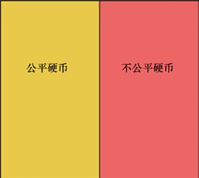

> **圖片描述：** 此圖展示一面被塗成兩種顏色的牆：左半邊為亞麻色（代表公平硬幣），右半邊為紅色（代表不公平硬幣），兩種顏色面積相同，表示各有50%的機率選到其中一種硬幣。

圖4.2　如果我們從兩枚硬幣中任意選擇一枚，這就和向一面塗了兩種顏色且兩種顏色面積相同的牆投擲飛鏢一樣，其中一種顏色的區域對應的是公平硬幣，另一種顏色的區域對應的是不公平硬幣

我們也可以用一種更具體的方法來給這面牆塗色。我們知道公平硬幣拋擲後正面和背面朝上的機率都是50%，所以我們可以將公平硬幣的區域再劃分為兩個面積相同的區域，一個代表正面朝上，一個代表背面朝上，如圖4.3所示。

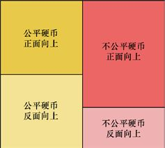

> **圖片描述：** 此圖在上一張圖的基礎上進一步細分。公平硬幣區域被均分為「正面朝上」和「背面朝上」兩部分（各佔50%）。不公平硬幣區域則按2/3和1/3的比例分為「正面朝上」和「背面朝上」。

圖4.3　我們可以將公平硬幣和不公平硬幣的區域細分為正面朝上和背面朝上，用已知的關於各自有多大可能性會是正面朝上的機率這一資訊

在圖4.3中，我們也劃分了不公平硬幣對應的區域。因為我們從考古學家那裡知道了這枚不公平硬幣有2/3的機率會是正面朝上，所以就給正面朝上劃分2/3的面積，而給背面朝上劃分1/3的面積。

圖4.3概括了我們知道的所有關於這個系統的資訊。我們可以得知選到每種硬幣的機率，也可以得知在每種情況下正面朝上和背面朝上的機率（對應於每片大區域里正面朝上區域和背面朝上區域的相對大小）。

如果我們向圖4.3所示的牆投擲飛鏢來模擬第一次拋硬幣，因為已經知道第一次拋硬幣的結果是正面朝上，所以我們知道硬幣要麼落在“公平，正面朝上”區域內，要麼落在“不公平，正面朝上”區域內。引號內的逗號表示兩種情況都發生。

我們的問題是：選到公平硬幣的機率是多少？我們可以用拋硬幣的結果是正面朝上這一資訊將這個問題變得更具體。我們一會兒就會知道這個問題的最佳表達方式是“事件1在事件2發生的情況下發生的機率是多少”這種形式。在這裡，問題就成了“如果一枚硬幣拋一次的結果是正面朝上，那麼這枚硬幣是公平硬幣的機率是多少”。

我們可以用圖示法來表達。其中這個機率是“公平，正面朝上”這一區域的面積與所有正面朝上的面積（即“公平，正面朝上”“不公平，正面朝上”這兩個區域的面積和）的比值，如圖4.4所示。

讓我們思考一下，因為“不公平，正面朝上”區域的面積大於“公平，正面朝上”區域的面積，所以如果硬幣正面朝上，那麼它更有可能是落在不公平硬幣所對應的區域內。換句話說，現在我們看到了硬幣拋一次的結果是正面朝上，它就更有可能是不公平的。就像向牆上投擲飛鏢，相對於“公平，正面朝上”區域，飛鏢更有可能落在“不公平，正面朝上”區域。

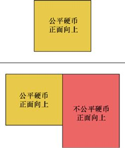

> **圖片描述：** 此圖展示P(F|H)的面積比計算方式。分子為「公平硬幣，正面朝上」的面積，分母為所有「正面朝上」區域的面積之和（包含公平和不公平硬幣的正面朝上區域）。

圖4.4　如果一枚硬幣拋一次的結果是正面朝上，那麼它是公平硬幣的機率有多少？這個機率應該是“公平，正面朝上”區域的面積除以“正面朝上”區域的所有面積得到的商

接下來我們討論“事件發生的方式”或者“所有會發生的可能性”。這意味著如果我們在研究某個性質是否正確，就需要考慮所有可以得到這個結果的可能發生的事件。應用到例子中，圖4.4中下面兩片區域就是得到正面朝上結果的所有可能性。換句話說，我們可能在公平硬幣上得到正面朝上的結果，也可能在不公平硬幣上得到，所以“所有得到正面朝上結果的可能性”就是將這兩種可能性結合起來。

讓我們用機率學術語重新解讀一下這幅圖。選到公平硬幣並且拋擲後正面朝上的機率是*P*(*H*,*F*)[或者*P*(*F*,*H*)]，選到不公平硬幣並且拋擲後正面朝上的機率是*P*(*H*,*R*)。

現在我們可以將圖4.4中的比例用機率的形式表示出來。這幅圖展示了在知道是正面朝上的情況下硬幣是公平硬幣的機率。這個機率就是*P*(*F*|*H*)，意思是“已知硬幣被拋擲一次後正面朝上的情況下，我們選到的是公平硬幣的機率”。這就是之前所提出的問題的答案，所以這個機率的數值也就是我們想要知道的東西，如圖4.5所示。

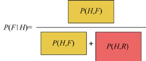

> **圖片描述：** 此圖以機率符號表示P(F|H)的計算公式。分子為P(H,F)即挑選到公平硬幣且正面朝上的聯合機率，分母為P(H,F)+P(H,R)即所有正面朝上的機率之和。

圖4.5　將圖4.4中的比例用機率的形式表示出來。這個機率的數值就是*P*(*F*|*H*)，即已知硬幣被拋擲一次後正面朝上的情況下，硬幣是公平硬幣的機率。為了節省空間，我們將圖縮小了一點

那我們可以透過代入數值得到一個具體的機率值嗎？當然可以，至少在這個例子中可以，因為這個例子的背景很簡單。但一般來說，我們並不知道任何聯合機率，想要知道它們的具體數值也很難。

但也不需要擔心，如第3章中所述的，我們可以將任意一個聯合機率用兩種不同但等價的方式寫出來。而另一個版本的表達式中的項一般會更容易代入數值。這裡重複一遍這兩種表示方法，如圖4.6和圖4.7所示。

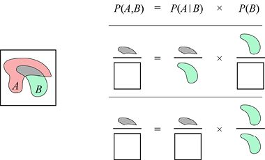

> **圖片描述：** 此圖展示聯合機率P(A,B)=P(A|B)P(B)的公式推導，透過面積圖示方式說明條件機率與邊際機率相乘可得聯合機率。

圖4.6　可以將兩個事件*A*和*B*的聯合機率寫成條件機率*P*(*A*|*B*)和事件*B*發生的機率即*P*(*B*)的乘積。這是第3章中圖3.11的另一個版本

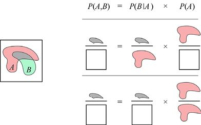

> **圖片描述：** 此圖展示聯合機率P(A,B)=P(B|A)P(A)的另一種等價表示形式，同樣以面積圖示方式說明。

圖4.7　可以將兩個事件*A*和*B*的聯合機率寫成條件機率*P*(*B*|*A*)和事件*A*發生的機率即*P*(*A*)的乘積。這是第3章中圖3.11的另一個版本

將圖4.5中有顏色的方框去掉，僅將公式提取出來，再把*P*(*H*,*F*)替換成圖4.7中的表示方法。這樣我們就能透過計算得到*P*(*H*,*F*)這一聯合機率，也就是挑選到公平硬幣且正面朝上的機率。這個機率就是*P*(*H*|*F*)（挑選到公平硬幣的情況下得到正面朝上的結果的機率）和*P*(*F*)（挑選到公平硬幣的機率）的乘積，如圖4.8所示。

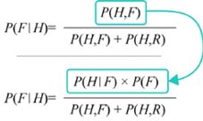

> **圖片描述：** 此圖展示用P(H|F)P(F)替換P(H,F)的推導過程。分子中的聯合機率被展開為條件機率與邊際機率的乘積形式，使公式中的各項更容易代入數值。

圖4.8　圖4.5中的比例代表了*P*(*F*|*H*)，也就是已知正面朝上時硬幣是公平硬幣的機率。因為我們不知道*P*(*H*,*F*)的值，所以可以用圖4.7中的公式，即用*P*(*H*|*F*)×*P*(*F*)來代替*P*(*H*,*F*)。這些數值一般都是已知的，或者是可以計算出來的

接下來再對分母上兩個聯合機率做相同的替換[其中一個又是*P*(*H*,*F*)]，如圖4.9所示。

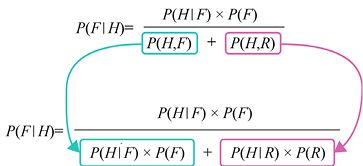

> **圖片描述：** 此圖展示P(F|H)公式中分母兩個聯合機率也進行展開後的完整公式。P(H,F)=P(H|F)P(F)，P(H,R)=P(H|R)P(R)，所有項均可直接代入數值計算。

圖4.9　可以對圖4.8中分母上的兩個聯合機率也做相同的替換。*P*(*H*,*F*)替換的結果與之前相同，*P*(*H*,*R*)用相同的方法替換也不難得到結果

在這個*P*(*F*|*H*)的表達式中，對於所有項，我們都可以透過計算得到具體的數值，所以用這種方法計算*P*(*F*|*H*)是很有效的。

用這個公式算出挑選到的是一枚公平硬幣的機率，需要用到圖4.9所示公式中所有項的數值。

*P*(*F*)是遊戲開始時我們挑選到公平硬幣的機率。因為我們是在兩枚硬幣中隨機挑選，所以*P*(*F*)=1/2。同理，*P*(*R*)的值也是1/2。

*P*(*H*|*F*)是由公平硬幣得到正面朝上的機率，*P*(*H*|*R*)則是由不公平硬幣得到正面朝上的機率。換句話說，這些數值也就是硬幣的偏置。*P*(*H*|*F*)是已知挑選到公平硬幣的情況下硬幣正面朝上的機率。根據定義，該值就是1/2。*P*(*H*|*R*)是由不公平硬幣得到正面朝上的機率，考古學家告訴我們這個機率就是2/3。

所以現在我們已經得到了所有需要用來計算*P*(*F*|*H*)這一機率的數值。圖4.10所示的就是將數值代入並計算出結果的過程。

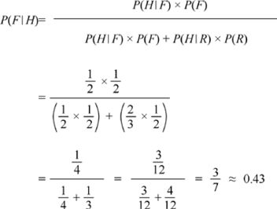

> **圖片描述：** 此圖展示P(F|H)的完整數值計算過程。代入P(F)=1/2、P(R)=1/2、P(H|F)=1/2、P(H|R)=2/3，最終計算結果為P(F|H)=3/7≈43%，即拋一次硬幣正面朝上後，挑選到公平硬幣的機率約43%。

圖4.10　計算已知正面朝上的情況下硬幣是公平硬幣的機率。選到公平硬幣的機率*P*(*F*)是1/2，選到不公平硬幣的機率*P*(*R*)也是1/2。從公平硬幣上得到正面朝上的機率*P*(*H*|*F*)，也就是它的偏置，是1/2。從考古學家那裡得知，不公平硬幣正面朝上的機率*P*(*H*|*R*)是2/3。所以將這些數值代入圖4.9中最後一行的公式中，就可以計算出選到一枚公平硬幣的機率大約是43%

計算結果是3/7，也就是大約43%。

這個結果有一點讓人驚訝。它告訴我們，在只拋了一次硬幣以後，我們就已經可以準確地知道只有43%的機率挑選到一枚公平硬幣，因此也就有57%的機率挑選到一枚不公平硬幣。僅從一次拋擲中就可以得到14%的差距。

那麼，假設第一次拋擲硬幣得到的結果是反面朝上呢？現在我們就想要知道*P*(*F*|*T*)，或者說是已知反面朝上的情況下挑選到公平硬幣的機率。

圖4.11所示的就是“公平，反面朝上”區域的面積和所有對應的“反面朝上”區域的面積（即“公平，反面朝上”“不公平，反面朝上”區域的面積和）的比值。

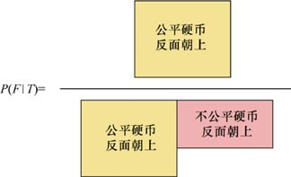

> **圖片描述：** 此圖展示當第一次拋擲結果為反面朝上時的面積比。分子為「公平硬幣，反面朝上」區域，分母為所有「反面朝上」區域之和。由於公平硬幣反面朝上的相對面積較大，預計P(F|T)會大於50%。

圖4.11　如果第一區域次拋硬幣的結果是反面朝上，那麼選到公平硬幣的機率是多少呢？答案是：“公平，反面朝上”區域對應的面積除以所有對應的“反面朝上”區域的面積（即“公平，反面朝上”“不公平， 反面朝上”區域的面積和）。因為如果選到的是公平硬幣，那麼更可能得到的結果是反面朝上，所以我們猜測得到公平硬幣的機率會大於50%

因為一枚硬幣的偏置就是它被拋一次得到正面朝上的機率，（1−偏置）得到的值就是拋一次硬幣得到反面朝上的機率（因為硬幣只可能正面朝上或者反面朝上）。

對於公平硬幣來說，反面朝上的機率*P*(*T*|*F*)是1−(1/2)=1/2。對於不公平硬幣來說，我們知道它的偏置是2/3，所以*P*(*T*|*R*)就是1−(2/3)=1/3。挑選到公平硬幣和不公平硬幣的機率，分別對應*P*(*F*)和*P*(*R*)，和之前一樣，都是1/2。所以我們就將這些數值代入，來計算*P*(*F*|*T*)，也就是已知反面朝上的情況下這枚硬幣是公平硬幣的機率。圖4.12為計算過程。

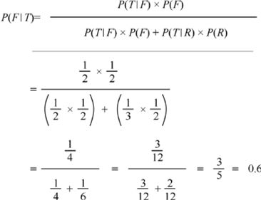

> **圖片描述：** 此圖展示P(F|T)的數值計算過程。代入P(T|F)=1/2、P(T|R)=1/3，最終結果P(F|T)=3/5=60%。若拋擲一次結果為反面朝上，有60%的機率是公平硬幣。

圖4.12　如果拋硬幣的結果是反面朝上呢？我們可以再用圖4.9中最後一行的公式，只是將*P*(*H*|*F*)和*P*(*H*|*R*)替換成反面朝上的“版本”。*P*(*T*|*F*)表示在公平硬幣上得到反面朝上的機率，即1/2。*P*(*T*|*R*)表示在不公平硬幣上得到反面朝上的機率，即1/3。最後的結果是*P*(*F*|*T*)，也就是已知反面朝上的情況下硬幣是公平硬幣的機率，即60%

這是一個更加戲劇化的答案，它告訴我們拋一次硬幣得到反面朝上這種結果可以推導出有60%的可能性挑選到一枚公平硬幣（因此40%的可能是不公平硬幣）。僅拋了一次硬幣就能有如此巨大的可信度！

注意到結果並不是對稱的。如果我們得到的結果是正面朝上，就有43%的機率挑選到公平硬幣；如果得到的結果是反面朝上，就有60%的機率挑選到公平硬幣。

可以看出，從一次拋擲的結果可以得到很多資訊，但即使是60%也和確定最後的結果相差很遠。再多做幾次拋擲能夠給我們更多的限制條件，在本章的後面我們會學習應該怎麼做。

### 4.4.1　貝氏定理

回到之前從第一次拋硬幣得到正面朝上的地方。

從圖4.5到圖4.10中，我們看到了好幾種表示*P*(*F*|*H*)即已知正面朝上的情況下挑選到公平硬幣的機率的方法。

回到圖4.8中的表示方式（圖4.13中重複了圖4.8中的第一行），我們注意到該式的分母［也就是*P*(*H*,*F*)+*P*(*H*,*R*)］是所有可能得到正面朝上的結果的機率（也就是挑選到公平硬幣或者不公平硬幣兩種情況下）。如果我們在處理有15種硬幣的情況，就需要寫出15個聯合機率的和，這會讓表達式變得非常複雜。所以我們一般會縮寫，將這些聯合機率的和簡寫成*P*(*H*)，也就是得到正面朝上的機率。這依舊意味著所有能得到正面朝上的情況的機率的和。所以如果我們有20種硬幣，*P*(*H*)就應該是每種硬幣得到正面朝上的機率的和。圖4.13所示的就是這種簡寫方式。

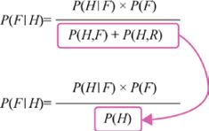

> **圖片描述：** 此圖展示將分母上的聯合機率之和簡寫為P(H)的過程。P(H)代表在任意硬幣上得到正面朝上的機率，是所有可能情況下正面朝上機率的總和。

圖4.13　根據圖4.8中的最後一行，我們將分母上兩個項的和用*P*(*H*)代替了。這表示在任意一種硬幣上得到正面朝上的機率，也就是每種硬幣得到正面朝上的機率的和。當有多重可能性的時候，這種寫法就會變得更加簡潔

圖4.14所示的就是最終推導出來的公式，這就是著名的貝氏定理。

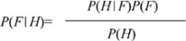

> **圖片描述：** 此圖展示貝氏定理的最終形式：P(F|H) = P(H|F)P(F) / P(H)。這就是著名的貝氏定理公式，分子為似然乘以先驗，分母為證據。

圖4.14　貝氏定理，即圖4.13中的最後一行。根據慣例，我們省略了分子上兩項中間的乘號，讓公式看起來更簡潔

換句話說，我們想要找到*P*(*F*|*H*)的值，即在已知第一次拋硬幣時看到正面朝上的情況下這枚硬幣是公平硬幣的機率。為了確定這個值，我們需要結合3個資訊。首先是*P*(*H*|*F*)，也就是已知得到的是公平硬幣且正面朝上的機率。將這個值乘以*P*(*F*)，也就是挑選到公平硬幣的機率。正如我們所看到的，這只是估計*P*(*H*,*F*)即硬幣是公平硬幣且正面朝上的機率的一種更方便的方式。我們在這裡展示的是貝氏定理的一種常規寫法，其中省略了乘號並且預設兩個連續寫在一起的項的意思就是將它們相乘。

接下來再將乘積除以*P*(*H*)（即硬幣正面朝上的機率）。其中需要考慮公平硬幣和不公平硬幣兩種情況，也就是在任意一種硬幣上得到正面朝上的結果的機率。

貝氏定理通常寫成圖4.14中的形式，因為它將需要計算的結果拆分成了幾個可以測量出來的部分（符號經常用更一般的*A*和*B*，而不是*F*和*H*）。我們所需要的就是每種選項發生的機率[這個例子中就是*P*(*F*)和*P*(*H*)]，以及每種選項的條件機率［即*P*(*H*|*F*)和*P*(*F*|*H*)］。我們只需要代入數值，就可以得到最後需要計算的結果，也就是已知正面朝上、挑選到公平硬幣的機率。記住*P*(*H*)代表的是聯合機率的和，如我們在圖4.13中所看到的那樣。

現在能夠知道為什麼我們在討論開始的時候說關於貝氏定理的問題（已知事件2發生了，那麼事件1發生的機率是多少？）需要用條件機率來表示了。因為貝氏定理計算出來的就是一個條件機率的值，這個問題也就是條件機率的定義。如果我們不能以這種形式來表達問題，那麼貝氏定理就不是用來回答這個問題的一個正確的工具。

### 4.4.2　貝氏定理的注意事項

貝氏定理看起來很難記住，因為裡面有很多字母，而且每個字母都需要在正確的位置。但其優勢是我們可以在任何時候重新推導出這個公式。

讓我們用兩種形式寫出*F*和*H*的聯合機率，也就是*P*(*F*,*H*)和*P*(*H*,*F*)。我們知道它們表示的意義是相同的：表示挑選到公平硬幣且正面朝上的機率。像之前一樣用展開形式進行替換，就會得到如圖4.15所示的公式。

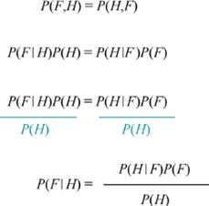

> **圖片描述：** 此圖展示如何快速推導貝氏定理。第一行寫出P(F,H)的兩種等價形式；第二行展開替換；第三行兩邊除以P(H)得到貝氏定理。

圖4.15　如果忘記了貝氏定理，這就是重新推導或者快速驗證它是否正確的方法。在第一行的等號兩邊寫上*F*和*H*聯合機率的兩種形式，然後用展開形式替換，得到第二行。在第三行，等號兩邊同時除以*P*(*H*)，也就得到了最後一行的貝氏定理

要得到貝氏定理，只需要兩邊同時除以*P*(*H*)。如果我們需要用到這個公式但忘記了它，可以用這個方法快速手動推導出來。

貝氏定理中的4項都有各自的慣用名，如圖4.16所示。

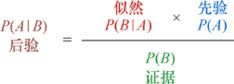

> **圖片描述：** 此圖展示貝氏定理中四個項的慣用名稱：P(A|B)為後驗機率、P(B|A)為似然、P(A)為先驗機率、P(B)為證據。使用通用字母A和B標記。

圖4.16　貝氏定理中的4項以及它們各自的名字。這裡用字母*A*和*B*來表示不同的事件

在圖4.16中，我們以常用的字母*A*和*B*來表示各種事件。在這些字母的表示環境下，*P*(*A*)是初始對於我們是否挑選到公平硬幣的預測。因為這是在拋完硬幣並觀測結果這一動作之前用來判斷“是否挑選到公平硬幣”的機率，所以我們將*P*(*A*)稱為**先驗機率**（prior probability or prior）。

*P*(*B*)表示的是得到所得到的結果的機率，在本例中就是硬幣正面朝上的機率。我們將*P*(*B*)稱為**證據**（evidence）。這個詞可能會有誤導性，因為有時候“證據”指的是在犯罪現場像指紋一類的東西。在本例的背景下，“證據”是指事件*B*以任何方式發生的機率。記住“證據”是我們可能挑選的每個硬幣正面朝上的機率的和。

條件機率*P*(*B*|*A*)表示的是假設挑選到公平硬幣，得到正面朝上的可能性。自然地，我們將*P*(*B*|*A*)稱為**似然**（likelihood）。

最後，貝氏定理的結果表示的是觀測到正面朝上的情況下挑選到公平硬幣的機率。因為*P*(*A*|*B*)是計算後得到的結果，所以它稱為**後驗機率**（posterior probability or posterior）。

在這裡，我們很輕易地得到了先驗機率的值，但是在更加複雜的情況下，挑選一個好的先驗可能會更加複雜。有時，它會結合經驗、資料、知識甚至對於先驗應該是什麼的直覺。因為我們的選擇會有一些個人的主觀因素，所以選出來的先驗稱為**主觀貝氏**（subjective Bayes）。有時，我們可以用一些規則或者演算法來選擇先驗，這樣就稱為**自動貝氏**（automatic Bayes）（見[Genovese04]）。

前文提到，貝氏方法的一個優點就是它可以明確地判斷出我們的預想和期望。這些都跟我們如何選取先驗有關。

## 4.5　生活中的貝氏定理

第3章介紹了用混淆矩陣來幫助我們更好地理解一個測試的結果。現在再來重新看一下這個概念，不過這一次是用貝氏定理。

假設你是特修斯星際飛船的艦長，正在執行一項“在浩瀚宇宙中尋找岩石資源豐富、無人棲息的星球，以採集稀有材料”的任務。你剛剛經過了一個有前景的、岩石資源豐富的星球。在該星球上採礦是很好的選擇，但你收到的任務是“永遠不能在有生命的星球上採礦”。所以一個很大的問題就是：這個星球上有沒有生命？

你的經驗是，這種星球上 10%會有某種生命，雖然一般都只是一些細菌，但生命終究是生命。

如協議中規定的那樣，你發送了一個探測器。探測器著陸後，返回的報告是“沒有生命”。

現在我們又有一個問題：已知探測器沒有探測到生命，但星球上依舊存在生命的機率是多少。

這個問題就最適合使用貝氏定理來解決。一個條件是（稱作*L*）“有生命存在”，正值表示星球上有生命，負值表示星球上沒有生命（這樣就可以開始採礦）。另一個條件是“是否探測到生命”，正值（返回陽性）表示探測器探測到了生命，負值則相反。

我們希望避免的情況是在一個有生命的星球上採礦。這是假陰性：探測器返回了陰性，但它不應該返回這個結果。這種情況就很糟糕，因為我們不想破壞或者影響任何非地球的生命體。

假陽性就沒有這麼糟糕。它的意思是我們會在一個什麼都沒有的星球上探測出生命並返回正值。唯一的後果就是我們無法在一個本可以採礦的星球上採礦了，最後造成的只有經濟損失，並不會影響其他星球的生命。

製造探測器的科學家也有同樣的擔憂，所以他們儘量最小化得到假陰性的機率。他們同時也儘量控制假陽性的機率，但沒有假陰性那麼嚴格。

探測器的測試表現如圖4.17所示。為了得到這個結果，科學家們將探測器發送到1000個已知的星球上，其中101個是有生命跡象的。探測器在1000次探測中正確地探測出了100個星球上的生命（也就是真陽性）。

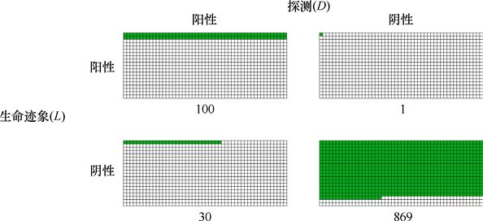

> **圖片描述：** 此圖展示探測器在1000個測試星球上的表現。以表格形式呈現：101個有生命的星球中，100個正確探測到生命（真陽性），1個被忽略（假陰性）；899個無生命的星球中，869個正確判定（真陰性），30個被誤報（假陽性）。

圖4.17　探測器在1000個測試星球（其中101個有生命跡象）上的表現。探測器正確地探測出了100個星球上的生命，但有1次忽略了生命的存在。在899個無生命的星球上，它正確地探測出了有869個星球上沒有生命，但錯誤地探測出了其中30個星球上有生命跡象

在101個有生命的星球中，探測器僅有1次忽略了生命跡象（假陰性）。在899個沒有生命的星球中，探測器正確地探測出了869個無生命跡象（真陰性）的星球。最後，它錯誤地在30個無生命的星球上探測出了有生命跡象（假陽性）。這些結果不算特別差。

用字母“*D*”來表示“探測到生命跡象”（探測器的結果），用字母“*L*”來表示“有生命存在”（星球上的真實情況），我們就可以對圖4.17中的結果進行總結，得到圖4.18中的混淆矩陣。對於邊際的機率值，“not-*D*”表示探測器“沒有生命跡象”的結果（也就是探測器沒有探測到生命跡象），“not-*L*”表示“沒有生命存在”（也就是星球上確實沒有生命）。

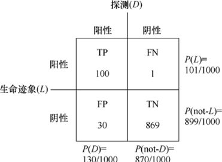

> **圖片描述：** 此圖展示探測器表現的混淆矩陣，包含TP=100、FN=1、FP=30、TN=869四個值，以及四個邊際機率。

圖4.18　總結了圖4.17中的結果的混淆矩陣，展示了探測器的表現。4個邊際機率值標在了右側和下側

圖4.19總結了4個邊際機率以及兩個我們將用到的條件機率。

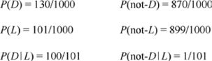

> **圖片描述：** 此圖列出六個關鍵的機率值：四個邊際機率P(D)、P(not-D)、P(L)、P(not-L)，以及兩個條件機率P(D|L)≈0.99和P(not-D|L)≈0.01。

圖4.19　基於圖4.18，4個邊際機率以及兩個我們將用到的條件機率的總結

想要知道*P*(*D*|*L*)，也就是已知星球上確實存在生命時，探測器探測到生命的機率。我們用探測器正確探測到生命的次數（100），除以存在生命的星球的數量（101），也就是TP/(TP+FN)，由此得到*P*(*D*/*L*)的值。在第3章中，這個值稱為召回率。結果是100/101，大約為0.99。

想要知道*P*(not-*D*|*L*)，我們用另一種方法進行計算。探測器在101個有生命的星球中忽略了一個，所以我們用FN/(TP+FN)進行計算。在第3章中我們將這稱為**假陰性率**（false negative rate）。結果是1/101，大約為0.01。

用第 3 章中的定義，我們還可以知道探測器的準確率（即969/1000=0.969）以及精度（即100/130，大約為0.77）。

現在我們可以回答之前的問題了。已知探測器沒有探測到生命時，星球上有生命的機率可以用*P*(*L*|not-*D*)來表示。可以用貝氏定理計算，將上述的數值代入並計算，如圖4.20所示。

因此，已知探測器沒有探測到生命時，星球上有生命的機率大概是1/1000。這已經有比較大的保證了，但如果我們想要更加確定，可以發送更多探測器。我們之後會看到，連續發送探測器會增加我們對於星球上是否有生命的確信度。

假設探測器返回了正值，也就是它探測到了生命。這對於我們將是一筆經濟損失，所以我們想要更加確信。那麼星球上確實存在生命的機率有多大呢？

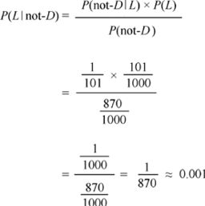

> **圖片描述：** 此圖展示計算P(L|not-D)的貝氏定理過程。代入各數值後得出：已知探測器沒有探測到生命時，星球上有生命的機率約為1/1000=0.001。

圖4.20　計算*P*(*L*|not-*D*)，也就是已知探測器沒有探測到生命時星球上有生命的機率。僅將圖4.19中的數值代入貝氏定理

為了知道這個，我們再次使用貝氏定理，但這次要計算的是*P*(*L*|*D*)，即已知探測器探測到生命時星球上確實有生命的機率。計算過程如圖4.21所示。

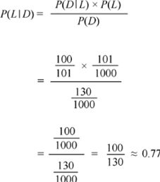

> **圖片描述：** 此圖展示計算P(L|D)的貝氏定理過程。代入各數值後得出：已知探測器探測到生命時，星球上確實有生命的機率約為77%。

圖4.21　計算*P*(*L*|*D*)，即已知探測器探測到生命時星球上確實有生命的機率。和之前一樣，就是將圖4.19中的數值代入貝氏定理

僅透過這一次探測，我們就有77%的信心相信星球上確實有生命。雖然這遠遠不及之前對於假陰性的確信度，但這只是因為探測器得到假陽性的機率比得到假陰性的機率要大。

就像之前提到的那樣，我們可以發送更多的探測器來增加某個結果的確信度。但不論用什麼方法，我們永遠無法有100%的確信度。我們可能會得到很接近0.0或者1.0的機率，但永遠無法到達這兩個數值。在某些時候，無論是第1個探測器的報告，或者是第10個、第10000個，我們需要做出一個決斷，是否需要繼續發送探測器。

下面來看發送更多探測器是如何幫助我們提高確信度的。

## 4.6　重複貝氏定理

在本章前面的部分中，我們知道了如何用貝氏定理來回答形如“已知事件2為真，那麼事件1為真的機率是多少”這樣的問題。我們將它作為一次性的時間來處理，將我們知道的關於這個系統的資訊代入，並返回一個機率。

但一次性事件遠遠不夠。回到一開始的兩枚硬幣的例子，其中一枚是公平硬幣，一枚是正面朝上的機率更大的不公平硬幣。我們拋擲硬幣，它正面朝上，透過這個結果計算出我們挑選到的是一枚公平硬幣的機率，然後結束預測。

事實上，我們可以繼續下去。在本節中，我們會將貝氏定理放到循環的中心部分。每一次新的資料都會給我們一個新的後驗機率，我們也就將它作為下一次觀測的先驗機率。隨著時間的推移，如果資料基本保持一致，那麼先驗就應該在我們想要的真實機率上慢慢改進。

### 4.6.1　後驗-先驗循環

在圖4.16中，我們給出了貝氏定理中4個表達式的慣用名。這些不是它們唯一的名字。我們有時候也用與**假設**（hypothesis）和**觀測**（observation）相關的語言來表示貝氏定理中的元素。假設就是某個事件是真的（例如，我們有一枚公平硬幣），觀測就是我們看到的關於系統的現象（例如，我們看到了硬幣正面朝上）。圖4.22所示的就是貝氏定理用這類語言的表示方式。

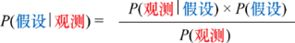

> **圖片描述：** 此圖以「假設」和「觀測」相關的語言重新標記貝氏定理中的各項。假設對應先驗，觀測對應證據和似然，結果為後驗。

圖4.22　用更具有資訊的標籤來表示貝氏定理

在拋擲硬幣的例子中，假設“我們挑選到了一枚公平硬幣”。我們做一次實驗並得到觀測結果，也就是“硬幣正面朝上”。結合先驗機率和已知假設情況下觀測結果的可能性，可以得到觀測和假設都正確的聯合機率。接下來，我們用事實（即觀測機率）來繼續調整它。得到的結果就是後驗機率，即告訴我們已知觀測的結果，假設為真的機率。

接下來就是重複使用貝氏定理的關鍵因素。我們知道後驗機率是已知觀測為真的情況下假設為真的機率。但我們已知觀測確實為真，由此才會計算這個後驗機率。所以這個後驗機率就是假設為真的機率。將這個變量與先驗進行比較，先驗是我們預估假設為真的機率。

簡單來說，基於我們的觀測，後驗是先驗的一個提升的版本。

假設現在有了另一個觀測（例如，我們再次拋擲了硬幣）。在這種情況下，我們會用前一次的後驗作為預測假設為真的機率，而不是用原始的先驗。

用基本的循環結構來概括，就是圖4.23所示的樣子。

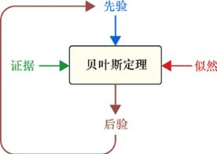

> **圖片描述：** 此圖展示貝氏定理的迭代循環流程。先驗與似然和證據結合，透過貝氏定理產生後驗；後驗再成為下一次觀測的新先驗，形成持續更新的循環過程。

圖4.23　每次有新的觀測值時，我們會結合證據，透過該觀測的先驗和似然來計算後驗。這個後驗在有新的觀測時就會被當作新的先驗進入循環

我們開始時有一個先驗。這個先驗源於分析、經驗、資料、演算法或者猜測。然後我們做一次觀測並開始循環。結合證據、該觀測的先驗和似然，代入貝氏定理，來計算後驗。這個後驗就會成為新的先驗。現在我們做了另一個觀測，重複該過程，只不過將先驗替換為前一個循環的後驗。

重點是每一次經過循環時，觀測是用來幫助我們計算後驗的，因為觀測的結果是真實發生的。這個後驗是先驗經過提升後的版本。它的資訊量更大，因為它將之前所有的觀測結果與最新的一次觀測結果相結合了。

讓我們看看這種循環在拋硬幣的例子上是如何運作的。

### 4.6.2　例子：挑到的是哪種硬幣

回憶一下我們的考古學家朋友以及她的兩枚硬幣的問題。讓我們先來概括一下，然後嘗試一些變形。

假設有一枚公平硬幣，這枚硬幣正面朝上和背面朝上的機率相等。與之前只有一枚不公平硬幣不同，現在我們假設有一組不公平硬幣。每一枚硬幣的**偏置**就是它正面朝上的機率，一般用小寫的希臘字母*θ*來表示。在每枚硬幣上面都用很小的標籤寫著硬幣的偏置，所以沒有未知性。

一枚偏置接近0的硬幣幾乎永遠不會正面朝上，一枚偏置接近1的硬幣幾乎每次都會正面朝上。

具體的操作過程是：挑選一枚不公平硬幣，識別出硬幣上標記的偏置（我們會記住這個偏置值），然後將標籤取下來。我們會將這枚硬幣放到一個包裡，再將另一枚外形一樣的公平硬幣放進去。然後我們會隨機從包裡取出一枚硬幣，取到每一枚硬幣的機率相等。

現在我們又回到了硬幣問題，只是對於不公平硬幣，現在可以挑選我們想要的合適的偏置了。

現在我們挑選出了一枚硬幣，我們想要知道這枚硬幣是不是公平硬幣。我們將用貝氏定理的重複形式，拋擲硬幣30次，記錄每次是正面朝上還是背面朝上，並記錄每次用貝氏定理計算得到的結果。

注意，因為只有30次拋擲，我們可以看到很異常的情況。例如，我們可能會在公平硬幣上得到25次正面朝上和5次背面朝上。雖然機率很低，但還是有可能發生。我們也可能在一枚偏置很大的硬幣上得到相同的結果。我們看看貝氏定理會如何處理這樣的觀測。

一開始，我們在公平硬幣和一枚偏置為0.2的不公平硬幣（預測10次拋擲中會有兩次正面朝上）中進行隨機挑選。假設在30次拋擲中，只有20%的機率（也就是6次）是正面朝上，另外24次都是背面朝上，那麼我們挑選到的是公平硬幣，還是不公平硬幣呢？

對於公平硬幣，我們期望在30次拋擲中有15次正面朝上；對於不公平硬幣，我們期望有6次正面朝上。如果得到6次正面朝上的結果，看起來就是我們挑選到了不公平硬幣。

圖4.24是每次拋擲後貝氏定理的計算結果。挑選到公平硬幣的機率用淺色表示，挑選到不公平硬幣的機率則用深色表示。兩個機率之和永遠為1。

要理解這幅圖告訴了我們什麼資訊，先看底部的標註。它們不是H就是T，表示每次拋擲得到的是正面朝上還是背面朝上。這裡有24次背面朝上（T），6次正面朝上（H）。

再看條塊，從最左側開始。這一列表示在還沒有拋硬幣時，我們覺得挑選到每一種硬幣的機率，因此都是0.5。因為挑選到兩種硬幣的可能性相同，所以沒有透過拋硬幣來得到任何資訊。

右邊的一列表示在拋擲一次硬幣並觀測到背面朝上後的結果。因為在公平硬幣上得到背面朝上的機率是0.5，而在不公平硬幣上得到背面朝上的機率是0.8，所以得到背面朝上的結果就相當於告訴我們更有可能挑選到一枚不公平硬幣。

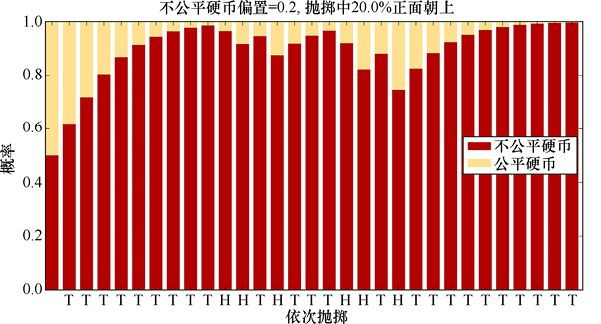

> **圖片描述：** 此圖展示一枚偏置0.2的不公平硬幣拋30次（6次正面、24次反面）後，使用重複貝氏定理計算挑選到公平硬幣的機率變化。淺色代表公平硬幣的機率，深色代表不公平硬幣的機率。隨著拋擲次數增加，不公平硬幣的機率迅速趨近1。

圖4.24　挑選到公平硬幣的機率是多少？這個機率在圖中用淺色表示，而挑選到不公平硬幣的機率用深色表示。30次拋擲的結果標註在圖的底部

繼續往右看，大約有80%的拋擲結果都是背面朝上。這是我們期望不公平硬幣所得到的結果，所以它的機率迅速地越來越接近1。注意，在2/3的拋擲過程中，選到不公平硬幣的機率都在上下襬動，因為有幾次我們連續得到了正面朝上的結果，而在連續得到背面朝上的結果後，機率再次升高。

在這個例子中，得到的資料與不公平硬幣的性質非常匹配。我們保留這枚硬幣，但假設在下一組拋擲中得到的正面朝上次數更少，總共只有3次，結果如圖4.25所示。

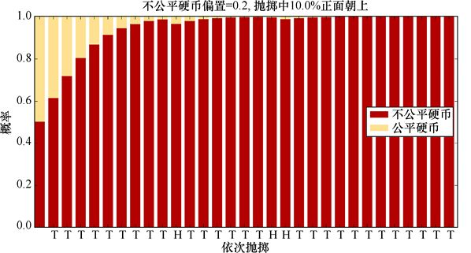

> **圖片描述：** 此圖展示同一枚偏置0.2的不公平硬幣拋30次，但僅有3次正面朝上的情況。由於結果更符合不公平硬幣的特性，僅在4次拋擲後就有90%的確信度認為是不公平硬幣。

圖4.25　用同一枚偏置為0.2的不公平硬幣進行拋擲，但這次只有3次拋擲的結果是正面朝上

僅在4次拋擲後，對於選到不公平硬幣，我們就有90%的確信度。

假設我們又拋擲了30次，但這次有24次正面朝上。對於兩枚硬幣來說，這個資料都不是很匹配。我們期望公平硬幣得到15次正面朝上但僅期望不公平硬幣得到6次正面朝上，所以看起來挑選到公平硬幣更有可能。貝氏定理的結果如圖4.26所示。

即使公平硬幣僅會有一半的次數是正面朝上，但不公平硬幣應該只有20%的次數是正面朝上。所以得到這麼多正面朝上的情況與任意一枚硬幣都不匹配，但與不公平硬幣更加不匹配，這增加了我們挑選到公平硬幣的確信度。

對於偏置為0.2的不公平硬幣，我們看到了3種正面朝上−背面朝上次數的組合，從幾乎全是背面朝上到幾乎全是正面朝上。我們再做一遍，不過這次我們會對10種不同偏置的硬幣用10種不同的組合做一遍。

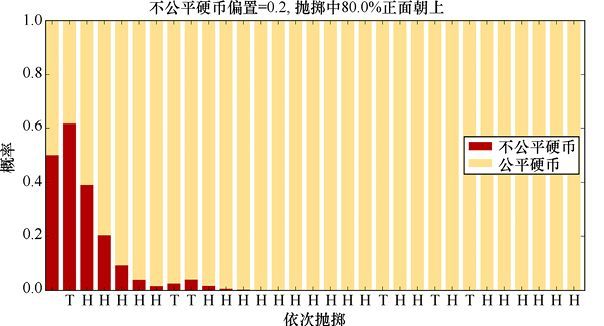

> **圖片描述：** 此圖展示同一枚偏置0.2的不公平硬幣拋30次，但有24次正面朝上的異常情況。雖然這與任何硬幣都不太匹配，但相比之下更有可能是公平硬幣，因此公平硬幣的機率逐漸上升。

圖4.26　用同一枚偏置為0.2的不公平硬幣進行拋擲，但這次有24次拋擲的結果是正面朝上

結果如圖4.27所示。從左下角開始看，其中橫軸（標記為“不公平硬幣的偏置值”）上的值大約是0.05。這意味著我們期望拋擲20次只得到一次正面朝上。縱軸（標記為“拋擲序列偏置”）上的值大約也是0.05。這意味著我們將像之前一樣人工構造一系列觀測結果，每次觀測都有1/20的機率是正面朝上。這裡，我們構造的30次拋擲硬幣的結果與不公平硬幣的期望值完全匹配，所以對於該枚硬幣是不公平硬幣的確信度（深色）上升得很快。

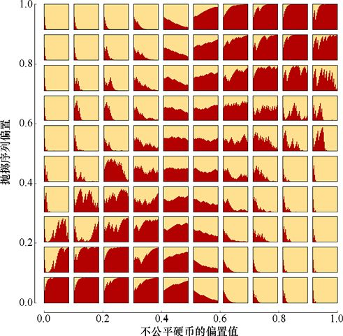

> **圖片描述：** 此圖為一個10x10的網格圖表，展示不同偏置的不公平硬幣（橫軸，0到1）與不同正面朝上比例（縱軸，0到1）的組合下，30次拋擲後公平硬幣（淺色）vs不公平硬幣（深色）機率的變化。中央區域（偏置接近0.5）最難分辨。

圖4.27　拋擲一枚硬幣30次，用重複貝氏定理來判斷手中的硬幣是否為公平硬幣。每一個方框都表示一組30次拋擲。硬幣是公平硬幣的機率用淺色表示，是不公平硬幣的機率則用深色表示。不公平硬幣的內在偏置從左到右從大約為0增加到大約為1。30次拋擲中正面朝上所佔的比例從下到上從大約為0增加到大約為1

讓我們往上移動3個單元。因為我們不是水平方向移動，橫軸的數值依舊是0.05，所以拋擲的有可能是一枚應該在20次拋擲中有1次正面朝上的硬幣。但現在縱軸上的數值大約是0.35，所以正面朝上的機率比之前增加了很多。

在得到這麼多正面朝上的情況下，相較於在不公平硬幣上得到了一組更加異常的序列而言，看起來更有可能是在公平硬幣上得到了一組非常規的序列。所以，隨著硬幣拋擲過程的繼續，我們對於硬幣是公平硬幣的確信度也逐漸增加了。

每個單元都可以用相同的方式來理解。我們構造了一系列30個正面朝上或者背面朝上的情況，其中這些情況的相對比例用縱軸上的數值表示，並想知道這種組合更有可能是公平硬幣，還是一枚偏置為橫軸上數值的不公平硬幣。

在網格的中間，橫縱軸上的數值都接近0.5，幾乎很難分辨。不公平硬幣和公平硬幣正面朝上的理論次數基本一樣，正面朝上和背面朝上也基本在30次拋擲中被均勻分配，所以我們有可能挑選到任意一枚硬幣，兩者機率都在0.5附近。但如果構造的組合有更少的正面朝上的情況（圖的下半部分）或者有更多的背面朝上的情況（圖的上半部分），我們就可以說這種組合與這枚硬幣偏置較低（圖的左半部分）或者偏置較高（圖的右半部分）匹配得很好。

30次拋擲已經比較能揭露事實了，但依舊有可能得到異常的序列（例如，在公平硬幣上得到25次正面朝上）。如果我們將每幅圖中的拋擲次數增加至1000次，那麼這種異常序列產生的機率就很低，規律也變得更加清晰，如圖4.28所示。

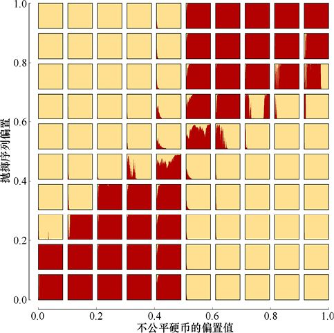

> **圖片描述：** 此圖與上一張類似，但將拋擲次數增加到1000次。規律更加清晰：左下角和右上角幾乎確定是不公平硬幣，左上角和右下角幾乎確定是公平硬幣，中間區域的不確定性也大幅減少。

圖4.28　與圖4.27類似，只是每個方框都表示要將硬幣拋擲1000次

由圖4.27和圖4.28可知，觀測得越多，對於假設的確信度也就越高。每次觀測都會增加或者降低確信度。當觀測結果與先驗（“我們挑選到的是公平硬幣”）匹配時，對於這個先驗的確信度就增加了。當觀測結果與這個先驗相悖時，確信度就會降低。因為在這個例子中其他選項只有一個，即“挑選到不公平硬幣”，所以這個事件的可能性就越來越高。即使只有幾個觀測，透過貝氏定理，結合觀測結果與假設是否相匹配，我們通常也可以很早得到較高的確信度。

## 4.7　多個假設

我們已經知道如何用貝氏定理結合觀測的結果來判斷假設是否為真，但並沒有規定我們只能有一個假設。

其實我們一直在做多個假設。例如，在上一部分中，我們的兩個假設就是“我們挑選到了公平硬幣”和“我們挑選到了不公平硬幣”，這兩個假設的確信度在拋硬幣的過程中同時都在更新。只是因為我們知道這兩個機率相加為1，所以只要知道其中一個，也就知道了另外一個。

但如果我們想，也可以明確地將兩個機率都用貝氏定理計算出來。這樣我們就會對“這是一枚公平硬幣”的機率有一個先驗，對“這是一枚不公平硬幣”的機率也有一個先驗。每次觀測的結果告訴我們是正面朝上還是背面朝上時，先計算“這是一枚公平硬幣”的後驗，然後將這個後驗作為該假設的新的先驗，再計算“這是一枚不公平硬幣”的後驗，然後也將這個後驗作為該假設的新的先驗。這一過程如圖4.29所示。

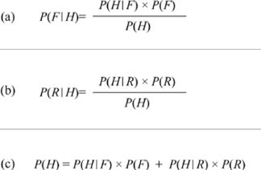

> **圖片描述：** 此圖包含三個子圖(a)(b)(c)，展示同時計算兩個假設的機率。(a)計算P(F|H)；(b)計算P(R|H)；(c)展示P(H)的計算作為分母，為所有硬幣正面朝上機率之和。

圖4.29　計算兩個假設的機率。(a)已知正面朝上，挑選到公平硬幣的機率；(b)已知正面朝上，挑選到不公平硬幣的機率；(c)得到正面朝上的機率（不論是哪種硬幣），也就是在每種硬幣上得到正面朝上的機率的和

由圖4.29可知，選到公平硬幣和選到不公平硬幣的機率就是硬幣正面朝上中的兩種情況。

透過這種方式，我們可以同時進行多個假設，對於每一次新的資訊都將所有假設更新一遍。

我們可以用這種方法再次幫助我們的考古學家朋友。她剛剛又找到了一個裝著遊戲盤和很多對硬幣的箱子。她知道每對硬幣中的一枚是公平的，另一枚是不公平的，但她懷疑這個箱子裡每對硬幣中的不公平硬幣的偏置都不相同。

因為一枚偏置很極端的硬幣（也就是正面朝上的機率比背面朝上的機率大很多，或者相反）比較容易分辨出來，所以考古學家朋友覺得可能有不同等級的玩家。新手會玩那些偏置比較極端的硬幣，但當他們越來越熟練了以後，就會換成偏置越來越接近0.5的硬幣。

她將所有找到的硬幣都給了我們，希望我們能算出每枚硬幣的偏置。我們假設這些硬幣中只有5種可能的偏置值：0、0.25、0.5、0.75和1。

為此我們會建立5個假設，用0～4標記這5個假設，以對應不同的偏置值。所以，假設0認為“這枚硬幣偏置是0”，假設1認為“這枚硬幣偏置是0.25”，以此類推，直到假設4認為“這枚硬幣偏置是1”。

現在我們需要對每個假設設置一個先驗機率。之前提到，這個先驗機率在每次經過循環時都會更新，所以我們只需要一個起始的猜測。因為我們不知道選到的是哪一枚硬幣，就認為選到每枚硬幣的機率相同，所以5個先驗機率都是1/5，也就是0.2。

當得到後驗機率時，我們需要以這個後驗機率作為新一輪的先驗機率。保證這些值不要成為極大或者極小值的優選方法是確保它們一直都能成為一個機率質量函數或者pmf（見第3章）。在我們的假設下，所有先驗機率之和應該是1。基於貝氏定理，如果先驗機率都是機率質量函數，那麼後驗機率也都會是機率質量函數，所以循環一旦正常開始，系統就會自我維持。因為我們一開始的5個先驗機率都是1/5，而1/5×5=1，所以已經可以保證循環正常運行。

剩下的唯一一件事就是找到每枚硬幣的似然。但我們其實已經得到這些值，因為它們就是硬幣的偏置。也就是說，如果一枚硬幣的偏置是0.2，那麼它正面朝上的機率就是0.2，背面朝上的機率是0.8。

所以假設0（這枚硬幣偏置是0）認為得到正面朝上的機率是0，而得到背面朝上的機率是1。假設1（這枚硬幣偏置是0.25）認為得到正面朝上的機率是0.25，而得到背面朝上的機率是0.75，以此類推，如圖4.30所示。注意，似然不是機率質量函數，所以它們相加的結果不需要是1。

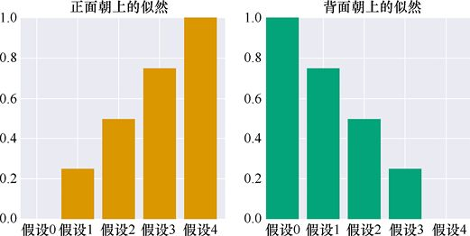

> **圖片描述：** 此圖展示5個假設（偏置分別為0、0.25、0.5、0.75、1）下，得到正面朝上和背面朝上的似然值。正面朝上的似然從0線性增加到1，背面朝上的似然從1線性減少到0。

圖4.30　5個假設中得到正面朝上和背面朝上的似然。得到正面朝上的似然是0～1，相應地，得到背面朝上的似然就是1～0

因為在我們拋擲硬幣、記錄觀測結果時，硬幣自身不會改變，似然也不會改變。所以我們會重複使用這些似然，每次都在得到新的觀測結果後用貝氏定理計算新的結果。

我們的目標是重複拋擲硬幣，觀察先驗機率的變化。為了知道在每次拋擲時發生了什麼，我們用淺色畫了5個先驗機率，用深色畫了5個後驗機率，如圖4.31所示。

在圖4.31中，我們畫出了在第一次拋擲硬幣後的結果，假設我們第一次觀測的結果是正面朝上。這5個淺色條塊（每個都代表了各自假設的先驗機率）都是0.2。因為硬幣正面朝上，我們將各自的先驗機率從左至右乘以圖4.30中對應的似然值，再除以5個得到正面朝上的機率的和，就得到了後驗機率（即貝氏定理的輸出，用深色條塊畫出）。

在圖4.31中，每一對條塊都表示了某個假設的先驗機率和後驗機率。現在我們已經排除了假設0，因為它認為硬幣永遠不可能正面朝上，而我們現在已經得到了一次正面朝上。

再多拋擲幾次，我們會生成一系列正面朝上和反面朝上的組合（大約有 30%是正面朝上），即這個拋擲序列對應的應該是偏置為0.3的硬幣。這5個假設中沒有一個完全與之匹配，但假設1與之最接近，它認為硬幣的偏置是0.25。讓我們看看貝氏定理的結果。

圖4.32中的前兩行是前10次拋擲後的結果，最後一行，每兩幅圖之間的步長較大。

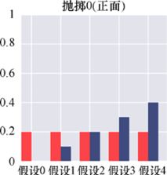

> **圖片描述：** 此圖展示測試5個假設的第一次拋擲結果。5個淺色條塊為先驗機率（均為0.2），結果為正面朝上後，深色條塊為後驗機率。假設0（偏置=0）的後驗降為0，其餘假設依似然值重新分配機率。

圖4.31　測試5個假設，每個假設分別認為硬幣的偏置是0、0.25、0.5、0.75和1。從先驗機率為0.2（淺色條塊）開始。經過一次拋擲硬幣，結果是正面朝上，我們計算出了各自的後驗機率（深色條塊）

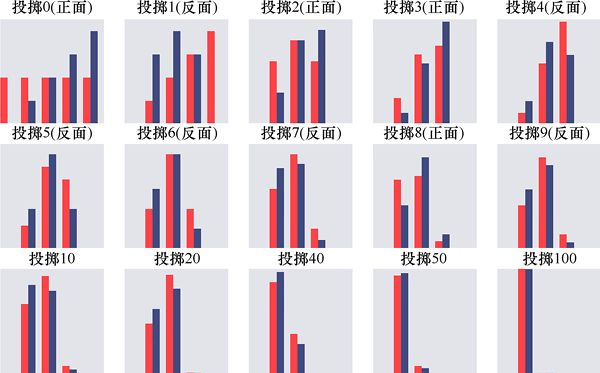

> **圖片描述：** 此圖展示5個假設在多次拋擲中的先驗和後驗機率變化。前兩行為前10次拋擲的逐步變化，最後一行跳躍顯示更多次拋擲後的結果。隨著拋擲次數增加，假設1（偏置=0.25，最接近真實值0.3）逐漸佔據主導地位。

圖4.32　對應於一系列偏置為0.3的硬幣的拋擲結果的先驗機率和後驗機率的變化

可以看到，每次拋擲後，舊的後驗機率（深色條塊）成了新的先驗機率（淺色條塊）。還可以看到，在經過第一次拋擲後，最左側的假設0的可能性已經降低到了0，第二次拋擲（結果是背面朝上）後，最右側的假設4的可能性已經降低到了0，因為這個假設認為硬幣永遠都會正面朝上。這樣就只剩下3個假設。

我們可以看看剩下的3個假設在每次拋擲後機率的變化。在拋擲硬幣的次數越來越多以後，正面朝上的次數越來越接近總次數的30%，並且假設1慢慢佔據了主導。

當拋擲了100次以後，系統基本已經確定了假設1是正確的，這意味著相較於其他偏置值，這枚硬幣的偏置值更應該是0.25。

如果我們可以測試5個假設，那麼同樣也能測試500個假設。圖4.33所示的就是500個假設，每個假設對應於均勻分配在0～1的偏置值。我們透過添加第4行顯示更多拋擲次數。在這裡，我們去除了數值的條塊，這樣可以更清楚地看到所有500個假設的情況。

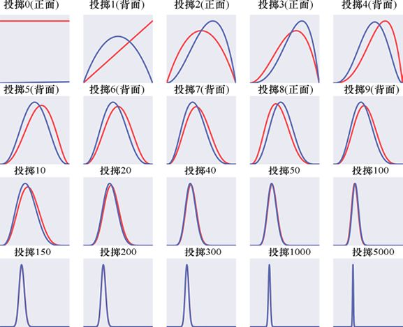

> **圖片描述：** 此圖展示500個假設（偏置值均勻分佈在0到1之間）的後驗機率變化。去除了條塊，改用曲線顯示。隨著拋擲次數增加，後驗分佈逐漸收窄並集中在真實偏置值0.3附近，形狀類似高斯分佈。

圖4.33　與圖4.32類似，但現在我們同時處理500個假設，每個假設的偏置值都有細微的不同。拋擲結果的序列與圖4.32相同

在圖4.33中，我們重複使用了圖4.32中拋擲結果的序列。如同之前預測的那樣，獲勝的是預測偏置為0.3的假設。但有趣的是，後驗假設的分佈有點像高斯分佈。前文提到，高斯曲線是一條著名的“貝爾曲線”，除去一個對稱的凸起，其餘地方都是平坦的。

那麼，如果將起始的先驗機率設置成高斯分佈的形式呢？為了增加難度，我們將高斯分佈中最大值點對應的橫軸設置在0.8，也就是說，預測硬幣的偏置接近0.8，偏置值離0.8越遠，是這枚硬幣的可能性就越小。遠離中心凸起的地方的值會變得越來越小，但永遠不會成為0。0.3（硬幣的真實偏置值）處的初始先驗機率大約是0.004。也就是在我們的先驗機率中，硬幣的偏置是0.3的機率僅為0.4%。那麼這樣系統又如何應對呢？結果如圖4.34所示。

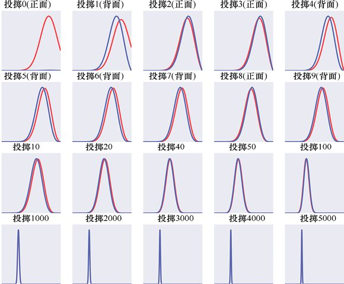

> **圖片描述：** 此圖與上一張類似，但初始先驗設為以0.8為中心的高斯分佈（故意誤導）。儘管初始先驗嚴重偏離真實值，系統最終仍將後驗改善至0.3附近，只是需要更多次拋擲才能克服誤導性先驗。

圖4.34　與圖4.33類似，只是現在初始的先驗機率分佈設置成了最大值點在0.8的高斯分佈

結果很好，即使有誤導性很強的先驗機率，系統最後依然將偏置值改善到了0.3。雖然比之前花的時間多，但最終也達到了目的。圖4.35所示的是這個過程中一組畫在同一幅圖上的曲線。

我們不會深入解釋，但用數學極限的思想，可以逐漸增加假設偏置的密度直到無限密集，此時就可以用連續的曲線替代離散點，如圖4.35所示。這樣做可以讓得到的結果更加精確，可以找到任意數值的偏置，而不是只能在列表中固定的幾個偏置中尋找近似值。

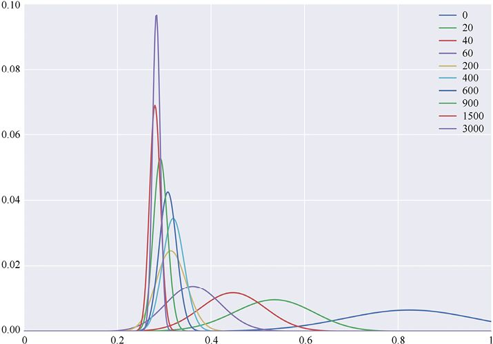

> **圖片描述：** 此圖將前3000次拋擲的某些後驗機率曲線疊加在同一張圖上。隨著拋擲次數增加，曲線越來越窄，峰值越來越集中在0.3附近，權重不斷向真實偏置值集中。

圖4.35　將圖4.34中前3000次拋擲的某些後驗機率曲線畫在一張圖上。可以看到系統給0.3附近的權重越來越大，而其他地方的權重不斷減小

## 參考資料

[Cthaeh16a]　The Cthaeh, *The Anatomy of Bayes’Theorem*, Probabilistic World, 2016.

[Cthaeh16b]　The Cthaeh, *Calculating Coin Bias With Bayes’Theorem*, Probabilistic World, 2016.

[Genovese04]　Christopher R. Genovese, *Tutorial on Bayesian Analysis* (*in Neuroimaging*), Institute for Pure & Applied Mathematics Conference, 2004.

[Kruschke14]　John K. Kruschke, *Doing Bayesian Data Analysis, Second Edition: A Tutorial with R, JAGS, and Stan 2*nd *Edition*, Academic Press, 2014.

[Stark16]　P B. Stark and D. A. Freedman, *What Is the Chance of an Earthquake?*, UC Berkeley Department of Statistics, Technical Report 611, 2016.

[VanderPlas14]　Jake Vanderplas, *Frequentism and Bayesianism: A Python-driven Primer*, 2014.

