# 第5章　曲線和曲面

曲線和曲面的性質的學習，有助於理解本書將介紹的許多演算法。

## 5.1　為什麼這一章出現在這裡

本章介紹在機器學習中經常用到的曲線和曲面的性質。

其中兩個最重要的概念分別是**導數**（derivative）和**梯度**（gradient）**。**這兩個概念用於描述曲線和曲面的形狀，有助於瞭解曲線和曲面中上升和下降的方向。

這些概念是深度學習系統進行學習的核心。這個學習過程是透過反向傳播演算法實作的。有關反向傳播演算法的內容參見第18章。理解導數和梯度是理解反向傳播演算法的關鍵，理解了這兩個概念，也就知道了如何成功地構建並訓練深度神經網路。

在本章中，我們依舊會略過一些公式，把焦點放在直觀地理解導數和梯度描述的性質上。其中涉及的數學層面的知識和概念在大多數現代微積分的書中都有涵蓋（見[Apostol91]和[Berkey92]）。

## 5.2　引言

在機器學習中，我們經常會遇到各式各樣的曲線。大部分情況下，它們都是**數學函數圖**。

我們經常會從函數的輸入和輸出的角度理解這些曲線：在處理一段二維曲線時，輸入是橫座標軸上選擇的連續或離散的值，輸出是曲線上在每個輸入值正上方的點投影到縱座標軸上的值。所以對於一個函數/一段曲線，給定一個輸入值，就可以得到一個數值作為輸出。

如果函數是一個曲面，例如一張在風中飄動的紙張，輸入是紙張上某一點投影到地面上的點，輸出則是地面上的該點投影至紙張上的點的高度。在這種情況下，我們給定兩個點作為輸入（用以確定地面上某點的位置），輸出則依舊是一個點。

這些想法可以普遍化，所以函數的輸入可以是多個數值（也稱為**參數）**，輸出也可以是多個數值（有時稱為**返回值**）。更直觀點，我們可以把函數看作一個無限大的查找表。輸入一個或多個數，輸出一個或多個數，只要不刻意引入隨機數，那麼對於特定的函數而言，給定相同的輸入，得到的輸出也是相同的。

在本書中，我們將在某些方面用到曲線和曲面。其中一個最重要的，也是本章的重點，就是判斷如何從一個特定的點沿著曲線/曲面移動，並得到一個更大/更小的輸出。完成這個過程需要曲線或者曲面的函數滿足一些條件。接下來，我們會以曲線為例詳細闡述這些條件，但這些概念完全可以拓展至更多更復雜的圖形。

首先，我們需要曲線具有**連續性**。這意味著我們可以在紙上一筆畫出這條曲線，中途筆不會從紙上離開。其次，我們需要曲線是**平滑**（smooth）的。這意味著曲線上沒有尖銳的點[**尖點**（cusp）]。圖5.1所示的曲線有這兩個不應該有的特點。

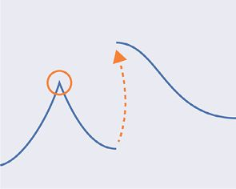

> **圖片描述：** 此圖展示一條具有尖點和不連續性的二維曲線。橘色圓圈標出了一個尖點（曲線突然改變方向的位置），虛線箭頭標示了不連續跳躍的位置（畫這段曲線需要將筆抬起）。這些是我們希望曲線不具有的特徵。

圖5.1　圓圈部分包含了一個尖點，也就是在該點曲線突然改變了原有的方向。虛線的箭頭展示了不連續性，也稱為跳躍，要畫出這樣的曲線，我們需要把筆從紙上拿起來移動一段距離再放下繼續作圖

最後，我們還希望曲線是單值的。這意味著對平面上每一個水平的位置，如果我們在該點作一條垂線，那麼這條線只會與曲線交於一個點，所以只有一個點對應那個水平的位置。換句話說，視線從左往右或者從右往左跟隨著這條曲線，它不會改變方向。圖5.2展示了一條不滿足該條件的曲線。

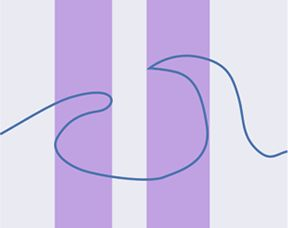

> **圖片描述：** 此圖展示一條不滿足單值條件的曲線。在深色條狀區域內，曲線在垂直方向上對應多個數值，即同一個水平位置有多個曲線上的點，違反了單值性的要求。

圖5.2　在深色條狀區域內，這條曲線在垂直方向上有多個數值

從現在開始，假設所有曲線都滿足這3個條件（連續、光滑和單值）。這是一個安全的假設，因為我們經常會刻意選擇有這些性質的曲線。

## 5.3　導數

在機器學習中，我們經常需要尋找一條曲線（函數）的最大值或最小值。

有時，我們需要尋找一條曲線在完整定義域內的最大值或者最小值，如圖5.3所示。把整條曲線看作一個完整的集合，則這些點稱作**全局最大值**（global maximum）和**全局最小值**（global minimum）。

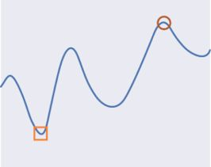

> **圖片描述：** 此圖展示一條光滑的二維曲線，上面用圓圈標出了全局最大值的位置，用方框標出了全局最小值的位置。這兩個點分別是整條曲線上y值最大和最小的位置。

圖5.3　全局最大值（圓圈），以及全局最小值（方框）是在整條曲線上具有最大值和最小值的兩個點

有些時候我們只想知道曲線上最大值和最小值的具體值，但也有些時候我們想要知道這些具有最大值和最小值的點的**位置**。

然而有時想要找到這些值很困難。例如，如果一條曲線向兩個方向無限延伸，怎樣才能確定所找到的就一定是最大值或者最小值呢？又如，如果一條曲線有重複的部分（見圖5.4），我們應該選擇哪個高點（低點）作為最大值（最小值）呢？

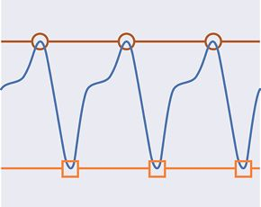

> **圖片描述：** 此圖展示一條無限重複的週期曲線。圓圈標出了多個等高的全局最大值點，方框標出了多個等深的全局最小值點，說明對於週期曲線，全局極值可以有無限多個。

圖5.4　當一條曲線無限重複時，我們可以找到無限多的點，這些點都能用來作為曲線的全局最大值（圓圈）和全局最小值（方框）

為了解決這些問題，我們可以想象一個理想實驗。從某個點開始，我們向左遍歷所有點，直到曲線改變方向。如果向左遍歷時，曲線的值開始增加，那麼只要接下來曲線上的值還在繼續增加，就繼續向左遍歷，一旦曲線上的值開始減小，就停止遍歷。同理，如果開始向左遍歷時曲線上的值是減小的，就在它開始增加的時候停止遍歷。用相同的方式再進行一次實驗，只不過這次是向右遍歷曲線。這就得到了3個有趣的點：起始點以及兩個在向左或者向右遍歷時的終止點。

對於這個起始點而言，3個點中最小的點是局部最小值，最大的點是局部最大值，如圖5.5所示。

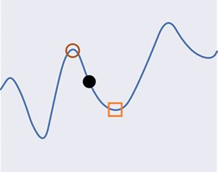

> **圖片描述：** 此圖展示局部最大值和局部最小值的概念。從黑色實心點開始，圓圈內的點為該點的局部最大值，方框內的點為局部最小值。注意：它們不一定是全局最大值和全局最小值。

圖5.5　局部最大值和局部最小值是一個點領域內的最大值和最小值。就黑色實心點而言，圓圈內的點和方框內的點分別是該點的局部最大值和局部最小值。注意：這兩個點不是全局最大值和全局最小值

在圖5.5中，我們從黑色實心點開始向左遍歷，直至遍歷到圓圈內的點；向右開始遍歷，直至遍歷到方框內的點。考慮這3個點：起始點、圓圈內的中心點和方框內的中心點。此時，局部最大值是這3個點中的最大值，圓圈的中心點。局部最小值是這3個點中的最小值，即方框的中心點。

如果這個曲線向正方向或者負方向無限延伸，情況就會變得更加複雜。我們無法找到像這樣的曲線的最大值或者最小值，所以通常假設對於任意曲線的任意點，都能找到局部最大值和局部最小值。

注意：對於一條曲線，只有一個全局最大值和一個全局最小值，但可以有許多局部最大值和局部最小值，因為它們可以根據我們考慮的每個點而變化，如圖5.6所示。

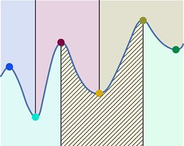

> **圖片描述：** 此圖展示一條曲線上不同區域的局部最大值和局部最小值。以不同顏色的陰影區域標示，每個區域有自己的局部極值。深色點為某區域的局部最大值，淺色點為另一區域的局部最小值。

圖5.6　對於不同顏色的區域，它們的局部最大值和局部最小值都不一樣。例如，從左往右的深色點是其所處區域中所有點的局部最大值；從左往右的第二個淺色點是其所處陰影區域中所有點的局部最小值

我們可以透過眼睛直接找到局部最小值和最大值，但電腦需要用演算法來計算。我們透過創建一個稱為**切線**（tangent）的輔助對象實作這一目標。

為了闡述這個概念，我們在圖5.7中標註了一條二維曲線。

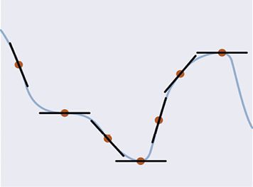

> **圖片描述：** 此圖展示一條二維曲線上多個標記點的切線。每個點上的黑色實線代表該點的切線，切線的傾斜程度反映了曲線在該點的斜率（導數）。不同位置的切線斜率不同。

圖5.7　曲線上的一些標記點。每個點的切線用黑色實線標記，這些切線代表曲線在該點的斜率

在曲線中的每個點上，我們都可以畫出一條直線，這條直線的斜率受曲線在該點的形狀影響。這就是**切線**。我們可以把切線看作一條在該點和曲線“擦肩而過”的直線。

下面是一種找到切線的辦法。選取一個點，將其稱為目標點。我們可以從目標點開始沿著曲線向左和向右移動相同的距離，在移動的終點處標記兩個點，將這兩個點連起來，如圖5.8所示。

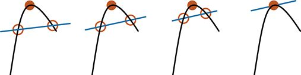

> **圖片描述：** 此圖包含四個子圖(a)(b)(c)(d)，展示尋找切線的方法。從目標點出發，在曲線上取等距的兩個點並連線。隨著兩點逐漸靠近目標點，連線越來越接近真正的切線。(d)中兩點幾乎重合時得到切線。

(a)　　　　　　　　　　　　　(b)　　　　　　　　　　　　　(c)　　　　　　　　　　　　 (d)

圖5.8　為了找到一個目標點的切線，我們可以找一組在曲線上的點，這組點到目標點的距離相同。不斷將這組點向目標點靠近，最終就能找到切線

現在我們開始將這兩個點以相同的速度向目標點靠近，並始終保持這兩個點在曲線上。在它們即將恰好重合時，經過這兩個點的直線就是我們所要找的切線。

我們說這條直線與所給曲線相切，這意味著這條直線恰好與曲線“碰到”。曲線上給定某一點的切線顯示了這條曲線在該點的變化趨勢。

我們可以測量在圖5.8中得到的切線的斜率。這個斜率是一個數值，當直線在水平方向時，斜率為0，在直線慢慢向垂直方向傾斜的過程中，斜率的絕對值將慢慢變大。在數學上，我們將這個數值稱作導數。在曲線上，對於每一個不同的點來說，導數的數值都有可能不一樣，因為曲線上的每一個點都有可能會有不一樣的斜率。

圖5.9解釋了為什麼我們在之前聲明瞭曲線需要滿足連續、光滑和單值這3個條件。這些條件保證了我們始終可以在每一個點上找到一條切線來描述它的斜率（導數）。

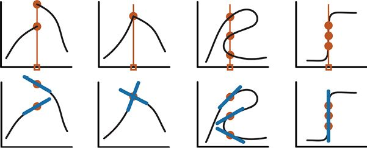

> **圖片描述：** 此圖包含四個子圖(a)(b)(c)(d)，上排展示無法正確求導的曲線（不連續、有尖點、非單值、有垂直段），下排展示各自遇到的問題：多個可能的斜率值、尖點處斜率不確定、多個點對應同一橫座標、斜率無窮大。

(a)　　　　　　　　　　　　　　　　(b)　　　　　　　　　　　　　　　　(c)　　　　　　　　　　　　　　　　(d)

圖5.9　我們傾向於連續、光滑和單值的曲線的原因。這裡選取了橫軸上的一個點，也就是圖中用小方框標記出來的點，我們想要找到在這個點上曲線的導數。上方：無法獲得導數的曲線；下方：在求導數時遇到的問題

在圖5.9a中，曲線是不連續的，所以在給定的點上我們可以找到很多不同的斜率值。但是我們不知道到底應該選擇哪個作為導數。在圖5.9b中，曲線是不光滑的，所以當我們從左往右遍歷曲線上的點併到達尖點時，斜率可能有很多不一樣的值。同樣，我們不知道在這些不同的值中應該選取哪個作為導數。用圖5.8所示的逐步逼近的估算方法無法幫助我們找到導數，因為用該方法得到的導數並不接近曲線本身的性質。在圖5.9c中，曲線不是單值的，所選的橫軸的點在曲線上對應著多個點，每個點都有不同的導數。同樣，我們也不知道應該選取哪個作為曲線在該點（橫軸上選取的點）的導數。圖5.9d展示了一條有一部分完全垂直的曲線，這條曲線同樣違反了單值這一條件。更糟糕的是，這段曲線上垂直部分的點的切線也是完全垂直的，這意味著斜率是無窮大的，也就是導數無限大。處理無限大的數值是複雜且困難的，所以我們一般聲明曲線不會有垂直部分，這樣就不需要擔心導數可能會無限大這一問題了。

讓我們將曲線設想成一種把變量*x*轉換為變量*y*的方式。預設隨著變量*x*數值的增大，*x*會向右移動；隨著變量*y*數值的增大，*y*會向上移動，如圖5.10所示。

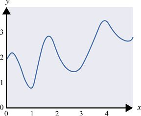

> **圖片描述：** 此圖展示一條二維曲線，以箭頭標示x軸和y軸的正方向。當曲線向右移動時x值增大，當曲線向上移動時y值增大。

圖5.10　一條二維曲線。當曲線向右移動時，*x*的值增大；當曲線向上移動時，*y*的值增大

從某一特定點*P*開始向右移動時（即*x*的值增大），我們可以觀察曲線上與這個*x*值對應的*y*值是否在增大，或者減小，或者是沒有變化。如果*y*的值隨著*x*的增大而增大，就說這條曲線在*P*點上有正斜率；如果*y*的值隨著*x*的增大而減小，就說曲線在*P*點上有負斜率。切線越傾斜（即切線越靠近垂直方向），斜率的絕對值就越大，如圖5.11所示。

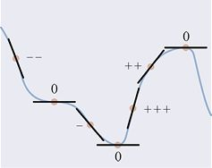

> **圖片描述：** 此圖在之前的曲線上以+、-和0標記各點的斜率符號。+表示正斜率（y隨x增大而增大），-表示負斜率，0表示水平切線（斜率為零）。加號或減號的數量表示斜率的大小。

圖5.11　將圖5.7中的切線用正斜率（+）、負斜率（−）或者斜率為0（水平切線）（0）進行標記。為了顯示斜率的大小，對於每條切線，斜率的絕對值越大，標記的加號或者減號就越多

可以看到，圖5.11中有一個靠近左側的點，這個點既不是曲線的峰頂也不是谷底，但斜率依舊為0 。我們只會在曲線的峰頂、谷底或者像這樣的地方找到斜率為0的點。

數字前的**符號**（sign）告訴我們這個數字是正數、負數還是0。所有正數的符號都是+，所有負數的符號都是−，0的符號是0。

事實證明，要計算出一條曲線上某點的導數一般不是一件難事。我們可以用導數作為工具來找一條曲線上某點的局部最大值或者局部最小值。

給定一條曲線上的一個點，我們可以找到該點的導數。如果我們想要沿著曲線移動時*y*的值一直增加，那麼應該沿著導數符號的方向在曲線上移動。也就是說，如果導數是正的，那麼沿著*x*軸正方向移動才會得到更大的*y*值。同理，想要得到更小的*y*值，則需要向反方向移動，如圖5.12所示。

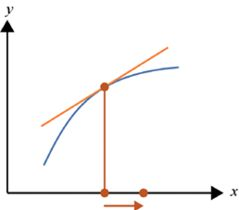

> **圖片描述：** 此圖展示導數如何指示移動方向。標記點的導數為正值，因此向右（x軸正方向）移動可得到更大的y值，向左移動則得到更小的y值。箭頭清楚標示這一關係。

圖5.12　某點的導數說明在該點我們朝某個方向移動可以使得*y*軸上的對應值（簡稱*y*值）更大或者更小。圖中標記的點的導數是正數，所以如果我們向右移動一個單位（沿著*x*軸正方向），就會得到一個更大的*y*值

為了找到某一點附近的局部最大值，我們會先找到曲線在該點的導數，然後在*x*軸上沿著該點導數的符號的方向移動一小步。然後我們在移動過後得到的點處再求曲線在這一點上的導數，再次依照剛才的方式移動一小步。如此重複該過程，直到導數值變成0。這一過程如圖5.13所示。

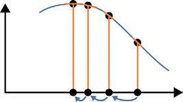

> **圖片描述：** 此圖展示利用導數尋找局部最大值的過程。從最右邊的點開始，該點導數為較大的負值，故向左移動較長距離。隨著導數絕對值減小，移動步長也減小，最終到達導數為0的局部最大值。

圖5.13　可以用導數來找到某一點的局部最大值。在這裡我們從圖中標記的最右邊的點開始。該點的導數是較大的負數，因此我們向左移動一段稍長的距離。在得到的點上導數依舊是負數，然而數值稍微小了一點，所以我們繼續向左移動一段比剛才短的距離。接下來，移動一段更短的距離，得到了局部最大值，在該點導數的數值為0

為了讓這個過程更加實用，我們需要聲明一些細節，例如，我們每一次移動的步長以及如何避免移動距離過大而錯過局部最大值，但現在我們只是使用理想化的過程讓大家易於理解求值的步驟。

求局部最小值與求局部最大值的步驟基本一致，只是沿著*x*軸移動的方向與每一點導數的符號相反，如圖5.14所示。

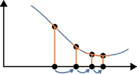

> **圖片描述：** 此圖展示利用導數尋找局部最小值的過程。因為導數為負值，向x軸正方向（右方）移動。導數的絕對值逐步減小，步長也逐步縮短，最終到達導數為0的局部最小值。

圖5.14　為了尋找局部最小值，我們遵循圖5.13中的步驟。因為導數為負數，我們沿著*x*軸向右移動。我們從圖中標記的最左邊的點開始。一開始的導數是負數並且數值較大，所以我們向右移動一段稍長的距離。我們會發現導數的數值在隨著每一次移動增大（也就是導數在一步步向0靠近），直到這一過程讓我們移動到局部最小值，曲線在該點的導數為0

求局部最大值和局部最小值是機器學習過程中一個很重要的步驟，這取決於我們在曲線上對於每一點都能求得導數的能力。我們要求曲線滿足光滑、連續和單值這3個條件，就是為了可以在曲線上每一點都能找到唯一的、有限大的導數，這也意味著我們可以用前面提到的方法找到局部最大值和局部最小值。

在機器學習中，多數曲線在大部分時候都滿足光滑、連續和單值這3個條件。如果我們碰巧遇到了一條不滿足某一個條件的曲線，就無法計算某些點上的導數——有些數學方法有時（但並非總是）可以讓我們巧妙地處理這些問題。

## 5.4　梯度

**梯度**是導數在三維、四維或者更高維度的一般化形式。本節會介紹梯度的概念以及用法。

假設我們身處一個大房間裡，在頭頂上方有一塊表面有起伏但沒有摺痕或者破洞的光滑的布，如圖5.15所示。

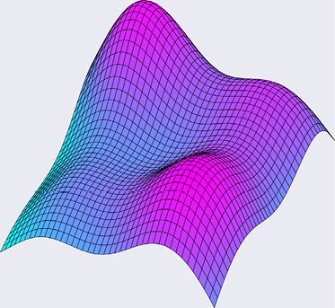

> **圖片描述：** 此圖展示一塊懸掛在空中的光滑布料，布面有起伏但沒有摺痕或破洞。布料滿足連續、光滑和單值的條件，用於說明三維曲面上梯度的概念。

圖5.15　一塊沒有摺痕或破洞的光滑的布

這塊布的表面自然滿足我們之前對曲線提出的幾個理想條件：它既是光滑的，也是連續的，又因為它是一塊布，不會捲到自己的上方（像兇猛的波浪那樣），所以它也是單值的。換句話說，從地面上任意一點往上看，布上只會有一個點在地面上這點的正上方，而且從地面上的點到布在該點正上方的點的距離是可以測量的。

現在我們想象自己可以在某一瞬間定住這塊布。如果我們能移動上去，繞著這塊布走，甚至在布的表面走動，好比在山峰、平原或者峽谷這樣的地形表面上一樣。

假設這塊布足夠厚，以至於水無法穿過它。如果我們向布上的任意一點滴一些水，這些水就會自然地向“地勢”低的地方流去。事實上，這些水會順著能讓它最快速地往下流的路徑流下去。

我們滴出去的水是受到重力作用而往下流的。在任意一點，它能快速地在**鄰域**（field）找到能讓它往下流的方向，並且找到流速最快的路徑，如圖5.16所示。

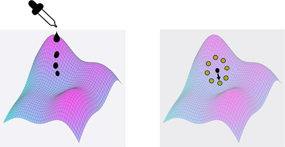

> **圖片描述：** 此圖包含兩個子圖(a)(b)。(a)展示向布面滴水的場景，水會沿最陡的下坡方向流動。(b)展示一滴水在某點尋找周圍地勢最低方向的示意圖，該方向就是水將流動的方向。

(a)　　　　　　　　　　　　　　　　　　　　　　　　　　　　　　　　　　 (b)

圖5.16　如果我們向布上滴一些水，它會儘可能快地往低處流去。我們稱這條路徑為最大下降。(a)向布上滴水；(b)一滴水在尋找附近幾個點中“地勢”最低的方向，這個方向就是水將流動的方向

在所有能移動的路徑中，水永遠會選擇那條最陡峭的“下坡路”。水流動的方向被我們稱為**最大下降**（maximum descent）的方向。

假設我們現在希望水向上流，同樣，流得越快越好，並找到**最大上升**（maximum ascent）的方向，該怎麼做呢？在一個曲面上的某一個點的鄰域內，最大上升的方向就是最大下降方向的相反方向。這兩條路徑往往都在一條直線上，只是方向不同，如圖5.17所示。

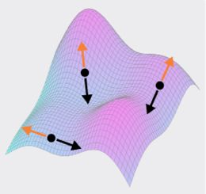

> **圖片描述：** 此圖展示最大上升方向（淺色箭頭，即梯度）和最大下降方向（黑色箭頭，即負梯度）。兩個方向在同一條直線上，但方向相反。梯度指向上升最快的方向。

圖5.17　最大上升的方向（淺色箭頭方向）往往和最大下降的方向（黑色箭頭方向）正好相反

最大上升的方向，也就是圖5.17中淺色箭頭標註的方向，稱作**梯度**。我們可以透過翻轉它找到最大下降的方向，也就是黑色箭頭標註的方向，稱作**負梯度**（negative gradient）。所以梯度指向上升的最陡峭方向，而負梯度指向下降的最陡峭方向。想要儘快登上山頂的登山者會沿著梯度的方向走，往山下流的水流則會沿著負梯度的方向流動。

如圖5.17所示，我們可以在一個曲面的任意一點（準確來說不是任意一點，而是任意一個能在該點找到“上坡”或者“下坡”的點，稍後我們會涉及）找到梯度和負梯度。

現在我們知道了最大上升的方向，也可以找到梯度的**大小**（magnitude）。梯度的大小表示向上走的速度。如果向上走得很慢，梯度的大小就比較小；如果向上走得比較快，梯度的大小就比較大。

我們可以用梯度來找到局部最大值，就像在5.3節中用導數求局部最大值一樣。換句話說，如果我們在一種地勢上，想爬到最高的地方，只需要沿著梯度的方向走，即每當處於一個點時，下一步要移動的方向就是該點的梯度的方向。如果我們想去附近地勢最低的點，就應該沿著負梯度的方向走，即每當處於一個點時，下一步要移動的方向就是該點梯度的反方向。逐步移動的過程如圖5.18所示。

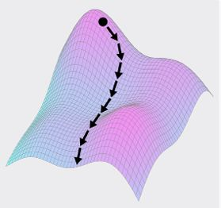

> **圖片描述：** 此圖展示在曲面上沿負梯度方向逐步移動的過程。在每一點找到負梯度方向後移動一小步，到達新位置再找新的負梯度方向，如此重複，逐步移向地勢最低的位置。

圖5.18　要往地勢低的方向移動，我們可以找到所在點的負梯度（即最大下降的方向），然後沿著該方向移動一小步。接著我們在新位置再找到該點的負梯度，再沿著新的方向移動一小步，以此類推

假設我們在一座山的最高點，如圖5.19所示。這個最高點就是局部最大值（也有可能是全局最大值）。在這裡，沒有可以繼續上升的方向。如5.3節提到的，當我們位於一個曲線的平坦區域時，該區域上的點的導數為0。現在圖5.19所示的曲面上也有類似的一塊平坦區域。因為沒有可以繼續上升的方向，所以從這個點上升的最大速率為0，即梯度的大小為0。我們一般將這種情況稱為**梯度消失**（vanishing gradient）。

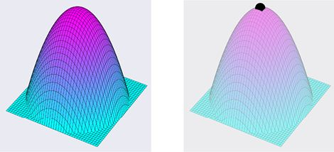

> **圖片描述：** 此圖包含兩個子圖(a)(b)。(a)展示一座山的形狀。(b)展示山頂的一個點，在該點沒有可以繼續上升的方向，因此梯度大小為0（梯度消失），這是局部最大值或全局最大值。

(a)　　　　　　　　　　　　　　　　　　　　　　　　 (b)

圖5.19　在山的最高點，沒有可以繼續上升的方向。(a)山；(b)山的最高點，該點沒有梯度，因為沒有能上升的路徑。這是一個局部最大值或者全局最大值

梯度**消失**就像在山的最高點，負梯度同時也會消失。

如果我們在一個碗的最底部（見圖5.20），那會怎樣呢？碗的最底部的這個點就是局部最小值（也有可能是全局最小值）。

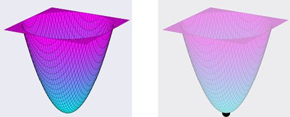

> **圖片描述：** 此圖包含兩個子圖(a)(b)。(a)展示一個碗的形狀。(b)展示碗底的一個點，往任何方向移動都會上升。與山頂類似，該點的局部曲面是平坦的，也沒有梯度，是局部最小值或全局最小值。

(a)　　　　　　　　　　　　　　　　　　　　　　　　　　 (b)

圖5.20　在一個碗的最底部，往每一個方向移動都會讓我們上升。(a)碗；(b)碗的最底部的一點。因為這個點在碗底，就像在山的頂端一樣，其局部的曲面是平坦的，所以該點也沒有梯度。這是一個局部最小值或者全局最小值

在一個碗的最底部，就好比位於一座山的最高處，局部的曲面是平坦的，因此該點沒有梯度或者負梯度。換句話說，在該點沒有方向能讓我們上升（或者下降），簡言之就是沒有“最好的”方向。

如果我們既不在山頂也不在碗底，就在一個平坦的平面上（見圖5.21）呢？

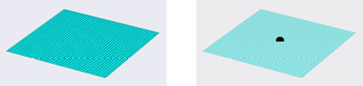

> **圖片描述：** 此圖包含兩個子圖(a)(b)。(a)展示一個平坦的平面。(b)展示平面上的某點，在該點沒有任何方向可以上升或下降，梯度不存在。

(a)　　　　　　　　　　　　　　　　　　　　　　　　　　　　　　　　　　　　(b)

圖5.21　在一個平坦的平面上。（a）平面；（b）平面上的某點，在該點沒有梯度

如同山頂的點一樣，平面上的點也沒有可以上升的方向。當處在一個平面上時，梯度同樣不存在。

到目前為止，就像在二維曲線中見到的一樣，我們見到了局部最大值、局部最小值以及平坦的區域。但在三維曲面中，有一種全新的特徵。

三維曲面中有些點的鄰域的形狀，看起來就像騎馬者坐的馬鞍一樣。在一個方向上，我們處在谷底，然而在另一個方向上，我們處在山頂。自然，這種形狀被稱為**鞍部**（saddle）。圖5.22為鞍部的一個實例。

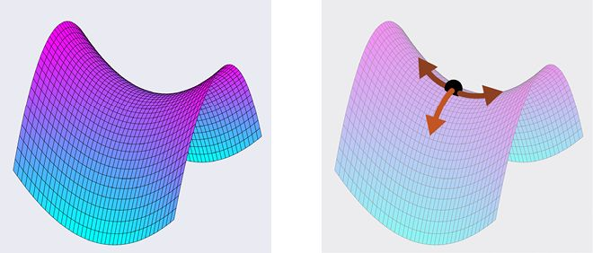

> **圖片描述：** 此圖包含兩個子圖(a)(b)。(a)展示一個鞍部的三維形狀，一個方向上升而另一個方向下降。(b)展示鞍部中心點的情況：淺色箭頭指向下降方向，深色箭頭指向上升方向。鞍部中央是另一種梯度消失的情況。

(a)　　　　　　　　　　　　　　　　　　　　　　　　　　　　　　　　　　　　(b)

圖5.22　鞍部在一個方向上會上升，但在另一個方向上會下降。(a)鞍部；(b)鞍部上的一個點。顏色稍淺的箭頭所示的方向是下降的方向，顏色稍深的箭頭所示的方向是上升的方向。在另一端還有一個顏色稍淺的箭頭也指著下降的方向

位於鞍部的中央就像同時處在谷底和山頂。與這兩者相同，鞍部中央點的鄰域也像一個平面，所以也沒有梯度。但如果我們在某個方向上移動一點點，會發現一點點斜率，梯度就會重新出現併為我們指明該點的最大上升方向。

總體來說，如果我們處在一個地勢的某一部分，這一部分在我們附近有上升和下降的變化，就會存在一個指向最大上升的方向的梯度。梯度的大小告訴我們沿該方向上升有多快。指向相反方向並有著同樣大小的向量則代表著最大下降。

如果我們處在一個局部平坦的區域（平面、山頂、谷底或者鞍部的中央），梯度就不存在了。我們可以將這想象為一個既沒有大小也沒有方向的向量，但因為這很難畫出來，所以我們一般將這一現象稱為梯度消失（有時候也會說在該點有零梯度）。當梯度不存在時，我們不知道在哪個方向上可以上升或者下降得最快，有時甚至根本沒有可以上升或者下降的方向。

在後續章節中，我們將學習神經網路。它是透過誤差的梯度來學習的。神經網路透過沿著負梯度的方向前進來調整網路中的參數，這樣在學習的過程中，誤差就會越來越小。這一操作稱為**梯度下降**（gradient descent）。在第18章中，我們會具體介紹如何用梯度下降方法來訓練深度網路。

## 參考資料

[Apostol91]　Tom M. Apostol, *Calculus, Vol. 1: One-Variable Calculus, with an Introduction to Linear Algebra, 2nd Edition*, Wiley, 1991.

[Berkey92]　Dennis D. Berkey and Paul Blanchard, *Calculus*, Harcourt School, 1992.

