# 第6章　資訊理論

本章介紹如何考慮並測量存在於資料、計算過程以及結果中的資訊量，如何比較不同的資料表示方法的效率。

## 6.1　為什麼這一章出現在這裡

本章介紹**資訊理論**（information theory）的基礎。資訊理論首次出現在1948年的一篇具有開創性的論文中，並由此為人們所知。這是一個相對較新的概念，但是它為現今的一切（現代電腦、衛星、手機乃至互聯網）奠定了基礎（見[Shannon48]）。

起初，人們研究資訊理論的目的是希望可以找到最有效的電子通信方法。然而，那篇論文中的思想遠比這一目的要深刻，即將知識轉換成我們可以學習並操控的數字形式。資訊理論的思想賦予我們一種可以用來測量自己對事物瞭解程度的工具。

本章將簡要介紹一些資訊理論中的基礎知識。同樣，我們不會拘泥於抽象的數學公式。資訊理論中的術語和思想會相當頻繁地出現在與機器學習有關的文獻中，因此適當瞭解該領域是非常重要的。具體而言，當我們希望衡量類似深度網路的神經網路的效果時，資訊理論提供給我們的評估方法就會十分有用。

### 資訊：一詞雙義

本章的內容都是關於**資訊理論**的，所以在對它做詳細解釋之前，我們先統一一下“資訊”一詞的含義。

“**資訊**”（information）一詞既有日常生活語境下的含義，又有科學語境下的特定含義。雖然兩種含義間有很多的概念重合，但為大眾所熟悉的含義較為寬泛，人們也可以對此有自己的解釋；科學語境下的含義則要更加精確，並在數學上被嚴格定義。

讓我們從構建科學語境下的“資訊”的含義開始。

## 6.2　意外程度與語境

我們接收到任意形式的消息，無論是一個詞語、一個小故事還是一段詩詞，都是由世界上的某些變化導致的。某些東西從一個地方被移動到另一個地方，這些東西可以是電脈衝，可以是一些光子，也可以是某人的聲音。

寬泛地說，我們可以將這一過程描述為一名“發送者”透過某種方式向“接收者”提供了某種形式的消息。

在本節中，我們有時會用術語“意外程度”來表示這則消息為接收者提供了多少新資訊。這是一個非正式術語，用來指代我們對某些事件的期望與實際從中得到的資訊之間的差距。舉個例子，假設現在我們聽到門鈴響了，如果我們最近從網上訂購了東西，那麼發現門外站著的確實是送貨員，這可能讓我們有一點點驚喜，但不會是完全出乎意料的。但是，如果在門鈴響了以後，門外出現了一隻大猩猩或者是背上馱著25只兔子的烏龜，那這一事件的意外程度可就高多了！在本節中，我們的目標之一便是找到一些更為正式的術語來代替“意外程度”，並給它們附上特定的含義及衡量方法。

假設我們正在接收一則消息，希望可以描述出這次通信可以給我們帶來多大的意外程度。這種描述很有用，因為後面我們會看到，意外程度越大，接收到的資訊也就越多。

### 6.2.1　意外程度

更具體地說，假設我們從一個未知的號碼那裡收到了一條意外短信。我們打開短信並且看到它的第一個詞是“謝謝”。這時我們的意外程度會是多少？當然了，我們至少會感到一點點意外，因為直到目前為止，我們依舊不知道這條短信是誰發來的，也不知道他想要感謝的是什麼事情。但因為過去發生的某些事情而收到表達感謝的短信確實會發生，所以這種事並非聞所未聞。

現在讓我們建立一個虛構且完全主觀的“意外程度量表”，其中0表示某件事完全符合預期，而100表示某件事完全是個意外，如圖6.1所示。

> **圖片描述：** 此圖為一個簡單的意外程度量表，從左到右的範圍為0到100。左端標記為「完全符合預期」（0），右端標記為「完全是個意外」（100），中間以水平線連接。

圖6.1　意外程度量表，表示範圍是0～100的值

在這個量表下，我們興許可以將出現在一條意外短信的開頭的單詞“謝謝”標註為20。

現在假設這條短信中的第一個單詞不是“謝謝”，而是“河馬”，那麼除非我們的工作和動物有些關係，否則這個單詞很可能是出乎意料的。例如，我們給它在意外程度量表裡標註為80，如圖6.2所示。

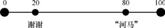

> **圖片描述：** 此圖在意外程度量表上標出了兩個單詞的位置。「謝謝」被標記在20的位置（較低的意外程度），「河馬」被標記在80的位置（較高的意外程度），說明不同單詞在特定語境下帶來不同的意外程度。

圖6.2　假如一條意外短信的第一個單詞是“謝謝”，我們可以給它的意外程度打上20分。而“河馬”一詞就要意外得多，所以我們可以給它的意外程度打上80分

雖然“河馬”對於一條短信的開頭而言可以是個大意外，但是如果它再出現，就沒那麼意外了。這其中的差別就在於“**語境**”。

### 6.2.2　語境

我們可以將語境看作一則消息所處的環境。由於我們關心的是每則消息的含義，而非它們用以通信的物理方法，因此語境可以表示發送者與接收者之間所共享的知識，這些知識使消息有了意義。

如果這則消息是一小段句子，這些共享的知識就必須包括這段語言裡所用的詞語，因為諸如“Kxnfq rnggw”這樣的英語單詞毫無意義。我們基於此可以進一步推斷出：共享的知識也應該包括語法、對錶情符號和縮寫的現有解釋、共享文化的影響，等等。

以上這些知識稱為“**全局語境（**global context**）**”。這是我們面對任何消息時都會擁有的，即便在我們閱讀它們之前。我們在第4章中有過關於貝氏定理的討論，套用其中的概念，那麼一些全局語境是在**先驗**中被獲取的，因為那就是如何獲取我們對於環境的理解，以及我們對於可以從中學到些什麼的預期。

另一個情況是“**局部語境**”（local context）。在一則消息裡，某個單詞的局部語境可以是該短信裡的其他單詞。想象一下，假如我們正在第一次閱讀這則消息，那麼每個單詞的局部語境就僅由它們之前的所有單詞組成。

語境會影響一則消息對於我們的意外程度。

如果“河馬”是消息中的第一個單詞，那麼我們只有全局語境，還沒有任何局部語境。如果我們不是在工作中時常碰到河馬，那麼這個單詞的意外程度就會很高。

但是，如果這則消息的第一句話是“讓我們去動物園的河那邊，也許這樣我們能看見一頭很大的灰色的……”，那麼在這個背景下，“河馬”一詞就顯得不那麼意外了。

全局語境和局部語境的差別就在於**依賴程度**。一個單詞在它的局部語境中意外與否就在於它的含義是否依賴於它周圍的其他單詞。

當我們運用全局語境來解釋消息中單詞的含義時，這種依賴就不會發生。每個單詞都有其本身的含義。

全局語境依舊會影響我們能感受到的意外程度。如果我們在一個漂流旅遊景區工作，並且從河馬身邊經過是一件很平常的事情，那麼“河馬”一詞就會是我們日常生活中所使用的詞彙，聽到“河馬”就不那麼意外了。但在這樣一種環境下，單詞“制動火箭”也許就會是完全出乎意料的。如果我們的職業是飛行器工程師，在這樣的環境下，“制動火箭”一詞也會變得很常見，而單詞“河馬”會變得意外得多。

我們可以透過為每個單詞評估它的意外程度值來描述一個單詞在全局語境下的意外程度，如圖6.1所示。假設我們為詞典裡的每個單詞都設了一個值（這是一件乏味的工作，但它的確是可行的）。如果調整這些值的尺度直到它們的和為1，我們就創造出了一個**機率密度函數**（probability density function，pdf），正如我們在第3章中看到的那樣。

這意味著我們可以從pdf中抽取一個隨機變量來取得一個單詞，那些意外程度較高的單詞會比那些意外程度較低的單詞更加頻繁地單獨出現。

一種更加常見的方法是透過建立一個pmf表示一個單詞的常見程度。所謂常見程度，簡單來說就是意外程度的對立面。有了這一設定，相較於常見程度較低的單詞，我們預計會更加頻繁地抽取到那些意外程度較低的單詞。

## 6.3　用比特作為單位

我們用一個單詞的出現機率確定發送這一單詞時所傳達的資訊量，但先要談論一下後面用來討論資訊的單位。

眾所周知，“比特”是資訊的最小單位，取值有0和1。比特也可以用電子電路來存儲，因此我們可以說，一塊芯片的容量為1000比特。

雖然在上一段中我們用日常生活中的語言進行了通俗易懂的解釋，但是這有些不太準確。將“比特”比較通俗的使用方法與其技術上的定義進行區分是很有幫助的，因為這樣可以幫助我們更加準確地討論資訊。

**比特**（bit）是一個**單位**，類似於千米、秒這樣的單位。相較於“這個存儲器有1000比特那麼大”，我們應該更加謹慎地表述為：“這個存儲器可以容納1000比特的資訊”。

這個差別是很重要的，因為我們希望牢記比特是一個單位，而不是一個電荷容量、量子態或者其他任何特定的機制。我們可以用一個電路或者設備來**表現**一個比特的資訊量，但這些東西並不是比特本身。

## 6.4　衡量資訊

透過一個公式，我們可以衡量出一則文本消息中的正式資訊量。我們不會過多地牽扯數學問題，但會解釋它的基本思想。

這個公式有兩個輸入。第一個輸入就是這則消息的文本，第二個則是用來描述每個單詞本身所含意外程度的機率質量函數。將它們輸入這個公式，就能產生一個數值，從而告訴我們這則消息的意外程度，或者說資訊量有多少。這個數值的單位通常就是比特。

這個公式被設計成對每個單詞的輸出值——或者更一般地說，每個**事件**（event）——有4個關鍵的性質。現在假設背景為我們在辦公室裡而非河邊工作，然後進行下一步的闡釋。

（1）比較可能的事件資訊量較少，例如，“訂書機”一詞的資訊量較少。

（2）比較不可能的事件資訊量較多，例如，“鱷魚”一詞的資訊量較多。

（3）比較可能的事件相較於比較不可能的事件來說資訊量較少。例如，“訂書機”比“鱷魚”傳達了更少的資訊量。

（4）兩個**不相關**事件的總資訊量是它們各自資訊量之和。雖然在日常交流中，很少會有兩個連續的單詞是完全不相關的，但是假設我們的辦公室裡有一張桌子，上面有許許多多辦公工具，並且每種工具都有很多種顏色。如果某人想要借一個“綠色的訂書機”，我們就可以認為這兩個單詞幾乎是完全不相關的，因為即使我們聽到了“綠色的”一詞，它後面還是可以接上一大堆可能的物件。如果我們假定了這兩個單詞是完全不相關的，就能透過把“綠色的”和“訂書機”兩個單詞所傳達出的資訊量相加找到短語“綠色的訂書機”所擁有的資訊量。

在日常的交流中，一個單詞的出現通常會縮小它後面可能出現的詞的範圍。就像如果某人說：“今天我吃了一個很大的……”，那麼諸如“三明治”或者“比薩”這樣的單詞就會比“浴缸”或者“帆船”這樣的單詞擁有更低的意外程度。因此，把每個單詞本身單獨的意外程度相加，通常會比整個消息的意外程度要高。相比之下，假設我們正在發送一個設備的序列號，並且這串數字本質上是一串隨機字母或者數字，如“K0GNNP4R”，如果每個字符確實和其他字符沒有關係，那麼把它們各自的意外程度相加就能得到這則消息中整個序列號的意外程度。

公式中的前3個性質符合我們的常識。它們可以被解釋為：常見的事件不太令人意外、不常見的事件令人意外，以及不常見的事件比常見的事件更加令人意外。

第4個性質使我們將關注點從單個事件放到了事件集上。兩個不相關單詞的組合所擁有的意外程度就是它們各自的意外程度之和，因此這就是我們如何從測量單個單詞的意外程度到整條文本資訊的意外程度。

雖然我們並沒有怎麼討論數學，但還是有了一個正式的**資訊**的定義，那就是：“資訊是一個小的公式或一種演算法，它將一個/多個事件以及一個機率密度函數作為輸入，其中機率密度函數表示了每個事件對於我們的意外程度。透過這兩個輸入，資訊可以為每個事件提供一個數值，並且保證這些數值符合前文提到的那4個性質”。

這個公式的輸出就是資訊量，正如我們在6.3節中討論過的那樣，資訊量通常用比特作為單位來表示。

## 6.5　事件的大小

每個事件所攜帶的資訊量同樣也受輸入公式的那個機率密度函數的大小所影響。換句話說，我們在交流中可能使用的單詞的數量影響了我們發送出去的每個單詞所攜帶的資訊量。

假設我們想把一本書的內容從一個地方發送到另一個地方。我們也許會先把那本書裡所有不同的單詞都列出來，然後給每個單詞都分配一個序號，比如，給單詞“這個”分配0，再給單詞“以及”分配1，以此類推。之後，如果接收者也有同樣的單詞序號對應表，我們就可以把這本書用發送序號的方式從第一個單詞對應的序號開始發送整本書。

蘇斯（Seuss）博士的書《綠雞蛋和火腿》只包含了50個不同的單詞（見[Seuss60]）。如果用0～49的數字來表示這本書，那麼對於每個單詞，我們需要6比特的資訊。羅伯特·路易斯·史蒂文森（Robert Louis Stevenson）的書《金銀島》包含了10700個不同的單詞（見[Stevenson83]）。對這本書裡的每個單詞，我們需要用14比特的資訊來表示。

總而言之，雖然我們可以用一個包含所有單詞的巨大詞彙表來發送這些書的內容，但如果為每本書單獨分配一個對應的詞彙表，且詞彙表中的單詞是每本書中真正用到的，那樣效率會更高。換句話說，我們可以透過將傳輸的資訊調整成發送者與接收者都共享的全局語境來提升效率。

就讓我們採用這個想法，並試著將其應用於實踐中。

## 6.6　自適應編碼

我們在6.5節中看到了，將傳輸的資訊調整成發送者與接收者都共享的全局語境是合理的。舉例而言，如果我們正在討論有關管絃樂的內容，那麼諸如“大號”或者“小提琴”這樣的單詞會比諸如 “海星”以及“章魚”等單詞更常見一些（也就是說，出現機率更大）；但是，如果我們正在討論的內容與水下展覽相關，那麼與此相反的結論則會變得正確。

我們發現可以利用這個觀察的結果提升發送消息的效率。一個著名的例子就是莫爾斯電碼（morse code）。在莫爾斯電碼中，每個印刷字符都對應著一些由點與橫線組成的編碼，它們之間由空白停頓分開，如圖6.3所示。

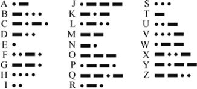

> **圖片描述：** 此圖展示莫爾斯電碼表，列出26個英文字母及數字0-9的對應編碼。每個字符由不同數量的點（短音）和橫線（長音）組成。例如字母E只有一個點，T只有一條橫線。

圖6.3　莫爾斯電碼中，每個字符都對應著一些點、橫線與空格的組合

莫爾斯電碼通常用電報鍵來發送，以此來啟用或者禁用單個清晰字符組合的傳輸。

點是一個短促的聲音。我們按住電報鍵以發送點的時間可以用稱作**滴**（dit）的單位來表示。一個橫線持續3滴的時間。我們在兩個符號中間留下1滴的空餘時間，兩個字母中間留下3滴的空餘時間，兩個單詞之間留下7滴的空餘時間。這當然是理想的措施。在實際運用中，許多人可以識別出他們朋友與同事的個人節奏，我們稱之為fist（見[Longden87]）。

因此，莫爾斯電碼包含著3種形式的符號：點、橫線以及點時長的空白停頓。假設我們希望透過莫爾斯電碼發送消息“nice dog”。這則資訊所對應的由短音（點）、長音（橫線）以及點時長的空白停頓組成的序列如圖6.4所示。

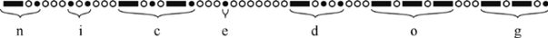

> **圖片描述：** 此圖展示莫爾斯電碼的三種符號：實心圓圈代表點（短音），實心方塊代表橫線（長音），空心圓圈代表空白停頓。以「nice dog」為例展示這三種符號的排列方式。

圖6.4　莫爾斯電碼的3種符號：點（實心圓圈）、橫線（實心方塊）以及空白停頓（空心圓圈）

這是一個透過噪聲較大的電報線來傳輸消息的好方法，因為聲音可以在噪聲以及其他影響存在的情況下被識別出來。在干擾很大的情況下，莫爾斯電碼依舊是透過無線電發送消息的好方法。

我們一般透過名為**符號**（symbol）的點和橫線來討論莫爾斯電碼。為任何字母所分配的符號的組合稱為**編碼**。

發送一則消息所需要的時間取決於具體分配到組成這則消息內容的每個字母的編碼。舉例而言，雖然字母Q與字母H同樣由4個符號組成，Q卻需要花費長得多的時間來發送。字母Q需要13滴來發送（3個橫線各需要3滴，1點需要1滴，以及3個空白停頓各需要1滴），但我們則僅需要7滴的時間來發送字母H（4點需要4滴，以及3個空白停頓各需要1滴）。

莫爾斯電碼透過符號的不同持續時間來區分它們。如果我們給每個符號都分配相同的時長，識別可以更容易些。為了實作這個目標，我們可以給“點”分配一個音（比如一個頻率較低的音），給“橫線”分配另一個音（比如一個頻率較高的音）。

這樣，在發送任何字符時，我們只需要發送一些短音的序列，每個短音的時長都是1滴。比如，發送字符R時，我們發送“低，高，低”而不是“點，橫線，點”。同樣，兩個符號中間也不需要空白停頓，但兩個字符中間依舊需要1滴的空白停頓。

現在每個由4個符號組成的字符都需要花費4滴來發送，不論其編碼是由怎樣的點與橫線進行組合的。

讓我們再來看看不同字符的編碼。從圖6.3中，我們可能不太能清楚地看出任何分配編碼的原則，但在它背後有一個奇妙的思想等著我們去挖掘。

圖6.5顯示了包含26個羅馬字母的列表，按照它們各自在英語中的使用頻率排列（見[Wikipedia17]）。

> **圖片描述：** 此圖展示26個羅馬字母按英語使用頻率排序的列表。最常見的字母E排在最前面，其次是T、A等，最不常見的字母（如Z、Q）排在最後。

圖6.5　羅馬字母，按照它們在英語中的使用頻率排序

現在我們再來看看圖6.3中的編碼。出現最頻繁的字母E，它的編碼僅由一個點組成。出現第二頻繁的是字母T，它的編碼也僅是一條橫線。它們是僅有的兩個可以由一個符號組成的編碼加以表示的字母，所以接下來我們來看看那些編碼由兩個符號組成的字母。字母A的編碼由一個點和一條橫線組成。出現第四頻繁的是字母O，然而它打破了我們前面看到的規律，因為它的編碼——3條橫線，太長了。我們等會兒再解釋它。剩下的雙符號編碼的字母是M，它的編碼是兩條橫線，然而它又與我們前面在字母列表裡討論的那些字母相差得很遠。

為什麼字母O的編碼那麼長，而字母M的編碼那麼短呢？莫爾斯電碼顯然遵循著我們的字母頻率表，但看上去它還是有些不準確。

要解釋這個現象，我們需要從塞繆爾·摩爾斯（Samuel Morse）說起。在最初的設計中，他僅為數字0～9設計了編碼。字母以及標點符號則由阿爾弗萊德·維爾（Alfred Vail）在大約1844年設計並在後來加入電碼（見[Bellizzi11]）。

據維爾的助手威廉·巴克斯特（William Baxter）所言，維爾並沒有用來計算字母使用頻率的簡便方法，但他知道自己應該遵循它們出現的頻率來設計。

巴克斯特這樣說道：“他的大致計劃是採用最簡單也是最短的符號組合來表示那些在英文字母表中出現頻率最高的單詞，用其他的組合表示那些相對不太常見的單詞。比方說，他透過調查發現字母E比其他任何字母出現的頻率都要高，就給它分配了一個最短的符號，即一個點。相對而言，出現頻率不那麼高的字母J就由編碼‘點-橫線-橫線’來表示。”（見[Pope88]）

維爾認為他可以透過查看新澤西州莫里斯敦的當地報紙估計英語文本的字母出現頻率。在那裡，人們依然用鉛字印刷術來印刷報紙。當時，排版員每次透過為每一個字符在一個大托盤裡放置一個單獨的金屬“塊”來一次性設置一整個頁面。維爾認為那些最常用的字符應該有最多的備用金屬塊，所以他統計了每個字母箱中金屬塊的數量。這一常見度統計就代表了他對於英文中字母出現頻率的統計（見[McEwen97]）。

鑑於這個樣本很小，事實上他做了相當出色的工作，儘管有些小缺陷，比如，想當然地認為字母M比字母O出現得更加頻繁。

為了確定我們的字母頻率表（以及莫爾斯電碼）和實際的文本是否符合，圖6.6展示了由羅伯特·路易斯·史蒂文森所著的《金銀島》一書中每個字母的使用頻率。就這個表格而言，我們僅統計了字母數量，並且每個字母在被統計之前都轉換成了小寫。我們同樣也將數字、空格以及標點符號納入了統計。

圖6.6中的字母順序並非完美地契合圖6.5中的字母出現頻率表，但它們二者足夠接近了。

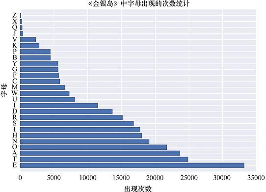

> **圖片描述：** 此圖展示《金銀島》一書中每個字母（含數字、空格和標點）的使用頻率長條圖。字母e的頻率最高，其次是t、a、o等，整體分佈與標準英語字母頻率分佈大致吻合。

圖6.6　由羅伯特·路易斯·史蒂文森所著的《金銀島》一書中每個字母的使用頻率。一個字母的大小寫都被統一記錄

圖6.6看上去像一個從字母A到字母Z的機率分佈。為了將它做成一個**真正的**機率分佈，我們必須調整尺度，使得所有項的和為1。為此，我們需要做的僅是將圖像的橫座標都調整到正確的值上。結果如圖6.7所示。

現在讓我們用字母的機率分佈來改進透過莫爾斯電碼發送《金銀島》一書的效率。我們將透過一些不同的方法完成這一目標。當然，我們會沿用雙音版本，即點對應著高音，橫線對應著低音，且兩者都持續1滴的時長。

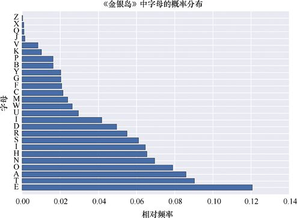

> **圖片描述：** 此圖為《金銀島》中字母的機率分佈圖，將頻率值調整為所有項之和為1的機率分佈形式。分佈形狀與頻率圖相同，但縱軸改為機率值。

圖6.7 《金銀島》中字母的機率分佈

讓我們從一個假想版本的莫爾斯電碼開始。在這個版本中，維爾先生沒有抽空去那個報紙辦公室。相反，不妨先說他希望為每個字符分配相同數量的點和橫線符號。如果用4個符號，那麼他僅可以標註16個字符，但如果用5個符號，他就能標註32個字符。

圖6.8展示了我們如何為每個字符隨機分配5個符號編碼。這是一組**定長編碼**（constant-length code/fixed-length code）的例子。

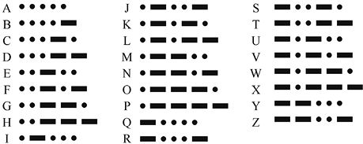

> **圖片描述：** 此圖展示定長編碼的範例，為每個字母分配5個符號（點或橫線）的固定長度編碼。26個字母和額外字符各有一組5個符號的隨機編碼。

圖6.8　為每個字符都分配5個符號編碼，這就是一組定長編碼

記住，點和橫線現在分別用一個低音和一個高音來發送，每個音持續1滴的時長。

在圖6.8中，我們並沒有為空格創造一個字符，這是遵循了原始莫爾斯電碼的做法。因為空格並沒有一個明確的字符，要計算它們的數量就會有些麻煩，所以我們在後面的討論中都忽略字母與單詞中間的空格。

在《金銀島》的文本中，最開始的兩個單詞是名字“Squire Trelawney”。由於每個字符都需要5個符號，這個由15個字符組成的短語（請記住我們忽略了空格）需要5 × 15=75個符號，如圖6.9所示。其中展現了所有75個點與橫線。

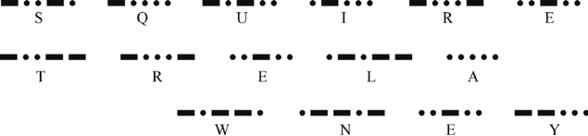

> **圖片描述：** 此圖展示用定長編碼表示《金銀島》前兩個單詞「Squire Trelawney」的結果，共需要75個符號（15個字符×5個符號/字符）。每個字符的編碼以黑點和白點交替顯示。

圖6.9　用定長編碼來表示《金銀島》裡的前兩個單詞

現在我們將它和實際的莫爾斯電碼做個比較。在實際的莫爾斯電碼中，通常來說，最常見的字母比不太常見的字母需要的符號要少，如圖6.10所示。

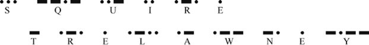

> **圖片描述：** 此圖展示用標準莫爾斯電碼表示同一段文字的結果，僅需37個符號。常用字母（如e、r）使用較短的編碼，因此總符號數大幅減少。

圖6.10　用莫爾斯電碼來表示《金銀島》裡的前兩個單詞

如果我們統計一下符號數量，就會發現這裡僅用了37個符號。由於每個符號（點或橫線）在雙音修改版本中都持續相同的時長，因此這個由37個符號組成的莫爾斯電碼版本只花了定長編碼版本所需時間的一半（37/75≈0.5）。這一時間的節省就來自編碼對於發送內容的適應。

我們將任何試圖透過匹配短編碼模式與高機率時間的方法稱為**可變比特率編碼**（variable bit rate code），或者更簡單地，稱為**自適應編碼**（adaptive code）。即使在這個簡單的例子中，自適應編碼的效率幾乎比定長編碼高了一倍，從而將通信時間縮短了幾乎一半。

讓我們再來看看《金銀島》的完整文本，其中包含了約33.8萬個字符（包括空格、標點符號等）。如果用5個符號的定長編碼，則需要約170萬個符號來傳輸整本書；如果用標準莫爾斯電碼，則需要約70.7萬個符號，即僅需要定長編碼符號數量的約42%！我們可以用遠少於非自適應編碼所需時間的一半來發送這本書。

我們甚至可以做得更好。除了應用標準莫爾斯電碼，我們還可以將字母分佈更加精準地與它們在書中的實際佔比相匹配。當然，我們需要與接收者分享我們精妙的編碼，但如果我們發送的是一個很長的消息，那麼相較於消息本身，這點額外的通信可以忽略不計。

將編碼調整至與消息內容相匹配的思想是我們討論內容的核心，所以我們就直奔主題。莫爾斯電碼根據英語中字母出現的平均頻率做出了適應調整，因此我們可以用它來消除消息中的許多符號，加快通信速度。但如果我們進一步採取措施，不用莫爾斯電碼，而是完全根據《金銀島》的內容另外建立一個“金銀島編碼”，甚至可以節約更多時間。這一思想引出了著名的**哈夫曼編碼**，並極大地縮短了發送一則消息所需要的時間（見[Huffman52]）。

讓我們用機率論的語言來複述一遍。

自適應編碼為一個機率分佈中的每個值都創造了一種編碼模式。擁有最高機率的值可以得到最短的編碼。然後我們就遵循這一原則為其他所有值分配儘可能短但又不重複的編碼，從機率最高的值直到機率最低的值。這意味著新分配的編碼的長度總是大於或等於先前分配的編碼。

這就是維爾先生在1844年所做的，他根據自己在當地報紙的排版員使用的字母箱中統計的字母數量完成了這一工作。

現在我們可以查看任何接收到的消息，識別每個字符，並將它與其機率分佈加以比較，而該分佈會先告訴我們這個字符的符號有多大。這告訴我們該字符攜帶了多少比特的資訊。根據我們在討論計算資訊量的公式時提到的第4條性質，用來表示消息所需要的比特數就是每個字符需要的比特數之和。

我們同樣可以在發送一則消息以前完成這一過程。這將告訴我們有多少資訊是需要和接收者進行通信的。

## 6.7　熵

回顧一下，圖6.7為我們提供了《金銀島》一書中所有字母的機率分佈。

現在假設有人給我們發了一封信，並且信中的內容是從《金銀島》中隨機抽取的字母。也就是說，可以看作某人完全是從這一字母的機率分佈中抽取字符的。

在不知道他們選擇了哪些特定字母的情況下，我們可能會接收到多少資訊呢？換句話說，在給予了圖6.7所示的機率分佈的情況下，假如我們接收到了一定量的從中抽取的字符，那我們每接收到一個字符，平均有多少資訊可以被接收到呢？

有一個公式能夠幫助我們以比特為單位確定這一個量的值。這個量被稱為**熵**（entropy），或者有時也稱為**香農熵**（Shannon entropy），以此紀念第一位提出這一思想的科學家（見[Serrano17]）。

熵同時取決於消息內容和機率分佈函數。如果我們用一個機率分佈函數來計算一則消息的熵，然後用另外一個機率分佈函數來計算同一則消息的熵，通常會得到兩個不同的結果。

讓我們把關注點從字母轉移到完整的單詞上。這給了我們一個可以確確實實地深入瞭解不同稿件間差別的機會，因為雖然作者都使用相同的26個字母（加上大小寫字母、標點符號等），但是他們一定不會完全使用一模一樣的單詞。

先從考慮單詞的集合的熵開始。假設我們有了一個編碼模式，這種編碼可以用不同的數字（序號）來表示每一個單詞。比如，7也許表示“快樂”，38042也許表示“石榴”，諸如此類。如果我們採用的是自適應編碼，那麼更短的數字比起更長的數字在發送時所需要的比特數更少。因此我們發送38042來代表一次“石榴”的比特數，也許可以抵得上我們發送多次代表“快樂”的數字7。這個想法有點像我們在本章之前討論過的意外程度量表。

現在假設我們有兩種不同的編碼，它們都包含了絕大部分英語單詞，但它們為單詞分配數字的方式不同。

比如，假設第一種編碼是為單詞“記住”出現的次數很多的文本所設計的，那麼表示這個單詞的數字就比較小；第二種編碼則是為那些“記住”一詞出現頻率不那麼高的文本設計的，那這個單詞就會被分配到一個更大的數字。當我們用這兩種編碼來發送消息時，每種編碼所需要的比特數取決於那則消息中的單詞出現頻率與這個編碼所假設的單詞出現頻率的匹配度。比如，如果單詞“記住”在一則消息裡出現得比較頻繁，那麼採用第二種編碼就會比採用第一種編碼需要更多的比特數來發送這則消息。

圖6.11展示了《金銀島》開頭第二段的第一句話，我們給每個單詞用兩種虛構的編碼分配了數字，並展示了發送它們所需要的比特數。

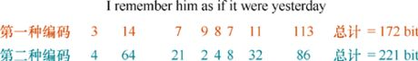

> **圖片描述：** 此圖展示《金銀島》開頭第二段的第一句話，每個單詞分別用兩種不同的編碼方案編碼。顯示了每個單詞在兩種編碼下所需的比特數。例如「記住」在編碼1需要14比特，在編碼2需要64比特。

圖6.11 《金銀島》開頭第二段的第一句話。每個單詞都由一種特定的編碼分配了一個數字。這裡展示了用兩種不同的編碼發送這些單詞所對應的數字所需要的比特數。例如，採用編碼1，需要14比特來發送單詞“記住”；而採用編碼2，則需要64比特來發送這一版本的“記住”

圖6.11中的第一種編碼比第二種編碼更好地匹配了文本，雖然對於某些單詞來說，第二種編碼為它們分配了更小的數字。總的來說，如果採用第一種編碼，我們會比採用第二種編碼需要更少的比特數來發送這則消息分別對應的數字。

由於熵告訴我們平均來看一則消息中的每個字符傳遞了多少資訊，我們同樣可以進行反推。給定一則任意的消息以及一個機率分佈函數，我們就能估算出發送這則消息所需要的比特數。

讓我們這樣來看待這個問題。假設有一個機率分佈函數，從中隨機地取出一些字符，是否可以描述出自己有多確定，或者多不確定地選擇了哪個字符呢？我們正好可以用熵來回答這個問題（見[Hopper17]）。

假設機率分佈函數是由單詞組成的。事實上，它僅包含一個單詞“大黃”。這樣我們就能完全確定我們從這個分佈函數中所取出的任意一個單詞都會是“大黃”。

現在假設這個機率分佈函數由兩個單詞組成，其中取到“大黃”的機率是0.25，而取到“檫樹”的機率是0.75。那我們就可以75%確定地說從中隨機取到的單詞將是“檫樹”。

我們可以將這個想法推廣到由更多的單詞組成的更大的機率分佈函數（或者其他任何類型的資料）。透過將不同的機率以香農的公式相結合（見[Shannon48]），我們可以得到一個代表這個分佈的**熵**的值。如果分佈中只有一個事件，熵就是0；如果有許多的事件且它們的發生機率都是0，而僅有一個事件的機率是1，熵也會是0；當分佈中的所有事件都擁有相同的機率時，熵會最大。

因此我們可以為整個分佈確定一個熵值，方法就是透過某種方式對其中每個事件的機率進行組合。這個熵能告訴我們收到一個來自該分佈的字符時，我們應該期待收到的資訊量。

換句話說，一個機率分佈函數的熵是該分佈中資訊量的預期值。因此熵可以告訴我們對於從該分佈中抽取的事件，平均來看我們應該預期接收到多少資訊量。

“熵”這個詞在其他領域中以類似但不同的方法被使用，它通常用於表示一個系統中的有序度（或者無序度）。我們可以將這兩種對於熵的常見解釋進行聯繫，透過將一個系統的有序度和這個系統所蘊含的資訊量相關聯。通常來說，我們將組織某個事物看作需要資訊，因此一個東西（比如一家公司、一座大樓或者一個分子）裡的結構越多，那它就蘊含著越多的資訊。

## 6.8　交叉熵

我們將定義一個名為“**交叉熵**”（cross-entropy）的關鍵思想。它和我們剛才討論的熵的思想有關。當我們要測量一些神經網路中的誤差時，它將起到一些作用。

為了在正式討論它之前獲得關於這一思想的一些直觀感受，我們看看另外兩本小說，併為它們分別建立一個基於單詞的自適應編碼。

### 6.8.1　兩種自適應編碼

《金銀島》與《哈克貝利·費恩歷險記》都是用英文寫成的（見[Stevenson83]和[Twain85]）。也就是說，它們由同一個集合裡的單詞寫成。雖然在每本書裡，特別是在對話裡，都會有一些也許不存在於任何詞典中的單詞，但是我們先暫且忽略它們，並且假設兩本書都基於同一核心單詞的集合寫成。

兩本書都有大約相同的詞彙量：《金銀島》用了大約10700個不同的單詞，而《哈克貝利·費恩歷險記》則用了大約7400個不同的單詞。當然，它們用的是不同的單詞集合，但是有著相當大的重合度。

我們看看在《金銀島》中最常出現的25個單詞，如圖6.12所示。為了統計這些單詞，我們把所有大寫字母都轉換成小寫字母（因此“With”和“with”將被視作同一個單詞）。由一個字母組成的單詞“I”也因此在表格中以小寫的“i”呈現。

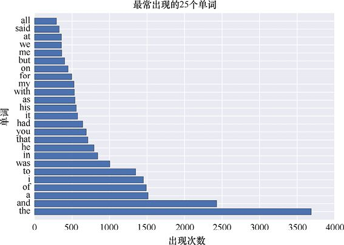

> **圖片描述：** 此圖展示《金銀島》中最常出現的25個單詞列表，按出現次數降序排列。最常見的是「the」，其次是「and」「i」「of」「a」等。

圖6.12 《金銀島》中最常出現的25個單詞，以出現次數排序

讓我們把它們與《哈克貝利·費恩歷險記》中最常出現的25個單詞（見圖6.13）做個比較。

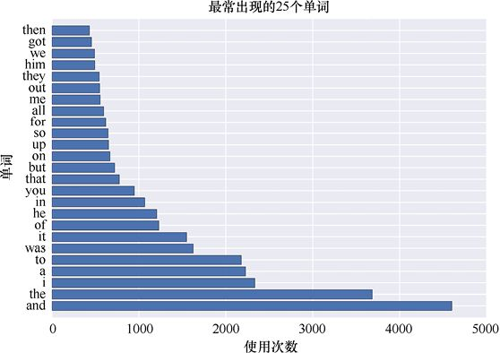

> **圖片描述：** 此圖展示《哈克貝利·費恩歷險記》中最常出現的25個單詞列表。最常見的是「and」，其次是「the」「i」「a」等。與《金銀島》的排名有所不同。

圖6.13 《哈克貝利·費恩歷險記》中最常出現的25個單詞，以出現次數排序

“but”在第一本書裡不是最常見的17個單詞之一，但在第二本是最常見的17個單詞之一，所以我們沒有看懂這句話的意思。

假設我們想要一個單詞接著一個單詞地傳輸兩本書的文本內容，那麼可以給兩本書中的所有單詞都按字母表順序排列，然後給每個單詞分配一個數字，從1開始，然後是2、3……以此類推。

但是我們從莫爾斯電碼的例子中知道，透過採用針對發送內容改編過的編碼，可以大大提高發送資訊的效率。因此讓我們來創造這樣一種編碼，其中出現頻率越高的單詞將被分配一個越小的編碼。這樣，出現頻率高的單詞如“the”和“and”就可以用一些短編碼來發送，而比較稀有的單詞就會擁有較長的編碼，並且需要更多的比特數來發送（在《金銀島》裡大約有2780個單詞僅出現了一次；在《哈克貝利·費恩歷險記》裡則大約有2280個單詞僅出現了一次）。

讓我們從《金銀島》開始。我們將為這個文本設計一種自適應編碼，從編碼很短的單詞“the”開始，逐步擴展到那些編碼很長的、僅出現過一次的單詞，比如“wretchedness”。現在我們可以用這種編碼來發送一整本書，並且比起用字母表順序創造的編碼或者定長編碼而言，要節約不少的時間。為了給之後的討論做準備，我們同樣會把那些出現在《哈克貝利·費恩歷險記》中而沒有出現在《金銀島》中的單詞也包括進來，這樣也可以用這種編碼發送那本書。

現在我們對《哈克貝利·費恩歷險記》做同樣的工作。我們將設計一種特別為這個文本準備的編碼，把最短的編碼分配給單詞“and”，並且把比較長的編碼分配給那些只出現過一次的單詞，比如“dangerous”（這確實令人感到驚訝——“dangerous”僅在《哈克貝利·費恩歷險記》裡出現過一次！）。與其他先前討論過的編碼相比，這種編碼可以讓我們更快速地發送整本書的內容。如先前做的那樣，我們同樣會在這種編碼中將那些出現在《金銀島》中但是沒有出現在《哈克貝利·費恩歷險記》裡的單詞包括進來。

我們可以注意到兩種編碼都是透過兩本書中的單詞出現頻率來設計的。對這兩種編碼我們有兩個很重要的結論。

首先，我們的兩種編碼是不同的。我們可以看到最開始編碼的那些單詞是相同的，但那之後，兩本書中的單詞出現頻率就變得不同了。這是在意料之中的，因為兩本書講的內容主題很不一樣，所以它們使用單詞的頻率也不一樣。

其次，兩種編碼都是從相同的詞彙表中被選取出來的。這也就是說，除去在某些古怪對話中的單詞，它們用的都是能在詞典中找到的英語單詞。請記住我們假設兩本書中的所有單詞都包括在了兩種編碼中，因此我們可以用任意一種編碼來發送任意一本書。

雖然兩本書用的都是英語單詞，但它們的單詞順序卻不一樣：大多數同時被兩本書使用的單詞都以不同的頻率出現在兩本書中，並且有些單詞僅出現在一本書中。比如，單詞“yonder”在《哈克貝利·費恩歷險記》裡出現了20次，在《金銀島》裡卻一次都沒出現過；而單詞“schooner”在《金銀島》裡出現了28次，在《哈克貝利·費恩歷險記》裡卻沒有出現過。

### 6.8.2　混合編碼

現在我們有了兩種編碼，每一種都能用來傳輸所有英語單詞。《金銀島》編碼是適應了每個單詞在該書中出現的次數的，同樣，《哈克貝利·費恩歷險記》編碼也根據該書的內容進行了調整。

**壓縮比**（compression ratio）可以告訴我們一種自適應編碼能節省多少比特數。如果這個比例是1，那自適應編碼就和非自適應編碼需要的比特數一樣；如果比例是0.75，那麼自適應編碼只需要非自適應編碼3/4的比特數。壓縮比越小，節省比特數就越多（有些作者對這個比值使用了相反的定義，所以會導致比值越大，壓縮的效果就越好）。

讓我們嘗試一個單詞接一個單詞地發送這兩本書。圖6.14中上方的橫條顯示了我們用為《哈克貝利·費恩歷險記》專門設計的編碼編譯該書所得到的壓縮比。我們用的是之前提到的哈夫曼編碼，不過結果與大部分的自適應編碼基本相似（見[Wiseman17]）。

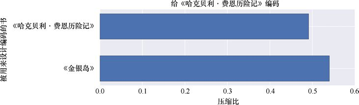

> **圖片描述：** 此圖展示兩條水平長條比較。上方長條顯示用《哈克貝利·費恩歷險記》專用編碼編譯該書的壓縮比（略小於0.5）；下方長條顯示用《金銀島》編碼編譯同一本書的壓縮比（約0.54），效果較差。

圖6.14　用自適應編碼來編譯《哈克貝利·費恩歷險記》編譯。上方：用為該文本設計的編碼編譯該書所得到的壓縮比。下方：用為《金銀島》設計的編碼編譯該書所得到的壓縮比

這個結果相當不錯。自適應編碼取得了比0.5還略小一些的壓縮比。這意味著用這種編碼發送《哈克貝利·費恩歷險記》，會比使用定長編碼需要的比特數少一半還多。

現在讓我們試試新方法，用為《金銀島》設計的編碼來編譯《哈克貝利·費恩歷險記》。與所預料的一樣，這種編碼方式的壓縮比就沒有這麼小了，因為這樣編碼中的數字就不會完美地與要編譯的內容匹配了。圖6.14中下方的橫條顯示了這樣一種結果，它的壓縮比大約是0.54。與我們的預期一致，這確實沒有前面那種方法好。

現在讓我們把條件轉換一下，來看看用為《金銀島》設計的編碼編譯這本書的時候表現怎麼樣。我們也同樣用為《哈克貝利·費恩歷險記》設計的編碼來編譯《金銀島》，結果如圖6.15所示。

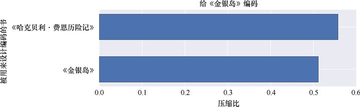

> **圖片描述：** 此圖展示用兩種編碼編譯《金銀島》的壓縮比比較。上方為用《哈克貝利·費恩歷險記》編碼的壓縮比（較大），下方為用《金銀島》專用編碼的壓縮比（較小，效果最好）。

圖6.15　用自適應編碼來編譯《金銀島》。上方：用為《哈克貝利·費恩歷險記》設計的編碼編譯該書所得到的壓縮比。下方：用為該文本設計的編碼編譯該書所得到的壓縮比

這次我們發現《金銀島》編碼比《哈克貝利·費恩歷險記》編碼的壓縮效果更好。這很容易理解，因為我們用了一種適應了該文本單詞使用規律的編碼。

通常來說，發送任意消息最快的方式是用一種為該消息的內容專門設計的編碼。沒有任何其他的編碼能夠表現得更好，且它們中的大多數都會表現得很糟。

有一個公式可以告訴我們一種編碼與文本匹配的質量。這個公式計算了發送這則消息時每個單詞所需要的平均比特數。這個數值就是所謂的“交叉熵”。

交叉熵越大，發送每個單詞所需要的比特數就越多。我們可以透過計算交叉熵來檢驗一種編碼是否適合被用來發送一則已知文本。如果我們需要比較兩種編碼發送消息的效率，那麼效率更高的那個，就是具有更小交叉熵的編碼。

我們將在第20章中訓練神經網路時看到交叉熵的應用。我們通常會用交叉熵的方式計算誤差。

讓我們再從另外一些書裡看看交叉熵的內容。在圖6.16中，我們用了4種自適應編碼來編譯《金銀島》。其一是為《金銀島》所設計的編碼，其二是為《哈克貝利·費恩歷險記》所設計的編碼，還有分別為《雙城記》（見[Dickens59]）以及《堂吉訶德》（見[Cervantes05]）的英文翻譯版所設計的編碼。我們能在古騰堡項目中找到它們（見[ProjectGutenberg18]）。

正如我們所看到的那樣，發送《金銀島》最有效率的方式就是用為這本書中的單詞所設計的自適應編碼，而不是為其他書中的單詞所設計的編碼。

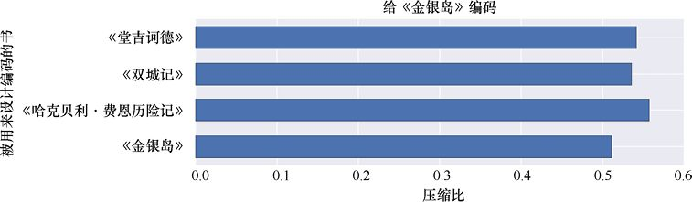

> **圖片描述：** 此圖展示用四種不同書籍的自適應編碼編譯《金銀島》的壓縮比比較。四本書分別為《金銀島》、《哈克貝利·費恩歷險記》、《雙城記》和《乘吉訶德》。用《金銀島》自身編碼的壓縮比最小（效率最高）。

圖6.16　用取自4本不同圖書的編碼來編譯《金銀島》所取得的壓縮比。為《金銀島》該書所設計的編碼效率最高

## 6.9　KL散度

交叉熵告訴我們用一種特定編碼來發送一則消息的每個單詞所需要的平均比特數。這個平均值在我們採用最佳的編碼時最小，而最佳的編碼就是我們特別地為這則消息所設計的編碼。

但是設計一種編碼會相當耗費時間。也許我們可以用一些已經建立好並且可用的編碼，而且它們中的一種已經足夠好了。為此我們將探討一下編碼的**代價**（expense）。可以想象，有些代價會在發送任意一個比特時產生，因此發送的比特數越多，這個傳輸所需要的代價就越大。如果有一種編碼對於發送一則消息需要的代價比另一種編碼更小，它就對那則消息有更好的壓縮效果，也就會需要更少的比特數。

為了確定用特定編碼發送特定消息的壓縮質量，我們需要知道為了用這種編碼發送那則消息所需要付出的增加代價。總之，如果增加代價為0，就意味著我們取得了一個與最佳編碼表現同樣好的編碼，也就說明我們找到了一個完美的編碼。

對於任意一種編碼所需要的平均比特數與最佳編碼所需要的平均比特數的差別，我們可以用使用那一種編碼的熵（或者說代價）減去使用最佳編碼的熵來表示。

這個差別有著各種各樣的名字。最常被使用的是Kullback–Leibler**散度**（Kullback–Leibler divergence），或者簡稱為KL**散度**（KL divergence）。這個名字是由發表了計算該差值的公式的科學家名字組成的。還有一些叫法不太常用的名字，如**鑑別資訊**、**資訊散度**、**有向散度**（directed divergence）、**資訊增益**（information gain）、**相對熵**（relative entropy）以及KLIC（也就是Kullback-Leibler資訊準則的縮寫）。

另一種解釋方式是，KL散度告訴我們獲取透過一種機率分佈函數來產生的資訊的代價是什麼。它會透過一種為另一個不同的機率分佈函數所設計的編碼表示。

為了計算使用《哈克貝利·費恩歷險記》編碼來發送《金銀島》所產生的KL散度，我們將調整《金銀島》中單詞使用次數的尺度，來使它們符合圖6.17所示的機率質量函數。

我們同樣展示了在《哈克貝利·費恩歷險記》中相同單詞的出現頻率。可以發現，在《金銀島》中最常出現的單詞“the”比起《哈克貝利·費恩歷險記》中要出現得更加頻繁。因此，使用《哈克貝利·費恩歷險記》編碼來發送“the”所需要的比特數就會漸漸地比使用《金銀島》編碼來發送該單詞的比特數要更多。

為了定義KL散度，我們透過一個公式來找出這些不一致的大小，然後將它們加在一起，對那些較常見單詞與較不常見單詞的懲罰進行加權。

如果我們略過數學推導，使用《哈克貝利·費恩歷險記》編碼來發送《金銀島》的KL散度大約是0.287——可以寫作“KL（《金銀島》||《哈克貝利·費恩歷險記》）”。與其他常見符號一樣，這一表示的中間兩條豎線可以被看作一個簡單的分隔符。由此表明：對於每個單詞，我們需要“付出”額外的大約0.3比特。因為我們用了錯誤的編碼（見[Kurt17]）。

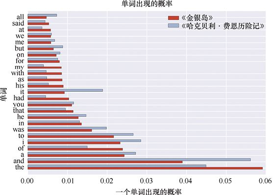

> **圖片描述：** 此圖展示《金銀島》和《哈克貝利·費恩歷險記》中常見單詞的出現機率對比長條圖。每個單詞有兩根長條，分別顯示在兩本書中的出現機率。例如「the」在《金銀島》中出現機率更高。

圖6.17 《金銀島》中常見單詞的出現機率以及這些單詞在《哈克貝利·費恩歷險記》中的出現機率

可以看到，KL散度並不是對稱的，因為在兩本書中的單詞出現機率是不一樣的，且這些機率被用來為不匹配性做權重的衡量。用《金銀島》編碼來發送《哈克貝利·費恩歷險記》所產生的KL散度，或者說“KL（《哈克貝利·費恩歷險記》||《金銀島》）”要大得多，大約為0.5。

KL散度足以說明用一種並非是最佳編碼的編碼時所產生的代價。有時候我們也許希望採用一種已有的並非最佳的編碼，而不是建立一種全新的編碼。

## 參考資料

[Bellizzi11]　Courtney Bellizzi, *A Forgotten History： Alfred Vail and Samuel Morse*, Smithsonian Institution Archives, May 24, 2011.

[Cervantes05]　Miguel de Cervantes, *The Ingenious Nobleman Mister Quixote of La Mancha*, published by Francisco de Robles, 1605.

[Dickens59]　Charles Dickens, *A Tale of Two Cities*, Chapman & Hall, 1859.

[Hopper17]　Tim Hopper, *Entropy of a Discrete Probability Distribution*, tdhopper.com, 2017.

[Huffman52]　David A. Huffman, *A Method for the Construction of Minimum-Redundancy Codes*, Proceedings of the IRE, volume 40, number 9, 1952.

[Kim16]　Wonjoo Kim, Anupam Chattopadhyay, Anne Siemon, Eike Linn, Rainer Waser, and Vikas Rana, *Multistate Memristive Tantalum Oxide Devices for Ternary Arithmetic*, Nature Scientific Reports, Article 36652, 2016.

[Kurt17]　Will Kurt, *Kullback-Leibler Divergence Explained*, Count Bayesie blog, 2017.

[Wikipedia17]　Wikipedia authors, *Letter Frequency*, Wikipedia, 2017.

[McEwen97]　Neal McEwen, *Morse Code or Vail Code?*, 1997.

[Pope88]　Alfred Pope, *The American Inventors of the Telegraph, which Special References to the Services of Alfred Vail*, The Century Illustrated Monthly Magazine, April, 1888.

[ProjectGutenberg18]　Project Gutenberg creators, Project Gutenberg main site, 2018.

[Longden87]　George Longden, *G3ZQS’ Explanation of how FISTS got its name*, FISTS CW Club, 1987.

[Serrano17]　Luis Serrano, *Shannon Entropy, Information Gain, and Picking Balls from Buckets*, Medium, 2017.

[Seuss60]　Dr. Seuss, *Green Eggs and Ham*, Beginner Books, 1960.

[Shannon48]　Claude E. Shannon, *A Mathematical Theory of Communication*, Bell Labs Technical Journal, July, 1948.

[Stevenson83]　Robert Louis Stevenson, *Treasure Island*, 1883.

[Twain85]　Mark Twain, *Adventures of Huckleberry Finn (Tom Sawyer’s Comrade)*, Charles L. Webster and Company, 1885.

[Wikipedia17a]　Wikipedia, *shannon (unit)*, 2017.

[Wiseman17]　John Wiseman, *A Quick Tutorial on Generating a Huffman Tree*, SIGGRAPH Education Materials, 2017.

