# 第1章　機器學習與深度學習入門

本章簡要介紹貫穿本書的概念、語言和技術。

## 1.1　為什麼這一章出現在這裡

本章旨在幫助你熟悉機器學習的重要理念和基本術語。

**機器學習**（machine learning）這一術語涉及越來越多的技術，這些技術都有一個共同目標，那就是從資料中發現有意義的資訊。

其中，“資料”是指任何可以被記錄和測量的東西。它可以是原始資料（如連續幾天的股票價格、不同行星的質量、小城集市裡人們的身高），也可以是聲音（如某人的手機錄音）、圖（如鮮花或貓的照片）、單詞（如報紙文章或小說的文本），抑或是我們想要研究的其他任何東西。

“有意義的資訊”是指我們可以從資料中提取到的任何資訊，在某種程度上，這些資訊對我們而言是有用的。我們可以判斷哪些資訊是有意義的，然後設計一個演算法，從資料中找到儘可能多的這樣的資訊。

“機器學習”一詞涵蓋了廣泛範圍內的各種演算法和技術，雖然明確定義這個詞的精準含義是好的，但由於它對於不同的人來說有不同的用途，因此我們最好把它理解成一個涵蓋了越來越多的各種演算法和原理的統稱，這些演算法和原理的目的是對海量訓練資料進行分析，並從中提取含義。

近來，有人創造了**深度學習**（deep learning），用來指代那些使用特殊分層計算結構的機器學習方法（這些分層依次堆疊），這樣就形成了一個像堆疊的煎餅一樣的“深度”結構。由於“深度學習”指的是所創建的系統的本質，而不是任何特定演算法，因此它實際上指的是一種特定的機器學習方式或方法。近幾年，人們通過該方法取得了大量研究成果。

現在，讓我們來看一下使用機器學習從資料中提取含義的幾個典型應用。

### 1.1.1　從資料中提取含義

郵局每天都需要根據手寫的郵政編碼整理大量的信件和包裹，目前他們已經開始藉助電腦讀取這些編碼並自動分揀郵件，如圖1.1a所示。

銀行需要處理大量的手寫支票：查看總金額欄內手寫的數字金額（如25.10美元）與大寫金額欄內的金額是否一致（如貳拾伍美元拾美分），以判斷支票是否有效。電腦可以同時讀取數字金額和大寫金額，並確認兩者是否相匹配，如圖1.1b所示。

社交媒體網站想要通過照片識別出他們的用戶，這意味著不僅要檢測給定照片中是否有人臉，還要識別人臉的位置，然後將每張臉與之前看到的人臉進行匹配，由於燈光、角度、表情、衣著和許多其他特質都與先前的照片存在差異，並且同一個人的每一張照片都是獨一無二的，因此人臉識別的難度加大了。而社交媒體網站想要的是為任何一個人拍攝一張照片後就可以識別出他的身份，如圖1.1c所示。

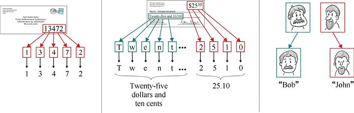

> **圖片描述：** 三個從資料中提取含義的範例。(a) 左側展示一封信封，上方有手寫的郵政編碼「13472」，下方以箭頭指向各個被辨識出的數字 1、3、4、7、2。(b) 中間展示一張手寫支票，上方的數字金額「$25.10」和大寫金額「Twenty-five and 10/100」分別被系統讀取並轉換為文字和數字，用以核對兩者是否一致。(c) 右側展示兩張人臉照片，系統辨識出一位為「Bob」、另一位為「John」，以紅色和藍色方框分別標示。

(a)　　　　　　　　　　　　　　　　　　　　　　　　　　(b)　　　　　　　　　　　　　　　　　　　　　　　　　　(c)

圖1.1　從資料集中提取含義。(a)從信封中獲取郵政編碼；(b)讀取支票上的數字和字母；(c)從照片中識別人臉

數字助手的供應商會聆聽人們對其小工具的回饋，以便智能地做出回應。來自麥克風的信號是一系列數字，這些數字用於描述聲音撞擊麥克風膜時造成的壓力，供應商想要分析它們，以便理解產生它們的聲音，理解這些聲音所屬的詞語以及詞語所屬的句子，最終得到這些句子的含義，如圖1.2a所示。

科學家從無人機、高能物理實驗和深空觀測中獲得大量資料後，往往需要從這些洪流般的資料中挑選出幾個項目實例。這些實例與所有其他的項目都相似，但略有不同。即使不乏許多訓練有素的專家，但要人工查看所有資料也是一項不可能完成的任務，所以最好能夠通過電腦使這個過程自動化。通過電腦實作資料的徹底梳理，不遺漏任何一個細節，如圖1.2b所示。

自然資源保護主義者會隨著時間的推移來追蹤物種的數量，觀察它們的表現，如果物種數量長期下降，那麼他們可能就會採取行動進行干預。如果物種數量穩定或有所增長，那麼他們可能保持觀望。預測一系列值的下一個值也是我們可以訓練電腦去做的事情，圖1.2c（改編自[Towers15]）記錄了加拿大西海岸北部虎鯨種群每年的數量，以及對於這些數量的預測值。

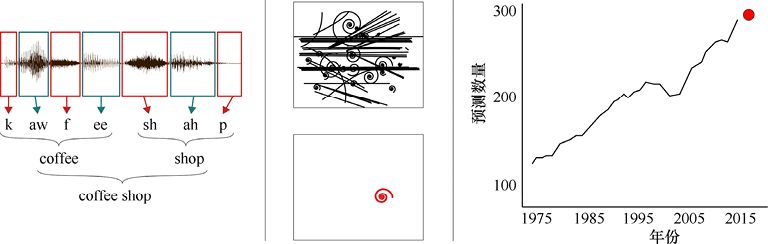

> **圖片描述：** 三個從資料中提取含義的範例。(a) 左側展示語音辨識過程：一段聲波被分割成音節片段「k-aw-f-ee-sh-ah-p」，組合成單詞「coffee shop」。(b) 中間展示粒子加速器的痕跡圖，上方是許多交叉線條的複雜圖案，下方用紅色圓圈標示出一個不尋常事件。(c) 右側是一張折線圖，橫軸為年份（1975-2015），縱軸為預測數量（100-300），顯示加拿大西海岸北部虎鯨種群數量的歷史趨勢及預測值（紅色圓點）。

(a)　　　　　　　　　　　　　　　　　　　　　　　 (b)　　　　　　　　　　　　　　　　　　　　　　　　　　　 (c)

圖1.2　從資料中提取含義。(a)用聲音記錄，之後轉化為文字，最後輸出完整的話語；(b)粒子加速器輸出的痕跡大多是相似的，需要在其中發現一個不尋常的事件；(c)預測加拿大西海岸北部的虎鯨數量

這6個例子展示了為許多人所熟悉的機器學習的應用，其實機器學習還有很多其他應用。由於機器學習演算法能夠快速提取有意義的資訊，因此它的應用領域也在不斷擴展。

在這裡，共同的地方是所涉及的大量工作以及它的詳細細節。我們可能有數百萬條資料需要研究，並從每條資料中提取有用含義。人類會感到疲倦、無聊和心煩意亂，但是電腦可以一直穩定又可靠地完成工作。

### 1.1.2　專家系統

一種發現隱藏在資料中的含義的早期流行方法涉及**專家系統**（expert system）的構建。這個想法的本質是：在研究瞭解人類專家知道什麼、做什麼以及怎樣做後，將這些行為自動化，從本質上說，我們要製造一個能夠模仿人類專家的電腦系統。

這通常意味著構建一個**基於規則的系統**（rule-based system），在這個系統中，我們會為電腦制訂大量的規則，使其能夠模仿人類專家。例如，如果試圖識別郵政編碼中的手寫數字7，我們就可以設計一套這樣的規則：7的形狀是在圖的頂部有一條近乎水平的線，然後有一條近乎對角線的斜線從水平線的右端點延伸到左下角，如圖1.3所示。

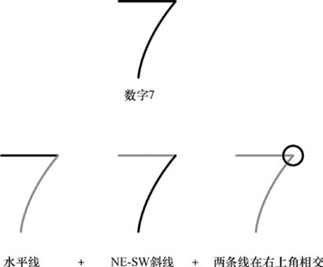

> **圖片描述：** 上方展示一個典型的手寫數字「7」。下方分解為三個組成部分：一條水平線、一條從右上到左下的斜線（NE-SW方向），以及兩條線在右上角相交的條件。如果一個形狀同時滿足這三條規則，就被歸類為數字7。

(a)我們想識別的一個典型的7；(b)組成7的3條規則，如果有一個形狀滿足這3條規則，那麼它被歸為7

對每一個數字，我們都有相似的規則，通常情況下這些規則都可以實作要求，直至遇到圖1.4所示的數字。

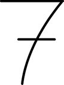

> **圖片描述：** 一個手寫的數字「7」，在中間多了一條橫槓。這種寫法在某些文化中常見，但因為多了一條線，無法被圖1.3中定義的三條規則所識別。

圖1.4　這個7也是一個7的有效寫法，但是它不會被圖1.3的規則識別，因為多了一條線

我們之前沒有考慮到有人會在7的中間加一橫，所以現在需要為這種特殊情況添加另一條規則。

手動調整規則來更好地理解資料的過程有時稱為**特徵工程**（feature engineering）。這個術語也用於描述使用電腦為我們尋找這些特徵的過程，參見本章“參考資料”中的 [VanderPlas16]。

這個術語描述了我們的願景，也就是想要構造（或設計）人類專家完成工作所需的全部特徵（或品質）。總的來說，這是一項非常艱難的工作。正如所看到的那樣，我們很容易忽略一個甚至多個規則，想象一下（以下場景有多困難），你試圖找到一套規則去總結“放射科醫生如何判斷X射線圖像上的斑點是否是良性的”，或者“空中交通管制員如何處理繁忙的空中交通”，抑或“一個人如何在極端天氣條件下安全駕駛汽車”。

誠然，基於規則的專家系統能夠勝任一些工作，但是人工設定一個正確的規則集以及確保專家系統在各種各樣的資料面前都能正確工作是非常困難的，而這個問題也似乎已經註定了其無法作為一種通用解決方法。對於一個複雜的過程，要清晰地表達其每一個步驟已經是極其困難的了，而在有些情況下，我們還需要考慮人類判斷時基於經驗和預感所做的決定，那麼，除非是最簡單的情況，否則這幾乎是不可能完成的事情。

機器學習系統的美妙之處在於（在概念層面上）：它們可以**自動地**學習資料集的相關特徵。我們不需要告訴演算法如何識別2或7，因為系統自己就能夠去總結理解，但要做到這一點，系統通常需要大量的資料，即超大的資料量。

這也是機器學習在過去幾年大受歡迎並得到廣泛應用的一個重要原因，互聯網提供的大量原始資料可以讓機器學習這一工具從大量資料中提取出更多資訊。企業能夠利用與每個客戶的每次交互來積累更多的資料，然後將這些資料作為機器學習演算法的輸入，利用它們為客戶提供更多的資訊。

## 1.2　從標記資料中學習

機器學習的演算法是多種多樣的，我們也將在本書中學習許多機器學習演算法。許多演算法在概念上是很簡單的（儘管它們本身的數學或編程基礎可能很複雜），例如，假設我們想通過一組資料點找到最佳直線，如圖1.5所示。

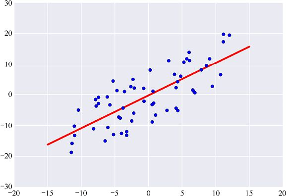

> **圖片描述：** 一張散佈圖，橫軸範圍為 -20 到 20，縱軸範圍為 -30 到 30。圖中有數十個藍色資料點呈現從左下到右上的趨勢，一條紅色直線穿過這些資料點，代表最佳擬合直線。資料點大致沿直線分佈但有一定離散程度。

圖1.5　給定一組資料點，我們可以想象一個直線演算法，它通過這些點來計算出最佳直線

從概念上講，我們可以想象一種演算法，它可以僅用幾個數字來表示任意直線，在給定輸入資料點的情況下，它會用一些公式來計算出這些數字。這是一種常見的演算法，它通過深入、仔細的分析來找到解決問題的最佳方法，然後將這一方法在執行該分析的程式中實作，這是許多機器學習演算法使用的策略。

相比之下，許多深度學習演算法使用的策略就不那麼為人所熟知了，它們需要慢慢地從例子中學習，每次學習一點點，而後一遍又一遍地學習。每當程式看到要學習的新資料，它就會調節自己的參數，最終找到一組參數值——這組參數值便可以很好地幫助我們計算出我們想要的東西。雖然我們仍在執行一個演算法，但它比用於擬合直線的演算法更開放。這裡運用到的思想是指：我們不知道如何直接計算出正確的答案，於是搭建了一個系統，這個系統可以自己搞明白如何去做。我們之所以要分析和編程，是為了創建一種能夠自行求解出屬於它自己的答案的演算法，而不是去實作一個能夠直接產生答案的已知的過程。

如果這聽起來很瘋狂，那就是它本身真的很瘋狂，以這種方式找到它們自己的答案的程式，是深度學習演算法取得巨大成功的關鍵。

在接下來的幾節中，我們會進一步研究這種技術，去了解它，但它可能並不像傳統的機器學習演算法那樣為我們所熟悉。最終，我們希望你可以用它來完成一些任務，例如，向系統展示一張照片，然後由系統返回其中每個人的名字。

這是一項艱鉅的任務，所以讓我們從一些比較簡單的事情開始，來看看幾個學習的示例。

### 1.2.1　一種學習策略

現在，讓我們來思考一種對於教學生而言糟糕的方式，如圖1.6所示。對於大多數學生來說，這並不是實際的教育方式，但這是我們教電腦的方式之一。

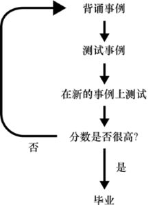

> **圖片描述：** 一個流程圖，由上到下依次為：「背誦事例」→「測試事例」→「在新的事例上測試」→「分數是否很高？」。如果「是」，則進入「畢業」；如果「否」，則箭頭回到最上方的「背誦事例」，形成一個循環。整體描述了一種反覆背誦和測試的學習流程。

圖1.6　這是一種很糟糕的育人方式。首先，讓學生背誦一組事例，然後測試每個學生的背誦情況，之後測試他們沒有接觸過的其他事例。雖然學生並沒有接觸過這些事例，但是如果他們能夠較好地理解第一組事例，那麼就能推導出新給出的事例。如果學生在測試中取得了好成績（尤其是第二門），那麼他就畢業了；否則，就會再次重複這個循環，重新背誦相同的事例

在這種情景下（希望是虛構的），老師會站在教室前面，重複敘述一系列學生應該記住的事例，之後每個星期五下午學生們都要接受兩次測試，第一次測試是根據這些特定的事例對他們進行盤問，以測試他們的記憶力；而第二個測試會在第一次測試之後馬上進行，會問一些學生以前從未見過的新問題，以測試他們對事例的整體理解。當然，如果他們只收到一些事例，那麼任何人都不太可能“理解”這些事例，這也是這種方式糟糕的原因之一。

如果一個學生在第二次測試中表現出色，那麼老師就會宣佈他已經學會了這門課，之後他就可以順利畢業了。

如果一個學生在第二次測試中表現得不好，那麼下個星期他將再次重複同樣的過程：老師以完全相同的方式講述同一個事例，然後還是通過第一次測試來衡量學生的記憶力，再通過第二次新的測試來衡量他們的理解或概括能力。每個學生都在重複這個過程，直到他們在第二次測試中表現得足夠好，才可以畢業。

對於學生來說，這種教育方式是糟糕的，但這確實是一種非常好的教電腦學習的方式。

在本書中，我們將看到許多其他的教電腦學習的方式，但是現在讓我們先來深入瞭解一下這種方式。我們將看到，與大多數人不同的是，每當電腦接觸完全相同的資訊，它都會學到一點點新的東西。

### 1.2.2　一種電腦化的學習策略

從收集我們要教的知識開始：我們需要收集儘可能多的資料。每一項觀測資料（如某一特定時刻的天氣）稱為一個**樣本**（sample）；構成觀測資料的名稱（如溫度、風速、溼度等）稱為它的**特徵**（feature）[Bishop06]，每個被命名的測量資料或特徵都有一個關聯的值，通常被存儲為一個數字。

在為電腦準備資料的過程中，我們需要將每個樣本（即每個資料片段，其中的每個特徵都被賦予一個值）都交給人類專家，由人類專家檢查其特徵併為該樣本註明一個**標籤**（label）。例如，如果樣本是一張照片，那麼標籤可能是照片中人的名字、照片中所顯示的動物的類型、照片中的交通是否順暢或擁堵等。

以測量山上的天氣為例，專家的意見用0～100分表示，它的含義是專家多大程度上認為“這一天的天氣有利於徒步旅行”，如圖1.7所示。

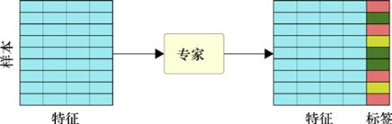

> **圖片描述：** 左側是一個由多行多列組成的資料表格（淺藍色），標示為「樣本」，每一行的各欄位代表不同的「特徵」。資料經過中間的「專家」方框處理後，右側輸出同樣的特徵表格，但在最右邊多了一列彩色的「標籤」欄（紅、黃、綠色），代表專家為每個樣本標記的類別。

圖1.7　我們從一組樣本或資料項目開始對資料集進行標記，每個樣本都由描述它的特徵列表組成，我們將這個資料集交給一位人類專家，由他逐一檢查每個樣本的特徵，併為該樣本註明一個標籤

我們通常會取一些帶標籤的樣本並暫時把它們放在一邊，並將在不久後用到它們。

一旦有了帶標籤的資料，我們就可以把它交給電腦，之後就可以讓電腦找到一種方法來為每個輸入匹配正確的標籤。我們並沒有告訴電腦如何去完成這個動作，而是給了它一個具有大量可調參數（甚至數百萬個參數）的演算法。不同的學習類型會使用不同的演算法，本書的大部分內容都是致力於對它們的研究以及講述如何更好地使用它們。一旦選擇了一個演算法，我們就需要通過它來運行一個輸入，從而產生一個輸出。這是電腦的**預測**（prediction），表達了電腦認為該樣本是屬於哪個專家標籤。

當電腦的預測與專家標記的標籤相符時，我們什麼也不會做，但一旦電腦出錯，我們就要求電腦修改它所使用的演算法的內部參數，這樣當我們再次給它相同的資料時，電腦就更有可能預測出正確的答案。

這基本上是一個反覆試驗的過程，電腦盡其所能給我們正確的答案，如果失敗了，它就會遵循一個程式來改變和改進。

一旦做出預測，我們就只檢查電腦的預測與專家的標籤是否匹配，如果它們不匹配，我們會計算出一個**誤差**（error），也稱為**代價**（cost）或**損失**。這是一個數值，用於告知演算法離正確結果還有多遠。該系統會根據其內部參數的當前值、專家的預測結果（當前已知）以及自己的錯誤預測來調整演算法中的參數，以便在再次看到這個樣本時預測正確的標籤。稍後我們將仔細研究這些步驟是如何執行的。圖1.8展示了上述過程。

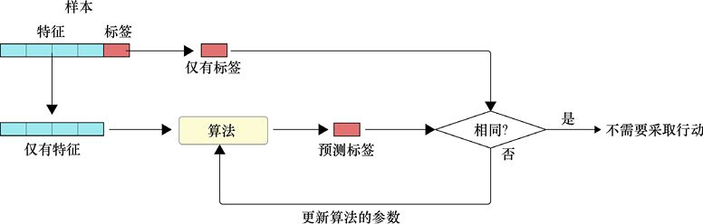

> **圖片描述：** 流程圖展示訓練的單一步驟。上方將一個樣本分為「僅有特徵」和「僅有標籤」兩部分。特徵輸入「演算法」方框，產生「預測標籤」。預測標籤與實際標籤在菱形的「相同？」判斷框中比較：如果「是」，則「不需要採取行動」；如果「否」，則回饋至演算法，執行「更新演算法的參數」。

圖1.8　訓練（或者說學習）過程的一個步驟。我們將樣本的特徵和標籤分開，根據這些特徵，演算法會預測出一個標籤。我們將預測值與實際標籤進行比較，如果預測標籤與我們想要的標籤相匹配，我們就什麼都不做，否則我們將告知演算法去進行修改或更新，這樣它就不會再犯同樣的錯誤

我們是通過“（1）分析**訓練資料集**中的樣本；（2）針對不正確的預測對演算法進行**更新**”來**訓練**（train）系統**學習**如何**預測**資料的標籤。

我們將在後續章節中詳細討論應該如何進行選擇不同的演算法和更新步驟，目前我們需要知道的是，每個演算法都是通過改變內部參數來實作預測的。每當出現錯誤預測，演算法就可以對其參數進行修改，但是如果修改太多，就會使得其他的預測變得糟糕起來。同樣，演算法也可以只對其參數做很微小的修改，但是這樣會導致學習速度較其他情況而言更加緩慢。我們必須通過對每種類型的演算法和我們所訓練的每一個資料集進行反覆的試驗，才能夠在這兩種極端之間找到正確的平衡。我們把對參數更新的多少稱為**學習率**（learning rate），所以，如果我們採用一個小的學習率，就代表著謹慎和緩慢；而如果採用一個大的學習率，就可以加速整個過程，但也有可能會適得其反。

打個比方，假設我們在沙漠裡，需要用金屬探測器找到一個埋在地下的裝滿東西的金屬盒子。我們會把金屬探測器晃來晃去，如果在某個方向得到響應，我們就會朝那個方向移動。如果我們謹慎一點，每次只走出一小步，就不會錯過盒子或是丟掉信號；但如果我們非常激進，每次邁出一大步，這樣我們就能更快地接近盒子。也許我們可以從大步前進開始，但是隨著離盒子越來越近，我們可以逐漸減小步幅，這也就是我們通常所說的“調整學習率”，通過調整學習率使得在剛開始訓練時對系統的改動很大，但是會逐漸減小這個改動。

有一種有趣的方法可以讓電腦在只記住輸入而不進行學習的情況下獲得高分，為了得到一個完美的分數，演算法所要做的就是記住專家為每個樣本標記的標籤，然後返回那個標籤的值。換句話說，它不需要學習如何計算出給定樣本的標籤值，而只需要在表中查找到正確的答案即可，在前文假設的學習場景中，這就相當於學生在考試中記住了問題的答案。

有時這會是一個很好的策略，稍後我們就會看到，有些非常有效的演算法就遵循了這種方法。但是，如果是讓電腦從資料中學到一些東西，並能夠將所學推廣應用到新的資料中，那麼使用這種有趣的方法往往會適得其反。這種方法的問題在於：系統已經記住了樣本的標籤，導致所有訓練工作都不會給我們帶來任何新的東西，且由於電腦對資料本身一無所知，而只是從表中得到答案，電腦就不知道如何為它從未見過和記住的新資料創建預測。整個問題的關鍵在於我們需要讓系統能夠預測以前從未見過的新資料的標籤，這樣就可以放心地將其應用於會不斷出現新資料的實際場景中。

如果演算法在訓練集上執行得足夠好，但是在新資料上執行得很差，就說該演算法的**泛化**能力很差。現在讓我們看看如何提高演算法的泛化能力，或者說如何學習資料，使得它能夠準確地預測新資料的標籤。

### 1.2.3　泛化

我們會用到1.2.2節中提到的暫時擱置的標記資料。

我們通過向系統展示它之前從未見過的樣本來評估系統對所學知識的**泛化**（generalization），而這個**測試集**（test set）也會向我們展示系統對於新資料的表現。

現在，讓我們來看一個**分類器**（classifier），這種系統會為每個樣本分配一個標籤（標籤描述了該樣本所屬的類別或類）。假如輸入是一首歌，那麼它的標籤可能是歌曲的流派（如搖滾或古典）；假如輸入是動物的照片，那麼它的標籤可能是照片上的動物（如老虎或大象）。而在運行的例子中，我們便可以將每天預期的“徒步旅行經歷”歸為三類：糟糕的、好的和很棒的。

我們會要求電腦預測測試集中每個樣本的標籤（這些都是電腦以前從未見過的樣本），然後比較電腦的預測和專家的標籤，如圖1.9所示。

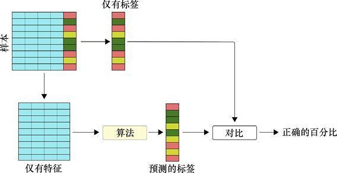

> **圖片描述：** 流程圖展示評估分類器的過程。左上方的樣本表格被分為「僅有特徵」和「僅有標籤」。特徵輸入「演算法」方框，產生「預測的標籤」。預測標籤與實際標籤在「對比」方框中比較，最終輸出「正確的百分比」。與訓練不同，此處沒有回饋或更新步驟。

圖1.9　評估一個分類器的整個過程

在圖1.9中，我們將測試資料拆分為特徵和標籤兩部分，該演算法為每一組特徵分配（或者說預測）了一個標籤。然後，我們通過比較預測的標籤和真實標籤來衡量預測的準確率。如果預測結果足夠好，那麼我們就可以部署系統；如果預測結果不夠好，那麼我們需要繼續進行訓練。注意，與訓練不同，這個過程中沒有回饋和學習，在我們回到明確的訓練模式之前，演算法並不會改變它的參數，不管它的預測結果是否準確。

如果電腦對這些全新的樣本（對於演算法來說是全新的）的預測與專家分配的標籤不匹配，那麼我們將回到圖1.8所示的訓練步驟。我們會把原先訓練集中的每個樣本再給電腦看一遍，讓它繼續進行學習。注意，給出的是相同的樣本，所以我們要求電腦從相同的資料中反覆學習。通常來說，我們會對資料進行**洗牌**，使得樣本以不同的順序到達，但是不會給演算法任何新的資訊。

然後我們會要求演算法再次預測測試集的標籤，如果表現不夠好，我們將再次返回原先的訓練集進行學習，然後再測試，一遍又一遍地重複這個過程。這個過程往往需要重複幾百次，我們一遍又一遍地向電腦展示同樣的資料，而電腦每次都多學習一點。

正如我們之前所說的那樣，這是一種糟糕的教學方式，但是電腦不會因為一遍又一遍地看到相同的資料而感到厭煩或焦躁，它只是不斷學習它能夠學會的東西，之後在每次學習中一點點地變得更好。

### 1.2.4　讓我們仔細看看學習過程

我們通常認為資料中存在某種關聯，畢竟如果它是完全隨機的，我們就不會試圖從中提取資訊。在1.2.3節中，我們所希望的過程是通過向電腦一遍又一遍地展示訓練集，來讓它從每個樣本中一點點地學習，最終該演算法將找到樣本特徵與專家分配的標籤之間的關聯，進而可以將這種關聯應用到測試集的新資料上。如果預測大部分是正確的，那麼我們就說它具有很高的準確率，或者說**泛化誤差**（generalization error）很小。

但是，如果電腦一直無法改進它對測試集標籤的預測，我們就會因無法取得進展而停止訓練。通常我們會修改演算法以期待得到更好的表現，再重新進行訓練。但這只是我們的一種期待，無法保證對於每一組資料都有一個成功的學習演算法，即便有，我們也無法確保一定能夠找到它。好消息是，即使不通過數學運算，電腦也可以通過實踐找到泛化的方法，有時得到的結果比人類專家做得更好。

其中一個導致演算法學習失敗的可能原因是：它沒有足夠的計算資源來找到樣本與其標籤之間的關聯。有時，我們會認為電腦創建了一種底層資料的**模型**（model）。例如，如果我們測量到在每天的前3個小時裡溫度會上升，電腦就可能會構建一個“模型”來表達早上溫度會上升。這只是資料的一個版本，就像小型塑料版本的跑車或飛機是大型交通工具的一種“模型”一樣，我們在前文中所看到的分類器就是一種模型。

在電腦中，模型是由軟體結構和它所用的參數值組成的，更龐大的程式和參數集可以引導模型從資料中學習更多內容，這時我們就說它有更大的**容量**（capacity），或者說**表徵能力**。我們可以把這看作演算法能夠學習的東西的深度和廣度，而更大的容量使我們有更大的能力從已知的資料中發現含義。

打個比方，假設我們在為一名汽車經銷商工作，就需要為所銷售的汽車寫廣告，而市場部已經給了我們一份可以用於描述汽車的“得到認可的詞彙”，工作一段時間後，我們也許就可以學會用這個模型（得到認可的詞彙表）來完美地描述每一輛車。

假設這時經銷商買了一輛摩托車，那麼我們現有的詞彙（或者說現有的模型）就沒有足夠的“容量”來描述這個交通工具——我們的容量只能描述之前描述過的那些交通工具。我們並沒有足夠多的詞彙量來指代有兩個輪子而不是4個輪子的東西，我們可以竭盡所能，但是結果可能並不理想。如果我們可以使用更強大的、有更大容量的模型（也就是說，更多用於描述交通工具的詞彙），就能做得更好。

但是更龐大的模型也意味著更多的工作量，正如我們將在後續章節中看到的那樣：相比小一點的模型，更龐大的模型往往會產生更好的結果，但代價是耗費更多的計算時間和電腦記憶體。

演算法中會隨著時間的推移自主進行修改的值稱為**參數**（parameter），同時學習演算法也會受設定的值所控制（如學習率），這些設定的值稱為**超參數**（hyper parameter）。

參數和超參數的區別在於：電腦會在學習過程中自主調整它自己的參數值，而超參數值則是在我們編寫和運行程式時設定的。

當演算法學得足夠好，能夠在測試集上執行得足夠好，足以令人滿意時，我們就可以將它**部署**（deploy）（或者說**發佈**）。一旦用戶提交了資料，系統就會返回它預測的標籤。

這就是人臉圖如何變成名字、聲音如何變成文字以及對天氣的監測如何變為預報的過程。

現在讓我們回過頭來宏觀地看看整個機器學習領域。如果要對機器學習這一廣闊且持續發展的領域進行調查，那麼需要佔用一整本書的篇幅（參見“參考資料”中的[Bishopo6]和[Goodfellow17]）。接下來，我們介紹當今大多數學習工具的主要分類。在本書中，我們會反覆提到這類演算法。

## 1.3　監督學習

如果樣本帶有預先設定的標籤（就像我們在前文的例子中看到的那樣），就說我們正在進行**監督學習**（supervised learning），這種監督來自標籤，它們控制著圖1.8中的比較步驟，並告訴演算法是否預測了正確的標籤。

監督學習有兩種類型——**分類**（classification）和**迴歸**（regression）。分類是指遍歷一個給定的類別集合，之後找到最適合描述特定輸入的類別；迴歸是指通過一組測量值來預測一些其他的值（通常是下一個值，但也可能是在集合開始之前或中間的某個地方的數值）。

下面讓我們依次來看一下。

### 1.3.1　分類

假設有一組日常用品的照片，照片中有蘋果削皮器、烤箱、鋼琴等，我們想根據照片所展示的東西來對其進行分類，那麼就把對這些照片進行**分類**或**歸類**的過程稱為**分類**或**歸類**。

在這種方法中，我們通過向電腦提供一個列表開始訓練，該列表列出了我們希望電腦學習的所有標籤（或類、類別）。通常，這個列表只是簡單組合了訓練集中所有樣本的所有標籤，去掉了重複項。

然後我們用大量照片和它們的標籤來訓練系統，直到確定它能很好地預測出每張照片的正確標籤。

至此，我們就可以給系統一些以前從未見過的新照片了。我們希望它能正確地標記它在訓練過程中看到的物品的圖像，如果出現無法識別的形狀或者這個形狀在訓練集所包含的類別之外，系統就會嘗試從它所知道的類別中選出最接近的類別，如圖1.10所示。

> **圖片描述：** 四張照片及其分類結果。從左至右：一隻蜂鳥（被正確分類為「蜂鳥」）、一把長柄勺（因未經訓練，被歸類為最接近的類別）、一個船形開瓶器（被分類為「開瓶器」）、一副耳機（因未經訓練，被歸類為「環形活頁夾」等最接近的匹配）。每張照片下方有中文標籤。

圖1.10　在進行分類時，我們用一組圖像訓練一個分類器，每個圖像都有一個相關的標籤。當訓練完成後，我們就可以給它一些新的圖像，之後它會嘗試再去為每個圖像選擇最好的標籤。圖中展示的這個分類器沒有受過金屬勺子或耳機類別的訓練，所以它展示了所能找到的最接近的匹配類別

在圖1.10中，我們使用一個經過訓練的分類器來識別之前從未見過的4個圖像[Simonyan14]，值得稱讚的是，它發現了開瓶器，儘管這個物體被刻意做成一艘船的形狀。然而，該系統並沒有經過與金屬勺或耳機相關的類別訓練，因此在這兩種情況下，它所找到的都只是最接近的匹配。為了正確地識別這些對象，我們就需要在訓練過程中向系統展示更多的相關物品的示例。

另一種看待這種情況發生的方式是：系統只能理解它所學到的東西。傳統的分類器總是盡力為每個輸入找到最接近的匹配，但是它們只能從所知道的類別中選擇。

### 1.3.2　迴歸

假設我們對測量值進行了收集，但是收集結果並不完整，而我們又希望能夠估計缺失的值。例如，我們在持續跟蹤當地體育館舉辦的一系列音樂會的到場觀眾人數，以便根據音樂會的總門票收入，按照一定比例給樂隊支付報酬。

然而，我們計算時漏掉了某個晚上的到場觀眾人數，為了制訂預算，我們就要知道明天的觀眾到場率是多少。測量結果如圖1.11a所示，而我們對缺失值的估計如圖1.11b所示。

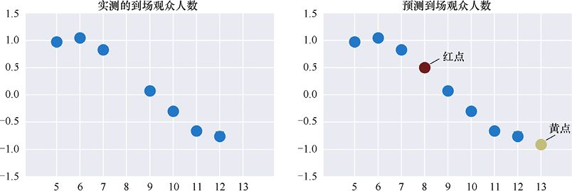

> **圖片描述：** 兩張並列的散佈圖。(a) 左圖標題為「實測的到場觀眾人數」，橫軸為日期（5-13），縱軸為觀眾人數（-1.5到1.5，已正規化），藍色圓點顯示逐日數據，其中5月8日缺少資料。(b) 右圖標題為「預測到場觀眾人數」，在同樣的藍色資料點之外，增加了一個紅色圓點（標示為「紅點」）表示對5月8日缺失值的估計，以及一個黃色圓點（標示為「黃點」）表示對5月13日的預測值。

(a)　　　　　　　　　　　　　　　　　　　　　　　　　　　　　　　　　　　　　　　　　　　　　(b)

圖1.11　在迴歸中，我們需要使用一組輸入和輸出值，這裡的輸入值是5月5日到13日的音樂會日期，而輸出值是到場觀眾人數。(a)實測資料，缺少5月8日的值；(b)紅點是對5月8日缺失點的值的估計，而黃點是對5月13日到場觀眾人數的預測

我們把這種填充和預測資料的過程稱為**迴歸**問題。“迴歸”這個名字可能會讓人產生誤解，因為“迴歸”的意思是回到以前的狀態，但是在這裡似乎沒有任何迴歸的動作。

這一不常見的詞來自發表於1886年的一篇論文，一位科學家在研究兒童的身高（參見“參考資料”部分的[Galton86]）時發現，雖然有些孩子長得高，有些孩子長得矮，但隨著時間的推移，人們的身高會趨於平均。他將此描述為“迴歸至平庸”，意思是測量趨向於從極端走向平均值。

雖然通常來說“迴歸至平庸”這個短語會被認為是來源於Galton的，但在發表得更早的一篇關於達爾文《物種起源》[Darwin59]的不太起眼的文章中，也有一個非常相似的評論。一位名叫Fleeming Jenkin的評論家認為：物種多樣性會被“讓一切迴歸平庸的普適力量”所“湮滅”。

如今，“平庸”一詞帶有一些負面的含義，所以現在這個概念通常稱為“趨均數迴歸”。其中“均數”是一種平均值，而“迴歸”一詞仍然用來表示使用資料的統計屬性來估計缺失值或預測未來值的概念。

因此，“迴歸”問題就是我們有一個取決於輸入的值（如到場觀眾人數是某月某日的函數），之後需要為新的輸入預測一個新的值。

最著名的迴歸是**線性迴歸**（linear regression）。“線性”指的是這種技術會嘗試用直線匹配輸入資料，如圖1.12所示。

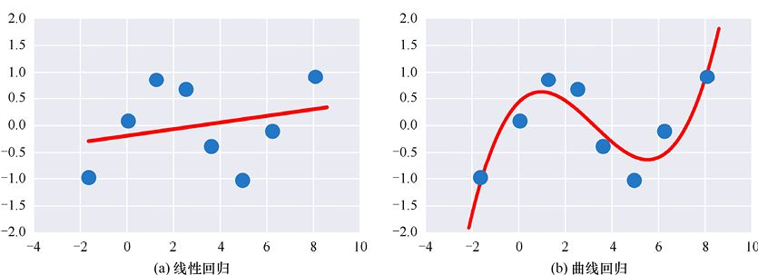

> **圖片描述：** 兩張並列的散佈圖。(a) 左圖標題為「線性迴歸」，橫軸範圍 -4 到 10，縱軸範圍 -2.0 到 2.0，藍色資料點散佈其中，一條紅色直線嘗試擬合這些資料點，但擬合效果有限。(b) 右圖標題為「曲線迴歸」，同樣的藍色資料點，但這次用一條紅色曲線進行擬合，曲線有波動起伏，更貼近資料點的分佈趨勢。

圖1.12　用數學形狀表示資料點。(a)線性迴歸是將直線與資料相匹配，但只有一條線無法與資料很好地匹配，其優點是非常簡單；(b)更復雜的線性迴歸將同一組資料與曲線相匹配，這樣可以更好地匹配資料，但是其形式更復雜，在計算時需要做更多的工作（從而需要更多的時間）

直線很吸引人，因為它很簡單，但在這個例子中可以看到，它無法很好地描述資料——資料是會上下起伏的，這是直線無法捕捉到的。誠然，這不是世界上最糟糕的匹配，但的確也不是一個很好的匹配。

我們可以使用一些更復雜的迴歸形式來創建更復雜的曲線類型，如圖1.12b所示。這些方法可以實作更好的資料擬合，但要耗費更長的計算時間。隨著曲線變得越來越複雜，我們往往需要更多的資料支撐。

## 1.4　無監督學習

當輸入資料沒有標籤時，從這些資料中學習的演算法均稱為**無監督學習**（unsupervised learning）。這只是意味著我們沒有提供標籤來“監督”學習過程，在沒有幫助的情況下，系統必須自行解決所有問題。

無監督學習通常用於解決我們稱之為“**分群**”“**降噪**”和“**降維**”（dimension reduction）的問題。下面讓我們來依次看一下。

### 1.4.1　分群

假設我們正在為蓋新房子挖地基，意外發現了很多舊陶罐和花瓶，於是打電話將情況告知給一位考古學家。她意識到我們發現的是一堆古代陶器，而且認為這些陶器顯然來自不同的地方，也可能來自不同的時期。

這位考古學家無法認出其中的任何標記和飾紋，所以她不能確定每一個標記來自哪裡——有些標記看起來像是某一相同主題的變體，有些看起來則像是不同的符號。

為了解決這個問題，她決定把這些標記拓印下來，然後試著把它們分類。但是她要處理的事情太多了，而她的研究生都在忙其他項目，因此她決定轉用機器學習演算法，希望能以一種合理的方式自動地將標記分類。

圖1.13顯示了所拓印的標記以及演算法自動進行的分類，我們把這類問題稱為**分群**（clustering）問題，並將實作這一過程的演算法稱為**分群演算法**（clustering algorithm）。在實作這一過程時，有許多演算法可供我們選擇，稍後我們將看到各種各樣的分群演算法。如果用我們剛剛提及的術語進行描述，那就是，因為輸入是沒有標籤的，所以這位考古學家正在用無監督學習演算法進行分群。

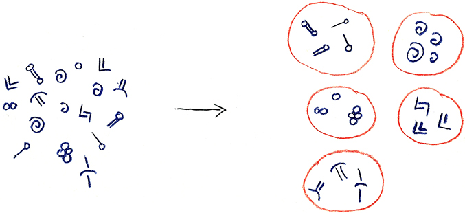

> **圖片描述：** 左側展示許多散落的手繪符號和標記（藍色墨水繪製），包括各種形狀如螺旋、直線、圓圈等。右側經過分群演算法處理後，相似的標記被歸入5個紅色圓圈所圈定的群組中，每個群組包含外觀相似的標記。箭頭從左側指向右側，表示分群處理的過程。

(a)　　　　　　　　　　　　　　　　　　　　　　　　　　　 (b)

圖1.13　使用分群演算法來整理陶罐上的標記。(a)罐子上的標記；(b)相似的標記被分到一個簇中

### 1.4.2　降噪

有時樣本會被**噪聲**（noise）**汙染**，如果樣本是某人對著手機講話的音頻剪輯，那麼噪聲可能是街道的嘈雜背景音，這會讓人們很難分辨出這個人說了什麼。如果樣本是電子信號（可能是廣播或電視節目），噪聲就會以靜電形式侵入（靜電干擾），造成廣播節目中引起注意力分散的聲音或電視圖像中的閃爍點。在合成的或電腦生成的圖像中，我們可以通過省略一些像素來節省時間，這時被省略的部分看起來就是黑色的，對電腦來說，這就是一種“噪聲”，儘管實際上它是資料缺失而不是損壞。

我們的眼睛對噪聲和缺失的像素很敏感，但是資料往往會得到更多的資訊（相比於我們的觀察）。圖1.14顯示了一個噪聲圖的示例以及一個降噪演算法對該示例的處理結果。

> **圖片描述：** 兩張並列的牛的照片。(a) 左圖是一張被大量噪聲像素汙染的棕色牛的正面照，畫面佈滿雜訊顆粒，難以清楚辨識細節。(b) 右圖是同一頭棕色牛的清晰原始照片，牛正面朝鏡頭，背景是清澈的藍天，耳朵上有黃色標籤，對比鮮明地展示了降噪的效果。

(a)　　　　　　　　　　　　　　　　　　　　　　　　　　　　　　　　　　　　　　　　　　 (b)

圖1.14　降噪（或稱為去噪），減少了隨機失真對樣本的影響，甚至可以填補一些缺失的空白。降噪演算法可以在不同程度上成功地恢復圖。(a)一張劣質的有大量噪聲像素和一些缺失像素的牛的圖；(b)原始圖

這種情況不僅適用於圖，當我們使用任何來源的資料時，樣本幾乎都帶有不準確性或其他失真，這些不準確和失真將掩蓋我們想要提取的資訊。

如果這裡有缺失的值，就可以使用迴歸演算法來填充它們，或者把它們當作另一種形式的噪聲，用降噪演算法來填充這些值。

資料是沒有標籤的（例如，在有噪聲的照片中，我們有的只有像素），所以降噪在形式上是一種無監督學習。演算法通過學習樣本的統計資料來評估每個樣本，找出噪聲部分，然後將其去除，留下更容易學習和解釋的純淨資料。

在使用演算法學習資料之前，我們往往需要對資料應用降噪演算法，來刪除輸入中的奇異值和缺失值，使得學習過程更快、更順利。

### 1.4.3　降維

有時，樣本會有一些額外的特徵（本身不需要的）。例如，假設我們於盛夏時節在沙漠中採集天氣的樣本，每天記錄風速、風向和降雨量，如果假定在該季節和地區，每個樣本的降雨量值均為0，那麼在機器學習系統中使用這些樣本時，電腦就需要處理和解釋每一個樣本中無用的、恆定的資訊片段。這樣做，輕則會降低分析的速度，重則會影響系統的準確性。因為電腦會投入其有限的時間和記憶體資源中的一部分，去試圖從這個不變的特徵中學習一些東西。

有時，特徵會包含冗餘的資料。例如，當一個人走進健康中心時，健康中心會記錄下他的體重（單位：kg），然後護士會把他帶到檢查室，這時護士會再次測量他的體重，而這次是以磅為單位，之後將這個資料也放入圖表中。那麼這時，相同的資訊就重複了兩次，但是這很難被識別，因為它們的取值不同，就像無用的降雨量測量一樣。當我們試圖從這些資料中學習時，這種冗餘是沒有任何好處的。

下面講述一個更抽象的例子，它涉及的資料要比實際需要的複雜得多。假設某個國家的森林正在遭受一種未知的傳染病侵害，這種傳染病會損害樹木，林業部門曾試圖將樹幹的一部分放在機器上，讓機器轉動木頭將其刮掉，在此過程中測量木頭的密度，並以此研究這種傳染病在倒下的樹上的擴散情況。這樣做會生成一個三維的資料集，如圖1.15a所示。樹上的每個點都位於這個三維視圖中，並且我們還需要一個值來告訴我們樹被感染的情況。因此，我們需要4個數字來表示這些資料：3個數字用於描述點在空間中的位置，一個數字用於描述它的值。

這裡的立體資訊是很重要的，但是如果我們只是想要順著螺旋的路徑獲得資料，就可以通過扁平化資料來使工作變得更輕鬆，如圖1.15b所示。現在，對於每個資料點來說，我們需要3個數字來描述它：兩個數字用於描述每個點的位置，一個數字用於描述它的值。這將使得我們在不放棄任何對於特定分析來說很重要的資料的情況下，加快對資料的處理速度。

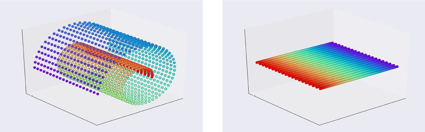

> **圖片描述：** 兩張三維視圖。(a) 左圖展示一個螺旋形的三維資料集，由許多彩色圓點（從紅到藍的漸變色）排列成螺旋狀立體結構，置於透明的立方體框架中。(b) 右圖展示將同樣的資料展開後的二維平面形式，彩色資料點（同樣從紅到藍漸變）被攤平成一個矩形平面，放在同樣的立體框架中，展示了降維的效果。

(a)　　　　　　　　　　　　　　　　　　　　　　　　　　　　　　　　　　　　　　　　　　　 (b)

圖1.15　當樹幹轉動和被刮光時，檢測它被感染的情況。(a)原始資料為三維形式；(b)我們可以通過將資料展開為二維來簡化問題

起初，我們可能可以通過簡化對資料的測量來使得工作更輕鬆，如果做不到，就可以在收集資料之後對它進行簡化，去除與所要解決的問題無關的資訊，這樣電腦就不需要處理這些資訊，這不僅節省了時間，甚至可能提高結果的質量。

例如，假設我們正在監測一條新建的、彎曲的、單向的而且單車道的山路上的交通情況，並且想要確保在所關心的特定路段的交通是安全的，所以我們設置了一些監控裝置，之後就可以週期性地得到一些快照。圖1.16a顯示了每輛車的位置、運行的方向及其沿著我們想要監測的路段行駛的速度。

我們可能傾向於用緯度和經度來描述每輛車的位置，但是這裡還有一種更簡單的方法。由於道路只有一輛車寬，因此我們可以用一個數字來描述每輛車的位置，這個數字可以表明車離這段路的起點有多遠，如圖1.16b所示。

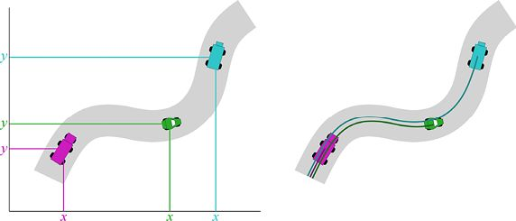

> **圖片描述：** 左側展示一條彎曲的單車道山路，路上有三輛不同顏色的車（粉紅色、綠色、藍色），每輛車旁邊標有 x 和 y 座標框，表示用緯度和經度來定位。右側展示同一條路上的車輛，但這次每輛車只用一個沿路方向的距離值來描述位置，用一條線測量從起點到車輛的距離。

(a)　　　　　　　　　　　　　　　　　　　　　　　　　　　　　　　(b)

圖1.16　這條路上的車輛在哪裡？(a)可以用緯度和經度來測量每輛車的位置，這需要兩個數字（用*x*和*y*進行標記）；(b)還可以測量每輛車沿著路的方向所行駛的距離，這只需要一個數字，這種方法使得資料變得更加簡單

在上述情況下，我們就可以使用無監督學習來分析樣本，並刪除對理解隱含資訊沒有幫助的特徵。通過簡化資料，學習系統可以通過更少的工作進行學習，從而使訓練更快、更準確。

有時候，我們可以通過丟棄一小部分資訊來簡化資料。比如，當我們只是進行粗略的檢查以確保一切正常運行時，如果它能大大簡化運算並提高訓練速度，放棄一些精度也是值得的。

下面讓我們看看如何在監測路況的例子中做到這一點。我們可以在圖1.16中看到如何用一個數字而不是兩個數字來定位車輛的方法，在這種情況下，我們沒有丟失任何資訊。在其他情況下，我們也可以將測量資料結合起來，儘管這樣做會丟失一些資訊，但仍然可以捕獲大部分的資訊。例如，在修改版本的高速公路上，在每個方向上可能都有兩條車道，這樣就確實需要用圖1.16a所示的緯度和經度這兩個數字來準確定位每一輛車。

但如果我們想，也可以使用一個數字來描述車輛的位置，如圖1.17所示。這也為我們提供了非常近似的確定汽車位置的值。

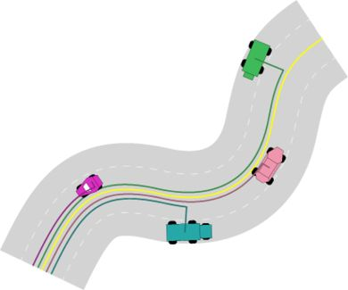

> **圖片描述：** 一條彎曲的雙車道山路俯瞰圖，路上有四輛不同顏色的車（粉紅色、藍色、粉色、綠色）。每輛車旁邊有一條彩色曲線表示其沿道路中心線行駛的距離，以及一條黃色參考線。這種方式假設車輛位於道路中心，用單一距離值來近似表示位置。

圖1.17　如果我們願意捨棄一些準確性，就可以簡化計算。根據需要，我們可以用不同的方式來表示這些車輛的位置

為了確定圖1.17中車輛的位置，我們可以測量它們到左下方路段或道路起始處的距離，就像圖1.16所示的那樣。但是，這樣做是假設每輛車都位於道路中心的情況，當車輛不再位於道路中心時，我們就可以切換到一個更詳盡、更精確的表示方法。這樣做的代價是：通常，更簡單的版本會給出一個更快的訓練和運行的系統，但是往往會包含錯誤。更精確的系統的訓練和運行會更慢，但是更準確。這兩種選擇都是可行的，這取決於系統所需的準確性和速度。

某些情況下，從圖1.17中所得到的近似位置已經足夠精確。

在所有例子中，我們的目標都是簡化資料，所用的方法是刪除不提供資訊的特徵、組合冗餘特徵或是用準確性來交換簡化的資料結果（通過組合或是其他操作特徵的方法）。

在這些情況下，我們都可以使用無監督學習演算法來完成工作。

用無監督學習演算法來找到一種減少我們描述資料所需要的值（或維度）的方法稱為**降維**，這個名稱直觀反映了我們正在減少的每個樣本的特徵 （也稱為維度）的數量。

## 1.5　生成器

假設我們正在拍攝一部電影，一個重要的場景發生在放著波斯地毯的倉庫裡，我們迫切需要倉庫裡有幾十條甚至幾百條的地毯，要地板上有地毯，牆壁上有地毯，中間的大架子上也有地毯，而我們希望每條地毯看起來真實但又與其他地毯有所不同。

但是預算遠沒有多到可以購買或者租借數百條獨一無二的地毯，所以我們只買了幾條地毯，然後交給道具部門並告訴他們“做一些類似於這幾條的地毯，但是每一條都不一樣”。他們可能只是用大而柔軟的紙畫一些地毯，但是不管怎樣，我們只是想讓他們做一些獨特的東西，而且看起來像真的地毯，可以讓我們掛在倉庫裡。圖1.18顯示了最初我們購買的地毯。

> **圖片描述：** 一張傳統波斯地毯的照片，以紅色為主色調，中央有菱形幾何圖案，四周環繞著深藍色和其他顏色的裝飾邊框，地毯邊緣有流蘇。

圖1.18　最初我們購買的波斯地毯

圖1.19展示了一些根據圖1.18“做”出來的地毯，但是與最初我們購買的地毯有所不同。

> **圖片描述：** 三張基於原始波斯地毯生成的新地毯。從左至右分別為：紅色調的地毯（與原始地毯風格相似但圖案不同）、青綠色調的地毯（六角形幾何圖案）、紫藍色調的地毯（菱形圖案）。三張地毯保留了波斯風格的幾何紋飾，但顏色和具體圖案各不相同。

圖1.19　根據圖1.18中的地毯製作的一些新地毯

我們可以用機器學習演算法做同樣的事情，這一過程稱為**資料增強**（data amplification）或**資料生成**（data generation），由**生成器**（generator）演算法實作。在這個小例子中，我們只從一條地毯開始，以此作為示例，而通常在實際中我們會用大量的例子來訓練生成器，這樣生成器就能生成擁有許多變體的新版本。

因為不需要使用標籤來訓練生成器，所以我們可以稱之為無監督學習。但是在生成器的學習過程中，我們確實會給它們一些回饋，通過這些回饋來使它們知道是否為我們製造了足夠逼真的“地毯”。基於此，我們也可能需要把生成器放到監督學習中。

生成器是處於中間地帶的，它不需要標籤，但是又從我們這裡得到了一些回饋，因此我們把這一中間地帶稱為**半監督學習**（semi-supervised learning）。

## 1.6　強化學習

假設一個沒有孩子的單身漢，臨時受託去照顧朋友年僅3歲的女兒。他不知道這個小姑娘喜歡吃什麼。

第一天晚上，他想給小姑娘做一些比較簡單的食物，最終決定做黃油意大利麵。小姑娘很喜歡！但是吃了一週的黃油意大利麵之後，他們都吃膩了，於是男人往面里加了一些奶酪。小姑娘也很喜歡！最終，他們吃膩了黃油意大利麵和奶酪意大利麵，於是在某天晚上，他嘗試做了香蒜沙司面，但小姑娘一口都不願意吃。於是，他又重新做起了意大利麵——這次使用了純番茄醬，但小姑娘還是不吃。試過了各種各樣的意大利麵，他開始嘗試用酸奶油來為她做一份烤土豆。

就這樣，我們的“新廚師”嘗試了各種各樣的菜譜，一種又一種地加以改變，試圖開發一份小姑娘會喜歡的菜單，他得到的唯一回饋是：要麼小姑娘吃，要麼小姑娘不吃。

這種學習方法稱為**強化學習**（參見“參考資料”的[Champandard02]和[Sutton17]）。

我們可以將廚師重新命名為**智能體**（agent），將小姑娘重新命名為**環境**，這樣我們就可以使用更加通用的術語來描述上述烹飪故事。智能體可以做決策和採取行動（是故事中的“廚師”），而環境則是宇宙中除智能體外的一切事物（是故事中的小姑娘）。環境在每次行動之後都會給智能體一個**回饋**（feedback）（或者一個**獎勵信號**），用於描述這個行動產生的結果有多好。在對操作進行評估的同時，這一回饋還會告訴智能體環境是否發生了更改。如果發生了更改，那麼環境現在是什麼樣子。這種抽象描述的價值在於，我們可以描繪出許多智能體和環境的組合，如圖1.20所示。

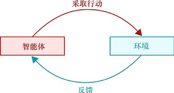

> **圖片描述：** 一個循環示意圖，左側紅色方框為「智能體」，右側藍色方框為「環境」。從智能體到環境有一條標示「採取行動」的上方弧線箭頭，從環境回到智能體有一條標示「反饋」的下方弧線箭頭，形成一個閉合迴路，表示智能體與環境之間的持續互動。

圖1.20　在強化學習中，我們想象一個智能體（可以做決策和採取行動）和一個環境（宇宙中除了智能體外的一切事物），智能體採取行動後，環境以獎勵信號的形式發送回饋

強化學習不同於監督學習，因為資料沒有標籤，雖然從錯誤中學習這一總體思路是相同的，但是作用的機制不同。

相比之下，在監督學習中，由系統生成一個結果（通常是一個類別或一個預測值），然後我們將其與所提供的正確結果進行比較；而在強化學習中，**是沒有正確結果的**，因為資料沒有標籤，而是通過回饋來告訴我們做得有多好。這種回饋可能只是少許資訊，告訴我們剛剛完成的行動是“好”還是“壞”；也可能會深入、細緻地用所有可能進行的描述方式來告訴我們剛剛完成的行動所導致的環境變化，包括任何後續的變化。如何用最有效的方式來利用回饋是強化學習演算法的核心。

比如，自動駕駛的汽車可能是一個智能體，而環境則是由它行駛的街道上的其他人組成的。汽車通過觀察行駛過程中發生的事情來進行學習，並且更傾向於學習那些遵守法律並保護每個人安全的行為。再如，舞蹈俱樂部的DJ就是智能體，而喜歡或不喜歡DJ播放的音樂的舞者就是環境。

本質上，對於任何給定的智能體，環境都是宇宙中除智能體外的其他一切事物。因此，每個智能體的環境都是獨一無二的，就像在多人遊戲（或其他活動）中，每個玩家所看到的世界都是由他們自己（智能體）、其他所有人和事物（環境）組成的，而每個玩家都是他們自己的智能體，同時也是其他人環境中的一部分。

在強化學習中，我們會在一個環境中創建智能體，然後讓這個智能體通過嘗試各種行動並從環境中得到回饋來學習要做什麼。這裡可能存在一個目標狀態（如進球得分，抑或找到隱藏的寶藏），也可能我們的目標只是達到一個成功、穩定的狀態（例如，俱樂部裡開心的舞者或是車輛在城市街道上自動駕駛）。

總體思路是這樣的：智能體先採取一個行動，環境接納了這個行動並且通常會做出相應的改變來響應這個行動；然後環境會向智能體發送一個獎勵信號，告訴它這個操作有多好或有多壞（或者沒有影響）。

獎勵信號通常只是一個數字，越大的正數代表這一行為越好，而越小的負數則可以被視為懲罰。

與監督學習演算法不同的是，獎勵信號不是一個標籤，也不是一個指向特定“正確答案”的指針。我們不如說它只是一個測量值，用於度量行為如何利用某個標準來改變環境和智能體本身，這個標準才是我們所關心的。

## 1.7　深度學習

**深度學習**指的是用一種特定的方法來解決一些機器學習的問題。

這種方法的中心思想是：基於一系列的離散的**層**（layer）構建機器學習演算法。如果將這些層垂直堆疊，就說這個結果是有**深度**（depth）的，或者說演算法是有**深度的**。

構建深度網路的方法有很多種。在構建網路時，我們可以選擇很多不同類型的層。在本書後續章節中，我們會用幾個完整的章節來討論不同類型的深度網路。

圖1.21展示了一個簡單的示例，這個網路有兩層，每一層都用方框顯示出來，在每一層中，都有一些稱為**人工神經元**（artificial neuron）或**感知器**的計算塊（見第10章）。這些人工神經元的基本操作是讀取一串數字，以特定的方式將這些數字加以組合，然後再輸出一個新的數字，並將輸出傳遞到下一層。

這個示例只包含兩個層，但神經網路是可以有幾十層甚至更多的層的。同時，每一層也不是隻有2～3個神經元，它可以包含成百上千個神經元，並以不同的方式排列。

深度學習架構的吸引力在於，我們可以通過呼叫深度學習庫中的例程來構建完整的網路，這些例程將負責所有的構建工作。正如我們將在第23章和第24章中看到的那樣，通常只需要短短的一行程式碼就可以實例化一個新的層，之後使它成為網路的一部分。深度學習庫將為我們處理內部和外部的所有細節。

由於這種結構模式搭建方便，許多人將深度學習比作用樂高積木搭建東西。我們只是堆積想要的層，每個層由一些參數來標定，之後對一些選項進行命名，就可以開始訓練了。

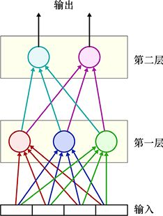

> **圖片描述：** 一個神經網路結構圖。底部標示「輸入」，有四個方形輸入節點。中間分為兩個黃色方框標示的層：「第一層」包含三個彩色圓形神經元（紅、藍、綠），「第二層」包含三個彩色神經元（藍、白、粉）。頂部標示「輸出」。各層神經元之間以不同顏色的線條全連接，展示了資料從輸入經過兩層處理到輸出的流動。

圖1.21　一個兩層的深度網路。每一層都用方框表示，方框裡的是人工神經元，每一層的輸出連接到下一層的輸入。在本示例中，提供4個數字作為輸入，而2個數字構成輸出

當然，這並不容易，因為選擇正確的層、選擇它們的參數以及處理其他的選擇都需要小心謹慎。能夠很容易地構建一個網路固然好，但這也意味著我們做的每一個決定都可能會帶來很大的影響。如果做錯了，那麼網路可能就無法運行。也有可能出現更常見的情況——網路不會學習，我們給它輸入資料，而它會返回給我們無用的結果。

為了減少這種令人沮喪的情況的發生，在討論深度學習時，我們會充分詳細地研究關鍵的演算法和技術，以便能以一種明智的方式做出所有決定。

我們已經在圖1.10中看到了一個深度學習的例子，用了一個16層的深度網路來對這些照片進行分類，下面讓我們更仔細地看看這個系統返回了什麼。

圖1.22展示了4張照片以及深度學習分類器對它們類別的預測，包括它們的相對可信度。系統非常完美地識別出了蜂鳥，但是對於那個船形的開瓶器不太確定；又因為它以前從來沒有見過長柄勺或者耳機，所以得到了一個猜測的結果。

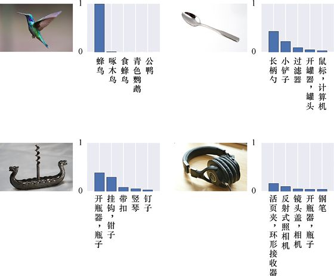

> **圖片描述：** 四組圖片和對應的長條圖。每組包含一張物品照片和一個顯示各類別預測機率的長條圖。左上：蜂鳥照片，長條圖顯示「蜂鳥」類別機率最高（接近1.0）。右上：長柄勺照片，長條圖顯示多個類別都有一定機率。左下：船形開瓶器照片，長條圖顯示「開瓶器」機率較高。右下：耳機照片，長條圖顯示「活頁夾」等多個類別有中等機率。各長條圖的類別標籤以中文顯示。

圖1.22　4張照片以及深度學習分類器對它們類別的預測。這個系統沒有經過長柄勺或耳機的訓練，所以它正在盡最大努力將這些照片與它所知道的東西相匹配

讓我們嘗試另一個圖像分類任務，這次我們將用手寫數字0～9來訓練系統，然後輸入一些新的圖，讓系統對其進行分類。這是一個非常著名的資料集，稱為MNIST，我們會在本書中多次提到它。圖1.23展示了該系統對一些從未見過的新數字的預測。

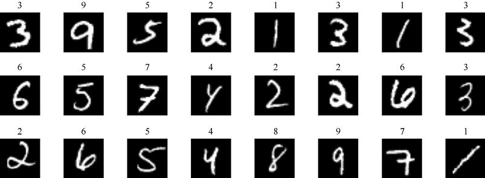

> **圖片描述：** 一個 7 列 3 行的手寫數字圖像網格，共 21 張影像。每張影像為白色手寫數字在黑色背景上的 MNIST 風格圖片，包含 0-9 各種數字。每張圖的上方有一個小數字標示分類器的預測結果。圖中的數字風格各異，有的工整有的潦草，展示了分類器對各種手寫風格的辨識能力。

圖1.23　一個深度學習分類器對手寫數字的分類

這個深度學習分類器做對了所有歸類，就這些資料來說，現代分類器已經能夠實作非常好的效果，並且能夠達到99%的準確率。10000張圖中，我們構建的小系統也能夠正確地分類9905張，即分類結果與人類專家提供的標籤只有95次不一致。

深度學習系統的一個妙處在於，它們在實作特徵工程上表現得很好。回想一下上面的內容，這是一項去尋找讓我們做出判斷的規則的任務。比如，一個數字是1還是7，一張圖是貓還是狗，或者一個演講片段中的單詞是“coffeeshop”還是“movie”。要為一項複雜的工作人工制訂這樣的規則，幾乎是一項不可完成的任務，因為我們必須考慮到所有變化和特殊情況。

但是，深度學習系統可以隱式地學習如何獨立自主地實作特徵工程。它探索了大量可能的特徵並對其進行評估，而後根據評估保留一些特徵並丟棄其他特徵。它完全是獨立地進行這個過程的，沒有我們的指導。系統的表徵力越強（通常可以總結為擁有更多的層，每層都有更多的人工神經元），就越能發現好的特徵，我們稱之為**特徵學習**。

我們每天都在使用這種類型的深度網路，將其應用於照片中的人臉識別、手機對語音命令的識別、股票交易、汽車駕駛、醫學圖像分析以及許許多多的其他任務。

只要系統是由一系列用於計算的某些類型層構成的（這些類型我們將在後面的章節中見到），它就可以被稱為“深度學習”系統。因此，“深度學習”一詞更多的是一種搭建機器學習程式的方法，而不是一種自主學習的技術。

當我們想要解決一些比較龐大的問題時（例如，在一張照片中識別1000個不同對象中的某一個），深度學習網路就會變得很龐大，涉及數千甚至數百萬個參數。這樣的系統就需要大量的資料進行訓練，通常也需要更長的時間。**圖形處理單元**（Graphics Processing Unit，GPU）的普及對這方面的工作起到了很好的輔助作用。

GPU是一種特殊的芯片，它位於**中央處理單元**（Central Processing Unit，CPU）旁邊。CPU用於執行運行電腦所涉及的大多數任務，如與外圍設備和網路的通信、記憶體管理、文件處理等。設計GPU的初衷是通過接管制作複雜圖形（如三維遊戲中渲染的場景）時的計算來減輕CPU的負擔。訓練深度學習系統所涉及的操作恰好與GPU執行的任務非常匹配，這也是這些訓練操作可以快速執行的原因。此外，GPU的自身設計允許並行計算，即可以同時執行多個計算，專為加速深度學習計算而設計的新芯片也開始出現在市場上。

深度學習理念並不適用於所有機器學習任務，但是恰當地使用它們可以產生非常好的結果。在許多應用中，深度學習方法表現得比其他演算法優越得多，從標記照片到用直白的語言與我們的智能手機“交談”，它正在徹底改變我們可以用電腦來實作的東西。

## 1.8　接下來會講什麼

在後續章節中，我們將更詳細地研究前文描述的所有概念。

前幾章將討論所有現代機器學習演算法的基本原理，我們將學習機率論與數理統計以及資訊理論的基礎知識，然後學習基本的學習網路以及如何使它們很好地工作。

雖然所有討論都將適用於任何機器學習語言或庫，但是為了更加具體化的描述，我們將介紹如何使用流行的（並且是免費的）Python語言的scikit-learn庫來實作基礎的技術。

接下來我們回到宏觀的描述。我們將看到機器學習系統是如何學習的，以及人們用來控制這個過程的不同演算法。隨後我們會關注深度學習，並探究各種流行的深度學習網路。

在接近尾聲的時候，我們將進一步應用演算法，展示如何使用Keras庫（也是Python的免費庫）搭建和運行深度學習系統。最後，我們會介紹一些最近被廣泛使用的、用於深度學習的強大架構。

這本書是層層推進的，有許多章節是建立在前幾章的基礎之上的。我們的目的是先呈現使用機器學習和深度學習實作目標所需的一切東西，之後讓你能夠使用庫、理解相關的文檔並看懂每天接踵而至的知識更新。

如果你很迫切地想要學習一些具體的東西，可以直接跳到相應的章節去深入學習。如果遇到不熟悉的術語或概念，你可以根據需要去翻看前面章節中的內容。

## 參考資料

[Bishop06]　Christopher M. Bishop, *Pattern Recognition and Machine Learning*, Springer- Verlag, 2006.

[Bryson04]　Bill Bryson, *A Short History of Nearly Everything*, Broadway Books, 2004.

[Champandard02]　Alex J. Champandard, *Reinforcement Learning*, Reinforcement Learning Warehouse, Artificial Intelligence Depot, 2002.

[Darwin59]　Charles Darwin, *On the Origin of Species by Means of Natural Selection*, November 1859.

[Galton86]　Francis Galton, *Regression Towards Mediocrity in Hereditary Stature*, The Journal of the Anthropological Institute of Great Britain and Ireland, Vol. 15, pgs 246-263, 1886.

[Goodfellow17]　Ian Goodfellow, Yoshua Bengio, Aaron Courville, *Deep Learning*, MIT Press, 2017.

[Simonyan14]　Karen Simonyan, Andrew Zisserman, *Very Deep Convolutional Networks for Large-Scale Image Recognition*, arXiv, 2014.

[Sutton17]　Richard S. Sutton and Andrew G. Baro, *Reinforcement Learning： An Introduction*, A Bradford Book, MIT Press, 2017.

[Towers15]　Jared R. Towers, Graeme M. Ellis, John K.B. Ford, *Photo-identification catalogue and status of the northern resident killer whale population in 2014*, Canadian Technical Report of Fisheries and Aquatic Sciences 3139, 2015.

[VanderPlas16]　Jake VanderPlas, *Python Data Science Handbook*, O’Reilly Media, 2016.

### 讀者服務：

> **圖片描述：** 一個 QR Code（二維條碼），中央有綠色的書籍圖示標誌，掃描後可連結到相關線上資源。

微信掃碼關注【異步社區】微信公眾號，回覆“e55451”獲取本書配套資源以及異步社區15天VIP會員卡，近千本電子書免費暢讀。
