# 第7章　分類

我們通常希望可以將每個輸入資料分配給一個或多個最能描述它的類別，比如識別照片中出現的人。本章將研究應對這種挑戰的方法。

## 7.1　為什麼這一章出現在這裡

機器學習的一個重要應用包括查看一組輸入，將每個輸入與一組可能的類別進行比較，併為該輸入選擇最可能的類別。這個過程稱為**分類**。

我們可以使用指定的類別或**類**（class）來識別某個人最可能對手機說的話、照片中可見的動物，或者是一塊水果是否成熟。

有時合適的類或類別不止一個。例如，我們可能有一張老虎在樹旁的照片，將這張照片分為“老虎”和“樹”這兩個類別似乎都是合理的。在本章中，我們假設每個輸入都有一個主要的方面，因此將為其分配對應於那個方面的標籤。我們將看到技術可以推廣到在每段資料上應用多個類，如“老虎”和“樹”（如果需要的話）。

我們將通過輸入已確定的合適類別的資料來訓練分類器。這個類別稱為**實際值**、**基本事實**、**專家標籤**（expert’s label），或者簡稱**標籤**。這既是我們手動分配樣本的類，也是我們希望分類器分配資料的類。

分類器實際分配給每個輸入的類別或類，稱為輸入的**預測值**。

訓練的目標是儘可能多地獲得與標籤匹配的預測值，以推廣到分類器以前從未見過的新輸入。

在本章中，我們將看到分類背後的基本思想。我們不會考慮具體的分類演算法（見第13章）只是熟悉這些原理，以使以後的演算法細節更易理解。

我們還將研究**分群**，它可以自動找到有用的方法，將沒有標籤的樣本分組在一起。

## 7.2　二維分類

分類是一個大話題。讓我們從儘可能簡化的問題開始。

現在，假設輸入資料只屬於兩個不同的類別或類，所以每個輸入都會有一個指定的標籤，該標籤是這兩個類中的一個。我們將去掉這個標籤，讓系統進行預測，或者為輸入分配它自己的類；然後我們將比較開始時的標籤和電腦提供的標籤，看看它們是否匹配。

這個精簡版的分類，讓我們可以探索許多最重要的思想。因為每個輸入只有兩個可能的標籤（或類），所以我們稱之為**二元分類**（binary classification）。

另一種簡化方法是使用二維資料。也就是說，每個輸入樣本都剛好用兩個數字表示。這複雜得剛好很有趣，但很容易繪製，因為我們可以把每個樣本都在平面上畫為一點。在實際操作中，這意味著我們在頁面上有一串點。

我們用顏色和形狀編碼顯示每個樣本帶有哪兩個標籤。我們的目標是開發一種能夠準確預測這些標籤的演算法。當它能夠做到這一點時，我們可以將演算法放寬到沒有標籤的新資料上，並依靠它來告訴我們哪些輸入屬於哪個類。

### 二維二元分類

我們將使用具有兩個**特徵**的樣本，或屬於兩個類的兩個資料片段，我們稱之為**二維二元分類**（2D binary classification）系統。其中“二維”指的是點資料的兩個維度，“二元”指的是兩個類。

我們要學習的第一類技術是用來確定在二維二元分類中為每個樣本分配哪個類的，這些技術統稱為**邊界方法**（boundary method）。

通過這些方法，我們可以查看在平面上繪製的輸入樣本，並找到劃分空間的直線或曲線，這樣所有帶有某一標籤的樣本位於曲線（或邊界）的一側，所有那些帶有另一個標籤的樣本都在另一側。

我們會看到一個重要的目標是找出所能找到的最簡單的邊界形狀，並且它仍然可以很好地分割樣本。

讓我們用雞蛋的例子把事情具體化。

假設我們是農民，養了很多下蛋的母雞。每一個雞蛋都有可能**受精**，並孕育出新的小雞，也可能**未受精**。

假設如果我們仔細測量每個雞蛋的一些特徵（如它的重量和長度），就能判斷它是否受精。我們將把這些值放在一起製成一個樣本，然後把樣本交給分類器，分類器會把它分配成“受精”或“未受精”。

因為用於訓練的每個雞蛋都需要一個標籤或者一個已知的正確答案，所以我們用一種稱為**驗蛋**（candling）的技術判斷雞蛋是否受精（見[Nebraska17]）。擅長驗蛋的人稱為**驗蛋員**（candler）。這意味著驗蛋員需要在明亮的光源前舉起雞蛋加以查看。光源可以是一支蠟燭，也可以是任何強光源。通過檢視雞蛋裡的東西投射在蛋殼上的模糊陰影，有經驗的驗蛋員就能分辨出雞蛋是否受精。我們的目標是讓分類器給出與通過光源確定的標籤相同的結果。

在繼續操作之前，我們注意到，沒有理由認為測量像重量和形狀這樣的雞蛋的外部品質，可以準確地告訴我們它是否受精。我們只是假裝這些資料可以完成任務，然後尋找使用這些資料的方法來做出正確的決定。

根據以上描述，我們希望**分類器**（電腦）考慮每個樣本（每個雞蛋），並用其**特徵**（重量和長度）來分配**標籤**（受精或未受精）。

上述問題稱為**二元分類**問題，因為我們只有兩個類別。

讓我們從一堆**訓練資料**開始——這些資料給出了每個雞蛋的重量和長度。我們把這些資料繪製在一個網格上，其中一個軸是重量，另一個軸是長度。用圓圈表示受精的雞蛋，用方框顯示未受精的雞蛋。圖7.1顯示了原始資料。

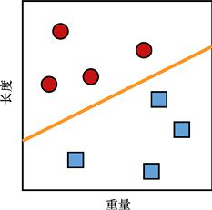

> **圖片描述：** 一張二維散佈圖，橫軸為「重量」，縱軸為「長度」。紅色圓圈代表受精的雞蛋，藍色方框代表未受精的雞蛋。一條橙色斜線將兩組資料分開，圓圈主要分佈在左上方，方框主要分佈在右下方。

圖7.1　雞蛋分類。圓圈是受精的雞蛋。方框是未受精的雞蛋。每個雞蛋都被繪製成一個由其重量和長度兩個維度給出的點。斜線把兩個類分開

有了這些資料，我們可以在兩組雞蛋之間畫一條直線。這條線的一側是受精的雞蛋，另一側是未受精的雞蛋。

我們完成了一個簡單的分類器！將來得到新雞蛋時（沒有手動指定的標籤），我們可以看看它們落在線的哪一邊。“受精”一側的雞蛋被分為受精類別，“未受精”一側則相反，如圖7.2所示。

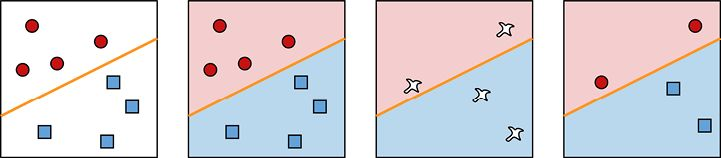

> **圖片描述：** 四張並排的二維圖。(a)原始資料點；(b)淺色和深色區域顯示決策區域的劃分；(c)四個新的待分類雞蛋資料點；(d)每個新雞蛋被分配到對應的類別。

(a)　　　　　　　　　　　　　　　　　　　　(b)　　　　　　　　　　　　　　　　　　　　(c)　　　　　　　　　　　　　　　　　　　　(d)

圖7.2　對新雞蛋進行分類。(a)原始資料；(b)淺色區域和深色區域顯示瞭如何決定分類受精和未受精的雞蛋；(c)4個待分類的新雞蛋；(d)我們給每個新雞蛋都分配了一個類別

假設這在幾個季節都很有用，然後我們買了很多新品種的雞。為了防止它們的雞蛋和我們以前的不一樣，我們用一天的時間手工驗蛋測定它們是否受精，然後像以前一樣繪製結果。新資料如圖7.3所示。

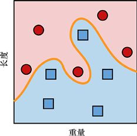

> **圖片描述：** 一張二維散佈圖，紅色圓圈和藍色方框的分佈更加交錯複雜，兩組資料之間需要用曲線而非直線來分隔。

圖7.3　如果往雞群中加入一些新品種的雞，僅根據雞蛋的重量和長度來決定哪個蛋是受精的可能會變得更加困難

這兩組資料仍然區分得很明顯，但現在它們是被一條曲線分開，而不是一條直線。

但這沒關係，因為我們可以像使用之前的直線那樣使用這條曲線。每個新雞蛋都被放置在這個圖上，如果它在淺色區域，則是受精的；如果它在深色區域，則是未受精的。

如果可以如此好地分割東西，我們把分割平面的區域稱為**決策區域**（decision region），它們之間的直線或曲線稱為**決策邊界**（decision boundary）。

假設我們農場的雞蛋很受歡迎，於是第二年我們又買了一群不同品種的雞。和以前一樣，我們通過手工驗蛋測定了一堆雞蛋並繪製了資料，如圖7.4所示。

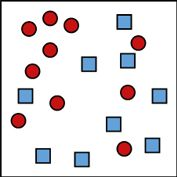

> **圖片描述：** 一張二維散佈圖，紅色圓圈和藍色方框的分佈更加混合重疊，已無法用單一曲線明確劃分。

圖7.4　新購買的雞加大了區分受精的雞蛋和未受精的雞蛋的難度

可以看到，區分還是很明顯的，但是已經無法用直線或曲線明確地劃分它們了。所以討論哪個樣本屬於哪個類別的更好的方式是考慮**機率**而不是確定性。

在圖7.5中，我們用不同顏色表示網格中的某個點屬於特定類的機率。對於每個點，如果它是亮紅色的，我們就可以確定雞蛋是受精的，而紅色強度的減弱對應著受精機率的減小。同樣的解釋也適用於未受精的雞蛋，如圖7.5c所示。

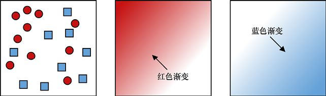

> **圖片描述：** 三張並排的二維圖。(a)交叉分佈的資料點；(b)以紅色深淺表示受精機率的熱力圖，深紅表示高機率；(c)以藍色深淺表示未受精機率的熱力圖。

(a)　　　　　　　　　　　　　　　　　　　　　　　　(b)　　　　　　　　　　　　　　　　　　　　　　　　 (c)

圖7.5　在圖(a)顯示的交叉結果中，我們可以給網格中的每個點對應一個受精的機率，如圖(b)顯示的淺紅色區域表示雞蛋更有可能是未受精的。圖(c)顯示了雞蛋未受精的機率

穩定落在深紅色區域的雞蛋可能是受精的，而落在深藍色區域的雞蛋可能是未受精的，而在其餘區域，正確的類並不那麼清晰。

接下來會有一些模稜兩可的地方。我們如何繼續進行取決於農場的策略。我們可以利用第3章中的準確率/精度和召回率來設計這個策略，並明確應該畫什麼樣的曲線來區分不同的類。

例如，假設“受精”對應“陽性”。如果我們想確定是否捕獲了所有受精的雞蛋，並且不介意出現一些假陽性，那麼我們可能會像圖7.6b所示那樣畫一個邊界。

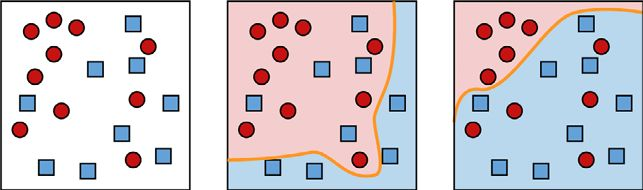

> **圖片描述：** 三張並排的二維圖。(a)機率分佈結果；(b)偏向捕獲所有受精雞蛋的策略邊界，容許一些假陽性；(c)偏向正確分類所有未受精雞蛋的策略邊界。

(a)　　　　　　　　　　　　　　　　　　　　　　　　(b)　　　　　　　　　　　　　　　　　　　　　　　　 (c)

圖7.6　根據圖(a)的結果，我們可以選擇顯示圖(b)所示的策略——它可以接受一些假陽性（未受精的被分類為受精的），以確保正確地將所有受精的雞蛋分類。或者我們可能更傾向於使用圖(c)所示的策略正確地分類所有未受精的雞蛋

如果我們想找到所有未受精的雞蛋，不在意出現假陰性，就可能畫出圖7.6c所示的邊界。

無論哪種情況，重疊部分的模糊性都不會改變基本原理。雖然我們在分析過程中可能會對每個類別使用機率，但最終必須將每個雞蛋聲明為“受精”或“未受精”，以決定如何處理它。

於是，我們創建了一個邊界，將資料分割成兩部分，根據每個新雞蛋落在邊界的哪一側來分類。

如果機率是模糊的，就沒有對錯之分，因為我們決定在哪裡設置邊界不僅要基於資料和演算法，還要基於人為與商業因素。

## 7.3　二維多分類

我們農場的雞蛋賣得很好，但有個問題。我們只區分了受精和未受精的雞蛋。

隨著對雞蛋的瞭解越來越多，我們發現有兩種不同的方式可以使雞蛋不受精。因為從未受精的雞蛋稱為yolker；但在一些受精的雞蛋中，發育中的胚胎由於某種原因停止生長並死亡，這樣的雞蛋稱為quitter。

我們可以出售yolker，但quitter可能會意外破裂並傳播有害細菌，所以我們想要識別出quitter並處理掉它們。

現在我們有3類雞蛋：winner（存活且受精的）、yolker（未受精的）和quitter（受精但死亡的）。和以前一樣，假設我們可以根據這3類雞蛋的重量和長度區分它們。圖7.7顯示了一組檢測過的雞蛋，以及我們通過對雞蛋進行光影檢測後手工分配給它們的對應類別。

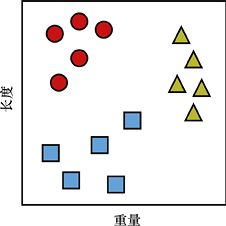

> **圖片描述：** 一張二維散佈圖，展示三類雞蛋：圓圈（受精的 winner）、方塊（未受精的 yolker）、三角形（受精但死亡的 quitter），分佈在重量-長度的平面上。

圖7.7　3類雞蛋。圓圈是受精的雞蛋，方塊是未受精但可食用的yolker，三角形是我們想要從孵化器中移除的quitter

將這3類中的一個分配給新輸入資料的工作稱為**多分類**。這個名稱通常用於有3個或更多類的問題。

這些想法可以從這裡推廣到許多類別或標籤。一旦我們找到了與不同類相關的區域之間的邊界，任何新樣本都可以通過查看它屬於哪個邊界區域進行分類。

我們一直在使用二維資料（每個雞蛋由重量和長度描述），但也可以將過程推廣到任意數量的特徵或維度。所以除了重量和長度，我們還可以加上其他觀測資料，如顏色、平均周長以及下蛋的時間。也就是說，每個雞蛋共有5個資料。

五維空間是一個奇怪的地方，我們勢必無法畫出有用的圖。但是數學並不關心我們有多少維度，建立在數學基礎上的演算法也不會關心。這並不是說我們不在乎，而是因為通常隨著維數的增加，演算法的運行時間和記憶體消耗也會增加。有時我們想要修改演算法，以使它們在高維空間中能夠更有效地工作。

我們可以通過類比的方法推理所能描繪的情形。在二維中，資料點傾向於在某一處聚集在一起，這樣我們就可以在它們之間畫出邊界直線（或曲線）。在更高的維度中，大部分情形都是一樣的（我們將在本章的末尾更詳細地討論這個問題）。多維度的問題是我們不能很好地描繪它們。但是同樣，通過類比推理，我們可以在不同的點群之間使用某種劃分形狀。就像把二維正方形分解成幾個更小的二維形狀，每個形狀對應一個不同的類，我們可以把五維空間分解成多個更小的五維形狀，這些五維區域也定義了不同的類。

當再接收到一個新雞蛋的5個觀測資料時，我們可以確定它落在哪個更小的五維空間中，進而就能預測出這個雞蛋的類。

## 7.4　多維二元分類

也許令人驚訝的是，我們只需要一堆二元分類器，就可以進行多分類。當我們想要執行多分類時，有時這是一種有效的方法。

下面是使用二元分類器進行多分類的兩種常用方法。

### 7.4.1　one-versus-rest

我們的第一種方法有幾個名稱：one-versus-rest（或OvR）、one-versus-all（或OvA）、one-against-all（或OAA）或**二元關聯法**。

假設資料有5個類別，我們用字母A～E命名它們。

我們將構建5個二元分類器，而不是構建一個將分配這5個標籤中的一個的分類器。讓我們給這些分類器編號為1～5。

分類器1用於說明給定的資料是否屬於A類，因為它是一個二元分類器，它只關心這個類，而不關心其他類。換句話說，這個二元分類器有一個決策邊界，它將空間劃分為兩個區域：A類和非A類。進入分類器的每一個資料都會被分配到兩個區域中的一個，分別對應於“A類”或“非A類”。

現在我們可以看到“one-versus-rest”這個名字的來源。在這個分類器中，A類是“one”，B～E類是“rest”。

分類器2是另一個二元分類器，用於說明樣本是否在B類中。分類器3也用於說明樣本是否在C類中，分類器4和分類器5對D類和E類做同樣的事情。

圖7.8總結了這個想法，其中用到了一個庫例程，它在為每個分類器構建邊界時考慮了所有資料。

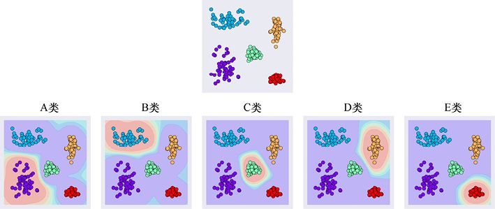

> **圖片描述：** 上方展示5個不同類別的彩色資料點。下方為5張二元分類器的決策區域圖，每個分類器只區分一個特定類別與其他所有類別。

圖7.8　one-versus-rest分類。上方：來自5個不同類別的樣本。下方：5個不同的二元分類器的決策區域。每個分類器只關心在單個類和所有其他類之間找到邊界。

注意，有些位置可以屬於多個類。例如，右上角的點具有來自A、B和D類的非零機率。

為了對樣本進行分類，我們讓每個點依次遍歷5個二元分類器，以返回其屬於每個類的機率。然後我們找到機率最大的類，這就是該點被分配的類。

圖7.9分情節顯示了以上分類。

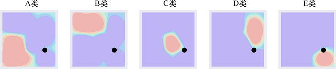

> **圖片描述：** 展示一個黑色新樣本點如何通過5個二元分類器進行分類。前4個分類器報告該點不在其類別中（低機率），第5個分類器（E類）報告高機率，因此預測為E類。

圖7.9　使用one-versus-rest方法對樣本進行分類。新的樣本是黑點。前4個分類器都報告這個點不在它們的類中，所以它們返回的機率很低。E類的分類器發現該點在其類的區域內，並賦予其比其他區域更高的機率，因此預測該點屬於E類

這種方法的吸引力在於其概念上的簡單性和快速性。可以通過編寫來快速運行二元分類器。這種方法的缺陷是我們必須教5個分類器（也就是說，為5個分類器尋找邊界），而不是隻教1個，而且必須對樣本進行5次分類，以找到它屬於哪個類別。

如果我們有大量具有複雜邊界的類別，運行樣本所需的時間會累加起來。隨著分類器的集合越來越大，速度越來越慢，轉用單個複雜的多分類器可能會更有效。

### 7.4.2　one-versus-one

使用二元分類器執行多類最佳化的第二種方法稱為one-versus-one（或OvO），這種方法所使用的二元分類器甚至比one-versus-rest還要多。

常見的思想是查看資料中的每一對類，併為這兩個類構建一個分類器。

由於可能的對數隨著類數量的增加而迅速增加，因此這種方法中的分類器數量也隨著類數量的增加而迅速增加。為了便於處理，我們這次只使用4個類，如圖7.10所示。

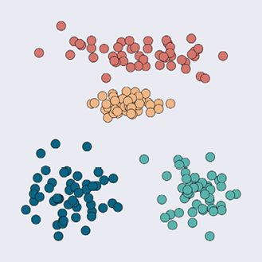

> **圖片描述：** 一張二維圖展示4個類別（A、B、C、D）的彩色資料點分佈，用於演示 one-versus-one 分類方法。

圖7.10　演示one-versus-one分類的4個類的點

我們先來看一個二元分類器。該分類器**僅**使用來自A類和B類的資料進行訓練。為了訓練這個分類器，我們簡單地省略了所有沒有標記為A或B類的樣本，就好像它們根本不存在一樣。這個分類器會找到一條將A類和B類分開的邊界曲線。現在每次給這個分類器輸入一個新的樣本，它會告訴我們樣本是屬於A類還是B類。

因為這是這個分類器唯一可用的兩個選項，所以它會將資料集中的每個樣本分類為A或B，即使它哪個都不是。我們很快就會明白為什麼這樣是可行的。

接下來，我們**只**使用A類和C類的資料訓練一個分類器，並使用A類和D類的資料訓練另一個分類器，如圖7.11的第1行所示。

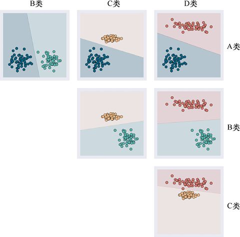

> **圖片描述：** 6張二元分類器的決策區域圖，排列成3行。第1行：A對B、A對C、A對D；第2行：B對C、B對D；第3行：C對D。每張圖顯示兩個類別之間的邊界。

圖7.11　構建用於對4個類執行one-versus-one分類的6個二元分類器。第1行：從左到右，A類和B類、A類和C類，以及A類和D類的二元分類器。第2行：從左到右，B類和C類，以及B類和D類的二元分類器。第3行：C類和D類的二元分類器

圖7.11所示的第1行包含3個分類器，分別用於A類和B類、A類和C類以及A類和D類。

接下來，我們構建一個二元分類器。這個二元分類器**只**使用B類和C類中的資料進行訓練，根據資料屬於哪個“最佳”類別，它總是返回B類或C類。我們為B類和D類做了另一個分類器。

最後剩下的兩個類是C類和D類。

結果是，構建了6個二元分類器，每個分類器會告訴我們資料最適合兩個特定類中的哪一個。

為了對一個新樣本進行分類，我們總是遍歷**所有**分類器，然後選擇出現頻率**最高**的標籤。換句話說，每個分類器為兩個類中的一個**投票**，獲勝者是票數最多的類，如圖7.12所示。

one-versus-one比one-versus-rest需要更多的分類器，但它有時很有吸引力，因為它提供了每個樣本與所有類組合更深入的分析。當多個類之間有很多混亂的重疊時，我們就可以更容易地理解使用one-versus-one得到的最終結果。

這種清晰性的代價是巨大的。我們需要的one-versus-one分類器數量隨著類數量的增加而快速增加（見[Wikipedia17]）。圖7.12提供了一個告訴我們將有多少個分類器的線索。對於任意數量的類，我們可以在水平方向和垂直方向上繪製多個類的正方形網格，然後用圖表填充網格的右上角部分，每個分類器對應一個圖表。這意味著所需分類器的數量是比類別數減一的平方的一半多一點。

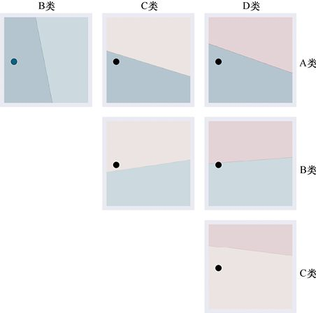

> **圖片描述：** 一個矩陣式的圖表，展示對黑色新樣本進行6次二元分類的結果。每個分類器投票選出樣本所屬的類別，最終A類獲得最多票數而勝出。

圖7.12　one-versus-one的操作，對黑色的新樣本進行分類。第1行：這3個二元分類器均報告樣本是屬於A類，而不是B、C、D類。第2行：從左到右，這些二元分類器報告樣本在C類和D類，因為樣本不在B類中。第3行：樣本不屬於C類，所以該二元分類器報告樣本屬於D類。得票最多的A類獲勝

我們已經看到，4個類需要6個分類器，5個類需要10個，20個類需要190個，30個類需要435個分類器！若超過大概46個類，則需要1000多個分類器。圖7.13顯示了所需二元分類器的數量隨著類的數量的增加而增加的劇烈程度。

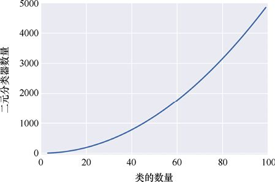

> **圖片描述：** 一條曲線圖，橫軸為類別數量，縱軸為所需二元分類器數量，曲線呈快速上升趨勢，展示分類器數量隨類別數的平方增長。

圖7.13　隨著類數量的增加，所需one-versus-one二元分類器的數量會迅速增加

每一個二元分類器都需要經過訓練，然後需要通過每一個分類器運行每一個新的樣本，這將消耗大量的電腦記憶體和時間。在某種情況下，使用單個複雜的多分類器會更高效。

## 7.5　分群

如前所述，對新樣本進行分類的一種方法是將空間劃分為不同的區域，然後針對每個區域測試一個點。

解決這個問題的另一種方法是將訓練集資料本身分組到**簇**或類似的塊中。

如果資料有標籤（如7.1節所述），那麼我們可以使用標籤來創建分群。

在圖7.14a中，有5組不同標籤的資料。我們可以通過在每一組點周圍畫一條曲線來形成簇，如圖7.14b所示。如果把這些曲線向外擴展，直到它們互相碰撞，那麼網格中的每個點都被它最接近的簇著色，如圖7.14c所示。

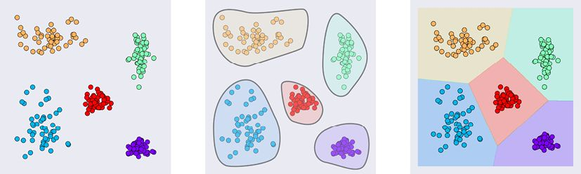

> **圖片描述：** 三張並排的二維圖。(a)5個類別的原始資料點；(b)每組點被圓形邊界識別為5個群組；(c)群組向外擴展填滿整個空間，使每個位置都被分配到一個類別。

(a)　　　　　　　　　　　　　　　　　　　　　　　　　　　　　　　 (b)　　　　　　　　　　　　　　　　　　　　　　　　　　　　　　　 (c)

圖7.14　增長的簇。(a)5個類別的原始資料；(b)識別為5組；(c)向外擴大分組，使每一個點都被分配到一個類

這個方案要求輸入資料有標籤。如果沒有標籤呢？我們可能只有一個沒有標籤的點集合。如果能夠自動將其分解成簇，我們就可以應用剛才描述的技術。這個方案不夠巧妙且選擇餘地不大，但如果我們只有無序的、沒有標籤的點，那麼暫時只能用這個方案。

涉及沒有標籤的資料的問題就屬於前文中所說的**無監督學習**。

當使用一種演算法從沒有標籤的資料中自動派生簇時，我們必須告訴它希望找到多少簇。這個“簇數”的值，通常用字母*k*表示。我們說*k*是一個**超參數**，即我們在訓練系統之前選擇的值。

我們選擇的*k*值會告訴演算法要構建多少個區域（也就是說，要將資料分成多少個類）。因為該演算法使用點組的均值或者平均數來開發它們的簇，所以稱之為*k***均值分群**。

能夠自由選擇*k*值可謂福禍相依。優點是，如果事先知道應該有多少個簇，就可以告訴演算法，由此得到想要的結果。

記住，電腦不知道“我們認為的簇邊界”應該在哪裡，所以儘管它會把資料分割成*k*塊，但這可能不是我們期望的。但是如果資料分離得好，而且這些資料塊之間有很大的空間，那麼通常會得到我們想要的。分群邊界越模糊或重疊，可能會有越多的事情令人出乎意料。

預先指定*k*值的缺點是，我們可能不知道多少個簇能夠最好地描述資料。如果選擇的簇太少，就不會將資料劃分到最有用的不同類中；如果選擇了太多的簇，那麼我們最終會在不同的類中得到非常相似的資料片段。

為了查看實際操作，我們考慮一下圖7.15所示的資料。其中有200個沒有標籤的點，故意被分成5組。

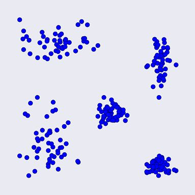

> **圖片描述：** 一張二維散佈圖，200個黑色資料點故意被排列成5個明顯的群組。

圖7.15　200個沒有標籤的點，故意被分成5組

圖7.16展示了一個分群演算法是如何將這些點分割成不同的*k*值的。記住，在演算法開始執行之前，我們會設定參數*k*。

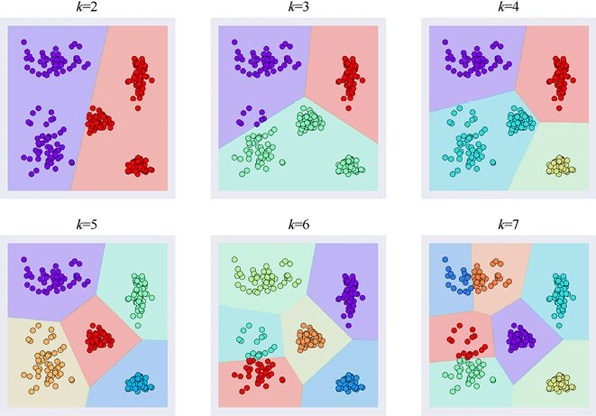

> **圖片描述：** 多張並排的二維圖，展示對圖7.15資料使用k=2到k=7進行k均值分群的結果，不同簇以不同顏色標示。k=5時產生最好的結果。

圖7.16　對圖7.15中的資料進行自動分群的結果，其中*k*值為2～7。不出所料，*k=*5時產生了最好的結果，但我們是故意這樣讓這些資料易於分離的。對於更復雜的資料，我們可能不知道要指定的*k*的最佳值

毫不奇怪，*k=*5在這個資料上效果最好，但是我們使用了一個很容易看到邊界的成熟例子。對於更復雜的資料，特別是如果它有超過2個或3個維度，那麼僅通過觀察原始資料，我們幾乎不可能輕易地識別出正確的簇數。

不過，並非沒有辦法。一種頗受推崇的方法是對網路進行多次訓練，每次都使用不同的*k*值。這種**超參數調試**（hyperparameter tuning）允許電腦自動搜索一個好的*k*值，評估每個選擇的預測結果，並報告表現最好的*k*值。

當然，這樣做的缺點是需要時間，也許要花很多時間。相比從一開始就知道正確的值，測試20個不同的*k*值至少需要20倍的時間。

這就是在分群之前使用某種可視化工具**預覽**資料非常有用的原因。如果我們可以立即選擇*k*的最佳值，甚至提出一系列可能的值，都可以為我們省下計算那些效果不好的*k*值的時間和精力。

## 7.6　維度災難

我們已經用了具有兩個特徵的資料樣本，因為在頁面上繪製兩個維度很容易。但實際上，資料可以具有任意數量的特徵或維度。

似乎擁有的特徵越多，分類器就會越好。分類器使用的特徵越多，就越能更好地找到資料中的邊界（或簇），這是有一定道理的。

這在一定程度上是正確的，但過猶不及，向資料添加過多的特徵實際上會使事情變得**更糟**。在雞蛋分類示例中，我們可以為每個樣本添加更多的特徵，如下蛋時的溫度、母雞的年齡、當時窩裡其他雞蛋的數量、溼度等。所添加的前幾個特徵可能會帶來更好的結果，但是在某個點之後，包含過多的特徵將導致系統退化，並且將導致它的性能越來越差。

因此，描述具有過多特徵或維度的樣本會造成系統正確分類的能力下降。

這種反直覺的想法經常出現，並有一個特殊的名字：**維度災難**（curse of dimensionality）（見[Bellman57]）。這個術語在不同的領域有不同的含義。本書在適用於機器學習的意義上使用它（見[Hughes68]）。

要理解為什麼會發生這種情況，一種方法是考慮分類器是如何找到邊界曲線或曲面的。如果只有幾個點，分類器就可以創建大量的曲線或曲面來劃分它們。為了選出能夠在未來資料上做得最好的那個分類器，我們需要更多的訓練樣本。然後，分類器可以選擇最能分割密集集合的邊界，如圖7.17所示。

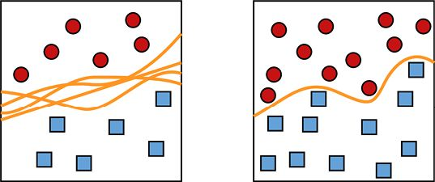

> **圖片描述：** 兩張並排的二維圖。(a)少量樣本，可畫出多條不同的邊界曲線，無法確定哪條最好；(b)更大的樣本密度下，可以找到一條好的邊界曲線。

(a)　　　　　　　　　　　　　　　　　　　　　　　　　　　　　　　　　　　(b)

圖7.17　為了找到最佳的邊界曲線，我們需要一個好的樣本密度。(a)只有很少的樣本，所以可以構造很多不同的邊界曲線。我們不知道這些曲線（如果有的話）中哪一個對未來的資料最有效；(b)在更大的樣本密度下，我們可以找到一條好的邊界曲線

如圖7.17所示，找到一條好的曲線需要密集的樣本集合。但在向樣本中添加維度（或特徵）時，保持樣本空間中合理密度的樣本數量就會“爆炸”。如果無法滿足需求，分類器將盡力而為，但缺乏足夠的資訊來繪製一條好的邊界線。它會陷入圖7.17a所示的困境，猜測最好的邊界。

讓我們通過雞蛋的例子來看看這種對特徵數量或維度的依賴性。為簡單起見，我們假設雞蛋度量的所有特徵（它們的重量、長度等）都在0和1之間。

我們從包含10個樣本的資料集開始，每個樣本都有一個特徵（雞蛋的重量）。因為我們有一個描述每個雞蛋的維度，所以會畫一條0～1的一維線段。我們還想知道樣本覆蓋這條線中每一部分的程度，所以把它分成很多部分或者很多塊，並看看每一塊裡有多少個樣本。圖7.18顯示了資料如何落在區間[0,1]的5個塊上。

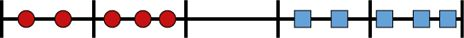

> **圖片描述：** 一條0到1的線段被分成5等份，10個資料點散佈其上，展示一維空間中的樣本密度概念。

圖7.18　10個資料各有一個維度。我們可以把它們畫在一條線上。這裡把這條線分成5等份，這樣就能知道這些點覆蓋這條線長度的程度

選擇10個樣本和選擇5個塊沒有什麼特別的。我們選擇它們是因為這樣畫起來更容易。如果我們選擇300個雞蛋或1700個塊，那麼討論的核心將保持不變。

空間的**密度**是樣本的數量除以塊的數量。在圖7.18所示的情況下，是10/5，說明每個箱子（平均）有兩個樣本。我們會發現這對每塊的平均樣本數量來說是一個相當公平的估計，如圖7.18所示。

讓我們在每個雞蛋的維度或特徵列表中添加長度。現在有兩個維度，把圖7.18所示的線段向上拉，得到一個正方形，如圖7.19所示。

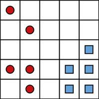

> **圖片描述：** 一個二維正方形網格，每邊分成5等份形成25個小格，10個資料點散佈其中。平均密度降至0.4。

圖7.19　10個樣本現在由兩個測量值或維度描述。我們把它們畫在二維網格上。在圖7.18中，我們將網格的每一邊分割成5等份，得到了25個更小的方塊，或稱為箱子。現在的平均密度是10個樣本除以25個箱子，也就是0.4

和之前一樣，把每條邊分成5等份，正方形裡就有25個箱子，但仍然只有10個樣本。這意味著一些區域不會有任何資料。現在的密度是10/(5×5)= 10/25=0.4。為了分割圖7.19所示的資料，我們可以畫很多不同的邊界曲線。

現在我們將添加第三個維度，例如產蛋時的溫度（縮放為一個0～1的值）。為了表示第三個維度，我們把正方形向頁面後推，以形成一個立方體，如圖7.20所示。

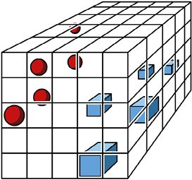

> **圖片描述：** 一個三維立方體，每邊分成5等份形成125個小方塊，10個資料點散佈其中。密度進一步降至0.08。

圖7.20　現在10個樣本由3個測量值表示，所以我們在三維空間中繪製它們。一側有5個塊，即有5 × 5 × 5=125個小方塊。現在的密度是10/125或每立方0.08個樣品

再一次把每個軸分成5塊，即有125個小方塊，但是仍然只有10個樣本，此時密度下降到10/(5×5×5)=10/125=0.08。換句話說，任何小立方體中有樣本的機率只有8%。

任何通過邊界曲面把這個立方體分成兩部分的分類器都需要做一個很大的猜測。問題不在於很難分離資料，而是不清楚**如何**分離資料。分類器必須將很多空箱子分類到兩類中的一個，並且因為沒有足夠的資訊，所以無法遵循任何原則。

換句話說，一旦系統部署完畢，這些空箱子裡會有什麼樣本呢？對於這一點，沒人知道。圖7.21展示了對邊界表面的一種猜測，但正如圖7.17所示，我們可以通過兩組樣本之間很大的開放空間來擬合各種平面和曲面。它們中的大多數可能都不能很好地概括新樣本的類別。

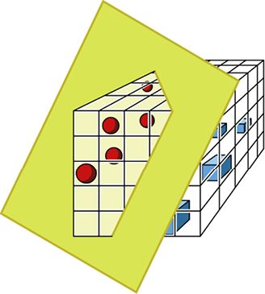

> **圖片描述：** 一個三維立方體中，一個曲面將兩類樣本（紅色和藍色點）分開。

圖7.21　穿過立方體的邊界表面，將兩種樣本分開。誰也說不準這個表面是否能在新樣本上做得很好

這個邊界表面預期的低質量不是分類器的錯，因為它已經對所擁有的資料做了最好的處理。問題是樣本的密度很低，分類器沒有足夠的資訊來做好分類。

密度隨著每次增加的維度迅速下降，隨著我們增加更多的特徵，密度會繼續下降。

我們無法畫出三維以上的空間，但可以計算它們的密度。圖7.22顯示了隨著維度數量的增加，10個樣本的空間密度圖。每條曲線對應於每條軸的不同數量的細分。注意，隨著維度數量的增加，無論使用多少個箱子，密度都會下降到0。

如果箱子更少（也就是說，圖7.22中曲線的數字更小），就有更大的機會裝滿它們，但是我們很快就會看到箱子的數量變得無關緊要。隨著維數的增加，密度將趨近於0。

這意味著分類器最終會“胡亂猜想”。

因此，在雞蛋中加入更多的觀測值就意味著在樣本中加入更多的維度，從而導致預測器找到一個能夠很好地處理新資料的邊界的可能性越來越小。

維度災難是一個嚴重的問題，它可能使所有機器學習的嘗試都徒勞無功。能夠拯救這種情況的是**非均勻性祝福**（blessing of non-uniformity，見[Domingos12]），我們更願意把它稱為**結構祝福**（blessing of structure）。

實際上，即使在非常高維的空間中，我們通常觀測的特徵也不是均勻分佈在樣本空間中的。也就是說，它們並不是均勻分佈在我們見過的線、正方形和立方體上，或者在那些我們畫不出來的高維形狀上。

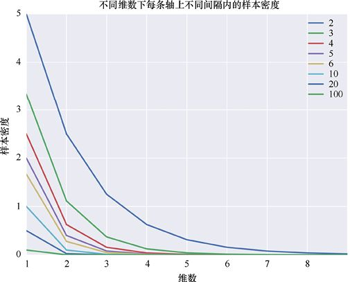

> **圖片描述：** 一張曲線圖，橫軸為維度數量，縱軸為密度。多條曲線（對應不同的箱子數量）均隨維度增加而迅速趨近於0。

圖7.22　在固定數量的樣本中，隨著維數的增加，樣本的密度不斷下降。每條曲線都顯示了每條軸上不同數量的箱子

相反，它們通常聚集在小區域，或者分散在更簡單、低維的表面上（如凹凸不平的薄片或曲線）。這意味著訓練資料和所有其他資料一般都會落在相同區域裡。結果是：樣本最有可能在的那些區域的密度通常足夠高，以至於系統要麼可以對邊界表面做出很好的猜測，要麼該表面的確切位置無關緊要，任意邊界表面都能做好。

例如，在圖7.20所示的立方體中，每個類的樣本可能位於同一水平面上，而不是均勻地分佈在整個立方體中。這意味著，只要新資料也趨向於落在這些水平面上，任何大致水平的分組邊界表面也可能將這些新資料分得很好，如圖7.23所示。

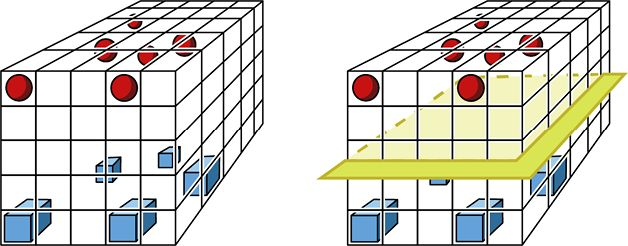

> **圖片描述：** 兩張三維立方體圖。(a)兩組樣本主要分佈在同一水平切片中；(b)一個大致水平的邊界平面將兩組樣本分開，展示即使整體密度低，局部密度仍可足夠。

(a)　　　　　　　　　　　　　　　　　　　　　　　　　　　　　　　　　　　　　　 (b)

圖7.23　實際上，資料在樣本空間中通常有一些結構。(a)每組樣本大多在立方體的同一水平切片中；(b)兩組樣本之間的邊界平面

雖然圖7.23中的大部分立方體是空的，密度很低，但是我們感興趣的部分密度很高，因此我們可以找到一個合理的邊界。

因此，儘管維度災難註定會出現“即使有大量的資料，空間也是低密度的”這種情況，但結構祝福表明“我們通常會在需要的地方獲得相當高的密度”。注意，這種“災難”和“祝福”都是經驗觀察，並非我們可以一直依賴的鐵一般的事實。即便如此，對於這個重要的實際問題，最好的解決方案通常是用儘可能多的資料填充樣本空間。

維度災難是導致機器學習系統在訓練時需要大量資料的原因之一。如果樣本具有大量的觀測值（或維度），就需要超大量的樣本來獲得足夠的密度，以形成良好的邊界表面。

假設我們需要足夠多的樣本來得到特定密度（如0.1或0.5），隨著維數的增加，我們需要多少個樣本？圖7.24顯示了所需樣本數的暴增。

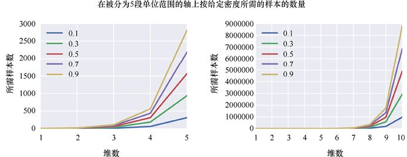

> **圖片描述：** 兩張曲線圖。(a)維度1至5的結果；(b)維度1至10的結果。多條曲線對應不同的目標密度，所需樣本數隨維度呈指數增長。

(a)　　　　　　　　　　　　　　　　　　　　　　　　　　　　　　　　　　　　　　　　　(b)

圖7.24　假設每個軸上有5個分區，我們需要達到不同密度的樣本數。注意這些值是如何在大小上暴增的。(a)維度1～5的結果；(b)維度1～10的結果。要在五維中獲得0.5的密度，需要大約1500個樣本；在十維中，我們需要大約500萬個樣本

一般來說，如果維數很低，並且有很多樣本，那麼我們可能會有足夠的密度，讓分類器找到一個能夠很好地推廣到新資料的分界表面的機會。這句話中“低”和“多”的值取決於使用的演算法和資料。預測這些值沒有硬性規定，我們通常會猜測，然後看看得到了什麼表現，再進行調整。

### 高維奇異性

在結束高維空間的討論之前，值得注意的是，這些空間經常擾亂我們的直覺。例如，假設在高維空間中有一個均勻分佈的點集合，然後我們刪除了一些點——這會導致密度下降。然後我們讓這些點在必要的時候移動，這樣它們就可以再一次大致均勻地分佈在空間中。我們可能會認為，隨著密度的降低以及剩下的點彼此之間的距離越來越遠，點之間的距離會以大致相同的速度增長。結果證明不是這樣的。

我們取一些固定數量的點，然後把它們均勻地放在一條直線上。對於每個點，我們會求出它到最近的點的距離，以及所有這些距離的平均值。現在，在二維網格中放置相同數量的點，再一次找到從任意點到最近點的平均距離。在三維空間中重複這個操作，然後是四維空間，以此類推。如上所述，我們可能會認為，由於這些固定數量的點分佈在越來越高的維度空間中，任何點與其最近的點之間的平均距離都會迅速增加。

圖7.25顯示了任意兩點之間的平均距離，且使用相同數量的點放置在不同維度的空間中。

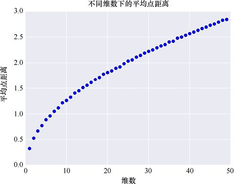

> **圖片描述：** 展示隨維度增加，點與最近鄰之間距離分佈的變化。

圖7.25　當進入更高維度時，直覺會欺騙我們。對於每個維度，我們均勻地在空間中散佈一定數量的點，並找到每個點與其最近的點之間的平均距離

點與點之間的距離確實增加了，這說明這些點在逐漸被分散，但是曲線增長很慢。

另一個著名的例子是盒子裡球體的體積（見[Spruyt14]）。讓我們考慮將一個球體裝入一個不同維度的盒子中的體積，並考慮球體佔了盒子的多少空間，如圖7.26所示。

在一維空間中，“盒子”只是一條線段，而“球體”是一條覆蓋了整個盒子的線段。“球體”的內容與“盒子”的內容之比為1。

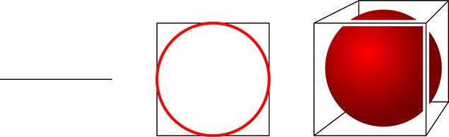

> **圖片描述：** 展示在高維空間中，最近鄰和最遠鄰之間的距離差異如何隨維度增加而縮小。

(a)　　　　　　　　　　　　　　　　　　　　　　　 (b)　　　　　　　　　　　　　　　　　　　　　　　　 (c)

圖7.26　盒子裡的球。(a)一維的“盒子”是線段，“球體”完全覆蓋了它；(b)內有一個圓圈的二維盒子；(c)內有一個球體的三維盒子

在二維空間中，盒子是一個正方形，而“球體”是一個圓，它剛好接觸到4條邊的中心。圓的面積除以盒子的面積大約是0.8。

在三維空間中，盒子是一個立方體，球體被放入其中，剛好接觸到6個面的中心。球體的體積除以立方體的體積大約是0.5。

球體相對於包圍它的盒子所佔用的空間正在減少。如果計算出數值，並計算出更高維度上球體的體積與盒子的體積之比，就得到了圖7.27所示的曲線。

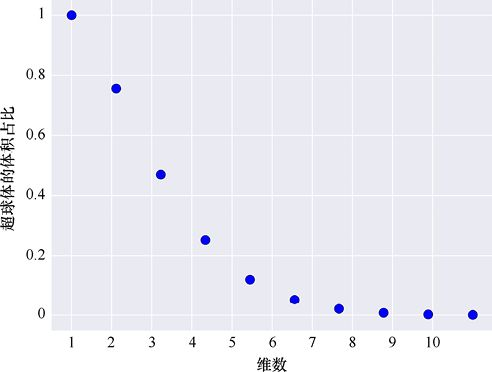

> **圖片描述：** 展示高維超立方體中，大部分體積集中在角落而非中心附近。

圖7.27　在不同維度的情況下，最大的球體的體積佔比

這意味著球體的體積佔比下降到0。當到達10個維度時，我們能裝進密封盒子裡的最大球體幾乎沒有佔據盒子的體積！

這沒有什麼技巧，也沒有什麼問題。在進行數學計算時，就是會發生這樣的事情。高維的確很奇怪。思考在高維空間中工作的學習系統時，我們需要記住這個奇怪的事情，而不是依賴自己的直覺。

在對有大量特徵的資料進行分類時，這個結果是很重要的，因為每個特徵都對應一個維度。例如，如果樣本有7個特徵，那麼其分類器就隱含地在七維空間中工作。依賴於足夠的資料和結構，分類器就能很好地決定邊界表面的走向。隨著維數的增加，一旦不滿足這些條件，分類器就會開始失效。在高維空間中，要確保有“足夠”的資料和“足夠”的密度是很困難的，因為我們的直覺常常無法做到這一點。

在4個或更多維度的幾何中有更多的奇異性。讓我們做進一步探究，以更好地理解將二維和三維推廣到更高維度的風險有多大。

隨著維數的增加，我們發現越來越多屬於球體的點位於其表面附近，而不是內部（見[Carpenter17]）。如果把球體想象成一個橘子，它就會變得全是果皮而沒有果肉。

還有一件怪事。假設我們想運輸一些特別別緻的橘子，並確保它們不能有任何損壞。每個橘子的形狀都很接近球形，所以我們決定用充氣氣球保護的立方體盒子運送它們。我們會在盒子的每個角落放一個氣球，這樣它們就會互相接觸。在一個給定大小的盒子裡，我們能放的最大的橘子是多大呢?

我們想針對任意維數的盒子（還有氣球和橘子）解決這個問題，所以先從二維開始。我們還假設氣球和橘子都是完美的圓。

為了製作橘子貨物的二維版本，我們繪製一個大小為4×4的二維正方形，並在每個角放置一個半徑為1的圓，如圖7.28a所示。這些圓是二維的氣球。

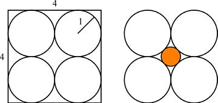

> **圖片描述：** 展示隨著維度增加，內切球體的體積相對於外接立方體的體積比例如何急劇下降。

(a)　　　　　　　　　　　　　　　　　 (b)

圖7.28　在一個正方形盒子裡裝一個二維的圓形橘子，每個角落都有圓形氣球。(a)4個氣球的半徑都是1，所以它們恰好能裝進邊長為4的正方形盒子裡；(b)橘子放在盒子中間，周圍是氣球。橘子的半徑大約是0.4

二維圖中的橘子也是一個圓。圖7.28b展示了盒子所能容納的最大的橘子。根據幾何知識我們知道這個圓的半徑大約是0.4。

現在回到原來的三維問題。我們將4×4的正方形從平面上提起來以增加它的深度，從而創建出一個4×4×4的立方體。現在，我們可以將8個半徑為1的球形氣球放到角落處，如圖7.29a所示。

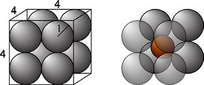

> **圖片描述：** 展示在高維空間中，球體的體積大部分集中在表面附近的薄殼中。

(a)　　　　　　　　　　　　　　　　　(b)

圖7.29　將一個球狀的橘子裝在每個角落都有一個球形氣球的立方體盒子裡。(a) 4×4×4的立方體盒子，8個氣球的半徑都為1；(b)橘子放在盒子中間，周圍是氣球。橘子的半徑大約是0.7

圖7.29b顯示了我們可以放入中間間隙的橘子。根據幾何知識我們知道這個球體的半徑大約是0.7。這比二維情況下橘子的半徑大一點，因為三維情況下橘子在球體之間的中心間隙有更大的空間。

讓我們把這個場景放到四維、五維、六維甚至更高維度中。

在討論大於三維的立方體和球體時，我們把它們稱為**超立方體**和**超球體**。通過類比，我們可以把高維的橘子稱為**超級橘子**。對於任意維數，超立方體的每一條邊永遠都是4個單位長度，超立方體的每一個角也都有一個超球體氣球，這些氣球的半徑永遠都是1。

我們可以寫出一個公式，用於表示在任意維度下可以擬合的最大超級橘子的半徑（見[Numberphile17]）。圖7.30繪製了不同維數下的超級橘子的半徑。

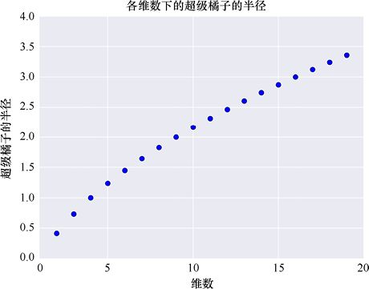

> **圖片描述：** 展示高維空間中的反直覺現象，幫助理解維度災難的本質。

圖7.30　在邊長為4的超立方體中，被立方體的每個角上的半徑為1的超球體氣球包圍的超級橘子的半徑

從圖7.30可以看出，在四維空間中，我們可以運輸的最大的超級橘子半徑剛好為1。這意味著它和周圍的超球體氣球一樣大。這很難想象，但事情變得更奇怪了。

由圖7.30可知，在9個維數下，超級橘子的半徑是2，所以它的直徑是4。這意味著超級橘子和盒子本身一樣大。儘管周圍有512個半徑為1的超球體氣球，每個超球體氣球都位於這個九維超立方體的512個角之一。

接下來，事情會變得更瘋狂。在十維以上，超級橘子的半徑**大於**2。超級橘子現在比原本用來保護它的超級盒子**更大**，儘管每個角都有一個保護氣球。

怎麼會這樣呢？我們很難對正在發生的事情有一個很好的直觀理解。一種流行的解釋是，超級橘子是一個“尖尖的球體”，不知怎的（儘管沒有人確切知道緣故），它設法發出的尖刺與圍繞它的超球體氣球之間相適應（見[Strohmer17]），如圖7.31所示。

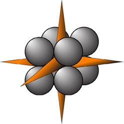

> **圖片描述：** 展示高維空間中距離度量的特殊性質。

圖7.31　超過十維的超級橘子的半徑大於2。一種形象化的方法是將橘子想象成一個“尖尖的球體”，儘管它不太像常見的球體

雖然這是一種想象超級橘子為何如此之大的常見方法，但這些尖刺似乎很難與我們通常理解的任何一種形狀是“球體”的概念相一致。我們可以更容易地把這個“尖尖的球體”想象成一個被拳頭擠壓著的水氣球，氣球會在每一對手指間向外擠出。這仍然感覺不太符合球形，但至少沒有任何尖刺。

這裡的寓意是：進入多維空間時，直覺可能會讓我們失望（見[Aggarwal01]）。任何時候，處理超過3個特徵的資料時，我們就進入了更高維度的世界，不應該通過類比從二維和三維的經驗中所知道的東西加以推理。

我們需要睜大眼睛，依靠數學和邏輯，而不是直覺和類比。

## 參考資料

[Aggarwal01]　Charu C. Aggarwal, Alexander Hinneburg, and Daniel A. Keim, *On the Surprising Behavior of Distance Metrics in High Dimensional Space*, ICDT 2001.

[Arcuri16]　Lauren Arcuri, *Definition of Candling-How to Candle an Egg*, The Spruce Blog, 2016.

[Bellman57]　Richard Ernest Bellman, *Dynamic Programming*, Princeton University Press, 1957 (republished 2003 by Courier Dover Publications).

[Carpenter17]　Bob Carpenter, *Typical Sets and the Curse of Dimensionality*, Stan blog, 2017.

[Domingos12]　Pedro Domingos, *A Few Useful Things to Know About Machine Learning*, Communications of the ACM, Volume 55 Issue 10, October 2012.

[Hughes68]　G.F. Hughes, *On the mean accuracy of statistical pattern recognizers*, IEEE Transactions on Information Theory. 14 (1)： 55–63, 1968.

[Nebraska17]　Nebraska Extension, *Candling Eggs*, Nebraska Extension in Lancaster County, University of Nebraska-Lincoln, 2017.

[Numberphile17]　Numberphile, *Strange Spheres in Higher Dimensions,* YouTube, 2017.

[Spruyt14]　Vincent Spruyt, *The Curse of Dimensionality*, *Computer Vision for Dummies blog post*, 2014.

[Strohmer17]　Thomas Strohmer, *Surprises in High Dimensions*, Mathematical Algorithms for Artificial Intelligence and Big Data Analysis, UC Davis 180B Lecture Notes, 2017.

[Wikipedia17]　Wikipedia authors, *Combination*, 2017.

### 讀者服務：

> **圖片描述：** 一個 QR Code（二維條碼），中央有綠色的書籍圖示標誌，掃描後可連結到相關線上資源。

微信掃碼關注【異步社區】微信公眾號，回覆“e55451”獲取本書配套資源以及異步社區15天VIP會員卡，近千本電子書免費暢讀。
