# 第8章　訓練與測試

本章介紹如何訓練系統從資料中學習、如何衡量它的學習效果，以及如何衡量我們對它在全新資料上表現的期望。

## 8.1　為什麼這一章出現在這裡

建立學習系統的目的是從資料中提取有效含義，有時我們想要了解的是已經擁有的資料集，有時想要了解的則是尚未獲得的資料。

本章將討論**訓練**（training）這一概念。訓練是一個過程，使用預設值或隨機值進行系統的初始化，然後重新配置它，使參數經過調整後與我們想要了解的資料相協調。

有效的訓練過程要求能夠對系統的學習效果進行評估，即所謂的**驗證系統**——通過向系統展示從未見過的新資料對其進行驗證，以此衡量系統從這些新資料中提取含義的準確性。

本章還會介紹一個名為**交叉驗證**的驗證工具，用於引導訓練，以獲取訓練資料中每一點能夠學習的東西。當資料集很小且難以收集更多樣本資料時，交叉驗證更為有效。

對於應用來說，如果系統對驗證資料集的預測效果已經足夠好，我們就可以開始實際使用這個系統；如果效果不夠好，就需要再進行訓練。

本章會用到監督分類器，這一分類器學習的是帶標籤的資料。特殊之處在於，我們將使用一種神經網路類型的分類器，通過重複將它暴露於一組訓練資料前進行學習。本章討論的大多數技巧都是通用的，幾乎可以應用於所有類型的學習器。

## 8.2　訓練

在用分類器進行監督學習時，每個樣本都有一個對應的**標籤**，這一標籤是經人工確定的正確類別。所有待學習的樣本連同它們的標籤一起，被稱為**訓練集**。

我們把訓練集中的每個樣本都展示給分類器，一次展示一個。我們會把每一個樣本的特徵都告知系統，然後要求系統**預測**樣本的類別。

如果預測正確（也就是說，它與已知正確的標籤相匹配），那麼我們繼續為其展示下一個樣本。如果預測錯誤，那麼我們將把分類器的輸出和正確的標籤返回給分類器，之後更新分類器*，*通過正確的標籤、預測標籤和分類器的當前狀態來修改分類器的內部參數，以使分類器再次看到這個樣本時更有可能預測出正確的標籤。圖8.1直觀展示了訓練一個分類器的實質。

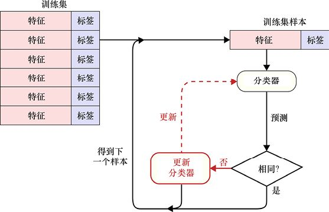

> **圖片描述：** 流程圖展示訓練分類器的過程。左側是訓練集（多個特徵-標籤對），每次取一個樣本送入分類器進行預測。預測結果與標籤在菱形判斷框「相同？」中比較：若「是」則取下一個樣本；若「否」則通過紅色虛線箭頭「更新」分類器參數。

圖8.1　訓練一個分類器的實質

前文介紹的是整個訓練過程的簡化版本。正如我們將在後續章節中看到的那樣，測試可能會涉及其他因素，而這些因素會促使我們更新分類器的變量。同時我們還將發現，用更低的頻率去更新每個樣本會更加有效。通過這樣一次一個樣本地執行循環，分類器的內部變量將能夠越來越好地預測標籤。

每將整個訓練集完整運行一次，我們就說訓練了一個epoch，通常需要對同一個系統訓練許多個epoch。通常，只要系統還在學習和改進其對於測試資料的表現，我們就會繼續進行訓練。但是，如果時間不夠了，或者系統的性能已經足以勝任我們想要它完成的任務，我們也可能會停止訓練。

現在，讓我們來看看應該如何去評估分類器預測正確標籤的能力。

### 測試性能

用來訓練系統的資料稱為**訓練資料**（training data）或**訓練集**。訓練資料是我們最開始使用的資料，所以它不是當分類器被**發佈**（或**部署**）後在實際應用中見到的資料，而**實際資料**（也可以稱為**發佈資料**、**部署資料**或**用戶資料**），只有在運行的系統被髮布之後才會出現。

我們想要在分類器被投入使用之前知道它在實際資料上的性能，但並不需要非常完美的準確性，只需要在心中大致有一個希望系統達到或超過的性能閾值。那麼，在系統投入使用之前，我們應該如何評估系統預測的性能呢？

我們需要系統在訓練資料上做得足夠好，但這還不夠。如果我們僅通過分類器由訓練資料得到的結果加以判斷，就會被誤導。

下面，讓我們來看看原因。假設用監督分類器查看狗的圖片，併為每張圖片分配一個標識了狗的品種的標籤。這樣做的目的是可以把這個系統發佈到互聯網上，於是人們可以把狗的圖片拖到他們的瀏覽器裡，之後由系統返回狗的品種，如“混血品種”。

為了訓練系統，我們將收集1000張不同的純種狗的圖片，每一張都由一位專家進行標記。現在我們將每張圖展示給分類器，讓它預測狗的品種。如果答案是錯誤的，那麼我們會告訴它正確的答案，系統就會據此來調整分類器的內部參數，使它在下次看到這張圖時更有可能預測出正確的答案（同樣，我們也將在後面討論這個操作的細節）。

我們會給系統展示所有1000張圖片，隨後一次又一次地展示它們。我們通常會打亂順序，所以這些圖片不會總是以相同的順序被輸送到系統中。如果系統設計得足夠好，那麼將逐漸產生越來越精確的結果，直到能以99%的精度識別出訓練圖片中的狗的品種。

但是，這並不意味著當我們把系統放到網上時，它的準確率會達到99%。

問題在於我們不知道系統從圖片（見圖8.2所示的貴賓犬圖像）中學到了什麼。

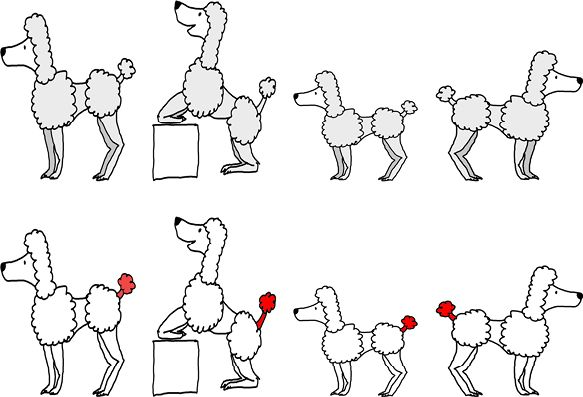

> **圖片描述：** 上排三張貴賓犬照片，下排相同照片中標示出系統學到的識別特徵——狗尾巴末端的波波頭（白色球狀毛髮）。

圖8.2　系統可能會通過狗尾巴上的波波頭識別貴賓犬。第一行：輸入的貴賓犬圖像。第二行：標出了系統學習識別的特徵，並通過這些特徵來識別貴賓犬

在準備訓練集時，我們並沒有注意到所有貴賓犬尾巴末端都有一個小波波頭，而其他的狗都沒有。那麼，這個系統就可能發現這一規則，即尾巴末端有白色波波頭意味著這是一隻貴賓犬。利用這個規則，系統就可以正確地對所有圖像進行分類。

也許所有約克郡犬的圖像都是狗狗坐在沙發上的時候拍攝的，如圖8.3所示。而我們沒有注意到這一點，也沒有注意到其他的圖裡面都沒有沙發。然而系統可能會發現這一規則，因此，如果圖中有一個沙發，那麼系統就會給它貼上約克郡犬的標籤，而這條規則同樣適用於其他的訓練資料。

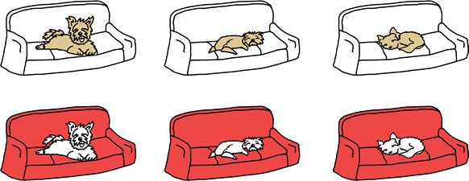

> **圖片描述：** 上排三張約克郡犬躺在沙發上的照片，下排相同照片中標示出系統學到的識別特徵——沙發本身。

圖8.3　第一行：3只約克郡犬躺在沙發上；第二行：標出了系統學習識別的特徵——沙發

假設我們已經發布了這一系統，有人提交了一張大丹犬站在節日裝飾前的圖（這個節日裝飾是一根繩子上系滿了小白球），或者是一張躺在沙發上的哈士奇的圖，如圖8.4所示。那麼系統注意到大丹犬尾巴末端的白色球，會認為這是隻貴賓犬；或是它會看到沙發而忽略狗，然後將哈士奇誤認為一隻約克郡犬。

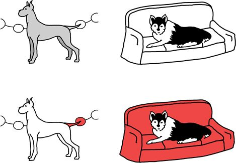

> **圖片描述：** 上排：一隻大丹犬站在白色球狀節日裝飾前，以及一隻躺在沙發上的哈士奇。下排標示出系統的錯誤推理——將大丹犬尾巴附近的白球誤認為貴賓犬特徵，將沙發誤認為約克郡犬特徵。

圖8.4　第一行：一隻大丹犬站在作為節日裝飾的白色小球前，以及一隻躺在沙發上的哈士奇。第二行：系統看到大丹犬尾巴末端的白色球，就會誤認為這是一隻貴賓犬；看到沙發，就將哈士奇誤認為約克郡犬

這不僅是理論上的擔憂，這種現象的一個著名例子源自20世紀60年代的一次講座，一位研究人員展示了一種早期的機器學習系統（見[Muehlhauser11]）。他們對訓練資料的細節並不是非常清楚，但似乎是有一組照片，其中包含了多張匹配圖像：一排樹，中間還有一輛偽裝的陸軍坦克。研究人員給出了最終的結果：該系統每次都能識別出包含坦克的圖像。這意味著該系統知道如何識別偽裝的坦克，它的能力達到了一個驚人的水平。

在講座結束時，觀眾中有人站起來，他發現裡面有坦克的照片都是在晴天拍攝的，而沒有坦克的照片都是在陰天拍攝的。這看起來似乎是這個系統僅區分了明亮的圖和暗淡的圖，其結果與樹或坦克一點關係都沒有。

所以僅看系統對於訓練資料集的表現並不足以預測其在真實世界中的表現，系統可能會在訓練資料中學到一些稀奇古怪的屬性，然後將其作為真理使用，而遇到沒有這些特徵的新資料時就會發生錯誤。

因此，除了系統對於訓練資料集的表現，我們還需要一些其他的度量方法來預測正式部署時系統會做得多好。

如果有一種演算法或公式能由訓練過的分類器告訴我們它表現得有多“好”，那就太好了，但是沒有。如果我們不去嘗試和觀察，就無法知道系統有多好，就像自然科學家必須通過實驗來觀察現實世界中實際發生的事情一樣，我們也必須通過實驗來觀察系統表現得如何。

## 8.3　測試資料

誰都知道，想要知道一個系統在新的、未知的資料上能做得多好，首選的方法就是給它新的、未知的資料，之後看看它能做得多好。對於這種實驗驗證來說，是沒有捷徑可走的。

我們稱這些新的資料點或樣本為**測試資料**（test data）或**測試集**。

與訓練資料一樣，我們希望測試資料能夠代表系統實際使用後所要接觸到的資料。

這一典型過程是使用訓練資料來訓練系統，直至達到我們認為可以達到的效果。然後我們在測試資料上評估系統，以獲悉它在現實世界中的表現。

如果系統在測試資料上表現得不夠好，那麼無論在訓練資料上做得多麼好，都需要進行更多的訓練。用更多的資料去訓練系統幾乎總是一個提高性能的好方式，所以我們會去收集更多的各個品種的狗的圖像，來將這些圖像加入訓練集。我們可能會從頭開始使用全部訓練集重新訓練分類器，也可能只用新資料進行訓練，然後再次嘗試使用測試資料來評估分類器。

獲得更多圖的另一個好處是：我們可能會得到一些樣本，從而避免系統在訓練中發現的奇怪特徵。例如，我們可能會發現尾巴上長著波波頭的狗，但它不是貴賓犬，抑或發現躺在沙發上的狗，但它不是約克郡犬。這樣系統就必須找到其他的方法來對這些狗進行歸類，那麼最初的訓練集裡的那些奇怪特徵可能就不再重要了。

訓練過程和測試過程的一個必需的規則就是**我們決不從測試資料中學習**。將測試資料放入訓練集是很誘人的，因為那樣就會有更多的樣本可以供系統學習，但是這會破壞我們對系統總體能力進行評估的可靠性。

從測試資料中進行學習的問題是：它僅會成為訓練集的一部分。這意味著我們回到了原點，系統可以非常容易地找出訓練資料中的某些特徵（現在包含了測試資料）。這時，再用測試資料來查看分類器的工作情況，它就會對每個圖像標記正確的標籤，但這是“作弊”行為，因為它已經學習過測試資料了。

如果我們對測試資料進行學習，那麼就失去了它作為新資料對系統性能進行衡量的特殊性和價值。

系統用測試資料進行學習這個問題非常重要，以至於它有自己的名稱：**資料洩露**（data leakage），也稱為**資料汙染**（data contamination）或**處理受汙染資料**。我們必須持續關注這一問題，因為隨著訓練程式和分類器變得越來越複雜，資料洩露可能在不知不覺中發生（也很難察覺）。

如果我們不小心翼翼地將這些資料集分開，系統可能會學到一些很微妙的東西，比如對測試資料的統計結果，其中可能包括值的範圍、平均值或標準差。而更復雜精細的演算法可能會學習一些更加細緻微妙的統計資料，這些資料甚至是我們從未關注過的，但是它可以使程式的性能看起來比實際更好。

很多領域的一些想法都會以不同的微妙方式反覆出現，而資料洩露就是機器學習中的一個這樣的概念。我們也將在第12章中再次討論它，並將瞭解到：必須在預處理期間採取一些非常明確的步驟，以防訓練資料和測試資料相互影響。

圖8.5a是訓練時的資訊流，其結果用於幫助分類器從錯誤判斷中學習；圖8.5b是測試時的資訊流，其結果用於度量分類器的性能，而**不會**通過回饋幫助分類器進行學習。

如圖8.5所示，評估測試資料時，回饋再進行學習的機制是斷開的，分類器即使預測到錯誤的標籤也不會進行改變。學習階段已經結束了，現在只是評估所創建的系統。

另一種看待資料洩露的方法是把訓練資料看作一堆多選題測試，每當我們答錯了問題，就會被告知正確答案。

假設隨著時間的推移我們越來越擅長回答這些選擇題，但是並不知道是因為學會了這些科目，還是因為記住了所有答案。為了明白這一點，我們需要參加一場題目全新的測試，所有問題對於我們來說都必須是全新的，這一點非常重要，因為如果我們以前見過這些問題，就可以用記憶中的正確答案來回答它們，就無法對所掌握的知識進行測試。

所以我們必須對系統隱藏測試集，直到訓練結束，然後一次性地用它來評估系統的性能。

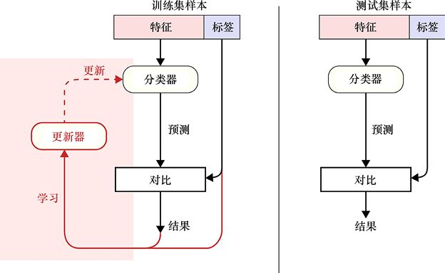

> **圖片描述：** 兩個並排的流程圖。(a)訓練流程：預測結果與標籤比較後回饋更新分類器；(b)測試流程：預測結果與標籤比較但不進行回饋更新，學習連結被斷開。

　　　　　　　　　　　　(a)　　　　　　　　　　　　　　　　　　　　　　　　　　　　　　　　　 (b)

圖8.5　訓練和測試的區別。(a)訓練是將預測的結果與實際標籤進行比較，利用兩者之間的誤差來幫助分類器更好地學習；(b)如果讓測試資料在系統中運行，就會刪除學習和更新的步驟

我們經常通過分裂原始資料集的方式創建測試資料，即將原始資料分為兩組：訓練集和測試集，通常我們分出大約75%的樣本給訓練集。兩組的樣本是隨機分配的，但使用更復雜的演算法可以確保這兩組的樣本都有足夠廣泛的涵蓋。也就是說，這兩組資料都能充分逼近全部輸入資料，大多數的機器學習庫都為我們提供了執行這種分割的例程，如圖8.6所示。

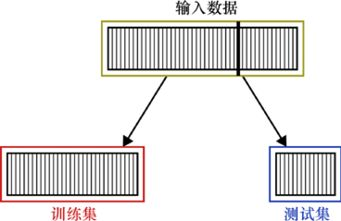

> **圖片描述：** 示意圖展示將輸入樣本分割為兩部分：約75%為訓練集，約25%為測試集。

圖8.6　將輸入樣本分割為訓練集和測試集，分割比例通常是“75%和25%”或“70%和30%”

通常，用測試集來評估分類器的品質是應用分類器前所要做的最後一件事。如果系統表現得足夠好，我們就可以開始使用它；如果系統表現得不夠好，我們就需要返回訓練這一步，再次進行訓練。

即使測試資料可以代表整個輸入資料，我們也仍然希望有更多的情景可以使用。回到我們對狗進行分類的那個例子，輸入資料可能只包含標準的貴賓犬的圖像，但是現在有非常多的混血狗。它們的基因一部分屬於貴賓犬，而另一部分屬於其他品種的狗，如可卡貴賓犬（可卡犬和貴賓犬）（見[VetStreet17a]）、拉布拉多貴賓犬（拉布拉多獵犬和貴賓犬）（見[VetStreet17b]），以及雪納瑞貴賓犬（小型雪納瑞犬和貴賓犬）（見[VetStreet17c]）——這些品種的狗看起來都有點像標準的貴賓犬，但是仍然有區別，如圖8.7所示。如果我們想讓系統識別出這些不同類型的、與貴賓犬類似的狗，就需要用帶有這些品種標記的圖像來訓練它。

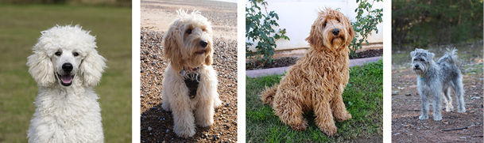

> **圖片描述：** 四張狗的照片，從左到右分別為：貴賓犬、可卡貴賓犬、拉布拉多貴賓犬、雪納瑞貴賓犬，展示外觀的相似性與差異性。

圖8.7　帶有貴賓犬基因的不同種類的狗，從左到右分別為貴賓犬、可卡貴賓犬、拉布拉多貴賓犬和雪納瑞貴賓犬

## 8.4　驗證資料

除了訓練集和測試集，我們通常還會從原始輸入資料中獲得另一組資料，並將其稱為**驗證資料**或**驗證集**（validation set）。

這又是另一個資料塊，用於表示部署系統時將看到的真實資料。我們通常通過將輸入資料分成三部分創建這個集合，將原始資料的60%分配給訓練集，20%分配給驗證集，其餘20%分配給測試集，如圖8.8所示。

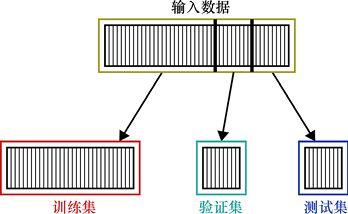

> **圖片描述：** 示意圖展示將輸入資料分為三部分：60%訓練集、20%驗證集、20%測試集。

圖8.8　將輸入資料分割為訓練集、驗證集和測試集

在用自動搜索技術嘗試超參數的多個值時，這種分離資料的方法就變得非常有用。回想一下第1章，超參數是在運行系統之前設置的變量，以便控制系統如何運行。對於超參數的每一次變化，我們都會訓練訓練集，而後在驗證集上評估系統的性能，之後會選擇一組實作效果最好的超參數，並通過在從未見過的測試集上運行系統來評估系統的性能。

換句話說，我們把驗證集用作學習過程的一部分，而測試集仍舊放在一邊，以便進行一次性的最終評估。

測試不同超參數集的方法是通過不斷循環進行的，讓我們來看看現有循環的簡化版本，在這裡，我們將一個訓練集分割成更小的訓練集、驗證集和測試集。而不久之後，我們會看到一種更復雜的方法稱為**交叉驗證**，交叉驗證是不重複使用相同的驗證集的。

要運行循環，我們就需要選擇一組超參數，並通過它們對系統進行訓練，然後使用驗證集對其進行測試。對驗證集的測試將告訴我們，這些超參數訓練的系統在預測新資料方面的表現如何。之後我們會把這個已經經過驗證集測試的系統放在一邊，取出下一組超參數來訓練一個新系統，並再次使用驗證集來評估其性能。我們將對每一組超參數都執行這一過程。

在遍歷了所有超參數集後，我們只會選取一組超參數值（這些值使得系統能夠獲得最佳的性能）。然後我們就會選用這個系統並運行測試集，以查看預測情況（可由此得知系統在遇到新資料時的表現），如圖8.9所示。

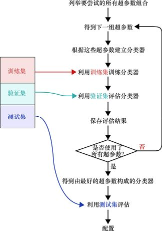

> **圖片描述：** 流程圖展示使用驗證集來嘗試不同超參數組合的迴圈過程，最後用測試集進行最終評估。

圖8.9　在需要嘗試許多不同的超參數組合時，我們會使用驗證集。注意，我們仍然需要保留一個單獨的測試集，在正式應用系統之前使用它

當循環完成後，我們可能會想到使用驗證資料的結果作為系統的最終評估結果，畢竟，分類器並沒有學習這些資料，它只用於測試。看上去我們可以省去單獨製作測試集的麻煩，然後在系統中運行驗證資料以評估系統的性能。

但是，這樣做會導致資料洩露，從而歪曲結論。和許多資料洩露問題一樣，這種洩露的來源有些狡猾和微妙。

問題在於雖然分類器沒有從驗證資料中學習，但是整個訓練和評估體系卻使用了驗證資料，因為它們利用這些資料為分類器選擇最好的超參數。換句話說，儘管分類器沒有直接地從驗證資料中學習，但是驗證資料影響了我們對分類器的選擇。我們選擇了一個在驗證資料上表現最好的分類器，所以**已經知道**分類器在驗證資料上會有好的表現。換句話說，驗證資料中的一些內容對最終分類器的形成是有貢獻的。因此，在正式應用前，我們對分類器在驗證資料上的表現的瞭解將“洩露”到最終的評估情況中。

這確實很微妙，這類事情很容易被忽視或遺漏。因此我們必須對資料洩露時刻保持警惕，否則可能會發佈一個不滿足預期使用想法的系統。

為了更好地評估系統在全新資料上的表現，我們需要用以前從未見過的新資料測試它。

驗證集在圖8.9所示的循環中是必要的，但是它佔據了寶貴的訓練資料的20%。好在已經出現了一些非常聰明的技術，可避免單獨設置驗證集。下面讓我們來看看它們。

## 8.5　交叉驗證

我們在上面的討論中假設將原始資料分割成小塊時訓練集仍然足夠大，大到可以很好地訓練系統。

但如果不是這樣呢？有時我們只有少量的標記資料，獲取更多資料是不切實際的，或者說不可能的。也許我們正在研究一顆彗星的圖像，這顆彗星是由一艘宇宙飛船在一次短暫的飛近探測中拍攝到的。也許我們正在研究從已經消散的颶風中測量的資料。在這些情況下（以及許多其他情況下），獲取更多資料要麼不方便，要麼成本高昂，要麼根本不可能。

因為樣本數量有限，所以我們需要充分利用每一個樣本。在8.4節中我們看到，如果想嘗試有多個分類器，就需要將原始資料分成三部分，可能只剩下60%的資料用於實際訓練。

我們可以做得更好，訣竅在於，雖然還需要從原始資料中刪除一些樣本來創建一個測試集，但是可以巧妙地避免創建一個獨立的、永久的驗證集。

實作這一點的技術稱為**交叉驗證**（cross-validation）或**輪換驗證**（rotation validation）。交叉驗證演算法有不同的類型，但都有著相同的基本結構（見[Schneider97]）。

交叉驗證演算法的核心思想是通過運行一個循環多次訓練和測試系統，如圖8.9所示。

但是，我們將把注意力從嘗試不同的超參數集轉移到對一個系統的評估上，旨在用圖8.9所示的基本循環來評估系統如何應對新資料，但是不單獨設立一個明確的驗證集，這樣就能用全部的資料進行訓練（雖然如我們所看到的那樣，所有資料不是同時被利用）。

在開始之前，我們取出測試資料並將其放在一邊，像以前一樣，只在系統正式應用前使用這些資料。

現在我們已經為這一小技巧做好了準備，每當進行循環時，都會把剩餘的全部原始資料（稱為訓練資料）分割成臨時訓練集和臨時驗證集。這一分割是暫時的，只在這一循環執行期間有效。

因此，我們現在的目標是，在給定一組超參數的情況下，如何確定系統的性能，同時又不犧牲20%的寶貴訓練資料，避免將它們用作無法訓練的專用驗證集。我們會在圖8.9所示的循環中創建一個更小的新循環，以評估當前分類器的性能。

我們首先構建一個新的分類器實例，而後在臨時訓練集上訓練分類器，並使用臨時驗證集對其進行評估，這會獲得分類器性能的**分數**（score）。

現在，讓我們再次運行這個循環，這次把訓練資料分割為臨時訓練集和臨時驗證集時，這些資料被分割為**新的集**，與我們之前嘗試過的任何一次分割都不同。

通過這種方式，我們一遍又一遍地運行循環，把訓練資料分割成新的集合，進行訓練和驗證，並獲得分類器性能的分數。當這一過程全部完成後，所有分數的平均值就是我們對分類器總體分數的評估。交叉驗證的可視化概況如圖8.10所示。

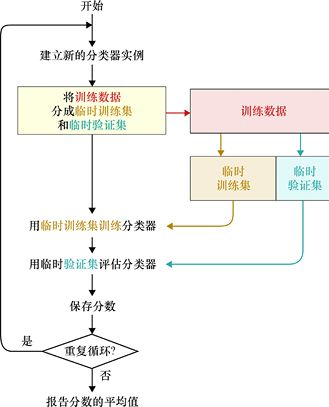

> **圖片描述：** 展示交叉驗證的資料分割方式，訓練資料被輪流分為臨時訓練集和臨時驗證集。

圖8.10　使用交叉驗證評估系統的性能

通過使用交叉驗證，我們可以對全部的訓練資料進行訓練，雖然不是所有資料的訓練都在一次循環中完成，但是我們仍然可以從一個留存出的驗證集中得到對系統性能的客觀衡量。

這個演算法不存在資料洩露問題，因為每次運行循環時，我們都會創建一個新的分類器，而這個分類器的臨時驗證集對於特定的分類器來說是未曾見過的全新資料，所以用它來評估分類器的性能是公平的。

構建臨時訓練集和臨時驗證集的演算法有很多，下面讓我們來看一種流行的方法。

### *k*摺疊交叉驗證

構建用於交叉驗證的臨時資料集的一種流行的方法就是*k***摺疊交叉驗證**（*k* fold cross- validation）。

這裡的字母*k*不是單詞的第一個字母，而是代表一個整數（例如，我們可能進行“2次摺疊交叉驗證”或“5次摺疊交叉驗證”）。通常，*k*的值是我們想要進行循環的次數。

這一演算法的實作在圖8.10所示的交叉驗證循環開始之前就開始了。我們將訓練資料分成一系列大小相等的塊，並將每塊稱為一個**摺疊**（fold）。與以往不同，這裡的“摺疊”用來表示摺痕（或結束）**之間**的部分。試想一下，把訓練集的所有樣本都寫在一張長長的紙上，然後把它摺疊成固定數量的等份，每把紙折彎一次，都會得到一條“摺痕”，而摺痕之間的部分就稱為“摺疊”，如圖8.11所示。

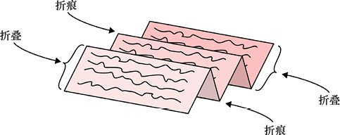

> **圖片描述：** 展示 k-折交叉驗證的過程，資料被分成 k 等份，每次用不同的一份作為驗證集。

圖8.11　為*k*摺疊交叉驗證創建“摺疊”，這裡有4條摺痕和5個摺疊

我們會在訓練資料中創建大小相同的摺疊，而每個摺疊都包含兩條摺痕（或者一條摺痕與列表頂部或底部）之間的資訊。將圖8.11所示的紙拉平，我們可以創建更典型的5摺疊圖，如圖8.12所示。

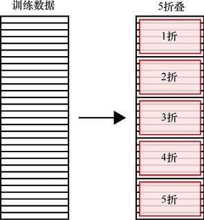

> **圖片描述：** 展示多次交叉驗證迭代的得分結果及其平均值。

圖8.12　把訓練資料分成5個大小相等的摺疊，命名為“1折”到“5折”

讓我們通過這5個摺疊來看看循環是如何進行的。第一次通過循環，我們將2～5折中的樣本作為臨時訓練集，而將1折中的樣本作為臨時驗證集。也就是說，我們將使用2～5折中的樣本訓練分類器，然後用1折中的樣本對其進行評估。

下一次執行循環時，我們將使用2折中的樣本作為臨時驗證集，用1、3、4和5折中的樣本作為訓練集。我們如往常一樣地用這兩個集進行訓練和評估，再對剩下的摺疊重複前述操作，如圖8.13所示。

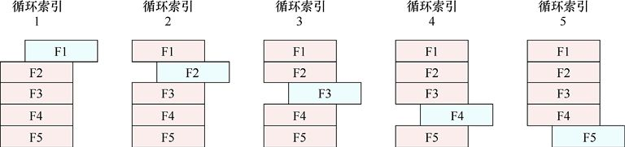

> **圖片描述：** 展示留一法（leave-one-out）交叉驗證，每次只留一個樣本作為驗證集。

圖8.13　每次通過循環時，我們都選擇其中一個摺疊作為驗證集，並將其他的摺疊作為訓練集。當循環次數超過5次時，我們就再重複這種劃分

通常我們將摺疊次數與循環次數設置為相同。但是因為訓練過程中經常涉及一些隨機數，所以也可以儘可能多地重複這一循環，只需要重複進行選擇摺疊的循環。

這個方案的美妙之處在於，我們可以使用所有訓練資料進行訓練，不需要將其分割成永久固定的訓練集和驗證集，而是在每次循環中都進行新的訓練集/驗證集的劃分。利用這些不同劃分打出的測試分數的平均值才是系統的最終分數。

當沒有太多資料可以使用時，交叉驗證就是一個很好的選擇。然而如果我們真的想對系統的性能進行一個很好的評估，就需要多次重複“訓練−驗證”的循環，這是一個缺點。但是我們所做的是用時間換取將所有資料都用於訓練的能力，這樣做可以從輸入集中攝取每一點資訊，應用它們使得分類器變得更好。

如上所述，我們已經用分類器展示了*k*摺疊交叉驗證，而該演算法幾乎適用於所有類型的學習器。

## 8.6　對測試結果的利用

我們一直在討論的不同類型的“測試”有兩個主要的應用。

第一，通常我們會用測試資料預測系統在正式應用時的表現。如果對於應用來說性能足夠好，我們就可以發佈它並讓人們使用；如果性能還不夠好，我們就必須考慮一些其他的選項（例如改變演算法，收集更多的資料或者選擇新的超參數），之後再一次嘗試構建分類器。同時，我們還可以使用測試結果來量化系統性能，這在撰寫論文或參與某些競賽時對不同的演算法進行評估是非常有用的。

第二，在訓練期間，如果想為特定的系統選擇最好的超參數，就會用到測試結果。我們使用的是（至少在那一刻是這樣）一個特定的學習器及訓練方案（包含訓練資料），並且只是試圖找到用於控制系統的超參數的最佳設置。

結束之後，我們就可以用測試資料評估結果了。和以前一樣，如果結果不夠好，我們就需要重新考慮整個系統，又或者決定是否值得花費更多的時間去尋找更好的超參數。在這種情況下，我們將繼續使用同一演算法，再次進行更多的交叉驗證。

這一過程沒有硬性規定，是我們在經驗和直覺的基礎上進行的工作，而經驗和直覺通常都會隨著我們對特定系統和資料集的使用而不斷完善提升。

## 參考資料

[Muehlhauser11]　Luke Muehlhauser, *Machine learning and unintended consequences*, LessWrong blog, 2011. Note the comment from 2016 in which Ed Fredkin reports that he was the person in the audience who spotted the sunny or cloudy “tell” in the pictures.

[Schneider97]　Jeff Schneider and Andrew W. Moore, *Cross Validation*, in *A Locally Weighted Learning Tutorial using Vizier 1.0*, Department of Computer Science, Carnegie Mellon University, 1997.

[VetStreet17a]　VetStreet, *Cockapoo*, 2017.

[VetStreet17b]　VetStreet, *Labradoodle*, 2017.

[VetStreet17c]　VetStreet, *Schnoodle*, 2017.

### 讀者服務：

> **圖片描述：** 一個 QR Code（二維條碼），中央有綠色的書籍圖示標誌，掃描後可連結到相關線上資源。

微信掃碼關注【異步社區】微信公眾號，回覆“e55451”獲取本書配套資源以及異步社區15天VIP會員卡，近千本電子書免費暢讀。
