# 第9章　過擬合與欠擬合

本章將判斷系統是否還未從訓練資料中學到足夠多的資訊，或者是否學得過多，以及如何在兩者之間保持平衡。

## 9.1　為什麼這一章出現在這裡

我們構建了機器學習的系統，用來從資料中提取資訊。為此，我們通常從一個有限大小的樣本集開始，嘗試從中學到一些通用規則。當系統學習了這些規則後，我們可以把它對外公佈，這樣一來我們（或者其他人）就能為它提供新的資料。通過將系統所學到的規則應用在那些新資料上，它就能為我們回饋一些關於資料的有用資訊。

但無論是人還是電腦，要想從有限的樣本集中學到有關某一主題的通用規則，都是個相當大的挑戰。

如果我們未能對這些樣本的細節給予足夠的關注，所得到的規則將太過通用，那麼系統在嘗試處理全新的資料時，很可能會得到錯誤的結論；如果對樣本的細節關注得太多，所得到的規則將太過具體，那麼結論也很可能出現問題。

上述兩種現象分別稱為**欠擬合**（underfitting）與**過擬合**（overfitting）。其中更常見且難的問題是過擬合。如果我們不仔細檢查，過擬合可能會給我們一個包含所有資料的資訊卻又毫無用處的系統。我們可以通過一系列名為**正則化**（regularization）的方法來控制甚至消除過擬合的問題。

這些想法通常會與我們在第2章中所提及的**偏差**與**方差**（variance）這兩個概念一起進行討論，給了我們看待同一現象的不同角度。

在本章中，我們將看到導致過擬合與欠擬合的原因，以及處理它們的方法。

## 9.2　過擬合與欠擬合

如果系統在訓練資料中學習得很多且表現很好，但在面對新資料時表現得很糟糕，我們就可以說系統是**過擬合**的；如果系統在訓練資料中並未學習充分，且在新資料上表現糟糕，我們就可以說系統是**欠擬合**的。接下來我們依次討論這兩種現象。

### 9.2.1　過擬合

我們借一個比喻開始關於過擬合的討論。假設我們受邀去參加一個大型的露天婚禮，但是並不認識婚禮上的大部分賓客。整個下午，我們都與婚禮上的賓客們一起待在公園裡，互相介紹並交流。我們努力去記住人們的名字，因此每當我們遇到一個人，就會在腦海中建立起某種關於此人的外表與名字間的聯繫（見[Foer12]和[Proctor78]）。

假設我們遇到了一個名為Walter的人，他蓄著一把大鬍子，看上去和海象的差不多。於是我們在腦海裡給Walter配了張海象的圖，並試圖把這張圖牢記在心。過了一會兒，我們又碰見了一位叫Erin的女士，注意到她戴著一對美麗的綠松石耳環，於是我們在腦海中為她配了一張她耳環的圖（英文中“Erin”與耳環的單詞“Earing”相近）。我們就這樣在腦海裡為婚禮上的所有人都配了一張類似的圖。

婚禮進行得很順利。隨後在接待處我們正好碰見一位長著海象鬍子的人。我們微笑著對他說：“我們又見面了，Walter！”，對方卻露出了一副疑惑的表情。原來這位是Bob，我們之前還從未和他見過面。

相同的事情可能還會不斷發生。我們也許被引薦給某位戴有漂亮耳環的人，然而她是Susan而非Erin。

此處的問題在於，我們腦海中的圖誤導了我們。這並不是說我們沒能正確地“學習”人們的名字，我們確實這麼做了，只是用了一種無法推廣到其他人身上去的方法來記住他們的名字。

為了把某人的外表和他的名字聯繫起來，我們需要某種能聯繫這兩者的東西。這種聯繫越強，我們在一個新背景下認出某人的成功率就會越高，甚至無論他們是否正穿戴著一些會改變他們外表的東西，如帽子或眼鏡。在這個婚禮示例中，我們通過把人們的名字和一些獨有的特徵聯繫起來以記住他們。問題在於，當遇到另一些擁有相同特徵的人時，我們無法分辨出來這些人我們是否遇到過。

我們在第8章中見過相同的問題。當時我們把狗尾巴末端有波波點和這隻狗是貴賓犬聯繫起來，並且斷言任何一個躺在沙發上的狗都是約克郡犬。這些聯繫之所以在我們的腦海中形成，是因為在訓練資料中，這些特徵對於那些狗來說都是獨一無二的。

我們覺得這兩個例子的結果都挺不錯的，因為對於**訓練資料**而言，評估的結果大多都是正確的。如果關注點在正確率上，我們可以說得到了一個很高的**訓練準確率**。如果我們更多關注的是**誤差**，那麼可以說得到了一個很低的**訓練誤差**，或者稱為**訓練損失**（training loss）。

但是當我們去評估那些新的、更加**普遍**的資料，**泛化精度**（generalization accuracy）則會比較低，而**泛化誤差**，或者說**泛化損失**（generalization loss）則會比較高。

我們在上面提到的人和狗的例子中的錯誤都是由於**過擬合**而產生的。我們“過多地學習了”或者說“過多地適應了”輸入的資料。換句話說，我們從它們中學習得太多了。對於在那個婚禮上所遇見的個人的細節，我們給予了太多的關注，並且用這些個人的細節代替了普遍規則。

機器學習系統很容易產生過擬合的問題。有時我們會說它們擅長“欺騙”。如果在輸入的資料中有些巧合可以幫助系統做出正確的預測，它最終會發現並運用這一巧合，正如我們在第8章中所說的那個例子。當時系統被用來解決一個困難的問題——從滿是樹的圖中找出偽裝成樹的坦克，但事實上系統卻只是很簡單地通過觀察天空是陽光明媚還是烏雲密佈來給出判斷。

有兩種方法可以用來控制過擬合問題：第一，通過**正則化**的方法，我們可以鼓勵系統儘可能長時間地學習普遍的規則，而不是去拼命地記住細節；第二，我們可以在捕捉到系統開始記憶這些細節的時候，停止它的學習過程。

### 9.2.2　欠擬合

過擬合的對立面是欠擬合。

與過擬合相反，由使用那些太過簡略的規則而產生的欠擬合描述了一種規則太過模糊或者普遍的情況。相對過擬合而言，這通常不是什麼大問題。通常，我們可以簡單地通過增加訓練資料來解決欠擬合問題。在有了更多的樣本之後，系統就可以找出一個更棒的規則來理解每一個資料。

## 9.3　過擬合資料

讓我們更仔細地來看看過擬合問題。

還記得在第1章中，我們從**訓練集**（training set）中的**樣本**進行學習，並且會週期性地用**驗證集**中的樣本來檢測系統的表現。我們從驗證集中得到的效果是**泛化誤差**。如果這一**誤差**的變化開始不太明顯，或者在訓練**誤差**持續保持減小的同時變得更糟，我們就遇到了過擬合問題。這是我們應該停止訓練的提示。圖9.1可視化地展現了這一想法。

可以注意到，圖9.1展示的是**驗證誤差**而不是泛化誤差。還記得在第1章裡討論訓練的時候，我們通常會把泛化誤差和**驗證集**放在一起來和訓練資料做區分。當驗證集是新資料或者那些未知資料的良好替代品時，這兩種類型的誤差應該很接近。

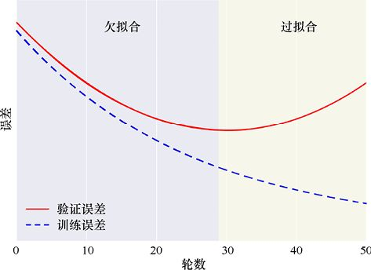

> **圖片描述：** 一張曲線圖，橫軸為「輪數」（0-50），縱軸為「誤差」。紅色實線為「驗證誤差」，藍色虛線為「訓練誤差」。兩條曲線一開始都下降，但在約第28輪後，訓練誤差繼續下降而驗證誤差開始上升。圖中標示左側為「欠擬合」區域，右側為「過擬合」區域。

圖9.1　理想誤差曲線。其中，一輪表示所有訓練資料被系統使用一次。訓練誤差和驗證誤差在訓練開始時一起穩定地下降，但是在某個點之後，驗證誤差開始上升。這就是我們進入過擬合範圍的地方。我們希望在這種情況發生之前停止訓練（[Duncan15]）

同樣在這一過程中我們可以注意到一些關鍵的東西：在**訓練集上的誤差**隨著我們進入過擬合的區域而**持續減小**，然而驗證集上的誤差卻增加了。這是因為我們仍然在從訓練資料中學習，但是已經對於某些特定的細節學習得太過深入（比如，學習到了有著海象鬍子的人都稱為Walter）。正是在驗證集上的表現讓我們能知道什麼時候越過了那個界限。在那個界限往後，雖然我們繼續在訓練集上獲取了更好的表現，但是無法在新資料上取得進步。事實上，我們甚至會在那上面得到更糟糕的結果。

讓我們在實際操作中觀察這個現象。假設某家店的店主訂購了一項為店鋪提供背景音樂的服務。服務供應商提供了各種不同節奏的音樂，而且讓店主能夠在任何時候選擇音樂的節奏。

店主發現自己整天都在頻繁地改變音樂的節奏，而不是在一天的開始就設置好並不再改變它。這耗費了她很多的精力，於是她請我們為她構建一個可以按照她想要的方式來自動調整音樂的系統。

我們先從收集資料開始。第二天早上，我們坐在控制檯那邊觀察。每當她調整節奏時，我們會記錄下時間以及設置。所收集到的資料如圖9.2所示。

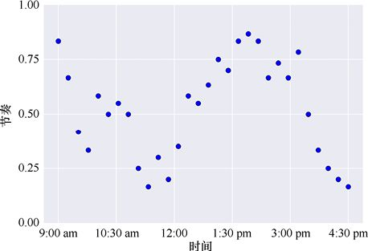

> **圖片描述：** 一張散佈圖，展示一天中不同時間店主設定的音樂節奏值。

圖9.2　所收集到的資料

那天晚上，我們回到實驗室，為這些資料擬合了一條曲線，如圖9.3所示。

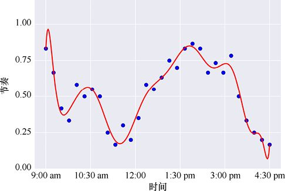

> **圖片描述：** 一張曲線圖，一條波動劇烈的曲線精確通過每個資料點，展示過擬合現象。

圖9.3　根據圖9.2中的資料擬合的曲線

這條曲線的波動程度很大，但是我們認為這是一個不錯的解決方案，因為它很好地擬合了我們所記錄的資料。

第三天早上，我們按照這個模式對系統進行編程。但是到了中午，店主開始抱怨，因為音樂的節奏變得太頻繁、太劇烈，分散了顧客的注意力。

我們太過精確地匹配了觀察到的結果，從而導致這條曲線過度擬合了。店主在我們收集資料那天選擇是依據那天所播放的特定音樂做出的。由於店主所訂閱的服務並不是在每天的同一時刻播放相同的曲子，她可能並不希望再現一個和我們在那天觀測到的資料太過接近的選擇。

通過對曲線上的每一處顛簸和波動進行適應，我們對訓練資料的特異性給予了太多的關注。也許如果我們多花幾天時間來觀察她的選擇，並用那些資料制定一個更全面的計劃，那會更好。但店主堅持讓我們儘快完成這個項目，所以我們現在擁有的資料就是我們最終所能得到的資料。

因此，我們降低了對於資料擬合程度的準確性。我們希望得到的結果不要像之前那樣浮動那麼大，於是得到了圖9.4所示的更柔和的擬合曲線。

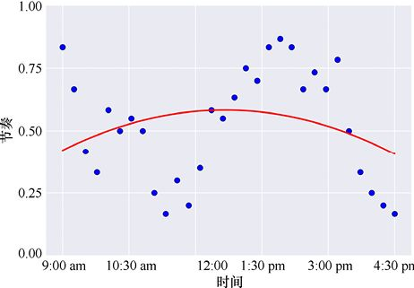

> **圖片描述：** 一張曲線圖，一條過於平滑的曲線未能捕捉資料的重要趨勢，展示欠擬合現象。

圖9.4　一個根據我們的節奏資料更泛化的擬合曲線

結果店主對這種選擇也不滿意。因為它太粗糙了，並且忽略了一些在她看來重要的特徵，比如，早上的音樂節奏應該比下午的更加舒緩一些。這條曲線欠擬合了資料。

我們希望得到的解決方案並非要精確地匹配所有資料，但應該較好地匹配總體趨勢。我們想要一些匹配得不那麼精確，也不那麼寬鬆，可以說是“剛剛好”的方案。於是又過了一天，我們按照圖9.5所示的曲線設置了系統。

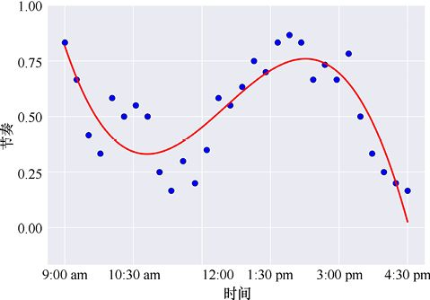

> **圖片描述：** 一張曲線圖，一條適度平滑的曲線既捕捉了資料的總體趨勢，又不過度波動，展示理想的擬合效果。

圖9.5　一條恰當地匹配了節奏資料的曲線

店主對於這條曲線以及據此在一天中選擇的音樂節奏很滿意。我們終於找到了位於欠擬合和過擬閤中間的合適位置。在這個例子裡，要想找到最佳的曲線，很大程度上需要依賴個人的偏好。我們將在後面看到在訓練中運用這些想法的例子，並給出一些特定的規則，以便知道什麼時候從欠擬合的區域進入過擬合的區域。

圖9.6展示了過擬合的另一個例子，這次是對二維平面中的兩類點進行分類。

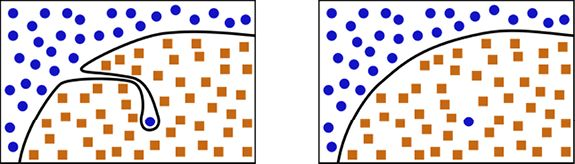

> **圖片描述：** 兩張並排的二維圖。(a)一條複雜的邊界曲線用奇怪的凹陷來包含一個孤立的異常值；(b)一條更簡單平滑的邊界曲線忽略了該異常值。

(a)　　　　　　　　　　　　　　　　　　　(b)

圖9.6　一個過擬合的類似例子。(a)輸入的資料以及一條用以區分兩組不同資料點的邊界曲線。這條曲線用一個古怪的凹陷把一個單獨的怪點納入進去；(b)可能是一條更好的邊界曲線（[Bullinaria15]）

這裡有一個位於正方形區域深處的圓點。我們把這種孤立的點稱為**異常值**，並且通常在處理它時我們都會持懷疑的心態。這個點可能是測量錯誤或者記錄錯誤的結果，也可能確實是一個非常特別的資料。

獲取更多的資料可以讓我們在分辨哪些例子是異常的時候擁有更好的直覺，但如果這是我們能獲取的所有資料，把這一孤立的圓點看作異常值也許更加合理一些，並且它看上去不太會在未來的測量中再出現了。換句話說，我們希望未來落在這個孤立圓點附近的點應該屬於正方形資料點的範疇。

我們可以據此推斷圖9.6a很可能是過擬合了。如果是這樣的話，採用圖9.6b中更為簡單的邊界曲線也許會更好。

## 9.4　及早停止

通常來說，在一開始訓練模型時，我們會處於欠擬合的區域。此時，模型還沒能通過學習足夠多的樣本找到處理它們的正確做法，因此採用初始假想規則（first-guess rule）會太過普遍且模糊。

隨著我們用更多的資料來訓練，並且模型開始明確它的邊界曲線，訓練誤差和驗證誤差通常都會降低。為了便於討論這一現象，我們重新採用圖9.1所示的例子，如圖9.7所示。

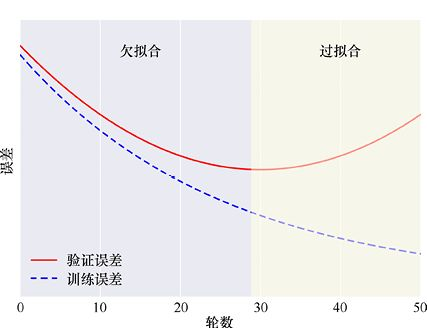

> **圖片描述：** 與圖9.1相同的理想誤差曲線，標示欠擬合和過擬合區域，用於討論及早停止策略。

圖9.7　為了方便起見，我們重新採用圖9.1所示的例子。在這些理想化的曲線裡，當驗證誤差下降時，我們處於欠擬合的區域；而當它開始上升時，我們就處於過擬合的區域

在某個時間點，我們將發現雖然訓練誤差在持續下降，驗證誤差卻開始上升（可能一開始它會變得平緩）。

這時我們就處於過擬合的區域了。訓練誤差之所以持續下降，是因為我們正在讓模型學習到越來越多的細節。但是現在，我們在結果中為訓練資料的細節做了太多調整，並且泛化誤差（或者驗證誤差）正在上升。

通過這樣一種分析，我們可以得到一個很好的指導原則：**一旦開始過擬合，即停止訓練**。也就是說，當我們在第28輪訓練附近跨越了邊界，並且發現驗證誤差開始上升時，即使訓練誤差依然在下降，我們也應該停止訓練，如圖9.7所示。

這種在驗證誤差開始上升時停止訓練的技術稱為**及早停止**（early stopping），因為我們在訓練誤差低至0之前停止了訓練過程。可能把這一思想看作**合理停止**會更簡單一些。因為在這一界限下，我們既沒有過早停止，也沒有太晚停止訓練，而是恰好在模型的驗證誤差開始上升的時間點停止訓練。

在實際操作中，誤差測量並不會像圖9.7中的理想曲線那樣平滑。它們通常會充滿噪聲，甚至可能會在一個短暫的時間段內趨向“錯誤”的方向，因此要找到一個準確的停止訓練的時機會相當困難。通常我們會採用許多不同的工具來緩和誤差的改變，以探查驗證誤差是否真的在上升，而不僅是暫時性的上升。我們將在第23章和第24章中看到把及早停止納入訓練過程裡是一件多麼簡單的事情。

## 9.5　正則化

我們總是希望對訓練資料做儘可能多的資訊壓縮，在剛開始出現過擬合的時候就停止訓練。及早停止是一種解決方案，但還有一些其他技術可以減緩過擬合的趨勢，使我們可以訓練更久的同時降低訓練誤差以及驗證誤差。

這些控制過擬合的技術統稱**正則化方法**，或者簡單地稱為**正則化**。我們說過，電腦本身並不會知道它已經過擬合了：當我們要求它從訓練資料中學習時，它會儘可能多地從中學習。它並不會知道自己何時跨越了“對輸入資料的良好認知”和“過於詳細地學習了特定資料中的資訊”間的界限。因此任何控制過擬合的方法都需要我們在基礎的學習演算法上添加一些新的資訊。

一種常見的、需要增加的資訊是限制分類器所用參數大小的步驟。從概念上講，這種方法之所以可以改善過擬合現象，重點是它使所有參數保持在了比較小的數字上，也就是避免了它們中的任何一個擁有太大的權重[Domke08]。這使得分類器更難去依賴那些特別且狹隘的異常值。

為了看看這種技術是否有用，讓我們回憶一下之前那個記人名的例子。當我們試圖記住Walter的名字時，我們注意到他有一把“海象鬍子”。這一單獨的資訊相比於我們所記住的其他東西擁有了太大的權重。能讓我們通過肉眼觀察記住他的事實還有“他是一個男人”“他的身高大約是1.82米”“他有著灰色的長髮”“他面帶微笑且聲音低沉”“他穿著暗紅色且帶有棕色紐扣的襯衣”，如此種種。但我們獨獨關注了他的鬍子而忽略了所有其他有用的提示。於是不久以後，當我們再看到另一個有著海象鬍子的人時，這個特徵相比其他特徵就佔有了太多的優勢，使我們誤認為這個人就是Walter。

如果可以讓所有我們觀察到的特徵具有大致相同的重要性，“海象鬍子”就不會有機會成為最重要的特徵，而且其他特徵對於我們記住一個新認識的人將持續發揮作用。

我們可以說每個參數都有其對應的**權重**或者說強度。這只是一個用來衡量這個參數重要性的數字。基本的想法與我們在從一張列表中做出決定所採取的分配權重的方法很像。例如，為了決定是否搬去一間新公寓，我們可能會對新街區的步行便利程度分配一個很大的權重，而為走道上櫥櫃的大小分配一個比較小的權重。正則化就是一種可以確保沒有任何一個參數的權重或者任意一組參數的權重比其他參數擁有太大優勢的方法。

注意，我們並沒有試圖讓所有權重擁有**相同的**值，因為這會讓它們變得毫無意義。我們只是想保證它們基本在同一個範圍內，其中沒有任何一個權重會遠遠超過其他的權重。

把權重壓縮至比較小的數值讓我們在避免過擬合的問題上邁出了一大步，並讓我們得以從訓練資料中學到更多的資訊。

我們所希望應用的正則化量會隨著分類器以及資料集的改變而改變，因此通常必須去嘗試一些不同的值來看看哪個發揮的作用最佳。我們用一個被通常寫作小寫希臘字母的參數*λ*（lambda）來表示正則化量，有些時候也會使用別的字母。這是**超參數**的另一個例子，或者說是為學習演算法在外部設置的一個參數。一般來說，*λ*越大說明正則化程度越高。

將權重的值保持在較低的水平意味著分類器的邊界曲線不會變得像以前那樣複雜而起伏不定，這也就是我們希望得到的結果。所以，我們可以用正則化參數*λ*來選擇我們對於邊界複雜度的期望。較大的值將使邊界平滑，而較小的值將使邊界更精確地適應資料。換句話說，較小的正則化值會帶來我們之前看到的充滿波動的過擬合曲線，而較大的正則化值會使那些曲線變得平滑。我們將在之後對一個充滿噪聲的資料集嘗試不同的*λ*值時看到這一作用。

在後續章節中，我們將使用那些有多個處理層的學習結構。這樣的系統可以使用額外的、專門的正則化技術［dropout以及**批正規化（**batchnorm**）**］，以幫助控制此類學習架構上的過擬合問題。這兩種方法都是被設計用於防止網路中的任何元素對於結果的影響過大。dropout讓我們暫時性地斷開網路中的某些元素，迫使其他元素對結果產生影響[Srivastava14]。批正規化則會調整每層的輸出，以防採用這些值計算的網路元素對結果產生過大的影響[Ioffe15]。

## 9.6　偏差與方差

我們在第2章中討論過統計學的概念——**偏差**與**方差**。這些概念本身與欠擬合以及過擬合有很大的關係，並且通常會在討論這兩個話題的時候出現。

我們有許多的方法來思考偏差與方差的概念。如果從本章的背景來看，我們可以說偏差衡量了系統持續學習錯誤的東西的趨勢，而方差則衡量了系統學習無關緊要的細節的趨勢[Domingos15]。

我們將採用圖形化的手段，用二維曲線的方式來討論這兩個概念。這些曲線可能是一個迴歸問題的解決方案，正如我們先前所討論的隨時間推移設置店鋪背景音樂節奏的問題；也可以是分類問題裡平面上兩個區域之間的邊界曲線。偏差與方差的概念絕對不侷限於任意一種演算法或者二維的資料。但是我們將繼續採用二維曲線，因為這會使討論更符合我們的認知，而且我們能把它們畫出來並予以解釋。

我們重點關注**找到一個能適應潛在噪聲的曲線的擬合**，並且將看到如何用偏差與方差的概念來描述演算法的表現。

### 9.6.1　匹配潛在資料

假設我們有一位研究大氣的朋友，某一天，她來找我們尋求幫助。她測得了一些資料，比如每天同一時間，持續一年在一座山山頂的特定點測得的風速資料，資料曲線如圖9.8所示。

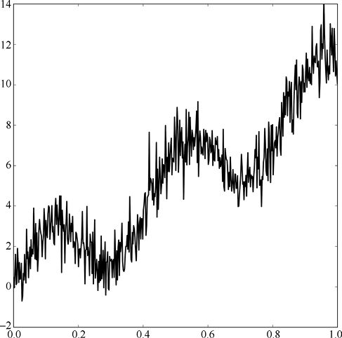

> **圖片描述：** 一張散佈圖，橫軸為時間，縱軸為風速，資料點展示出一條潛在的平滑趨勢但帶有大量噪聲。

圖9.8　所測得的風速與時間的關係。我們可以看到一條清晰的潛在曲線，但它也有很多噪聲（[Macskassy08]的基準曲線）

她相信自己所測得的資料是一條**理想曲線**與**噪聲**的疊加。理想曲線應該是每年都一樣的，而噪聲應該是由每天不可預測的波動而引起的。她所測得的資料被稱作**噪聲曲線**，因為這是理想曲線與噪聲的疊加。組成圖9.8中噪聲曲線的理想曲線與噪聲如圖9.9所示。

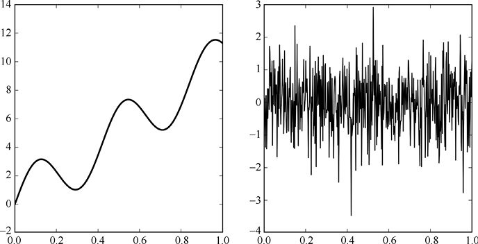

> **圖片描述：** 兩張並排的圖。(a)潛在的平滑「理想」曲線；(b)加在理想曲線上的噪聲成分。

(a)　　　　　　　　　　　　　　　　　　　　　　　　　　　　　　　　　　　　　　　　(b)

圖9.9　將圖9.8中的曲線分為兩個部分。(a)我們所希望找到的潛在“理想”曲線；(b)自然所賦予的、加在理想曲線上的噪聲。它使得所測得的資料充滿了噪聲

她相信自己有一個可以用於描述噪聲的良好模型（也許它遵循了我們在第2章中看到的均勻分佈或者高斯分佈）。然而她對於噪聲的描述是基於統計學的，因此無法用它來修復自己每天的測量值。換句話說，她相信有一種類似於圖9.9這樣的區分可以用來描述她的資料，但是她不知道自己資料中噪聲值的準確大小，也就無法將它們從資料中減去以得到理想曲線。

我們可以嘗試為圖9.8中的噪聲曲線做一次擬合[Bishop06]。通過選擇一條複雜度足夠表現資料趨勢而又不過分波動去精確地匹配每一個點的曲線，我們希望可以得到一個對於曲線大致形狀的不錯匹配。這將是我們找到潛在平滑曲線的一個不錯的開始。

圖9.10就展示了這樣一條典型的曲線。所採用的曲線裡通常都會有類似該圖右邊末端那樣的小波動，它會在資料快結束時出現一些跳躍。

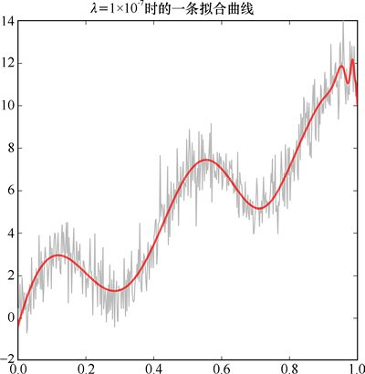

> **圖片描述：** 一張曲線圖，展示使用嶺迴歸（正則化參數為1e-7）對噪聲資料進行擬合的結果，曲線大致平滑但末端有小波動。

圖9.10　採用曲線擬合演算法得到一條曲線，以擬合充滿噪聲的資料。我們採用嶺迴歸，正則化參數的值為0.0000001（可以用科學記數法寫作1×10−7）

為了闡釋偏差與方差的概念，讓我們採用一種不同的方法。這種方法的靈感來自我們在第2章中討論過的bootstrapping演算法，但實際上我們並不採用bootstrapping這一技術。

我們將基於原始噪聲資料製作50個版本，並使每個版本僅隨機不重複地挑選30個不同的樣本。為了生成這些資料，我們可以在每個噪聲版本下對噪聲資料從左到右隨機取出30個不同的樣本。前5個**子樣本**曲線如圖9.11所示。

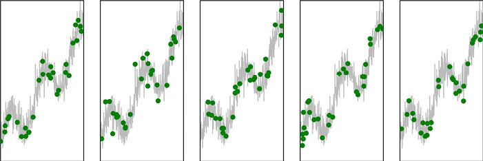

> **圖片描述：** 5張並排的散佈圖，展示從原始噪聲資料中隨機抽取的前5組各30個樣本的子集。

圖9.11　我們將為原始噪聲資料製作50個不同的版本。每個版本都包含了從原始資料中隨機抽取的30個樣本。這些是前5組資料，其中被選出的樣本用圓點表示

讓我們嘗試用簡單曲線和複雜曲線來擬合這些點，並根據偏差和方差比較結果。

### 9.6.2　高偏差，低方差

我們先用簡單的平滑曲線來擬合資料。我們將選擇那些平緩向上彎曲的曲線。因為我們並沒有在選擇曲線形狀時考慮時間因素，所以期望所有結果曲線應該看上去差不多。與圖9.11中5組資料擬合的曲線如圖9.12所示。

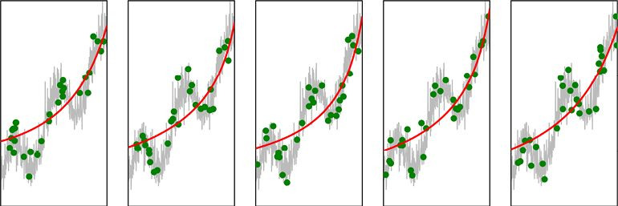

> **圖片描述：** 5張並排的圖，展示用簡單平滑曲線擬合前5組子樣本資料的結果，曲線形狀相似且平緩。

圖9.12　與圖9.11中5組資料擬合的曲線

正如我們預料的那樣，這些曲線簡單且相似。由於它們太過簡單，這樣一組曲線表現出了**高偏差**。換句話說，它們僅通過了很少的資料點。我們所選擇的形狀並不能給予曲線足夠的靈活程度，使得它能通過更多的資料點。

為了觀察這些曲線的方差，或者說觀察它們之間的差別有多大，我們將所有50條曲線畫在了一起，如圖9.13所示。

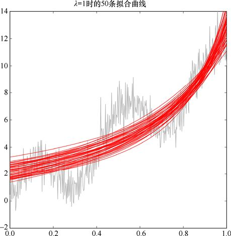

> **圖片描述：** 一張圖中疊加了50條簡單平滑的擬合曲線，曲線彼此非常接近，展示低方差特徵。

圖9.13　對於所有50組包含從原始資料中抽取的30個資料樣本的資料集的擬合曲線。我們將50條曲線畫在了一起

正如我們預料的那樣，這些曲線基本上是一致的。也就是說，這樣一組曲線是**低方差**的。

### 9.6.3　低偏差，高方差

現在讓我們嘗試著用一些複雜曲線來擬合資料，讓它們更好地擬合資料。

圖9.14展示了用複雜曲線擬合前5組資料的結果。與圖9.12相比，這些曲線的波動更大，有著多個“脊”與“谷”。雖然它們還是沒有直接穿過太多的點，但這些曲線和資料點顯得更接近。

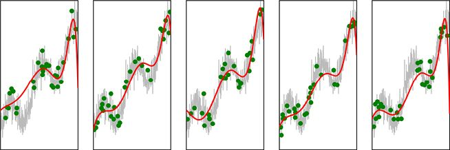

> **圖片描述：** 5張並排的圖，展示用複雜波動曲線擬合前5組子樣本資料的結果，曲線形狀各異且波動較大。

圖9.14　由前5組資料所創建的複雜曲線

由於這些曲線的形狀更加複雜且靈活，它們更多地被資料影響而非任何初始設置。也就是說，這些擬合是**低偏差的**。換句話說，它們互相之間顯得很不一樣。我們可以通過把所有50條曲線畫在一起來觀察這種現象，如圖9.15所示。因為這些曲線會在開始與結束突然偏離原來的方向，所以我們還展示了拓展了縱向尺度以把這些大幅變動包括進來的版本。

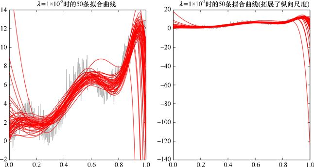

> **圖片描述：** 兩張圖。(a)50條複雜擬合曲線疊加，彼此差異很大；(b)擴展縱向尺度後的完整視圖，展示曲線在端點的劇烈偏離，呈現高方差特徵。

(a)　　　　　　　　　　　　　　　　　　　　　　　　　　　　　　　　　　　　　　(b)

圖9.15　(a)擬合50組資料的複雜曲線；(b)展示了這些曲線的完整縱向尺度。為了得到這些曲線，我們採用的正則化值為0.00001（用科學記數法寫作1×10−5）

這些曲線互相之間差別很大，換句話說，它們有著**高方差**。

### 9.6.4　比較這些曲線

大氣科學家希望我們可以得到一條可以匹配資料中潛在理想曲線的曲線。從我們已經看到的內容來說，圖9.10所示的曲線會是一個不錯的猜測（雖然更多的資料可以幫助我們去除結尾處的波動）。

然而為了探索偏差與方差，我們構造了50組小資料點。它們都是從原始噪聲資料裡被隨機抽取的。

當我們用簡單且平滑的曲線擬合這些資料點集時，這些曲線總是會漏掉大部分資料點。不管擬合的資料是什麼，這樣一組曲線都有著**高偏差**，或者說傾向於特定的結果（平滑且簡單）。這些曲線之間十分接近，就說這樣一組曲線有著**低方差**。

另一方面，當我們嘗試用複雜且充滿波動的曲線來擬合這些資料點集時，這些曲線有能力根據資料調整，且與大多數點距離更近。由於這些曲線更多地被資料而非是某一種特定結果的傾向而影響，我們可以說這樣一組曲線是**低偏差**的。然而這些曲線的適應能力也意味著它們之間有著明顯不同。換句話說，這樣一組曲線是**高方差**的。

可以注意到這些是曲線的**族**，或者說集合的性質。對於一條單獨的曲線，我們無法對它的偏差或者方差有太多描述。我們必須在嘗試為許多資料擬合許多曲線之後才能看到偏差與方差的影響。

偏差與方差是真實存在的現象。在將對機器學習的討論作為一個概念工具來理解一個模型或者一種演算法的**複雜度**（complexity）或**有效程度**時，我們通常會引用“偏差”與“方差”的概念。

例如，假設我們正在嘗試用一個只有少量參數的簡單模型來匹配那些噪聲資料。這些參數被用來描述模型所創建的曲線，並且我們希望這條曲線能匹配噪聲資料的平滑的潛在曲線。由於模型很簡單，它只能創建一些簡單的曲線，因為它並沒有足夠的參數來表徵一些更為複雜的東西。

如果我們用多個類似的資料集多次訓練系統，那麼這個系統將不斷生成一些相似的簡單曲線，因此這樣一組曲線將展現出低方差的特徵。這些曲線也將忽略許多的資料點，因此它們會展現出高偏差的特徵。由這個系統生成的這些曲線將是高偏差且低方差的，我們有時會簡要地說這個系統本身是高偏差且低方差的。

我們也可以在一個複雜模型訓練的早期階段得到這些結果。早期階段指模型剛開始匹配資料的時候。我們可以說這個模型是用一些過於簡單的曲線**欠擬合**了這些資料。

假設模型十分複雜，並且能夠生成一些複雜的曲線。當用這個模型在多個資料集上進行訓練時，由它所產生的曲線之間會十分不同，因為它們都適應了特定的資料（也就是說，它們會是高方差的），但是它們對於大多數資料點來說會更加接近（也就是說，它們會是低偏差的）。正如之前說的那樣，我們通常會說這些應該屬於由系統產生的曲線的性質是這個系統本身的，因此會說這個模型是低偏差且高方差的。

當一個複雜的模型訓練得過久時，我們就可以得到上述結果。這些曲線將**過擬合**輸入資料，或者說過於好地匹配了訓練資料。

我們樂意用那些同時具有低偏差（因此資料集中的資料點都能被正確匹配）與低方差（因此曲線不會在一個資料集上被過分訓練，也可以泛化得更好）的曲線來描述資料。

然而，在大多數現實世界的例子中，我們無法做到二者兼得。正如我們在第2章中看到的那樣，偏差與方差是呈反向相關的：當其中的任意一個上升，另一個就會下降，反之亦如此。

這是因為當簡單的曲線變得更加波動也因此可以更好地匹配資料時，偏差減小，方差就會上升，因為匹配良好的曲線通常會相差很大。如果我們把那些複雜曲線的波動減小，那麼它們的方差也會減小，因為它們將更加相似，然而偏差將上升，因為它們匹配資料的能力將下降。我們無法同時擁有低偏差與低方差。

通常，我們不能說偏差或者方差中的一個比另一個更重要，因此我們不應該總是想著找到一個有著最低的偏差或者方差的解決方案。在某些應用中，高偏差或者高方差都是可以接受的。

一方面，如果我們知道自己的訓練集肯定可以完美地表徵所有未來資料的特徵，就不會關心方差，而是希望找到有最低偏差的解，因為匹配這樣一個訓練集就能完美地得到我們想要的結果。

另一方面，如果我們知道自己的訓練集不能很好地表徵未來資料的特徵（但這是我們目前能獲取的最好資料），也許不會對偏差關注得太多，因為匹配這樣一個糟糕的資料集並不是特別重要，而且我們會希望得到有最低方差的解，因為這樣一來就有機會對未來資料進行合理的操作。

通常來說，我們希望在這兩種度量方法之間尋求適當的平衡。我們通常會採用一種對任何特定的項目的特定目標都運作良好的方法。當然前提是，我們已經知道自己所選擇的特定學習器以及所擁有的資料。

## 9.7　用貝葉斯法則進行線擬合

偏差與方差都是用來描述一族曲線擬合資料的良好程度的有用方法。我們在第4章中有過對於頻率論者與貝葉斯論者的討論，我們可以說偏差與方差本身體現了頻率論者的思想。

這是因為偏差與方差的概念依賴於從資料源抽取的多個值。我們並不過多依賴任何單一的值，而是用所有值的平均值來找出每個值近似的“真實”答案。這些想法非常符合頻率論者的思想。

相反，如果用貝葉斯法則來擬合這些資料，我們認為結果只能用機率方法描述。我們會列出所有有可能匹配那些資料的方法，並且為其中的每一個附上一個機率。一旦收集到更多的資料，我們會漸漸淘汰其中的某些描述，從而使其餘的描述更有可能，但我們永遠都無法得到一個絕對的答案。

讓我們從實際操作中觀察這個現象。我們的討論是基於Bishop的一個“可愛”的可視化[Bishop06]。我們將用貝葉斯法則找到一個對於9.6節用到的充滿噪聲的大氣資料的良好近似。

我們將為資料擬合一條直線，而不是一條很複雜的曲線。這僅是因為它可以允許我們用二維的圖和表表示所有東西。為了展現用曲線擬合資料的圖，我們需要做出三維、四維、五維甚至更多維度的圖。為了清晰起見，我們還是選擇使用直線。

事實上，我們將一直使用那些**幾乎是水平的**直線。同樣，這僅是因為這樣一來我們可以畫出一些不錯的圖。處理其他任何的線型都會需要三維圖，也更難去解釋。

我們用兩個數字來描述直線：**斜率**和**截距**。它們通常分別用字母*m*和*b*來表示，不過這裡我們將直接稱呼它們的名字[MathForum03][MathForum94]。

一條完全水平的直線的斜率為0。當這條直線逆時針旋轉時，斜率將一直增長至1，此時它可以說是東北−西南朝向的。當直線從水平順時針旋轉時，它的斜率會減小至−1，此時這條線可以說是西北−東南朝向的。

當一條直線越來越接近垂直時，它的斜率會越來越大，不過這裡我們限定斜率的範圍僅在[−2,2]中。

截距是一條直線與*y*軸相交的位置。我們也將截距的範圍限定在[−2,2]中。

限定這些範圍使我們可以表示任何一條斜率和截距為−2～2的直線。圖9.16展現了其中的一些直線。

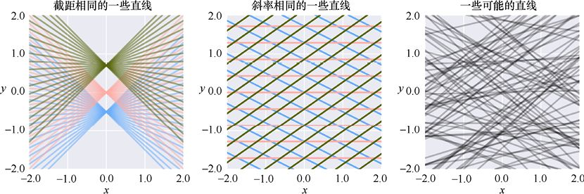

> **圖片描述：** 展示使用貝葉斯方法對資料進行擬合的結果，用機率分佈描述曲線的不確定性。

(a)　　　　　　　　　　　　　　　　　　　　　　　　　　　　　　(b)　　　　　　　　　　　　　　　　　　　　　　　　　　　　　　(c)

圖9.16　我們在這個討論中所需要用到的直線。(a)相同顏色的直線的截距相同（也就是這些線與*y*軸相交的點），但其中每條線的斜率不同。(b)相同顏色的直線的截距不同，但是它們的斜率相同。(c)一些斜率和截距在−2和2之間的隨機直線

根據對可用直線的範圍限定，我們可以稍許垂直壓縮原始噪聲資料，這樣曲線就不會以一個陡峭的角度上升。再次聲明，這僅是為了使我們可以更簡單地畫出並解釋圖像。

我們將同時在多條直線上進行工作，但是把許多的直線逐條疊加起來可能會令人感到疑惑。因此我們選擇了另外一種展現所有可能直線的方法。我們做一個從左到右有著斜率範圍為−1～1的格子，並且截距範圍從下到上是−1～1。這樣一來在這個二維方形區域中的任何一個點都表示了在我們思考範圍內的一條特別的直線。圖9.17展示了這個想法。

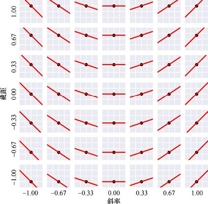

> **圖片描述：** 展示貝葉斯擬合中隨著資料增加，機率帶逐漸收窄的過程。

圖9.17　我們可以通過格子中一個點的位置來描述直線。這個格子從左到右橫向代表了−1～1的斜率範圍，而從下到上縱向代表了−1～1的截距範圍。在這樣一種設定下，每一行代表的直線都像是它下面的所有直線向上平移所能得到的，而每一列代表的直線，就像是它左邊的所有直線圍繞它與*y*軸的交點逆時針旋轉所得到的

這樣我們就完成了所有工具的準備。讓我們考慮一下對它們做的事。

我們想要找到一條可以通過許多噪聲資料的直線。這意味著我們明確地知道它無法通過所有資料點。但我們依舊希望它能通過儘可能多的點，並且儘可能地接近其他的點。

讓我們從噪聲資料中的一個點開始。哪條直線會被我們認為是這個點的良好擬合？當然，所有通過這個點的直線都是不錯的選擇。由於我們知道最終的直線會靠近許多（如果不是大多數的話）資料點，因此也同樣會把那些離這個點很近的直線給包括進來。

讓我們給每條直線分配一個機率。直接通過資料點的直線將有最大的可能性，但是我們同樣也會包括附近許多有著較低機率的直線。如果之後我們發現自己僅希望直線靠近這第一個點，這些選項就有用了。

現在我們就可以運用貝葉斯法則的技巧來找到穿過這些資料的最佳直線。

通過圖9.17所示的灰階版本，我們可以同時展示所有可以從系統中抽取的可能的直線。這稱為**斜截圖**。白色代表直線有著很高的可能性，而越是深的灰色表示了越低的可能性，如圖9.18所示。

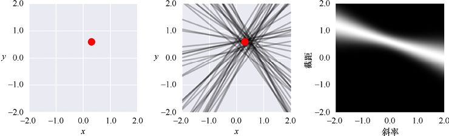

> **圖片描述：** 展示貝葉斯更新中先驗分佈如何隨著新證據逐步更新為後驗分佈。

(a)　　　　　　　　　　　　　　　　　　　　　　　　　　　(b)　　　　　　　　　　　　　　　　　　　　　　　　　　　(c)

圖9.18　找到通過一個點的直線的貝葉斯似然。(a)位於一個典型的(*x*,*y*)平面的處於(0.3,0.6)的點；(b)一些隨機選擇的通過或者很接近這個點點的直線；(c)一張斜截圖，其中每個位置（或者說像素）表示了一條直線，如圖9.17所示的那樣。這裡，我們為所有直線通過0（黑色）到1（白色）中的值標記了機率。每條線越接近這個點，它的機率就越高

圖9.18c展示了所有也許會用來匹配圖9.18a中原始點的直線的貝葉斯似然。一條直線越是靠近或穿過這個點，它的似然率就越大，但是那些靠近點的直線同樣也擁有一些可能性。

哪些直線被圖9.18c所表示了？其中一些如圖9.19所示。我們從圖9.18c的斜截圖中的非黑色區域選取了5個點。我們為每個點做了一幅對應的直線的圖，圖上也包含了圖9.18a中的原始點。可以看到，一條直線的機率越高，它就越靠近原始點。

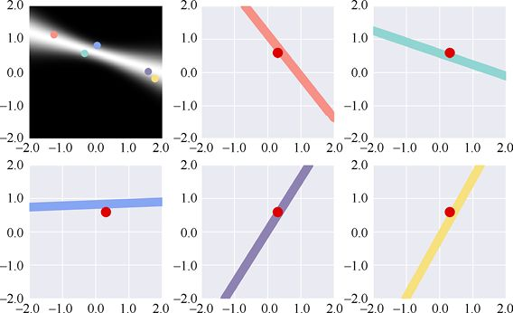

> **圖片描述：** 展示頻率論方法和貝葉斯方法在曲線擬合上的差異比較。

圖9.19　圖9.18c告訴我們所有截距與斜率為−2～2的直線的可能性。我們在左上圖中重複了這個展示，同時從它的非黑色區域裡選出了5個點。與這5個點相關的直線分別畫在了剩餘的圖中，點的顏色與直線一一對應。可以注意到，有著更高可能性的直線與原始的位於(0.3,0.6)的原始點更加接近

現在我們已經準備好用貝葉斯法則來匹配資料了！過程如圖9.20所示。

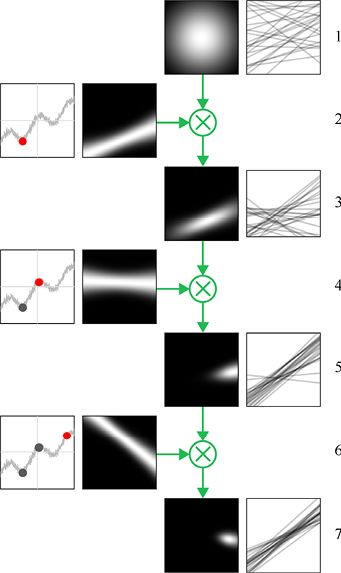

> **圖片描述：** 展示不同擬合方法（過擬合、欠擬合、恰當擬合）的綜合比較。

圖9.20　通過貝葉斯法則為資料擬合一條直線（圖像靈感來自[Bishop06]）

在圖9.20中，第1列為噪聲資料集，其中的每個新資料點用點表示。第2列展示了該點的似然。第3列的頂部展示了先驗，然後下面的每張圖展示了演化後驗（或者先驗）。每個後驗機率都是後面一步的先驗機率。第4列展示了從它們左邊的直線分佈中隨機抽取的一些直線。

在第1行中，我們給出了自己的先驗機率，或者說是對於擬合直線分佈的一個初始猜測。這裡我們用了一個高斯環境，它的中心正處於直線分佈的中心。這樣一個先驗機率意味著我們猜測自己的資料最有可能被一條截距為0的水平直線所擬合，也就是*x*軸本身。不過這個高斯環境一直延伸至邊緣（在圖中的任意地方都不會完全達到0），因此任意一條範圍內的直線都是有可能的。

我們為這幅圖嘗試了多種其他的先驗，並且它們最終都會呈現出一個相同的結果。我們在這裡只使用高斯先驗是因為它能產生最富啟發性的解釋。

第1行右邊的圖像展示了從該先驗分佈中隨機抽取的25條直線，有著更大機率的直線會更有可能被抽到。

第2行左邊的圖像展示了充滿噪聲的資料集，以及從中隨機選擇的一個點，用點表示。所有穿過（或者接近）該點的直線的似然圖展示在了它的右邊。

現在讓我們應用貝葉斯法則，將第1行中的先驗分佈與第2行中的似然分佈相乘。我們同樣需要一定的證據來區分它們，不過圖9.20中省略了這個步驟，因為在這個例子裡，我們只是為了將它記錄下來。

我們得到的結果是第3行左邊的圖像。這就是後驗分佈，或者說是先驗中的每個點（我們認為這條直線的可能性是多少）與第3行在新點的似然分佈（這條線有多擬合這一部分資料）中的對應點的乘積。注意到後驗分佈是一個新的白點。在第3行的右邊我們可以看到從該分佈中隨機抽取的另外25條線。我們可以看到在圖的上方有著大片在第1行的圖中未曾出現的空白。這個系統已經從這個資料點中學習到，靠近上方區域的直線可能不是我們想要的結果。

從第3行中得到的後驗分佈將成為下一個資料點的新先驗分佈。

在第4行中我們又引入了一個從資料集中抽取的隨機點，同樣用點表示。在它的右邊是對該點的擬合直線的似然圖。

在第5行中，我們再次採用貝葉斯法則，使我們的先驗分佈（從第3行中得到的後驗分佈）與從第4行中得到的似然分佈相乘，以得到一個全新的後驗分佈。可以注意到，這個後驗分佈在大小上有所減小，這告訴我們適合前兩個點的擬合直線的可能範圍比僅需要擬合一個點的直線的可能範圍要小。在右邊我們同樣展示了從該分佈中抽取的直線。可以注意到，在我們學習了兩個點的資料之後，它們更加聚集，雖然同樣有一些低機率的直線被展示了出來。

我們在第6行中假設了第3個新的點，它的後驗分佈結果在第7行中展示。這個後驗分佈中所展示的直線看上去都十分相似，並且這個趨勢看上去正向我們資料的一個良好擬合接近著。

通過採用更多的資料點，我們將得到一個越來越小的後驗分佈（或者說先驗分佈），並因此得到一個更緊密的對通過所有資料的直線的限定範圍。

第7行右邊圖中的那些直線，以及將我們關於偏差以及方差的概念應用於其上是十分吸引人的，不過這就不是一個貝葉斯論者的思考方式了。在貝葉斯信念網路中，並不存在一個曲線族可以被近似看作某些我們可以用不同形式的平均來討論的“真實”答案。與之不同，貝葉斯論者將所有這些看作潛在準確或者正確的，只是每個的可能性不同。用平均及距離來衡量從這一集合中抽取的直線的偏差及方差是可行的，但卻是沒有意義的。

頻率論者與貝葉斯論者的方法都讓我們可以將資料擬合為直線（或者曲線）。他們只是採取了十分不同的態度與途徑，因此我們不能總是使用同樣的工具來衡量兩種方法的結果。

## 參考資料

[Bishop06]　Christopher M. Bishop, *Pattern Recognition and Machine Learning*, Springer- Verlag, 2006, pp. 149-152.

[Bullinaria15]　John A Bullinaria, *Bias and Variance, Under-Fitting and Over-Fitting*, Neural Computation lecture notes, University of Birmingham, 2015.

[Domke08]　Justin Domke, *Why does regularization work?*, Justin Domke’s Weblog, 2008.

[Domingos15]　Pedro Domingos, *The Master Algorithm*, Basic Books, 2015.

[Duncan15]　Brendan Duncan, *Bias, Variance, and Overfitting*, Machine Learning Overview part 4 of 4, 2015.

[Foer12]　Joshua Foer, *Moonwalking with Einstein： The Art and Science of Remembering Everything*, Penguin Books, 2012.

[Ioffe15]　Sergey Ioffe, Christian Szegedy, *Batch Normalization： Accelerating Deep Network Training by Reducing Internal Covariate Shift*, arXiv 1502.03167, 2015.

[Macskassy08]　Sofus A. Macskassy, *Machine Learning (CS 567) Notes*, 2008.

[MathForum03]　Math Forum, *Why b for Intercept ?*, 2003.

[MathForum94]　Math Forum, *Why m for Slope?*, 1994.

[Proctor78]　Philip Proctor and Peter Bergman, *Brainduster Memory School*, from *Give Us A Break*, Mercury Records, 1978.

[Srivastava14]　Nitish Srivastava, Geoffrey Hinton, Alex Krizhevsky, Ilya Sutskever, and Ruslan Salakhutdinov, *Dropout: A Simple Way to Prevent Neural Networks from Overfitting*, JMLR, 15(Jun), pgs. 1929-1958, 2014.

### 讀者服務：

> **圖片描述：** 一個 QR Code（二維條碼），中央有綠色的書籍圖示標誌，掃描後可連結到相關線上資源。

微信掃碼關注【異步社區】微信公眾號，回覆“e55451”獲取本書配套資源以及異步社區15天VIP會員卡，近千本電子書免費暢讀。
