# 第12章　資料準備

當用資料訓練系統時，結果只會和我們所學習的資料一樣準確。下面我們來看看如何處理資料才能使得訓練變得高效且準確。

## 12.1　為什麼這一章出現在這裡

機器學習演算法的效果不會好於它作用在訓練資料上的效果。在現實世界中，資料可能會來自有噪聲的傳感器、有損壞的硬體、有故障的模擬程式甚至是不完整的紙質手稿。我們往往需要觀察、**修復**這些資料，或者說解決這些資料中的問題。

有很多已經研究出來的方法可以用來處理這類問題。這些方法被稱為**資料準備**（data preparation）技術，有時也被稱為**資料清理**（data cleaning）。我們的想法就是在從資料中學習**之前**先對它們進行預處理，這樣學習器就能更高效地利用這些資料。

資料準備非常重要，因為大部分學習器是用數字表示的，所以資料的結構會對演算法提取出來的資訊產生非常大的影響。

## 12.2　資料變換

在進行資料準備的過程中，我們常常會對正在處理的資料進行一些修改。這可能包括將所有數值調節到一個給定的範圍，或者移動資料使得它們的平均值為0，甚至是拋棄一些誇張的資料點，這樣學習器需要做的工作就減少了。

在做這些事情時，我們只要遵循一個最重要的原則：在用某種方式修改訓練資料時，我們必須也得對未來需要預測的資料進行同樣的修改。

讓我們看看為什麼這個原則如此重要。

在處理訓練資料時，我們一般會按照某種方式修改或者合併資料值，以提高學習的效率或者準確率。一般來說，我們會先觀察所有訓練資料，再決定如何修改它們，然後再修改資料，最後用這些修改過的資料訓練學習器。如果之後接到了新的需要預測的資料，在將這些新資料輸入給演算法之前，我們必須對這些新資料進行相同的修改。這一步不可忽略，如圖12.1所示。

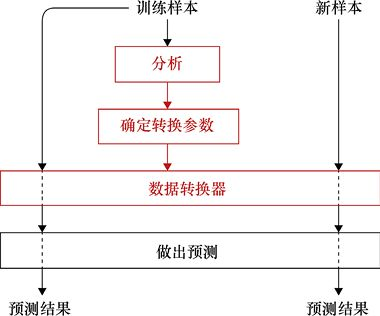

> **圖片描述：** 流程圖展示資料預處理的步驟。上方「訓練樣本」經過「分析」和「確定轉換參數」後，通過「資料轉換器」處理。新樣本也經過相同的轉換器，最後「做出預測」輸出預測結果。

圖12.1　資料預處理的流程。先對訓練資料進行分析，以決定需要修改的參數。接下來，輸入該系統的樣本都要以同樣的修改方式進行預處理

對所有資料進行相同預處理的必要性會不斷地在機器學習中體現出來，通常出現的方式都很微妙。

先通過一個直觀的例子來看看通常會出現的問題。假設我們想要讓一個學習器學習如何分辨奶牛和斑馬的圖。我們將收集大量的這兩種動物的圖作為訓練資料。這兩種動物都有4條腿、一個頭、一條尾巴，以及其他相同特徵。能夠區分它們的只有不同的黑白相間的標誌。為了保證學習器能夠注意到這些元素，我們會將每張圖中的這些標誌提取出來，並且僅用這些提取出的紋理訓練學習器。換句話說，這些紋理就是學習器所能看到的全部東西。圖12.2展示了一對輸入樣本。

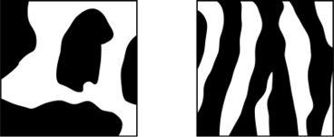

> **圖片描述：** 此圖為圖12.2，(a)奶牛身上的紋理；(b)斑馬身上的紋理

(a)　　　　　　　　　　　　　　　　　　　　　　(b)

圖12.2　(a)奶牛身上的紋理；(b)斑馬身上的紋理

假設我們已經訓練好了一個系統，但是忘記告訴人們這一預處理步驟。用戶可能會將一張完整的奶牛或者斑馬的圖（見圖12.3）輸入系統，然後讓系統來分辨每隻動物的類別。

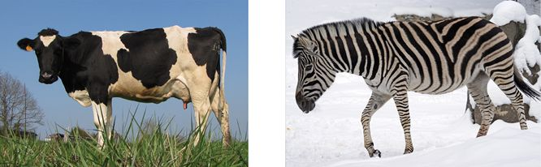

> **圖片描述：** 此圖為第12章圖12.3，(a)奶牛的圖；(b)斑馬的圖。如果我們用圖12.2所示的圖對系統進行訓練，再用這個系統來對這些圖進行預測，那麼系統可能...

(a)　　　　　　　　　　　　　　　　　　　　　　　　　　　　　　　　　　　　 (b)

圖12.3　(a)奶牛的圖；(b)斑馬的圖。如果我們用圖12.2所示的圖對系統進行訓練，再用這個系統來對這些圖進行預測，那麼系統可能會被圖中多餘的細節誤導

人們可以從這些圖中找到所需要的資訊，但電腦可能會被腿、頭、地面以及其他細節所誤導，從而無法給出很好的預測結果。

像圖12.2這樣處理過的資料和圖12.3這樣未處理過的資料間的不同可能會導致系統出現問題，即對於訓練資料會有很好的預測效果，但是對於（現實世界中的）真實資料的預測卻沒有那麼完美。為了避免這種情況，圖12.3所示的新資料都要變換成圖12.2所示的樣式。

忘記對新資料進行變換是一個很容易犯的錯誤，這會導致演算法達不到預期的效果甚至變得完全無用。

需要記住的規則就是：我們決定如何修改訓練資料之後，一定要**記住修改資料的方式**。如果需要更多的資料，我們必須先按照與之前處理訓練資料**相同的方式**來處理新資料。

## 12.3　資料類型

在學習特定的資料變換方式之前，讓我們先來看一下能夠使用的資料類型，以及描述某一類型的資料的常用形式。

我們可以看到一個共同的主題，即是否可以對給定類型的資料進行**排序**。排序是非常有用的，如果某種類型的資料沒有自然的排序方式，我們就會想要創造一種方法去對它進行排序。

回想一下，每個**樣本**就是由一些數值構成的列表，其中的每個數值被稱為一個**特徵值**。樣本中的每個特徵值都可以是兩種常規變量中的一個：**數值**或者**分類**。

**數值資料**就是一個簡單的數字，可以是浮點數或者整數，我們也稱它為**定量資料**。數值資料（或者定量資料）可以根據其數值的大小進行排序。

而**分類資料**（categorical data）描述的則是其他東西，一般來說是一串描述分類或者標籤的字符串，例如“奶牛”或者“斑馬”。分類資料共有兩種類型，分別對應的是可以被自然排序的資料和不能被自然排序的資料。

**有序資料**（ordinal data）是一種有已知順序的分資料（也因此得名），它是能夠被排序的。彩虹的顏色可以被當作有序資料，因為它們有已經排列好的自然順序，從“紅”到“橙”一直到“紫”。又如，用於描述一個人不同年齡階段的字符串，比如“嬰兒”“青少年”和“老人”。這些字符串有一個自然的排列順序，所以它們是可以被排序的。

**標定資料**（nominal data）是一種沒有自然順序的分類資料。例如，一系列桌面用品，“回形針”“訂書機”和“卷筆刀”，它們並沒有自然的、內在的順序。服飾的種類也一樣，例如“襪子”“襯衫”“手套”和“帽子”，它們也沒有自然的順序。

我們只要為標定資料（也就是沒有順序的字符串）定義順序，就可以將其變換成有序資料。例如，我們可以規定服飾的順序是從上往下，所以順序就會是“帽子”“襯衫”“手套”和“襪子”，這樣它們就成了有序資料。為標定資料定義的順序不一定要符合某種常識，只需要定義它並根據定義使用就可以了。

我們常常會將字符串資料（包括標定資料和有序資料）變換成數字，這樣就能更容易地在電腦上處理它們。最簡單的處理方法就是識別出資料庫中的所有字符串，並給每個字符串分配一個從0開始的獨有的數字——很多庫都提供了用於實作這種轉換的內置程式。

### 獨熱編碼

在機器學習中，處理資料列表有時比處理單獨的數值更加方便。例如，我們可以構建一個分類器，使其能接收一張圖，然後告訴我們這張圖歸屬於10個不同類別中的哪一個。這個分類器的輸出可以只是一個數值，這個數值告訴我們它覺得輸入最有可能屬於哪個類別。

但我們常常也想知道輸入屬於其他類別的可能性，這樣我們就希望分類器返回一個列表，每個類別對應一個數值，數值的大小代表了分類器覺得這張圖屬於該類別的可能性。列表中的第一個數值對應第一個類別，第二個數值對應第二個類別，以此類推。所以，如果該圖的類別是第5類，那麼列表中的第5個數值就應該是最大的，而其他數值就會比較小，這意味著分類器不能完全排除圖是其他類別的可能性。

如果分類器的輸出以及我們分配給樣本的標籤都是列表的形式，那麼分類過程中的一些步驟就會變得更方便。

將3或者7這樣的標籤轉換成對應的列表的過程被稱為**獨熱編碼**（one-hot encoding），意思是隻有列表中的某一項“變熱”，或者說被標記出來。有時候，我們說將單獨的數值轉換成了一個**虛擬變量**（dummy variable），這個虛擬變量指的就是整個列表。所以，在給系統提供分類標籤的時候（訓練過程中），我們會更傾向於提供這種獨熱編碼，也就是虛擬變量（相較於單獨的數值而言）。

首先，如果有的是分類資料，那麼我們需要先將它們轉換成數值資料，即給每個數值分配一個從0開始的不同的整數。

現在我們先將每個數值替換成一個全是0的列表——這個列表的長度等於所有可能分類的數量，然後再將數值在列表中對應的項替換為1。

下面讓我們具體來看看獨熱編碼的步驟。圖12.4a所示的是原始的一盒蠟筆中的8種顏色[Crayola16]。讓我們假設這8種顏色在資料中以字符串的方式表示。

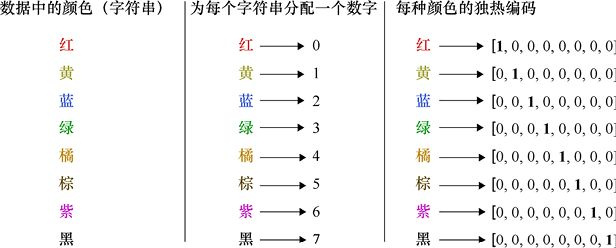

> **圖片描述：** 此圖為第12章圖12.4，對8種顏色進行獨熱編碼。假設它們在輸入資料中都以字符串的方式表示。(a)原始的8個字符串；(b)每個字符串被分配了一個0...

(a)　　　　　　　　　　　　　　　　　　　　 (b)　　　　　　　　　　　　　　　　　　　　　　　　(c)

圖12.4　對8種顏色進行獨熱編碼。假設它們在輸入資料中都以字符串的方式表示。(a)原始的8個字符串；(b)每個字符串被分配了一個0～7的數值；(c)每當一個字符串在資料中出現時，我們將它替換為一個含有8個數值的列表。除了對應於該字符串的分配數值的那一項是1，其他全是0

我們會為這8個字符串分配一個0～7的數值（一般來說，我們會用庫中的程式實作這一效果），如圖12.4b所示。現在開始，每在資料中看到一個字符串，我們都會將它替換為一個含有8個數值的列表，如圖12.4c所示。除了對應於該字符串的分配數值的那一項是1，其他全是0。

圖12.5是對一組具有多個特徵值的樣本進行獨熱編碼的過程。每個樣本有兩個數字和一個字符串，所以我們只對字符串進行獨熱編碼，保留前兩個數字。

雖然獨熱編碼的表示方式對電腦而言更容易處理，但是對於我們來說沒有那麼方便，所以我們一般在資料準備的最後階段才會進行獨熱編碼，這樣就不需要一直“翻譯”這些0和1了。

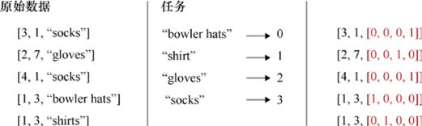

> **圖片描述：** 此圖為第12章圖12.5，當一個樣本含有多個特徵時，我們可以對某一個特徵進行獨熱編碼並保留其他特徵。(a)輸入資料含有3個特徵，我們會對其中的字符...

(a)　　　　　　　　　　　　　　　　　　(b)　　　　　　　　　　　　　　　　 (c)

圖12.5　當一個樣本含有多個特徵時，我們可以對某一個特徵進行獨熱編碼並保留其他特徵。(a)輸入資料含有3個特徵，我們會對其中的字符串特徵進行獨熱編碼；(b)庫會為每個字符串分配一個單獨的數字，從0開始；(c)進行獨熱編碼後的字符串

## 12.4　資料清理基礎

在真正開始應用任何類型的大規模資料改動之前，我們先回顧一些最基本的常識，以確保資料得到了很好的清理（或良好的準備）。

如果資料是文本形式的，我們就希望確保它沒有排版錯誤、拼寫錯誤、不可印刷的字符或者一些明顯有礙於清楚翻譯的其他錯誤。例如，如果有一些動物圖和一些描述這些圖的文本文件，我們希望確保每隻長頸鹿都被標記為“giraffe”，而不是“girafe”或者其他的文本。同時，我們還希望能夠修正大小寫錯誤，例如想要所有字母小寫時，就需要修正“Giraffe”。因為電腦會為每個字符串分配數字，而每張長頸鹿的圖都需要被分配到同一個數字。

還有一些我們應該瞭解的其他常識。

### 12.4.1　資料清理

我們希望刪除訓練資料中任何意外的重複，因為它們會歪曲我們對所使用的資料的看法。如果某個資料意外地被重複了很多次，那麼學習器會將其解釋為多個不同樣本，而這些樣本恰好具有相同的值，這樣就會對輸出造成更多的影響，而這個影響是本不該有的。

我們還想要確保沒有任何荒謬的錯誤。例如，忽略了小數點，使用1000而不是1.000，又或者將兩個減號放在同一個數字前面（應該只有一個減號）。在一些手動輸入的資料庫中，當沒有任何輸入資料時，常常會出現一些空格或者問號。一些電腦生成的資料庫則會包含像NaN（不是一個數字）這樣的程式碼，這表示電腦需要接收一個數字但卻接收了其他類型的資料。

我們還需要確保資料的格式能夠被我們使用的軟體正確理解並執行。例如，使用科學記數法表示數字就有很多不同的形式，程式很容易誤讀它們不習慣的形式。數值0.007通常以科學記數法形式輸出為7×10−3，但是當我們將其用作另一個程式的輸入時，它可能會被解釋為（7×e）−3，其中e是歐拉常數（約2.7）。這樣電腦會認為我們提供的數值是一個超過16的數字，而不是0.007。我們需要在把它們提供給軟體之前找出這些錯誤。

我們還想查找缺失的資料。如果樣本缺少資料的一個或多個特徵，我們是可以通過演算法來修補漏洞的。但是有些情況下，簡單地刪除樣本是一個更好的選擇。我們通常會根據具體情況進行判斷。

我們還希望識別出與所有其他資料截然不同的資料。明顯超出常規資料點的資料被稱為**異常值**（outlier）。其中一些可能只是拼寫錯誤，比如前文提到的忽略了小數點；而其他則可能是人為錯誤，比如意外地將一個資料集的一部分複製到另一個資料集中，又或者忘記從電子表格中刪除某些條目。如果不知道一個異常值是真實的資料還是某種錯誤，我們就必須通過自己的判斷來決定是將其留下還是手動刪除。這是一個主觀的決定，完全取決於資料的含義、我們對它的理解程度以及我們想要用它進行什麼操作。

### 12.4.2　現實中的資料清理

雖然上面的步驟看起來很簡單，但是在實踐中這些操作可能沒有看上去那麼輕鬆，具體取決於資料的規模、複雜程度以及當我們第一次得到資料時它的混亂程度。

有許多工具可以幫助我們快速清理資料，有些是獨立的，有些則是內置於機器學習庫中的，也有些是商業服務——在清理資料後會收取一定的費用。

記住一句經典的電腦座右銘“garbage in，garbage out”（無用輸入，無用輸出）。換句話說，結果最好也只會與原始資料一樣好，所以從最好的資料開始學習是至關重要的，這也就意味著我們要努力使原始資料儘可能乾淨。

在本節中提到的話題通常被稱為**資料預處理**，涉及對各個元素的本地修復。

在考慮過之前的簡單情況後，現在我們可以把注意力轉向大規模的資料修改。通過資料修改，我們可以提高從這些資料中學習的效果。

## 12.5　正規化和標準化

我們經常會處理那些特徵值跨度非常大的樣本資料。

例如，假設我們收集了一群南美大象的資料，其中用4個數值來描述每隻大象：

（1）以小時為單位的年齡(0,420000)；

（2）以噸為單位的重量(0,7)；

（3）以釐米為單位的尾巴長度(120,155)；

（4）相較於歷史平均年齡的年齡，以小時為單位(−21000,21000)。

這些是非常不同的數字範圍。簡單來講，因為所用演算法的數值屬性，電腦將認為較大的數字比較小的數字更加重要。但是那些較大的數字只不過是偶然得到的。例如，如果我們選擇用10年作為單位來衡量年齡（而不是以小時作為單位），該特徵的範圍將是0～5而不是0～420000。

在此列表中，某個特徵可以為負值，但是僅有這一個特徵可以採用負值表示，這種異常也會影響電腦對數值的處理。

我們希望所有資料具有可比性，以便我們選擇單位或者進行其他決定時不影響系統對資料的學習。

### 12.5.1　正規化

常見的轉換資料的第一步是對每個特徵進行**正規化**（normalization）。“正常”（normal）這個詞在日常生活中用來表示“典型”，但它在不同的地方也有專門的技術含義。

我們將在統計意義上使用這個詞，它意味著縮放資料，使其處於某個特定範圍內。我們通常選擇範圍為[−1,1]或[0,1]，具體取決於資料及其含義（例如，對於蘋果數量和年齡而言，負值沒有任何意義）。

每個機器學習庫提供了相應的例程，但我們要記得呼叫它們。我們將在第15章和第23章中看到更多這方面的例子。

圖12.6是用於演示的二維資料集。我們選擇了一把吉他，因為它的形狀可以幫助我們看到：當我們移動它時，資料點上發生了什麼。我們還嚴格添加了顏色作為視覺輔助，同樣是為了幫助我們看到資料點的移動。這些顏色並沒有其他含義。

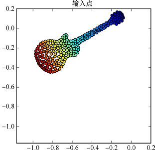

> **圖片描述：** 此圖為第12章圖12.6，這個吉他形狀由232個點組成。每個點是一個樣本，每個樣本由兩個特徵值描述，分別為*x*和*y*。顏色只是幫助我們跟蹤從一...

圖12.6　這個吉他形狀由232個點組成。每個點是一個樣本，每個樣本由兩個特徵值描述，分別為*x*和*y*。顏色只是幫助我們跟蹤從一張圖變換到下一張圖時對應點的位置，沒有其他含義

通常，這些點是測量的結果，比如說某些人的年齡和體重，或歌曲的節奏和音量。為了更一般化，我們將它們稱為*x*和*y*兩個特徵。

圖12.7展示了將吉他的形狀資料的每個特徵正則化到軸的[−1,1]範圍的結果。也就是說，*x*值縮放至[−1,1]，*y*值也同樣縮放至[−1,1]。這個操作形成的形狀有點偏斜，因為它更多的是進行了垂直拉伸而不是水平拉伸。

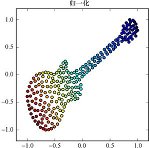

> **圖片描述：** 此圖為第12章圖12.7，將圖12.6所示的資料點在每個軸上進行正規化，縮放至範圍[−1,1]。形狀的偏斜是由於它沿*y*軸方向的拉伸更多（相比於...

圖12.7　將圖12.6所示的資料點在每個軸上進行正規化，縮放至範圍[−1,1]。形狀的偏斜是由於它沿*y*軸方向的拉伸更多（相比於*x*軸）

### 12.5.2　標準化

另一個常見的操作是將每個特徵**標準化**，這一過程需要兩個步驟。

首先，我們將每個特徵都加上（或減去）一個固定的數值，使得該特徵的平均值為0。此步驟也稱為**平均正規化**或**平均減法**。在二維資料中，這一步會使整個資料集左右移動和上下移動，結果是使其平均值落在(0,0)上。

然後我們不進行正規化，也不將每個特徵縮放到[−1,1]，而是將它縮放到標準差為1。此步驟也稱為**方差正規化**（variance normalization）。回想一下第2章學過的內容，這意味著該特徵中大約68%的值位於[−1,1]的範圍內。在二維示例中，*x*值被水平拉伸或壓縮，直到*x*軸上大約68%的資料在[−1,1]，然後垂直拉伸或壓縮*y*值，直到*y*軸上的數值分佈與*x*軸上相同為止。這必然意味著也會存在[−1,1]範圍之外的點，所以我們的結果與正規化得到的結果會有所不同。

與正規化一樣，大多數庫會提供一個例程來標準化呼叫其中的某個或所有特徵。將圖12.6中的資料進行標準化處理後的結果如圖12.8所示。

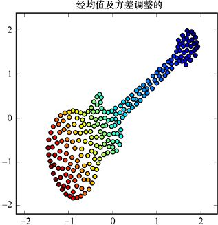

> **圖片描述：** 此圖為第12章圖12.8，在標準化資料時，我們將其水平和垂直移動，使每個特徵的平均值為0。然後在水平和垂直方向上伸展壓縮它，以便使得每個特徵的標準...

圖12.8　在標準化資料時，我們將其水平和垂直移動，使每個特徵的平均值為0。然後在水平和垂直方向上伸展壓縮它，以便使得每個特徵的標準差為1，即大約68%的資料位於每個軸的[−1,1]範圍內

### 12.5.3　保存資料的轉換方式

正規化和標準化的例程都是由處理資料的參數控制的——這些參數告訴它們應該如何處理資料。這些參數是由庫例程在應用轉換之前就通過分析資料而得到的。

使用相同的操作來轉換未來會接收的資料是非常重要的，所以這些庫將始終保存著這些參數，以便我們稍後可以再次應用相同的轉換。

換句話說，收到要預測的新資料時，我們會直接評估系統的準確性或者做出真實的預測，而**不會**再次分析該資料，不會進行新的正規化或標準化轉換，而是會對新資料應用與訓練資料相同的正規化或標準化步驟。

這一步的結果是新轉換的資料幾乎不會對它自己進行正規化或標準化。也就是說，它兩個軸上的資料不一定在[−1,1]內（正規化），或者它的平均值不在(0,0)且在每個軸的[−1,1]內不會包含68%的資料（標準化），這是正常的。

重要的是我們需要使用相同的轉換方式，如果新資料沒有被完全地正規化或者標準化，那就順其自然吧！

### 12.5.4　轉換方式

一些轉換是**單變量**（univariate）的，這意味著它們一次只處理一個特徵，每個特徵獨立於其他特徵（該名稱來源於uni，意思是單獨的，與variate結合，意味著相同變量或特徵）。其他轉換則是**多變量**（multivariate）的，這意味著它們可以同時處理很多特徵。如前所述，該名稱來源於multi，意思是多個，與variate結合。

舉個簡單的例子，考慮一個正規化轉換，如我們之前看到的那樣。這是一個單變量轉換，因為它將每個特徵當作一組獨立的資料進行操作。這就是說，它將所有*x*值縮放至[0,1]內，也將所有*y*值縮放至[0,1]內。但是這兩組特徵不會以任何方式進行交互，換句話說，*x*軸如何縮放並不取決於*y*值，反之亦然。

應用於有3個特徵的資料的正規化轉換的視覺實作如圖12.9所示。

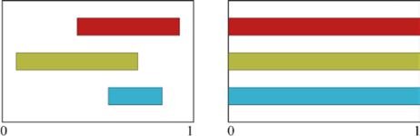

> **圖片描述：** 此圖為第12章圖12.9，當應用單變量轉換時，每個特徵的轉換與其他特徵相互獨立。在這裡我們要將特徵值正規化到[0,1]內。(a)3個特徵的初始範圍...

(a)　　　　　　　　　　　　　　　　　　　　　　　　　　　(b)

圖12.9　當應用單變量轉換時，每個特徵的轉換與其他特徵相互獨立。在這裡我們要將特徵值正規化到[0,1]內。(a)3個特徵的初始範圍；(b)每個特徵都被獨立地平移並擴展到了[0,1]內

相比之下，多變量轉換演算法會同時處理多個特徵，而且是將它們一起處理。最極端（也是最常見）的處理方法就是同時處理所有特徵。如果我們將上述3個特徵的資料用多變量轉換進行處理，就會將它們同時平移並伸縮，直到它們的並集充滿[0,1]這個區間，如圖12.10所示。

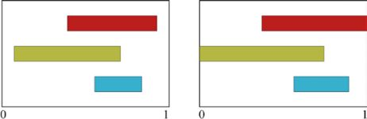

> **圖片描述：** 此圖為第12章圖12.10，當應用多變量轉換時，我們會同時處理多個特徵。我們再次將特徵正規化到[0,1]內。(a)3個特徵的初始範圍；(b)3個特徵...

(a)　　　　　　　　　　　　　　　　　　　　　　　　　　　(b)

圖12.10　當應用多變量轉換時，我們會同時處理多個特徵。我們再次將特徵正規化到[0,1]內。(a)3個特徵的初始範圍；(b)3個特徵同時平移並伸縮，直到其集合的最小值和最大值的範圍為[0,1]

很多轉換方式既能以單變量的方式進行，也能以多變量的方式進行。我們會基於資料進行選擇。

例如，當我們對*x*和*y*樣本進行縮放時，單變量轉換比較合理，因為它們是相互獨立的。但假設特徵是用不同的方式測量出的不同時間段的溫度，那麼我們可能會希望把這些特徵放在一起處理，這樣它們作為一個整體就可以充滿我們正在處理的溫度範圍。

## 12.6　特徵選擇

按理說，我們在訓練期間需要處理的資料越少，訓練就會越快。所以，如果有辦法減少電腦的工作量，同時又可以保持相同的效率和學習的準確性（或類似的指標），那是一件非常好的事情。

如果我們在資料中收集了冗餘的、不相關的、沒有幫助的特徵，那麼應該刪除它們，這樣就不用在它們身上浪費太多時間。這個過程稱為**特徵選擇**（feature selection），有時也稱為**特徵過濾**。

讓我們考慮一些例子，其中的一些資料實際上是**多餘的**，或者說是不必要的。假設我們手工標記大象的圖像，將其大小、種類和其他特徵輸入資料庫。出於某種原因，沒有人能夠記得我們有一欄用來記錄大象的腦袋的數量。因為大象只有一個頭，所以這一欄只會是“1”。包含這一資料對電腦識別一頭大象並無裨益，反而會讓它的運行速度變得更慢。因此，我們應該從資料中刪除這個無用的特徵資料。

我們可以將這一想法概括為刪除無用特徵，或者刪除貢獻很少的特徵，抑或刪除對於得到正確的答案做出最少貢獻的特徵。

再來看大象圖像的例子。我們可能會創建電子表格來記錄每隻動物的身高、體重、最新的所在地的緯度和經度、軀幹長度、耳朵大小等條目。但很有可能這種生物的軀幹長度和耳朵大小密切相關，這樣我們就可以刪除（或過濾）其中任意一個，並且仍舊可以得到它們共同表示的資訊。

許多庫會自動估算資料庫中每種資料帶來的影響，然後我們可以將其作為簡化資料庫的指南，並用來加速學習過程，同時不會犧牲一些我們不願意捨棄的特徵。

因為移除一個特徵也是一種資料轉換，所以我們從訓練集中移除的任何特徵也必須在未來的資料中移除。

## 12.7　降維

減少資料集大小的另一種方法是將特徵加以組合，這樣一個特徵可以完成兩個或更多個特徵的工作。這就是所謂的**降維**（dimensionality reduction），其中的“維度”指的是特徵的數量。

直觀來看，資料中的一些功能可能在某些方面有點多餘，通過壓縮資料集來去除這種重複性，就可以提高學習的表現且不會損失資訊。

正如前面提到的，我們可能正在研究大象這一物種，其軀幹長度和耳朵大小是**相關的**：當一個數值增大時，另一個數值也會增大。所以，如果我們知道這兩個值中的一個，就可以很好地猜測另一個。這種情況的結果就是，我們可以通過一個數值來替換這兩個數值，這樣就可以壓縮資料庫。這個數值只包含其中一個值，也可能是它們的某種組合。這在人體生理學中很常見，其中體重指數（BMI）就是結合了身高和體重的單個數字[CDC17]。

讓我們來看一個工具，它能自動確定如何選擇和組合特徵，從而對結果產生最小的影響。

### 12.7.1　主成分分析

**主成分分析**（Principal Component Analgsis，PCA）是一種用於降低資料維度的數學技術。讓我們通過觀察PCA對吉他資料的作用來獲得對於PCA的直觀感受，詳細描述參見[Dulchi16]。

圖12.11再次展示了原始吉他資料。和之前一樣，這些點的顏色只是為了在資料被控制時進行跟蹤，並無其他含義。

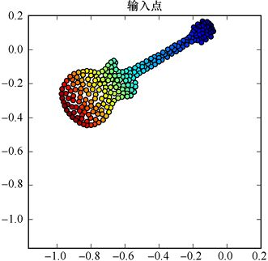

> **圖片描述：** 此圖為圖12.11，我們用來討論PCA的原始資料，和之前一樣，顏色只是為了幫助我們看清楚在對每個資料點進行處理時發生了什麼，並無其他含義

圖12.11　我們用來討論PCA的原始資料，和之前一樣，顏色只是為了幫助我們看清楚在對每個資料點進行處理時發生了什麼，並無其他含義

我們的目標是將這個二維資料壓縮為一維資料，也就是說，我們將用一個數字替換每對*x*和*y*，就像BMI是單個數字卻可以結合一個人的身高和體重一樣。在對一個真實的資料集使用PCA時，我們可以同時組合多組特徵。

我們將從資料的標準化開始。圖12.12是先均值正規化再方差正規化的組合，和我們之前見過的一樣。

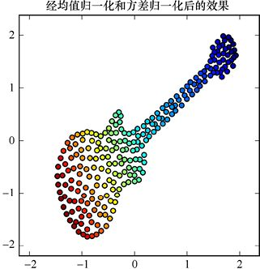

> **圖片描述：** 此圖為圖12.12，經過標準化之後的輸入點

圖12.12　經過標準化之後的輸入點

由上文可知，我們將嘗試將此二維資料簡化為一維資料，所以為了在實際應用前瞭解這個想法，讓我們先來看看缺少一個關鍵步驟的過程，然後再退回到該步驟。

首先，我們在*x*軸上繪製一條水平線（稱為**投影線）**，然後將每個資料點移動到它在投影線上的最近點——這一過程稱為**投影**（projection）。因為線是水平的，所以我們只需要向上或向下移動點，以找到它們在投影線上距離最近的點。

將圖12.12中的資料點投影到水平投影線上的結果如圖12.13所示。

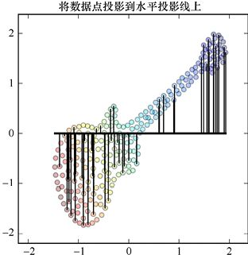

> **圖片描述：** 此圖為圖12.13，我們通過將吉他的每個資料點移動到它在投影線上最近點的位置來進行投影。為清楚起見，我們僅展示了（約）25%的資料點

圖12.13　我們通過將吉他的每個資料點移動到它在投影線上最近點的位置來進行投影。為清楚起見，我們僅展示了（約）25%的資料點

所有經過處理的資料點如圖12.14所示。

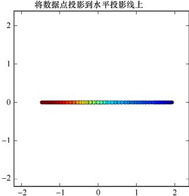

> **圖片描述：** 此圖為第12章圖12.14，將圖12.13所示的資料點進行投影的結果。資料點都被移動到了投影線上。現在每個點僅由其*x*座標描述，所以我們現在有了一...

圖12.14　將圖12.13所示的資料點進行投影的結果。資料點都被移動到了投影線上。現在每個點僅由其*x*座標描述，所以我們現在有了一個一維資料集

這是我們想要的一維資料集，因為這些點只有*x*值有區別（*y*值總是0，所以它是無關緊要的）。但是這種組合特徵的方式無疑是糟糕的，因為我們做的所有事情就是扔掉*y*值。這就像計算體重指數時，我們只是簡單地使用了體重，卻忽略了用身高來進行估計。

為了改善這種情況，我們將跳過的步驟包含進去：不再使用水平投影線，而是旋轉直線，直到它通過**最大方差**的方向。想象一下，這條直線投影之後，將具有最大範圍的點。

任何實作PCA的庫的例程都會自動地為我們提供這條直線。圖12.15顯示了吉他資料的這條直線。

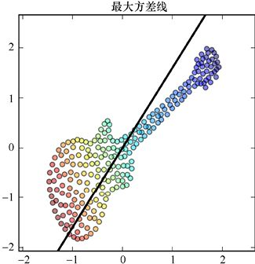

> **圖片描述：** 此圖為圖12.15，粗黑線是原始資料的最大方差線，這將是投影線

圖12.15　粗黑線是原始資料的最大方差線，這將是投影線

現在我們像之前一樣進行投影，將每個點移動到線上距離它最近的點來進行投影。與之前一樣，我們將點垂直於直線移動，直到與直線相交，如圖12.16所示。

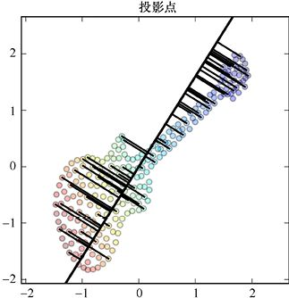

> **圖片描述：** 此圖為圖12.16，通過將吉他的每個資料點移動到它在投影線上最近的點的位置來進行投影。為清楚起見，我們僅展示了（約）25%的點

圖12.16　通過將吉他的每個資料點移動到它在投影線上最近的點的位置來進行投影。為清楚起見，我們僅展示了（約）25%的點

投影點如圖12.17所示。注意，它們都位於我們在圖12.15中找到的最大方差線上。

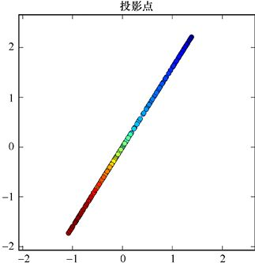

> **圖片描述：** 此圖為圖12.17，吉他資料集的資料點投影到最大方差線上的結果

圖12.17　吉他資料集的資料點投影到最大方差線上的結果

這些點在一條線上，但它們仍然是二維資料。要完全將它們降低至一維，我們可以旋轉它們直到它們位於*x*軸上，如圖12.18所示。現在*y*軸再次變得無關緊要起來，於是我們就有了一個一維資料集，其中包含每個點的原始*x*值和*y*值的資訊。

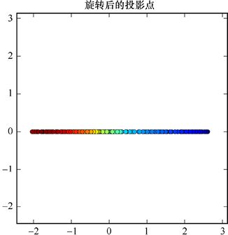

> **圖片描述：** 此圖為第12章圖12.18，將圖12.17中的點旋轉到水平位置。現在每個點只用它的*x*值來描述，所以我們將二維資料轉換為了一維資料。請注意，我們並...

圖12.18　將圖12.17中的點旋轉到水平位置。現在每個點只用它的*x*值來描述，所以我們將二維資料轉換為了一維資料。請注意，我們並沒有簡單地消除一個維度，因為原始的*x*和*y*值都對這一維的資料有所貢獻

雖然圖12.18中的直線看起來很像圖12.14中的直線，但它們是不同的，因為這些點沿著*x*軸的分佈不同。換句話說，它們有著不同的數值，因為它們是通過投影到傾斜直線而不是水平直線上計算的。

這些步驟都是由機器學習庫自動完成的，我們稱之為**庫的**PCA**例程**。

新資料的優點在於每個點的單個值（其*x*座標）是它原始的二維資料的組合。我們降低了資料集的維度，使它成了一維資料，同時還保留了儘可能多的資訊。學習演算法現在只需要處理一維資料而不是二維，所以它們會學習得更快。

當然，我們拋棄了一些資訊，所以可能會遭遇類似於降低學習效率或準確性這樣的問題。有效使用PCA的訣竅是選出那些在組合後學習效果還能在我們目標範圍內的維度。

如果我們有三維資料，就可以想象在樣本雲的中間放置了一個平面，並將資料投射到平面上。而庫的工作是找到該平面的最佳方向，這將把資料從三維轉換為二維。如果我們想，就可以使用與上面相同的技術，想象一條穿過樣本雲空間的直線，它能使資料維度從三維降低到一維。

在實踐中，我們可以在任何數量維度的問題中使用這種技術，可以減少幾十個甚至更多資料維度的數量。

這種演算法的關鍵問題在於我們應該嘗試去壓縮多少個維度、哪些維度應該合併，以及如何把它們組合起來。我們通常用字母*k*代表PCA完成工作後資料中的維度數量。所以，在吉他示例中，*k*是1。

從這個意義上講，我們可以將*k*作為演算法的參數，並通常將其稱為整個學習系統的**超參數**。正如我們所見，*k*會被用於許多不同的機器學習演算法，這非常不方便，因此當我們看到參數*k*時，一定要注意它在上下文中所代表的含義。

壓縮太少意味著訓練和評估步驟將是效率低下的，但壓縮太多意味著我們會冒著消除應該保留的重要資訊的風險。選擇超參數*k*的最佳數值時，我們通常會嘗試一些不同的值，然後看一下效果，選擇一個效果最好的。我們也可以使用**超參數技術**自動執行此搜索，詳細內容參見第15章。

與往常一樣，我們用於壓縮訓練資料的任何PCA轉換方式，都必須用於所有未來的資料。

### 12.7.2　圖像的標準化和PCA

圖像是一種重要且特殊的資料。下面讓我們將標準化和PCA應用於一組圖像。

彩色圖像在每個點有5個值：*x*、*y*、紅色、綠色和藍色，所以我們說彩色圖像的資料集是五維或5D的。為簡單起見，我們在這裡使用單色圖像，其中每個像素只有3個值：*x*、*y*和灰度值。這也就給了我們一個三維資料集。

在這種情況下，我們不會將*x*和*y*值視為像灰度值這樣的特徵，因為我們不想更改圖像尺寸。因此我們將像素視為具有一個數值的特徵，而*x*和*y*只是用來命名樣本的索引。

我們將每個像素的數值視為一個特徵。因此，如果我們的圖像寬是100像素，高是50像素，則每張圖像具有100×50=5000個特徵。這些特徵中存在著大量的空間資訊，這意味著在任何方向上彼此靠近的像素通常共享著某種關係。但為了簡單起見，現在我們會忽略這個空間資訊，只需將二維圖像轉換為新的一維資料。我們將從圖像的第1行開始，追加第2行，然後是第3行，以此類推，如圖12.19所示。這個過程完成後，我們將得到一個列表，其中的每一項包含圖像中一個像素。

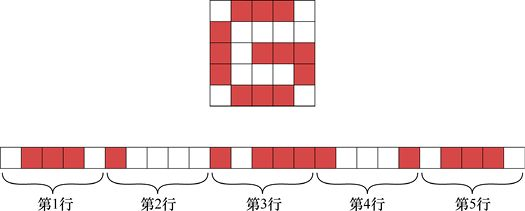

> **圖片描述：** 此圖為圖12.19，將圖像轉換為列表。第1行：輸入圖。第2行：將圖像從頂部到底部一行行排列而形成的列表

圖12.19　將圖像轉換為列表。第1行：輸入圖。第2行：將圖像從頂部到底部一行行排列而形成的列表

如上所述，在使用PCA這樣的工具時，我們需要特徵的均值為0，標準差為1。所以現在，讓我們以這種方式處理像素[Turk91]。圖12.20上方顯示的是5個被壓扁的圖像，每張圖像尺寸都是5×5；下方顯示的是相同的圖像經過處理之後的結果。實際上，我們每次考慮一個列，並用這種方式來處理該列中的像素，然後保存這些新值。

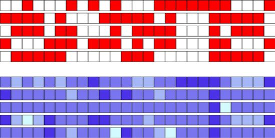

> **圖片描述：** 此圖為第12章圖12.20，在每個特徵（或者說每個像素）上處理圖像列表。上方的5行顯示了A、B、G、M和S這5個字母的二進制圖像經壓扁後的結果。我們...

圖12.20　在每個特徵（或者說每個像素）上處理圖像列表。上方的5行顯示了A、B、G、M和S這5個字母的二進制圖像經壓扁後的結果。我們一次處理一列，然後將它們的均值調整為0，標準差調整為1。最後的結果顯示在下方的5行中，縮放後的最小值為淺藍色，最大值為深藍色

獨立處理每個像素看起來可能很奇怪，這意味著忽略了像素之間的所有空間資訊（在後續章節中，我們將看到其他使用空間資訊的方法）。但就目前而言，模型的每張圖像都只是一個擁有許多獨立特徵值的大列表，就好像它們是測量溫度、風速、溼度等數值一樣。

現在將上面的討論付諸實踐，我們從圖12.21所示的6張哈士奇的圖像開始。這些圖像經過了手工對齊，所以眼睛和鼻子在每張圖像中的位置大致相同。這樣，每張圖像中的每個像素都有很大機率能表示一隻哈士奇的相同部位。例如，中心下方的像素很可能是鼻子的一部分，靠近上角的一個可能是耳朵，以此類推。

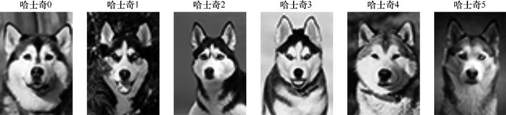

> **圖片描述：** 此圖為圖12.21，最初的哈士奇圖集

圖12.21　最初的哈士奇圖集

6只哈士奇的資料庫並沒有包含很多的訓練資料，所以我們通過一遍又一遍以隨機順序運行6張圖像來擴大資料庫。每次運行，我們都會先複製這張圖，然後在水平或垂直軸上進行隨機的移動（最多10%），之後以順時針或逆時針的方向進行旋轉（最多5°），也可以左右翻轉。然後我們將變換後的圖像添加到訓練集。圖12.22展示了6只哈士奇進行前兩次變換的結果。用這種技術，我們可以創建包含4000張哈士奇的圖像的訓練集。

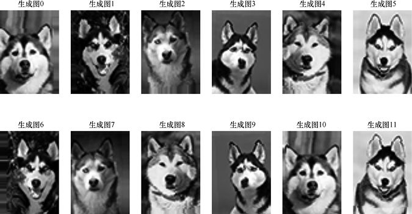

> **圖片描述：** 此圖為圖12.22，每行表示一組經過平移旋轉、翻轉創建的新圖像。我們使用這個過程來創建包含4000張哈士奇的圖像的訓練集

圖12.22　每行表示一組經過平移旋轉、翻轉創建的新圖像。我們使用這個過程來創建包含4000張哈士奇的圖像的訓練集

我們想在這些圖像上運行PCA，因此首先要標準化它們。這意味著我們將分析4000個圖像中相同的位置的像素點，並通過調整使得它們具有零均值和單位標準差，如圖12.20所示。我們將標準化4000個圖像。在圖12.23中，我們僅展示6張哈士奇的圖像標準化後的結果。

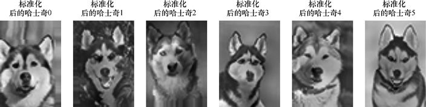

> **圖片描述：** 此圖為圖12.23，將前6張哈士奇的圖像經過標準化後的結果

圖12.23　將前6張哈士奇的圖像經過標準化後的結果

在之前對PCA的討論中，我們將二維資料投影到了一條一維的線上。哈士奇圖像的尺寸是64像素×45像素，所以每張圖都有64像素×45像素=2880個特徵。PCA會將這些特徵投射到我們要求的方向上，每次投影都會生成新的投影圖像。

由於12張圖像（指圖的特徵圖像）能夠很好地擬合一張圖，因此我們從用PCA任意找 12張圖像開始。這些圖像在以不同的權重組合在一起時，能最好地重建輸入圖像。PCA發現的每個投影都被稱為**特徵向量**（eigenvector），eigen的德語意義是“相同”，vector是數學中向量的名稱。在為特定類型的事物創建特徵向量時，我們一般會以eigen作為前綴，創建一個有趣的名字，圖12.24展示了12個eigendog（eigen狗）。

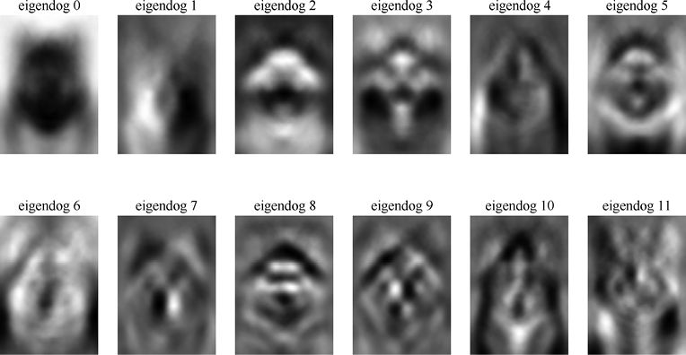

> **圖片描述：** 此圖為圖12.24，PCA生成的12個eigendog

圖12.24　PCA生成的12個eigendog

我們需要觀察這些eigendog ，據此瞭解PCA是如何分析圖的。第一個eigendog是一大塊黑色汙跡，讓我們可以大致知道這些狗出現在圖像中的那塊區域。第二個eigendog似乎是捕捉到了一些左右的陰影差異。縱觀12個eigendog，每個eigendog都似乎比以前複雜了一點，捕捉了圖像之間的不同細節。

現在讓我們看看如何通過將eigendog與不同的權重相結合來恢復原始圖像。圖12.25展示了PCA可以為每個輸入圖像找到的最佳權重。我們通過對應的權重來縮放圖12.24中的每一個eigendog，從而創造重建的狗的圖像，最後將結果加在一起。

圖12.25並不是很好。我們讓PCA僅用12張圖像來表示所有4000張訓練集中的圖像。它盡力做到了最好，但這些重建的圖像裡面，有些看起來並不像狗。

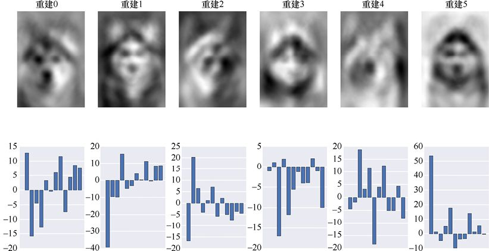

> **圖片描述：** 此圖為第12章圖12.25，通過12個eigendog重建原始輸入。上方：重建的狗的圖像。下方：圖12.24中的eigendog直接對應的權重。注意...

圖12.25　通過12個eigendog重建原始輸入。上方：重建的狗的圖像。下方：圖12.24中的eigendog直接對應的權重。注意權重的垂直方向上的數值的範圍並不完全相同

讓我們嘗試使用100個eigendog，前12個eigendog圖像看起來就像圖12.24中的那樣，但隨後它們變得更復雜，也更詳細了。圖12.26是重建了我們的第一組的6只狗的結果。

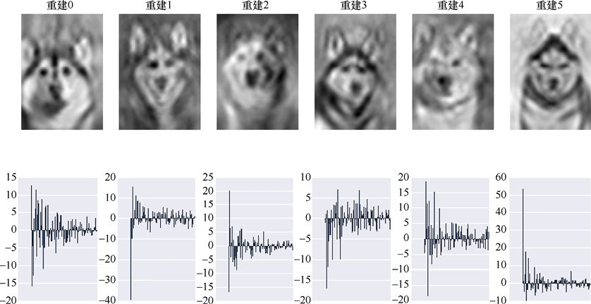

> **圖片描述：** 此圖為第12章圖12.26，通過100個eigendog重建原始輸入。上方：重建的狗的圖像。下方：eigendog對應的權重。注意權重的垂直方向上的...

圖12.26　通過100個eigendog重建原始輸入。上方：重建的狗的圖像。下方：eigendog對應的權重。注意權重的垂直方向上的數值的範圍並不完全相同

這看起來好多了！它們開始像狗了，雖然在其中幾張圖像中，它們並沒有明顯的耳朵——這是狗臉中一個相當重要的部分。

我們將eigendog的數量增加到500個再試一下，結果如圖12.27所示。

這樣效果就很好了，從這些圖中我們可以很容易地認出圖12.23中6只標準化的狗。雖然有一點噪聲，但通過這500張圖像和每張圖像對應的權重，我們已經可以很好地匹配這些圖像了。前6張圖像都沒有什麼特別之處，如果我們查看資料庫中的其他4000張圖像，會發現它們看起來效果都不錯。我們可以繼續增加eigendog的數量，效果會越來越好，圖像的邊界會變得越來越明顯，噪聲也會越來越少。

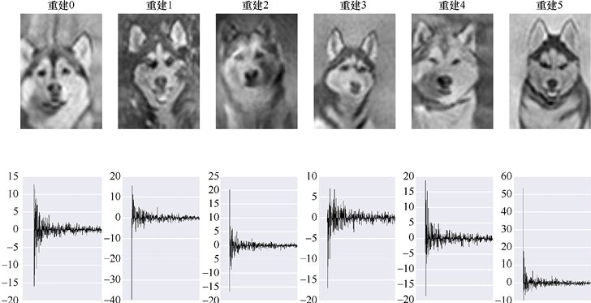

> **圖片描述：** 此圖為第12章圖12.27，通過500個eigendog重建原始輸入。上方：重建的狗的圖像。下方：eigendogs對應的權重。注意權重的豎直方向上...

圖12.27　通過500個eigendog重建原始輸入。上方：重建的狗的圖像。下方：eigendogs對應的權重。注意權重的豎直方向上的數值的範圍並不完全相同

注意，在每次重建中，獲得權重最大的eigendog圖像都是一開始的圖像，因為它們能夠捕捉到大致的特徵結構。在我們慢慢進行學習的過程中，每個新的eigendog都會比之前的權重小一點，所以它們對總體結果的貢獻會慢慢變少。

PCA對於我們的價值並不在於那些可以製作出的看起來像原始資料集的圖像，而是讓我們可以使用eigendog幫助分類器對狗進行分類。例如，相較於在每張圖像上用所有2880像素去訓練分類器，我們可以僅用100個或500個權重進行訓練。該分類器永遠不會看到完整的圖像，它甚至從未見過eigendog，只是獲取了每張圖像的權重列表，這就是它在訓練期間用於分析和預測的資料。如果想要分類的是一個新圖像，我們只需要提供權重，電腦就會根據這些值返回一個類別。這可以節省大量計算，從而節省時間。

## 12.8　轉換

讓我們更仔細地看一下計算和應用轉換時所涉及的步驟，我們還會看到如何撤銷這些步驟（有時我們會想要這樣做），以便更方便地比較結果與原始資料。

假設我們在為一座城市的交通部門工作，這個城市只有一條主高速路。這座城市位於北方，溫度經常降到0℃以下。城市管理者注意到交通密度似乎會隨著溫度而變化——很多人在最寒冷的日子會選擇待在家裡。

為了規劃道路工程和其他建築，管理人員想知道每天早上的高峰時間段的車輛數（可以根據溫度來預測得到）。因為測量和處理資料需要一些時間，所以我們決定每晚午夜測量溫度，然後預測將有多少輛車在第二天早上7點到8點之間會行駛在路上。

我們將在冬季中期開始使用系統，所以期望同時得到高於和低於冰點（0℃）的溫度。

所以幾個月以來，我們測量每個午夜的溫度，並在第二天早上的7點到8點之間記錄經過路上特定標誌的車輛數量，原始資料如圖12.28所示。

我們想把這些資料提供給機器學習系統以瞭解溫度和交通密度之間的關係。這是一個迴歸問題，我們將提供一個由單個特徵組成的樣本，該特徵以攝氏度（℃）為單位，描述了測得的溫度，然後返回一個實數來告訴我們路上的車輛數量。

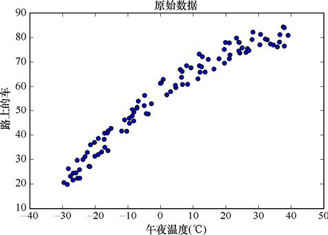

> **圖片描述：** 此圖為第12章圖12.30，創建轉換對象。(a)溫度資料被送到轉換對象，該對象通過分析資料來找到它的最小值和最大值，並在內部保存它們，資料不變；(b...

圖12.28 我們在每個午夜測量溫度，然後第二天早上統計在7點到8點之間經過路上特定標誌的車輛數量

假設輸入資料在縮放到範圍[0,1]時，所使用的迴歸演算法的效果最好。所以我們將兩個軸上的資料正規化至[0,1]的範圍內，如圖12.29所示。

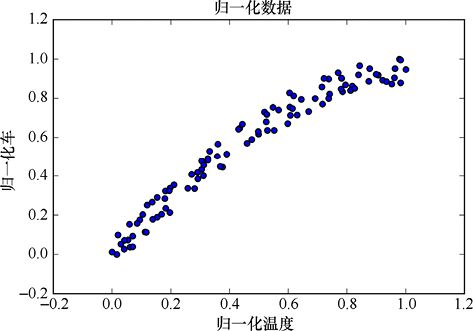

> **圖片描述：** 展示將兩個維度上的資料正規化到[0,1]範圍內的效果圖。

圖12.29 將兩個維度上的資料都正規化到[0,1]的範圍內，這樣可以更方便地進行訓練

這幅圖看上去和圖12.28一樣，只是兩個座標的數值範圍縮放到了[0,1]。

再次強調一下保存這種轉換方式的重要性，我們需要將它應用到未來的資料上。下面讓我們分3步來看一看這其中的內在機制。為方便起見，我們將使用一種面向對象的哲學，轉換是由對象執行的，它們會記住自己的參數。

第一步，為每個座標軸創建一個轉換對象，也稱為**映射**（mapping），這是一個能夠實作轉換的對象。

第二步，將輸入資料傳輸給該對象以分析這些資料。對象會找到它們的最小值和最大值，並使用這兩個值來建立轉換方式，該轉換方式能夠將輸入資料移動並縮放到[0,1]的範圍內。因為我們想要縮放車輛數量和溫度兩個特徵，所以每個軸都需要一個轉換對象。到目前為止，我們並沒有改變資料，該想法如圖12.30所示。

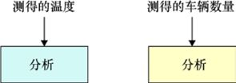

> **圖片描述：** 兩部分示意圖。(a)溫度資料被送到轉換對象分析最小值和最大值；(b)車輛數量也創建了對應的轉換對象。

(a)　　　　　　　　　　　　　　　　 (b)

圖12.30　創建轉換對象。(a)溫度資料被送到轉換對象，該對象通過分析資料來找到它的最小值和最大值，並在內部保存它們，資料不變；(b)我們也為車輛數量創建了一個轉換對象

第三步，再次將資料提供給轉換對象。但是這次我們對它應用已經計算出的轉換方式，完成後，它將返回一組已轉換到範圍[0,1]的新資料，如圖12.31所示。

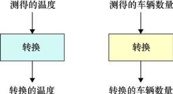

> **圖片描述：** 此圖為圖12.31，每個特徵都進行了之前所計算出的轉換，轉換的輸出進入學習系統

圖12.31　每個特徵都進行了之前所計算出的轉換，轉換的輸出進入學習系統

現在我們已經準備好開始學習了。我們將轉換後的資料提供給學習演算法，並希望它弄清楚輸入和輸出之間的關係，如圖12.32所示。

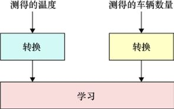

> **圖片描述：** 此圖為圖12.32，從經過轉換的特徵和目標中學習的過程

圖12.32　從經過轉換的特徵和目標中學習的過程

假設我們已經對系統進行了訓練，而且它在根據溫度資料預測車輛數量這一工作上做得很好。

第二天，我們將系統部署到城市管理者的電腦上。第一天晚上，值班經理測得的午夜溫度為−10℃。她打開系統，找到溫度的輸入框，輸入−10，並單擊“預測交通情況”按鈕。

會發生什麼呢？我們不能只將−10輸入系統的，因為系統希望得到的是一個[0,1]範圍內的數，所以我們需要用某種方式將資料加以轉換。

唯一合理的方法是應用之前訓練系統時應用的轉換方式。例如，如果我們將原始資料集中的−10轉換為0.29，那麼假設今晚的溫度又是−10，最好再次被轉換為0.29。如果它被轉換為其他的數值，系統就會以為它比實際的溫度要更冷或者更熱。

在這裡，我們可以看到將轉換方式保存為對象的價值。這樣我們就可以簡單地告訴該對象採取與訓練資料相同的轉換方式，並將其應用於新的資料。所以如果−10在訓練期間被轉換為0.29，那麼任何新輸入的−10也將被轉換為0.29。

假設系統確定了交通密度是0.32，這對應於某個車輛數量經過轉換後的數值。但是該數值介於0和1之間，這是訓練時代表車輛數量的資料範圍，我們應該如何撤銷這種轉換並將其還原成車輛數量呢？

在很多機器學習的庫中，每個轉換對象都會有一種例程被稱為**逆轉**或者**撤銷**轉換的方法。這種方法會為我們提供一種**逆變換**（inverse transformation）。在這種情況下，它會逆轉我們構建它時應用的正規化轉換。在訓練時，轉換對象將車輛數量39正規化為0.32，那麼逆轉換就會將正規化值0.32轉換為39，這就是我們輸出給城市經理的值。步驟如圖12.33所示。

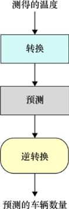

> **圖片描述：** 此圖為第12章圖12.33，向系統輸入新溫度時，我們用訓練資料的轉換方式對其進行轉換，將其轉換為0～1的數字。對於運行得出的數值，我們進行車輛資料轉...

圖12.33　向系統輸入新溫度時，我們用訓練資料的轉換方式對其進行轉換，將其轉換為0～1的數字。對於運行得出的數值，我們進行車輛資料轉換的逆轉換，將它從一個經過縮放的數字轉換為車輛數量

再強調一下，我們必須通過用於訓練資料的原始轉換方式來轉換輸入資料。

這裡有一種明顯會出錯的情況：如果我們得到了一個新樣本，而該樣本的數值在原始輸入數值範圍之外。比如，我們有一個晚上得到一個驚人的低溫讀數−50，遠遠低於原始資料中的最小值。那麼轉換後的數值將是負數，超出[0,1]的範圍。同樣，如果我們遇到了一個非常炎熱的夜晚，得到一個很高的溫度，那麼它將被轉換為大於1的值，這也位於[0,1]的範圍之外。

兩種情況都很正常。我們期望得到[0,1]的範圍是希望訓練過程能夠更加高效，同時也是為了能夠隨時方便查看數值。一旦完成對系統的訓練，我們就可以以任意數值作為輸入，系統也會竭盡所能地計算出一個最好的對應輸出。

## 12.9　切片處理

在前文提到的交通示例中，每個樣本有兩個特徵（溫度和交通密度）。我們可以想象一個更豐富的資料集，其中每個樣本都有數十或數千個特徵。

那麼，如何預處理這些複雜的資料集呢？我們要提取什麼樣的資料，以及要以何種形式來構建和應用資料轉換方式呢？

有3種方法，取決於我們是按樣本、按特徵還是按元素切片或提取資料。這些方法分別稱為**逐樣本**、**逐特徵**和**逐元素**處理。

讓我們按順序來看看這3種方法。

對於每種方法，我們都假設資料是排列在二維網格中的。每行都是一個單獨的樣本，該行中的每個元素都是一個特徵。因此，如果我們查看網格的一列，就是在查看某一特徵的所有數值，如圖12.34所示。

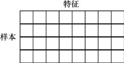

> **圖片描述：** 此圖為圖12.34，我們即將討論的資料集是二維網格，其中每一行都是一個包含很多特徵的樣本，每個特徵的所有數值構成一列

圖12.34　我們即將討論的資料集是二維網格，其中每一行都是一個包含很多特徵的樣本，每個特徵的所有數值構成一列

### 12.9.1　逐樣本處理

當所有特徵都表示同一個事物時，使用**逐樣本處理**（samplewise processing）的方法是比較恰當的。假設輸入資料包含很少的音頻片段，例如一個人對著手機說的話，那麼每個樣本的特徵就是每一時刻音頻的音量，如圖12.35所示。

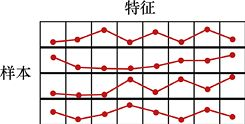

> **圖片描述：** 此圖為圖12.35，每個樣本由一系列短音頻波形的測量值組成，每個特徵都為我們提供了該特徵對應時刻的瞬時音量

圖12.35　每個樣本由一系列短音頻波形的測量值組成，每個特徵都為我們提供了該特徵對應時刻的瞬時音量

如果我們想將這些資料縮放到[0,1]的範圍，那麼對單個樣本中的所有特徵進行縮放是合理的，這樣音量最大的部分會被設置為1，而音量最小的部分則為0。

因此，我們每次處理一個樣本，而每個樣本都獨立於其他樣本。單個樣本的處理過程如圖12.36所示。

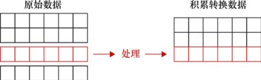

> **圖片描述：** 此圖為第12章圖12.36，以逐樣本的方法處理資料時，每個樣本（或資料庫的每一行）都獨立於其他樣本。在這裡，我們沿著原始資料集的頂部向下處理，每次對...

圖12.36　以逐樣本的方法處理資料時，每個樣本（或資料庫的每一行）都獨立於其他樣本。在這裡，我們沿著原始資料集的頂部向下處理，每次對一行進行轉換，再將結果添加到新資料集中

以逐樣本的方法處理資料時，我們會將每一行（或者每個樣本）當作想要調整的事物。之後選擇一行，分析並轉換它。得到的結果會覆蓋原始資料，或者被保存在新資料集中。

這種處理對於圖像和音頻之類的文件是合理的，因為這類文件中的每個樣本的所有特徵都互相關聯，都可以使用相同的尺度來表示。

### 12.9.2　逐特徵處理

當樣本表示的是完全不同的事物時，**逐特徵處理**（featurewise processing）就比較合理了。

假設我們每天晚上都會測量不同種類的氣候特徵，如溫度、風速、溼度以及雲量。這樣就會給每個樣本賦予4個特徵，如圖12.37所示。

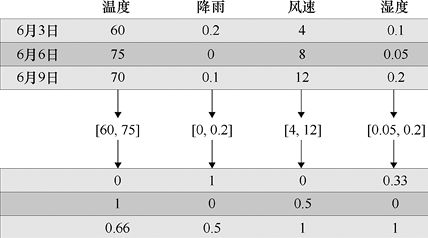

> **圖片描述：** 此圖為第12章圖12.37，我們每天晚上都會測量4個不同的氣候特徵。以逐特徵的方法處理這些資料時，我們會獨立地分析每一列。在這裡，我們找出每列的最小...

圖12.37　我們每天晚上都會測量4個不同的氣候特徵。以逐特徵的方法處理這些資料時，我們會獨立地分析每一列。在這裡，我們找出每列的最小值和最大值（記錄在方括號中），並使用這些值來將這一列轉換成0～1的一組新值

以逐樣本的方法縮放這些資料是沒有意義的，因為它們的單位和尺寸都不一樣。我們無法比較風速和溼度，但可以分析所有的溼度值、風速值以及溫度值等。換句話說，我們將依次修改每個特徵的值，如圖12.38所示。

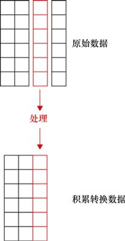

> **圖片描述：** 此圖為第12章圖12.38，以逐特徵的方法處理資料時，每個特徵（或資料集中的每一列）都是獨立於其他特徵的。在這裡，我們從左到右地對原始資料集進行處理...

圖12.38　以逐特徵的方法處理資料時，每個特徵（或資料集中的每一列）都是獨立於其他特徵的。在這裡，我們從左到右地對原始資料集進行處理，每次轉換一個特徵，並將結果添加到新的資料集中

以逐特徵的方法處理資料時，我們將每一列（或者說每個特徵）視為想要調整的事物。所以我們選擇每一列，分析並轉換它。逐特徵處理資料時，代表每個特徵值的每一列有時被稱為一條**纖維。**

### 12.9.3　逐元素處理

**逐元素處理**（elementwise processing）會將圖12.34所示網格中的每一個元素都視為一個獨立的個體，然後對每個網格中的元素進行相同的轉換。

這種方法在所有資料都表示相同的事物，但我們又想改變它的每個單元時是很有用的。假設每個樣本都對應一個有4個成員的家庭，它的特徵包含4個家庭成員的身高。測量小組測量時獲得的是以英寸為單位的資料，但我們想要以釐米為單位的資料。

我們只需要對網格中的每個元素乘以2.54就能將英寸轉換成釐米。這樣我們是將它想象成逐行處理還是逐列處理就無關緊要了，因為每個元素都用了同樣的處理方式。

我們在處理圖像時也會經常用到這種方法。圖像資料的每個像素值往往在[0,255]內，所以我們只要對圖像進行逐元素處理，將每個像素點的數值都除以255，就能得到[0,1]內的數值。

## 12.10　交叉驗證轉換

我們已經看到，處理資料的正確方法是在訓練集中構建轉換，然後保留轉換形式並應用於其他資料。

如果我們不仔細遵循上述原則，就可能發生**資訊洩露**（information leakage），即那些本不屬於我們轉換方式的資訊會被偶然植入，從而改變轉換方式。這意味著我們將不能按照自己的意圖轉換資料。更糟糕的是，我們會看到這種洩露會導致系統在評估測試資料時擁有不公平的優勢，減少了明顯的錯誤。我們可能會得出一個結論：系統運行良好，可以投入應用。然而，當它真正被使用的時候，我們會發現效果很差，這時候就會感到失望。

資訊洩露是一個很有挑戰性的問題，因為它可能會以不同的形式發生，很多時候都很微妙。接下來讓我們看看資訊洩露如何影響在第8章中提到的交叉驗證過程。

現代的庫為我們提供了許多方便的例程，讓我們可以進行快速、正確的交叉驗證，而不必自己編寫程式碼。接下來，我們將深入瞭解為何看似合理的方法會導致資訊洩露，然後再看看怎樣修復這一問題。

在實例中觀察這一問題有助於我們更好地防止、發現以及修復系統或者程式碼中的資訊洩露。

這裡的新元素是由交叉驗證在每個步驟產生的，每個新元素只包含整體資料集的一部分。與以前的例子不同，我們不會分析整個資料集然後對它進行轉換，而是隻分析一部分資料集。注意，這種變化要求我們格外小心。

回想一下，在交叉驗證中，我們取出一**折**（也就是一部分）訓練集，然後構建一個新的學習器並用剩下的資料集訓練它。當完成訓練時，我們以被取出的這一折作為驗證集來評估這一學習器。

這意味著每次循環我們都會有一個新的訓練集（從原始資料中除去選中的那一折樣本），如果我們要對資料進行轉換，就需要基於這個特定的資料集來構建轉換方式，然後將該轉換應用於當前的訓練集，同時對當前的驗證集也進行相同的轉換。關鍵要記住，因為在交叉驗證的每次循環時都會創建一個新的訓練集和驗證集，所以在每次循環的時候我們也需要建立一個新的轉換方式。

讓我們看看上述過程中會有什麼錯誤發生。圖12.39左側是原始資料集。經過分析，我們生成了一種轉換方式（由圓圈表示），這種轉換方式被應用到樣本上（將它們轉換成了深色）。然後我們進入交叉驗證的部分。這裡的循環沒有被展開，所以我們只展示了幾個訓練的例子，每個例子都與一個不同的折有關。每次循環，我們都需要移除一折的資料，並對剩下的樣本進行訓練，然後在驗證集上進行測試，得出一個分數。

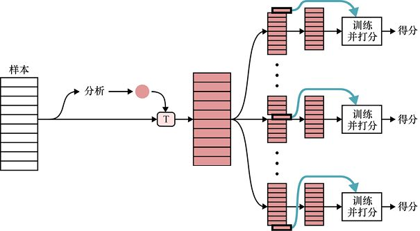

> **圖片描述：** 此圖為第12章圖12.39，一種錯誤的交叉驗證的方式。我們不想在進行交叉驗證之前得到轉換的方式。圖中紅色的圓圈表示轉換方式，它被用紅T標記的方框應用...

圖12.39　一種錯誤的交叉驗證的方式。我們不想在進行交叉驗證之前得到轉換的方式。圖中紅色的圓圈表示轉換方式，它被用紅T標記的方框應用到資料上

這裡的問題在於，當我們分析輸入資料並建立轉換方式時，分析中包含了所有折的資料。

想知道為什麼這樣做會出現問題，讓我們到一個更簡單的場景中看看到底發生了什麼。

假設在應用轉換時，我們將所有訓練集中的資料作為一個整體縮放到了[0,1]的範圍內。用之前提到過的概念來說，我們將進行多變量的逐特徵轉換來將資料縮放到[0,1]的範圍內。假設在第一折裡，最小值和最大值是0.01和0.99，而在另一折中，最小值和最大值佔據的範圍要更小些。圖12.40是5折資料中每一折包含資料的範圍，我們將分析所有折的資料來建立轉換方式。

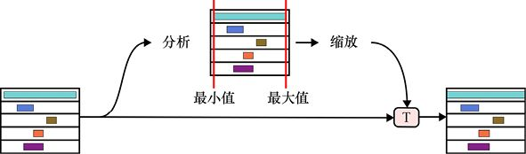

> **圖片描述：** 此圖為圖12.40，一種錯誤的對交叉驗證進行轉換的方式，它是在循環開始之前對所有資料進行轉換

圖12.40　一種錯誤的對交叉驗證進行轉換的方式，它是在循環開始之前對所有資料進行轉換

在圖12.40中，資料集顯示在左側，它被劃分為5折。在每個框裡面顯示的是每一折的資料範圍，最左側代表0，最右側代表1。最上面的折的特徵的數值範圍是0.01～0.99，其他折的資料範圍都在此範圍之內。當我們將所有折作為一個整體的時候，第一折的資料範圍就佔據了主導地位，所以我們只是將整個資料集縮放了一點點。

如果我們不是在進行交叉驗證，那麼圖12.40所示的過程是完全合理的，因為它確實在分析並縮放所有資料。那麼問題出現在哪裡呢？讓我們看看對交叉驗證的過程應用這種轉換方式的結果。

輸入資料是圖12.40最右邊圖中的每一個經過轉換的折。我們首先提取第一折，將其放在一邊，然後使用其餘資料進行訓練，並用該折進行驗證。實際上，到這一步我們就已經做錯了，因為訓練資料的轉換也受到了那一折的資料的影響。

這違反了我們建立轉換的基本原則，也就是僅使用訓練資料建立轉換方式。我們在建立轉換時使用了現在的驗證資料，也就是說有些資訊已經從驗證集**洩露**到了建立轉換方式的參數中，而這些資訊不應該包含在參數裡。

正確的做法是：從所有樣本中移除選中的、要被當作驗證集的那一折的資料，然後根據剩下的資料來建立轉換方式，最後再對訓練集和驗證集進行轉換，如圖12.41所示。

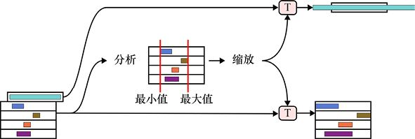

> **圖片描述：** 此圖為第12章圖12.41，對交叉驗證進行資料轉換的正確做法是，先移除作為驗證集的那一折的資料，然後根據剩下的資料來建立轉換方式。之後我們就可以對訓...

圖12.41　對交叉驗證進行資料轉換的正確做法是，先移除作為驗證集的那一折的資料，然後根據剩下的資料來建立轉換方式。之後我們就可以對訓練集和驗證集資料應用轉換了。需要注意的是，驗證集資料可能會超過[0,1]的範圍，這是沒有問題的，因為驗證集的資料確實比訓練集中的資料要極端一些

想要修復交叉驗證中產生的問題，我們就需要將這種思路應用到所有循環中，併為每一個訓練集都建立一個新的轉換方式，如圖12.42所示。

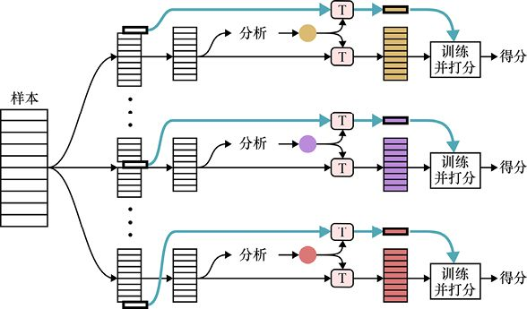

> **圖片描述：** 此圖為第12章圖12.42，對交叉驗證進行資料轉換的正確做法。對每一個我們想要選擇成為驗證集的折來說，都需要先將該折中的資料從原始資料中移除，然後分...

圖12.42　對交叉驗證進行資料轉換的正確做法。對每一個我們想要選擇成為驗證集的折來說，都需要先將該折中的資料從原始資料中移除，然後分析剩下的資料來得到轉換方式，再對訓練集和驗證集應用這種轉換。圖中不同的顏色代表每次循環都會建立一個不同的轉換方式

我們以交叉驗證為例討論了資訊洩露的問題，因為這是一個很好的例子。幸運的是，現在的庫提供的演算法都是正確的，所以在使用庫中的例程時，我們不需要擔心這個問題。

但是我們在自己寫程式碼時，這個問題就可能會出現。資訊洩露有時候會很微妙，可能會以某種意想不到的方式發生在程式中。所以在建立和應用轉換時，我們需要時刻提防資訊洩露的發生。

## 參考資料

[CDC17]　Centers for Disease Control and Prevention, *Body MassIndex* (*BMI*), 2017.

[Crayola16]　*What were the original eight (8) colors in the 1903box of Crayola Crayons*, 2016.

[Dulchi16]　Paul Dulchi, *Principal Component Analysis*, CS229 Machine Learning Course Notes #10.

[Krizhevsky09]　Alex Krizhevsky, *Learning Multiple Layers of Features from Tiny Images*, University of Toronto, 2009.

[McCormick14]　Chris McCormick, *Deep Learning Tutorial-PCA and Whitening*, Blog post, 2014.

[Turk91]　Matthew Turk and Alex Pentland, *Eigenfaces for Recognition*, Journal of Cognitive Neuroscience, Volume 3, Number 1, 1991.

### 讀者服務：

> **圖片描述：** 一個 QR Code（二維條碼），中央有綠色的書籍圖示標誌，掃描後可連結到相關線上資源。

微信掃碼關注【異步社區】微信公眾號，回覆“e55451”獲取本書配套資源以及異步社區15天VIP會員卡，近千本電子書免費暢讀。
