# 第13章　分類器

一些常用的將資料分類至不同類別的監督學習或非監督學習演算法集合。

## 13.1　為什麼這一章出現在這裡

對圖像、聲音或者其他資料進行分類是機器學習的一個重要的應用。在第7章中，我們講述了讓分類能正常運行的基礎。但資料分類遠遠不止構建和訓練泛型演算法那麼簡單。

就如我們所看到的，理解資料是設計並訓練一個良好的機器學習系統的關鍵。花時間研究資料並且培養一種對資料的直覺總是值得的，只有這樣我們才能設計出匹配我們要完成的任務的系統。

例如，假設有人給了我們不同農場的空中俯視圖，然後他希望我們能根據農場上種植的農作物對農場進行分類。

那麼分類器能夠識別多少種不同的農作物呢？5種？25種？在看到資料前，我們無法將這個數值確定下來。類別太少會限制分類準確率，但類別太多會使分類的速度降低，甚至還可能做一些無用的區分（例如，同一種農作物是否成熟）。在開始構建系統前，我們需要瀏覽一下資料，對於我們需要建立多少個類別進行檢測和分類有一個大致的概念。

研究資料一個很好的辦法是運用一種可以運行特定分類演算法的工具。在一些案例中，我們甚至只需要這些工具就能完成一個分類系統。在另一些案例中，我們可以用這些工具來進行一些簡單快速的測試，然後再用深度學習分類器來針對問題進行調整。

因為運用這些工具是深入理解資料的第一步，所以這裡我們會提及一些常用的工具。這些工具一般不會被當作深度學習演算法，但卻是建立特定問題解決方法的重要部分。

我們會用二維的資料即一般只有兩個類別的資料來展示，因為它們比較容易繪製和理解，但現代的分類器能夠處理任意維度以及龐大類別數的資料集。

用一些庫文件，大部分演算法可以僅用一兩行就運用到我們想要處理的資料上。

## 13.2　分類器的種類

在繼續介紹分類器之前，我們先將所有分類器的分類方法分成兩大類。

第一種分類器試著通過擬合一系列**參數**來找到資料的特徵，就像我們可以用一條直線的一些參數來擬合這條直線一樣。這種方法自然地被稱為**參數法**。

參數法一開始需要一種對於分類方法的描述。換句話說，它需要假設一種要去尋找的臨界條件。它可能會假設這個邊界是一條直線，或者是一個十維的軟盤，或者是一個一端有凸起的球面，然後再尋找那些能夠讓邊界更好地與資料匹配的參數。

可以說，參數法從一個假設開始，即可以使用特定類型的結構對資料進行分類，它的任務就是通過學習找到結構的最佳參數。用第4章中的術語來說，這個假設是一種貝葉斯先驗。

另一種分類器是**非參數的**，有些難以想象但依舊可以描述。非參數法不需要之前提到的假設。相反，它只採集資料，然後在分類的過程中建立一種演算法。這個演算法有已知的形式，但它的結構以及需要運用什麼變量都由訓練資料來決定。

一個**非參數法分類器**（non-parametric classifier）常常可以在資料輸入時保存大部分或者全部資料，然後試著找到一種規律，在新資料輸入時進行分類。

用第11章中的思路，我們可以說參數法分類器是演繹的，因為它由假設開始，再尋找滿足假設的資料。同樣地，非參數法分類器是歸納的，因為它由收集資料開始，再根據資料來找出分類的規律。

兩種方法在時間和空間上的優劣是互補的。

一方面，參數法分類器不需要太多空間，因為它只是保存了描述模型的參數。計算這些參數可能比較困難，所以訓練相對來說會慢一些。當模型訓練完畢後，再對新的資料進行分類就很快，因為我們只需要用訓練好的參數來計算一些函數。

另一方面，因為非參數法分類器常常需要保存大量的樣本資料，所以它們佔用的空間會隨著訓練的進行而增加。訓練的樣本越多，它存儲的資料也越多，分類器佔用的空間也就越大。但因為它對每個樣本進行的操作很少，所以訓練速度很快。當模型訓練完畢後，對新的資料分類很慢，因為演算法需要結合龐大的資料庫來找到最合適的分類。

總體來說，當訓練集比較小時，非參數法分類器比較吸引人，因為我們想要訓練進行得更快且不需要分析太多的樣本。當訓練集很大時，參數法分類器更有優勢，因為我們不介意為長時間訓練付出代價以換取對新資料更快的分類。

當研究一個資料集時，在兩種分類器之間來回切換並不少見，這有助於改進我們對於資料的理解。

接下來我們會先學習一些非參數法分類器，然後再看一些參數法分類器的演算法。

## 13.3*　k*近鄰法

我們先看一種非參數法的演算法，稱為*k***近鄰**（*k*-nearest neighbors）或者*k*NN。其中，*k*指的不是一個單詞而是一個數字。我們可以選取1或者任意一個比1大的整數。

因為這個數值是在演算法運行前設置好的，所以通常被稱為**超參數**。

我們在第7章中學過一個名為*k*均值簇的演算法。儘管名字相似，但這個演算法和*k*近鄰法在機制上有很大的不同。最關鍵的不同點在於*k*均值簇是從無標籤資料中學習，而*k*NN則是從有標籤資料中學習。換句話說，它們分別是無監督學習和監督學習。

*k*NN訓練起來很快，因為它做的所有事就是將每個輸入的資料保存在資料庫中。當訓練完成之後，新輸入的樣本就會被分類。

*k*NN對新樣本分類的中心思想是幾何吸附，如圖13.1所示。

在圖13.1a中，我們有一個樣本點（五角星）和一些其他的樣本。這些樣本代表了3個類別（圓形、正方形和三角形）。想要確定新樣本的類別，我們就觀察*k*個最近的樣本[**近鄰**（neighbor）]，然後給它們“投票”。哪種類別的樣本數量最多，新樣本的類別就是哪個。我們將*k*個最近的樣本的周圍用黑色加粗。在圖13.1b中，將*k*設置為1，意思是我們想要用最近的樣本的類別，這個例子中就是圓形，所以新樣本就被分類為圓形。在圖13.1c中，我們將*k*設置為9，所以看9個最近的樣本，這裡找到了3個圓形、4個正方形和2個三角形。因為正方形的數量最多，所以新樣本就被分類為正方形。在圖13.1d中，我們將*k*設置為25，這裡找到了6個圓形、13個正方形和6個三角形，所以新樣本再次被分類為正方形。

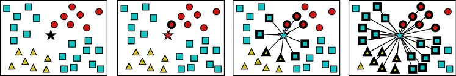

> **圖片描述：** 此圖為第13章圖13.1，想要對新樣本分類，我們找到它的*k*個近鄰中數量最多的那一類。(a)一個新樣本（五角星），周圍環繞著3個分類；(b)當*...

(a)　　　　　　　　　　　　　　　　　　　 (b)　　　　　　　　　　　　　　　　　　 (c)　　　　　　　　　　　　　　　　　　 (d)

圖13.1　想要對新樣本分類，我們找到它的*k*個近鄰中數量最多的那一類。(a)一個新樣本（五角星），周圍環繞著3個分類；(b)當*k=*1時，最近的1個近鄰是圓形，所以新樣本的分類就是圓形；(c)當*k=*9時，我們找到了3個圓形、4個正方形和2個三角形，所以新樣本就被分到了正方形的類別中；(d)當*k=*25時，我們找到了6個圓形、13個正方形和6個三角形，所以新樣本被分到了正方形的類別中

綜上所述，*k*NN接收一個需要分類的新樣本和一個*k*的值。然後它找到距離新樣本最近的*k*個樣本，讓它們進行“投票”來決定新樣本的類別。哪種類別的“得票數”最多，新樣本就被分至哪種類別。

有很多不同的方法來處理特殊情況，但上述方法是最基本的思路。

注意到*k*近鄰並沒有在點與點之間建立一個明確的邊界，圖中並沒有為某一類別所屬的區域進行標記。

我們說*k*NN是一個按需演算法或者**懶惰演算法**，因為它在學習過程中沒有對樣本進行任何處理。在學習過程中，*k*NN只是將樣本保存在記憶體中，然後學習過程就結束了。

*k*NN很吸引人，因為它很簡單，訓練過程也很快。但是，*k*NN可能需要很大的記憶體，因為（一般來說）它需要保存所有輸入樣本。在某些時候，佔用很大的記憶體本身也會降低演算法運行的速度。對於新樣本的分類，一般來說也比較慢（相較於其他演算法而言），因為它需要花費時間找近鄰。每次想要對新樣本進行分類的時候，我們都需要找到*k*個近鄰，而這需要進行很多運算。當然，有辦法對速度進行最佳化，但總體來說這還是一個比較慢的演算法。對於那些要求分類速度的應用，例如即時系統和網站應用，*k*NN分類所需要花費的時間遠遠超出了要求的時間。

這個方法的另一個問題是它需要在新樣本的周圍有很多近鄰（畢竟，如果所有近鄰都距離樣本很遠，它們就無法為新樣本的分類提供很好的參考價值）。這意味著我們需要大量的訓練資料。

如果我們有很多特徵（即資料有很多維度），那麼*k*NN會很快遭遇**維度災難**（見第7章）。當空間的維度上升時，如果我們不同時顯著地增加訓練資料，那麼在任意一個局部近鄰中的樣本數量就會下降，也就會讓*k*NN更難在鄰近的點收集到資料點。

讓我們測試一下*k*NN的效果。在圖13.2中，我們展示了一組看起來像“微笑”的二維資料集，並將它們分成了兩類。

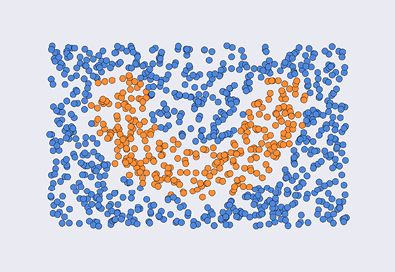

> **圖片描述：** 此圖為圖13.2，“微笑”的二維資料集。這些資料點被分成了兩類

圖13.2　“微笑”的二維資料集。這些資料點被分成了兩類

用不同的*k*值來運行*k*NN，結果如圖13.3所示。

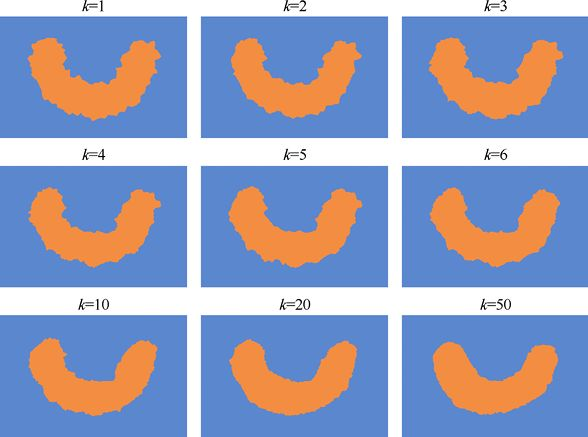

> **圖片描述：** 此圖為第13章圖13.3，用不同*k*值訓練的*k*NN來對長方形內的所有點進行分類。注意，*k*值較小時，結果的邊界比較粗糙，而*k*值較大時，...

圖13.3　用不同*k*值訓練的*k*NN來對長方形內的所有點進行分類。注意，*k*值較小時，結果的邊界比較粗糙，而*k*值較大時，邊界則比較光滑。前兩行中的*k*值增加的步長為1，最後一行的步長較大

當選取的近鄰數較少時，邊界比較粗糙。如果選取了更多的近鄰，邊界就會變得越來越光滑，因為對於輸入的新樣本，我們有了一個更完美的分類規律。

為了增添趣味，我們在資料中增加一些噪點，這樣邊界就沒有那麼容易找到了，如圖13.4所示。

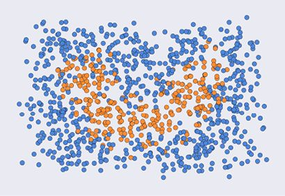

> **圖片描述：** 此圖為圖13.5，用*k*NN來對平面上的點進行分類。注意對於較小的*k*值，演算法的過擬合程度。當*k*值增加時，邊界更加光滑

圖13.4 “微笑”資料集的有噪點版本。該圖中點的數量與圖13.2中的相同，只是移動了一些分類之後的點的位置來增加噪點

不同*k*值的*k*NN訓練結果如圖13.5所示。

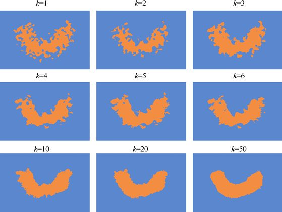

> **圖片描述：** 多張並排的圖展示不同k值的kNN在帶噪聲微笑資料集上的分類結果。k值小時邊界粗糙且過擬合，k值增大時邊界更平滑。

圖13.5　用*k*NN來對平面上的點進行分類。注意對於較小的*k*值，演算法的過擬合程度。當*k*值增加時，邊界更加光滑

我們可以看到在有噪點的情況下，*k*值較小會出現過擬合的情況。在這個例子中，我們需要將*k*值增加到50，才能得到比較光滑的邊界。

*k*NN一個很好的特徵就是它不會將不同類別的邊界很明確地展示出來。這意味著它可以處理各種形狀的邊界，或者任意形狀的點的分佈。為了證明這一點，我們在“微笑”資料集中添加“眼睛”，這樣同一個類別就有了3個不相連的集合。對應地添加了噪點之後的結果如圖13.6所示。

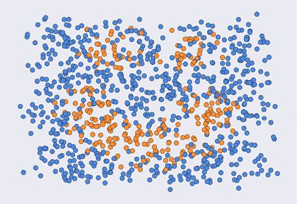

> **圖片描述：** 此圖為圖13.6，在“微笑”資料集中添加兩個“眼睛”，再添加一些噪點

圖13.6　在“微笑”資料集中添加兩個“眼睛”，再添加一些噪點

對應的不同*k*值訓練的*k*NN訓練結果如圖13.7所示。

在這個例子中，*k*的值為20時看起來效果最好。當*k*增加到50時，因為表示“眼睛”的樣本數量較少，所以它們的“投票”權重也會越來越小，眼睛就會慢慢消失。

所以*k*值太小會造成邊界粗糙以及過擬合的結果，而*k*值太大則會使一些微小的特徵消失。一般來說，找到適用於給定資料集的最好的演算法參數是一個重複試驗的過程。我們可以用交叉驗證來自動給每個結果進行評分，這一方法在維度很多的時候特別有用。

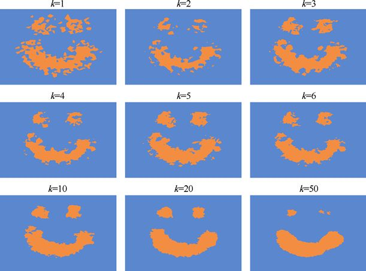

> **圖片描述：** 此圖為第13章圖13.7，*k*NN不會為不同的樣本簇建立邊界，所以它甚至在同一個類別的資料點分開時也適用。如同預期，當*k*值較小時，演算法會過...

圖13.7　*k*NN不會為不同的樣本簇建立邊界，所以它甚至在同一個類別的資料點分開時也適用。如同預期，當*k*值較小時，演算法會過擬合。但當*k*值為50時，眼睛慢慢消失了。這是因為當我們選取的近鄰數量很大時，眼睛周圍藍色點的數量與橙色點的數量相比，會慢慢地越來越多。所以當*k*值更大時，眼睛會完全消失

## 13.4　支援向量機

我們要講的下一個分類器採用了不同的方法。如同我們之前見過的一些分類器，這個方法會嘗試在不同種類的樣本之間找到一條明確的邊界。像之前一樣，我們會用二維的、只有兩類的資料集來舉例，但這個方法也可以輕易地應用到更多特徵和類別中去。我們的討論是受[VanderPlas16]中演示的啟發。

讓我們從兩簇點開始，每簇點都屬於同一類別，如圖13.8所示。

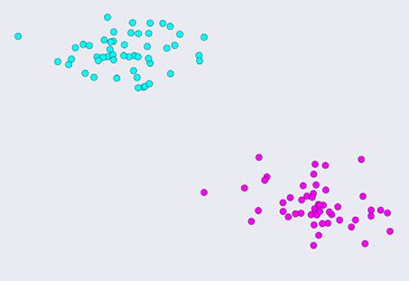

> **圖片描述：** 此圖為圖13.8，資料集包含兩簇二維樣本

圖13.8　資料集包含兩簇二維樣本

我們希望找到這兩簇點之間的邊界。為了讓工作簡單些，我們就用直線作為邊界。有很多直線可以劃分這兩簇點集，圖13.9展示的就是其中的3條直線。

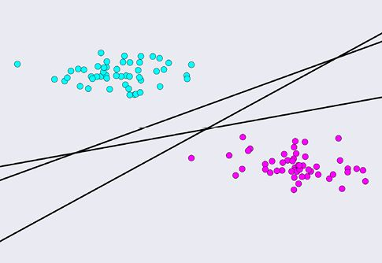

> **圖片描述：** 此圖為圖13.9，無數條能夠劃分兩簇點的直線中的3條。哪條線最好呢

圖13.9　無數條能夠劃分兩簇點的直線中的3條。哪條線最好呢

那麼我們應該從這3條直線中挑選哪一條呢？一種思考方法就是想象可能會輸入的新資料點。已知這些簇的區別，新的點有很大的可能會落在比較靠近某一個簇的地方。但這些新點也有可能落在邊緣或者稍微遠離這些簇的地方。

這就會讓我們覺得應該選一條離兩個簇都越遠越好的直線。這樣所有新點屬於某一類別的劃分是最有說服力的。

為了知道每條線距離簇有多遠，我們可以找到距離每條線最近的樣本，然後再在直線周圍畫一個對稱的邊界，如圖13.10所示。

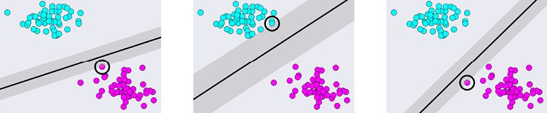

> **圖片描述：** 此圖為第13章圖13.10，通過找到每條線與最近資料點間的距離，我們可以為每條線評分。這裡我們在每條線周圍畫了灰色的區域，在這個距離上有一個用黑色圓...

圖13.10　通過找到每條線與最近資料點間的距離，我們可以為每條線評分。這裡我們在每條線周圍畫了灰色的區域，在這個距離上有一個用黑色圓圈圈出來的點，這個點就是距離直線最近的點。這3條直線中最好的是中間這條直線，因為如果有一個在兩個分群之間的新點輸入，它被分類錯誤的可能性最小

圖13.10中，中間的直線是3條直線中最適合的。例如，它絕對比最右邊的那條直線好，因為如果有一個點出現在右下角紅色簇的左上方一點點越過直線的位置，就會被劃分成藍色，即使它明顯離紅色簇更近。

這種演算法稱為**支援向量機**（Support Vector Machine，SVM）[Steinwarto8]。SVM會找到一條離兩個簇都最遠的直線（“機”在這裡可以被當作“演算法”的另一種表達方式）。這條最好的直線如圖13.11所示。

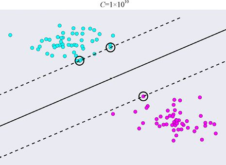

> **圖片描述：** 此圖為第13章圖13.11，SVM找到了一條距離所有樣本都最遠的直線。這條直線用黑線畫了出來。用黑色圓圈圈出來的點被稱為支援向量，它們定義了直線和直...

圖13.11　SVM找到了一條距離所有樣本都最遠的直線。這條直線用黑線畫了出來。用黑色圓圈圈出來的點被稱為支援向量，它們定義了直線和直線周圍的區域，這裡用虛線表示。圖中上方*C*的值會在下文解釋

圖13.11中被圈出來的樣本被稱為**支援向量**（support vectors）（這裡，“向量”可以當作是“樣本”的另一種說法）。這個演算法的第一步是找到這些被圈出來的點。一旦找到這些點，演算法就可以找到圖中中間部分的實線。這條線距離每個簇中的每個點都是最遠的。

從實線到經過支援向量的虛線的距離被稱為**邊緣距離**（margin）。所以我們可以將SVM的定義重新理解成，它能找到有最大邊緣距離的直線。

如果資料噪聲較大，且有重疊在一起的部分，像圖13.12那樣呢？現在我們不能畫出一條被空白區域包圍的直線。那麼在這種有重疊部分的例子中，最佳的那條直線是什麼呢？

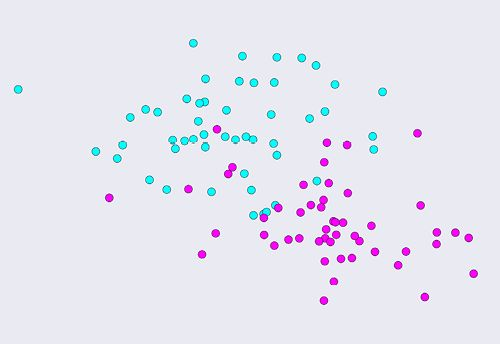

> **圖片描述：** 此圖為圖13.12，一組新的點，它有重疊的部分。那麼這個例子中最佳的邊界直線是什麼呢

圖13.12　一組新的點，它有重疊的部分。那麼這個例子中最佳的邊界直線是什麼呢

SVM中有一個可變的參數，方便起見稱它為*C*。這個參數控制了讓點進入邊緣距離之間區域的嚴格程度。我們可以將*C*想象成“乾淨程度”。乾淨程度越高，演算法就會要求直線周圍有更大的空白區域。乾淨程度越低，就有更多的點可以出現在直線周圍的區域。

演算法對於*C*的數值和所用的資料很敏感。為此，我們經常需要通過實驗來找出最好的參數設置。在實際應用中，這就意味著需要用交叉驗證來對很多數值進行測試評估。

圖13.13是將*C*值設置為100000（科學記數法中用1×105表示）後，用SVM處理有重疊部分的資料集的結果。

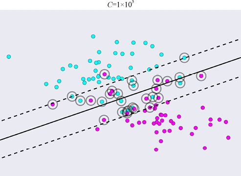

> **圖片描述：** 此圖為第13章圖13.13，*C*的數值告訴我們有多少點可以被允許進入邊界直線周圍的區域。*C*的數值越小，就有越多的點可以進入。這裡我們將*C*設...

圖13.13　*C*的數值告訴我們有多少點可以被允許進入邊界直線周圍的區域。*C*的數值越小，就有越多的點可以進入。這裡我們將*C*設置成100000（或者1×105）

讓我們將*C*的值降低至0.01，結果如圖13.14所示。在這幅圖中，有更多的點進入了邊界直線周圍的區域。

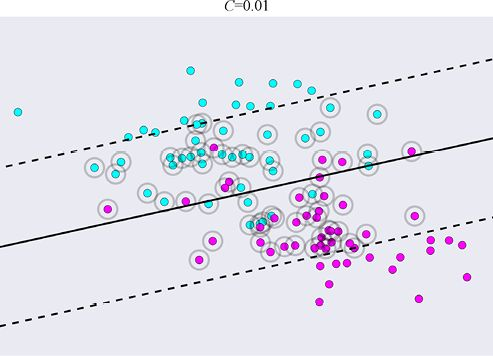

> **圖片描述：** 此圖為第13章圖13.14，將*C*的數值降低至0.01，讓更多的點進入邊界直線周圍的區域。因為需要考慮更多的支援向量，所以直線相較於圖13.13而...

圖13.14　將*C*的數值降低至0.01，讓更多的點進入邊界直線周圍的區域。因為需要考慮更多的支援向量，所以直線相較於圖13.13而言，與水平方向更接近

圖13.14和圖13.13中的直線是不同的，選擇哪條直線取決於我們想要從分類中得到什麼結果。如果我們認為最好的邊界更在意重疊區域附近的細節，就可以選擇一個較大的*C*值。如果我們認為兩個分類總體的形狀更重要，就可以選擇一個較小的*C*值。

有一種情況對於SVM來說需要技巧才能解決。假設我們有圖13.15所示的資料集，該圖中有一類資料將另一類資料圍了起來。對於這樣的資料集，我們無法找到一條能將兩個簇分開的直線。

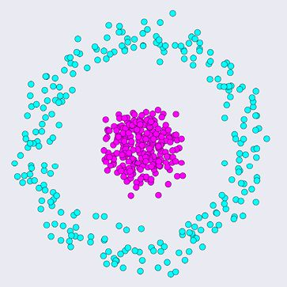

> **圖片描述：** 此圖為圖13.15，這個資料集對於SVM來說很有挑戰性，因為沒有一條直線能將這兩類資料分隔開

圖13.15　這個資料集對於SVM來說很有挑戰性，因為沒有一條直線能將這兩類資料分隔開

接下來就是運用技巧的部分了。如果我們在每個點上再加一個維度來測量每個點到中心的距離呢？結果如圖13.16所示。

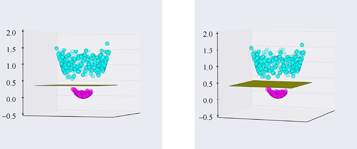

> **圖片描述：** 此圖為第13章圖13.16，如果我們將圖13.15中的點都基於它們與中心的距離往上移動，就能得到兩塊分開的點雲。現在就可以輕鬆地用一個平面將它們分隔...

圖13.16　如果我們將圖13.15中的點都基於它們與中心的距離往上移動，就能得到兩塊分開的點雲。現在就可以輕鬆地用一個平面將它們分隔開了。正如直線是平面上的線性元素，平面是空間裡的線性元素，所以這是SVM可以找到的。這兩幅圖是同一組資料從不同角度看過去的圖，中間的平面將兩組資料分隔開了

正如在圖13.16中看到的，我們現在就可以在兩組資料中畫一個平面（直線的二維版本）來分隔它們。

事實上，我們可以用之前SVM的方法來找到這個平面。圖13.17中標記出了兩簇點集中間平面的支援向量。

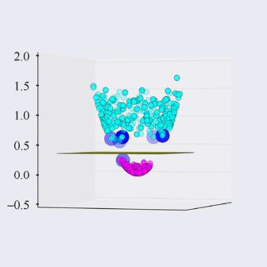

> **圖片描述：** 此圖為圖13.17，平面的支援向量

圖13.17　平面的支援向量

現在所有平面上方的點可以被歸為一類，平面下方的點可以被歸為另一類。

如果我們將圖13.17中標記出來的支援向量再還原到原始的二維圖中，結果如圖13.18所示。

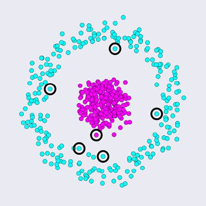

> **圖片描述：** 此圖為圖13.18，圖13.17的俯視圖

圖13.18　圖13.17的俯視圖

如果我們再畫出邊界線，結果如圖13.19所示。

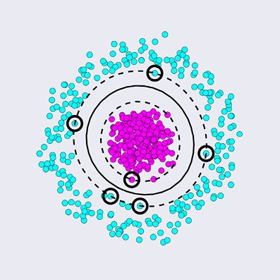

> **圖片描述：** 此圖為圖13.19，實線標記的是由資料點建立的形狀和三維模型中的平面之間的交界。這裡我們還標記出了支援向量以及它們所對應的邊界

圖13.19　實線標記的是由資料點建立的形狀和三維模型中的平面之間的交界。這裡我們還標記出了支援向量以及它們所對應的邊界

這樣我們只要肉眼觀察，就能找到處理資料的方法，然後就能想到將它們分開的三維轉換方式。我們並不想每次都手動進行這樣的操作。當資料維度較多時，我們甚至沒有辦法從視覺角度猜出一個很好的轉換方式。

這裡講到的演算法的美妙之處就在於它可以自動靈活地進行搜索。SVM可以有效率地嘗試很多不同的轉換方式並找到每種方式中的分隔線或者分隔平面，最終挑選出一個效果最好的。

但即使這樣，它也不是那麼吸引人，因為給資料加維度，再在已經加了維度的資料上進行分類這種操作太耗費時間，而且資料集越大，耗費的時間就越長。

能將這種搜索方法變得實用的地方在於有一種能夠使運行速度極大加快的數學表達方式。

這種方法需要修改名為**核**（kernel）的數學運算，這種運算構成了演算法的核心部分。數學家有時會用一種讚揚性的術語“技巧”來稱讚一種特別簡潔或聰明的想法。在這裡，將SVM的數學形式進行重寫以有效地處理這些附加工作就稱為**核技巧**（kernel trick）[Bishop06]。這種核技巧讓演算法能夠不需要真正轉換資料就能找到不同類型的點之間的距離，這是一種簡潔的技巧，也是最主要的加速方式。

這種核技巧一般都會包含在大部分的庫裡面，所以我們不需要完全掌握它們的內容[Raschka15]。

## 13.5　決策樹

讓我們考慮另一種非參數法分類方法。像*k*NN一樣，這種方法將輸入的資料保存起來，但它建立了一種結構。當需要對新資料進行分類的時候，我們就用這種結構來迅速找到答案。

我們可以用所熟悉的稱為“20 Questions”的猜謎遊戲來闡述這個方法。在這個遊戲中，有一個玩家（挑選者）會想出一個特定的目標，一般會是“一個人、一個地點或者一個東西”。另一個玩家（猜測者）會問一系列答案為是或否的問題。

如果猜測者可以在20個問題之內猜到目標，他就獲勝了。這個遊戲好玩的地方就在於要用幾個簡單的問題縮小無數可能的人、地點、東西的範圍直至幾個特定的事物。

圖13.20所示的就是一個典型的結構。

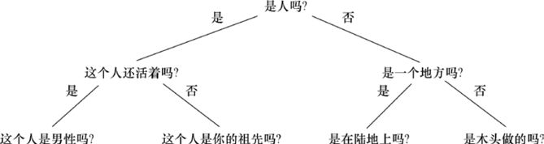

> **圖片描述：** 此圖為第13章圖13.21，一棵樹的一些術語。每個圓圈都是節點。頂部的節點有一個特別的名稱：根。每條將節點連接起來的線稱為分支。一棵樹的深度是指從根...

圖13.20 “20 Questions”猜謎遊戲的“樹”。注意到在每次決定之後都會有兩個選項：“是”和“否”

我們將圖13.20所示的結構稱為“**樹**”，因為它長得就像一棵倒立的樹。這種樹上有一些值得關注的問題。

我們說樹上的每個分叉的點是一個**節點**（node），每條連接著節點的線都是一個**分支**（branch）。與樹的專業術語相同，最頂端的節點稱為**根**（root），底部的節點稱為**葉**（leaf）或者**終端節點**（terminal node）。根和葉之間的節點稱為**內部節點**或者**決策點**。

如果一棵樹有完美對稱的形狀，那麼我們稱這棵樹是**平衡**（balanced）的；否則，就是**不平衡**（unbalanced）的。事實上，幾乎所有樹在建立的時候都是不平衡的，但如果需要，我們可以通過運行演算法來讓它們慢慢接近平衡。

我們說每個節點都有一個**深度**（depth），也就是從該點到根需要經過的最少節點數。根的深度是0，根下面的節點深度是1，以此類推。

圖13.21就是一棵標記了這些術語的樹。

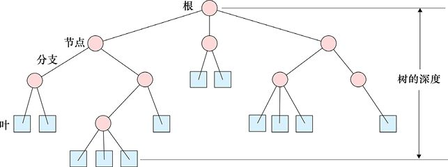

> **圖片描述：** 一棵樹狀圖展示決策樹的術語。頂部為「根」節點，每個圓圈為「節點」，連接節點的線為「分支」。此樹的深度為4，即從根到最遠葉節點的距離。

圖13.21　一棵樹的一些術語。每個圓圈都是節點。頂部的節點有一個特別的名稱：根。每條將節點連接起來的線稱為分支。一棵樹的深度是指從根到距離它最遠的節點的距離，在這裡，這棵樹的深度是4

用與樹家族相關的術語也很常見，雖然這些抽象的樹不需要兩個節點就能生成子節點。

每個節點（除了根節點）的上方都有一個點，我們稱這個上方的節點為該節點的**父節點**（parent）。父節點下方的節點稱為這個父節點的**子節點**（children）。我們有時候會將直接與父節點相連的節點稱為**近子節點**，將非直接相連的節點稱為**遠子節點**。

如果我們聚焦於某一個特定的節點，那麼這個節點和該節點的所有子節點一起稱為一個分支，或者**子樹**（sub-tree）。共享同一個近父節點的兩個節點稱為**兄弟姐妹**（sibling）。

樹家族的術語一般不會比這個更復雜，所以我們一般不會看到有“曾曾侄女”節點這樣的說法。

圖13.22展示了這些術語表達的意思。

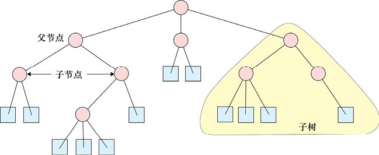

> **圖片描述：** 此圖為第13章圖13.22，一些應用在樹上的術語。如果有節點與某節點相連且在該節點的下方，那麼該節點就稱為父節點。那些在下方的節點就被稱為該節點的子...

圖13.22　一些應用在樹上的術語。如果有節點與某節點相連且在該節點的下方，那麼該節點就稱為父節點。那些在下方的節點就被稱為該節點的子節點。一個子樹是我們想要關注的樹上的某一部分

“20 Questions”樹的一個有趣的特點就是它是**二叉樹**（binary）：每一個父節點都正好有兩個子節點。對於電腦來說，這是一種最容易建立和使用的樹。如果有一些節點有多於兩個的子節點，我們就說這棵樹總體很**茂密**（bushy）。如果想的話，我們總可以將一棵茂密樹轉換成一棵二叉樹。茂密樹的一個例子就是猜某人生日的月份，如圖13.23a所示。對應的二叉樹如圖13.23b所示。因為我們可以輕鬆地在不同樹之間轉換，所以一般可以畫出表達最清晰的樹。

當然，為了使用，我們已經建立了所有樹的概念和術語。**決策樹**（decision tree）就是用這種方法來對資料進行分類。這種方法的全名為**分類變量決策樹**（categorical variable decision tree）。這是為了區分那些用來處理連續變量的決策樹，這些決策樹也被稱為**連續變量決策樹**（continuous variable decision tree）。

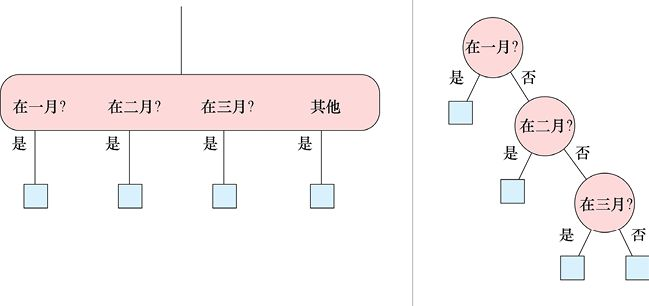

> **圖片描述：** 此圖為圖13.23，可以想象一棵在某個節點有很多子節點的樹。我們永遠可以將這種茂密樹轉換成一棵在每個節點都只有是或否兩個選項的二叉樹

　　　　　　　　(a)　　　　　　　　　　　　　　　　　　　　　　　　　　　　　　　　　　　　 (b)

圖13.23　可以想象一棵在某個節點有很多子節點的樹。我們永遠可以將這種茂密樹轉換成一棵在每個節點都只有是或否兩個選項的二叉樹

我們會著重於分類變量決策樹。圖13.24就是一個例子。

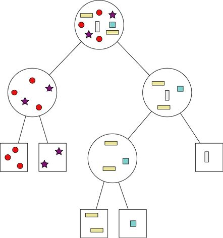

> **圖片描述：** 此圖為第13章圖13.24，一個分類變量決策樹。在頂部的很多樣本（每個樣本都有自己的類別）中，我們對每個樣本進行測試，直到每個樣本被分到了屬於自己的...

圖13.24　一個分類變量決策樹。在頂部的很多樣本（每個樣本都有自己的類別）中，我們對每個樣本進行測試，直到每個樣本被分到了屬於自己的類別中

這種分類法的基本思路是在訓練的過程中構建了一棵樹。讓我們來看看更一般化的構建樹並分類的過程。

根節點和所有父節點包含一個基於樣本特徵的測試。葉節點包含訓練樣本本身。當一些新的樣本到來時，我們從根節點開始往下層層遞進，途中在每個分支對樣本的特徵進行測試，如圖13.24所示。

當到達一個葉節點時，我們要看新的訓練樣本是否和該葉節點中其他樣本的類別相同。如果相同，我們就將該樣本加到這個葉節點中，分類結束；否則，將該節點分離出來，並基於能區分這兩個類別的樣本的特徵建立一個測試標準。這個測試標準與節點一起保存，並建立兩個子節點，將每個樣本移動到對應的子節點中，如圖13.25所示。

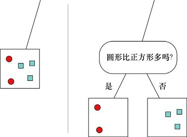

> **圖片描述：** 此圖為第13章圖13.25，分離一個節點。(a)我們可以看到一個葉節點中又有圓形又有正方形；(b)我們決定將這個葉節點用帶有測試標準的普通節點代替，...

(a)　　　　　　　　　　　　　　　　　　　　　 (b)

圖13.25　分離一個節點。(a)我們可以看到一個葉節點中又有圓形又有正方形；(b)我們決定將這個葉節點用帶有測試標準的普通節點代替，這樣就建立了兩個葉節點，每個節點中的內容比沒有分離前更統一

當訓練完成時，對新樣本的分類就很容易了。我們只要從根節點開始，順著樹一步步往下走，過程中用沿途每一個節點中的測試標準對樣本進行判斷。最終到達葉節點時，該樣本所屬節點的類別就是分類的結果。

這是一個理想化的過程。在現實中，我們的測試標準可能不夠完善，可能會讓葉節點包含不同類別的樣本，而基於效率或者空間等原因，我們沒有選擇再對該節點進行分離。例如，如果到達了一個節點，裡面包含80%類別A的樣本和20%類別B的樣本，我們可能會說該新樣本有80%的機率是類別A，20%的機率是類別B。如果我們只能給出一個類別作為分類結果，則可能會在80%的時間內判斷它為類別A，在另外20%的時間內判斷它為類別B。

我們將它稱為**貪心**（greedy）**演算法**。沒有一種普遍的策略能幫助我們找到最小或者最有效率的決策樹。相反，我們在訓練的過程中僅用現有的資訊對節點進行分離。

### 13.5.1　構建決策樹

讓我們看看幾個構建決策樹的例子。圖13.26所示的是被明確分為兩類的資料。

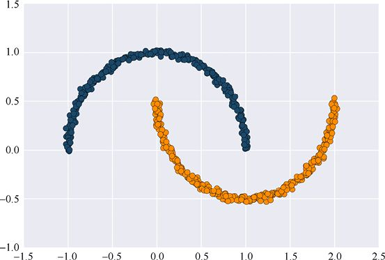

> **圖片描述：** 此圖為圖13.26，構建決策樹的600個原始資料點。這些二維的資料點明確分為兩類

圖13.26　構建決策樹的600個原始資料點。這些二維的資料點明確分為兩類

構建決策樹的每一步都包括分離一個葉節點，也就是用一個節點和兩個葉節點來代替它，對於整棵樹來說，淨增加了一個內部節點和一個樹葉節點。所以我們一般會用樹所包含的樹葉節點的數量來表示樹的大小。圖13.27就是構建一棵決策樹的過程，其中葉節點的數量逐漸增多。

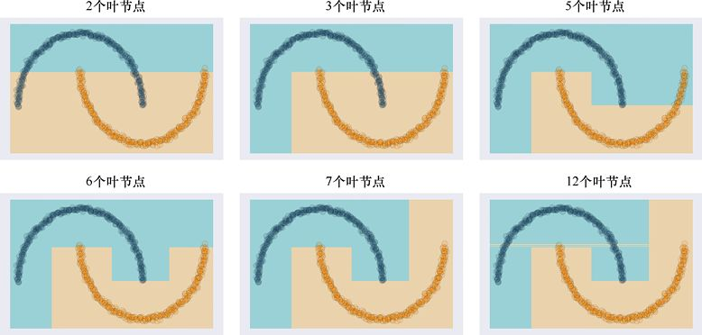

> **圖片描述：** 此圖為圖13.27，為圖13.26中的資料構建決策樹。可以看到，起初樹劃分很粗糙，之後分類越來越細緻

圖13.27　為圖13.26中的資料構建決策樹。可以看到，起初樹劃分很粗糙，之後分類越來越細緻

在這裡，單元是長方形的，分離方式是用豎直或水平的線將一個長方形劃分成兩個。可以注意到兩個類別的區域在逐漸適應資料。

這棵決策樹只需要12個葉節點。最終的樹和原始資料如圖13.28所示。這棵樹完美地與資料相匹配。

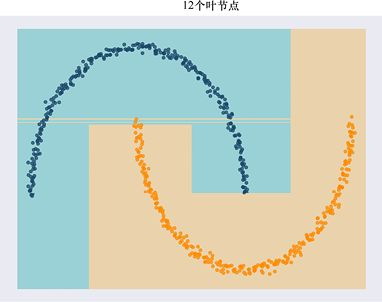

> **圖片描述：** 此圖為第13章圖13.28，最終的決策樹有12個葉節點。可以看到，圖中有兩個水平的、很細的長方形。它們包含了在弧形左上方3個藍色樣本的中心點，同時穿...

圖13.28　最終的決策樹有12個葉節點。可以看到，圖中有兩個水平的、很細的長方形。它們包含了在弧形左上方3個藍色樣本的中心點，同時穿過了橙色點。可知，所有點被正確地分類了

因為決策樹對於每個輸入資料都極其敏感，所以很有可能過擬合。事實上，決策樹一般都會過擬合，因為每個訓練樣本都會影響樹的形狀。為了說明這一點，我們在圖13.29中用與得到圖13.28同樣的演算法又運行了一次，只是這次我們用了兩組不同但都只選了原始資料中70%的資料點。

這兩棵決策樹很相似，但是不完全一樣。這個問題會在資料沒有那麼容易被區分出來的時候更加明顯，所以讓我們再看一個例子。

> **圖片描述：** 此圖為第13章圖13.29，決策樹對於輸入資料十分敏感。(a)從原始資料中隨機挑選70%的資料點擬合出來的樹；(b)同樣的流程，只是隨機選取了另一組...

(a)　　　　　　　　　　　　　　　　　　　　　　　　　　　　　　　(b)

圖13.29　決策樹對於輸入資料十分敏感。(a)從原始資料中隨機挑選70%的資料點擬合出來的樹；(b)同樣的流程，只是隨機選取了另一組70%的原始資料

圖13.30展示的是另一組資料，這次我們在給資料分類之後添加了噪聲，這樣這兩類資料就沒有明確的分界線了。

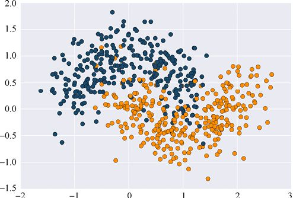

> **圖片描述：** 此圖為圖13.30，建立決策樹用的600個有噪聲的樣本資料

圖13.30　建立決策樹用的600個有噪聲的樣本資料

對這組資料擬合決策樹的時候，一開始兩個類別對應的區域都很大，但它們很快變成了一組組很複雜的小方形，因為演算法只有用這種方式才能分離節點並適應噪聲。結果如圖13.31所示。在這個例子中，需要100個葉節點才能準確地對所有資料點進行分類。

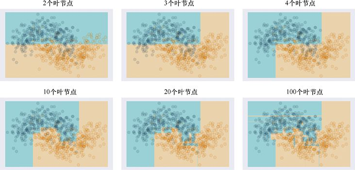

> **圖片描述：** 此圖為圖13.31，構建決策樹的過程。可以看到第二行所用的葉節點的數量十分巨大

圖13.31　構建決策樹的過程。可以看到第二行所用的葉節點的數量十分巨大

最終的決策樹和原始資料點如圖13.32所示。

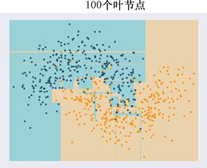

> **圖片描述：** 此圖為圖13.32，有噪聲的資料需要用有100個葉節點的決策樹來擬合。圖中有很多小方形用來對一些零星的資料點進行分類

圖13.32　有噪聲的資料需要用有100個葉節點的決策樹來擬合。圖中有很多小方形用來對一些零星的資料點進行分類

這裡有很多過擬合。雖然圖13.32中右下角大部分被識別為橙色，左上角大部分被識別為藍色，但這棵樹由於該資料集的噪聲產生了一些例外。如果之後需要識別的資料點落在了那些細長的方形區域中，就可能會被錯誤分類。

現在再用70%的原始資料來重複擬合決策樹，結果如圖13.33所示。

> **圖片描述：** 此圖為圖13.33，用70%的原始資料點構建的兩棵不同的決策樹

圖13.33　用70%的原始資料點構建的兩棵不同的決策樹

它們有相似點，但這兩棵樹有很大的區別，也有很多小塊僅用來對幾個樣本進行分類。這就是過擬合的表現。

雖然這樣看起來決策樹的效果很差，但在第14章中我們會將很多決策樹結合起來，抑或說**集成**（ensemble）起來，以構建效果很好的分類器。

### 13.5.2　分離節點

在終止決策樹這個話題之前，讓我們快速回顧一下分離節點的過程，因為很多庫會給我們提供一系列分離節點演算法的選擇。

當我們考慮一個節點時，有兩個問題要思考。第一個問題是，這個節點需要分離嗎？第二個問題是，怎麼樣分離它？讓我們按順序來思考這兩個問題。

在思考一個節點是否需要分離時，我們一般會考慮它的**純度**（purity），據此來了解這個節點中樣本分佈的一致程度。如果它們來自同一個類別，那麼這個節點就是完全純淨的。來自其他類別的樣本越多，這個節點的純度就越低。

要知道一個節點是否需要分離，我們可以為純度設置一個臨界值。如果一個節點過於**不純**（impure），即其純度低於臨界值，我們就需要將它分離。

現在我們再看看如何分離一個節點。

如果樣本有很多特徵，我們就可以發掘很多不同的分離測試標準。我們可以只測試一個特徵而忽略其他所有特徵。我們可以觀察一組特徵並測試它們是否滿足一系列要求。我們可以隨意在每個節點上基於不同的特徵選取一個完全不同的測試。這給了我們一個數量巨大的測試庫。

圖13.34所示的是一個包含很多不同種類樣本的節點。我們想要將所有接近紅色的點分入一個子節點，將所有接近藍色的點分入另一個子節點。相較於直接對顏色進行區分，我們試著對半徑進行區分，因為這種區分方法顯然更簡單。圖中給出了用3種不同的半徑長度作為臨界值的分離結果。

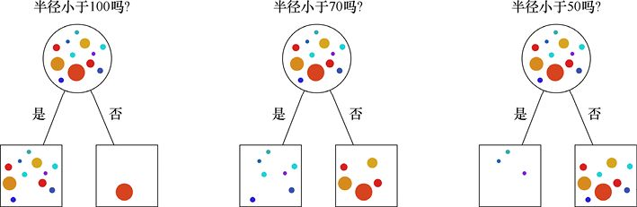

> **圖片描述：** 此圖為第13章圖13.34，我們想要分離頂部的節點，將所有接近紅色的點分在一個子節點裡，將所有接近藍色的點分在另一個子節點裡。這裡我們用半徑作為分離...

(a)　　　　　　　　　　　　　　　　　　　　　　　　　　　 (b)　　　　　　　　　　　　　　　　　　　　　　　　　　 (c)

圖13.34　我們想要分離頂部的節點，將所有接近紅色的點分在一個子節點裡，將所有接近藍色的點分在另一個子節點裡。這裡我們用半徑作為分離的特徵依據。(a)用半徑長度為100作為臨界值，除了最大的紅色點以外其餘所有點都通過了測試；(b)用半徑長度為70作為臨界值，將接近紅色的點分入了一個子節點，將接近藍色的點分入了另一個子節點；(c)用半徑長度為50作為臨界值，將一部分接近藍色的點分入了一個子節點，將所有接近紅色的點和一部分接近藍色的點分入了另一個子節點。所以半徑長度為70作為臨界值時，生成的結果純度最高

在這個例子中，半徑長度為70生成的結果純度最高，它將所有接近藍色的點分入了一個子節點，將所有接近紅色的點分入了另一個子節點。所以如果我們要用半徑作為特徵，70是最佳選擇。如果我們對於該節點用這個測試標準，則需要記住分離的特徵依據（半徑長度）以及臨界值（70）。

因為我們可以用所有樣本的任意一個特徵，所以需要一些評估這些測試標準的方法來找到最好的結果，這裡意味著能得到純度最高的子節點。

讓我們來看看兩種最普遍的測試分離質量的方法。每種方法都需要測試一些由該分離方法所產生的子節點的特點。

**資訊增益**（Information Gain，IG）方法：計算所有子節點單元的熵，將它們加在一起，並將這個結果與父節點單元中的熵進行比較。記得第6章中我們提到，熵是用來測量複雜度的，或者說需要多少比特來傳遞一些資訊。當某一單元是純淨的時候，它的熵值非常低。當某一單元包含了更多不同種類的樣本時，它的純度下降，熵值上升。

所以如果一個節點的子節點比父節點的純度要高，它們就會有更低的總熵值。在嘗試了不同的分離一個節點的方法以後，我們選擇那個能使熵值降低最多的分離方法（也就是能獲得最大的資訊增益）。

另一種普遍的評估分離的方法是**基尼不純度**（Gini Impurity）。這種方法所使用的數學原理是要最小化錯誤分類一個樣本的機率。例如，假設一個葉節點有10個類別A的樣本和90個類別B的樣本。如果一個新的樣本最終落到了這個葉節點裡而需要給出一個分類判斷，我們選擇判斷它為類別A，有10%的可能我們是錯的。基尼不純度計算每個葉節點的誤差，在嘗試多種分離方法以後，它會選出那個錯誤分類機率最低的分離方法。

有些庫還提供了其他評估分離節點質量的方法。面對這麼多選擇，我們一般會每個都試一遍，進而選出效果最好的分離方法。

### 13.5.3　控制過擬合

正如之前提到的，決策樹希望能正確地對每個樣本進行分類，所以很有可能過擬合。

如我們在圖13.27和圖13.31中所看到的，訓練決策樹的前幾步都會生成很大的、通用的形狀。只有當樹很深的時候，我們才會看到很細小的方形——過擬合的“症狀”。

所以一種普遍的策略是在訓練的過程中限制決策樹的深度。對於那些深度即將超出給定限制的節點，我們就不再分離它們。

另一種不同但是相關的策略是，我們永遠不分離那些包含樣本數少於某一特定數值的節點，不論它們的純度有多低。

在構建決策樹後縮小它的尺寸——用一種名為**修剪**（pruning）的方法。這種方法通過調整葉節點來達到預期效果。我們觀察每一個葉節點並評估如果移除了這個節點，樹的總體誤差會有多大的變化。如果誤差在可接受範圍內，那麼我們將這個葉節點移除並把它內部的樣本放回它的父節點中。如果我們將一個節點的所有子節點全部移除，那麼它就成了一個葉節點，也就成了下一個可能會被修剪的對象。修剪一棵樹會讓樹變得更淺，也會讓分類資料的過程變得更快。

因為限制深度和修剪用不同的方法簡化了決策樹，所以它們常常會得到不同的結果。

## 13.6　樸素貝葉斯

讓我們看看一個當我們需要快速分類結果時經常使用的參數法分類器，雖然它的分類結果可能不是最準確的。

這個分類器運行得非常快，因為它開始時有對於資料的假設。這個分類器是基於貝葉斯定理的（見第4章）。

記得貝葉斯定理需要一個先驗，或者對於結果可能會是什麼的預先猜測。一般來說，當我們用貝葉斯定理的時候，會用通過分析看到的現象來限制先驗，再用得到的後驗成為新的先驗。

但如果我們僅關注先驗，然後盡力使獲得的先驗準確，該怎麼辦？

**樸素貝葉斯**（Naive Bayes）分類器就使用了這個方法。它之所以以“樸素”命名，是因為我們在先驗中的假設不是基於資料的內容，而是對資料做了一個資訊量不足的或者說“樸素的”特徵概括。我們僅假設資料有一個特定的結構。

如果假設正確，那麼很好，我們會得到效果不錯的結果。資料和假設匹配程度越差，效果也就會越差。樸素貝葉斯很常用，因為這個假設一般都會被證明是正確的，所以值得一試。

有趣的是，我們從來不會去檢查假設是否正確，而是繼續訓練，似乎我們對這個假設把握十足。

在一種很普遍的樸素貝葉斯方法中，我們假設樣本的每個特徵都遵循高斯分佈。記得我們在第2章說過，這是一個著名的鐘形曲線：一條光滑的、對稱的、中間部分有凸起的曲線。這就是先驗。當分析所有樣本的某一個特定的特徵時，我們就確信它會像高斯曲線那樣。

如果特徵確實遵循高斯分佈，那麼這個假設會有一個很好的擬合結果。關於樸素貝葉斯，一件很神奇的事情就是這個假設的正確率似乎比我們預計的高很多。

讓我們在實例中看看效果。我們從確實滿足先驗的資料開始。圖13.35所示的是一組資料，這組資料是通過從兩組高斯分佈中提取樣本得來的。

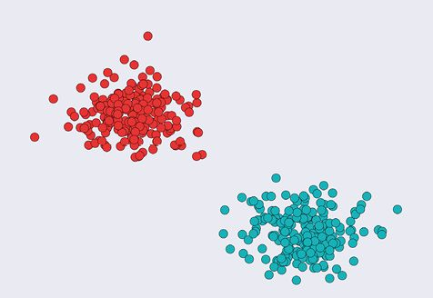

> **圖片描述：** 此圖為圖13.35，一組用於訓練樸素貝葉斯的二維資料，其中有兩個類別

圖13.35　一組用於訓練樸素貝葉斯的二維資料，其中有兩個類別

我們將這組資料傳遞給樸素貝葉斯分類器時，假設每組資料都來自高斯分佈。也就是說，它假設紅色點的*x*座標值遵循高斯分佈，紅色點的*y*座標值也遵循高斯分佈。對於藍色點也有同樣的假設。然後它試著對資料做最好的4個高斯擬合，構建兩個二維的“山峰”，結果如圖13.36所示。

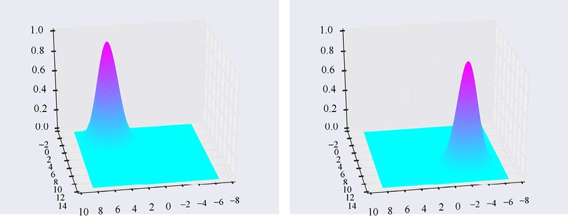

> **圖片描述：** 此圖為圖13.36，樸素貝葉斯分類器對每個類別的*x*和*y*特徵進行高斯擬合。(a)紅色類別的高斯分佈；(b)藍色類別的高斯分佈

(a)　　　　　　　　　　　　　　　　　　　　　　　　　　　　　　　　　　　　　　　　　　　　　　　　　　　　　　　　(b)

圖13.36　樸素貝葉斯分類器對每個類別的*x*和*y*特徵進行高斯擬合。(a)紅色類別的高斯分佈；(b)藍色類別的高斯分佈

如果我們將高斯分佈的結果和資料點重疊在一起，從上往下俯視，結果如圖13.37所示。可以看到，它們非常匹配。這不奇怪，因為原始資料本身就是完全按照樸素貝葉斯分類器預期的那樣生成的。

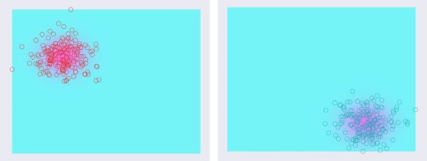

> **圖片描述：** 此圖為圖13.37，整個訓練集與圖13.36中的高斯分佈圖重疊的結果。樸素貝葉斯分類器得到的結果與資料點原先的分佈完美匹配

(a)　　　　　　　　　　　　　　　　　　　　　　　　　　　　　　　　　　　　　(b)

圖13.37　整個訓練集與圖13.36中的高斯分佈圖重疊的結果。樸素貝葉斯分類器得到的結果與資料點原先的分佈完美匹配

要知道分類器在實際應用中的效果，讓我們將訓練資料進行分離，將70%的資料點放入訓練集，剩下的放入測試集。我們將用這個新的訓練集進行訓練，然後再畫出測試集與高斯分佈圖重疊的結果，如圖13.38所示。

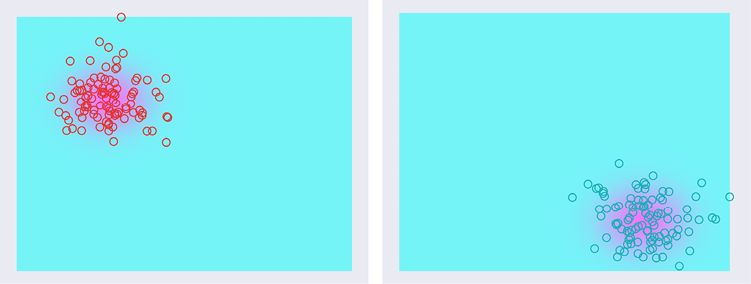

> **圖片描述：** 此圖為圖13.38，用70%的原始資料進行訓練之後的資料測試，預測結果非常好

(a)　　　　　　　　　　　　　　　　　　　　　　　　　　　　　　　　　　　　　　　　　　 (b)

圖13.38　用70%的原始資料進行訓練之後的資料測試，預測結果非常好

在圖13.38中，我們將所有被分類至第一個類別的點畫在左邊，所有被分類至第二個類別的點畫在右邊，維持原有的顏色。可以看到，所有測試樣本被正確地分類了。

現在我們再試一下不是所有樣本的特徵都滿足高斯分佈這個先驗的資料集。圖13.39所示是新的原始資料，它是兩個有噪聲的半月圖形。

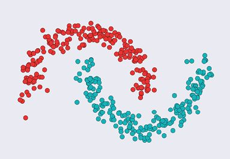

> **圖片描述：** 此圖為圖13.39，一些有噪聲的半月資料點。紅色和藍色的資料點不遵循高斯分佈，所以我們預計樸素貝葉斯分類的效果會很差

圖13.39　一些有噪聲的半月資料點。紅色和藍色的資料點不遵循高斯分佈，所以我們預計樸素貝葉斯分類的效果會很差

在將這些資料傳遞給樸素貝葉斯分類器時，它依舊假設紅色點的*x*值、紅色點的*y*值、藍色點的*x*值和藍色點的*y*值都遵循高斯分佈。它竭盡所能地找到了最匹配的高斯分佈，如圖13.40所示。

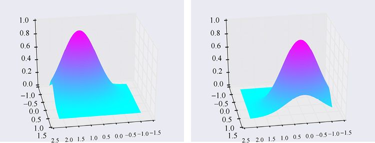

> **圖片描述：** 此圖為第13章圖13.40，當我們基於高斯分佈的樸素貝葉斯分類器試圖匹配圖13.39中的半月資料點時，它假設所有數值都遵循高斯分佈，因為它永遠用這個...

(a)　　　　　　　　　　　　　　　　　　　　　　　　　　　　　　　　　　　　　　　 (b)

圖13.40　當我們基於高斯分佈的樸素貝葉斯分類器試圖匹配圖13.39中的半月資料點時，它假設所有數值都遵循高斯分佈，因為它永遠用這個條件作為先驗。這是它能找到的最匹配資料的高斯分佈

當然，這些並不能很好地與資料相匹配，因為原始資料並不滿足假設。將資料與高斯分佈圖重疊在一起，我們可以看到匹配得並不好，與有些點還離得很遠，如圖13.41所示。

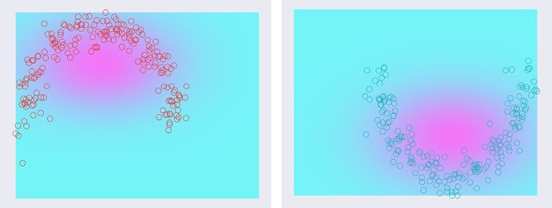

> **圖片描述：** 此圖為圖13.41，圖13.39中的訓練集與圖13.40中的高斯分佈圖重疊的結果

(a)　　　　　　　　　　　　　　　　　　　　　　　　　　　　　　　　　　　　　　　(b)

圖13.41　圖13.39中的訓練集與圖13.40中的高斯分佈圖重疊的結果

像之前一樣，我們將半月資料集分成訓練集和測試集，70%是訓練集，30%是測試集。在圖13.42a中，我們可以看到所有被分類至紅色類別的點。正如所預期的那樣，這裡大部分點是紅色點，但忽略了一部分紅色的點，且有一部分藍色的點摻雜了進去，因為它們從第一個高斯分佈得到的數值比第二個高。在圖13.42b中，我們可以看到大部分藍色點被分類到了藍色類別，但有一些紅色點摻雜了進去。

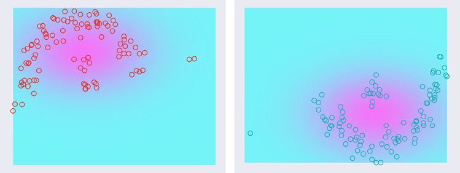

> **圖片描述：** 此圖為第13章圖13.42，在用有噪聲的半月資料的子集訓練之後，這些是測試集的分類結果。(a)大部分紅色點都被分到了紅色類別，但有一些紅色點遺漏了出...

(a)　　　　　　　　　　　　　　　　　　　　　　　　　　　　　　　　　　　　　　　 (b)

圖13.42　在用有噪聲的半月資料的子集訓練之後，這些是測試集的分類結果。(a)大部分紅色點都被分到了紅色類別，但有一些紅色點遺漏了出去，也有一些藍色點被錯誤地分到了紅色類別；(b)大部分藍色點都被分到了藍色類別，但有一些藍色點遺漏了出去，也有一些紅色點被錯誤地分到了藍色類別

我們不應該對這些錯誤分類感到太驚訝，因為資料並沒有滿足樸素貝葉斯先驗的假設。

令人驚訝的點在於它的效果有多好。一般來說，樸素貝葉斯分類器對所有資料來說都能達到一個不錯的分類效果。這可能是因為很多現實世界的資料都能用高斯分佈很好地描述。

因為樸素貝葉斯速度很快，一般在我們最開始試圖找到資料的分佈時，都會用它作為分類器。如果它的分類效果很好，那麼我們可能就不需要用更復雜的演算法了。

## 13.7　討論

我們已經學習了4種普遍的分類演算法。大多數機器學習庫會提供這些演算法，也會提供一些其他的演算法。

如果只想探索資料，那麼嘗試一些看起來能夠使我們對資料的分佈產生更深理解的演算法是十分可取的。

讓我們簡單地看一下4種分類器的優缺點。

一方面，*k*NN演算法很靈活。它不會很明確地劃分邊界線，所以它能夠處理任何種類的複雜資料。*k*NN演算法的訓練速度很快，因為它只需要保存每一個訓練樣本。另一方面，*k*NN演算法的預測過程很慢，因為它需要對每一個想要分類的樣本都找到距離最近的樣本（雖然有很多有效的方法能夠加速這種搜索，但它依舊很花時間）。而且演算法也會佔用大量空間，因為它保存了每個訓練樣本。如果訓練集的大小大於可用空間，那麼操作系統就會需要虛擬記憶體來保存樣本，這樣演算法的速度可能會進一步下降。

支援向量機（SVM）的訓練過程比*k*NN演算法要慢，但是在預測時，它的速度要快很多。一旦訓練完成，它就不需要很多空間，因為它只需要保存邊界。它也可以用內核技巧來找到比直線更復雜的分類邊界（或者平面，甚至更高維度的平面）。此外，SVM的訓練時間隨著訓練集規模的增長而增長。結果對於參數*C*很敏感，該參數表明了有多少樣本被允許出現在邊界周圍。我們可以用交叉驗證法來嘗試不同*C*的數值，並挑選一個效果最好的，但因為SVM的訓練速度太慢，這個過程可能需要耗費很長時間。

決策樹的訓練速度很快，在分類時的預測速度也很快。雖然需要使決策樹的深度很深，但它可以處理類別之間很奇怪的邊界。它也有很大的缺點，即過擬合會很嚴重。決策樹在實踐中具有很大的吸引力，因為我們可以用合理的方式解釋其分類的結果。其他的那些基於數學理論的分類演算法很難分享給那些只想知道分類結果的人。決策樹具有條理清晰的優勢：所得到的分類結果源自一系列決策，我們可以很清楚地闡明這些決策。有時，當決策樹的結果比其他分類器的結果要差時，人們也會使用決策樹進行分類，因為決策樹的結果對於人類而言更易於理解。

樸素貝葉斯分類器的訓練和預測速度都很快，也不難解釋結果（雖然它們相對於決策樹和*k*NN演算法而言有些抽象）。這種方法沒有需要調整的參數，這也意味著我們不需要用交叉驗證來進行深度搜索，就像SVM的參數*C*一樣。如果我們在處理的類別分隔得很好，那麼樸素貝葉斯分類器通常能得到很好的結果。這個演算法在資料有很多特徵時效果特別好，因為在高維度空間中，樣本一般分隔得很遠，也就能體現樸素貝葉斯分類器對於分隔很好的資料的分類優勢[VanderPlas16]。

在實際應用中，我們常常會先嚐試樸素貝葉斯分類器，因為它訓練和預測得都很快，所以它能給我們一個對資料結構的大致感覺。如果預測結果很差，我們就可以嘗試用其他分類器。

我們在之後學習的深度神經網路也可以進行分類。不論怎樣，我們在這裡學到的演算法常用於日常生活中，因為它們很好理解，我們也能夠理解（雖然有時候可能要花些精力）為什麼它們能得到這些結果。

## 參考資料

[Bishop06]　Christopher M. Bishop, *Pattern Recognition and Machine Learning*, Springer, 2006.

[Raschka15]　Sebastian Raschka, *Python Machine Learning*, Packt Publishing, 2015.

[Steinwart08]　Ingo Steinwart and Andreas Christmann, *Support Vector Machines*, Springer, 2008.

[VanderPlas16]　Jake VanderPlas, *Python Data Science Handbook*, O’Reilly, 2016.

### 讀者服務：

> **圖片描述：** 一個 QR Code（二維條碼），中央有綠色的書籍圖示標誌，掃描後可連結到相關線上資源。

微信掃碼關注【異步社區】微信公眾號，回覆“e55451”獲取本書配套資源以及異步社區15天VIP會員卡，近千本電子書免費暢讀。
