# 第14章　集成演算法

單獨一個學習器常常不夠完美，有時候也會給我們錯誤的結果。然而將很多學習器結合起來，就可以超出預期的效果。

## 14.1　為什麼這一章出現在這裡

任何人都可能犯錯誤，其中也包括學習演算法。有時我們可能非常確定演算法給了我們很好的答案，但由於種種原因，我們可能同時也會有一點點懷疑。在這種情況下，我們可以通過多個學習器運行資料，每個學習器都訓練一點，並讓它們“投票”決定最後的結果。

這不是一個新想法。20世紀60年代的阿波羅號太空船的控制艙載有一臺電腦，它繞著月球轉動。登月艙裡則有另一臺電腦，它在月球上登陸。兩個飛行器中都沒有備用電腦。這些電腦中的每一臺都是用集成電路製成的，當時相對較新。為了預防由這種新技術導致的故障，每塊電路板重複複製了兩次，共生成3份。所有3個系統總是同步運行，這是一種稱為“三模冗餘”的技術。每個模組的輸出由多數投票決定[Ceruzzi15]。

在機器學習中，學習器的組合稱為**集成方法**（ensembles）。就像阿波羅號太空船上的電腦那樣，通常的想法是，如果我們可以從獨立演算法得到多個預測，那麼最常見的預測比較可能是正確的那個。

集成演算法有時可以很大地提高效率。在某些情況下，我們可以從許多小而快的學習器中構建一個集成演算法，並獲得與更龐大、更復雜的學習器效果同樣好的結果，同時所用的時間更短。

## 14.2　集成方法

無論工作是由人還是電腦完成，做出決策都很困難。在人類社會中，我們一般通過彙總許多人的意見來彌補個人決策中的不完善，旨在可以聽取眾多個體的意見，以避免由個人產生的錯誤判斷。

雖然這樣並不一定能保證得到好的決策，但確實能幫助我們避免一些因個人的偏見而導致的問題。

在用學習演算法來做出決策時，預測是基於所訓練的資料進行的。如果該資料包含偏置、遺漏、過度陳述或任何其他類型的系統性錯誤，這些錯誤也將被學習器所包含。如果我們用有某個傾向的資料來訓練一個學習器，那麼訓練出來的結果也會有這個傾向。

這對現實世界產生了深遠的影響。當我們使用機器學習評估家庭或企業的貸款、確定大學是否錄取某人或預先篩選求職者時，任何訓練資料的不公平或偏置都會導致系統做出類似的不公平和帶有偏見的決定。即使是善意的偏見，也會影響結果。

避免這個問題的一種方法是使用來源不同的不同訓練集訓練多個學習器。當然，任何存在於所有訓練集中系統的偏置仍將影響結果，但如果所用的訓練集能真正代表我們所尋求的決定的類型，就有可能避免輸出的意外傾向。

在這些不同的資料集上訓練一大批學習器時，我們通常會要求每個學習器評估每個新的輸入，然後讓學習器投票決定最終結果。

這種方法在運行模擬自然現象的複雜模型的科學家中很受歡迎，如天氣、氣候或太陽系的形成模型。設計和運行任何一項任務時的關鍵是意識到不同的分析模型各自內建的假設，以及這些假設如何影響其結果。通過結合大量的模擬，每個模擬建立在有著不同假設的不同模型上，我們希望這些偏置會相互抵消，使最正確的結果出現。這就是為什麼許多氣候預測是多個獨立運行的結果預測模型（有時在不同的尺度上）經彙總結果而得到的[NRC98]。天氣預報也常常來源於多次運行相同的模型，只是每次都有稍微不同的起始條件，並選擇預測出的最頻繁的結果。後一種技術稱為**集成預測**（ensemble forecasting）[Met17]。

## 14.3　投票

我們在多個學習器中得到了多個不同的結果時，需要得出一個最終的答案。

執行此操作的典型方法是使用**相對多數投票法**（plurality voting）[VotingTerms16]。簡而言之，每個學習器為其預測投了一票，並且無論預測得到什麼，得票最多的都是“贏家”（如果有兩者票數相同，則通過隨機選擇其中一個，或者重新投票）。

多數投票很容易理解，也很容易實作，通常能給出合理的結果。

但相對多數投票法也不是完美的。如果我們在真實社會中使用該方法，可能會有很大的問題，也可能會造成一些令人吃驚的或者不受歡迎的結果。

但是當考慮到多個學習器時，相對多數投票法是迄今為止最常用的確定輸出的方法，因為它簡單、快速，且通常可以產生可接受的結果。

在本章中，我們會用到**加權多數投票**（weighted plurality voting）**法**。在這種相對多數投票法的變體中，每一票都獲得一定的**權重**，也就是一個數字。假設所有選項以0分開始，並且有學習器為A類投票，權重為+4，那麼A的分數現在是4。我們也可以投下權重為負的選票，所以現在如果有學習器為A類投票，權重為−1.5，那麼A的最終得分就是2.5。在將所有選票加起來之後，擁有最大分數的類別才是贏家。

## 14.4　套袋演算法

一種流行的集成演算法類型完全是由決策樹構建的。這些決策樹的訓練和預測速度都很快，所以使用很多決策樹並不是一個很大的負擔。決策樹在分類和迴歸模型中都很受歡迎。為了具體討論這個問題，我們將重點關注多樣分類。

有兩種流行的方法可以將決策樹結合成一個較大的群體。每種方法都產生了一個決策樹集合，且它們的表現明顯優於構成它們的各個決策樹。

核心思想是構建一系列訓練時訓練集略有不同的決策樹。這意味著它們彼此相似但不完全相同。如果想預測新樣本，我們將該樣本提供給集合中的每個決策樹。我們收集所有決策樹的預測，數量最多的預測就是集合的最終輸出。

集成構造的方法稱為**套袋演算法**（bagging），這是**引導聚集演算法**（bootstrap aggregating）的簡稱。和猜測的一樣，它使用了我們在第2章中介紹的引導思想。在那裡，我們看到了如何通過引導來評估資料的質量，這些資料是從我們所感興趣的全體樣本中產生的多個子集。

從原始的訓練樣本集開始，我們通過從原始資料中使用取樣替換選擇幾項來構建多個新集（也就是bootstraps）。這意味著我們可能會不止一次地選擇相同的樣本，如圖14.1所示。記住，每個樣本都帶有類別標籤，所以我們可以用它進行訓練。

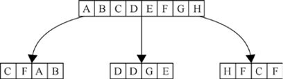

> **圖片描述：** 此圖為第14章圖14.1，從一組樣本創建多個bootstrap。頂部是一組8個樣本的集合。這些字母是為了幫助我們確定有哪些樣本，而不是標籤（假設每...

圖14.1　從一組樣本創建多個bootstrap。頂部是一組8個樣本的集合。這些字母是為了幫助我們確定有哪些樣本，而不是標籤（假設每個樣本都有一個相關的標籤，我們沒有在這裡明確顯示）。通過從中提取樣本設置，我們可以製作許多新的包含4個樣本的集合。這是套袋演算法的第一步。由於我們正在替換取樣，因此任何替代品給定的樣本都可能會出現多次

我們為每個bootstrap創建一個決策樹，然後用bootstrap中的樣本進行訓練。最後將這些決策樹結合起來，就構成了集成。

當訓練完成並且評估一個新樣本時，我們將它傳給所有集成中的決策樹，從每個決策樹中得到一個分類的預測。

對於迴歸問題，最終的結果是所有預測的平均值。對於分類問題，我們用相對多數投票法確定最後的結果，如圖14.2所示。

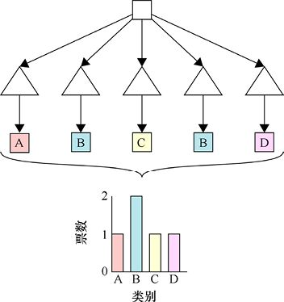

> **圖片描述：** 此圖為第14章圖14.2，一個新的資料（頂部）被集成接收。因為它是通過套袋演算法訓練的，所以每個決策樹都不一樣。資料傳遞給每個決策樹（顯示為三角形...

圖14.2　一個新的資料（頂部）被集成接收。因為它是通過套袋演算法訓練的，所以每個決策樹都不一樣。資料傳遞給每個決策樹（顯示為三角形），每個決策樹產生一個預測類別（A、B、C或D）。我們通過相對多數投票法對那些類別（第4行）進行投票，其中最受歡迎的類別是B，因此該類別獲勝並且成為該集成的輸出

我們只需要指定兩個參數來運行該演算法。第一個是選擇每次bootstrap應使用多少樣本。第二個是選擇建立多少棵決策樹。

分析顯示，增加一個分類器會使得系統有更好的預測結果，但經過一段時間，更多的分類器會使得系統變慢且效果變好的趨勢不再那麼明顯。這稱為**集合構造中的收益遞減規律**。一個不錯的經驗之法是使用與資料類別相同數量的分類器[Bonab16]，雖然我們也可以使用交叉驗證來搜索對於任何給定資料集的最佳決策樹的數量。

## 14.5　隨機森林

我們可以改進套袋演算法並構建更好的決策樹集成。秘訣在於改變我們在訓練期間構建決策樹的方式。

如第13章中所述，當需要將一個決策樹的節點分割成兩個時，我們可以選擇任意特徵（或一組特徵）來創建測試，並將元素引至對應的子節點。如果我們堅持僅在一個特徵上進行分割，問題就變成了如何選擇我們想要使用的特徵以及該特徵的檢測值大小。我們可以使用在第13章中看到的測量方法來比較不同的特徵選擇和不同的分叉點，例如資訊增益量或基尼雜質係數。

讓我們從導致我們使用上述bootstrapping和套袋演算法的相同觀點來看待這個過程。這將為我們提供從一個決策樹到下一個決策樹的另一個層次的變化，幫助我們在投票決定分配給新樣本的最佳類別時獲得更多不同的意見。

在每個節點上，當需要找到一個分割測試時，我們通常會查看所有特徵，以確定哪一個是最好的分割。但是，與其查看所有特徵，不如只考慮其中的一些隨機子集，我們將不加替換地選擇這些子集。我們甚至不考慮基於我們所忽略的特徵的分割。

之後，分割另一個節點時，我們再次選擇一個全新的特徵子集，並再次僅使用這些來決定新的分割。這種技術稱為**特徵**bagging（feature bagging），如圖14.3所示。

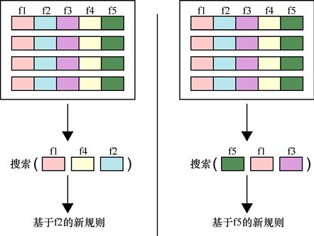

> **圖片描述：** 此圖為第14章圖14.3，用特徵bagging來確定分割節點時要使用的特徵。(a)頂部是4個樣本，每個樣本有5個特徵。中間一行顯示隨機選擇的3個特...

(a)　　　　　　　　　　　　　　　　　　　　　　　　　　　(b)

圖14.3　用特徵bagging來確定分割節點時要使用的特徵。(a)頂部是4個樣本，每個樣本有5個特徵。中間一行顯示隨機選擇的3個特徵，我們搜索這3個特徵中最好的一個以確定如何分割此節點，最好的選擇是f2；(b)在另一個節點上的相同進程。在這裡，我們隨機選擇另一組的3個特徵，並搜索最適合分割的特徵

在以這種方式構建集合時，我們將結果稱為**隨機森林**（random forest）。其中“隨機”一詞是指我們隨機選擇的每個節點的特徵，“森林”一詞指的是決策樹的結果集合。

要構建隨機森林，我們需要提供與套袋演算法相同的兩個參數：對每次bootstrap提取的隨機選擇樣本的大小，以及要構建的決策樹的數量。我們還必須指定在每個節點有多少比例的特徵需要被考慮。這通常以百分比表示，但不同的庫會提供許多不同的數學公式來決定這個量的值。

## 14.6　極端隨機樹

我們可以在決策集成過程中添加一個隨機步驟。

在正常分割節點時，我們會考慮它包含的每個特徵（如果我們正在構建一個隨機森林，則是它們的隨機子集），並找到最能將樣本拆分的特徵值節點來分成兩個子節點。正如我們提到的，可以使用計算資訊增益等措施評估哪個值是“最好的”。

但現在，我們不為每個特徵分配最佳分割節點，而是根據所在的值隨機選擇分割節點。

這種變化產生的結果稱為**極端隨機樹**（extratrees）。

雖然看起來這似乎註定會給我們帶來那棵決策樹裡更糟糕的結果，但我們應該記得，決策樹很容易過擬合。這個隨機選擇分割點的過程讓我們犧牲了一點準確率而減少了過擬合的程度。

## 14.7　增強演算法

現在讓我們來看一種稱為**增強演算法**（boosting）的技術。這種技術不僅適用於決策樹，而且適用於任何一種學習系統[Schapire12]。我們將針對二元分類器討論增強演算法，也就是將輸入分類為兩個類別中的一個的分類器。

增強演算法讓我們將很多小而快但準確率不是很高的學習器結合成一個單獨的、更準確的學習器。

假設資料只包含兩個類別的樣本。一個完全隨機的二元分類器會隨機給每個樣本進行分類，所以如果訓練集中的樣本是平均分配的，那麼我們就有50%的機率能正確地為一個樣本分類。我們將這個稱為**隨機標記**（random labeling）。

如果一個二元分類器的表現比隨機分類器稍微好一點呢？也許它只有一個很不明晰的邊界。圖14.4展示了一組有兩個類別的資料，一個二元分類器和隨機分類器沒什麼區別，另一個二元分類器的效果比隨機分類器效果好一點點。

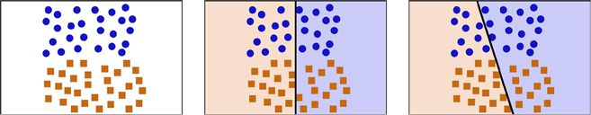

> **圖片描述：** 此圖為第14章圖14.4，幾個效果很差的二元分類器。(a)訓練資料。最佳的分類依據應該是一條穿過中間的水平直線；(b)一個很差的二元分類器，它的效...

(a)　　　　　　　　　　　　　　　　　　　　　　　(b)　　　　　　　　　　　　　　　　　　　　　　　　(c)

圖14.4　幾個效果很差的二元分類器。(a)訓練資料。最佳的分類依據應該是一條穿過中間的水平直線；(b)一個很差的二元分類器，它的效果不比隨機分類器好；(c)一個效果比隨機分類器好一點點的二元分類器，但還是一個很差的二元分類器，因為邊界稍微向正確邊界傾斜了一點，所以它比圖(b)中的分類器效果好一點點

圖14.4b中分類器的效果不比隨機分類器好，因為其中僅有一半的樣本被正確分類。這是一個毫無用處的分類器。圖14.4c中的分類器僅比圖14.4b中的分類器要好一點點，因為邊界的略微傾斜意味著它會比隨機分類器能正確分類稍微多一點樣本。

我們將圖14.4c中的分類器稱為**弱學習器**（weak learner）。在這種情況下，一個弱學習器是任意一個僅有一點點準確率的學習器。換句話說，它只需要比隨機分類器的效果好一點點。

即使它的分類結果比隨機分類器的**效果更差**，弱學習器對我們來說同樣有用。那是因為我們只有兩個類別。所以有一個分類器效果比隨機分類器更差（也就是說，它錯誤分類的頻率比正確分類更高），這樣我們可以交換兩個輸出的類別，結果就會比隨機分類器要好。

與弱學習器相比，**強學習器**（strong learner）是一個很好的分類器，大多數時候都能獲得正確的分類。學習器越強，它得到正確分類的機率越高。

弱學習器通常很容易找到，最常用的弱分類器是隻有一個測試深度的決策樹。也就是說，整棵樹只包含一個根節點及其兩個子節點。這個荒謬的小決策樹經常被稱為**決策樹樁**（decision stump）。但因為它幾乎總是做得比為每個樣本隨機分配一個類更好，所以成了一個很好的弱分類器的例子。它比較小、快，而且比隨機分類器效果好一點。

增強演算法背後的想法是將多個弱分類器組合成一個強分類器。注意，這裡不是必須使用弱分類器。如果我們願意，也可以將很多強分類器組合起來。弱分類器比較常見，且它們的速度通常更快。

讓我們通過一個例子來看看增強演算法是如何工作的。

圖14.5所示的是一組有兩個類別的資料集。什麼樣的分類器能較好地分類這些資料？一個快速且容易理解的分類器是一個單一的感知器，對此我們在第10章中討論過。它會在此二維資料集中繪製一條直線。如果我們可以在樣本中畫一條直線，那麼這個二維樣本集就是**線性可分**（linearly separable）的。可以看到，沒有一條直線能夠完美地分割這些資料，圓形樣本中間包含著幾個正方形樣本。

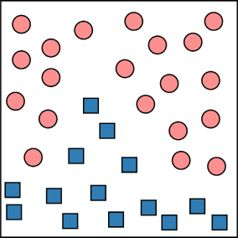

> **圖片描述：** 此圖為圖14.5，用增強演算法來分類的一組樣本

圖14.5　用增強演算法來分類的一組樣本

即使沒有一條直線可以分割這些資料，多條直線卻可以，只要讓我們使用直線作為弱分類器。記住，這些分類器不需要在整個資料集上有特別好的效果，它們只需要比隨機分類器做得好一些。圖14.6展示了一條這樣的線，我們稱之為A。直線A由箭頭指向的一側的資料都會被分類為正方形，另一側的資料都會被分類為圓形。這條直線很好地將左上方的圓形樣本和剩下的樣本分割，但會錯誤分類一些左下方的正方形樣本。

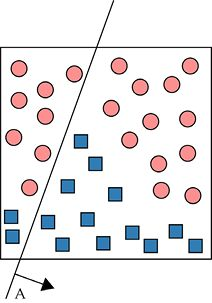

> **圖片描述：** 此圖為第14章圖14.6，在樣本中放置一條直線A來將兩個類別分割開來。箭頭指向直線的“正”側，我們將這一側的點分類為正方形。然而，兩側都有一些被錯...

圖14.6　在樣本中放置一條直線A來將兩個類別分割開來。箭頭指向直線的“正”側，我們將這一側的點分類為正方形。然而，兩側都有一些被錯誤分類的樣本

使用增強演算法，我們就可以添加幾條直線（即增加一些弱分類器），使得每個由直線劃分的區域都包含一個單獨類別的資料。在添加了兩個這樣的直線分類器之後，我們可能得到圖14.7所示的結果。

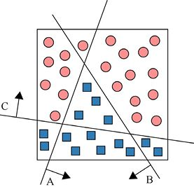

> **圖片描述：** 此圖為圖14.7，在圖14.6中又增加了兩條直線。現在每個由直線構成的區域都只包含一個類別的資料

圖14.7　在圖14.6中又增加了兩條直線。現在每個由直線構成的區域都只包含一個類別的資料

雖然圖14.7中只有3條直線（或者說3個分類器），但它們創造了7個沒有重疊的區域。其中有3個區域只包含圓形樣本，另外的4個只包含正方形樣本。

A、B、C中的每條直線都是一個弱分類器，它們中的任意一個都只能得到與完美結果相差甚遠的結果。現在將它們結合起來，我們就可以得到效果更好的分類器。

為了使討論變得更簡單，我們用直線的名字來命名這3個分類器，也就是A、B和C。圖14.7的7個區域中的每一個都是在某條或某幾條直線的“正”側。我們也會簡化圖像，使得它是對稱的，因為我們現在關注的是如何結合這些區域而不是它們的具體形狀。結果如圖14.8所示。

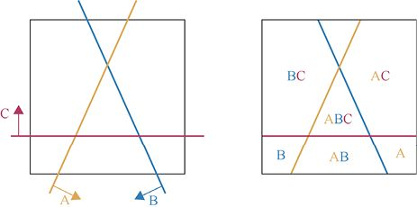

> **圖片描述：** 此圖為第14章圖14.8，(a)有3條標記為A、B和C的直線。(b)每個區域都用對應學習器標記了出來，區域中學習器的名字指的是該區域位於該學習器對...

(a)　　　　　　　　　　　　　　　　　　　　　　　　　 (b)

圖14.8　(a)有3條標記為A、B和C的直線。(b)每個區域都用對應學習器標記了出來，區域中學習器的名字指的是該區域位於該學習器對應直線的正側

相較於使每一個學習器都返回一個類別（圓形或者正方形），我們將返回一個與該學習器相關聯的數值。這樣，如果一個樣本在學習器的直線的正側，學習器就返回它對應的數值，反之則返回0。

那麼我們最後會用什麼數值呢？為了展示過程，我們會為3個分類器都指定1作為數值。接下來我們會看到這些數值會自動被演算法所決定。

綜上所述，規則如下：如果一個樣本在一個學習器的直線的正側（也就是，圖14.8中箭頭所示方向的一側），那麼學習器就會返回1；反之，則返回0。

讓我們看看最頂部的區域，也就是圖14.8中標記為C的區域。它在學習器C的直線的正側，因此得1分。但因為它在A和B的直線的負側，所以這兩個分類器都沒有為該區域增加得分，所以該區域的總分為1分。最底部的區域，也就是標記為AB的區域，從分類器A和B上各得到1分，所以總分為2分。這7個區域對應的得分如圖14.9所示。

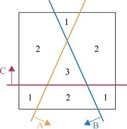

> **圖片描述：** 此圖為圖14.9，7個區域各自對應的得分。圖14.8中的每個字母為各自的區域得1分

圖14.9　7個區域各自對應的得分。圖14.8中的每個字母為各自的區域得1分

想要將這些資訊轉化為一個有效的分類器，我們需要找到每個區域的合適的權重，以及分類的邊界條件。之前我們對每個分類器都指定了數值1，所以那些就是分類器在投票時所獲得的權重，但很多其他的數值也可以得到有效結果。在圖14.10中，我們展示了受每個學習器數值所影響的區域。深色的區域得到了該學習器的數值，而淺色的區域沒有得到數值（即該學習器給該區域增添的得分為0）。這裡我們將為A、B、C分別使用1.0、1.5、−2的權重。

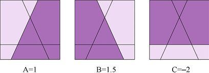

> **圖片描述：** 此圖為圖14.10，我們為被每個學習器分類為正的區域指定一個數值。每張圖中深色區域得到了對應的學習器的權重

圖14.10　我們為被每個學習器分類為正的區域指定一個數值。每張圖中深色區域得到了對應的學習器的權重

這些得分之和如圖14.11所示，可以看到，我們正確分類了資料！

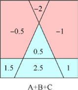

> **圖片描述：** 此圖為圖14.11，將圖14.10中的分數累加起來。得分為正的區域也就是我們想從圖14.7中得到的結果

圖14.11　將圖14.10中的分數累加起來。得分為正的區域也就是我們想從圖14.7中得到的結果

讓我們再來看看另一個例子，即圖14.12所示的這一組新的資料。

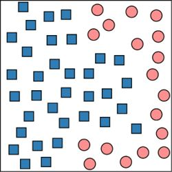

> **圖片描述：** 此圖為圖14.12，一組我們想要用增強演算法分類的資料

圖14.12　一組我們想要用增強演算法分類的資料

對於這組資料，我們用4個學習器。圖14.13所示的是增強演算法找到的4個用來分類的弱學習器。

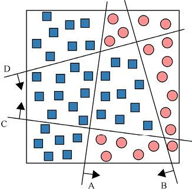

> **圖片描述：** 此圖為圖14.13，4條能用來對圖14.12中的資料進行分類的直線

圖14.13　4條能用來對圖14.12中的資料進行分類的直線

像之前一樣，我們手動地為每個學習器分配一個權重。這次我們為A、B、C和D分配的權重分別是−8、2、3和4。如圖14.14所示，淺色區域的權重為0，深色區域則代表了各個分類器的權重。我們關注的是如何結合這些區域而不是它們特定的形狀，因此會再次將圖像簡化。

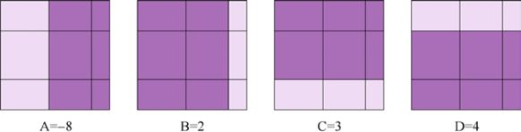

> **圖片描述：** 此圖為圖14.14，每個學習器所對應的區域

圖14.14　每個學習器所對應的區域

圖14.15所示的是每個區域的總分。我們找到了一種將4個分類器結合起來的方法，這種方法能正確將圖14.13中的資料進行分類。

增強演算法的美妙之處在於它將簡單但錯誤率高的分類器結合成了一個強分類器。它甚至能找到要用的弱分類器以及它們在投票時所擁有的權重。

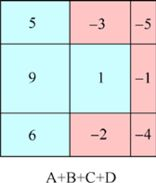

> **圖片描述：** 此圖為圖14.15，圖14.14中每個區域的總分。得分為正的區域用藍色表示，它們將圖14.13中的資料進行了正確的分類

圖14.15　圖14.14中每個區域的總分。得分為正的區域用藍色表示，它們將圖14.13中的資料進行了正確的分類

我們唯一要考慮的就是想要多少個分類器。對於增強演算法以及其他了解過的集成演算法來說，一條黃金準則就是開始時使用與類別數量相同的分類器[Bonab16]。這意味著我們之前的例子用了過多的分類器。我們分別用了3個和4個分類器，但資料只有兩個類別。但是在機器學習中有很多東西，它們最佳的數值都是經過反覆試錯而得到的，通常使用交叉驗證評估每種可能性。

增強演算法在一個稱為Adaboost的演算法中作為演算法的一部分第一次出現[Freund97] [Schapire13]。雖然它可以適用於很多學習演算法，但增強演算法一般都用於決策樹。

事實上，它對於之前提到的決策樹樁而言效果非常好（這些決策樹只有一個根節點和它對應的子節點）。這種分類器是很糟糕的分類器，但它們比隨機分類器的效果要好，而這個條件也是所有我們需要的條件。事實上，之前例子中的直線都可以用決策樹樁的形式來表示，所以我們已經知道了它們可以適用於不同的訓練集。

增強演算法所生成的每個弱學習器也經常稱為一個**假設**。主要是弱學習器體現了一種猜想或假設，例如“所有A類別的樣本處於這條線的正側”。我們有時會說增強演算法幫助我們將弱猜想變為強猜想。

值得注意的是，增強演算法並不一定能改善所有分類演算法的表現。增強演算法理論僅涵蓋二元分類器（如上面的例子）[Fumera08][Kak16]。這也是它在決策樹中極受歡迎和能夠如此成功的部分原因。

## 參考資料

[Bonab16]　R Bonab Hamed, Can, Fazli (2016). *A Theoretical Framework on the Ideal Number of Classifers for Online Ensembles in Data Streams*. Conference on Information and Knowledge Management (CIKM), 2016.

[Ceruzzi15]　Paul Ceruzzi, *Apollo Guidance Computer and the First Silicon Chips*, Smithsonian National Air and Space Museum, Space History Department, 2015.

[Freund97]　Y Freund and R E Schapire, *A Decision-theoretic Generalization of On-line Learning and an Application to Boosting*, Journal of Computer and System Sciences, 55 (1), pp. 119–139. 1997.

[Fumera08]　Giorgio Fumera, Roli Fabio, Serrau Alessandra, *A Theoretical Analysis of Bagging as a Linear Combination of Classifers*, IEEE Transactions on Pattern Analysis and Machine Intelligence, Vol. 30, Number 7, pp. 1293-9. 2008.

[Kak16]　Avinash Kak, *Decision Trees： How to Construct Them and How to Use Them for Classifying New Data*, Purdue University, 2016.

[Met17]　United Kingdom Met Ofce, *What is an ensemble forecast?*, Met Ofce Research, Weather science blog, 2017.

[NRC98]　National Research Council, *The Atmospheric Sciences：Entering the Twenty-First Century*, The National Academies Press, 1998.

[Schapire12]　Robert E Schapire, Yoav Freund, *Boosting Foundations and Algorithms*, MIT Press, 2012.

[Schapire13]　Robert E Schapire, *Explaining Adaboost*, in *Empirical Inference: Festschrift in Honor of Vladimir N.Vapnik*, Springer-Verlag, 2013.

[VotingTerms16]　RangeVoting. org, *Glossary of Voting-Related Terms*, 2016.

### 讀者服務：

> **圖片描述：** 一個 QR Code（二維條碼），中央有綠色的書籍圖示標誌，掃描後可連結到相關線上資源。

微信掃碼關注【異步社區】微信公眾號，回覆“e55451”獲取本書配套資源以及異步社區15天VIP會員卡，近千本電子書免費暢讀。
