# 第15章　scikit-learn


scikit-learn學習庫是一個免費的開源項目，提供機器學習的工具和演算法。我們將介紹它的一些最重要和有用的部分。


## 15.1　為什麼這一章出現在這裡


機器學習是一個實用的領域。雖然這本書的重點是概念，但沒有什麼比把東西付諸實踐，把想法轉化為自己的理解更令人心動了。


實作一個想法時，我們將面臨那些平時自己可能不太重視的決定，並可以揭示我們的知識體系裡錯誤的理解和漏洞。在像機器學習這樣的領域裡，有許多知識仍是未知的，需要我們基於直覺和在以前的錯誤中所學到的知識做出決定，這樣經驗就顯得更加寶貴。


我們如何獲得這種經驗？一種由來已久的方法是從頭開始編寫程式碼，然後使用該程式碼構建和運行機器學習系統。編寫我們自己的程式碼是有趣的和引人深省的，並且給人以成就感。但這樣卻有很大的工作量。當涉及大的演算法時，工作量可以大到超乎想象，而其中大部分是關於編寫好程式的內容，而不是關於機器學習的。


然而，我們可以在現有的庫中使用例程。各種語言和系統都免費提供了大量的可用的庫。這些庫函數通常是由專家設計，經過數以千計的用戶的壓力測試，然後經過多年迭代、調試和最佳化過的。


如果從頭編寫底層的程式碼很吸引你，那麼可以參考關於這方面的諸多資料[Müller-Guido16] [Raschka15][VanderPlas16]。在本書中，我們採用了使用現有庫的路徑。我們仍然需要面對各種各樣的決策，但應迴避低級編程細節。雖然這些細節必不可少，但也可能會分散我們的注意力。


在本章中，我們用一種流行的基於Python的機器學習工具包（稱為scikit-learn，發音為“sy′-kit-lern”）將想法付諸實踐。之所以使用scikit-learn，是因為它被廣泛使用，支援良好，擁有完善的技術文檔，穩定、開源且快速。


為了讓不熱衷於Python的人也可以使用本書，我們會盡量少用scikit-learn。在第23章和第24章中，我們用scikit-learn與另一個開源庫來構建深層學習系統。本書中的其他內容都不依賴於對此庫或Python的熟悉程度。


即使你對scikit-learn沒有興趣，至少應該略讀本章的內容，這有助於你理解一些我們一直在討論的想法。


我們將使用scikit-learn版本0.19（發佈於2017年8月[scikit-learn17e]）。之後發佈的版本基本會兼容我們將使用的程式碼。下載和安裝庫在大多數系統上通常是容易的。詳細說明請參閱庫主頁上的下載說明[scikit-learn17f]。


使用Python的一種令人愉快的方式是使用Python解釋器進行交互式工作。免費的Jupyter系統為在任何主要瀏覽器內運行的解釋型Python提供了一個簡單而靈活的界面[Jupyter17]。包含本章所有程式運行版本的Jupyter筆記本可以在GitHub上免費下載。


## 15.2　介紹


Python庫的scikit-learn是一個免費的通用機器學習演算法庫。


要很好地使用它，需要熟悉Python語言和NumPy。NumPy（發音為“num'-pie”）是一個Python庫，專門使用數字資料進行操作和計算。這種依賴關係的嵌套如圖15.1所示。


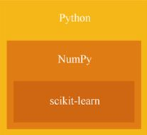

> **圖片描述：** 此圖為圖15.1，scikit-learn使用數值計算庫NumPy中的例程，而NumPy依賴於Python


圖15.1　scikit-learn使用數值計算庫NumPy中的例程，而NumPy依賴於Python


Python中還有其他一些科學“工具包”，每個都稱為“scikit-something”。例如，scikit-image是一種流行的圖像處理系統。這些工具包是由開發人員製作和維護的免費開源項目——他們主要在業餘時間致力於這些工作。另一個廣泛使用的庫名為SciPy（發音為“sie'-pie”），它為科學和工程工作提供了豐富的例程。


深入瞭解Python、NumPy或scikit-learn，不是一個下午就能搞定的。這些實體都很大，並且有很多例程可供選擇。在任何一個庫上花一個週末，就可以讓你有一個良好的開端。


如果你對這些主題都不熟悉，可以閱讀“參考資料”部分給出的一些入門資源。如果你看到一個似乎不熟悉的術語或例程，那麼可以在互聯網上搜索這些主題的文檔。在本章中，我們的重點是scikit-learn，因此我們假設你對Python和NumPy足夠熟悉，至少可以跟得上本章的進度。


雖然本章主要關注scikit-learn，但是不會深入到庫函數。像其他軟體一樣，scikit-learn有自己的約定、預設值、假設、限制、快捷方式、最佳實踐、常見陷阱、容易出錯的地方等。此外，庫中的每個例程都有自己的特定細節，這些細節對於獲得最佳結果非常重要。相關內容參見另一本書[Müller-Guido16]。


本章的目標是給出庫的意義以及它的使用方式。關於任何常規或技術上的細節，請查閱在線文檔、參考書，或者一些有用的網頁和博客帖子。


## 15.3　Python 約定


scikit-learn很重要。該庫提供了大約400個例程，從小型實用程式到捆綁再到單個庫呼叫的大型機器學習演算法，這些例程在圖書館的網站[scikit-learn17b]上有詳細記載。在撰寫本書時，scikit-learn當前版本（版本號為0.19）的例程分組高達35個類別。


由於在這裡進行了非常籠統的概述，我們將使用所有類別來組織討論：**估算器**、**分群**、**變換**、**資料精化**（data refinement）、**集成**、**自動化**、**資料集**和**實用工具。**


scikit-learn的許多元素被安排成互補的，有些被設計成以特定的組合使用。稍後演示特定演算法時，我們會看到這些組合的一些示例。


scikit-learn不是針對神經網路的，雖然它是深度學習的標誌。事實上，這些工具既可用於獨立資料科學，也可用作神經網路的實用程式，幫助我們探索、理解和修改資料。許多深度學習項目是從用scikit-learn進行資料探索開始的。本章不可避免地出現清單，但我們會保持這些清單的精簡。完整的清單是學習系統細節，以及如何管理結構化資料和按正確順序呼叫正確操作等問題的重要資源，但過長的程式碼塊很難閱讀。在實際項目中，我們通常會花費大量時間和精力來處理特定程式特有的細節，但這對於我們理解一般原則並無裨益。


因此，雖然我們將構建真正的系統來完成實際工作，但是會將這些項目特定的步驟保持在最低限度。我們通常會逐步建立項目，展示和討論每個步驟，但隨後將其視為程式的一部分，並且不會在程式增長時每次重複該程式碼。在一些情況下，我們最後會將所有程式碼放在一個大的列表中，但通常會將完整的摘要留給本章附帶的Jupyter程式。


這意味著本章中的大多數程式碼示例只是片段，而不是完整的程式。這種方法背後的一般思路是，人們總是可以在片段周圍建立一個小測試程式來探索它的詳細內容。


每當使用scikit-learn時，我們必須首先**導入**它，因為Python不會自動加載它。當我們導入scikit-learn時，它會以速記名稱sklearn為準。此名稱只是庫的頂級名稱。例程本身被組織成一組**模組**，我們還需要導入它們。


導入模組有兩種常用方法。一種方法是導入整個模組。然後我們可以在程式碼中為該模組命名任何內容，方法是在其前面加上模組的名稱，後跟一個句點。清單15.1顯示了這種方法。我們創建了一個名為Ridge的對象，它來自名為linear_model的scikit-learn模組。


**清單15.1　**我們可以導入整個linear_model模組，然後將其用作前綴來命名Ridge對象。這裡我們創建一個沒有參數的Ridge對象，並將其保存在變量ridge_estimator中。


```
form sklearn import linear_model

ridge_estimator = linear_model.Ridge()
```


另一種方法是隻從模組中導入我們需要的內容，然後可以在不引用程式碼中的模組的情況下使用該對象，如清單15.2所示。


**清單15.2　**我們可以從linear_model中導入Ridge對象，這樣在使用對象時就不需要命名模組。此程式碼的結果與清單15.1的結果相同。


```
from sklearn.linear_model import Ridge

ridge_estimator = Ridge()
```


一般來說，在開發過程中導入整個模組通常更容易，因為那時我們可以從該模組中嘗試不同的對象，而不必經常調整和更改import語句。完成所有工作後，我們經常會去清理東西，只導入我們實際使用的東西，這樣會使程式碼更整潔。在實踐中，導入整個模組和只導入特定的部分都是很常見的，甚至經常混合在同一個文件中。


我們經常使用NumPy，因此也經常導入它。傳統上，在導入NumPy時，我們使用縮寫np。這只是一個廣泛使用的慣例，而不是一個規則。


我們還經常導入math模組來利用它提供的各種小的數學**函數**（function）。慣例是不重命名這個庫，所以我們在程式碼中作為math引用它。另一個常見的庫是matplotlib圖形庫。這也有一個常規名稱。我們通常將這個庫使用的模組稱為pyplot，傳統是叫這個詞plt，或沒有o的“plot”。


最後，Seaborn庫提供了一些額外的圖形例程，並且修改了matplotlib產生的視覺效果，使其看起來更具吸引力[Waskom17]。當我們導入Seaborn時，通常將其稱為sns。在本章中，我們對Seaborn的唯一用途是導入它並用它的一些繪圖函數代替matplotlib。我們通過呼叫sns.set()來做到這一點，通常將該呼叫放在與import語句相同的行上，用分號分隔。清單15.3顯示了典型的導入其他庫的語句。


**清單15.3　**這組導入語句幾乎是每個項目的起點。


```
import numpy as np
import math
import matplotlib.pyplot as plt
import seaborn as sns ; sns.set()
```


要為所要使用的每個scikit-learn例程導入正確的模組，我們可以參考scikit-learn的在線API參考文檔[scikit-learn17a]。該參考文檔還包含了scikit-learn中所有內容的完整細分表，但通常採用非常簡潔的語言來表達。當我們將它視為我們想要記住所謂的內容或如何使用時的參考，API文檔是很好的。但由於其簡潔性，它的解釋可能沒什麼大用。這些資訊最好從參考資料部分中列出的其中一本書或網站中找到。


管理scikit-learn的人對於添加新例程具有非常高的標準，因此該庫中很少添加新例程。當存在重要的錯誤和其他改進時，庫會更新，並且偶爾會採用新架構。因此，會有一些例程被標記為“已棄用”，這意味著它們計劃被刪除，但會保留一段時間，以便人們可以更新其程式碼。不常用的例程通常被包含在更一般的庫特徵中，或者簡單地重新組織成不同的模組。


scikit-learn中的許多例程都是在面向對象的意義上提供給我們的，例如，如果我們想以特定方式分析某些資料，那麼通常會創建一個為這種分析而設計的對象實例，然後通過呼叫該對象的方法來完成工作，指示對象執行諸如分析一組資料、計算資料統計、以某種方式處理它以及預測新資料的值之類的事情。


多虧了Python的內置垃圾回收機制，我們不必擔心對象的回收或處置。Python將在安全情況下自動為我們回收記憶體。


在實踐中使用這樣的對象效果很好，因為它讓我們把注意力集中在想做的事情上，而不是在語言規則上。


學習像scikit-learn這樣的大型函數庫的一個好方法是，通常當我們第一次見到某個例程或對象，從參考資料中輸入程式碼或者研究別人的程式時，快速查看選項和預設值可以幫助我們瞭解通常情況下能夠做什麼。之後，在處理另一個項目時可能它會被回想起，或以其他方式吸引我們回到這個例程或對象。


然後，我們可以再次查看文檔並更仔細地閱讀它。這樣當使用它時，就可以逐漸瞭解每個特性的廣度和深度，這比我們第一次遇到它時要記住每個對象和例程的所有內容要容易得多。


Scikit-learn中的對象和例程幾乎都接收多個參數。其中許多是可選的，如果我們不引用它們，則它們會採用精心挑選的預設值。為簡單起見，我們在本章中通常只傳輸強制參數，並將所有可選參數保留為預設值。


## 15.4　估算器


我們使用scikit-learn的**估算器**來進行監督學習。我們創建一個估算器對象，然後給它標記訓練資料以供學習。我們以後可以給對象一個它以前從未見過的新資料，並且它會盡力預測正確的標籤。


所有估算器都有一組核心的常用例程和使用模式。


正如我們在前面提到的，每個估算器都是面向對象編程意義上的單個對象。該對象知道如何接收資料，從中學習，然後描述它以前從未見過的新資料，在自己的實例變量中維護它需要記住的所有內容。因此，一般過程是首先創建對象，然後向其發送消息（即呼叫其內置例程或方法），使其採取操作。其中一些操作僅修改估算器對象的內部狀態，而另一些操作則計算返回的結果。


我們在本節中的目標如圖15.2所示。我們將從一堆積分開始，並使用scikit-learn例程來找到最佳的擬合直線。


> **圖片描述：** 此圖為圖15.2，一條由scikit-learn估算器擬合的直線


(a)　　　　　　　　　　　　　　　　　　　　　　　　　　　　　　　　　　　　　　　(b)


圖15.2　一條由scikit-learn估算器擬合的直線


### 15.4.1　創建


第一步是**創建**或**實例化估算器對象**（通常稱為**估算器**）。例如，讓我們從linear_model模組中實例化一個名為Ridge的估算器。Ridge對象是用於執行此類迴歸任務的通用估算器，它內置了正則化運算。我們只需為對象命名（以其模組作為前綴），以及我們想要或需要提供的任何參數。我們堅持使用所有預設值，因此不需要提供任何參數。上述過程如清單15.4所示。


**清單15.4　**創建一個Ridge估算器對象。


```
from sklearn import linear_model

ridge_estimator = linear_model.Ridge()
```


賦值之後，變量ridge_estimator指的是實作Ridge迴歸演算法的對象。在對二維資料使用最簡單的估算器時，正如我們在這裡所做的那樣，它會找到穿過資料點的最佳直線。所有估算器有兩個例程，名為fit()和predict()。我們分別用它們來教我們的估算器以及為我們評估新資料。


### 15.4.2　學習fit()用法


我們看到的第一個例程稱為fit()，是每個估算器都會提供的。它需要兩個強制參數，包含估算器將從中學習的樣本以及與它們相關聯的值（或目標）。樣本通常被安排為一個大的數字NumPy網格[稱為**數組**（array），即使有很多維度]，其中每行包含一個樣本。


讓我們看一下以正確格式生成資料的一個例子，這樣就可以瞭解這個過程。我們將創建圖15.2a所示的資料。


在清單15.5中，我們首先設置Numpy的偽隨機數生成器，因為這樣每次都會返回相同的值。這使我們可以重新運行程式碼並仍然生成相同的資料。然後，我們在num_pts中設置我們想要的點數。我們將基於一條正弦波（數學庫中內置的漂亮曲線）製作資料，但會為每個值添加一點噪聲。之後我們運行一個循環，將*x*和*y*值附加到數組x_vals和y_vals。數組x_vals包含我們的樣本，y_vals包含每個相應樣本的目標值。


**清單15.5　**訓練資料生成。


```
np.random.seed(42)
num_pts = 100
noise_range = 0.2
x_vals = []
y_vals = []
(x_left, x_right) = (-2, 2)
for i in range(num_pts):
    x = np.random.uniform(x_left, x_right)
    y = np.random.uniform(-noise_range, noise_range) + \
                           (2*math.sin(x))
    x_vals.append(x)
    y_vals.append(y)
```


x_vals變量包含一個列表。但是Ridge估算器（像許多其他估算器一樣）希望以二維網格的形式看到它的輸入資料，其中每個條目是其自己行上的特徵列表。由於只有一個特徵，我們可以使用Numpy的reshape()例程將x_vals變換為列，如清單15.6所示。


**清單15.6　**將x_vals資料重塑成一個列。


```
x_column = np.reshape(x_vals, [len(x_vals), 1])
```


現在資料以Ridge對象所期望的形式存在，我們將樣本交給它並要求它在這些點之間找到一條直線。第一個參數給出樣本，第二個參數給出與這些樣本相關的標籤。在這種情況下，第一個參數包含每個點的*x*座標，第二個參數包含每個點的*y*座標。如果我們想要的話，也可以將第二個參數變換為列，但fit()更樂意將這個參數作為一維列表，如清單15.7所示。


**清單15.7　**通過使用訓練資料作為參數呼叫其fit ()的方法來訓練一個估算器。


```
ridge_estimator.fit(x_column, y_vals)
```


fit()例程分析輸入資料並將其結果保存在Ridge對象內部。我們可以將fit()視為“分析這些資料，並保存結果，以便今後可以回答有關此資料和相關資料的問題”。


從概念上講，我們可以認為fit()就像一個從一卷布料開始的裁縫，然後接待並幫助顧客量尺寸，接著剪裁、縫製，為這個人定製一套衣服。以同樣的方式，fit()計算為此特定輸入資料定製的資料，並將其保存在估算器中。如果我們使用不同的訓練樣本集再次呼叫此對象的fit()，它將重新開始併為新輸入構建一組新的內部資料。這一切都發生在對象內部，因此fit()例程不返回任何新內容，而是返回它所呼叫的對象的引用，在例子中，它只返回相同的ridge_estimator——我們只是用來呼叫fit()本身。


這意味著我們可以製作多個估算器對象並同時保留它們。我們可以在相同的資料上訓練它們，然後比較它們的結果，或者可以製作相同估算器的許多實例並用不同的資料集進行訓練。關鍵是每個對象都獨立於其他對象，包含回答有關給定資料的問題所需的參數。


到目前為止，程式彙總了從清單15.4到清單15.7的所有內容。


### 15.4.3　用predict()預測


一旦訓練了估算器，我們就可以要求它用predict()來評估新的樣本。這至少需要一個參數，那就是新的樣本，我們希望估算器為其賦值。例程會返回描述新資料的資訊，通常這是一個NumPy數組，每個樣本對應一個數字或一個類。如清單15.8所示，通過估算器擬合線的左端和右端。我們將給出估計資料的左端位置 （在上面設置為−2），返回相應的y值，並對資料的右端位置做同樣的處理。


**清單15.8　**得到的y值的直線在兩值的X。


```
y_left = ridge_estimator.predict(x_left)
y_right = ridge_estimator.predict(x_right)
```


歸納一下，我們將導入需要的內容，製作資料，製作估算器，擬合資料，並通過資料獲得該行的左右*y*值。我們將清單15.4和清單15.8結合起來。為了簡短起見，我們用註釋替換清單15.5中的資料生成步驟。清單15.9 顯示了這些程式碼。


**清單15.9　**使用Ridge對象擬合一些二維資料。


```
import numpy as np
import math
from sklearn.linear_model import Ridge
*　*
*# In place of these comments, make the data.*
*# Save the samples in column form*
*# as x_column, and the target values as y_vals*
*　*
*# Make our estimator*
ridge_estimator = Ridge()
*　*
*# Call fit(), get best straight-line fit to our data*
ridge_estimator.fit(x_column, y_vals)
*　*
*# Find y values at left and right ends of the data*
y_left = ridge_estimator.predict(x_left)
y_right = ridge_estimator.predict(x_right)
```


圖15.3重複圖15.2，顯示清單15.9的結果，之後我們添加幾行程式碼來創建圖。我們只繪製所有資料點，然後從點(x_left,y_left)到點(x_right,y_right)繪製一條紅線，注意在製作資料時自己設置x_left和y_left。


我們將繪圖細節留給筆記本中的程式碼。有關使用matplotlib的內容可以在庫函數的在線文檔中找到，也可以從在線版或印刷版參考資料中找到[VanderPlas16]。


現在有了這條直線的端點，我們可以通過將*x*值插入線的等式來得出任何*x*的估計*y*值。


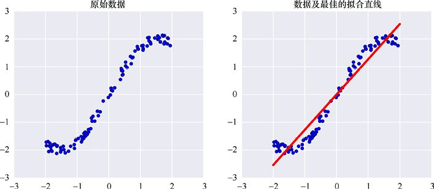

> **圖片描述：** 此圖為圖15.3，使用清單15.9中的Ridge估算器，根據二維資料擬合的直線


圖15.3　使用清單15.9中的Ridge估算器，根據二維資料擬合的直線


### 15.4.4　decision_function()，predict_proba()


我們剛剛看到如何使用估算器來解決一個迴歸問題。對於使用分類估算器的分類問題，該過程非常相似。


對於分類器，predict()函數為我們提供了一個類別。但有時我們想知道樣本被分類到其他每個類中的可能性有多大。例如，一個分類者可能會認為給定的照片有49%的機率是老虎，但有48%的機率是豹子（其他3%的機率是其他類型的貓）。在這種情況下，predict()函數會告訴我們這張照片是豹子，但我們可能想知道這張照片有多大可能是老虎。


對於我們關心所有可能類的輸入機率的情況，許多分類器提供了一些額外的選項。例程decision_function()將一組樣本作為輸入，併為每個類和每個輸入返回“confidence”分數，其中較大的值表示更高的可信度。注意，多個類別同時具有較高的分數是有可能的。


相反，例程predict_proba()返回的是每個類的機率。與decision_function()的輸出不同，每個樣本的所有機率總是加起來為1，這通常使得predict_proba()的輸出與decision_function()相比更加一目瞭然。這也意味著我們可以使用predict_proba()的輸出作為機率分佈函數，如果我們需要對結果進行額外的分析，有時會很方便。


雖然分類器都提供fit()，但並不是說分類器都提供一個或兩個其他例程。與往常一樣，每個分類器的API文檔會告訴我們它支援的內容。


## 15.5　分群


分群是一種無監督學習技術，即我們為演算法提供一堆樣本，並令演算法盡力將相似的樣本組合在一起。


輸入資料將是二維點的大集合，沒有其他資訊。


scikit-learn中有很多分群選項。讓我們在這裡使用*k*均值（*k*-means）演算法，它與第7章中的分群概述非常相似。*k*的值告訴演算法要構建多少個簇（然而例程對於“簇數”使用了n_clusters參數，而不是更短、更隱秘的單字母“k”）。我們首先創建一個KMeans對象。要訪問它，我們需要從其模組sklearn.cluster導入它。當創建對象時，我們可以告訴它需要在收到資料後構建多少個簇。這個名為n_clusters的參數，如果我們不給它設定值，則預設為8。清單15.10展示了這些步驟，包括傳遞簇數的值。


**清單15.10　**導入KMeans來創建一個實例。


```
from sklearn.cluster import KMeans

num_clusters = 5
kMeans = KMeans(n_clusters=num_clusters)
```


分群演算法通常用於具有許多維度（或特徵）的資料，可能是幾十或幾百個。但是當創建分群對象時，我們不必告訴它我們將使用多少功能，因為稍後呼叫fit()時，它將從資料本身獲取該資訊。


像往常一樣，我們使用2個維度（即每個樣本包含2個特徵），這樣就可以繪製資料和結果的圖。為了創建資料集，我們將製作7個隨機高斯斑點，並從每個斑點中隨機選取點。結果如圖15.4所示。我們還顯示由生成每個樣本的斑點進行顏色編碼的資料，但這隻適用於人眼，電腦只能看到*X*值和*Y*值的列表。


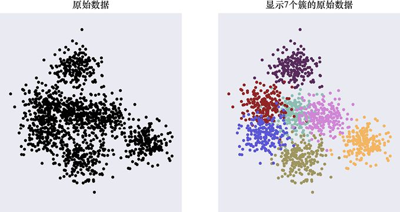

> **圖片描述：** 此圖為第15章圖15.6，在訓練之前用縮放變換器修改資料。創建縮放變換器後，我們通過呼叫fit()為其提供訓練資料。縮放變換器分析資料並確定縮放變...


(a)　　　　　　　　　　　　　　　　　　　　　　　　　　　　　　　　　　　　　　 (b)


圖 15.4 用於分群的資料。(a)演算法將獲得的資料；(b)一張備忘單，向我們展示了7個高斯斑點中的哪一個用於生成每個樣本


記住，我們只是將圖15.4中的黑點提供給演算法，因此除了位置，演算法對這些點一無所知。和以前一樣，我們將資料調整為一個大型的NumPy數組，其中每一行有兩個維度或特徵：該行的點的*X*值和*Y*值。我們將該資料稱為XY_points。要根據這些資料構建簇，我們只需將它交給對象的fit()例程，如清單15.11所示。


**清單15.11　**如果將資料提供給kMeans，它將計算出我們製作對象時請求的簇數。


```
kMeans.fit(XY_points)
```


fit()返回結果，表明分群完成。為了可視化它是如何分解原始資料的，我們將再次運行相同的資料，並詢問每個樣本的預測簇。我們將使用predict()方法和相同的資料來進行擬合，如清單15.12所示。


**清單15.12　**我們可以通過將其處理為predict()來找到原始資料的預測分群。


```
predictions = kMeans.predict(XY_points)
```


變量預測是一個NumPy數組，其形狀為一列。也就是說，輸入中的每個點都有一行，每行都有一個值：一個整數，告訴我們例程分配給XY_points輸入中的對應點的哪個簇。例如，XY_points的第一行保存一個點的*X*值和*Y*值，第5行預測包含一個整數，告訴我們該點被分配到哪個簇。


讓我們為一堆不同數量的簇運行這個過程，如清單15.13所示，清單中省略了繪圖程式碼。


**清單15.13　**用不同的簇數來進行嘗試。


```
for num_clusters in range(2, 10):
    kMeans = KMeans(n_clusters=num_clusters)
    kMeans.fit(XY_points)
    predictions = kMeans.predict(XY_points)
    # plot the XY_points and predictions
```


結果如圖15.5所示。


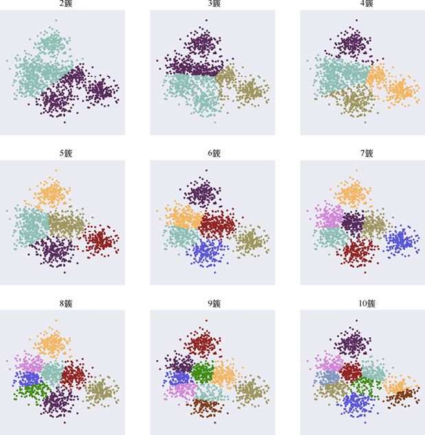

> **圖片描述：** 多張並排的二維圖，展示使用不同k值（從少到多）對資料進行k均值分群的結果，不同簇以不同顏色標示。

圖 15.5　*k*均值演算法將圖15.4中的原始資料分群到不同數量的簇中。每個簇都以不同的顏色顯示。回想一下，我們使用7個斑點生成了資料


從視覺上看，從大約5簇開始，事情開始變得合理。因為我們使用重疊高斯來創建資料集，所以這些組並非完全不同。但是從大約5簇開始，我們可以看到最頂層和最右邊的簇被很好地識別，主要質量被細分為更小的區域。從大約9簇開始，這些外部簇似乎正在分割。所以介於5和8之間似乎是一個不錯的選擇，這是一個令人滿意的結果，但需已知我們是從7個重疊高斯資料集開始的。


scikit-learn有多個分群例程，因為它們以不同的方式處理問題，併產生不同類型的分群。


分群演算法是瞭解資料空間分佈的好方法。集群的缺點是我們必須選擇簇的數量。有些演算法試圖為我們選擇簇的最佳數量[Kassambara17]，但通常我們仍然需要查看結果並確定它們是否有意義。


## 15.6　變換


正如我們在第12章中討論的那樣，在使用資料之前，我們很多時候都希望對資料進行**變換**或修改。我們希望確保資料符合給出的演算法的期望。例如，某些技術會在接收的每個要素都是以0為中心並且縮放到範圍[−1,1]的資料時表現最佳。


scikit-learn提供了各種各樣的對象，稱為**變換器**，它可以執行許多不同類型的資料變換。每個變換器接收一個包含樣本資料的NumPy數組，並返回一個變換數組。


我們通常根據估算器選擇應用哪個變換器，並將資料提供給它。每個需要以特定形式提供資料的估算器都會在其文檔中提供該資訊，但在它們建議或者需要某種形式的資料時，我們應當顯式地指明希望使用的變換方法。回憶第12章，我們從訓練資料中學習了變換，但是必須對所有進一步的資料應用相同的變換。為了實作這一目標，每個變換器提供了不同的例程來創建變換對象，分析資料以找到變換的參數，並應用該變換。


因為前文已經創建了一些對象，所以我們可以通過想要傳遞的任何參數呼叫其創建例程來創建變換對象。


要查找特定變換的參數，我們可以呼叫fit()方法，就像我們對估算器所做的一樣。我們用fit()呼叫資料，對象會分析它以確定該對象執行的變換的參數。然後我們實際上使用transform()方法變換資料。該方法獲取一組資料，並返回變換後的版本。之後，只要擁有訓練模型的資料，無論是原始訓練資料、驗證資料，還是部署後到達的新資料，我們都將首先通過此對象的transform()方法運行它。


注意，這很好地說明了保留變換的必要性。在呼叫fit()時，對象會先學習它需要做的事情，然後將相同的變換應用於我們從那時起處理的任何資料，如圖15.6所示。


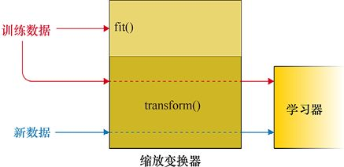

> **圖片描述：** 流程圖展示使用縮放變換器處理資料的步驟：先用fit()分析訓練資料確定變換方式，再用transform()變換訓練資料進行訓練，之後新資料也經過相同的transform()處理。

圖15.6　在訓練之前用縮放變換器修改資料。創建縮放變換器後，我們通過呼叫fit()為其提供訓練資料。縮放變換器分析資料並確定縮放變換，然後用transform()變換訓練資料並用它訓練估計量。從那時起，我們想要使用的所有新資料也應該通過縮放對象的transform()例程進行處理


讓我們看看真實情況下的例子。我們將使用具有明顯視覺效果的變換器：每個特徵都縮放到[0,1]內。像往常一樣，我們將使用二維資料，因此有兩個要縮放的值：*x*和*y*。


我們將使用名為MinMaxScaler的scikit-learn變換器——它專為此類任務而設計。我們可以為它提供具有任意數量特徵的資料。預設情況下，每個特徵將被獨立地變換到範圍[0,1]。


讓我們從圖15.7中的資料開始。


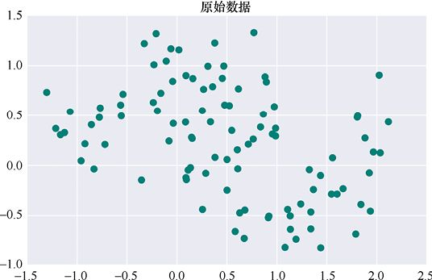

> **圖片描述：** 此圖為圖15.7，用於縮放的原始二維（或雙特徵）資料。注意，*x*值在約[−1.5,2.5]內，*y*值在約[−1.0,1.5]內


圖15.7　用於縮放的原始二維（或雙特徵）資料。注意，*x*值在約[−1.5,2.5]內，*y*值在約[−1.0,1.5]內


要使用縮放變換器，像往常一樣，我們必須先從scikit-learn導入適當的模組。在這種情況下，文檔告訴我們它是sklearn.preprocessing。首先創建縮放變換器，並將其保存在變量中，如清單15.14所示。


**清單15.14　**創建一個MinMaxScaler一次縮放所有特徵。


```
from sklearn.preprocessing import MinMaxScaler
mm_scaler = MinMaxScaler()
```


現在我們有了自己的對象，然後開始分析訓練資料，並通過呼叫fit()和訓練資料來計算變換。和以前一樣，我們將以表格形式放置資料。其中每行包含一個樣本的所有特徵。因此，資料每行將有兩個條目（點的*x*值和*y*值各一個）。清單15.15顯示了該呼叫。


**清單15.15　**呼叫fit()時，MinMaxScaler將計算出轉換以將每個特徵擴展到[0,1]範圍內。


```
mm_scaler.fit(training_samples)
```


現在我們已準備好變換資料。我們只需對樣本集呼叫transform()，並保存變換後的值。然後就可以將它們交給估算器進行清單15.16中的訓練。


**清單15.16　**對任何資料集呼叫transform()，以使用我們呼叫fit()時確定的變換來縮放它。


```
transformed_training_samples = \
          mm_scaler.transform(training_samples)
```


變換訓練資料的結果如圖15.8所示。


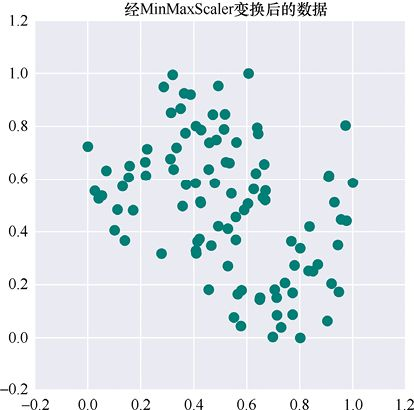

> **圖片描述：** 此圖為圖15.8，MinMaxScaler變換了圖15.7中的資料，使每個特徵被獨立地縮放到[0,1]的範圍


圖15.8　MinMaxScaler變換了圖15.7中的資料，使每個特徵被獨立地縮放到[0,1]的範圍


可以看到，資料在*x*和*y*上的範圍都是[0,1]。假設我們現在想要用一些測試或驗證資料來評估估算器的質量，在將這些資料提交給估算器之前，我們必須先將其變換為與變換訓練資料相同的形式，如清單15.17所示。


**清單15.17　**在新資料上呼叫transform()以在使用之前對其進行變換。


```
transformed_test_samples = \
          mm_scaler.transform(test_samples)
```


圖15.9顯示了一些測試資料及其變換結果。


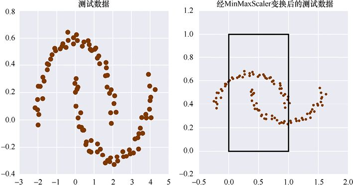

> **圖片描述：** 此圖為第15章圖15.9，變換新資料。(a)測試資料；(b)用我們為圖15.7中的訓練資料創建的MinMaxScaler進行轉換後的測試資料。黑色...


(a)　　　　　　　　　　　　　　　　　　　(b)


圖15.9　變換新資料。(a)測試資料；(b)用我們為圖15.7中的訓練資料創建的MinMaxScaler進行轉換後的測試資料。黑色矩形顯示從(0,0)到(1,1)的框


注意，轉換後的資料不會被壓縮並縮放到*x*或*y*中的[0,1]範圍，正如我們從圖15.9中的(0,0)到(1,1)的框中可以看到的那樣。這正是我們對測試資料的期望，這些新資料的值大於訓練資料中的值。在這種情況下，測試資料的*x*值在約[−3,4]範圍內，這遠大於訓練資料的範圍[−1.5,2.5]。因此，變換的*x*值將落在[0,1]之外。測試資料的*y*值的範圍約為[−0.4,0.6]，這遠小於訓練資料約[−1.0,1.5]的範圍。因此，*y*值僅佔用了範圍[0,1]的一小部分。


因此，雖然變換移動並壓縮了*x*值，但是對於這個較大的資料，它沒有做到足夠好，並且變換的*x*值超出了範圍[0,1]。以同樣的方式，系統移動並壓縮*y*值，但這次對測試資料的壓縮太多了，導致結果僅使用了範圍[0,1]的一小部分。儘管估算器最適用於[−1,1]範圍內的資料，但對於“接近”該範圍的資料，它仍然可以正常工作。“接近”的確切含義因估算器而異，因此需要檢查。但接近1.5的一些資料是值得懷疑的，因為這些值會導致估算器產生無意義的結果。


### 逆變換


我們可以用predict()來獲取某些資料的估算器輸出。記住，這些結果是基於輸入估算器的資料得到的，我們先將其變換。無論我們是在考慮訓練資料、測試資料還是部署資料，都要經歷變換。


在第12章中，我們研究了一個迴歸問題，該問題要求根據前一個午夜的溫度預測街道上的車輛數量。輸入資料變換了，估算器預測的值也要變換。我們必須加以**撤銷**或**反轉**變換，以便它代表車輛的數量，而不是0～1的值。


這個過程很典型。如果想比較估算器產生的結果與原始的未變換資料，我們必須以某種方式撤銷變換。在上面使用MinMaxScaler的場景中，我們希望以與最初拉伸它們的完全相反的方式取消拉伸樣本。


正是為了滿足這個需求，每個scikit-learn變換器都提供了一個名為inverse_transform()的方法，其中“inverse”意味著“相反”。所以這個例程適用於反向變換transform()所做的任何變換。圖15.10展示了一個通用的“學習器”，而不是一個特定的估算器。


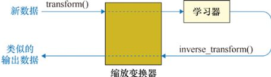

> **圖片描述：** 此圖為第15章圖15.10，學習器的輸出基於它接收的變換值。要將該資料轉換為原始格式（在本例中為原始範圍），我們在該輸出資料上呼叫變換器的inver...


圖15.10　學習器的輸出基於它接收的變換值。要將該資料轉換為原始格式（在本例中為原始範圍），我們在該輸出資料上呼叫變換器的inverse_transform()方法。如果我們將學習器從這個循環中取出，左下角的值將與左上角的值相同


例如，我們可以將圖15.9b的資料提供給inverse_transform()，然後返回圖15.9a的資料，如清單15.18所示。


**清單15.18　**利用inverse_transform ()對transform()的應用對象進行逆變換。


```
recovered_test_samples = \
     mm_scaler.inverse_transform(transformed_test_samples)
```


讓我們看看例子。在圖15.11a中，我們看到了原始資料，這與之前使用的資料類似。資料的*x*值的範圍約為[0,6]，*y*值的範圍約為[−2,2]。設置一個新的MinMaxScaler並用這個資料呼叫fit()，然後通過transform()運行它，我們得到了圖15.11b的版本，其中兩個範圍現在都是[0,1]。


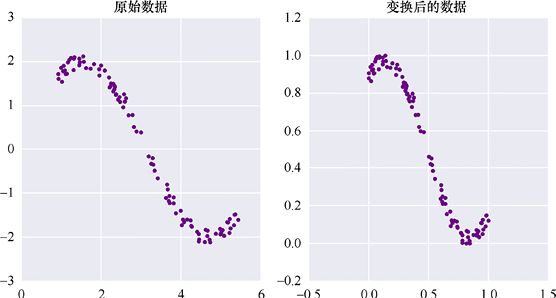

> **圖片描述：** 此圖為第15章圖15.11，(a)原始資料；(b)在使用此資料設置新的MinMaxScaler對象，並對其進行轉換後，*x*值和*y*值都在[0,1...


(a)　　　　　　　　　　　　　　　　　　　　　　　　　　　　　　　　　 (b)


圖15.11　(a)原始資料；(b)在使用此資料設置新的MinMaxScaler對象，並對其進行轉換後，*x*值和*y*值都在[0,1]範圍內


現在為變換後的資料擬合一條直線，我們將使用之前介紹的Ridge估算器。圖15.12a展示了使用Ridge估算器得到的與變換資料一致的直線以及變換後的資料本身。圖15.12b展示了該直線以及原始的非變換輸入資料。這是一次很差的擬合！那是因為該直線適合變換後的資料，而不是原始資料。


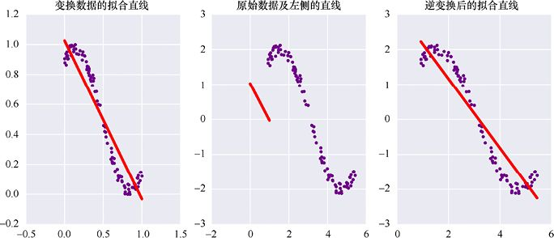

> **圖片描述：** 此圖為第15章圖15.12，將線擬合到變換後的資料。(a)變換資料，其中*x*值和*y*值都在[0,1]範圍內，並且Ridge對象適合該資料；(b)...


(a)　　　　　　　　　　　　　　　　　　　　　　　 (b)　　　　　　　　　　　　　　　　　　　　　　　　(c)


圖15.12　將線擬合到變換後的資料。(a)變換資料，其中*x*值和*y*值都在[0,1]範圍內，並且Ridge對象適合該資料；(b)原始資料（注意軸上的不同範圍），以及我們在左側找到的直線，該直線根本不匹配，因為它適合變換後的資料；(c)對該直線的兩個端點使用inverse_transform()時， MinMaxScaler對它們進行逆變換。現在，逆變換後的擬合直線正確匹配了原始資料


要使該直線與輸入資料匹配，我們需要通過MinMaxScaler的inverse_transform()方法運行它。為此，我們將線的端點視為兩個樣本，並對這兩個樣本進行逆變換。


原始資料以及經逆變換後的擬合直線如圖15.12c所示。


## 15.7　資料精化


有時，我們擁有過多的資料，資料中的一些特徵可能是多餘的。例如，如果資料記錄了比薩店的交貨情況，那麼可能會有一個字段，其中包含每個比薩餅的尺寸以及應該放入的盒子尺寸。可能的情況是，盒子尺寸可以根據比薩的尺寸預測，反之亦然。


執行資料精化的例程旨在通過完全刪除某些特徵或通過使用其他功能組合創建新特徵來從資料中查找和刪除此類冗餘。另一類例程，例如第12章介紹的與主成分分析（PCA）方法相關的例程，也能夠壓縮相關但不完全冗餘的資料。這些都是通過組合特徵來折中簡化資料和資訊損失。


讓我們看一下資料壓縮的例子，即從三維壓縮到二維。圖15.13展示了根據形狀類似於膨脹橢圓的三維斑點繪製的點的資料集。*x*值的範圍在[−0.8,0.8]附近，*y*值的範圍在[−0.3,0.3]附近，*z*值的範圍在[−0.7,0.7]附近。


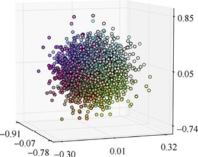

> **圖片描述：** 此圖為圖15.13，原始的三維散點圖。其中*y*上值的範圍最小。此處的顏色只是為了幫助我們確定點的位置


圖15.13　原始的三維散點圖。其中*y*上值的範圍最小。此處的顏色只是為了幫助我們確定點的位置


讓我們將這個三維散點圖的特徵減少到只有2個（也就是說，將它壓縮成二維資料）。我們將使用PCA，如第12章所述。省略構建並繪製初始散點圖的程式碼，其核心步驟只有3個：創建PCA對象（並告訴它我們想要多少維度），呼叫 fit()以便它可以確定要刪除的要素，並呼叫transform()來應用轉換，如清單15.19所示。在這裡，我們還要求PCA“白化”資料，這可以幫助PCA產生最佳結果。


**清單15.19　**要應用PCA，需要先創建PCA對象。在這裡，我們首先告訴它將資料特徵減少到2個，並在整個過程中白化每個特徵；然後用三維資料呼叫fit()，這樣PCA就可以確定如何減少它；最後，呼叫transform()來應用轉換並獲取縮減的二維資料。


```
from sklearn.decomposition import PCA
*# make blob_data, the 3D data forming the “blob”*
pca = PCA(n_components=2, whiten=True)
pca.fit(blob_data)
reduced_blob = pca.transform(blob_data)
```


結果如圖15.14所示。現在，每個資料點僅由兩個值描述，而不是3個。換句話說，PCA的結果顯示我們的資料已經從三維降為了二維。


注意，它不是簡單地沿著一個方向壓扁。正如我們在第12章中討論的那樣，該演算法在三維斑點中放置了一個平面，以便儘可能多地捕獲資料中的方差，然後將每個點投影到該平面上。


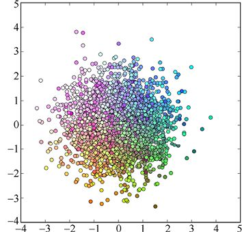

> **圖片描述：** 此圖為圖15.14，運行PCA後，圖15.13中的原始散點被壓縮的結果。我們要求PCA將原來的3個特徵減少到2個，同時保留儘可能多的資訊


圖15.14　運行PCA後，圖15.13中的原始散點被壓縮的結果。我們要求PCA將原來的3個特徵減少到2個，同時保留儘可能多的資訊


## 15.8　集成器


有時創建一堆相似但略有不同的估算器是有用的——讓它們都提出自己的預測。這樣，就可以使用某種策略（通常是投票）來選擇“最佳”預測，並將其作為組的最佳結果返回。


正如第13章中介紹的那樣，這些估算器的集合稱為**集成器**。讓我們看看如何在scikit- learn中構建和使用集成器。


系統設置為我們可以像任何其他估算器一樣處理整體。也就是說，我們將所有單個估算器包裝成一個大的估算器，並直接使用它。scikit-learn為我們處理所有內部細節。


就像任何其他估算器一樣，我們使用整體的第一步是創建一個整體對象，然後呼叫fit()方法為它分析資料，最後，可以呼叫其predict()方法來評估新資料。我們不必關心“正在使用的估算器對象中隱藏著多個估算器”這一事實。


scikit-learn中的一些集成器可以使用任何類型的估算器來製作，而另一些集成器僅限於分類器，或是僅採用了迴歸演算法，也可能只是演算法的特定實例。


讓我們建立一個集成器進行分類。我們將使用包含1000個點的資料集，這些點構成5個螺旋臂，即每個點是5個類別中的一個。該原始資料如圖15.15所示。


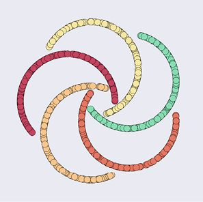

> **圖片描述：** 此圖為圖15.15，集成器分類的原始資料。5個螺旋臂中的每一個包含200個不同的點


圖15.15　集成器分類的原始資料。5個螺旋臂中的每一個包含200個不同的點


我們將從這些點中隨機選擇2/3作為訓練資料，並將剩下的1/3作為測試資料。


我們將使用通用集成器創建函數——它可以構建包含幾乎任何特定分類器演算法的一組分類器。該集成器創建函數稱為AdaBoostClassifier()。之所以使用Boost這個詞，是因為內部使用了增強演算法（見第13章）。


在用這個函數創建集成器時，我們告訴它應該構建多個副本的演算法。我們將使用RidgeClassifier分類器——它是前文使用的Ridge迴歸演算法的分類器版本，如清單15.20所示。


**清單15.20　**用集成器創建函數AdaBoostClassifier()創建Ridge分類器對象的集成器。對於此分類器，演算法參數需要設置為SAMME（這不是“same”一詞的拼寫錯誤），如其文檔中所述。


```
from sklearn.linear_model import RidgeClassifier
from sklearn.ensemble import AdaBoostClassifier
ridge_ensemble = \
          AdaBoostClassifier(RidgeClassifier(), \
          algorithm=′SAMME′)
```


AdaBoostClassifier()的文檔解釋了它有兩種不同的模式，具體取決於它用來構建集成器的分類器所支援的方法。在Ridge分類器的情況下，我們需要指定SAMME演算法（注意：有兩個M）。


我們可以使用可選的n_estimators參數控制有多少分類器進入集成器。對於這個例子，我們將保留其預設值，即50個估算器。我們還將所有其他參數（包括學習率）保留為預設值。


現在我們的集成器已經創建完成，可以像使用其中一個估算器一樣使用它。我們用fit()訓練集成器（以及其中的所有估算器）和輸入的樣本。由於我們已經創建了這個集成器來監督類別的學習，因此fit()例程會同時包含樣本及其標籤。對集成器的fit()例程的呼叫如清單15.21所示。


**清單15.21　**擬合集成器對象。


```
ridge_ensemble.fit(training_samples, training_labels)
```


最後，我們可以讓集成器使用predict()來預測新值，如清單15.22所示。


**清單15.22　**使用集成器預測新值。


```
predicted_classes = ridge_ensemble.predict(new_samples)
```


集成器內部通常通過使用某種投票演算法來選擇最終輸出，其中被預測次數最多的類別成為最終結果。


圖15.16展示了50個分類器的測試資料的分類。這些結果並不十分令人滿意。


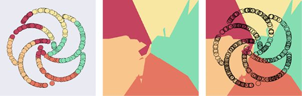

> **圖片描述：** 此圖為第15章圖15.16，50個分類器的測試資料的分類。(a)測試資料，按照每個點的類別進行顏色編碼；(b)由集成器創建的區域；(c)在此區域上覆...


(a)　　　　　　　　　　　　　　　　　　　　 (b)　　　　　　　　　　　　　　　　　　　　　 (c)


圖15.16　50個分類器的測試資料的分類。(a)測試資料，按照每個點的類別進行顏色編碼；(b)由集成器創建的區域；(c)在此區域上覆蓋螺旋狀的點


麻煩的是，我們試圖以這樣的方式將50條直線擬合到這些資料中，這樣它們就可以正確地對旋轉資料進行分類。


我們可以通過試驗估算器的數量、學習率或估算器的參數來嘗試改進這些結果。


還可以嘗試另一個估算器。讓我們使用決策樹，所做的唯一更改是導入必要的模組，然後告訴AdaBoostClassifier()從這些分類器中創建集成器，如清單15.23所示。


**清單15.23　**用決策樹創建一個集成器。對於決策樹，我們可以將演算法參數保留為其預設值。


```
from sklearn.tree import DecisionTreeClassifier
tree_ensemble = \
        AdaBoostClassifier(DecisionTreeClassifier())
```


現在我們像以前一樣使用fit()和predict()。圖15.17展示了使用50棵決策樹進行分類的結果。對於這些資料，使用所有預設值，決策樹的性能幾乎完美！


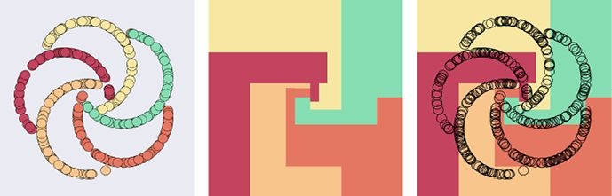

> **圖片描述：** 此圖為第15章圖15.17，使用50棵決策樹進行分類的結果。(a)測試資料，每個點的顏色編碼根據其類別分配；(b)由集成器創建的不同區域；(c)將螺...


(a)　　　　　　　　　　　　　　　　　　　　　　　　 (b)　　　　　　　　　　　　　　　　　　　　　　　　 (c)


圖15.17　使用50棵決策樹進行分類的結果。(a)測試資料，每個點的顏色編碼根據其類別分配；(b)由集成器創建的不同區域；(c)將螺旋狀的點覆蓋到該區域上


## 15.9　自動化


機器學習系統有很多參數，通常也有很多超參數。區別在於系統從資料中學習其參數，而超參數則由我們自己設置。典型的超參數包括學習速率、分群演算法中的分群數、整體中估計量的數量以及要應用的正則化量。


我們經常想要嘗試這些超參數的許多值來找到能夠為給定系統和資料提供最佳性能的組合。如果找不到最好的結果，那麼至少會嘗試一些組合並使用效果最好的組合。


如果想要自動執行此搜索過程，我們需要兩個基本階段。第一個階段是自動選擇超參數，選擇用於構建和訓練學習器的值。第二個階段是評估學習器併為其表現分配一個分數，然後可以選擇產生最佳分數的組合。


scikit-learn為這兩個階段都提供了工具。我們認為它們是**自動化**工具，因為它們幫助我們處理這個重複的過程。


### 15.9.1　交叉驗證


大多數學習演算法有多個參數和超參數，可以控制它們學習的速度和質量。找到這些值的最佳組合可能很困難，因為這取決於正在訓練的資料的性質。


正如第8章所述，我們可以使用**交叉驗證**來確定給定資料集上的模型的質量。當訓練集不是太大時，這種技術特別有吸引力，因為它不需要我們從訓練資料中刪除永久驗證集。相反，我們將訓練分解為稱為**折**的相等大小的片段，然後使用其中一個折的資料作為驗證集，多次獨立地訓練和評估模型。通常將模型的性能報告作為這些多個版本的平均性能[scikit-learn17c]。


scikit-learn可以幫助我們自動化這個過程。我們將常規估算器、資料和希望它使用的折的數量交給它，而它為我們執行整個過程，並報告完成後的平均分數。許多scikit-learn估算器都有專門的版本來執行交叉驗證，並通過附加例程的通常名稱以及最後的字母CV來命名。它們都列在API文檔中[scikit-learn17a]。


例如，假設我們想要使用之前使用過的Ridge分類器來學習一組標記的訓練資料中的類別。為了評估其性能，我們將使用交叉驗證。


Ridge分類器實作名為RidgeClassifier的對象。按照我們剛剛描述的約定，內置交叉方差的RidgeClassifier對象的版本稱為RidgeClassifierCV。所以，我們的第一步就是製作其中一個對象。


要在此估算器上執行交叉驗證，我們只需要使用訓練資料和標籤呼叫其score()方法。這一次呼叫從頭到尾為我們完成整個交叉驗證過程。score()例程負責將資料分割成折，為每個版本的訓練資料構建和評估RidgeClassifier，然後返回分數的平均值，如清單15.24所示。


**清單15.24　**要通過交叉驗證運行RidgeClassifier對象，我們先創建RidgeClassifierCV對象的實例，然後用訓練資料和標籤呼叫它的score()例程。結果是對於每個折在訓練及驗證過程中的平均準確率。


```
from sklearn.linear_model import RidgeClassifierCV

ridge_classifier_cv = RidgeClassifierCV()
mean_accuracy = ridge_classifier_cv.score(
                training_samples, training_labels)
```


我們可以在創建時將各種可選參數傳遞給RidgeClassifierCV對象。也許最重要的參數是我們想要使用的折的數量（這裡將其保留為預設值8）。


RidgeClassifierCV使用合理的折演算法將資料分成相等的部分。這通常很有效，但是scikit-learn提供了幾種替代方案，稱為**交叉驗證生成器**，有時可以做得更好。例如，StratifiedKFold交叉驗證生成器在創建折時會關注資料，並嘗試為每個類別分配相同數量的實例。換句話說，它試圖確保每個折與整個資料集具有大致相同的構成，這通常對分類器的訓練有利。


要使用這種方法，我們首先創建一個StratifiedKFold對象，並告訴它要使用多少個折（這是對象名稱中K的值）。遺憾的是，該對象的此參數的名稱未命名為“折數”，而是n_splits。


StratifiedKFold對象在創建時不需要資料，因為當使用此對象構建折時，交叉驗證生成器將為我們發送資料。我們只需提供交叉驗證分層對象作為交叉驗證對象RidgeClassiferCV的名為cv的參數的值，其餘的操作自動進行，如清單15.25所示。


**清單 15.25　**要使用選擇的分層，我們必須首先創建它，這意味著還必須導入它。在這裡，我們導入StratifiedKFold對象並告訴它使用10折。我們通過參數cv將它傳遞給RidgeClassifierCV對象。


```
from sklearn.model_selection import StratifiedKFold

strat_fold = StratifiedKFold(n_splits=10)
ridge_classifier_cv = RidgeClassifierCV(cv=strat_fold)
```


讓我們直觀地看一下這個過程。圖15.18總結了帶分類器的交叉驗證的scikit-learn模型。系統的輸入包括標記的訓練資料、折數模型構造函數（即創建分類器的例程）及其參數（在示例中將它們保留為預設值）。然後，例程循環遍歷每個折，將其從資料中移除，對剩餘的內容進行訓練，並在提取的折上評估結果。得到的分數作為輸出，或者生成平均值以僅呈現單個值。在圖15.18以及隨後的圖中，帶箭頭的波浪框表示循環。在這種情況下，它是每個折經歷一次上述過程的循環。


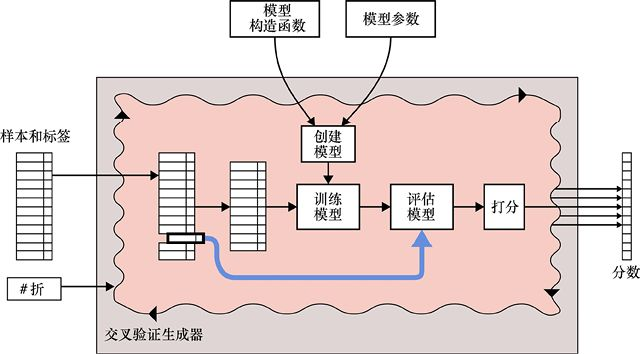

> **圖片描述：** 此圖為第15章圖15.18，使用分類器進行交叉驗證的可視化。這裡用帶箭頭的波浪框表示scikit-learn中交叉驗證例程運行一個循環。每次循環時，...


圖15.18　使用分類器進行交叉驗證的可視化。這裡用帶箭頭的波浪框表示scikit-learn中交叉驗證例程運行一個循環。每次循環時，從訓練資料中提取一個折。剩下的樣本用於訓練模型，然後我們在提取的折上評估結果，產生分數。結果是每個折一個分數。我們將這些分數或它們的平均值作為輸出


圖15.18缺少任何形式的變換。也就是說，我們並沒有縮放或標準化資料，或者進行特徵壓縮，或者進行我們學過的可以幫助模型進行學習的任何其他變換。


要在交叉驗證中包含這些變換，我們必須要小心。如果我們只是在缺乏考慮的情況下將變換放入圖15.18的內部循環中，就會面臨資訊洩露的風險。如第8章所述，這可能會讓我們對模型的性能產生錯誤結論。


要正確包含變換，我們可以使用另一個名為pipeline的scikit-learn工具。理解pipeline的一個好方法是看我們在搜索超參數時如何使用它們，而這本身就是一個重要的主題。


接下來我們研究搜索和pipeline，然後回到交叉驗證，看看如何用pipeline包含變換。


### 15.9.2　超參數搜索


我們經常需要區分**參數**和**超參數**，前者通常由演算法本身根據資料進行調整，後者則通常由我們手動設置。


例如，假設我們要在資料集上運行分群演算法。簇的大小和中心是從資料中學習的參數，並保持在演算法“內部”，而要使用的簇數量由我們在演算法“外部”設置，通常這些值被稱為超參數。


在學習系統中為所有超參數找到最佳值通常是一項具有挑戰性的任務。可能有許多值要修補，且它們可能會相互影響。因此，使用自動化方法搜索它們可以為我們省去大量時間和麻煩。


我們甚至可以將搜索超參數值的想法推廣到搜索演算法的選擇。例如，我們可能想要嘗試幾種不同的分群演算法，尋找能夠最好地利用資料的分群演算法。


為了使這種搜索更容易，scikit-learn提供了一系列例程，可以自動執行這些類型的參數、超參數和演算法搜索。


我們確定了要搜索的內容類型、希望它們嘗試的值，以及判斷每個結果的標準。然後，搜索過程會遍歷每個值的組合，最終報告產生最佳結果的集合。


注意，儘管scikit-learn可以輕鬆設置和運行此搜索，但它並不比手動完成（除了打字時間）更快。它只是有條不紊地研究要搜索的值，然後一遍又一遍地構建、訓練和測試得到的演算法。


有兩種流行的方法來處理這種搜索：**常規網格**（regular grid）和**隨機搜索**（random search）。


常規網格測試參數的每個組合。該方法的名稱中包含“網格”這個詞，是因為我們可以將它作為網格上的點所嘗試的所有組合可視化。二維示例如圖15.19所示。


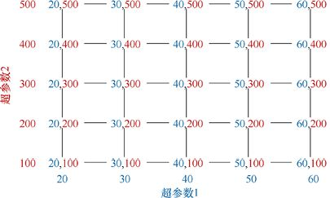

> **圖片描述：** 此圖為第15章圖15.19，對兩個超參數進行常規網格搜索，每個超參數有5個可能值。對於這兩個值的每個組合，我們構建、訓練並測試新系統。共有25種組合...


圖15.19　對兩個超參數進行常規網格搜索，每個超參數有5個可能值。對於這兩個值的每個組合，我們構建、訓練並測試新系統。共有25種組合可供嘗試


在這個例子中，兩個超參數中的每一個都有5個值，即共有5×5=25種組合可供嘗試。


由於我們要包含更多要搜索的參數或每個參數的更多值，因此該網格的大小以及必須執行的訓練/測試步驟的數量將相應增加。這意味著整個過程需要越來越多的時間來運行。最終它的運行時間可能會超出我們的接受範圍。例如，如果我們有4個超參數需要搜索，每個有6個值，則為6×6×6×6=1296個不同的組合。如果需要一小時來訓練和測試每個模型，那麼搜索將需要54天的不間斷計算！


切掉部分網格並節省時間會很棒，但這是一個冒險的步驟，因為我們事先無法知道哪些參數組合可能會產生最佳結果。


網格搜索通常有條不紊地進行，以可預測的固定順序（例如從左到右、從上到下）完成所有可能的組合。


更快但資訊量更少的替代方案是**隨機**搜索這些組合，而不是以某種固定順序搜索。該演算法選擇尚未嘗試的超參數值的隨機組合，訓練和測試得到的模型，然後選擇另一個未嘗試的隨機組合，以此類推。我們可以考慮許多不同的條件來控制這個過程何時應該停止。例如，演算法可以在搜索每個組合，或者嘗試了指定的一定數量的組合，又或是它的運行時間超過了指定的時間時停止，也可以只是我們厭倦了等待於是手動停止。這之後它會返回找到的最佳組合。圖15.20說明了這個想法。


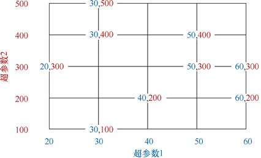

> **圖片描述：** 此圖為第15章圖15.20，隨機搜索不會按順序測試每個組合，而是以隨機順序測試它們。這可以讓我們總體感覺到高分數的位置，而不是一上來就嘗試每個組合。...


圖15.20　隨機搜索不會按順序測試每個組合，而是以隨機順序測試它們。這可以讓我們總體感覺到高分數的位置，而不是一上來就嘗試每個組合。在這裡，我們通過8個步驟選擇隨機組合，然後構建、訓練和測試結果模型


這種方法優於常規網格的地方在於，我們可以在結果出現時觀察它們。也許這樣我們就可以瞭解應該在哪裡集中搜索，然後可以在看起來很有希望的鄰域中停下來再重新開始。例如，假設在圖15.20中，組合(40,200)的表現比任何其他組合好得多，我們可能決定在該區域運行新的局部細緻搜索，可能使用常規網格，如圖15.21所示。


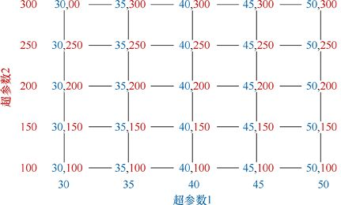

> **圖片描述：** 此圖為第15章圖15.21，如果我們認為找到了最佳值的鄰域，就可以運行一個新的搜索來放大該區域。在這裡，我們查看超參數1的值為40，而超參數2的值為...


圖15.21　如果我們認為找到了最佳值的鄰域，就可以運行一個新的搜索來放大該區域。在這裡，我們查看超參數1的值為40，而超參數2的值為200的區域


首先，讓我們看看如何使用scikit-learn運行規則的、有條理的網格搜索。隨後，我們將以幾乎相同的方式設置和呼叫隨機版本。


### 15.9.3　枚舉型網格搜索


枚舉型網格搜索由一個名為GridSearchCV的對象提供（最後的CV提醒我們演算法將使用交叉驗證來評估它嘗試的每個模型的性能）。


GridSearchCV逐個生成每個參數組合，構建並訓練模型，然後測試相應模型對資料的執行情況，返回該模型的最終得分。


請注意，我們交給此例程的估算工具本身不應執行交叉驗證（即，其名稱不應以CV結尾），因為網格搜索器會負責處理該步驟。圖15.22展示了製作基本網格搜索對象的部分。


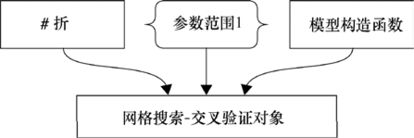

> **圖片描述：** 此圖為第15章圖15.22，製作基本網格搜索對象的部分。我們提供在每次交叉驗證期間使用的折數、想要搜索的參數、希望它們採用的值，以及正在調查的模型構...


圖15.22　製作基本網格搜索對象的部分。我們提供在每次交叉驗證期間使用的折數、想要搜索的參數、希望它們採用的值，以及正在調查的模型構造函數


這個對象需要提供交叉驗證步驟的折數（該值的預設值為3）、一組應該被搜索的參數及其值，以及為學習器構建的例程作為輸入。此外，還有許多這裡不會涉及的可選參數。


從概念上講，我們可以分兩步考慮網格搜索過程。第一步是構建參數值的每個組合的列表。因此，如果只有兩個參數，我們可以將此列表保存為二維網格。如果有3個參數，我們可以將其視為三維體積，以此類推。


第二步是一次一個地運行這些組合，構建模型，使用交叉驗證對其進行評估，並保存分數。我們可以將該分數保存在與參數組合列表的形狀和大小相同的另一個列表（或網格、體積或更大的結構）中，然後可以快速查看為每個組合分配的分數。


圖15.23展示了整個過程的可視化摘要。在左邊，我們看到了創建學習模型的例程（可能是決策樹演算法，或像Ridge這樣的迴歸演算法）。還有一組我們想要改變的參數，以及想要為每個參數嘗試的值。現在假設我們對探索兩個超參數感興趣，並且想要為第一個超參數嘗試7個可能的值，為另一個嘗試5個可能的值。


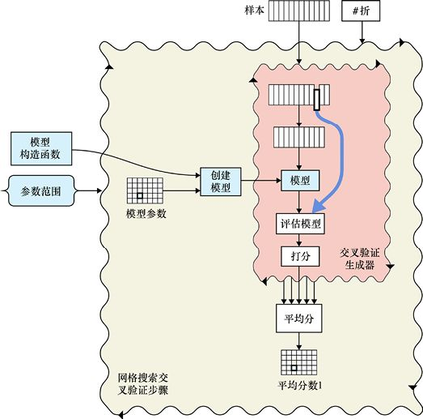

> **圖片描述：** 此圖為圖15.23，用交叉驗證進行網格搜索


圖15.23　用交叉驗證進行網格搜索


在處理的第一步中，我們找到這些參數和值的所有組合，並將它們保存在標記為“模型參數”的網格中。此網格大小為7×5，即兩個超參數的每個值的組合都是一個可選參數條目。現在我們開始運行循環。外部波浪框代表網格搜索器的主循環。每次循環時，它都使用模型構造函數和網格中的一組模型參數來創建模型。在頂部，我們可以看到構成訓練集的樣本。如果我們使用有監督的學習器，這些樣本將有標籤。此外，我們還將提供交叉驗證時使用的折數。


所有這些都進入內部波浪框，其中包含我們在圖15.18中看到的交叉驗證步驟（儘管轉向其側面）。交叉驗證步驟的分數將被保存並生成平均分，該結果被保存在網格中與模型參數相同的位置，因此很容易找到每個參數組合的分數。


搜索循環完成後，我們會查看搜索過程中保存的所有分數，並找到產生最佳結果的參數。我們使用這些參數創建一個新模型，訓練並返回它，如圖15.24所示。


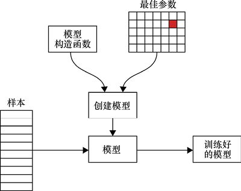

> **圖片描述：** 此圖為圖15.24，通過確定得到最佳分數的參數來完成網格搜索過程。我們根據這些參數構建一個新模型，在所有資料上進行訓練，然後返回該模型


圖15.24　通過確定得到最佳分數的參數來完成網格搜索過程。我們根據這些參數構建一個新模型，在所有資料上進行訓練，然後返回該模型


讓我們看看程式碼。我們將使用之前的Ridge分類器對一組資料進行分類。RidgeClassifier對象需要很多參數，然而我們到目前為止一直在使用預設參數。讓我們選擇其中兩個參數，併為特定資料集搜索最佳值。


我們將從名為alpha的參數開始，這是正則化強度，通常稱為lambda（*λ*），同一概念使用不同希臘字母的情況並不罕見。回憶第9章，正則化有助於我們防止過度擬合。在RidgeClassifier中，alpha是0或一個更大的浮點值。較大的值意味著更多或更強的正則化。首先，我們將嘗試這6個alpha值：1、2、3、5、10和20。


我們要搜索的第二個參數稱為求解器（solver）。這是RidgeClassifier內部使用的完成工作的演算法。在不詳細介紹每一個細節的情況下，假設我們想嘗試一下，看看是否有任何一個參數選擇會表現得特別好。關於RidgeClassifier的文檔告訴我們，我們可以按名稱引用這些演算法（即使用字符串）[scikit-learn17g]。再次，基本可以說是任意的，讓我們選擇其中的3個：'svd'、'lsqr'和'sag'。


現在我們需要告訴網格搜索器所要訓練和為RidgeClassifier評分的多個版本，並用這些值作為名為alpha和solver的參數。


為了傳達我們想要為每個參數分配的值，通常使用Python**字典**。簡而言之，字典是用花括號括起來的鍵/值對的列表。鍵將是命名參數的字符串，值將是參數可以採用的列表。


鑑於Python的這個結構，我們可以將想要搜索的參數命名為字符串，並將它們用作字典中的鍵。我們希望每個參數採用的值在列表中被命名，並分配給該鍵的值，如清單15.26所示。


**清單15.26　**構建一個字典，以保存所要搜索的值。


```
parameter_dictionary = {
    ′alpha′: (1, 2, 3, 5, 10, 20),
    ′solver′: (′svd′, ′lsqr′, ′sag′)
}
```


當網格搜索器構建一個新的RidgeClassifier時，它會將alpha條目中的一個值分配給alpha參數，並將一個值分配給solver參數的求解器條目。它通過匹配名稱來實作，因此字典中的名稱必須與RidgeClassifier()使用的參數名稱完全匹配。


網格搜索器將從該字典中構建並評估6×3=18個不同的模型。這些模型將通過清單15.27中的呼叫進行，儘管我們是看不見這一切的。由於Python的字典定義方式，演算法可能無法按此順序進行選擇，但該細節通常對我們來說也是不可見的。


**清單15.27　**基於清單15.26的字典，網格搜索器將構建和評估的18個模型。此處僅展示了前幾個和最後幾個。它們可能不按此順序生成。


```
ridge_model = RidgeClassifier(alpha=1, solver=′svd′)
ridge_model = RidgeClassifier(alpha=1, solver=′lsqr′)
ridge_model = RidgeClassifier(alpha=1, solver=′sag′)

ridge_model = RidgeClassifier(alpha=2, solver=′svd′)
ridge_model = RidgeClassifier(alpha=2, solver=′lsqr′)
ridge_model = RidgeClassifier(alpha=2, solver=′sag′)

ridge_model = RidgeClassifier(alpha=3, solver=′svd′)
....

ridge_model = RidgeClassifier(alpha=20, solver=′lsqr′)
ridge_model = RidgeClassifier(alpha=20, solver=′sag′)
```


要運行搜索，我們使用圖15.22所示的3個項創建一個GridSearchCV對象。這3個項是要使用的折數、參數範圍的字典以及模型構造函數，如清單15.28所示。


**清單15.28　**構建一個網格搜索器。我們為它提供了所要它使用的估算器（這裡是一個RidgeClassifier）、帶有參數名稱和值的參數字典，以及要使用的折數。如果我們想要搜索不同的值，那麼可以在字典中放置折數。為了表明我們不需要，這裡我們將它作為常量值傳遞。


```
from sklearn.model_selection import GridSearchCV
from sklearn.linear_model import RidgeClassifier

ridge_model = RidgeClassifier()
parameter_dictionary = {
    ′alpha′: (1, 2, 3, 5, 10, 20),
    ′solver′: (′svd′, ′lsqr′, ′sag′)
}
num_folds = 3

grid_searcher = GridSearchCV(estimator=ridge_model,
                     param_grid=parameter_dictionary,
                     cv=num_folds)
```


稍等一下！這裡有點奇怪。我們在清單15.27中看到，網格搜索器將生成18個不同的RidgeClassifier對象，每個對象具有不同的參數。但是在清單15.28中，我們創建了一個RidgeClassifier對象並將其存儲在變量ridge_model中，根本沒有給它任何參數。網格搜索器如何獲取這個對象並製作18個新版本，讓每個版本都有不同的參數？


這個問題的答案也是基於Python語言的設置方式。讓我們來看看在上層發生了什麼。


我們為搜索者提供了使RidgeClassifier對象作為其估算器參數的例程。因此，網格搜索器能夠使用新參數呼叫該例程來創建新模型。換句話說，它可以完全按照清單15.27所示，但使用參數估算。由於我們為此參數賦值的值本身就是一個過程，因此呼叫該過程與顯式呼叫RidgeClassifier()相同。這個機制使我們以後可以輕鬆地使用完全不同的估算器呼叫GridSearchCV()，只需改變提供給估算器的程式即可。如果新模型採用相同的alpha和solver參數，那麼我們可以保留字典。如果它需要其他參數，我們可以使用不同的字典。


簡而言之，網格搜索器生成參數的所有組合，並將每個組合傳遞給所提供的任何例程作為估算器的值，以便創建估算器對象的新實例。在這種情況下，它將創建一個新的RidgeClassifier對象。然後，它使用我們的資料通過交叉驗證運行該對象並評估其性能。


創建GridSearchCV對象使其準備運行搜索，但實際上並不啟動該過程。要運行搜索，我們需要呼叫GridSearchCV對象的fit()方法。因為在這個例子中我們正在訓練分類器，所以將給它們提供樣本和標籤，如清單15.29所示。


**清單15.29　**為了運行搜索，我們使用訓練資料和樣本呼叫搜索者的fit()方法。


```
grid_searcher.fit(training_samples, training_labels)
```


這就是參數網格搜索需要的全部內容。我們呼叫函數，然後一切都自動發生。當該行返回時，系統已經詳盡地搜索了參數的所有組合。


在開始參數網格搜索之前，我們應該暫停一下，以確認我們真的想要進行搜索了，因為我們可能要等待很長的時間來完成參數網格搜索。正如之前看到的，如果我們需要搜索大量參數，並且每次運行需要一段時間，可能需要等待數小時甚至數週才能完成這項工作。


當fit()完成後，我們可以查詢grid_searcher對象以發現它找到的內容。該對象將其結果保存在內部變量中。它的每個變量都以下畫線結尾，以幫助我們避免使用我們自己的變量來混淆這些名稱。


該文檔提供了包含結果的所有內部變量的完整列表。讓我們看看3個最有用的變量。best_estimator_（注意尾隨下畫線）告訴我們搜索者做出的顯式構造呼叫，使得得出最佳值的估算器具有所有參數（包括未指定的所有預設參數）。最佳值本身由best_score_給出。如果我們只想要最好的參數集，那麼best_parameters_包含一個字典，它對原始字典中的每個參數都具有最佳值。


讓我們付諸行動吧！圖15.25展示了一對半月形的資料點的集合。這是使用scikit-learn資料製作實用程式make_moons()生成的，我們將在下面看到。圖15.25b展示了在清單15.28中運行網格搜索的結果，然後是擬合步驟。由於我們使用的是RidgeClassifier，因此期望直線能夠很好地分割這兩個類，儘管沒有直線可以完成這樣一項完美的工作。


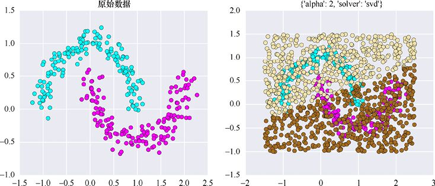

> **圖片描述：** 此圖為第15章圖15.25，(a)有兩個類別的原始資料；(b)網格搜索結果，在原始資料之上繪製了500個預測點。分類器找到了一條很好的直線近似來分割...


(a)　　　　　　　　　　　　　　　　　　　　　　　　　　　　　　　　　　　　　　　 (b)


圖15.25　(a)有兩個類別的原始資料；(b)網格搜索結果，在原始資料之上繪製了500個預測點。分類器找到了一條很好的直線近似來分割資料。更復雜的分類器可以找到更復雜和更準確的邊界曲線


為了清晰起見，圖15.26僅顯示圖12.25中的測試資料。每個點都由分類器分配的類別著色。


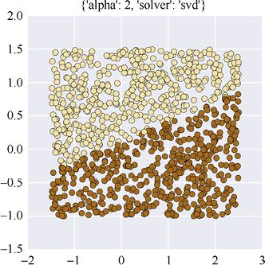

> **圖片描述：** 此圖為圖15.26，僅顯示圖15.25中的測試資料


圖15.26　僅顯示圖15.25中的測試資料


清單15.30顯示了我們剛才討論的3個變量的結果值及其價值。


**清單15.30　**描述圖15.25中資料的最佳組合的變量。Python生成的輸出行以淺藍色著色。請注意，最佳估算器為我們提供了對RidgeClassifier及其所有參數的完整呼叫，包括可選參數。參數best_parameters_是一個字典，這裡有2個鍵/值對。


```
grid_searcher.best_estimator_
    RidgeClassifier(alpha=2,
            class_weight=None, copy_X=True,
            fit_intercept=True, max_iter=None,
            normalize=False, random_state=None,
            solver=′svd′, tol=0.001)
grid_searcher.best_score_
    0.87
grid_searcher.best_parameters_
    {‘solver’: ‘svd’, ‘alpha’: 2}
```


輸出顯示best_estimator_包含best_parameters_中的所有內容，但後者僅限於我們搜索的參數。


如果我們深入瞭解grid_searcher對象中的變量，就可以查看cv_results_，這是一個包含詳細搜索結果的龐大字典。在圖15.27中，我們繪製了來自該變量的兩個條目的資料：mean_train_score和mean_test_score，它們為我們提供了18個參數組合中每個參數組合的訓練和測試資料的分數（這些名稱不以下畫線結束，因為它們是cv_results_字典的成員。cv_results本身有一個下畫線，這是scikit-learn命名策略的一個“怪癖”。可以看到，在這次運行中，參數的3種組合給了我們相同的最佳測試結果。也就是說，求解器的選擇在這種情況下沒有任何區別。


結果表明，無論RidgeClassifier內部使用何種演算法， alpha值為2時都會在測試集上產生最佳結果。由於測試資料是實際資料的替代品，那麼我們在實際部署演算法時就會把alpha設置為2。系統從3個性能相同的組合中選擇了“最佳”變量中的svd演算法，因為它是第一個被搜索到的。


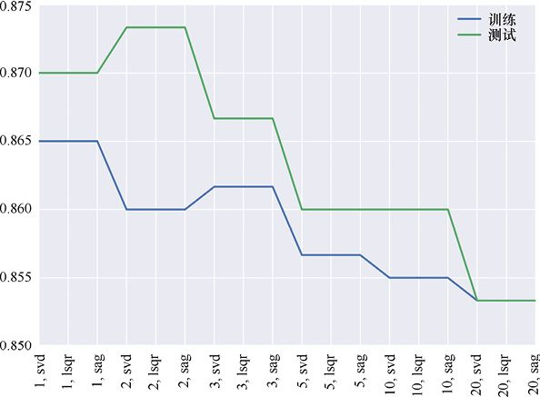

> **圖片描述：** 此圖為圖15.27，18個參數組合中的每一個參數組合的訓練和測試資料的分數。最好的訓練結果來自alpha為2時，3個求解器選擇中的任何一個


圖15.27　18個參數組合中的每一個參數組合的訓練和測試資料的分數。最好的訓練結果來自alpha為2時，3個求解器選擇中的任何一個


### 15.9.4　隨機型網格搜索


既然我們知道如何進行枚舉型網格搜索，那麼切換到隨機型網格搜索不會太費功夫。


我們使用RandomizedSearchCV對象（它也來自model_selection模組），而不是使用GridSearchCV對象。


該對象採用與GridSearchCV相同的參數，但隨機型網格搜索也採用名為n_iter的參數（對於“迭代次數”），告訴它應該嘗試多少個隨機選擇的獨特參數組合（預設為10）。


### 15.9.5　pipeline


假設作為網格搜索的一部分，我們想要包含某種形式的資料預處理。我們可能希望對訓練集進行規範化或標準化，或者執行更復雜的操作，例如在其上運行PCA。


在搜索其他參數（如上所述）時，搜索該變換的最佳參數是很自然的。例如，我們可能希望嘗試使用PCA將八維資料集壓縮到五維、四維和三維，並查看哪些（如果有的話）選擇可以為我們提供最佳性能。


但是現在我們在循環中有兩個對象：預處理對象和分類對象。我們如何告訴搜索器，對於系統的和隨機的搜索者，是否應該同時用它們兩個；或者如何告訴它應該將某個參數傳遞給某個對象呢？


答案是將我們想要執行的整個操作序列打包到pipeline中。然後搜索器將按計劃進行，而不是隻呼叫一個估算器，它將呼叫pipeline，並執行其中的所有步驟。


讓我們使用在圖15.25中展示的半月資料來證明這一點。


為了說明預處理步驟，讓我們每次通過循環變換資料，使得RidgeClassifier對象能夠將曲線擬合到資料，而不僅是一條直線。


為此，我們將使用預處理步驟為分類器生成更多資料。這是以前從未見過的技術，所以在我們進入程式碼創建和使用它之前，先看看它的作用。當RidgeClassifier對象找到邊界曲線時，它會根據樣本中的要素組合來構建它。如果給分類器的都是樣本的兩個特徵（*x*值和*y*值），就像之前所做的那樣，那麼從數學角度而言，我們就會看到分類器可以通過組合它們構建的最複雜的形狀是一條直線。換句話說，我們從圖15.25中的RidgeClassifier獲得直線不是因為分類器，而是因為給它的資料只有*x*值和*y*值這的兩個特徵。


如果我們從原始資料中創建一些額外的特徵，那麼分類器將有更多的功能。我們將通過不同方式讓*x*值和*y*值相乘來製作這些要素。


例如，我們可以將*y*值與自身相乘多次。如*y*×*y*、*y*×*y*×*y*或*y*×*y*×*y*×*y*等。數學家稱它們為**多項式**（polynomial）。這些小表達式中使用的要素數稱為多項式的**次數**。圖15.28展示了這些多項式曲線，這些多項式由*x*本身重複乘以*x*組成。


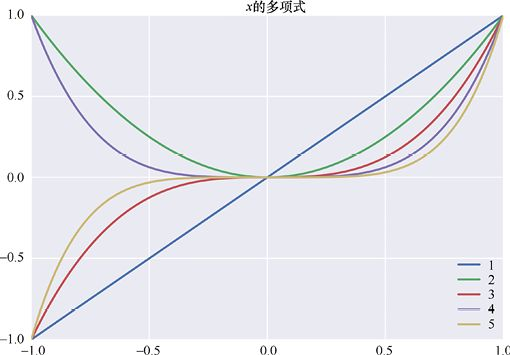

> **圖片描述：** 此圖為第15章圖15.28，在從−1到1範圍內繪製的*x*的多項式曲線。圖例中的數字是度數，這告訴我們使用了多少變量來製作該曲線。因此*x*本身是一...


圖15.28　在從−1到1範圍內繪製的*x*的多項式曲線。圖例中的數字是度數，這告訴我們使用了多少變量來製作該曲線。因此*x*本身是一階多項式，*x*×*x*是二階，*x*×*x*×*x*是三階，以此類推。注意，奇數多項式既可以是負的也可以是正的，而偶數多項式嚴格地大於或等於0


我們只顯示了用*x*構建的多項式，但其實也可以構建*y*的版本通過乘以它自己的任意次數。我們也可以將*x*和*y*混合在一起。


例如，3個可能的二階多項式是*x*×*x*、*y*×*y*和*x*×*y*。當達到三次冪時，我們有4種類型的表達式：*x*×*x*×*x*和*x*×*x*×*y*，以及*x*×*y*×*y*和*y*×*y*×*y*。三次冪時只有4種類型，因為我們將這些值相乘的順序與最終結果無關。


正如我們所提到的，當Ridge分類器只獲得*x*和*y*的一階多項式時（也就是說，我們只給出*x*和*y*本身的值），它可以得到的最複雜的形狀是一條直線。如果我們也給它二階多項式（如上所述，它們是*x*×*x*、*y*×*y*和*x*×*y*），那麼它可以將它們組合起來以產生更有趣的曲線。我們給Ridge演算法提供的多項式的階數越高，它可以創建的曲線越複雜。


圖15.29展示了圖15.28中曲線的少數幾種組合（這些曲線僅包含*x*的多項式）。這表明通過將這些曲線中的幾條相加，每條曲線都有自己的強度，這樣一來我們就可以製作一些相當複雜的曲線。


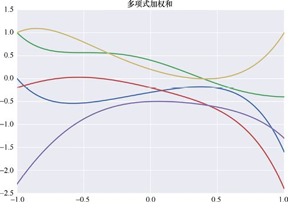

> **圖片描述：** 此圖為圖15.29，圖15.28中*x*的多項式的一些加權組合。在每個點，我們找到5條曲線的值，將每個值乘以該曲線的比例因子，並將結果相加


圖15.29　圖15.28中*x*的多項式的一些加權組合。在每個點，我們找到5條曲線的值，將每個值乘以該曲線的比例因子，並將結果相加


圖15.29展示的是僅使用*x*值的曲線。如果我們同時在*x*和*y*中使用多項式，事情會變得非常有趣。在細節不詳細的情況下，我們可以按照圖15.28中的方法創建各種二維曲線。圖15.30展示了一些示例。


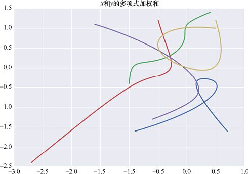

> **圖片描述：** 此圖為圖15.30，*x*和*y*的多項式的加權組合


圖15.30　*x*和*y*的多項式的加權組合


如果我們給RidgeClassifier的不僅是*x*值和*y*值，而是這些以不同方式將這些值相乘得到的多項式，它便可以創建這些類型的曲線。這比直線要好得多！


我們說通過創建這些附加功能，將**擴展**或**增強**（augmenting）原始特徵列表，其中新的**多項式特徵**由*x*和*y*的原始值組成。在Numpy資料數組中，它只意味著每行變長，從只有2個特徵到擁有更多特徵，通過乘以*x*和*y*的各種組合來計算。


pipeline的第一步是為每個樣本構建這些新的多項式特徵，然後供Ridge分類器使用。現在我們已經準備好識別將要完成這項工作的新對象，名為PolynomialFeatures。我們告訴它我們想要它構建的特徵的程度，將它們分解並附加到每個樣本。每個樣本包含的多項式越多（即度數越高），Ridge分類器的邊界曲線就越複雜。


不過，當創建這些多項式特徵時，我們不會在資料集中包含任何新資訊。我們只是使用已有的值並將這些值相乘。但是如何給我們曲線而不是直線呢？


答案歸結為如何實作這些演算法的細節。確實，我們沒有提供任何新資訊。但RidgeClassifier旨在處理它獲得的資料，而不是那些可能有助於它產生更好答案的資料的所有可能變化。因此，如果我們為RidgeClassifier提供簡單的2個特徵資料，它會找到一條線；如果為其提供多項式，它會使用這些多項式作為其計算的一部分來找到曲線。從概念上講，我們可以用RidgeClassifier的一個參數來告訴它在內部創建這些額外的資料，但是在scikit-learn中我們有責任創建這些額外的資料。這樣我們就可以完全控制為RidgeClassifier提供的內容，從而控制它所能找到的邊界的複雜性和形狀。


但是有多少額外資料最好？正如我們在第8章中看到的那樣，在某一點上，這些日益複雜的曲線可能會開始過度擬合資料。因此，我們希望在此之前停止添加新特徵。另外，我們在Ridge分類器中有正則化參數alpha，這有助於控制過度擬合。也許通過增加alpha值，我們可以使用更多這些組合特徵，從而使用更復雜（也許更合適）的曲線。


這變得非常複雜！曲線複雜度（由參數degree與PolynomialFeatures給出）和正則化強度（由參數alpha與RidgeClassifier給出）之間的最佳平衡會是什麼？


沒有必要嘗試自己解決這個問題。讓我們用這兩個對象構建一個兩步pipeline，併為搜索者提供一堆值進行搜索。這個pipeline就可以完成工作以找到最佳組合。如果我們使用網格搜索器，它將嘗試每個參數的每個組合。


圖15.31展示了一個網格搜索器，它有一個兩步pipeline，取代了我們在圖15.23中展示的單個模型。圖中，步驟1是創建一個PolynomialFeatures對象，步驟2是創建一個RidgeClassifier對象，該對象使用步驟1出現的增強資料。這是一個簡化的圖表，因為我們用於驗證的折正在經歷一個似乎不是來自任何地方的變換（標記為T）。我們將在15.9.7節回到這幅圖並填補這個空白。


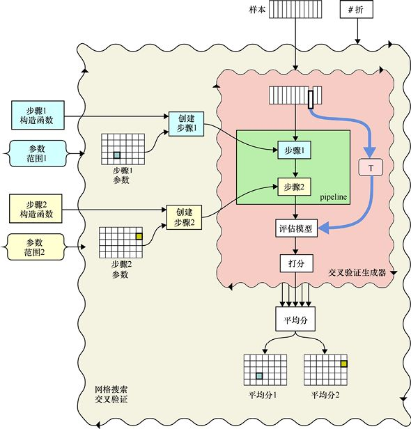

> **圖片描述：** 此圖為第15章圖15.31，網格搜索對象的簡化版本，其中pipeline替換了圖15.23中的單個模型。請注意，這裡沒有顯示資料變換的來源，對此我們...


圖15.31　網格搜索對象的簡化版本，其中pipeline替換了圖15.23中的單個模型。請注意，這裡沒有顯示資料變換的來源，對此我們將在後面再討論。pipeline中的每個步驟都可以有自己的一組參數進行搜索。和以前一樣，每個波浪框代表一個循環


構建pipeline的第一步是創建一個PolynomialFeatures對象，該對象產生*x*和*y*的額外組合。對於這個對象，我們現在唯一關心的參數是degree，這表示它會用原始特徵構建多少個多項式。對於每個樣本，degree的值越大，生成並保存這些相乘的特徵就越多，這將使Ridge分類器能夠找到更復雜的邊界曲線。


對於Ridge分類器，我們也只搜索一個參數，即正則化強度alpha。我們將內部演算法參數保留為其預設值（即字符串auto，它會自動選擇最佳演算法）。


現在已經知道構成pipeline的兩個步驟，讓我們編寫程式碼來構建它。


scikit-learn提供了多種構建pipeline的方法。我們將採用最容易編程和使用的方法。


首先製作將進入pipeline的對象。在這種情況下，它是PolynomialFeatures對象和RidgeClassifier對象，如清單15.31所示。


**清單15.31　**通過創建將進入它的對象開始創建pipeline。


```
from sklearn.preprocessing import PolynomialFeatures
from sklearn.linear_model import RidgeClassifier

pipe_polynomial_features = PolynomialFeatures()
pipe_ridge_classifier = RidgeClassifier()
```


和以前一樣，這些對象都沒有任何參數，因為搜索者會在搜索時為我們填充這些參數。


既然我們有了對象，就可以構建pipeline。為此，我們創建了一個名為pipeline的對象，併為它提供了一個步驟列表，其中每個步驟都是一個包含兩個元素的列表：為該步驟選擇的名稱，以及執行它的對象。


pipeline是根據這個對象列表按照我們命名的順序構建的。只要每個步驟都有一個名稱和對象，列表就可以是我們所希望的任意長度。


清單15.32展示了兩步pipeline的構建步驟。請注意對象的順序。我們首先命名Polynomial- Features對象，因為它首先出現在預期的步驟序列中。


**清單15.32　**創建一個名為pipeline的對象，並給它一個步驟列表。每個步驟本身都是一個列表，包含我們為該步驟提供的名稱以及執行該步驟的對象。該對象是我們在清單15.31中創建的對象。


```
from sklearn.pipeline import Pipeline

pipeline = Pipeline([(′poly′, pipe_polynomial_features),
                     (′ridge′, pipe_ridge_classifier)])
```


創建pipeline時選擇的名稱就像我們為變量選擇的名稱：可以是我們喜歡的任何名稱，但最好選擇描述性的名稱。我們在這裡使用了非常短的名稱，以節省空間。


我們已經完成pipeline的構建，並很快將它作為其估算器參數的值交給GridSearchCV對象。


最後要做的是為搜索者設置參數字典以構建其組合。


如果我們以與之前製作字典相同的方式製作pipeline參數字典，遲早會遇到問題。例如，我們知道RidgeClassifier接受一個名為alpha的參數。如果PolynomialFeatures對象也採用了一個名為alpha的參數（它沒有，但它可以），該怎麼辦？如果我們想要為第一個alpha使用值(1,2,3)，以及為第二個alpha使用值('dog','cat','frog')？我們需要通過一些方法告訴網格搜索器哪個值集應該轉到哪個對象的哪個參數。


坦率地說，scikit-learn回答這個問題的方式非常奇怪。我們使用該參數的pipeline對象的名稱命名每個參數（這就是我們在創建pipeline時給出對象名稱的原因），然後是參數的名稱。請注意，我們不使用pipeline對象的名稱（在示例中，是pipe_polynomial_feures或pipe_ridge_classifier），而是使用pipeline步驟的名稱（在示例中，是poly或ridge）。


奇怪的是，我們必須給pipeline對象的名稱和參數的名稱加入兩個**下畫線字符**。也就是說，一行裡包含連續兩個_，即（_ _）。不幸的是，這很容易與一個下畫線混淆，但卻非常必要。


因此，為了引用名為ridge的pipeline步驟的alpha參數，我們將它在字典中命名為ridge_ _ alpha，帶有兩個下畫線。類似地，我們的poly的pipeline步驟的degree參數被命名為poly_ _degree，再次使用兩個下畫線。


我們總是通過彙總pipeline步驟名稱、兩個下畫線和參數名稱來創建字典名稱，即使沒有混淆的可能性。


清單15.33展示了這兩個參數的字典以及我們將嘗試的一些值。


**清單15.33　**一個為pipeline創建的字典。注意，每個參數都由pipeline步驟名以及參數名確定，它們中間由兩個下畫線字符連接。


```
pipe_parameter_dictionary = {
    ′poly__degree′: (0, 1, 2, 3, 4, 5, 6),
    ′ridge__alpha′: (0.25, 0.5, 1, 2 )
}
```


這將使循環運行7×4=28次，但對於這個小型資料集，在2014年的iMac上運行這個循環只需幾秒，甚至沒有使用GPU。


現在我們已經確定像以前一樣構建搜索對象，然後呼叫它的fit()例程，如清單15.34所示。


**清單15.34　**為pipeline構建網格搜索對象，然後執行搜索。


```
pipe_searcher = GridSearchCV(estimator=pipeline,
              param_grid=pipe_parameter_dictionary,
              cv=num_folds)

pipe_searcher.fit(training_samples, training_labels)
```


半月資料的結果如圖15.32所示。系統發現的最佳組合是ridge_ _alpha=0.25和poly_ _ degree=5。由於我們提供給RidgeClassifier的附加功能，它能夠找到一條曲線來分割資料。


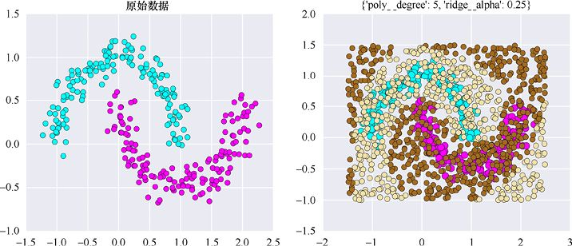

> **圖片描述：** 此圖為圖15.32，搜索更靈活的pipeline對象的結果


圖15.32　搜索更靈活的pipeline對象的結果


為了清晰起見，圖15.33僅展示了圖15.32中的測試資料本身。


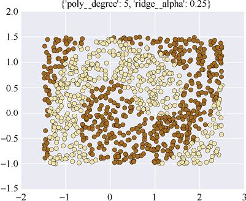

> **圖片描述：** 此圖為圖15.33，圖15.32中的測試資料


圖15.33　圖15.32中的測試資料


值得注意的是，邊界相當對稱，考慮到輸入的對稱性，這是有意義的。我們也看到它們似乎四處彎曲並重新出現在角落裡。這有點瘋狂，但我們的資料完全允許這樣。畢竟，只要正確地對所有資料進行分類（並且我們確實達成了這個目標），在其他地方發生的事情並不重要（儘管我們通常來說可能喜歡更簡單一點的結果 [Domingos12]）。


由於這些點只給出了邊界的輪廓，讓我們在圖15.34中以高分辨率來看它。只是為了看看在資料遠處它會是什麼樣的，我們還會縮小並查看具有更大範圍值的邊界曲線。


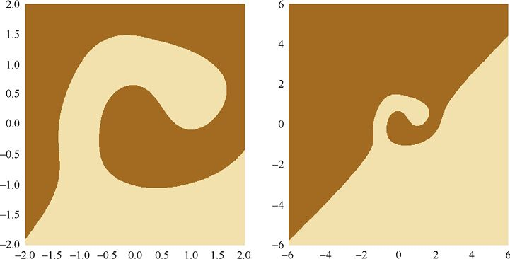

> **圖片描述：** 此圖為圖15.34，查看圖15.32和圖15.33中的邊界曲線。(a)接近兩個半月的資料，但範圍略大於圖15.33。(b)更大的作圖區域


(a)　　　　　　　　　　　　　　　　　　　　　　　　　　　　　　　　　　　　(b)


圖15.34　查看圖15.32和圖15.33中的邊界曲線。(a)接近兩個半月的資料，但範圍略大於圖15.33。(b)更大的作圖區域


不同組合的得分情況如圖15.35所示。


位於圖的右側附近的alpha值為0.25和degree值為5的最佳組合產生了1.0的完美訓練和測試分數。正如我們預料的那樣，正則化參數在曲線變得複雜到開始過擬合之前沒有太大影響，即使在這個簡單的例子中它也沒有太大的區別。


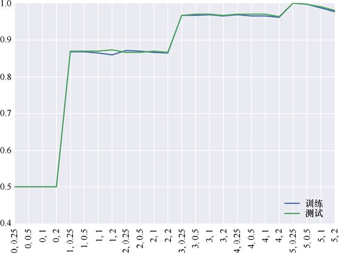

> **圖片描述：** 此圖為第15章圖15.35，pipeline搜索得分情況。直線版本顯示在最左側，degree值為0。最佳結果來自將degree設置為5，並將alph...


圖15.35　pipeline搜索得分情況。直線版本顯示在最左側，degree值為0。最佳結果來自將degree設置為5，並將alpha設置為0.25的情況


### 15.9.6　決策邊界


再來看看我們為半月資料找到的決策邊界。


在圖15.25和圖15.26中，我們找到了一個線性邊界。在這些圖中，我們用predict()返回的類的顏色繪製每個點。但正如之前提到的，我們可以從decision_function()和predict_proba()獲得分類器的相對置信度。因此，我們不是隻獲取一個整數來告訴我們為每個輸入分配了哪個類，而是獲取每個類別的置信度值。由於我們只有兩個類，這意味著將得到2個浮點值，每個類別一個。


讓我們繪製decision_function()的值，以便在三維空間進行直線擬合。圖15.36顯示了結果。


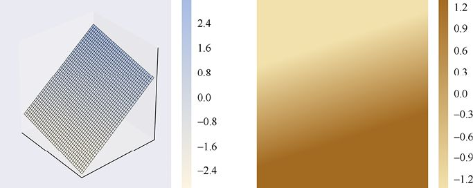

> **圖片描述：** 此圖為第15章圖15.36，查看兩個半月資料之間線性邊界的置信度值，如圖15.25和圖15.26所示。當看到每個類別的機率，而不是僅僅詢問最可能的類...


(a)　　　　　　　　　　　　　　　　　　　　　　　　　　　　　　　　　　　　(b)


圖15.36　查看兩個半月資料之間線性邊界的置信度值，如圖15.25和圖15.26所示。當看到每個類別的機率，而不是僅僅詢問最可能的類別時，我們可以看到從一個類別轉換到另一個類別。(a)decision_function()的輸出；(b)三維圖的自上而下視圖


正如預料的那樣，從一個類到另一個類的邊界不是瞬時出現的。這個平面實際上是一個沒有摺痕的平面。


讓我們以相同的方式查看圖15.33中曲線邊界的decision_function()值。我們將在三維空間繪製這些圖，然後自上向下看，如圖15.37所示。


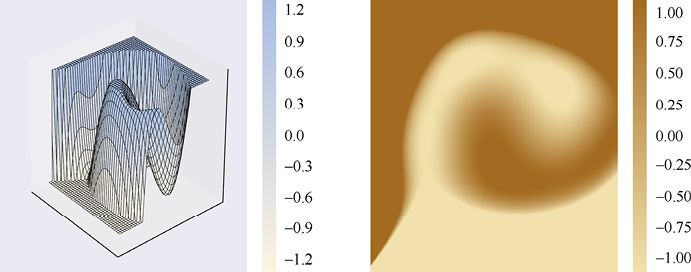

> **圖片描述：** 此圖為第15章圖15.37，三維邊界圖。平坦區域是因為我們將值縮放到[−1,1]以更好地看到中間附近的結構。(a)三維視圖；(b)三維圖的自上而下視...


(a)　　　　　　　　　　　　　　　　　　　　　　　　　　　　　　　　　　　　(b)


圖15.37　三維邊界圖。平坦區域是因為我們將值縮放到[−1,1]以更好地看到中間附近的結構。(a)三維視圖；(b)三維圖的自上而下視圖


我們可以看到兩個類別之間存在平滑的過渡區域——我們手動將decision_function()的輸出縮放到[−1,1]，因此可以專注於該範圍內發生的事情。在交叉區域中，一個點或另一個類中的機率平滑變化。


在某些情況下，從predict()中獲取最可能的類別正是我們想要的。在其他情況下，從decision_ function()或predict_proba()獲得更精確的置信度可能更有用。


### 15.9.7　流水線式變換


我們承諾將回到圖15.31中未解決的問題，當時展示了對每個折使用變換，但沒有講述變換的來源。我們現在解決這個問題。這也將兌現我們早先的承諾，以展示如何在進行交叉驗證時使用pipeline正確應用變換。


讓我們繼續之前使用PolynomialFeatures和RidgeClassifier的示例。pipeline的第一步是為每個樣本添加新的多項式，因此它算作訓練資料的一個變換，因為它會改變進入分類器的樣本。在此示例中，PolynomialFeatures包含新特徵，而不是像縮放變換那樣更改特徵本身。但樣本正在發生變化，因此我們將其稱為變換。


記住關於變換的基本規則：對訓練資料中的樣本所做的任何事情，也必須對所有其他資料進行。


由於訓練資料（添加新功能）的變換在pipeline內部進行，因此我們必須將這種變換找出來，以便可以將其應用於驗證折。圖15.38展示了交叉驗證步驟中pipeline的特寫，其中步驟1（我們的PolynomialFeatures對象）計算了一個變換，然後將變換後的資料應用於步驟2使用的訓練資料和驗證折，用來評估結果。


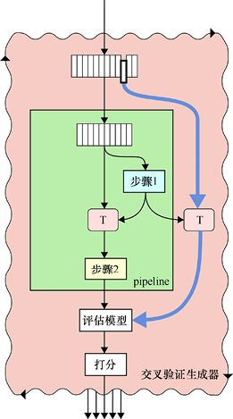

> **圖片描述：** 此圖為第15章圖15.38，圖15.31中交叉驗證步驟的具體示例圖，填補了轉換到折的缺失來源。它來自plpeline內的轉換步驟，其中轉換應用於訓練...


圖15.38　圖15.31中交叉驗證步驟的具體示例圖，填補了轉換到折的缺失來源。它來自plpeline內的轉換步驟，其中轉換應用於訓練資料和折


這裡沒有遺漏的資訊，因為我們所做的一切都是對應書中所講。對於每個模型，我們提取折，計算剩餘訓練資料的變換，然後將該變換應用於訓練資料和折中的資料。


這種轉換的應用程式是由常規和隨機網格搜索對象自動執行的，因此我們不必多做什麼，或以任何方式更改15.9.6節中的程式碼。換句話說，scikit-learn會以正確的方式自動應用pipeline中的步驟。


我們討論了這個細節，因為它很好地說明了在接觸樣本資料時如何始終考慮資訊遺漏。它還向我們展示了處理此問題的好方法。最後，這個例子展示了庫函數如何自動為我們處理這些問題。


我們可以在pipeline中使用多個轉換。例如，我們可以在PolynomialFeatures對象之後添加MinMaxScaler，然後還可以包含一個PCA對象來減少資料的維數。我們可以根據需要使用儘可能多的資料轉換步驟，並且它們將按順序應用於訓練和折的資料。


## 15.10　資料集


scikit-learn提供了各種可立即使用的資料集[scikit-learn17h]。其中一些是代表領域研究的**真實**（real-world）資料，另一些是在我們要求時以程式方式生成的**合成資料**（synthetic data）。


例如，我們可以輕鬆導入著名的Iris資料集，該資料集描述了幾種鳶尾花的不同花瓣的長度。這是一個經典的資料庫，用於許多分類討論。scikit-learn還包括波士頓住房資料集，該資料集記錄了波士頓地區多年的房屋價格以及其他地理資訊。這通常用於迴歸的討論。


還有其他著名的資料集。例如，20newsgroups資料集提供來自在線討論的文本資料，這些資料經常用於基於文本的學習器。數字資料集包含0～9的手寫數字的小灰度圖像。野外人臉標記（LFW）資料集提供了用於人臉檢測和圖像分類的標記照片。


大多數這些資料集是由可以立即使用的NumPy數組中返回的，但是請務必查看文檔以瞭解特性或異常。


要加載資料集，我們通常只需呼叫其加載器並將該例程的輸出保存在變量中。例如，我們可以加載波士頓住房資料集，如清單15.35所示。


**清單15.35　**加載波士頓住房資料集。


```
from sklearn import datasets
house_data = datasets.load_boston()
```


合成資料集的參數很重要，因為它們可以幫助我們控制所生成資料的大小和形狀。


一些最流行的合成資料集包括make_moons()，它生成我們之前使用的兩個互鎖弧，make_circles()創建一對嵌套圓，make_blobs()生成從高斯分佈繪製的點集。


例如，清單15.36展示了我們如何呼叫make_moons()。我們告訴它要生成多少點，並可以選擇添加噪聲參數來打破均勻性。


**清單15.36　**呼叫make_moons()例程生成800個點的合成資料。


```
from sklearn.datasets import make_moons
(moons_xy, moons_labels) = make_moons(
                           n_samples=800, noise=.08)
```


圖15.39展示了這3種類型的合成資料，創建時使用了它們的預設值並添加了噪聲。注意，每個例程都提供標籤以及點的位置，因此資料已準備好進行分類。


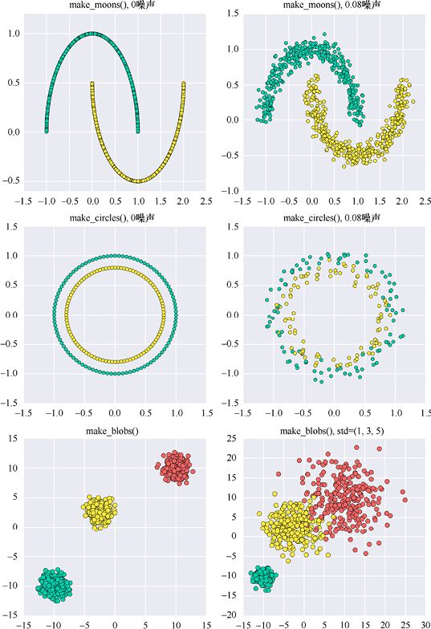

> **圖片描述：** 此圖為第15章圖15.39，由scikit-learn提供的合成資料集。第一行：make_moons()有800個點，噪聲參數設置為0和0.08。第...


圖15.39　由scikit-learn提供的合成資料集。第一行：make_moons()有800個點，噪聲參數設置為0和0.08。第二行：make_circles()有200個點，噪聲參數設置為0和0.08。第三行：make_blobs()有800個點和3個斑點，使用了預設標準差（全為1），更大的標準差使得點更加分散


## 15.11　實用工具


像任何函數庫一樣，scikit-learn有它自己的適用工具，我們可以將它們一起歸到一種類別中。


其中最受歡迎的一種工具用於將資料庫拆分成不同的部分。例程train_test_split()就像它字面意思那樣：給定一個資料庫，這個函數可以將它分成兩部分，通常用作訓練集和測試（或驗證）集。在其他有用的參數中，test_size是一個0～1的值，它指定要放入測試集的資料庫的百分比。預設情況下，其值為0.25。清單15.37展示了它如何在嵌套圓圈點資料集中工作。


**清單15.37　**呼叫train_test_split()將嵌套圓圈點資料集分解為訓練集和測試集。


```
from sklearn.model_selection import train_test_split

(circle_xy, circle_labels) = make_circles(
                                n_samples=200, noise=.08)

samples_train, samples_test, labels_train, labels_test = \
    train_test_split(circle_xy, circle_labels,
    test_size=0.25)
```


這將生成圖15.40所示的資料集。


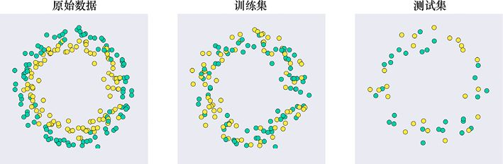

> **圖片描述：** 此圖為第15章圖15.40，用train_test_split()將原始資料拆分為訓練集和測試集。這兩個集合沒有任何共同的樣本。(a)200個點的原...


(a)　　　　　　　　　　　　　　　　　　　　　　　　 (b)　　　　　　　　　　　　　　　　　　　　　　　 (c)


圖15.40　用train_test_split()將原始資料拆分為訓練集和測試集。這兩個集合沒有任何共同的樣本。(a)200個點的原始資料；(b)150個點的訓練集；(c)50個點的測試集


我們將原始資料分成兩組。我們在圖中看不到的一點是，樣本的順序已被打亂，也就是說，它們在訓練集和測試集中的順序與原始資料中的順序不同。


打亂資料集是有用的，假設圓形樣本是從3點開始並沿順時針方向生成的。其中，前75%的資料將是從3點到12點的樣本，最後25%的資料將是12點到3點的樣本，如圖15.41所示。測試資料與訓練資料完全不同。這是一個糟糕的訓練−測試分割！


make_circles()不會產生這個問題，因為它會更隨機地生成它的樣本，但是其他程式可能沒那麼小心，我們從其他來源獲得的資料可能在它出現之前已經被置於某種順序。為了減少這種資料集產生不良訓練−測試分割的可能性，train_test_split()在將樣本分配給訓練集和測試集之前對樣本進行打亂。理想情況是這將導致每個集合都能代表原始資料的總體分佈，如圖15.40所示。


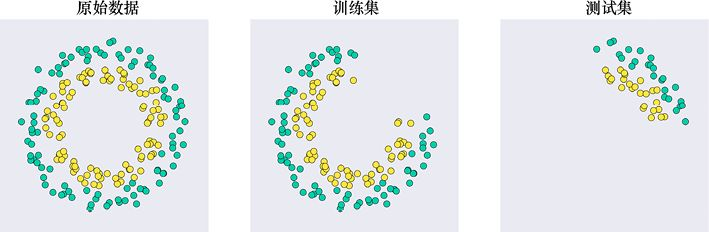

> **圖片描述：** 此圖為圖15.41，從3點鐘開始並沿順時針方向生成資料。(a)200個點的原始資料；(b)訓練集的前150個點；(c)測試集的最後50個點


(a)　　　　　　　　　　　　　　　　　　　　　　　　 (b)　　　　　　　　　　　　　　　　　　　　　　　　 (c)


圖15.41　從3點鐘開始並沿順時針方向生成資料。(a)200個點的原始資料；(b)訓練集的前150個點；(c)測試集的最後50個點


## 15.12　結束語


正如我們在開始時所承諾的那樣，本章並不詳細講述scikit-learn提供的各種各樣的對象和函數。


scikit-learn在線文檔是免費並且始終可用的，但它通常針對的是已經理解了概念並且僅需要語法或參數名稱提醒的程式設計師。在線文檔有一些解釋、教程以及使用示例，但它們通常是十分簡潔的。出於這些原因，庫函數的文檔可能最好只是用於參考，而不是用於研究學習，儘管對常見問題的解答有時可以幫助你理解清楚問題[scikit-learn17d]。


Müller和Guido [Müller-Guido16]的書深入地探討了這個強大函數庫的工作機制。雖然這些書中有一些介紹和綜述材料，但它們仍然假設你已經熟悉常見的機器學習演算法。


Raschka [Raschka15]的書中則有大量的教學細節，為你提供了一個更加深入學習scikit-learn的方法。


## 參考資料


[Domingos12]　Pedro Domingos, *A Few Useful Things to Know About Machine Learning*, Com- munications of the ACM, Volume 55 Issue 10, October 2012.


[Jupyter17]　The Jupyter authors, *Jupyter*, 2017.


[Kassambara17]　Alboukadel Kassambara, *Determining The Optimal Number Of Clusters: 3 Must Know Methods*, STHDA blog, Statistical tools for high-throughput data analysis, 2017.


[Müller-Guido16]　Andreas C Müller and Sarah Guido, *Introduction to Machine Learning with Python*, O’Reilly Press, 2016.


[Raschka15]　Sebastian Raschka, *Python Machine Learning*, Packt Publishing, 2015.


[scikit-learn17a]　Scikit-learn authors, *API Reference*, 2017.


[scikit-learn17b]　Scikit-learn authors, *Documentation of scikit-learn 0.19*, 2017.


[scikit-learn17c]　Scikit-learn authors, *3.3. Model evaluation: quan-tifying the quality of predictions*, 2017.


[scikit-learn17d]　Scikit-learn authors, *scikit-learn FAQ*, 2017.


[scikit-learn17e]　Scikit-learn authors, *Home page of scikit-learn 0.19*, 2017.


[scikit-learn17f]　Scikit-learn authors, *Installing scikit-learn*, 2017.


[scikit-learn17g]　Scikit-learn authors, *RidgeClassifier*, 2017.


[scikit-learn17h]　Scikit-learn authors, *sklearn.datasets Datasets*, 2017.


[VanderPlas16]　Jake VanderPlas, *Python Data Science Handbook*, O’Reilly, 2016.


[Waskom17]　Michael Waskom, *seaborn: statistical data visualization*, Seaborn website, 2017.


### 讀者服務：


> **圖片描述：** 一個 QR Code（二維條碼），中央有綠色的書籍圖示標誌，掃描後可連結到相關線上資源。


微信掃碼關注【異步社區】微信公眾號，回覆“e55451”獲取本書配套資源以及異步社區15天VIP會員卡，近千本電子書免費暢讀。
