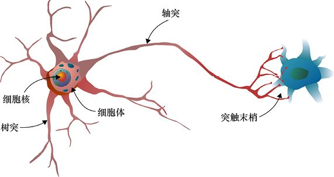
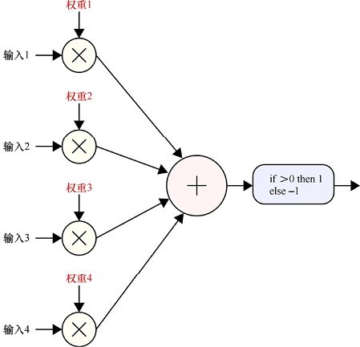
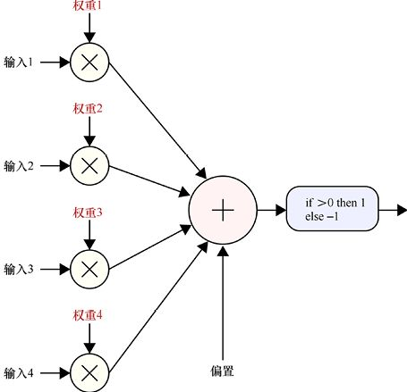
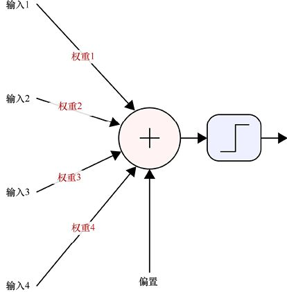
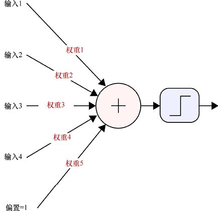
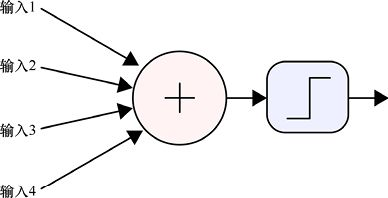
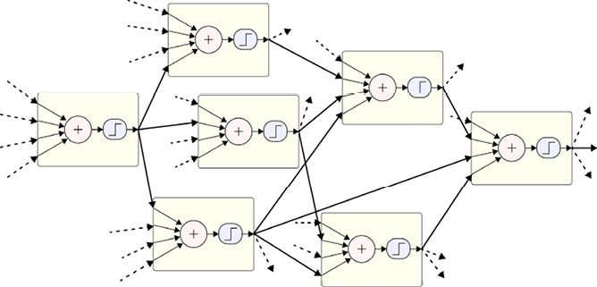
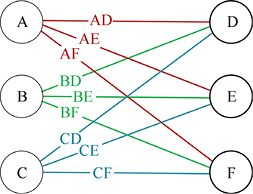

# 第10章　神經元

本章將介紹真實的生物神經元是如何啟發我們在機器學習中使用人工神經元的，以及這些處理過程中的小單元是如何單獨及協同工作的。

## 10.1　為什麼這一章出現在這裡

深度學習演算法是用相互連接的計算元素組建一個**網路**。這個網路的基礎是稱為**人工神經元**的一套計算，或簡單地稱為**神經元**（neuron）。人工神經元是受人類的神經元所啟發而來，即組成人類大腦並且很大程度上決定我們認知能力的神經細胞。

在本章中，我們會簡單地回顧真實神經元，然後在此基礎上看看高度簡化的人工神經元的結構。

我們應當注意，不是所有的機器學習演算法都依賴這種人工神經元。許多重要且有效的技術是基於傳統形式的分析並使用直接的機制（如顯式方程）來為我們找到解決方案。這個過程是不需要也沒有使用神經元的。

當我們研究更加泛化的學習系統時人工神經元才出現，比如，從第20章開始我們將看到由**神經網路**（neural network）組成的**深度學習**系統。在那些系統中，人工神經元是不可或缺的。

正因為人工神經元在那些演算法中的關鍵作用，瞭解它對理解如何設計、搭建、講授和使用現代深度學習系統是很重要的。

## 10.2　真實神經元

人類思維器官的核心元素是一種名為**神經元**的特殊神經細胞。

“神經元”這個詞在生物學中是指分佈在人體各處的各種大量而複雜的細胞。這些細胞有著相似的結構和行為，但它們是專門用於不同的任務的。它們是複雜而精密的生物組織，通常使用化學、電、時間、距離以及其他各種方式來控制它們自己的行為和通信[Julien11] [Lodish00] [Mangels03] [Purves01]。圖10.1所示的是一個生物神經元及其幾個主要結構的草圖。

> **圖片描述：** 此圖為生物神經元的示意圖，標示了主要結構：左側為樹突（接收信號的分支狀結構）、細胞核（位於細胞體中央）、細胞體（神經元的主體），以及延伸出去的軸突（傳遞信號的長管狀結構），末端為突觸末梢（與右側另一個神經元連接的部位）。右側顯示部分的第二個神經元，呈藍色。

圖10.1　一個生物神經元及其幾個主要結構的草圖。該神經元輸出被傳遞給了另一個僅部分顯示的神經元（圖像來自[Wikipedia17b]）

神經元是處理資訊的機器。資訊以名為**神經遞質**的化學物質的形式暫時**結合**（binding）或附著於神經元自身的**受體部位**[Goldberg15]。這類附著物導致電信號傳導進神經元細胞體。每一個電信號可以是正的或者負的——這取決於很多因素。所有電信號在很短的時間間隔內到達神經元細胞體，然後累加並與**閾值**（threshold）做比較。如果電信號總和超過了閾值，那麼新的電信號就會被發送給神經元的另一部分。在那裡，新的神經遞質被釋放到環境中，這些分子再與別的神經元結合，然後不斷重複該過程。

通過這種方式，資訊在流經中樞神經系統中緊密相連的神經元網路時得到了傳播和修改。

如果兩個神經元在物理上的距離足夠靠近，以至於一個神經元可以接收到另一個神經元釋放的神經遞質，我們就說這兩個神經元是連接著的，即使通常它們並沒有物理上的重疊。有證據表明，每個人神經元連接的特定模式對於認知和身份確定來說是與神經元本身同樣重要的[Sporns05] [Seung13]。人的神經元連接圖被稱作**連接體**（connectome）。與指紋或虹膜特徵一樣，連接體也是獨一無二的。

在數十億神經元間不斷流動的電信號和化學信號是我們整個精神世界的重要組成部分，它使得諸如意識、智慧、情感、思維、自我意識、群體意識以及語言等現象成為可能。許多人相信部分或全部的這些能力也需要一個有感官的物理身軀來呈現[Wilson16]。

儘管神經元及它們的周邊環境在電化學方面是複雜而精密的，但如上描述的基本機制卻有著誘人的簡潔性。對此，一些科學家嘗試在硬體或軟體上創造大量的簡化神經元來仿真或複製大腦，並希望能呈現出有趣的反應[Furber12][Timmer14]。迄今為止，能被大多數人稱為智能的結果還未產生。

但已被證明的是，在很多問題上我們可以用一些特定的方法連接神經元，進而產生很好的結果。這些就是我們將在本書中討論的結構類型。

## 10.3　人工神經元

在機器學習中，我們所用的“神經元”是受真實神經元啟發而來，就像人物簡筆畫是受人體啟發而來一樣。它們之間有相似之處，但只是在最普遍的意義上有所類似，其中幾乎所有的細節都失去了。

這種情況導致了一些混淆，特別是在大眾媒體中。有時“神經網路”被用作“電子大腦”的同義詞，並且在這種語境下，似乎它們馬上就可以產生智慧、意識、情感甚至統治世界和消除人類生命。事實上，我們所用的“神經元”是由真實神經元極度抽象和簡化而來的，以至於很多人更喜歡稱它們為“**單元**”（unit）。但無論如何，“神經元”這個詞、“神經網路”這個短語以及所有相關的語言顯而易見地存在了，因此我們在本書中也將使用它們。

### 10.3.1　感知機

人工神經網路的歷史或許可以追溯到兩位具有數學天賦的精神病學家發表於1943年的開創性論文。受啟發於真實神經元，他們給出了神經元基本函數的簡易數學抽象，並描述了這些模型如何被連接到一個**網路**中。這項工作最大的貢獻是他們從數學上證明了“對於任何滿足特定條件的邏輯表達，你都能找到一個按照它描述的方式運行的網路”[McCulloch43]。

換句話說，神經元可以執行數學邏輯；而數學邏輯是機器計算的基礎，也就意味著神經元可以執行數學運算。

這是一件了不起的事，因為它在數學、邏輯、神經元生物學和大腦之間搭建了橋樑。

基於上述觀點，1957年，**感知機**（perceptron）作為神經元的一個簡化數學模型被提出[Rosenblatt62]。圖10.2所示的是一個具有4個輸入的單個感知機框圖。

> **圖片描述：** 此圖展示具有4個輸入的單一感知機框圖。左側4個輸入（輸入1至輸入4）分別與對應的權重（權重1至權重4，以紅色標示）相乘（以×符號表示），乘積結果匯入中央的加法節點（+），最後經過一個閾值判斷（if > 0 then 1, else -1）產生輸出。

圖10.2　單個感知機框圖。每個輸入都是一個單獨的數字。把每個輸入和一個稱為權重的對應實數相乘，再把所有結果加到一起進行測試。如果最終結果為正，那麼感知機輸出1；否則，輸出−1

單個感知機的工作模擬了神經元的功能行為。感知機有許多輸入，每個輸入都是一個浮點數。每個輸入都會與一個對應的稱為**權重**（weight）的浮點數相乘，這些乘法運算的結果都要進行求和。最終，我們將求和結果與一個**閾值**進行比較。如果求和結果大於這個閾值，那麼感知機輸出為1；否則，為−1（在某些版本里，該輸出是1和0，而非1和−1）。

儘管感知機是真實神經元的極度簡化版本，但它已被證明是機器學習系統一個很好的組建模組。儘管我們現在通常會用一些更復雜的方法來替換最終的閾值，但基本的機制是一直不變的。我們將在第17章介紹那些替換方法。

### 10.3.2　感知機的歷史

感知機的歷史是機器學習文化中很有趣的部分。我們來回顧幾個關鍵事件吧！（更完整的版本可以在網上獲取[Estebon97] [Wikipedia17a]。）

當感知機的原理在軟體上得到驗證後，康奈爾大學搭建了一臺基於感知機的電腦。這是一個像冰箱一樣大小的、遍佈金屬絲板的機架，被稱為馬克Ⅰ號感知機[Wikipedia17c]。

這個設備是用來處理圖像的。它有400個光敏電阻器，可以數字化一張分辨率為20×20的圖像。通過旋轉旋鈕可以控制電位器，進而設置感知機每個輸入的權重。為了使學習過程自動化，電位器上裝有電動馬達，這樣該設備便可以“旋轉它自己的旋鈕”來調整權重，從而改變它的計算結果，進而改變輸出結果。該理論保證了只要有正確的資料，這套系統便可以學會用直線分割兩種不同類型的圖像。

然而，大部分有趣的問題包含的都不是可線性分離的資料集，而且該技術很難被推廣到更復雜的資料安排上。經過幾年的止步不前，一本證明“初始的感知機技術本質上存在不足”的書出版了。這表明缺乏研究進展不是因為缺乏想象力，而是因為內置的感知機結構的理論限制。許多有趣的問題，甚至一些非常簡單的問題，都被證明超出了感知機的能力範圍[Minsky69]。

在很多人看來，這個結果意味著關閉了感知機的大門，而後關於“感知機方法就是一個死胡同”的輿論甚囂塵上。熱情、興趣以及經費都逐漸乾涸，大多數人轉去研究別的問題。

但本書只是想說明按照原來通常的方式使用時，感知機有嚴重的限制。一些人認為完全否定整個想法是一種過激反應，或許換一種方法應用感知機，它仍然會是一種有用的工具。當研究者們花費了大約10年半的時間，將感知機組裝到更大的結構上並且展示瞭如何訓練它們後[Rumelhart86]，這種觀點最終被認可。這些組合體輕而易舉地超越了單個單元的限制。之後一系列的論文發表了，這些論文都表明謹慎地排列多個感知機並增加一些小幅改變就可以解決複雜且有趣的問題。

上述發現重新點燃了人們對該領域的興趣，不久之後，對感知機的研究重新變成了人們的話題，並產生了源源不斷的有趣結果。

### 10.3.3　現代人工神經元

我們在現代神經網路中用的“神經元”是由初始感知機略微泛化而來的。它有兩個變化，一個在輸入，一個在輸出。這些修改後的結構通常仍被稱作“感知機”，但很少造成誤解，因為幾乎僅有新版本在使用了。更常見地，它們被稱作**神經元**。

對原始感知機的第一個改變是我們給每個神經元多提供了一個稱為“**偏置**”的輸入。這不是一個來自之前神經元輸出的數，而是一個直接加到加權輸入之和上的數。每個神經元有它自己的偏置。帶有偏置項的原始感知機如圖10.3所示。

我們對感知機的另一個改變是在輸出處。原始感知機會用閾值檢測和值，然後產生−1或1（或者0或1）。為了泛化這種方式，我們用一個數學**函數**替代了整個檢測再輸出的步驟——它將和值（包括偏置）作為輸入，然後返回一個新的浮點數作為輸出。我們稱之為**激活函數**（activation function）。激活函數的輸出可以是任何值。有許多流行的激活函數，它們各有其優缺點（見第17章）。

來看看我們是如何繪製那些神經元的，並找出大多數這些圖所使用的慣例。在圖10.3中，我們顯式地展現了權重，也包括小的乘法節點，以便表示權重是如何乘以輸入的。這佔用了很大的空間。當我們要畫包含大量神經元的圖時，這些細節會使圖變得雜亂而密集。因此，在所有神經網路圖中，**權重實際上都是隱含的**。

> **圖片描述：** 此圖在圖10.2的基礎上增加了偏置項。結構與前圖類似，但在加法節點底部增加了一個「偏置」輸入，該偏置值直接加到加權輸入的總和上，然後再經過閾值判斷產生輸出。

圖10.3　基於圖10.2並帶有偏置項的感知機。偏置項是加在加權輸入之和結果上的單個數字

這很重要，並且值得重複。

在神經網路圖中，權重以及它們與輸入相乘的節點是不顯示出來的，但我們應當知道它們就在那裡，並在腦海中把它們添加到圖中。**權重一直在那兒，並且它們一直在修改輸入。**它們只是沒有被畫出來。

如果我們要展示權重，通常會在從輸入到求和節點的直線上標註權重的名稱，如圖10.4所示。

> **圖片描述：** 此圖展示一種簡化的神經元繪製方式。4個輸入經由標有權重名稱（權重1至權重4，以紅色標示）的連線匯入加法節點（+），底部附有偏置項，輸出端以一個階躍函數小圖表示激活函數的位置。

圖10.4　繪製神經元時，常常把權重標在從輸入到求和節點的直線上。這種“隱式乘法”在機器學習圖形中是很常見的。我們還用一個步驟替換了閾值函數，以提醒我們任何激活函數都可以跟在求和步驟後

可以看到，我們在末端將閾值函數改為了一個小圖。這是一個稱為**階躍**函數的圖，它旨在給我們一個可視化的提醒，即任何激活函數都可以跟在求和步驟後。基本上來說就是一個數字進入那個框，然後一個新的數字出來，而這取決於我們選擇哪個函數來承擔這項工作。

我們可以再簡化一下。這次我們通過假設偏置是一項輸入來省略它。這不但可以讓圖變得更簡單，而且使得它在數學上更簡單，能產生更有效的演算法。由於將偏置重新標記為輸入的做法似乎有點耍小聰明（儘管這樣做是完全沒問題的），這一步被稱為**偏置技巧**（bias trick）（“技巧”這個詞來自數學領域，是用於稱讚巧妙簡化問題的詞）。偏置由此被視為另一項輸入，和其他的輸入一樣，並且它也會乘以一個權重，如圖10.5所示。

> **圖片描述：** 此圖展示「偏置技巧」的實際應用。與圖10.4類似，但偏置被視為第5個輸入（偏置=1），擁有自己的權重（權重5），與其他4個輸入一起進入加法節點，然後通過激活函數產生輸出。

圖10.5　實際中的“偏置技巧”。不同於圖10.4中顯式地表示偏置，這裡假設它是帶有自己的權重的另一個輸入

我們想讓人工神經元圖儘可能簡單。因為開始構建網路時，我們會一次性地羅列非常多的神經元，所以這樣的圖大多采用瞭如下兩個額外的簡化步驟。

第一，它們沒有顯式地表示偏置。記住，偏置是被包括了的（連同它的權重），只是沒有顯示出來。

第二，如前所述，權重也常常被省略。記住，即便我們沒有羅列權重的名字，它也是存在的。即使我們沒有顯示那些權重，人工神經元的每個輸入也會乘以它對應的權重，如圖10.6所示。

> **圖片描述：** 此圖為人工神經元的經典簡化畫法。4個輸入透過箭頭連接到加法節點（+），再經過激活函數（以階躍函數小圖表示）產生輸出。偏置和權重均未顯示但實際存在。

圖10.6　人工神經元的一種經典畫法。偏置和權重沒有顯示，但偏置和權重均實際存在。我們應當在腦海裡把它們加進去

把神經元連入網路時，我們會畫“線”來連接一個神經元的輸出和一個或多個其他神經元的輸入。

就像真實的神經元一樣，人工神經元可以在密集的網路中連接起來，每個輸入都來自其他神經元的輸出，如圖10.7所示。

> **圖片描述：** 此圖展示較大的人工神經網路的一部分。多個神經元（各含加法節點和激活函數）透過連線相互連接，形成密集的網路結構。虛線箭頭表示來自外部的連接。每個神經元從其他神經元接收輸入，並將輸出傳遞給後續的神經元。

圖10.7　更大的人工神經網路的一部分。每個神經元都從其他神經元那裡得到它的輸入。虛線表示來自這個小集群外部的連接

通常，像圖10.7所示的神經網路的目標是產生一個或多個值作為輸出。稍後我們會看到如何以有意義的方式解釋輸出中的數。

即使我們通常像圖10.7所示的這樣不在圖解中畫出權重，有時在討論中提到個別的權重也是有用的。為方便起見，我們約定，給每個權重設定一個由兩個字母組成的名字。

例如，圖10.8展示了6個神經元。為方便起見，我們給每個神經元標記了一個字母。我們僅需結合輸出神經元的名字和輸入神經元的名字，就能給它們之間連線對應的權重命名。例如，將A在被D使用前的輸出所乘的權重稱為AD。

> **圖片描述：** 此圖展示6個神經元（標記為A、B、C、D、E、F）之間的權重命名慣例。左側的A、B、C透過彩色連線連接到右側的D、E、F，每條連線上標註了權重名稱（如AD、AE、AF、BD、BE、BF、CD、CE、CF），名稱由源神經元和目標神經元的字母組合而成。

圖10.8　權重在這幅圖中是顯式表示的。按照慣例，每個權重都有一個由兩個字母組成的名字， 該名字是通過結合權重對應的連線兩端的神經元的名字而來的。例如，BF指的是乘以B的輸出後被F使用的權重

從結構的角度來看，無論我們把權重放在神經元中還是放到連線上，都沒有區別。不同的作者為了讓他們的討論更容易理解，會假設一種又一種案例。如果願意，我們也可以採取其他的方式。

在圖10.8中，我們把從神經元A到神經元D的權重稱為AD。一些作者稱之為DA，因為這樣能更直接地匹配我們寫方程的方式。花些時間檢查一下此類圖中所用的順序總是值得的。

## 10.4　小結

真實的神經元是複雜的電化學神經細胞。它們接收化學信號輸入，將其轉化為電荷，然後累加電荷。如果電荷超過了閾值，神經元會釋放新的化學物質並傳播給其他神經元。這樣一來，神經元可以從許多其他神經元那裡接收資訊，並將它們的資訊傳遞給其他許多神經元。

研究者們發現，神經元的基本功能可以被用來表達邏輯陳述。從那時開始，距離用神經元來執行數學運算就只有一步之遙了。這啟發了我們對人工神經元的研究。

如今的人工神經元接收來自其他神經元的一組數字，並將一個稱為偏置的數作為輸入，然後用一個對應的權重值來放縮它們，再把它們加在一起。該結果會再通過一個名為激活函數的數學表達式計算出一個新的值，並以此作為神經元的輸出。該輸出通常會成為其他神經元的輸入。綜上所述，這些相互連接的神經元就形成了一個神經網路。

## 參考資料

[Estebon97]　Michele D Estebon, *Perceptrons： An Associative Learning Network*, Virginia Institute of Technology, 1997.

[Furber12]　Steve Furber, *Low-Power Chips to Model a Billion Neurons*, IEEE Spectrum, July 2012.

[Goldberg15]　Joseph Goldberg, *How Different Antidepressants Work*, August 2015.

[Julien11]　Robert M Julien, *A Primer of Drug Action*, 12th Edition, Worth Publishers, 2011.

[Lodish00]　Harvey Lodish, Arnold Berk, S Lawrence Zipursky, Paul Matsudaira, David Baltimore, and James Darnell, *Molecular Cell Biology, 4th edition*, Section 21.1： Overview of Neuron Structure and Function, New York: W. H. Freeman; 2000.

[Mangels03]　Jennifer Mangels, *Cells of the Nervous System*, Columbia University, Department of Psychology.

[McCulloch43]　Warren S McCulloch and Walter Pitts, *A Logical Calculus of the Ideas Immanent in Nervous Activity*, Bulletin of Mathematical Biophysics, Vol. 5, pp. 115-133, 1943.

[Minsky69]　Martin Minsky and Seymour Papert, *Perceptrons： an introduction to computational geometry*, The MIT Press, Cambridge, MA. 1969.

[Purves01]　D Purves, G J Augustine, D Fitzpatrick, et al., *Neuroscience, 2nd edition*, Sinauer Associates; 2001.

[Rosenblatt62]　F Rosenblatt, *Principles of Neurodynamics： Perceptrons and the Theory of Brain Mechanisms*, Spartan, 1962.

[Rumelhart86]　David E Rumelhart, Geoffrey E Hinton, Ronald J Williams, *Learning Representa- tions by Back-propagating Errors,* Letters to Nature, Nature, vol. 223, no. 9, 1986.

[Seung13]　Sebastian Seung, *Connectome：How the Brain’s Wiring Makes Us Who We Are*, Mariner Books, 2013.

[Sporns05]　Olaf Sporns, Giulio Tononi, Rolf Kötter, *The Human Connectome： A Structural Description of the Human Brain*”, PLoS Computational Biology, Volume 1 Issue 4, 2005.

[Timmer14]　John Timmer, *IBM Researchers Make A Chip Full of Artificial Neurons*, Ars Technica, August 2014.

[Wikipedia17a]　Wikipedia, *History of Artificial Intelligence*, 2017.

[Wikipedia17b]　Wikipedia, *Neuron*, 2017.

[Wikipedia17c]　Wikipedia, *Perceptron*, 2017.

[Wilson16]　Robert A Wilson and Lucia Foglia, *Embodied Cognition*, The Stanford Encyclopedia of Philosophy, Edward N. Zalta, editor 2016.
