# 第11章　學習與推理

本章介紹如何表示我們判斷為真的陳述，以及如何通過它們來推斷出新的陳述，並判斷這些新陳述的真實性。

## 11.1　為什麼這一章出現在這裡

在獲得新的資訊時，人們都會做出一個判斷，去判定多大程度上可以信任這條新的資訊。基於各種各樣的標準和流程，我們會判定新資訊的可靠性並選擇相信它的程度。如果你覺得這聽起來很熟悉，那是因為基於新資訊更新我們對某事物的當前看法正是貝葉斯推理的全部意義所在（見第4章）。

這並不是一個容易做出的決定。我們一直被事實、部分事實、確實存在的誤解、刻意的歪曲甚至徹頭徹尾的謊言所包圍，那麼，我們怎樣才能做出有關相信什麼的正確決定？

從古希臘開始，哲學家和邏輯學家就一直在建立和發展一種知識體系，試圖為如何判斷新資訊提供可靠的、正式的框架結構[Graham16]。

會學習的電腦程式深受這些想法的影響。邏輯思維的工具構成了電腦“如何從我們提供給它們的資訊中學習”以及“如何將新知識與它們已知的知識相結合”的概念基礎。既然電腦不能使用常識、直覺或者生活經驗進行判斷，那麼它就必須使用一些明確的、正式的規則來處理資訊並從中得出結論。

在本章中，我們將快速地學習邏輯思維中的一些重點問題。

## 11.2　學習的步驟

學習是一個大而複雜的主題，即使我們討論的只是學習的演算法。

為了儘快瞭解事物，我們可以將任意的機器學習系統的學習過程分為3個部分：**表示**（repre- sentation）、**評估**和**最佳化** [Domingos12]。

下面讓我們依次看看這3個部分。

### 11.2.1　表示

系統的**表示**描述了它能夠“瞭解”一些什麼樣的事情，其中包括保存和解釋資訊的結構。我們使用的“表示”限制了哪些事物是可以被存儲、學習和記憶的。

“表示”既是學習器內部的抽象結構，也是進入該結構的資料。在機器學習中，“表示”是一種用於組織數值參數的架構，也是修改和解釋這些參數的演算法。

例如第10章中的感知機，它是通過調整權重在兩組資料之間找到一條直線。在這種情況下，“感知機的權重”以及“對這些權重的使用規則”就是感知機對於（劃分兩組資料的）這條直線的“表示”。

由於結構簡單，單個感知機無法表示彎曲的分界線。這時，我們就說它沒有足夠的**表示能力**（representational power）（或者簡單稱之為**能力**）去描述比一條直線更復雜的東西。即使我們以某種方式“告訴”感知機一條完美地劃分兩組資料的曲線，感知機有限的表示能力也會讓它無法學習或記住這條曲線。

系統是不能“學習”它無法“表示”的東西的。

如果我們想要找到並且記住一條能分割兩組資料的曲線，就需要一個具有**更強大的表示能力**（或者簡單地說有**更強大的能力）**的演算法。

我們有時會說：“演算法表示資訊的方式”和“一組特定的值”共同構成一個**模型**。

強大並不總是對我們有利，正如我們在第9章中看到的那樣，如果系統可以“表示”非常彎曲的邊界，就可能使得曲線非常緊密地跟蹤資料，進而導致過擬合問題。想要訓練出一個具有強大能力的系統，需要慢慢進行，模型的構建也要由簡單到複雜不斷演變。

這就是“需要人為地去為任務選擇正確的演算法”的原因。我們需要利用自身對資料和應用的瞭解，選擇一種表示能力足夠強大的演算法來學習我們想要訓練的東西，但又不至於強大到過度學習（從而導致過擬合）。我們也希望這種“表示”能夠根據正在學習的內容進行完美的調參，使得訓練可以更加高效。

例如，如果我們要在兩個二維資料集之間繪製曲線，就需要一個擅長描述曲線的形狀的“表示”。在這種情況下，“表示”就可能是一個數字列表——它可以給出該曲線的參數，使得我們能夠將它繪製出來。

但是，如果我們要識別對手機說的話，就需要一個擅長描述單詞和單詞發音的“表示”——它可能對應於所說內容的音頻波形和單詞列表。

對於任何給定的“表示”，我們可以根據一個嵌套結構去考慮它可以學什麼。這個嵌套結構包含從理論可行性到對特定資源的高效性的全部內容，層次結構如圖11.1所示。

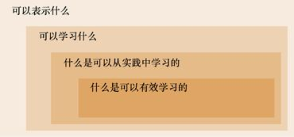

> **圖片描述：** 此圖為巢狀矩形結構的層次圖，由外到內分別標示：「可以表示什麼」（最外層）、「可以學習什麼」、「什麼是可以從實踐中學習的」、「什麼是可以有效學習的」（最內層，以深色標示）。展示了演算法表示與學習能力的層次結構。

圖11.1　組織演算法可以表示和學習的資訊的層次結構

在最外層，系統的“表示”告訴我們它能描述並記住什麼，因此這一層就包含了一切它可以從理論中學到的東西。我們可以想到其中還有一些雖然能夠被表示卻無法被學習的東西。

回想一下我們在第6章中對資訊理論的討論，我們想要描述的每條資料都需要一定數量的資訊，通常以比特為單位。在實踐中，我們通常只會用一個固定的、有限的位數對每條資料進行存儲。例如，如果我們使用8位存儲整數，就可以表示0～255的任意數字，但不能表示負數或任何比255更大的數字。不過，我們可以有更多的辦法。例如，π值是無限不循環小數，無法被完整地表達，但即使利用有限的記憶體，我們也可以存儲一個可以根據需求計算出想要的π值的程式。

還有另一個例子，如果我們想要表示未來一年中將形成的每一場颶風，那麼只需要分配記憶體來保存它將形成的日期、將消散的日期、最大風速等。但目前我們無法得知這些東西，現在能做的就是為所知道的那些颶風特質分配標籤，並將它們的數值留白。

一個更抽象的例子來自電腦科學。**停機問題**（halting problem）需要特定的電腦程式和特定的輸入，並詢問該程式是否最終會停止並輸出，或者是否會永遠運行[Kaplan99]。這個結果很容易用“是”或“否”來表示，但事實證明，理論上我們是不可能預測到答案的。找答案的過程不僅是困難的，也是非常耗時的，而且確實不可能完成。即使我們可以查看程式本身，並使用所有存在或可能存在的工具，這個問題也是根本無法回答的（這一點可以被證明）。

我們可以採取實踐的方法去運行這個程式，如果它停止，那麼我們知道對於該程式來說，“這個程式是否會停止？”的答案是：“是的，最終它會停止”。但這個程式可能會運行幾十年，而這期間我們不能說：“不，它永遠不會停止”，因為可能我們剛決定放棄，它就停止了。所以，我們是無法預測結果的，我們可以“表示”一個程式在處理特定輸入時是否會停止，卻無法得到答案。

因此，我們希望將注意力集中在那些理論上可以學習的事情上。除此之外，有些事情可能需要一些不切實際的資源量（如無限時間或計算能力），所以我們想進一步將關注限制在那些可以在實踐中學到的東西上。最後，考慮到可以利用的時間和資源，我們想再次縮小範圍，將注意力限制在那些可以進行高效學習的東西上。

我們通常使用那些可以通過設置參數進行調整的“表示”，使得“表示”可以匹配我們的問題和資料。這樣做可以將“表示”限制在對我們有用的範圍內（例如，彎曲的二維邊界），併為我們節省學習不關心的資訊的時間。

通常我們會根據自己為系統選擇的架構做出這些選擇（或者進行這些參數的設置），但是一定要記住，演算法只能發現和學習它們能夠以某種方式描述（或者“表示”）的資訊。所以，我們不能“學習”自己無法“表示”的東西。

### 11.2.2　評估

學習是一個連續的過程，為了衡量系統的學習效果，我們需要進行**評估**（evaluation）。

評估時，我們需要對比系統對某種類型刺激的響應和我們所期望的反應。

在機器學習中，我們通常使用數字形式的分數來量化此過程。這一分數被稱為**誤差分數**或**損失分數**（或者僅稱為**誤差**或**損失**），它從某種程度上反映了演算法與我們想要的結果有多接近。損失越小，系統性能越好。我們可以用任何方式衡量誤差，只要能幫助系統學習我們想要訓練它的東西。

例如，我們可以用第3章中的準確率、精度、召回率等概念衡量誤差。當我們試圖訓練系統識別貓時，如果想確保只將我們確定為貓的東西標記為貓，那麼我們可以設定一個高的準確率。相反，如果我們想確保大多數貓的圖被正確標記，那麼可能會在精度較低時指定高誤差。

大多數庫提供了大量的誤差函數，以輔助我們去編寫自己的程式。

### 11.2.3　最佳化

如果系統的學習過程不夠完美，我們就希望去改進它。這一過程稱為**最佳化**（optimization），或者說我們正在**最佳化**系統。

注意，這與此係統**最優**（optimal），或者說處於**最佳狀態**（optimum）是不同的。這些術語（最優或最佳狀態）指的是在某些情況下已達到理想狀態的系統。換句話說，處於最佳狀態的東西都是無法改善的。最佳化過程可以看作使系統越來越接近最佳狀態的過程，但它（也許）永遠不會達到最佳狀態。

當我們考慮演算法及其最佳性能時，事情會變得微妙起來。

打比方說，假設我們想通過把衣服掛在晾衣繩上來曬乾一些衣服。我們可以只是把它們隨意搭在繩子上，但更願意把它們掛起來。最佳解決方案是使用一個或多個衣架，因為這樣既簡單又便宜，還不會對衣服造成傷害。但現在假設我們用了一個糟糕的解決方案：用膠帶把衣服粘到繩子上。這就會導致很多問題，所以我們要開始最佳化。也許我們會發現一種品牌的膠帶黏度稍微弱一些，當我們將衣服從膠帶上撕離時，不會扯壞衣服，於是便選擇了這一品牌的膠帶。之後，也許我們會縱向切割膠帶條，這樣就不至於拖下繩子。我們通過這種方式最佳化糟糕的解決方案，使它變得更好，但是並沒有朝著全局最佳狀態發展，因為我們還沒有把膠帶變成一組衣架。

從概念上講，這類似於我們在第5章中討論過的尋找曲線或曲面的全局最小值問題。最佳化是通過接近局部最小值來進行改進的，而達到最優通常意味著找到全局最小值。

最佳化學習器的過程由名為**最佳化器**的專用演算法執行。機器學習中有許多不同的可用的最佳化器，並且還在不斷更新。在第19章中，我們將見到一些最受歡迎的最佳化器。但是為什麼需要這麼多最佳化器呢？畢竟我們總是希望以最有效的方式學習，難道就沒有一個我們可以一直使用的最佳最佳化器嗎？

答案肯定是“沒有”。不僅沒有已知的最佳化器能在我們可能想要解決的所有問題上都表現得最好，我們還可以證明不存在這樣一種最佳化器，即能夠在任何情況下表現得比所有其他最佳化器好。這個著名的結論被生動地命名為“無免費午餐定理”[Wolpert97]。

因此，正如我們為每個學習器選擇正確的表示一樣，我們也會通過經驗、預感以及研究來選擇一個最佳化器，以期最大程度地最佳化我們的具有特定表示、演算法和資料的學習過程。

## 11.3　演繹和歸納

學習的核心是將資料轉化為知識的能力。也就是說，我們希望把用數字、標籤、字符串等形式表示的原始資料轉換為對我們有意義的模式和描述，以幫助我們理解資料，抑或理解我們和資料共享的更廣闊的世界。

人們花了幾千年研究我們的學習方式。哲學家、教育學家、神經心理學家等對學習進行了深入的研究，提出並討論了大量的觀點。不過，我們不會調查這個主題。

幸運的是，到目前為止，大多數機器學習演算法僅基於兩種通用的學習方法。

這兩種方法是**演繹**（deduction）和**歸納**（induction）。當我們從事科學研究時，這兩種方法通常是並用的。

一般來說，演繹的過程從一個理論或者**假設**開始。然後，我們收集證據，來看這些理論是否準確。如果有證據支援我們的理論，我們就可以從中學習，以改進理論；如果有證據駁斥了我們的理論，我們通常就會縮小預測的範圍，以排除那些不正確的情況。這樣一來，理論就變得更加強大、更精確。

如果最終有足夠的資料支援，我們就會宣佈理論是對正在討論的主題的潛在解釋。提出一條理論的目標是：可以肯定地說，如果滿足某些條件，將產生某些結果。

如果沒有足夠的資料支援，我們就會放棄或者完善理論，並開始尋找新的資料，以證實或反駁理論。

相比之下，歸納則開始於觀察，然後我們會在任務中進行檢索以尋找規律。新觀察越支援這些規律，我們就越有可能認可這些規律。隨著時間的推移，我們開始對“什麼是可能的”“什麼是或許的”以及“什麼是不可能的”提出試探性的想法。當其中一個想法變得具體並且似乎得到了大量資料的支援時，我們可以將其表達為假設，並將其作為演繹的起點。

在歸納推理時，我們從不會斷言某些觀察結果一定意味著某些結論是正確的，因為我們總是認為可能出現一些新的觀察結果，並完全破壞我們的規律。相反，我們會說某些東西通常或者可能是正確的，其確定性程度取決於我們所見過的例子的性質和數量。

我們有時會說演繹是**自上而下**（top-down）的：從一般假設開始，然後收集特定的資料去支援和改進這一假設。而歸納則是**自下而上**（bottom-up）的：從觀察開始，然後根據我們在資料中發現的規律逐漸形成假設。

讓我們依次深入研究這兩種方法。我們將看到它們都為機器學習演算法的順利工作做出了貢獻。

## 11.4　演繹

演繹，也稱為**演繹推理**（deductive reasoning）、**演繹邏輯**和**邏輯演繹**，是從一般到特定的過程。

在接觸抽象的概念前，讓我們先看一個演繹的例子：以經典懸疑小說的方式破解一起謀殺案。

案發現場在羅林森莊園。這座豪宅位於Forlorn島的最高的山頂上。一天晚上，莊園裡沒有客人，碼頭也沒有船隻，Vivian夫人像往常一樣上床休息，她周圍的牆上掛滿了已故丈夫狩獵的戰利品、槍支和劍。早上，女僕帶著早餐進入她的臥室，隨後發出了一聲尖叫，托盤滑落到了地上。Vivian夫人已經死了，她丈夫的劍深深地插在她的胸前。

幾個小時後，偵探Stanshall到達現場。他在客廳裡召集了所有僕人，並使用演繹法進行斷案。

他開始說出自己的推論：“昨天晚上有人殺了Vivian夫人，這個房間裡的每個人都是嫌疑人。她沒有辦法用這麼長的彎刀刺傷自己，是其他人刺傷了她，任何一個可能做這件事的人都在這個房間裡，你們中的任何一個都可能是兇手。”

之後，他開始檢驗這一推論。Stanshall觀察到女僕已經80歲了，且身體孱弱，於是他做出假設：女僕沒有力氣舉起沉重的劍。

他用角落裡一套盔甲上的頭盔對該假設進行了檢驗。他讓這個女僕過來並把頭盔遞給她——頭盔的重量比殺死Vivian夫人的劍要輕。女僕一拿起頭盔，就氣喘吁吁、跌跌撞撞，差點把頭盔扔到了自己的腳上。現在已經可以確認他的假設了，女僕沒有力氣舉起謀殺Vivian夫人的武器。於是，Stanshall**推斷（演繹得出）**女僕不可能成為兇手。

隨後，Stanshall將他的推論進行了完善。“昨晚有人殺了Vivian夫人”，他說，“可能殺了她的人都在這個房間裡。除了女僕，你們中的任何一個都可能是兇手。”

通過重複假設和觀察，Stanshall不斷完善他的推論。他的一些假設旨在排除嫌疑人，而另一些假設要確認一個做出這件事的嫌疑犯。Stanshall每次觀察一個人，不斷地使他的推論變得更加強大、範圍更小，最後只剩下廚師和管家。由此，他推斷出謀殺是由這兩個人共同完成的。

圖11.2展示了這一排除過程。

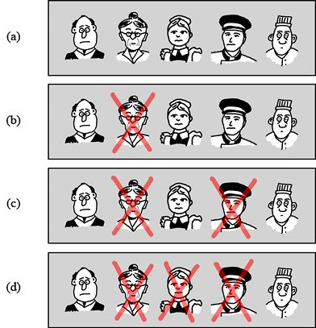

> **圖片描述：** 此圖以四行漫畫人物說明演繹推理破案過程。(a)展示5名嫌疑人；(b)以紅色叉號排除老年女僕；(c)進一步排除男僕；(d)再排除年輕女僕。最終只剩管家和廚師未被排除。

圖11.2　通過演繹來破解一起謀殺案。(a)5名嫌疑人；(b)排除老年女僕；(c)排除男僕；(d)排除年輕女僕。只有管家和廚師不能排除

我們說演繹過程始於**論域**，或者說始於假設所涉及的對象。在這個例子中，論域始於房間中的所有僕人。通過假設、預測和觀察，Stanshall降低了該範圍中的**潛在可能**，直到他的推論適用於所有剩餘的僕人——剩餘的僕人也就是廚師和管家。

最精簡的演繹推理形式是**三段論**（syllogism），這是一個由一般概念推理到特定概念的3個連續語句組成的列表[Kemerling97]。

三段論有幾種常見的形式。我們首先介紹最著名的**直言三段論**（categorical syllogism）。以下是直言三段論的**標準形式**。

（1）沒有魚生活在月球上。

（2）弗蘭克是一條魚。

（3）因此，弗蘭克並不住在月球上。

最後的陳述稱為**結論**（conclusion）。在句子結構方面，它表達了句子**主語**（subject）（在這個例子裡是“弗蘭克”）與其**謂語**（predicate）（在這個例子裡是“生活在月球上”）之間的關係。

圖11.3說明了這個三段論中的術語。

第一個陳述被稱為（三段論的）**大前提**（major premise），它告訴我們關於結論的謂語（“生活在月球上”）的一些事情。第二個陳述被稱為**小前提**（minor premise），它告訴我們關於結論的主語（“弗蘭克”）的一些事情。大小前提共享一個用於連接它們的**中間項**（middle term），但是這個中間項（“魚”）不會出現在結論中。

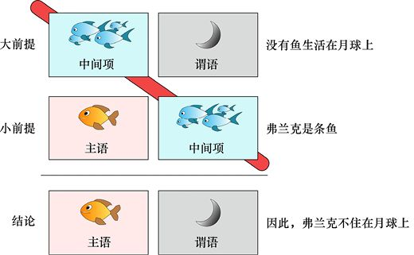

> **圖片描述：** 此圖以圖解方式展示直言三段論的結構。分為三行：大前提（魚和月球的關係，標示中間項和謂語）、小前提（弗蘭克和魚的關係，標示主語和中間項）、結論（弗蘭克和月球的關係，標示主語和謂語）。紅色斜線表示中間項在結論中被省略。

圖11.3　直言三段論中的術語。結論將主語和謂語結合在一起。如豎條所示，中間項被省略了

如果結論能夠正確地從前提中得出（如本例所示），我們就說三段論是**有效**（valid）的；否則，它是**無效的**（invalid）。

如果三段論無效，那是因為邏輯出了問題。有幾種常見的方法可以使邏輯混亂。每種方法都會產生一種不同形式的**三段論謬誤**（syllogistic fallacy），也可以簡單地說是一種**謬誤**，其中許多謬誤都有自己的名稱。下面我們將看到其中的一些謬誤。

注意，有效性與前提的**準確性**無關，也與它們在現實世界中是否有意義無關。只要邏輯成立，三段論就是有效的。

正是三段論的這種機械性，使得它非常適合電腦。我們可以用軟體對步驟進行編碼，只要程式沒有錯誤，我們就可以保證該過程將基於前提產生一個結論。我們不必解釋或思考這些陳述指的是什麼，也不必解釋或思考它們的意義。

考慮準確性（或者與現實世界的相關性）時，它會被**合理**（sound）這一概念所涵蓋。如果三段論本身是有效的，並且它的前提都是真的，那麼它不僅是有效的，而且是**合理的**。如果三段論有效但前提不正確，那麼它就是**不合理**（unsound）的。

有這樣一個示例：

（1）長頸鹿都喜歡放風箏；

（2）保齡球都是長頸鹿；

（3）因此，保齡球都喜歡放風箏。

這個三段論是有效的，因為結論從前提正確得出。但它是不合理的，因為這些前提本身並不是現實世界中的真實陳述。

從13世紀開始，直言三段論可能就已經開始以這樣或那樣的形式出現在邏輯著作中[Allegranza16]。它看起來是這樣的：

（1）人都是凡人；

（2）蘇格拉底是個人；

（3）因此，蘇格拉底是凡人。

讓我們通過繪製框圖來表示對象類別，以說明這個直言三段論中的步驟，如圖11.4所示。

三段論有多種類型，它們各有自己的結構。以下是其他一些形式的三段論[Fiboni17]。

**條件三段論**（conditional syllogism）會在第一行表明一個一般關係或條件為真，而在第二行給出關於特定關係實例中的元素的一些資訊，在第三行顯示結論。

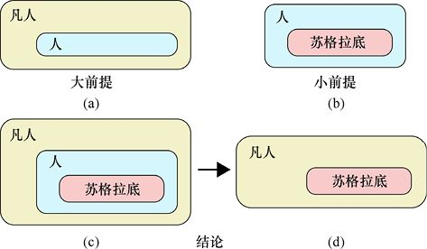

> **圖片描述：** 此圖以框圖方式展示直言三段論。(a)大前提：「人」的框在「凡人」的框內；(b)小前提：「蘇格拉底」在「人」的框內；(c)兩者結合；(d)結論：消除中間項後，「蘇格拉底」直接在「凡人」框內。

圖11.4　用圖表示的直言三段論。(a)大前提是“所有人都是凡人”；(b)小前提是“蘇格拉底是個人”；(c)結合以上前提的結果；(d)通過消除中間項，我們得到邏輯上有效的結論

例如：

（1）如果下雨，那麼約翰穿著雨衣；

（2）現在在下雨；

（3）因此，約翰穿著雨衣。

這是有效的（其合理性取決於當天的天氣和約翰的習慣）。如果是如下這樣一個三段論：

（1）如果下雨，那麼約翰穿著雨衣；

（2）約翰穿著雨衣；

（3）因此，下雨了。

這就是無效的，因為結論不是正確推出的。即使沒有下雨，約翰也可能穿著他的雨衣，因為穿著雨衣很舒服或是可以保暖。

**析取三段論**（disjunctive syllogism）是在第一行斷言一種情況或另一種情況是正確的，但是不能兩種情況同時正確，然後在第二給出進行決定所需的資訊。

例如：

（1）房間被塗成紅色或藍色；

（2）這個房間沒有被塗成紅色；

（3）因此，房間被塗成了藍色。

這是一個有效的三段論，因為第二行中添加的資訊迫使其得出結論。再來看下面這個三段論：

（1）今晚天空是晴朗的/多雲的；

（2）鮑勃喜歡看星星；

（3）因此，天空是晴朗的。

這個三段論是無效的，因為沒有合理的理由可以說明鮑勃喜歡觀看星星就意味著天空是晴朗的。

### 直言三段論謬誤

在三段論中，我們很可能會犯邏輯錯誤，特別是在各個部分中使用非常複雜的語言的時候。

現在，我們討論一些典型的錯誤，在本節中稱其為**謬誤**（fallacy）。

邏輯學家通常使用字母而不是描述來簡化語言。例如，關於蘇格拉底的三段論通常以這種方式呈現[Hurley15]。

（1）A都是B。（所有人都是凡人。）

（2）C是A。（蘇格拉底是個人。）

（3）因此，C是B。（蘇格拉底是凡人。）

這種表達是很有幫助的，但是需要一些時間去適應，所以我們仍使用原來的語句。

這裡討論的謬誤都有一個存在了很長一段時間的名字，而且這個名字往往不夠簡潔。

假設我們的三段論指的是特定商店中的水果，那麼論域就是“商店裡的水果”。我們通常會對一些類別如“是蘋果的水果”“是香蕉的水果”以及更常見的“成熟的水果”特別感興趣。碰巧今天我們剛剛進貨，蘋果、香蕉和杏子都已成熟，但是交付時出現了混亂，商店的其他水果還都是青的，尚未成熟。

先討論第一種邏輯謬誤，即**肯定後項**（affirming the consequent）：

（1）蘋果都成熟了；

（2）這個水果成熟了；

（3）因此，這個水果是蘋果。

這個問題在於，還有很多其他成熟的水果不是蘋果，如圖11.5a所示。

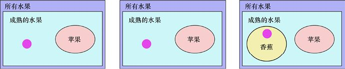

> **圖片描述：** 此圖以集合圖展示三種三段論謬誤。每個子圖中，紫色大框代表「所有水果」，綠色區域代表「成熟的水果」，黃色橢圓代表「蘋果」。粉紅色小圓點標示反例位置。(a)肯定後項；(b)否定前件；(c)大詞不當。

(a)　　　　　　　　　　　　　　　　　　　　　　　　(b)　　　　　　　　　　　　　　　　　　　　　　　 (c)

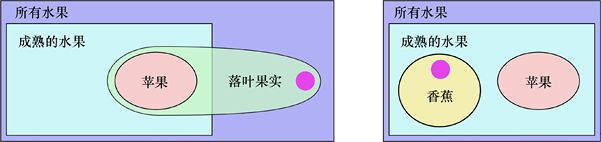

> **圖片描述：** 此圖繼續以集合圖展示兩種三段論謬誤。(d)小詞不當：蘋果和落葉果實的集合關係圖；(e)中詞不周延：蘋果和香蕉同在成熟水果框內但彼此獨立。粉紅色小圓點標示反例。

(d)　　　　　　　　　　　　　　　　　　　　　　　　　　　　 (e)

圖11.5　一些常見的三段論謬誤。(a)肯定後項；(b)否定前件；(c)大詞不當；(d)小詞不當；(e)中詞不周延

在圖11.5中，“所有蘋果都成熟了”的條件是由完全在框內（“成熟的水果”）的橢圓（“蘋果”）表示的。橢圓中的任何一個點都是一個蘋果。由於整個橢圓都在框內，因此蘋果也都是成熟的。框內的其他點也都是成熟的水果，但不是蘋果。框外的點可能是不成熟的水果，也可能不是水果，或者既不成熟又不是水果。與每個謬誤結論相矛盾的例子表示為小圓點。

肯定後項這種謬論是說，因為所有蘋果都成熟了，而這個水果成熟了，所以它就是一個蘋果。但是，可以看到小圓點是成熟的水果，但不是蘋果。

**否定前件**（denying the antecedent）的謬誤與肯定後項非常類似，只是它是從相反方向推理的：

（1）蘋果都成熟了；

（2）這個水果不是蘋果；

（3）因此，這個水果還不成熟。

問題是除了蘋果，還有很多水果是成熟的，如圖11.5b所示。這裡的小圓點不是蘋果，但它已經成熟了。

**大詞不當**（illicit major）的謬誤如下所示：

（1）蘋果都成熟了；

（2）沒有香蕉是蘋果；

（3）因此，沒有香蕉成熟。

結論並不成立，因為蘋果不是唯一成熟的東西，如圖11.5c所示。在這個例子中，小圓點是成熟的香蕉。

**小詞不當**（illicit minor）的謬誤如下所示：

（1）蘋果都成熟了；

（2）蘋果都是落葉果實；

（3）因此，所有落葉果實都是成熟的。

問題是還有很多其他的落葉果實，如杏子和桃子，也許其中的一些果實是不成熟的，如圖11.5d所示。小圓點表示另一種未成熟的落葉果實（可能是梨或李子）。

最後，**中詞不周延**（undistributed middle）的謬誤如下所示：

（1）蘋果都成熟了；

（2）香蕉都成熟了；

（3）因此，香蕉都是蘋果。

這個謬誤來自一個事實，香蕉和蘋果是不同的水果，但都是成熟的，如圖11.5e所示。小圓點表示的是香蕉而不是蘋果。

上述這些只是三段論中的一些常見謬誤。

批判式地聽取當代媒體中的主流論點，你會發現，謬誤都是活生生的、真實存在的，並且經常發生。如果人們說話語速很快且充滿激情，很容易忽略謬誤，特別是當前提本身是由複合論點構成的時候。無論謬誤是故意欺騙所導致的，還是不經意的推理錯誤，結果都會使我們對某些不準確的事情深信不疑。一般來說，發現推理中的這些謬誤是需要觀察和實踐的，這樣才能知道結論的不正確性[Garvey16]。

記住，通過錯誤推理得出的結論並不一定是錯誤的，基於其他原因，結論可能是正確的。我們所知道的只是：作為這個推理的結論，它是不正確的。

演繹方法的清晰邏輯是它在科學領域頗受歡迎的原因——沒有解釋或猜測的餘地。根據邏輯規則，要麼結論可以通過前提得出，要麼結論無法通過前提得出。

這樣做的結果是，我們能夠非常確信地給出一個答案：如果前提是正確的，那麼結論要麼成立要麼不成立，沒有灰色區域。

## 11.5　歸納

歸納推理，也稱為**假設測試**，是一個從特定到一般的過程。

歸納始於觀察，隨著觀察的不斷積累，我們發現一種模式，並將其作為一種假設提出來，但是我們始終認為假設可能是錯誤的。越多找到一些與假設一致的觀察，我們就越有信心。但是我們永遠不會說確定了某個結論——總是有出錯的可能。

例如，我們可能會發現所見過的烏鴉都是黑色的，然後就可以說：“很可能所有烏鴉都是黑色的”。但是我們並不會完全確定，因為也許明天我們就會看到一隻橙色的烏鴉。我們可以非常肯定這件事不會發生，但是不能絕對肯定。這其中的重點在於我們是從觀察中概括出結論的，總有可能有新的觀察與我們得到的規律相矛盾。正如我們在第4章中看到的那樣，這個過程可以使用貝葉斯法則進行形式化。

在歸納推理中，從真的前提開始，在邏輯沒有錯誤的情況下，是有可能得出錯誤結論的。

例如，我們可能會觀察1000個蘋果，它們都長在一棵樹上。基於此，我們可能會說：“極有可能所有蘋果都是長在樹上的”。儘管我們正確地進行了1000次觀察，但明天就可能會發現一種水培生長的蘋果，並沒有長在樹上。這一反例將破壞我們的結論，也會破壞以此作為證據的任何其他結論。

在這種情況下，我們可以通過改變措辭來恢復一些結論的正確性，也許可以改為“大多數蘋果長在樹上”。如果看到更多的水培生長蘋果的例子，我們就可能會進一步削弱這個結論，也許結論就變成“一些蘋果長在樹上”甚至是“很少的蘋果長在樹上”。

現在，讓我們來看一下歸納的一些規則[Fieser11]。用於描述機器學習的一些術語（如**泛化**和**預測**）都將直接取自這些規則。

我們將討論**總體**，這是我們可以觀察到的一些群體或一些類別。**樣本集**則是從總體中隨機抽取的一些事物（或者可能只是對這些事物進行觀察），**單個樣本**是群體中的單個對象（或者對該對象的觀察）。一定比例的群體具有一種**特徵**（例如，它們超過一定的重量，具有一定的顏色，或者在秋天落葉），如圖11.6所示。

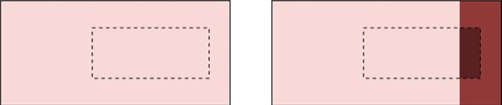

> **圖片描述：** 此圖以兩個矩形說明總體與樣本集的關係。(a)大矩形代表總體，內含虛線小矩形代表樣本集；(b)總體中15%為深色，樣本集中同樣有15%為深色，說明樣本集可代表總體。

(a)　　　　　　　　　　　　　　　　　　　　　　　　　　　　　　　　　(b)

圖11.6　如何看待歸納的規則。(a)總體是較大的矩形，樣本集是用虛線繪製的較小的矩形；(b)假設15%的總體是深色的。因為樣本集可以很好地代表總體，所以樣本集中也有15％的成員是深色的

回到水果店的例子，總體可能是商店的蘋果庫存。樣本集可以是裡面有隨機選出的幾個蘋果的購物車。單個樣本是從樣本集或總體中選出的一個蘋果，特徵可能是蘋果的重量。

**泛化**（generalization）規則是說，我們從樣本集中學到的東西，對於總體來說同樣適用。

例如：

（1）購物車中15％的蘋果重量超過85克；

（2）因此，商店裡有15％的蘋果重量超過85克。

我們可以在形式上對第二個陳述進行限定，比如，“因此，商店裡很可能有15%的蘋果……”。但是在實踐中，我們通常將這些額外的限定詞視為隱含的，因此不必反覆重複它們，如圖11.7所示。

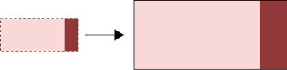

> **圖片描述：** 此圖展示泛化規則。左側為樣本集（小矩形，15%為深色），箭頭指向右側的總體（大矩形），其中同樣有15%為深色。說明樣本集的屬性可推廣至總體。

圖11.7　泛化規則，即樣本集的屬性也適用於總體。其中，15%的樣本集是深色的，這告訴我們15%的總體也是深色的

在用訓練集訓練學習器時，我們所依賴的正是這個規則。因為我們認為訓練集代表了系統將要接觸的更普遍的資料，並且相信系統學習訓練資料的屬性也將適用於它在部署後接收到的資料。

**統計三段論**（statistical syllogism）的規則讓我們可以從對總體的認識推廣到從總體中得出的對個體的認識。

例如：

（1）商店裡有15％的蘋果成熟；

（2）這個蘋果是從商店隨機挑選出來的；

（3）因此，這個蘋果成熟的可能性為15％。

圖11.8展示了這個想法。

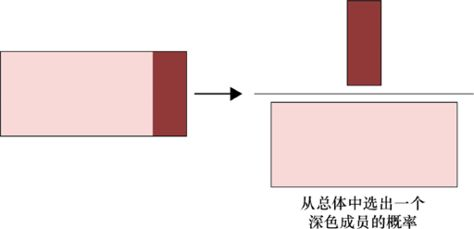

> **圖片描述：** 此圖展示統計三段論規則。左側為總體矩形（15%為深色），箭頭指向右側放大的總體，上方獨立抽出一個深色小方塊，標示「從總體中選出一個深色成員的機率」。

圖11.8　統計三段論規則。使用第3章中投擲飛鏢的例子所用的繪圖方法來表示。總體的15%是深色的，如果我們隨機選擇總體中的一個成員，那麼它也有15%的可能性是深色的

最後，**預測**（prediction）使得樣本集的特徵被從總體中選出的個體所共享。

例如：

（1）購物車中15%的蘋果已經成熟；

（2）因此，我們從商店中選擇的下一個蘋果有15%的可能性也是成熟的。

圖11.9直觀地展示了這個想法。

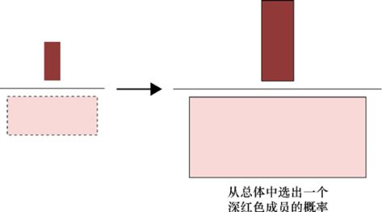

> **圖片描述：** 此圖展示預測原理。左側為樣本集（上方有一個深色小方塊），箭頭指向右側放大的總體，上方同樣有一個深色小方塊。說明從樣本集的特徵可預測總體中隨機選擇成員的屬性。

圖11.9　預測原理。樣本集的15%是深色的，因為樣本集與總體是匹配的，所以，如果從總體中隨機選擇成員，我們就有15%的機會獲得深色的成員

### 11.5.1　機器學習中的歸納術語

可以看到，我們在機器學習中經常使用的術語**泛化**和**預測**不是憑空產生的，它們來自歸納推理理論。

正如我們所看到的，歸納中的**泛化**告訴我們，如果已經瞭解了樣本集的某些特徵，那麼我們應該期望總體的特徵是相似的。在機器學習方面，我們說演算法的**泛化**能力描述了它將從訓練集中學到的知識應用到真實資料的能力如何。

在歸納中，**預測**告訴我們，如果我們瞭解了樣本集的某些特徵，那麼從總體中選擇的單個樣本也會共享該性質。在機器學習方面，一旦從訓練集中學習到了某些知識，我們就說可以通過它為總體中的每個樣本**預測**一個值（如標籤或數字）。

### 11.5.2　歸納謬誤

因為歸納非常靈活，所以我們有可能犯各種各樣的錯誤。現在，讓我們來看看其中的一些問題。

圖11.10展示了一組歸納謬誤（共有4個）。假設總體由圓上的點組成，那麼樣本集將始終是這些點的集合。我們希望總能得出“資料會形成一個圓”的結論，而用其他線標出的就是能夠使推斷變為謬誤的非圓形狀。

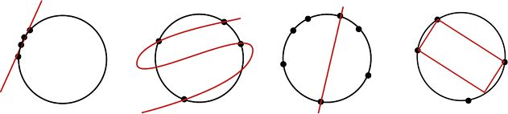

> **圖片描述：** 此圖展示四種歸納謬誤。四個圓形上各有若干資料點（黑點），紅色線條代表錯誤的歸納結論。(a)輕率概化：少量點擬合成直線；(b)不當概化：少量點擬合成S形曲線；(c)懶於歸納：明顯圓形資料卻擬合成直線；(d)偏性抽樣：圓形資料卻擬合成方形。

　　(a)　　　　　　　　　　　　　　　　　 (b)　　　　　　　　　　　　　　　　 (c)　　　　　　　　　　　　　　　　 (d)

圖11.10　一些歸納謬誤。(a)輕率概化；(b)不當概化；(c)懶於歸納；(d)偏性抽樣

造成圖11.10 a的原因是**輕率概化**（hasty generalization），它的產生是由於使用了一個小的、不具有代表性的樣本集。其中，資料點近乎形成一條線。避免這種誤差，應使用更多的資料。造成圖11.10b的原因是**不當概化**（faulty generalization），它的產生是因為使用的樣本過少。對於給定的4個點來說，S形似乎是合理的，但是，如果添加更多的點，就可以排除它。造成圖11.10c的原因則是**懶於歸納**（slothful induction），我們忽略了最簡單的、最合理的或者說最明顯的結論，而選擇了其他的東西。這組點最明顯的形狀是圓形，而不是直線。圖11.10d中發生的是**偏性抽樣**（biased sampling）。儘管是在有證據的情況下，它的結果也會來自我們想要看到的東西。在圖中，我們想要的是一個方形，也就是我們所看到的東西。圖11.11顯示了另一組歸納謬誤。

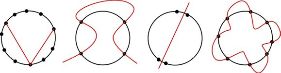

> **圖片描述：** 此圖展示另外四種歸納謬誤。(a)壓倒性例外：忽略不符合直線的資料點；(b)以偏概全：用複雜曲線解釋簡單形狀的資料；(c)誤導性鮮活個案：只看到直線而忽視其他可能；(d)片面辯護：將圓形上的資料點解釋為花瓣形狀。

(a)　　　　　　　　　　　　　　 (b)　　　　　　　　　　　　　　 (c)　　　　　　　　　　　　　　(d)

圖11.11　另一組歸納謬誤。(a)壓倒性例外；(b)以偏概全；(c)誤導性鮮活個案；(d)片面辯護

圖11.11a中的**壓倒性例外**（overwhelming exception）與輕率或不當概化類似，但是我們明確地移除了不符合結論的資料，這也被稱為**排除證據謬誤**（fallacy of exclusion）。在這裡，我們提出了一個不太可能的論點：我們沒有使用的8個點是實驗誤差，因此應該被忽略。圖11.11b中的**以偏概全**（appeal to coincidence）意味著我們忽略了最明顯的解釋並選擇了其他的東西。這4個點更可能是矩形、圓形或是其他簡單的形狀，而不是這個複雜的曲線。圖11.11c中的**誤導性鮮活個案**（misleading vividness）是指我們的感官被一種無法忘記的感覺所控制，致使我們可能只能“看到”一條直線而無法想象出另一種選擇。圖11.11d中的**片面辯護**（special pleading）涉及有選擇地重新解釋結果，通常需要向權威機構求助。我們的團隊中可能有經驗豐富的人，他們堅持認為這8個點構成了一朵花，因此我們遵從他們的判斷，做出決定所用的不是資料而是他們的經驗。

## 11.6　組合推理

正如我們在前面提到的，科學經常被稱為演繹學科。這是一個吸引人的特徵，因為演繹受到邏輯的嚴格約束，而歸納是靈活的，並且永遠不能完全確定其結論。

但演繹很少獨自出現。考慮我們給出的直言三段論的經典例子：

（1）人都是凡人；

（2）蘇格拉底是一個人；

（3）因此，蘇格拉底是凡人。

小前提是“蘇格拉底是一個人”，這是我們可以直接觀察的事物（雖然現在不再是了，但讓我們假裝它為了這次討論還在）。

但是大前提“人都是凡人”（也就是說，人最終都會死）是一個我們無法當場確認的想法。它來自於觀察，是從這些觀察中發展出的一般原則或假設。

讓我們回到直言三段論的大前提“人都是凡人”，並以歸納的方式描述它：

（1）我們見過的生物都終有一死；

（2）人都是生物；

（3）因此，人都終有一死。

第一個陳述仍然沒有事物支援，因為也許有的生物不會死。它們可能已經被發現，這取決於我們如何定義像“死亡”這樣的術語[Wikipedia17]。

當從結論中刪除限定符（因為這個結論的證據看起來非常強大）時，我們可以說“人都是凡人”。它現在成為關於蘇格拉底的三段論的主要前提。

因此，雖然關於蘇格拉底的三段論的內在邏輯是純粹的演繹，但建立大前提的過程是需要歸納的，且大前提是必不可少的。

這時，我們需要知道在演繹三段論中會出現什麼樣的前提。我們可以將前提分為兩類：**理性**和**經驗**。

**理性**前提強調純智力的產物，如數學和邏輯。理性前提包括“2 + 3=5”和“如果*A*=*B*且*B*=*C*，則*A*=*C*”；而**經驗**前提則強調通過感官體驗和理解世界上的事物。經驗前提包括“成熟的紅杉樹比大多數鳥類高”和“人都是凡人”。

捕捉到這種區別的哲學工具稱為**休謨之叉**（Hume’s fork）[DeMichele16]。從廣義上講，這就是說休謨斷言人的理性思想比其不可靠的經驗觀察更為可取[Hume77]。在一場偉大的哲學辯論中，康德“否定了休謨之叉”，他認為現實世界的經驗觀察為我們的理性主義思想提供了資訊，反之亦然[Kant81]。

涉及我們感官觀察累積的前提（例如，“人都是凡人”“魚生活在水中”或者“市場在星期二和星期四開放”）都是歸納過程的結果。當這樣的前提被用作演繹三段論的一部分時，演繹結論與形成它的歸納結論一樣可靠。

### 夏洛克·福爾摩斯——“演繹大師”

在結束“演繹和歸納”這部分內容之前，我們來看一下史上最著名的虛構的邏輯學家夏洛克·福爾摩斯（Sherlock Holmes）。

人們常說夏洛克·福爾摩斯是“推理大師”[Doyle01]。確實，福爾摩斯經常跟他的同事華生（Watson）講演繹推理的價值。

而他所解釋的縮小論域的必要性，與我們在神秘謀殺案例子中所討論的是一樣的：

“……當你排除了所有的不可能，無論剩下什麼，**無論**多麼不可能，都一定是真理”[Doyle90]。

但福爾摩斯的許多更加出名的聲明完全是歸納的（而且它們往往基於非常少的證據，結論的得出是非常幸運的）。回想一下他認為華生兄弟粗心大意的解釋。在這篇文章中，福爾摩斯指出了華生兄弟所戴手動懷錶上的特徵。

“……你的兄弟粗心大意。當你觀察到錶殼的下半部分時，你會注意到它不僅在兩個地方有凹痕，而且還被同一個口袋中保留的其他硬物（如硬幣或鑰匙）劃壞，從而留下印記。判定一個如此粗糙地對待一隻價值50基尼的手錶的男人粗心大意並不是難事。”[Doyle90]

福爾摩斯是從一系列觀察中得出結論的，這是一種純粹的歸納解釋，至少福爾摩斯並沒說這是別的什麼。

他在另一個故事中也是這樣做的。在這個故事中，華生靜靜地在家裡欣賞幾幅畫作。當福爾摩斯說華生同意戰爭是“荒謬的”的時候，他正在思考戰爭的荒謬。福爾摩斯是怎麼知道他在想什麼呢？

福爾摩斯解釋說他只是在觀察華生：

“……你全神貫注地凝視著，似乎正從畫中人物五官上研究他的性格。然後你不再皺眉，但依舊凝視著，你的臉上現出沉思的樣子……片刻之後我看到你的眼睛離開了畫面，我懷疑你的思緒轉向了內戰，你的嘴唇一動不動，眼睛閃閃發光，雙手緊握。我很確定……我同意你的說法，這是非常荒謬的，我很高興地發現我所有的推論是正確的。”[Doyle92]

雖然福爾摩斯提到“我所有的推論（演繹）”，但唯一接近推論的是他猜測（我們可以稱之為假設）華生正在思考內戰。他的其他結論都是從一系列觀察中得出的，因此它們是應用歸納推理的結果。

通過觀察線索得出結論的偵探，無論是真實存在的還是虛構的，都或多或少用了一些歸納邏輯。

## 11.7　操作條件

當我們學習時，它通常是不完美的，也不是立即完成的。在早期階段，我們往往是在猜答案。所收到的回饋告訴我們，我們的學習是否在正確的軌道上。

在機器學習中，我們需要通過相同的過程來幫助我們的演算法：我們訓練演算法，演算法進行猜測，我們給予回饋。那麼，最好的回饋形式是什麼呢？

與學習本身一樣，人們對教學時的回饋問題已經探索了數千年。讓我們看一下在**行為主義**［behaviorism，也稱為**行為心理學**（behavioral psychology）］領域工作的人所開發的方法。該學科研究生物如何僅根據自己的動作或行為學習和應對刺激（與關於其精神或情緒狀態的理論相反）[Skinner51]。

我們說某人的行為是在環境中**進行**的，環境對每個行為進行響應，給出回饋、**強化**（reinforce）或**懲罰**（punish）。這種研究動作和回饋的方法被稱為**操作性條件反射**（operant conditioning）或**工具性條件反射**（instrumental conditioning）。我們將在第26章中看到，這種方法可以直接應用於機器學習——我們稱之為**強化學習**（reinforcement learning）。

看待這種方法的一種常見方式是，我們試圖**塑造**學習者的行為（例如，人、狗或電腦演算法），並將學習者的行為區分為**令人滿意的**行為和**令人不滿意的行**為。我們的目標是提高令人滿意的行為出現的**頻率**，並降低令人不滿意的行為出現的頻率。在機器學習中，令人滿意的行為是在提取資料正確含義方面做得很好的行為，而令人不滿意的行為則是完成得很糟糕的行為。

除了最冷靜的情況（例如訓練電腦時），學習都是雙向的。雖然我們通常認為“教練”在教“學習者”，但有孩子或寵物的人都知道：雙方都在不斷地教對方。

為了教學習者，我們為學習者的環境**添加**了刺激（或者**移除**刺激），希望以此來提供回饋。這一回饋可以**提高**（或者**降低**）行為的頻率。這為我們提供了4種可能性，我們可以在網格中進行總結，如圖11.12所示。

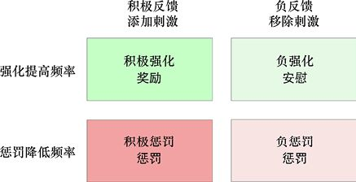

> **圖片描述：** 此圖為操作性條件反射的2×2網格表。行：「強化提高頻率」和「懲罰降低頻率」；列：「積極反饋（添加刺激）」和「負反饋（移除刺激）」。四個象限分別為：積極強化/獎勵、負強化/安慰、積極懲罰/懲罰、負懲罰/懲罰。

圖11.12　操作性條件反射的4個類別。當想要提高行為的頻率時，我們選擇第一行中的一個動作。如果要降低行為的頻率，我們就可以在第二行中選擇一個動作。左列為向環境添加刺激的操作，右列為從環境中移除刺激的操作（[DesMaisons12]）

讓我們看一下這4種情況下的一些親子互動。

當一位母親給主動整理房間的女兒一塊餅乾時，她就增加了刺激，以激勵女兒更主動地整理房間。這種**獎勵**（reward）也稱為**積極強化**（positive reinforcement）。許多動物訓練師主張僅使用積極強化進行訓練，認為這是最有效和最人性化的學習方法[Dahl07] [Pryor99]。

當一個想要冰淇淋的男孩不斷地喊“拜託？拜託？拜託？”的時候，他一遍又一遍地喊叫，只有當他的父親同意給他一些時才停止，那麼停止喊叫這一行為就是孩子取消刺激的措施，以便從父親那裡得到更多的冰淇淋。孩子給他父親的**安慰**（relief）構成了**負強化**（negative reinforce- ment），因為一些不愉快的事情已被消除。

當一個女孩拒絕吃晚餐，而她的父親說她也不能吃甜點時，父親就是在取消刺激，以避免女孩有更多的拒絕吃飯的行為。這種**懲罰**構成了**負懲罰**（negative punishment），這是由於渴望的東西被取消而帶來的懲罰。

當一位母親和她的兒子逛商店時，母親拒絕給兒子買他想要的東西，兒子便鬧脾氣了。兒子知道這會讓母親感到不安，這時，兒子就在施加一種刺激，希望以此來“頑抗”更多的拒絕行為。他向母親施加的**懲罰**就是**積極懲罰**（positive punishment），這是由於引入了一些令人不滿意的行為而帶來的懲罰。

為了瞭解這些概念是如何用於機器學習的，讓我們考慮只教一個感知機，如第10章中所討論的那樣。在訓練單個人工神經元時，我們只在出錯時提供回饋，因為我們試圖降低這種提供錯誤答案的行為的頻率。具體的做法是調整神經元中的權重。我們引入了變化，所以就是在向系統中添加一些東西。

我們是通過添加刺激來降低提供錯誤答案的行為的頻率的，所以這種技術屬於積極懲罰。

許多機器學習訓練方法使用了積極懲罰，但不是所有方法是這樣的。例如，我們將在第26章中看到，強化學習總是為每個動作提供一個回饋信號，因此它使用的是積極強化和積極懲罰。

## 參考資料

[Allegranza16]　Mauro Allegranza, *All men are mortal, Socrates is a man, therefore Socrates is mortal, original quote*, Philosophy Stack Exchange, 2016.

[Dahl07]　Cristine Dahl, *Good Dog 101： Easy Lessons to Train Your Dog the Happy, Healthy Way*, Sasquatch Books, 2007.

[DeMichele16]　Thomas DeMichele, *Hume’s Fork Explained*, Fact/ Myth, 2016.

[DesMaisons12]　Ted DesMaisons, *A Positive-Minded Primer on Punishment and Reinforcement-with a Buddhist Twist (Part 1 of 2)*, ANIMA Blob, 2012.

[Domingos12]　Pedro Domingos, *A Few Useful Things to Know About Machine Learning*, Com- munications of the ACM, Volume 55 Issue 10, October 2012.

[Doyle01]　Arthur Conan Doyle, *A Study in Scarlet*, section *About the Author*, House of Stratus, 2001.

[Doyle90]　Arthur Conan Doyle, *The Sign of the Four*, 1890.

[Doyle92]　Arthur Conan Doyle, *The Adventure of the Cardboard Box*, Strand Magazine, 1892.

[Fiboni17]　Fiboni V.O.F, *Overview of Examples & Types of Syllogisms*, 2017.

[Fieser11]　Jim Fieser, *Philosophy 210： Logic*, 2011.

[Garvey16]　James Garvey, *The Persuaders： The Hidden Industry That Wants To Change Your Mind*, Icon Books, 2016.

[Graham16]　Jacob N. Graham, *Ancient Greek Philosophy*, The Internet Encyclopedia of Philo- sophy, 2016.

[Hume77]　David Hume, *An Enquiry Concerning Human Understanding*, A. Millar, 1777.

[Hurley15]　Patrick Hurley, *A Concise Introduction to Logic*, 12th edition, 2015.

[Kant81]　Immanuel Kant, *Critique of Pure Reason*, 1781.

[Kaplan99]　Craig Kaplan, *The Halting Problem*, The Craig Web Experience, 1999.

[Kemerling97]　Garth Kemerling, *Categorical Syllogisms*, The Philosophy Pages, 1997-2011.

[Pryor99]　Karen Pryor, *Don’t Shoot the Dog: The New Art of Teaching and Training Revised Edition*, Bantam, 1999.

[Skinner51]　B F Skinner, *How to Teach Animals*, Freeman, 1951.

[Wikipedia17]　Wikipedia authors, Biological Immortality, 2017.

[Wolpert97]　D H Wolpert and W G Macready, *No Free Lunch Theorems for Optimization*, IEEE Transactions on Evolutionary Computation, 1(1), 1997.
