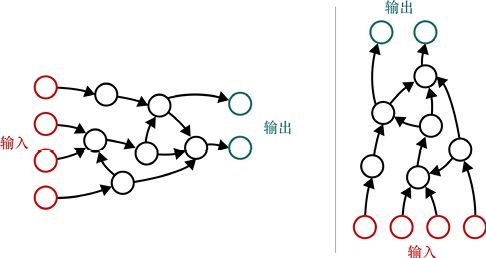
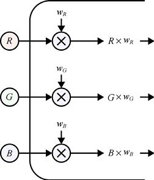
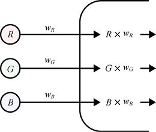
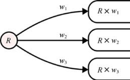
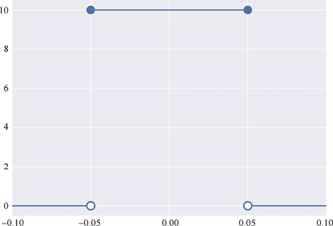
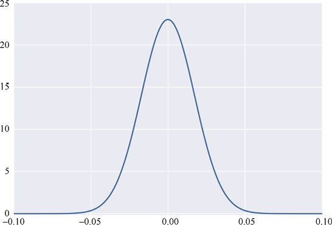

# 第16章　前饋網路

深度學習系統是由神經元組成的網狀結構。它們的大部分工作是在資料通過它們向前流動時執行的，從輸入開始，直到它們到達輸出。

## 16.1　為什麼這一章出現在這裡

在本章中，我們將從一般的機器學習概念和演算法過渡到尤其適用於相對較新的深度學習領域的概念和演算法。

正如我們在引言中所提到的，“深度學習”是一個包羅萬象的短語，通常指的是包含一系列層結構的人工神經網路。通常，每層上的神經元從前一層獲取其輸入，並在稍後將其輸出發送到下一層。在大多數類型的深層網路中，神經元不與同一層上的其他神經元通信。

這自然允許我們按**順序**（sequentially）處理資料，每個階段的神經元都建立在前一階段完成的工作上。我們稱這種類型的安排可以**分層**處理資料。有證據表明，人類大腦的結構是按層次處理某些任務，包括處理視覺和聽覺等感官資料[Meunier09] [NVRI17]。

令人驚奇的是，像這樣連接神經元會產生新奇的效果。正如我們在第10章中看到的那樣，單個人工神經元幾乎無法做任何事情。它需要一堆輸入，權衡它們，將結果加在一起，然後通過一個小函數傳遞它。值得注意的是，這個過程可以設法在幾個二維資料塊之間畫出一條直線，這就是它所能做到的。但如果我們將數千個這樣的小單元組合在一起，以正確的方式連接它們，並使用一些聰明的想法來訓練它們，然後協同工作，它們就能夠識別語音、識別照片中的面孔，甚至在具有操作技巧的遊戲中擊敗人類。

一切都歸功於這些小神經元。

隨著時間的推移，人們已經開發出許多不同的方法來組織神經元層，從而產生一系列通用的層結構。許多深度學習演算法基於精心挑選的層的堆棧，具有精細調整的超參數。

設計深度學習系統的藝術在於選擇正確的層序列和正確的超參數，以創建基本架構。有時我們會在第一次嘗試時獲得幸運，但通常需要嘗試使用並改變系統以實作最終的目標。

在本章中，我們將瞭解神經元的集合如何進行通信，以及如何在學習開始之前設置初始權重。

最常見的網路結構是排列神經元，使資訊僅朝一個方向流動。我們將其稱為**前饋網路**（feed-forword network），因為資料是**向前**流動的，前面的神經元正在向後面的神經元**輸送**或傳遞值。

在本章中，我們將介紹前饋網路的一些常見原理。我們將在後面的章節中研究基於網路的學習演算法時，借鑑本章介紹的基礎詞彙和思想。

## 16.2　神經網路圖

**神經網路**（或**神經網**）的大多數圖看起來像圖16.1中的圖之一。這些圖中的每一個都稱為**圖**。該圖由**節點**，也稱為**頂點**（vertex）或**元素**組成，如圓圈所示。通常，這些節點用來表示神經元，在本書中，我們偶爾會將網路中的一個或多個神經元稱為“節點”。節點通過稱為**邊**（也稱為**弧**或簡單**線**）的箭頭連接。資訊沿邊流動，將一個節點的輸出傳送到其他節點的輸入。

> **圖片描述：** 此圖展示兩個神經網路的圖形表示。(a)從左到右流動：紅色輸入節點在左側，資料沿箭頭方向流經多層白色節點，最終到達右側的青色輸出節點；(b)自下而上流動：紅色輸入節點在底部，資料向上流動至頂部的青色輸出節點。兩者均為有向無環圖（DAG）。

　　　　　　　　　　　　(a)　　　　　　　　　　　　　　　　　　　　　　　　　　　　 (b)

圖16.1　繪製為圖的兩個神經網路。資料沿著邊跟隨箭頭，從一個節點流向另一個節點。當邊未標箭頭時，資料通常從左到右或從下到上流動。資料一旦離開節點，就不會再返回。換句話說，資訊只向前流動，沒有循環。(a)從左到右流動；(b)自下而上流動

圖中的每條邊都有一個指示方向的箭頭，顯示資料沿著該邊流動的**方向**。通常輸入位於左側，資料流向右側，或輸入位於底部，資料向上流動。當資訊流方向為預設方向時，箭頭經常被省略。

一般地，我們通過將資料放入圖中的一個或多個輸入節點來開始，然後使它流過邊，通過轉換或更改相關節點，最終使資料到達一個或多個輸出節點。

這種類型的圖就像一個小工廠。原材料來自一端，並通過控制和組合工廠中的機器，最終生產一個或多個成品。

我們稱圖16.1a中輸入附近的節點位於輸出附近的節點**之前**，輸出附近的節點位於輸入附近的節點**之後**。在圖16.1b中，我們假設輸入附近的節點位於輸出附近的節點**下方**，輸出附近的節點位於輸入附近的節點**上方**。有時，即使從左到右繪製圖形，也會使用這種“上方/下方”語言，這可能會令人困惑。但它可以幫助我們將“下方”視為“更接近輸入”，將“上方”視為“更接近輸出”。

我們有時也會說，如果資料從一個節點流向另一個節點（假設它從A流向B），則節點A是節點B的**祖先**（ancestor）或**父節點**（parent），節點B是節點A的**後代**（descendant）或**子節點**（child）。

圖的理論是如此的豐富，以至於它本身被認為是一個數學領域，稱為**圖論**（graph theory）[Trudeau94]。在這裡，我們將堅持圖的基本思想，主要是將其作為幫助我們組織神經網路的概念工具。

神經網路中的一個普遍規則是沒有**循環**（loop）。這意味著來自節點的資料永遠不會回到同一個節點，無論它遵循的路徑多麼迂迴。這種圖形的正式名稱是**有向無環圖**（directed acyclic graph）（或DAG，發音為單詞“dag”，用“drag”押韻）。這裡的“有向”一詞意味著邊有箭頭（若為預設方向可以省略，如上所述）。“無環”這個詞的意思是“沒有循環”。這個規則的一個重要例外是一種稱為**循環神經網路**或RNN的網路，我們將在第22章中介紹。但即使在那些網路中，我們通常也可以重繪網路，使它們形成DAG。

DAG在許多領域都很流行，包括機器學習，因為它們比任意具有循環的圖更容易理解、分析和設計。包含循環可以引入**回饋**（feed-backward），其中節點的輸出返回到其輸入。任何聽到過因將麥克風移得太靠近揚聲器而產生音頻回饋的人都會熟悉回饋失控的速度。DAG的無環性質自然避免了回饋問題，使我們很好地避免處理這個複雜的問題。

由於資料僅從輸入到輸出“向前”流動，因此上述神經網路稱為**前饋**（feed-forward）圖或前饋網路。我們的想法是每個節點都將資料“饋送”到後面的節點。

我們將在第18章中看到，訓練神經網路的關鍵步驟包括暫時翻轉箭頭，將特定類型的資訊從輸出節點發送回輸入節點。雖然正常的資料流仍然是前饋，但當我們向後推送資料時，我們稱之為**回饋**、**反向流**或**逆向流**演算法。我們為上述情況保留“回饋”一詞，圖中的循環可以使節點接收自己的輸出作為輸入。

## 16.3　同步與異步流

解釋圖16.1中的圖通常意味著在資料從一個節點到另一個節點沿邊流動時描繪資料。但是，只有我們做出一些傳統的假設，這種描繪才有意義。我們現在來看看這些假設。

雖然我們經常在引用資料如何通過圖時以各種形式使用“流”這個詞，但這不像通過管道的水流。水流是一個**連續的**過程：每時每刻都有新的水分子流過管道。而我們使用的圖（以及它們代表的神經網路）是**離散的**：資料一次到達一個塊，如文本消息或郵政服務的傳遞或投遞。

這種類型的流動也稱為**取樣保持**（sample-and-hold）系統。當一條資料到達一個節點時，它停留在輸入上（它已被“取樣”或保留），其值保持不變，就像顯示在屏幕上的文本消息一樣。它就在那裡，直到被一個新出現的資料取而代之。然後，新的資料就會保持不變，直到被替換為止，以此類推。

有些網路是圍繞某個主時鐘的想法而建立的，像一個“老爺鐘”一樣永遠地嘀嗒作響。在時鐘的每個節拍上，每個計算了一些資料的節點都會沿著邊向其子節點發送資料。當資訊到達子節點時，它不會改變，並且在嘀嗒之間的間隔中，所有節點處理位於其輸入的資料。然後時鐘再次嘀嗒，並且每個已創建輸出的節點將其輸出資料向下發送到其子節點作為輸入。並非所有節點都以相同的速度計算其輸出，執行更復雜工作的節點通常需要更多時間來生成其輸出。為了確保新資料在時鐘的每個時鐘週期流動，我們通常選擇時鐘的時序，以便網路中最慢的節點有時間在下一個時鐘到達之前完成其工作。我們稱之為**同步**（synchronous）系統。

換句話說，在同步系統中，資料僅在時鐘嘀嗒時移動。在嘀嗒之間，線上的資料保持不變，節點可以使用該資料並使用它來準備它們的輸出，並在下一個嘀嗒時傳遞給它們的子節點。

這種類型的系統的一個例子是工廠中使用的多級傳送帶。這種傳送帶分步移動，將產品從一個工位傳送到另一個工位，然後暫停，以便每個工位對收到的組件進行處理，暫停時間結束後，傳送帶繼續向前移動一步，並重復該過程。

相反，**異步**（asynchronous）（意味著“非同步”）系統沒有主時鐘，而是資料一經計算就會移動。

例如，通過來回發送文本消息來制定計劃的一組人是異步的，因為每個人在有機會時都會做出響應。異步系統沒有主時鐘或“心跳”。有些人可能會立即回覆消息，而其他人可能很忙，而且很長時間都沒有回覆。在任何時候，每個人都使用他們從其他人那裡獲得的最新資訊。如果某人很慢，以至於他們最近的消息已經過了一週，而且已經做出了決定，那就這樣吧。

異步情況是更普遍的情況，因為每個單獨的資料都保持其值，直到它發生變化。同步網路是異步網路的一種特殊情況，其中更新發生在鎖步模式中。

因為異步網路是更通用的版本，所以瞭解它的工作原理可以讓我們深入瞭解這兩種系統的運行方式。

如果節點僅在所有資料都更新的情況下繼續工作，異步網路就會出現問題。由於資料只是保持其值，該節點如何區分新值和現有值？例如，假設一個節點將其他3個節點給出的數字相加。在某一點上，這些值是3、5和2，因此節點將值10發送出去。不久之後，3變為1，而5變為4，但2不變。也許該節點的輸出已經過重新計算，只是結果恰好再次為2。那麼，我們的節點是否應該將這些值相加並產生新的輸出？

我們需要一種方法來確保節點只增加輸入，然後在所有輸入都是新輸入時產生新輸出，與上次計算總和相比。

瞭解新資料何時到達的有效方法是將資料視為具有記錄發送時間的相關**時間戳**（time stamp）。這樣的標記記錄了計算和發送資料的時間，而不是使用它的時間。換句話說，時間戳由計算資料的節點進行分配，而不是接收資料的節點。

然後，每個節點還可以記住計算其最新結果的時間。

當所有輸入的時間戳都晚於節點產生輸出的最近時間時，那麼它們都是新的，即使它們碰巧具有相同的值。這種情況下，節點可以計算新結果，並記住該計算的時間。

計算完成後，節點進入等待狀態，直到一組全新的資料到達。這時，它可以產生一個新值，並記錄這樣做的時間，然後重新開始循環。

### 實踐中的圖

為每個資料附加時間戳是一個可供討論的有用概念，但我們在電腦程式中通常不需要它。傳統上，我們僅通過構造程式碼的方式來實施此規則。

現代電腦通常使用各種硬體和軟體來加速計算。在這種情況下，上述基本方案變得更加複雜，但原則仍然適用。

## 16.4　權重初始化

之前提到，圖能夠代表神經元網路及其連接。

當我們以圖的形式繪製神經網路時，節點代表神經元，邊是它們之間的連接。一個神經元的輸出沿著邊傳送到下一個神經元的輸入，如圖16.2所示。

> **圖片描述：** 此圖展示神經元如何加權輸入。三個輸入值R、G、B分別與對應的權重w_R、w_G、w_B相乘（以×符號表示），產生加權後的輸出R×w_R、G×w_G、B×w_B。

圖16.2　這裡有3個名為*R*、*G*和*B*的值正在進入神經元。當每個值進入神經元時，它被加權或乘以與該輸入相關聯的數字，然後由神經元的其餘部分使用得到的縮放值來計算其輸出值

回憶一下第10章，人工神經元對輸入做的第一件事是將它乘以一個稱為**權重**的數字。我們有時稱之為**加權**輸入過程。

正如在第10章中看到的那樣，我們可以從概念上將權重移出神經元並將它們放在攜帶資料的線上。在這個版本中，神經元輸出一個值後，它沿著連接線向下乘以一個權重，然後到達已經加權的下一個神經元，如圖16.3所示。

> **圖片描述：** 此圖為圖16.2的簡化版本，將權重從神經元中移到連線上。三個輸入R、G、B透過標有權重名稱w_R、w_G、w_B的連線，產生加權輸出R×w_R、G×w_G、B×w_B。

圖16.3　在這裡，我們將權重從圖16.2中的神經元中移出，並將它們放在帶有值的線上進入神經元。在這種形式的圖中，隱含了每個值乘以已命名權重的乘積。進入神經元其餘部分的值與之前相同，因為我們只進行了外觀修飾

如果一個神經元將其輸出發送給3個子神經元，那麼將有3條連接線，每條線都有自己的權重。這個想法如圖16.4所示。

> **圖片描述：** 此圖展示單一神經元R將輸出發送到3個不同神經元的情形。R的輸出值沿3條連線分別被3個不同的權重w_1、w_2、w_3加權，產生R×w_1、R×w_2、R×w_3三個值。

圖16.4　如果單個神經元（此處標記為*R*）將其輸出發送到3個不同的神經元，則*R*的輸出值將由3個可能不同的值加權，每條線上都有一個

這種形式的圖中，權重隱含地附著在線上，是目前最常見的，也就是我們在這裡採用的那種。正如在第10章中提到的，我們通常甚至沒有明確地寫出權重，但是它們應該被預設是存在的。

這一點很重要，值得重複說明。在任何神經網路圖中，如果沒有明確顯示權重，則預設**每條線上都有唯一的權重**，並且當一個值沿著該線從一個神經元移動到另一個神經元時，該值由權重修改。

### 初始化

到目前為止，我們已經看到資料作為輸入流過線，並在到達神經元之前被加權。上述神經元基於輸入計算新值，這些值在它們自己的線上被加權後，作為其他神經元的輸入。

學習過程就是修改線上（或神經元中）的權重，以便我們在最後得到最好的結果。

但是，在進行任何資料操作或學習之前，我們如何初始化這些權重？

人們已經探索了許多不同的方法來初始化權重，並比較了結果。事實證明，一些選項可以始終如一地為學習提供最佳結果，大多數機器學習庫都支援這些選項。其他初始化方案通常可用於特殊情況，或者只是為了想要嘗試新的東西並查看它如何與我們的資料一起工作。

也許最簡單的方案就是為每個權重分配相同的值。事實證明這是一個壞主意，因為我們稍後用於調整權重的演算法將傾向於將相同值的所有權重改變相同的量，從而導致它們以鎖步模式改變。我們非常希望權重從不同的值開始，以便它們更加適合單獨調整。

也許為每個權重分配不同值的最簡單方法為**均勻初始化**（uniform initialization）。在這裡，“均勻”這個詞指的是一個**均勻隨機分佈**（uniform random distribution），就像我們在第2章中看到的那樣。這隻意味著一個極端和另一個極端之間的所有值都是同等可能的。在機器學習中，我們經常使用0附近的小範圍，例如[−0.05,0.05]。為權重分配隨機值可能聽起來很瘋狂，但在學習過程中這些值很快就會得到改善，並且它們的初始影響會迅速消失。圖16.5展示了這種想法。

> **圖片描述：** 此圖為均勻分佈的圖形。橫軸範圍為-0.10至0.10，在[-0.05, 0.05]區間內，函數值為常數（約10），區間外為0。空心圓表示端點不包含，實心圓表示端點包含。說明均勻分佈中每個值被選中的機率相等。

圖16.5　從均勻分佈中取樣值時，在非0範圍內獲得任何值的機率相等。在這裡，上部區域的特定高度對於理解正在發生的事情並不重要。重要的是，[−0.05,0.05]的每個值都可能被選中

在用圖16.5的均勻分佈產生隨機值時，我們“告訴”電腦不希望返回值大於0.05，並且返回值不小於−0.05。此外，這些極端之間的每個值應該具有相同的被選擇和返回的機率。

**正態初始化**（normal initialization）方案使用**正態分佈**或隨機數的**高斯分佈**，如第2章所述。這種分佈是著名的“鐘形曲線”。當我們使用這種方法來選擇初始權重時，它意味著接近0的值最有可能被使用，而兩邊的值則不太可能被使用。圖16.6直觀地展示了這一點。

與均勻初始化一樣，開始學習時，我們最初使用的隨機值很快就被更好的值替換。

我們很少直接使用均勻或正態初始化，因為需要選擇它們的參數（如它們的最小值和最大值）。研究人員發現，選擇這些參數有很好的經驗法則，並且已經出現的各種演算法都是以提出它們的主要作者命名的。

LeCun Uniform、Glorot Uniform（或Xavier Uniform）和He Uniform演算法都基於從均勻分佈中選擇初始值[Lecun98] [Glorot10] [He15]。

類似命名的LeCun Normal、Glorot Normal（或Xavier Normal）和He Normal初始化方法，都是從正態分佈中繪製它們的值。

> **圖片描述：** 此圖為正態分佈（鐘形曲線）的圖形。橫軸範圍為-0.10至0.10，曲線在0處達到最大值（約23），向兩側平滑遞減。說明接近0的值最可能被選中，離中心越遠的值被選中的機率越低。

圖16.6　從正態分佈中取樣值時，我們更有可能在分佈中心附近得到值，當離開中心時，機率降低。同樣，0產生的可能性最大，並且機率平滑地下降到兩側，在我們選擇的極限[−0.05,0.05]處最接近0

事實證明，這些方案在實踐中都很有效。如果一個庫提供了其中不止一種方案，那麼通常需要多嘗試一些，看看哪種方案對特定網路的特定組合以及具體資料的學習表現最佳。大多數庫提供一種或多種類似方案，以及它們的變種。

我們已經發現一些特定類型的演算法對於特定的初始化方案最有效，並且這些細節通常在所選擇的庫的演算法文檔中註明。

## 參考資料

[Glorot10]　Xavier Glorot and Yoshua Bengio, *Understanding the Difficulty of Training Deep Feedforward Neural Networks*, Proceedings of the 13th International Conference on Artificial Intelligence and Statistics (AISTATS), 2010.

[He15]　Kaiming He, Xiangyu Zhang, Shaoqing Ren, Jian Sun, *Delving Deep into Rectifiers: Surpassing Human-Level Performance on ImageNet Classification*, arXiv 1502. 01852, 2015.

[Lecun98]　Yann LeCun, Leon Bottou, Genevieve B. Orr, Klaus-Rober Müller, *Efficient BackProp*, in Neural Networks: Tricks of the Trade, editors Genevieve B. Orr and Klaus-Rober Müller, Lecture Notes in Computer Science volume 1524, Springer- Verlag, 1998.

[Meunier09]　David Meunier, Renaud Lambiotte, Alex Fornito, Karen D. Ersche and Edward T. Bullmore, *Hierarchical Modularity in Human Brain Functional Networks*, Frontiers in Neuroinformatics, 2009.

[NVRI17]　National Vision Research Institute of Australia, *Hierarchical Visual Processing*, NVRI Research Blog, 2017.

[Trudeau94]　Richard J. Trudeau, *Introduction to Graph Theory*, 2nd Edition. Dover Books on Mathematics, 1994.
