# 第17章　激活函數

人工神經元計算的最後一步是將一個激活函數應用到它計算出的值上。本章將介紹當今各種流行的激活函數的使用情況。

## 17.1　為什麼這一章出現在這裡

人工神經元是神經網路的核心，在第10章中，我們已經研究了人工神經元的結構，但是並沒有詳細討論它的計算過程中的最後一步，現在我們所要講的就是關於最後一步的內容。

正如我們在第10章中看到的那樣，一個人工神經元需要3個步驟來產生它的輸出項：首先，它將每個輸入項與相應的權重值相乘，以此來對每個輸入進行加權；其次，它將這些加權後的值相加；最後，相加後的值會經過一個數學函數變換後輸出。

對於最後這個函數的選擇有很多種，但它們被統稱為**激活函數**，激活函數的輸出就是神經元的輸出。

在這一章中，我們將瞭解激活函數的用途，然後學習一些流行的激活函數。在後續章節中，我們會構建神經網路，那時就會使用一個或多個這樣的函數。

## 17.2　激活函數可以做什麼

雖然激活功能只是整個結構的一小部分，但是對於一個成功的神經網路來說，這一步驟是至關重要的。如果沒有它，整個神經元的集合就只能被精確地組合成單個神經元，而正如我們在第10章中所看到的那樣，單個神經元的計算能力是非常弱小的。

打個比方，想象一下，由多節車廂組成的一列長長的貨運列車。每節車廂與後一節車廂通過一對環環相扣的掛鉤相連——這種結構被統稱為**耦合**。這種耦合使得車廂彼此之間可以移動和旋轉，這樣它們就可以沿著軌道運行，但同時，這種結構又可以防止車廂之間斷開連接。圖17.1展示了耦合的結構。

> **圖片描述：** 此圖為火車車廂耦合結構的近距離照片。兩個互鎖的鉸鏈式「手指」結構（一個青色、一個紅色）相互嵌合，允許兩節車廂之間的相對移動和旋轉，同時保持連接。這個類比用來說明激活函數在神經網路中的作用。

圖17.1　兩節車廂之間的耦合，前後兩部分通過一對鉸鏈式的“手指”彼此連接。這使得列車在行駛過程中可以彼此接近和分離，兩節相鄰的車廂在任一方向上可以相對旋轉，並且持續保持連接（出自[Stoltz16]）

如果沒有這些耦合結構，車廂間就不能相對旋轉，這相當於給了我們一節極長的車廂。這是不切實際的，原因包括但不限於這可能會對任何位於鐵軌上的人或東西產生危險，如圖17.2所示。

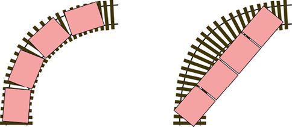

> **圖片描述：** 此圖展示耦合結構解決的問題。(a)有耦合結構時，多節粉色車廂可沿彎曲軌道行駛並保持連接；(b)無耦合結構時，車廂合成一節大車廂，無法轉彎。

(a)　　　　　　　　　　　　　　　　　　　　　　　　　　　　　(b)

圖17.2　耦合結構所解決的問題。(a)有了這一結構，許多單獨的車廂就可以沿著彎曲的軌道行駛，但始終保持連接；(b)沒有耦合結構，就好像所有車廂被合成了一節大車廂

我們相信耦合結構和激活函數之間的類比應該比文字更具有啟發性，因為激活函數的數學目的要比耦合結構的機械目的更加抽象一些。但這兩種想法擁有相似的目的，那就是讓許多單元間既保持聯繫，彼此間的狀態又截然不同。如果沒有激活功能，神經網路在數學上就會變成一個大的神經元，就像許許多多的車廂變成一節大車廂一樣。

讓我們通過一個例子來說明這種**網路崩潰**是如何發生的。圖17.3展示了一個包含3個輸入的網路，名為A、B和C，它的內部有6個節點，名為D、E、F、G、H、I，以及一個輸出神經元，名為J。這是一個**全連接網路**，其中每個神經元輸入來自上一層的所有神經元。

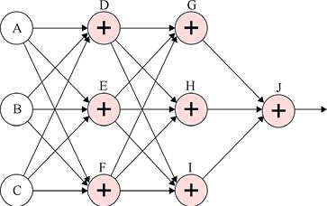

> **圖片描述：** 此圖展示一個全連接神經網路，包含3個輸入（A、B、C）、2個隱藏層（各3個神經元：D/E/F和G/H/I）和1個輸出神經元J。每個神經元內有加法節點（+），各層之間的所有神經元都透過箭頭相互連接。

圖17.3　一個全連接網路，擁有3個輸入、1個輸出和2個隱藏層（均由3個神經元組成），每個箭頭表示一個連接，隱含一個附加的權重

圖17.3是我們經常在全連接網路中看到的一種複雜的圖。沒人喜歡這種亂七八糟又複雜的圖，所以讓我們重新畫一下。我們不會對網路或連接進行改變，只是將它分解成更容易看懂的小圖，還會給每條邊標上它的權重，如圖17.4所示。

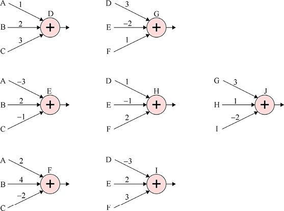

> **圖片描述：** 此圖將圖17.3的全連接網路拆解為更清晰的小圖，每個神經元分別展示輸入和權重值。

圖17.4　重繪後的圖更便於理解。在這幅圖中，我們明確地標記了每條邊的權重。注意，從D到J的每個神經元的輸出都是輸入項（A、B和C）的組合

在圖17.4中，我們要注意的是，D、E和F的輸出只是對A、B和C進行相加相乘後的組合。例如，D的輸出項是A + 2B + 3C，而F的輸出項是2A+4B−2C（式子裡隱含乘法，2B就相當於2×B）。從G、H節點開始的輸出也只是A、B和C一些組合，是一個縮放過的版本。最終，J的輸出結合了G、H和I，所以也可以看作A、B和C的組合。

如果我們將所有係數計算出來，就會發現圖17.4可以被繪製（或者說“崩潰”）成擁有3個輸入（權重值是新的）的一個節點，如圖17.5所示。

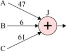

> **圖片描述：** 此圖展示網路崩潰結果：整個複雜網路簡化為一個節點J，僅有3個輸入A(×47)、B(×6)、C(×61)。

圖17.5　如果將圖17.4中的數字都代入進行計算，我們就可以發現J的輸出就是A、B和C的一個組合

圖17.5中的單個神經元所產生的值與圖17.3（或圖17.4）的複雜網路中節點J的輸出值相同。而且結果出現得會更快，佔用的電腦記憶體也更少。

這樣，一個網路的表現可能不會優於一個神經元。如果發生這種崩潰，那麼神經網路永遠不會比單個神經元所產生的結果好，這個網路也不會成為一個能夠學習複雜問題的通用系統。

激活函數只是在每個神經元的末端進行的一個很小的處理，但是它阻止了這種崩潰。因為數學知識告訴我們，如果一個網路只是進行乘法和加法的運算（也就是所謂的**線性函數**），它就會出現這種形式的崩潰。相比之下，激活函數稱為**非線性函數**，有時也只稱為**非線性**（nonlinearity），每個神經元中的非線性步驟（即除了加法和乘法外的步驟）的存在阻止了網路的崩潰。

使用這些函數的結果是：我們可以維持一個擁有許多神經元的神經網路，而不是讓它退化成一個神經元，這關係重大。

有許多不同類型的激活函數，每種激活函數都會產生不同的結果。一般來說，激活函數之所以存在多種類型，是因為在某些情況下，其中一些函數會遇到數值問題，使得訓練的運行速度減慢，甚至完全停止。如果發生這種情況，我們就可以用另一個激活函數來避免這個問題（當然，新函數也有自己的弱點）。

在這裡，我們將研究各種激活函數，並考慮它們的優缺點，以幫助我們在構建自己的神經網路時做出明智的選擇。

### 激活函數的形式

激活函數有時也稱為**傳遞函數**（transfer function），它是一種運算，將一個浮點數作為輸入，並返回一個新的浮點數作為輸出。“函數”一詞來源於在數學意義上這種運算是如何構建的，但我們也可以把它看作一種編程意義上的函數（或者說是子程式），它接收一個浮點數作為輸入，之後返回一個新的浮點數作為輸出。

我們可以不使用任何方程或程式碼，完全用可視化的語言來描述這些函數。

理論上，我們可以將不同的激活函數應用到網路中的每個神經元上。但在實踐中，對於神經網路中每一層來說，通常都有一個最佳的激活函數，所以我們會對同一層中的每個神經元使用同一個函數。

## 17.3　基本的激活函數

為了描繪一個激活函數，我們把它畫在一個二維平面中，橫軸（或者說*x*軸）是輸入值，縱軸（或者說*y*軸）是輸出值。因此，在尋找任何輸入值的輸出時，我們都可以先在*x*軸上找到輸入，然後向上移動直至接觸到函數曲線，這時的*y*值就是輸出值。

### 17.3.1　線性函數

圖17.6展示了一些“曲線”，它們都是直線。讓我們看一下最左邊的例子，如果我們在*x*軸上任意選擇一點，然後垂直向上移動直到接觸到“曲線”，就會發現，交點處的*y*軸的值與*x*軸的值是一樣的。這條“曲線”的輸出（或者說*y*值）總是等於輸入（或者說*x*值），因此我們稱之為**恆等函數**（identity function）。

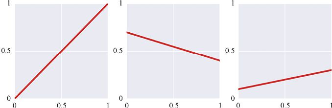

> **圖片描述：** 此圖展示三種線性函數：左圖為恆等函數（y=x），中圖為遞減直線，右圖為平緩遞減直線。

圖17.6　一些“曲線”其實就是直線，最左邊的圖中的*y*值總是與*x*值相等，我們稱它為恆等函數

圖17.6中的其他“曲線”也是直線，但它們的斜率不同，我們稱任何呈一條直線的函數“曲線”為**線性函數**（linear function），或者稱為（一個稍微有點混亂的叫法）**線性曲線**（linear curve）。

這些線性“曲線”是一種阻止激活功能發揮作用的形狀。從數學上說，當激活函數是一條直線時，它只做乘法和加法，這意味著網路會崩潰。為了避免這種情況，我們需要通過各種各樣的方式來改造這條直線，例如，給直線添加一個扭結或使其彎曲，再或者把它分成幾個部分。我們要做的就是讓它不再是一條直線。

不過，我們必須記住的一點是，曲線必須是**單值**（single-valued）**的**。正如我們在第5章中討論的那樣，單值意味著從*x*軸上的任何值向上看，函數曲線都只對應於一個*y*值。

先從一個簡單的變化開始，我們可以把直線分成幾個部分，這幾個部分甚至不需要連接在一起，用第5章中的理論來說就是：它們不需要是**連續的**。

### 17.3.2　階梯狀函數

例如，圖17.7展示了一個**階梯狀函數**（stair-step function），如果輸入的範圍是0～0.2，那麼輸出就是0；如果輸入的範圍是0.2～0.4，那麼輸出就是0.2，以此類推。這些突然的跳躍並不違反我們的規則（即“曲線”是單值的）。

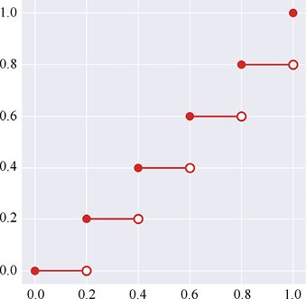

> **圖片描述：** 此圖展示階梯狀函數，在[0,1]範圍內每隔0.2跳升一次。實心圓表示有效值，空心圓表示無曲線值。

圖17.7　這個“曲線”是由多條直線組成的，它並不連續，這意味著我們在紙上繪製它的過程中必須抬起鉛筆。在這裡，實心圓表示這個點的*y*值是有效的，而空心圓則表示在這個點上是“沒有曲線”的

之前提到，任何一個只有一條直線的激活函數都被稱為是線性的，而其他函數都是非線性的。即使函數是多條直線，這一點也成立：除非它是一條直線，否則函數是非線性的。除了特殊情況，在網路中所使用的都是非線性激活函數，而最常見的例外出現在最終的輸出神經元中。在這裡，使用線性函數是沒有風險的，因為不會引發網路崩潰。

“線性”這個詞有更加廣泛的數學含義，在許多情況下，數學家們傾向於將問題轉化為線性問題，因為它們通常比非線性的問題更容易解決。但是在構建神經網路時，非線性激活函數則更加適合。

因為激活函數通常是人工神經元處理過程中唯一的非線性部分，所以激活函數通常被稱為**非線性環節**。

## 17.4　階躍函數

最簡單的激活函數就是恆等函數，但是使用它與不使用激活函數的效果是一樣的。神經元求和階段的輸出變成了它的最終輸出，並沒有進一步的變化，正如我們剛剛所提到的那樣，線性激活函數很少用於除輸出神經元外的其他神經元。

激活函數能夠接收任何實數作為輸入。我們通常只顯示0附近的區域，因為這是大多數變化發生的區域。大多數激活函數在除0之外的區域都有一個可預測的結構，這一部分是我們不需要很清晰地進行繪製的。

一個簡單的非線性激活函數是**階躍函數**（step function）。我們在第10章中所討論的感知機就是用一個階躍函數作為它的激活函數的。

階躍函數通常如圖17.8a所示。它保持為一個值，直到某個**閾值**後，會跳轉為另一個值。那麼，當輸入為閾值時，函數的輸出是什麼呢？不同的人對此有不同的選擇。在圖17.8a中，閾值的值是階躍右側的值，用實心圓表示。

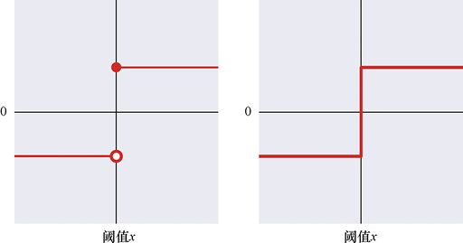

> **圖片描述：** 此圖展示兩種階躍函數。(a)以實心圓和空心圓精確標示閾值處取值；(b)常見的簡化繪製方式。

(a)　　　　　　　　　　　　　　　　　　　　　　　　　　　　　(b)

圖17.8　階躍函數有兩個固定的值，分佈在閾值*x*的左右。(a)用實心圓和空心圓來表示當*x*值正好是閾值時，*y*選用更大的值；(b)通常來說，對在過渡過程中發生的事情的處理是很隨意的，以這種方式畫出圖像，來強調函數的“階躍”，這是繪製曲線的一種模糊的方法，但是很常見（通常我們不關心正好在閾值時，*y*選用哪個值，所以我們可以隨意地把這個值想象成兩者中的一個）

一些階躍函數的流行版本有它們自己的名字，比如**單位階躍**（unit step）**函數**在閾值的左邊是0，右邊是1，如圖17.9所示。

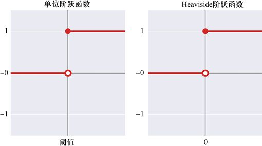

> **圖片描述：** 此圖展示兩種階躍函數。(a)單位階躍函數：閾值左側為0，右側為1；(b)Heaviside階躍函數：閾值設為0。

(a)　　　　　　　　　　　　　　　　　　　　　　　　　　　　(b)

圖17.9　一些流行的階躍函數。(a)閾值往左，單位階躍函數的值為0；閾值往右，單位階躍函數的值為1。(b)Heaviside階躍函數，一個閾值為0的單位階躍函數

如果一個單位階躍函數的閾值是0，我們就給它一個更具體的名字——Heaviside**階躍**（Heaviside step）**函數**，同樣如圖17.9所示。

而如果我們有一個Heaviside階躍函數（閾值為0），但是閾值往左的值是−1而不是0，我們就稱它為**符號函數**（sign function），如圖17.10所示。符號函數有一個流行的變體，就是當輸入值正好為0時，輸出值也為0，這種變體也被稱作“符號函數”。所以，對它們的區分是很重要的，人們必須更加關注應用的場合，以確定所採用的是哪一種符號函數。

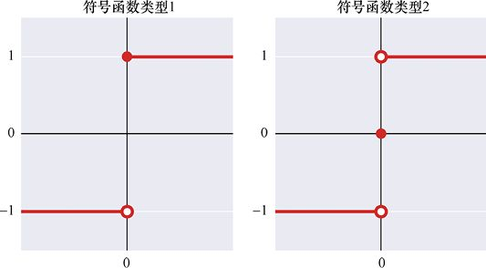

> **圖片描述：** 此圖展示兩種符號函數。(a)x<0輸出-1，x≥0輸出1；(b)x<0輸出-1，x=0輸出0，x>0輸出1。

(a)　　　　　　　　　　　　　　　　　　　　　　　　　　　　　　(b)

圖17.10　兩種流行的符號函數類型，(a)當輸入值小於0時，輸出值為−1，其他的值都為1。(b)當輸入值小於0時，輸出值為−1；當輸入大於0時，輸出值為1；而當輸入恰好為0時，輸出值為0

正如我們在第10章中所看到的那樣，感知機就是使用圖17.9所示的單位階躍函數作為激活函數的。

## 17.5　分段線性函數

如果一個函數是由幾個部分組成的，而每個部分都是一條直線，那麼我們稱它是**分段線性**（piecewise linear）的，只要這些片段不能形成一條直線，它就仍然是一個非線性函數。

分段線性函數也許是最流行的激活函數了，它稱為**修正線性單元**（rectified linear unit），或者說**線性整流函數**，縮寫為ReLU（注意，e是小寫）。這個名字來自一個稱為“整流器”的電子元件，它可以用來防止負電壓順利通過電路[Kuphaldt17]。當電壓為負時，整流器會將其“設置”為0，而ReLU則是對輸入項進行同樣的操作。

ReLU如圖17.11所示。它由兩部分組成，這兩部分都是直線，但是由於中間有彎折，因此，這不是一個線性函數。當輸入值小於0時，輸出值為0，否則，輸出就與輸入相同。

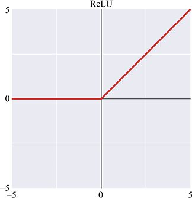

> **圖片描述：** 此圖展示ReLU激活函數。x<0時輸出為0，x≥0時輸出等於輸入，原點有彎折使其為非線性。

圖17.11　整流器（或者說線性整流函數），負輸入的輸出均為0，其他情況下輸出與輸入相等

ReLU很受歡迎，它是一種簡單又快捷地在人工神經元中加入非線性步驟的方法。在第18章中，我們會看到它可能遇到的一些問題——這些問題也促成了ReLU變體的發展。但是總的來說，ReLU，或者我們接下來會看到的洩漏型ReLU的性能很好，在構建新網路時通常是激活函數的首選。除了在實踐中表現優異，還有很多數學上的支撐促使我們使用ReLU[Limmer17]。

**洩漏型**ReLU（leaky ReLU）改變了對負輸入項的響應，與對任何負輸入項都輸出0的ReLU不同，當輸入值小於0時，它的輸出項變為輸入項的1/10，如圖17.12所示。

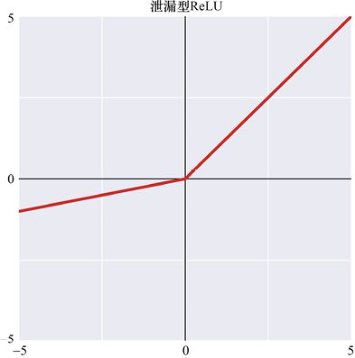

> **圖片描述：** 此圖展示洩漏型ReLU。x<0時以約1/10的斜率線性遞減，使負值仍有小量輸出。

圖17.12　洩漏型ReLU與ReLU類似，但是當*x*為負時，它返回一個成比例縮小的*x*值

當然，也沒有必要總是把負值縮小到原來的1/10。**參數**ReLU（parametric ReLU）可用於選擇縮放的比例，如圖17.13所示。

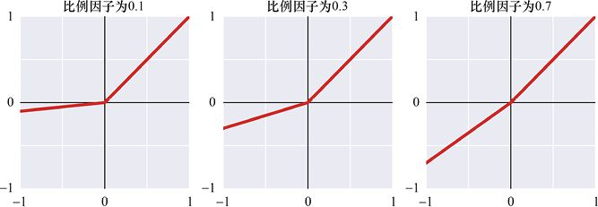

> **圖片描述：** 此圖展示三種參數ReLU：(a)比例因子0.1；(b)0.3；(c)0.7。

(a)　　　　　　　　　　　　　　　　　　　　　　　 (b)　　　　　　　　　　　　　　　　　　　　　　　 (c)

圖17.13　參數ReLU與洩漏型ReLU類似，但是當*x*小於0時，函數的斜率是可以調整的。(a)比例因子為0.1，這時稱為一個標準的洩漏型ReLU；(b)比例因子為0.3；(c)比例因子為0.7

當使用參數ReLU時，最重要的是永遠不要選擇1.0的比例因子，因為這樣我們就失去了彎折（kink），整個函數就是一條直線，這個神經元就有可能會崩潰，或者與下一個神經元合併。

基本的ReLU的另一個變體是**移位**ReLU（shifted ReLU），它只是將彎折處向左下方移動。示例如圖17.14所示。

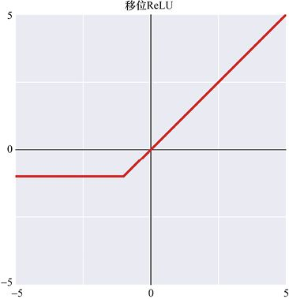

> **圖片描述：** 此圖展示移位ReLU，彎折點向左下方移動至負值區域。

圖17.14　移位ReLU向左下方移動了ReLU函數的彎折處

我們可以結合基本的ReLU和洩漏型ReLU（或參數ReLU）來創建一個名為maxout[Goodfellow13]的激活函數。maxout允許我們定義一組直線，每個點的函數的輸出是所有直線在那一點求值後最大的。換句話說，我們在*x*軸上找到輸入項，然後選擇最大的*y*值進行輸出。可以這樣想，想象把油漆從上往下倒在畫好直線的紙上（直線可以阻隔油漆），之後被油漆覆蓋的整個面就是maxout的輸出。圖17.15先展示了一個有兩條直線的maxout，它的形狀近似於ReLU，之後，圖中增添了多條直線以創建更復雜的形狀。

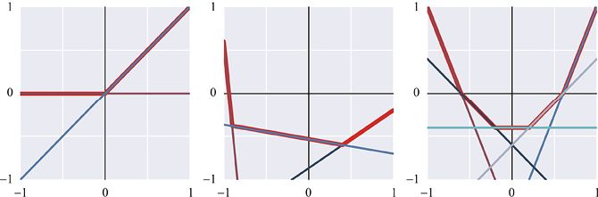

> **圖片描述：** 此圖展示maxout的三個例子：(a)類似ReLU；(b)不對稱碗形；(c)對稱碗形。紅色加粗線為輸出。

(a)　　　　　　　　　　　　　　　　　　　　　　　　(b)　　　　　　　　　　　　　　　　　　　　　　　　(c)

圖17.15　maxout允許我們從多個直線中構建一個函數，*x*取任何值時，函數輸出都是對應的*y*的最大值，圖中加深的紅線是每一組線所產生的maxout的輸出。(a)通過maxout形成了一個ReLU；(b)通過maxout形成了一個不對稱的碗形；(c)通過maxout形成了一個對稱的碗形

基本ReLU的另一個變體是：在輸入到ReLU之前，為輸入項添加一個小的隨機值，然後運行一個標準ReLU。這個函數被稱為**噪聲**ReLU（noisy ReLU），但在基本的神經網路中並不常使用。

## 17.6　光滑函數

正如我們將在第18章中看到的那樣，在神經網路的學習過程中，有一個關鍵的步驟涉及計算神經元輸出（包括激活函數）的導數。

我們在17.5節中看到了各種形式的ReLU。它們通過多條直線來構建至少一個彎折（或者說扭曲），以此建立非線性的輸出。我們在第5章中提到，從數學上說，在兩條直線相交的彎折處是沒有導數的。

如果這些彎折處阻止了求導的計算（要知道，求導對於神經網路的學習是必要的），那麼為什麼ReLU函數如此受歡迎呢？事實上，有一些標準的數學工具可以巧妙地處理類似於ReLU函數那樣的尖角，處理後就可以得到導數[Oppenheim96]。這些數學工具並不是對所有函數都有效，但是對於上述的函數都適用。

另一種方法就是使用多個直線，然後對它們有問題的地方進行修補，也就是使用光滑函數，光滑函數在任何地方都有導數。下面讓我們來看一看一些流行的光滑函數。

softplus是將ReLU做了簡單的平滑處理，如圖17.16所示。

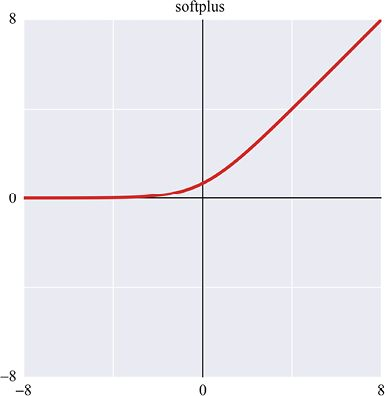

> **圖片描述：** 此圖展示softplus，是ReLU的平滑版本，消除了原點尖角。

圖17.16　softplus是ReLU的平滑版本

我們也可以將移位ReLU進行平滑處理，稱之為**指數式**ReLU（exponential ReLU）或ELU [Clevert16]，如圖17.17所示。

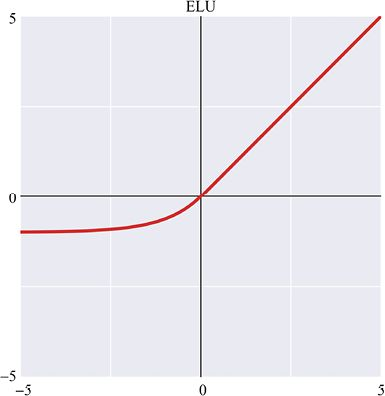

> **圖片描述：** 此圖展示ELU，正值為線性，負值以指數曲線趨近負常數。

圖17.17　指數式ReLU（或ELU）

另一個流行的光滑激活函數稱為sigmoid**函數**，也稱為logistic**函數**（logistic function）或logistic**曲線**（logistic curve），“sigmoid函數”這個名字來源於函數曲線與S形的相似，它的其他名字則是指其數學結構，如圖17.18所示。

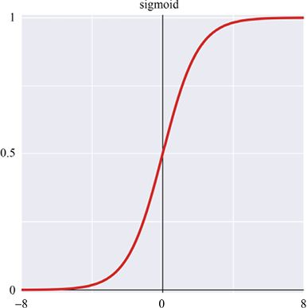

> **圖片描述：** 此圖展示sigmoid函數，S形曲線，值域[0,1]，極負值接近0，極正值接近1。

圖17.18　S形的sigmoid函數也稱為邏輯函數或邏輯曲線。對於極負的輸入，它的輸出值為0；而對於極正的輸入，它的輸出值為1。如果輸入值在[−6,6]的區間內，輸出值則會平穩地過渡在[−1,1]的區間內

與sigmoid函數關係密切的另一個數學函數稱為**雙曲正切**（hyperbolic tangent）**函數**，這個名字來自三角曲線，是一個很有名的名字，通常被簡寫為tanh，如圖17.19所示。

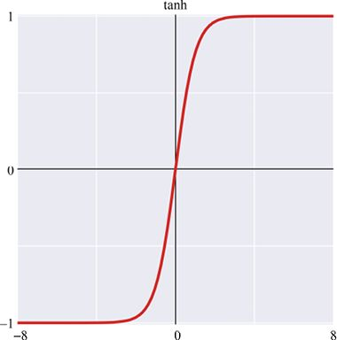

> **圖片描述：** 此圖展示tanh函數，值域[-1,1]，過渡區比sigmoid稍窄。

圖17.19　雙曲正切函數（可簡寫成tanh）與圖17.18中的sigmoid函數一樣也是S形的。它們兩個的關鍵區別在於：雙曲正切函數為非常負的輸入值返回−1的輸出，而它的過渡區域也會稍微狹窄一點

我們說sigmoid函數和tanh函數都是將整個輸入範圍（從負無窮到正無窮）**壓縮**（squashing）到一個小範圍內（見圖17.20）：sigmoid函數將所有輸入壓縮到[0,1]的區間上；tanh函數則是將所有輸入壓縮到[−1,1]上。

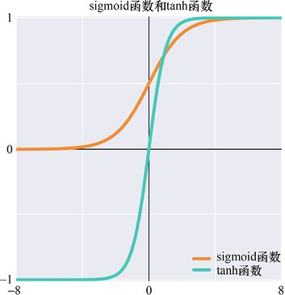

> **圖片描述：** 此圖同時繪製sigmoid（紅色）和tanh（藍色）函數進行比較。

圖17.20　在[−8,8]的區間內繪製sigmoid函數（紅色）和tanh函數（藍色）

基本的ReLU與sigmoid函數的組合形狀稱為swish[Ramachandran17]，如圖17.21所示。從本質上說，它就是一個ReLU，但是在0的左邊出現了一個小而平滑的凹陷，之後函數變平了。

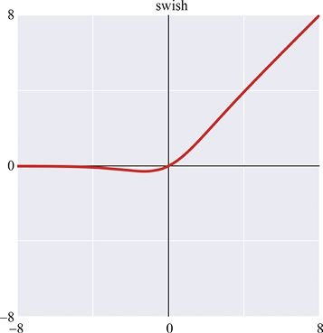

> **圖片描述：** 此圖展示swish函數，類似ReLU但在x略小於0處有平滑凹陷。

圖17.21　名為swish的激活函數，它結合了ReLU和sigmoid函數

之前提到，ReLU可能是目前最流行的激活函數，但是，當使用的演算法需要真正地對激活函數求導時（而不是運用一些技巧，例如使用分段線性ReLU和maxout），我們通常會首選sigmoid函數和tanh函數。

光滑曲線的一個缺點是：它們只能在有限的輸入範圍內產生有用的結果。舉個例子，當輸入值大於 6（或者小於−6）時，sigmoid（或tanh）函數將返回相同的值，這種現象被稱為**飽和**（saturation）。當函數的輸出持續為相同值時，導數會變成0，我們將在第18章中看到：在訓練神經網路時，導數的值是至關重要的資訊，如果導數趨於0，訓練就趨於停止。

對於負值而言，ReLU也會遇到同樣的問題，因為當輸入小於0時，ReLU的輸出總為0，這一點和sigmoid相同（當sigmoid的輸出非常負時）。但是ReLU不會出現正值飽和，當輸入大於0時，它所返回的輸出與輸入相同。

激活函數之間的區別就可以解釋為什麼有多個流行的激活函數。在這裡，並沒有一個確切的理論來告訴我們在特定網路的特定層中哪個激活函數最有效，所以我們通常需要嘗試多個激活函數，來確定哪種效果最好。

## 17.7　激活函數畫廊

圖17.22總結了我們討論過的激活函數。

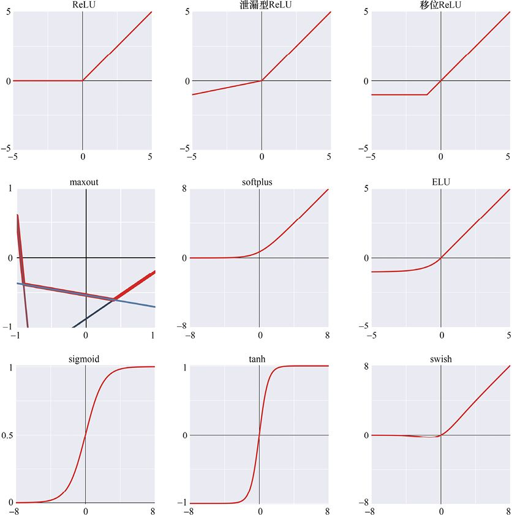

> **圖片描述：** 此圖為9種激活函數的彙總畫廊（3×3排列）。

圖17.22　當前流行激活函數的彙總。第一行（從左到右）：ReLU、洩漏型ReLU、移位ReLU；第二行（從左到右）：maxout、softplus和ELU；第三行（從左到右）：sigmoid、tanh和swish

## 17.8　正規化指數函數

還有另一種函數，我們通常只將它用於分類器神經網路的輸出神經元（即使有兩個或更多的輸出神經元）。它不是一直以來我們所討論的激活函數，因為它可以在同一時間被應用到所有的輸出神經元上，而不僅能應用到一個輸出神經元上。我們之所以會在這裡討論它，是因為這是討論這個重要工具的很合適的機會。

這種技術稱為**正規化指數函數**（softmax function），常用作具有多個輸出項的分類網路的最後一步。

它的名字和我們在上面看到的softmax激活函數是一樣的，因為它們基於相似的數學理論，但這種技術不是一個激活函數。

這個版本的softmax是將網路中生成的原始資料變為每個類別的機率，如圖 17.23所示。

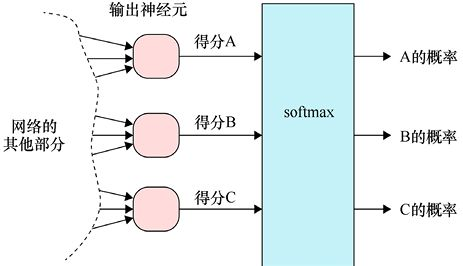

> **圖片描述：** 此圖展示softmax將3個輸出神經元的原始分數轉換為加總為1的機率值。

圖17.23　softmax接收網路的全部輸出，同時對它們進行修改，它所輸出的結果是：將每個類別的得分轉變為機率

每個輸出神經元都會輸出一個值（或者得分），這個值對應於網路多大程度上認為特定輸入屬於相應類別。在圖17.23中，我們假設資料分為3個類別（命名為A、B和C），則3個輸出神經元都會給出一個得分。輸出神經元的分數越高，神經網路就越確定特定的輸入項歸於該類別。

這樣，我們就可以根據分數進行排序，這一分數代表著網路多大程度認為某一類別是正確的類別。得分最高的類別是神經網路選出的首選項，這一點非常有用。

還有更有用的事情，那就是我們能從網路中獲得**機率**。例如，有3個值從圖17.23中的3個神經元輸出，A對應於0.6，B對應於0.3，C對應於0.1，那麼我們就可以說，屬於A類別的機率是屬於B類別的2倍、是屬於C類別的6倍，屬於B類別的機率則是屬於C類別的3倍。

我們不能僅用得分去表達結果，神經網路設計的初衷也不是為了得到一些得分。如果想用機率（或者說可能性）的方式去陳述結果，就需要先把它們轉換為機率，softmax是完成這一步最常見的方法。

從數學上講，任何一組機率的重要特徵就是：它們相加之和等於1。如果我們僅是單獨修改網路的每一個輸出，就不可能知道其他值，也無法確定它們相加之和是多少。但是，通過將所有輸出傳遞給softmax，就可以同時調整所有輸出值，也就能夠確定機率的總和為1。

讓我們來看看softmax起到了什麼作用。

首先看圖17.24的左上角，這裡有一個具有6個輸出神經元的分類器的輸出，我們將其標記為A～F。從中可以看到：B類的值是0.1，而C類的值是0.8。正如之前所討論的那樣，如果由此斷定輸入是C類的可能性是B類的8倍，那麼這便是一個錯誤的結論，因為這些值所標記的是得分而不是機率。為了比較它們，我們需要把它們變為機率。

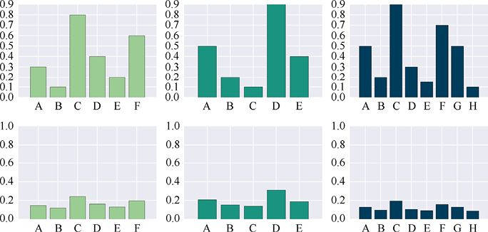

> **圖片描述：** 此圖展示softmax應用於三組輸出的效果，上排為原始得分，下排為機率分佈。

圖17.24　將softmax應用於不同的輸出集。第一行：分類器的得分；第二行：在上方的輸出值上應用softmax所得到的結果

我們對左上角的圖的輸出集應用了softmax，結果展示在左下角的圖中，這個圖展示了輸入項歸屬於6個類別的機率。值得注意的是：像C和F這樣的大輸出值被大量縮減，但是比較小的輸出值（如B）幾乎沒有被縮減。但按大小對各個條形進行排列，所得到的結果仍然與得分順序相同（C最大，然後是F、D等）。由此可以得出結論，輸入項為C類的機率比輸入項為B類的機率大幾乎2倍。

圖17.24的中間和右邊為另外兩個假設的神經網路的輸出，上方和下方分別為應用softmax之前和之後的結果。

因為softmax可以把輸出項的得分變成機率，所以它被廣泛應用於分類器神經網路的末端。

## 參考資料

[Clevert16]　Djork-Arné Clevert, Thomas Unterthiner, Sepp Hochreiter, *Fast and Accurate Deep Network Learning by Exponential Linear Units (ELUs)*”, ICLR 2016.

[Kuphaldt17]　Tony R Kuphaldt, *Introduction to Diodes And Rectifiers, Chapter 3-Diodes and Rectifiers*, in Lessons in Electric Circuits, 2017.

[Goodfellow13]　Ian J Goodfellow, David Warde-Farley, Mehdi Mirza,Aaron Courville, Yoshua Bengio, *Maxout Networks*, ICML28(3), pp. 1319-1327, 2013.

[Limmer17]　Steffen Limmer and Slawomir Stanczak, *Optimal deep neural networks for sparse recovery via Laplace techniques*, arXiv 1709.01112, 2017.

[Oppenheim96]　Alan V Oppenheim and S Hamid Nawab, *Signals and Systems, Second edition*, Prentice Hall, 1996.

[Ramachandran17]　Prajit Ramachandran, Barret Zoph, Quoc V. Le,*Swish: A Self-Gated Activation Function*, arXiv: 1710.05941, 2017.

[Stoltz16]　Stefan Stoltz, *Trains4Africa blog*, 2016.
