# 第18章　反向傳播

神經網路從誤差中學習。每次系統進行不正確的預測時，我們都會使用一種稱為反向傳播的演算法來改善其權重。

## 18.1　為什麼這一章出現在這裡

本章是關於訓練神經網路的。這個基本的想法非常簡單。假設我們正在訓練分類程式，希望它告訴我們應該將哪些給定標籤分配給給定的輸入。它可能會告訴我們照片中的動物是什麼，或者圖像中的骨骼是否被破壞，抑或某個特定的音頻是哪一首歌。

要訓練這個神經網路，就需要給它一個樣本，並要求它預測該樣本的標籤。如果預測與我們之前為其確定的標籤匹配，就繼續訓練下一個樣本。如果預測有錯，我們會對網路加以修改，以幫助它下次做得更好。

這個概念雖然很容易表述，但實際操作並不是那麼容易。本章是關於我們如何“改變網路”以使其**學習**或提高其做出準確預測的能力。這種方法不但適用於分類器，而且適用於幾乎任何類型的神經網路。

我們對比一下神經元的前饋網路和第13章中的專用分類器。每個專用演算法都有一個定製的內置學習方法，用於測量輸入資料以提供分類器需要知道的資訊。

但神經網路只是一個巨大的神經元的集合，每個神經元進行自己的小計算，然後把結果傳遞給其他神經元。即使我們將它們組織成層，也沒有固有的學習演算法。

如何訓練一個這樣的東西來產生我們想要的結果？怎樣才能高效地做到這一點？

這個答案就是**反向傳播**（backprop）。如果沒有反向傳播，我們今天就不會廣泛使用深度學習，因為我們無法在合理的時間內訓練模型。通過使用反向傳播演算法，深度學習演算法變得既實用又豐富。

反向傳播演算法是一種底層演算法。在用庫來構建和訓練深度學習系統時，精心調整的例程為我們提供了高速和精準實作這個目標的工具。所以通常除了作為一種教學練習或實作一些新的想法，我們可能永遠不會編寫程式碼來執行反向傳播演算法。

那麼為什麼這一章會出現在這裡呢？我們為什麼要花費心思來了解這個底層演算法呢？這裡至少有4個充分的理由。

首先，理解反向傳播是很重要的，因為在任何領域，對自己所用工具的瞭解是成為行業專家的一部分。水手和飛行員需要了解自動駕駛儀的工作原理，以便正常使用它們。有自動對焦相機的攝影師需要知道該功能的工作原理、使用極限是什麼以及如何操控它，以便使用自動系統捕捉想要的圖像。在任何領域，核心技術的基本知識是提高熟練程度和掌控程度的過程中不可或缺的一部分。在這種情況下，瞭解有關反向傳播的知識可以方便我們閱讀文獻，與其他人討論有關深度學習的想法，並更好地理解所使用的演算法和庫。

其次，更實際的是，瞭解反向傳播可以幫助我們設計可以學習的網路。如果神經網路學習緩慢或根本不學習，可能是因為有些東西阻止了反向傳播的正常運行。反向傳播是一種多功能且強大的演算法，但它不是萬能的。我們可以輕鬆搭建反向傳播不會產生有用變化的網路，從而導致網路頑固地拒絕學習。當反向傳播出錯時，理解演算法有助於我們解決問題[Karpathy16]。

再次，神經網路中的許多重要進展非常依賴反向傳播。要了解這些新想法及其工作原理，瞭解它們背後的演算法尤為重要。

最後，反向傳播是一種簡潔的演算法。它有效地解決了需要大量時間和電腦資源的問題。它是該領域的概念寶藏之一。作為一個好奇和有思想的人，理解這個演算法是非常值得的。

出於上述原因和其他原因，本章將介紹反向傳播。一般來說，反向傳播的介紹是以數學形式通過方程的集合呈現的 [Fullér10]。像往常一樣，我們跳過數學並轉而關注概念。這些機制的核心是常識性的，並且不需要除基本算術以及我們在第5章中討論過的導數和梯度的概念之外的任何工具。

### 反向傳播的微妙

反向傳播演算法並不複雜。事實上，它非常簡單，這就是為什麼它可以如此有效地實施。

但簡單並不總是意味著容易。

反向傳播演算法很微妙。在下面的討論中，演算法將通過觀察和推理過程形成，這些步驟可能需要一些思考。我們將盡力弄明白每一步，但從閱讀到理解的飛躍可能需要一些努力。

這值得我們付出努力。

## 18.2　一種非常慢的學習方式

讓我們以一種非常慢的學習方式來訓練神經網路。這將為我們提供一個良好的起點，然後我們將改進這個神經網路。

假設我們已經獲得了一個由數百甚至數萬個互連神經元組成的全新神經網路。該網路旨在將每個輸入分為5類中的一個。所以它有5個輸出，我們將其編號為1～5，無論哪個輸出最大，都是網路對輸入類別的預測，如圖18.1所示。

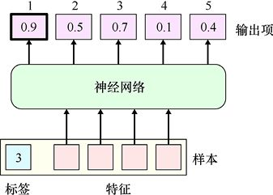

> **圖片描述：** 此圖展示用於預測樣本類別的神經網路結構。底部為一個樣本（含標籤「3」和多個特徵），經過中間的神經網路處理後，頂部產生5個輸出項（值分別為0.9、0.5、0.7、0.1、0.4），每個對應一個類別。

圖18.1　預測輸入樣本類別的神經網路

從圖18.1的底部開始，我們有一個包含4個特徵和一個標籤的樣本。標籤告訴我們這個樣本屬於類別3。這些特徵進入神經網路，該網路被設計為提供5個輸出，每個類別一個。在這個例子中，網路錯誤地確定輸入屬於第1類，因為最大輸出0.9來自1號輸出。

在網路有任何輸入之前，請考慮神經網路的狀態。正如我們從第16章所知的，每個神經元的每個輸入都有一個相關的權重。我們的網路中很容易有數十萬或數百萬的權重。通常，所有這些權重都將使用小的隨機數進行初始化。

現在讓我們通過網路運行一個帶標籤的訓練資料，如圖18.1所示。樣本的特徵進入第一層神經元，這些神經元的輸出進入更多的神經元，以此類推，直到它們最終到達輸出神經元，成為網路的輸出。具有最大值的輸出神經元的索引是該樣本的預測類。

由於我們從初始化的權重開始，這很可能得到隨機的輸出。因此，網路將有1/5的機會預測此樣本的正確標籤。但是有4/5的機會它會弄錯，所以讓我們假設網路預測了錯誤的類別。

當預測與標籤不匹配時，可以用數字來衡量誤差，得出一個數字來告訴我們這個答案是多麼錯誤。我們將這個數字稱為**誤差分數**或**誤差**，或者有時稱為**損失**（loss）（如果“損失”這個詞成為“誤差”的同義詞有點奇怪，那麼將其視為當我們使用分類器的輸出進行分類時，與標籤相比有多少資訊“丟失”會更有助於理解）。

誤差（或損失）是一個可以取任何值的浮點數，但通常我們會設置它使其始終為正數。誤差越大，該網路對此輸入標籤的預測就越“錯誤”。

誤差為0表示網路正確預測了此樣本的標籤。理想情況下，我們會將訓練集中的每個樣本的誤差降至0。實際上，我們通常會儘可能地使其接近0。

讓我們簡要回顧前幾章中的一些術語。當談到關於訓練集的“網路誤差”時，我們通常表示在考慮所有訓練樣本時網路狀態的某種總體平均值。我們將此稱為**訓練誤差**（training error），因為它是從訓練集的預測結果中得到的總體誤差。同樣，測試集或驗證集的誤差稱為**測試誤差**（test error）或**驗證誤差**（validation error）。當系統被部署時，其預測新資料標籤時可能產生的誤差被稱為**泛化誤差**，因為它表示系統能夠從其訓練資料“推廣”到新的真實資料的程度。

思考整個訓練過程的一個好方法是將網路擬人化。我們可以說它“希望”將其誤差降至0，並且學習過程的重點是幫助它實作該目標。

這種思維方式的一個優點是可以讓網路做任何我們想做的事情，只需設置誤差來“懲罰”我們不想要的任何品質或行為。由於本章中的演算法旨在最大限度地減小誤差，因此我們知道任何導致網路誤差的行為都將被最小化。

最自然的懲罰是獲得錯誤的答案，因此誤差幾乎總是包含一項，用於衡量輸出與正確標籤的距離。預測與標籤之間的匹配越差，這個值就越大。由於網路希望最小化誤差，因此它自然會最小化這些誤差。

這種通過誤差分數“懲罰”網路的方法意味著我們可以選擇在誤差中包含可以測量和想要抑制的任何內容的誤差項。例如，另一個加入誤差的流行測量是**正則化項**（regularization term），我們在其中查看網路中所有權重的大小。正如將在本章後面看到的那樣，我們通常希望這些權重“小”，這通常意味著在−1和1之間。當權重超出此範圍時，我們會為誤差添加更大的數字。由於網路“想要”儘可能小的誤差，它將嘗試保持較小的權重，以使該項保持較小。

自然而然地，這些都提出了一個問題，即網路如何能夠實作最小化誤差的目標。這就是本章的重點。

讓我們從一個基本的誤差測量開始，它只會懲罰網路預測和標籤之間的不匹配。

我們的第一個網路學習演算法只是一個思想實驗，因為它在今天的電腦上運行會非常慢。但這種演算法的動機是正確的，它形成了我們將在本章後面看到的更有效技術的概念基礎。

### 18.2.1　緩慢的學習方式

我們的示例還是分類器。我們會給網路提供一個樣本，並將系統的預測與樣本的標籤進行比較。

如果網路正確並預測了正確的標籤，我們將不會改變任何內容，然後繼續預測下一個樣本。正如智者所說，“如果沒壞，就不要修”[Seung05]。

但是，如果特定樣本的結果不正確（即具有最高值的類別與我們的標籤不匹配），我們將嘗試改進。也就是說，我們應從誤差中吸取教訓。

如何從這個誤差中吸取教訓？讓我們繼續使用這個樣本一段時間，並嘗試幫助網路做得更好。首先，我們選擇一個小的隨機數（可能是正數或負數）。我們從網路中的數千或數百萬個權重中隨機選擇一個權重，將小的隨機數添加到該權重。

圖18.2展示了一個5層網路，每層有3個神經元。資料從左側的輸入流向右側的輸出。出於簡單性，並非每個神經元都使用前一層上所有神經元的輸出。在圖18.2a中，我們隨機選擇一個權重，此處以紅色顯示並標記為*w*。在圖18.2b中，我們通過向其添加值*m*來修改權重*w*，因此權重現在為*w* + *m*。當我們再次通過網路運行樣本時，新的權重會導致其輸入的神經元輸出發生變化（紅色），如圖18.2c所示。結果，神經元的輸出發生變化，從而導致向它輸入資料的神經元改變它的輸出，並且這些變化會一直級聯到輸出層。

        |

(a)

(b)

(c)

        |

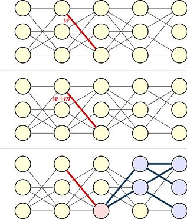

> **圖片描述：** 此圖展示更新單個權重導致的連鎖反應，變化沿網路傳播最終改變輸出。

       |

圖18.2　更新單個權重會導致連鎖反應，最終可能會改變網路的輸出

現在我們有了一個新的輸出，可以將它與標籤進行比較並測量新的誤差。如果新誤差小於先前的誤差，那麼我們已經做得更好了！我們將保留此更改，然後繼續預測下一個樣本。

但如果結果沒有變好，那麼我們撤銷這一變化，讓權重恢復為之前的值。然後，我們選擇一個新的隨機權重，將其更改為新選擇的小的隨機數，然後再次評估網路。

我們可以繼續這個挑選和微調權重的過程，直到結果改善，或者我們已經嘗試了足夠的次數，或者出於任何其他原因我們決定停止。然後我們繼續預測下一個樣本。

如果在訓練集中使用了所有樣本，我們將一遍又一遍重複遍歷它們（可能以不同的順序）。我們的想法是，從每一個誤差中稍微改進一點。

我們可以繼續這個過程，直到網路正確地對每個輸入進行分類，或者已經足夠接近，或者我們的耐心已經用盡。

通過這種演算法，我們可以期待網路慢慢改善，儘管可能會遇到挫折。例如，調整權重以改善一個樣本的預測可能會破壞對一個或多個其他樣本的預測。如果是這樣，當這些樣本出現時，它們將改變自己以改善表現。

採用這種思維的演算法並不完美，因為事情可能會被卡住。例如，有時我們需要同時調整多個權重。為了解決這個問題，我們可以設想擴展演算法，為多個隨機權重分配多個隨機變化值。但是現在讓我們繼續使用更簡單的版本。

如果有足夠的時間和資源，網路最終會找到每個權重的最佳值，該權重值可以正確預測每個樣本的標籤，或儘可能接近該標籤。

其中的重要詞彙是**最終**。就像“水將最終沸騰”或“仙女座星系最終將與銀河系相撞”這種語境中的一樣[NASA12]。

這種演算法雖然是網路學習的有效方式，但絕對不實用。因為現代網路可以擁有數百萬個權重。試圖用這種演算法找到所有這些權重的最佳值是不現實的。

但這是核心理念。為了訓練網路，我們會觀察它的輸出，當它出錯時，我們會調整權重以減小這些誤差。在本章中，我們的目標是基於這個粗略的想法重新構建一個更加實用的演算法。

在繼續推進之前，值得注意的是，我們一直在談論權重，而不是每個神經元的偏差。我們知道每個神經元的偏差都會與神經元的加權輸入加在一起，因此改變偏差也會改變輸出。這是否意味著我們也可以調整偏差？當然可以。但是由於**偏差技巧**（見第10章），我們不必明確地考慮偏差。正如所有其他輸入一樣，這一點改變會將偏差設置為具有自身權重的輸入。這種安排的妙處在於它意味著就訓練演算法而言，偏差只是另一個需要調整的權重。換句話說，我們需要考慮的是調整權重，並且偏差權重將隨著所有其他權重自動調整。

現在讓我們考慮如何改進這種慢得令人難以置信的權重變化演算法。

### 18.2.2　更快的學習方式

18.2.1節提到的演算法可以改善神經網路，但速度很慢。

效率低下的一個重要原因是我們對權重的一半調整是在誤差的方向：我們應該在降低它時添加一個值，反之，也應該在提高它時刪除一個值。這就是為什麼我們必須在誤差發生時撤銷更改。另一個原因是我們逐個調整每個權重，這就要求評估大量的樣本。

現在讓我們解決這些問題。如果我們事先知道是否想要沿著數軸向右移動（使其更加大）或向左移動（使其更小）每個權重，這樣就可以避免犯錯。

我們可以從誤差的**梯度**中獲得與該權重相關的資訊。回想一下，我們在第5章中學習了梯度的知識，即曲面的高度會隨著每個參數的變化而變化。讓我們簡化一下。在一維（其中梯度也稱為**導數**）中，梯度是特定點上方的曲線的斜率。曲線描述了網路的誤差，點是權重的值。如果權重上方的誤差的斜率（梯度）為正（向右移動時線向上），那麼將點向右移動會導致誤差增加。對我們更有用的是，如果將點移動到左側會導致誤差減小。如果誤差的斜率為負，則情況相反。圖18.3展示了兩個示例。

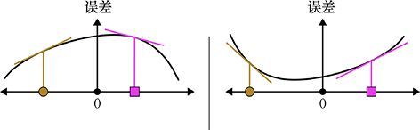

> **圖片描述：** 此圖展示梯度如何指引權重更新方向，正負號決定向左或向右移動。

(a)　　　　　　　　　　　　　　　　　　　　　　　　　　　　(b)

圖18.3　梯度告訴我們如果將權重向右移動，誤差會發生什麼（黑色曲線）。梯度由我們感興趣的點正上方的曲線斜率給出。當我們向右移動時上升的線具有正斜率，否則為負斜率

從圖18.3a可以看到，如果將圓點權重向右移動，則誤差增加，因為誤差的斜率為正。為了減小誤差，我們需要向左移動圓點。方點的梯度是負的，因此我們通過向右移動該點來減小誤差。從圖18.3b可以看到，圓點的梯度為負，因此向右移動將減小誤差。方點的梯度是正的，因此我們通過將該點向左移動來減小誤差。

如果我們有一個權重的梯度，就總是可以根據需要進行精確調整，以使誤差減小。

如果計算時間很長，使用梯度就不會有太大的優勢，因此第二個改進就是讓我們假設可以非常有效地計算權重的梯度。實際上，我們假設可以快速計算整個網路中每個權重的梯度，然後可以通過在每個權重由其自己的梯度給出的方向上添加一個小值（正或負）來同時更新所有權重。這可以節省大量時間。

結合上述思路，我們可以設計這樣一種演算法：通過網路運行樣本，測量輸出，計算每個權重的梯度，然後使用每個權重的梯度將該權重往右側或左側移動。這正是我們要做的。

該演算法使得了解梯度成為一個重要問題。有效地找到梯度是本章的主要目標。

值得注意的是，該演算法假設同時並相對獨立地調整所有權重可使誤差減小。這是一個大膽的假設，因為我們已經看到改變一個權重會如何通過網路的其餘部分引起連鎖反應。這些反應可能會改變其他神經元的值，從而改變它們的梯度。我們現在不會介紹細節，但稍後會看到，如果我們對權重的變化足夠小，那麼這個假設通常都會成立，並且誤差確實會減小。

## 18.3　現在沒有激活函數

對於本章的後續內容，我們通過假設神經元沒有激活函數來簡化討論。

正如我們在第17章中看到的那樣，激活函數至關重要，它讓整個神經網路比一個神經元更強大， 所以我們需要使用它們。

但是如果我們將它們包含在我們對反向傳播的初步討論中，事情會迅速變得複雜。如果我們暫時不包含激活函數，那麼邏輯就更容易理解了。我們最後會把它們重新放回去。

由於我們暫時假設神經元中沒有激活函數，因此以下討論中的神經元只是將它們的權重輸入相加，並將這個和作為它們的輸出，如圖18.4所示。和以前一樣，每個權重都是用它來自的神經元和要進入的神經元的兩個字母組合命名的。

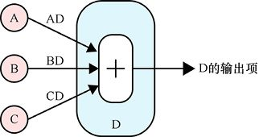

> **圖片描述：** 此圖展示無激活函數的神經元D，三個輸入乘以權重後加總直接輸出。

圖18.4　神經元D簡單地將其輸入值相加，並將該和作為其輸出。在這裡，我們明確地將每個連接上的權重命名

在明確地將激活函數放回去之前，神經元只會輸出權重輸入的總和。

## 18.4　神經元輸出和網路誤差

我們的目標是通過調整網路權重來減小樣本的總體誤差。

我們將分兩步完成。在第一步中，我們為每個神經元計算並存儲一個名為“delta”的值。這個值與網路誤差有關，我們將在下面看到。該步驟由**反向傳播**演算法執行。

第二步使用神經元上的delta值來更新權重。此步驟稱為**更新**步驟。它通常不被認為是反向傳播的一部分，但有時人們將這兩個步驟放在一起並將整個事件稱為“反向傳播”。

現在的總體計劃是通過網路運行樣本，獲得預測，並將該預測與標籤進行比較以獲得誤差。如果它們的誤差大於0，則用它來計算並在每個神經元處存儲一個我們都稱之為“delta”的值。我們使用這些delta值和神經元輸出來計算每個權重的更新值。最後一步是應用每個權重的單個更新，以便它具有新值。

然後我們繼續預測下一個樣本，並一遍又一遍地重複這個過程，直到預測完全正確或我們決定停止。

現在讓我們看一下存儲在每個神經元中的這個神秘的“delta”值。

### 誤差按比例變化

有兩個關鍵的觀察結果可以理解要遵循的一切。這些都是基於我們忽略激活函數時網路的行為方式，這也是我們目前正在做的事。如上所述，我們將在本章後面會將它們放回去。

第一個觀察結果是：**當網路中任何神經元的輸出發生變化時，輸出誤差會按比例變化**。

讓我們解釋這個陳述。

由於我們忽略了激活函數，因此在系統中只關注兩種類型的值：權重（可以隨意設置和更改）和神經元輸出（自動計算，超出我們直接控制的範圍）。除了第一層，神經元的輸入值都是上一層神經元的輸出乘以該輸出傳送連接的權重。每個神經元的輸出只是所有這些加權輸入的總和。圖18.5概述了這個想法。

我們將改變權重以改善神經網路。但有時候考慮觀察神經元輸出的變化會更容易。只要我們繼續使用相同的輸入，神經元輸出可以改變的唯一原因是它的一個權重發生了變化。所以在本章的其餘部分，每當我們談到神經元輸出變化的結果時，都是因為改變了其中一個神經元所依賴的權重。

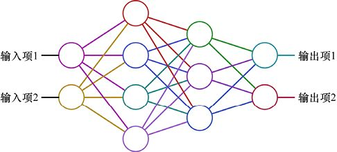

> **圖片描述：** 此圖展示11個神經元、4層的小型神經網路結構。

圖18.5　一個小型神經網路，有11個神經元，分為4層。資料從左側的輸入流向右側的輸出。每個神經元的輸入來自前一層神經元的輸出。這種類型的圖雖然很常見，但即便按不同顏色編碼，也很容易變得密集和混亂，所以應儘可能地避免它

讓我們來看看這個觀點，並想象我們正在研究一個輸出剛剛被改變的神經元。導致網路誤差的結果怎麼變化？因為在網路中進行的唯一操作是乘法和加法，我們將看到這種變化的結果是誤差的變化與神經元輸出的變化**成比例**。

換句話說，為了找到誤差的變化，我們先找出神經元輸出的變化並將其乘以某個特定值。如果我們將神經元輸出的變化量加倍，則也會將誤差的變化量加倍。如果我們將神經元的輸出變化減小1/3，則也會將誤差的變化減小1/3。

神經元輸出的任何**變化**與誤差的最終**變化**之間的聯繫只是神經元的變化乘以一些數字。這些數字有不同的名稱，但最常見的可能是小寫的希臘字母d（delta），儘管有時會使用大寫字母Δ。數學家經常使用delta字符來表示某種類型的“更改”，因此這是一個自然而然（如果簡潔的話）的名稱選擇。

因此每個神經元都有一個與其相關的delta或*d*。這是一個可大可小、可正可負的實數。如果神經元的輸出變化為特定量（上升或下降），則會將該變化乘以該神經元的delta，這告訴我們整個網路的輸出將如何變化。

讓我們繪製幾張圖來顯示輸出變化的神經元的“之前”和“之後”的條件。我們將強制改變神經元的輸出：在神經元輸出該值之前，將其加上任意一個數字。我們將使用字母*m*（用於“修改”）來表示此額外值，如圖18.6所示。

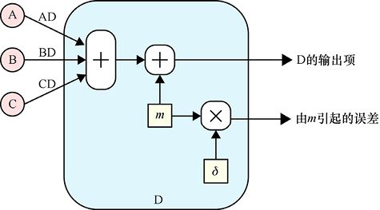

> **圖片描述：** 此圖展示神經元輸出變化m經delta值d放大產生誤差變化Em。

圖18.6　計算由神經元輸出的變化引起的誤差變化。我們通過在輸入之和上添加任意量*m*來強制改變神經元的輸出。因為輸出將被*m*改變，所以我們可以知道誤差的變化是這個變化量*m*乘以屬於這個神經元的*d*得到的值

在圖18.6中，我們將值*m*放在神經元內。我們也可以通過改變其中一個輸入來改變輸出。讓我們改變從神經元B輸入的值。我們知道B的輸出將在被神經元D使用之前乘以BD的權重。所以讓我們在應用該權重之後加上值*m*。這將與之前的結果相同，因為我們只是將*m*加到D中出現的總和中，如圖18.7所示。我們可以像以前一樣找到輸出的變化，並將輸出中的這個變化*m*乘以*d*。

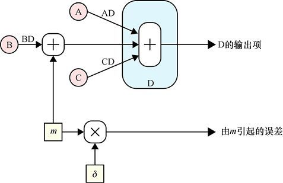

> **圖片描述：** 此圖展示修改量m加在B的加權輸出後，D的輸出改變m，誤差變化為m×d。

圖18.7　圖18.6的變體，其中我們將*m*加到B的輸出（在它乘以權重BD之後）。D的輸出又由*m*改變，並且誤差的變化又是該神經元的*d* 值的*m*倍

回顧一下，如果我們知道神經元輸出的變化，並且知道該神經元的delta值，就可以通過將輸出中的變化乘以該神經元的delta來預測誤差的變化。

這是一個值得注意的觀察，因為它明確地向我們展示了誤差是如何根據每個神經元的輸出變化而變化的。delta的值就像一個放大器，使神經元輸出的任何變化對網路的誤差產生更大或更小的影響。

將神經元的輸出變化與其增量相乘的一個有趣結果是，如果輸出的變化和delta值都具有相同的**符號**（兩者都是正的或負的），那麼誤差的變化將是正的，這意味著誤差會增加。如果輸出和增量的變化具有相反的符號（一個是負的而另一個是正的），那麼誤差的變化將是負的，這意味著誤差會減小。這就是我們想要的情況，因為我們的目標始終是儘可能地減小誤差。

例如，假設神經元A的delta為2，並且由於某種原因，其輸出變化為−2（例如，從5變為3）。由於增量為正且輸出變化為負，因此誤差的變化也將為負。由於2×(−2)=−4，因此誤差將減小4。

另一方面，假設A的delta為−2，其輸出變化為2（例如，從3變為5）。同樣，符號不同，因此誤差將改變 (−2)×2=−4，即誤差將減小4。

但是如果A輸出的變化是−2，而delta也是−2，則符號是相同的。由於 (−2)×(−2)=4，因此誤差將增加4。

在本節開始時，我們說有兩個需要注意的關鍵觀察結果。第一個關鍵觀察是：正如我們一直在討論的那樣，如果神經元的輸出發生變化，則誤差會按比例變化。

第二個關鍵觀察是：**整個討論同樣適用於權重**。畢竟，權重和輸出是相乘的。在將兩個任意數字（如*a*和*b*）相乘時，我們通過向*a*或*b*的值加值來使結果更大。就網路而言，我們可以說**當網路中的任何權重發生變化時，誤差會按比例變化**。

如果需要，我們可以計算出每個權重的delta。這是非常理想的情況。我們知道如何調整每個權重以使誤差消失：我們只添加一個小數字，其符號與權重的delta相反。

反向傳播的用途就是找到這些增量。我們首先通過找到每個神經元輸出的delta來找到它們。我們將在下面看到利用神經元的delta及其輸出，可以找到權重增量。

我們已經知道每個神經元的輸出，接下來把注意力轉向尋找那些神經元的delta。

反向傳播的美妙之處在於找到這些值是非常高效的。

## 18.5　微小的神經網路

為了掌握反向傳播，我們將使用一個將二維點分為兩類（1類和2類）的小型網路。如果點可以用直線分隔，那麼我們可以只用一個感知器，但需要使用一個小網路，因為它讓我們看到了一般原則。

在本節中，我們將瞭解網路，併為我們關心的所有內容添加標籤。這將使以後的討論更簡單、更容易理解。

圖18.8展示了一個簡單的網路。輸入是每個點的*X*和*Y*座標，有4個神經元，最後兩個的輸出用作網路的輸出。我們將其輸出稱為預測*P*1和*P*2。*P*1的值是網路對樣本（即輸入中的*X*和*Y*）屬於1類的可能性的預測，*P*2的值是其對樣本屬於2類的可能性的預測。這些不是實際的機率，因為它們的和不一定等於1，但較大的是網路對此輸入的首選類別。我們可以將它們變成機率（通過添加softmax層，如第17章所述），但這隻會使討論更加複雜而不會添加任何有用的東西。

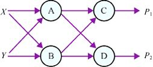

> **圖片描述：** 此圖展示簡單分類網路：X、Y→A、B→C、D→P1、P2。

圖18.8　一個簡單的網路。輸入有兩個特徵，我們稱之為*X*和*Y*。有4個神經元，以兩個預測（*P*1和*P*2）結束。這些預測分別預測樣本屬於1類或2類的可能性（而不是機率）

讓我們標記權重。像往常一樣，我們可以想象權重是在連接神經元的線上，而不是存儲在神經元內部。每個權重的名稱將是提供輸出值的神經元及緊隨其後使用該值的神經元的名稱組合。圖18.9展示了網路中所有8個權重的名稱。

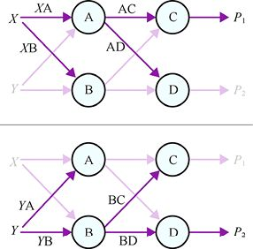

> **圖片描述：** 此圖標示網路中8個權重名稱：XA、XB、YA、YB、AC、AD、BC、BD。

圖18.9　在我們的小網路中為8個權重中的每個權重賦予名稱。每個權重用它所連接的兩個神經元的名稱命名，首先是起始神經元（在左側），然後是第二個目標神經元（在右側）。為了保持一致性，我們假設在命名權重時*X*和*Y*是“神經元”，因此*X*A是權重的名稱，它將縮放*X*的值進入神經元A

這是一個有**兩層**的小型**深度學習網路**。第一層包含神經元A和B，第二層包含神經元C和D，如圖18.10所示。

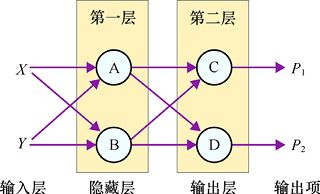

> **圖片描述：** 此圖標示網路的兩層結構：隱藏層（A、B）和輸出層（C、D）。

圖18.10　這個微小的神經網路有兩層。輸入層不進行任何計算，因此它通常不包含在圖層計數中

擁有兩層的網路不是一個非常深的網路，每層兩個神經元並不是很有計算能力。我們通常使用具有多層的且每層上有更多神經元的系統。如何確定我們應該為給定任務使用多少層，以及每層應該有多少神經元，是一門藝術和實驗科學。實質上，我們通常會猜測這些值，然後改變我們的選擇以嘗試改進結果。

在第20章中，我們將討論深度學習及其術語。讓我們在這裡略微提前瞭解一部分術語，並將它們用於圖18.10中的各個網路部分。**輸入層**（input layer）只是輸入*X*和*Y*的概念分組。這些與神經元不對應，因為這些只是用於存儲已提供給網路的樣本中特徵的記憶體塊。當計算網路中的網路層時，我們通常不會計算輸入層。

**隱藏層**（hidden layer）是指神經元A和B所在的第一層，之所以叫作這個名字，是因為神經元A和B在網路“內部”，這對外部的觀察者來說是“隱藏”的，他們只能看到輸入和輸出。**輸出層**（output layer）是指提供**輸出**的一組神經元，這裡是*P*1和*P*2。這些層的名稱有點不對稱，因為輸入層沒有神經元，而輸出層有，但這就是約定俗成的。

最後，我們想要表示每個神經元的輸出和delta。為此，我們通過將神經元的名稱與我們想要表示的值組合來命名相應的輸出和delta。所以*Ao*和*Bo*是神經元A和B的輸出的值，*Ad*和*Bd*是這兩個神經元的delta值。

圖18.11展示了存儲在神經元中的這些值。

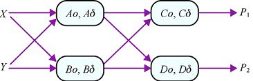

> **圖片描述：** 此圖展示每個神經元的輸出值（o）和delta值（d）。

圖18.11　我們的小型網路，包含每個神經元的輸出和delta值

當神經元輸出發生變化從而導致誤差發生變化時，我們將關注會發生什麼。我們將神經元A的輸出變化記為*Am*。同時將誤差記為*E*，並將誤差變化記為*Em*。

如上所述，如果神經元A的輸出中有一個變化*Am*，那麼我們將該變化乘以*Ad* 就可以得出誤差的變化。也就是說，變化*Em*由*Am*×*Ad* 給出。我們會想到*Ad* 的作用是乘以或縮放神經元A輸出的變化，從而給出相應的誤差變化。圖18.12展示了我們通過縮放delta以產生誤差變化的方式來可視化神經元輸出的變化的原理。

在圖18.12的左邊，我們從神經元A開始。它以值*Ao*開始，但是我們改變其輸入上的一個權重，使輸出增加*Am*。*Am*框中的箭頭表示此更改為正。這個變化乘以*Ad* 將帶給我們誤差變化*Em*。我們將*Ad* 繪製為楔形，說明了*Em*的放大情況。將此更改添加到起始誤差*E*，會為我們提供新的誤差*E* + *Em*。在這種情況下，*Am*和*Ad* 都是正的，所以誤差*Am*×*Ad* 的變化也是正的，即增加了誤差。

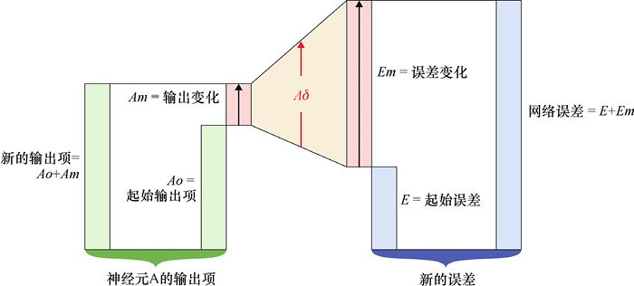

> **圖片描述：** 此圖展示神經元輸出變化Am經delta放大得誤差變化Em的流程。

圖18.12　神經元輸出的變化改變網路誤差的可視化原理圖。圖大致從左向右閱讀

記住，delta值*Ad* 將神經元輸出的變化與誤差的變化聯繫起來。這些不是相對變化或百分比變化，而是實際數值。因此，如果A的輸出從3變為5，那麼變化為2，因此誤差的變化將是*Ad*×2。如果A的輸出從3000變為3002，那麼變化仍然是2，並且誤差將改變相同的量*Ad*×2。

現在我們已經理解了所有基本內容，下面就可以瞭解反向傳播演算法。

## 18.6　第1步：輸出神經元的delta

反向傳播就是找到每個神經元的delta值。為此，我們將在網路末端找到誤差的梯度，然後將這些梯度傳遞或移動到開始。所以我們將從末端——輸出層開始。

在我們的小型網路中，神經元C和D的輸出分別給出了輸入在1類或2類中的可能性。理想情況下，屬於1類的樣本將使*P*1=1.0，使*P*2=0.0，這意味著系統確定它屬於1類並且同時確定它不屬於2類。

如果系統不太確定，我們可能得到*P*1=0.8和*P*2=0.1，這告訴我們樣本更可能是1類（請記住這些不是機率，所以它們的總和可能不會為1）。

我們想用一個數字來表示網路的誤差。為此，我們將*P*1和*P*2的值與此樣本的標籤進行比較。

進行比較的最簡單方法是，識別標籤是否是獨熱編碼的，正如我們在第12章中看到的那樣。回想一下，獨熱編碼使得一個數字列表與類的數量一樣長，並在每個條目中放置一個0。如果標籤是獨熱編碼的，則在對應於正確類的條目中放置1。在例子中，我們只有兩個類，所以編碼器總是以兩個0的列表開頭，可以寫成（0,0）。對於屬於1類的樣本，它會在其獨熱編碼標籤的第一個插槽中放置1，得到（1,0）。同理，屬於2類的樣本的獨熱編碼標籤為（0,1）。有時這種標籤也稱為**目標**（target）。

讓我們將預測*P*1和*P*2放入一個列表中：（*P*1，*P*2）。現在我們可以比較列表。有很多方法可以做到這一點。例如，一種簡單的方法是找出列表相關元素之間的差異，然後將這些差異加起來，如圖18.13所示。

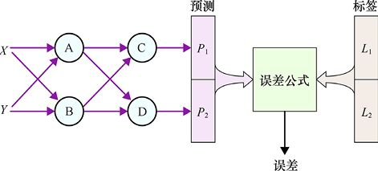

> **圖片描述：** 此圖展示從樣本特徵經網路產生預測，與獨熱編碼標籤比較計算誤差的流程。

圖18.13　要從特定樣本中查找誤差，我們首先將樣本的特徵*X*和*Y*提供給網路。輸出是預測*P*1和*P*2，分別告訴我們樣本屬於1類和2類的可能性。我們將這些預測與獨熱編碼標籤進行比較，並從中得出一個代表誤差的數字。如果預測完全匹配標籤，則誤差為0。匹配錯誤越嚴重，誤差越大

如果預測列表與標籤列表相同，則誤差為0。如果兩個列表很接近，例如，（0.9,0.1）和（1,0），那麼我們得到的誤差值將大於0，但可能不是很大。隨著列表變得越來越不同，誤差應該增加。如果網路絕對錯誤，則會出現最大誤差。例如，當標籤顯示（0,1）而預測為（1,0）時，誤差值最大。

計算網路誤差的公式有許多，大多數庫讓我們在其中進行選擇。我們將在第23章和第24章中看到，誤差公式的選擇是定義網路的關鍵之一。例如，如果構建一個網路來將輸入分類為類別，我們將選擇某種誤差公式；如果網路用於預測序列中的下一個值，我們將選擇另一種類型的誤差公式；如果試圖匹配其他網路的輸出，則選擇另一種類型的誤差公式。這些公式可能在數學上很複雜，因此我們不會在這裡詳述這些細節。

如圖18.13所示簡單網路的誤差公式包含4個數字（預測值有2個，標籤值有2個），最後會產生一個數字組作為結果。

但是所有誤差公式共享這個屬性：當它們將分類器的輸出與標籤進行比較時，完美匹配將給出0值，並且越來越不正確的匹配將產生越來越大的誤差。

對於每種類型的誤差公式，庫函數也將為我們提供其**梯度**。梯度告訴我們，如果我們改變4個輸入中的任何一個，誤差將如何變化。這看似是多餘的，因為我們希望輸出與標籤匹配，所以可以通過只觀察它們來告訴我們輸出應該如何改變。但請記住，誤差可能包括其他項，如我們上面討論的正則化項，因此事情會變得更復雜。

在簡單的情況下，我們可以使用梯度來告訴我們是否希望C的輸出增加或減小，對D也同樣。我們將選擇引起誤差減小的每個神經元的方向。

讓我們考慮一下誤差。我們也可以繪製梯度，但通常更難以解釋。當我們繪製誤差本身時，我們通常就通過查看誤差的斜率來了解梯度。

然而，我們無法為小網路繪製一個很好的誤差圖，因為它需要5個維度（輸入4個，輸出1個）。但事情並沒有那麼糟糕。我們不關心標籤更改時誤差的變化，因為標籤不能更改。對於給定的輸入，標籤是固定的，所以我們可以忽略標籤的兩個維度。這讓我們只有3個維度。

我們可以繪製三維形狀，也就可以繪製誤差。記住，只要想象如果我們將一滴水放在任意位置上方的誤差表面上，這滴水會流到哪個方向，我們就可以在該點看到梯度。

讓我們繪製一個三維圖，顯示對給定標籤任意*P*1和*P*2組合的誤差。也就是說，我們將設置標籤的值，並探索*P*1和*P*2的不同值誤差。每個誤差公式都會給我們一個略有不同的表面，但大多數看起來大致如圖18.14所示。

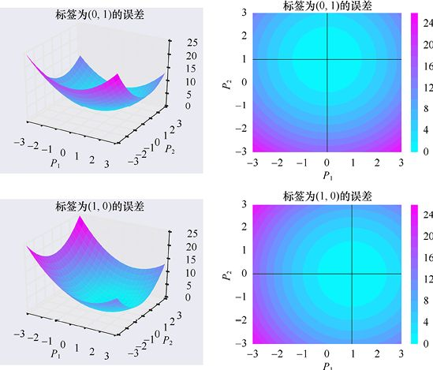

> **圖片描述：** 此圖展示兩組三維碗形誤差曲面，底部分別對應不同標籤值。

圖18.14　給定標籤（或目標）和兩個預測*P*1與*P*2，來可視化網路的誤差。上方：標籤為(0,1)，因此誤差呈碗形，其底部位於*P*1=0且*P*2=1。當*P*1和*P*2偏離這些值時，誤差會增加。上方左圖：*P*1和*P*2的每個值的誤差。上方右圖：左側曲面的俯視圖，使用彩色輪廓顯示高度。下方：標籤是(1,0)，所以現在誤差是一個底部在*P*1=1和*P*2=0的“碗”

對於兩個標籤的情況，誤差表面的形狀是相同的：底部為圓形的“碗”。唯一的區別是碗底部的位置，它直接位於標籤上方。這是合乎道理的，因為我們的目的是讓*P*1和*P*2與標籤相匹配，這時網路沒有誤差，所以“碗”的底部的值為0，它位於標籤位置上。*P*1和*P*2與標籤的差異越大，誤差越大。

這些圖讓我們在這個誤差表面的梯度與輸出層神經元C和D的delta值之間建立聯繫。這將有助於記住樣本屬於1類的可能性*P*1，它只是C的輸出的另一個名稱，我們也稱為*Co*。同樣，*P*2是*Do*的另一個名字。因此，如果想要看到*P*1的值的特定變化，我們就說希望神經元C的輸出以這種方式改變，對於*P*2和D也是如此。

讓我們更仔細地看一下這些誤差表面，這樣就可以真正理解它。假設我們有一個(1,0)的標籤，就像圖18.14的底行一樣。讓我們假設對於一個特定的樣本，*P*1的值為−1，*P*2的值為0。在這個例子中，*P*2匹配標籤，但我們希望*P*1從−1變為1。

由於我們想要在保留*P*2的同時更改*P*1，所以看一下圖的一部分，它告訴我們如何通過這樣做來改變誤差。我們將設置*P*2 = 0並查看“碗”的橫截面以獲得不同的*P*1值。我們可以看到它遵循整體碗狀，如圖18.15所示。

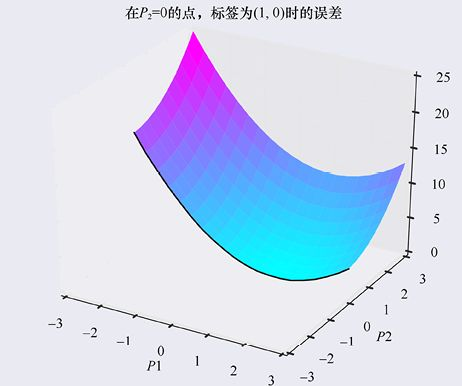

> **圖片描述：** 此圖展示固定P2=0時的二維碗形誤差橫截面。

圖18.15　從圖18.14左下角切下來的誤差曲面，標籤為(1,0)。展示出的表面橫截面顯示了當*P*2 = 0時*P*1的不同值的誤差值

讓我們看一下誤差表面的這一切片，如圖18.16所示。

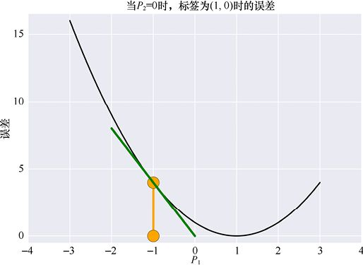

> **圖片描述：** 此圖為誤差函數的U形橫截面曲線，標示P1=-1處的導數。

圖18.16　查看圖18.15所示的誤差函數的橫截面，我們可以看到當*P*2固定為0時，誤差是如何取決於*P*1的不同值

在圖18.16中，我們用橙色點標記了值*P*1 = −1，並且在曲線直接位於*P*1值之上的位置繪製了導數。這告訴我們如果使*P*1更正（也就是說，我們從−1向右移動），網路中的誤差將減小。但是如果我們走得太遠並且將*P*1增加到超過1的值，那麼誤差將再次開始增加。導數只是梯度中僅適用於*P*1的一部分，並告訴我們，**在***P*2**和標籤取這些值的時候**，當*P*1的值發生變化時，誤差如何變化。從圖中可以看出，如果我們距離−1 太遠，則導數將不再與曲線匹配，但接近−1 則表現良好。

我們稍後會再次回到這個想法：曲線的導數告訴我們如果從給定位置**非常微小地移動***P*1，誤差會發生什麼。移動越小，導數在預測新誤差時就越準確。對於任何導數或任何梯度都是如此。

我們可以在圖18.16中看到這個特性。如果將*P*1從−1向右移動1個單位，導數（綠色）將帶給我們0誤差，儘管*P*1 = 0（黑色曲線的值）的誤差大概到了1。我們**可以**使用導數來預測*P*1中的大變化結果，但正如我們剛才看到的那樣，準確率將隨著移動而下降。為了讓數字清晰易讀，當導數將我們帶到的位置與實際誤差曲線告訴我們應該在哪裡之間的差異足夠接近時，我們有時會做出大的移動。

讓我們使用導數來預測由*P*1的變化引起的誤差變化。圖18.16中綠線的斜率是多少？左端約為(−2,8)，右端約為(0,0)。因此，當我們向右移動時，每一個單位的線下降約4個單位，斜率約為−4/1或−4。因此，如果*P*1改變0.5（也就是說，它從−1變為−0.5），我們預測誤差會減小0.5×(−4)=−2。

就是這樣！這是告訴我們*Cd* 值的關鍵觀察結果。

記住，*P*1只是*Co*的另一個名稱，即C的輸出。我們發現*Co*中的1的變化導致誤差中的−4變化。正如我們所討論的那樣，在*P*1發生如此大的變化之後，我們不應該對這種預測有太多的信心。但對於小變化，這個比例是正確的。例如，如果將*P*1增加0.01，那麼我們預測誤差會改變 (−4)×0.01=−0.04，而對於*P*1的這麼小的變化，預測的誤差變化應該是非常準確的。如果將*P*1增加0.02，那麼我們預測誤差將改變 (−4)×0.02=−0.08。如果將*P*1移到左邊，那麼它從−1變為−1.1，我們預測誤差變化 (−0.1)×(−4)=0.4，因此誤差會增加0.4。

我們發現，對於*Co*的任何變化量，我們可以通過將*Co*乘以−4來預測誤差的變化。

這正是我們一直在尋找的！*Cd* 的值為−4。請注意，這僅適用於此標籤，以及*Co*和*Do*（或*P*1和*P*2）的這些值。

我們剛剛找到了第一個delta值，這告訴我們如果C的輸出發生變化，誤差會有多大變化。它只是在*P*1（或*Co*）處測得的誤差函數的導數。

圖18.17展示了我們剛剛使用誤差圖描述的內容。

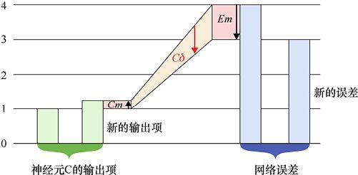

> **圖片描述：** 此圖說明C的輸出變化Cm(≈1/4)乘以Cd(-4)得誤差變化Em=-1。

圖18.17　誤差圖說明了神經元C輸出變化引起的誤差變化。原始輸出是最左邊的綠色條。我們想象由於輸入的變化，C的輸出增加了*Cm*。這通過將其乘以*Cd* 來放大，從而給出了誤差的變化*Em*，即*Em*=*Cm*×*Cd*。這裡*Cm*的值約為1/4（*Cm*框中向上的箭頭告訴我們變化為正），*Cd* 的值為−4（*Cd* 框中的箭頭告訴我們值為負），所以*Em*=(−4)×1/4=−1。最右邊的新的誤差是先前的誤差加上*Em*

記住，此時我們不會對此delta值執行任何操作。我們現在的目標只是找到神經元的delta。我們稍後會用它們。

假設*P*2已經具有正確的值，我們只需要調整*P*1。但是如果它們都與其相應的標籤值不同呢？

在這之後我們為*P*2重複這整個過程，得到*Dd* 的值，或神經元D的delta。讓我們這樣做。

在圖18.18中，當*P*1=−0.5且*P*2=1.5時，我們可以看到具有相應標籤或目標(1,0)的輸入誤差切片。

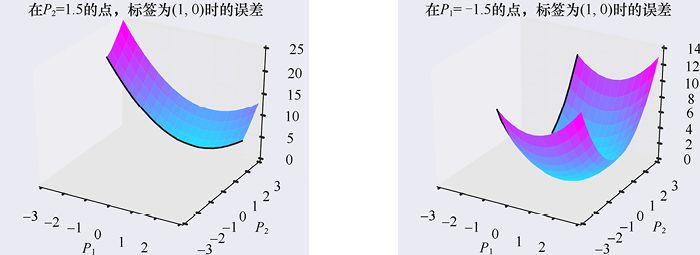

> **圖片描述：** 此圖展示P1和P2都不匹配標籤時的兩個誤差曲面切片。

(a) *P*2=1.5時由*P*1的不同值引起的誤差　　　　　　　　　　　　　　　　　　　(b) *P*1=−0.5時由*P*2的不同值引起的誤差

圖18.18　*P*1和*P*2都與標籤不同時將我們的誤差函數切片

橫截面曲線如圖18.19所示。請注意，*P*1的曲線與圖18.16相比有所變化。這是因為*P*2的變化意味著我們在*P*2=1.5而不是*P*2=0時取*P*1橫截面。

對於此圖中的特定值，看起來*P*1中約0.5的變化將導致誤差中約−1.5的變化，因此*Cd* 約為(−1.5)/0.5=−3。如果我們改變了*P*2而不是*P*1呢？看右邊的圖，變化約為−0.5（此時向左移動，朝向“碗”的最小值），這將導致誤差中約−1.25的變化，因此*Dd* 約為1.25/(−0.5)=−2.5。這裡的值為正告訴我們，向右移動*P*2會導致誤差增加，所以我們想把*P*2移到左邊。

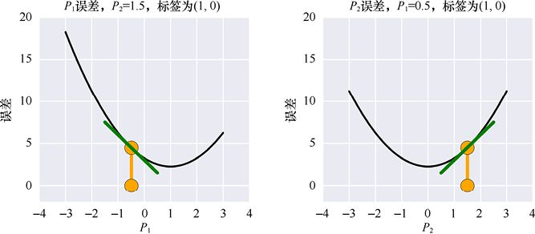

> **圖片描述：** 此圖展示兩條誤差曲線及導數，分別指示P1和P2的調整方向。

(a)　　　　　　　　　　　　　　　　　　　　　　　　　　　　　　　　　　　　　　　 (b)

圖18.19　當*P*1或*P*2都不匹配標籤時，我們可以嘗試通過單獨調整每個標籤來減小誤差。在此示例中，標籤為(1,0)。(a)當*P*2為1.5時，*P*1的不同值的誤差。最小值略大於2。導數告訴我們，通過使*P*1大於其當前值−0.5（即向右移動），我們可以達到較小的值。(b)*P*1=−0.5時，*P*2的不同值的誤差。*P*2的當前值為1.5。導數告訴我們，通過使*P*2更小（即向左移動），我們可以使誤差更小

這裡有一些有趣的現象需要觀察。首先，雖然兩條曲線都是碗形的，但“碗”的底部處於各自的標籤值。其次，由於*P*1和*P*2的當前值位於各自“碗”底部的相對側，因此它們的導數具有相反的符號（一個是正的，另一個是負的）。

最重要的觀察是最小可到達的誤差不是0，曲線永遠不會低於2。這是因為每條曲線只改變兩個值中的一個，而另一個被固定下來。所以即使*P*1達到理想值1，結果中仍然會有誤差，因為*P*2的理想值不是0，反之亦然。

這意味著如果只改變這兩個值中的一個，我們永遠不會達到0的最小誤差。為了將誤差減小到0，*P*1和*P*2都必須下降到它們各自的曲線底部。

出現的皺褶可以這樣理解：每當*P*1或*P*2發生變化時，我們會選擇不同的誤差表面橫截面。這意味著我們得到誤差的不同曲線。圖18.16中當*P*2=0時，與圖18.19中當*P*2=1.5時不同。由於誤差曲線已更改，因此delta也會發生變化。

因此，如果更改任一值，我們必須從頭開始重新啟動整個過程，然後才知道如何更改其他值。

好吧，這也不完全是。我們稍後會看到，只要採取非常小的步長，我們實際上可以同時更新兩個值。但是，在冒險再次將誤差變大之前，我們可以取巧。一旦採取了小步長，我們必須再次評估誤差表面，以便在再次調整*P*1和*P*2之前找到新的曲線，然後找到新的導數。

我們剛剛描述了計算輸出神經元的delta值的一般方法（我們一會兒看隱藏的神經元）。實際上，我們經常使用特定的誤差測量來使事情變得更容易，因為我們可以寫下導數的超簡單公式，這反過來又為我們提供了一種查找delta的簡單方法。此誤差測量稱為**二次代價函數**，或**均方誤差**（或MSE）[Neilsen15a]。像往常一樣，我們不會詳細解釋這個等式的數學意義。對我們來說最重要的是，這種對誤差函數的選擇意味著任何神經元值（即神經元的delta值）的導數特別容易計算。輸出神經元的delta是神經元值與相應標籤條目[Seung05]之間的差值。圖18.20展現了這個想法。

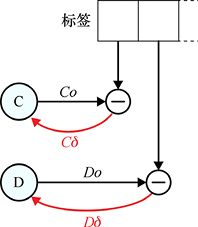

> **圖片描述：** 此圖展示使用二次代價函數時，輸出神經元delta等於標籤值減去輸出值。

圖18.20　在使用二次代價函數時，任何輸出神經元的delta只是標籤中的值減去該神經元的輸出。如曲線箭頭所示，我們用其神經元保存該delta值

這個小小的計算與前面的碗形圖非常吻合。請記住，*Co*和*P*1是相同值的兩個名稱，*Do*和*P*2也是如此。

當第一個標籤為1時，讓我們考慮*Co*（或*P*1）。如果*Co* = 1，則1−*Co* = 0，因此*Co*的微小變化對輸出誤差沒有影響。這是有道理的，因為碗的底部是平的。

假設*Co* = 2，那麼差值1−*Co* = −1，這告訴我們*Co*的變化會使誤差改變相同的量，但是具有相反的符號（例如，*Co*中0.2的變化將導致−0.2的變化誤差）。如果*Co*很大，比如*Co* = 5，那麼1−*Co* = −4，這告訴我們對*Co*的任何變化將在誤差變化中放大−4倍。這也是有道理的，因為我們現在正處於“碗”非常陡峭的部分，輸入（*Co*）的微小變化將導致輸出的大的變化（誤差的變化）。為方便起見，我們一直在使用大數字，但請記住，導數只告訴我們如果採取一小步會發生什麼。

神經元D及其輸出*Do*（或*P*2）的思維過程也是相同的。

我們現在已經完成了反向傳播的第一步：找到了輸出層中所有神經元的delta值。

我們已經看到輸出神經元的增量取決於標籤中的值和神經元的輸出。如果神經元的輸出發生變化，則delta也會發生變化。

因此，delta是一個臨時值，隨著每個新標籤和神經元的每個新輸出而變化。根據這一觀察結果，每當更新網路中的權重時，我們都需要計算新的delta。

記住，我們的目標是找到權重的delta。一旦知道層中所有神經元的增量delta，我們就可以更新進入該層的所有權重。

讓我們看看它是如何做的。

## 18.7　第2步：使用delta改變權重

我們已經瞭解瞭如何為輸出層中的每個神經元找到delta值。如果任何神經元的輸出變化了一些，我們將該變化乘以神經元的delta來找到輸出的變化。

我們知道神經元輸出的變化可能來自輸入的變化，而輸入的變化又可能來自先前神經元輸出的變化或連接先前輸出與該神經元的權重的變化。我們來看看這些輸入。

我們將關注輸出神經元C，以及它從前一層神經元A接收的值。讓我們使用臨時名稱*V*來指代從A到達C的值。它包含由A的輸出*Ao*，以及A和C之間的權重，即*AC*。因此*V*=*Ao*×*AC*。此設置如圖18.21所示。

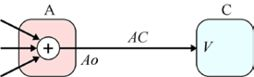

> **圖片描述：** 此圖展示進入神經元C的值V=Ao×AC。

圖18.21　進入神經元C的值，我們暫時稱之為*V*，是*Ao*（A的輸出）乘以權重*AC*，即*Ao*×*AC*

如果*V*由於任何原因發生變化，我們知道C的輸出也將被*V*改變（因為C只是將其輸入相加並傳遞該總和）。由於C的變化是*V*，網路的誤差將改變*V*×*Cd*，因為我們建立了*Cd* 來做到這一點。

*V*的值只有兩種方式可以在此設置中更改：A的輸出更改或權重值更改。

由於A的輸出是由神經元自動計算的，因此我們無法直接調整該值。但我們可以改變權重，所以讓我們來看看。

讓我們通過添加一些新值來修改權重*AC*。我們稱之為新值*ACm*，因此*AC*的新值為*AC* + *ACm*。然後到達C的值是*Ao*×(*AC* + *ACm*)。此設置如圖18.22所示。

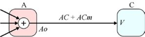

> **圖片描述：** 此圖展示修改權重AC後V的新值為Ao×(AC+ACm)。

圖18.22　如果改變權重*AC*，那麼這將改變*V*的值。這裡，進入神經元C的*V*值是*Ao*×(*AC* + *ACm*)

如果從新值*Ao*×(*AC* + *ACm*)中減去舊值*Ao*×*AC*，可以發現由於我們修改權重而進入C的值的變化是*Ao*×*ACm*。

由於此更改進入C，因此更改將乘以*Cd*，這告訴我們由於修改權重而導致網路誤差的變化。

稍等一下。這就是我們一直想要的，找出權重的變化對誤差的影響。我們是剛剛發現了它嗎？

是的，我們發現了。我們已經實作了目標！我們發現了權重的變化會如何影響網路的誤差。

讓我們再來看一遍。

如果通過向其添加*ACm*來改變權重*AC*，那麼我們知道網路誤差的變化(*Ao*×*ACm*)由C乘以C的增量（*Cd*）的變化給出。也就是說，誤差的變化是(*Ao*×*Acm*)×*Cd*。

假設我們將權重增加1，即*ACm* = 1，則誤差將改變*Ao*×*Cd*。

因此，每次給權重*AC*加1都會導致網路誤差改變*Ao*×*Cd*。如果將權重*AC*增加2，我們將得到這個誤差變化的兩倍，即2×(*Ao*×*Cd* )。如果將權重增加0.5，我們將得到前面數值的一半，即0.5×(*Ao*×*Cd* )。

我們可以反過來，如果想要將誤差增加1，就應該在權重上增加1/(*Ao*×*Cd* )。但我們想讓誤差變小。同樣的邏輯表明，如果從權重中減去值1/(*Ao*×*Cd* )，我們可以將誤差減小1。所以現在我們知道如何改變這個權重以減小整體誤差。

我們已經找到了如何處理權重*AC*以減小這個小型網路中的誤差。要從誤差中減去1，我們只需從*AC*中減去1/(*Ao*×*Cd* )。

如圖18.23所示，權重*AC*每改變1/(*Ao*×*Cd* )一次，都會導致網路中網路誤差的相應變化為1。減去該值會導致誤差中的變化為−1。

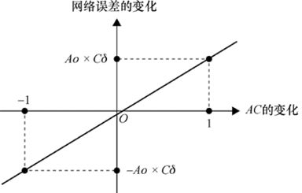

> **圖片描述：** 此圖展示權重AC每變化1/(Ao×Cd)時誤差變化1的比例關係。

圖18.23　對於權重*AC*值的每次變化，我們可以查找網路誤差的相應變化。當*AC*按1/(*Ao*×*Cd* )變化時，網路誤差的變化為1

我們可以使用圖的新約定直觀地總結這個過程。我們一直在繪製神經元的輸出，如圖 18.24中右邊的箭頭所示；讓我們使用從圓圈出來的左邊的箭頭來繪製增量，如圖18.24所示。

> **圖片描述：** 此圖展示神經元C的輸出（右箭頭）和delta（左箭頭）繪製慣例。

圖18.24　神經元C有一個輸出*Co*，用右箭頭繪製；還有一個delta值*Cd*，用左箭頭繪製

通過此約定，更新權重值的整個過程如圖18.25所示。在這樣的圖中顯示減法很難，因為如果我們有一個帶有兩個輸入箭頭的“減號”節點，則不清楚哪一個是被減量（也就是說，如果輸入是*x*和*y*，我們計算的是*x*−*y*還是*y*−*x*？）。我們計算*AC*−(*Ao*×*Cd* )的方法是找到*Ao*×*Cd*，乘以−1，然後將該結果添加到*AC*。

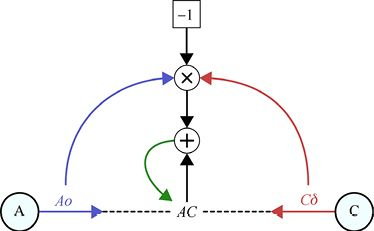

> **圖片描述：** 此圖展示更新權重AC的流程：Ao×Cd×(-1)加到AC上。

圖18.25　更新權重*AC*的值。我們從神經元A的輸出*Ao*和神經元C的delta值*Cd* 開始，並將它們相乘。我們想從*AC*的當前值中減去它。為了在圖中清楚地顯示，我們將*Ao*×*Cd*乘以−1，然後將其加到*AC*上。綠色箭頭是更新步驟，此結果將成為*AC*的新值

圖18.25是本章的目標，也是我們計算*Cd* 的原因。這就是我們的網路學習方式。

圖18.25告訴我們如何更改權重*AC*以減小誤差。為了將誤差減小1，我們應該將−1/(*Ao*×*Cd*)加到*AC*的值上。成功了！

如果我們改變輸出神經元C和D的權重，以將每個神經元的誤差減小1，那麼預測誤差會減小−2。我們可以預測這一點，因為共享同一層的神經元不依賴於彼此的輸出。由於C和D都在輸出層，C不依賴於*Do*而D不依賴於*Co*。它們確實依賴於前一層上神經元的輸出，但是現在我們只關注改變C和D權重的效果。

很高興我們知道如何調整網路中的最後兩個權重，但如何調整所有其他權重呢？要使用這種技術，我們需要弄清楚其餘層中所有神經元的delta。然後我們可以使用圖18.25來改善網路中的所有權重。

這讓我們看到了反向傳播的顯式技巧：我們可以在一層使用神經元的delta來找到其前一層的所有神經元的delta。正如我們剛剛看到的，知道神經元的delta和神經元的輸出就意味著知道如何更新進入神經元的所有權重。

讓我們看看如何做到這一點。

## 18.8　第3步：其他神經元的delta

現在知道了輸出神經元的delta值，我們將使用它們來計算輸出層之前的其他層上的神經元的delta。在我們的簡單模型中，只有神經元A和神經元C。我們只關注神經元A及其與神經元C的聯繫。

如果A的輸出*Ao*由於某種原因發生變化，會發生什麼？假設*Ao*增加了*Am*。圖18.26展示了由於*Ao*的這種變化到*Co*的變化最後到誤差變化的連續變化。

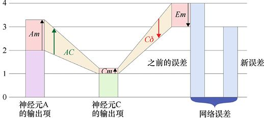

> **圖片描述：** 此圖展示A的輸出變化經權重AC和Cd的連鎖反應得到誤差變化。

圖18.26　讓我們看看改變神經元A的輸出的結果。從左到右閱讀圖。A的變化，標記為*Am*乘以權重*AC*，然後加到神經元C的輸出上。這將導致C的輸出增加*Cm*。我們知道，C中的這種變化可以通過乘以*Cd* 來找出網路誤差的變化。在該示例中，*Am*=5/4，並且*AC*=1/5，因此*Cm*=5/4×1/5=1/4。*Cd* 的值為−4，因此誤差的變化為1/4×(−4)=−1

我們知道神經元C將其輸入加權相加在一起，然後將總和傳遞出去（因為我們現在忽略了激活函數）。因此，如果C中除了來自A的值之外沒有其他任何變化，這就是*Co*（即C的輸出）的變化的唯一來源，我們將*Co*的變化表示為值*Cm*。如前所述，我們可以通過將*Cm*乘以*Cd* 來預測網路誤差的變化。

所以現在我們有一系列的操作，從神經元A到神經元C再到誤差。系列操作的第一步表明，如果將*Ao*的變化（即*Am*）乘以權重*AC*，我們將得到*Cm*，它是C的輸出變化。從上面可以知道如果將*Cm*乘以*Cd*，我們將得到誤差的變化。

因此，將這些融合在一起，我們發現由A的輸出變化*Am*引起的誤差是*Am*×*AC*×*Cd*。

換句話說，如果將A的變化（即*Am*）乘以*AC*×*Cd*，我們就會得到由神經元A的變化引起的誤差變化。也就是說，*Ad*=*AC*×*Cd*。

我們剛剛確定了A的delta！由於delta是將神經元的變化乘以得到誤差變化的值，我們發現該值是*AC*×*Cd*，然後找到了*Ad*，如圖18.27所示。

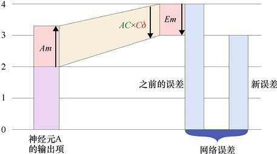

> **圖片描述：** 此圖簡化為一步：Am乘以AC×Cd即得誤差變化，AC×Cd就是Ad。

圖18.27 我們可以將圖18.26中的操作組合成一個更簡潔的圖。在該圖中，我們看到*Am*，即A的變化，乘以權重*AC*，然後乘以值*Cd*。因此，我們可以將其表示為一個步驟，其中將*Am*和兩個值*AC*和*Cd* 相乘。如前所述，*Am*=5/4，*AC*=1/5和*Cd* =−4，所以*AC*×*Cd* =−4/5，乘以*Am*=5/4就給出了−1.0的誤差變化

這太神奇了！神經元C消失了！如圖18.27所示，我們所需要的只是神經元C的delta值*Cd*，從中可以找到*Ad*，即A的delta值。現在我們知道了*Ad*，就可以更新進入神經元A的所有權重，然後……不，等一下！

我們還沒有得到真正的*Ad*，只得到了它的一部分。

在討論開始時，我們說過會關注於神經元A和神經元C，這很好。但是如果我們現在注意網路的其餘部分，就可以看到神經元D也使用A的輸出。如果*Ao*由*Am*而改變，那麼D的輸出也會改變，這也會對誤差產生影響。

為了找到神經元D因神經元A變化引起的誤差變化，我們可以重複上面的過程，只需用神經元D替換神經元C。所以如果*Ao*改變了*Am*，沒有其他變化，那麼由D變化引起的誤差由*AD*×*Dd* 給出。

圖18.28同時顯示了這兩條路徑。該數字的設置與上述數字略有不同。這裡，由於C的變化引起的對A誤差變化的影響由圖的中心和向右延伸的路徑表示。由於D的變化引起的對A的誤差變化的影響由圖的中心和向左延伸的路徑表示。

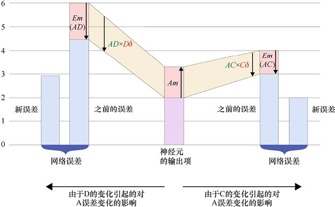

> **圖片描述：** 此圖展示A的輸出同時經C和D兩條路徑獨立影響誤差。

圖18.28　神經元C和神經元D都使用神經元A的輸出。在這個圖中，我們改變了從左到右的約定，以顯示由*Am*給出的相同的A變化，以兩條不同路徑的方式影響最終的誤差，一條向左，一條向右，每條從中間的神經元A開始。通過神經元C的路徑向右顯示，其中*Am*（A的輸出的變化）由*AC*×*Cd* 縮放以獲得誤差的一個變化，標記為*Em*(*AC*)。從中心向左延伸，*Am*由*AD*×*Dd* 縮放以獲得誤差的另一個變化，標記為*Em*(*AD*)。結果是對誤差進行了兩次單獨的更改

圖18.28展示了對誤差的兩次單獨更改。由於神經元C和D不會相互影響，因此它們對誤差的影響是獨立的。要查找誤差的總變化，我們只需將兩次更改相加。圖18.29展示了通過神經元C和D給誤差添加變化的結果。

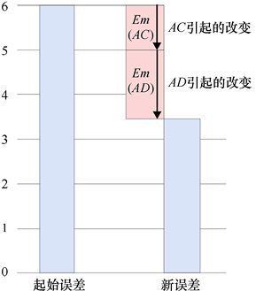

> **圖片描述：** 此圖展示C和D路徑的誤差變化相加得到總誤差變化。

圖18.29　當神經元C和神經元D都使用神經元A的輸出時，它們的變化在誤差中加在一起

既然已經處理了從神經元A到輸出的所有路徑，我們最終可以寫出*Ad* 的值。由於誤差加在一起（如圖18.29所示），我們可以加上縮放*Am*的因子。如果我們把它們寫在一起，就是*Ad* = (*AC*×*Cd* )+(*AD*×*Dd* )。

現在我們找到了神經元A的delta值，就可以對神經元B重複一遍上述過程，以找到其delta值。

我們實際上已經完成了比僅為神經元A和B找到delta值更有意義的事情。我們已經發現如何在任何網路中獲得每個神經元的delta值，無論它有多少層或者有多少個神經元！

這是因為我們所做的一切只不過都涉及一個神經元、下一層中使用其值作為輸入的所有神經元的delta，以及連接它們的權重。只需要這些，我們就可以找到神經元變化對網路誤差的影響，即使輸出層在數十層之後。

為了直觀地總結出這個結論，讓我們將繪製輸出和delta的約定擴展為可以使用右指向和左指向箭頭，並且包括權重，如圖18.30所示。我們會說連接上的權重乘以輸出向右移動，或者乘以delta向左移動，這取決於我們正在考慮的步驟。

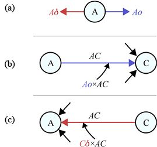

> **圖片描述：** 此圖展示繪製慣例：(a)輸出向右delta向左；(b)前饋傳播；(c)反向傳播。

圖18.30　繪製與神經元A相關的值。(a)慣例是將輸出*Ao*繪製為從神經元右側出來的箭頭，將delta值*Ad* 繪製為從左側出來的箭頭。(b)評估一個樣本時，A的輸出在被C使用的途中乘以*AC*。(c)在計算delta值時，C的delta乘以*AC*以供A使用

換句話說，有一個帶有一個權重的連接，連接神經元A和C。如果箭頭指向右邊，那麼當權重進入神經元C時，權重乘以*Ao*（A的輸出）指向神經元C。如果箭頭指向左邊，那麼權重乘以*Cd*（C的delta）指向神經元A。

評估一個樣本時，我們使用從左到右的繪圖方式，其中從神經元A到神經元C的輸出值通過權重*AC*的連接傳播。結果是值*Ao*×*AC*到達神經元C，在那裡它與其他輸入值加在一起，如圖18.30b所示。

當想要計算*Ad* 時，我們從右到左繪製資料流。然後delta離開神經元C流經權重*AC*的連接。計算得到的結果*Cd*×*AC*到達神經元A，並在這裡與其他輸入值加在一起，如圖18.30c所示。

現在我們可以總結一下對樣本輸入的處理和delta的計算過程，如圖18.31所示。

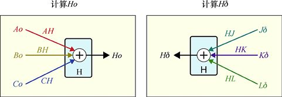

> **圖片描述：** 此圖展示計算Ho和Hd的對稱結構，正向和反向傳播結構完全相同。

(a)　　　　　　　　　　　　　　　　　　　　　　　　　(b)

圖18.31　計算神經元H的輸出和delta。(a)為了計算*Ho*，我們將每個前面神經元的輸出按其連接的權重進行縮放，並將結果加在一起；(b)為了計算*Hd*，我們通過連接的權重來縮放每個相鄰神經元的delta，並將結果加在一起

這真是奇妙的對稱。它還揭示了一個重要的實用結果：當神經元連接到相同數量的前後神經元時，計算神經元的delta需要與計算輸出相同的工作量（因此需要相同的時間）。因此，計算delta值與計算輸出值一樣有效。即使輸入和輸出計數不同，所涉及的工作量在兩個方向上仍然很接近。

請注意，圖18.31不需要神經元H的任何內容，除了它具有來自前一層的在具有權重的連接進行了傳播的輸入，以及來自後一層的同樣在具有權重的連接上進行了傳播的delta。因此，我們可以應用圖18.31a，並在上一層的輸出可用時立即計算神經元H的輸出；同時可以應用圖18.31b，並在下一層的delta可用時計算神經元H的delta。

這也告訴我們為什麼必須將輸出層的神經元視為特殊情況：沒有可供使用的“下一層”delta。

尋找網路中每個神經元的delta的過程就是反向傳播演算法。

## 18.9　實際應用中的反向傳播

在18.8節中，我們介紹了反向傳播演算法。這種演算法讓我們可以計算網路中每個神經元的增量。

因為該計算取決於以下神經元中的delta，並且輸出層的神經元沒有下一層神經元，所以我們不得不將輸出層的神經元視為一種特殊情況。

一旦找到任何層（包括輸出層）的所有神經元的delta，我們就可以向前一層後退（朝向輸入），找到該層上所有神經元的delta，然後再退一層，計算全部delta，再次後退，以此類推，直至我們達到輸入層。

讓我們來看看使用反向傳播查找稍微大一點的網路中所有神經元的delta的過程。

在圖18.32中，我們展示了一個有4層的新網路。這個網路中仍有2個輸入和2個輸出，但現在我們有3個隱藏層，分別有2個、4個和3個神經元。

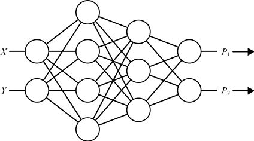

> **圖片描述：** 此圖展示較大分類器網路：2輸入、3隱藏層（2/4/3神經元）、2輸出。

圖18.32　有2個輸入、2個輸出和3個隱藏層的新分類器網路

我們通過評估樣本來開始。我們為輸入提供其*X*和*Y*座標的值，最終網路輸出預測*P*1和*P*2。

現在我們通過計算輸出神經元的誤差來開始反向傳播，如圖18.33所示。

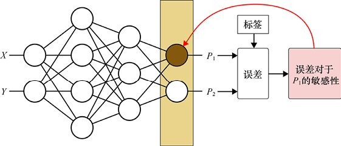

> **圖片描述：** 此圖展示計算輸出層第一個神經元delta的過程。

圖18.33　計算新網路中第一個輸出神經元的delta。使用一般的方法，我們獲取輸出層的輸出（此處稱為*P*1和*P*2）並將它們與標籤進行比較以得出誤差。由輸出、標籤和誤差值，我們發現*P*1的改變能夠引起誤差變化。該值是存儲在產生*P*1的神經元處的delta

我們已經使用輸出層中上側的神經元開始反向傳播，這給了我們標記為*P*1的預測（樣本在1類中的可能性）。根據*P*1和*P*2的值以及標籤，我們可以計算網路輸出的誤差。讓我們假設網路沒有完美預測這個樣本，所以誤差大於0。

使用誤差、標籤以及*P*1和*P*2的值，我們可以計算這個神經元的delta值。如果使用二次代價函數，這個delta就是標籤的值減去神經元的值，如圖18.20所示。但是如果使用其他函數，它可能會更復雜，所以我們已經講解了一般情況。

一旦計算了這個神經元的delta值，我們就把它與神經元存儲在一起。至此，我們就完成了這個神經元的計算過程。

我們將對輸出層中的所有其他神經元重複此過程（這裡我們還剩下一個）。這樣就完成了輸出層的計算，因為層中的每個神經元都有一個delta了。圖18.34總結了這兩個神經元獲得它們的delta的過程。

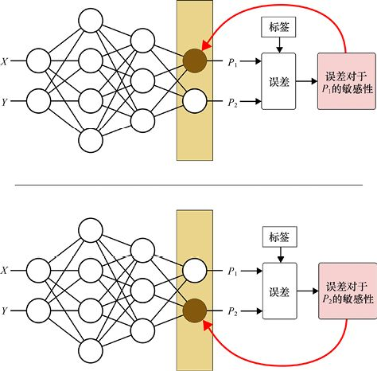

> **圖片描述：** 此圖展示為輸出層兩個神經元分別計算delta的步驟。

圖18.34　為輸出層的兩個神經元找到delta的步驟

此時我們可以開始調整進入輸出層的權重，但通常先找到所有神經元的delta，然後調整所有權重來解決問題。讓我們遵循這個經典的順序。

因此，我們將向後移動一步至第三個隱藏層（具有3個神經元的層）。讓我們考慮找到這3個神經元中最頂部的神經元的delta值，如圖18.35a所示。

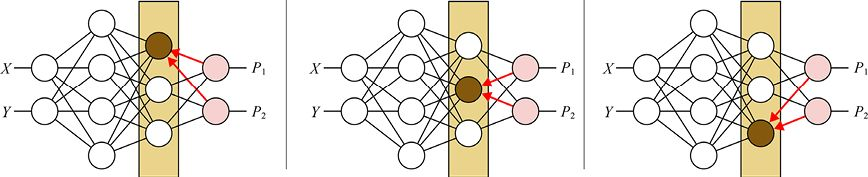

> **圖片描述：** 此圖展示反向傳播計算第三隱藏層三個神經元的delta。

(a)　　　　　　　　　　　　　　　　　　　　　　　　　　　　　(b)　　　　　　　　　　　　　　　　　　　　　　　　　　　　 (c)

圖18.35　用反向傳播來尋找第三個隱藏層到最後一層的神經元的delta。為了找到每個神經元的delta，我們找到使用該神經元輸出的神經元的delta，將這些增量乘以相應的權重，並將結果加在一起

為了找到這個神經元的delta，我們按照圖18.28所示的方法得到下一層各個神經元的貢獻值，然後按圖18.29所示的方法將它們加在一起，得到這個神經元的delta。

現在我們只是在該層中計算，對每個神經元應用相同的過程。當完成這個隱藏層中所有神經元的計算時，我們向後退一層並開始計算有4個神經元的隱藏層開始。

從這裡開始事情變得美妙起來。為了找到這一層中每個神經元的delta，我們只需要使用這個神經元輸出的每個神經元的權重，以及剛剛計算出的那些神經元的delta。

其他層是與當前的計算無關的。我們現在不再關心輸出層了。我們所需要的只是下一層神經元的增量，以及讓我們進入神經元的權重。

圖18.36展示了我們如何計算第二個隱藏層中4個神經元的delta。

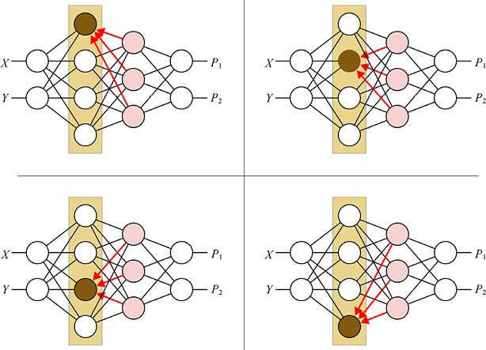

> **圖片描述：** 此圖展示反向傳播計算第二隱藏層四個神經元的delta。

圖18.36　用反向傳播計算第二個隱藏層的神經元的delta值

當4個神經元都有分配給它們的delta時，該層就完成計算了，我們會向後再退一層。

現在我們處於第一個帶有兩個神經元的隱藏層。每個都連接到下一層的4個神經元。再一次，我們現在關心的是下一層的delta和連接兩層的權重。對於每個神經元，我們找到使用該神經元輸出的所有神經元的delta，乘以權重，並將結果相加，如圖18.37所示。

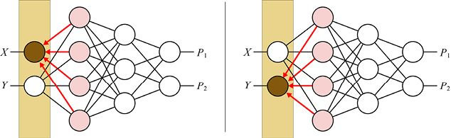

> **圖片描述：** 此圖展示反向傳播計算第一隱藏層兩個神經元的delta。

圖18.37　使用反向傳播計算第一個隱藏層的神經元的delta值

當圖18.37完成後，我們就找到了網路中每個神經元的delta。

現在我們將調整權重。我們將更改所有神經元之間的連接，並使用在圖18.25中看到的方法將每個權重更新為新的改進值。

圖18.34～圖18.37展示了演算法被稱為**反向傳播**的原因。我們從任一層獲取delta，一次向後**傳播**或移動一層，並在反向傳播結束的時候對其進行修改。

正如我們所見，計算每個delta值都很快。每次傳出連接只需一次乘法，然後將這些部分加在一起。這幾乎沒有花費時間。

當我們使用像GPU這樣的並行硬體時，反向傳播變得非常高效。因為前饋網路層上的神經元不會相互作用，並且已經計算了相乘的權重和delta，我們可以使用GPU一次性乘以**整個層**的**所有**delta和權重。

同時計算整個層的delta值可以節省我們很多時間。如果每個層都有100個神經元，並且有足夠的硬體，計算所有400個delta只需花費與計算4個delta相同的時間。

這種並行性帶來的巨大效率是反向傳播如此重要的一個關鍵原因。

現在我們擁有了所有delta，並且知道如何更新權重。一旦更新了權重，我們應該重新計算所有delta，因為它們是基於權重的。

我們就要完成了，但需要履行前面的承諾，將激活函數放回神經元。

## 18.10　使用激活函數

在反向傳播中包含激活函數只是很小的一個步驟。但要理解這一步以及為什麼這樣做是正確的，我們需要思考一下。我們在之前的討論中擱置了這個問題，是為了不分心，但現在我們重新加上激活函數。

我們首先考慮前饋階段的神經元。當我們評估樣本並且資料從左向右流動時，神經的元輸出會同時產生。

當計算神經元的輸出時，權重輸入的總和在離開神經元之前要經過激活函數，如圖18.38所示。

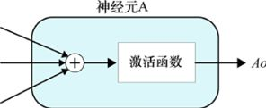

> **圖片描述：** 此圖展示神經元A及其sigmoid激活函數的結構。

圖18.38　神經元A及其激活函數

為了使事情更具體一點，讓我們選擇一個激活函數。我們選擇第17章中討論的sigmoid，因為它很平滑並且可以進行清晰的演示。我們不會使用sigmoid的任何特定性質，因此我們的討論將適用於任何激活函數。

圖18.39展示了sigmoid曲線。越來越大的正值越來越接近1卻沒有達到1，越來越大的負值逼近0，但也從未達到0。為了簡單起見，我們可以說大於7的輸入值可以被認為其輸出值為1，而小於−7的輸入值可以被認為其輸出值為0，而不是“非常接近1”或“非常接近0”。(−7,7)中的值將平滑地混合在S形函數中——sigmoid也因此而得名。

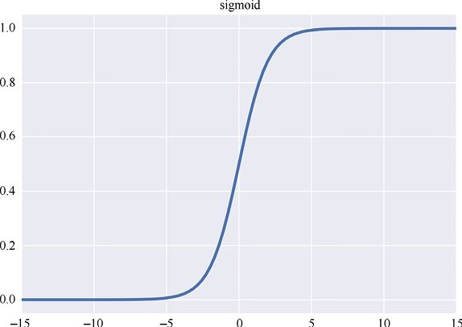

> **圖片描述：** 此圖展示sigmoid曲線在-15至15範圍的形狀。

圖18.39　在範圍−15～15中繪製的sigmoid曲線。大約大於7或小於−7的值分別非常接近1和0

讓我們看一下圖18.8中的原始微小的神經元網路中的神經元C。神經元C從神經元A獲得一個輸入，從神經元B獲得一個輸入。現在，讓我們看一下A的輸入，如圖18.40所示。在與C中的所有其他輸入相加之前，A的輸出值*Ao*乘以權重*AC*。由於只關注A和C這一對神經元，我們將忽略C的任何其他輸入。然後將輸入值*Ao*×*AC*用作激活函數的輸入以找到輸出值*Co*。

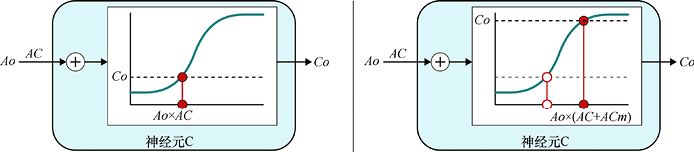

> **圖片描述：** 此圖展示激活函數在陡峭部分的效果：權重修改導致輸出較大變化。

(a)　　　　　　　　　　　　　　　　　　　　　　　　　　　　　　　　　　　　　　　 (b)

圖18.40　暫時忽略A的其他輸入，激活函數的輸入通過乘以A的輸出和權重*AC*給出。我們可以在那一點找到激活函數的值——它給出了輸出的值*Co*。(a)當A的輸出是*Ao*而權重是*AC*時，激活函數的輸入值是*Ao*×*AC*。(b)：當A的輸出為*Ao*且權重為*AC* + *ACm*時，激活函數的輸入值為*Ao*×(*AC* + *ACm*)。在這裡，我們將(a)中的值顯示為中心為白色的點，將新值顯示為實心點。請注意，輸出的變化很大，因為我們處於曲線的陡峭部分

為了減小誤差，我們將在權重*AC*的值中加上一些正的或負的*ACm*。圖18.40a展示了添加*ACm*為正值的結果。在這種情況下，輸出值*Co*會改變很多，因為我們處於曲線的陡峭部分。

也就是說，將*ACm*添加到權重中，會對輸出誤差產生比沒有激活函數時**更大**的影響，因為該函數已將*ACm*改變為更大的值。

假設*Ao*×*AC*的起始值使我們接近曲線的底部，並且我們將相同的*ACm*添加到*AC*，如圖18.41所示。

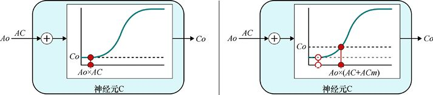

> **圖片描述：** 此圖展示激活函數在平坦部分的效果：相同修改導致微小變化。

(a)　　　　　　　　　　　　　　　　　　　　　　　　　　　　　　　　　　　　　　　　　　(b)

圖18.41　曲線的平坦部分。(a)在添加*ACm*之前，如圖18.40所示；(b)添加此值會使C的輸出產生微小變化

現在向權重添加相同的值*ACm*會使*Co*的變化比以前小。在這種情況下，它甚至比*ACm*本身還要小。輸出的較小變化意味著網路誤差的變化較小。換句話說，在這種情況下將*ACm*添加到權重將使輸出誤差的變化小於我們在沒有激活函數時所獲得的變化。

我們想要一些可以告訴我們對於激活函數曲線上的任意一點，曲線在該點處是多麼陡峭的東西。當我們處於曲線向右急劇增長的位置時，輸入的正向變化將被放大很多，如圖18.40所示。當我們處於曲線向右緩慢增長的位置時，如圖18.41所示。這種變化會被稍微放大。

如果我們使用負值*ACm*更改輸入，並將更新點移到左側，那麼斜率大小會告訴我們誤差的變化會減小多少。我們得到的情況與圖18.40b和圖18.41b相同，但起始位置和結束位置相反。

令人高興的是，我們已經知道如何找到曲線的斜率：那就是導數。圖18.42展示了S形曲線及其導數。

S形在左右兩端是平坦的。因此，如果我們處於平坦區域並且向左或向右移動一點，那麼函數輸出幾乎沒有變化。換句話說，曲線是平坦的，或者沒有斜率，或者導數為0。隨著輸入從大約−7移動到0，導數會增加，因為曲線越來越陡峭。然後導數再次減小到0，即使輸入繼續增加，因為曲線變得越來越平坦，接近1，但從未完全達到。

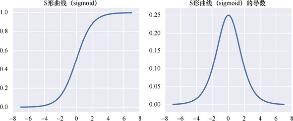

> **圖片描述：** 此圖展示sigmoid及其鐘形導數，導數在x=0最大，兩端趨近0。

圖18.42　S形曲線及其導數。注意，兩個圖的縱軸標度不同

如果我們進行數學計算，就會發現這個導數正是根據權重的變化來修正我們對錯誤變化的預測所需要的。當處於曲線的陡峭部分時，我們想要提高該神經元的delta值，因為其輸入的改變將導致激活函數發生較大的變化，所以對網路誤差有很大的改變。當處於曲線的平坦部位時，輸入的變化對輸出的變化幾乎沒有影響，因此我們希望使這個神經元的delta更小。

換句話說，考慮到激活函數，我們只取通常計算的delta，然後乘以激活函數，對正向傳播期間使用的值處的導數進行評估。現在，delta考慮了激活函數如何增大或減小神經元輸出的變化量，從而影響網路誤差。

為了很好地聯繫在一起，我們可以像以前一樣在計算delta後立即執行此步驟。

圖18.43總結了一個神經元的整個工作過程。在這裡，我們想象有一個神經元H。當我們評估樣本並計算這個神經元的輸出時，頂部是正向通道。遵循一個共同的約定，我們給了求和步驟的結果名稱*z*。從*x*軸上的點*z*垂直向上看時，我們得到激活函數的值。圖的底部是反向通道，我們在這裡計算這個神經元的delta。同樣，我們使用*z*來找到激活函數的導數，並且在傳播它之前將傳入的和相乘。

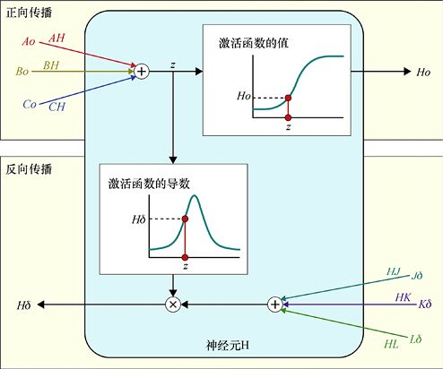

> **圖片描述：** 此圖總結正向（加權輸入→激活函數→輸出）和反向（加權delta→乘導數→Hd）傳播。

圖18.43　神經元H的網路評估和delta的反向傳播。上方：在正向傳播中，加權輸入被加在一起，給出一個我們稱之為*z*的值。*z*的激活函數的值是我們的輸出*Ho*。下方：在反向傳播中，加權增量被加在一起，我們使用之前的*z*來查找激活函數的導數。我們將加權delta的總和乘以該值，得到*Hd*

在這個圖中，神經元H有3個輸入，來自神經元A、B和C，輸出值為*Ao*、*Bo*和*Co*。在正向傳播期間，當我們查找神經元的輸出時，它們分別與權重*AH*、*BH*和*CH*相乘，然後加在一起。我們用字母*z*標記了這個總和。現在我們在激活函數中查找*z*，它的值是*Ho*，即這個神經元的輸出。

現在，當運行反向傳播以找到神經元的delta時，我們發現使用*Ho*作為輸入的神經元的delta。假設它們是神經元J、K和L，因此我們用它們的delta值*Jd*、*Kd* 和*Ld* 乘以其各自的權重*HJ*、*HK*和*HL*，並將這些結果加起來。

前面我們從正向傳播得到了*z*的值，並用它找到了激活函數的導數的值。現在，我們將剛剛找到的和與這個數相乘，結果是*Hd*，即這個神經元的delta。

這一切也都適用於輸出神經元，如果它們具有激活函數，在反向傳播中我們將使用誤差資訊而不是來自下一層的delta。

注意，一切都是那麼緊湊且只發生在相鄰的層之間。正向傳播僅取決於前一層的輸出值以及連接它們的權重。反向傳播僅取決於來自下一層的delta、連接它們的權重以及激活函數。

現在我們可以看到為什麼能夠在本章的大部分內容中忽略激活函數。我們可以假裝確實一直都有激活函數——**恆等激活函數**（identity activation function），如圖18.44所示。它的輸出與輸入相同。也就是說，它沒有什麼效果。

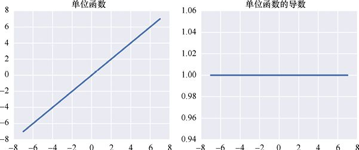

> **圖片描述：** 此圖展示恆等激活函數：(a)y=x直線；(b)導數恆為1。

(a)　　　　　　　　　　　　　　　　　　　　　　　　　　　　　　　　　　　　　　　　(b)

圖18.44　單位函數作為激活函數。(a)單位函數產生與輸入相同的輸出值；(b)它的導數在任何地方都是1，因為函數具有常數斜率1

如圖18.44所示，恆等激活函數的導數始終為1（這是因為函數是一條斜率為1的直線，任意點的導數只是該點曲線的斜率）。讓我們回想一下關於反向傳播的討論，並在每個神經元中包含這種單位激活函數。在正向傳播期間，該函數不會改變輸出，因此它不起作用。在反向傳播期間，我們總是將求和的delta乘以1，同樣也沒有效果。

之前說過，我們的結果不僅限於使用sigmoid。那是因為我們在討論中沒有使用sigmoid的任何特殊屬性，除了假設它在任何地方都有導數。這就是為什麼激活函數的設計使它們具有每個值的導數（回憶一下第5章，庫自動例程應用數學技術來處理任何沒有導數的點）。

讓我們來看看流行的激活函數ReLU。圖18.45展示了ReLU及其導數。

我們用sigmoid做的所有事情都可以應用於ReLU，而無須改變。任何其他激活函數也是如此。

這就將所有事情連接在了一起。我們現在將激活函數放回神經元中。

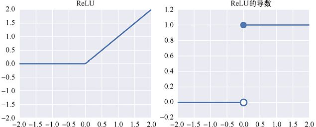

> **圖片描述：** 此圖展示ReLU及其導數：(a)分段線性；(b)階梯函數導數。

(a)　　　　　　　　　　　　　　　　　　　　　　　　　　　　　　　　　　　 (b)

圖18.45　ReLU用作激活函數。(a)當該值為0或更大時，ReLU返回其輸入，否則返回0；(b)其導數是階梯函數，0表示輸入小於0，1表示輸入大於0。庫會自動處理在0處的突然跳轉，以使我們在哪裡都有一個平滑的導數

至此，我們就完成了對基本的反向傳播演算法的分析。

然而，在我們結束討論之前，讓我們看一下控制網路學習情況的一個關鍵因素：學習率。

## 18.11　學習率

在我們更新權重的描述中，我們將左神經元的輸出值與右神經元的delta值相乘，並從權重中減去該值（參見圖18.25）。

但正如我們多次提到的那樣，在一個步驟中大幅度改變權重通常會產生麻煩。該導數僅在一個值微小變化時是準確的。如果我們過多地改變一個權重，可能正好跳過誤差的最小值，甚至發現我們自己增加了誤差。

如果我們將權重改變得太少，可能只會看到很微小的學習，一切都進行得很慢。然而，效率低下通常比不斷對誤差過度反應的系統更好。

在實踐中，我們使用稱為**學習率**的超參數來控制每次更新期間權重的變化量，通常用小寫的希臘字母*η*（eta）表示。這是一個介於0和1之間的數字，它告訴權重在更新時使用的新計算值的多少來進行更新。

當我們將學習率設置為0時，權重根本不會改變。這樣系統永遠不會改變，永遠不會學習。如果我們將學習率設置為1，系統將對權重進行大的更改，並且可能會超出目標值。如果這種情況發生很多次，網路可能會耗費大量時間超調，然後進行補償，權重跳來跳去並且永遠不會達到最佳值。所以我們通常將學習率設置在這兩個極端之間。

圖18.46展示瞭如何應用學習率。我們只需將−(*Ao*×*Cd* )的值乘以*η*，然後再將其重新放入*AC*。

學習率的最佳選擇取決於我們構建的特定網路以及正在接受訓練的資料。找到一個好的學習率對於網路正常學習至關重要。系統在學習後，更改此值可能會影響該過程是快速還是緩慢。通常我們必須使用反覆試驗來尋找*η* 的最佳值。令人高興的是，有些演算法可以自動搜索學習率的良好起始值，以及其他可以隨著學習的進展微調學習率的演算法。我們將在第19章中看到這樣的演算法。作為一般的經驗法則，如果其他選擇都沒有指導我們達到特定的學習率，我們通常會以0.01左右的值開始，然後訓練網路一段時間，觀察它的學習效果。然後我們從那個值開始升高或降低它，並一遍又一遍地訓練，尋找能夠最有效學習的學習率。

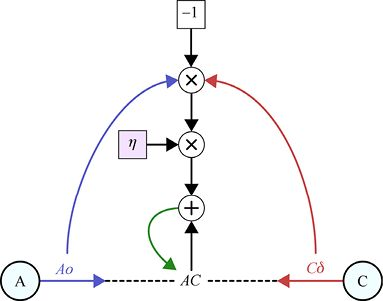

> **圖片描述：** 此圖展示加入學習率η的權重更新流程。

圖18.46　學習率通過控制權重在每次更新時的變化量來幫助我們控制網路學習的速度。我們看到，這裡比圖18.25多了一個步驟，即將值−(*Ao*×*Cd* )乘以學習率*d*，然後再將其加到*AC*。當*d* 是一個小的正數（如0.01）時，每次的變化都會很小，這通常有助於網路學習

### 探索學習率

讓我們看看反向傳播以不同的學習率學習的表現。我們將構建一個分類器來查找我們在第15章中使用的兩個半月之間的邊界。圖18.47展示了大約1500個點的訓練資料。我們對這些資料進行了預處理，使其均值為0，每個特徵的標準差為1。

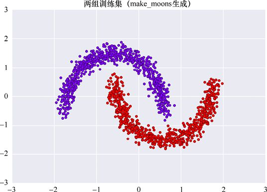

> **圖片描述：** 此圖展示約1500個二維半月形資料點。

圖18.47　scikit-learn中make_moons()例程生成的大約1500個點

因為只有兩個類別，所以我們將構建一個**二元分類器**。這讓我們不需要使用獨熱編碼，而是通過一個輸出神經元來處理多個（即兩個）輸出。如果該值接近0，則輸入在一個類中；如果該值接近1，則輸入在另一個類中。

我們的分類器將有兩個隱藏層，每個層有4個神經元。這些本質上是任意選擇，並提供一個足夠複雜的網路供我們討論。兩個層都將完全連接，因此第一個隱藏層中的每個神經元都會將其輸出發送到第二個隱藏層中的每個神經元，如圖18.48所示。

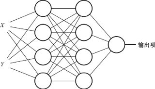

> **圖片描述：** 此圖展示二元分類器：2輸入→4(ReLU)→4(ReLU)→1(sigmoid)。

圖18.48　二元分類器以兩個值作為輸入（每個點的*X*和*Y*）。每個輸入進入第一層的4個神經元。這4個神經元中的每一個都連接到下一個隱藏層的4個神經元中的每一個。然後，單個神經元獲取第二個隱藏層的輸出，併為輸出提供單個值。在這個網路中，我們對隱藏層中的神經元使用了激活函數ReLU，並在輸出神經元上使用了激活函數sigmoid

上述神經網路中有多少個權重？2個輸入層中的每一個神經元都有4個輸出，然後隱藏層中共有4×4個，然後4個進入輸出神經元。這給了我們（2×4）+（4×4）+ 4 = 28個權重。9個神經元中的每一個也有一個偏置項，因此我們的網路有28 + 9 = 37個權重。它們被初始化為小的隨機數。我們的目標是使用反向傳播調整這37個權重，以便從最終神經元輸出的值始終與該樣本的標籤相匹配。

如上所述，我們將評估一個樣本，計算誤差，使用反向傳播計算增量，然後使用學習率更新權重。然後我們將繼續評估下一個樣本。請注意，如果誤差為0，則權重根本不會更改。每次我們在訓練集中處理完所有樣本時，表示已經完成了一輪訓練。

這裡對反向傳播的討論提到了對權重進行“小改動”的程度的重要性。採用小學習率有兩個原因。第一個是每個權重的變化方向由該權重處的誤差的導數（或梯度）給出。但是正如我們看到的那樣，梯度僅在我們評估的點附近準確。如果我們“走得太遠”，可能會發現誤差增加了而不是減小了。

採用小學習率的第二個原因是網路起點附近的權重變化將導致後來的神經元輸出發生變化，我們已經看到這些神經元輸出會被用來幫助計算後來的權重變化量。為了防止一切變成可怕的相互衝突，我們只改變了很小的權重。

但什麼是“小”？對於每個網路和資料集，我們都需要經驗才能找到答案。如上所述，步長的大小由**學習率**控制。這個值越大，每個權重將越接近其新值。

讓我們以一個非常大的學習率0.5開始，如圖18.49所示。

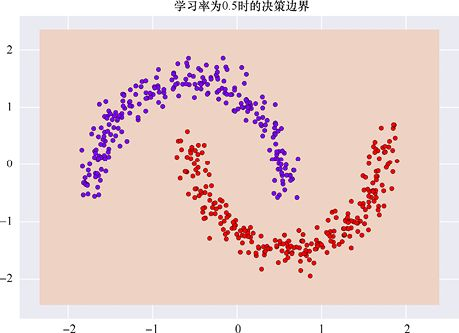

> **圖片描述：** 此圖展示學習率0.5時分類完全失敗，整個區域為同一類別。

圖18.49　網路使用0.5的學習率計算的決策邊界

這很糟糕。一切都被分配到一個類，由淺橙色背景表示。如果我們在每一輪訓練之後查看準確率和誤差（或損失），將得到圖18.50所示的關係。

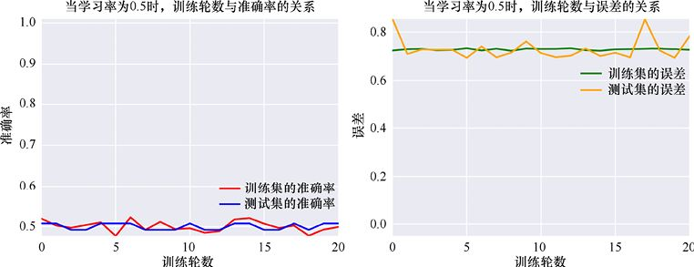

> **圖片描述：** 此圖展示學習率0.5時準確率約0.5，誤差不下降。

圖18.50　我們的半月資料的準確率和誤差，學習率為0.5

事情看起來很糟糕。正如我們所期望的那樣，準確率只有0.5左右，這意味著有一半的點被錯誤分類。這是有道理的，因為紅色點和藍色點大致均勻分開。如果我們將它們全部分配到一個類別，正如我們在這裡所做的那樣，那些分配中的一半將是錯誤的。誤差從高處開始並且不會下降。如果我們讓網路運行數百次，它將以這種方式繼續下去，永遠不會改進。

權重在做什麼？圖18.51展示了訓練期間所有37個權重的值。

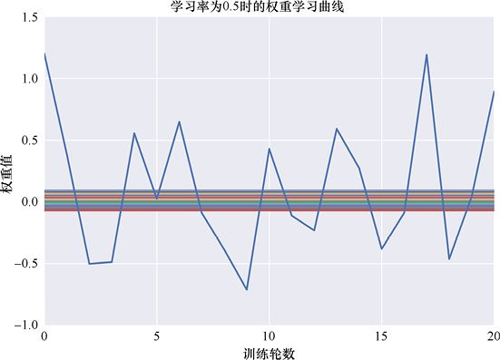

> **圖片描述：** 此圖展示學習率0.5時一個權重劇烈震盪，其餘幾乎不動。

圖18.51　學習率為0.5時的權重學習曲線。一個權重不斷變化並超過其目標值，而其他權重沒有任何明顯的變化

大多數權重似乎根本沒有移動，但它們可能有點蜿蜒。這個圖由一個突然佔據主導地位的權重主導。這個權重是進入輸出神經元的權重之一，試圖移動其輸出以匹配標籤。這個權重上升，然後下降，再上升，每次都跳得太遠，然後過度糾正太多，然後再過度糾正，如此往復。

這些結果令人失望，但它們並不令人震驚，因為0.5的學習率太高了。

讓我們將學習率降低10倍，使其成為一個更常見的值（0.05）。我們絕對不會改變網路和資料，甚至會重複使用相同的偽隨機數序列來初始化權重。新的邊界如圖18.52所示。

> **圖片描述：** 此圖展示學習率0.05時兩類資料被漂亮分開。

圖18.52　當學習率為0.05時的決策邊界

這要好得多！這很棒！如圖18.53所示，在進行大約16輪訓練之後，我們在訓練集和測試集上都達到了100%的準確率。

> **圖片描述：** 此圖展示學習率0.05時約16輪後達100%準確率。

圖18.53　學習率為0.05時，神經網路的準確率和誤差

權重在做什麼？圖18.54展示了它們的歷史。總的來說，這樣做更好，因為很多權重都在變化。一些權重變得非常大。在第20章中，我們將介紹正則化技術，以便在深層網路中保持較小的權重，以及本章的後續介紹中，我們將看到為什麼保持權重較小（如−1和1之間）會很好。現在權重各自都學到了很好的值。

> **圖片描述：** 此圖展示學習率0.05時37個權重的穩定學習曲線。

圖18.54　學習率為0.05時網路的權重學習曲線

所以，0.05是成功的。神經網路已經學會了對資料進行完美分類，並且它只在大約16輪訓練內完成，這很好而且快速。在沒有GPU支援的2014年底推出的iMac上，整個訓練過程花費不到10秒。

只是為了好玩，讓我們將學習率降低到0.01。現在權重將變化得更慢。這會產生更好的結果嗎？

圖18.55展示了這個微小學習率產生的決策邊界。邊界似乎比圖18.52中的邊界使用更多的直線，但兩個邊界都完美地區分了兩側的點。在某些情況下，我們可能更喜歡圖18.52中的邊界，因為它們似乎更好地遵循資料的形狀。

> **圖片描述：** 此圖展示學習率0.01時的決策邊界，使用更多直線段。

圖18.55　學習率為0.01時的決策邊界

圖18.56展示了學習率為0.01時網路的準確率和誤差。因為學習速度要慢得多，所以神經網路大約需要170輪訓練來達到100%的準確率，而不是圖18.54中的16輪。

> **圖片描述：** 此圖展示學習率0.01時約170輪後達100%，中間有平臺期。

圖18.56　學習率為0.01時網路的準確率和誤差

這些圖展示了有趣的學習行為。在初始迭代之後，訓練和測試的準確率都達到了大約90%，並在那裡達到穩定值。與此同時，誤差約為0.2（對於測試資料）和0.25（對於訓練集），並且它們也是平穩的。然後在第170輪左右，事情再次迅速變化，準確率攀升至100%，誤差降至0。

這種交替改進和陷入平坦的模式並不罕見，我們甚至可以在圖18.53中看到它的一些暗示，其中在第3輪和第8輪之間存在一個不明顯的平坦區域。這是因為權重處在誤差表面幾乎平坦的區域，導致梯度接近0，因此它們的更新量非常小。

雖然權重可能會陷入局部最小值，但是它們更常見於陷入鞍座的平坦區域，就像我們在第5章[Dauphin14]中看到的那樣。有時，其中一個權重可能需要很長時間才能移動到一個合適的區域，從而獲得一個足夠大的梯度（或導數）讓網路變得更好。當一個權重移動時，由於第一個權重的變化對網路其餘部分的連鎖反應，通常也可以看到其他權重也得到了有效的更新。

權重值隨著時間的推移幾乎遵循相同的模式，如圖18.57所示。有趣的是，至少有一些權重不是平坦的，或是在一個平臺上。它們一直在改變，但速度很慢。系統也正在變得越來越好，但是在微小步驟的學習下沒有出現大的變化，直到第170輪左右變化才積累得足夠大並在結果圖中顯現。

> **圖片描述：** 此圖展示學習率0.01時權重曲線，約第170輪出現明顯變化。

圖18.57　學習率為0.01時的權重學習曲線

即使在第200輪的時候，權重似乎也增長了一點。如果我們讓系統繼續運行，這些權重會隨著時間的推移繼續緩慢增長，對準確率或誤差沒有明顯影響。

那麼將學習率降低到0.01會有什麼好處嗎？並沒有。即使在0.05的學習率下，在訓練資料和測試資料上的分類結果也已經完美了。在這種情況下，較小的學習率意味著網路需要更長的學習時間。

這項調查向我們展示了網路對我們學習率的選擇有多敏感。

當我們尋找學習率的最佳值時，感覺我們像是最近版本的寓言《金髮姑娘》和《三隻熊》[Wikipedia 17]中金髮姑娘的角色。我們正在尋找的不是太大，也不是太小，而是“恰到好處”的東西。

如果學習率太高，權重採取的步長太大，網路無法穩定下來或改善性能。如果學習率太低，進展會非常緩慢，因為權重有時會以一種非常緩慢的速度從一個值上升到另一個值。

如果學習率恰到好處，網路訓練就會快速有效，並產生很好的結果。在這種情況下，一切是完美的。

這種學習率的試驗是開發幾乎所有深度學習網路的一部分。需要調整反向傳播更改權重的速度以匹配網路類型和資料類型。令人高興的是，我們將在第19章中看到，有些自動工具能夠以複雜的方式為我們找到合適的學習率。

## 18.12　討論

回顧一下我們在本章學過的內容，然後再考慮反向傳播演算法的一些實作。

### 18.12.1　在一個地方的反向傳播

為了快速回顧，我們首先通過網路訓練一個樣本並計算每個神經元的輸出，如圖18.58a所示。

> **圖片描述：** 此圖為反向傳播四步驟彙總：正向傳播→計算delta→反向傳播→更新權重。

圖18.58　反向傳播演算法以及權重更新的概括圖。該圖將圖18.20、圖18.43和圖18.46彙總在一起。(a)展示了正向傳播步驟；(b)展示了計算輸出神經元的delta的過程；(c)向前一層反向傳播delta；(d)更新權重

然後我們開始圖18.58b中的反向傳播演算法。我們找到每個輸出神經元的delta值，這個值告訴我們如果神經元的輸出變化一定量，則誤差改變的大小為輸出變化乘以神經元的delta。

現在我們在圖18.58c中向後退一步到網路的前一層，找到該層中所有神經元的delta。我們只需要輸出層的delta和兩層之間的權重。

一旦分配了所有delta，我們就會更新權重。使用delta和神經元輸出，我們可以計算每個權重的調整量。我們通過學習率來調整該調整量，然後將其添加到權重的當前值，以獲得權重的新的更新值，如圖18.58d所示。

### 18.12.2　反向傳播不做什麼

在一些關於反向傳播的討論中有一個簡寫表達可能會很令人困惑。作者有時會說“反向傳播將誤差從輸出層向後移動到輸入層”，或者“反向傳播使用每層的誤差來查找前一層的誤差”。

這可能會產生誤導，因為反向傳播根本不會“移動誤差”。實際上，我們唯一一次使用“誤差”就是在反向傳播過程的最開始，也就是當我們尋找輸出神經元的delta值時。

真正傳遞的是誤差的**變化**，這個變化由delta值表示。這些delta值充當神經元輸出變化的放大器，並告訴我們如果輸出值或權重變化給定量，如何預測誤差的相應變化。

所以反向傳播並沒有向後“移動誤差”。但有些東西正在反向傳播。讓我們看看到底是什麼。

### 18.12.3　反向傳播做什麼

反向傳播過程的第一步是找到輸出神經元的delta。這些是從誤差的**梯度**中找到的。我們對梯度進行切片以查看每個預測的二維曲線，然後採用該曲線的導數，但這只是為了便於可視化和討論。導數只是真正重要的內容，是梯度的一部分。

當我們討論反向傳播時，delta代表梯度。每個delta值代表不同的梯度。例如，附加到神經元C的delta描述了誤差相對於C輸出變化的梯度，神經元A的delta描述了誤差相對於A輸出變化的梯度。

所以改變權重時，我們會改變它們以便遵循誤差的梯度。這是**梯度下降**的一個例子，它模仿了水在不平坦地面上上下坡時所經過的路徑。

我們可以說反向傳播是一種演算法，它允許我們使用梯度下降有效地更新權重，因為它所計算的delta描述了該梯度。

因此，總結反向傳播的一個好方法是說它會向後傳播誤差的梯度，從而修改每個神經元對輸出誤差的貢獻。

### 18.12.4　保持神經元活躍

將激活函數放回到反向傳播演算法時，我們將注意力集中在輸入接近0的區域。

這並非偶然。讓我們回到sigmoid，看看當激活函數的值（即加權輸入的總和）變成一個非常大的數字，比如10或更多時會發生什麼。圖18.59展示了−20和20之間的sigmoid，以及它在相同範圍內的導數。

> **圖片描述：** 此圖展示sigmoid(-20至20)及其導數，兩端導數接近0。

(a)　　　　　　　　　　　　　　　　　　　　　　　　　　　　　　　　　　　(b)

圖18.59　對於非常大的正值或負值，sigmoid變得很平坦。(a)範圍為−20～20的sigmoid；(b)sigmoid在相同範圍內的導數。注意，兩個圖的縱軸比例是不同的

sigmoid在任何一端都不會完全達到1或0，但它會非常接近。類似地，導數的值永遠不會達到0，但正如我們從圖中可以看到的那樣，它非常接近。

圖18.60展示了具有激活函數sigmoid的神經元。進入函數的值（我們標記為*z*）為10，位於曲線的平坦區域之一。

> **圖片描述：** 此圖展示大值（10）在sigmoid平坦區輸出為1。

圖18.60　將一個較大的值（比如10）應用於sigmoid時，我們發現該值處於曲線的一個平坦區域並返回值1

從圖18.59可以看到，輸出基本上是1。

現在假設我們改變了一個權重，如圖18.61所示。值*z*增加了，因此我們在激活函數曲線上向右移動，找到輸出。假設*z*的新值是15，則輸出基本上仍然是1。

> **圖片描述：** 此圖展示權重大幅增加後sigmoid輸出不變，仍為1。

圖18.61　進入該神經元的權重*AD*大幅增加對其輸出沒有影響，因為它只是沿著曲線的平坦區域將*z*向右移動。在我們將*ADm*添加到權重*AD*之前，神經元的輸出為1，之後仍為1

如果再次增加輸入權重的值，即使是很多，我們仍然會得到1的輸出。換句話說，改變輸入權重對輸出沒有影響，並且因為輸出沒有改變，所以誤差不會改變。

我們可以從圖18.59中的導數預測出這一點。當輸入為15時，導數為0（實際上約為0.0000003，但上面的約定表明我們可以將其稱為0）。因此，更改輸入將不會導致輸出發生變化。

對於任何類型的學習來說，這都是一種糟糕的情況，因為我們已經失去了通過調整這個權重來改善網路的能力。實際上，任何進入該神經元的權重都變得沒有意義（如果我們保持的變化很小），因為輸入的權重和的任何變化，無論它們使得總和更小或更大，仍然使*z*值處於函數的平坦部分，所以輸出沒有變化，誤差也沒有變化。

如果輸入值非常負，例如小於−10，會發生同樣的問題。S形曲線（sigmoid）在該區域也是平坦的，並且導數也基本上為0。

在這兩種情況下，我們就說這個神經元已經**飽和**。就像海綿不能再容納水一樣，這個神經元也不能再容納更多的輸入。當輸出為1時，除非權重、輸入值或兩者都向0移動，否則輸出將保持為1。

結果是這個神經元不再參與學習，這對系統是一個打擊。如果這種情況發生在足夠多的神經元上，那麼系統可能會癱瘓，學習的速度會變得很慢，或者甚至根本不會學習。

防止此問題的一種流行方法是使用**正則化**。回憶一下第9章，正則化的目標是保持權重的大小很小或接近0。此外，正則化還有保持每個神經元的加權輸入之和也很小且接近於0的好處，這使得加權權重和總處於激活函數sigmoid的陡峭部分。這正是可以有效學習的地方。在第23章和第24章中，我們將看到深度學習網路中的正則化技術。

任何激活函數都會在其輸出曲線變平的一段時間內（或永遠）發生飽和。

其他激活函數可能也有其自身的問題。思考流行的ReLU曲線，圖18.62展示了範圍在−20～20的ReLU曲線。

> **圖片描述：** 此圖展示ReLU(-20至20)及其導數，負值導數為0導致神經元死亡。

(a)　　　　　　　　　　　　　　　　　　　　　　　　　　　　　　　　　(b)

圖18.62　範圍在−20～20的ReLU曲線。正值不會使函數飽和，但負值會導致函數死亡

只要輸入為正，此函數就不會飽和，因為輸出與輸入相同。正輸入的導數為1，因此加權輸入的總和將直接傳遞給輸出而不會發生變化。

但是當輸入為負時，函數的輸出為0，導數也為0。不僅改變對輸出沒有影響，而且輸出本身也不再對誤差做出任何貢獻。神經元的輸出會是0，除非權重、輸入或兩者都改變了很多，否則它將保持為0。

為了描述這種戲劇效果，我們說這個神經元已經**死亡**（dead），或者現在已經失效。

根據初始權重和第一個輸入樣本，一個或多個神經元可能在我們第一次執行更新步驟時死亡。然後隨著訓練的進行，更多的神經元會失效。

如果很多神經元在訓練過程中失效，那麼我們的網路會突然只在它擁有的神經元的一小部分起作用的狀態下工作。這削弱了我們的網路。有時甚至40%的神經元在訓練期間都會死亡[Karpathy16]。

當構建神經網路時，我們會根據經驗和期望為每一層選擇激活函數。在許多情況下，sigmoid或ReLU感覺像是激活函數的正確選擇，並且在許多情況下它們工作得很好。但是當網路緩慢學習或者無法學習時，查看神經元並檢查是否有一些或多個已經飽和，正在失效或已經失效是值得的。如果是這樣，我們可以嘗試不同的初始化權重和學習率，看看是否可以避免這個問題。如果這不起作用，我們可能需要重新構建網路，選擇其他激活函數，或兩者都做。

### 18.12.5　小批量

在上面的討論中，每個樣本的訓練都遵循3個步驟：在網路中運行樣本，計算所有delta，然後調整所有權重。

事實證明，我們可以節省一些時間，有時甚至可以通過不那麼頻繁地調整權重來改善學習。

回顧第8章的內容，完整的樣本訓練集有時被稱為**一批**（batch）樣本。我們可以將這批樣本分解成更小的**小批量樣本**。通常小批量的大小的選擇需要匹配我們可用的並行硬體。例如，如果硬體（如GPU）可以同時評估16個樣本，那麼小批量的大小將是16。常見的小批量的大小分別為16、32和64，儘管它們可以更大。

我們的想法是，通過網路並行運行一小批樣本，然後並行計算所有增量。我們求得所有增量的平均值，並使用這些平均值對權重進行一次更新。因此，我們不是在每個樣本之後更新權重，而是在小批量的16個（或32個、64個等）樣本之後更新它們。

這使學習的速度大大提高。它還可以改善學習，因為通過對整個小批量的平均可以平滑權重的變化。這意味著如果集合中有一個奇怪的樣本，它也無法將所有權重拉向不理想的方向。通過將這個奇怪的樣本的增量與其他15個、31個或63個小批量樣本的增量取均值，減小其影響。

### 18.12.6　並行更新

由於每個權重僅取決於其兩端神經元的值，因此每個權重的更新步驟完全獨立於其他權重的更新步驟。

能對獨立的資料片段執行相同的步驟，這通常是我們可以使用並行處理的提示。

事實上，如果並行硬體可用，大多數時候將同時更新網路中的所有權重。正如我們剛才所討論的，這次更新通常會發生在每批小樣本之後。

這節省了大量時間，但需要付出代價。正如我們所討論的那樣，改變網路中的任何權重都會改變該權重下游的每個神經元的輸出值。因此，網路中任一輸入附近的權重變化會對後面的神經元產生巨大的連鎖反應，這導致它們的輸出發生很大改變。

由於delta所代表的梯度取決於網路中的值，因此更改輸入附近的權重意味著我們應該重新計算使用該權重修改值的所有神經元的所有delta。這可能意味著要修改幾乎網路中的每個神經元。

這會破壞我們執行並行更新的能力。它也會讓反向傳播極其緩慢，因為我們將花費時間重新評估梯度和計算delta。

正如我們所看到的，防止混亂的方法是使用“足夠小”的學習率。如果學習率太高，事情會變得混亂，不能解決。如果它太小，我們會因為採取太小的步驟而浪費過多時間。選取“恰到好處”的學習率可以保持反向傳播的效率，以及我們執行並行計算的能力。

### 18.12.7　為什麼反向傳播很有吸引力

反向傳播的很大一部分吸引力在於它非常有效。這是人們能想到的最快的方法，可以找出最有效地更新神經網路中的權重的方法。

正如我們之前看到，並在圖18.43中進行了總結的那樣，在現代庫中運行一步反向傳播通常所需要的時間與評估樣本一樣。即考慮從輸入新值開始，資料流經整個網路並最終流向輸出層所需的時間。運行一步反向傳播與計算所有得到的增量需要大約相同的時間。

值得注意的事實是，反向傳播已經成為機器學習的核心內容，儘管我們通常不得不處理諸如學習率高、飽和神經元和死亡神經元等問題。

### 18.12.8　反向傳播並不是有保證的

值得注意的是，這個方案無法保證能夠學到任何東西！它不像第10章的單一感知機，在那裡我們有鐵定的證明，經過足夠的步驟後，感知機將找到它正在尋找的分界線。

當我們擁有數千個神經元，並且可能有數百萬個權重時，這個問題太複雜了，無法提供嚴格的證據證明事情總會按照我們的意願行事。

事實上，當我們第一次嘗試訓練新網路時，事情往往會出錯。網路可能會學習得很慢，甚至根本不學習。它可能改善了一些，然後突然反彈回來，似乎忘記了學到的一切。各種各樣的事情都可能發生，這就是為什麼許多現代庫提供可視化工具來觀察網路學習時的表現。

當出現問題時，許多人嘗試的第一件事就是將學習率變化到一個非常小的值。如果一切都穩定下來，這是一個好兆頭。如果系統現在看起來正在學習，即使它幾乎不可察覺，這也是另一個好兆頭。然後我們可以慢慢提高學習率，直到它在不會製造混亂的情況下儘可能快地學習。

如果這還不起作用，那麼網路設計可能存在問題。

這是一個需要處理的複雜問題。設計一個成功的網路意味著做出很多好的選擇。例如，我們需要選擇層數，每層神經元的數量，神經元應該如何連接，使用什麼激活函數，使用什麼學習率，等等。讓一切都正確是具有挑戰性的。我們通常需要結合經驗，根據對資料的瞭解和試驗來設計一個不僅可以學習，而且可以有效學習的神經網路。

在接下來的章節中，我們將看到一些已被證明是各種任務的良好開端的網路架構。但是，網路和資料的每個新組合都是一個新問題，需要你的思考和耐心。

### 18.12.9　一點歷史

1986年，當反向傳播首次在神經網路的文獻中被描述時，它完全改變了人們對神經網路的看法[Rumelhart86]。激增的研究和隨之帶來的實際利益都是通過這種令人驚訝的高效技術來計算梯度的。

但這並不是第一次發現或使用反向傳播。這種演算法被稱為30種“偉大的數值演算法”之一[Trefethen15]，至少從20世紀60年代開始，不同領域的不同人就已經發現或重新發現了這種演算法。有許多學科使用了連接的數學運算網路，那麼在每一步找到這些運算的導數和梯度是一個普遍而重要的問題。解決這個問題的聰明人一次又一次地重新發現了反向傳播，通常每次都給它一個新的名字。

一些在線和紙質版文獻優秀地概括了這些歷史 [Griewank12] [Schmidhuber15] [Kurenkov15] [Werbos96]。我們將在這裡總結一些常見的版本。但歷史只能涵蓋已發表的文獻。目前還不知道有多少人發現或重新發現了反向傳播，卻沒有發表它。

也許最早使用我們今天所知的形式的反向傳播是在1970年發表的，當時它用於分析數值計算的準確性[Linnainmaa70]，儘管這對神經網路沒有什麼參考。尋找導數的過程有時被稱為**微分**，因此該技術被稱為**反向模式自動微分**（reverse-mode automatic differentiation）。

它在大約同一時間由另一位從事化學工程的研究員[Griewank12]獨立發現。

也許它在神經網路中的第一次詳細研究是在1974年[Werbos74]進行的，但由於這些想法已經過時，這項工作直到1982年才完成[Schmidhuber15]。

多年來，反向模式自動微分在很多科學領域都得到了應用。但是當經典的1986年的論文重新發現這一想法並證明其對神經網路的價值時，這個被命名為**反向傳播的**想法立即成為該領域的主要內容[Rumelhart86]。

反向傳播是深度學習的核心，它構成了我們將在本書其餘部分詳細思考的技術基礎。

### 18.12.10　深入研究數學

在本節中，我們將給出一些處理反向傳播中數學內容的建議。如果你對此不感興趣，可以毫無顧忌地跳過本節。

反向傳播就是對數字的操作，因此它被描述為“數值演算法”。這使得它在數學內容中的呈現變得很自然。

即使方程式被簡化了，它們也可能顯得令人生畏[Neilsen15b]。這裡有一些提示，可以幫助讀者理解這些符號，進而理解問題的核心。

首先，掌握每個作者定義的符號含義是至關重要的。在反向傳播中有很多對象：誤差、權重、激活函數、梯度等。它們都有一個名字——通常只有一個字母。好的第一步是快速瀏覽整個討論，並注意給什麼對象起了什麼名稱。將這些記下來通常會很有幫助，這樣你以後就不必再去搜索它們的含義。

下一步是弄清楚如何使用這些符號來引用不同的對象。例如，權重可能被寫成像

> **圖片描述：** 此圖展示反向傳播文獻中權重的下標表示法。這樣的東西——指的是將層*l*上的神經元數*k*與層*l* + 1上的神經元*j*相關聯的權重。這對於一個符號來說太多了，當一個等式中有幾個這樣的符號時，我們很難弄清楚發生了什麼。

消除複雜的一種方法是為所有下標選擇值，然後簡化方程式，這樣每個高度索引的術語僅指一個特定的對象（例如單個權重）。如果你想從視覺的角度思考，請考慮繪製僅顯示所涉及的對象以及如何使用它們的值的圖。

反向傳播演算法的核心可以被認為並寫成微積分中**鏈式法則**的應用[Karpathy15]。這是描述不同變化彼此之間關係的一種簡潔方式，但前提是我們瞭解多維微積分的知識。幸運的是，有大量旨在幫助人們快速掌握這個主題的在線教程和資源 [MathCentre09] [Khan13]。

我們已經看到，在實踐中，輸出、增量和權重更新的計算可以並行執行。它們也可以使用矢量和矩陣的線性代數語言以並行形式**寫出**。例如，通常使用矩陣表示兩層之間的權重正向傳播的核心（不包含每個神經元的激活函數），然後我們使用該矩陣乘以前一層中神經元輸出的矢量。以同樣的方式，我們可以寫出反向傳播的核心，就是該權重矩陣的轉置乘以下一層delta的矢量。

這是一種自然的形式，因為這些計算包含大量的乘法和加法，這正是矩陣乘法的作用。這種結構非常適合GPU，所以在編寫程式碼時這是一個很好的開端。

但是這種線性代數的形式可能掩蓋了相對簡單的步驟，因為現在不僅要處理底層的計算，還要處理矩陣格式的並行結構以及通常伴隨它的指數的激增。我們可以說壓縮這種形式的方程是一種最佳化，而我們的目標是簡化方程和它們描述的演算法。在學習反向傳播時，那些對線性代數不太熟悉的人可能認為這是一種過早最佳化的形式，因為（直到它被掌握）它會掩蓋而不是闡明潛在的機制[Hyde09]。可以說，只有完全理解反向傳播演算法，才能將其寫成更緊湊的矩陣形式。因此，找到一個不以矩陣代數方法開始的表示，或者嘗試將這些方程分成單獨的運算，而不是矩陣和矢量的並行乘法，可能會有所幫助。

另一個潛在的障礙是激活函數（及其導數）傾向於以不同的特殊方式呈現。

總而言之，許多人開始討論基本方程的鏈式法則或矩陣形式，以使方程看起來簡潔和緊湊，然後解釋了為什麼這些方程是有用和正確的。這樣的符號和方程式看起來令人生畏，但如果將它們分解為基礎元素，我們就能真正體會本章所講述的這些步驟。一旦把這些方程式拆開並將它們重新組合在一起，我們就可以將它們視為這個優雅演算法的摘要。

## 參考資料

[Dauphin14]　Yann Dauphin, Razvan Pascanu, Caglar Gulcehre, Kyunghyun Cho, Surya Ganguli, Yoshua Bengio, *Identifying and attacking the saddle point problem in highdimen sional non-convex optimization*, 2014.

[Fullér10]　Robert Fullér, *The Delta Learning Rule Tutorial*”, Institute for Advanced Manag*-* ement Systems Research, Department of Information Technologies, Åbo Adademi University, 2010.

[Griewank12]　Andreas Griewank,*Who Invented the Reverse Mode of Differentiation?*, Documenta Mathematica, Extra Volume ISMP 389–400, 2012.

[Hyde09]　Randall Hyde, *The Fallacy of Premature Optimization*, ACM Ubiquity, 2009.

[Karpathy15]　Andrej Karpathy, *Convolutional Neural Networks for Visual Recognition*, Stanford CS231n course notes, 2015.

[Karpathy16]　Andrej Karpathy, *Yes, You Should Understand Backprop*, Medium, 2016.

[Khan13]　Khan Academy, *Chain rule introduction*, 2013.

[Kurenkov15]　Andrey, Kurenkov, *A‘Brief’ History of Neural Nets and Deep Learning*, *Part 1*, 2015.

[Linnainmaa70]　S Linnainmaa S, *The Representation of the Cumulative Rounding Error of an Algorithm as a Taylor Expansion of the Local Rounding Errors*, Master’s thesis, University of Helsinki, 1970.

[MathCentre09]　Math Centre, *The Chain Rule*, Math Centre report mc-TY-chain-2009-1, 2009.

[NASA12]　NASA, *Astronomers Predict Titanic Collision： Milky Way vs. Andromeda*, NASA Science Blog, Production editor Dr. Tony Phillips, 2012.

[Neilsen15a]　Michael A Nielsen, *Using Neural Networks to Recognize Handwritten Digits*, Determination Press, 2015.

[Neilsen15b]　Michael A Nielsen, *Neural Networks and Deep Learning*, Determination Press, 2015.

[Rumelhart86]　D E Rumelhart, G E Hinton, R J Williams, *Learning Internal Representations by Error Propagation*, in Parallel Distributed Processing: Explorations in the Micro*-* structure of Cognition, Vol. 1, pp. 318-362, 1986.

[Schmidhuber15]　Jürgen Schmidhuber, *Who Invented Backpropagation*?, Blog post, 2015.

[Seung05]　Sebastian Seung, *Introduction to Neural Networks*, MIT 9.641J course notes, 2005.

[Trefethen15]　Nick Trefethen, *Who Invented the Great Numerical Algorithms?* Oxford Mathe- matical Institute, 2015.

[Werbos74]　P Werbos, *Beyond Regression： New Tools for Prediction and Analysis in the Behavioral Sciences*, PhD thesis, Harvard University, Cambridge, MA, 1974.

[Werbos96]　Paul John Werbos, *The Roots of Backpropagation：From Ordered Derivatives to Neural Networks and Political Forecasting*, Wiley-Interscience, 1994.

[Wikipedia17]　Wikipedia, *Goldilocks and the Three Bears*, 2017.
