# 第19章　最佳化器

本章介紹幾種使用反向傳播梯度來改善網路中權重值的流行最佳化器或策略。

## 19.1　為什麼這一章出現在這裡

訓練神經網路通常是一個耗時的過程。能讓神經網路變得更快的東西都可以作為我們工具包的補充。本章將介紹一系列工具，以幫助我們在使用梯度下降方法時加速學習。

在第 18 章中，我們看到了反向傳播如何讓我們有效地應用梯度下降來調整網路權重以改善其性能，也看到仔細選擇學習率以平衡速度和穩定性是多麼重要。

在本章中，我們將研究建立在基本梯度下降演算法之上的演算法，以使梯度下降運行得更快，並避免一些可能導致其卡住的問題。這些工具還可以自動完成一些尋找最佳學習率的工作，包括可以隨時間自動調整速率的演算法。

這些演算法被統稱為**最佳化器**。每個最佳化器都有自己的優點和缺點，所以我們有必要去熟悉它們，以便在構建或修改神經網路時做出正確的選擇。

## 19.2　幾何誤差

從幾何概念的角度考慮系統中的誤差通常是很有幫助的。這讓我們可以繪製出誤差的圖以及知道如何處理它們，從而幫助我們發揮直覺，瞭解哪些工具在不同情況下最有效。

### 19.2.1　最小值、最大值、平臺和鞍部

由於最佳化器是基於改進梯度下降的，因此它們還被設計為在每個神經元處使用誤差梯度來改善網路性能。

正如我們在第18章中看到的那樣，通過考慮誤差表面可以找到誤差梯度，由此知道輸出誤差如何隨特定神經元給定的輸出變化而變化。我們將在這裡簡要回顧一下基本的誤差梯度形狀。我們說神經元的輸出值是誤差表面的**輸入**，因為我們用它們來找到這些值的誤差。

圖19.1展示了兩個神經元輸出值的簡單誤差表面。

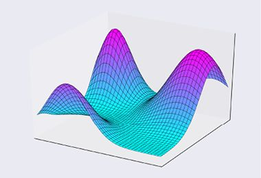

> **圖片描述：** 此圖為三維誤差表面圖。以紫色和青色的網格曲面呈現，展示了多個山峰和山谷。表面高度代表誤差值，兩個水平軸代表兩個神經元的輸出值。曲面包含多個極小值（山谷底部）和極大值（山峰頂部）。

圖19.1　誤差表面。對於輸出值的每個組合，我們都有一個對應的誤差，顯示為該點上方的表面高度

用兩個以上的神經元繪製誤差圖很難。例如，3個輸入（3個神經元中的一個）和1個輸出將需要一個我們無法繪製的四維圖。但我們可以在這些表面的抽象中設想幾十甚至幾百個維度。無論維數是多少，我們都會指定一組值，並返回誤差的數字。那個數字是那個點處“表面”的“高度”。

我們可以計算出曲面在該點處的梯度。計算梯度的數學過程與有多少維度無關。這很好，因為這意味著我們可以使用圖19.1所示的圖形來發揮我們的直覺，並相信它仍然適用於任何數量的維度。

我們將考慮所有誤差表面共有的4種類型的特徵：**極小值**（minima）、**極大值**（maxima）、**平臺**（plateau）和**鞍部**（見第5章）。

這些形狀是特殊的，因為它們包括一段為0的梯度位置（有時只是單個點）。我們有時會說這些梯度**消失**了。這是我們想要了解的，因為當沒有梯度時，第18章中的delta值將變為0，這反過來意味著權重更新將為0。這意味著權重不會改變，神經網路也不會改善。簡而言之，沒有梯度，就沒有學習。

**極小值**是表面上梯度為0的點，但向任何方向移動都會導致我們向上移動。極小值對應於碗的底部，如圖19.2a所示；或者對應於谷底的任何位置，如圖19.2b所示。

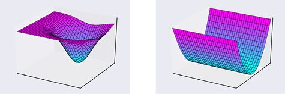

> **圖片描述：** 此圖展示六種梯度為0的地形：碗底、山谷、山頂、山脊、平臺、鞍部。

(a)　　　　　　　　　　　　　　　　　　　　　　　(b)

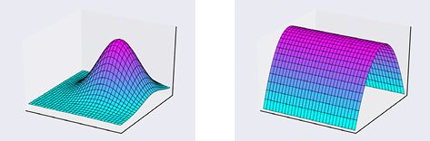

> **圖片描述：** 此圖展示極大值(山頂)和山脊的三維地形。

(c)　　　　　　　　　　　　　　　　　　　　　　　(d)

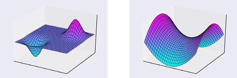

> **圖片描述：** 此圖展示平臺和鞍部的三維地形。

(e)　　　　　　　　　　　　　　　　　　　　　　　(f)

圖19.2　梯度可以降至0的位置；(a)極小值或碗的底部；(b)山谷的底部；(c)極大值或山丘的頂部；(d)山脊的頂部；(e)在平臺的平坦部分；(f)在鞍部的中間

山頂的相應概念稱為**極大值**，它是一個峰值，任何方向的運動都會導致向下移動。圖19.2c展示了這樣的山丘。圖19.2d展示了一個山脊，其中頂部的所有點都是最大值。

**平臺**是周圍表面平坦的區域，所以無論如何移動，我們既不會增加也不會失去高度，如圖19.2e所示。表面平坦時，梯度為0。

最後，**鞍部**是沿著一個或多個軸移動增加誤差的區域，但是沿著一個或多個其他軸移動減小了它。這種形狀如圖19.2f所示。我們可以在任何數量的維度上設置鞍部，其中沿某些維度的移動導致誤差增加，而在其他維度中移動導致誤差減小。在鞍部上有一個點，在這個點上這些相反的運動達到平衡，梯度為0。

考慮一個最底部有極小值的碗。梯度僅在碗的底部的最低點為0。但即使我們只是非常接近這一點，梯度也可能非常小，特別是如果碗很淺的話。如果梯度非常接近於0，那麼學習可能不會完全停止，但它可能會減慢，以至於學習似乎要花很長時間。

實際上，在誤差場景中，每個特徵都可以有很多實例，如圖19.1所示。這些特徵的多個實例的集合術語是**極小值**、**極大值**、**平臺**和**鞍部**。

如果有許多不同深度的山谷，那麼總有一個可能比其他山谷更深。我們說整個環境中最深的最小值是**全局最小值**，而其他所有值都是**局部最小值**（local minimum）。同樣的想法適用於**全局最大值**和**局部最大值**（local maximum）。在最小化誤差時，我們希望找到全局最小值，這是網路可能的輸出中可達到的最小誤差。但是，我們常常對局部最小值感到滿意，這給我們提供了一些對應用來說可以接受的誤差。

我們在第8章中看到，梯度下降可以落進山谷，從一側“蹦蹦跳跳”到另一側，或緩慢或快速地下降到底部，然後保持在那裡，從未離開山谷。如果山谷環繞著全局最小值，那就太好了，因為我們稍後會看到這可以減緩彈跳的速度。這將讓我們沉入盆地的底部，從而找到最佳輸出值。

但是如果處於局部最小值，那麼這種行為可能是一個問題，因為附近可能存在更小的局部最小值，並且我們永遠不會從淺層中跳出來到達深層，如圖19.3所示。

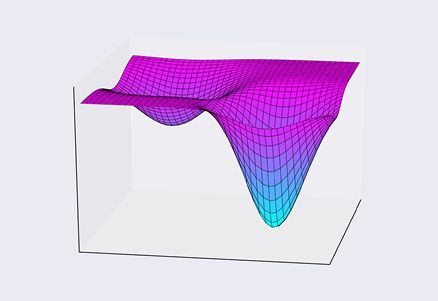

> **圖片描述：** 此圖展示深淺不同的兩個局部最小值。

圖19.3　兩個局部最小值，一個比另一個更小。尋求最低點的演算法不知道它們是否處於最深處的最小值

我們想要最小的誤差，想要最深處的最小值，但正如所見，我們無法找到它。梯度下降是一種**局部**演算法或**貪心**演算法，使得它快速而具有穩健性，但也會使它一葉障目而無法做出更好的選擇——即使它們就在附近。

奇怪的是，儘管神經網路的誤差表面存在極小值，但實際上鞍部[Dauphin14]提出了一個更大的問題。許多最佳化演算法可能嚴重地卡在鞍部中，因為在某些方向上的斜率可能非常大，而在其他方向上的斜率可能很小。圖19.4展示了這種情況下具有兩個方向的三維鞍部。

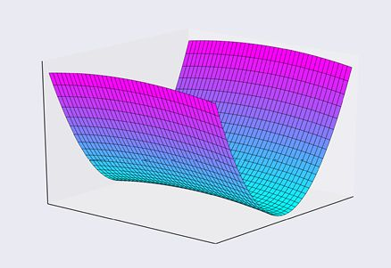

> **圖片描述：** 此圖展示三維鞍部地形，一方向陡峭另一方向平緩。

圖19.4　三維鞍部。朝向或遠離陡峭的一側移動將導致誤差的巨大變化。採取與這些側面垂直的類似尺寸的步驟將導致誤差的變化小得多

最佳化器會專注於陡峭的一側，盡力避免它們，從而不會增大誤差。那些陡峭的邊界主導著梯度的計算，因此在其他方向上的非常淺的下降在數值上不值一提，演算法在下降這個目標上很少或沒有取得進展。

被困在鞍部上的令人沮喪的事情是，我們知道如果它只能往向下的方向移動，系統可以做得更好，但是梯度下降演算法看不到大局。它只是環顧四周，看到一個0或接近0的梯度，最後發現自己卡在平衡點附近。

本章的目的是調查一些演算法，這些演算法旨在減少在局部最小值內部反彈及卡在鞍部上所帶來的問題。我們還將看到如何避免卡在梯度消失的平臺上。

### 19.2.2　作為二維曲線的誤差

為了說明不同的最佳化器如何執行更新，我們將使用二維誤差曲線演示它們。我們可以將其視為上一節中三維誤差地形的橫截面，這些處理本身只是我們經常使用的更高維度誤差環境的處理建議。

為了熟悉這個二維誤差，讓我們把它想象成試圖區分兩類樣本的結果，樣本被表示為排列在一條線上的點。負值的點在一個類中，所有其他點在另一個類中，如圖19.5所示。

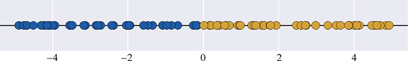

> **圖片描述：** 此圖展示數軸上兩類點：0左側藍色(0類)，0右側黃色(1類)。

圖19.5　一條線上的兩類點。0左側的點屬於0類，以藍色顯示；0右側的點屬於1類，以黃色顯示

我們想為這些樣本構建分類器。在此示例中，邊界僅包含一個數字。該數字左側的所有樣本將分配到0類，右側的所有樣本將分配到1類。如果想象沿著該邊界移動此分割點，我們可以計算被錯誤分類的樣本數並將之稱為誤差。圖19.6展示了這種想法。

> **圖片描述：** 此圖展示分割點移動時的誤差曲線，0處誤差最小。

圖19.6　對於線上的每個位置，我們可以將其左側的所有點分類為0類，將其右側的所有點分類為1類。如果我們將錯誤分類的點數加起來，就可以得到頂部顯示的誤差曲線

不出所料，由於我們設置了資料由0區分，將分割點置於0會使誤差為0。我們距離0越遠，無論是向左還是向右，誤差就會越大。

正如我們從第18章所知，我們想要使用平滑誤差函數，因為它們讓我們可以計算其梯度（從而驅動反向傳播）。因此，我們可以平滑圖19.6中的誤差曲線，如圖19.7所示。

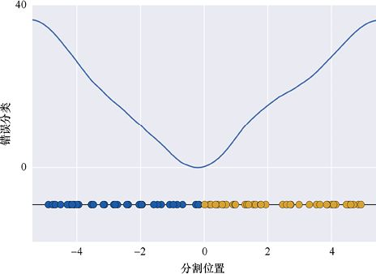

> **圖片描述：** 此圖為平滑版U形誤差曲線，最低點接近0。

圖19.7　圖19.6的平滑版本。我們可以計算這條曲線上的梯度，從而驅動反向傳播

對於這組特定的隨機資料，當我們處於0時，誤差看起來像是0，或者只是在0誤差的右邊一點。曲線的底部看起來在0位置的左邊一點點。這是曲線的最小值，其誤差最小。無論從哪裡開始，這裡都是我們想要最終達到的地方。

將此作為誤差曲線處理，我們在本章中將看到的最佳化器都被設計為使用梯度下降來儘可能高效地找到最小值。

使用梯度下降學習時的關鍵參數是**學習率**，通常用小寫的希臘字母*η*表示。接近1的較大值會使學習較快，但正如我們在第8章中所看到的，這可能導致我們錯過一些山谷，直接跳過了它們。較小的*η*值（接近0，但不小於0）會導致學習率變慢，並且可以找到狹窄的山谷，但我們也在第8章中看到，即使附近有更深的山谷，這些值也會使學習陷入平緩的山谷中，如圖19.8所示。

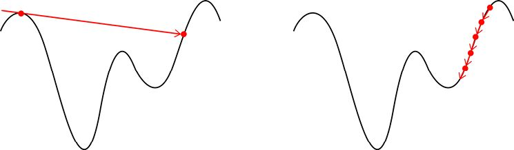

> **圖片描述：** 此圖展示學習率影響：(a)太大跳過深谷；(b)太小陷入淺谷。

(a)　　　　　　　　　　　　　　　　　　　　　　　　　　　　　　　　　　　　　　(b)

圖19.8　學習率*η*的影響。(a)當*η*太大時，我們會跳過深谷並錯過它；(b)當*η*太小時，我們會慢慢下降到局部最小值，並錯過更深的山谷

## 19.3　調整學習率

許多最佳化器都採用的一個重要想法是：我們可以通過改變學習率來改善學習。一般的想法是，我們可以在學習過程的早期，在尋找一個不錯的深谷時邁較大的步子。隨著時間的推移，我們可能找到了通往最小值的路，因此當接近谷底時，我們可以走越來越小的碎步。

我們用一個具有負高斯形狀的誤差曲線來解釋最佳化器，如圖19.9所示。

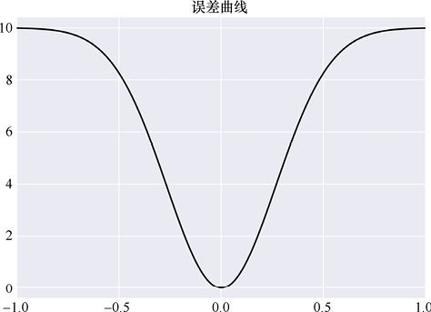

> **圖片描述：** 此圖展示倒置高斯形標準誤差曲線。

圖19.9　用於解釋最佳化器的誤差曲線

這條誤差曲線的一些梯度如圖19.10所示。可以看到，對於小於0的輸入值，梯度為負，對於大於0的輸入值，梯度為正。當輸入為0時，我們位於山谷的最底部，所以這裡的梯度是0。

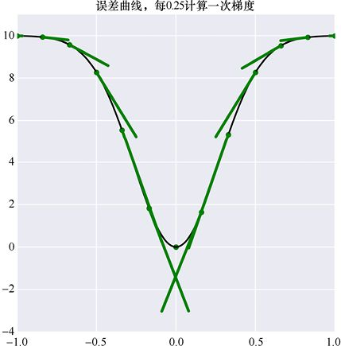

> **圖片描述：** 此圖展示誤差曲線上若干位置的梯度箭頭。

圖19.10　誤差曲線及其在某些位置的梯度。為了清晰起見，梯度的長度已按比例縮放。注意，在曲線的最底部，梯度的長度為0，因此它只繪製為一個點

### 19.3.1　固定大小的更新

我們先回顧一下在使用恆定學習率時會發生什麼。換句話說，我們在整個學習過程中將梯度縮放為*η*倍，*η*值保持恆定。

圖19.11展示了以固定大小更新的基本步驟。假設我們在神經網路中查看特定的權重。假設權重從值*W*1開始，我們更新了一次，所以現在它的值為*W*2，如圖19.11a所示。它的相應誤差是其上面的誤差曲線上的點，標記為*B*。我們希望再次將權重更新為一個更好的新值，稱之為*W*3。

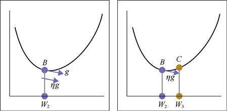

> **圖片描述：** 此圖以四步驟展示梯度下降更新過程。

(a)　　　　　　　　　　　　　　　　　　　　　　　(b)

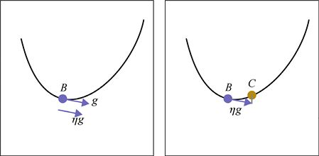

> **圖片描述：** 此圖為梯度下降步驟的簡化版。

(c)　　　　　　　　　　　　　　　　　　　　　　　(d)

圖19.11　找到梯度下降的步驟。(a)當權重值為*W*2時，我們在其上方的誤差曲線上找到標記為*B*的點。*B*處的梯度是標記為*g*的箭頭。然後我們將該梯度乘以學習速率*η*，給出箭頭*ηg*。由於*η*通常小於1，因此*ηg*比*g*短，但指向相同的方向。(b)從*W*2和*ηg*中找到*W*3。(c)圖19.11a的簡化版本。(d)圖19.11b的簡化版本

為了更新權重，我們在*B*點的誤差表面上找到它的梯度，如標記為*g*的箭頭所示。我們利用學習率*η*來縮放梯度以獲得新的箭頭*ηg*。因為*η*在0和1之間，所以*ηg*是指向與*g*相同方向的新箭頭，而它的大小與*g*相同或更小。

為了找到權重的新值*W*3，我們將縮放後的梯度添加到*W*2。這意味著我們將箭頭*ηg*的尾部放在*B*處，如圖19.11b所示。該箭頭的尖端的水平位置是權重的新值*W*3，並且誤差表面在其正上方的值被標記為*C*。在這個例子中，我們稍微走得遠了一點，以至於將誤差增加了一點。

這些圖中有很多標籤和線條。我們可以通過只在誤差曲線上繪製點來簡化這一過程，因此圖19.11a和圖19.11b可以繪製為圖19.11c和圖19.11d的形式。我們只需要記住，權重的值是點的水平位置，誤差是它們上面的曲線的值。

讓我們在實踐中使用單個山谷的小誤差曲線來研究這種技術。圖19.12展示了左上角的起點。這裡的梯度很小，所以我們向右移動了一小點（回想一下，梯度指向上坡，所以我們沿著負梯度的方向移動到下坡）。

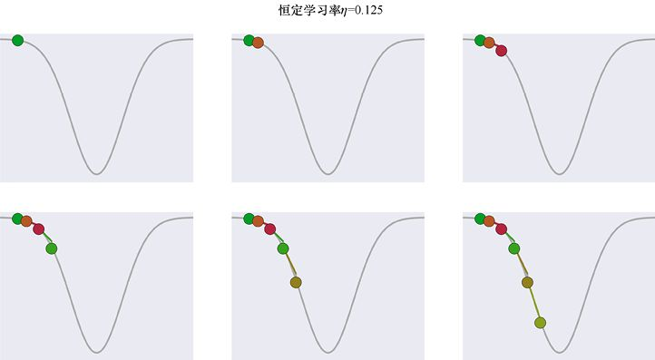

> **圖片描述：** 此圖展示恆定學習率(η=1/8)梯度下降，底部出現彈跳。

圖19.12　以恆定學習率學習

對於這些圖，我們選擇*η*= 1/8或0.125。對於恆定大小的梯度下降，這是一個相當大的*η*值，我們經常使用1/100或更小的值。我們選擇了這個大值，因為它可以使圖更清晰。較小的值以類似的方式工作，只是更慢。我們沒有在這些圖的軸上顯示值以避免視覺混亂，因為我們真正感興趣的是發生的現象的性質而不是數字（實際的圖形和梯度值如圖19.10所示）。

因此，我們不是把第一個點移動一整個梯度，而是僅移動其1/8。

此移動將點帶到曲線較陡的部分，此處梯度較大，因此下一次更新會移動得更遠。每個學習步驟都以新顏色顯示，我們以此來繪製先前位置和新點的梯度。垂直的線用於幫助我們直觀瞭解新點是否位於梯度線末端的上方或下方。

圖19.13展示了前6個點的特寫，此外還展示了每個點的誤差。在這些圖中，我們在每個點展示由學習率縮放的局部導數，該直線與下一個點的顏色相同。我們還展示了從該縮放導數的末尾返回到曲線的垂直線。這些線條在這些數字中有點難以看出，因為它們很短並且緊跟曲線，但在後面的數字中它們會更容易看到。

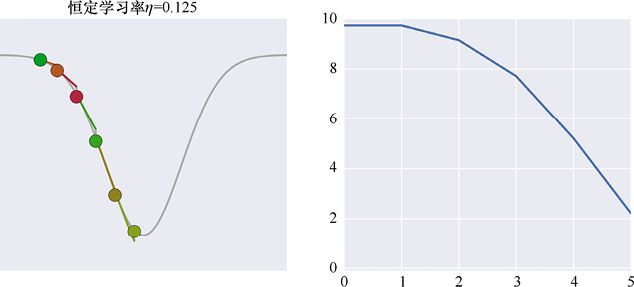

> **圖片描述：** 此圖為恆定學習率前6步的特寫及誤差值。

(a)　　　　　　　　　　　　　　　　　　　　　　　　　　　　　　　　　　　　　(b)

圖19.13　(a)圖19.12中前6個點的特寫；(b)與這6個點中的每一點相關的誤差

這個過程是否會到達曲線的底部？也就是說，網路會不會出現0誤差？圖19.14展示了此過程的前15個步驟。

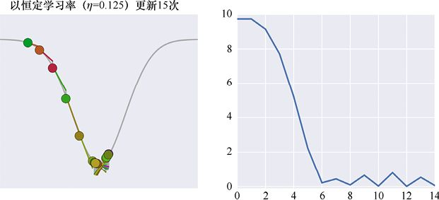

> **圖片描述：** 此圖展示恆定學習率前15步，底部來回彈跳。

(a)　　　　　　　　　　　　　　　　　　　　　　　　　　　　　　　　　　　　 (b)

圖19.14　(a)以恆定學習率學習的前15個步驟。其中不變的步驟意味著我們花了很多時間在曲線底部彈跳。(b)這15點的誤差。左側的點接近於0，但隨後跳躍到山谷的右側就得到更大的誤差

我們接近底部，然後到達右側的曲線上。但這沒關係，因為這裡的梯度指向下方和左側，所以我們回到底部，直到再次超過底部，在左側的某處結束，然後再次超過底部並最終回到右側，如此來回。我們有時會說這是在曲線的底部**彈跳**。

我們正逐漸朝著0誤差前進，但看起來這個過程將永遠持續。這個對稱的山谷中的問題特別嚴重，因為誤差在最小值的左右兩側之間來回跳躍。當我們使用恆定的學習率時，這種行為會經常發生。

彈跳過程的發生，是因為當我們接近底部時，想要邁一些小步子，但由於學習率是一個常數，而我們走的步子太大了。

也許圖19.14的彈跳問題是由學習率為1/8引起的。或許其他值不會像那樣反彈。圖19.15展示了一些非常小的*η*值的前6個步驟的情況。

當*η*取0.025、0.05和0.1時，如圖19.15所示，我們採取微小的跨步。當我們最終到達底部時，這可能會很好，但它仍將不斷嘗試去到達那裡。一旦接近底部，我們將看到與以前相同的彈跳行為，但規模要小得多。

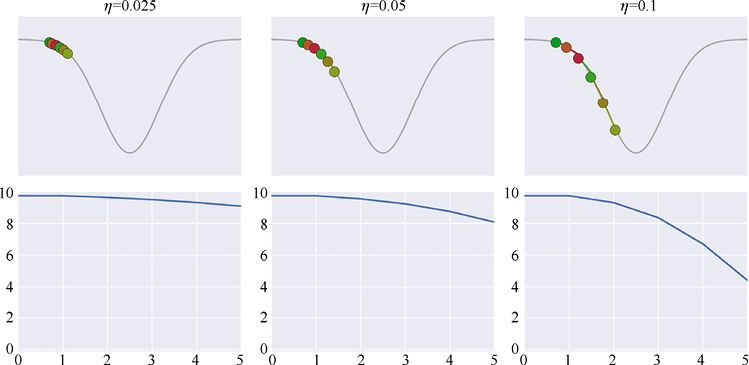

> **圖片描述：** 此圖展示小學習率(0.025/0.05/0.1)前6步，進展緩慢。

圖19.15　使用較小的學習率進行6個梯度下降步驟的過程。上方：使用學習率為0.025（左列）、0.05（中間列）和0.1（右列）的前6個點。下方：以上幾點的誤差值

一些較大的*η*值的前6個點如圖19.16所示。在這裡，我們可以更容易地看到每個點處的彩色線表示的經學習率縮放的局部導數，以及從縮放導數末端到曲線的灰色垂直線。

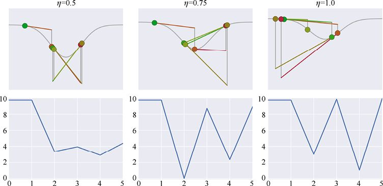

> **圖片描述：** 此圖展示大學習率(0.5/0.75/1.0)前6步，嚴重彈跳。

圖19.16　使用更大的學習率，沿山谷進行6個梯度下降步驟的過程。上方：使用學習率0.5（左列）、0.75（中間列）和1.0（右列）的前6個點。下方：以上幾點的誤差值

對於圖19.16中學習率的較大值，我們能立即看到其中的問題。當*η* = 0.5時，我們在底部反彈比以前更糟糕。這需要很長時間才能安定下來。當*η* = 0.75時，第一步將我們差不多帶到底部，但之後我們移動得太遠，以至於最終得到的誤差幾乎與開始時的一樣大，儘管換成了山谷的右側。當*η* = 1.0時，同樣的問題也出現了，甚至更糟。

這就是典型的大學習率問題。這個問題可以追溯到導數和梯度的定義。這樣的測量僅在非常接近我們評估它們的點時才準確。當我們移動太遠時，它們不再是匹配曲線，我們可能會在意外的地方結束。

6個點並不多。讓我們看看15個點的學習率的結果。小學習率的圖形和誤差如圖19.17所示。

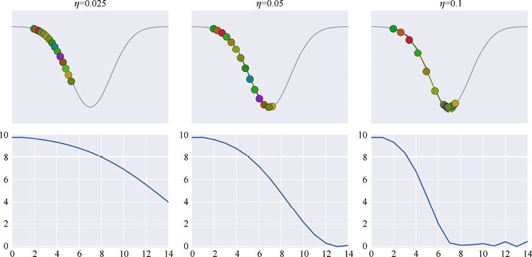

> **圖片描述：** 此圖展示小學習率前15步，緩慢但平穩。

圖19.17　以較小的學習率進行15步。上方：學習率為0.025（左列）、0.05（中間列）和0.1（右列）。下方：上方中各點的誤差

以大學習率進行的15個步驟的結果如圖19.18所示。

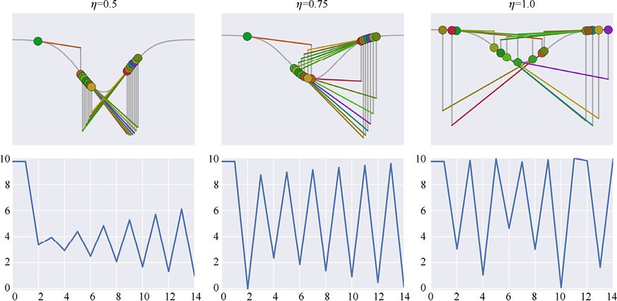

> **圖片描述：** 此圖展示大學習率前15步，各種不穩定問題。

圖19.18　以大學習率進行15個步驟。上方：學習率為0.5（左列）、0.75（中間列）和1.0（右列）。下方：上方中各點的誤差

*η*值選擇得太小可以讓我們接近底部，但這需要很長時間。*η*值選擇得太大又會導致那些我們在圖19.18中看到的各種彈跳問題。

較大的學習率也可能導致我們跳出一個不錯的具有低極小值的山谷。在圖19.19中，我們跳過了所在山谷的剩餘部分，並進入了一個新的具有更大極小值的山谷。

找到一個能以合理速度移動但不會超過山谷或陷入彈跳問題的學習率似乎是一個挑戰。

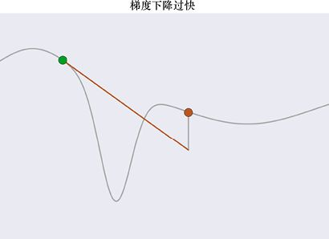

> **圖片描述：** 此圖展示大步幅從左側深谷跳到右側淺谷的問題。

圖19.19　我們處於左側的綠點，並採取更新步驟移動到右側的紅點。綠點位於我們想要落入的山谷中，但是這一大步跨過了山谷，最終落在了一個不同的山谷中——它的極小值更大

### 19.3.2　隨時間改變學習率

如果我們改變學習率會怎樣？我們可以在學習開始時使用大的*η*值，這樣就不會一直緩慢前行，而在接近末尾時使用一個小值，最終也不會在底部彈跳。

使用開始大而逐漸變小的梯度的一種簡單方法是在每次更新步驟之後將學習率乘以幾乎為1的數字，如0.99。假設起始學習率為0.1，那麼在第一步之後，它將是0.1×0.99 = 0.099。在下一步之後，它將是0.099×0.99 = 0.09801。圖19.20展示了當我們為多個步驟執行此操作時*η*的變化，其中分別使用了幾個不同值的乘數。

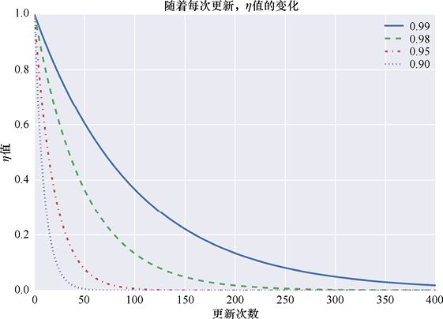

> **圖片描述：** 此圖展示不同衰減參數下學習率的指數衰減曲線。

圖19.20　從學習率*η*= 1開始，各條曲線顯示學習率在每次更新後乘以給定值後如何下降

編寫這些曲線方程的最簡單方法是使用指數，因此這種曲線稱為**指數衰減**（exponential decay）曲線。我們在每一步上乘以的值*η*稱為**衰減參數**（decay parameter），這通常是非常接近1的數字。圖19.20展示了衰減參數的4個示例。

讓我們將這種令學習率逐漸降低的方法應用到誤差曲線的梯度下降上。我們再次以1/8的學習率開始。為了使衰減參數的效果顯著可見，我們將其設置為異常低的值0.8。這意味著每個步驟只有前一步的80%，如圖19.21所示。

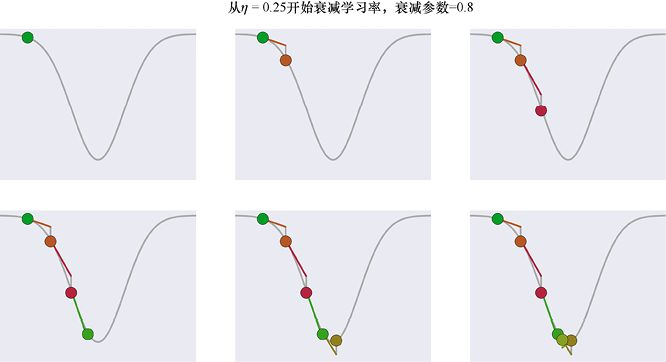

> **圖片描述：** 此圖展示衰減學習率前6步，步幅逐漸縮小。

圖19.21　使用衰減學習率的方法後的前6個步驟

最終圖像以及沿途每個點的誤差如圖19.22所示。

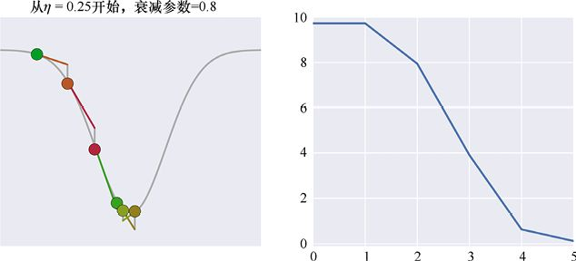

> **圖片描述：** 此圖展示衰減學習率前6步的結果和誤差。

圖19.22　(a)圖19.21中的右下圖；(b)這6個點的誤差

這是令人激動的。讓我們將這個過程延續至15步。結果如圖19.23所示。

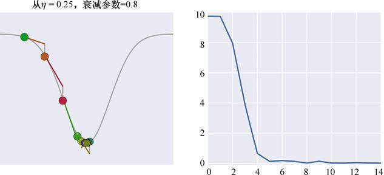

> **圖片描述：** 此圖展示衰減學習率前15步，快速穩定在底部。

圖19.23　使用衰減學習率的方法後的前15個步驟

讓我們將這與使用恆定學習率得到的“彈跳”結果進行比較。圖19.24展示了恆定學習率和衰減學習率的結果。

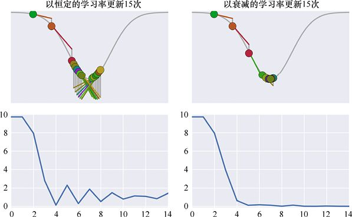

> **圖片描述：** 此圖對比恆定（彈跳）和衰減（穩定）學習率的15步結果。

圖19.24　左邊是圖19.14中的恆定學習率，右邊是圖19.23中的衰減學習率。注意，逐漸衰減的學習率是如何幫助我們有效地定位到具有極小值的山谷的

逐漸衰減的學習率可以很好地定位在山谷的底部並保持在那裡。儘管每個圖中有15個點，但我們也只能在逐漸衰減學習率的那幅圖中找出前7個點。其餘的點在視覺上都是在山谷的底部彼此重疊。從數字上看，我們發現這些點可能移動了一點點，但每一步都越來越小。

### 19.3.3　衰減規劃

衰減技術很有吸引力，但也帶來了一些新的挑戰。

首先，理所當然地，我們必須為衰減參數選擇一個值。

其次，我們可能不希望在每次更新後應用衰減。我們選擇隨時間改變學習率的特殊方式稱為**衰減規劃**（decay schedule）[Bengio12]。

衰減規劃通常用epoch表達，而不是樣本。也就是說，我們訓練訓練集中的所有樣本，然後在再次訓練所有樣本之前考慮改變學習率。

最簡單的衰減規劃是在每個epoch之後始終將衰減應用於學習率。該規劃如圖19.25a所示。

另一種常見的規劃是暫時推遲任何衰減，因此我們的權重有機會遠離其起始隨機值並進入可能接近找到極小值的地方。然後應用我們選擇的任意規劃。圖19.25b展示了這種方法，它表示將圖19.25a的指數衰減規劃推遲了一些epoch。

另一種選擇是每隔一段時間應用衰減，稱為**間隔衰減**（interval decay），如圖19.25c所示，每經過固定數量的epoch後衰減學習率，如每隔4或10。這樣我們就不會冒太小、太快的風險。

或者我們可能希望監控網路的誤差。只要誤差在持續下降，我們就會保持現在的學習率。當網路停止學習時，我們應用衰減，這樣它可以採取較小的步幅，並希望能夠進入誤差環境的更深處。這種方法如圖19.25d所示。

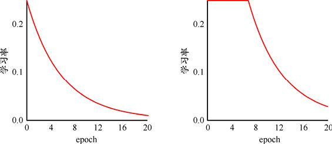

> **圖片描述：** 此圖展示衰減規劃：(a)指數衰減；(b)延遲指數衰減。

(a)　　　　　　　　　　　　　　　　　　　　　　　　　　　　　(b)

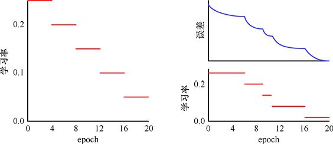

> **圖片描述：** 此圖展示衰減規劃：(c)間隔衰減；(d)基於誤差的衰減。

(c)　　　　　　　　　　　　　　　　　　　　　　　　　　　　　(d)

圖19.25　用於學習率衰減的隨時間變化的衰減規劃。(a)指數衰減，其學習率在每個epoch之後衰減；(b)延遲指數衰減；(c)間隔衰減，其中學習率在每經過固定數量的epoch之後衰減（這裡數量為4）；(d)基於誤差的衰減，當誤差停止減小時學習率衰減

我們可以輕鬆地製作許多替代方案，例如，僅在誤差減小一定量或一定百分比時應用衰減，或者通過從中減去一個小值而不是將其乘以接近1的數值來更新學習率。

如果需要，我們甚至可以提高學習率。bold**驅動**（bold driver）方法著眼於每個epoch [Orr99]之後總誤差的變化情況。如果誤差發生了變化，那麼我們會稍微提高學習率，比如1%到5%。我們的想法是，如果事情進展順利，誤差正在減小，我們可以採取提高學習率的步驟。但是如果誤差增加了不止一點，那麼我們就會衰減學習率，將其減小一半。通過這種方式，可以在它們要讓我們遠離之前享受的不斷減小的誤差之前，立即停止任何增長。

學習率規劃的缺點是我們必須提前選擇它們的參數[Darken92]。有時，我們可以將這些參數視為**超參數**，並自動搜索最佳值，如第15章所述。

一般來說，調整學習率的簡單策略通常運作良好，我們可以在眾多機器學習庫中毫不費力地選擇其中一個。指數衰減、步進和bold驅動方法很受歡迎[Karpathy16]。

某種學習率衰減是大多數機器學習系統中的共同特點。我們希望在早期階段快速學習，在地形上大步邁進，尋找能找到的最低的極小值。然後衰減學習率，以便我們的步伐變得更小，允許我們採取逐漸變小的步幅並停留在找到的山谷的最深處。

我們很自然地會想知道是否能不依賴於我們在開始訓練之前設定的計劃去控制學習率。當然，我們可以以某種方式檢測何時接近極小值，或在山谷中，或在彈跳，再自動調整學習率作為響應。

當我們考慮這個問題時出現的一個更有趣的問題可能是：我們不想對所有權重應用相同的學習率調整方法。如果調整我們的更新能夠使得每個權重以最適合它的速度學習是很好的。

下面我們看一下如何利用梯度下降的一些變體來實作這些想法。

## 19.4　更新策略

在第19章中，我們提到了使用梯度下降來更新網路權重的3種變體：批梯度下降、隨機梯度下降和mini-batch梯度下降。在接下來的部分中，我們將看到這些方法如何在一個小但真實的二元分類問題上執行。

圖19.26展示了我們熟悉的兩個半月形圖案。每個半月的點屬於它們自己的類。這300個樣本將成為本章其餘部分的參考資料。

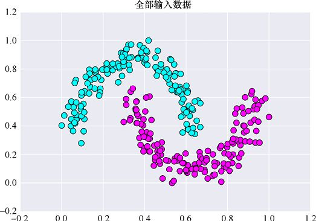

> **圖片描述：** 此圖展示300個樣本的兩個半月形測試資料集。

圖19.26　我們將在本章其餘部分使用的資料。300個樣本，來自兩個各含150個樣本的類

為了比較神經網路，我們將訓練它們，直到誤差達到0或者看似已停止改進為止。我們將在每個epoch後繪製誤差圖來展示訓練結果。由於演算法的各種變化，這些圖中的epoch數量也將在很大範圍內變化。

為了對點進行分類，我們將使用具有3個隱藏層（各有12個、13個和13個點）的神經網路，以及2個點的輸出層，為我們計算兩個類中每個類的可能性。輸出中具有較大可能性的類，將被視為神經網路的預測。為了保持一致性，在需要恆定的學習率時，我們將使用*η*= 0.01。

### 19.4.1　批梯度下降

在評估所有樣本之後，讓我們首先在每個epoch後更新一次權重。這稱為**批梯度下降**（batch gradient descent）。

該名稱引用了集中式大型機處理器早期使用的計算方式。這些系統一次只能運行一個程式。每個程式（稱為**作業**）的每一行通常保存在一片單獨的穿孔卡上。當將卡放入送卡箱並按順序讀取時，它們在電腦中重建以形成程式。負責電腦操作的人員通常會將一堆程式（稱為**批**）聚集在一起，並將它們以一個巨大的堆棧形式提供給電腦。然後，系統將運行第一個作業，生成輸出（通常在扇形摺疊紙上），然後它將運行下一個作業，以此類推，而無須人員管理該過程。今天有時使用**批處理**這一短語來指代可以啟動並運行一系列操作的任何技術[IBM10]。

在我們的例子中，權重的每次更新都可以被認為是這些操作之一。我們不是在評估每個樣本後執行更新，而是等待整個樣本集合、epoch或批次的評估。然後使用來自所有樣本的組合資訊更新所有權重一次。因此，批次是整個訓練集，並且我們在整個集合處理完畢後更新權重一次。

圖19.27展示了使用批梯度下降的典型訓練運行的誤差。

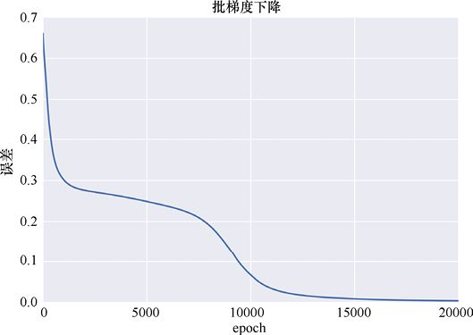

> **圖片描述：** 此圖展示批梯度下降誤差，20000 epoch平滑降至0。

圖19.27　使用批梯度下降進行訓練的誤差。使用批次中所有樣本的平均影響，每個epoch更新權重一次。該圖展示了20000個訓練epoch

廣泛的特徵令人放心。誤差在開始時下降了很多，表明網路正在誤差表面的陡峭部分開始。然後誤差下降得很緩慢。這裡的表面可能是淺鞍部近似平坦的區域，或者處於僅有一點斜率幾乎是平臺的區域，因為誤差確實繼續緩慢下降。最終，演算法找到另一個陡峭的區域，並一直跟隨它到0。

批梯度下降看起來非常平滑，但我們看到的是20000個epoch，這個訓練量是很大的。為了確認這種印象，我們放大前400個epoch，如圖19.28所示。

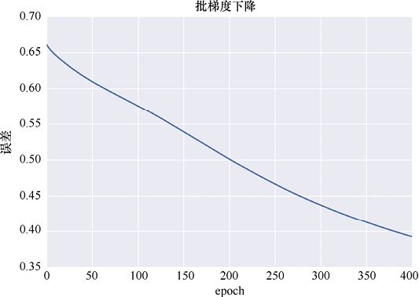

> **圖片描述：** 此圖為批梯度下降前400 epoch特寫。

圖19.28　圖19.27中前400個批梯度下降的epoch的特寫

批梯度下降似乎確實在順利進行。這是有道理的，因為它每次更新時使用來自所有樣本的平均值。

批梯度下降產生一個平滑的、好看的誤差曲線，最終達到0。

批梯度下降在實踐中存在一些問題。如果我們有比電腦記憶體容納上限更多的樣本，那麼**分頁**（paging）或從較慢的存儲介質中檢索資料的時間成本可能會變得很大甚至是很嚴重。當我們處理包含數百萬個樣本的龐大資料集時，這在某些實際情況中可能是個問題。從較慢的存儲空間（甚至硬盤驅動器）中反覆讀取樣本可能需要花費大量時間。這個問題有解決方案，但它們可能涉及很多工作。

與此記憶體問題密切相關的是，必須保持所有樣本易得且可用，以便我們可以一遍又一遍地遍歷它們，每個epoch一次。我們有時會說批梯度下降是一種離線演算法，這意味著它嚴格地根據已存儲和可訪問的資訊進行操作。

我們說它是“離線”的，是因為所有資料在訓練開始時都已經可用。我們稍後會看到“在線”方法，即使在訓練時也可以獲得更多資料。因此，我們可以想象將電腦與所有網路斷開連接，如果它正在運行**離線演算法**（offline algorithm），它仍然可以從所有訓練資料中學習。

### 19.4.2　隨機梯度下降

讓我們走到另一個極端，在每個樣本後更新權重。這稱為**隨機梯度下降**，或更常見的是SGD。回想一下“隨機”（stochastic）這個詞大致是“隨機”（random）的同義詞。因為樣本以隨機順序到達，所以我們無法預測權重如何在一個樣本到另一個樣本間變化。

每個樣本都會將權重改變一點。由於資料集有300個樣本，這意味著我們將在每個epoch的過程中更新權重300次。這會導致誤差出現大量跳躍，因為一個樣本會向一個方向拉動權重，然後另一個樣本又是另一個方向。

由於我們只是在逐個epoch的基礎上繪製誤差，因此不會看到這種小規模的擺動。但即使在epoch之間，振盪也依舊是可見的。

圖19.29展示了神經網路使用SGD從這些資料中學習的誤差。

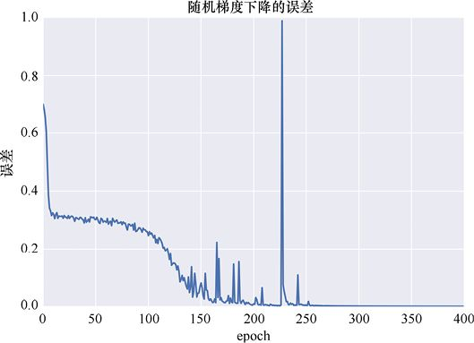

> **圖片描述：** 此圖展示SGD誤差，400 epoch達0但有噪聲飆升。

圖19.29　隨機梯度下降（或稱SGD）。當我們通過在每個樣本之後更新權重來學習圖19.26的資料時，該圖展示了每個epoch之後的誤差。該圖展示了400個訓練epoch

該圖具有與批梯度下降大致相同的形狀，這是合理的，因為兩次訓練都使用相同的網路和資料。

大約第225個epoch周圍的巨大飆升表明SGD是多麼難以預測。樣本排序中的某些內容以及網路權重的更新方式導致誤差從接近0到接近1地飆升。換句話說，它會從幾乎能正確分類每個樣本到幾乎在每個樣本上都犯錯，然後再回到正確的位置（雖然這需要幾個epoch，如尖峰右側的小曲線所示）。如果我們在學習過程中觀察誤差，就可能會在那裡停止訓練。如果我們使用自動演算法來觀察誤差，它也可能會阻止它。然而，在這個峰值之後的幾個epoch又回到了接近0。這個演算法名字中的“隨機”一詞名副其實。

從圖19.29中看到，SGD在短短400個epoch內降至0左右。我們在400個epoch之後截斷了曲線，因為從那時起曲線保持在0。將其與圖19.27中批梯度下降所需的大約20000個epoch進行比較可以發現，這種效率的提高是明顯的[Ruder16]。

但讓我們看看真正應該比較的東西。每個演算法更新多少次權重？批梯度下降在每個epoch之後更新權重，因此20000個epoch意味著它進行了20000次更新。SGD會在每個epoch的300個樣本中的每個樣本之後進行更新。因此，在400個epoch中，它執行了300×400=120000次更新，是批梯度下降的6倍。這意味著，我們實際花費等待結果的時間並不完全由epoch數決定，因為每個epoch的時間可能有很大差異。

我們稱SGD為**在線演算法**（online algorithm），因為它不需要存儲樣本，甚至不需要從一個epoch到下一個epoch。它只是處理每個樣本，並立即更新網路。

SGD會產生**噪聲**，如圖19.29所示。這既好又壞。好的一面是SGD可以在搜索極小值時從誤差表面的一個區域跳到另一個區域。但不好的一面是，SGD可能跨過最低的極小值，並且花費時間在其他極小值內部以較大的誤差反彈。隨著時間的推移，衰減學習率肯定會有助於解決跳躍問題，但搜索仍然會很波動。

誤差曲線中的噪聲可能是一個問題，因為它使我們很難知道系統何時學習，以及它是否過擬合。我們必須考慮一些epoch後才能獲得誤差的平均值。這可能會消耗很多時間，而且我們可能只在超過了某個標記很久之後才發覺。

### 19.4.3　mini-batch梯度下降

我們可以在批梯度下降（每個epoch更新一次）和隨機梯度下降（每個樣本後更新）這兩種極端情況之間找到一個很好的中間地帶。這種折中稱為mini-batch**梯度下降**（mini-batch gradient descent）。在這裡，我們在評估了一些固定數量的樣本後更新權重。此數字幾乎總是遠小於批大小（即訓練集中的樣本數）。我們將這個較小的數字稱為mini-batch**大小**，從訓練集中抽取的一組樣本是一個mini-batch。

mini-batch大小通常大約是232～2256，並且通常被選擇以充分利用我們的GPU的並行能力（如果我們有的話）。但這只是為了達到一定的速度。我們可以使用我們喜歡的任何大小的mini-batch。

使用32個樣本的mini-batch的結果如圖19.30所示。

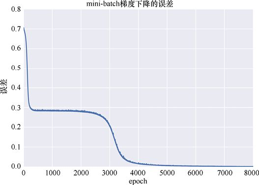

> **圖片描述：** 此圖展示mini-batch誤差，約5000 epoch達0。

圖19.30　mini-batch梯度下降。我們使用的是32個樣本的mini-batch。大約5000個epoch之後，我們發現誤差為0

這確實是兩種演算法的完美結合。曲線是平滑的，就像批梯度下降一樣，但並非完全那樣。它在大約5000個epoch內降至0，介於SGD所需的400和批梯度下降所需的200000之間。圖19.31展示了前400個epach的細節。

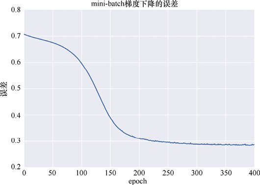

> **圖片描述：** 此圖為mini-batch前400 epoch特寫。

圖19.31　圖19.30的前400個epoch的特寫，顯示出了訓練開始時的陡降。注意，垂直刻度範圍是0.2～0.8

mini-batch梯度下降執行了多少次更新？我們有300個樣本，使用了32個樣本的mini-batch，因此每個epoch有10個mini-batch。理想情況下，我們希望mini-batch能夠精確地劃分輸入的大小。但在實踐中我們無法控制資料集的大小，經常在最後有一個不完整的mini-batch。因此，每個epoch執行10次更新，乘以5000個epoch，為我們提供了50000次更新。這恰好也在批梯度下降的20000次更新和SGD的120000次更新之間。

mini-batch梯度下降的噪聲比SGD小，這使得它有助於跟蹤誤差發生的情況。若使用GPU進行計算，該演算法能得到巨大的效率提升，可以並行地評估mini-batch中的所有樣本。因此它比批梯度下降更快，並且在實踐中比SGD更具吸引力。

由於所有這些原因，mini-batch梯度下降在實踐中很受歡迎，“普通”SGD和批梯度下降的使用相對較少。

事實上，大多數時候在文獻中使用的術語“SGD”，或者甚至只是“梯度下降”，都可以理解為是指mini-batch梯度下降[Ruder16]。

## 19.5　梯度下降變體

讓我們回顧一下mini-batch梯度下降的一些挑戰，以及解決它們的方法（按照慣例，從這裡我們通常將mini-batch梯度下降稱為SGD）。組織本節的靈感來自[Ruder16]。

mini-batch梯度下降是一種很好的演算法，但它並不完美。首先，我們必須指定想要使用的學習率*η*的值，眾所周知這是難以提前選擇的。正如我們所看到的，一個太小的值會導致學習時間過長而陷入淺層局部最小值，但是一個太大的值會導致我們超越深層局部最小值，然後當我們確實找到它的最小值時會陷入來回彈跳的困境。如果試圖使用衰減規劃，通過隨時間改變*η*來避免這個問題，我們仍然必須選擇該規劃及其參數。

然後我們必須選擇mini-batch的大小。這通常不是一個問題，因為我們就使用任何能與硬體結構最匹配的值來進行計算即可。

另一個問題是，考慮到現在我們用“一個全體通用的學習率”的方法更新所有權重，也許那不是最好的方法。也許我們可以為系統中的每個權重找到一個特有的學習率，這樣不只是將它往最佳方向移動，而且也能將其移動最佳數值。

要記住，我們可能的另一種改進方法是，正如我們上面提到的，有時鞍部上的區域在所有方向上的變化都可能很淺，所以在局部，它幾乎（但並不完全）是一個平臺。這會拖延我們的進度，就好似在艱難爬行。因為我們知道在誤差環境中通常會有很多鞍部[Dauphin14]，如果有這樣一種方法就好了，它可以使得我們在這些情況下不被卡住，或者更好的是，在第一時間就避免卡進這些區域。這樣的方法同樣適用於平臺：我們希望避免陷入梯度下降到0的平坦區域。因此我們希望避開梯度下降到0的區域，當然除了正在尋求的最小值。

讓我們看一下解決這些問題的一些梯度下降法的變體。

### 19.5.1　動量

如果將誤差表面看作一個地形地貌，那麼如我們在第5章中看到的，我們可以將每個步驟描繪成一個沿著表面滾動的球，它在尋找最低點。在二維分類示例中，球的位置由權重給出，球的高度由這些值的誤差給出。

圖19.32再現了第5章中的一幅圖，該圖展示了這樣考慮訓練過程的一個例子。

我們從物理世界中知道，以這種方式從山上滾下來的真實球將具有一些**慣性**（inertia），這描述了它對運動狀態變化的抵抗力。也就是說，如果它以一定的速度在給定的方向上滾動，它將繼續以這種方式移動，除非有東西干擾它（例如摩擦，或者有人推球，或者誤差環境的斜率變化）。

一個不同但相關的想法是球的**動量**（momentum）。從物理的角度來看，這有點抽象。我們有時會在日常言論中隨意混淆這兩個術語，將“動量”視為一個對象繼續以相同的速度和方向移動的趨勢。我們將在這裡使用這種解釋。

這個概念是使圖19.32中的球在從高峰下降穿過鞍部並在平臺上保持移動的原因。如果球的運動是由梯度嚴格給出的，當它達到平臺時就會停止（或者如果它達到一個近似平臺的區域，那麼球會慢慢爬行）。但是球的動量（或更恰當地說，它的慣性）使它保持向前滾動。

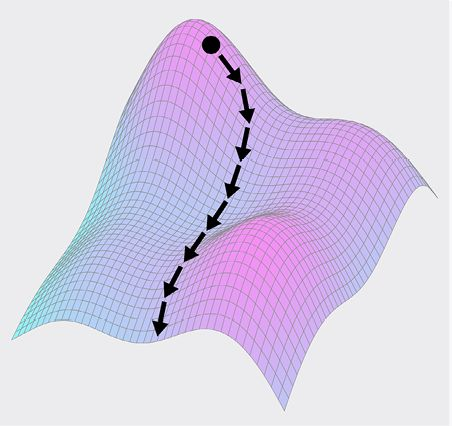

> **圖片描述：** 此圖展示球沿誤差表面下滾的三維示意。

圖19.32　將球沿誤差表面下滾。這是第5章中的圖的再現

假設我們在圖19.33的左側附近。當我們滾下山坡時，我們將從−0.5左右開始到達平臺。

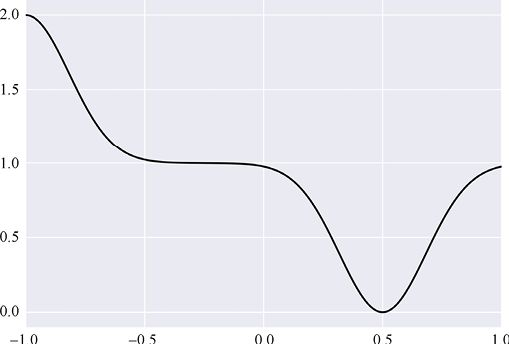

> **圖片描述：** 此圖展示含平臺的誤差曲線。

圖19.33　山丘和山谷之間的平臺的誤差曲線

對於常規的梯度下降，我們就會因為梯度為0而停在平臺上，如圖19.34a所示。但是如果我們包含一些動量，那麼球會持續滾動一段時間。它會減速，但如果我們很幸運，它會滾動到足以找到下一個山谷的地方。

如果能夠讓學習過程使用這種動量，那將是很好的，因為它將幫助我們跨越圖中那樣的平臺。

**動量梯度下降**（momentum gradient descent）技術[Qian99]就是基於這個觀點被提出的。對於每個步驟，一旦計算出我們希望每個權重變化多少，就會添加少量來自之前步驟的變化。因此，如果給定步驟的變化為0或接近0，但我們在上一步有一些較大的變化，則將依靠先前的一些動能，推動我們走過平臺。

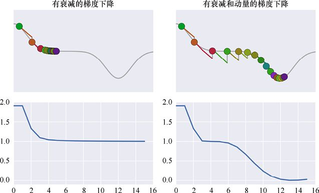

> **圖片描述：** 此圖對比(a)無動量停在平臺與(b)有動量穿過平臺。

(a)　　　　　　　　　　　　　　　　　　　　　　　　　　　　　　　　　(b)

圖19.34　圖19.33的誤差曲線上的梯度下降。兩幅圖都顯示了16個步驟。(a)有衰減的梯度下降。當我們到達平臺時，梯度變為0並且進度停止。(b)具有衰減和動量的梯度下降（對角線之後討論）。球在平臺上滾動一會兒，損失能量並減速。但它在停止之前到達了下一個山谷，讓它有機會進入山谷並達到最小誤差

圖19.35直觀地展示了這個想法。我們假設一些權重具有值*A*，並將其更新為值*B*，我們現在想要找到權重的下一個值，稱之為*C*。為了找到*C*，我們找到應用於點*A*的變化，也就是移動到誤差表面後，將我們帶到*B*點的變化。這就是動量，標記為*m*。

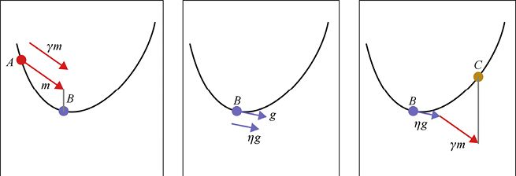

> **圖片描述：** 此圖說明動量梯度下降的三步驟。

(a)　　　　　　　　　　　　　　　　　　　　　　　 (b)　　　　　　　　　　　　　　　　　　　　　　　(c)

圖19.35　具有動量的梯度下降步驟。(a)當我們在*B*點時，回顧前一個點*A*並找到“動量”或者說是應用於*A*點的變化。我們稱之為“*m*”。這個動量由*γ*縮放，是一個從0到1的數，標記為*γm*的較短的箭頭。(b)與基本梯度下降一樣，我們在*B*處找到梯度並將其縮放*η*。(c)從*B*點開始，我們根據縮放的梯度*ηg*與縮放的動量*γm*，給出新的*C*點

我們將動量*m*乘以通常用小寫希臘字母*γ*（gamma）表示的比例因子。有時這被稱為**動量放縮因子**（momentum scaling factor）。這是從0到1的值。將*m*乘以該值可以得到一個新的箭頭*γm*，它指向與*m*相同的方向，但長度相同或更短。然後我們像之前那樣在*B*處找到縮放的梯度*ηg*。為了找到*C*點，我們將縮放的動量*γm*和縮放的梯度*ηg*加到*B*點上。

讓我們看看這個動作。圖19.36展示了我們之前的對稱波谷，以及使用指數衰減規劃和動量訓練的連續步驟。這就像我們在圖19.21中的序列一樣，但現在每個步驟的更改還包括動量，或者說從上一步驟開始的變化的縮放版本。我們可以通過從每個點發出的兩條線來看到這一點（一條用於梯度，另一條用於動量），然後一同構成了新的變化。

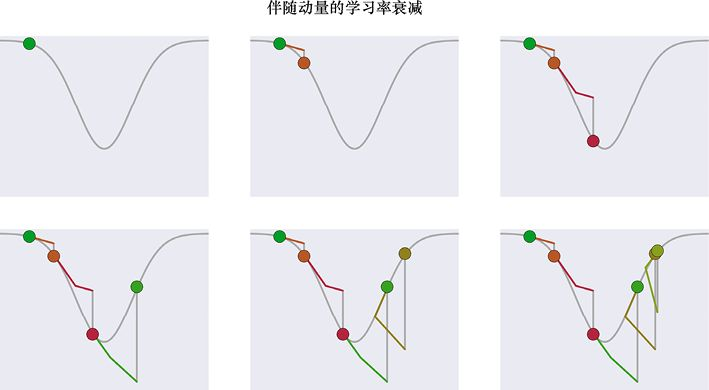

> **圖片描述：** 此圖展示衰減加動量的前6步。

圖19.36　使用指數衰減和動量的學習過程。每一步的變化由縮放梯度（由離開點的第一條線表示）與一些之前的變化（由第一條之後的線表示）的和給出

因此，在每個步驟中，我們首先找到梯度並將其乘以學習率*η*的當前值，如以前做的那樣。然後找到之前的變化，用*γ* 縮放它，並將這兩個變化添加到權重的當前位置。這種組合形成了我們在這一步中的變化。

圖19.36中的最後一步，以及沿途每個點的誤差如圖19.37所示。

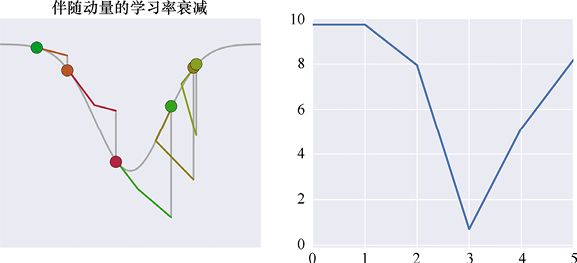

> **圖片描述：** 此圖展示動量學習最終步驟和誤差。

圖19.37　圖19.36中的最後一步，以及沿途每個點的誤差

這裡發生了一件有趣的事情：當球“滾上”山谷的右側時，即使梯度指向下方，它仍繼續向上滾動。這正是我們對真實的球的期望。我們可以看到它減速，然後最終它會沿斜坡下滑，超過底部，但比之前超過得少，然後減速並再次回落，以此類推，直到它最終落入山谷的底部。

如果使用了太多的動量，我們可以直接從另一側“飛出”山谷，但動量太小，我們可能無法穿越沿途遇到的平臺。圖19.38展示了誤差曲線，它包括圖19.33的平臺。在這裡，使用*γ* 值來縮放動量，使得我們可以通過平臺，但仍然可以在山谷底部達到最小值。

尋找合適的動量是另一項任務，我們需要運用自己的經驗和直覺以及試驗來了解特定網路的行為以及正在使用的資料。我們也可以使用超參數搜索演算法進行搜索。

因此，將所有這些放在一起，可以找到梯度，通過當前學習率*η*對其進行縮放，添加先前由*γ*縮放的變化，這便給了我們新的位置。

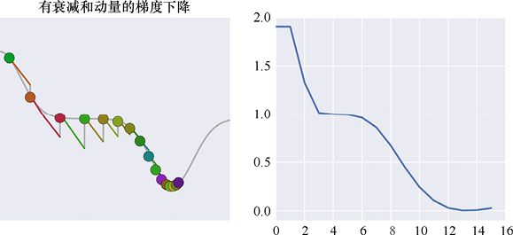

> **圖片描述：** 此圖展示動量穿過平臺後穩定在最小值處。

圖19.38　使用足夠的動量穿過平臺，但不能太多，以免我們不能很好地留在底部的最小值處。我們可以看到誤差曲線中的最小值略微超調，但通過後來的迭代將回到最小值

如果將*γ*設置為0，就不需要添加任何之前的步驟，並且我們會有“普通”（或“vanilla”）GD。如果*γ*設置為1，那麼我們將添加上一個更改的全部內容。我們經常使用大約為0.9的值。在上圖中，我們將*γ*設置為0.7以更好地說明該過程。

圖19.39展示了15個點使用學習率衰減和動量學習的過程。“球”從左側開始，向下滾動，然後沿右側向上，然後再次向下滾動並衝上左側，不斷重複，每次爬升少一點。

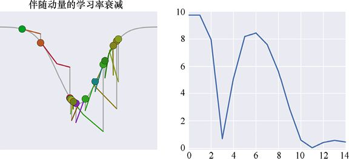

> **圖片描述：** 此圖展示15步動量學習，振盪幅度遞減。

圖19.39　15個點使用學習率衰減和動量的學習過程

動量有助於我們克服平坦的平臺和鞍部的淺層。它還有額外的好處，那便是可以幫助我們壓縮陡坡。所以即使學習率很小，我們也可以在那裡有一些效率。如上所述，使用過大的動量值存在風險，但適度使用通常會有所幫助。

圖19.40展示了對圖19.26中的資料集進行訓練的誤差，該資料集由兩個半月組成。我們正在使用具有動量的mini-batch梯度下降。它比圖19.30的mini-batch曲線更嘈雜，因為動量有時會使其超過我們想要的位置，導致誤差加劇。在圖19.30中給資料單獨使用mini-batch梯度下降時，誤差大約需要5000個epoch才能達到0。使用動量，我們在600多個epoch後達到0。

動量顯然有助於我們更快地學習，這是一件好事。

但動量給我們帶來了一個新問題：選擇動量值*γ*。正如前文提到的，我們可以用經驗和直覺來選擇這個值，或者將其視為超參數並搜索能夠給我們帶來最佳結果的值。

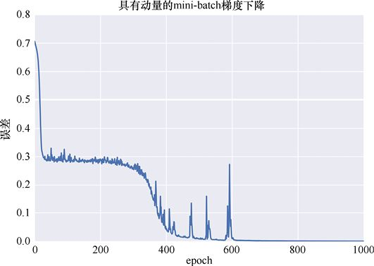

> **圖片描述：** 此圖展示動量mini-batch誤差，約600 epoch達0。

圖19.40　使用具有動量的mini-batch梯度下降訓練雙半月資料的誤差曲線。我們在600多個epoch時達到0誤差

### 19.5.2　Nesterov動量

動量讓我們可以利用過去的資訊來幫助訓練。現在讓我們考慮一下未來。

其關鍵的想法在於，不是在我們當前所在位置使用梯度，而是在將要到達的位置使用梯度。然後可以使用一些“未來的梯度”來幫助我們。

因為我們無法真正預測未來，所以需要估計下一步將在哪兒並在那裡使用梯度。我們的想法是，如果誤差表面相對平滑，並且估計非常好，那麼在預估的下一個位置的梯度將接近我們實際上只是使用標準梯度下降移動（有或沒有動量）到達的位置的梯度。

為什麼使用未來的梯度很有用？假設我們從山谷的一側向下滾動並接近底部。在下一步，我們將超過底部並最終到達另一側的某個地方。正如之前看到的那樣，動量會讓我們爬上那一側幾步，隨著動量的失去而放慢速度，直到我們轉身再回來。但是如果可以預測我們會到那邊那麼遠的地方，那麼現在在計算中包含一些那個點的梯度，就不用移動到右邊的那麼遠位置，未來的向左推動趨勢會使移動距離稍近一些。所以我們不會過沖那麼多，並且最終將更接近山谷的底部。

換句話說，如果要做的下一步移動與其上一步移動方向相同，那麼我們現在邁出更大的一步。如果下一步移動會使我們後退，那應採取更小的步幅。

讓我們把這個過程一步步地分解，這樣就不會在估計和實際之間混淆。圖19.41展示了該過程。和以前一樣，我們想象從位置*A*的權重開始，在最近的更新之後，到達*B*處，如圖19.41a所示。與動量一樣，我們發現在*A*點應用的變化將帶到*B*（箭頭*m*），此時用*γ*來縮放它。

現在出現了新的部分，如圖19.41b所示。我們不是在*B*處找到梯度，而是立即將縮放的動量添加到*B*以獲得“預測點”*P*。這是我們對下一步結束點的猜測。如圖19.41c所示，我們在點*P*處找到梯度*g*，並像往常一樣對其進行縮放以獲得*ηg*。現在我們通過將縮放的動量*γm*和縮放的梯度*ηg*加到*B*來找到圖19.41d中的新點*C*。

這有點瘋狂，因為我們根本沒有在*B*點使用梯度。我們只是結合了一個縮放版本的讓我們到達*B*的動量，以及預測點*P*的梯度的縮放版本。

注意，圖19.41d中的*C*點比正常動量得到的值更接近山谷底部。通過展望未來看到我們會在山谷的另一邊，便能夠使用左指向梯度來防止在那邊滾太遠。

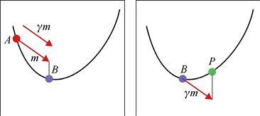

> **圖片描述：** 此圖說明Nesterov動量的(a)(b)步驟。

(a)　　　　　　　　　　　　　　　　　　　(b)

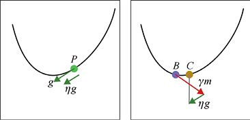

> **圖片描述：** 此圖展示Nesterov動量的(c)(d)步驟。

(c)　　　　　　　　　　　　　　　　　　　(d)

圖19.41　具有Nesterov動量的梯度下降。有4個步驟。(a)與具有動量的梯度下降一樣，在*B*點時，我們回顧前一個點*A*以找到在*A*點計算的變化值。這是動量*m*，我們用*γ*來縮放它得到*γm*。(b)將縮放的動量添加到*B*，以給我們一個新的“預測點”*P*。(c)我們在*P*處找到梯度。像往常一樣，我們稱之為*g*，並按學習率*η*來縮放它得到較小的箭頭*ηg*。(d)從*B*點出發，添加縮放的梯度和縮放的動量，為我們提供新的*C*點

為了紀念開發這種方法的研究人員，我們將其稱為Nesterov**動量**（Nesterov momentum）或Nesterov**加速梯度**（Nesterov accelerated gradient）[Nesterov83]。它基本上是我們之前看到的動量技術的加強版本。雖然我們仍然需要為*γ*選擇一個值，但不必選擇任何新參數。這是一個很好的演算法示例，可以提高性能，而無須進行更多的工作。

在小山谷測試案例中，使用Nesterov動量的前6個步驟如圖19.42所示。

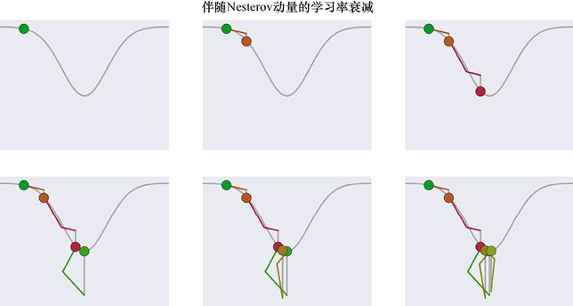

> **圖片描述：** 此圖展示Nesterov動量加衰減的前6步。

圖19.42　利用Nesterov動量與學習率衰減來下山。在每個步驟中，如果我們繼續當前的運動，就會使用預測到的點的梯度

圖19.43展示了圖19.42的最後一步及其誤差。

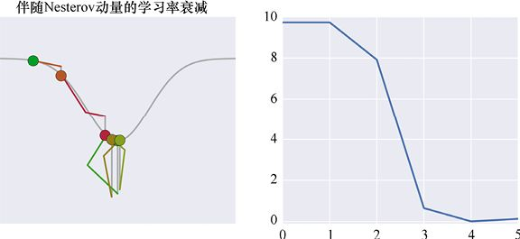

> **圖片描述：** 此圖展示Nesterov動量最終步驟和誤差。

(a)　　　　　　　　　　　　　　　　　　　　　　　　　　　　　　　　 (b)

圖19.43　使用Nesterov動量和學習率衰減的學習過程。(a)圖19.42中的最後一步。(b)沿途每個點的誤差

15個點後該過程的結果如圖19.44所示。

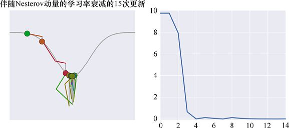

> **圖片描述：** 此圖展示15步Nesterov動量，約7步後穩定在底部。

圖19.44　在15個點運用Nesterov動量。它在大約7個點之後找到了山谷的底部，然後停留在那裡

使用Nesterov動量的標準測試案例的誤差曲線如圖19.45所示。與圖19.40中僅使用動量的結果相比，它使用了完全相同的模型和參數，但它的噪聲和效率都較低，誤差在epoch約為425時下降到0左右。

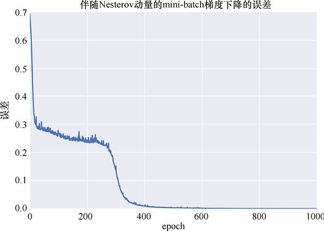

> **圖片描述：** 此圖展示Nesterov動量mini-batch誤差，epoch≈425達0。

圖19.45　具有Nesterov動量的mini-batch梯度下降的誤差。系統在epoch約為425時達到0誤差。該圖展示了1000個epoch

任何使用動量的時候，Nesterov動量都絕對值得考慮。它不需要其他參數，但通常學得更快，噪聲更少。

### 19.5.3　Adagrad

我們已經看到兩種類型的動量，這有助於推動我們通過平臺並減少過沖。

當更新網路中的所有權重時，我們一直使用相同的學習率。在本章的前面部分，我們提到了使用針對每個權重單獨定製的學習率*η*的想法。

有幾個相關的演算法採用了這種想法。它們的名字都以“Ada”開頭，代表“適應性”。

我們將從一個名為Adagrad的演算法開始，該演算法是**自適應梯度學習**（Adaptive Gradient Learning）[Duchi11]的縮寫。顧名思義，該演算法能夠適應（或改變）每個權重的梯度規模。

Adagrad為我們提供了一種以權重為基礎進行學習率衰減的方法。對於每個權重，Adagrad採用我們在更新步驟中使用的梯度，將其求平方（即將其與自身相乘），並將其添加到移動總和中。然後將梯度除以從該和得到的值，得到隨後用於更新的值。

因為每個步驟的梯度在加入之前都需要求平方，所以加到總和中的值總是正的。結果，這種運行總和隨著時間的推移變得越來越大。

由於總和隨著時間的推移變得越來越大，我們將每個變化除以該增長的總和，每個權重的變化隨著時間的推移變得越來越小。

這聽起來很像學習率衰減。隨著時間的推移，權重的變化會變小。這裡的不同之處在於，學習的減速是根據每個權重的歷史記錄唯一計算的。

因為Adagrad有效地自動計算每個權重的學習率，所以我們用來使用的學習率並不像早期演算法那樣重要。這是一個巨大的好處，因為它使我們免於處理微調誤差率的任務。我們經常將學習率*η*設置為0.01之類的小值，然後讓Adagrad開始處理。

圖19.46展示了Adagrad在測試資料上的性能。

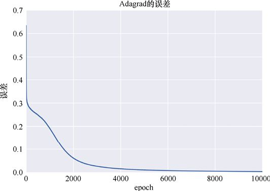

> **圖片描述：** 此圖展示Adagrad誤差，epoch≈8000達0，後期收斂緩慢。

圖19.46　Adagrad在測試資料中的性能。它在一開始就下降了很多，然後慢慢地在epoch約為8000時找到了一條達到全局最小值0的路徑。該圖展示了10000個epoch

這與大多數其他曲線具有大致相同的形狀，但是需要很長時間才能達到0。

因為梯度的總和隨著時間的推移變大，所以最終我們會發現將每個新梯度除以與該總和相關的值能得到接近0的梯度。這就是為什麼在它嘗試解決最後一些殘留誤差時Adagrad的誤差曲線下降得如此緩慢的原因。

我們可以做少量工作來解決這個問題。

### 19.5.4　Adadelta和RMSprop

Adagrad的問題在於，我們應用於每個權重更新步驟的梯度越來越小。那是因為運行總和變得越來越大。

若不是累積自訓練開始以來的所有平方梯度，我們為這些梯度保持一個**衰減總和**會怎樣呢？

我們可以將其視為保持最近梯度的運行列表。每次更新權重時，我們將新梯度添加到列表的近端，並將最舊的梯度從遠端刪除。為了找到我們用來除新梯度的值，我們會將列表中的所有值相加，但還要先將它們全部乘以一個基於它們在列表中的位置的數字。最新的值乘以一個較大的值，而最舊的值乘以一個非常小的值。這樣，我們的運行總和最大程度上取決於最近的梯度，而它受較舊梯度的影響較小[Ruder16]。

通過這種方式，梯度的運行總和（以及因此我們將新梯度除以的值）可以基於我們最近應用的梯度上下移動。

該演算法稱為Adadelta [Zeiler12]。這個名字來自“自適應”，就像Adagrad一樣，而“delta”指的是希臘字母d（delta），數學家經常用它來指代有多少東西被改變。因此，該演算法使用該加權運行總和自適應地改變在每一步上更新權重的程度。

由於Adadelta單獨調整了各個權重的學習率，任何在陡坡上停留一段時間的權重都會被衰減，因此它不會大得離譜，但當權重在較平坦的部分時，它可以採取更大的步幅。

和Adagrad一樣，我們的學習率經常以大約0.01的值開始，然後讓演算法從那時起調整它。

圖19.47展示了Adadelta在測試資料中的結果。

> **圖片描述：** 此圖展示Adadelta誤差，epoch≈2500達0。

圖19.47　使用Adadelta對測試資料進行訓練的結果。相比於Adagrad的8000個epoch，我們在epoch約為2500處得到0誤差。該圖在epoch為3000處停止

這與Adagrad在圖19.46中的表現相比毫不遜色。它很好而且流暢，在epoch約為2500時達到0，比Adagrad的8000個epoch早得多。

Adadelta的缺點是需要另一個參數，遺憾的是它也被稱為gamma（*γ*）。它與動量演算法使用的參數*γ*大致相關，但它們是完全不同的，因此最好將它們視為恰好具有相同名稱的不同概念。這裡的*γ*值告訴我們，隨著時間的推移歷史列表縮小的程度。較大的*γ*值將比較小的*γ*值更容易“記住”更遠的值，並讓它們對總和做出貢獻。較小的*γ*值僅關注最近的梯度。通常我們將此*γ*設置為0.9左右。

在Adadelta中實際上還有另一個參數，由希臘字母*ε*（epsilon）命名。這是一個用於保持計算在數值上穩定的細節。大多數庫都會將其設置為一個預設值，由程式設計師精心選擇，以使工作儘可能地有效。因此除非有特定需要，否則不應更改它。

一種與Adadelta非常相似但在數學上稍微不同的演算法稱為RMSprop [Hinton15]。該名稱是因為它使用“均方根”運算（通常縮寫為“RMS”）來確定向梯度添加（或傳播，因此名稱中有“prop”）的調整。

RMSprop和Adadelta大約在同一時間被髮明，並以類似的方式工作。RMSprop也使用一個參數來控制它“記住”多少，並且該參數也被命名為*γ*。同樣，良好的初始值約為0.9。

### 19.5.5　Adam

上述演算法都表達了保存每個權重的平方梯度列表的想法。然後，可以通過將此列表中的值相加來創建縮放因子，也可以是在縮放它們之後來創建。每個更新步驟的梯度除以該總和。

Adagrad在構建其縮放因子時給予列表中的所有元素相同的權重，而Adadelta和RMSprop將較舊的元素視為不太重要，因此對總量的貢獻較小。

在將梯度放入列表之前將梯度求平方，在數學上是有用的，但是當我們對數字求平方時，結果總是正的。這意味著我們忘記了列表中的梯度是正還是負。這是有用的資訊。因此，讓我們想象保留另一個梯度列表，其中的梯度不進行平方。然後我們可以使用這兩個列表來推導出縮放因子。

這是一種稱為**自適應矩估計**（Adaptive Moment Estimation）的演算法，更常見的名稱是Adam [Kingma15]。

圖19.48展示了Adam的表現。

輸出很棒，只是略微嘈雜，並且在epoch約為900時達到0誤差，比Adagrad或Adadelta早得多。

缺點是Adam有兩個參數，我們必須在學習開始時設置這兩個參數。

這兩個參數以希臘字母*β*（beta）命名，稱為“beta 1”和“beta 2”，寫成*β*1和*β*2。關於Adam的論文的作者建議將*β*1設置為0.9，將*β*2設置為0.999，這些值確實經常有效。

> **圖片描述：** 此圖展示Adam誤差，約900 epoch達0，效率最高。

圖19.48　測試集上的Adam演算法。該演算法在大約900個epoch後達到0誤差。這與Adadelta的2500個epoch或Adagrad的8000個epoch相比毫不遜色。該圖展示了1000個epoch

## 19.6　最佳化器選擇

這並不是已經提出和研究過的所有最佳化器的完整列表，還有很多其他的最佳化器，每個都有自己的優點和缺點。我們的目標是概述一些最流行的技術，並瞭解它們如何實作加速。

圖19.49總結了我們使用Nesterov動量的mini-batch梯度下降和Adagrad、Adadelta以及Adam這3種自適應演算法的結果。

> **圖片描述：** 此圖對比四種最佳化器誤差曲線。

圖19.49　上述4種演算法隨時間的誤差。此圖僅顯示前4000個epoch

在這個簡單的測試案例中，具有Nesterov動量的mini-batch梯度下降是明顯的贏家，Adam緊隨其後。在更復雜的情況下，情況發生逆轉，自適應演算法通常表現更好。

在各種各樣的資料集和網路中，我們討論的最後3種自適應演算法（Adadelta、RMSprop和Adam）的表現通常非常相似[Ruder16]。研究發現，在某些情況下，Adam的表現要比其他演算法好一些，所以這通常是一個很好的起點[Kingma15]。

為什麼有那麼多最佳化器？找到最好的並堅持下去是不是明智之舉？

事實證明，我們不但不知道“最佳”最佳化器，而且也不可能有適用於所有情況的最佳最佳化器。無論我們提出的“最佳”最佳化器有多好，都可以被證明總是能找到一些其他最佳化器會更好的情況。這個結論以其有趣的名字，即**無免費午餐定理**（no free lunch theorem）[Wolpert96] [Wolpert97]而聞名。這保證了沒有一個最佳化器總能比其他任何最佳化器都更好。

注意，無免費午餐定理並未說明所有最佳化器都是相同的。正如我們在本章的測試中看到的那樣，不同的最佳化器確實表現不同。該定理只告訴我們，沒有一個最佳化器能夠永遠擊敗其他最佳化器。

我們可以通過自動搜索找到任何特定組合的網路和資料的最佳最佳化器，該搜索可以嘗試多個最佳化器，可能有多組參數選擇。無論是自己選擇最佳化器及其參數還是使用搜索結果，我們都需要記住，一組網路和資料的最佳選擇會不同於下一組。

## 參考資料

[Bengio12]　Yoshua Bengio, *Practical Recommendations for Gradient-Based Training of Deep Architecture*s, in *Neural Networks： Tricks of the Trade： Second Edition*, editors Grégoire Montavon, Geneviève B. Orr, and Klaus-Robert Müller, 2012.

[Darken92]　Darken C, Chang J, and Moody J. *Learning rate schedules for faster stochastic gradient search*, Neural Networks for Signal Processing II, Proceedings of the 1992 IEEE Workshop, (September), pg 1-11, 1992.

[Dauphin14]　Dauphin Y, Pascanu R, Gulcehre C, Cho K, Ganguli S, and Bengio Y, *Identifying and attacking the saddle point problem in high-dimensional non-convex optimi- zation*, arXiv, 1-14, 2014.

[Duchi11]　Duchi J, Hazan E and Singer Y (2011). *Adaptive Subgradient Methods for Online Learning and Stochastic Optimization*, Journal of Machine Learning Research, 12, pgs. 2121-2159, 2011.

[Hinton15]　Geoffrey Hinton, Nitish Srivastava, Kevin Swersky. *Neural Networks for Machine Learning: Lecture 6a, Overview of mini-batch gradient descent*, 2015.

[IBM10]　IBM, *What Is Batch Processing*, IBM Knowledge Center, z/OS Concepts, 2010.

[Karpathy16]　Andrej Karpathy, *Neural Networks Part 3: Learning and Evaluation*, Course notes for Stanford CS231n, 2016.

[Kingma15]　Kingma D P and Ba J L. *Adam: a Method for Stochastic Optimization*, International Conference on Learning Representations, pages 1-13, 2015.

[Nesterov83]　Nesterov Y. *A method for unconstrained convex minimization problem with the rate of convergence o(1/k2)*, Doklady ANSSSR (translated as Soviet.Math.Docl.), vol. 269, pp. 543-547, 1983.

[Orr99]　Genevieve Orr. *CS-449: Neural Networks Course Notes, Momentum and Learning Rate Adaptation*, Williamette University, 1999.

[Qian99]　Qian N. *On the momentum term in gradient descent learning algorithms*, Neural Networks, 12(1), pages 145-151, 1999.

[Ruder16]　Sebastian Ruder. *An overview of gradient descent opti-misation algorithms*.

[Wolpert96]　D H Wolpert. *The Lack of A Priori Distinctions Between Learning Theorems*, Neural Computation 8, 1996.

[Wolpert97]　D H Wolpert and W G Macready. *No Free Lunch Theorems for Optimization*, IEEE Transactions on Evolutionary Computation, 1(1), 1997.

[Zeiler12]　Zeiler M D. *ADADELTA: An Adaptive Learning Rate Method*, 2012.
