# 第20章　深度學習

本章介紹深度學習網路的基本結構，並研究構成深度學習網路的多種不同類別的層。

## 20.1　為什麼這一章出現在這裡

在上冊中，我們已經為構建神經網路打下了紮實基礎。在本章中，我們將把這些知識點結合起來，並通過將人工神經元（neuron）裝入**層**中來構建一個網路。如第18章所述，這使得我們可以利用高效的反向傳播演算法來提高網路性能。由一系列層組成的網路通常則稱為**深度網路**（deep network），當這種網路對我們所提供的資料進行學習時，就稱其為**深度學習**。

我們將討論深度學習的相關術語，並研究在深度學習網路中最常用的一些層。通過案例研究，我們將探索如何構建一個新網路並對其結果加以解讀。

本章為下冊的提綱。接下來，我們將瞭解以實作不同任務為目的的各種特殊形式的深度學習。

## 20.2　深度學習概述

通過一堆層構建的神經網路通常稱為**深度網路**（也稱為高度、寬度或長度網路，但深度網路最為貼切），在使用深度網路時，我們通常會說我們正在進行**深度學習**。

**深度學習**一詞通常指的是排列成層堆棧的神經網路，而**機器學習**一詞更加常見，它包含了深度學習和其他我們已經介紹過的演算法（如第13章中的分類器），而這些演算法並不是基於神經網路進行的。有些作者會將“機器學習”和“深度學習”視為兩個不同的領域，並認為“機器學習”僅僅指那些不使用神經網路的演算法。

有的書會將神經網路包含於“機器學習”的大概念之下，而有的書則不是這樣（是將兩者分開的），因此讀者有必要花點時間分辨一下特定作者所說的深度學習的概念具體指的是什麼。

在不同層上組織神經元並構建深度學習網路有助於培養對資料進行分層分析的能力。初始的層所分析的是原始資料，之後的每一層能夠利用來自上一層神經元的資訊來處理更大量的資料。例如，在分析一張照片時，第1層通常分析單個像素，第2層會分析一組像素，第3層會分析這些像素組構成的整體，以此類推。前幾層我們可能會注意到一些像素比其他像素更黑，而在之後的層中，可能會注意到一堆像素整合起來看就像一隻眼睛，再後面的層可能會幫助我們識別出圖像的線條感，這些線條整合而成的圖像看上去像是一隻老虎。

圖20.1展示了一個3層的深度學習網路的例子。

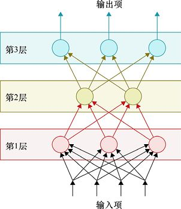

> **圖片描述：** 一個垂直排列的三層深度學習網路結構圖。底部有4個輸入項（黑色箭頭），第1層（紅色背景）有4個神經元，第2層（黃色背景）有3個神經元，第3層（藍色背景）有3個神經元，頂部有3個輸出項。每一層的每個神經元都與前一層的所有神經元相連，形成全連接結構，不同層之間的連線以對應顏色標示。

圖20.1　一個3層的深度學習網路。其中有4個輸入項流過3層，最後有3個輸出項。我們說這個網路是”全連接的”，因為每一層的每個神經元接收的輸入項都來自前一層所有的神經元

在垂直地繪製層時，輸入項幾乎總是被畫在最底部，而收集結果的輸出項幾乎總是在最頂部，如圖20.1所示。

最頂部的層（圖20.1中的第3層）稱為**輸出層**。儘管我們在使用前可能還會進一步地處理從這一層出來的值。例如，使用在第17章中見到的softmax技術，我們通常就將這一層作為神經網路的尾部，因為它包含了最後一組神經元。

我們很可能會期待在開始的地方有一個對應的**輸入層**，並且它被自然而然地認為是我們給圖20.1中第1層的名字。但這不是該術語演變的過程。有一個“輸入層”，但它幾乎不被明確地展現。不如說輸入層指的是保存輸入值的記憶體。我們可以認為圖20.1中底部那一排黑色箭頭表示的是輸入層。

圖20.1中的第1層和第2層稱為**隱藏層**。如果我們想象有人在外部從上或從下觀察這個網路，他們只能看見輸入層或輸出層。我們想象中間的層在視野中是“隱藏的”，因此稱為“隱藏層”（從側面可以看到它們，但我們就這條術語而言忽略這一點）。

有時層的堆疊是從左至右被繪製的，如圖20.2所示。

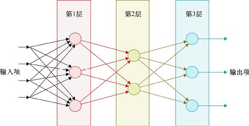

> **圖片描述：** 與圖20.1相同的三層深度網路，但改為水平（從左到右）排列。左側為4個輸入項，依次通過第1層（紅色，4個神經元）、第2層（黃色，3個神經元）、第3層（藍色，3個神經元），最後右側輸出3個輸出項。各層之間以全連接方式用彩色線段相連。

圖20.2　同圖20.1一樣的深度網路，但按照從左到右的資料流繪製

即使這樣繪製，我們仍然可以使用同垂直方向一樣的術語。作者可能會說第2層在第1層“上方”，並且在第3層“下方”。不管圖是怎麼繪製的，如果我們用“在上方”或“更高”描述更接近輸出的層，而用“在下方”或“更低”描述更接近輸入的層，就總能簡潔易懂。

### 張量

深度學習網路的機制本質上是對數字的操作，因此一個重要的資料組織概念是數字**列表**。這個列表或許會是圖20.3a所示的一維列表——簡單地識別一個又一個數字。

我們也可以將資料組織成別的形狀。例如，圖20.3b所示的二維列表非常適合存儲圖像中的像素值，我們可以稱之為**網格**（grid）或**矩陣**（matrix）；圖20.3c所示的三維列表可以存儲體資料，或者可能是多次取樣由多個特徵組成的多個樣本，我們稱之為**長方體**或**塊**（block）。

為了簡化討論，我們將一個具有任意尺寸和維數的列表稱為**張量**。“張量”這個詞在數學和物理領域有更復雜的含義，這裡我們僅用它來表示一個被組織成多維列表的數字集合。

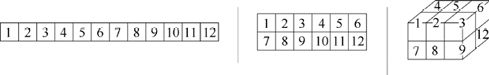

> **圖片描述：** 三個各含12個元素的張量示意圖。(a) 一維張量，為一個橫排的數字列表，元素從1到12排列。(b) 二維張量，為一個2行6列的網格（矩陣），上排1至6，下排7至12。(c) 三維張量，為一個立體長方體結構，展示了多層網格的堆疊排列。

　　　　　　　　　　　(a)　　　　　　　　　　　　　　　　　 (b)　　　　　　　　　　　　　 (c)

圖20.3　3個張量，每個有12個元素。(a)一個一維張量是一個列表；(b)一個二維張量是一個網格；(c)一個三維張量是一個長方體。在所有情況下，也包括更高維的情況下，所有結構都是被填滿了的。也就是說，所有的行、列等有著相同的長度

因此，我們經常用輸入張量（指所有輸入值）、輸出張量（指所有輸出值）以及網路內計算輸入值的新表示的其他張量。

我們說每個張量都有維數，每一維都有尺寸。總的來說，維數和尺寸構成了張量的**形狀**。

## 20.3　輸入層和輸出層

大多數網路會有一個單獨的輸入層和一個單獨的輸出層。這些標籤僅指層在網路中的位置：輸入層是在開始處（底部或左側），而輸出層是在結尾處（頂部或右側）。

正如前文提到的，輸入層不是一個神經元層，它只是一個輸入資料概念上的“佔位符”。輸入層通常由深度學習庫自動創建和維護，而我們很少直接對它進行操作。我們需要意識到這一點，有時由於我們想在網路其他部分之前處理輸入，因此可以在輸入層和網路中第一個神經元層之間放置某種處理步驟。

但是，輸出層確實包含神經元，並且在搭建網路時，我們要顯式地創建它。它的類型和結構完全由我們決定。輸出層通常沒有正式的定義，不如說，我們在網路頂部放置的任何一層都可以被稱作這個結構的“輸出層”。

### 20.3.1　輸入層

**輸入層**通常不會在深度學習網路結構圖中顯示。應當注意的是，輸入層不是神經元，因為它不對資料做任何處理。它可以簡單地被視為一組僅保存輸入值的記憶體塊，每個記憶體塊能容納一個輸入資料，如圖20.4所示。

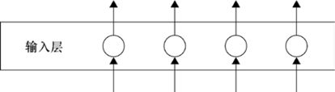

> **圖片描述：** 輸入層的示意圖，顯示一個水平長條區域標記為「輸入層」，其中包含5個白色圓圈代表資料佔位符。底部有5個向上的箭頭表示資料輸入，頂部有5個向上的箭頭表示資料傳遞到下一層。

圖20.4　輸入層僅是我們可以暫時存儲輸入資料的佔位符

有些作者隨意地用“輸入層”這個詞來描述網路中涉及處理的第一層，因此當我們遇到像“第一層”和“輸入層”這些術語時要保持警惕，以確保它們所指代的意思。

### 20.3.2　輸出層

**輸出層**是網路的結果被傳遞給網路之外的地方。

在構建網路時，我們會在輸出層選擇與所嘗試解決的問題類型相匹配的神經元數量。

如果要解決的是一個僅輸出單個數字的迴歸問題，那麼輸出層中只有一個神經元，並且這個神經元的值就是預測值。

如果我們在搭建一個二元分類器，那麼我們可以只用一個輸出值為0～1的神經元，接近0的值意味著其輸入來自一種分類，而接近1的值則表明輸入來自另一種分類。或者，我們可以用兩個輸出神經元，每個各用於一種類別，我們通常會尋找值最大的神經元，然後將對應的類別指派給該輸入。

多分類器通常具有和類別數同樣多的輸出數。例如，假如我們嘗試識別大寫的英文字母，那麼會有26個輸出神經元，每個神經元對應一個字母併為每個字母提供一個分數。我們可以選擇分數最高的輸出作為對輸入分類的最好結果，如圖20.5所示。如果我們想把這些輸出解釋為機率，則可以通過softmax步驟來實作，正如第17章討論的那樣。

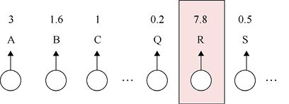

> **圖片描述：** 一個字母分類的輸出層示意圖。底部有一排神經元，頂部標示26個英文字母（A、B、C...R、S...）對應的分數值。字母R所對應的輸出神經元以粉紅色高亮標示，其分數為7.8，遠高於其他字母（A為3、B為1.6、C為1、Q為0.2、S為0.5等），表明網路判斷輸入最可能是字母R。

圖20.5　如果對單個字母進行分類，我們會有26個輸出。每個輸出都給出一個對應於那個情況的分數。在這裡，字母R得分最高

## 20.4　深度學習層縱覽

大多數庫會提供各種各樣類型的層。本節將介紹一些最常見和最有用的層。每個庫的性質會影響它提供的層及其工作方式，所以以一個庫為例來講會更容易理解。我們將以Keras[Keras16]為例來展開討論，因為它提供了一個很好的選擇，並且我們會在第23章和第24章中更詳細地介紹它。即使在這個庫中，我們的縱覽也不會是詳盡無遺的。

我們將在此總結一下每一層的基本結構和函數。大多數層有可選參數，如果我們不喜歡預設值，可以通過調參來改善它們的表現。

許多處理層有一種可用的選項是應用於神經元輸出的激活函數的選擇。回顧第17章，激活函數是我們將值傳遞出去前，應用到每個神經元輸出上的小型非線性變換。儘管在理論上，人們可以對層中的每個神經元應用不同的激活函數，但這非常少見。實際上，對於給定的層我們通常將同樣的激活函數應用到每個神經元。

接下來的概述是有意簡化的。我們之後將用整個章節來回顧其中一些層的原理和用法，而對於其他層，則會在我們用到時再討論其中的細節。

### 20.4.1　全連接層

**全連接層**也稱為FC或**密集層**（dense layer），是一組從前一層所有神經元那裡接收輸入的神經元的集合。例如，如果全連接層有4個神經元，而之前的層有4個神經元，那麼這一層的每個神經元都有4個輸入，分別來自前一層的每個神經元，總共便是4×4=16個連接。

圖20.6a所示的是一個有3個神經元、位於一個有4個神經元的層之後的全連接層。

圖20.6b顯示了用於全連接層的示意簡圖。其設計思路是頂部和底部各有兩個神經元，連線則表示它們之間的4個連接。通過圖20.6b的數字，我們可以確定層內有多少神經元。當有需要時，我們也可以在此標記該層的激活函數。

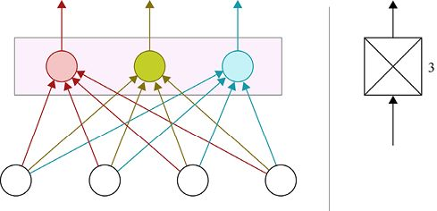

> **圖片描述：** (a) 全連接層的詳細結構圖：底部有4個白色神經元，上方紫色背景區域有3個彩色神經元（紅、黃、藍），每個上層神經元與所有4個下層神經元之間都有連線，形成全連接。(b) 全連接層的示意簡圖：一個方形圖標內有交叉線條，右側標記數字3表示該層有3個神經元，上下各有兩條線表示連接。

　　　　　　　　　　　　　　　　　　(a)　　　　　　　　　　　　　　　　　　　　　　　　 (b)

圖20.6　一個全連接層。(a)帶顏色的神經元組成了一個全連接層，較高層的每個神經元從前一層的各個神經元接收輸入。(b)用於全連接層的示意簡圖

全連接層在深度學習中被廣泛使用。有些名為**全連接網路**（fully-connected network）或**多層感知機**（Multi-Layer Perceptron，MLP）的網路，就是隻由一些全連接層堆疊而成的。

### 20.4.2　激活函數

許多層允許我們指定激活函數——該激活函數會被用於那一層的所有神經元。這個選擇通常包含許多我們在第17章見到的激活函數，如ReLU、sigmoid以及tanh等。

但我們也可以選擇在沒有激活函數的情況下創建神經元，然後在它們之後放置一個激活函數“層”。這些神經元自身不會有激活函數，但之後隨著它們的輸出傳遞到該激活層時，激活函數就被應用了。這和在創建層時確定激活函數得到的結果一樣，但它讓我們得以分開這兩個步驟，這對我們正在做的事來說或許是一種更方便的方式。

在解決分類問題時，我們常常會用一個輸出數等同類別數的全連接層結尾，然後附上一個我們在第17章見到的softmax層。這樣對輸出做了一些縮放，並確保它們加起來等於1。總之，這些步驟使得我們能將softmax層的輸出解釋為機率，如圖20.7所示。

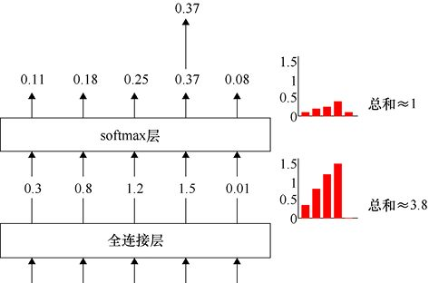

> **圖片描述：** softmax層的工作流程示意圖。底部為全連接層，輸出5個值（0.3、0.8、1.2、1.5、0.01），右側長條圖顯示這些值的總和約為3.8。經過中間的softmax層處理後，頂部輸出5個新值（0.11、0.18、0.25、0.37、0.08），右側長條圖顯示這些值均在0到1之間且總和約為1。最大值0.37被向上傳遞。

圖20.7　softmax操作改變了一組數字以便它們表示機率。使用了一個數學轉換後，每個輸出都為0～1，並且所有輸出的和約為1。在這個例子中，有5個值來自全連接層。這5個值處於0.01～1.5，且它們的和大約是3.8。經過softmax層後，這些值便處在0到1的範圍內並且和約為1

### 20.4.3　dropout

過擬合是許多神經網路會出現的問題。一旦一個網路開始記憶訓練資料並因此過擬合，我們通常都會停止訓練。任何我們用來延緩過擬合開始的技術都是一種**正則化**。正則化方法非常棒，因為它使得我們可以在過擬合前更久地訓練網路，從而帶來更好的性能。

有一種延緩過擬合的技術稱為dropout，它可以在深度網路中包含在dropout**層**[Srivastava14]內使用。dropout層不包含任何神經元。不同於softmax層，dropout層不做任何計算。相反，它僅僅是使前一層的部分神經元斷開連接。這種層僅僅在訓練時有效，當我們使用網路來預測時，dropout層是沒有影響的。

dropout層用一個參數來描述應該受影響的神經元的百分比。在每一輪訓練開始前，我們隨機選擇前一層該百分比數量的神經元，之後暫時地切斷它們同其他神經元的輸入與輸出。實際上，這些神經元就像被擱淺了一樣，每個都是一個孤島。由於它們失聯了，這些神經元不參與任何的計算和更新（updating）。當這一輪訓練結束並且權重已經更新後，這些神經元及其所有連接會被恢復。

比如，假設dropout層中該參數描述的比例是20%（一個常見值），而之前的層有100個神經元，那麼在每輪訓練開始時，我們會隨機選取20個神經元（因為100的20%是20），令它們暫時與網路分離。

當這一輪結束時，這些神經元及其連接會被恢復，就好像它們從未失聯過。之後在下一輪開始時，新的隨機神經元又會被挑選並暫時移走，類似地，在每一輪都重複這樣的過程，如圖20.8所示。

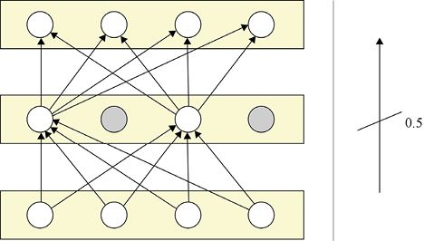

> **圖片描述：** (a) 一個三層神經網路，中間層應用了dropout比例為0.5。中間層4個神經元中有2個被標為灰色（失聯狀態），這些灰色神經元的輸入和輸出連接被暫時切斷，不參與本輪訓練。上下層的白色神經元之間仍保持連接。(b) 右側為dropout層的示意簡圖符號：一條從左下到右上的斜線，旁邊標記dropout比例0.5。

　　　　　　　　　　　　　　　　(a)　　　　　　　　　　　　　　　　　　　　　　　　　 (b)

圖20.8　dropout是如何工作的。在此我們對中間的層應用了dropout。(a)沒有顯式地畫出dropout層，而只是表現了它的效果。我們設置dropout比例為0.5，因此中間那層4個神經元中的50%被選中並在本輪訓練開始前失聯。在這裡它們被用灰色表示。實際上，它們此時不是網路的一部分。當本輪結束時，它們所有的輸入和輸出連接都會被恢復。對單個dropout層，在示意圖(b)中是一個從左下到右上的斜線，在右側我們標出了被選為失聯神經元的比例

引入dropout層的目的是防止任何一個神經元過度專門化。假設一個照片分類系統中的神經元在檢測中高度專門化。例如，針對貓的眼睛，這對識別貓臉照片是有用的，但對其他所有或許需要使用該系統來分類的照片來說是沒用的。

這種專門化很容易導致過擬合。如果網路內不同的神經元都非常擅長尋找訓練資料中的一個或兩個特徵，那麼它們能在該資料上表現得非常好，因為它們能找出其被訓練著去尋找的特有細節。但這個整體系統在沒有那些神經元專門針對的精細線索的新資料上則會表現得很差。為了避免這種專門化導致的過擬合，我們首先就要避免專門化。這就是dropout為我們做的。

通過隨機地移除神經元，有時一個已經專門化的神經元會被選中。這意味著剩下的神經元被迫要介入並承擔失去的神經元的一些責任。當該專門化的神經元重連時，就不再需要那麼多它的專門化響應，然後因此，它也可以變得更泛化。這兩個步驟都會導致神經元在響應時更加泛化，如此不易於過擬合。

換言之，dropout通過將學習分散到所有神經元上來幫助推遲過擬合。

dropout層可以跟在任何有神經元的層的後面。

### 20.4.4　批正規化

另一種正則化技術被稱作**批正規化**（batch normalization），或者可以簡稱**批歸一**（batchnorm）[Ioffe15]。像dropout一樣，批正規化可以作為網路中包含的一層來實作，但這一層也不包含神經元。與dropout不同的是，批正規化實際上做了一些計算，儘管沒有參數，也不需要我們控制。

批正規化用於修改從一個計算層產生的值，比如一個全連接層，或是我們將在下面看到的層中的一個。這看起來有點奇怪，因為層的整體目標是要學會產生能帶來好結果的輸出值。為什麼要修改那些輸出值呢？

事實證明，對一層的輸出值進行一些修改可以使那些數字更適合於即將到來的計算。例如，假設我們要用一層所有的輸出值去除以某個固定的數（比如2）那麼每個傳遞到下一層的值都會是原來的一半。由於所有值都被2除，這改變了它們的絕對大小，但不改變它們的相對大小。因此一個比其他值大3倍的值仍然大3倍。

當我們進行數學計算時，這種放縮變化不改變相對的輸出。例如，如果要實作分類，沒有做這種除法的網路中最高分的神經元在進行這種放縮操作後仍然會有最高分，因此我們仍然能夠確定相同的輸入類別。

那麼這種放縮的意義是什麼呢？它是為了保持這些在網路中流動的值不變得過大。回顧在第9章中關於正則化的討論，我們看到保持這些值較小有助於推遲過擬合。

批正規化中用來放縮值的技術與我們在第12章介紹的技術很相似。當時，想要為機器學習準備資料時，我們經常想使資料標準化。也就是說，我們移動和放縮那些值，使它們的平均值為0，標準差為1。

對於批正規化的一般直覺是，如果對輸入層進行資料正規化是個好主意，那麼對內部層進行正規化也會是一個好主意。批正規化就是這樣做的，移動和放縮來自一層的資料，這樣資料的平均值就為0、標準差就為1，即賦予了它正確的屬性，這樣下一層就能輕鬆而有效地處理它。

上文解釋了“批正規化”中的“正規化”。“批”的部分則是由於我們在收集了所關注的一層整個批次的輸出後再應用這個步驟。正如我們在第8章所討論的，實踐中“批”幾乎總指的是mini-batch——這個比整個訓練集小得多的部分。

可以通過在一個計算層之後、其激活函數之前放置一個批正規化層（normalization layer）來使用這種技術。因此我們首先要創建不含激活函數的計算層，緊隨其後的是批正規化層，然後才是激活函數層，如圖20.9所示。

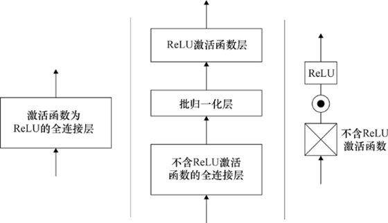

> **圖片描述：** (a) 應用前：一個標示「激活函數為ReLU的全連接層」的方塊。(b) 應用後的分解圖：底部為「不含ReLU激活函數的全連接層」，中間為「批歸一化層」，頂部為「ReLU激活函數層」，三者由箭頭依序連接。(c) 使用示意簡圖表示的版本：底部為不含ReLU激活函數的全連接層圖標，中間為批正規化圖標（一個點在圓圈中心），頂部為ReLU激活函數層。

　　　　(a)　　　　　　　　　　　　　　　　　　　　　　　(b)　　　　　　　　　　　　　　　　　　　 (c)

圖20.9　如何應用批正規化層。(a)“應用之前”圖示，顯示了一個激活函數為ReLU的全連接層。(b)“應用之後”圖示，我們從它本來的層中移動了ReLU激活函數，並在二者之間放置了一個批正規化層。(c)是對(b)中網路的示意圖版本。我們從一個不含ReLU激活函數的全連接層開始，緊隨其後的是批正規化圖標，然後是ReLU激活函數層。批正規化圖標表明，由黑色圓圈表示的資料是正規化的，因為它以較大的圓圈為中心並能很好地匹配那裡的大小

因此，批正規化層收集了一個批次經一個層處理流出的所有值，然後正規化了那些值。也就是說，它們有平均值0和標準差1。

這可以防止從該層出來的值漂移到非常大或非常小的區域。或者擴展（或壓縮）太多。這個操作有助於保持那些值更接近激活函數最有用的非線性區域。

這樣做的結果是推遲了過擬合的發生，使神經網路能夠訓練更長時間。

### 20.4.5　卷積層

**卷積層**（convolutional layer）最著名的應用是處理二維圖像。例如，基於卷積的神經網路被用於在照片中識別人臉。卷積對於一維序列、三維長方體甚至更高維的資料也有用。我們將在第21章更仔細地研究卷積。

而現在，讓我們大致瞭解一下整體情況。我們將在二維圖像上考慮卷積。除了這個輸入圖像之外，我們還會創建第二個微小的圖像，可能小到3像素×3像素。我們稱這個小圖為**過濾器**（filter）。

現在我們可以把這個小的方形過濾器移到整個輸入圖像上。對於輸入的每個像素，我們將把3像素×3像素的圖像放在它的中心，然後將3像素×3像素過濾器中每個像素的值與其下方輸入圖像對應像素的值相乘。我們將把那些和值加起來，然後就變成了輸出圖像中那個像素的值。

如果我們有兩個過濾器，那麼會產生兩個輸出圖像，每個對應一個過濾器。我們可以有3個或者300個過濾器，每個過濾器都遵循一樣的過程併產生一個輸出圖像。

該過程背後的直觀感受是每個過濾器都在圖像中“尋找”某個特定特徵，如老虎的條紋或人的胎記。由於這些過濾器在整個圖像上移動，它們可以在圖像的任何地方找到其正在尋找的元素。如果我們運用多個卷積層，一個跟著另一個，它們可以分層工作，那麼每一層都將使用前一層的結果來幫助它尋找更大的特徵。

圖20.10展示了一個二維卷積層的例子，它包括一個5像素×4像素的圖像以及兩個3像素×3像素的過濾器。我們把3像素×3像素過濾器的中心輪流放在5像素×4像素圖像的每個像素上，將過濾器的每個像素乘以其下面圖像的值，然後將結果都加在一起，得到該過濾器輸出中那個像素的值。此時，如果濾波器的任意像素超過了輸入圖像的邊界，我們只用一個0來表示輸入圖像沒有的值。

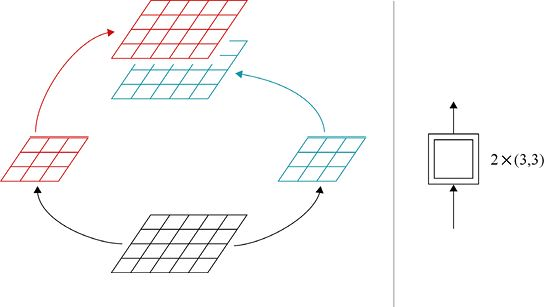

> **圖片描述：** (a) 卷積操作的運作過程：底部為一個5x4像素的黑色網格輸入圖像，左側和右側各有一個3x3像素的小過濾器（紅色和藍色），箭頭指向對應顏色的輸出圖像。紅色過濾器產生紅色輸出圖像，藍色過濾器產生藍色輸出圖像。(b) 卷積層的示意簡圖：一個大方框內套著一個小方框，標記「2×(3,3)」表示使用2個3x3大小的過濾器。

　　　　　　　　　　　　　　　　(a)　　　　　　　　　　　　　　　　　　　　　　　　　　　　 (b)

圖20.10　一個卷積層對輸入圖像應用一個或多個更小的圖像。在此我們有一個5像素×4像素的初始圖像和兩個3像素×3像素的過濾器。(a)我們使紅色的3像素×3像素過濾器在輸入圖像上移動，將過濾器的中心放置在輸入的每個像素上。然後用下面像素的值乘以過濾器的值，加和後的結果給了我們紅色輸出圖像對應像素的值。對藍色的過濾器也進行同樣的流程，產生藍色的輸出圖像。(b)卷積層的示意圖是一個套在大方框裡的小方框，意在暗示小圖像在大圖像上移動。在右側我們指出用了多少個這樣的小圖以及它們的尺寸。如果需要的話，我們也能指明該層的激活函數

我們會在第21章更細緻地研究這個過程，第21章完全用於討論基於卷積的神經網路。

二維卷積對處理圖像來說是很好的，它經常出現在圖像處理（image processing）網路中。許多庫也提供了其他維數的卷積，例如一維和三維。

### 20.4.6　池化層

**池化層**（pooling layer）讓我們能改變在網路中傳遞的資料的尺寸。當我們想減小圖像的尺寸以便能更快地處理它時通常使用這個過程。

假定我們有一個512像素×512像素的輸入圖像。那是百萬像素的1/4，有很多的資料需要處理。

在這個512像素×512像素的圖像上運用一個池化層是有用的，這樣它就可以處理像素級的細節。下一層可以操作256像素×256像素的版本，再下一層可以是128像素×128像素的版本，以此類推。

為了做到這一點，我們可以減小圖像的尺寸。假設我們從左上方2像素×2像素的塊中提取最大的值，然後將其寫入新圖像的左上角。現在我們向右移動兩個像素然後選擇下一個2像素×2像素的塊，以此類推，如圖20.11所示。

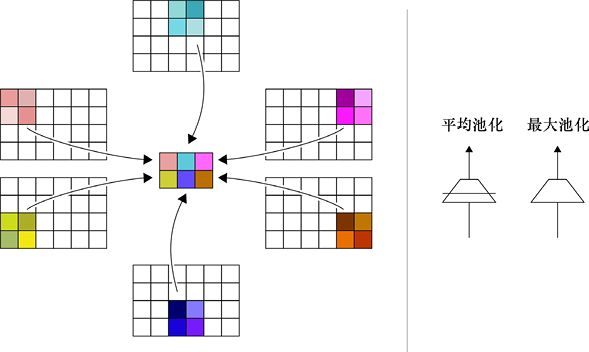

> **圖片描述：** (a) 池化操作的詳細過程：左側展示多個從原始網格圖像中提取的彩色2x2小區塊，箭頭指向中央一個縮小的網格圖像，每個區塊被替換為一個代表值（平均值或最大值）。右側顯示對應的彩色輸出小區塊。(b) 池化層的示意簡圖：左側為平均池化圖標（倒三角形），右側為最大池化圖標（倒三角形），分別標注「平均池化」和「最大池化」。

　　　　　　　　　　　　(a)　　　　　　　　　　　　　　　　　　　　　　　　　　　　　　　　　(b)

圖20.11　一個池化層。(a)對一個二維圖像進行池化操作時，我們收集小塊（通常是正方形），然後用它們資料的某個版本（通常要麼是均值，要麼是最大值）作為一個全新的、更小的圖像的值。(b)池化示意圖。池化的符號意味著輸入邊長的減小，圖中的兩個版本分別表示平均池化與最大池化

池化操作的結果是得到一個邊的尺寸只有原來一半的新圖像。如果我們使用3像素×3像素的塊，那麼新圖像每條邊只有原來的1/3。

在池化操作中，使用每個資料塊的最大值通常是產生一個更小圖像的好辦法，而使用資料塊的均值也很流行。大多數庫提供了至少這兩種選擇。像卷積層一樣，我們也可以在多種維度的資料中使用池化層，如一維、二維和三維。

池化層常用在卷積層之後，用來製作尺寸越來越小的輸入圖像。但這種方法正逐漸“失寵”，因為卷積層（見第21章）也可以減小圖像尺寸。讓卷積層來減小圖像尺寸通常比池化層更有效，甚至能夠得到更好的結果與更快的訓練速度。

### 20.4.7　循環層

世界上有許多有趣的**序列**——幾天內的股票價格、能編成歌曲的調子、一件設備的測量資料、能連成電影的幀畫面或者是一段口頭或書面語言的詞。我們很自然地想問些關於這些序列的問題，比如它們是否與某些其他序列相似（例如，這本書與另一本書是同一個作者寫的嗎?）、如何用其他方式表達它們（例如，如何將一串詞語翻譯為另一種語言？）或者它們在未來的表現可能會如何（例如，明天的股票價格會是多少?）。

給目前為止我們已經見過的層配以正確的結構而組成的神經網路可以解決這些問題。但那些網路的傳統問題是它們沒有**記憶力**，這意味著它們利用**上下文**的能力很差，而這對我們回答有關序列的問題是很重要的。例如，如果我們正在翻譯一段演講文章，可能一剎那隻考慮一個詞。它的上下文讓我們考慮之前或者之後的詞，因而我們可以做出最好的翻譯選擇。

我們可以用一個更復雜的稱為**循環單元**（recurrent unit）**（**或**循環單位**）的處理環節來代替基本的人工神經元以解決缺乏記憶力的問題。我們可以用標準層的混搭來搭建深度學習網路，並且層都由循環單元構成。如果循環單元是網路的重要組成部分，我們常常稱這個網路為**循環神經網路**或RNN。

RNN可以回答我們先前提出的所有問題以及許多其他的問題。它被用於從語言翻譯到自動配字幕甚至以已知作者風格創作新散文等各種活動。

注意，循環單元與遞歸的概念毫無關係，它們聽起來很相似，但卻是完全不同的概念。遞歸包含一個呼叫自身的函數，通常有經過修改的參數。而循環，指的是重複或**循環**的動作。一個循環單元會不斷地重複一個給定的操作，因此它是循環，而非遞歸。

我們會在第22章具體地研究循環網路（recurrent network）。目前，我們知道它們提供了一種靈活的方式來給網路增添記憶和上下文資訊就足夠了。

圖20.12a展示了一種畫循環單元的標準方法以及完整一層這樣的單元的圖形符號，圖20.12c展示了會返回一個序列的循環單元的圖形符號（見第22章）。

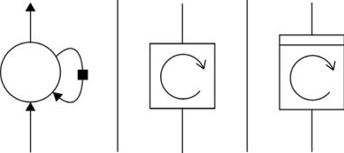

> **圖片描述：** (a) 循環單元的標準畫法：一個大圓圈代表處理單元，旁邊有一個小黑色方塊代表記憶步驟，箭頭從底部輸入、頂部輸出，並有一條反饋迴路連接回自身。(b) 完整循環層的示意簡圖：方框內有一個帶順時針箭頭的圓形符號，上下各有連接線。(c) 返回序列的循環層示意簡圖：與(b)類似但方框較寬，表示輸出為一個序列。

　　　(a)　　　　　　　　　　　　　　(b)　　　　　　　　　　　　(c)

圖20.12　循環單元。(a)一種畫循環單元的標準方法。黑色正方形代表了記憶的一個步驟。(b)完整一層這樣的單元的圖形符號。(c)返回一個序列的循環單元圖形符號

在網路中插入一個循環層時，我們要確定希望這些單元用多少記憶體。我們在如何設置與使用這些層方面會有很多選擇，詳細內容參見第22章。

### 20.4.8　其他工具層

當資料經過各個層時，我們可能需要許多有用的方法來轉換它們。為了維持“層堆疊”這個一致的隱喻，我們可以將這些轉換都打包進一個它們自己的層，然後簡單地在構建結構時把它們加入堆疊。

就像我們已經看到的dropout層和批正規化層，這些層沒有神經元（或循環單元），也不包含被更新的權重。因此，這些層不會隨著時間的推移而學習和改變。它們只是工具層，幫助我們在資料從一個計算層傳遞到下一個時調整其尺寸及修改它。將這些實用操作稱之為“層”可能是一種延伸，但將網路視為層的堆疊是非常方便的，以至於這已經變成了一種標準慣例。

接下來，我們再來看看其他幾個常見的工具層。

**正規化層**（normalization layer）通過修改流經它的資料來調整網路，或者保持權重值較小以便我們推遲過擬合。我們之前看到的批正規化層是正規化層的一個樣例。

**噪聲層**（noise layer）給流經它的每條資料增添了隨機值。這可以幫助解決免疫其他方法的過擬合，因為它可以阻止神經元對同樣的輸入資料過於熟練地總產生同樣的響應。

**重塑層**（reshaping layer）讓我們能改變流經它的張量的尺寸。例如，我們可能有一個尺寸為10×3×5的三維輸入張量，共計150個元素。我們可能想合併最後兩個維度來形成一個二維網格，以便將其作為一個圖像來處理。我們可以用一個重塑層來宣佈它現在應該被理解為一個尺寸為10×15的張量。應記住的是，“重塑”整個概念指導了每一層如何解釋輸入資料。不同尺寸的張量中元素被處理的初級細節在每一層是自動處理的。

**剪裁層**（cropping layer）在處理圖像時特別有用。它只是簡單地從圖像中提取一個矩形區域，然後把其餘部分去掉（同樣，我們可以說它去掉了一些邊框並保留了內部）。

**零填充層**（zero padding layer）常用於卷積和二維圖像。它在圖像外部放置了一個0值環——該環可以像我們所願的一樣厚。在三維情況下，它在起始的長方體周圍放置0值環。

**上取樣層**（upsampling layer）很像池化層，但它是反向工作的。它會使輸入張量更大，而非更小。這通常是通過簡單地重複元素完成的。

**平整層**（flatten layer）是重塑層的一種特殊形式，它將任意維數的輸入張量轉變成一個大的一維列表。這對於我們從一種類型的處理切換到另一種類型是有用的。例如，假設有一個二維圖像，其中有5個人，我們想知道誰在中心。我們可以用一系列的卷積層來分析圖像，但最後我們想把資料轉換為一維列表，這樣就可以把它傳給一個有5個神經元的全連接層，每個神經元對應一個人。我們會在之後加上一個softmax層，計算每個人是中間那個人的機率。這種從二維到一維的轉換就非常適合利用平整層完成。

## 20.5　層和圖形符號總結

到現在為止，我們介紹過的所有層的圖形符號如圖20.13所示。

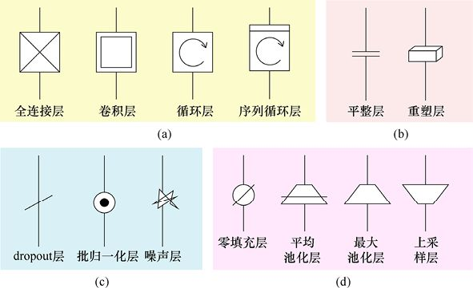

> **圖片描述：** 四組圖形符號的彙整。(a) 黃色背景：主要計算層——全連接層（交叉線方框）、卷積層（方框中有小方框）、循環層（方框中有順時針箭頭圓圈）、序列循環層（同前但較寬）。(b) 粉紅色背景：重塑層——平整層（垂直線變水平線）和重塑層（立體方塊符號）。(c) 藍色背景：工具計算層——dropout層（斜線）、批歸一化層（點在圓圈內）、噪聲層（閃電符號）。(d) 綠色背景：改變尺寸的層——零填充層、平均池化層、最大池化層、上取樣層。

圖20.13　我們介紹過的所有層的圖形符號。每個層的參數通常寫在垂直圖例的右側或者水平圖例的下側。(a)主要的計算層；(b)工具計算層，它會影響流經它們的資料或前一層的計算；(c)重塑現有資料尺寸的層；(d)通過添加、移除或組合元素來改變張量尺寸的層

其中部分層對一個樣例的作用效果如圖20.14所示。

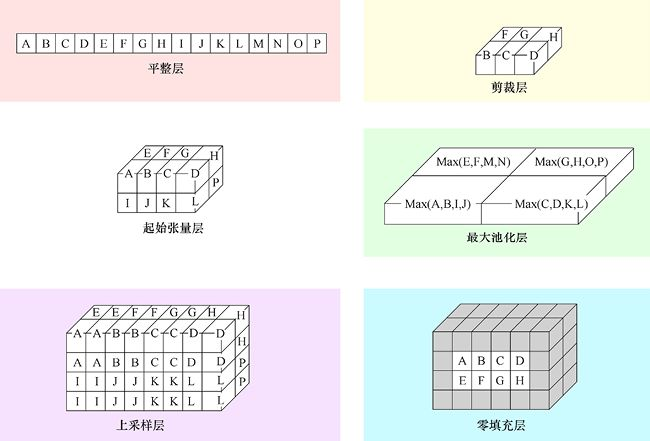

> **圖片描述：** 六個面板展示各種實用層對一個2x2x4起始張量的操作效果。左上（粉紅色）：平整層將三維張量展開為一維列表A到P。右上（粉紅色）：剪裁層從張量中擷取部分元素。左中（綠色）：起始張量的三維結構，元素標記為A到P。右中（綠色）：最大池化層對每個2x2區塊取最大值，產生較小的輸出。左下（藍色）：上取樣層將張量放大，每個元素重複以產生更大的輸出。右下（淺藍色）：零填充層在原始張量周圍添加零值邊框。

圖20.14　圖20.13中部分實用層的作用效果，以左列中間所示的2×2×4維度的起始張量層為例。大多數層有能控制它們行為的參數，此處予以省略，以免雜亂

## 20.6　一些例子

下面看一些使用這些層的例子。用現代庫構建一個神經網路就相當於按我們所想來命名層，並且一個接一個地確定合適的參數。我們可能需要負責將每個層和它的前方系統連接在一起，或者用庫處理這個問題。我們將在第23章和第24章看到很多用Keras庫搭建網路的實際例子。

讓我們從一個只有兩個全連接層的簡單網路開始，每層包括兩個神經元、兩個輸入和兩個輸出，每個神經元都有ReLU激活函數。圖20.15展示了使用圖形符號形式和傳統的文本框形式的網路。

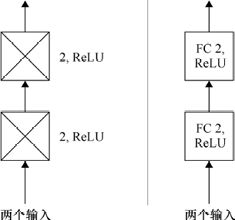

> **圖片描述：** (a) 使用圖形符號表示的網路：底部標記「兩個輸入」，兩個堆疊的全連接層圖標各標記「2, ReLU」（表示2個神經元使用ReLU激活函數），頂部有輸出箭頭。(b) 使用文本框表示的相同網路：底部標記「兩個輸入」，兩個文本框分別標記「FC 2, ReLU」，頂部有輸出箭頭。

　　　　　　(a)　　　　　　　　　　 (b)

圖20.15　一個有兩個輸入、兩個輸出以及兩層各有兩個神經元的全連接層的小型神經網路。每個神經元都使用了ReLU激活函數。(a)使用圖形符號形式的網路；(b)使用傳統的文本框形式的網路

讓我們看看有4層全連接層的、大些的網路，每層各有2、4、3、2個神經元，如圖20.16所示。

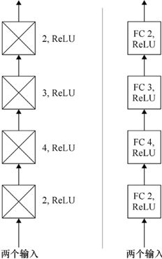

> **圖片描述：** 左側使用圖形符號、右側使用文本框表示的同一個四層全連接深度網路。底部標記「兩個輸入」，由下至上四層分別為：FC 2（ReLU）、FC 4（ReLU）、FC 3（ReLU）、FC 2（ReLU），表示各層分別有2、4、3、2個神經元，均使用ReLU激活函數。

圖20.16　一個由全連接層構成的4層的深度網路（分別用圖形符號和文本框形式表示）

我們可以搭建各種各樣的小網路，但接下來讓我們來看一個更大、更有趣的網路。這個網路有16個計算層以及一些零填充層、池化層、平整層等工具層，並應用了dropout層。擁有這樣層數規模的網路曾經算是較大的網路，但按照現在的標準它可能僅能算是個小網路。這個網路是在一個競賽中被作為一個入門級網路搭建的。

ILSVRC2014競賽是於2014年舉辦的一系列公開挑戰賽，其中一項挑戰是搭建分類器[Russakovsky15]。縮寫ILSVRC指的是“Imagenet大規模視覺識別挑戰”（Imagenet Large Scale Visual Recognition Challenge）。競賽的組織者收集了一個巨大的物體圖片資料庫，並手動為每個圖片分配了標籤來確認圖中最突出的物體。他們給參賽者提供了該資料庫中的大量資料，以便參賽者可以用這些資料來訓練網路。組織者隨後用一個不同的測試資料集測試每個參賽方案，然後公佈每支隊伍的參賽結果[Imagenet14]。

令人驚訝的是，性能最好的網路之一是一個主要由13個卷積層及鏈接其後的3個全連接層（以及一些工具層）構成的網路。該網路是由“Visual Geometry Group”提交的，因此被命名為VGG16[Simonyan14]。

圖20.17展示了用圖形符號繪製的VGG16神經網路。該網路主要是由包含零填充層的卷積層塊構成的，每個塊重複2～3次。

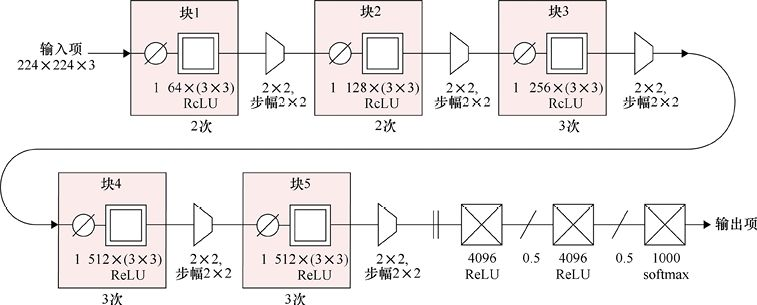

> **圖片描述：** VGG16神經網路的完整架構圖，分為兩行顯示。輸入為224x224x3的圖像。第一行包含：塊1（64個3x3卷積核，ReLU，重複2次）、2x2池化、塊2（128個3x3卷積核，ReLU，重複2次）、2x2池化、塊3（256個3x3卷積核，ReLU，重複3次）、2x2池化。第二行包含：塊4（512個3x3卷積核，ReLU，重複3次）、2x2池化、塊5（512個3x3卷積核，ReLU，重複3次）、2x2池化，接著是兩個4096神經元的全連接層（各帶0.5的dropout和ReLU），最後是1000類softmax輸出層。每個卷積塊前都有零填充層。

圖20.17　用於圖像分類的VGG16神經網路。該網路是一個長堆疊，在此限於篇幅，把它分為兩行

該網路包含5個有零填充層的卷積層塊，每個塊重複2～3次。每個塊之間有池化層來使資料的寬和高都減小一半。然後，資料被平整並傳遞到一對有dropout的全連接層中。該網路的最後一層是帶有softmax的全連接層，它為輸入圖像可能的1000種標籤各產生一個機率。

為了使用這個網路，我們向這個網路輸入一張圖像，就可以得到1000個數。這些數可以告訴我們這張圖像符合1000個可能的標籤的機率。在ILSVRC 2014競賽中，VGG16的錯誤率只有7.3%（換言之，它得到了92.7%的正確答案）。

VGG16結構的詳情參見第21章。屆時我們會討論圖20.17中出現的所有參數值，這裡僅出於完整性考慮而涵蓋了這部分內容。

下面，讓我們來看看這個系統的性能。

我們會使用VGG16來鑑定一些圖像。這些圖像都是這個網路之前沒見過的，它們混合了公共場合的圖像和一些我們在西雅圖附近趁夏日明媚拍的照片。當然，我們用了VGG16初始開發者對它們的訓練集所用的變換來預處理了每一張圖像。

圖20.18展示了一個典型結果。我們展示了一張圖像以及網路報告的排名前5的類別和分數。在這個網路中，有些標籤很長而且包含多種變體，因此我們在此僅展示了這些標籤的版本剪裁。網路不僅識別出了這張圖像是一隻熊，而且還正確地將其識別為棕熊。分數表明它幾乎完全確定該分類，而“亞軍”及其後的3位幾乎沒有上榜。

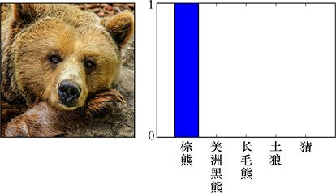

> **圖片描述：** 左側為一張棕熊近距離面部照片，右側為VGG16輸出的前5名分類結果長條圖。「棕熊」的分數接近1.0（幾乎完全確定），其餘四個類別「美洲黑熊」、「長毛熊」、「土狼」和「豬」的分數都接近0，表明網路非常確信這是一隻棕熊。

圖20.18　VGG16對一個它從未見過的圖像進行分類。排名前5的類別及其分數展示在右側。在這個案例中，VGG16幾乎可以肯定這是一隻棕熊（確實是）。為了節省空間，長標籤被裁減了。例如，第二個標籤的完整版本是“美洲黑熊、黑熊和美洲熊”

讓我們看一些其他例子。如圖20.19所示，我們會從一些動物開始。可以看到，VGG 16被訓練得不僅可以識別狗，還能分辨不同品種的狗。

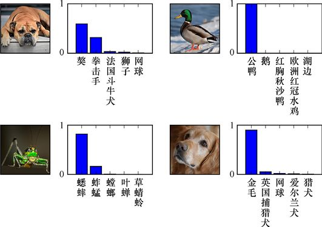

> **圖片描述：** 四張動物照片及其VGG16分類結果。左上：一隻大型犬，前5名分類為獒犬、拳擊手、法國鬥牛犬、獅子、網球，獒犬得分最高。右上：一隻公鴨在水面上，「公鴨」分數接近1.0。左下：一隻螳螂在樹枝上，前5名包含蟋蟀、蜣蜓、螳螂等。右下：一隻金毛獵犬的近照，「金毛」得分最高，其餘為英國捕獵犬、網球、愛爾蘭犬、獵犬。

圖20.19　VGG16在動物圖像上的得分

讓我們試一些別的圖像，如圖20.20所示。

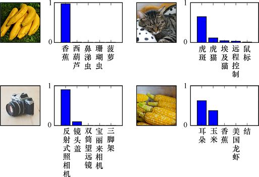

> **圖片描述：** 四張不同類型的照片及其VGG16分類結果。左上：一串香蕉，「香蕉」得分最高。右上：一隻虎斑貓，前5名包括虎斑貓、埃及貓等。左下：一台相機，前5名包含反射式照相機、鏡頭蓋等。右下：多個玉米穗，前5名包含耳朵（玉米穗）、玉米、香蕉等。

圖20.20　VGG16在另外4張圖像上的得分

這是值得注意的。哪怕是VGG16從未見過的野外拍攝的照片，即使是不同攝影師用不同設備拍攝的，有許多迷惑性的線索（如公鴨後的水和貓下面的斑點毛巾），該網路仍然能正確地識別出每張圖像，而且對這幾張圖像來說幾乎都是確信無疑的判斷。

但VGG 16也有它的弱點。它是在1000種不同類別上訓練的。這聽起來可能很多，但英語中大概有55萬到70萬個名詞[Tiago16]。這就代表VGG16還有許多完全不知道的類別。

給網路一些它從未見過的類型的圖像是很有趣的。我們可以觀察它努力地用有限的詞彙來描述這些圖像。需要注意這是個完全不公平的事。我們讓網路“叫出”它從未遇到過的物體的名字，它不可能正確叫出，因為它甚至不知道要使用的名稱。但僅僅為了好玩，讓我們來看看它是怎麼做的。

圖20.21展示了它從未見過的4種類型的物體的圖像。

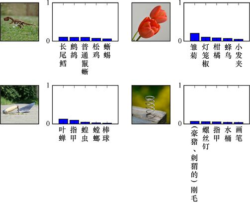

> **圖片描述：** 四張VGG16訓練時未曾見過的類型的照片及其分類嘗試。左上：一個恐龍模型，被猜測為長尾鱷、鴕鳥等，所有分數都很低。右上：紅色鬱金香，被猜為雛菊、燈籠椒等，分數不高。左下：一隻泥鏟，被猜為葉蟬、螳螂等。右下：一個金屬彈簧，被猜為螺絲釘、豪豬刺毛等。所有預測的可信度值都很低。

圖20.21　4張來自VGG16從未見過的類型的圖像。從左上角開始按順時針方向依次是恐龍模型、鬱金香、彈簧和泥鏟

看看這些嘗試是很有趣的，而且它們似乎也是有一定道理的。例如，它似乎認為泥鏟是一種昆蟲。但請注意，所有的這些預測的可信度值都很低。該網路不知道它在看什麼，但它知道它的猜測可能相當糟糕。

圖20.22所示為另外4種新類型的圖像。

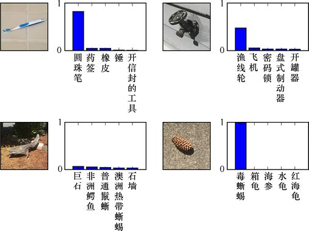

> **圖片描述：** 另外四張未知類型的照片及其VGG16分類嘗試。左上：一支牙刷，被自信地猜為圓珠筆。右上：一個室外水龍頭，被猜為漁線輪、飛機等。左下：一根木棍在地上，被猜為巨石、非洲鱷魚等。右下：一顆松果，被高度自信地猜為毒蜥蜴，且信心度相當高。

圖20.22　另外4種該網路從未見過的類型的圖像。從左上角開始順時針方向依次為牙刷、水龍頭、松果和木棍

VGG16挺確信牙刷是一支圓珠筆，這不是一個很糟糕的猜測。它有些相信那個外面的水龍頭是漁線輪。那個木棍乍一看確實有幾分像石頭或鱷魚。真正不可思議的是，這個網路幾乎肯定松果是毒蜥蜴！

只是為了好玩，讓我們給VGG16一些可笑的圖像。我們會嘗試一對墨跡、一張髒的場地的照片及一張薰衣草的照片，如圖20.23所示。

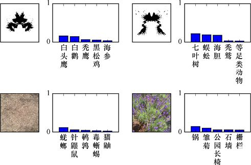

> **圖片描述：** 四張非典型圖像及其VGG16分類結果。左上：一個墨跡（類似羅夏測試），被猜為白頭鷹、白鶴等，分數都很低。右上：另一個墨跡，被猜為七葉樹、蝸牛等。左下：一張灰色髒地面照片，被猜為蛞蝓、針鼹等。右下：一片薰衣草花田照片，被猜為鍋、雛菊等。網路在所有情況下都缺乏描述這些圖像的詞彙。

圖20.23　這是VGG16對4張不是用來處理的圖像進行打分的結果。上面的兩張是墨跡。下面的兩張是髒的場地的照片（左下）以及一片薰衣草的照片（右下）。在這4個案例中，該網路盡力了，但它沒有描繪這些圖像的詞彙

VGG 16中所有值得注意的地方就是我們在圖20.17中見到的內容，沒有落下的細節、技巧或驚喜。設計的簡潔性與較深的層堆疊發揮了很好的效果。

當然，訓練這個龐大的網路是另一回事。它需要仔細地計劃並控制初始學習率（learning rate）和衰減時間。它也需要佔用大量時間。但通常只需要投入一次時間，而之後權重就可以使用了。網路結構就像是宮殿的藍圖，而權重則是裡面的王冠。

## 20.7　構建一個深度學習器

當我們想要為設計一個新的深度學習器時，第一步往往是資料準備。我們想了解資料，並在需要的時候處理它。

簡單地看原始資料來獲得初步的認識是很常見的。如果資料是文本形式，我們可能會打開一個電子表格或文本編輯器。我們想對樣本的數量、特徵的數量以及資料範圍有個印象，比如是否有明顯奇怪的條目或印刷錯誤等。

通常，我們會使用可視化工具來繪製部分或全部資料，從而更好地感受它們。我們有明顯的模式可以利用嗎？有冗餘可以消除嗎？是不是有的特徵幾乎都是空的，所以就是沒用的？我們也可以運行統計測試來幫助我們識別無法用眼睛看到的模式和趨勢，尤其是當資料維度超過3個時。

根據對資料的計劃，我們可能會變換它，或者是將已命名的特徵映射到獨熱編碼（或虛擬變量）上（見第12章）。

我們可能會應用一種或多種之前見過的無監督機器學習技術來變換資料。例如，我們可以用第12章中的PCA，通過除去或組合無關特徵來分析和簡化資料。用於神經網路的預處理的最後一步非常典型，那就是將所有特徵標準化，因而它們的平均值為0，標準差為1。

現在可以考慮一下我們想要網路做什麼，並確定組成網路結構的一系列層。這些選擇是由經驗和直覺來引導的。用資料的小子集來進行快速實驗是很有用的，可用於嘗試不同的想法，看看什麼有效。

一旦心中有了整體的結構，我們就需要為每一層選擇參數值。大多數層對於大多數參數都有有用的預設值，但我們通常希望至少重寫覆蓋其中部分值來更好地匹配資料以及我們想對它們做的處理。

然後我們要選擇超參數，或者是要應用到整個網路的值。一般來說，最重要的超參數是學習率，如我們在第18章討論的那樣。

下一步是實際運行系統，用訓練資料訓練它，再用測試資料來評估它的性能。

如果它給了我們可接受的結果，那就完成了！否則，我們就需要深入研究一下。

事實上，這是最常見的情況。構建一個很好的深度學習器大部分需要廣泛地進行測試、調整、跟隨預感、修補、嘗試更多小測試、繪圖以及考慮點線圖和圖表等。這包含了大量的嘗試和犯錯。我們為各個層調整參數，或是手動補償，或是用搜索演算法來嘗試一系列的變化。我們用同樣的方法來調整諸如學習率這樣的超參數。我們嘗試一件事，然後再嘗試另一件。我們可能會將一層的神經元數量翻倍，再去掉另一層20%的神經元，也可能在某處增加或移除一個或多個dropout層。

如果針對給定問題有一條通往構建“最好”深度學習器的“黃金之路”，那麼每個人都會遵循它。然而我們只有大量針對不同應用最終有效的結構的論文記錄。

這是如Kaggle[Kaggle16]這樣的在線機器學習競賽最具價值的一方面：基於一個給定的資料集，很多人競爭著設計能得到最好結果的學習系統。一些競賽甚至還給出了現金獎勵，比如2009年百萬美元（1美元≈6.9元人民幣）的Netflix獎[Netflix09]。由於大部分競賽都至少發佈了獲勝者的網路結構（有時是所有參賽者），我們可以看看不同的人嘗試了什麼，以及看看他們的系統是如何運作的。

然後，我們可以復現他們的方法，甚至如果開發者分享了他們最終的權重，就可以馬上投入運行。我們可以用這個模型做實驗，添加或移除一些片段以及改變一些值，從而獲得經驗並提升我們的直覺。

### 入門指南

大多數人在搭建深度學習器時面對的第一個問題是要用多少層以及每個層上應該有多少個神經元。

我們的目標是找到一個很好的關於層和神經元的平衡，這樣網路就能足夠強大，以至於可以去學習我們需要它發現的東西，但不會比這更強大（因為那樣會導致過擬合，或僅僅是在訓練或預測時浪費時間）。

我們常說希望自己的網路結構能**代表模型**。我們在上面用“模型”這個詞來指代結構和它的權重。但“模型”也指一種有幾分相似的關係，例如，一輛塑料汽車是一輛真實汽車的模型。模型是我們正在思考的東西的一個版本，但不是該東西本身。在本案例中，我們給輸入資料建立了數學模型。該模型由結構和它學到的權重組成。

總之，模型的元素組成了我們嘗試學習的東西的一種**表現形式**。一般來說，這種表現形式與實物一點都不像。一組演算法與數字不是一個真實的天氣系統、一個真人醫生或一個真正的棒球隊。但如果它能用給定的正確輸入來預測那些事物的行為，那麼它就是對我們有用的真實事物的一個版本。

我們可以按照任何喜歡的方式混合和匹配深度學習網路的層。但當只使用（或主要使用）一種層時，我們通常會用這種層的類型來命名這個網路。

讓我們回顧一下在前文看到的一些命名約定。如果神經網路主要由全連接層組成，那麼我們稱之為**多層感知機**或MLP。這個名字來源於把層內的人工神經元認為是感知機，然後明確地指出我們有幾個獨立的這樣的層。

如果神經網路很大程度上是關於卷積的（即使有一些其他類型），我們就稱之為**卷積神經網路**（convolutional neural network）或是convnet，抑或是CNN。大多數人會把圖20.17中的VGG 16模型稱為CNN。卷積神經網路的詳細內容參見第21章。

如果神經網路主要是使用循環模組來處理序列的，我們就稱之為**循環神經網路**（recurrent neural network）或RNN。循環神經網路的詳細內容參見第22章。

## 20.8　解釋結果

我們已經看到了許多不同類型的層，而且在第18章中還看到了如何使用反向傳播來改進深度網路的預測。但到底發生了什麼？我們可以解釋為什麼該網路能產生它給我們的結果嗎？

讓我們試著通過考慮得到貸款的過程來發展那種直覺。這通常是一個人一生中很重要的一件事，如果被拒絕貸款，我們通常想知道為什麼。這可以幫助我們改變現在的處境，以便之後再次申請並獲得批准。

讓我們從最初面對面申請貸款開始。當然，我們會簡化這個討論中的每個內容，這樣就可以把重點放在對這個討論有價值的步驟上。事實上，每一次申請貸款都是一件複雜的事情。

在向銀行申請貸款之前，從朋友或同事那裡借款意味著要鼓起勇氣去詢問。被問到的人會用他自己的標準來決定是否想要借給我們一筆錢，以及有什麼條件。如果他們不同意，我們可能會問他們為什麼，然後討論他們的決定的利弊。或許一方或雙方能改變對方的想法，或達成彼此都可接受的讓步。關鍵是潛在的借款方能告訴我們為什麼他們說不，因為他們知道自己的推理過程。

像銀行這樣的機構可以為汽車、家庭或企業提供大額貸款。大城市的銀行家們不會知道是否所有進來的人都要貸款，所以他們會讓申請者填寫一個申請表格。這個表格會要求申請者提供許多資料，比如需要多少錢、要多久、申請者的年收入等。信貸員會把這些都看一遍，然後根據他們的經驗來決定是否批准這筆貸款。他們可能不願意討論他們的決定，但原則上他們可以解釋為什麼決定這樣做。

隨著銀行規模的擴大，這一過程變得更加標準化。銀行裡的某個人可能有一天坐下來，面對成百上千的貸款申請，然後將它們分為兩堆：按時全額償還的優良貸款，以及銀行損失了部分或全部錢的不良貸款。根據那些貸款的申請，他們嘗試制定出能讓他們預測一個貸款最終是否會得到償還的規則。

也許他們是通過累加出一個分數來實作這一點。他們或許已經注意到申請者想要存款十倍以上的貸款常常是個壞信號，所以該分數可能會變為−10分。但如果申請者有很高的年收入，能夠輕易地償還貸款，那麼可能得分為20分，因而總分變為10分。但或許申請者的年收入全部來自不確定的股票市場，於是工作人員可能會從該分數中扣除8分。諸如此類，各種資訊都以它們自己的方式做出貢獻，直到它們彙集成最後的分數。如果最後得分為正，該貸款申請會被批准，否則會被拒絕。

這當然就和感知機所做的差不多。如圖20.24所示，輸入都被賦予權重並組合起來以產生最終的分數。

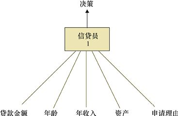

> **圖片描述：** 一個類似感知機的貸款評估示意圖。底部有5個輸入項：貸款金額、年齡、年收入、資產、申請理由，各以線段連接到中央的「信貸員1」方塊，方塊頂部向上箭頭指向「決策」輸出。這表示信貸員對各輸入因素加權後產生最終決定。

圖20.24　為了決定是否發放貸款，信貸員會從申請表中獲得資訊，然後將各種資訊用不同的數字加權來產生一個最終分數。分數值決定該貸款申請是否被批准

現在讓我們想象一下，向這位信貸員申請貸款。我們遞交了申請，之後他運用上述規則來給我們一個最終分數，該分數會告訴他是否同意該貸款。

假設我們被拒絕貸款，之後問他為什麼。這位信貸員會告訴我們關於他評分系統的事以及如何評估。通常來說，那些在某些指標上評分高而在別的方面評分低的人一般會償還他們的貸款，而不滿足那些標準的人通常不會償還貸款。我們的數字讓我們進入了後面這類。

但是，我們抗議，因為可能他忽略了許多很重要的資訊。或許我們有個很棒的農場，只是因為上個月拖拉機意外損壞才扭曲了“月收入”因素。又或者我們需要一輛新車來獲得一個已經提供給我們的工作，但工資收入要比為車買單的錢更多。我們的目的歸根結底是指出他不知道的因素或者沒有正確衡量的因素，因此我們解釋了這些並請他重新考慮他的決定。

根據他個人本身及他的職位，他可能會考慮我們的新資訊，但也可能不會。如果該信貸員像感知機一樣堅持他的流程，那麼他會重新考慮。否則，這樣做就沒意義了，因為同樣的數字出來，也會得到同樣的結果。

我們知道了被拒絕的原因，因為他向我們解釋了這一切。但是說統計情況對我們不利不是一種令人滿意的解釋。我們很可能會沮喪地走出來。

我們或許會到另一家銀行碰碰運氣。

在這家銀行，讓我們假設有5位不同的信貸員，並且每個人都制定了自己的特殊程式來評估貸款申請。我們向該銀行提交了申請，隨後5位信貸員輪流評估了申請。或許他們中的3位說“可以”，而兩位說“不行”。如果這是一個簡單多數投票，那麼我們就會得到貸款。

我們可以把這個過程繪製成一個兩層的神經網路，如圖20.25所示。輸入是申請，隨後是一個有5個神經元的層，每個神經元代表一位信貸員來閱讀輸入。每位信貸員的決定由其輸出來表徵。假設1表示批准貸款，−1表示拒絕貸款，而中間的分數表示持中立態度。

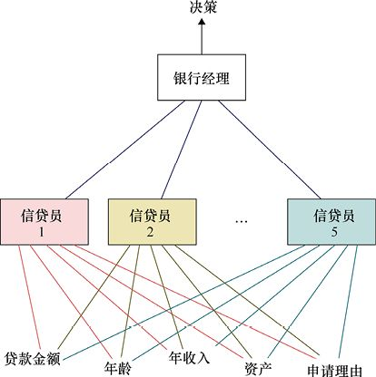

> **圖片描述：** 一個兩層神經網路類比圖。底部有5個輸入項（貸款金額、年齡、年收入、資產、申請理由），通過彩色連線連接到中間層的5個信貸員方塊（信貸員1至5），每位信貸員從所有輸入接收資訊。5位信貸員的輸出再連接到頂部的「銀行經理」方塊，最終由銀行經理做出「決策」。

圖20.25　貸款申請給了5位不同的信貸員，每位都有自己的獨特判斷。他們的分數都被銀行經理通過加權然後累計在了一起來產生一個最終分數，該分數用於決定這筆貸款是否被批准

每位信貸員的決定都會進入第二層中代表銀行經理的單個神經元。根據他對下屬的經驗，銀行經理更信任其中一些的判斷，因此他會在累計上述判斷前將每個決定乘以某個數字。和之前說的一樣，一個正的最終值意味著我們得到了貸款，而負值則意味著我們沒有得到。

因為銀行經理想確保信貸員考慮了儘可能多的資訊，他告訴每人還要考慮表格填寫的熟練程度、申請者的穿著、申請時的天氣以及一系列輔助資訊。所有的這些都可能在信貸員做決定時被考慮或被忽視。

讓我們假設銀行正在審批的貸款過多，以致銀行經理的身體都被“壓垮”了。因此他聘請了許多主管坐在信貸員和他自己之間。每位主管會做銀行經理過去做的事情，也就是評估每位信貸員的決定並組合出一個最終決定。但現在那些來自主管的決定會被傳遞給銀行經理，並由後者做最終決定。讓我們假設有5位信貸員、8位主管和1位銀行經理。那麼我們可以搭建一個3層的神經網路來表示這個過程，如圖20.26所示。

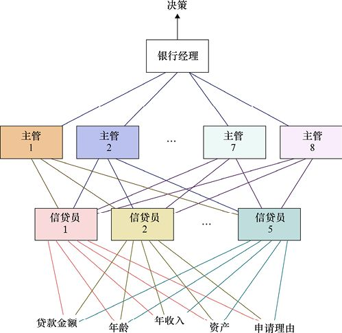

> **圖片描述：** 一個三層神經網路類比圖。底部5個輸入項（貸款金額、年齡、年收入、資產、申請理由）通過彩色連線連接到第一層的5個信貸員方塊。信貸員再通過連線連接到第二層的8個主管方塊（主管1至8，以不同顏色區分）。最後所有主管連接到頂部的「銀行經理」方塊，由其做出最終「決策」。

圖20.26　每位信貸員都向一位主管彙報他對我們申請的評估。在這個例子中有5位信貸員、8位主管以及1位銀行經理。主管向銀行經理報告他們的決策，並由後者對貸款申請做最終決定

需要注意的重點是，主管不是直接基於我們要求貸款時提供的資訊做出決定的。也就是說，他們不是看貸款金額或年收入。相反，他們關注的是信貸員的決定。例如，主管2可能覺得信貸員1太慷慨了，因此給來自信貸員1的觀點更低的權重。但主管4可能覺得信貸員1是最好的，因而給他的觀點很高的權重。本質上，每位主管關注的是信貸員的決定的統計特徵，並且嘗試用那些特徵來提出自己的評估。

因此主管結合信貸員的結果，然後將他們自己的判斷傳遞給銀行經理。現在銀行經理與我們的貸款申請資訊有兩個步驟的距離。他的最終決定是基於他如何選擇對主管的結論進行權衡。

銀行可以繼續增加越來越多層級的工作人員，每一層審核前一層的決策，並尋找統計特徵。他們或許會發現在每個新層中，統計分析變得越來越準確。假設有個中間層將他們前序過程的分數相加，就會發現最終的結果能以99.9%的準確率預測貸款是否能被償還。

這對於銀行來說是好事，但對於想要了解為什麼他們的貸款申請被拒絕的客戶來說是很糟糕的。

### 令人滿意的可解釋性

假設銀行給我們分享了其網路流程的每一步。我們可以看見每個神經元的每個計算，直到輸出神經元最終拒絕我們貸款的負值結果。這將是完全透明的，提供了所謂的**可解釋性**（explainability），意味著它解釋了結果。如果根本不能解釋這個結果，我們有時會說它來自一個**黑盒（black box）**，指的是一個不能給我們提供幫助的神秘來源。這不是我們在此遇到的情況，因為銀行已經告訴我們關於如何做出決定的一切。這對我們是有價值的解釋嗎？

假設我們發現，檢查結果中，從統計上看，那些穿著藍色襪子、在週三下午2∶00～2∶25之間、有一輛3～5年前出廠的車以及用黑色圓珠筆填寫表格的人，是房屋貸款的不良押注。我們完全滿足這些條件，所以我們被拒絕了。這可能非常正確而且是很好解釋的，但它難以令人滿意。

這些理由並不令人滿意，因為它們沒有告訴我們為什麼。這些測量結果都是隨意和無關的。從統計上來講，它們只是告訴我們結果是怎樣產生的。但我們都認為我們是獨立個體，應當基於我們自身的優劣來被評判。如果被拒絕了某事，我們應該能根據邏輯、名譽、誠信以及其他在社會背景下對我們重要的品質來申訴該決定。

但這些品質與下決定的網路無關，因為網路只關注它學到的統計資料，除此之外別無其他。

所以僅對該決定做一個解釋是不夠的。這必須是一個**令人滿意的解釋**。不同的人可能會對不同類型的解釋感到滿意。一個很多人都感到滿意的解釋會清晰地傳達決策的因素，比如，我們認為本應無關的因素（例如我們是否穿了藍色襪子）要麼被排除在外，要麼是合理的。我們希望這個解釋能告訴我們如何改變我們的處境來增加下次獲得貸款的機會。

除了作為一種解釋來說不令人滿意，基於統計的決策過程還有另一個弱點。決策是基於歷史的。讓我們假設所有這些人的分析是在3年前完成的，當時小鎮很小，資金也很緊張。在那之後小鎮蓬勃發展，有更多的錢在流動，也有更多的人，總的來說，經濟看起來很好。

如果這個銀行的管理者們對在新經濟下成功和失敗的貸款有了新的眼光，他們很可能會對如何評估貸款有非常不同的規則。但他們不能那樣做，因為他們的系統不會讓他們批准很多這樣的貸款申請。

他們能發現自己的程式已經過時的唯一方法是當許多他們批准的貸款都沒有被償還時。但同時，他們很可能已經拒絕了許多需要且能償還的人的貸款。他們傷害了這個小鎮的人，也傷害了他們自己，因為他們從來沒在他們本應批准的貸款上賺到錢。

這是讓網路為我們做決定的消極一面。他們不知道潛在的情景何時發生變化，因此他們只會在搞砸了很多事後才發現陷入困境了。

有一些方法可以解決這個問題，而且它們一直在變得更好[Samek17]，但解釋仍然很困難。為了確保系統正基於我們認為合適的標準做出決策，我們需要保持警惕[Domingos15]。

令人高興的是，在許多情況下環境的漂移和缺乏情感上令人滿意的解釋並不是什麼問題。如果我們的任務是識別照片上的動物，那麼物種進化可能會導致系統在幾千年之後開始出錯，但在短期內我們覺得沒事。許多實際的問題都屬於這個安全地帶，從分析語音請求到數字助理再到如何在雨天駕駛汽車。

當我們的決定開始影響人們時則要謹慎，因為微妙之處也能給人們的生活帶來巨大變化。學習器訓練資料的細微差別會導致該系統的結果裡有系統誤差[Zomorodi17]。現實世界是複雜的，人類和人類社會驚人地複雜。一個學習系統能處理一系列圖像或統計資料併產生某種結果並不是自然而然地意味著該系統的預測能超出訓練資料的準確性。人、人口和文化都隨著時間推移而迅速改變，週一正確的東西在週五可能就不正確了。

獲取能真正代表某些人類群體的資料，即使是一個小群體也十分困難，甚至實際中或許不能執行任何真正統一的標準[Scalas16]。因此結果資料可能會在多個方面不準確。如果我們過於認真對待那些用這種有缺陷的資料訓練出的系統結果，就會得出荒謬的結論[Wu16] [Wang17]。更糟糕的是，我們不能徹底檢查和獨立審查系統的訓練資料的質量。來自“黑盒”系統的結果可能會造成真正的傷害[Tashea17]。我們需要認真思考用什麼資料來訓練系統、如何對它們進行訓練，以及如何解釋它們的結果[Arcas17]。

這些是我們在接下來的章節裡討論深度學習方法需要注意的一些問題。

## 參考資料

[Arcas17]　Blaise Aguera y Arcas, Margaret Mitchell, Alexander Todorov, *Physiognomy’s New Clothes*, Medium, 2017.

[Domingos15]　Pedro Domingos, *The Master Algorithm*, Basic Books, 2015

[Imagenet14]　ImageNet, *Classification + localization results*, 2014.

[Ioffe15]　Sergey Ioffe and Christian Szegedy, *Batch Normalization: Accelerating Deep Network Training by Reducing Internal Covariate Shift*, Proceedings of the 32nd International Conference on Machine Learning (ICML-15), 2015.

[Kaggle16]　Kaggle Team, *Your Home for Data Science*, 2016.

[Keras16]　François Chollet, *Keras Documentation*, 2016.

[Netflix09]　Netflix Team, *Netflix Prize*, 2009.

[Russakovsky15]　Olga Russakovsky, Jia Deng, Hao Su, Jonathan Krause, Sanjeev Satheesh, Sean Ma, Zhiheng Huang, Andrej Karpathy, Aditya Khosla, Michael Bernstein, Alexander C. Berg and Li Fei-Fei, *ImageNet Large Scale Visual Recognition Challenge*, IJCV, 2015.

[Samek17]　Wojciech Samek, Thomas Wiegand, Klaus-Robert Müller, *Explainable Artificial Intelligence: Understanding, Visualizing, and Interpreting Deep Learning Models*, ITU Discoveries, Special Issue No. 1, October 2017.

[Scalas16]　Enrico Scalas and Nicos Georgiou, *Can Opinion Polls Ever Be Accurate? Probably Not*, The Conversation, 2016.

[Simonyan14]　Karen Simonyan, Andrew Zisserman, *Very Deep Convolutional Networks for Large- Scale Image Recognition*, arXiv, 2014.

[Srivastava14]　Nitish Srivastava, Geoffrey Hinton, Alex Krizhevsky, Ilya Sutskever, and Ruslan Salakhutdinov, *Dropout: A Simple Way to Prevent Neural Networks from Overfitting*, Journal of Machine Learning Research, 2014.

[Tashea17]　Jason Tashea, *Courts Are Using AI To Sentence Criminals. That Must Stop Now*, Wired, 2017.

[Tiago16]　Tiago, *How Many Nouns Are There In English?*, English-Ingles blog post, 2016.

[vandenOord16]　Aäron van den Oord, Sander Dieleman, Heiga Zen Karen Simonyan, Oriol Vinyals, Alex Graves, Nal Kalchbrenner, Andrew Senior, Koray Kavukcuoglu, *WaveNet： A Generative Model for Raw Audio*, arXiv 1609.03499v2, 2016.

[Wu16]　Xiaolin Wu and Xi Zhang, *Automated Inference on Criminality using Face Images*, arXive 1611.04135, 2016.(See also *Responses to Critiques on Machine Learning of Criminality Perceptions* at the same arXiv location).

[Wang17]　Yilun Wang and Michal Kosinski, *Deep Neural Networks are More Accurate than Humans at Detecting Sexual Orientation from Facial Images*, PsyArXiv Preprints hv28a, 2017.

[Zomorodi17]　Manoush Zomorodi, *Why Google ‘Thought’ This Black Woman Was a Gorilla*, “Note to Self” podcast, WNYC, 2017.

