# 第21章　卷積神經網路

本章研究一個深度學習框架，它使用一種被稱為卷積的操作從圖像及其他塊狀資料中提取資訊。

## 21.1　為什麼這一章出現在這裡

圖像構成了一個特殊的輸入資料類。我們用圖像和照片來交流各種各樣的東西，以達到專業、社交和個人的目的。無論我們是想標記出所愛之人的臉以便輕易地將他們從照片中找出，還是確定一張簡筆畫上是一個人還是一隻貓，抑或判斷X光照片上的一團斑點是否是需要進一步觀察的醫學問題，從圖像中提取資訊都是很重要的。

本章著重於介紹一種從圖像中提取資訊的思想——**卷積**。卷積在深度學習中很容易使用，因為它可以很容易地被封裝在一個**卷積層**中。

以卷積層為特徵的模型在處理圖像方面取得了驚人的成功。例如，它們擅長處理確定圖像是美洲豹還是獵豹、行星還是彈珠這樣的基本分類任務。我們可以認出照片中的人[Sun14]，對不同類型的皮膚癌進行檢測和分類[Esteva16]，修復如灰塵、劃痕和模糊等圖像損壞[Mao16]，以及根據人們的照片對他們的年齡和性別進行劃分[Levi15]。

這種模型在其他許多應用中也有用，比如自然語言處理[Britz15]，我們可以分辨出句子的結構，或者是將句子分為不同的類別[Kim14]。

用卷積搭建有用的網路是研究和開發的熱門話題，這之中經常出現嶄新且令人驚訝的結果。

## 21.2　介紹

卷積是一種在電腦出現之前就有的成熟的數學技巧，並且已經應用於許多不同領域。例如，在音頻處理中我們可以將卷積應用到已有的錄音上，讓它聽起來像是在一個小夜總會里、一個大音樂廳中，甚至是在戶外[Hass13]。如果我們想用AM或FM將音樂發送到無線電波中，那麼卷積會向我們展示如何構建發射機和接收機[Oppenheim96]。

儘管卷積可以用於處理多種不同類型的資料，但在本章中，我們將重點討論**圖像處理**。為了簡化討論，我們只談論**二維圖像**。在機器學習術語中，每張**圖**是一個**樣本**。灰度圖像中的每個像素都是一個單獨的**特徵**。如果圖像是彩色的，那麼每個樣本有3類特徵（每個像素處紅、綠、藍色分別對應一類）。

即使卷積層的輸入是單張圖像，輸出也會是一個三維張量（或稱為塊）。不同於用一個通道表示像素資料的灰度圖像，或由3個通道組成的彩色圖像（每個通道分別為紅色、綠色和藍色），從卷積層而來的張量可以有任意數量的通道。

如果我們真的想要可視化該張量，就可以把圖層頂層分離開並當作灰度圖像來繪製，然後對第二層做同樣的事，以此類推。考慮到這個過程，有些作者用“圖像”這個詞來指從卷積層輸出的張量，但請記住這是該術語的一種延伸。

由於卷積層通常是級聯的，一層的輸出會作為下一層的輸入，這些層的輸入和輸出可以是任意尺寸的張量。

我們會發現在一個網路中使用多個卷積層是很常見的。一個由卷積層扮演主要角色的網路被稱作**卷積神經網路**，或convnet，或者更常見地，稱作CNN。有時人們也說“CNN網路”（“冗餘縮寫綜合徵”的一個例子[Memmott15]）。

在深入研究卷積之前，我們可以用一個簡短的術語來解決對它的困惑。

### 21.2.1 “深度”的兩重含義

若我們沒有留意，一些多義詞語會令我們困惑，比如**深度**這個詞，它就有兩重含義。

每個圖都有一個尺寸，由其**寬度**和**高度**指定。它也會有**深度**。有時這指的是圖像中的位數，但更多情況下是指顏色通道數。因此，我們說一張灰度圖像的深度為1，而彩色圖像（紅、綠、藍通道各一個）的深度為3。

我們在之前的章節見到的“深度”這個詞常常指的是神經網路中的網路層數。

因此，“深度”有兩重含義，也帶來了造成困惑的機會。

當我們使用“深度”指代彩色圖像時，它指的是顏色通道數。大多數彩色圖像在每個像素處由3個數字表示，描述了那個像素承載的紅色、綠色和藍色的量，如圖21.1所示。因此我們說彩色圖像的深度為3。

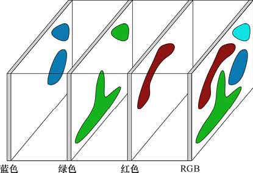

> **圖片描述：** 一個RGB彩色圖像的像素結構示意圖。每個像素由紅色(R)、綠色(G)、藍色(B)三個值組成，三個彩色平面堆疊在一起形成一個完整的彩色像素。

圖21.1　RGB輸出中的每個像素都是3個值的組合，紅色、綠色和藍色的成分各佔一個

如我們接下來將看到的，當一幅圖像被輸入一個卷積層後，它出來時會變成一個張量。在這種情況下，“深度”指的是網路中任意給定位置的張量或多維資料塊的一個維度。

有時人們用“纖維尺寸”這個術語而非“深度”來表示張量的厚度以防止混淆，但這種用法仍然很罕見。

一般來說，當談論一個張量時，“深度”指的是它的一個維度的大小。而當談論一個網路時，“深度”指的是網路層的數量。

### 21.2.2　放縮後的值之和

要討論卷積，讓我們先考慮彩色圖像中的單個像素。正如我們所討論的，每個像素包含3個數字，分別代表紅色、綠色和藍色。假設我們想要確定該像素是不是黃色的。

屏幕上的一個像素如果用光顯示，這種情況下顏色是疊加結合起來的（不同於染料，它是相減結合的）。使用光線，我們把紅色和綠色結合起來就能得到黃色。

假設一個像素的三原色都是由0～1的數字表示的。那麼為了測試一個像素是不是黃色，我們就讓紅色（縮寫為R）和綠色（縮寫為G）幾乎為1，而藍色（縮寫為B）幾乎為0。

我們想要用一個單獨的數代表“黃色”。該像素的黃色值越大，那麼這個像素就更加偏黃。

測量黃色的一種方法是找到每個像素的R+G−B。圖21.2展示了我們利用該公式從8種R、G和B的不同組合中得到的值。得分為2的黃色像素，打敗了其他所有得分為−1、0以及1的情況。

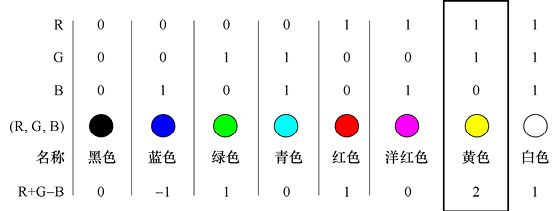

> **圖片描述：** 使用R+G-B公式檢測黃色像素的計算表格。展示8種不同的RGB組合及其計算結果，純黃色像素（R=1, G=1, B=0）得到最高分2，其他顏色組合得分較低。

圖21.2　我們可以通過將紅色和綠色值加在一起再減去藍色值的方法來檢測黃色像素。黃色像素由此可以給我們的值為2，而別的像素只有更小的值

另一種書寫R+G−B的方法是用+1分別乘以紅色和綠色，而用−1乘以藍色，然後將結果加起來：(1×R)+(1×G)+(−1×B)。這可能看起來更熟悉點，因為這個小表達式和一個人工神經元所做的工作的結構是一樣的。我們在圖21.3展示了這樣的神經元。在這種情況下，+1、+1和−1是3個**權重**，(R,G,B)對應的3個數字是3個**輸入**。每個輸入都會乘以它對應的權重，然後將結果加起來。為了完成這個類比，我們需要一個激活函數，因此將選擇沒有影響的線性函數。

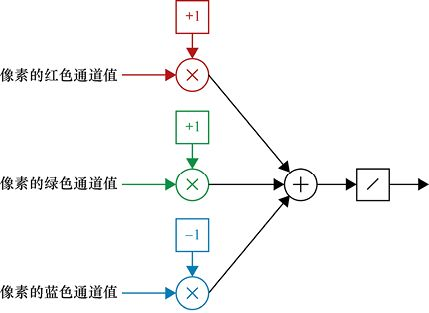

> **圖片描述：** 將黃色檢測器表示為單個人工神經元的示意圖。紅色和綠色通道各賦予+1的權重，藍色通道賦予-1的權重，激活函數為恆等函數（線性），輸出為黃色程度值。

圖21.3　將黃色檢測器表示為單個神經元。該像素的紅色和綠色通道值是賦予+1權重的輸入，而其藍色通道值則是賦予−1的權重的輸入。激活函數是恆等函數，這裡顯示的是一條短對角線，它只是簡單且不加改變地將輸入傳遞到輸出

這樣，我們便創建了一個小人工神經元來檢測一個像素是否為“黃色”。

圖21.4展示了我們剛剛描述的過程如何在整幅圖像上執行。我們把每個像素視為一個從圖像上鑽取出的由3個通道組成的“礦土樣本”。我們提取“礦土樣本”，然後將它分解為3個數字，使之成為“黃色”神經元的輸入。

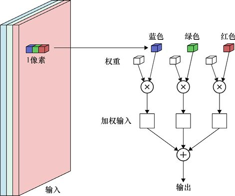

> **圖片描述：** 將黃色神經元應用到整幅圖像的過程。每個像素被提取為含3個值（R、G、B）的「礦土樣本」，作為神經元的輸入，最終產生一個新的單通道輸出圖像。

圖21.4　一種展示操作的畫法，它表示將圖21.3中的神經元應用到整幅圖像上。每個像素被提取為有3個值的“礦土樣本”，來作為神經元的輸入。這個有相等權重的操作在圖像中的每個像素上重複。其結果是一個新的單通道圖像，其中每個像素的值都對應輸入像素的黃色程度

當我們將這個神經元應用到圖像裡的所有像素後，我們通常會把這個過程想象成“掃描”這個**圖像**，將該神經元從一個像素移動到另一個，為每個輸入像素產生一個新的結果像素。這種想法如圖21.5所示。

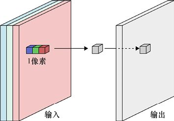

> **圖片描述：** 掃描操作的示意圖。黃色檢測神經元從左到右、從上到下地在原始圖像上移動，對每個像素進行計算，將結果存儲到新的輸出圖像中。

圖21.5　在每個像素上應用圖21.4所示內容可考慮為：想象我們從左到右、從上到下地“掃描”原圖像，並將結果存儲到新圖像

如果在圖像的每個像素上都運行這個神經元並保存輸出，我們最終會得到一個新圖像（它只有一個通道，因為我們的神經元只產生一個值），它會告訴我們原圖像中每個像素的“黃色程度”，如圖21.6所示。

當然，黃色沒有什麼特別之處。我們可以搭建一個小神經元給我們選擇的任何顏色賦予最大的權重，包括一些用基本顏色精確組合出的微妙色彩。

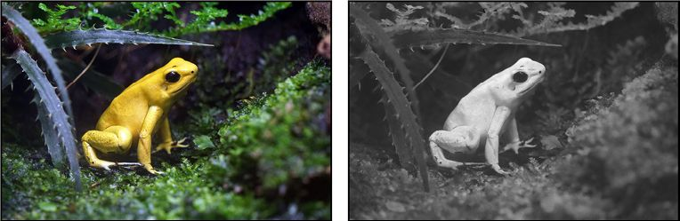

> **圖片描述：** 黃色檢測的實際應用範例。左側為一張包含黃色花朵的彩色照片，右側為經過黃色檢測後的灰度結果圖，黃色區域顯示為亮白色，非黃色區域顯示為黑色。

圖21.6　尋找黃色像素的操作的一個應用。右側圖像內容從黑到白，取決於左側圖像對應的源像素的黃色程度

### 21.2.3　權重共享

在21.2.2節中，我們僅僅用了一個黃色神經元，就掃描了整幅圖像。

在先前的討論中，我們想象每個神經元的權重都與它的輸入線聯繫在一起，因為這使得它們更容易被命名和討論。但正如我們在第10章所見到的，權重實際上在神經元“內部”，或者是神經元結構的一部分。現在，讓我們回過頭來把它們看作屬於神經元內部的。因此，當我們把神經元在圖像上移動時，它會帶著自己的權重一起。

其結果便是每個像素都被帶有同樣權重的同樣神經元以相同的方式進行評估。對每個新的像素來說，只有輸入值才會導致輸出值變化。

假設我們想要儘可能快地完成整幅圖像的黃色像素搜索過程。讓我們假設圖像是在一個特定的記憶體段中，資料的每個像素都可以連接上。

我們可能會構建一個黃色神經元的硬體版本，然後將該硬體的相同副本（包括權重）附加到圖像的每個像素上。然後我們可以同時評估所有這些神經元，用運行一個神經元的時間產生整個圖像的“黃色”分類。

現在假設我們想要檢測一種不同的顏色，比如“洋紅色”。因為我們已經在硬體神經元裡建立了黃色的權重值，所以不能重複使用這些電路了。我們不得不斷開它們，建立新的搜尋洋紅色的神經元，並將它們連接到我們的像素上。

為了節約一些時間和精力，讓我們把每個神經元的權重資訊放入一小片可以讀寫的記憶體中。然後在另一處記憶體裡放置僅僅一組權重，且讓我們將它們稱作**共享權重**（shared weight）。當我們希望從圖像裡檢測某種顏色時，所有的神經元都可以從這片記憶體中讀取這組共享的權重，並在內部保存它們。這之後，它們在評估像素的時候都將會使用相同的權重。這就可以使我們能將它們同時應用於所有的神經元。這一點和先前一樣，但現在同樣可以讓所有的權重在任意時刻按照我們的喜好來改變。因此，如果我們希望搜尋任意其他的顏色，則可以通過僅僅改變方才讀取到的權重值來實作這一點。這樣一來，我們就不需要重新連接任何東西。

如果我們有一些支援並行運算的硬體（比如GPU），這將是個完全可行的想法。使用它，我們可以並行運行對於給定神經元的多個軟體副本，使它們在許多像素上同時工作。這個過程如圖21.7所示。因為我們在每個像素上使用相同的權重，並行執行這些操作的結果和用單個神經元掃描圖像的結果是一樣的。它僅僅是更快出結果。

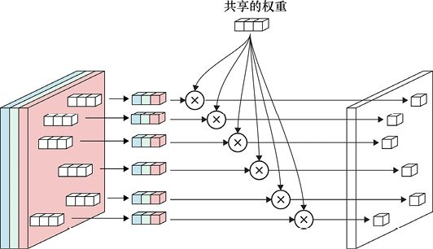

> **圖片描述：** 使用GPU並行計算的權重共享示意圖。多個相同神經元的副本同時獨立應用於圖像的不同像素上，每個帶有乘法符號的圓圈代表對一個像素的三個值進行加權求和。

圖21.7　使用像GPU這樣的支援並行計算的硬體，我們可以同時獨立地將相同的神經元應用於圖像中許多像素上。在此，每個帶乘法符號的圓圈表示圖21.4中的操作，即把每個像素的3個值都乘以對應的權重，然後再將結果加在一起

當我們給相同神經元的許多副本使用同一組權重時，我們稱之為**權重共享**。

### 21.2.4　局部感知域

到目前為止，我們在圖像上掃描（或用權重共享並行運行的）的一個神經元一次僅處理一個像素。我們將神經元移到我們想處理的像素處，讀取像素值然後通過神經元計算出一個輸出，接著將神經元移動到下一個像素並重復該過程。

之後將看到我們可以連接神經元以便一次讀取多個像素。儘管這些輸入像素可以是任何尺寸的，但它們幾乎總是正方形的，並且神經元會在正方形的中心。

例如，假設神經元從一個3像素×3像素的正方形區域得到它的輸入（我們將在稍後看到它是如何完成的）。然後該像素的位置是正方形的中心，其他8個像素環繞著它，如圖21.8所示。在這個例子中，我們的輸入圖像是灰度的，所以每個像素有一個值。因此，我們的神經元接收這9個值的輸入，每個分別乘以對應的權重，然後將結果相加。得到的單值會進入輸出圖像的同樣位置，如正方形中心高亮的像素所示。

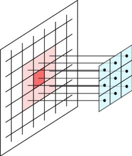

> **圖片描述：** 局部感知域示意圖。神經元從3x3像素的正方形區域獲取輸入，焦點像素（紅色高亮）位於中心，9個像素值分別乘以對應的藍色權重。

圖21.8　在這個例子中，神經元從一個3像素×3像素的正方形區域得到輸入。像素的位置在圖中高亮顯示為亮紅色。9個像素的集合稱為該神經元的局部感知域。我們此處的輸入圖像是單通道的，因此神經元共接收9個輸入。每個都乘以對應的權重，用藍色表示

我們說神經元有**局部感知域**（local receptive field），意味著它讀取（或“接收”）值的區域很小（“局部的”）。我們有時更簡單地把局部感知域稱作神經元的**足跡**（footprint）。局部感知域通常是一個邊長為1、3、5或7的、以神經元為中心的小正方形，如圖21.8所示。更大的正方形，甚至別的形狀也會被使用。

我們知道神經元對局部感知域內的像素的評估的結果會產生一個單值，它會進入輸出圖像的新像素。但具體地說，那個像素會去到輸出圖像中的哪裡呢？

為了回答這個問題，我們將內核中的一個元素稱為**錨點**（anchor）、**參考點**或**零點**。它被用黑色高亮顯示在圖21.9的3像素×3像素的網格的中心。當我們在圖像上移動內核時，通常會將錨點放在中心。我們可以說錨點下面的像素就是被評估的像素，稱之為**焦點像素**。

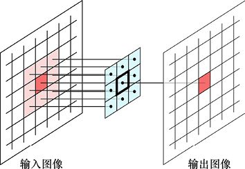

> **圖片描述：** 錨點與焦點像素的概念。3x3局部感知域的中心有一個黑色高亮的錨點，輸入圖像上對應的亮紅色像素為焦點像素，神經元的輸出值存入輸出圖像的相同位置。

圖21.9　該神經元有個3像素×3像素的局部感知域，其中心有黑色高亮顯示的錨點。輸入圖像上的亮紅色像素被稱為焦點像素，表示錨點現在的位置。神經元的輸出會進入輸出圖像與焦點像素相同的位置處

當我們將單個神經元在輸入圖像上移動時，可以考慮將其描述為將局部感知域的錨點從一個焦點像素移動到下一個。在每個這樣的像素上，神經元評估輸入值，產生一個輸出值，然後在輸出圖像與焦點像素相同的位置保存該值。隨後移向下一個焦點像素。

這就解釋了為何每側像素數都是奇數（通常為1～7）的足跡很受歡迎。這樣的正方形在中間都剛好有一個像素，使得每樣東西都保持簡單和對稱。

### 21.2.5　卷積核

當我們把神經元看作在圖像上移動（或由共享的權重平行運行的）的單個物體時，常將它的權重稱為**卷積核**（convolution kernel）或**過濾器**。

“卷積核”一詞來源於數學。在很長一段時間裡，它都被用來指代從一個概念性的操作核心，或者說“核”（kernel）操作中產生的值。這些操作是由人工神經元完成的。“過濾器”一詞來自將神經元考慮為操作或“過濾”輸入資料。

我們有時將“過濾器”這個詞擴展到包括神經元本身的部分，因此可能會說“我們令過濾器在圖像上移動”。我們也將它用作一個動詞，因此也可能會說“下一步是過濾圖像”，意思是我們對圖像的像素應用一組特定的權重。

## 21.3　卷積

“卷積神經網路”這個名字很清楚地說明了“卷積”在這類網路的操作中起著很大的作用。正如我們之前提到的，卷積是一種特殊類型的數學運算的名字，它包含兩個輸入。儘管我們不會講卷積的數學形式，但可以將它總結為一個精心設計的乘法和加法的組合。

好消息是我們早已很熟悉卷積了，因為這是人工神經元一直在做的事情，儘管我們沒有以這種特殊的方式描述它們。

卷積從兩個相等長度的數列開始。根據現在的描述方式，讓我們將一個數列稱為輸入，將另一個稱為權重。然後我們將第一個輸入與第一個權重相乘，第二個輸入與第二個權重相乘，以此類推。當所有的乘法都完成後，將所有的結果都加在一起，那麼這就是操作的結果。

這就是卷積。我們將會注意到其中漏掉了一些卷積的正式定義中的細節。這沒關係，因為那些細節不影響全局，所以除非我們直接編寫低級演算法，否則可以放心地忽略它們。

圖21.10形象地展示了這個過程。儘管我們靈活地移動了那些片段，但這和神經元給輸入賦予權重再對結果進行求和的大體過程是一樣的。

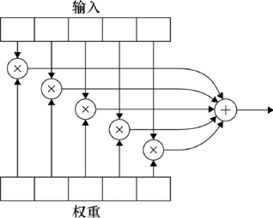

> **圖片描述：** 一維卷積操作的流程圖。上方為輸入數列，下方為權重數列，中間的乘法節點將對應元素成對相乘，最後一個加法節點將所有乘積加總得到最終結果。

圖21.10　一個卷積操作涉及兩個數列，我們可以稱之為“輸入”和“權重”，儘管兩個數列都是用相同的方式對待的。兩個數列中對應的值成對地相乘，然後將乘法結果加到一起，這就是忽略激活函數時一個人工神經元的工作過程

只要有一點概念上的變化，這個想法就會變成一個處理圖像的強力工具。

這點變化是，我們不再把輸入和權重看作簡單的數列，而把它們看作數字網格（事實上，它們可以是任意尺寸的張量，但我們現在就僅用網格來表示）。兩個網格必須有相同的尺寸。所做的操作仍和之前一樣：輸入網格的每個元素乘以權重網格的對應元素，得到結果後將所有的值加在一起。圖21.11展示了這種想法。

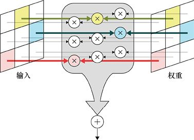

> **圖片描述：** 二維卷積操作的圖解。左側為輸入網格（彩色行），右側為權重網格（彩色行），中間展示逐元素相乘的過程，底部的加法節點將所有乘積匯總為一個輸出值。

圖21.11　二維的卷積和一維的一樣工作，儘管圖像會更加雜亂。每一對元素對應的值乘在一起，然後把所有的積加在一起

之所以說從值列表到網格只是概念上的轉換的原因是，我們總是可以將網格分解為一個列表，然後運用圖21.10的列表版本。例如，新建一個包含輸入網格第1行的列表，隨後是第2行、第3行等，如圖21.12所示。我們也可以對權重做相同的事，然後用之前的圖來將對應的輸入列表相乘。

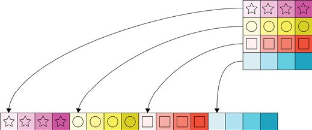

> **圖片描述：** 將二維網格展開為一維列表的概念。右上方為一個4x3的二維網格（用不同形狀和顏色表示），底部為展開後的一維列表，箭頭表示各行依序排列。

圖21.12　如果我們一開始就將每個二維網格重新組合成一個列表，則可以把二維卷積看作一維卷積。我們只需要取第1行，然後加上第2行、第3行等。如果我們對兩個網格都這樣操作，就可以將元素成對地相乘然後累加結果了

假設我們有一個神經元，它的過濾器是由一個3像素×3像素的網格的9個權重組成的。如我們先前討論的一樣，我們可以在圖像上移動過濾器。在每個位置將有9個像素給我們提供輸入值。我們可以將兩個網格（或列表）相乘，並將結果相加，從而得到新圖像中那個像素的值。

我們把這個過程稱為用過濾器卷積圖像，意味著我們移動過濾器，使其錨點從一個像素移動到另一個像素，並且在每個點的足跡範圍內收集像素值，用卷積核內對應的權重乘以那些值，然後將結果加起來產生輸出。

圖21.13展示了這個想法。在這個圖中，有一個3像素×3像素的過濾器在7像素×7像素的圖像上掃過。我們還沒有討論如果過濾器超出邊緣會發生什麼，所以目前只限制於考慮過濾器完全位於圖像內部的情況。那意味著輸出圖像只有5像素×5像素。

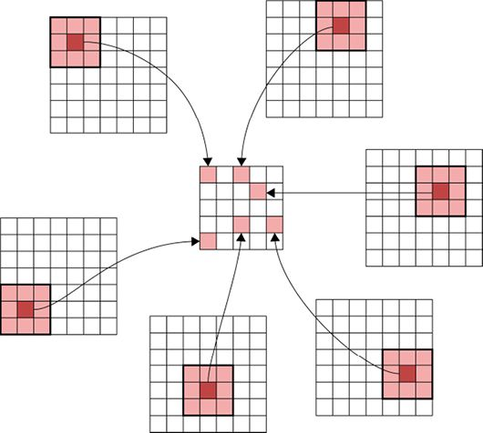

> **圖片描述：** 過濾器在7x7圖像上滑動進行卷積的過程。中心為5x5的輸出圖像，周圍多個位置展示3x3過濾器（粉紅色區域）在輸入圖像上的不同位置，箭頭指向輸出中的對應像素。

圖21.13　為了用過濾器卷積圖像，我們將過濾器在圖像上移動並在每個位置應用它。之後結果值會變成輸出圖像中那個像素的值。圖中是過濾器在輸入中的一些位置，以及它們計算出的值進入到輸出中的位置。需注意，因為過濾器不能超過輸入的邊緣，因此輸入是7像素×7像素但輸出就只有5像素×5像素

為什麼我們要做這樣的事？讓我們更仔細地研究一下過濾器。

### 21.3.1　過濾器

研究蟾蜍的一些科學家認為動物視覺系統中的某些細胞對特定類型的視覺特徵敏感[Ewert85]。這個想法可見於蟾蜍正在尋找看起來像它喜歡吃的動物的特定形狀，以及那些動物所做的某些動作。

人們過去常常認為蟾蜍的眼睛吸收了所有光線，將大量資訊傳遞給大腦，然後依靠大腦從中篩選符合食物特徵的結果。新的假設是眼睛中的細胞自己會進行初步檢測，只有當它們“認為”自己正在看獵物時，它們才會被激活並向大腦傳遞資訊。

這個想法已經擴展到人類系統，人們猜想個別的神經元響應只會是特定人物的圖像。帶來這一意見的原始研究包括87種不同的圖像，其中包括人物、動物和地標。在至少一名志願者中，他們發現了一種特殊的神經元，只有在其視覺系統中呈現了女演員Jennifer Aniston的照片時才會被激活，導致了所謂的“Jennifer Aniston神經元”[Quiroga05]的想法。奇怪的是，這個神經元只在Aniston單獨出現在照片裡時被激活，而在面對她與其他著名演員的合影時沒反應。

這些想法並未被普遍接受[Sciffman01]，但我們並不是要在這裡講真正的神經科學和生物學。我們只是在尋找靈感，而這似乎是些非常好的靈感。

這些想法與卷積層的聯繫是我們可以使用過濾器來模擬蟾蜍的眼睛。過濾器是挑選出我們正在尋找的特徵的工具，然後將它們的發現傳遞給後面的層用以處理該資訊。

用於此過程的一些措辭使用了我們以前見過的術語。具體來說，我們一直在使用“特徵”這個詞來指代樣本中包含的一個值，例如包含多個天氣測量指標的樣本中的溫度。但在這種情況下，**特徵**這個詞指的是圖像中一個特定的、過濾器正在尋找的結構。所以我們可能會說過濾器正在尋找條紋特徵，或看起來像眼球的特徵。繼續這個用法，過濾器本身有時也稱為**特徵檢測器**（feature detector）。

讓我們看一下特徵檢測器在一個簡單的例子上是如何工作的。圖21.14展示了用過濾器在圖像裡尋找短的、分離的垂直白色條紋的過程。由於圖中各個片段使用了不同的數字範圍，因此我們使用了不同的顏色來表示它們的值。

圖21.14a展示了一個3像素×3像素的過濾器。紅色網格顯示過濾器中值為−1的位置，黃色網格顯示過濾器中值為1的位置。圖21.14b展示了一個噪聲輸入圖像，範圍為0（黑色）～1（白色）。圖21.14c展示了對輸入圖像每個像素（最外邊框除外）應用過濾器的結果。在此，值的範圍為−6（紫色）～+3（青色）。正如我們將在下面看到的，得分為+3意味著過濾器和圖像完美匹配。

圖21.14d展示了圖21.14c的閾值版本，其中值為+3的像素以白色表示，而所有其他像素均為黑色。最後，圖21.14e展示了圖21.14b的噪聲輸入圖像，並高亮顯示了圖21.14d中白色像素周圍的3像素×3像素的網格。我們可以看到過濾器在圖像中找到了那些像素與過濾器圖案相匹配的位置。

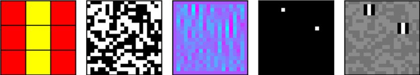

> **圖片描述：** 二維模式匹配的完整過程。五個面板由左到右依序為：(a)3x3過濾器（紅黃色彩），(b)黑白噪聲輸入圖像，(c)卷積結果（紫到青色），(d)閾值處理後的二值圖像，(e)在原圖上標記匹配位置。

　　　　(a)　　　　　　　　　　　　　　　　　(b)　　　　　　　　　　　　　　　　 (c)　　　　　　　　　　　　　　　　　(d)　　　　　　　　　　　　　　　　 (e)

圖21.14　卷積中的二維模式匹配。(a)一個3像素×3像素的過濾器，其包括一列1值（黃色）和包圍著它的−1值（紅色）。(b)包含0（黑色）～1（白色）的噪聲輸入圖像。(c)在圖像每個像素應用過濾器後的結果。輸出值範圍為−6（紫色）～+3（青色）。(d)(c)部分的閾值版本，其中像素值為完美得分+3的表示為白色，其他值是黑色。(e)(b)部分的噪聲輸入圖像，但是(d)部分中每個白色像素周圍的3像素×3像素網格被突出顯示

讓我們看看這為什麼有效。圖21.15的頂行中已經展示了過濾器和圖像的一個3像素×3像素的網格，以及逐像素結果。在這種情況下，只有一個白色像素（頂部中心）對應過濾器中的1。這給出了1×1=1的結果。其他像素則是與−1對應，給出−1×1=−1的結果。圖像中的0是無關緊要的，因為我們無論將它們乘以1或−1都將返回0。將角落中的3個白色像素的−1得分及頂部中心白色像素的1得分加在一起會得出−3+1=−2。

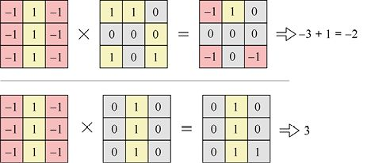

> **圖片描述：** 過濾器匹配計算的兩個範例。上排：圖像片段與過濾器不完全匹配，結果為-2。下排：圖像片段與過濾器完美匹配（垂直白色條紋），結果為最高分3。

圖21.15　在圖像上使用過濾器。這兩行展示的是圖像不同的片段。左圖過濾器。中圖包含白色像素（1）或黑色像素（0）的圖像片段。右圖將每個圖像像素乘以其對應的過濾器值的結果。9個值加在一起可以得到右邊的最終總和

在圖12.15的底行，我們的圖像與過濾器匹配。全部3個白色像素都能貢獻1，沒有任何一個白色像素會貢獻−1來拉低總分。也沒有缺失的白色像素通過不添加1來降低分數。最終結果是得分為3，表明完美匹配。

這個過程與圖21.3中的尋找黃色的神經元非常契合，除了這裡每個像素只使用一個權重以及我們將權重分散在多個像素上。

圖21.16展示了另一個過濾器，這個過濾器在尋找對角線。我們會在相同的圖像上運行它。這個被黑色包圍的由3個白色像素構成的對角線出現在隨機圖像中的一個位置，靠近左下角。

因此，通過在圖像上移動過濾器並在每個像素處測量最終值，都可以尋找我們想要的圖案。用更大、包含更多細微差別值而不僅僅是1和−1的過濾器，我們可以設計更復雜的模式以找到更有趣的特徵。我們甚至可以執行模糊和銳化等圖像處理操作[Snavely13]。

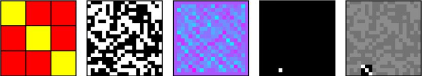

> **圖片描述：** 使用對角線過濾器的模式匹配範例。五個面板展示類似的過程，搜尋左上到右下的對角線圖案，在隨機圖像中找到一個匹配位置。

　　　　(a)　　　　　　　　　　　　　　　　 (b)　　　　　　　　　　　　　　　　　(c)　　　　　　　　　　　　　　　　 (d)　　　　　　　　　　　　　　　　 (e)

圖21.16　另一個過濾器及其在隨機圖像上的結果。被黑色包圍的由3個白色像素組成的對角線只能在一個位置找到

如果我們獲取第1組過濾器的輸出並將它們提供給另一組，那麼可以尋找模式中的模式。如果我們把第2組過濾器的輸出提供給第3組過濾器，那麼現在我們在尋找模式中的模式。我們可以重複多次，創建一組深層次結構（hierarchy）的過濾器。也許令人驚訝的是，這樣的層次結構允許我們尋找任意方向或大小的複雜特徵，無論是朋友的面部、籃球的紋理，還是孔雀羽毛末端的“眼睛”。

如果我們必須手工製作這些過濾器，那麼分類圖像充其量就只是單調乏味的。能告訴我們一幅圖像中是一隻小貓還是一架飛機的8層結構的適當過濾器是怎樣的？我們會怎樣解決這個問題？以及我們如何知道有最好的過濾器？

CNN的美妙之處在於我們**無須**弄清楚需要哪些過濾器，因為電腦為我們完成了這個步驟。

我們在以前的章節中看到的學習過程，**涉及**測量誤差，然後用反向傳播改善權重，來訓練一個CNN找到最好的過濾器。它修改過濾器的權重（即卷積核中的值），直到網路產生符合我們目標的結果。換句話說，它會調整過濾器中的值，直到它找到了能使其提供正確答案的特徵。它可以同時為數百甚至數千個過濾器執行此操作。

這可能看起來幾乎是魔幻的，但訓練基本上就只是反向傳播和梯度下降。從最廣義的角度來說，我們只是以這樣的方式修改每個卷積核中的每個權重，使之跟隨誤差梯度下降的方向，從而降低整體錯誤。這樣做足夠多次之後，權重值將形成能給我們提供所需的所有資訊的過濾器，以便我們將輸入轉變為匹配標籤的輸出。

### 21.3.2　複眼視圖

讓我們試試用另一種方法可視化整個過程。不同於在圖像上移動過濾器，想象一下拍攝了照片並將它分成許多小的互有重疊的部分，每個部分都同過濾器一樣大。然後我們在每個部分插入過濾器並執行濾波，像之前一樣，將每個像素值乘以其對應的過濾器權重[Geitgey16]。圖21.17展示了輸入圖像的這些小部分，隨後我們會在它們上面放置過濾器。

從這個角度看卷積，我們是將過濾器放在輸入圖像的每個互有重疊的小部分上，而不是用它掃過原始圖像。

這兩種思考方式都會產生相同的結果。

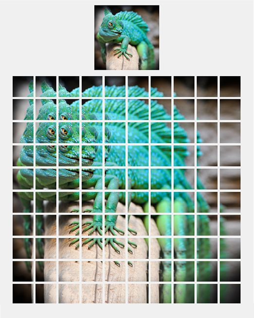

> **圖片描述：** 過濾器在變色龍圖像上的應用。下方為一張綠色變色龍照片覆蓋著網格，上方為一個3x3的小過濾器區域被放大顯示，展示過濾器如何作用於圖像的局部區域。

圖21.17　不同於考慮在圖像上移動過濾器，我們可以想象將圖像分解成互有重疊的部分，就像圖像的複眼視圖一樣。然後我們將過濾器應用於每個部分來產生輸出值（[Geitgey16]之後的圖像）

### 21.3.3　過濾器的層次結構

本章中我們已經從生物學中汲取過靈感，那我們可以再做一次。

許多真實的視覺系統似乎是**分層排列**的[Serre14]。從廣義上講，我們考慮視覺系統中的處理發生在一系列**層**中，每個接續的層工作在比前層更抽象的層次中。回到蟾蜍的視覺系統，最底層可能正在尋找“淺色斑點”，接下來是“前一層中帶有翅膀的東西的組合”，然後是“前一層中短距快速移動的東西的組合”，等等，直到尋找“蒼蠅”的頂層（這些特徵完全是虛構的，僅用於這種思路的說明）。

這種方法在概念上很好，因為它可以讓我們通過圖像元素的層次結構構建圖像分析手段，以及用於尋找這些元素層次的過濾器。它也利於實施，因為這是一種靈活有效的圖像分析方法。

讓我們看一個簡化的例子來了解這個過程。我們會嘗試在27像素×27像素的二值圖像中找到一張臉。假設我們想要找到圖21.18a所示的臉，但輸入圖像中包含各種其他的東西，如圖21.18b所示。因為我們知道我們感興趣的所有像素的確切位置，所以可以直接檢查它們的存在。但讓我們看看如何用過濾器的層次結構解決這個問題，因為我們以後會用更一般化的方法來在更復雜的彩色圖像中尋找目標。

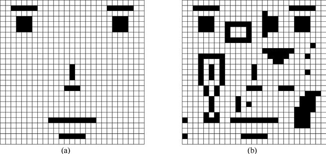

> **圖片描述：** 簡單的人臉和非人臉圖像。(a)用黑白像素組成的簡化人臉圖案，可辨識出眼睛、鼻子和嘴巴。(b)類似格式但不是人臉的隨機圖案。

圖21.18　在27像素×27像素的二值圖像中尋找臉。(a)我們要檢測的臉；(b)我們給出的輸入圖像

上述策略（policy）的總體流程如圖21.19所示。我們將從第一層開始，應用5個3像素×3像素的小過濾器。第一個過濾器將尋找上下都是白色元素的3個黑色元素的水平行——我們稱之為過濾器H（指水平）。我們為垂直條紋製作一個類似的過濾器並稱為過濾器V。我們也將尋找一致的3像素×3像素的區塊，並稱之為過濾器B。為了再包括一點細節，我們還會尋找水平線的左右兩端並視之為一個被白色像素包圍的單個黑色像素，並稱之為過濾器 L和R。這5個過濾器構成了第一層。

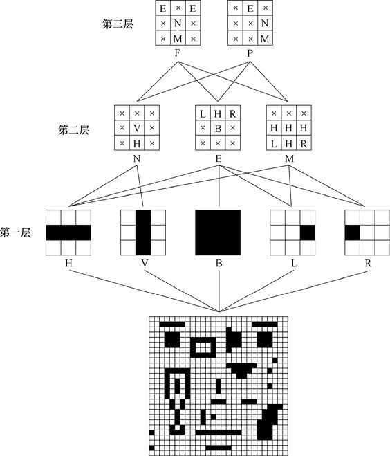

> **圖片描述：** 多層卷積特徵檢測的階層結構。底部為輸入圖像，第一層檢測基本特徵（水平H、垂直V、大塊B、左對角L、右對角R），第二層組合這些特徵檢測更複雜的圖案（N、E、M），第三層進一步組合為高階特徵（F人臉和P非人臉）。

圖21.19　使用3層過濾器，每個過濾器只有3像素×3像素，來找到27像素×27像素的圖像中臉的正面或輪廓

運行這些過濾器後，我們將使用最大值池化來減小其輸出尺寸至原來的1/3。也就是說，我們將每個過濾器的輸出視為一組不重疊的3像素×3像素的塊。任何時候找到一個與包含該過濾器匹配的塊，我們都將在低分辨率輸出中的對應塊處用黑色標記。所以5個過濾器中的每一個都會產生27像素×27像素的輸出，然後我們將其減小到9像素×9像素。

現在到了第2層，我們將再應用3個過濾器，每個的尺寸為3像素×3像素。這些更高級別的過濾器將檢測第1層輸出的9像素×9像素的圖像。它們正在尋找構成臉部的5個最低級別構建塊的組合。我們會用想要組建的塊來標記這些過濾器的每個條目，或者如果我們不在乎那個塊裡有什麼，就用X標記。我們將為鼻子做一個過濾器，鼻子是在上方帶有一條小垂直線的水平線（我們稱之為過濾器N）；為眼睛做一個過濾器，它是在眉毛下面的像素塊，眉毛是具有左右兩端的水平線（我們稱之為過濾器E）；為嘴做一個過濾器，它是下方附有短水平線的長水平線（我們稱之為過濾器M）。一旦我們再一次應用了池化，每個過濾器的9像素×9像素的輸出都會減小到3像素×3像素。

最後，我們到達第3層。在這裡，我們將應用2個新過濾器，每個過濾器都是3像素×3像素的。一個過濾器會尋找一個向前看的臉（我們稱之為過濾器F），另一個會尋找向右看的臉（我們稱之為過濾器P）。我們的剖析圖像看起來很奇怪，但對這個演示來說沒什麼問題。

讓我們看看這些過濾器的實際效果。圖21.20展示了過濾器H、V和B處理的原始圖像。因為我們正在用過濾器對圖像進行卷積，所以將移動每個過濾器的中心，使其落在輸入中的每個像素上，並確定是否匹配（即過濾器中的白色和黑色像素與圖像上的白色和黑色像素相匹配）。匹配的每個像素將以紅色標出。

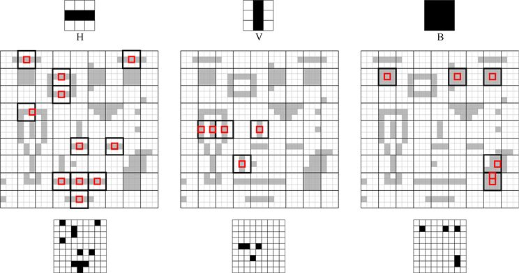

> **圖片描述：** 第一層三個過濾器（H水平、V垂直、B大塊）的卷積結果。每個面板顯示灰度卷積輸出圖像，紅色小方框標記高分匹配位置，底部為池化後的縮小結果。

圖21.20　將過濾器H、V和B應用於原始的27像素×27像素的圖像。第1行：我們正在使用的過濾器。第2行：與過濾器匹配的每個像素都以紅色突出顯示。我們還展示了用於最大值池化的3像素×3像素的塊。任何帶有紅色的塊都用更粗的輪廓突出顯示。第3行：池化操作的結果。中間行突出顯示的3像素×3像素的塊被標記為黑色

在找到匹配之處後，我們將使用3像素×3像素的最大值池化來減小輸入圖像的尺寸，使它從27像素×27像素減少到9像素×9像素。任一塊內部至少有一個匹配處變為黑色。注意，一些區塊有多個匹配處，例如靠近過濾器V的中左區。我們不對這些塊做任何特殊的處理，而只是像任何其他包含匹配處的塊一樣將它們標記為黑色。

過濾器L和R的結果如圖21.21所示。

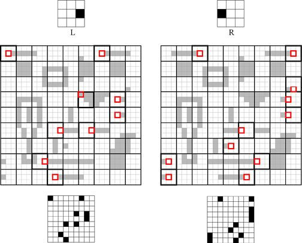

> **圖片描述：** 第一層另外兩個過濾器（L左對角和R右對角）的卷積結果。與圖21.12類似的格式，展示對角線特徵在圖像中的匹配位置。

圖21.21　將過濾器L和R應用於輸入圖像，使用與圖21.20相同的約定

現在是過濾第二層的時候了。在圖21.22中，我們將所有5個輸出圖像合併在一幅圖中，每個塊都用一個或多個字母標記，因此過濾器輸出更容易以組別的形式被使用。在我們的簡單示例中，大多數塊只有一個匹配之處，儘管位於中心右下方的塊同時與過濾器L和R相匹配。我們如之前一樣應用眼睛、鼻子和嘴巴過濾器E、N和M，但這次我們不會要求所有的值都匹配。回想一下，塊中的X表示“不關心”，我們可以把它看作一種匹配一切的通配符。例如，複合圖中右上方的3像素×3像素的塊幾乎與過濾器E相匹配，但右下角有一個額外的R。由於該塊在過濾器的相應條目中有一個X，所以當過濾器E在B上居中時，塊仍然匹配。

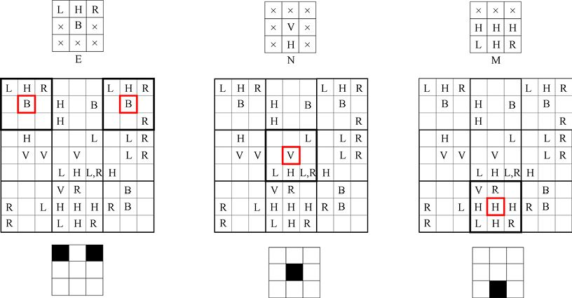

> **圖片描述：** 第二層三個過濾器（E、N、M）的卷積結果。每個過濾器組合第一層的特徵，面板展示匹配位置和池化後的結果，紅色方框標記高分位置。

圖21.22　第一行：我們的3個第二層過濾器。第二行：第一層的總結。每個塊都標有相匹配的過濾器。第三行：第三步時過濾器E、N和M在圖像上移動。它們匹配的塊以黑色顯示。第四行：每個過濾器的輸出是一個新圖像，現在只有3像素×3像素了

和以前一樣，我們將使用3像素×3像素的最大值池化，所以這一層的輸出包含3幅圖像，每個圖像尺寸為3像素×3像素。

現在我們準備好第3層也是最後一層了，它會告訴我們輸入圖像是否包含正臉、側臉，或兩者都沒有。我們只需要將兩個3像素×3像素的過濾器應用於第二層的結果，如圖21.23所示。在此，沒有必要移動過濾器，因為輸入是3像素×3像素的。此處，正臉匹配上了，而側臉沒有。

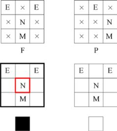

> **圖片描述：** 第三層兩個過濾器（F人臉和P非人臉）的卷積結果。每個面板展示過濾器的權重矩陣和對應的卷積輸出，底部為最終的池化結果。

圖21.23　將第三層過濾器應用於第二層過濾器的輸出，使用了與先前圖中相同的佈局。正臉過濾器匹配了，而側臉過濾器沒有

我們已經在包含各種干擾物體的情況下在圖像中檢測到了臉！

我們所要做的就是設計10個小過濾器，我們可以匹配臉，即使那裡有很多其他的東西來分散我們的注意力。如果我們想尋找不同類型的鼻子，則可以重新設計鼻子過濾器。或者可以立即尋找多種面部特徵，只要為每種類型的眼睛、鼻子和嘴巴使用過濾器，然後製作符合各種組合的更高級過濾器，以幫助告訴我們給定的是哪種面孔。

如果我們不得不為每個項目手動設計這些過濾器，那這就不是一個有吸引力的演算法了。但深度學習系統可以自動從輸入中學習過濾器的最佳值，只要它可以在訓練過程中接觸過足夠標記過的樣本。

我們的示例使用了二值圖像，以便更容易看清發生了什麼，但在實踐中我們經常使用灰度圖像和彩色圖像。在這些情況下，我們的過濾器將包含浮點數。當二值過濾器只能報告匹配或缺少它們時，這些浮點過濾器可以返回一個浮點數，這個浮點數越大意味著它與該位置的資料能更好地匹配。

卷積的一個好處是過濾器能夠在圖像的任意位置找到它們正在尋找的東西。例如，過濾器H能發現所有水平排列的3個上下都為白色像素的黑色像素，圖像中每處都沒錯過。當我們想要處理複雜的自然界的圖像時，這給了我們靈活性來穩健地檢測圖像特徵，即使它們不在我們期待的位置。

當我們操作的層級越來越高時，會感覺過濾器越來越強大。考慮到第二層3像素×3像素的過濾器有效地影響了9像素×9像素的區域，因為它的每個像素都是上一步減小圖像尺寸的結果。例如，我們的眼睛過濾器E處理一個9像素×9像素的區域，儘管它自身只是3像素×3像素的。通過這種方式，層次結構中較高級別的過濾器可以尋找到大而複雜的特徵，即使它們只使用了一些很小的（也因而快的）過濾器。

較高級別能夠用多種方式將較低級別的結果組合在一起。假設我們想要分類照片中各種不同的鳥類。低層過濾器可能會尋找羽毛或喙，而更高層的過濾器能夠組合不同類型的羽毛或喙來識別不同種類的鳥類，所有的這些只需在照片單次傳遞至系統就能完成。

這種技術有時稱為使用**層次結構縮放**。

### 21.3.4　填充

讓我們回到卷積並看看輸入的邊緣附近會發生什麼。

假設我們想要將5像素×5像素的過濾器應用於黑白圖像。如果我們位於圖像中間的某個位置，如圖21.24所示，那我們的工作很容易。我們從圖像中提取出25個值，將它們按過濾器中的25個值進行縮放，並加和結果。

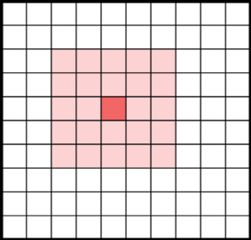

> **圖片描述：** 有效填充模式示意圖。輸入為一個較大的網格，中心的焦點像素（紅色）周圍有粉紅色的局部感知域，過濾器不超出邊界。

圖21.24　位於一幅圖像中間某個位置的5像素×5像素的過濾器。亮紅色像素是錨點，而較亮的像素組成了局部感知域。

但是，如果我們處於邊緣位置，如圖21.25所示呢？

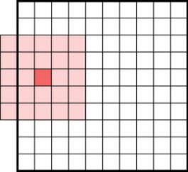

> **圖片描述：** 有效填充下焦點像素移至左上方的示意圖。粉紅色局部感知域仍完全位於輸入圖像內部，紅色焦點像素在左上區域。

圖21.25　靠近邊緣，過濾器的局部感知域可能會超出圖像的邊緣。對於這些缺失的像素我們用什麼值？

過濾器的足跡超出了圖像邊緣，那裡沒有任何輸入值。當過濾器缺少一些輸入時我們如何計算輸出值呢？

我們有幾個選擇。一個是不允許這種情況，所以我們可以只允許過濾器的足跡完全位於輸入圖像內部，如到目前為止我們所做的一樣。任何我們無法放置過濾器的像素都會被遺棄，也導致每個維度都更小。圖21.26展示了這個想法。

雖然簡單，但這是一個糟糕的解決方案，因為如果我們應用多個卷積過濾器到相同的圖像上，它會在每一步都縮小。我們可能最終只剩一小部分圖像來作為輸入，而這不是一個好結果。

一種流行的替代方案是使用**填充**（padding）。我們的想法是在圖像外部周圍“額外”添加一圈像素的邊界，如圖21.27所示。所有這些像素具有相同的值。到目前為止，最常見選擇的是0，稱為**零填充**。

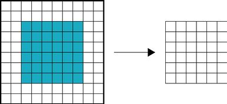

> **圖片描述：** 有效填充導致輸出縮小的示意圖。左側大網格的青色區域代表所有可用的焦點像素位置，右側較小的網格為對應的輸出圖像尺寸。

圖21.26　我們可以通過永遠不讓過濾器到達那麼遠來避免“脫離邊緣”問題。使用5像素×5像素的過濾器，我們只能將過濾器居中於此處標記為藍色的像素上。由此產生的6像素×6像素的輸出，如右圖所示，小於我們開始使用的10像素×10像素的網格

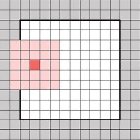

> **圖片描述：** 相同填充模式示意圖。輸入圖像周圍添加了灰色的零值邊框，黑色方框內為原始圖像區域，焦點像素位於左側邊緣附近，局部感知域部分延伸到填充區域。

圖21.27　解決“脫離邊緣”問題的更好方法是在圖像邊框周圍填充或者添加額外像素。我們在這裡添加了一個2像素的邊框，因此原始圖像中的每個像素（如圖中白色所示）都可以用作過濾器的中心。通常，填充像素被給定0值

邊框的尺寸取決於過濾器的尺寸。我們通常使用足夠的填充，以便過濾器可以居中在原始圖像的每一個像素上。某些庫可能會提供填充尺寸的自動計算，這是基於過濾器的尺寸而定的，或者它們可能需要我們人為指定。通常，我們從不顯式地將填充放入輸入中。相反，我們將填充留給庫來在它們需要時創建（或推測）這些像素。

使用填充，我們可以產生一個與輸入圖像尺寸相同的輸出圖像。

### 21.3.5　步幅

在圖像上用過濾器進行掃描時，我們可以想象它移動的過程與我們閱讀一本書時的一樣。讓我們暫時假設使用了填充。過濾器將從輸入圖像的左上角像素開始，產生一個輸出，然後向右邁出一步，產生一個輸出，再向右邁出一步，以此類推，直到它到達該行的右邊緣。然後它向下移動一行並返回到左側，再重複進行上述過程。

但我們不必如此按部就班。假設用過濾器掃描時，我們向右或向下移動，或**跨步**多於一個像素，會怎樣呢？我們的輸出尺寸最終會小於輸入尺寸。

我們將看到有幾種不同的方式來使用跨步，這些都是我們使用卷積層時很重要的。

為了可視化跨步，一開始讓我們將輸出視為空白。當過濾器從左向右移動時，它會產生一系列輸出值，並且一個接一個地放置在輸出中，也從左到右放置。當過濾器向下移動時，新的輸出產生輸出中的新單元格行。

如果我們像往常那樣在每個方向上移動或跨步一個像素，得到的結果如圖21.28所示。這裡我們沒有使用填充。

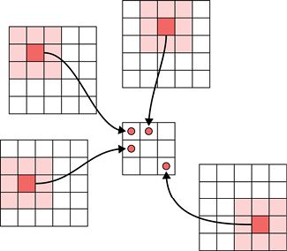

> **圖片描述：** 最大池化操作示意圖。周圍展示多個局部區域（粉紅色高亮），每個區域的最大值被提取到中央較小的輸出網格中，紅色圓圈標記被選中的最大值。

圖21.28　用3像素×3像素過濾器掃描5像素×5像素圖像，無填充。過濾器的每一步都在輸入中將其向右移動了一個像素，並在之後將它向下移動一個像素。該圖展示了構成該輸出的9個過濾器位置中的4個

但我們可以水平、垂直或兩者皆有地跳過像素。例如，我們可能會在每個水平線上每步向右移動3個像素，然後每次垂直移動時，一步向下移動2行。輸出像素仍然像以前一樣結合。其結果是一個水平尺寸只有原來1/3、垂直尺寸只有原來1/2的新圖像，如圖21.29所示。

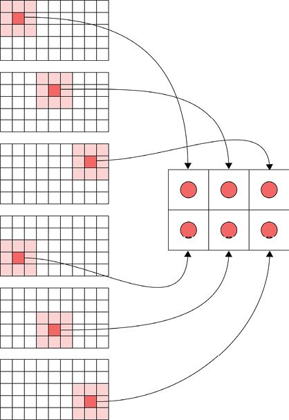

> **圖片描述：** 步幅為2的卷積操作。左側多個位置展示過濾器在輸入圖像上每隔2個像素採樣一次，右側較小的輸出網格收集所有結果，紅色圓圈表示採樣的輸出值。

圖21.29　我們的過濾器掃描可以跳過像素。在這個例子中，我們在水平方向每隔兩個像素、在垂直方向每隔一個像素地掃描。換句話說，我們使用橫向3和縱向2的步幅。為清楚起見，我們在此圖中未使用填充。5像素×9像素的輸入圖像變為2像素×3像素的輸出圖像

再看一下圖21.29中作為過濾器錨點的像素，如圖21.30所示。

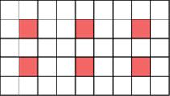

> **圖片描述：** 步幅示意圖。一個水平網格展示了步幅為2時過濾器在圖像上的移動位置，紅色像素標記每個步幅間隔的採樣點。

圖21.30　圖21.29的卷積中作為過濾器錨點的6個像素

我們稍後會看到這是減小輸入圖像尺寸的快速方法，可以加快網路中的後續部分。

在圖21.29中，我們橫向使用了值為3的步幅，縱向使用了值為2的步幅。而更常見的是，我們會為兩個軸指定相同的步幅值。步幅可以是任何從1開始的正整數。在圖21.28中，預設步幅為1，意味著我們每次移動的步幅是1像素，沒有任何像素被錯過。在兩個軸上的步幅為2可以被認為是在水平和垂直方向每間隔一個像素取一次，步幅為3或更大也類似地考慮。這兩種步幅的示意如圖21.31所示。

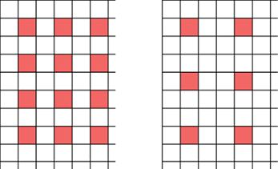

> **圖片描述：** 步幅為1和步幅為2的比較。左側網格顯示步幅1時每個位置都被採樣（密集的紅色點），右側顯示步幅2時每隔一個位置採樣（稀疏的紅色點）。

(a)　　　　　　　　　　　　　　　　　　　　　 (b)

圖21.31　跨步的例子。(a)兩個方向的步幅都為2，表示水平和垂直方向上都每隔一個像素評估一次；(b)兩個方向的步幅都為3，意味著每隔兩個像素評估一次

我們可以使用跨步來防止過濾器重疊，這在縮小圖像時很有用。例如，如果我們在圖像上用3像素×3像素的過濾器進行掃描，則可能使用3的步幅，這樣沒有一個像素被使用超過一次，如圖21.32所示。

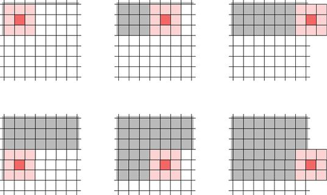

> **圖片描述：** 膨脹卷積的六個示例。六個網格面板展示不同膨脹率下的採樣模式，灰色區域為過濾器覆蓋範圍，粉紅色像素為實際參與計算的位置。

圖21.32　在每個維度中使用3的步幅和3像素×3像素的過濾器，這表示輸入中的每個像素僅被使用一次。從上到下、從左到右地讀取。灰色陰影的像素是已經被過濾器覆蓋過的。輸出圖像的尺寸將是輸入圖像維度的1/3

## 21.4　高維卷積

在前面的例子中，我們一直在使用黑白圖像。也就是說，每個圖像僅具有一個顏色資訊**通道**。我們知道彩色圖像至少有3個通道，通常代表每個像素的紅色、綠色和藍色分量。讓我們來看看如何處理這類圖像。一旦可以處理3層圖像，我們也就知道如何使用任意層數的張量，例如先前卷積層的輸出。

處理彩色圖像的一種方法是對每個通道應用相同的過濾器。或者，我們可以製作一個在每個通道應用不同權重的過濾器。

製作這樣的過濾器很容易。我們將之前的過濾器從僅是一個權重網格轉換為多個過濾器的堆疊，一層對應一個通道。圖21.33展示了這個想法。換句話說，我們的內核從一個二維網格變成了包含27個值的三維塊。

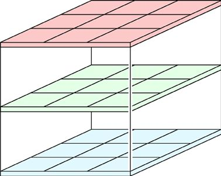

> **圖片描述：** RGB彩色圖像的三維張量表示。一個立體結構顯示三層（紅、綠、藍）堆疊，每層為一個二維網格，整體形成一個三維數據塊。

圖21.33　當我們將過濾器應用於3通道圖像時，例如，每個像素處由紅色、綠色和藍色值組成的彩色圖像，可以應用3個不同的過濾器，每個過濾一個通道。我們可以把3個過濾器想象為一個小堆棧，這裡展示的過濾器具有3像素×3像素的局部感知域

要將此卷積核應用於3通道彩色圖像，這和以前的處理基本一樣，但現在我們考慮塊（或三維的張量）而不是網格（或二維的張量）。

回到我們之前關於“礦土樣本”的想法，假設過濾器有一個3像素×3像素的足跡，並將處理有3個顏色通道的彩色圖像。所以我們從彩色圖像中提取出一個“礦土樣本”，但現在它的體積（volume）是每邊3個像素（高度和寬度都是3，因為過濾器尺寸是3像素×3像素；深度也是3，因為有3個通道）。

然後我們將塊的每個元素與過濾器塊中相應的元素相乘。

如果我們想要產生一個表示彩色圖像與卷積核張量有多接近的值，則可以將所有27個乘積相加，來為只有一個通道的新輸出圖像生成一個單值，如圖21.34所示。

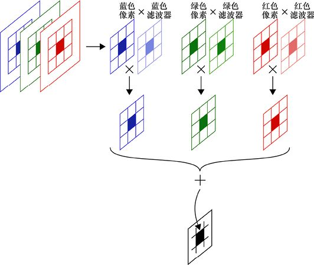

> **圖片描述：** 對RGB彩色圖像的單個過濾器卷積操作。輸入的三通道圖像（紅、綠、藍）分別與對應顏色的過濾器相乘，三個結果相加產生一個單通道輸出值。

圖21.34　使用3像素×3像素×3像素的卷積核對彩色圖像進行卷積。我們提取出3像素×3像素的足跡內9個紅色、綠色和藍色的像素值，並且將這些元素與卷積核的相應切片相乘。我們可以將所有結果相加以生成單個值

假設我們想要生成彩色圖像作為輸出，但每個顏色通道由其自己的過濾器來修改。並非用一個三維卷積核，我們可以使用3個獨立的二維網格。然後將每個過濾器應用於自己的通道，併產生自己的輸出。結果是一個新張量，它有3個通道，且各來自一個過濾器。圖21.35展示了這種方法。

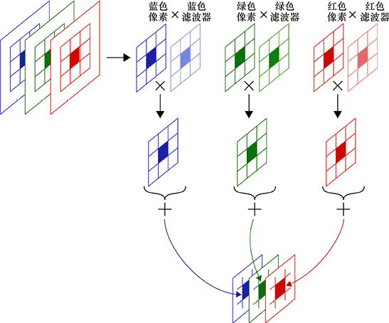

> **圖片描述：** 對RGB圖像的多過濾器卷積操作，保留深度。與圖21.26類似但過濾器結果不相加，而是保留為三個獨立通道，堆疊成一個多通道輸出張量。

圖21.35　將3個不同的卷積核應用於彩色圖像來輸出彩色圖像

這些想法可以擴展到具有任意通道數的圖像，正如我們將在21.4.1節中看到的那樣。

我們可以選擇使用並行硬體來同時應用許多相同的過濾器以提高效率。在這種情況下，我們可以使用之前看到的權重共享，這意味著所有過濾器仍然可以從單個資源處獲得權重。

### 21.4.1　具有多個通道的過濾器

我們可以推廣上面的想法，在單個輸入上使用多個過濾器。

例如，假設有一個黑白圖像，而我們想要尋找眼球、棒球、排球和肉丸。我們可以為每種特徵創建一個過濾器，並相對獨立地在輸入上運行每個過濾器。結果將是4個輸出圖像，每個圖像的通道深度都為1，每個通道來自一個過濾器，如圖21.36所示。

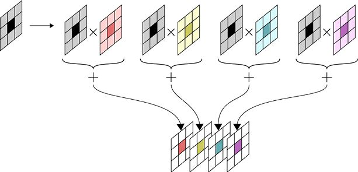

> **圖片描述：** 單通道輸入使用多個過濾器產生多通道輸出。灰度輸入圖像分別與四個不同顏色的過濾器卷積，每個產生一個輸出通道，最終堆疊為四通道輸出張量。

圖21.36　我們可以在同一輸入（灰色表示）上運行多個過濾器（彩色表示），每個過濾器在輸出中創建自己的通道

因此，不是產生一個只有單通道的灰度圖像，或有3個通道的彩色圖像，而是產生一個帶有4個通道的黑白圖像。如果我們使用7個過濾器，則輸出將是具有7個通道的新圖像。那時我們可能不再想稱它為一幅圖像，更普遍地稱它為一個張量。

這裡要注意的關鍵是每個過濾器都有1個切片層，與輸入相匹配。如果輸入深度為2像素，則每個過濾器深度也需要2像素。

一般來說，過濾器的足跡大小可以任意設定，我們可以對任何輸入圖像應用任意多的過濾器。最重要的是過濾器中的通道數與輸入中的通道數相匹配。

圖21.37展示了這個想法。最左邊的輸入張量有6個通道。我們應用了4個不同的過濾器，每個過濾器具有尺寸為3像素×3像素的足跡，所以每個過濾器的張量大小為3像素×3像素×6像素。每個過濾器生成的輸出都是單通道的。因為我們使用了4個過濾器，所以輸出張量為4個通道。

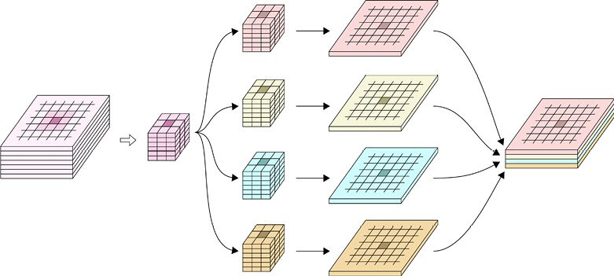

> **圖片描述：** 多通道輸入經過多個過濾器產生多通道輸出的完整流程。左側為多層輸入張量，中間的多個三維過濾器分別處理輸入產生各自的輸出，最右側所有輸出堆疊成新的多通道張量。

圖21.37　當我們使用過濾器對輸入進行卷積時，每個過濾器必須具有與輸入一樣多的切片數。這裡的輸入張量為6個通道，所以每個過濾器是6個通道。4個過濾器各自創建1個通道的輸出，所以最終輸出有4個通道

雖然原則上我們應用的每個過濾器可以具有不同的足跡，但實際上我們幾乎總是在任何給定的卷積層中對每個過濾器使用相同的足跡大小。例如，在圖21.37中，所有過濾器的佔用空間均為3像素×3像素。如果另一個卷積層跟隨此層，則新層上的過濾器可以具有任意大小的佔用空間。

我們將在下面看到卷積層如何為我們管理所有這些計數。先前，將圖21.37 的整個操作添加到我們的網路中，我們需要做的就是指定需要的4個過濾器，每個尺寸為3像素×3像素，深度為6像素。如果庫可以自動匹配輸入張量的深度，它將給我們製作4個尺寸為3像素×3像素×6像素的過濾器，並用隨機值初始化它們。在正向傳播期間，過濾器將全部被應用，且結果會組合成4個通道的輸出。在反向傳播期間，將調整每個過濾器中的54個值（3×3×6）以改善網路輸出的誤差。

### 21.4.2　層次結構的步幅

我們之前看到，在尺寸不斷縮小的圖像上使用一系列卷積可以讓我們有效地查找由大量元素組成的對象。跨步使這變得容易，因為它本身允許我們輸出一幅小於輸入尺寸的圖像。例如，如果步幅在某個維度上是2個單位，則輸出在該維度將變為原尺寸的1/2。如果步幅為3個單位，則該維度的輸出將為原尺寸的1/3，以此類推。

假設我們從一個600像素×600像素的黑白圖像開始，如圖21.38所示。我們的第一個卷積將應用8個過濾器給這個600像素×600像素的圖像，每個過濾器的尺寸為5像素×5像素。我們將用兩行0填充圖像，故圖像不會因此變小，但將使用大小為2的步幅。這意味著我們將獲得一個尺寸減半（即300像素×300像素）的圖像，它帶有8個通道。

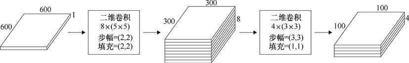

> **圖片描述：** 兩層卷積操作的尺寸變化示例。600x600x1的輸入經過第一次二維卷積（8個5x5過濾器，步幅2，填充2）變為300x300x8，再經第二次卷積（4個3x3過濾器，步幅3，填充1）變為100x100x4。

圖21.38　創建卷積的層次結構。第一個卷積在完整的600像素×600像素圖像上工作。第二個工作在300像素×300像素的圖像上，其中包含第一階段的8個過濾器的結果。每個階段都使用前一階段的低分辨率版本，因此它可以使用更大的特徵集合，而**無須**更大的過濾器

現在我們將在此圖像上運行4個新過濾器，每個過濾器是3像素×3像素的，帶有4個通道。我們將使用3步的步幅和2位的填充，得到的張量尺寸為100像素×100像素×4像素。

由於圖像在每一步都按比例縮小，因此每組後續的過濾器都使用較低分辨率的圖像工作。這意味著它們運行得更快，並且可以尋找更大的特徵，因為300像素×300像素的圖像上的3像素×3像素的過濾器可以被大致認為是前一層600像素×600像素的圖像上的6像素×6像素的過濾器。

從概念上講，我們第一次卷積的過濾器之一可能正是實作了蟾蜍假設的尋找“淺色斑點”，而另一個過濾器在尋找“有翅膀的東西”。然後，下一個卷積可以同時關注這兩個結果，並且尋找“有翅膀的斑點”。

我們可以保持這種縮小，直到最終只有一個張量，其一邊只有一個像素，雖然這在實踐中是罕見的。如上所述，唯一的規則是每一步的過濾器必須讓它們所處理的圖像中的每個通道都有一個切片。

在這個例子中，我們在卷積過程中使用跨步來降低圖像的分辨率，有時稱為**下采樣**（downsampling）。另一種方法是不進行跨步（即水平和垂直地移動過濾器時只移動一個像素），然後緊接著使用池化層執行操作。近年來，經驗表明，在進行卷積時用跨步進行下采樣更快，並且通常可以提供同樣好或更好的結果，因此它成為更常見的慣用語[Springenberg15]。儘管如此，許多流行的架構仍然使用池化，這些架構至今仍在使用，因此熟悉該技術非常重要。

我們經常反過來運行這個過程，增加圖像中的像素值，比如從100增加到300。我們可以利用本書第20章所討論的上取樣層進行這樣的處理，稱為**上取樣**。但就像下采樣一樣，我們可以在計算卷積本身時實作分辨率的提高。我們將在本章後面部分看到這是怎麼實作的。

## 21.5　一維卷積

在之前的討論中，我們討論了在三維輸入圖像（高度、寬度和一個或多個通道）上水平和垂直地移動卷積核。如我們所討論的，灰度圖像具有一個通道，彩色圖像具有3個通道，黑白圖像具有4個通道，而其他的顏色表示方式可具有別的通道數。回想一下，我們不會在深度維度上移動過濾器，因為過濾器本身具有與輸入圖像一樣多的通道。

如果輸入不是三維的怎麼辦？我們可以將其討論推廣到更小和更大的張量，這涉及分別在更少或更多維度上移動張量。

一個有趣的特殊情況是**一維卷積**（1D convolution）。這僅涉及沿一個方向移動過濾器[Snavely13]。這是處理文本的一種流行技術，其中每行代表一個單詞，或固定數量的字母[Britz15]。

一維卷積的基本思想如圖21.39所示。我們創建一個或多個過濾器，它們具有整個輸入矩陣的寬度，我們可以在每行中放置一個文本單詞。一旦計算了每個過濾器的輸出，我們就將它向下移動一行。“一維卷積”這個名稱來自這個單一的運動方向或維度。

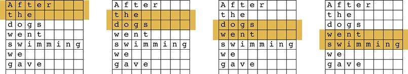

> **圖片描述：** 一維卷積在文本處理中的應用。四個面板展示不同大小的滑動窗口在句子「After the dogs went swimming we gave」上移動，黃色高亮區域依次覆蓋不同長度的文字片段。

　(a)　　　　　　　　　　　　　　　　　　　　　　 (b)　　　　　　　　　　　　　　　　　　　　　　 (c)　　　　　　　　　　　　　　　　　　　　　　　(d)

圖21.39　在一維卷積中，我們創建一個具有整個網格寬度的過濾器，並一次向下移動一行。該名稱來自僅在一個方向（或維度）上移動過濾器

正如之前看到的，我們可以在網格上移動多個過濾器，每個過濾器具有不同的高度。

任何時候只在一個維度上移動過濾器，我們可以稱之為“一維卷積”。它在二維網格上的應用十分直觀，但我們同樣可以在任意維數的輸入上做一樣的事情，只要僅沿輸入的一個維度上移動過濾器。

由於其名稱，一維卷積很容易與1像素×1像素的過濾器的卷積混淆，後者通常也稱為**1×1卷積**。這兩個想法非常不同。現在我們來看1×1卷積。

## 21.6　1×1卷積

我們已經瞭解瞭如何使用多個過濾器來創建多個輸出。而隨後的卷積步驟可以使用那些過濾器的輸出作為輸入來使用新的過濾器。

但是，如果我們只是想以某種方式組合過濾器輸出，而不是使用一個大足跡呢？

例如，我們可能有一個會發現紅色圓圈的過濾器，以及另一個會發現綠色線條的過濾器，我們希望找到同時包含紅色圓圈和綠色線條的像素（這些像素會是黃色）。

我們可以構建一個1×1過**濾器**（1 by 1 filter），並使用它來執行**1×1卷積**[Lin14]。

這是一個僅佔用一個像素的過濾器。它是正常的卷積，因為我們會在輸入張量上用此過濾器進行掃描，將輸入中的值乘以過濾器中的權重，生成結果，並將其保存在新的輸出張量中。唯一的區別是過濾器的足跡只是兩個維度中的單個像素。圖21.40直觀地展示了這一點。

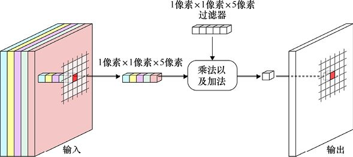

> **圖片描述：** 1x1卷積的操作原理。多通道輸入張量的每個像素位置提取一個1x1x深度的柱狀向量，與同尺寸的過濾器進行點乘加總，產生輸出圖像中對應位置的一個值。

圖21.40　用1像素×1像素的過濾器來執行1×1卷積掃描

這麼小的過濾器有什麼意義呢？1×1卷積的一個強大應用是動態地進行**特徵縮減**。這是一個熟悉的想法：在第12章中我們看到了如何使用像PCA這樣的演算法來預處理資料以減少特徵的數量，從而提高演算法的性能。在這種情況下，我們的1×1過濾器指定了一種方法，將元素中的所有值投影到一條線上，這樣我們只需用一個值來表示它。

這種操作的價值是雙重的。首先，它使得要處理的資料更少，因此計算速度更快，佔用的記憶體更少。其次，網路通常能夠產生更好的結果，因為它可以將所有計算能力引導到有用資訊上，而不是將其浪費在冗餘特徵上。

現在看看1×1卷積如何為我們實作特徵縮減的。假設我們從一個有300層的張量開始，如圖21.41所示。我們懷疑這些層中的大量資料是多餘的，並認為其實只需175層即可獲得良好的結果。

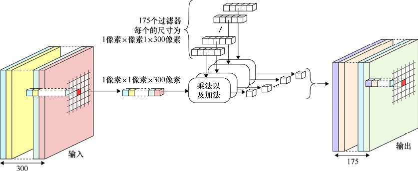

> **圖片描述：** 使用175個1x1過濾器的卷積操作。輸入為300通道的張量，每個1x1x300的過濾器處理每個像素位置，175個過濾器產生175通道的輸出張量。

圖21.41　應用1×1卷積來執行特徵縮減

我們可以製作175個過濾器，每個過濾器的足跡為1像素×1像素。每個過濾器將查看位於一個像素下的所有300個值，並因此產生單個值作為結果。通過訓練，每個過濾器都可以從這300個輸入值中提取一個有用的測量值。結果是隻有175層的張量，因此使得之後所有操作的速度幾乎快一倍。如果我們對175的猜測是正確的，那麼仍然可以從網路獲得可接受的結果，且時間和記憶體消耗更少。

當特徵**相互關聯**時，這個過程在實踐中通常是很有效的[Canziani16]。這意味著前面那些過濾器層已經創建了彼此同步相關的結果，因此當一個上升時，我們可以預測有多少其他特徵將上升或下降。這種相關性越好，我們就越有可能刪除一些相關層而幾乎不會丟失資訊。1×1過濾器非常適合這項工作。

將執行1×1卷積的層插入多層的網路中可以提高它們的性能，如“盜夢空間”（Inception）的結構所演示的這樣[Szegedy14]。

## 21.7　卷積層

我們已經談了很多關於**卷積層**的內容，但沒有多說它們是如何工作的。我們現在來解決這個問題。

當創建一個卷積層時，我們通常會告訴庫我們想要多少個過濾器，它們的足跡應該是什麼樣的，以及其他可選的細節，比如，我們是否要使用跨步和我們想要使用的激活函數，而庫負責所有剩餘的部分。最重要的是，它會通過反向傳播來改進每個過濾器中的權重，並學習使過濾器產生最佳結果的最佳值。

如上所述，卷積層的輸出是張量，每個過濾器產生一個切片。由於每個過濾器都設計為與輸入中的一個特徵匹配，因此卷積層的輸出有時稱為**特徵圖**或**特徵映射**（feature map）。“映射”這個詞來自它的數學含義。在這裡，我們可以將這個“映射”視為告訴我們每個特徵在其輸入中的位置，較大的值表示增加的可能性。

當繪製模型圖時，我們通常會通過過濾器使用數量、足跡和激活函數來確定卷積層。通常，預設情況下不應用填充而使用步幅為(1,1)的跨步，因此，如果想要這些選項的不同值，我們會明確地包含它們。由於在輸入周圍使用相同的填充是很常見的，我們通常只提供單個值而不是兩個，並且知道它適用於所有維度。因此，填充3表示二維時的(3,3)或三維時的(3,3,3)。

一些庫會自動計算所需的填充量，以保持輸出與輸入的大小相同，因此，我們所要做的就是要求填充，而不是明確告訴它填充多少。圖21.42展示了兩個卷積層的圖形符號，以及傳統的文本框形式。

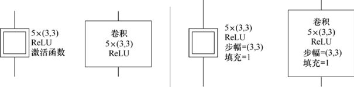

> **圖片描述：** 卷積層的圖形符號和文本框表示法對照。左側為圖標版本，右側為文本框版本，展示帶有和不帶有步幅/填充參數的卷積層表示方式。

(a)　　　　　　　　　　　　　　　　　　　　　　　　　　　　　　 (b)

圖21.42　兩個卷積層。每個都以圖形符號和傳統的文本框形式展示。(a)具有5個過濾器的卷積層，每個過濾器都是3像素×3像素的，並具有ReLU激活函數。暗含步幅是(1,1)，而且也沒有填充。(b)與(a)部分層相同，但現在具有明確的(3,3)步幅，以及輸入周圍的單個零填充環

### 初始化過濾器權重

當創建新的卷積層時，我們還會創建所有必需的過濾器。我們還沒有學習任何東西，所以不知道過濾器卷積核內的權重應該是多少。但就像常規人工神經元的權重一樣，它們必須用**某些東西**進行初始化。

如果兩個過濾器具有相同的權重，我們就會浪費資源，因為兩者會做同樣的工作。我們說兩個這樣的過濾器具有**對稱性**（symmetry）。我們希望防止這樣的過濾器形成，所以我們絕對不希望用相同的值初始化兩個過濾器。因此，為每個過濾器分配不同的值稱為**對稱性破壞**（symmetry breaking）。

一個對稱性破壞的初始化方法是使用小的隨機數，例如來自[−0.01,0.01]範圍的數。這使得任何過濾器不太可能恰好複製任何其他的過濾器。

這為初始化的研究帶來了其他方法。兩種流行的技術都是以它們論文中的主要作者命名的。它們是Glorot**初始化**（也稱為Xavier**初始化**）[Glorot10]和He**初始化**[He15]。回想一下，我們在第16章中看到了這些不同的初始化器。

這兩種技術都有相同的概念：初始值是隨機數，根據神經元的輸入數量選擇，稱為**扇入**。Glorot初始化和He初始化都從使用扇入作為參數的一個分佈中選擇隨機值 [Jones15]。

這些方法的一個很好的特性是它們不採用其他參數，特別是沒有用戶指定的參數。我們只需要告訴庫我們想要哪個初始化，之後它就會完成其餘的工作。在沒有深入理論的情況下，目前的建議是，如果我們的庫提供He初始化作為選項，那麼應該使用它[Karpathy16]；否則，可以使用Glorot初始化或隨機值。

## 21.8　轉置卷積

到目前為止，我們看過的卷積層要麼保持輸入的大小，要麼使它變小。但是我們可以使用相同的技術來使輸入張量變大。此過程稱為**上取樣**。當我們在卷積步驟中進行時，它稱為**轉置卷積**（transposed convolution）或**分數步幅**（fractional striding）。“轉置”一詞來自轉置這一數學運算，我們可以用它來為這個運算寫出方程。我們將在下面看到“分數步幅”這個名稱是怎麼來的。

一些作者在進行**反捲積**（deconvolution）時將之稱為上取樣，但這個名稱已經被一個不同的概念[Zeiler10]所採用。為了避免混淆，大多數人現在都不再使用這個術語，而是更喜歡用上述兩個術語中的一個。在本章中，我們將使用術語“轉置卷積”。

讓我們看看它是如何工作的。我們首先重新審視沒有填充的基本卷積，創建一個小於輸入的輸出。在圖21.43中，我們在5像素×5像素的輸入上移動3像素×3像素的過濾器，得到3像素×3像素的輸出。

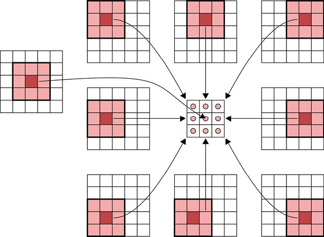

> **圖片描述：** 多個過濾器的最大池化操作。周圍12個位置展示不同的輸入區域（粉紅色高亮），中央的3x4網格收集每個區域的最大值，紅色圓圈標記結果。

圖21.43　使用3像素×3像素的過濾器對5像素×5像素的輸入圖像進行卷積。這裡我們沒有使用任何填充， 因此過濾器不能以最外面的像素環為中心。外部形狀展示了輸入圖像和3像素×3像素的過濾器在圖像上移動時的足跡。中心圖是由此產生的3像素×3像素的圖像

如果我們對原始5像素×5像素的圖像使用單個零填充環，那麼使用相同的過濾器將給出一個5像素×5像素的圖像，如圖21.44所示。

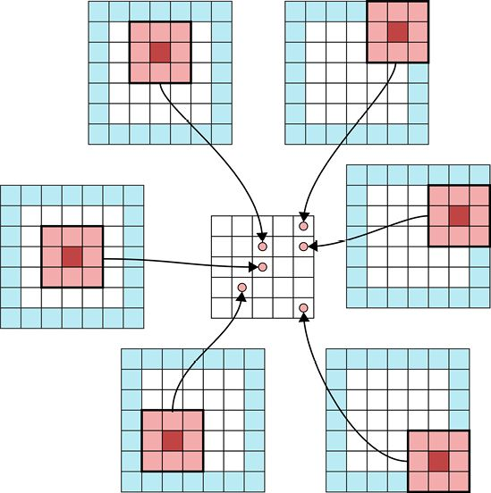

> **圖片描述：** 帶步幅的最大池化操作。類似結構但加入了步幅2的採樣，周圍的藍色邊框區域較大，中央輸出更小，展示池化如何同時縮小空間尺寸。

圖21.44　與圖21.43中的設置相同，只是現在5像素×5像素的輸入圖像被零填充了一個像素寬。我們展示了3像素×3像素的過濾器的幾個代表性放置，以及它們產生的元素。該輸出圖像是5像素×5像素的，因此輸入和輸出具有相同的大小

如果我們對過濾器使用跨步，那麼輸出將再次變得小於輸入。例如，60像素×60像素帶有填充的輸入和每個方向步幅值為3將產生20像素×20像素的輸出。

現在讓我們來使輸入比開始時更大[Dumoulin16]。假設有一個尺寸為3像素×3像素的原始圖像，我們希望用3像素×3像素的過濾器處理它。我們想以5像素×5像素的**圖**結束。我們所要做的就是用兩個0的環填充或環繞輸入，如圖21.45所示。

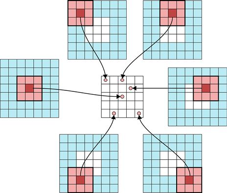

> **圖片描述：** 帶步幅3的最大池化操作。進一步增大步幅，輸出更加縮小，展示不同步幅對輸出尺寸的影響。

圖21.45　使用轉置卷積，輸出圖像可以比輸入圖像更大。原來的3像素×3像素的輸入在外層網格中以白色顯示，並用兩個0的環填充周圍。3像素×3像素的過濾器現在產生了5像素×5像素的結果，如中間的圖片中心所示

我們可以使用更多的0環來使輸出更大，但這只會在輸出中產生0值的環。

獲得更大結果的另一種方法是通過在輸入像素周圍和之間插入填充來展開輸入圖像。這個方法稱為**空洞卷積**（dilated convolution）。讓我們在開始的3像素×3像素的圖像的每個輸入間插入一個0行和列，並用2個0的環填充所有這些區域。這使得3像素×3像素的輸入變成了9像素×9像素。當我們在這個網格上掃描3像素×3像素的過濾器時，將獲得7像素×7像素的輸出。因此，我們將原來的3像素×3像素的輸入放大為7像素×7像素的輸出，如圖21.46所示。

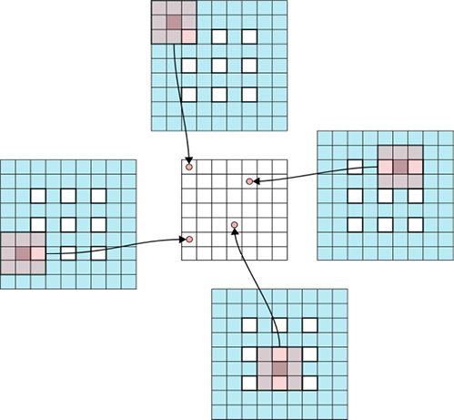

> **圖片描述：** 平均池化操作（步幅2）。與最大池化類似的結構，但中央網格中的值為各區域的平均值而非最大值，周圍展示輸入區域。

圖21.46　空洞卷積。原來的3像素×3像素的圖像顯示為外圍網格中的白色像素。我們在每個像素之間插入了一行和一列的0值，然後用兩個0值環包圍整個區域。當我們用3像素×3像素的過濾器對此網格進行卷積時，將得到7像素×7像素的結果，如中間所示

通過在每個原始輸入像素之間插入兩行和兩列來讓輸出更大，如圖21.47所示。現在我們的輸入是11像素×11像素，輸出是9像素×9像素。

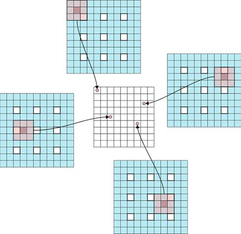

> **圖片描述：** 平均池化操作（步幅3）。更大步幅的平均池化，展示區域平均值如何匯聚到更小的輸出網格中。

圖21.47　與圖21.46相同的設置，只是現在原始輸入像素之間有兩行和兩列0值，產生了如中間所示的9像素×9像素的結果

我們可以在原始像素之間選擇任意多的0值行和0值列，以及隨我們喜好的0值環。但是我們必須關注過濾器的大小。比如，如果我們在每個輸入像素之間放置3 行和3列0值，並且使用3個像素寬的過濾器，它將在輸出網格中引入垂直和水平方向的0值直線。我們很少想要這個，所以我們通常會保持額外插入的行數和列數小於過濾器的大小。在這種情況下，使用兩行兩列是在用3像素×3像素的過濾器卷積前我們所想應用得最多的數目。這種插入0的技術並非萬無一失，並可能在輸出張量上創造小的棋盤狀人工物。但是這些可以通過庫程式來避免，如果它們採取措施小心謹慎地處理卷積和上取樣[Odena16]。

轉置卷積和跨步之間存在聯繫。通過一些想象，我們可以將像圖21.47那樣的一個轉置卷積過程描述為像在每個維度中使用1/3的步幅一樣。我們並不是真的移動1/3像素，而是需要用3步來移動原始輸入中相當於1步的過程。這種觀點導致一些作者將轉置卷積稱為**分數步幅**。

正如步幅讓我們將卷積與下采樣步驟相結合，轉置卷積（或分數步幅）讓我們將卷積與上取樣步驟相結合。下采樣和上取樣步驟都可以由相同名稱的一個層來執行。在卷積期間進行的下采樣或上取樣與使用單獨網路層相比，可能產生略有不同的結果，但經驗表明，將它們組合在一起通常更快更有效，並且它通常會產生同樣好的結果[Springenberg15]。

## 21.9　卷積網路樣例

為了演示如何在實踐中使用卷積層，讓我們看幾個圖像分類器：第一個將識別灰度手寫數字；第二個將識別彩色照片中的特徵對象，它從1000個不同的類別中進行選擇。

對手寫數字進行分類是機器學習中的一個著名問題[LeCun89]。我們首先對MNIST資料集中的手寫數字進行分類。

MNIST資料集收集了來自各種各樣的人的數萬個手寫數字。數字為0～9，每個都保存為28像素×28像素的灰度圖像。我們的任務是識別每個圖像中的數字。

我們將使用一個專為這項工作設計的簡單的卷積神經網路，它被包含於Keras機器學習庫[Chollet17a]。它的結構用我們的原理圖形式和傳統的文本框形式展示在圖21.48中。

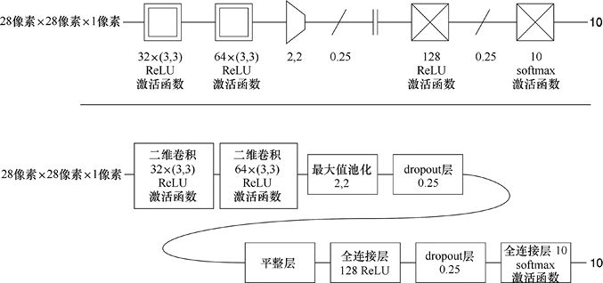

> **圖片描述：** MNIST手寫數字分類的CNN架構。上半部分為圖形符號表示：輸入28x28x1，經過32個3x3卷積（ReLU）、64個3x3卷積（ReLU）、2x2最大池化、0.25 dropout、平整層、128神經元全連接層（ReLU）、0.25 dropout、10類softmax輸出。下半部分為對應的文本框表示。

圖21.48　用於對MNIST資料集進行分類的卷積神經網路。輸入圖像是28像素×28像素×1像素。兩個卷積層之後是池化、dropout層和平整層，然後是一個全連接層（具有dropout）和具有10個輸出的最終softmax層。該網路歸功於[Chollet17a]。上方：我們的原理圖形式。下方：傳統的文本框形式。

網路的輸入是MNIST資料集中的圖像，分辨率為28像素×28像素×1像素。卷積神經網路的核心位於前兩層，它們執行卷積操作。

第一個卷積層在輸入上運行32個大小為3像素×3像素的過濾器。每個過濾器輸出的結果在離開網路層之前都要通過ReLU 激活函數。

請記住，我們只是告訴系統我們需要32個3像素×3像素的過濾器。它辨識出輸入只有一個通道，因此它創建的過濾器大小是3像素×3像素×1像素。由於我們沒有指定初始化方法，庫使用其預設值（在Keras，這會是Glorot初始化）。每個方向的步幅預設為1，且沒有應用填充。正如我們在上面看到的，這意味著最外面的像素環將不會直接體現在輸出上，輸出圖像將是26像素×26像素，但這沒關係，因為所有MNIST圖像在數字周圍應該有4個黑色像素的邊界（並非所有圖像都有此邊框，但大多數都有）。

所以第一層的輸入張量是28像素×28像素×1像素，輸出張量是26像素×26像素×32像素。

第二步是另一個卷積層，這次是64個3像素×3像素的過濾器。系統知道輸入有32個通道，因此每個過濾器的大小為3像素×3像素×32像素。輸入張量是26像素×26像素×32像素。由於我們在這裡也使用預設步幅和填充，意味著我們失去了另一個圍繞圖像外部的環形，所以產生形狀為24像素×24像素×64像素的輸出張量。

我們可以用步幅來減小輸出的大小，但在這裡，我們使用塊大小為(2,2)的一個顯式最大池化層。這意味著，對於輸入中每個非重疊的2像素×2像素的塊，該層只輸出塊中的最大值。因此，該層的輸出是12像素×12像素×64像素的張量（池化不改變通道數）。

接下來是一個dropout層。由於最大池化層中沒有神經元，它影響的是最近的卷積層，這裡是有64個過濾器的那個。在每輪訓練中，該層中1/4的神經元將被暫時禁用。這應該有助於防止過擬合。

dropout層實際上只是給運行網路的程式碼發指令，而它不執行任何操作。因此，從dropout層輸出的張量與輸入的張量相同，即12像素×12像素×64像素。

現在我們離開網路的卷積部分，併為輸出值做準備。這些步驟或類似的步驟通常位於分類卷積網路的末尾。

首先，我們在平整層將輸入張量展平，使它成為12×12×64 = 9216個數字的大列表。然後，該列表被輸入一個完全連接（或密集）的有128個神經元的dropout層。該層也受到dropout的影響，其中1/4的神經元在每一輪開始時被暫時斷開。

上述全連接層的128個輸出進入具有10個神經元的最終全連接層。該層的10個輸出進入softmax層，以便將它們轉換為機率。從最後一層出來的10個數字為我們提供了網路對輸入圖像是相應數字的預測機率。

我們使用標準MNIST資料集對網路進行共12輪訓練。該網路在訓練和驗證資料集上的準確率如圖21.49所示。

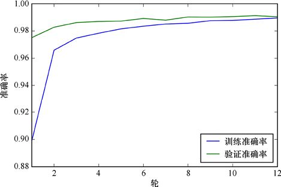

> **圖片描述：** CNN模型在MNIST上的訓練過程曲線圖。藍色線為訓練準確率，綠色線為驗證準確率，x軸為訓練輪數（1至12），y軸為準確率（0.88至1.00）。兩條線都持續上升並趨近1.0。

圖21.49　圖21.48中卷積神經網路的訓練表現。我們訓練了12輪。可以看出，訓練和驗證曲線沒有發散，我們成功地避免了過擬合，同時在兩個資料集上達到了99%以上的準確率

圖21.49顯示該網路在訓練和驗證資料集上的準確率大約為99%。由於曲線沒有發散，我們成功地避免了過擬合。

讓我們看一些預測。圖21.50展示了來自MNIST驗證集的一些圖像，以及對應於網路最大機率的數字。在這一小部分例子中，它做得很好。

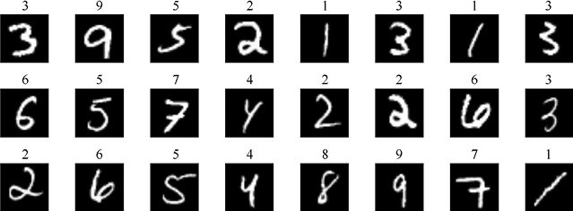

> **圖片描述：** MNIST手寫數字樣本集。21張白色手寫數字在黑色背景上的圖像排成3行7列，上方標示正確標籤數字，展示數據集中不同書寫風格的數字樣本。

圖21.50　這些是來自MNIST 驗證集的24個隨機選擇的圖像。每個圖像都標有網路輸出，顯示的是機率最高的數字。事實上，對於所有這些圖像所顯示的標籤的預測機率幾乎為1，而對於所有其他數字幾乎為0。網路正確分類了所有這24個數字

這個小小的卷積神經網路在兩個卷積層中完成了它的大部分工作，且每個卷積層只在圖像上運行3像素×3像素的小過濾器。但這足以使系統能夠正確識別驗證集中99%的數字。

由於這種技術的表現，卷積已經成為深度學習體系的主要技術，可以處理圖像和體積塊，以及我們在本章開頭提到的其他應用。

在本書第23章和第24章中，我們將看看如何實際用Keras庫編寫程式碼構建卷積網路。

### 21.9.1　VGG16

現在讓我們看一個更大、更強的卷積網路，它能夠識別彩色照片中的1000種不同對象。

ILSVRC 2014競賽是2014年的一場公開挑戰賽，要求人們構建神經網路來對競賽主辦方提供的包含各種圖像的資料庫進行分類[Russakovsky15]。

該競賽提供的訓練資料包含120萬個圖像，每個圖像被人工標記為能夠用網路識別的1000種目標中的一種。該競賽實際上包括幾個次級挑戰，每個挑戰都有獲勝者[Imagenet14]。其中一項分類任務的獲勝者是名為VGG16 [Simonyan14]的網路。VGG是開發該系統的團隊“Visual Geometry Group”的首字母縮寫。16指的是網路擁有16個計算層（還有一些用於池化和填充的工具層）。

VGG16系統與圖像分類器一同工作已經變得流行了。其作者已經發布了所有權重值以及他們如何預處理訓練資料，並且網路本身易於理解、修改及用作其他網路的原型。

因此，我們可以在自己的程式碼中輕鬆創建完整版本的VGG16，並立即使用它來分類圖像，無須訓練時間。但是如果我們想要觀察該系統，或者教它新技巧，則需要從訓練好的模型開始並改變它。

我們來看看VGG16的架構。與前面看到的用於對MNIST資料集進行分類的卷積神經網路一樣，VGG16的大部分工作都是通過一系列卷積層完成的，中間也出現一些工具層，最後有一些平整層和全連接層。

在每次卷積之前，我們對圖像進行填充，這樣就不會丟失外圍的像素。

卷積層（具有零填充）按2或3層重複再整體進入序列中。在段序列的最後，有一個最大池化層，其尺寸為2像素×2像素，每個維度的步幅為2，因此輸出張量在寬度和高度上都減半。

在向模型提供任何資料之前，我們必須按照其作者的方式預處理訓練資料。這涉及確保圖像的大小為224像素×224像素，並且通過從所有像素中減去特定值來調整每個通道[Simonyan14]。預處理完成後，我們就已準備好將圖像提供給網路。

我們將VGG16的架構呈現為一系列塊（共6個）。圖21.51展示了第一個塊。輸入是大小為224像素×224像素的3個通道（分別是紅色、綠色和藍色值）的彩色圖像。該輸入圖像進入兩個連續的填充−卷積步驟，然後由於最大值池化步驟在每個維度上都減小一半。

> **圖片描述：** VGG16的塊1架構。輸入224x224x3圖像，經過兩個零填充+64個3x3卷積（ReLU）層，最後接一個2x2最大池化（步幅2x2），以圖形符號表示。

圖21.51　VGG16的第一個塊。輸入是零填充的，帶有一個0環，然後我們應用64個過濾器，每個過濾器的大小為3像素×3像素。然後我們對該結果進行零填充，並在其上運行另一組64個過濾器，每個過濾器的大小還是3像素×3像素。最後，我們使用最大池化將每個原始圖像的大小減半

在圖21.51中可以看到，我們已經將初始處理分為兩個相同的池化步驟，然後進行卷積。輸出張量的大小為112像素×112像素×64像素。

然後該張量流入下一個塊，如圖21.52所示。這個塊和第一個塊很像，只是我們在每個卷積層中應用了128個過濾器。

> **圖片描述：** VGG16的塊2架構。兩個零填充+128個3x3卷積（ReLU）層，最後接一個2x2最大池化。

圖21.52　VGG16的第二個塊與圖21.51中的第一個塊類似，不同之處在於我們在每個卷積層中使用128個過濾器而不是64個過濾器

第三個塊繼續這種將每個卷積層中的過濾器數量加倍的模式，但它重複填充−卷積步驟共3次而不是兩次，如圖21.53所示。

> **圖片描述：** VGG16的塊3架構。三個零填充+256個3x3卷積（ReLU）層，最後接一個2x2最大池化。

圖21.53　VGG16的第三個塊再次將過濾器的數量加倍為256，並重復填充-卷積步驟3次而不是之前的兩次

網路的第4個和第5個塊是相同的。每個塊由3對填充−卷積構成，然後是最大池化層。這些層的結構如圖21.54所示。

> **圖片描述：** VGG16的塊4架構。三個零填充+512個3x3卷積（ReLU）層，最後接一個2x2最大池化。

圖21.54　VGG16的第4個和第5個塊是相同的。它們每個都有3對填充−卷積，然後跟著最大池化層

這些就是卷積塊，下面我們來看最後的處理步驟。與第一個卷積神經網路樣例一樣，我們首先將第5個塊中的張量展平，然後通過兩個各有4096個神經元的全連接層計算它們，每個全連接層後面都有截止率為50%的dropout設置。最後，輸出進入一個有1000個神經元的全連接層，每個神經元對應一個類別，其產生1000個機率的輸出，每個類別一個，如圖21.55所示。

> **圖片描述：** VGG16的全連接層部分。平整層後接兩個4096神經元全連接層（各帶ReLU和0.5 dropout），最後為1000類softmax輸出層。

圖21.55　VGG16中處理的最後步驟。我們將圖像展平，然後通過兩個全連接層計算它們，每層後都使用dropout。然後我們進入一個具有1000個神經元的全連接層，並通過softmax激活函數輸出一個有1000個機率的列表，每個機率對應該圖像屬於對應類別的可能性

圖21.56展示了VGG16的整體架構。

如果我們要重構VGG16，那麼可能會移除最大池化層，並在每個重複塊的最後一個卷積層中使用2×2的步幅。

> **圖片描述：** VGG16的完整架構圖。分為兩行，從輸入224x224x3開始，依次展示5個卷積塊（塊1至塊5，分別重複2、2、3、3、3次），各塊之間有最大池化，最後接全連接層和softmax輸出。

圖21.56　VGG16的整體架構

在第20章中，我們看到了許多在VGG16沒見過的圖像上使用VGG16的例子。為了好玩，我們給出了於陽光明媚的一天在西雅圖周圍拍攝的4張照片，如圖21.57所示。VGG16從來沒有見過這些圖像，即使是在驗證過程中，但它確實表現得很好。

> **圖片描述：** VGG16對四張照片的分類結果。左上：石頭牆，正確識別。右上：圓桌，猜為陶鉤等。左下：折疊椅，得分最高的是餐桌。右下：黑色拉布拉多犬，被正確識別為捲毛尋回犬。

圖21.57　我們於陽光明媚的一天在西雅圖周圍拍攝的4張照片。圖21.56中的VGG16在識別每張圖像方面都做得很好

### 21.9.2　有關過濾器的其他內容：第1部分

VGG16在圖像分類方面做得很好，這在很大程度上要歸功於其通過卷積層學習到的過濾器。看看過濾器學到了什麼似乎是有用的。

但過濾器本身只是3像素×3像素的，這對我們來說太小了，感覺不出它們有多大意義。但我們可以通過查看觸發每個過濾器的圖像間接地看到它們。換句話說，一旦選擇了一個所要可視化的過濾器，我們就可以找到一張使該過濾器輸出其最大值的圖片。

我們可以用一個基於梯度下降的小技巧來做到這一點。梯度下降是我們在第18章中使用的作為反向傳播的一部分的演算法。但現在我們將使用梯度**上升**來**攀爬**梯度。該技術從−1充滿隨機噪聲的圖像開始。首先測量我們感興趣的過濾器的輸出，然後使用網路中的梯度來修改輸入圖像中的像素。我們不接觸網路中的權重或其他任何東西，因為這不是在學習任何東西，但可以使用梯度來告訴我們如何修改像素，以便使輸入圖像能更多地刺激過濾器。我們一遍又一遍地這樣做，直到過濾器能實作最大輸出[Zeiler13]。

從某種意義上說，生成的圖像是過濾器“正在尋找的”。由於我們從隨機值開始，因此我們每次都會得到不同的最終圖像，不過它們都是相似的，因為它們都是基於最大化相同的過濾器而來的。

讓我們看一下利用這種方法產生的一些圖像。圖21.58展示了從VGG16的第一個塊的第2個卷積層的64個過濾器中獲得最大響應的圖像（我們將用標籤block1_conv2表示該層，並用其他類似的名字表示我們將看到的其他層）。

> **圖片描述：** VGG16第一卷積塊（block1_conv2）的64個過濾器視覺化。8x8網格展示64個不同的過濾器圖案，包含純色、條紋、漸變等各種低階特徵。

圖21.58　從VGGG16的block1_conv2層中的64個過濾器中獲得最大響應的圖像

看起來，圖中很多過濾器都在尋找不同寬度和方向的條紋，這會是尋找邊緣的好方法。一些過濾器看起來在尋找不同類型的邊界，有一些值對於我們來說太精細了難以充分利用，而右下方的過濾器看起來像是一個有許多眼睛的、令人毛骨悚然的東西。

讓我們向上移動到第3個塊，然後查看第一個卷積層中的前64個過濾器。圖21.59展示了最能刺激這些過濾器的圖像。

> **圖片描述：** VGG16第三卷積塊（block3_conv1）的過濾器視覺化。多個過濾器顯示更複雜的紋理圖案，包括格子、波浪、交叉線等中階特徵。

圖21.59　從VGGG16的block3_conv1層中的前64個過濾器中獲得最大響應的圖像

從這些圖像可以看出，這裡的過濾器似乎在尋找更復雜的紋理，儘管仍然有很多條紋。讓我們繼續前進，看看第4個塊的第一個卷積層的前64個過濾器中獲得最大響應的圖像，如圖21.60所示。

> **圖片描述：** VGG16第四卷積塊（block4_conv1）的過濾器視覺化。過濾器圖案更加複雜和抽象，包含漩渦、同心圓、複雜紋理等高階特徵。

圖21.60　從VGGG16的block4_conv1層中的前64個過濾器中獲得最大響應的圖像

這些圖像變得越來越有趣。過濾器似乎正在尋找描述許多不同類型的流動和互相咬合形狀的圖案。

僅是為了好玩，讓我們來看看其中一些過濾器中圖像的特寫。圖21.61展示了前幾層中9種模式的較大視圖。

> **圖片描述：** VGG16精選卷積核的放大視覺化（9個）。3x3網格展示9個具有代表性的過濾器圖案，顯示細膩的紋理、弧線和重複圖案。

圖21.61　一些手動選擇的過濾器中圖像的特寫，這些圖像能觸發VGG16前幾層過濾器的最大響應

圖21.62展示了觸發最後幾層中過濾器最大響應的圖像。

> **圖片描述：** VGG16更多精選卷積核的放大視覺化（9個）。另外9個過濾器圖案，包含更複雜的葉片狀、波浪狀和幾何重複圖案。

圖21.62　一些手動選擇的過濾器中圖像的特寫，這些圖像觸發了VGG16最後幾層過濾器的最大響應

這些圖像美麗得令人興奮。它們也給人有一種充滿生機的感覺，可能是因為VGG16在大量的動物圖像上訓練過。

### 21.9.3　有關過濾器的其他內容：第2部分

查看過濾器的另一種方法是通過VGG16運行相同的圖像，並查看過濾器生成的圖像。也就是說，我們將圖像提供給VGG16並讓它在網路中運行，但我們忽略網路的輸出，僅提取我們感興趣的網路產生的輸出，接著將其繪製出來並旋轉它。

圖21.63展示了一個關於鴨子的輸入圖像。在本小節中我們會把這個圖像用於所有的過濾器輸出可視化。

> **圖片描述：** 一張公鴨的彩色照片。鮮明的綠色頭部、黃色嘴喙、白色頸環和棕色身體，站在雪地上，背景為藍色水面。

圖21.63　我們將用於可視化過濾器輸出的鴨子圖像

為了感受事物，圖21.64展示了來自網路block1_conv1中過濾器0的響應。由於一個過濾器的輸出只有一個通道，故圖像不再是彩色的。我們給它一個從黑色到紅色再到黃色的熱力圖，以顯示0～255的每個元素的值。

> **圖片描述：** 公鴨照片經過偽彩色映射處理的版本。使用熱力圖色彩（紫色到黃色）顯示像素強度值，右側有色彩條標示0到240+的數值範圍，鴨子的輪廓以高亮線條顯示。

圖21.64　VGG16的block1_conv1層中過濾器0對圖21.63中鴨子圖像的響應

看起來這個過濾器在嘗試找到垂直邊緣。當它們從上到下或從左到右變暗時，我們會得到很大的響應。當它們在那些方向上變得更淡時，我們只能得到非常小的響應。

圖21.65展示了block1_conv1層中前32個過濾器的響應。

> **圖片描述：** 公鴨圖像經過VGG16第一卷積層（block1_conv1）各過濾器處理後的32張特徵圖。4行8列排列，每張以偽彩色顯示，可見不同過濾器對邊緣、顏色、紋理等特徵的響應。

圖21.65　VGG16的block1_conv1層中前32個過濾器的響應

似乎這些過濾器中的很多都在尋找邊緣，但其他的似乎在尋找圖像的特定特徵。讓我們看一下從該層的所有64個過濾器中手動選擇的8個過濾器響應的特寫，如圖21.66所示。

> **圖片描述：** 公鴨圖像的block1_conv1層8張精選特徵圖放大版。2行4列排列，以紫橙色偽彩色顯示，可清楚看到不同過濾器如何強調鴨子的不同視覺特徵。

圖21.66　從VGG16 block1_conv1層中手動選擇的8個過濾器響應的特寫

第一行的第3張**圖**似乎在尋找鴨腳，或者它只是對明亮的橙色東西感興趣。第2行中第一張圖像看起來像是在尋找鴨子後面的波浪和雪，而它右邊的圖像看起來對藍色波浪的響應最大。

讓我們進一步進入網路，到第3個塊的卷積層中。這裡的輸出在每一側都縮小為第一個塊輸出的1/4，因為它們已經經歷了兩個尺寸為2像素×2像素的池化層。我們期望它們尋找特徵集群，而不是直接與鴨子本身相關聯。圖21.67展示了block3_conv1層中前32個過濾器的響應。

> **圖片描述：** 公鴨圖像經過block3_conv1層各過濾器處理後的特徵圖集。4行8列排列，圖案更加抽象，某些過濾器強調輪廓、某些強調紋理區域。

圖21.67　VGG16的block3_conv1層中前32個過濾器的響應

有趣的是，似乎還有很多邊緣尋找正在進行中。明顯的邊緣似乎是VGG16理解圖像顯示內容的一個重要線索。但是有許多區域是明亮的，也許圖像的紋理與過濾器正在尋找的一個或多個圖案相匹配。

讓我們直接跳到最後一個塊。圖21.68顯示了block5_conv1層中前32個過濾器的響應。

> **圖片描述：** 公鴨圖像經過block5_conv1層各過濾器處理後的特徵圖集。4行7列排列，圖案高度抽象，主要顯示亮色斑塊在深色背景上的分佈，代表高階語義特徵。

圖21.68　VGG16的block5_conv1層中前32個過濾器的響應

正如我們所期望的那樣，這些圖像更小了，因為已經又通過兩個池化層，每層將每一邊縮小1/2。此時，鴨子幾乎看不到了，因為系統正在結合前一層的特徵。有些過濾器幾乎沒有響應。它們可能負責尋找鴨子圖像中不存在的高級特徵。

在第28章我們將看到幾個很有創意的應用，它們用卷積層中相應的過濾器來創造藝術。

## 21.10　對手

有一件我們可以對圖像做的令人驚訝的事，這將摒棄VGG16的預測。事實上，這個技巧會打亂任何分類器的結果。

這個“欺騙”我們的卷積網路的訣竅涉及創建一個稱為**對手**的新圖像。該圖像是通過對原始圖像添加**對抗擾動**（adversarial perturbation），或更簡單地說，**擾動**（perturbation）創建的，這是一個我們看起來像隨機噪聲的圖像。如果相同的擾動適用於我們給特定分類器的每個圖像，甚至每個分類器的每個圖像，我們稱之為**普遍擾動**（universal perturbation）[Moosavi-Dezfooli16]。

假設在準備將**圖**交給分類器時，我們首先逐像素地添加這個擾動。這些變化非常小，即使在並排查看前後**圖**時，我們也看不出任何差異。但像素的微小變化恰好能夠使分類器完全陷入混亂並預測看似隨機的類別。

例如，在圖21.69a中，我們看到了一隻老虎的圖像。系統正確地以大約80%置信度將它歸類為老虎，略有一些機率給了相關的動物，如虎貓（小型森林貓科動物）和美洲虎。

> **圖片描述：** 對抗樣本攻擊的示例（老虎）。(a)原始老虎照片，被正確分類。(b)精心設計的噪聲圖像，值域為-2.04到2.04。(c)將噪聲加到原圖後，外觀幾乎不變但被錯誤分類為天鵝、頂針等完全不相關的類別。

圖21.69　對圖像應用擾動。(a)上面是一張老虎的照片，下面是VGG16預測的類別及其機率。(b)由想導致老虎被錯誤分類的程式創建的圖像。我們擴展了像素值，使它們在圖中可視化，但頂部的值顯示它的值在約−2～+2的範圍內。(c)上面是將中間圖像添加到左上角老虎圖像上的結果。在視覺上，老虎看起來不變。下面是VGG16對上圖的預測結果。上圖甚至不被認為是動物

在圖21.69b中，我們展示了一個用於尋找對手的演算法計算的圖像。我們增大了它的值，因此可以更好地看到它們，但頂部的數字顯示原像素在大約−2～+2的範圍內（老虎的像素都在0～255的範圍內）。當我們將這個看似嘈雜的圖像添加到老虎身上時，我們會獲得如圖21.69c所示的圖像。對我們的眼睛來說，它似乎沒有變化。但看看分類的變化！該系統甚至不認為這是一種動物。

對手的驚人之處在於我們可以為任何圖像計算它們。圖21.70展示了扳手背景上的電鑽圖像的擾動。這裡的像素範圍甚至比圖21.69中的更小，但輸出完全改變了。該系統竟然認為這是注射器。

> **圖片描述：** 對抗樣本攻擊的示例（電鑽）。(a)原始電鑽照片，被正確分類。(b)精心設計的噪聲。(c)加入噪聲後外觀幾乎相同但分類結果完全改變，被錯誤分類為注射器等。

圖21.70　對電鑽的圖像應用擾動

讓我們再看一個例子。在圖21.71中，我們添加擾動之前，系統基本上確定這是一隻巨嘴鳥。添加擾動後，系統以大約40%置信度確定它是孔雀，其他可能的種類都是蜥蜴類。

> **圖片描述：** 對抗樣本攻擊的示例（巨嘴鳥）。(a)原始巨嘴鳥照片，被正確分類。(b)噪聲圖像，值域較大（-5.87到5.87）。(c)加入噪聲後被錯誤分類為孔雀、壁蜥等，但信心度較分散。

圖21.71　對巨嘴鳥的圖像應用擾動

人們已經開發了各種演算法來創建對抗圖像[Rauber17a]。通過這些方法為給定圖像創建的擾動中的值的範圍可以變化很大，因此為了找到最小的擾動，通常值得嘗試幾種不同的方法。我們可以告訴這些被稱為**攻擊**的方法應該使用什麼標準來衡量成功。例如，我們可以只要求一個是能導致輸入被錯誤分類的擾動，另一個是要求將導致該輸入被錯誤分類為特定類的擾動。對於上面的圖像，我們要求進行使分類器原來分配的前7個類別都不會出現在對手的靠前類別中的擾動。這其中的許多方法都已經在Python庫中實作了，我們可以將它用於任何類型的分類器和任何圖像[Rauber17b]。

我們必須仔細構建對抗性擾動。它們可能是CNN不可避免的弱點[Gilmer18]。但是它們的存在表明，卷積網路對我們來說仍然存在意外，它們不應該被認為是萬無一失的。有關CNN內部發生了什麼還有很多需要了解的內容。

## 參考資料

[Britz15]　Denny Britz, *Understanding Convolutional Neural Networks for NLP*, WildML Blog, November 2015.

[Canziani16]　Alfredo Canziani, Adam Paszke, Eugenio Culurciello, *An Analysis of Deep Neural Network Models for Practical Applications*, ArXiv 1605.07678, 2016.

[Chollet17a]　François Chollet, *Keras Examples： mnist_cnn.py*, Keras examples git repository, 2017.

[Chollet17b]　François Chollet, *Deep Learning with Python*, Manning Publications, 2017.

[Dumoulin16]　Vincent Dumoulin and Francesco Visin, *A Guide to Convolution Arithmetic for Deep Learning*, 2016.

[Esteva16]　Andre Esteva, Brett Kuprel, Roberto A. Novoa, Justin Ko, Susan M. Swetter, Helen M Blau and Sebastian Thrun, *Dermatologist-level classification of skin cancer with deep neural networks*, Nature 542, 115-118, 2 February 2017.

[Ewert85]　J P Ewert, *Concepts in Vertebrate Neuroethology*, Animal Behaviour. 33: 1-29. 1985.

[Geitgey16]　Adam Geitgey, *Machine Learning is Fun! Part 3: Deep Learning and Convolutional Networks*, Medium, 2016.

[Gilmer18]　Justin Gilmer, Luke Metz, Fartash Faghri, Samuel S. Schoenholz, Maithra Raghu, Martin Wattenberg, Ian Goodfellow, *Adversarial Spheres*, arXiv 1801.02774, 2018.

[Glorot10]　Xavier Glorot and Yoshua Bengio, *Understanding the Difficulty of Training Deep Feedforward Neural Networks*, 13th International Conference on Artificial Intelli- gence and Statistics, 2010.

[He15]　Kaiming He, Xiangyu Zhang, Shaoqing Ren, and Jian Sun, *Developing Deep into Rectifiers： Surpassing Human-Level Performance on ImageNet Classification*, 2015.

[Hass13]　Jeffrey Hass, *Chapter 4, Section 8: Convolution*, Introduction to Computer Music： Volume One, Jacobs School of Music, Indiana University, 2013.

[Jones15]　Andy Jones, *An Explanation of Xavier Initialization*, Andy’s Blog, 2015.

[Kalchbrenner14]　N Kalchbrenner, E Grefenstette, and P Blunsom, *A Convolutional Neural Network for Modelling Sentences*, arXiv 1404.2188v1, 2014.

[Karpathy16]　Andrej Karpathy, *Optimization： Stochastic Gradient Descent*, Course notes for Stanford CS231n, 2016.

[Kim14]　Y Kim, *Convolutional Neural Networks for Sentence Classification*, Proceedings of the 2014 Conference on Empirical Methods in Natural Language Processing (EMNLP 2014), 2014.

[LeCun89]　LeCun Y, Boser B, Denker J S, Henderson D, Howard R E, Hubbard W and Jackel L D, *Backpropagation applied to handwritten zip code recognition*, Neural Computing, 1(4)：541-551, 1989.

[Levi15]　Gil Levi and Tal Hassner, *Age and Gender Classification using Convolutional Neural Networks*, IEEE Workshop on Analysis and Modeling of Faces and Gestures (AMFG), at the IEEE Conf. on Computer Vision and Pattern Recognition (CVPR), Boston, June 2015.

[Lin14]　Min Lin, Qiang Chen, Shuicheng Yan, *Network in Network*, arXiv 1312-4400v3, 2014.

[Mao16]　Xiao-Jiao Mao, Chinhua Shen, Yu-Bin Yang, *Image Restoration Using Convolu- tional Auto-encoders with Symmetric Skip Connections*, arXiv 16.06.08921v3, 2016.

[Memmott15]　Mark Memmott, *Do You Suffer From RAS Syndrome?*, NPR Ethics Handbook, 2015.

[Moosavi-Dezfooli16]　Seyed-Mohsen Moosavi-Dezfooli, Alhussein Fawzi, Omar Fawzi, Pascal Frossard, *Universal adversarial perturbations*, arXiv 1610.08401, 2014.

[Mordvintsev15]　Alexander Mordvintsev, Christopher Olah, Mike Tyka, *Inceptionism： Going Deeper into Neural Networks*, Google Research Blog, June 2015.

[Odena16]　Augustus Odena, Vincent Dumoulin, Chris Olah, *Deconvolution and Checkerboard Artifacts*, Distill, 2017.

[Oppenheim96]　Alan V Oppenheim and S Hamid Nawab, S*ignals and Systems, Second edition*, Prentice Hall, 1996.

[Quiroga05]　R Quian Quiroga, L Rddy, G Greiman, C Koch, and I Fried, *Invariant visual representation by single neurons in the human brain*, Nature (vol 435 p 1102), June 2005.

[Rauber17a]　Jonas Rauber, Wieland Brendel, Matthias Bethge, *Foolbox v0.8.0： A Python toolbox to benchmark the robustness of machine learning models*, arXiv 1707.04131, 2017.

[Rauber17b]　Jonas Rauber, Wieland Brendel, *Welcome to Foolbox*, Foolbox Library, 2017.

[Serre14]　Thomas Serre, *Hierarchical Models of the Visual System*, Encyclopedia of Computa- tional Neuroscience, 2014.

[Simonyan14]　Karen Simonyan, Andrew Zisserman, *Very Deep Convolutional Networks for Large-Scale Image Recognition*, arXiv, 2014.

[Snavely13]　Noah Snavely, *CS1114 Section 6： Convolution*, Cornell CS1114, Introduction to Computing using Matlab and Robotics, Course notes, 2013.

[Springenberg15]　Jost Tobias Springenberg, Alexey Dosovitskiy, Thomas Brox, Martin Riedmiller, *Striving for Simplicity： The All Convolutional Net*, ICLR 2015, 2015.

[Sun14]　Y Sun, X Wang and X Tang, *Deep learning face representation from predicting 10,000 classes*, In Proceedings of Conference on Computational Vision and Pattern Recognition, 2014.

[Szegedy14]　Christian Szegedy, Wei Liu, Yangqing Jia, Pierre Sermanet, Scott Reed, Dragomir Anguelov, Dumitru Erhan, Vincent Vanhoucke, Andrew Rabinovich, *Going Deeper with Convolutions*, IEEE Conference on Computer Vision and Pattern Recognition (CVPR), 2015.

[Tyka15]　Mike Tyka, *Deepdream/Inceptionism - recap*, Mike Tyka’s blog, 2015.

[Zeiler10]　Matthew D. Zeiler, Dilip Crishnana, Graham W. Taylor and Rob Fergus, *Deconvolu- tional Networks*, Computer Vision and Pattern Recognition 2010, 2010.

[Zeiler13]　Matthew D Zeiler, Rob Fergus, *Visualizing and Understanding Convolutional Networks*, arXiv 1311.2901, 2013.
