# 第22章　循環神經網路

在處理序列資料時，我們需要特別注意保護並充分利用資料到達的順序。為此，我們將看到各種特殊架構。

## 22.1　為什麼這一章出現在這裡

在本書的大部分內容中，我們將每個樣本視為獨立實體，與任何其他樣本無關。

這對照片之類的東西很有意義。如果我們對圖像進行分類並確定我們正在觀察一隻貓，那麼這幅圖像之前或之後的圖像是狗、松鼠還是飛機並不重要。圖像彼此獨立。

但如果圖像是電影的一幀，那麼在**上下樣本**（context）中查看它之前和之後的圖像就會很有幫助。這可以幫助我們理解該幀中發生的事情，甚至可以推斷出可能暫時被某人身體遮擋的物體。

當資料被安排成每個部分都與之前和之後的部分有某種關係時，我們稱之為**序列**。在本章中，我們將研究如何使用這些**序列**來得到其中的含義。

例如，我們可能會有一系列一段時間內、特定地點、正午時間溫度的讀數，或每天漲潮的時間，或交易結束時股票的價格。一種重要的序列是語言。我們可以將書面或口頭語言視為一組字母或單詞，或更大的單位，如句子和段落。

如果我們可以查看整個集合，那麼理解這些序列會更容易。例如，如果有人說“他說我可以吃這些草莓中的一個”，那麼我們需要查看以前的文字流來找出“他”所指的人。理解“她說要在那裡等待”這句話，需要理解更多的上下文或周圍的資訊。

通過訪問每條資訊之前（甚至可能是在其之後的資訊）的內容，我們可以將某人的話翻譯成另一種語言，完美地將他們所說的內容用新的語言中結構良好的表述傳達，而不是一次一個單獨地轉換每個單詞（儘管這樣做可以有見解地產生持久有趣的結果[Twain03]）。

理解和處理序列的演算法還有另一個好處：它們經常能夠**生成**新的序列。一旦這樣的系統得到訓練，我們就可以生成一首詩或一個故事，甚至可以生成某位著名作家的聲音[Deutsch16a]，或者編寫電視情景喜劇的新劇本[Deutsch16b]。從幾個音符開始，我們可以生成一首完整的歌曲。它可以是像愛爾蘭吉格舞或里爾舞[Sturm17]那樣的單旋律、復調旋律[LISA17]，或帶有旋律與和絃的複雜歌曲[Johnson17] [O’Brien17]。如果我們想，也可以創作歌詞[Krishan17]。我們甚至可以生成某種特定類型的歌曲，例如創作流行音樂[Chu17]、民間音樂[Sturm15]、說唱歌詞[Barrat17]或鄉村音樂歌詞[Moocarme17]。

上面的用途都可以通過RNN來實作，它的其他突出用途還有從語音到文本系統的轉換 [Geitgey16] [Graves13]，以及為圖像和影片生成字幕[Karpathy13] [Mao14]。

本章介紹了一種明確設計的用於從序列資料中學習的學習架構。

這種架構稱為**循環神經網路**，或者最常稱為RNN。它通常也稱為LSTM，因為我們稍後將詳細介紹的這種特定技術已經成為廣泛流行的、用於實作RNN的選擇。在本章中，我們將瞭解RNN的特殊之處、如何搭建RNN以及如何使用它。

## 22.2　引言

我們希望機器學習系統能夠理解資訊序列，而不是迄今為止看到的孤立、獨立的資料塊。

在開始研究新的東西之前，我們嘗試使用熟悉的全連接層來從序列資料中提取精準的資訊。

假設我們在一天中進行了一系列溫度測量，想訓練系統進行4次連續測量並預測第5次測量。每個樣本只有一個描述溫度的特徵，如圖22.1所示。

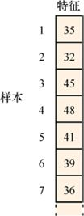

> **圖片描述：** 一個垂直排列的資料表格，左側標示「樣本」，頂部標示「特徵」。表格有7個樣本（1至7），每個樣本包含一個溫度特徵值（35、32、45、48、41、39、36），代表一系列時間上的溫度測量值。

圖22.1　原始資料由一系列樣本組成，每個樣本包含一個特徵，給出了特定時間的溫度

我們可以把前4個樣本（我們現在稱之為“值”）打包成一個大的組合樣本。第5個值將是我們希望網路為此樣本預測的目標，如圖22.2所示。

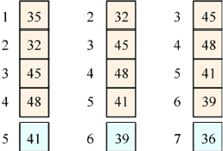

> **圖片描述：** 三個窗口資料集的建立過程。(a)值1至4組成一個組合樣本，值5為目標。(b)值2至5組成樣本，值6為目標。(c)值3至6組成樣本，值7為目標。每個樣本用不同顏色區分。

　(a)　　　　　　　 (b)　　　　　　 (c)

圖22.2　將多個連續樣本組合成新的較大樣本。(a)用值1～4創建一個組合樣本，並使用值5作為目標；(b)組合樣本包含值2～5，並使用值6作為目標；(c)組合樣本包含值3～6，並使用值7作為目標

下一個樣本的值為2～5，目標值為6。然後我們將值3～6組合，目標值為7，以此類推。我們希望網路能夠了解我們提供的值之間的關係，以便更好地預測目標。

這稱為**窗口**資料集，因為我們使用大小為4的**窗口**為神經網路創建新的組合輸入。在這個例子中，我們正在使用**重疊窗口**（overlapping windows）的常用技術，其中每個連續樣本包含前一個樣本中使用的一些值。

要從這個資料集中學習，我們可能會使用類似於圖22.3的簡單網路。

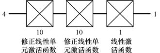

> **圖片描述：** 一個小型迴歸網路結構圖。底部為4個輸入值，經過一個有多個神經元的全連接層處理，頂部輸出一個預測值。

圖22.3　一個小的迴歸網路，用於學習窗口資料集，並從嵌在每個樣本中的序列預測新值

該網路將無法從樣本的排序中學習。如果我們選擇通過以其他順序收集值來構建窗口，如圖22.4所示。該網路最終將產生相同的結果。

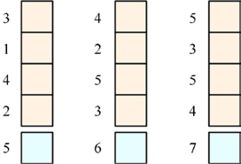

> **圖片描述：** 打亂順序的窗口資料集。值以與原始序列不同的順序存入樣本中，但目標值不變，用以說明全連接網路無法利用順序資訊。

圖22.4　將原始值組合到樣本中，但我們會一致地以與原始序列不匹配的順序存儲值

如果從單詞的角度來看這個問題，我們可能會想到“我戴上我的帽子和”這個句子後面跟著“手套”這個詞，但是我們沒有任何理由期待這個混亂的句子“帽子上我的我和戴”也應該跟著“手套”。

在語言中，單詞的順序很重要，大多數序列資料都是如此。但是，無論我們的值是否如圖22.2或圖22.4所示的順序，全連接層網路都可以正常工作。

關於使用CNN來處理序列資料工作已有了一些令人興奮的成果[Chen17b] [vandenOord16]，但這些工具仍在開發中。

因此，讓我們看看一個專門設計用來處理序列的工具。該工具可以高效、優雅地完成工作，並且幾乎適用於當今涉及輸入、輸出或兩者中任何類型序列的任何方法。

## 22.3　狀態

我們希望創建一個能夠記憶一些內部資訊的計算單元。我們將這些資訊稱為單元的**狀態**（state）。

為了保持這種狀態，我們介紹一種新類型的組件，如圖22.5所示。

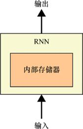

> **圖片描述：** RNN單元的基本概念圖。一個方塊代表計算單元，左側有內部存儲器，輸入從底部進入，輸出從頂部輸出。即使在訓練完成後，內部存儲器也隨每個輸入而改變。

圖22.5　RNN使用內部存儲器將其輸入處理為輸出。即使在訓練完成後，內部存儲器也能隨著每個輸入而改變

這種組件主要是一堆神經元和激活函數，但它們以特定方式連接並作為一個單獨的單元處理。那裡還有一些存儲器，我們將在下面介紹。我們只需將此單元作為一個層放到神經網路中。正如我們將看到的，這個**循環單元**的兩個最流行的縮寫版本是LSTM和GRU，它們是我們用來構建RNN的東西。我們將在下面更詳細地介紹它們。

這些單元的特殊之處在於它們可以**保存**資訊。這意味著它們每次處理輸入時，都可以使用它們從以前的輸入中學到的一些東西。

RNN可以被視為受到真實生物學的粗略啟發，或者僅是電腦的一部分。我們將採取後一種觀點，但一些演示將注意集中於其結構的生物學合理動機上。Lipton等人提供了對這些差異的討論，以及RNN的發展歷史 [Lipton15]。

在我們之前見過的網路中，一旦訓練結束，權重就會被凍結。這意味著網路已完成學習和改變。我們為之提供數值，而它只是使用它所學習到的值來構建網路。除了某些演算法使用的隨機數之外，它每次都會以完全相同的方式處理任何特定輸入。

但是我們的新單元能夠在**訓練完成**後記住新的資訊。也就是說，它們能夠在訓練結束後不斷變化。

如果我們要學習如何翻譯句子，這是必不可少的。例如，如果句子是“瑪麗說她的鞋太緊了”，我們需要以某種方式記住“瑪麗”是主語，否則將無法理解“她”這個詞。下一句可能是，“愛麗絲把她的鑰匙放在桌子上”。現在，“她”這個詞指的是愛麗絲。在評估輸入時必須進行這種記憶，因為我們無法預測在訓練時任何給定句子中“她”的含義。這就是我們新結構的特殊之處。

該系統的美妙之處在於，與神經網路執行的許多其他操作一樣，網路本身將學習它需要記住的內容以及如何操作。我們只需要設置結構以使其能夠完成工作。

這裡的關鍵思想是我們上面提到的**存儲器**。將這種存儲器與網路中的權重區分開來是很重要的。我們當然可以說權重是一種存儲器，因為它與網路一起保存並持續存在。但它並沒有隨著輸入而改變。一旦學習完成，權重就會被固定，直到我們再次回去學習。我們談論的存儲器是不同的，因為它在網路部署和實際使用時會發生變化。

我們將在此存儲器中保存和讀取的資訊統稱為**狀態**。有時候這個詞用在較長的短語中，比如“系統的狀態”或“計算的狀態”。“狀態”在這裡用作“情境”或“配置”的粗略同義詞，但有一點需要注意，我們指的是描述該情境或配置的記憶資料。我們通常會說我們“保存狀態”然後“讀取狀態”。

從概念上講，狀態可以寫入文件，保存在USB上，或通過網路傳輸。在RNN中，我們將其保存在循環單元內。

### 使用狀態

讓我們考慮一個系統的示例，該系統隨時間讀取和寫入其狀態，即RNN的方式。

想象一下修理手機的機器人。機器人坐在旁邊有零件供應的櫃檯上。如果我們將破損的手機放在機器人前面，它會分析手機以找出問題所在，然後使用其工具和零件櫃中的零件進行修復。這意味著它可能會從零件供應中取出一些零件，甚至可能會添加一些零件。例如，如果它可以用更簡單的東西替換手機的複雜部分，那麼任何被移除但仍然可用的零件都可以添加到機器人的零件供應中。

機器人的零件供應是其**狀態**或持久資訊。當每次開始修復時，它會考慮在這個狀態有哪些零件可用來幫助決定如何修理手機。修復完成後，某些零件可能已被移除，而其他零件可能已被添加，從而生成新的狀態版本。因此，每次維修後，這一零件供應都會發生變化，併成為下一個零件的起始供應零件。

我們可以如圖22.6所示地繪製它。

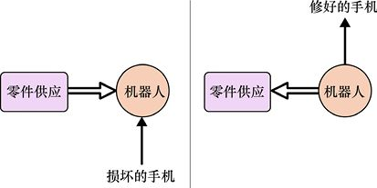

> **圖片描述：** 機器人修理手機的狀態概念。(a)給機器人一個破損手機和零件供應。(b)機器人返回修好的手機，並更新零件供應內容。實線箭頭表示資訊流，空心箭頭表示狀態操作。

(a)　　　　　　　　　　　　　　　　　　　　 (b)

圖22.6　機器人藉助零件供應修理手機。(a)給機器人一個破損的手機和一份零件供應；(b)機器人將修好的手機還給我們，並更新零件供應的內容來匹配已移除的部件和可能已添加的部件。注意，與零件的通信始終具有相同的供應，因此它們以不同的箭頭樣式顯示

圖22.6介紹了我們將在接下來的圖中使用的重要約定。當顯示**資訊流**（在這個案例中，是有關手機的資訊）時，我們使用單線箭頭。但涉及**狀態**的操作是一個根本不同的想法，因為只有一個狀態被使用，然後隨著時間的推移而更新。這些操作以空心箭頭表示。這種區分將有助於清楚地理解後面的圖。

我們將圖22.6中的機器人和零件保持在圖的兩個部分中的相同位置，因此這兩個版本中的元素顯然是相同的。將圖形的各個部分放在一起是有幫助的，這樣箭頭總是指向圖中的右方和上方，如圖22.7所示。

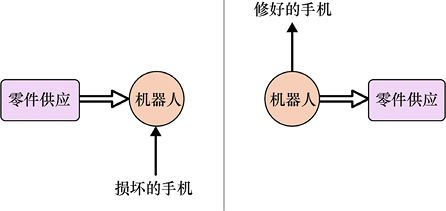

> **圖片描述：** 圖22.6的重新排列版本，所有箭頭指向右方和上方。(a)修理前的狀態和輸入，(b)修理後的輸出和更新的狀態。

(a)　　　　　　　　　　　　　　　　　　　 (b)

圖22.7　圖22.6的外表變化，以使所有箭頭指向上方或右方

我們仍然只有一個零件供應。我們只是移動了幾個部分，使箭頭的指向為從左向右和自下而上。

現在讓我們將圖22.7的兩個部分壓縮成一個圖，如圖22.8所示。要記住的重要事項是，這幅圖片代表了兩個連續的步驟，標有“零件供應”的兩個框都指的是相同的單框。空心箭頭旨在提醒我們這一點。

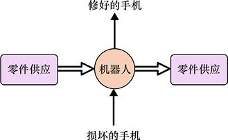

> **圖片描述：** 將兩個步驟壓縮為一個緊湊圖。機器人位於中央，底部輸入破損手機，頂部輸出修好手機，左右各有一個零件供應框（實為同一份，表示時間上的前後狀態）。

圖22.8　如果我們將圖22.7中的兩個步驟混合在一起，就可以製作更緊湊的圖。記住，兩個“零件”框代表了時間上的兩個步驟，實際是同一份零件供應

現在讓機器人維修3部不同的損壞的手機。我們可以排列圖22.8所示的多個副本，以便每次修復都使用上一次修復後留下的零件供應，如圖22.9所示。

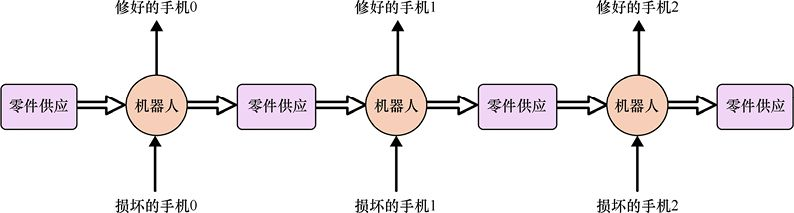

> **圖片描述：** 連續修復三部手機的時間展開圖。從左至右展示手機0、1、2的修復過程，每次修復都使用上次更新後的零件供應狀態，展示狀態隨時間的傳遞。

圖22.9　使用圖22.8所示的步驟修復多部手機。只有一個機器人和一份零件供應，但在這裡我們可以看到，在每次按順序的修復中，機器人使用零件供應的條件是在上次修復結束時

至關重要的是，圖22.9只展示了**一個機器人**和**一份零件供應**。我們正在展示時間多個時刻，如多重曝光快照。從左邊開始，我們從最初的零件供應和損壞的手機0開始。機器人修復手機，返回給我們修好的手機0，並更換了一份零件供應。一段時間後，損壞的手機 1到了。因此，剛剛更新的**同一份**零件供應現在由**同一個**機器人使用，以創建修好的手機1和更新的零件供應。所有新損壞的手機都會繼續循環。

我們基本上描述了RNN單元（RNN unit）的工作原理。讓我們用RNN的語言表述剛剛看到的過程。注意，當單個RNN單元和基於RNN的網路之間不存在混淆時，我們有時會將RNN單元稱為RNN。

我們的機器人將被一個RNN**單元**取代。正如我們上面提到的，這個單元實際上是一些人工神經元和存儲器的一小部分。它接收輸入並提供輸出，但最重要的是，它能夠對其持久的內部存儲器（如零件供應）進入讀取和寫入。

持久性記憶是單元的**狀態**。在RNN中，狀態通常只是一個浮點數列表。我們在創建單元時會指定此列表的大小。我們可以在小型項目中使用3或5的長度，或在較大的系統中使用數百的長度。與其他神經網路參數（如全連接層中的神經元數量）一樣，這是我們根據直覺、經驗，通常也根據一些實驗選擇的數字。

我們可以使用圖22.10中的這種新語言重新繪製圖22.9的重複修復手機的圖。這是簡單RNN的基本結構。

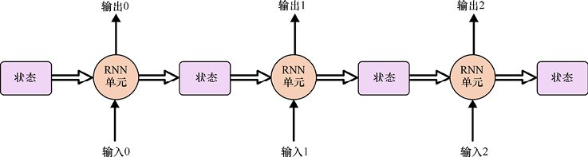

> **圖片描述：** 標準RNN單元的兩種繪製方式。左側：帶有環形箭頭回到自身的方塊，表示狀態和延遲。右側：打開的版本，顯示輸入、輸出和狀態方塊的流向。

圖22.10　一個簡單的RNN。只有一個RNN單元，只有一個狀態，但每個序列輸入都會重複使用它們，從而產生序列輸出

正如我們所提到的，狀態資訊存儲在RNN單元內部。這使得圖更簡單一些，因為如果狀態在RNN內部，就不必明確地顯示它。但它會使圖更加神秘，因為我們必須記住狀態的存在，且在RNN單元的符號“內”，並在每次輸入後被更新，如圖22.10所示。

圖22.10的另一個要點是狀態僅在當前輸入被處理完成時才更新。也就是說，當輸入到達時，它會被處理，並且輸出被呈現，而只有那時的新狀態才可被用於處理下一個輸入。

## 22.4　RNN單元的結構

讓我們搭建一個RNN**單元**。該RNN單元將接收輸入併產生輸出，並且具有一些內部狀態，這些狀態在此過程中保持不變。

圖22.11展示了第一次嘗試。假設我們的輸入、輸出和狀態都是單個實數。正如我們之前所做的那樣，我們將該單元的操作分解為兩個步驟。圖22.11a展示了步驟1，其中輸入和當前狀態被組合以產生新值。由於我們還沒有談到這種組合是如何產生的，所以現在僅將該操作表示為一個空白圈。圖22.11b展示了步驟2，其中這個新值被寫回狀態，並作為輸出呈現給該單元外的世界。

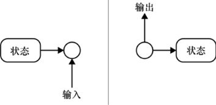

> **圖片描述：** RNN單元的兩種表示法。左側：帶有「狀態」方塊和環形連接的版本。右側：打開的版本，明確顯示狀態→圓形處理節點→輸出的流程。

(a)　　　　　　　　　　　　　　　　　　 (b)

圖22.11　搭建RNN單元的第一次嘗試。(a)在步驟1中，輸入和當前狀態組合在一起（我們先不說是如何做到的）。(b)在步驟2中，將(a)部分的結果寫入狀態存儲器，併發送到輸出

我們可以將圖22.11中的兩個步驟組合到一個圖中，就像之前一樣。為了強化處理兩個不同時刻的想法，我們在存儲器保持狀態之後繪製了一個黑方框，如圖22.12所示。此框表示**延遲步驟。**

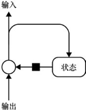

> **圖片描述：** Elman RNN單元的結構。底部輸入和前序輸出連接到一個圓形節點，經過黑色方塊（延遲元素）連接到狀態方塊，輸出從頂部流出。

圖22.12　將圖22.11的兩個步驟組合成一個圖。黑方框表示延遲步驟

解釋延遲步驟的一種方法是一個可以暫時保持一個值的緩衝區或存儲器塊。正如我們在圖22.11a中看到的，當新輸入到達單元時，我們希望將它與在前一輸入處理結束時寫入的狀態值組合在一起。

這正是緩衝區給我們帶來的。換句話說，緩衝區“持續”到前一週期的步驟2**結束**時的狀態值。當輸入到達時，它總是與先前輸入計算得到的狀態值組合。只有當此輸入完成處理並且輸出已經呈現給單元外部的世界時，延遲步驟才會將自身更新為狀態的新版本。此延遲步驟讓我們將圖22.11的兩部分沒有歧義地結合起來，即使它們發生在不同的時間。

我們想最後填寫一些圖22.12中缺少的操作，其中輸入和狀態組合在一起。但我們也想用一些可以控制的值來泛化這個圖，這樣就可以調整計算以產生對我們有用的輸出。這兩個步驟相互影響。讓我們首先來解決泛化步驟。

為了給我們一些小計算的控制力，我們在圖22.13中引入了3個權重。在此圖中，這些只是實數，就像神經網路中的任何其他權重一樣。現在我們可以調整這些權重，從而調整計算和輸出。

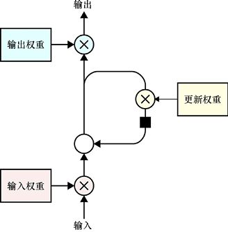

> **圖片描述：** 帶有輸入權重、更新權重和輸出權重的RNN單元。底部輸入乘以輸入權重，中間與更新後的狀態結合，頂部乘以輸出權重產生輸出。

圖22.13　在圖中的3個位置，我們通過權重來縮放通過的值。輸出上通常會有激活函數。為簡單起見，我們現在暫時擱置它

現在我們可以填寫缺失的操作。我們幾乎可以使用任何操作來組合權重輸入和延遲步驟的輸出。但由於我們控制著權重，我們已經能夠操縱我們想要組合的值，因此組合步驟可以很簡單。所以，我們選擇將值加在一起，如圖22.14所示。

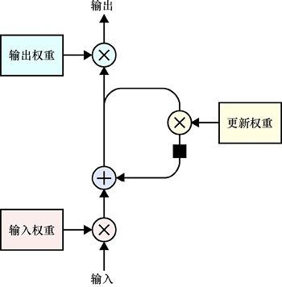

> **圖片描述：** 改進的RNN單元，加入了加法節點。與圖22.12類似但在狀態更新時使用加法（+）而非覆蓋，使狀態的更新更加平滑。

圖22.14　我們可以僅通過將值和來自延遲的狀態資訊相加來組合

我們現在已經搭建了一個簡單的RNN單元！由於圖22.14有很多東西要繪製，我們可以使用圖22.15所示的更簡單的圖標。請注意，此圖標只是一個單元，而不是一層。當我們搭建RNN層並將它們放入神經網路時，將在下面看到層符號。

圖22.15中的符號表示一系列輸入單元的整個序列的應用，例如我們在圖22.10中看到的手機維修順序，這需要一些時間來適應。看起來像帶有輸入和輸出的單個方框實際上代表的是給定輸入序列的單個方框，依次處理該序列的每個元素，併產生**一系列**輸出。

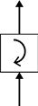

> **圖片描述：** 循環層的圖形符號。一個方框內有順時針旋轉的箭頭，上下各有連接線，表示接收輸入並產生輸出的循環處理層。

圖22.15　單個RNN單元的圖標

圖22.16展示了展開之後的RNN視圖。它只是圖22.10的簡要版本。在圖22.16中，狀態以一些初始值開始，RNN單元首先接收其第一個輸入，併產生一個輸出，這時狀態被更新，然後相同的RNN單元接收第二個輸入。回想一下，空心箭頭旨在提醒我們能看到單個RNN單元隨時間的變化，而不是從一個對象到另一個對象的資訊流。這通常稱為**展開圖**，因為我們明確展示了多個步驟。

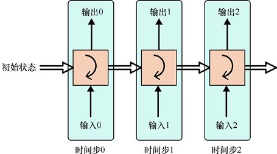

> **圖片描述：** RNN單元的時間展開圖。左側為壓縮的符號，右側為展開的5個時間步。初始狀態從左側輸入，依次處理輸入0至4，產生輸出0至4，狀態在各時間步之間傳遞。

圖22.16　展開的RNN視圖。因為狀態資訊包含在RNN單元內部，所以我們不需要明確地顯示它。RNN單元接收輸入，用它來創建輸出，然後更新其內部狀態。之後，又出現了另一個輸入，並重復該過程。圖中的每個垂直切片代表一個序列時刻

圖22.16中的藍色框表示狀態的每一個輸入、處理、輸出和更新操作都是唯一的事件。該圖展示了多個此類事件，使用空心箭頭表示每個輸入被處理後RNN單元的狀態正在發生變化。

當這些輸入中的每一個都由樣本的單個特徵的序列值組成時，我們將它們稱為**時間步**。

圖22.16的展開圖展示了與圖22.15的**捲起**（rolled-up）（或**卷**）圖相同的操作。在圖22.15的捲起圖中，我們暗示將存在一系列輸入，並且RNN將產生與每個輸入對應的輸出，更新其狀態，然後等待下一個輸入。在圖22.16中，我們明確地展示了這一系列事件。

### 22.4.1　具有更多狀態的單元

到目前為止，我們的RNN單元圖一次只處理一個數字，並且只保留一個數字。在本節中，我們將把它推廣。

為什麼我們想要更大的輸入？

假設我們要創建一個聊天機器人。它將接收一個人輸入的單詞序列作為輸入，併產生一個由一系列單詞組成的輸出。

假設聊天機器人有8000個單詞的詞彙量。我們在第12章中看到，對分類資料進行編碼的一種方法是使用**獨熱編碼**，如果使用0的長列表，其中在我們要編碼的數字的位置有單個1對應。事實證明，這是RNN單元的輸入的絕佳表示方法。對於8000個單詞，每個單詞的一位有效表示將是一個由7999個0和一個單獨的1組成的字符串。其他類型的資料在列表中的每個條目中會有不同的數字。

我們還希望在狀態中存儲多個數字。我們可能想要一個可以容納3個、10個甚至幾百個數的狀態。這樣的話，如果有人向聊天機器人描述一個人，我們就能記住有關這個人的各種資訊。例如，我們可能會記住這個人的姓名、性別、眼睛的顏色以及他此刻正在做的事情，等等。

我們的廣義RNN單元將使用多組神經元代替圖22.14中的多個步驟。這些神經元中的大多數都具有線性激活函數（與完全沒有激活函數相同）。

圖22.17a展示了將一組輸入繪製到神經元集合的傳統方式（請記住，我們沒有展示隱含的偏差項）。這是一堆複雜混亂的線條。為了使RNN圖更容易閱讀，我們繪製了簡化版，可以展示相同的內容，如圖22.17b所示。

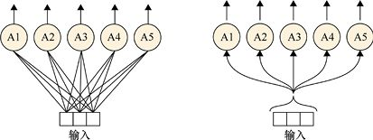

> **圖片描述：** 注意力機制的兩種表示。左側：5個神經元（A1-A5）接收來自單一輸入的連接，每個連接有不同權重。右側：同樣的5個神經元但連接方式不同，來自一個更小的共享輸入。

(a)　　　　　　　　　　　　　　　　　　　　　　　　　 (b)

圖22.17　(a)3個一組的輸入進入5個神經元的傳統方式；(b)簡化版

輸入的數量、輸出的數量和內部狀態的大小都可以不同。因此，假設輸入具有3個值（可能是0～2的微小版的獨熱編碼），並且輸出具有4個值。那麼內部狀態將具有5個值，因為我們想要記住輸入隨時間不同的5種特性。圖22.18展示瞭如何組裝RNN單元。我們首先將輸入發送到名為A1～A5的5個神經元。這些神經元中的每一個都將輸入中的3個值與自己的3個權重相乘，以產生輸出值。結果是具有5個值的列表。

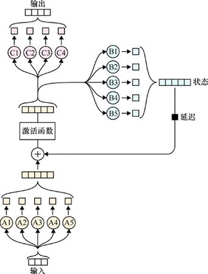

> **圖片描述：** 完整的RNN單元內部結構。底部5個輸入神經元（A1-A5）通過加法節點和激活函數連接到中間處理節點，中間的5個B神經元（B1-B5）連接到狀態，頂部4個輸出神經元（C1-C4）產生輸出。

圖22.18　一個廣義的RNN單元，它接收3個值的輸入並存儲5個狀態值。由用A1～A5表示的5個神經元同時處理3個值的輸入來創建一個具有5個值的列表。這是通過逐個元素添加到狀態的。然後該結果通過用B1～B5表示的5個神經元來創建一個新狀態，並進入延遲步驟。相加的結果也進入用C1～C4表示的4個神經元以產生輸出

集合A的輸出被收集到具有5個值的列表中。此列表與狀態具有相同的形狀，因此我們可以逐元素地將狀態的先前值添加到其中。結果是兩組神經元。一組標記為B，包含5個神經元（用B1～B5表示）。這些輸出被收集到列表並進入延遲步驟，因此它們將在下一步與集合A的輸出組合。集合A的當前值和集合B的先前值的輸出也被傳遞到標記為C的4個神經元（用C1～C4表示），然後產生輸出的4個值。

這3組神經元推廣了圖22.14所示的單個權重。

它們使我們能夠控制這個單元。每個神經元集合A具有3個權重，其中有5個A，總共有3×5= 15個權重。神經元集合B各有5個權重，其中也有5個B，總共有5×5=25個權重。有5個偏差權重在添加集合A的輸出和集合B的延遲輸出之後被應用，得到了5個權重。最後，神經元集合C也有6個權重（狀態有5個，偏差有1個），其中有4個C，有6×4=24個權重。因此，總共有15+25+5+24=69個權重。這為我們提供了很多值，可以在訓練期間進行調整來從該單元得到有用的結果。

### 22.4.2　狀態值的解釋

在所有這些例子中，RNN自動管理狀態、讀取和寫入值，幫助它最終產生對我們有用的結果，比如，聊天機器人對某個問題的回答。

我們很自然地會問這個狀態裡的數字代表什麼。究竟是什麼被記住，什麼被遺忘？我們之前提過人的姓名和性別這樣的可能性，但是RNN如何才能確定這是應該保存的內容，以及怎樣確定如何表示這些資訊呢？

這就像問我們在後續章節中看到的其他類型的神經網路中的權重代表什麼。權重代表某種東西，但究竟這些“東西”是什麼，取決於網路在訓練時所學到的東西。在訓練期間，網路本身可以運行需要保存的內容以及如何保存。

以同樣的方式，RNN單元“決定”狀態的內容的含義，以及如何管理這些數字，以便整個網路最終產生我們要求的答案。大多數時候，我們並沒有過多地去解釋這些值，正如沒有強調單個權重在全連接層或卷積層中的含義。但是當我們對這個問題有了一定的瞭解後，可以嘗試對狀態中數字的含義進行逆向工程。這可以幫助我們確定網路正在關注輸入的哪些部分，這有助於理解其輸出並在當某些地方出錯時調試它[Karpathy15a]。

## 22.5　組織輸入

照例，RNN單元的輸入由樣本組成。每個樣本都由特徵組成。新的竅門是每個特徵都由**時間步**組成。時間步是在不同時刻測量的特徵值。

標籤“時間步”表明我們的測量是基於時間的。還有很多其他方法可以產生值的序列。例如，在樹木從樹根到樹冠的部分中，它們可能代表一個樹幹的多個圓周；或者當我們從一堆書中經過時，它們可能代表一個大型圖書館每個書架上的圖書數量。但我們還是會堅持基於時間多次測量的想法，因為這是一種常見的場景，也是對語言來說最適合的。

但時間步帶來的是結構問題。到目前為止，我們已經有包含特徵的樣本，可以方便地將其表示為二維列表。現在時間步給了我們一個三維的體積。組織該體積的方法有很多。我們對組織方法的選擇會對網路如何解釋內部的數字產生重大影響。

問題歸結於如何考慮我們的資料。RNN“知道”我們有包含特徵的樣本，並且每個特徵都包含一系列時間步，但我們可以選擇如何考慮這些資料，且不同的解釋會得到不同的結果。

繪製資料組織的圖片時，根據慣例，我們將方向（遠離、向下、向右）分配給（樣本、時間步、特徵）。這與我們將在第23章中看到的Keras庫相匹配。其他庫可能以不同的順序排列它們的資料，因此檢查文檔以確保我們按照庫期望的方式結構化資料總是值得的。我們將在本章中堅持Keras庫的慣例。

假設我們對山頂溫度感興趣。在一天的過程中，我們每小時進行8次溫度測量。我們希望通過這個微小資料集訓練RNN來預測未來的測量值。

使用我們剛剛討論的慣例來組織這些資料的3種方法如圖22.19所示。其中只有一個對我們的資料有意義。我們全部展示了這3種方法，這樣就能更好地理解應該如何解釋資料的組織通信的過程。

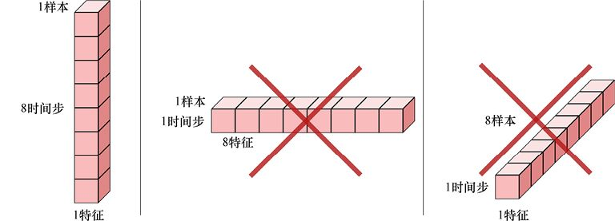

> **圖片描述：** RNN輸入資料的形狀要求。左側正確格式：1個樣本×8個時間步×1個特徵的垂直向量。中間和右側為錯誤格式（打叉標記），分別為1x1x8和8x1x1。

(a)　　　　　　　　　　　　　　　　　　　　　　　　　　　　(b)　　　　　　　　　　　　　　　　　　　　　　　　　　　　　　　　(c)

圖22.19　組織8個溫度測量值的3種方法。根據慣例，其中兩個結構是錯誤的。在這裡，我們將方向（遠離、向下、向右）分配給（樣本、時間步、特徵）。(a)我們有一個樣本，其中包含一個特徵。該特徵包含8個序列測量值或時間步。(b)我們只有一個樣本，由8個特徵組成。每個特徵都由一個時間步組成。(c)每個測量值都是由1個特徵組成的樣本，我們有一個序列值或時間步。我們希望使用(a)所示的組織方法

當捆綁資料時，我們想要使用圖22.19a所示的組織方法。這個結構表明我們有一天的資料（樣本），當天的資料包含溫度（特徵），以及多個溫度測量值（時間步）。這符合我們對資料組織的概念。

如果我們按照圖22.19b組織RNN資料會怎樣？那就是對RNN（和我們自己）說我們有1個樣本包含8個特徵，或8種不同類型的測量值，如溫度、風速、溼度等。每個新特徵到達時，將被解釋為包含新的時間步列表，在我們的示例中，這些時間步將是單個值。我們不但沒有8個特徵，而且RNN也不會學到太多東西，因為序列只有1個值。畢竟，每個特徵只有1個資料，並且它們被假定為代表完全不同類型的測量值。

圖22.19c更糟糕。現在我們有8個樣本，或8個完全獨立的測量集合。每次測量都有1個特徵。當RNN查看該特徵的值時，它會找到1個時間步。只有1個特徵的序列是不足以從中學習到一個模式的。

現在可以來構建我們的資料，讓我們開闊一點視野，假設我們在每次讀取時都測量了多個參數。假設我們有3個值，分別表示溫度、溼度和風速。這為我們提供了24個測量值，即包含3種類型的資料，每個類型有8個測量值。因此，我們可以將其打包為具有3個特徵的單個樣本，每個特徵具有8個測量值，如圖22.20所示。

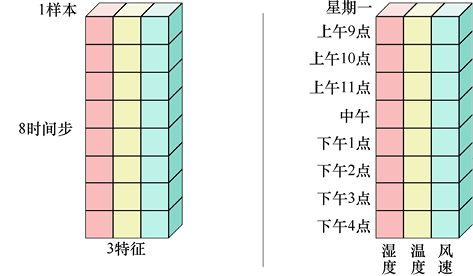

> **圖片描述：** RNN輸入資料的三維結構。左側：1個樣本×8個時間步×3個特徵的長方體。右側：同一結構的具體標記，展示星期一上午9點至下午4點的濕度、溫度、風速資料。

圖22.20　組織3個特徵的資料，如溫度、溼度和風速。每個特徵由8個時間步組成

我們第二天又出去重複測量，為3個特徵各收集8個新的測量值。我們一次又一次地這樣做，並且天天如此，堅持做一週。每天的測量結果代表8個連續樣本，但是從一天到下一天的測量不會形成單個連續序列，因為它們被我們每天沒有測量的16小時分開，所以它們是獨立的（雖然是相關的）序列。我們可以將每一個都包裝在它自己的樣本中，如圖22.21所示。

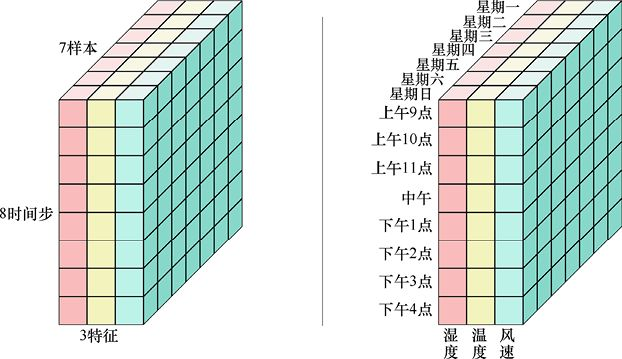

> **圖片描述：** 多個樣本的三維輸入張量。左側：7個樣本×8個時間步×3個特徵的大長方體。右側：完整標記版本，展示七天（星期一至日）的時間序列資料結構。

圖22.21　如果連續7天收集3種類型資料的8個測量值，我們可以將資料排列為7個樣本，每個樣本由3個特徵組成，每個特徵有8個時間步

圖22.21中的三維體積尺寸為7×8×3。我們可以用6種方式排列這3個數字，形成6種不同的塊狀。如果我們使用圖22.21中未展示的5種形狀之一，RNN也可以運行，但它對資料的解釋不會符合我們的預期，並且通常會產生令人失望的結果。

為了組織正確，我們需要考慮資料以及希望系統如何解釋它，並結合我們正在使用的庫的期望。

## 22.6　訓練RNN

在第 18 章中，我們介紹了**反向傳播**的重要演算法，它有效地計算了網路中權重的誤差梯度。然後，我們通常應用更新步驟，根據其梯度修改每個權重。

假設這也適用於RNN似乎是合理的。畢竟，我們上面說過RNN只是一個小型人工神經元和其他部分打包的簇。因為它們通過反向傳播來學習，所以整個單元也應該通過反向傳播來學習。

事實上，我們可以做到這一點，雖然它不是沒有問題。讓我們從考慮將反向傳播應用於RNN開始。通常的方法是首先“展開”RNN單元，這樣就可以更容易地看到我們正在處理的內容。當創建RNN時，我們會告訴它我們將提供多少時間步（通常，每個特徵必須具有相同的時間步，以便張量是完整的數字塊）。如果我們將RNN單元設置為具有5個時間步，則可以以圖22.22b的形式展開圖22.22a所示的網路圖，來明確地展示每個時間步的處理，空心箭頭表示每一步更新後的狀態。

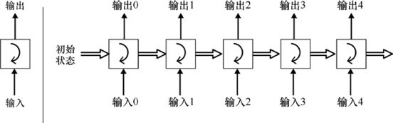

> **圖片描述：** 返回序列的RNN單元展開圖。左側為壓縮符號，右側展開為5個時間步，每個時間步都產生一個輸出（輸出0至4），初始狀態從左側輸入。

(a)　　　　　　　　　　　　　　　　　　　　　　　　　　　　　　　 (b)

圖22.22　RNN單元可以繪製成“捲起”或“展開”的形式。(a)捲起的形式。這意味著該單元將逐步完成時間步。(b)展開的形式，明確展示每個時間步的處理

我們可以將圖22.22中的版本應用於反向傳播，就像任何神經網路一樣，只需向後推動誤差梯度即可。唯一的區別是我們需要記住，RNN的每個實例代表具有**相同**內部權重的**相同**單元。

這個修改後的反向傳播版本被稱為**基於時間的反向傳播演算法（**backpropagation through time**）**或BPTT。

但坦率地說，BPTT存在一個問題。回想一下，每個RNN單元都由神經網路組成，因此單元的輸出是內部神經網路的輸出，它計算一個值並通過其激活函數傳遞該值。正如我們之前提到的，到目前為止我們一直在假設線性激活函數，所以還沒有繪製它們，但總的來說，RNN單元的末端會有更復雜的東西。

問題來自每個RNN單元內神經網路末端的激活函數，它們通常使用ReLU或tanh激活函數。正如我們在第17章中看到的那樣，tanh函數的輸出為−1～1。圖22.23展示了用一條實線表示的tanh函數。

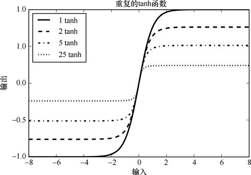

> **圖片描述：** 重複tanh函數的效果圖。x軸為輸入（-8至8），y軸為輸出（-1至1）。四條線分別表示應用1次、2次、5次和25次tanh，隨著重複次數增加，函數越來越平坦。

圖22.23　用實線表示的tanh函數。如果我們在每個點獲取tanh函數的輸出並將其應用於自身，那麼將獲得垂直壓縮的虛線曲線。如果我們重複5次，將得到點畫線曲線，25次重複則用點曲線表示

當我們使用反向傳播將結果向後推動，使之通過圖22.22b所示的展開RNN（unrolled RNN）時，該結果將通過一個接一個的tanh函數。實際上，我們是在反覆應用tanh函數。圖22.23展示了當連續應用tanh函數2、5和25次會發生什麼。簡而言之，輸出值接近於0。但真正的問題是值從負變為正的區域變得更窄。這意味著對該區域外的任何輸入的更改在相應的輸出上沒有變化。

這對於學習來說很糟糕，因為它意味著梯度降至0。回想一下，當梯度為0時，相當於沒有學習。當梯度接近0時，系統將非常緩慢地改善。

這種現象稱為**梯度消失**（vanishing gradient）問題[Hochreiter01] [Pascanu12]。“消失”這個詞意味著值通過接近0而“逐漸消失”。雖然我們不會陷入這個問題，但問題可能會轉向另一種樣子，即導數越來越大而無法終止。這種罕見的現象稱為**梯度爆炸**（exploding gradient）問題[R2RT16]。

還有另一個我們需要解決的問題：只有有限的存儲器可供任何真正的RNN用作狀態。如果我們試圖理解像“鮑勃說他餓了”這樣的句子，那麼就不需要大量的記憶來將“他”與“鮑勃”聯繫起來。但是假設我們有一個句子開頭，“當鮑勃看到他鄰居的兩隻貓在車庫外面，看著他，他忽略了它們專注的目光，並繼續做他精心設計的鍛鍊方案……”省略了很多話之後結束語是“……當一切全部結束時，它們仍然在那裡，看著他。”我們可能需要大量的存儲器才能將早期的“兩隻貓”與後來的“它們”連接起來。即使我們為RNN單元提供了大量存儲器，但總是能構建一個需要更多存儲器的輸入。這稱為**長期依賴問題**（long-term dependency problem）[Hochreiter01] [Olah15]。

好消息是我們可以通過使用具有奇特內部結構的RNN來解決梯度問題和長期依賴問題。這些RNN單元中最受歡迎的是LSTM，我們接下來會了解它。

## 22.7　LSTM和GRU

圖22.18中的RNN單元會出現梯度消失、梯度爆炸和長期依賴問題[Bengio94]。為了解決這些問題，研究人員研究了各種方法。一種方法**涉及**仔細初始化的簡單RNN [Quoc15]。現在比較流行的方法是使用一種具有看似矛盾名字的RNN單元——**長短期記憶**或LSTM [Hochreiter97]。LSTM變得如此流行，以至於今天當人們談到RNN單元時，它們通常意味著LSTM。

LSTM這個名字來源於對RNN單元內部情況的思考。我們可以說圖22.18中的單元以其狀態的形式存在於一些持久性或**長期**存儲器。狀態可以無限期地從一個輸入到下一個並持續保留它的值。該單元還具有神經元輸出形式的一些**短期**存儲器。這些值是稍縱即逝的，僅在處理新輸入時存在，然後在新輸入到達時被替換為新值。

LSTM的目標是採用一些短期的、稍縱即逝的值並延長它們的壽命，讓它們能夠為未來的計算做出貢獻。因此，短期記憶被賦予了更長的壽命，導致名字為“長短期記憶”或LSTM。將此視為“持久的短期記憶”可能會有所幫助。

詳細介紹LSTM的內部結構將使我們走得更遠，而且沒有必要了解如何使用它。但是對於正在發生的事情有一個基本的瞭解是有幫助的，所以讓我們來看看它的運作情況。

眾所周知，每個RNN單元都包含一些存儲器來保存其狀態，這通常只是一個數字列表。在談論LSTM單元或單元的內部時，我們有時將狀態稱為**單元存儲器**（cell memory）。在第一個輸入到達之前，使用預設初始值初始化單元存儲器，但正如我們所見，這些值隨著輸入的接收和單元存儲器的更新而改變。單元存儲器還可以遺忘不再需要的資訊。這一切都在位於LSTM內部的神經元的控制之下。

整個系統的優點在於，通過足夠的訓練，LSTM單元內的神經元上的權重會學習如何調整自身，使得它們在正確的時間以正確的方式控制存儲器記住或遺忘資料。請記住，一旦反向傳播學習了這些內部網路中的權重，它們就不會改變。但是當該單元正在評估新資料時，這些網路會控制單元存儲器，而單元存儲器**確實**會發生變化。

### 22.7.1　門

LSTM中的關鍵思想是一種稱為門的機制。

我們可以將其粗略地視為控制水流流出管道的物理形式的門，如圖22.24所示。

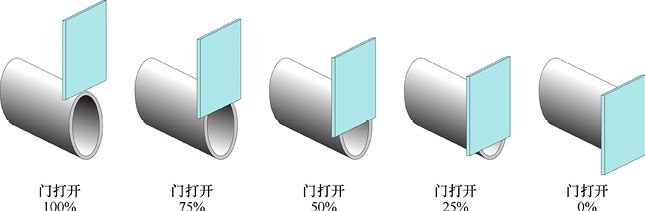

> **圖片描述：** 閘門的實體類比。五個水管和門板的三維示意圖，門從左到右分別打開100%、75%、50%、25%和0%，展示閘門如何控制資料流量。

圖22.24　在水管上繪製一個門

當門打開100%時，進入管道的所有水都可以流出。當門打開0%時，它完全阻擋了出口，沒有水可以流出。處於中間位置的門允許通過相應的水量。這個比喻並不完美，因為水與這樣的門的相互作用比我們假想的更復雜。

我們可以通過將輸入值（管道中的水量）乘以門值（其位置）輕鬆地在程式中實作門，然後可以通過如圖22.25所示的方式實作圖22.24中物理形式的門的效果。

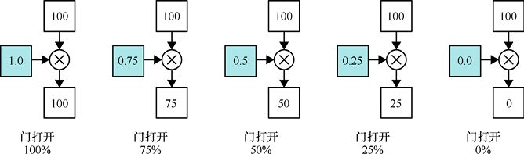

> **圖片描述：** 閘門的數學計算示例。五個面板展示：輸入值100分別乘以閘門值1.0、0.75、0.5、0.25和0.0，輸出分別為100、75、50、25和0。

圖22.25　用數字實作門的效果。在每個圖中，輸入值100顯示在頂部，門值顯示為藍色，結果顯示在底部的框中。我們只需將輸入值乘以門值即可獲得門控值。通過將百分比除以100，可將門打開的百分比實作為0～1的數字

如果我們想要以不同的數量調整一大堆值，則會為每個值應用不同的門位置。換句話說，我們將每個輸入值乘以一些其他相應的值。

這只不過是人工神經元的第一步。然後，神經元繼續添加結果並應用激活函數，但我們不需要任何額外的操作。我們只需將每個輸入乘以其門位置，這就是我們的輸出。

當我們以這種方式使用門時，會將門值限制在0～1的範圍內。因此，當我們將門應用於輸入值（或輸入值列表的門列表）時，輸入值可以保持不變或下降，直到它們達到0。它們不能變大，因為門永遠不會大於1，並且它們不能改變符號，因為門永遠不會小於0。

LSTM將門用於3個目的：**遺忘**（forgetting）、**記憶**（remembering）和**選擇**（selecting）。記憶門和選擇門也稱為**輸入**門和**輸出**門。讓我們依次看看它們。

我們經常認為“遺忘”意味著記憶完全喪失。在LSTM中，遺忘通常是局部的，我們可以在連續過程中的任何地方從完全不遺忘到完全遺忘一個值。**遺忘**數字意味著我們將它推向0。當它達到0時，它就完全被遺忘了。我們可以通過將它與門值相乘來選擇性地遺忘一個值，並且門值始終為0～1。圖22.26a的左邊展示了5個元素的起始存儲器。在中間，我們可以看到5個門值。當門值為1時，我們將完全不遺忘相應的存儲器元素的值，因為它不會改變。當門值為0時，我們將完全遺忘相應的存儲器元素的值，因為它將變為0。門的中間值將導致我們“遺忘”相應存儲器元素的部分值。圖22.26b展示了遺忘操作完成後的存儲器。

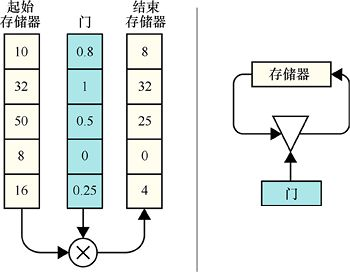

> **圖片描述：** 逐元素閘門操作。左側：起始存儲器（10,32,50,8,16）乘以閘門值（0.8,1,0.5,0,0.25），得到結束存儲器（8,32,25,0,4）。右側為對應的方塊圖。

(a)　　　　　　　　　　　　　　　　　　 (b)

圖22.26　遺忘存儲器中的值。(a)每個值乘以一個門值，結果保存到結束存儲器。門值為1時不會遺忘與其相應的存儲單元有關的任何內容，而門值為0會導致該值被完全遺忘。門值為中間值時會遺忘相應量的單元內容。(b)以示意圖形式表示的操作

**記憶**的行為包括兩個步驟。首先，我們確定每個新值中要記住的有多少。當然，我們使用門來控制它。然後要記住門控值，我們只需將它們添加到存儲器的現有內容中。

圖22.27a中，左邊是我們想要記住的新值列表，但我們並不想完全記住它們。就像在圖22.26中一樣，我們對它們應用門，產生一個門控值列表。要真正記住這些，我們只需逐個元素地將它們添加到現有存儲器中。

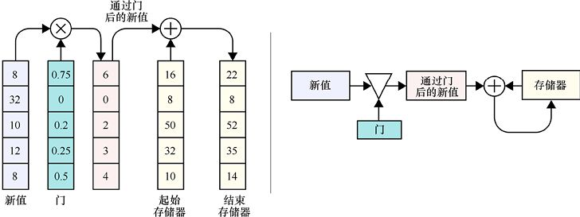

> **圖片描述：** 帶有新值加入的閘門操作。新值通過閘門後與起始存儲器相加，得到更新後的結束存儲器。右側為對應的流程方塊圖。

(a)　　　　　　　　　　　　　　　　　　　　　　　　　　　　　　　　　　　　　　　　　　 (b)

圖22.27　記憶的過程。(a)我們從記住的新值開始，如左邊所示。我們可能不想完全記住這些，所以首先應用門。然後將門控值添加到現有存儲器中，並將其保存到存儲器中。(b)以示意圖形式表示的操作

最後，要從存儲器中進行**選擇**，我們只需確定要使用的每個元素的數量。如圖22.28所示，我們將門應用於存儲器元素，結果是一個縮放存儲器列表。

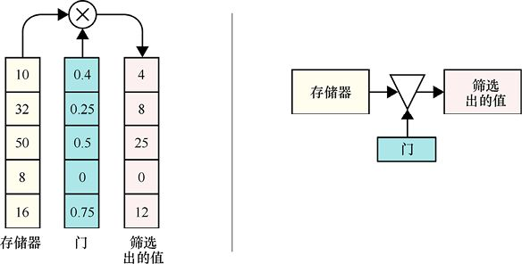

> **圖片描述：** 篩選操作。存儲器值通過閘門後產生篩選出的值，閘門控制哪些值被傳遞。右側為對應的方塊圖。

(a)　　　　　　　　　　　　　　　　　　　　　　　　　　　　　　　　　　　 (b)

圖22.28　從存儲器中進行選擇。(a)為了選擇記憶，我們將門控值放在存儲器中。門控結果是我們的選擇。(b)示意圖版本

### 22.7.2　LSTM

LSTM單元使用我們上面看到的門控操作來管理其內部存儲器。門控操作使得單元能夠對其記憶和遺忘的內容進行大幅度控制，因此它可以以最有效的方式管理其內部單元存儲器。

我們來看看LSTM的架構。我們的討論改編自Olah [Olah15]的圖片和演示。圖22.29展示了單個LSTM單元。它接收其前序輸出和新值作為輸入，併產生新的輸出。

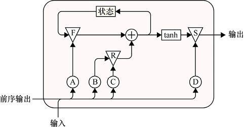

> **圖片描述：** 完整LSTM單元的結構圖。包含遺忘閘(F)、記憶閘(R)、加法節點(+)、tanh激活和選擇閘(S)。底部接收輸入和前序輸出，頂部為狀態和輸出。四個圓形節點(A,B,C,D)接收輸入和前序輸出。

圖22.29　LSTM單元的結構。三角形代表門，圓圈代表神經元組

圖22.29中LSTM單元的頂部是狀態存儲器。我們有3個門，標記為F的表示遺忘，R表示記住，S表示選擇。還有4個神經元組，我們將其標記為A～D。這些神經元的輸入是通過簡單地將前序輸出和新輸入一個放在另一個上而形成的單個列表。

讓我們看一下處理輸入所涉及的3個階段。

我們將從**遺忘**階段開始，如圖22.30中高亮部分所示。A中的神經元使用新輸入和前序輸出來創建門值列表，然後將它們應用於當前狀態。這意味著狀態持有的值列表中的每個元素保持不變（如果其門值為1），或者向0移動，從而導致我們“遺忘”該值的部分或全部。

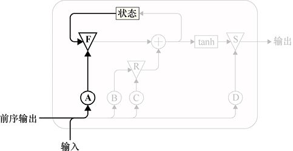

> **圖片描述：** LSTM單元的遺忘閘高亮顯示。與圖22.28相同的結構，但只有遺忘閘(F)和輸入節點(A)以黑色顯示，其餘為灰色，說明遺忘閘如何控制狀態的遺忘。

圖22.30　LSTM的遺忘階段。輸入和前序輸出的組合由A中的神經元轉換成門信號，然後控制F門並使得來自狀態存儲器的一些值被遺忘

我們可以通過繪製張量並顯示所有神經元來查看遺忘階段中的各個部分。圖22.31展示瞭如果輸入和輸出都有2個值，並且我們在狀態存儲器中使用了3個元素，它將如何顯示。前序輸出和新輸入堆疊在一起（只要是一致的，它們的順序就無關緊要）。這個4元素的高張量進入3個神經元，每個對應狀態中的一個元素。這些神經元通常負責對4個輸入中的每一個進行加權，並將結果彙總在一起。最後一步是應用sigma激活函數，該函數將每個神經元的輸出壓縮到0～1的範圍內。這使得它適合用作門。

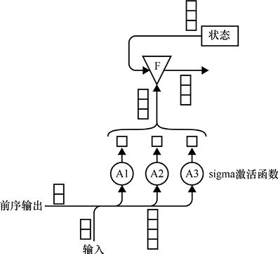

> **圖片描述：** LSTM單元的記憶功能。底部接收輸入和前序輸出，A1-A3為sigma激活函數的三個計算單元，F為遺忘閘，加法節點更新狀態，tanh處理後通過S閘控制輸出。

圖22.31　擴展圖22.30的LSTM遺忘階段，顯示正在移動的資料的狀態。前序輸出和當前輸入被組合成單個張量，然後被送到3個神經元中，每個神經元都含有sigma激活函數。它們的3個輸出用於控制門，其輸入為3個元素的狀態。門的輸出是由神經元A的輸出經過門控後的狀態值

然後，這些門值控制遺忘門。門的輸入是當前狀態中的3個元素。每一個乘以其門值，使其保持不變或接近0。

所以在遺忘階段結束時，我們有一個已經遺忘的臨時的狀態副本，或者將該狀態的某些元素推向0。

下一階段是**記住**剛剛進入的新輸入（如果我們想要的話，還有關於前序輸出的內容）。如圖22.32所示，我們將前序輸出和輸入的組合發送到兩組神經元B和C。神經元C將用作門值，因此它們的末端含有sigma激活函數。神經元B的輸出是門控值（並且最終被記住）。這些門用於控制當它們通過門R時，應該記住多少前序輸出和當前輸入的組合。

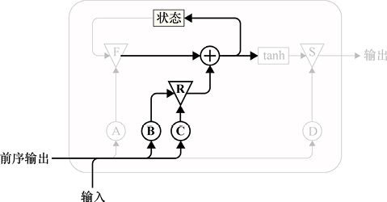

> **圖片描述：** LSTM單元的記憶閘和更新高亮。遺忘閘(F)和記憶閘(R)部分，以及輸入節點(B,C)以黑色顯示，展示新資訊如何通過記憶閘加入到狀態中。

圖22.32　LSTM的記憶階段。輸入和前序輸出的組合被送到兩組分別標記為B和C的神經元。神經元C的輸出用於控制調整來自神經元B的值的記憶門R。結果是輸入和前序輸出按比例縮小，然後添加到遺忘門F的狀態版本中。最後將結果寫回內部狀態

正如我們之前看到的那樣，得到的門控值被添加到狀態中。然後將狀態的新值被寫入狀態存儲器，因此這些值現在被記住了。

最後，我們**選擇**一些新計算的狀態來輸出。在圖22.33中，我們將前序輸出和當前輸入送到標記為D的另一組神經元中，這些神經元也含有sigma激活函數。我們使用神經元D的輸出作為門S的門值。該門的輸入是我們剛剛計算的新狀態，但首先我們通過tanh函數處理它。這和我們在第17章討論激活函數時看到的S形函數相同。我們沒有詳細說明為什麼這個階段存在，它的功能是將我們剛剛計算的值壓縮到−1～1的範圍。值由門S控制，然後表示為LSTM單元的輸出。

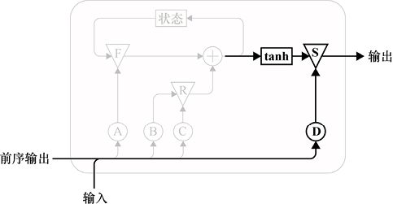

> **圖片描述：** LSTM單元的輸出閘高亮。tanh處理和選擇閘(S)以及輸出節點(D)以黑色顯示，其餘為灰色，說明輸出如何從狀態中產生。

圖22.33　LSTM的選擇階段。輸入和前序輸出的組合用於控制調整由記憶階段生成的新狀態的門S。這是單元的輸出

為了回顧LSTM的操作，我們需要前序輸出和當前輸入並將它們組合起來。該組合信號將用於形成門值，並且還將被記住。

第1步是經過門F的處理來**遺忘**一些當前的狀態內容。第2步是通過運行門R來**記住**一些新資訊，然後將結果添加到狀態中。該結果將成為新的狀態。第3步是通過門S的運行來**選擇**一些新狀態作為輸入。

通過這種方式，LSTM可以無限期地記住資訊，因為不會遺忘它，並在之後不會添加它。或者它可以完全遺忘一些資訊並用新值替換它。或者它可以部分地遺忘一些資訊，然後部分地記住一些新的值。

所有這一切都由我們標記為A、B、C和D的4組神經元控制。它們的所有權重都是使用梯度下降來學習的，就像任何其他權重一樣。最終，LSTM學習權重值，使其能夠遺忘、記住並在正確的時間選擇正確的資訊，以便為我們提供有用的結果。

LSTM避免了梯度消失和爆炸的問題，因為它所有的計算都在內部捆綁在一起。網路對外呈現的激活函數是線性（或恆等）函數，就算它一遍又一遍地應用於自身，也不會改變[Suresh16]。這避免了我們從它平整後的sigmoid中看到的問題。

LSTM也避免了長期依賴問題，因為狀態中的值會在合適的時候被遺忘門和記憶門的協調動作“保護”而不被遺忘。

LSTM的原型[Hochreiter97]隨著時間的推移經歷了多次改進[Graves14]。例如，遺忘門不是LSTM原始設計的一部分，而是幾年後才提出的[Gers00]。

LSTM的一個更著名的變體稱為**門控循環單元**（gated recurrent unit），或GRU [Chung15]。GRU就像一個LSTM，但做了一些簡化。例如，遺忘門和輸入門被組合成一個門[Olah15]。由於要完成的工作少一些，GRU會比LSTM快一點。它通常也會產生類似於LSTM [Chung14]的結果。在使用RNN時，通常需要嘗試LSTM和GRU，來查看兩者中哪一個能夠為特定網路和資料集提供更準確的結果。

## 22.8　RNN的結構

RNN單元非常通用，無論它們是LSTM、GRU還是其他變體。我們可以使用它們來搭建許多不同類型的結構來完成不同的工作。

### 22.8.1　單個或多個輸入和輸出

圖22.34展示了Karpathy的著名圖[Karpathy15b]的變體，它以展開的形式說明了這些圖中的幾個結構，以及與其輸入和輸出數量相關的名稱。在這裡，“多個”這個詞可以被認為是“序列”的同義詞。在這些圖中，我們通常省略了單元間的連接，就像LSTM用來表示將某一步的輸出作為下一步的輸入。

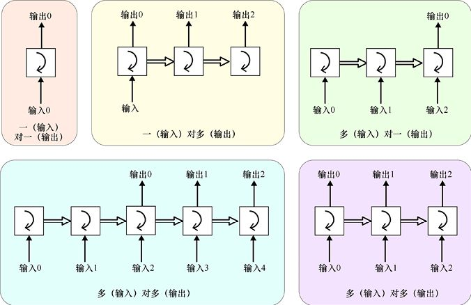

> **圖片描述：** RNN的五種基本結構模式。(a)一對一：單輸入單輸出。(b)一對多：單輸入產生序列輸出。(c)多對一：序列輸入產生單輸出。(d)多對多（不等長）：序列輸入產生不同長度的序列輸出。(e)多對多（等長）：序列輸入產生等長序列輸出。

圖22.34　5種不同類型的RNN結構的展開形式。名稱描述了輸入和輸出是含有一個值，還是一系列的值

**一對一**（one to one）結構被包括進來是因為我們可以搭建它，但它有點浪費RNN。我們給它一個輸入（即一個具有單個時間步的特徵），它產生一個輸出。可以說這是一種浪費，因為序列長度為1，RNN單元沒有充分利用其獨特的能力來記住有關其輸入序列的事物。

**一對多**（one to many）結構接收單個資料並生成序列。我們通過向RNN提供啟動它的資訊來做到這一點，然後讓它運行一段時間，產生多個輸出。我們可以給網路一首歌的起始音符，它會為我們製作剩下的旋律。

**多對一**（many to one）結構讀取一個序列並返回單個值，該結構經常用於**情緒分析**（sentiment analysis）領域。我們可以給網路一段文本，它會報告寫作中固有的某些性質。一個常見的例子是觀看電影評論並確定它是積極的還是消極的[Timmaraju15]。

**多對多**（many to many）結構在某些方面是最有趣的。在這裡，我們來看兩個這樣的例子。對於圖22.34中左邊的多對多結構，我們在要求它開始產生輸出之前，用幾個輸入“引導”RNN。而圖中右邊的多對多結構可以立即開始產生輸出。

輸出延遲的多對多結構可用於機器翻譯。在不同的語言中，同一句話的單詞的順序不一樣，所以我們無法立即開始翻譯。例如，英語句子“在炎熱的太陽下睡覺的黑狗”可以用法語表示為“Le chien noir dormait dans le soleil chaud”。在法語版本中，形容詞“noir”（黑色）跟隨在名詞“chien”（狗）之後，所以我們需要有某種緩衝，這樣才能以正確的英文順序產生單詞。

在另一種多對多結構中，每個新輸入都會產生相應的新輸出。我們可以使用它來為影片的每一幀創建描述，或者將聲音轉換為其本身的較老或較年輕版本，甚至轉換為其他人的聲音來偽裝某人的聲音。

讓我們假設有一段一隻鳥在空中飛行的影片。我們希望為每一幀分配一個標籤，包括4個不同的上升和下降角度，加上水平飛行，總共9個標籤。

我們可以使用CNN來識別鳥的位置，但CNN無法判斷鳥是上升還是下降。這需要知道之前發生的事情。換句話說，我們需要採用RNN根據上下文來進行判斷。

要分配這些標籤，我們可以搭建一個以卷積層開始的分類器，然後進入一個包含LSTM單元的層。我們將後一層稱為**循環層**或RNN**層**。我們用於該層的符號如圖22.35所示。層的符號是在逆時針圓的大部分上有一個箭頭，而單個單元的符號（見圖22.15）是順時針圓的一半上有一個箭頭，因此有兩個提示可以幫助我們區分它們。

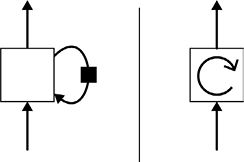

> **圖片描述：** GRU單元的兩種繪製方式。左側：帶有環形箭頭和方塊延遲元素的標準畫法。右側：圓形內有順時針箭頭的簡化圖標。

　　　　(a)　　　　　　　　　　　　(b)

圖22.35　RNN層的符號。(a)RNN層的通用符號。右邊的循環旨在提醒我們內部狀態被讀取和寫入。黑方框代表了延遲的一步。(b)RNN層圖標

現在用卷積層開始我們的網路，它將在影片的每一幀中尋找那隻鳥。圖22.36中卷積層是作為網路的第一層。在這個討論中，我們將任意選擇128像素×128像素的圖像，以及帶有8個5像素×5像素的濾波器和ReLU激活函數的卷積層。我們通過使用(2,2)的步幅將輸出縮小到64像素×64像素（我們可以在這裡使用池化層而不是跨步）。

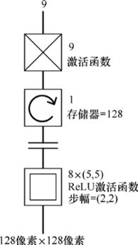

> **圖片描述：** 結合CNN和RNN的混合網路架構。底部輸入128x128圖像，經過8個5x5卷積層（步幅2x2），接循環層（128個存儲單元），再接9個softmax全連接層，最後輸出。

圖22.36　CNN-LSTM網路，用於根據影片對鳥的飛行進行分類

卷積層的輸出是一個64像素×64像素×8像素的張量。我們將它平整後輸入LSTM層。它將有一個含有128個元素存儲器的LSTM單元。輸出進入一個擁有9個神經元的、帶有softmax輸出的全連接層，因此我們得到9個機率，每一個類都有一個。

當我們以這種方式組合卷積層和RNN層時，結果通常被稱為CNN-LSTM**網路**（CNN-LSTM network）。

這個小網路將需要大量的訓練資料，因為它使用了差不多1700萬個權重。卷積層和全連接層一共僅使用了大約1400個權重，因此RNN層幾乎獨自負責該網路的複雜性。它將所有這些權重用於控制計算門控值的內部神經元，以及輸入和前序輸出的修改版本。將LSTM單元的數量減半到64也會將所需的權重減半，並將其再減半到32也會使權重數量相應地繼續減半，使其減少到400多萬。

我們可以堆疊RNN的層來製作深度循環網路，就像任何其他類型的層一樣。我們還可以利用RNN的序列性質並向後運行它們。我們可以將兩者結合起來。接下來讓我們看看這些架構。

### 22.8.2　深度RNN

我們可以將LSTM單元分層排列，這樣每個單元的每個輸出都可以作為其他單元的輸入。這稱為**深度**RNN（deep RNN），其中形容詞“深度”指的是多層。

深度RNN的示意圖以捲起的形式展示在圖22.37a中。我們在圖22.37b中展示了展開的形式。

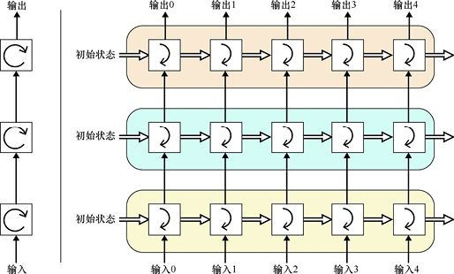

> **圖片描述：** 三層堆疊RNN的展開圖。左側為壓縮的三層符號，右側展開顯示底層（黃色）、中層（青色）、頂層（橙色）各自的5個時間步處理，各層之間有連接。

(a)　　　　　　　　　　　　　　　　　　　　　　　　　　 (b)

圖22.37　深度RNN使用多個RNN層，其中每個輸出都作為下一層的輸入。每層都保持自己的狀態。這個深層網路使用了3層RNN。(a)通常的捲起形式；(b)展開形式

深度RNN的基本思想是每層上的LSTM為下一層上的LSTM提供輸入。因此，一個特徵的第一個時間步到達第一個LSTM，該LSTM處理該資料併產生輸出（以及自身的新狀態）。該輸出被送到下一個LSTM，它執行相同的操作，然後是下一個，以此類推。然後第二個時間步到達第一個LSTM，並重復該過程。

在此設置中，最後一個之前的所有LSTM都能夠處理對下一層有意義的中間表示，但不會立即作為網路產生對我們有用的輸出。因此，早期的LSTM可以以密集和複雜的方式對其資料進行編碼，以實作最高效率。在實踐中，我們需要第一層返回序列，而不是單個值。我們會在第23章和第24章中重溫這一想法。

### 22.8.3　雙向RNN

LSTM旨在處理一系列值，我們通常認為這些值是按時間順序排列的。

正如所看到的，如果試圖分析文本，這可以讓我們考慮句子“查爾斯說他需要一個假期”，並找出代詞“他”所指的人。

但經驗表明，有時給**反向**LSTM提供輸入，即令LSTM從最後開始向著起始處反向工作是有意義的[Sutskever14]。為什麼這樣會有幫助？

假設我們試圖理解這句話中的含義：“‘我需要一個假期’，查爾斯坐下來說”。如果想知道“我”指的是誰，那麼從後向前掃描句子能讓我們知道這是查爾斯。

這個想法導致了**雙向循環神經網路（**bidirectional RNN**）或雙向RNN**、**BRNN** [Schuster97]的引入。當我們專門使用LSTM單元時，它有時稱為**雙向長短期記憶循環神經網路**（bidirectional LSTM）或**雙向LSTM**、**BLSTM**。

顧名思義，該網路一次在兩個方向上運行輸入。當然，這隻適用於已經有一直到我們試圖分析的塊的末尾的資料的情況，因此它不適用於所有情況。例如，如果我們試圖理解即時發出的命令，那麼從最後開始意味著我們必須等這個人完成發言。

圖22.38展示了BRNN層的結構。我們在一個層中使用兩個RNN，一個從開始到結束獲得輸入，另一個從結束到開始獲得輸入。這看起來有些令人費解，但從結構角度來看，它很簡單。不幸的是，BRNN的標準圖（如圖22.38所示）可能很難計算出輸入和處理的異常序列，因此我們將舉例說明。

圖22.38a展示了我們對BRNN的圖標。在圖22.38b的展開形式中，我們可以看到兩個LSTM單元，一個是淺綠色的，另一個是深綠色的。首先，將時間步0的值傳遞給正向LSTM（淺綠色），同時將時間步4傳遞給反向LSTM（深綠色）。

當兩個LSTM都產生了輸出時，它們到達圖頂部的白方框。每個白方框上的兩個值是在不同的時間產生的，所以第一個在第二個到達之前一直停留在那裡。我們將在稍後討論如何處理這兩個值。

現在我們繼續進行下一步。我們將時間步1的值傳遞給正向LSTM，將時間步3傳遞給反向LSTM，它們的輸出保持在白方框。然後我們繼續給正向LSTM和反向LSTM提供時間步2。兩個輸出都上升到白方框，但在處理它們之前，讓我們先完成序列的處理。我們將輸入3提供給正向LSTM並將輸入1輸入到反向LSTM，最後將輸入4提供給正向LSTM，並將輸入0輸入到反向LSTM。

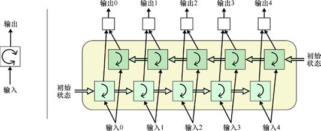

> **圖片描述：** 雙向RNN單元的展開圖。左側為壓縮符號，右側展開顯示兩層：底層（黃色）從左到右處理輸入，頂層（青色）從右到左處理，兩者的輸出在每個時間步合併。

(a)　　　　　　　　　　　　　　　　　　　　　　　　　　　　　(b)

圖22.38　BRNN是兩個一起運行的RNN。其中一個按照通常的順序給出了時間步，從開始到結束。另一個給出了從結束到開始相反順序的時間步。在此圖中，只有兩個LSTM單元，每個單元都有自己的狀態。(a)BRNN的圖標；(b)展開的BRNN

現在頂部的每個方框中都有兩個值。

方框以我們選擇的方式組合它們的輸入。典型的選項是將它們加在一起，然後平均、相乘，或者通過在一個之後附加另一個值來創建一個2元素張量（即列表）。

然後，這些值可以繼續充當網路的輸出，或輸入到任何其他層。

### 22.8.4　深度雙向RNN

如果我們需要更多的計算力，則可以將深度RNN與雙向RNN結合起來創建一個**深度雙向**RNN。圖22.39以捲起和展開的形式展示了這種結構。

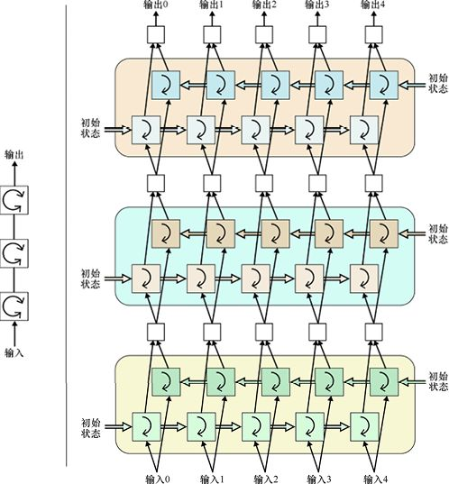

> **圖片描述：** 三層堆疊雙向RNN的展開圖。更複雜的結構，包含三個雙向層（黃色、青色、橙色），每層都有正向和反向的處理流程，層間通過連接傳遞資訊。

圖22.39　深度雙向RNN。每個圓角矩形表示單層雙向RNN。我們說這是“深度”是因為有多個這樣的層，每個層都在為上一層提供輸入。它是“雙向”的，因為在每一層都有一個正向和反向LSTM單元。請記住，此圖中只有6個LSTM單元，每層兩個。(a)捲起的深度雙向RNN；(b)展開的深度雙向RNN

深度雙向RNN提供了大量的計算力。這種能力需要訓練很多權重，並且需要大量的訓練資料。例如，圖22.39中的3層BRNN配置為6個LSTM每一箇中的25個單元，使用大約37500個權重。這相當於3個每層有135個神經元的全連接層。

深度雙向RNN已經應用到語音識別[Zeyer17]、圖片字幕[Vinyals15] [Wang16]以及創建會講話的卡通頭像中[Fan16]。

## 22.9　一個例子

讓我們來看看實際中的RNN。

在這個例子中，我們將使用RNN**生成**全新的文本。我們將使用Arthur Conan Doyle的3部夏洛克·福爾摩斯短篇小說集訓練一個小型RNN，所有這些都可以在線免費獲得[Gutenberg17]。總的來說，這3部小說集有超過304000個單詞。當然，其中許多詞都是反覆使用的。不同的單詞有29000個，包括許多專有名詞，如字符和地名。

一種合理的方法是將文本視為一組單詞。然後，我們可以訓練RNN以發現單詞之間的跟隨關係。我們可以從一些單詞開始，讓RNN告訴我們接下來應該出現哪個單詞。然後使用剛開始的單詞串，將新的詞加在最後，並讓RNN告訴我們應該跟著哪個詞。繼續這個過程，我們可以繼續將最新得到的單詞組回饋給RNN，它會繼續給我們一個新的詞。

為此，我們可以為文本中近29000個不重複的單詞中的每一個都指定一個唯一編號。例如，“the”可能被分配91，“Sherlock”可能被分配307，“Holmes”可能被分配53，以此類推。我們可以一次為網路提供一串單詞，其中樣本由單個特徵組成，包含與該串單詞一樣多的時間步。RNN將讀取這一數字序列並嘗試瞭解數字之間的跟隨關係。我們可以嘗試使用名為word2vec的演算法，將相似的數字分配給相似的單詞，而不是隨意地為單詞指定數字[Bussieck17] [Mikolov13]。這種編號形式具有許多吸引人的特性，儘管在這種簡單的情況下，它可能沒有多大作用。

通過足夠的訓練，我們可以想象給訓練好的網路提供從原始文本中提取的一串單詞作為開始，儘管它們被表示為一串數字，然後運行RNN並從中生成無窮無盡的新單詞。

這是一種完全合理的方法，它可以產生可識別的源文本結果[Deutsch16a] [Deutsch16b]。

但是這種方法需要花費大量的時間進行訓練，因為它需要弄清楚前幾個單詞序列後應該跟著數千個單詞中的哪一個。這其中有大量的選擇，所以有很多決定需要學習。獲得良好的結果將需要大量的時間和計算。

一個更快的選擇是僅按字符工作。也就是說，我們將輸入視為一串字符。在福爾摩斯小說中，刪除換行符後，只剩下89個唯一的字符（26個小寫字母，26個大寫字母，10個數字，22個標點符號，4個帶重音的元音和1個空格）。現在我們的問題小得多了。我們只需要預測89個字符中的一個，而不是預測數萬個可能的單詞中的一個。

讓我們採用這種更簡單、更快的方法。

通過將所有大寫字母轉換為小寫字母，刪除帶重音的元音，並將標點符號大量減少到最常見的十幾個符號，我們可以使事情變得更加容易。包括空格在內，只有49個字符。但是所有這些符號都是有用的資訊，所以先留下它們。

最重要的想法是建立一個RNN分類器。為了訓練它，我們將提供原始文本中的一系列字符，並要求它提供89個字符中的每一個會成為下一個字符的機率。我們將最有可能的預測與文本中真實的下一個字符進行比較，如果它們不匹配，則將為結果分配一些誤差。然後反向傳播通過訓練權重來減小誤差，因此係統對下一個字符的預測將逐漸與標籤匹配。

這是我們根據福爾摩斯小說生成新文本的架構。雖然看起來這種簡單、逐字逐句的方法幾乎不可能得到任何可以理解的結果，但它確實可以產生令人驚訝的、有說服力的輸出，與從散文到技術文檔[Karpathy15b]的各種輸入風格相匹配。

讓我們仔細地看一看訓練。每個輸入都包含一串字符，以及一個作為目標的新字符。假設我們給它輸入，“我的朋友是一個熱情的音樂家，他自己不僅是一個非常有能力的（per）”。最後一個詞（來自原始文本）是“表演家”（performer），因此我們的目標是讓網路分析這個序列並將最高可能性分配給字母“f”。

請注意，這不是一個定局。文本中有很多單詞以“per”開頭但之後跟著不同的字母，比如“個人”（personally）、“棲息”（perched）和“也許”（perhaps）。因此係統必須考慮整個序列才可以正確預測下一個字符。RNN能夠按順序使用之前的值來指導其決策，這使得它成為完成這項工作的完美工具。

這個方法需要我們做一個權衡。我們給系統的輸入越大（即每個輸入分析的字符越多），它獲得的資訊就越多，它的學習和預測就越好。但是輸入越小，系統可以運行得越快，這樣我們就可以在給定的時間內訓練更多的樣本。這裡沒有最好的答案，所以這是我們必須嘗試的另一個值。

經過一些反覆試驗，我們選擇了圖22.40所示的網路。雖然幾乎可以肯定這不是理想的參數選擇，而只是一個簡單的參數，但對於我們這裡的目的來說已經可以工作得足夠好。

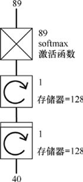

> **圖片描述：** 用於文字生成的RNN架構。底部40個輸入，經過兩個循環層（各128個存儲單元），1個全連接層，最後輸出89個值並通過softmax。

圖22.40　我們用於生成新的福爾摩斯小說資料的整個深度網路。我們的輸入是含有40個連續字符的列表。這些字符進入兩個RNN層。每個包含一個含有128個元素存儲器的LSTM單元。第二個LSTM的輸出被送到含有89個神經元的全連接層，來預測每個字符的機率。網路的結果是可能性最大的字符。第一層圖標頂部的小方框告訴我們它為每個輸入返回一個輸出，而不僅僅是最終結果。我們將在第23章和第24章討論這個實踐中的細節

我們的輸入由40個字符組成。為了創建訓練集，我們將原始文本分割成大約50萬個由40個字符組成的重疊字符串，每個都從每3個字符開始。圖22.41展示了這個想法。

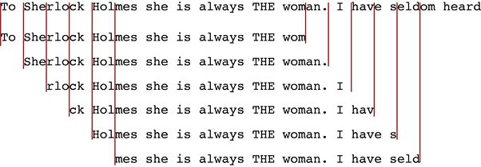

> **圖片描述：** 滑動窗口在文本上的應用。展示「To Sherlock Holmes she is always THE woman. I have seldom heard」這段文字，多個重疊的窗口向右滑動，紅色垂直線標示窗口邊界。

圖22.41　創建訓練資料。源文本（頂行）被剪切成40個字符的片段，每個都從第3個字符開始。第一行下方的每一行是單個訓練資料樣本，作為含有40個時間步的一個特徵呈現給RNN

為了訓練網路，我們最終決定使用RMSprop最佳化器，學習率為0.01，mini-batch大小為100。

在沒有GPU支援的2014 iMac上，圖22.40所示的網路使用我們剛剛描述的超參數時，每一輪花費的時間大約為30分鐘。使用支援GPU的亞馬遜雲服務“p2.xlarge”虛擬機，每一輪花費的時間縮短到大約150秒（2.5分鐘）。

現在我們知道如何訓練了，讓我們看看如何生成新文本。

要創建新文本，我們通過在文本中選擇一個隨機起點來生成“種子”，然後從那裡提取接下來的40個連續字符。我們將種子交給網路併產生一個新的字符。這個新的字符繼續放到種子的末尾，然後第一個字符被刪除，並給我們一個新的40個字符的種子作為輸入來產生下一個字符。只要我們願意，就可以重複它，來創造出新的輸出[Chen17a]。圖22.42展示了該過程。

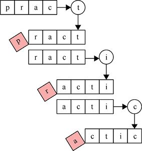

> **圖片描述：** 字元級文字生成的過程。展示「pract」作為輸入，逐步生成：p→r→a→c→t→i→c，每步都以粉紅色高亮顯示新生成的字元，並將其加入下一步的輸入。

圖22.42　使用RNN生成字符。在此示例中，RNN接收4個時間步的輸入。第一行的種子取自源文本。這裡是有4個字符“prac”的字符串。我們將這些字符提供給RNN，後者預測下一個字符將是“t”。在下一行中，我們將“t”附加到種子的末尾，然後刪除第一個字符，得到一個新的4個字符的字符串“ract”。我們將它提供給RNN，後者預測“i”。再一次，我們將“i”加到種子後並刪除第一個字符，得到字符串“acti”。我們把它交給預測到“c”的RNN，這個過程不斷重複，會生成儘可能多的文本

為了觀察網路的進展，在每輪訓練之後我們會輸出誤差，並在那個時刻用網路生成一些文本。我們輸入隨機種子“er price.” “If he waits a little longer”，網路生成的每一輪輸出如下。

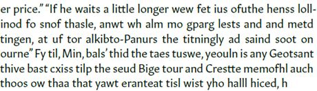

> **圖片描述：** RNN在訓練初期生成的低品質文本範例。文字大多無意義，混合了真假英文單詞，語法和拼寫錯誤頻繁。

從某種意義上說，這非常好。“單詞”是英語大小的，雖然它們不是真正的單詞，但它們可以是。也就是說，它們不是隨機字符串，例如我們可能在密碼中找到的字符串，如“mx，kG73jKgl;?2”。令人驚訝的是，它們和真實存在的詞很接近，而這只是在一輪之後。

經過50輪後，結果有了很大改善。這次輸入的種子是“nt blood to the face，and no man could h”，50輪後的輸出如下。

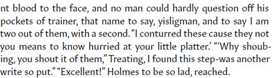

> **圖片描述：** RNN在較多訓練後生成的中等品質文本。文字更像真實英文，包含引號、對話格式，但內容仍然無意義。文體模仿福爾摩斯偵探小說。

結果好多了。記住，系統完全不瞭解單詞。它只知道跟在其他字母序列之後的字母機率。然而，上面的輸出中大多數的詞是真實的，但也有明顯的例外。甚至一些不是單詞的詞（如“conturred”和“shoubing”）似乎也是合理的。標點符號也可以得到，甚至包括第二個引文末尾的逗號。對於這種簡單的網路和訓練方案，這是非常了不起的。

通過運行這個網路，我們可以生成儘可能多的文本。它不具備更好的連貫性，但也沒有更多不相關的東西。

讓我們前進至100輪。下面是根據種子生成的輸出，其中添加的極少數的細節都是對的。

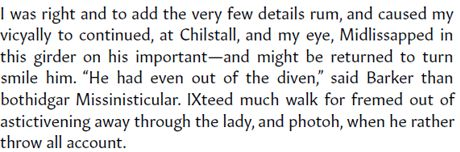

> **圖片描述：** RNN在充分訓練後生成的較高品質文本。語法基本正確，句子結構合理，類似福爾摩斯小說的風格，但具體內容仍為虛構。

上面的文本中，標點符號有很大改進，但有很多不是單詞的詞。這個小小的摘錄看起來並不像是有所改進。我們應該期望它會更好嗎？圖22.43展示了在這訓練的100輪中網路的誤差。

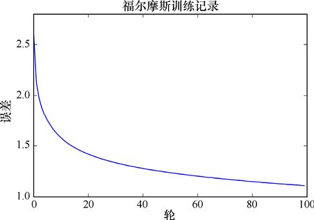

> **圖片描述：** 福爾摩斯文本訓練的損失曲線圖。標題為「福爾摩斯訓練記錄」，x軸為訓練輪數（0至100），y軸為損失值（1.0至2.5以上），曲線從約2.5快速下降，在60輪後趨於平穩在1.0附近。

圖22.43　圖22.40中網路每一輪的誤差，用了文本中的參數

這個網路最大的勝利顯然是在一開始誤差就急速下降。看來在50輪和100輪之間，結果確實有所改善，儘管不是很多。但是圖右側的下降斜率表明，如果我們願意繼續訓練，那麼誤差可能會持續下降至少一段時間。誤差越小，輸出的文本可讀性就越強。

較大的LSTM（即每個單元中具有更多狀態的LSTM）會有更好的性能。使用像我們這樣的網路得到了一些不錯的結果，但是兩個LSTM層各有500個單元[Tran16]。我們的網路只有大約25萬個參數，而這個較大的網路有大約325萬個參數，而且它訓練了1000輪。這種訓練需要強大的GPU支援和足夠的耐心。

## 參考資料

[Barrat17]　Robbie Barrat, *Rap-song Writing Recurrent Neural Network*, Github repo, 2017.

[Bengio94]　Yoshua Bengio, Patrice Simard, Paolo Fasconi, *Learning Long-Term Dependencies with Gradient Descent is Difficult*, IEEE Transactions on Neural Networks, 5(2), 1994.

[Bussieck17]　Jan Bussieck, *Demystifying Word2Vec*, Deep Learning Weekly blog, 2017.

[Chen17a]　Yutian Chen, Matthew W Hoffman, Sergio Gómez Colmenarejo, Misha Denil, Timothy P. Lillicrap, Matt Botvinick, Nando de Freitas, *Learning to Learn Without Gradient Descent by Gradient Descent*, arXiv 1611.03824v6, 2017.

[Chen17b]　Qiming Chen, Ren Wu, *CNN Is All You Need*, arXiv 1712.09662, 2017.

[Chu17]　Hang Chu, Raquel Urtasun, Sanja Fidler, *Song From PI： A Musically Plausible Network for Pop Music Generation*, arXiv preprint, 2017.

[Chung14]　Junyoung Chung, Caglar Gulcehre, Kyunghyun Cho, Yoshua Bengio, *Empirical Evaluation of Gated Recurrent Neural Networks on Sequence Modeling*, 2014.

[Chung15]　Junyoung Chung, Caglar Gulcehre, Kyunghyun Cho, Yoshua Bengio, *Gated Feedback Recurrent Neural Networks*, arXiv 1502.02367v4, 2015.

[Deutsch16a]　Max Deutsch, *Harry Potter: Written by Artificial Intelligence*, Deep Writing blog post, 2017.

[Deutsch16b]　Max Deutsch, *Silicon Valley: A New Episode Written by AI*, Deep Writing blog post, 2017.

[Fan16]　Bo Fan, Lijuan Wang, Frank K. Soong, Lei Xie, *Photo-Real Talking Head with Deep Bidirectional LSTM*, Multimedia Tools and Applications, 75(9), 2016.

[Geitgey16]　Adam Geitgey, *Machine Learning is Fun Part 6: How to do Speech Recognition with Deep Learning*, Medium, 2016.

[Gersoo]　F A Gers, J Schmidhuber and F Cummins, *Learning to forget: continual prediction with LSTM*, Neural Computing, Volume 12, Number 10, 2000.

[Graves13]　Alex Graves, Abdel-rahman Mohamed, Geoffrey Hinton, *Speech Recognition with Deep Recurrent Neural Networks*, 2013 IEEE International Conference on Acoustics, Speech and Signal Processing (ICASSP), 2013.

[Graves14]　Alex Graves, *Generating Sequences with Recurrent Neural Networks*, arXiv 1308.0850v5, 2014.

[Gutenberg17]　Project Gutenberg, *The Adventures of Sherlock Holmes by Arthur Conan Doyle, The Return of Sherlock Holmes by Arthur Conan Doyle, The Memoirs of Sherlock Holmes by Arthur Conan Doyle*, 2017.

[Hochreiter01]　Sepp Hochreiter, Yoshua Bengio, Paolo Frasconi, Jürgen Schmidhuber, *Gradient Flow in Recurrent Nets： the Difficulty of Learning Long-Term Dependencies*, in *A Field Guide to Dynamical Recurrent Neural Networks*, S C Kremer and J F Kolen, edi-tors, IEEE Press, 2001.

[Hochreiter97]　Sepp Hochreiter, Jurgen Schmidhuber, *Long Short-Term Memory*, Neural Computation 9(8), pp. 1735-1780, 1997.

[Johnson17]　Daniel Johnson, *Composing Music with Recurrent Neural Networks*, Heahedria, 2017.

[Karpathy13]　Andrej Karpathy and Fei-Fei Li, *Automated Image Captioning with ConvNets and Recurrent Nets*, Stanford Computer Science Department, 2013.

[Karpathy15a]　Andrej Karpathy, Justin Johnson, Li Fei-Fei, *Visualizing and Understanding Recurrent Networks*, ICLR 2016, 2016.

[Karpathy15b]　Andrej Karpathy, *The Unreasonable Effectiveness of Recurrent Neural Networks*, Andrej Karpathy blog, 2015.

[Krishan17]　Krishan, *Bollywood Lyrics Aia Recurrent Neural Networks*, From Data to Decisions blog, 2017.

[Lipton15]　Zachary C. Lipton, John Berkowitz, Charles Elkan, *A Critical Review of Recurrent Neural Networks for Sequence Learning*, ArXiv 1506.00019, 2015.

[LISA17]　LISA Lab, *Modeling and generating sequences of poly-phonic music with the RNN-RBM*, 2017.

[Mao14]　Junhua Mao, Wei Xu, Yi Yang, Jiang Wang, Zhiheng Huang, Alan Yuille, *Deep Captioning with Multimodal Recurrent Neural Networks (m-RNN)*, Proceedings of International Conference on Learning Representations (ICLR), 2015.

[Mikolov13]　Tomas Mikolov, Kai Chen, Greg Corrado, Jeffrey Dean, *Efficient Estimation of Word Representations in Vector Space*, arXiv 1301.3781.

[Moocarme17]　Matthew Moocarme, *Country Lyrics Created with Recurrent Neural Networks*, Blog post, 2017.

[O’Brien17]　Tim O’Brien and Irán Román, *A Recurrent Neural Network for Musical Structure Processing and Expectation*, 2017.

[Olah15]　Christopher Olah, *Understanding LSTM Networks*, 2015.

[Pascanu12]　Razvan Pascanu, Tomas Mikolov, and Yoshua Bengio, *On the difficulty of training recurrent neural networks*, arXiv 1211.5063, 2012.

[Quoc15]　Quoc V Le, Navdeep Jaitly, and Geoffrey E. Hinton, *A Simple Way to Initialize Recurrent Networks of Rectified Linear Units*, arXiv 1504.00941v2, 2015.

[R2RT16]　R2RT, *Written Memories: Understanding, Deriving and Extending the LSTM*, R2RT blog, 2016.

[Schuster97]　Mike Schuster and Kuldip K Paliwal, *Bidirectional Recurrent Neural Networks*, IEEE Transactions on Signal Processing, 45(11), 1997.

[Sturm15]　Bob L. Sturm, *The Infinite Irish Trad Session*, High Noon GMT blog, 2015.

[Sturm17]　Bob L. Sturm, *Lisl’s Stis： Recurrent Neural Networks for Folk Music Generation*, High Noon GMT blog, 2017.

[Suresh16]　Harini Suresh, *Vanishing Gradients & LSTMs*, Blog post, 2016.

[Sutskever14]　Ilya Sutskever, Oriol Vinyals, Quoc V. Le, *Sequence to Sequence Learning with Neural Networks*, arXiv 1409.3215, 2014.

[Timmaraju15]　Aditya Timmaraju, Vikesh Khanna, *Sentiment Analysis on Movie Reviews using Recursive and Recurrent Neural Network Architectures*, 2015.

[Tran16]　Trung Tran, *Creating A Text Generator Using Recurrent Neural Network*, Blog post, 2016.

[Twain03]　Mark Twain, *The Jumping Frog: in English, then in French, then Clawed Back into a Civilized Language Once More by Patient, Unremunerated Toil*, 1903. Reprinted by Dover Publications, 1971.

[vandenOord16]　Äaron van den Oord, Sander Dieleman, Heiga Zen, Karen Simonyan, Oriol Vinyals, Alex Graves, Nal Kalchbrenner, Andrew Senior, Koray Kavukcuoglu, *WaveNet: A Generative Model for Raw Audio*, arXiv 1609.03499, 2016.

[Vinyals15]　Oriol Vinyals, Alexander Toshev, Samy Bengio, Dumitru Erhan, *Show and Tell:A Neural Image Caption Generator*, arXiv 1411.4555v2, 2015.

[Wang16]　Cheng Wang, Haojin Yang, Christian Bartz, Christoph Meinel, *Image Captioning with Deep Bidirectional LSTMs*, arXiv 1604.00790, 2016.

[Zeyer17]　Albert Zeyer, Patrick Doetsch, Paul Voigtlaender, Ralf Schlüter, Hermann Ney, *A Comprehensive Study of Deep Bidirectional LSTM RNN for Acoustic Modeling in Speech Recognition*, arXive 1606.06871, 2017.
