# 第23章　Keras第1部分


Keras是一個免費的開源Python庫，可以輕鬆構建和訓練深度學習模型。我們將學習這個庫的基本概念，然後將它們在實際資料中付諸實踐。


## 23.1　為什麼這一章出現在這裡


在前面的章節中，我們討論了機器學習和深度學習的基礎知識，並且已經看到了如何使用幾種流行的神經元層。


在本章中，我們將把所有這些付諸實踐。我們將構建深度學習系統並對其進行訓練。


優秀的深度學習庫有很多，每個庫都有其優點。我們不會試圖涵蓋許多庫，而是專注於一個名為Keras的庫。這個庫功能強大、易於使用、流行、免費、開源[Chollet17a]。


另一個優點是，Keras允許我們編寫一次演算法，然後在其他幾個流行和高級的深度學習庫中運行它們。這意味著我們與這些庫的細節隔離，但同時仍然享受使用其高度最佳化和高效程式碼的優勢。


用Keras的一個好處是，構建和訓練機器學習系統的典型步驟只需要很少的常規Python編程。實際的深度學習程式碼通常是程式中最簡單的部分：我們只用幾行程式碼網路，並通過一個或兩個函數呼叫來訓練它。該程式的其餘部分大部分由支援任務組成，例如獲取輸入資料、清理它、構造它以便在網路中使用，編寫用於保存資料和可視化結果的程式碼，等等。


在本章中，我們將從簡單的網路開始。在第24章中，我們將擴展這些想法，以構建更復雜的模型，例如深度卷積神經網路和循環神經網路。


為了保持專注，我們堅持只使用自身工作需要的Keras程式和論證。一旦熟悉了Keras的基礎知識，**你**就可以自己探索其他更深層的知識。


當我們實際使用程式碼時，總是必須處理管理問題，例如處理我們的資料、以各種方式操作它、設置幫助程式等。為了控制這些細節，避免我們不斷陷入困境，我們將編程討論限制在本書的3個章節中。在第15章中，我們研究了機器學習庫scikit-learn。在本章和第24章中，我們將深入研究深度網路編程的令人愉快但細緻的工作。


### 23.1.1　本章結構


本章的結構不是一條直線。


我們在本章中的目標是介紹設計、構建、訓練和使用各種深度學習網路的工具。我們永遠不會忽視這一目標。但要實作這一目標，我們必須定期停止並覆蓋必要的基礎工作。這通常會在各部分的開頭髮生。有時候我們可能會向前邁出兩步、退一步，但那只是因為我們需要停下來思考一個新想法。這樣做的回報將更加豐厚，因為我們將看到這個想法如何幫助我們建立一個可行的系統。


### 23.1.2　筆記本


本章中包含多行程式碼的每個部分都有一個關聯的Python筆記本。筆記本的名稱在每個部分開始後的標註中。


### 23.1.3　Python警告


Python庫是不斷變化的，儘管通常變化很小。即使是低級庫也會不時更改，以響應漏洞修復和其他改進。然而，當程式使用舊參數或預設值從該庫呼叫例程時，這會引發**警告消息**。警告的目的是告訴我們應該更新程式碼以使用相關例程的新版本。


當警告來自我們沒有直接呼叫的程式時，這可能令人困惑甚至沮喪。換句話說，使用程式碼呼叫一個庫函數，該函數反過來呼叫另一個庫中的某些東西，等等，直到使用舊約定呼叫更新的庫，我們就會得到一個警告。


令人高興的是，這種情況往往不可怕。更新的庫通常會提供大量的時間，在此期間它們同時支援舊方法和新方法，因此，儘管有警告，但一切都運行得很好。畢竟，這只是一個警告，而不是錯誤。編寫和維護大多數流行Python庫的志願者都在努力更新程式碼以使其保持最新狀態。這意味著在稍後的某個時間，在我們完成Python安裝的例行更新後，所有庫將重新同步，相關的警告將停止顯示。


最重要的是，我們需要關注錯誤和崩潰，但通常會忽略來自被其他庫呼叫的庫的警告。


## 23.2　庫和調試


在深入研究之前，我們想知道為什麼需要使用庫。當然，從頭開始編寫程式碼，自己實作本書中的所有演算法會更有教育意義。這個過程能夠讓我們學習到可能忽略的基本細節。這個方法有很多優點。為了透徹理解，我們自己來編寫程式碼並實作（即使它們只是用於玩具系統）有無與倫比的優勢。


但是，當**涉及**實際構建、訓練和運行深度學習網路時，人們幾乎總是會使用庫。要使自己編寫的程式碼可以與能立即使用的、已有的庫相媲美，我們必須花費大量的時間和精力來解決數值穩定性、最佳化、GPU編程、多線程等問題。雖然其中許多對於使玩具系統發揮作用並不是必不可少的，但當我們開始處理大量資料時，為了在有限的時間內獲得良好的結果，它們就變得十分必要。


作為類比，請考慮今天大多數人使用的高級語言。在本章中，我們將使用Python。但Python並不直接由電腦執行。任何高級語言最終都會轉換為彙編語言，這是CPU的語言。也許我們應該用彙編語言編程。但為什麼實際很少人這樣做呢？因為彙編語言只是控制處理器的底層硬體的一種方式，使用稱為機器碼的特定處理器語言來操縱各個電路元件。也許我們應該在機器語言中編程。


當然，我們不使用機器碼，因為它會花費大量不必要的時間。在越來越高的抽象層次上工作的價值在於我們可以被解放出來用更抽象的術語思考，也可以有更多時間研究如何構建解決問題的方法，而不是控制電腦的機制。出於同樣的原因，使用像Keras這樣的庫可以讓我們從深度學習思想中抽象地思考，而不會陷入其實作的機制中。


研究人員經常發佈新的、更聰明的技術，以更快的速度和更高的效率訓練深度網路。時刻保持最新的最佳方法是掌握基礎知識。強大的基礎使我們能夠更輕鬆地理解和實作這些複雜的技術，因為它們經常將熟悉的想法與一些新的變化相結合。


### 23.2.1　版本和編程風格


就像我們在第15章中看到的scikit-learn一樣，Keras是基於Python的。


2008年，Python從版本2.7升級到現在的版本3。我們將在本章中使用Python 3.5，但Python 3的任何發行版都將與我們的程式碼兼容。令人高興的是，大多數程式碼都可以在Python 2.7中正常運行。最常見的區別僅僅是在Python 3中，當使用print時，我們將參數放在括號中，例如print（‘Hello’），而在Python 2.7中則不使用括號進行輸出。


就像Python接收更新一樣，Keras庫也是如此。2017年，Keras庫從版本1升級到版本2。大多數內容保持不變，僅有少量變化。在本章中，我們使用Keras 2.0.6。Keras 2兼容Python 3和Python 2.7。


Python是一種功能強大的語言，它有許多巧妙的使用技巧。有一些方法可以編寫緊湊而高效的程式碼，並且該程式碼可以構建在可以為該語言安裝的60000多個庫上[Ramalho16]。但這不是一本關於Python的書，也不是關於如何編寫最短或最快的程式碼的書。


對於這些演示，我們更傾向於清晰和簡潔，而不是緊湊，甚至優雅。我們的目標是編寫可以理解的程式碼，因此我們將使用比實際可能使用的更長的變量和函數名稱，並且將寫出一些可以組合成一個步驟的表達式。我們有時甚至會使用非必要的括號，如果它們更容易在視覺上掌握一行程式碼的完成情況。


輸入將以淺灰色陰影顯示，輸出將為淺藍色。我們偶爾會在輸出行中添加換行符和空格以使其適合頁面。


在構建程式時，我們通常會一次只顯示一小段程式碼。我們的想法是通過組合這些部分來構建完整的程式，通常只需要一個接一個地輸入它們。我們通過將程式碼呈現為小塊，使它們更易於閱讀和討論。


許多程式需要Python import語句來引入庫，例如NumPy或Keras本身。我們的約定是在我們第一次提供包含需要它的函數的列表時包含import語句，但是為了避免重複大段“無聊”的import語句，我們將不在後續示例中重複它們。令人高興的是，導入我們不需要的模組，甚至不止一次導入同一模組也沒有任何代價。在開發一段程式碼時，我們可以簡單地複製並粘貼一大段文本，這些文本可以導入我們常用的每個庫。當我們完成程式碼的開發並且清理它時，可以刪除任何不必要或冗餘的import語句。


### 23.2.2　Python編程和調試


雖然本章介紹了很多程式碼，但我們需要記住，這就像是一本展示最終畫作的藝術書，或者是一本展示建築物的建築書。幾乎沒有什麼東西一開始就乾淨漂亮。本章中的程式碼示例是一行一行開發的，經過了多輪調試、改進等最佳化步驟。


雖然最終的結果可能看起來簡單明瞭，但它們通常採用一種曲折且常常產生錯誤的路徑來達到這一點。在我們開發它們時，你在本書中看到的程式碼是混亂和“醜陋”的，然後一旦它們有效工作了，我們就會切掉那些不需要的部分並整理剩下的部分。我們應該始終期望在所有編程中都要經歷類似的增量開發過程，特別是在學習像Keras這樣的新庫時。


Python中的這個過程比許多其他語言容易得多，因為Python可以進行交互式編程。也就是說，我們不必在文本編輯器中編寫程式、保存、編譯（compiling），然後運行它。當然，如果我們願意，這樣做是沒問題的。但我們也可以選擇一次一行地將程式碼輸入到解釋器，立即得到結果。這極大地“鼓勵”和“獎勵”了試驗。


Jupyter提供了一個非常好的基於瀏覽器的交互系統，這個系統非常適合這種試驗[Jupyter16]。在瀏覽器中運行Python的一個好處是我們可以同時打開多個獨立的選項卡。我們可以使用一個選項卡作為主要開發環境，一個用於試驗，另一個用於運行測試，等等。並且Jupyter有許多有用的快捷方式可以節省時間[Devlin16]。


使用Jupyter的一個好方法是一次增加一行程式碼或語句。我們可以嘗試很多小試驗，檢查一切，直到我們確信已經掌握了所有細節。我們甚至可以用函數定義包裝該程式碼。


使用Keras時調試可能是一個挑戰，因為錯誤往往是不可理解的。Keras在很大程度上假設我們知道自己正在做什麼，並且它沒有對程式碼進行大量的錯誤檢查。當程式碼出錯時，我們經常會瞭解到這一點，因為我們從未聽說過的一些底層程式發現它無法正常工作。瞭解該程式中出現的問題通常遠非顯而易見。擁有Keras的所有源程式碼可以提供幫助，但通過閱讀庫源程式碼來調試我們的程式碼需要花費大量時間和精力。


一種更簡單的方法是找到我們正在進行的觸發問題的呼叫，然後儘可能地暫時簡化它，直到問題消失為止。如果失敗，我們可以用來自其他項目的程式碼片段或甚至是在線示例替換該呼叫。然後一步一步地將工作程式碼轉換為我們自己的程式碼，這樣就可以發現導致它失敗的步驟。


我們可以用一些調試在Jupyter中進行少量實驗。但有時我們想要使用更深入、功能更全面的現代調試器，它配備了斷點和單步執行等功能。我們可以在PyCharm提供的免費開發環境PyCharm Community Edition IDE [JetBrains17]中找到那些工具。在這裡，人們可以進行現代調試，例如設置斷點、檢查變量和查看呼叫堆棧。


在兩個環境之間來回複製程式碼可能有點麻煩，但對利用Jupyter的即時評估和回饋以及PyCharm強大的調試工具來說，這點麻煩是值得的。


除了Jupyter和PyCharm，還有許多其他Python開發工具和環境可供選擇。我們在本書中使用了Jupyter和PyCharm，但是你應該花時間去探索並找到最適合自己的工具。


## 23.3　概述


Keras是一個用於創建、訓練和使用深度學習網路的庫[Chollet17b]。它是用Python編寫的，因此它與我們在第15章中看到的scikit-learn兼容。事實上，它是“故意”與scikit-learn一起工作的，我們將在本章中自由使用這兩個庫。


通過簡單地構建一堆參數化層，Keras可以輕鬆創建深度學習網路。這種彙編自由既是一種“福”，也是一種“禍”。


我們可以用大多數書面語言進行類比。在英語中，我們可以通過將一個從左到右的單詞放在一個序列中來構建一個句子。只要我們遵循句子結構的規則，就可以隨意地選擇單詞，並且它們將始終形成有效的英語句子。例如，“鞋子和葡萄唱著笨拙的窗戶”是一個有效的英語句子，但它沒有意義。也許最著名的毫無意義的句子是“無色的綠色思想瘋狂地睡覺”[Chomsky57]。事實上，如果我們只是將單詞以合理的結構拼湊在一起，絕大多數都將毫無意義。有意義的句子很少見。


同樣，我們可以輕鬆地用Keras構建各種深度學習網路。但是，如果我們想要一個有意義的網路，意味著它可以從示例中學習並做出良好的預測，就需要謹慎選擇網路層及其參數。每個層必須在緊接其之前和之後的層以及網路的所有其他層中有意義。


本章中的大部分討論都是為了充分理解正在發生的事情，這樣我們就可以避免相當於“鉛筆磕磕絆絆從不煮廚師”這樣的挫敗。我們越瞭解Keras正在做什麼，就越能夠在一開始避免建立這樣的“怪異東西”。而且當不可避免地製造它們時，我們將會更好地修復它們。


因此，在本章和第24章中，我們將仔細解釋每一步。我們的目標是在這些章節結束時，**你**將瞭解所有設計決策和選擇，因此**你**可以放心地設計和實施新的深度學習網路。


### 23.3.1　什麼是模型


“模型”這個詞值得特別關注，因為不同的作者和程式設計師使用它來表示不同的東西。


Keras文檔特別以3種方式使用模型這個詞。首先，它指的是深度學習系統的架構。其次，它描述了該架構與其作為訓練結果所學的權重的組合。最後，它可以引用我們用於構建系統的庫呼叫集，也稱為API（應用程式介面）。簡潔起見，為了匹配Keras文檔，我們將以相同的3種方式使用“模型”一詞。我們將嘗試從上下文中明確含義。


### 23.3.2　張量和數組


我們將處理具有不同維度（dimension）數量的資料結構，並且我們經常給它們提供不同的名稱。例如，我們通常將一維列表稱為**列表**，將二維排列稱為**網格**，將三維排列稱為**塊**或**體積**。在機器學習中，網格和塊必須是完整的。也就是說，沒有任何部分伸出，也沒有洞。每一面都是平的，每個格子都被填滿。


所有這些排列都屬於張量類別。實際上，張量可以具有任意數量的維度。


對於數學家和物理學家來說，“張量”這個詞指的是一個更為籠統的概念。張量的機器學習版本在技術上與數學定義是不兼容的，它們是不同的。這幾乎不是一個問題，但是在閱讀有很多物理學內容的機器學習論文時要特別注意，反之亦然。


NumPy也適用張量，但NumPy文檔通常稱它們為**數組**。雖然對於許多程式設計師來說，“數組”是一維列表，但請記住，在NumPy中，這個詞可能是指一個多維張量。


### 23.3.3　設置Keras


要安裝最新版本的Keras，請訪問Keras官方網站，在左側的“主頁”部分選擇“安裝”。這裡的說明往往很簡短，且面向知道如何安裝Python系統的用戶。如果**你**不熟悉如何在系統上安裝庫，則有許多網站提供逐步說明。Python有幾種流行的包管理器，可以更輕鬆地安裝和管理庫。


在開始使用Keras之前，我們必須對我們想要的設置方式做出一些重要的選擇。在許多庫中，我們可以使用預設值，然後學習如何在以後針對特定任務調整它們。但是在開始之前我們需要選擇Keras中的一些設置，因為它們將決定我們如何塑造資料。即使在編寫第一個程式時，瞭解Keras的基礎也很重要，所以讓我們深入研究。


Keras是基於我們已經遇到的許多其他Python庫構建的，比如NumPy和SciPy。它還利用了為構建深度學習網路而開發的其他庫。事實上，Keras可以被視為使用這些深度學習庫的一種更簡單的方法。


從Keras 2.0.8開始，我們可以選擇使用Theano [Theano16]、TensorFlow [TensorFlow16]或CNTK [CNTK17]來運行網路。Keras將它們稱為後端（backend），因為它們是統一的Keras介面的“幕後”，並提供實際創建和運行網路的引擎。


這些深度學習庫是由不同的團隊使用不同的原則開發的。Keras向我們隱藏了它們的差異，提供了一種統一且相對簡單的方式來構建和運行網路。


但是每個庫都不同，我們在實際訓練網路時必須選擇一個。對這3個後端的比較和選擇是不斷變化的。TensorFlow和CNTK正在緊張開發中，經常獲得新的功能和能力，並且穩定性、準確性和效率都在不斷提高。隨著1.0版本 [Bengio17]的發佈，Theano的開發於2017年底停止。


因為所有庫都實作了我們在前面章節中看到的演算法，所以當我們在每個後端運行相同的網路時，會得到一樣的結果。但由於實施方式或進行計算的方式不同，特定的結果可能會有所不同。本章中重要的差異是速度和記憶體使用。對於大多數小型項目，這些測量值從一個後端到另一個後端的差異很小，但是當項目變大時，我們可能會發現一個後端提供了與另一個後端不同的速度和記憶體平衡。


指定我們想要使用哪個庫或後端很容易，但它涉及編輯一個小配置文本文件，它是Keras安裝的一部分。我們可以在Keras網站最左側的“主頁”選項卡下找到後端選擇指南，這是查找Keras所有內容的最新資訊的最佳位置，也是此配置文件所在的位置。


### 23.3.4　張量圖像的形狀


如何組織我們的資料，這個問題不能完全解決。特別是當我們使用圖像時，有兩種常用但不同的方式來構建保存資料的張量。


Keras允許我們使用任何一種方法，只要告訴它我們選擇了哪一種方法。我們可以通過在配置文件中命名我們的選擇來完成此操作。


讓我們來看看這個選擇，以及我們如何識別它。


考慮單個彩色圖像。圖像具有寬度和高度，還有3個**通道**（channel）或者說切片，每個通道用於紅色、綠色和藍色。如圖23.1所示，我們可以想象從前到後或從左到右堆疊的圖像。


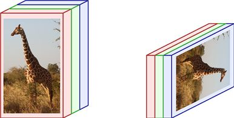

> **圖片描述：** 圖像尺寸調整的示意圖。左側為一張較大的長頸鹿彩色照片（三層RGB），右側為同一張照片的縮小版本，兩者都以三維RGB方塊表示。


(a)　　　　　　　　　　　　　　　　　　　　　　　　(b)


圖23.1　兩種堆疊大小為寬100像素、高200像素的圖像的方法。我們按照遠離、向下、向右的順序讀取塊的尺寸。(a)從前到後堆疊圖像。此塊的尺寸為3像素×200像素×100像素。這是channels_first組織順序。(b)從左到右堆疊圖像。此塊的尺寸為200像素×100像素×3像素。這是channels_last組織順序


假設圖像寬100像素，高200像素，那麼我們按順序（行，列）將其寫為(200,100)。我們將按遠離、向下、橫向的順序指定三維資料結構的尺寸。根據這個約定，圖23.1a首先放置通道數，創建一個具有(3,200,100)形狀的塊，圖23.1b最後放置通道數，創建一個具有(200,100,3)形狀的塊。


一些庫假設資料是從前到後的形式，有些假設它是從左到右的形式。如果我們不符合它們的假設，事情可能會變得非常錯誤。例如，如果我們的庫希望資料是圖23.1a的前後順序，但我們將它按照圖23.1b的從左到右的順序存儲，那麼庫就會思考：我們有200個圖像，每個圖像高100像素、寬3像素。這不會給我們想要的結果！


Keras隱藏了這些依賴於庫的選項，並根據需要重構資料以使一切正常。但我們需要告訴它我們正在使用的是這兩種方法中的哪一種。我們通過告訴它通道數（在這種情況下是3）是第一個維度還是最後一個來描述塊的尺寸。


我們通常在上面提到的Keras配置文件中提供此資訊。在這個文本文件中，通過將名為“image_data_format”的參數設置為字符串“channels_first”或“channels_last”來確定我們如何組織資料。


在編輯配置文件之前備份配置文件總是一個好主意。該文件是純文本，因此我們可以使用文本編輯器打開它，並根據文件的現有佈局為其變量賦值。大多數參數的值將是以引號命名的字符串，我們需要保留引號。


例如，清單23.1展示了典型的Keras配置文件。注意花括號。這裡我們將“image_data_ format”設置為“channels_last”，即告訴keras我們用通道數位於最後一個維度的方式組織資料。我們還將“backend”設置為“tensorflow”，即告訴Keras我們想要使用TensorFlow作為我們的庫（或後端）。其他兩個選項沒有更改。這些是我們將在本章和第24章中使用的選項。


**清單23.1　**典型的Keras配置文件。我們設置了backend和image_data_format參數。另外兩個沒有更改。


```
{
    ′epsilon′: 1e-07,
    ′backend′: ′tensorflow′,
    ′floatx′: ′float32′,
    ′image_data_format′: ′channels_last′
}
```


當我們將Keras導入Python程式碼時，Keras將讀取此配置文件。然後，當我們使用剛剛指定的圖像資料訓練網路時，如果需要，Keras將自動重構該張量，以匹配我們選擇的後端的期望。


如果我們不使用圖像資料，那麼“image_data_format”的設置就無關緊要了。


配置文件中還有兩個我們尚未解決的條目。參數“epsilon”用於控制數值計算。它的預設值需經過仔細選擇，以匹配系統的內部演算法，我們在正常使用庫時不應更改它。


參數“floatx”告訴keras它應該期望存儲資料的浮點數類型。這個值也很少改變。


我們還可以從程式碼中讀取和寫入這些參數的值（“backend”除外）。這樣我們可以在不修改配置文件的情況下為給定程式更改它們。要訪問這些值，我們使用import來引入Keras模組後端，然後呼叫清單23.2中的一個函數。在呼叫任何Keras程式之前，應該更改這些預設值。慣例是在文件開頭的任何import語句之後很快甚至立即呼叫它們。


請注意，清單23.2中的第一行是一個import語句，它從Keras引入必要的模組。如果我們忘記了這一行，可能會在運行此程式碼時從Python中得到NameError回饋。


**清單23.2　**如何從程式碼中設置Keras配置值。請注意，我們無法從程式碼中設置後端選項。設置“epsilon”或“floatx”的值是不常見的，只能由專家完成。


```
from keras import backend as keras_backend
*　*
*# read the values of epsilon, floatx, and image_data_format*
ep_value = keras_backend.epsilon()
floatx_value = keras_backend.floatx()
idf = keras_backend.image_data_format()
*　*
*# set the values of epsilon, floatx, and image_data_format*
keras_backend.set_epsilon(0.0000001)   *# rarely done*
keras_backend.set_floatx(′float32′)   *# rarely done*
*# the important one*
keras_backend.set_image_data_format(′channels_last′)
```


### 23.3.5　GPU和其他加速器


現在許多電腦都帶有**圖形處理單元**或GPU。顧名思義，這些設備最初被設計用於加速遊戲、科學可視化和其他三維密集型應用程式通常使用的三維圖形處理。為實作此目的，芯片被設計為實作通常用於創建這些圖像的數學步驟。GPU迅速變得越來越強大、豐富且便宜。


令人意外的是，機器學習研究人員意識到前饋和反向演算法的編寫方式可能使得它們在數學上看起來很像這些芯片能夠快速並且並行地完成的數學計算。也就是說，這種芯片不僅可以比在“普通”電腦內更快地完成計算，也可以同時進行數十次或更多次計算。


使用GPU帶來的速度提升，特別是在訓練期間，產生了巨大的影響。那些在常規CPU上訓練不切實際的模型突然變得觸手可及。


但並非所有的GPU都是相同的。不同的製造商設計具有不同特徵和技術的GPU。NVIDIA已經為機器學習提供了大量明確的支援，並提供了大量的支援軟體，其中大部分都稱為CUDA [NVIDIA17]。因此，大多數機器學習庫都使用該公司製作的GPU。


為了提供替代方案，一個名為OpenCL的開源項目致力於創建一個庫，使用戶能夠以任何製造商製造的芯片上運行的方式編寫GPU程式[Khronos17]。截至2018年初，該項目仍在開發中，但現在一些不同的庫可以使用任何GPU。這是一個快速變化的動態局勢。最新的資訊可以在博客和線上論壇中找到。


更新的替代方案是**張量處理單元**（tensor processing unit），或TPU [Sato17]。這是專為機器學習所需的張量處理而設計的專用芯片，可用於代替GPU。截至2018年初，TPU在消費級硬體上很少見。


## 23.4　準備開始


Keras文檔雖然完整，但也具有挑戰性。其中大部分是專家寫的。例如，文檔將標識可用於給定程式的選項，但它可能不會描述這些選項的含義、每個選項的優缺點，以及我們應該選擇哪個標準。


我們通常可以通過在線教程和示例填補空白。在極端情況下，我們可以深入瞭解可公開訪問的源程式碼，並在理論中確切地確定每個選項的功能。為了避免這種煩瑣的源程式碼查找和搜索工作，在本章中我們將解釋所有的變量設置和選擇。


許多Keras函數採用可選參數，其中一些很泛用，而另一些則適用於非常具體的情況。為了保持討論的重點，我們只討論在本章中使用的函數和參數。


在到達最終高峰之前，我們第一次實作訓練有素的神經網路的過程將帶我們走過3個山頂，然後達到有效網路的目標。當看到如何預處理資料以便為學習做好準備時，我們將到達第一個山頂。當網路建成並準備運行時，我們將到達第二個山頂。當到達第三個山頂時，我們將看到如何運行網路，以便從資料中學習。當到達這個最後的高峰時，我們將把它們放在一起。現在讓我們從一個什麼都沒有的狀態開始逐步擁有一個可以預測新資料的訓練有素的網路。


我們“攀登”吧！


### “Hello,World”


第一本關於C語言編程的書中的第一個程式演示瞭如何讓電腦輸出“hello,world”[Kernighan78]。從那時起，輸出“hello,world”已被用作無數書的無數種語言的第一個程式。“hello world program”這個短語已經被用來指代我們在幾乎所有編程語言或電腦系統中學到的第一件事，即使它不是字面上輸出那個短語。


機器學習有兩個“hello,world”的例子：Iris資料集和MNIST資料集。它們都是基於小型免費資料集的分類問題。因為它們如此受歡迎，Keras有一些特殊用途的例程，讓我們只用一行程式碼就可以將資料讀入程式。


Iris資料集是關於屬於3種類型的150株不同鳶尾花的資訊的集合[Wikipedia17]。每個樣本包含4個測量值或特徵：花萼花瓣的長度和寬度。我們的工作是從這個標記資料中學習如何接受新花的4個測量值並預測它屬於3種類型中的哪種。清單23.3展示了這些資料的前幾行。


我們在之前的章節中已經看過MNIST資料集。這是0～9的手寫數字的微小灰度圖像（28像素×28像素）的大集合[LeCun13]。資料庫分為60000個用於訓練的圖像和10000個用於測試的圖像。每個圖像都附有一個0～9的整數作為標籤，告訴我們圖像包含的數字。


**清單23.3　**經典Iris資料集的前幾行。每行保存花萼的長度和寬度、花瓣長度和寬度，以及花所屬的類的名稱。為了清晰起見，我們添加了一些空格。


```
5.1, 3.5, 1.4, 0.2, Iris-setosa
4.9, 3.0, 1.4, 0.2, Iris-setosa
4.7, 3.2, 1.3, 0.2, Iris-setosa
4.6, 3.1, 1.5, 0.2, Iris-setosa
5.0, 3.6, 1.4, 0.2, Iris-setosa
```


MNIST資料集中的圖像多種多樣，一半來自高中生，一半來自美國人口普查局的員工。名稱MNIST代表“修改後的NIST”。NIST本身是指美國國家標準與技術研究院（NIST），其中資料來源於此。修改涉及預處理，例如裁剪和縮放圖像。這些圖像的一個有趣的特性是，有些是模稜兩可的，甚至對觀察者來說也是如此。圖23.2展示了從訓練資料中每個數字的10個隨機選擇的例子。


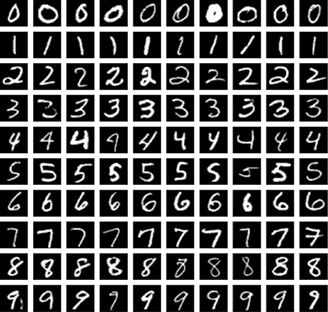

> **圖片描述：** MNIST手寫數字資料集的100張樣本圖。10行10列排列，每行對應一個數字（0至9），展示各種不同書寫風格的手寫數字，白色筆畫在黑色背景上。


圖23.2　MNIST訓練集中隨機選擇的圖像，按標籤組織。注意厚度和樣式的變化。一些細節值得注意。從左邊開始的第2個3的某些地方几乎消失。第4個4可能被誤認為是9。右邊的第3個5可以稱為6開環。最右邊的7有一個水平斜線，其他7卻沒有這個特徵。有幾個8的上部環路未關閉。最左邊的9有一些額外的人為痕跡


因為Iris和MNIST資料集相當於機器學習的“hello,world”，所以它們幾乎出現在關於該主題的每本書和教程中。這有利有弊。


益處很多。使用這些眾所周知的資料集的一個重要優點是，因為有很多人研究過它們，所以它們被認為是很好的測試資料集。


這兩個資料集的另一個優點是，因為它們非常廣為人知，所以很容易找到人們已經建立和訓練的各種網路。管理Iris資料集的UCI機器學習庫將它稱為“……也許是模式識別文獻中最知名的資料庫”。MNIST資料集也不甘落後。MNIST（以及許多其他標準資料集）的分數表以及網路的體系結構可在線獲取，因此我們可以從中學習[Benenson16][LeCun13]。


這些資料集的另一個優點是，它們已經證明自己非常適合開發機器學習技能。它們足夠小，我們的程式可以快速運行，並且它們描述了具體的、可理解的現象。資料集本身是乾淨的，這意味著它們沒有筆誤、錯誤和其他可能干擾人類和電腦學習過程的細節。MNIST資料集共有70000個樣本，足以進行一些真正的訓練和試驗。


使用這些資料集的主要缺點正是因為它們如此眾所周知，所以它們的使用會變得重複。


總的來說，我們認為使用這些易於理解和有用的資料集的好處值得承擔過度熟悉的風險。為了保持一致性，我們將在本章中為我們的示例選擇MNIST資料集。


MNIST另一個重要的積極品質是我們可以畫出它的圖像。抽象資料很好，但解釋起來可能很有挑戰性。圖像卻很棒，因為我們可以通過查看來評估它們的許多內容。


## 23.5　準備資料


在MNIST中，來自NIST的原始黑白（二值）圖像的尺寸被標準化為20像素×20像素的方形區域，同時保持了它們的縱橫比。正規化演算法使用了抗鋸齒技術，因此得到的圖像包含灰度級。該圖像被放於28像素×28像素圖像的中心[LeCun13]。


所以我們知道數字都是居中的。每個圖像中的灰度值從黑到白變化，查看資料會很明顯地發現它們都是被掃描來的，所以數字大部分都是直立的。所有這些都讓我們的任務更輕鬆。


對於大多數資料庫，我們必須自己進行這種預處理工作，以使我們的樣本保持一致並且可以相互比較。我們還必須清除壞掃描結果，糾正錯誤標記的資料，然後檢查並再次檢查（並再次檢查！）資料庫，以確保它完整和準確。完成所有這些工作後，我們說資料庫是**乾淨的**。清理資料庫可能需要花費大量的時間和精力，使用MNIST資料集的另一大優勢是它已經完成了大量的清理工作。


我們將一步一步、慢慢地仔細進行MNIST資料集的剩餘預處理。我們將使用Keras和scikit-learn的工具。這既是為了仔細展示我們正在做的事情，也是為了展示我們在考慮預處理時所經歷的那種思考。


我們的目標不僅是預處理MNIST資料，而是呈現流程，以便將來可以將其應用於新的資料庫。


在開始使用它之前，對我們的資料有一個較好的認知始終是很重要的。可視化、統計甚至直接檢查資料文件可以讓我們深入瞭解資料的特徵。當我們考慮如何處理和學習資料時，這些見解總是有用的。


### 23.5.1　重塑


在本章中，我們將多次**重塑**資料。不同於繼續推進一段時間，然後停下來討論這個操作，我們將現在就介紹它，以便在我們需要時對它比較熟悉。


對於沒有使用多維數組（或張量）的程式設計師來說，重塑可能是一個神秘的過程，因此這裡簡要概述了正在發生的事情。熟悉多維數組及重塑它們的讀者至少應該瀏覽一下這一部分，因為它包含了我們將用來繪製和引用資料的約定。我們還將介紹NumPy的一些有用功能。


重塑是一種通用的編程思想，因此這裡介紹的思想適用於任何編程語言或任務，而不僅僅是Python或機器學習。


首先想象一個包含12個元素的列表，我們用標籤A～L命名。圖23.3展示了這些元素。


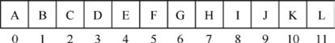

> **圖片描述：** 一維陣列索引示意圖。12個方格（A至L）排成一行，下方標示索引0至11，展示一維資料結構的基本索引方式。


圖23.3　我們在一維列表中排列了12個元素。列表中的每個元素僅由一個字母組成。每個元素只需要一個0～11的索引即可識別


我們將其稱為**一維列表**，或簡稱為**列表**，因為我們只需要一個維度或索引來標識我們想要的元素。在一維列表中，我們約定從左側開始並向右計數。我們總是從0開始計算索引[Dijkstra82]。


因此，索引1處的單元格包含標籤“B”，而標籤“H”位於索引為7的單元格中。


以下是我們將在本節中看到的關鍵點：我們可以告訴電腦以不同的方式考慮這些資料，但我們永遠不會更改此列表。無論我們如何重新塑造它，基礎資料都保留在一維列表中並且不受影響。通過重塑資料，我們所做的就是告訴電腦在讀取或寫入資料時如何解釋資料。資料本身沒有被觸及（這種概括也有例外，特別是在應用效率測量時。但這些通常對於作為庫的用戶來說是不可見的）。


NumPy提供了一個方便的例程，可以讓我們將任何輸入資料重塑為多種不同的形式。例如，我們可以製作一個3行4列的二維網格，如圖23.4所示。


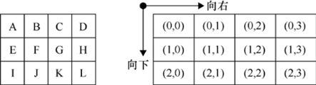

> **圖片描述：** 二維陣列索引示意圖。左側為3x4的網格（A至L），右側為同一網格但標示行列座標（0,0）至（2,3），箭頭指示「向右」和「向下」的方向。


(a)　　　　　　　　　　　　　　　　　　　　　　　　　　　(b)


圖23.4　圖23.3的一維列表被重塑為3行4列的二維網格。每個條目現在需要兩個索引來識別它，按順序向下然後向右。我們將這些索引放在括號中，用逗號分隔。從左上方開始，我們向右遍歷，然後向下行，從左側再次向右遍歷


我們稱之為**二維列表**或**網格**，因為我們需要兩個數字來標識每個元素。


這裡需要說明一個容易混淆的地方。在圖23.3中，每個元素都是在一個小框中繪製的，我們將這些框的水平行稱為一維列表。但是在圖23.4中，我們還將小框分成多行排列，並稱這種佈局為二維網格。我們難道不能將圖23.3解釋為二維網格，其中寬為12個元素高為1個元素嗎？


這絕對可以，我們有時也會這樣做。這是我們剛剛提到的潛在混淆的根源：我們不能僅僅通過查看圖23.3來判斷它是一維數組還是1行12列的二維數組。稍後我們會在從側面看二維網格時遇到相同的問題，這可能看起來就像是三維體積的最近切片。


當人們看圖片時，如果我們將一排方框（如圖23.3所示）作為一維列表或一行二維網格進行處理，通常不會出現問題。但是當我們編程時，區別是至關重要的。大多數庫例程對它們的參數都是嚴格的，如果它們傳遞的是具有錯誤維數的變量，它們會警告甚至崩潰。如果一個程式需要一個二維輸入，那麼它最好得到一個二維輸入，即使對我們來說，它只是一個列表數字。


當進入編程示例時，我們會小心“跟蹤”資料結構中的維數。在差異很重要的任何討論中，我們總是清楚特定的張量由多少維度構成。


回到圖23.4的二維網格，在這樣的網格中，我們的慣例是使用第一個索引計數向下的位置，第二個索引計數向右的位置。簡而言之，我們將二維數組索引為(下,右)。


這種排序完全是為了方便。電腦關心資料的排列方式，但是當我們為自己製作圖表時，它並不關心我們如何描繪資料的排列。但是既然我們希望能夠繪製我們的資料圖片（如圖23.4所示），並且我們希望它們對每個人來說意味著同樣的事情，那麼使用將索引列為向下然後向右的慣例就非常好。


我們的(下,右)很受歡迎，但並不是通用的。我們有時會在文檔或其他出版物中找到以其他順序解釋資料的圖片。檢查總是值得的。


另一個約定是我們從(0,0)開始填充單元格，然後增加最右邊的索引到(0,1)，然後是(0,2)，以此類推，直到到達行的末尾。然後我們將最右邊的索引設置回0並將其左邊的索引增加，放在(1,0)處。然後我們繼續向右，使用單元格(1,1)，然後是(1,2)，以此類推。


使用down-then-over約定，我們說圖23.4的佈局是按3×4排列，這意味著有3行和4列。索引(1,2)處的單元格包含標籤“G”，標籤“J”在單元格中索引為(2,1)。


還有許多其他方法可以將列表中的12個元素排列到二維框中。這些方法同樣使用了先從左到右，再自上而下填充框的約定。圖23.5展示了一些其他可能性。


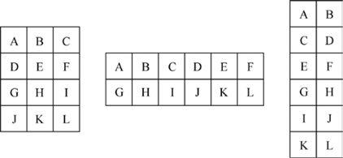

> **圖片描述：** 重塑操作的三種結果。左側：4x3網格（A至L）。中間：2x6網格，將元素重新排列為兩行。右側：6x2網格，排列為六行兩列。展示同樣12個元素的不同形狀。


　　(a)　　　　　　　　　　　　　　　　　(b)　　　　　　　　　　　　　　　　(c)


圖23.5　將12個元素排列成二維列表的另外3種方法。從左到右，這些網格的尺寸依次為4×3、2×6和6×2


我們甚至可以將資料重塑為三維。與二維一樣，在三維中繪製資料沒有通用慣例。回想一下，在一維中，一個參數可以告訴我們向右移動多遠。當需要二維的約定時，我們將“下”放在一維“右”的前面。對於三維，我們將“遠離”放在二維“(下,右)”的前面，得到順序(**遠離**,**向下**,**向右**)。我們從近處的左上角開始。


這與讀書有很好的類比。為了確定特定的字母，我們需要指定頁面（遠離）、文本行（向下）和字母在行中的位置（右）。


圖23.6直觀地展示了這一點。


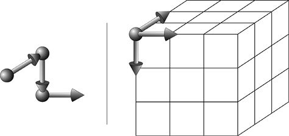

> **圖片描述：** 三維座標系統和三維陣列。左側：x、y、z三個灰色球體代表三個軸的方向。右側：一個3x3x3的立方體陣列，各軸箭頭標示索引順序。


(a)　　　　　　　　　　　　　　　　　　　　　　　　　　 (b)


圖23.6　用於識別三維塊中單元格的約定將從靠近的左上角開始。我們按(遠離,向下,向右)的順序命名單元格。(a)依次的3個方向。(b)在三維體積中查找單元格。第1個指數告訴我們離開多遠，第2個參數告訴我們向下移動多遠，第3個參數告訴我們向右移動多遠


這非常契合上面的二維約定。我們認為塊是從前到後排列的垂直切片的集合。每個垂直切片按順序向下然後向右索引，就像上面的二維數組一樣。就前面圖23.1中的兩個排列而言，這是channels_last的組織方式。


帶索引的三維塊如圖23.7所示。


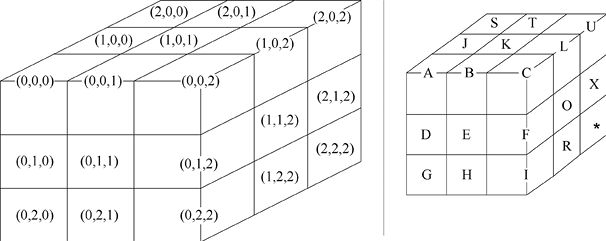

> **圖片描述：** 三維陣列的索引。左側：展開的3x3x3陣列顯示每個元素的三維座標（0,0,0）至（2,2,2）。右側：同一陣列中各元素用字母A至I、J至R、S至*標記。


　　　　　　　　　　(a)　　　　　　　　　　　　　　　　　　　　　　　　　　　　　　　　　(b)


圖23.7　標識3×3×3立方體中的每個單元格。每個單元格需要3個數字來標識它。(a)使用圖23.6的慣例，我們計算了遠離、向下和向右的值。最右邊的索引變化最頻繁，其次是中間索引，最後是最左邊的索引。(b)按順序填寫字母A～Z。由於有27個單元格，但只有26個字母，所以我們於單元格(2,2,2)放置了一個星號


最接近的9個單元格的垂直切片都按其慣例(向下,向右)值索引，此時“遠離”值為0。中間的垂直切片具有相同的索引，但“遠離”值為1。最遠的垂直切片的“遠離”值為2。


圖23.8展示了將12個元素組織成三維塊的3種不同方法。


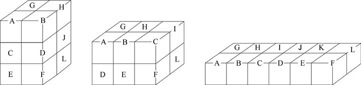

> **圖片描述：** 三維陣列的三種切面方式。左側：2x3x2的立方體。中間：3x2x2的立方體。右側：2x6的扁長方體。展示同一組資料在不同切面下的形狀。


(a)　　　　　　　　　　　　　　　　　　　　　 (b)　　　　　　　　　　　　　　　　　　　　　　　　　　　(c)


圖23.8　將12個元素組織成三維塊的3種方法。從左到右，它們具有2×3×2、2×2×3和2×1×6的尺寸


我們可以將12個元素的排列更改為圖23.8中的任何形狀，並重復執行此操作。但請記住，此操作僅更改電腦引用資訊的方式。我們從不改變資料本身。換句話說，當我們告訴資料將其重新塑造成其他形狀時，電腦不會移動資料。重塑只是告訴電腦我們將如何命名元素：我們將使用多少維度，以及每個維度可以採用的值。它只保存這些數字，然後在我們實際讀取或寫入資料時使用它們。因此，重塑12個元素的列表並不比重塑1200萬個元素的列表更快。電腦只記得有多少維度，每個維度有多大，所以當我們提供一組索引時，它可以找到我們想要的資料。


這個原則至關重要，因為它意味著我們可以針對不同的目的重複地重塑資料，並且它將始終保持有序。因此，例如我們可以用一個三維盒子獲取MNIST訓練樣本，將它們展平，然後在四維資料結構中重新塑造它們，並且這些步驟永遠不會改變資料。事實上，我們將在下面的程式碼中做這些事情。


我們剛才提到了一個四維資料結構，這意味著我們將使用4個數字訪問元素。這不容易畫出來。


有一種很好的方法可視化這些適用於任意數量維度的**多維列表**。


我們將資料結構視為列表的列表。我們不是像上圖那樣在空間上安排資料，而是繪製代表電腦記憶體中資料的一維列表，並將各個部分放入簡單的一維列表的層次結構中，其中每個列表嵌套在另一個列表中。


在二維網格中，有2級嵌套（每行是元素列表，整個網格是行列表）。在三維塊中，有3級嵌套（每行包含元素，每個水平切片包含行，整個塊是切片列表）。


例如，回想一下圖23.4中的3×4網格。我們可以將其視為一個包含3行、每行4個元素的網格，或者是一個包含3個列表的列表，每個列表包含4個元素，如圖23.9所示。


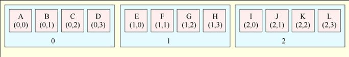

> **圖片描述：** 三維陣列按第一維度分組。3個「頁面」（0、1、2），每頁包含4個元素（按行列排列）。以淺藍色和粉紅色交替標示不同頁面。


圖23.9　圖23.4的二維網格有3行，每行4個元素。我們可以將其顯示為一維列表的層次結構。每組4個元素（即一行）都在一個列表中。要確定任何元素，首先選擇我們想要的列表（行），然後從列表中選擇我們想要的元素（列）


要在單元格(1,2)處找到元素，我們轉到列表1（這是第二個列表，因為我們從0開始計數），然後選擇第3個元素。所以元素(1,2)是“G”。我們沒有明確地引用最外面的列表，因為那只是一個將所有東西放在一起的封裝。


以同樣的方式，我們可以將列表嵌套到另一個級別，並將圖23.8的三維塊表示為一組嵌套列表。圖23.10展示了這將如何查找最左邊的2×3×2的塊。


> **圖片描述：** 一維資料分為兩個批次。上方長條為第一個批次（A至F），下方長條為第二個批次（G至L），每個批次6個元素，以不同藍色深淺區分。


圖23.10　將列表中的12個元素排列在尺寸為2×3×2的三維塊中。確定任何單元格都需要3個數字，對應於每個嵌套列表中的索引


我們用與以前相同的方式閱讀索引，從最外面的列表開始並向內工作。


索引(1,0,1)處的元素位於第二個最外面的列表中，然後是該列表中的第一個列表，然後是該列表的第二個元素，為我們提供標籤“H”。


這提供了另一種方法來查看資料本身從未被觸及過。圖23.11中展示了圖23.8中其他塊的列表的列表的方法。我們可以看到資料仍然只是一個簡單的、一維的單元格列表，而重塑只是告訴電腦以不同的方式將它們組合在一起。


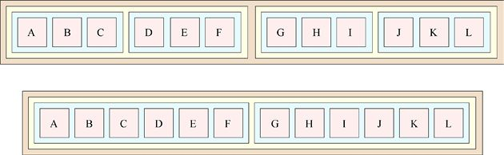

> **圖片描述：** 不同批大小的分組方式。上方：batch_size=3，12個元素分為4個批次。下方：batch_size=6，12個元素分為2個批次。展示批大小如何影響批次數量。


圖23.11　將圖23.8的中間和右側塊解釋為列表的列表。上方：塊為2×2×3。下方：塊為2×1×6


請注意，在我們的所有示例中，每個層的所有列表都具有相同的長度。這有另一種說法，即我們的結構在任何維度都沒有漏洞或額外的位。


我們使用NumPy函數的reshape()來重塑資料。像許多NumPy函數一樣，我們可以用兩種不同的方式來呼叫它。假設一個名為demoData的數組中有資料，如上所述排列在二維網格中，為3行4列。我們想將其重新排列為6行2列的網格。我們通過給reshape()一個包含每個維度的新大小的列表（或元組）來傳達我們想要的新形狀。對於這個例子，我們給它(6,2)。如果我們願意，則可以將結果分配回demoData，但是讓我們將它保存在一個名為newData的新數組中。


如果demoData不是NumPy數組，我們需要從NumPy庫呼叫reshape()。我們給它一個我們希望它重塑的數組，以及新維度的列表，如清單23.4所示。


**清單23.4　**直接從NumPy庫呼叫reshape()重塑數組demoData。


```
import numpy as np
demoData = [[1, 2, 3, 4], [5, 6, 7, 8], [9, 10, 11, 12]]
newData = np.reshape(demoData, (6, 2))
print(newData)
[[ 1 2]
[ 3 4]
[ 5 6]
[ 7 8]
[ 9 10]
[11 12]]
```


如果demoData是NumPy數組，那麼我們可以呼叫reshape()作為數組本身的方法。要將Python數組轉換為NumPy數組，我們可以呼叫NumPy的array()方法。這適用於任何形狀的數組。也就是說，輸入可以是具有任意維度數的張量，並且輸出將是具有相同形狀的NumPy數組（或張量）。此版本的重塑如清單23.5所示。


**清單23.5　**通過呼叫reshape()作為數組本身的方法來重塑數組demoData。


```
demoData = np.array([[1, 2, 3, 4], [5, 6, 7, 8], [9, 10, 11, 12]])
newData = demoData.reshape((6, 2))
print(newData)
[[ 1 2]
 [ 3 4]
 [ 5 6]
 [ 7 8]
 [ 9 10]
 [11 12]]
```


唯一的規則是張量中元素的總數不能改變。也就是說，如果我們將張量的原始形狀（此處為3×4）中的所有維度相乘，則必須在將新形狀中的所有維度相乘時也得到相同的值（此處為2×6）。由於3×4=12和2×6=12，所以我們的例子有效。


如果我們嘗試將資料重塑為不兼容的大小，那麼Python將會報錯。例如，當我們嘗試將有12個元素的數組demoData重塑為形狀(5,15)時，清單23.6展示瞭解釋器的輸出。由於我們沒有5×15=75個元素，因此Python報告錯誤。


**清單23.6　**將數組demoData重塑為不兼容的大小會導致錯誤。


```
demoData = np.array([[1, 2, 3], [4, 5, 6], [7, 8, 9]])
demoData.reshape((5,15))
--------------------------------------------------------------
ValueError            Traceback (most recent call last)
<ipython-input-5-a51a5832a9f8> in <module>()
      1 demoData = np.array([[1, 2, 3], [4, 5, 6], [7, 8, 9]])
----> 2 demoData.reshape((5,15))
ValueError: cannot reshape array of size 12 into shape (5,15)
```


我們將相當多地使用reshape()函數。


### 23.5.2　加載資料


現在我們已經學會了重塑，下面回到我們的主要目標，即創建和運行神經網路。我們首先要掌握資料，然後準備進行訓練。


清單23.7展示了加載MNIST資料集是多麼容易，因為它是由Keras提供的。為了得到它，我們導入mnist模組，然後使用其自定義load_data()函數來獲取資料。這將返回兩個列表：訓練資料和測試資料。每個列表依次包含兩個列表，即特徵（即圖像）和標籤。我們可以使用Python方便的賦值機制，只用一個語句將所有4個列表分配給變量。


剛好可以指出的是，Keras函數（和它們的參數）在命名各種對象所屬的資料集方面非常一致。訓練資料通常在某處有單詞train，測試資料有單詞test，驗證資料通常在其名稱的某處有單詞val。


**清單23.7　**加載MNIST資料集。如果需要，它將自動下載。


```
from keras.datasets import mnist
(samples_train, labels_train), (samples_test, labels_test) = \
                    mnist.load_data()
```


正如我們在第8章中看到的，當使用交叉驗證這樣的技術時，我們將輸入資料分解為**訓練集**、**驗證集**和**測試集**。我們使用訓練集教授系統的許多變化，然後在每次訓練後用驗證集評估性能。當完成搜索時，我們選擇要部署的模型，使用測試集測量其性能。因此，訓練集和驗證集一次又一次地被使用，而測試集只被使用一次。


當沒有使用交叉驗證時，我們只需要訓練集和測試集。mnist.load_data()的Keras文檔將返回的資料標識為屬於這兩個類別，如清單23.8 [Chollet17a]所示。


**清單23.8　**例程mnist.load_data()返回一個訓練集和一個測試集。


```
*# Load MNIST using conventional names for returned objects*
(x_train, y_train), (x_test, y_test) = mnist.load_data()
```


如果以前沒有將MNIST資料集下載到電腦上，那麼當我們第一次加載它時，Keras將自動從網路獲取壓縮格式，解壓縮，然後將其保存在Keras為維護這些資料創建的目錄中（可以在Keras文檔中找到每種操作系統的此目錄的確切位置）。如果我們在這臺電腦上再次請求此資料，Keras將自動獲取已保存在磁盤上的資料，從而為我們節省大量時間。


在清單23.7中，第一對變量samples_train和labels_train保存了包含60000個構成訓練集的圖像的數組，以及它們對應的整數標籤。第二對變量samples_test和labels_test保存了包含構成測試集的10000個圖像和標籤的數組。


讓我們通過在清單23.9中輸出它們來快速查看它們的形狀。這些數組都是從Keras返回的NumPy數組，因此它們都有可以用於輸出的內置shape屬性。


**清單23.9　**清單23.7中MNIST資料集的形狀。


```
print(′samples_train shape = ′,samples_train.shape)
print(′labels_train shape = ′,labels_train.shape)
print(′samples_test shape = ′,samples_test.shape)
print(′labels_test shape = ′,labels_test.shape)
samples_train shape = (60000, 28, 28)
labels_train shape = (60000,)
samples_test shape = (10000, 28, 28)
labels_test shape = (10000,)
```


這告訴我們samples_train是一個60000層的三維塊。每層包含一個28像素×28像素的圖像。labels_train是一個包含60000個元素的一維列表（我們將看到每個元素都是0～9的數字）。(60000,)末尾的額外逗號是一個Python慣例，告訴我們這是一個包含60000個元素的列表，而不僅僅是用括號包圍的60000個數字[Wentworth12]。類似地，samples_test是包含10000個圖像的數組，每個圖像的分辨率為28像素×28像素，而labels_test是具有測試資料的相應標籤的整數列表。


雖然這些變量名稱非常精細，但常見的程式碼約定是使用大寫字母X來表示資料集的樣本，使用小寫字母y來表示其標籤，如清單23.8所示。選擇這些字母是為了匹配許多深度學習方程中使用的字母。這是從早期的程式中自然而然遺留下來的約定，當時這些早期程式是為了與公式緊密匹配而編寫的。小寫字母x也可以用於樣本，大寫字母Y也可以用於標籤，儘管這不太常見。


使用這個約定，我們將更簡潔地編寫清單23.7，如清單23.10所示。


**清單23.10　**加載MNIST資料集，使用X表示樣本，使用y表示標籤。


```
(X_train, y_train), (X_test, y_test) = mnist.load_data()
```


一旦我們習慣了，使用X和y是一個很好的約定，因為這些單個字母可以為我們節省大量的打字工作，並且很快就會為習慣這種命名方案的人所理解。


沒有規則說我們必須使用這些神秘的變量名，即使它們是約定俗成的。人們如此頻繁地使用X表示樣本和y表示標籤的樣式，從長遠來看可能是一件好事，我們在本書也會這樣做。但是每個程式設計師都應該以對自己和他人都清晰、有用為原則編寫程式碼。


### 23.5.3　查看資料


使用任何資料庫的第一步都是查看它。我們希望確保它的清理及組織方式的有效性。我們通常也希望能夠感受一下我們正在操作的東西。


如果在將資料用於學習之前需要對其進修改，我們可以結合使用直接的Python編程，以及來自NumPy、SciPy、scikit-learn和Keras等庫的函數。這種預處理是確保網路按照我們想要的方式運行並防止錯誤的關鍵步驟。令人高興的是，MNIST資料集只需要一點點這項工作，所以我們可以在這裡展示它以獲得該流程的體驗。


至少有兩個潛在的問題來源需要密切關注。**內容問題**（content problem）是資料本身的數值問題，而**結構問題**（structural problem）是關於資料組織方式的問題。


讓我們先看看資料。圖23.12展示了MNIST訓練集中圖像的另一個隨機取樣。我們可以看到這些例子並非完美無缺。


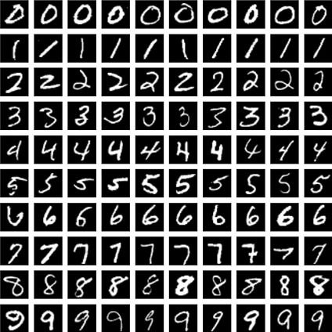

> **圖片描述：** MNIST手寫數字測試集的100張樣本。10行10列排列，與圖23.1類似但來自測試集，展示不同的手寫風格。


圖23.12　來自MNIST訓練集的圖像的隨機取樣


有4個突出的問題。


首先，一些圖像非常靠近28像素×28像素的邊界，而不是位於原始論文描述的周圍相對厚的4像素黑色邊框內[LeCun13]。圖23.13展示了具有此特質的訓練集中的一些示例。


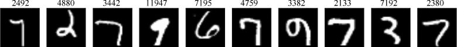

> **圖片描述：** MNIST訓練集中標籤為「7」的10張樣本。上方標示樣本索引號，展示數字7的不同書寫風格。


圖23.13　來自MNIST訓練集的一些圖像示例，用於顯示圖像在邊界附近或直接超出邊界的情況。每個示例上方的數字為其在訓練集中的索引


其次，一些圖像中的數字似乎已經被裁掉了，這大大改變了它們的模樣。圖23.14展示了一些示例。


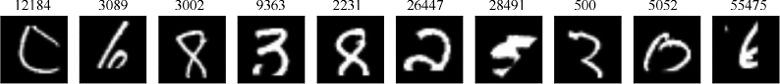

> **圖片描述：** MNIST中被誤分類的樣本。10張圖像展示被模型錯誤分類的手寫數字，上方為索引號，這些數字書寫模糊或異常。


圖23.14　來自MNIST訓練集的一些已被裁剪的圖像示例，圖像中一些似乎很可能本應被繪製的部分被裁掉了，這有時會創建多個斷開的部分


再者，一些圖像有很多噪點。有時這意味著線條變薄或消失。更常見的是虛假的白色區域，可能是裁剪或閾值處理期間的錯誤導致的。這些噪點通常不會對人類觀察者造成太大的混淆，但有可能使電腦網路混淆。圖23.15展示了一些示例。


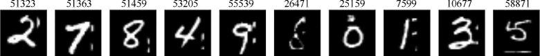

> **圖片描述：** 另一組MNIST圖像及其索引號。10張手寫數字的放大版本，各種不同的書寫風格。


圖23.15　來自MNIST訓練集的一些圖像示例，它們包含了人為操作殘留的噪點。其中一些噪點可能是由閾值處理或裁剪錯誤導致的


最後，有一些圖像中的問題似乎難以解釋，或者是繪製方式的問題，或者是處理方式的問題。圖23.16展示了一些奇怪的訓練示例。


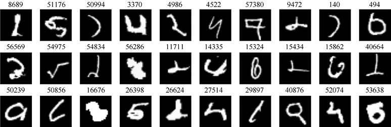

> **圖片描述：** 更多被誤分類的MNIST樣本。3行10列共30張圖像，上方標示索引號，展示各種難以辨識的書寫風格。


圖23.16　來自MNIST訓練集的一些圖像，其中的問題看起來特別難以解釋


我們可能想要刪除上述具有人工殘留干擾的樣本，但實際上只要它們不是太多，它們就可以使我們的網路更強大。儘管它們存在缺陷，但如果我們的網路能夠正確識別這些圖像，它就將具有強大的能力。如果沒有這些“有壓力”的樣本，我們的網路就不會有這樣的能力。


在瀏覽了幾個隨機樣本之後，我們得出結論，這些問題很少發生，因此不用費心去除它們。即使我們最後沒有采取任何行動，重要的是查看資料並根據資料得出這個結論，而不是一個充滿希望的猜測。


現在我們將轉向資料結構，看看它是如何組織的。


我們的主要興趣在於從mnist.load_data()獲得的變量的形狀。清單23.11使用X表示樣本，y表示標籤，重新開始我們的起始對象。


**清單23.11　**輸出有關輸入資料的形狀資訊。


```
print(′X_train shape:′, X_train.shape,
      ′y_train shape:′, y_train.shape)
print(′X_test shape:′, X_test.shape,
      ′y_test shape:′, y_test.shape)

X_train shape: (60000, 28, 28) y_train shape: (60000,)
X_test shape: (10000, 28, 28) y_test shape: (10000,)
```


訓練資料X_train位於三維塊中。使用我們的(離開,向下,向右)約定，它是60000個切片深度，每個垂直切片是28像素×28像素。圖23.17展示了這種形狀。


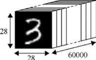

> **圖片描述：** MNIST資料集的三維結構示意。一個28x28x60000的立方體，表面顯示一張手寫數字「3」的圖像，表示60000張28x28像素的圖片堆疊。


圖23.17　訓練資料X_train的形狀為60000×28×28。這意味著它是60000個對象的堆疊，每個對象的圖像是28像素×28像素


測試資料的設置方式相同，只是堆疊深度只有10000個圖像。


我們將在以下部分重塑資料，所以讓我們在變量中隱藏每個圖像的原始高度和寬度。我們還將它們相乘並將其保存為每個圖像的總像素。清單23.12展示了我們如何保存這些資料。


**清單23.12　**保存輸入資料的大小供以後使用。


```
image_height = X_train.shape[1]
image_width = X_train.shape[2]
number_of_pixels = image_height * image_width
```


這看似有點掩耳盜鈴，因為對於這個固定資料集，我們知道每個圖像是28像素×28像素，但這種更通用的方法將使以後更容易複製此程式碼並使其適應新的資料集。


標籤以一維列表的形式提供給我們。正如預期的那樣，訓練標籤列表y_train的長度為60000，因為它為訓練集中的每個樣本提供一個標籤。讓我們看一下y_train中的前幾個標籤，如清單23.13所示。


**清單23.13　**y_train中的前幾個標籤。


```
print(′start of y_train:′, y_train[:15])

start of y_train: [5 0 4 1 9 2 1 3 1 4 3 5 3 6 1]
```


y_train中的每個標籤都是一個整數。我們希望它是X_train中相應圖像的標籤。檢查總是值得的，所以讓我們看一下X_train中的前15個圖像，如圖23.18所示。


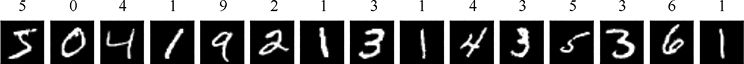

> **圖片描述：** MNIST訓練集的前12張圖像。上方標示0至9的數字標籤，展示手寫數字5、0、4、1、9、2、1、3、1、4、3、5。


圖23.18　X_train中的前15個圖像。這些圖像與y_train中的前15個標籤相匹配，標籤顯示在每個樣本上方，所以都沒問題


太棒了，y_train中的標籤與X_train中的相應圖像相匹配。由於MNIST資料集非常出名，我們這時已經可以停止檢查。但若是不太熟悉的資料集，我們可能希望在整個資料集中至少進行幾次這種抽樣檢查，以確保兩個列表保持同步。


現在讓我們看一下資料本身。在清單23.14中，我們從X_train的第一個圖像中輸出一個任意的小矩形。要記住Python的一個方便之處是，只需在解釋器中鍵入變量的名稱（而不是使用print語句），我們有時會獲得有關變量的更多資訊。


**清單23.14　**X_train中第一個訓練圖像的一個小矩形。


```
X_train[0, 5:12, 5:12]

array([[ 0, 0, 0, 0, 0, 0, 0],
       [ 0, 0, 0, 30, 36, 94, 154],
       [ 0, 0, 49, 238, 253, 253, 253],
       [ 0, 0, 18, 219, 253, 253, 253],
       [ 0, 0, 0, 80, 156, 107, 253],
       [ 0, 0, 0, 0, 14, 1, 154],
       [ 0, 0, 0, 0, 0, 0, 139]], dtype=uint8)
```


最後的變量dtype告訴我們這是一個NumPy數組，資料類型為uint8，即無符號的8位整數。X_test具有相同的結構。正如我們對灰度圖像資料所期望的那樣，所有值都在0～255範圍內（更多資訊請見下文）。


標籤也是NumPy數組嗎？清單23.15展示了一段y_train數組。


**清單23.15　**y_train數組的一部分。輸入位於第一行，其餘為輸出。


```
y_train[:15]

array([5, 0, 4, 1, 9, 2, 1, 3, 1, 4, 3, 5, 3, 6, 1],
                    dtype=uint8)
```


是的，這是一個無符號8位整數的一維 NumPy數組。這對於訓練標籤非常有限，因為這些數字不能超過255。但是這裡我們只存儲0～9的標籤，所以0～255的範圍足夠大。


要使用這些資料進行Keras訓練，我們需要將訓練和測試資料轉換為標準化的浮點數，並將標籤轉換為獨熱編碼（見第12章）。


但在這樣做之前，我們會暫時停下來。因為MNIST資料集已經被分成訓練集和測試集了。如果沒有怎麼辦？有一個很好的實用工具可以為我們分割資料。我們現在來看看吧。


### 23.5.4　訓練-測試拆分


大多數資料集需要我們手動將它們分成訓練集和測試集。MNIST資料集已經為我們分開，但為了完整，讓我們看看如果必須這樣做，我們將如何完成這項工作。


最簡單和最常用的方法是使用scikit-learn的train_test_split()函數為我們完成所有工作。假設MNIST資料集僅作為兩個張量傳遞給我們，稱為樣本和標籤，我們希望將其分成訓練集和測試集。典型的測試集通常約為原始資料的20%或30%，所以讓我們折中選擇25%來繼續推進。


我們使用train_test_split()來呼叫資料和拆分尺寸即可，它會返回4個數組，如清單23.16所示。


**清單23.16　**使用scikit-learn中的train_test_split()將資料拆分為訓練集和測試集。


```
from sklearn.model_selection import train_test_split
X_train, X_test, y_train, y_test =
     train_test_split(samples, labels, test_size=0.25)
```


圖23.19直觀地展示了這種操作。


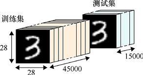

> **圖片描述：** 訓練集和測試集的分割示意。左側較大的立方體為訓練集（28x28x45000），右側較小的為測試集（28x28x15000），各自顯示手寫數字「3」的圖像。


圖23.19　拆分60000張圖像的資料集。我們將25％的資料作為測試集，另外75%作為訓練集。函數train_test_split()不是簡單地如此處所示在一個地方剪切輸入資料，而是首先對資料的副本進行打亂，這樣這兩個部分中的每一個都更有可能包含所有樣本的良好混合


請注意，train_test_split()為我們提供了4個數組，而不是像mnist.load_data()一樣返回各有兩個列表的兩個數組。與清單23.10相比，它們的順序也略有不同。在我們習慣它們之前，庫之間的這些微小的不一致可能很麻煩。


為避免它們成為主要的調試問題，捕獲這些不一致的一種方法是慢慢地在交互式Python環境中一次一行地構建我們的程式碼，如前所述。當程式碼出錯時，我們會立即得到一個錯誤，此時可以通過把資料輸出來進行更嚴密的檢查，並將我們正在做的事情與庫的文檔描述中我們應該做的事情進行比較。


在學習新庫時，許多小試驗可以幫助我們從一開始就編寫好的程式碼。


### 23.5.5　修復資料類型


如清單23.14所示，我們從mnist.load_data()獲取的樣本資料將以整數形式返回給我們。雖然這對於存儲資料是有效和合理的，但Keras希望使用浮點數。為了防止做出錯誤的假設，Keras不會為我們自動轉換資料類型。這是我們的工作，也是強制性的。Keras期望得到浮點數，否則它要麼會在某個時候變得混亂，要麼報告錯誤並停止運行（這種情況更常見）。


實際上，Keras期望特定類型的浮點數與其內部floatx參數匹配。我們在清單23.1中看到，可以通過在Keras配置文件中為floatx分配一個新值，或者在程式碼中通過呼叫Keras後端中的set_floatx()來給該參數指定不同資料類型，如清單23.2所示。


預設情況下，floatx的值為float32，表示32位浮點數。除非我們更改配置文件，或者在程式碼中呼叫後端函數來更改它，否則這就是Keras期望的類型。


將其切換到另一種資料類型（例如float64）很容易，但是要知道何時這樣的選擇有意義是複雜的，並且取決於特定的硬體和軟體，所以我們將繼續使用float32。


現在我們知道了Keras對浮點數的預期格式，就可以回到將樣本轉換為該形式的工作。執行此操作的簡單方法是使用Keras後端的函數cast_to_floatx()，該函數將張量作為參數，並將張量的每個元素轉換為當前floatx值指定的類型。例程甚至不關心張量的形狀。從一維列表到具有一千個維度的巨大張量，例程將簡單地遍歷每個條目並將其轉換為我們期望的資料類型。請注意，此例程名稱中的最後一個單詞不是float，而是floatx，指的是配置變量。清單23.17展示瞭如何使用它。


**清單23.17　**使用Keras後端的函數將我們的數組更改為它所期望的類型。


```
from keras import backend as keras_backend
X_train = keras_backend.cast_to_floatx(X_train)
X_test = keras_backend.cast_to_floatx(X_test)
```


我們可能很想將y_train和y_test數組轉換為floatx類型，但這不是必需的。我們將使用另一個實用程式將這些數組轉換為下面的獨熱編碼形式，並且該程式需要一個整數列表作為輸入。當你第一次習慣新庫時，其細節會使你的進度變慢。


現在資料已具有正確的類型，我們可以繼續確保它們具有最有用的值的範圍。


### 23.5.6　正規化資料


準備資料的另一個重要步驟是將其**正規化**。其含義在不同的環境中略有不同，但它總是意味著改變資料本身，而不是簡單地重塑它。


我們在本章中構建的用於對MNIST資料集進行分類的網路將在剛開始不久就使用卷積層，這些網路對已經正規化的資料有最佳效果，因此每個特徵都要被縮放到0～1的範圍內。


注意，正規化僅適用於特徵，而不適用於標籤。標籤需要指代從0～9的10個不同的類，我們不應該更改這些值。


如清單23.14所示，X_train中的特徵資料最初由0～255範圍內的整數組成，這是圖像資料通道的通常範圍。我們剛剛將這些值轉換成了32位浮點數，所以我們可以說它們現在在0～255的範圍內。


前文提到，我們需要將資料規範化到[0,1]的範圍。正如我們在前面的章節中所看到的，這有助於將神經元輸出保持在相同的範圍內，也有助於正則化和延遲過擬合的開始。如果我們使用像sigmoid這樣的激活函數，它會使函數不飽和。


我們可以通過完整的預處理步驟完成此規範化。我們檢查訓練資料中像素的值，構建轉換以將它們縮放到[0,1]，然後將該轉換應用於訓練資料、測試資料和任何未來的資料。我們可以創建一個scikit-learn的轉換對象並訓練它，然後將它應用到我們的資料。


這是一種非常好的方法，但是當使用MNIST資料集中的圖像資料時，我們幾乎總是使用更簡單、更直接的方法來轉換資料。


我們知道訓練和測試資料中的像素在[0,255]範圍內。我們想要的只是以相同的方式重新縮放所有像素，將它們從範圍[0,255]壓縮到範圍[0,1]。從概念上講，這就像將毫米轉換為千米，或者是反過來轉換。


我們可以使用NumPy的interp()例程來縮放輸入資料，該例程專為這項工作而設計。它需要一個數組（或張量）、一個輸入範圍和一個輸出範圍。對於每個條目，它將在第一個範圍[0,255]中找到它的位置，並在第二個範圍[0,1]中找到它的相應位置。清單23.18展示了程式碼。


**清單23.18　**將像素從[0,255]縮放到[0,1]。


```
X_train = np.interp(X_train, [0, 255], [0,1])
X_test = np.interp(X_test, [0, 255], [0,1])
```


這非常有效，但由於我們知道資料在0～255的範圍內，所以可以通過將所有像素除以255來完成相同的操作，如清單23.19所示。


**清單23.19　**將像素除以255，來重新調整為[0,1]。


```
X_train /= 255.0
X_test /= 255.0
```


清單23.18和清單23.19做了完全相同的工作，雖然第二種方法對於正在發生的事情稍微不那麼明確，但它的編寫時間要更短，執行速度要比使用插值的版本稍微快一點。


這可能就是為什麼清單23.19是縮放圖像的常用習慣。遵守這個慣例，我們也會在這裡使用它。


讓我們在一個地方整理到目前為止所見過的所有內容。我們將導入需要的模組，讀取清單23.10中的資料，使用清單23.12保存大小，使用清單23.17將其轉換為浮點數，並使用清單23.19將其縮放到範圍[0,1]。這些都在清單23.20中歸攏在一起。


我們的訓練和測試樣本現在採用浮點數，範圍為[0,1]。


**清單23.20　**讀取資料，保存大小，轉換為浮點數，並縮放到[0,1]。


```
from keras.datasets import mnist
from keras import backend as keras_backend

*# load MNIST data and save sizes*
(X_train, y_train), (X_test, y_test) = mnist.load_data()
image_height = X_train.shape[1]
image_width = X_train.shape[2]
number_of_pixels = image_height * image_width

*# convert to floating-point*
X_train = keras_backend.cast_to_floatx(X_train)
X_test = keras_backend.cast_to_floatx(X_test)

*# scale data to range [0, 1]*
X_train /= 255.0
X_test /= 255.0
```


這時，樣本的預處理工作就完成了。我們需要記住，如果得到任何我們想用這個網路評估的新樣本，它們也需要將它們的像素資料轉換為32位浮點數併除以255。


有一點很微妙，需要注意。訓練完成後，我們得到的任何新圖像都不應該被簡單地縮放到[0,1]的範圍。相反，我們需要應用與上面相同的預處理方法，也就是說，新圖像資料需要除以255。如果由於某種原因，該圖像中的值小於0或大於255，那麼它們將變成小於0或大於1的浮點數。這在某種程度上可能不方便，但我們無法避免，因為我們必須對訓練的資料上使用的新資料使用相同的變換。


現在讓我們預處理標籤，以便使用它們。


### 23.5.7　固定標籤


我們知道MNIST資料集包含0～9的數字圖像，因此在網路中，我們將創建一個包含10個神經元的輸出層，每個數字對應一個神經元。每個神經元將產生輸入圖像為該數字的機率。具有最高值的神經元將是網路對輸入的最終預測。


我們想要計算一個誤差值，以瞭解這10個值與我們想要的值有多接近。為了簡化這種比較，我們使用**獨熱編碼**表示每個圖像的標籤，正如我們在第12章中討論的那樣。在這種情況下，它是由10個元素組成的列表，其中除位置3中的1之外都是0，如圖23.20所示。


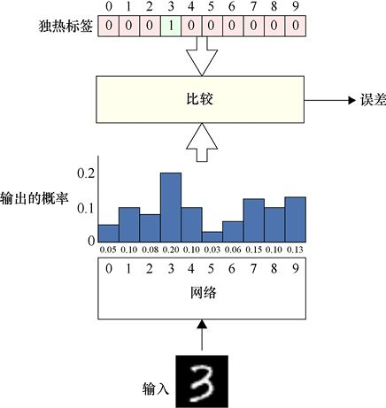

> **圖片描述：** 損失計算的流程圖。底部為輸入圖像（手寫3），經過網路產生10個輸出機率（0.05至0.20），通過長條圖顯示。頂部為獨熱標籤（第3位為1），中間「比較」方塊計算輸出機率與標籤之間的誤差。


圖23.20　計算誤差。我們將圖像（這裡是3的圖像）提供給網路，並從0到9為每個可能的標籤返回0～1的機率。我們將這10個數字與獨熱標籤中的10個值進行比較。預測越像標籤，誤差越小


在這個虛構的例子中，網路給值3以最大機率，但是給出了其他每個數字也有可能是正確的機率。來自網路的完美答案應是“輸入為3”的機率為1，此時所有其他選擇的機率為0。換句話說，完美預測將與標籤相同。兩者越不同，誤差越大。標籤的獨熱形式簡化了輸出和標籤的比較。


看起來獨熱編碼似乎是多餘的，因為網路可以在需要時即時執行此操作。這是事實，但在訓練期間，每個樣本都必須重複這一步驟。如果我們只訓練了一個週期（也就是說，每個樣本只使用一次），那麼是使用預處理標籤還是僅在我們需要時才創建標籤就無所謂了。但是，如果我們訓練200輪，那麼就必須重複200次每個樣本的即時編碼。僅在我們開始訓練之前對值進行一次編碼會更快。如果我們願意，提供預編碼標籤還可以創建除0和1之外的標籤值。


所以我們想回過頭來，把變量y_train和y_test中的整數轉換成獨熱編碼形式。


將列表中的每個整數轉換為獨熱編碼是一項常見任務，以至於Keras為其提供了實用工具程式。函數to_categorical()可以查看整數數組並查找最大值，因此它知道需要多少0來表示需要編碼的所有值。然後，它對列表中的每個整數進行一次獨熱編碼。to_categorical()的輸出是這些編碼的列表，這些編碼本身是0和1的列表。


讓我們在實際中看看獨熱編碼。清單23.21展示了原始y_train數組在進行一次獨熱編碼之前和之後的前5個條目。


**清單23.21　**使用to_categorical()實用工具程式函數對y_train數組進行獨熱編碼之前和之後的前5個條目。


```
from keras.utils import to_categorical
*# print the first 5 entries of the original y_train array*
y_train[:5]

array([5, 0, 4, 1, 9], dtype=uint8)

*# encode the y_train array as one-hot lists*
y_train = to_categorical(y_train)
*# print the new first 5 entries of y_train, now one-hot encoded*
y_train[:5]
(array([[ 0., 0., 0., 0., 0., 1., 0., 0., 0., 0.],
        [ 1., 0., 0., 0., 0., 0., 0., 0., 0., 0.],
        [ 0., 0., 0., 0., 1., 0., 0., 0., 0., 0.],
        [ 0., 1., 0., 0., 0., 0., 0., 0., 0., 0.],
        [ 0., 0., 0., 0., 0., 0., 0., 0., 0., 1.]]),
       dtype(′float64′))
```


我們可以看到，輸出是一個二維網格，每個輸入都對應一行。一行中除了單個1，其餘每個條目都是0，這個1位於與該行的原始y_train值對應的索引處。


to_categorical()產生的獨熱值以64位浮點數出現。令人高興的是，浮點數很好，因為Keras會將這些浮點數與來自神經網路的浮點數進行比較。有點奇怪的是Keras在生成這些資料時不使用預設的floatx類型，但64位浮點數在訓練我們的網路時工作正常。


我們可能會試圖簡單地將y_train和y_test傳遞給to_categorical()並繼續推進，但這可能會引入一個微妙的錯誤。問題是一個列表中的最大值可能與另一個列表中的最大值不同，從而為我們提供了不同大小的列表。


例如，假設測試資料缺少任何數字9的圖像。這意味著y_test將只包含0～8的數字。當我們使用to_categorical()時，將返回一個只有9個項的列表。當我們想要將它與輸出層中的值進行比較時，這將導致麻煩，輸出層中的每個類別都有一個分數。


我們不必擔心MNIST資料集有這個問題，因為它在兩個集合中都有每種圖像的實例，但這個問題可能出現在其他資料集中。


有一個簡單、通用的解決方案，可以永遠避免這個問題。它涉及使用to_categorical()的可選參數來忽略其掃描步驟。這個名為num_classes的參數告訴程式總是生成給定長度的列表。前綴num_是一個常見的約定，讀作“number of”，因此num_classes代表“類的數量”。


num_classes的值必須至少足以編碼所有可能的值，否則我們將得到一個錯誤。如果num_classes大於必要值，那沒關係，最後的額外值將始終為0。


為了確保任何兩個標籤列表的兩種編碼大小相同，我們將所有標籤組合成一個大列表並提取其最大值。由於我們從0開始，因此將為結果添加1，這是可以編碼所有標籤中所有值的最小列表大小。


清單23.22展示瞭如何使用to_categorical()以通用方式將整數標籤列表轉換為獨熱編碼列表。


**清單23.22　**標籤數組被轉換為獨熱編碼形式。


```
*# combine the input lists to find largest value*
*# in either list, then add 1 because the values start at 0*
number_of_classes = 1 + max(np.append(y_train, y_test))

*# encode each list into one-hot arrays of the size we just found*
y_train = to_categorical(y_train, num_classes=number_of_classes)
y_test = to_categorical(y_test, num_classes=number_of_classes)
```


有時程式中的其他位置會需要原始整數列表，我們稍後會在進行交叉驗證時看到這種情況。我們可以通過兩種方式**撤銷**獨熱編碼。如果將獨熱編碼表示為常規Python列表（即不是NumPy數組），我們可以使用Python的內置index()方法，如清單23.23所示。


**清單23.23　**使用Python的index()方法撤銷獨熱編碼。


```
one_hot = [0, 0, 0, 1, 0, 0, 0, 0, 0, 0]
print(′one-hot represents the integer ′,one_hot.index(1))

one-hot represents the integer 3
```


如果獨熱編碼是NumPy數組，那麼我們就不能使用index()，因為NumPy不支援該方法。有幾種方法可以使用NumPy來查找0列表中的單個1的索引。清單23.24展示了其中一種方法。這使用了NumPy的argmax()方法，該方法返回列表中最大值的索引。


**清單23.24　**使用NumPy的argmax()方法撤銷獨熱編碼。


```
one_hot_np = np.array([0, 0, 0, 1, 0, 0, 0, 0, 0, 0])
print(′one_hot_np represents the integer ′,np.argmax(one_hot_np))

one_hot_np represents the integer 3
```


我們不會使用這些方法中的任何一種來查找獨熱編碼的整數版本，而是在呼叫to_categorical()之前保存原始整數列表，如清單23.25所示。


**清單23.25　**將標籤保存為原始格式的整數列表。


```
# save the original y_train and y_test
original_y_train = y_train
original_y_test = y_test
```


僅供參考，清單23.26提供了一個Python單行程式碼，它將**撤銷**獨熱編碼，適用於我們以獨熱形式提供資料的情況。


**清單23.26　**將獨熱編碼列表轉換回整數列表。


```
original_y_train = [np.argmax(v) for v in y_train]
original_y_test = [np.argmax(v) for v in y_test]
```


由於獨熱編碼非常常見，因此scikit-learn也提供了執行它的工具。它位於預處理模組中，稱為OneHotEncoder()。


### 23.5.8　在同一個地方進行預處理


我們剛剛到達第一個山頂！雖然“路途”遙遠，但我們已經做了很多。從一張白紙開始，我們的資料現在可以進行訓練了。


回顧一下，我們首先讀入（並可能下載）MNIST資料集，並通過將其從整數更改為浮點數來為Keras準備每個圖像，接著對其進行正規化，然後創建了標籤的獨熱編碼。


清單23.27中彙總了所有這些預處理步驟。我們還添加了一行來為NumPy的隨機數發生器設置種子。這意味著我們從NumPy獲得的任何隨機數在每次運行時始終是相同的。雖然我們還沒有使用隨機數，但稍後會使用它們。強制我們的隨機數在每次運行中始終相同，可使調試變得更加容易。


**清單23.27　**組合前面的片段以創建一個完整的預處理器。


```
from keras.datasets import mnist
from keras import backend as keras_backend
from keras.utils.np_utils import to_categorical
import numpy as np
random_seed = 42
np.random.seed(random_seed)

*# load MNIST data and save sizes*
(X_train, y_train), (X_test, y_test) = mnist.load_data()
image_height = X_train.shape[1]
image_width = X_train.shape[2]
number_of_pixels = image_height * image_width

*# convert to floating-point*
X_train = keras_backend.cast_to_floatx(X_train)
X_test = keras_backend.cast_to_floatx(X_test)

*# scale data to range [0, 1]*
X_train /= 255.0
X_test /= 255.0

*# save the original y_train and y_test*
original_y_train = y_train
original_y_test = y_test

*# replace label data with one-hot encoded versions*
number_of_classes = 1 + max(np.append(y_train, y_test))
y_train = to_categorical(y_train, num_classes=number_of_classes)
y_test = to_categorical(y_test, num_classes=number_of_classes)
```


使用像scikit-learn和Keras這樣的庫的部分吸引力在於，使用額外的Python程式碼來完成工作時，幾乎沒有什麼需要修改的東西。清單23.27中幾乎每一行都要麼執行特定的預處理步驟，要麼保存稍後我們將再次使用的變量。


在這段程式碼中，我們反覆覆蓋X_train和X_test中的資料，以及y_train和y_test中的標籤。這是預處理過程中的常用方法，因為我們不關心起始值或中間值。這種方法的好處是它帶來了一定程度的簡單性；缺點是如果我們想要訪問原始資料，要麼必須保存它（就像我們在這裡為標籤所做的那樣），要麼加載資料的新副本。


## 23.6　製作模型


現在我們的資料已經可以使用了，下面構建我們的深度學習模型。


Keras模型製作的美妙之處在於創建模型結構（即我們的神經網路架構）是非常順暢的，只有兩個步驟。


首先，按照我們想要的順序命名所需的網路層。這稱為**指定**模型。


其次，告訴Keras如何使用這個模型來學習。我們告訴它使用哪個損失函數和最佳化器，以及我們希望它沿途收集哪些資料。這稱為**編譯**模型。編譯步驟將我們的指定轉換為在我們選擇的後端上運行的程式碼。


第一個分類MNIST資料集的模型很簡單。它將具有一個輸入層（在每個網路中隱含）、單個隱藏層和一個輸出層。隱藏層和輸出層都將是全連接層。圖23.21展示了我們的第一個深度學習模型。


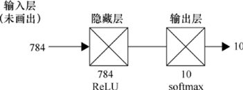

> **圖片描述：** 兩層全連接網路架構。輸入784個值，經過隱藏層（784個神經元，ReLU）到達輸出層（10個神經元，softmax），最終輸出10個類別的機率。


圖23.21　第一個非常簡單的深度學習模型由784個神經元的全連接層（每個輸入像素一個）及其後的10個神經元的全連接層（每個輸出類一個）組成


回想一下，在繪製圖23.21這樣的圖時，我們不繪製輸入層，因為它只是一個記憶體緩衝區。按照慣例，資料從左到右流動，就像我們在這裡做的那樣，或者有時從下到上流動。末端的標籤顯示進出網路的資料的大小和形狀。


我們決定了設置第一層為每個像素對應一個神經元。這是配置第一層的常用方法，但它絕對不是必需的。如果我們認為可以產生更好的結果，則可以使用5個神經元或5000個。


對於28像素×28像素的圖像，使用這種“每個輸入像素對應一個神經元”的方法，我們的第一層需要28×28=784個神經元。


等一等，我們在上面看到，輸入是一個二維網格列表（每個28×28）。為什麼我們設置網路為一維列表而不是二維網格？


我們不是故意這樣做的。全連接層只能接收一維列表。在全連接層內部沒有可以讓它弄清楚如何獲取二維資料結構中的像素的處理過程。稍後我們將看到卷積層具有這種處理方式，因此我們可以直接給它們網格。但是現在我們正在使用全連接層，全連接層的輸入只能是一個列表。


因此，我們需要將28像素×28像素的每個輸入樣本轉換為784個值的一維列表。


### 23.6.1　將網格轉換為列表


至少有兩種方法可以做到這一點：第一種方法是使用Keras提供的Reshape功能層將其構建到我們的神經網路中；第二種方法是在訓練之前重塑資料。


第一種方法很簡單。我們只需製作一個Reshape層並將其放置在全連接層之前就完成了。不利的一面是，每次評估時，每個樣本都會被重塑，這需要一些時間。由於我們希望通過網路多次運行所有訓練樣本（也就是說，我們將訓練多輪），因此一次預處理它的效率更高。回想一下，這與導致我們將標籤預處理成獨熱編碼的邏輯相同。


要將圖像轉換為列表，我們需要把原始三維輸入資料轉換為二維網格。網格的每一行都是一個樣本，由784個特徵列表組成。結果如圖23.22所示。


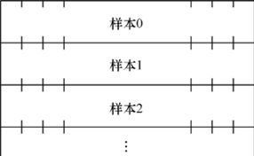

> **圖片描述：** 批次資料的排列方式。多個水平長條代表不同樣本（樣本0、1、2...），每個樣本由多個特徵值組成，以垂直分隔線標記特徵邊界。


圖23.22　將三維輸入資料轉換為二維網格，每一長行像素對應一個圖像


使用NumPy的reshape()函數很容易完成上述操作。我們將讓它重新解釋X_train，它被認為是尺寸為60000×28×28的三維塊，而不是尺寸為60000×784的二維數組。


如上所述，有兩種方法可以使用reshape()。讓我們首先使用從NumPy中呼叫的方法，並將我們正在重塑的數組作為第一個參數傳遞給它。


reshape()的第二個參數是一個包含新維度的列表。在這種情況下，第二個參數是列表[60000， 784]。為了便於以後將此程式碼用於其他項目，我們將從資料中獲取這些數字，而不是直接輸入資料。回想一下，在清單23.27的預處理步驟中，number_of_pixels已被設置為每個輸入圖像的大小，或784。


為了簡單起見，我們將繼續用這些新版本覆蓋X_train和X_test。清單23.28展示了這部分程式碼。


**清單23.28　**將圖像展平為二維網格，因此每個樣本只是一個數字列表。這是全連接層所需的格式，如圖23.21中的第一層。


```
# reshape samples to 2D grid, one line per image
X_train = np.reshape(X_train,
                    [X_train.shape[0], number_of_pixels])
X_test = np.reshape(X_test,
                    [X_test.shape[0], number_of_pixels])
```


正如我們所討論的，呼叫reshape()的另一種方式是將其作為一種重塑對象的方法。在這種情況下，唯一必需的參數是包含新維度的列表。因為這種方法也很常見，我們在清單23.29中對它做了展示。


**清單23.29　**另一種將圖像重塑為二維網格的方法。其結果與清單23.28相同。


```
*# reshape samples to 2D grid, one line per image*
X_train = X_train.reshape([X_train.shape[0], number_of_pixels])
X_test = X_test.reshape([X_test.shape[0], number_of_pixels])
```


這兩種變化都會產生相同的結果，因此可以使用我們更喜歡的任意一種。我們將在下面的討論中使用較短的第二種。


這個重塑步驟恰好是預處理的一部分，因為我們只需要做一次，所以將它放在下面的程式碼清單中。


稍後我們將看到其他類型的層（例如卷積層）以其他方式對其資料進行重塑。將資料轉換成正確的結構是訓練神經網路的關鍵步驟。


### 23.6.2　創建模型


現在資料已經全部處理完畢，下面就可以創建模型了。


首先告訴Keras模型的整體架構。我們的選擇基本上是“層列表”和“自定義模型”架構。


“層列表”架構稱為Sequential模型。這對我們來說是完美的，因為圖23.21的架構僅是一個接一個的兩個全連接層。換句話說，它們可以被描述為以隱藏層開始並以輸出層結束的兩個元素的列表。


“自定義模型”架構稱為Functional模型。這比Sequential模型更靈活，但需要我們做更多的工作。我們稍後會討論Functional模型。


我們使用**順序**API（Sequential API）創建了Sequential風格的模型，這是一組庫函數，旨在簡化模型創建過程。Sequential API的優點在於，要構建模型，只需從頭到尾按順序命名層。這使得Keras能夠自動計算每一層是如何連接到前後的層的，因此它可以自動管理從一個層到下一個層的資料流。這在編程和調試方面都是一個很好的節省時間的方法。


為了創建模型，我們創建一個變量來保存Sequential對象。這最初是一個空的列表層，然後我們將層添加到該對象。


第一次在模型中添加層時，Keras首先會自動為我們創建一個輸入層來保存傳入的資料，然後將新的層放在輸入層之後。如果我們想的話，可以在這裡停下來，就創建了一個單層神經網路（請記住，我們通常不計輸入層，因為它不做任何處理）。


但是我們可以繼續進行，並添加更多層。每個新層都從最近添加的層中獲取輸入。我們添加的最後一層是隱式輸出層。我們不用明確表示開始或結束，只需添加層，直到完成。


如清單23.30所示，我們首先創建了Sequential對象並將其保存在變量中。


**清單23.30　**在Sequential風格下創建一個空的深度學習架構。


```
from keras.models import Sequential
model = Sequential()
```


這種方法的一個缺點是，層在程式碼中以與我們通常繪製它們時完全相反的順序出現。正如我們看到的，繪圖慣例是顯示向右或向上的層。但是在源程式碼中，每個新層都顯示在它之前的層的下面，因此向下讀取程式碼對應於向右或向上看圖。這可能需要一點時間來適應，但最終這種心理上的翻轉會變成第二天性。


讓我們開始創建模型。第一層始終是輸入層。但請記住，輸入層是隱含的，我們通常不會繪製或計算它。而在Sequential模型中，我們通常甚至不會明確地繪製它。


這很好，因為輸入層除了保存樣本的輸入尺寸外什麼都不做。因此，我們唯一需要告訴Keras輸入層的是該列表應該有多大，它將為我們提供適當的存儲空間。


我們使用名為input_shape的可選參數告訴Keras輸入層的大小。我們僅在第一層中將值傳遞給此參數。換句話說，當我們創建第一層時必須包含此參數，但不能包含在任何其他層中。每個類型的層都可以作為序列中的第一層（包括我們將使用的全連接層），將input_shape作為可選參數。


讓我們來創建第一層。


圖23.21指出我們的第一層是一個全連接層。


Keras將全連接層稱為密集層。請注意，此處“密集”一詞指的是該層如何連接到後面的層。換句話說，該層中的每一個神經元都將連接到前一層的每一個輸出。我們對於該層神經元輸出發生的變化一無所知。Keras只會在我們指定描述中的下一層時發現它們去向哪裡以及如何使用它們。如果沒有下一層，則該層的輸出就是整個系統的輸出。


由於大多數層位於堆棧中間，所以我們通常指的是從“先前”層中的神經元接收資料的神經元。在前一層是輸入層的特殊情況下，這些神經元將保存在該層上的輸入值作為其資料。


圖23.23展示了全連接層的示意圖。


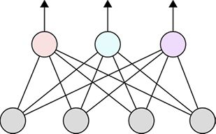

> **圖片描述：** 一個兩層全連接網路的神經元連接圖。底層3個灰色輸入神經元與上層3個彩色輸出神經元之間有全連接的線段。


圖23.23　全連接層的示意圖。3個彩色神經元構成全連接層。它們中的每一個都連接到前一層中的每一個神經元（灰色）。當我們創建這一層時，只聲明瞭它與之前的層連接的性質，而對它的輸出發生了什麼沒有做任何說明


要在模型中添加全連接層，我們需創建一個Dense對象，然後將其附加到模型的層序列的末尾。雖然Dense對象有很多參數，但我們現在只使用其中的3個。在標準的Python慣例中，第一個（必需的）參數沒有命名，但其他參數是命名的，並且可以按任何順序出現。


第一個必需的參數是層的大小。這只是神經元的數量。這可能通常與前一層中的節點數不同。例如，前一層（無論是輸入層還是有神經元的層）可能有4個輸出。我們的全連接層可能小於或等於或大於前一層的節點數，如圖23.24 所示。


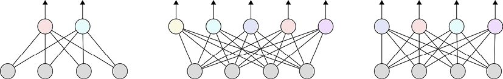

> **圖片描述：** 三種不同大小的兩層全連接網路。左：3輸入2輸出。中：3輸入4輸出。右：4輸入3輸出。展示不同層大小的變化。


　　　(a)　　　　　　　　　　　　　　　　　　　　　　　　　　　　　　　 (b)　　　　　　　　　　　　　　　　　　　　　　　　　　　　　　　(c)


圖23.24　含有彩色神經元的全連接層，連接到含有灰色神經元的前一層。全連接層中的神經元數量與其前面的層中的神經元數量無關


如上所述，對於第一個分類器，我們將使用與輸入中的像素相同數量的神經元。這是設置圖像分類器的常用方法，但我們稍後可能會發現系統在此層中使用更少的節點或更多的節點時學習得更好。在我們的腦海中，可以把它看作一個變量，之後再來處理，看看什麼值能給我們帶來最佳性能。


我們將使用的第一個可選參數會告訴Keras在層中的每個神經元之後放置哪個激活單元。我們可以通過提供一個字符串來指定任何內置在Keras中的函數（和往常一樣，在文檔中列出）。常見的選擇是將“relu”和“tanh”用於隱藏層，將“softmax”或“sigmoid”用於輸出層。預設值為“none”或線性激活函數。因此對於中間層，我們幾乎總是希望指定其他選項之一。


我們將使用的第二個可選參數是input_shape，它定義輸入中每個維度的大小。如上所述，我們**僅**將其用於模型中的第一層。此參數的值是一個列表，它可以讓Keras創建給定形狀和大小的輸入層，該輸入層必須與我們將提供的每個樣本的形狀和大小相匹配。


由於每個樣本（處理後）都是784個數字的一維列表，我們將告訴Keras這個input_shape是784個數字的一維列表（使用我們在預處理期間保存的變量number_of_pixels）。


清單23.31展示瞭如何創建第一個全連接層。


**清單23.31　**創建第一個全連接層。我們需要從keras.layers導入全連接對象來訪問它。因為這是模型中的第一層，所以我們為input_shape提供了一個值。


```
from keras.layers import Dense
# create the Dense layer
dense_layer = Dense(number_of_pixels, activation=′relu′,
                    input_shape=[number_of_pixels])
```


一旦創建了全連接層，如何將它添加到我們的模型呢？奇怪的是，儘管Python有一個名為append()的內置操作，它將一個元素添加到列表的末尾，但Keras並沒有將此名稱用於該操作，儘管它們在概念上是相同的。相反，它使用含糊不清的名稱add()，其通俗意義是“添加另一個日誌到文件”，而不是數字意義上的“把2和4相加”。把Keras的add()函數看作“append”將會有助於我們理解。


清單23.32展示了將層附加到模型中的層列表的程式碼。


**清單23.32　**在模型中附加一個新層。


```
*# append our layer to the list of layers in model*
model.add(dense_layer)
```


一個接一個地使用上面的兩個清單是完全可以的。這很清楚，也很有效。清單23.33展示了創建模型的順序。


**清單23.33　**創建全連接層，並將其添加到模型中，分兩步進行。


```
dense_layer = Dense(number_of_pixels, activation=′relu′,
                    input_shape=[number_of_pixels])
model.add(dense_layer)
```


但是傳統的做法是創建層並將其添加到模型中，如清單23.34所示。這意味著該層不會得到一個保存它的變量，因為我們很少需要它（如果真的需要它，Keras確實提供了一種在之後獲取該層的機制）。


**清單23.34　**一種創建全連接層並將其添加到模型中的更有效和常用的方法。


```
model.add(Dense(number_of_pixels, activation=′relu′,
                         input_shape=[number_of_pixels]))
```


現在我們可以添加模型的下一層。這將是另一個全連接層，但有10個神經元。


正如我們之前提到的，我們沒有明確告訴Keras這是輸出層。我們製作它並將其添加到不斷增長的層列表中。當我們使用該模型時，Keras會將其視為輸出層，因為它是列表中的最後一層。


我們創建下一個全連接層，就像前一個層一樣，但有一些變化。特別是，我們省略了input_shape參數，因為它只針對第一層。


與往常一樣，第一個參數是神經元的數量，它未命名而且是強制性的。由於我們將圖像分為10個類，因此將有10個神經元，每個類一個。我們將使用在預處理期間保存的變量number_of_classes。


正如在第17章所討論的，我們經常使用softmax來處理分類器中最後的全連接層的輸出，以便將它們轉化為機率。在這裡我們只需將其命名為字符串，Keras將負責其餘部分。


使用在一步中創建和附加層的標準樣式，我們的下一行程式碼如清單23.35所示。


**清單23.35　**添加第二個全連接層，它將用作輸出層。


```
model.add(Dense(number_of_classes, activation=′softmax′))
```


請記住，因為此層全連接到前一層，所以這10個節點中的每一個都接收來自隱藏層中所有784個節點的輸入。


這就是全部。我們創建了一個深度學習模型！清單23.36將它們整合在了一起。


**清單23.36　**創建深度學習模型所需的全部程式碼。


```
model = Sequential()
model.add(Dense(number_of_pixels, activation=′relu′,
                input_shape=[number_of_pixels]))
model.add(Dense(number_of_classes, activation=′softmax′))
```


這就是所有創建模型的程式碼！我們的模型已經完成了！


我們可以讓Keras輸出文本形式的模型。對於簡單示例而言，這並不是非常明顯，但對於具有數十或數百層的更大的模型來說，這是非常有用的。我們呼叫模型的summary()方法，如清單23.37所示。這個輸出按照它們放入網路的順序列出了這些層，所以我們可以從上到下來看它。這個摘要相當簡潔，不包括像我們為每一層選擇的激活函數這樣的資訊。


**清單23.37　**來自Keras的模型摘要。


```
model.summary()
_________________________________________________________
Layer (type)                   Output Shape                   Param #
=========================================================
dense_1 (Dense)               (None, 784)                     615440
_________________________________________________________
dense_2 (Dense)               (None, 10)                      7850
=========================================================
Total params: 623,290
Trainable params: 623,290
Non-trainable params: 0
_________________________________________________________
```


Keras自動地為層編號，例如dense_1和dense_2。在交互式會話期間，這些數字會隨著時間的推移而增加，因此，如果我們一次又一次地創建模型，就會看到dense_3和dense_4之類的內容。Keras為每一層標記了一個唯一的標籤，這樣當我們在給定的會話中反覆地創建模型時，它們就不會混淆。


標記為“Output Shape”的列以維度列表的形式告訴我們每一層輸出張量的形狀。我們在這裡看到的條目None，是在訓練期間作為小批量訓練樣本數的佔位符。例如，如果我們的小批量大小為64，那麼第一層將一次性處理64個樣本（如果可以，則使用GPU）。輸出將是一個包含64行、每行包含784個樣本的列表。但是因為現在Keras不知道小批量的大小，所以它用None表示“還不知道”。


摘要中還顯示每一層使用了多少參數或權重，然後將它們相加以告訴我們模型中的參數總數。我們可以看到，第一個全連接層dense_1有784個神經元，每個神經元讀取784個輸入的值。由於每個連接都有一個權重，因此有784×784=614656個權重。每個神經元還有一個偏差項，所以將784個偏差項加到我們剛剛得到的數字上就可以得到摘要中的615440。那是很多的權重！類似地，第二層有10個神經元，每個神經元與前一層中784個神經元相連。記住要添加10個偏差項，我們得到（10×784）+10=7850個權重。


最後一行將這些數字加在一起，告訴我們完整的模型有超過600000個權重。


這是值得思考的問題。我們的小型兩層模型包含了超過60萬個需要在每個更新步驟中進行調整的權重。更大的網路可以輕鬆地擁有數千萬或數億個權重。例如，我們在第22章中用來對圖像進行分類的VGG16網路使用了近1.4億個權重[Lorenzo17]。這就是為什麼高效的backprop演算法如此受歡迎，並且在GPU上加速它也很有吸引力。


### 23.6.3　編譯模型


到目前為止，我們的模型只不過是一份說明書。這是一個潛在的模型，但它不是一個真正的模型，就像房子的藍圖不是一個真正的房子一樣。那幢房子必須按設計圖來建造。在例子中，我們需要將描述轉換為運行程式碼，這被稱為**編譯**模型。當我們的模型完成編譯後，就可以進行訓練了。


編譯的過程會把我們的層描述轉換為可以在電腦（和GPU，如果可用的話）上直接運行的程式碼。這就是Keras在Theano、TensorFlow或CNTK中為我們編寫的程式。當我們訓練和使用模型時，我們將使用這些程式碼。


要編譯模型，我們需要至少提供給Keras兩條資訊。


首先，我們必須告訴Keras如何測量每個樣本的誤差（即如何用數字來表示網路輸出和我們希望它產生的目標之間的任何差異）。其次，我們必須告訴keras應該使用哪個最佳化器來更新權重以減少誤差。讓我們依次來看這些。


為了衡量權重的質量，我們需要一個損失（或成本）函數。在第18章討論backprop時，我們使用了一個簡單的基於輸出值和標籤值之間差異的誤差測量。但我們也有其他選擇。


損失函數很有趣，因為它們給出了網路的“目標”。神經元、Dropout層、激活函數等是網路的“內容”，提供各個部分，像是機械時鐘中的齒輪。而結果的計算、反向傳播和權重更新，這是“方法”，就像時鐘的齒輪連接並相互推進的方式一樣。


但是損失函數告訴我們**為什麼**要這樣做。是為了找到一個完美的標籤？是要找到3個等可能的標籤？是預測浮點值？是照片中一張臉的名字？是明天買什麼股票最好？是一個短語從一種語言翻譯到另一種語言？或者可能更深奧的東西。


每個神經網路都有一個目的，而在某種意義上，損失函數定義了這個目的，因為它驅動著整個網路。網路的目標是使損失或誤差儘可能小。所以損失函數推動了整個進程。


由於其通用性和重要性，損失函數可以變得很複雜。這通常意味著其中有很多數學知識。


好消息是，我們在深度學習中所做的大部分基本事情都只涉及幾個典型的應用程式，並且每個應用程式都有一個現成的已經被編程到Keras中用於完成這項工作的損失函數。我們只需要命名為我們的目標設計的那個。由於我們正在搭建一個多類別分類器，而不是一個執行迴歸或二進制分類的網路，因此我們將告訴Keras使用適用於多類別分類器的預先搭建的損失函數。


該函數將比較獨熱標籤和最後一層的輸出。這種比較使用了第6章中的**熵**的概念來確定我們匹配的接近程度。我們想要的損失函數的名稱將這兩個想法組合成長字符串“categorical_crossentropy”。


如果我們只有兩個類別，並且將使用一個輸出來決定它們（可能將它設置為一個類別接近0而另一個類別接近1的值），那麼評估該情況下的誤差的函數被命名為“binary_crossentropy”。


Keras文檔中列出了許多其他的損失函數，它們在執行迴歸或其他各種特定任務時非常有用。如果還沒有完美的損失函數，我們可以用Python編寫自己的函數並告訴Keras使用它。


令人高興的是，我們的目標是使用多個輸出進行基本分類，因此我們可以使用預先搭建的“categorical_crossentropy”損失函數。這告訴網路，我們希望網路的輸出儘可能地與獨熱標籤中的數字相匹配。


選擇了損失函數後，我們的下一個任務是選擇最佳化器。一旦計算出誤差，Keras就會將其提供給最佳化器，最佳化器將使用該誤差來更新權重。我們在第19章中看到了各種各樣的最佳化器，其中包括SGD、RMSprop和Adagrad等。同樣，它們都已經被我們實作了，所以我們只需要通過提供它的名稱來告訴Keras我們希望它使用哪一個。


在編譯模型時，我們可以向Keras提供許多其他可選資訊。其中最常見的是提供一個稱為metrics的測量值列表，告訴Keras我們希望它在模型學習時測量什麼。我們可以將這些指標視為誤差或損失函數的補充，但它們只是作為理解和監控學習過程的有用資訊參與計算並將結果返回給我們，並不用於更新模型。有許多指標可供選擇。如果我們沒有看到合適的測量指標，我們可以自己定義一個函數來計算我們想要評估的指標。雖然指標始終是一個列表，但我們通常只提供一個元素的列表，並要求它使用字符串“accuracy”來記錄準確率。


我們通過呼叫模型的compile()方法來編譯模型。它包含了模型在我們選擇的後端電腦上實際運行的所有內容。由於此資訊與模型對象一起保存，因此我們不必自行保存任何內容。當compile()返回時，模型就可以學習了。


清單23.38展示瞭如何使用損失函數、最佳化器和指標列表呼叫compile()。在這種情況下，我們使用“categorical_crossentropy”損失函數，正如我們上面討論的那樣，它是具有多個輸出的分類問題的適當選擇。我們選擇了“adam”最佳化器，因為它通常是一個很好的起點，並且已經指定了常規選擇“準確率”，以便在我們開始學習後測量指標。


**清單23.38　**使用compile()方法編譯模型，我們選擇“categorical_crossentropy”損失函數和“adam”最佳化器。使用這些字符串是創建具有預設值的相應對象的簡寫。我們還告訴模型，一旦我們開始訓練，就會希望它能夠測量並返回“accuracy”。


```
model.compile(loss=′categorical_crossentropy′,
              optimizer=′adam′, metrics=[′accuracy′])
```


像往常一樣，我們對損失函數和最佳化器的初始選擇是憑經驗完成的。也就是說，選擇一些我們認為是合理的參數設置，看看它們的效果怎麼樣，然後進行改變以改善我們獲得的性能。


如果我們認為已經很接近了，但還可以做得更好，那麼可能會決定創建一個自定義最佳化器，並將一些參數設置為預設值以外的其他值。


例如，Keras文檔說Adam的學習率參數稱為lr（小寫l和r），其預設值為0.001。也許我們預感到較小的初始值可以改善結果。當我們使用字符串“adam”創建最佳化器時（如清單23.38所示），會要求一個使用所有預設值的Adam最佳化器實例。為了設置我們自己的一些值，我們創建了一個Adam對象的實例，並在其中指定了我們想要賦值的參數，而將所有其他參數保留為預設值。然後我們將該對象交給compile()，而不是給它一個字符串。清單23.39展示了它是如何工作的。


**清單23.39　**使用Adam最佳化器的自定義對象編譯模型。


```
from keras import optimizers
slow_adam = optimizers.Adam(lr=0.0001)
model.compile(loss=′categorical_crossentropy′,
              optimizer=slow_adam, metrics=[′accuracy′])
```


Keras文檔列出了所有最佳化器及其實例名稱、它們的參數以及所有預設值。


損失函數不帶參數，因此除非使用自己編寫的自定義函數，否則我們通常會提供一個字符串來命名一個內置函數。


我們在本節中介紹了很多內容，但它可以歸結為清單23.38所示的一個函數呼叫（或清單23.39所示的自定義版本）。使用損失函數和最佳化器呼叫compile()為Keras提供了足夠的資訊，可以將我們的網路說明轉換為可以運行的實際程式碼。


### 23.6.4　模型創建摘要


我們剛剛登上了第二個山頂。


我們從如何創建一個新模型開始。我們首先創建了一個空的Sequential對象，然後添加了一個全連接的隱藏層，它也指定了輸入層的形狀。我們完成了另一個全連接層，產生了10個輸出，每個類別一個。


然後我們編譯了模型，將其從藍圖變為現實。我們告訴Keras如何測量損失、如何更新權重，以及我們希望它在這個過程中為我們測量哪些資料。


把這些放在一起，清單23.40展示瞭如何創建和編譯模型。我們已經將所有內容合併為一個返回已編譯模型的小函數。這樣我們的程式碼就可以包含多個模型，我們可以通過呼叫適當的函數來選擇我們想要的模型。在本摘要中，假設已經運行了清單23.27，因此我們可以使用變量number_of_classes和number_of_pixels（為了簡單起見，我們將它們用作全局變量，但它們可以作為參數傳入）。


**清單23.40　**總結如何創建和編譯模型。


```
from keras.models import Sequential
from keras.layers import Dense
def make_one_hidden_layer_model():
    *# create an empty model*
    model = Sequential()

    *# add a fully-connected hidden layer with #nodes = #pixels*
    model.add(Dense(number_of_pixels, activation=′relu′,
                    input_shape=[number_of_pixels]))

    *# add an output layer with softmax activation*
    model.add(Dense(number_of_classes, activation=′softmax′))

    *# compile the model to turn it from specification to code*
    model.compile(loss=′categorical_crossentropy′,
                  optimizer=′adam′,
                  metrics=[′accuracy′])
    return model

model = make_one_hidden_layer_model() *# make the model*
```


將清單23.27中的資料加載和預處理步驟與清單23.40中的模型創建步驟相結合，我們可以讓一個空白的模板變成一個可以學習的模型。


創建我們的模型只需要3行程式碼，編譯它只需要一行。現在我們看到訓練系統也只需要一行。但正如我們所看到的，每一行都包含了大量資訊。


現在我們要將準備好的資料傳遞給編譯好的模型並開始學習。


讓我們開始訓練吧！


## 23.7　訓練模型


我們的資料已經為學習做好了準備，而且我們已經創建並編譯了一個模型，現在是時候將資料提供給模型並讓它學習了。


這就是像Keras這樣的庫真正閃耀的地方。管理資料流、使用反向傳播計算梯度、應用權重更新公式以及其餘的所有機器學習工作都可以完成。


為了向scikit-learn致敬，我們使用了一個名為fit( )的例程來訓練對象，Keras訓練例程也被命名為fit( )。這個函數呼叫我們需要的資料和模型，併為我們運行整個學習過程，一應俱全。我們只需呼叫它們，然後去喝一杯咖啡，或者睡一晚上，週末去拜訪朋友，或者休假幾周，這取決於我們的網路、資料和可用的計算資源。對於清單23.40中運行在MNIST上的小型兩層模型，我們只需一會的休息時間就足夠了。在2014 iMac上訓練，在沒有GPU的情況下運行TensorFlow後端，每個epoch訓練大約需要2～3秒。我們會看到在20個epoch後獲得了良好的結果，這還不到一分鐘。


為了關注學習過程，我們可以要求fit( )在每一個epoch之後輸出中間結果。這讓我們可以看到事情是否進展順利，如果網路沒有學習，可能會中斷這個過程。如果我們讓它運行完，fit( )將返回一個History類型的對象。這包含了Keras在每一個epoch之後測量的所有資料，例如模型的準確率和損失。我們可以使用該歷史記錄製作圖表來可視化系統的性能。


描述fit( )的文檔所使用的術語值得我們多加關注。


訓練資料現在簡稱為x和y，但因為它們是前兩個參數，所以我們不必明確提供這些名稱。用於評估系統的資料稱為**驗證**資料，而不是測試資料。原因是Keras將在每一個epoch之後評估我們的模型。因此，我們暫時擱置測試資料，以便在部署之前評估最終模型。我們在訓練時使用驗證集來測試性能。


有了這些術語之後，讓我們看看如何呼叫fit( )。


前兩個參數都是強制性的，按順序是訓練樣本和訓練標籤。正如我們剛剛看到的，它們稱為x和y。儘管遵循Python約定，當我們呼叫fit( )時，這些強制性的第一個參數通常不會明確命名。


在訓練期間，fit( )將使用驗證資料定期評估模型。我們可以選擇明確地提供資料，或者告訴fit( )從輸入資料中提取驗證集。


如果我們有自己的驗證集（就像我們使用MNIST一樣），可以在一個小的2元素列表中提供驗證樣本及其標籤，作為可選參數validation_data的值。


如果我們沒有自己的驗證集，那麼fit()可以為validation_split參數提供一個值，以0～1的浮點數的形式，告訴它要用作驗證資料的訓練資料的百分比。這就像使用scikit-learn的train_test_split()例程，但是是動態的。一般來說，最好提供我們自己的驗證集，因為我們可以更好地控制它所包含的內容。


正如在第8章中看到的，我們通常以**小批量**訓練模型。由於我們很少一次使用整個批次進行訓練，因此許多人將小批量簡稱為“批”。Keras也這樣做，使用參數名如batch_size更適用於“小批量的大小”。因為將“批”用於“小批量”非常常見，所以我們也會在這裡使用這樣的術語。


當分批次學習時，fit( )將從我們的訓練集中提取出一個批大小的樣本塊，從中學習，更新權重，然後再獲取另一個批次。我們的工作是用可選參數batch_size告訴fit( )這些塊應該有多大。這個參數預設值為32，但我們可以將它設置為我們喜歡的任何值。如果使用GPU，我們通常將其設置為2的冪（如32或128），這可以使得資料最適合我們正在使用的GPU，因此它可以在一個並行操作中處理整個批的資料。當僅在CPU上進行訓練時，我們經常使用更大的批大小，甚至可能使用幾百個樣本，因為我們的電腦有更多可用記憶體。


在本章中，我們將演示沒有GPU的結果，因此我們通常會使用相當大的批大小，如256。


另一個重要的參數是訓練過程應該運行多少epoch。回想一下，一個epoch意味著遍歷一次完整的訓練集（如上所述，分批進行）。這幾乎永遠不足以完全訓練系統，因此係統會在另一個epoch中再次運行所有資料，一遍又一遍地重複該過程。告訴fit( )在我們開始訓練之前要使用多少epoch的缺點是我們可能會不知所措。也許有時需要比我們要求更多的epoch，所以我們過早地停止訓練，或者選擇一個遠遠超過我們需要的數字，浪費大量時間訓練不再學習的網路（或者更糟的是，過擬合）。我們稍後會看到這兩個問題的解決方案。現在，我們只需選擇一個數字，並希望它是正確的。參數的名稱是epochs，是“epoch的數量”的縮寫。我們選擇3是為了確保一切正常，然後再調高這個數字。


我們將使用的最後一個參數是verbose，它告訴系統在每一個epoch之後的更新結果（語法上，我們可能更喜歡“verbosity”作為這個參數的名稱，但它就是verbose）。如果我們將其設置為0，則不輸出任何內容；值為1會輸出一個動態進度條，顯示系統在每一個epoch通過樣本的方式；值為2則僅輸出每一個epoch後的單個文本摘要行。


讓我們用自己的驗證集對模型進行3個epoch的訓練。由於我們正在用CPU進行訓練，因此將使用每批256個樣本的大批量。與我們在GPU上訓練時通常使用的較小批量的結果相比，這將在繪製資料時為我們提供更平滑的圖形。我們將verbose設置為2，以便在每一個epoch之後得到一行資訊。清單23.41展示了完成這些操作的程式碼。


**清單23.41　**最後，我們正在訓練模型！


```
*# call fit() to train the model, and save the history*
history = model.fit(X_train, y_train, validation_data=
                   (X_test, y_test),
                   epochs=3, batch_size=256, verbose=2)
```


當我們運行程式碼時，系統將開始訓練。由於只有3個epoch，這在大多數現代電腦上運行應該不到一分鐘。


這是第三個山頂！下面我們將它們放在一起。


## 23.8　訓練和使用模型


我們已經到達了最後一個山頂。從頭開始創建模型，我們已經得到了一個（幾乎）訓練好的神經網路來分類MNIST數字。


這是一個停下來欣賞風景，回顧一下我們已經走了多遠的好時機。


清單23.42將清單23.27的預處理、清單23.40的模型創建和清單23.41的模型訓練結合在一起。


短短57行程式碼（包括註釋和空格），從零開始，獲取資料，對其進行預處理，創建和編譯一個深度學習模型，然後進行3個epoch的訓練。


**清單23.42　**將清單23.27的預處理、清單23.40的模型創建和清單23.41的模型訓練結合在一起。


```
from keras.datasets import mnist
from keras.models import Sequential
from keras.layers import Dense
from keras import backend as keras_backend
from keras.utils.np_utils import to_categorical
from keras.utils import np_utils
import numpy as np
random_seed = 42
np.random.seed(random_seed)

*# load MNIST data and save sizes*
(X_train, y_train), (X_test, y_test) = mnist.load_data()
image_height = X_train.shape[1]
image_width = X_train.shape[2]
number_of_pixels = image_height * image_width

*# convert to floating-point*
X_train = keras_backend.cast_to_floatx(X_train)
X_test = keras_backend.cast_to_floatx(X_test)

*# scale data to range [0, 1]*
X_train /= 255.0
X_test /= 255.0

*# save the original y_train and y_test*
original_y_train = y_train
original_y_test = y_test

*# replace label data with one-hot encoded versions*
number_of_classes = 1 + max(np.append(y_train, y_test))
y_train = to_categorical(y_train, num_classes=number_of_classes)
y_test = to_categorical(y_test, num_classes=number_of_classes)

*# reshape samples to 2D grid, one line per image*
X_train = X_train.reshape([X_train.shape[0], number_of_pixels])
X_test = X_test.reshape([X_test.shape[0], number_of_pixels])

def make_one_hidden_layer_model():
    model = Sequential()
    model.add(Dense(number_of_pixels, activation=′relu′,
                    input_shape=[number_of_pixels]))
    model.add(Dense(number_of_classes, activation=′softmax′))
    model.compile(loss=′categorical_crossentropy′,
                  optimizer=′adam′,
                  metrics=[′accuracy′])
    return model

*# make the model*
one_hidden_layer_model = make_one_hidden_layer_model()

*# call fit() to train the model, and save the history*
one_hidden_layer_history = one_hidden_layer_model.fit(
    X_train, y_train,
    validation_data=(X_test, y_test), epochs=3,
    batch_size=256, verbose=2)
```


### 23.8.1　查看輸出


清單23.42的最後一行實際上訓練了我們的模型，從X_train的訓練資料中學習。清單23.43展示了我們要求它在每一個epoch之後輸出的摘要。再次運行此程式碼可能會產生略微不同的值。


**清單23.43　**清單23.42的輸出。請注意，不同的後端可能會產生略微不同的值。我們刪除了每個值的最小有效位，以使每一行看起來美觀。


```
Train on 60000 samples, validate on 10000 samples
Epoch 1/3
3s-loss: 0.3053 - acc: 0.9141 - val_loss: 0.1641 - val_acc: 0.9532
Epoch 2/3
3s-loss: 0.1237 - acc: 0.9645 - val_loss: 0.1044 - val_acc: 0.9701
Epoch 3/3
3s-loss: 0.0812 - acc: 0.9763 - val_loss: 0.0820 - val_acc: 0.9748
```


第一行是為了保證，報告了訓練集和測試集的大小。這有助於我們發現意外混淆這兩個資料集的情況。


系統在開始第一個epoch時輸出Epoch 1/3，並在遍歷該epoch中的每個樣本時輸出摘要行。第一條資訊是消耗的時間。在這裡，系統花了大約3秒（同樣，僅在CPU上）在訓練集中的每個樣本上訓練我們的簡單模型（即一個epoch）。然後系統輸出訓練集的損失和準確率（loss和acc）。不幸的是，這些沒有被明確標記為用於訓練集。但是我們可以看到接下來的兩個結果是針對驗證集（val_loss和val_acc）的，這有助於提醒我們未標記的版本是針對訓練資料的。


我們應該怎麼做？乍一看，訓練資料的結果看起來很有希望。每一個epoch後測試損失都在下降，測試準確率也在提高。這表明我們所有的一切都是有效的，並且系統正在學習。


這樣的結果確實值得興奮。


驗證資料看起來也不錯。同樣，每一個epoch的損失都在下降，準確率都在提高。經過3個epoch的訓練，它的準確率已達到97%以上！這雖然遠不及前人發現的最好成績[LeCun13]，但令人驚訝的是，僅僅3個epoch之後，在根本沒有調整參數的情況下，一個只有一個隱藏層的小網路，手寫數字識別的準確率高達97.5 %！


對於幾乎任何網路來說，3個epoch的訓練是不夠的，即使是這麼簡單的網路。讓我們看看怎樣讓它運行20個epoch。我們所要做的就是將參數epochs改為20，然後讓模型去訓練。


**清單23.44　**最後，我們對模型進行了真正的訓練！我們讓它運行20個epoch。


```
history = model.fit(X_train, y_train,
                    validation_data=(X_test, y_test),
                    epochs=20, batch_size=256, verbose=2)
```


清單23.45展示了清單23.44輸出中的開頭和結尾。


**清單23.45　**清單23.44輸出的開頭和結尾。


```
Train on 60000 samples, validate on 10000 samples
Epoch 1/20
3s-loss: 0.3044-acc: 0.9141-val_loss: 0.1643-val_acc: 0.9522
Epoch 2/20
3s-loss: 0.1239-acc: 0.9646-val_loss: 0.1037-val_acc: 0.9699
Epoch 3/20
3s-loss: 0.0813-acc: 0.9760-val_loss: 0.0816-val_acc: 0.9753
Epoch 4/20
3s-loss: 0.0578-acc: 0.9834-val_loss: 0.0723-val_acc: 0.9788
...
Epoch 17/20
3s-loss: 0.0015-acc: 1.0000-val_loss: 0.0639-val_acc: 0.9818
Epoch 18/20
3s-loss: 0.0011-acc: 1.0000-val_loss: 0.0628-val_acc: 0.9826
Epoch 19/20
3s-loss: 9.0475e-04-acc: 1.0000-val_loss: 0.0633-val_acc: 0.9827
Epoch 20/20
3s-loss: 8.6833e-04-acc: 1.0000-val_loss: 0.0619-val_acc: 0.9826
```


清單23.45中的輸出看起來很棒。我們在訓練集上的得分是100%準確率。這是完美的！


測試集得分並不完美，但對於這樣一個簡單的模型來說它是非常值得自豪的。我們的模型在所有10000個測試樣本中只有174個分類錯誤。


正如我們前面提到的，使用圖像資料的一個好處是我們可以查看它。讓我們看一些被錯誤分類的例子。


在圖23.25中，每一行顯示的圖像的給定標籤是該行的編號。也就是說，在資料集中，第一行中的每個圖像最初都分配了標籤0，第二行中的每個圖像最初都分配了標籤1，以此類推。但在這裡，我們正在展示被網路錯誤分類的圖像。該列顯示系統分配給該圖像的標籤。例如，在第一行中，第5個位置有一張圖像。它在第一行，所以MNIST資料集告訴我們這應該是0，但它在第5列，所以系統預測這是一個4。這似乎是一個非常奇怪的錯誤。


在第3行可以看到合理的錯誤。左邊的第二個圖像在資料中標記為2，但系統將其分類為1。很難說它應該是什麼。在第6行中，第一個條目在資料中標記為5，但系統將其稱為0。這似乎並非沒有道理。


有些錯誤看起來似乎令人驚訝（圖23.25中第9行最左邊的8 看起來很明顯是8而不是0），重要的是要記住這些錯誤是很少見的。在10000個測試圖像中，系統僅與給定的標籤發生174次不一致。


> **圖片描述：** MNIST數字的隨機排列。10行10列的手寫數字圖像，部分有白色背景（反轉圖像），展示資料增強或特殊處理後的變體。


圖23.25　預測值與標籤不匹配的測試集圖像的可視化。第一行包含在原始MNIST資料集中標記為0的圖像。下一行包含標記為1的圖像，以此類推。每一列告訴我們系統分配的標籤。例如，第一行顯示應該全部標記為0的圖像。但是此行的第5列中有一個圖像，這意味著系統將其分類為4。空格子表示沒有圖像落入該位置。每個位置顯示的圖像是從屬於該單元格的所有圖像中隨機選擇的


圖23.26展示了我們的錯誤的“熱圖”，其中每個單元格告訴我們有多少圖像落入該單元格。範圍從黑色（在該單元格中沒有圖像）到紅色，然後是黃色到白色。


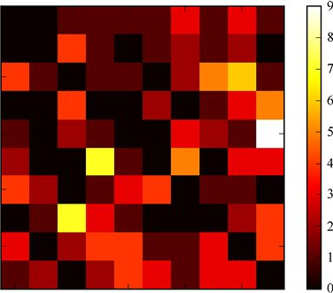

> **圖片描述：** 混淆矩陣熱力圖。6x6的彩色網格，使用黑紅橙黃白色彩映射，對角線上（正確分類）顯示最高值（最亮），非對角線（誤分類）值較低（較暗）。右側色彩條標示0至9的數值範圍。


圖23.26　圖23.25的錯誤總體可視化的熱圖，這告訴我們每個單元格中有多少圖像落入。黑色表示空列表，而亮紅色、黃色和白色表示較長的列表


第5行第9位的白色框顯示，在此次訓練中，系統始終犯的最大錯誤是將標記為4的數字分類為9。驗證集中的10000個數字，9個圖像被這樣錯誤地分類。其他常見錯誤是把標記為5的數字分類為3，把標記為7的數字分類為3。


### 23.8.2　預測


我們的驗證資料得到了一些令人印象深刻的數字，但如果我們查看一些非人口普查局工作人員或高中生寫的數字呢？


讓我們採用剛剛訓練過的模型並進行部署。我們將給它一些以前從未見過的新圖像，看看它會怎麼做。


圖23.27展示了西雅圖地區冬季拍攝的4張照片。依次為：咖啡店櫥窗裡的一塊牌子，建築工地附近地面上的噴漆標記，垃圾箱側面的數字，以及一個停車場的攤位號。


> **圖片描述：** 四張真實世界照片中的數字。左：咖啡店價格牌。中左：地面粉筆寫的數字。中右：垃圾箱上的「1435」。右：牆上的「325」。


圖23.27　西雅圖地區冬季拍攝的4張照片。從左到右：咖啡店櫥窗裡的牌子，建築工地附近地面上的噴漆標記，垃圾箱側面的數字以及一個停車場的攤位號


停車場攤位上的印刷數字不是手繪的，而且它們有間隙，所以它們真的不適合我們的系統。它們只是為了好玩而被包含在內，並且看看我們的深度學習系統會給出什麼結果。


當提取這些數字時，將它們旋轉直立，並以與原始MNIST資料集[LeCun13]相同的方式準備它們，我們得到了圖23.28。


> **圖片描述：** 從四張真實照片中裁剪出的數字。四行對應四個場景（咖啡店、建築工地、垃圾箱、停車場），每行顯示提取出的個別數字圖像。


圖23.28　從圖23.27中提取數字。每個數字都已旋轉到垂直位置，然後像原始MNIST圖像一樣進行處理


我們的系統會有多好？在我們深入討論之前強調一點，這不是一個公平的測試。驗證集有10000個圖像是有充分理由的，但在這裡我們只有18個圖像。這個樣本集太小，沒有任何統計有效性。更糟糕的是，停車場的圖像不是手繪的，而且每個都有明顯的間隙。所以我們要做的就是做點有趣的嘗試，而不是以此作為可以用來可靠地表徵我們系統性能的證據。畢竟，這正是驗證集的用途。然而，它們做了一個有趣的測試，在此過程中我們將看到如何使用模型進行預測，讓我們來深入研究一下。


為了弄清楚我們正在使用哪個集合，讓我們製作4個測試集，每組一個圖像。例如，我們將咖啡店資料安排到一個有4行784列的網格中，如圖23.29所示。


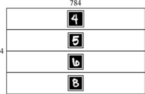

> **圖片描述：** 四張真實數字圖像排列為輸入格式。4行長條，每行寬度784像素，包含一張28x28的數字圖像（4、5、6、8），其餘空間為空白。


圖23.29　將咖啡店資料的4個圖像排列成一個二維網格，每個圖像一行


建築工地資料有7行，垃圾箱資料有4行，停車場資料有3行。


與往常一樣，我們需要對資料進行預處理。我們已經把它變成了28像素×28像素的形狀，但這還不夠。就像MNIST資料集一樣，我們需要將輸入像素轉換為當前的Keras浮點類型，然後必須應用與我們用於訓練模型的訓練資料相同的預處理。因此我們將再次使用cast_to_floatx( )將資料轉換為正確的類型，然後將每個像素除以255，就像之前一樣。咖啡店圖像資料的預處理步驟如清單23.46所示。


**清單23.46　**咖啡店圖像的預處理。我們將它們設置為當前的浮點類型，然後使用與訓練時相同的預處理。在這裡，也就是將值除以255。


```
CoffeeShopDigits_set = keras_backend.cast_to_floatx(
                                      CoffeeShopDigits_set)
CoffeeShopDigits_set /= 255.0
```


現在我們準備將這些圖像提供給模型，並要求它識別或預測每個數字。我們正在新資料上測試我們的深度學習系統！


我們可以要求有兩種類型的預測。最簡單的一個只是給出每個樣本機率最高的預測類。我們通過呼叫一個名為predict_classes()的方法來實作這一點，該方法由編譯好的模型提供。它的第一個也是唯一的強制參數是我們希望它預測的資料。我們將verbose設置為0，因為這個快速的小任務不需要進度條。清單23.47展示了輸入和輸出。


**清單23.47　**我們給模型提供了正確形狀的新資料，並使用predict_classes()來預測最終的類。結果是一個數組，每個類有一個條目。


```
model.predict_classes(CoffeeShopDigits_set, verbose=0)
array([4, 5, 6, 8])
```


預測的結果是一個整數數組，每個整數代表輸入中的每一行，告訴我們系統為這一行分配了什麼類。


將清單23.47的結果與圖23.28進行比較，我們可以看到系統完美無缺！它正確地分類了所有4位數字。


我們可以要求的另一種類型的預測將給出每個類的機率。通過這種方式，我們可以看到是否有任何接近的第二預測值，並且通常可以感覺到系統不僅在尋找正確答案方面做得如何，而且在丟棄錯誤答案方面做得如何。我們使用predict_proba()方法返回此列表。清單23.48展示了這個函數的結果，它為我們提供了咖啡店牌子上的數字4在每一類的機率。


**清單23.48　**咖啡店牌子上的數字4的機率。我們首先詢問集合中所有圖像的機率，這給我們返回一個長度為4的列表，每個元素列出了該圖像的10個機率。這裡我們只輸出第一個列表。索引4處的條目是最大的，但有趣的是系統認為數字很可能是9。


```
coffee_probas = model.predict_proba(CoffeeShopDigits_set,
                                    verbose=0)
coffee_probas[0]
array([ 1.14440860e-13,     1.44225864e-11,     2.28489186e-10,
        5.18200795e-11,     7.40086734e-01,     1.52976892e-04,
        1.60120806e-10,     1.13515500e-06,     1.25018749e-04,
        2.59634137e-01], dtype=float32)
```


我們可以看到，每個類都返回一個浮點數。在此示例中，最大值為4和9，這對於查看圖像很有意義。其中4“勝”了10倍。


讓我們繪製咖啡店資料中所有4位數的機率，結果如圖23.30所示。只有4存在明顯的競爭，圖像有26%的可能性為9。系統基本上確定了其他3個數字。


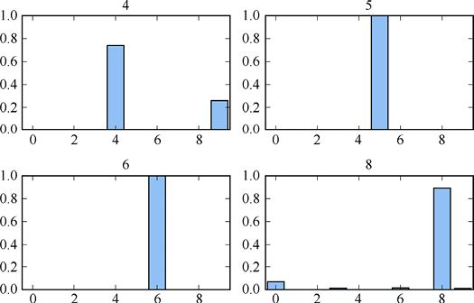

> **圖片描述：** 四張真實數字的分類機率長條圖。左上：數字4，第4類機率最高（約0.75），但第9類也有一定分數。右上：數字5，正確分類。左下：數字6，主要猜測為6和9。右下：數字8，被正確分類為8。


圖23.30　清單23.48中的機率圖。系統非常確定第一個數字是4，但認為它也可能是9（或者僅可能是8）。其他數字非常確定


讓我們在其他3個集合上測試我們的模型。


清單23.49展示了建築工地圖像資料的輸入和輸出。


**清單23.49　**我們的模型對建築工地圖像資料的預測。


```
model.predict_classes(ConstructionDigits_set, verbose=0)
array([0, 2, 3, 9, 5, 3, 9])
```


系統得到的大部分數字是正確的，但把4誤分類為9，把7誤分類為3。7看起來很合理，因為我們可以把這個橫條理解為把圖形分成上下曲線，有點像3。但把4錯當成9似乎很難解釋。


清單23.50展示了垃圾箱圖像資料的輸入和輸出。


**清單23.50　**我們的模型對垃圾箱圖像資料的預測。


```
model.predict_classes(DumpsterDigits_set, verbose=0)
array([1, 3, 4, 5])
```


完美預測！清單23.51展示了停車場圖像資料的輸入和輸出。


**清單23.51　**我們的模型對停車場圖像資料的預測。


```
model.predict_classes(StencilDigits_set, verbose=0)

array([2, 3, 5])
```


再次完美預測！停車場圖像資料幾乎荒謬得不公平。數字不是手繪的，它們都有多個間隙。這根本不是模型訓練的那些對象。我們沒有理由認為模型能很好地解釋這些圖像，然而它卻完美地預測了這3個數字。


我們的小模型只有兩層，只經過了20個epoch的訓練，卻做得很好，正確分類了18張圖像中的16張。


### 23.8.3　訓練歷史分析


我們的系統似乎做得很好，特別是對於這些簡單的事情。


之前我們提到fit( )返回了一些歷史資訊，這些資訊告訴我們訓練是如何進行的。現在讓我們研究一下，從中可以學到什麼。


為了收集大量資料，這次我們將訓練100個epoch，儘管我們知道系統在僅僅20個epoch之後就會在訓練資料上達到100%的準確率。


歷史資訊由fit( )返回，因此我們可以將該方法的輸出分配給一個變量，如清單23.52所示。


**清單23.52　**保存fit()返回的歷史記錄。


```
one_hidden_layer_history = model.fit(X_train, y_train,
               validation_data=(X_test, y_test),
               epochs=100, batch_size=256, verbose=2)
```


這裡我們將歷史記錄保存在名為one_hidden_layer_history的變量中。它包含一堆總結訓練過程的字段（比如它運行了多少個epoch，以及我們使用了哪些參數）。我們現在最感興趣的地方稱為history。它是一個Python字典對象，包含每一個epoch後訓練集和驗證集的準確率和損失值。


訓練準確率在這個詞典中作為一個存儲在鍵’acc’下的列表，所以我們用one_hidden_layer_ history.history [‘acc’]從one_hidden_layer_history中獲取它們（這需要打很多字！）。訓練損失使用鍵“loss”。類似地，驗證準確率和驗證損失存儲在鍵“val_acc”和“val_loss”中。


注意，與Keras中的許多其他地方一樣，與訓練集相關的資訊沒有前綴，因此這些列表使用鍵“acc”和“loss”。與其他資料集相關的資訊以描述符為前綴，因此這裡我們使用鍵“val_acc”和“val_loss”來保存驗證資料。


我們使用通過這些鍵檢索到的數字列表，繪製了訓練資料的準確率和損失，如圖23.31所示。


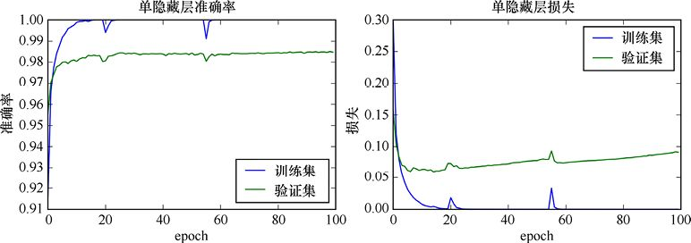

> **圖片描述：** 模型訓練過程的準確率和損失曲線。左圖標題「單隱藏層準確率」，藍綠線分別為訓練集和驗證集準確率隨epoch上升。右圖標題「單隱藏層損失」，藍線（訓練損失）持續下降趨近0，綠線（驗證損失）先降後略升，顯示輕微過擬合。


圖23.31　單層模型的準確率和損失與epoch數的關係


這裡有一些驚喜。


首先，值得注意的是資料範圍區間。準確率曲線從約0.91**開始**（最高為1.0）。這意味著在經過一個epoch訓練之後，我們的系統準確率高達91%。這遠非完美，但對於這麼小的網路和一個epoch的訓練來說，這真是太神奇了。損失曲線的範圍相對較小，為0～0.3。


兩張圖都顯示出一些峰值。這可能是由於樣本以恰當的順序出現，因此一些系統損失能夠累積。在這兩種情況下，該系統幾乎立即得到了恢復。


大約在第20個epoch，訓練損失迅速降至0，除了尖峰，它保持在0處。但驗證損失正在逐漸增加，即訓練損失和驗證損失是**發散**的。這是**過擬合**的圖片。正如我們在第9章中討論的那樣，過擬合意味著系統已經學會了如何通過特殊化其特徵來識別訓練集，而不是其一般原則。


過擬合期間的學習實際上會降低我們在驗證資料上的表現，因為系統會越來越多地學習訓練集、銳化規則和記憶細節。這完全是浪費精力，它的代價是失去了普遍性，每一個epoch都會對系統在新資料上的準確率造成更大的傷害。雖然看起來這些圖表的準確率並沒有下降，但不斷增加的驗證損失表明，如果我們繼續訓練，這一時刻可能會到來。


為了防止這種過擬合，我們可能會試圖在損失或準確率曲線相互交叉的地方停止訓練，但這太早了。驗證準確率仍在提高，驗證損失總體上仍在下降。停止的最佳時機是我們的驗證損失或準確率停止改善。也就是說，當損失開始增加或準確率開始下降時。在這兩個選擇中，我們通常使用不斷增加的驗證集損失作為停止訓練的觸發器。


下面我們將看到如何自動檢測這種情況，並在那時停止訓練。這將有助於我們避免過度訓練模型。它還將解決我們必須猜測正確數量的epoch數進行訓練的問題，並幫助我們不要猜太高或太低。我們只需選擇一個很大的數，讓系統在開始過擬合時自行停止。


在開始討論之前，讓我們看看如何將來之不易的訓練好的模型保存並加載到文件中。畢竟，如果我們花了幾個小時（或幾天，或幾周）訓練一個模型，那麼肯定希望能夠保存所有這些寶貴的權重。然後，下次我們想要使用該模型時，只需從文件中加載權重，那麼就可以使用完全訓練好的模型了，而不必再從頭開始訓練它。


## 23.9　保存和加載


在解決訓練模型的所有問題之後，我們當然希望保存它，以便以後再次使用它。這裡有幾種方式可供選擇。


### 23.9.1　將所有內容保存在一個文件中


保存模型和權重的最簡單方法是呼叫屬於對象的內置方法，該方法告訴對象將自己寫入文件。這個足夠明智的方法稱為save( )。當我們呼叫此方法時，模型將生成一個包含其架構和權重的文件。


模型以一種稱為HDF5的格式保存，通常使用擴展名.h5或.hdf5 [HDF517]。我們可以只用一行程式碼來保存模型，如清單23.53所示。


**清單23.53　**將模型的完整版本保存到文件中。


```
model.save(′my_model.h5′)
```


稍後，我們可以使用load_model( )函數讀回此文件。與save( )不同，我們需要導入一個新的Keras模組來訪問load_model( )。那是因為當我們加載模型時，可能還沒有一個可以呼叫其方法的對象。


假設我們要加載清單23.53中保存的模型，則可以使用清單23.54來完成。


**清單23.54　**從文件中加載模型的完整版本。


```
from keras.models import load_model
model = load_model(′my_model.h5′)
```


現在，變量model包含了我們保存的模型的完整版本，以及在生成文件時學習的所有權重。


我們可以使用該模型來預測新的結果。因為Keras還將最佳化器的狀態保存在文件中，如果我們想要對模型進行更多的訓練，則可以從上次停止的地方繼續訓練。


### 23.9.2　僅保存權重


如果我們只想保存權重（可能是為了節省一點硬盤空間），那麼save_weights( )方法將完成這項工作，如清單23.55所示。


**清單23.55　**只將權重保存到文件中。


```
model.save_weights(′my_model_weights.h5′)
```


如果我們想以後使用這些權重，那麼必須首先創建一個模型來接收它們。最常見的情況是，我們的模型與用於保存權重的模型具有相同的架構，然後權重就會回到它們原來的位置，如清單23.56所示。


**清單23.56　**僅加載權重。


```
*# create a model just like the one we saved the weights from*
model = make_model() # a pretend function to make our model

*# now read the weights back from a file and fill up the model*
model.load_weights(′my_model_weights.h5′)
```


### 23.9.3　僅保存架構


保存模型及其權重是保存工作最便捷的方式，因為我們在一個地方擁有了所需的一切。如果我們想要與使用不同庫的人共享這個訓練好的模型，而這些庫不是用來讀取Keras架構資訊的，那麼僅保存權重是非常有用的。


我們很少希望只保存架構而不考慮權重。


如果我們只需要保存模型的架構，Keras支援兩種不同的格式：JSON [JSON13]和YAML [YAML11]。這些格式都旨在將資料結構保存為純文本文件。YAML是JSON的超集，意味著它可以完成JSON能做的所有事情，但是如果我們只是保存並加載模型架構，那麼額外的功能就沒有實際意義。由於這兩種格式都是基於文本的，因此如果需要，可以使用文本編輯器輕鬆打開和讀取任何一種格式的文件。


在兩種情況下保存架構的技術是使用Keras將模型轉換為大字符串，然後將該字符串寫入文件。


為了恢復架構，我們從文件中讀取字符串，然後使用Keras將字符串轉換為模型。


要將模型轉換為YAML字符串，我們可以使用作為模型一部分的to_yaml( )方法，然後將其寫入文件，如清單23.57所示。


**清單23.57　**將不帶權重的模型架構保存為YAML文件。


```
import yaml
filename = ′my_model_arch.yaml′
yaml_string = model.to_yaml()
with open(filename, ′w′) as outfile:
    yaml.dump(yaml_string, outfile)
```


要讀取我們的模型架構，可以使用清單23.58。


**清單23.58　**從YAML文件中讀取不帶權重的模型架構。


```
import yaml
from keras.models import model_from_yaml
filename = ′my_model_arch.yaml′
with open(filename) as yaml_data:
    yaml_string = yaml.load(yaml_data)
model = model_from_yaml(yaml_string)
```


要使用JSON而不是YAML，我們只需要在清單23.57和清單23.58中用JSON替換所有出現的YAML。


### 23.9.4　使用預訓練模型


當開發和測試我們自己的模型時，保存和加載模型的能力非常有用。它也使我們的工作能夠建立在他人的工作基礎之上。


一些深度學習模型可以有幾十層，並且可能已經在我們無法訪問的大量資料上訓練了數天或數週。但是，如果模型的作者已經發布了架構和權重，那麼我們就可以立即使用他們的模型以及付出努力得到的成果。這正是我們在第20章和第21章中使用VGG16模型時所做的。


我們經常通過對資料進行訓練來**微調**這些**預訓練**模型，幫助它們專注於我們需要完成的任務。這有時稱為**遷移學習**（transfer learning）[Karpathy16]。


我們甚至可以修改架構，例如在預訓練模型的末尾添加幾層或自己的層。我們通過告訴Keras在訓練期間不改變它們的權重來“保護”現有的模型。我們說這些層是**凍結**（freeze）的。這意味著我們訓練時只有新增的層才能獲得更新的權重。


要凍結一個層，我們需要將層的可選參數trainable設置為False。我們稍後可以通過將此參數設置為True並再次編譯它來“解凍”凍結的層。


在模型末尾添加更多層的替代方法是凍結除最後幾層之外的所有層。然後，我們通常使用新資料以非常小的學習率來訓練模型。我們只想調整或微調這些層的權重，以便它們更適合資料[Gupta17]。


### 23.9.5　保存預處理步驟


我們已經看到了如何保存架構、權重以及兩者的組合。但正如我們所知，每當我們使用模型時，必須以與處理訓練資料完全相同的方式預處理新資料。


例如，在對清單23.27中的MNIST資料集進行預處理時，我們將所有像素資料除以255。在第21章中使用的VGG16模型中，用作樣本的彩色圖像必須通過從每個像素的每個通道中減去一個特定的數字來進行預處理 [Lorenzo17]。


關鍵點在於，為了正確使用已保存的模型，我們還希望保存並加載資料預處理步驟，以便可以將它們應用於新資料。


不幸的是，對於Keras 2，沒有標準的方法可以做到這一點。部分問題是我們可以按照任何自己喜歡的方式進行預處理。我們可以使用庫函數或我們自己的函數，或者我們可以只是明確地修改資料，就像將資料除以255時那樣。如果沒有某種標準，就無法捕捉到這些操作。


一般的解決方案是儘可能地記錄我們的預處理步驟。這通常意味著將註釋寫入程式碼或文本文件中，然後嘗試確保描述以某種方式與模型保持一致。我們還必須弄清楚如何提醒人們它就在那裡，並鼓勵他們閱讀它。


這是一個混亂的局面。


但這是必須以某種方式解決的情況，因為我們需要將在訓練資料上使用的相同預處理步驟應用於任何新資料。不幸的是，目前我們必須根據具體情況管理樣本預處理的文檔和實作。


需要記住的重要一點是，無論是分享我們自己的訓練模型，還是使用其他人的模型，我們都需要有關如何預處理訓練資料的文檔。作為作者，其工作是編寫並以某種合理的格式提供該文檔。作為採用者，其工作是在準備資料時找到這些資訊並遵循它。


## 23.10　回調函數


現在我們可以保存模型了，讓我們回到這樣一個問題，即當驗證損失開始增加並且開始過擬合時，停止訓練。


回想一下，fit( )函數一次運行一個批次的資料，一個epoch接著一個epoch。


在每一個epoch之後，它計算諸如損失和準確率之類的值，以及我們在metrics參數中請求的值。它還會查詢我們提供的**回調**過程列表。然後Keras為我們呼叫每一個過程，它們可以做任何我們想做的事情。


我們通過將它們作為一個名為callbacks的可選參數的值交給fit( )來告訴Keras要呼叫哪些函數。這些回調函數可以是我們自己生成的函數和Keras內置的函數的組合。


在本節中，我們將重點介紹Keras提供給我們的3個回調：一個用於**檢查點**（checkpoint）（或保存權重），一個用於控制**學習率**，一個用於**提前終止**（或在出現過擬合時停止訓練）。


### 23.10.1　檢查點


回調的第一個流行用途是在訓練期間檢查我們的模型。這意味著將模型（或者，如果我們願意，只是權重）保存到文件中。如果我們願意，可以在每一個epoch之後保存一個檢查點，但通常我們只在每幾個epoch之後才這樣做。


設置檢查點意味著，如果我們正在訓練一個需要花費數小時或數天的系統，並且由於斷電或者任何其他原因導致訓練停止，我們可以通過加載最近保存的模型文件來繼續訓練。


為了告訴Keras製作檢查點，我們將創建一個ModelCheckpoint對象，然後當我們呼叫fit( )時把它交給Keras。


ModelCheckpoint的第一個參數是要寫入的文件的路徑，該參數是強制的且未命名的。此文件採用HDF5格式，因此我們通常會為其提供.h5或.hdf5的擴展名。


此文件名是特殊的，因為它可以包含Python字符串格式化指令，其中包含Keras知道的變量值。它始終跟蹤epoch數，因此像{epoch:0三維}這樣的字符串意味著花括號和它們之間的所有內容將被保存當前epoch的3位十進制數替換。


我們可以告訴Keras包含我們選擇的另一個值。預設情況下，該值為val_loss，或驗證集上的損失。因此，要將該值包含在輸出文件的名稱中，我們可以使用類似{val_loss:0.3f}的字符串。在這種情況下，片段將被替換為當前損失的3位浮點數（當該值小於1時，Python在開始時插入一個0）。


典型的文件名在清單23.59中。在這裡，我們將文件放入一個名為SavedModels的已存在的文件夾中。


**清單23.59　**Keras用於檢查點的文件名。創建文件時，它將包含給定格式的epoch數和驗證損失。


```
filename = ′SavedModels/weights-{epoch:02d}-{val_loss:.03f}.h5′
```


這將創建名稱如清單23.60所示的檢查點文件。


**清單23.60　**使用清單23.59的文件名寫出的前幾個檢查點文件的名稱。


```
weights-epoch-000-val_loss-0.156.h5
weights-epoch-001-val_loss-0.102.h5
weights-epoch-002-val_loss-0.080.h5
weights-epoch-003-val_loss-0.072.h5
```


要讓Keras生成這些文件，我們需要創建一個構建和保存它們的函數。我們通過創建內置ModelCheckpoint對象的實例來完成此操作。它需要一個提供文件名的強制參數，格式為我們剛才看到的那樣。清單23.61展示了我們如何創建這個對象，將其所有其他選項保留為預設值。


**清單23.61　**使用我們想要的文件名創建ModelCheckpoint對象的實例。


```
checkpointer = ModelCheckpoint(filename)
```


現在，唯一剩下的工作就是在訓練模型時向Keras提供這個對象。在我們對fit( )的呼叫中，包含了可選參數callbacks，它需要一個回調對象列表。由於我們只有這個，因此將它放在方括號中，以製作一個只有一個元素的列表。使用23.9節中對fit( )的呼叫，使用檢查點的呼叫如清單23.62所示。


**清單23.62　**使用單元素回調列表呼叫fit()。


```
history = model.fit(X_train, y_train,
                    validation_data=(X_test, y_test),
                    epochs=100, batch_size=256, verbose=2,
                    callbacks = [checkpointer] )
```


ModelCheckpoint有一些有用的選項可以使它更有用。


在每一個epoch之後寫出完整的模型可能會佔用比我們想要使用的更多的磁盤空間（和電腦時間）。我們可以通過僅保存權重來減小文件的大小。為此，請將可選參數save_weights_only設置為True（預設值為False，因此每個文件都包含架構和權重）。


我們甚至可能不需要在每一個epoch之後都寫出權重。我們可以告訴它只通過將可選參數period設置為某個值來定期寫出文件（預設值為1，表示文件在每一個epoch後寫入）。例如，如果我們將period設置為5，那麼該文件僅在每5個epoch後產生。


預設情況下，Keras可以插入文件名的值是驗證損失，即val_loss。但我們可以要求它使用驗證誤差val_err、訓練損失loss、或訓練誤差err。我們只是在檢查點文件中使用我們想要的名稱。


例如，我們可以通過設置文件名來保存訓練準確率，如清單23.63所示。


**清單23.63　**將訓練準確率保存在檢查點文件名中。


```
filename = ′SavedModels/model-weights-′
filename += ′epoch-{epoch:03d}-acc-{acc:0.3f}.h5′
checkpointer = ModelCheckpoint(filename, monitor=′acc′,
                               save_weights_only=True,
                               period=10)
```


當我們運行程式碼時，我們將得到類似於清單23.64所示的文件名。


**清單23.64　**清單23.63創建的文件名。


```
model-weights-epoch-009-acc-1.000.h5
model-weights-epoch-019-acc-1.000.h5
model-weights-epoch-029-acc-1.000.h5
```


我們可以在長時間的訓練中輕鬆累積大量的檢查點文件。我們還可以告訴ModelCheckpoint只在某些測量值優於任何以前保存的版本時才寫入新文件。我們通過設置兩個參數來實作。


首先，我們通過將save_best_only設置為True（預設值為False）來告訴它我們想要這個模式。


其次，我們告訴它應該使用哪個參數來確定這一個epoch的結果是否比已經保存的任何結果“更好”。像往常一樣，我們可以選擇訓練準確率“acc”、訓練損失“loss”、驗證準確率“val_acc”和驗證損失“val_loss”。我們傳遞我們希望它使用可選參數monitor跟蹤的變量（預設是“val_loss”）。


系統知道最佳損失是最小的損失，最佳準確率是最高的準確率。


例如，如果新文件的驗證準確率比以前任何文件都要高，我們可以使用清單23.65來編寫新文件。


**清單23.65　**僅保存具有最佳驗證準確率的檢查點文件。


```
checkpointer = ModelCheckpoint(filename,
                               save_best_only=True,
                               monitor=′val_acc′)
```


訓練完成後，最近生成的文件將是與整個訓練運行中驗證準確率的最佳值相對應的文件。請注意，由於我們只輸出了值的3位數，因此準確率可能沒有明顯提高。例如，如果它從0.9353變為0.9354，則兩個文件都會將文件名中的準確率列為0.935。通過查看文件的時間戳，我們可以推斷出最近生成的文件更好。


### 23.10.2　學習率


回調的第二個流行用途是隨著時間的推移改變**學習率**。正如我們在第19章中看到的，許多現代最佳化器自動且自適應地調整學習率（它們的名稱通常以“Ada”開頭，表示“自適應學習率”）。但如果我們選擇使用像SGD這樣的最佳化器，就需要自己管理學習率。


在第19章中，我們看到了各種隨時間調整學習率的策略。例如，我們可以從較大的學習率開始，然後在每一個epoch後縮小它，或者在每組固定的epoch數之後以階梯方式縮小它。為了實作這些策略或我們可能更喜歡的其他策略，我們使用名為LearningRateScheduler( )的內置回調例程。


LearningRateScheduler回調實際上只是Keras和我們編寫的函數之間的一個小連接函數。LearningRateScheduler呼叫我們的函數，它返回函數返回的值。我們編寫的函數必須含有一個參數：一個帶有epoch數編號的整數，它剛剛作為輸入結束（從0開始）。它必須返回一個新的浮點學習率作為輸出。


清單23.66展示了這個想法。我們首先使用非自適應SGD最佳化器編譯模型。我們編寫了一個名為simpleSchedule( )的小調度例程。如果我們也想在這裡使用檢查點，則可以像在23.10.1節中一樣創建一個ModelCheckpoint對象，並將它包含在我們提供給回調的列表中。回調例程在此列表中的命名順序沒有區別。


**清單23.66　**設置和使用學習率調度器。


```
from keras.callbacks import LearningRateScheduler
from keras.optimizers import SGD

*# make the model*
model = make_model()
sgd = SGD(lr=0.0, momentum=0.9, decay=0.0, nesterov=False)
model.compile(loss=′categorical_crossentropy′,
              optimizer=sgd, metrics=[′accuracy′])

def simpleSchedule(epoch_number):
    *# start at 1 and drop to 0.1*
    return max(.1, 1-(0.01*epoch_number))

lr_scheduler = LearningRateScheduler(simpleSchedule)

history = model.fit(X_train, y_train,
                    validation_data=(X_test, y_test),
                    epochs=100, batch_size=256, verbose=2,
                    callbacks=[lr_scheduler])
```


### 23.10.3　及早停止


回調的第三個流行用途是實作**及早停止**。回想一下第9章，這**涉及**觀察我們網路的性能並尋找過擬合的跡象。當我們看到過擬合時，就停止訓練。


因此，我們“及早”停止了。如果不是因為這種干預，我們可能還會繼續，但實際上我們會在適當的時候停止以防止過擬合。


Keras提供的內置例程通過監視我們選擇的統計資料來實作這一想法。當這個值不再改善時，它將停止訓練。


及早停止通常與檢查點一起使用。我們會讓系統訓練一個比較荒謬的epoch數，如100000個epoch，然後去吃午飯（或睡覺），讓電腦運行，每隔幾個epoch對模型進行檢查（或者根據一些測量，保存最好的模型）。當我們監控的統計資料停止改善時，需要依靠EarlyStopping回調函數來停止訓練。然後，當我們返回電腦時，會查看保存的文件。由於最近生成的文件通常是訓練最好的模型，因此這是我們將要使用的模型。


我們的回調是通過創建一個EarlyStopping的實例來完成的。讓我們看看它的4個有用選項。


首先，我們告訴系統應該注意哪個值。像往常一樣，我們可以指定訓練準確率“acc”、訓練損失“loss”、驗證準確率“val_acc”或驗證損失“val_loss”。我們將選擇權交給名為monitor的參數。


其次，我們為名為min_delta的浮點參數提供一個值。單詞“delta”指的是希臘字母δ，其中數學家經常用它來表示“改變”的想法。在這種情況下，min_delta是變化的監測值EarlyStopping()開始起作用的最小值。任何小於此數量的改變都將被忽略。預設情況下，此值為0，因此每次監測值更改時，EarlyStopping()會檢查是否需要停止。該預設值通常是一個很好的起點。如果得到的文件太多，我們可以增加這個值。


再次，我們為一個稱為patience的整數提供一個值。當系統從這一個epoch到下一個epoch觀察我們選擇的參數時，可能會有一段時間沒有改善，甚至變得更糟。我們不想一發生這種情況就放棄，因為它可能只是暫時的影響。正如我們所見，準確率和損失曲線通常有點嘈雜並且會稍微“跳”一下。只有被觀察的值在長期內變得越來越糟時，我們才希望它停下來。我們賦予patience的值告訴了例程這個“長期”有多長。這是在決定fit( )應該停止訓練之前等待情況好轉的epoch數。patience的預設值為0，這通常過於激進。這是一個參數，最好經過一些試驗後設置，看看結果是多麼嘈雜。


最後，我們還可以給verbose設置一個值。如果它決定停止訓練，則輸出一行文本，這樣我們就可以查看輸出並知道它進行了干預。


清單23.67展示瞭如何設置和使用這個回調。我們將觀察驗證損失，將patience設置為10個epoch，並將verbose設置為1，以便在EarlyStopping( )決定確實應該停止時收到通知。


**清單23.67　**設置並使用EarlyStopping()在驗證損失停止下降超過10個epoch時停止訓練。


```
from keras.callbacks import EarlyStopping
early_stopper = EarlyStopping(monitor=′val_loss′,
                              patience=10, verbose=1)
history = model.fit(X_train, y_train,
                    validation_data=(X_test, y_test),
                    epochs=100, batch_size=256, verbose=2,
                    callbacks=[early_stopper])
```


讓我們運行它，看看會發生什麼。


清單23.68展示了結果。在第23個epoch，我們看到EarlyStopping( )已經決定停止訓練。由於我們將patience設置為10，並且正在監控驗證損失，這告訴我們驗證損失自第13個epoch以來都沒有得到改善。因此訓練在第23個epoch之後結束並且fit( )返回。這就好像我們自己打斷了訓練過程一樣。


**清單23.68　**及早停止訓練最後幾個epoch的輸出。在第23個epoch，系統決定停止訓練。


```
...
Epoch 22/100
3s-loss: 5.8155e-04-acc: 1.0000-val_loss: 0.0636-val_acc: 0.9834
Epoch 23/100
3s-loss: 4.4813e-04-acc: 1.0000-val_loss: 0.0631-val_acc: 0.9825
Epoch 24/100
3s-loss: 4.0089e-04-acc: 1.0000-val_loss: 0.0647-val_acc: 0.9828
Epoch 00023: early stopping
```


該運行的準確率和損失曲線如圖23.32所示


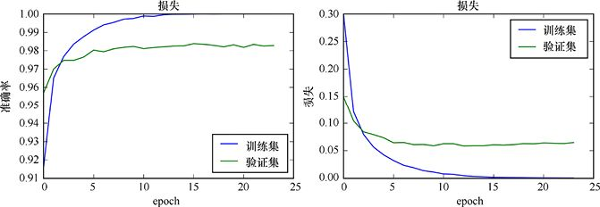

> **圖片描述：** 改進模型的準確率和損失曲線。左圖：訓練和驗證準確率隨epoch上升至約0.99。右圖：損失曲線，訓練損失趨近0，驗證損失約在0.10處趨於穩定。


圖23.32　及早停止運行的準確率和損失。請注意，驗證損失在大約第13個epoch左右穩定下來。我們設置的及早停止例程等待了另外10個epoch進行改善，然後在第23個epoch停止了訓練


我們正在監測的驗證損失似乎在大約第13個epoch左右停止改善。我們可以肯定的是，因為我們的及早停止回調在模型停止改善10個epoch之後起作用。驗證損失可能開始一點點上升，但是，當我們訓練了100個epoch之後，肯定能避免在圖23.31中看到的過擬合曲線的上升斜率。


通過試驗patience的值，我們可以將EarlyStopping( )例程的性能調整到適合網路和資料的值。正如我們前面提到的，我們總是可以使用及早停止演算法來代替它[ZFTurbo16]。


EarlyStopping( )是我們之前承諾的，在呼叫fit( )時為epochs選擇了錯誤的值的問題的解決方案。由於及早停止的存在，我們總是可以為epochs選擇一個非常大的數字，並讓電腦在適當的時間自動停止訓練。


## 參考資料


[Benenson16]　Rodrigo Benenson, *What is the class of this image?*, 2016.


[Bengio17]　Yoshua Bengio, *MILA and the future of Theano*, email thread on theano-users Google Group, September 28, 2017.


[Chollet17a]　François Chollet, *Keras Documentation*, 2017.


[Chollet17b]　François Chollet, *Deep Learning with Python*, Manning Publications, 2017.


[Chomsky57]　Noam Chomsky, *Syntactic Structures*, Mouton & Co., 1957.


[CNTK17]　Microsoft, *The Microsoft Cognitive Toolkit*, Microsoft Cognitive Toolkit, 2017.


[Devlin16]　Josh Devlin, *28 Jupyter Notebook tips, tricks, and short- cuts*, Dataquest.io, 2016.


[Dijkstra82]　Edsger W Dijkstra, *Why Numbering Should Start at 0*, August, 1982.


[Lorenzo17]　Baraldi Lorenzo, *VGG-16 pre-trained model for Keras*, Github, 2017.


[Gupta17]　Dishashree Gupta, *Transfer Learning and The Art of Using Pre-trained Models in Deep Learning*, Analytics Vidhya blog, 2017.


[HDF517]　The HDF5 Group, *What is HDF5?*, HDF Group Support Page, 2017.


[JetBrains17]　Jet Brains, *Pycharm Community Edition IDE*, 2017.


[JSON13]　JSON Contributors, *Introducing JSON*, ECMA-404 JSON Data Interchange Standard Working Group, 2013.


[Jupyter16]　The Jupyter team, 2016.


[Karpathy16]　Andrej Karpathy, *Transfer Learning*, Stanford CS 231 Course Notes, 2016.


[Kernighan78]　Brian W Kernighan and Dennis M Ritchie, *The C Programming Language (1st ed.)*, Prentice Hall, 1978.


[Khronos17]　The Khronos Group, *The open standard for parallel programming of heterogeneous systems*, Khronos Group Website, 2017.


[LeCun13]　Yann LeCun, Corinna Cortes, Christopher J.C. Burges, *The MNIST Database of Handwritten Digits*, 2013.


[NVIDIA17]　NVIDIA Corp, *CUDA Home Page*, NVIDIA Website, 2017.


[Ramalho16]　Luciano Ramalho, *Fluent Python*: Clear, Concise, and Effective Programming, O’Reilly Books, 2016.


[Sato17]　Kaz Sato, Cliff Young, and David Patterson, *An in-depth look at Google’s first Tensor Processing Unit (TPU)*, Google Cloud Big Data and Machine Learning Blog, 2017.


[TensorFlow16]　Martín Abadi, Ashish Agarwal, Paul Barham, Eugene Brevdo, Zhifeng Chen, Craig Citro, Greg S. Corrado, Andy Davis, Jeffrey Dean, Matthieu Devin, Sanjay Ghemawat, Ian Goodfellow, Andrew Harp, Geoffrey Irving, Michael Isard, Yangqing Jia, Rafal Jozefowicz, Lukasz Kaiser, Manjunath Kudlur, Josh Levenberg, Dan Mané, Rajat Monga, Sherry Moore, Derek Murray, Chris Olah, Mike Schuster, Jonathon Shlens, Benoit Steiner, Ilya Sutskever, Kunal Talwar, Paul Tucker, Vincent Vanhoucke, Vijay Vasudevan, Fernanda Viégas, Oriol Vinyals, Pete Warden, Martin Wattenberg, Martin Wicke, Yuan Yu, and Xiaoqiang Zheng, *TensorFlow: Large- scale machine learning on heterogeneous systems*, 2016.


[Theano16]　Theano Development Team, *Theano: A Python frame- work for fast computation of mathematical expressions*.


[Wentworth12]　Peter Wentworth, Jeffrey Elkner, Allen B Downey and Chris Meyers, *How to Think Like a Computer Scientist： Learning with Python 3*, Chapter 9: Tuples, 2012.


[Wikipedia17]　Wikipedia authors, *Iris Flower Data Set*, Wikipedia, 2017.


[YAML11]　YAML Contributors, *YAML Home Page*, 2017.


[ZFTurbo16]　ZFTurbo, *How to tell Keras stop training based on loss value?*, Stack Overflow, 2016.
