# 第24章　Keras第2部分


我們將擴展對Keras庫的討論，包括模型改進參數搜索以及如何搭建CNN和RNN模型。


## 24.1　為什麼這一章出現在這裡


在第23章中，我們介紹了Keras庫，並介紹瞭如何創建和訓練基本模型。


現在我們要進一步學習Keras。我們將看到如何改進我們的模型，並從scikit-learn庫中搜索例程（在第15章中討論過的），共同創建更復雜的模型，如CNN和RNN。


## 24.2　改進模型


我們已經探索了Keras使用兩層小型模型提供的許多特性。正如我們前面看到的，在僅僅經過20個epoch的訓練之後，這個模型能夠準確地對MNIST測試集中98%的圖像進行分類。


讓我們看看還能不能改進。我們如何才能創建一個更好的模型？


答案並不顯而易見。我們可以嘗試的選擇太多了，這讓它變得更加困難。儘管我們在第23章的早些時候已經對這些選擇很感興趣了，即使在這個非常簡單的模型中有一個隱藏的密集層，我們也已經做出了很多選擇，所有這些都影響著網路學習的好壞和速度。


雖然有時對模型的更改會帶來準確率上的巨大改進，但在大多時候，改進模型的性能是一個逐漸提高的過程。


### 24.2.1　超參數計數


在開始修改模型的超參數之前，讓我們更清楚地瞭解我們已經做了多少選擇。注意，我們沒有統計權重，因為這些權重不在我們的控制之下。我們只是在考慮所有可以在模型設計中做出不同選擇的地方。


我們使用的許多例程都採用了我們忽略的多個可選參數。在某種意義上，我們通過讓這些參數保持預設值來給它們賦值。我們統計時也將這些參數包含在內。


我們的兩個全連接層都有兩個參數：神經元的數量和激活函數。參考Keras文檔，至少還有7個我們可以合理試驗的參數。


然後是我們在編譯模型時所做的選擇。我們選擇了一個損失函數和一個最佳化器，這給了我們更多的選擇來調整。


考慮到我們選擇了Adam最佳化器，我們可以使用5個可選參數來最佳化它的表現。


最後，當我們呼叫fit()來訓練模型時，我們提供了許多選項。我們可以選擇批大小和epoch的數量（我們也可以說，如果使用及早停止，那麼epoch的數量並不重要，但是我們必須為演算法設置一個忍耐值），所以這裡至少有兩個參數。


因此，在選擇參數過程中，每個層上有9個選擇，2個層共有18個選擇，當我們編譯時有2個選擇，最佳化器有5個選擇，並且當我們訓練時至少有2個選擇。這個小模型總共有27個超參數。


當我們添加更多的層時，這個數字會快速增加。


弄清楚這些選擇的哪些變化將使模型變得更好是一項艱鉅的任務。想象一下，你坐在一個有27個滑動器、開關和旋鈕的控制面板前。然而這只是為了控制基本的性能，不包括其他選項的控制，比如調整學習率時間表。


我們可以設置控制，按下紅色的大按鈕來訓練網路，等待一段時間，最後看一下那些報告模型結果的數字。我們可以調整一個或多個選項，希望結果變得更好，然後重複這個過程。


問題的複雜性在於許多超參數間的相互作用。因此，如果我們增加一個參數的值，可能只會看到一個改進。但如果我們同時減小兩個或3個其他參數的值，並增加一個或兩個其他參數的值，將無法判斷哪些參數發揮了作用。


當我們想要改進幾十層甚至更大、層數更多的模型時，就變得更加困難了。選擇的數量和可能的組合會變得十分多。


這就是為什麼我們要在之前講這麼多章節的內容。改進模型性能的唯一機會是利用我們對網路正在做什麼、為什麼這樣做以及我們所有的選擇會做什麼的先驗知識。當我們理解了內部發生的事情，就有了從經驗中學習的機會，並培養我們的直覺，這對於創建龐大的深度學習網路是至關重要的。


雖然我們幾乎總是要做試驗，看看會發生什麼，但我們的知識和經驗創造了我們把事情做得更好的機會。


### 24.2.2　改變一個超參數


在各種各樣的試驗中，一個常見的規則是每次只改變一個變量，看看會發生什麼。如果所涉及的值基本上是**解耦**的，這是很好的，這意味著它們不會相互影響。例如，假設我們正在調整汽車收音機的聲音，提高或降低音量。即使將這些選擇的結果結合在一起，它們也是獨立的。換句話說，添加更多的高音並不會改變低音的傳輸量，反之亦然。


不幸的是，大多數真實系統和大多數深度學習系統的超參數並沒有解耦。如果我們增加超參數A的值，發現情況變好了，然後增加超參數B的值，此時可能會發現現在必須減小A的值才能取得進一步的進展。這些聯繫是複雜的。


但是，每次改變一個超參數通常是一個好的開始方法。我們可以探索這個值的作用，為它找到一個好的值，然後選擇另一個超參數進行調整，以此類推，通過每次微調一個超參數來尋找一個好的組合。如果必須回去，那麼我們對每個值的經驗可以幫助我們選擇再次調整哪個值，以及調整多少。我們還可以總結出一種某些值與其他哪些值相關的經驗，這樣就可以預測它們之間的聯繫。


現在讓我們試試，任意選擇批大小作為我們要試驗的第一個超參數。我們在前面說過，當我們使用GPU時，會選擇一個最適合特定硬體的批大小。但是在CPU上，我們可以選擇任何我們喜歡的值。我們使用的批大小為256，但就像我們最初選擇的27個超參數一樣，這只是瞎猜而已。讓我們試著上下調整這些值，看看可能會發生什麼。


圖24.1～圖24.4展示了將這個超參數分別設置為2048、512、64和8的結果。每次運行都使用相同的程式碼，只更改批大小。注意，從一個圖形到下一個圖形的垂直刻度是不一樣的。這樣允許我們可以顯示所有的資料，儘管這意味著我們不能對它們進行同等的比較。


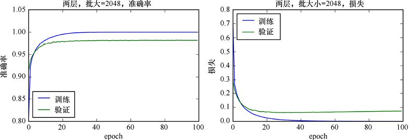

> **圖片描述：** 兩層模型（批大小2048）的訓練曲線。左圖：準確率隨epoch變化，藍線（訓練）趨近1.0，綠線（驗證）約0.98。右圖：損失隨epoch變化，兩線均快速下降後趨於穩定。


圖24.1　訓練批大小為2048的雙層模型


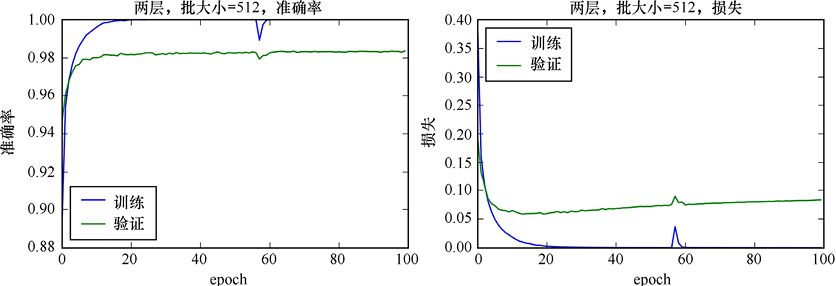

> **圖片描述：** 兩層模型（批大小512）的訓練曲線。左圖：準確率曲線，訓練接近1.0，驗證約0.98。右圖：損失曲線，訓練損失趨近0，驗證損失約0.06處穩定，顯示輕微過擬合。


圖24.2　訓練批大小為512的雙層模型


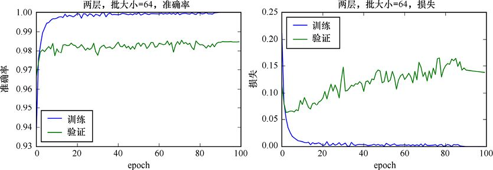

> **圖片描述：** 兩層模型（批大小64）的訓練曲線。左圖：準確率曲線較為震盪。右圖：損失曲線，訓練損失波動較大但趨近0，驗證損失維持在0.10左右，過擬合程度增加。


圖24.3　訓練批大小為64的雙層模型


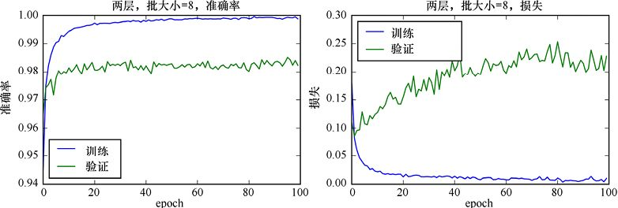

> **圖片描述：** 兩層模型（批大小8）的訓練曲線。左圖：準確率曲線波動明顯。右圖：損失曲線波動最大，顯示小批次帶來的不穩定性。


圖24.4　訓練批大小為8的雙層模型


從這些圖中可以看出3件事。


首先，隨著批大小的減小，結果中的噪聲情況變得更加嚴重。這是因為每個新的更新都使用更少的樣本，因此它會響應該批中的任何內容。更大的批往往更能代表整個資料集，給我們更平滑的結果。較小的批則會帶來較多**噪聲**的結果。


其次，所有模型的訓練準確率都在98%左右，所以批大小對準確率影響不大。


最後，儘管所有的模型都是過擬合的，正如發散訓練和驗證損失所證明的那樣，隨著批大小的減小，訓練和驗證誤差的發散會增加。換句話說，過擬合的數量增加了。


更小的批意味著epochs需要更長的時間，因為我們需要執行backprop並更頻繁地更新權重。圖24.5展示了批大小與批大小的運行時間（以秒為單位）的曲線。


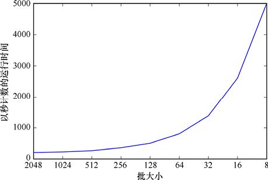

> **圖片描述：** 批大小與訓練時間的關係圖。x軸為批大小（2048到8，非線性刻度），y軸為以秒計的運行時間。曲線從左到右急劇上升，表明小批次需要更多計算時間。


圖24.5　試驗所獲得的計時結果(在2014年末推出的iMac上，運行時間以秒為單位)，其資料如圖24.1～圖24.4所示，以及其他中間批大小。注意，垂直刻度是線性的，而水平刻度不是


圖24.5中的曲線證實了只在這些CPU上運行的情況下，隨著批大小的減小，我們運行了更多的backprop和update步驟，所以總的訓練時間增加了。


上面的試驗告訴我們批大小如何對這個模型資料集的訓練產生影響。該試驗還表明，對於這個模型和資料，較大的批比較小的更可取。


### 24.2.3　其他改進方法


當我們試圖改進一個模型時，請記住，我們不太可能找到最適合我們所追求的訓練速度和準確率的一組參數。但是，我們可以尋找足夠接近的參數。


在搜索的每一步中都有一個目標也很有幫助。我們可能希望減少過擬合，或降低測試損失，或提高測試準確率，或加快訓練時間，或訓練資料大小最佳匹配GPU，或使用最少的電腦記憶體，等等。但我們不太可能同時改善所有這些目標。


所以我們通常只挑選一到兩件事情來改進，然後修改一些變量直到它們達到我們能實作的最好的程度。然後我們再看另一組標準，尋找有助於解決這些問題的變量，等等。


對於MNIST問題，我們的目標是提高準確率，同時減少過擬合。


與其繼續調整超參數，不如嘗試一些完全不同的方法：添加第二個全連接層。


為了保持與本章前面的模型的可比性，我們將返回到256的批大小，而不考慮及早停止。


### 24.2.4　再增加一個全連接層


讓我們添加第二個全連接層（隱藏層），和第一個一樣大。畢竟，擁有更多的神經元意味著更強的學習能力，對吧?


不完全是這樣。我們已經看到，單層模型已經非常勝任學習訓練資料中的特性。這就是為什麼它過擬合了。如果我們在不做任何其他結構改變的情況下再加入更多的神經元，那麼這種過擬合會變得更糟、更快。


讓我們試試看。


圖24.6展示了一個模型的結構，該模型有兩個全連接層（隱藏層），每個層的神經元數量與輸入元素的數量相同（即每個層有784個神經元），然後是一個有10個神經元的softmax輸出層。


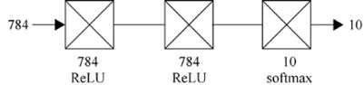

> **圖片描述：** 三層全連接模型的架構圖。輸入784個值，經過兩個隱藏層（各784個神經元，ReLU），最後輸出層（10個神經元，softmax），以圖形符號表示。


圖24.6　3層模型的結構。每個隱藏層都是一個全連接層，有784個神經元，每個神經元對應一個輸入。雖然我們的慣例是全連接層預設具有ReLU激活函數，但為了完整性，我們在這裡顯式地列出了它


我們可以在Keras中創建這個模型，只需在模型生成例程中添加一行程式碼，就可以創建第二個全連接層。這一行看起來和上面的一行一樣，只是我們不包括input_shape參數，因為它只被模型中的第一層使用。清單24.1展示了程式碼。


**清單24.1　**創建和編譯與第23章相同的模型，但是其中有兩個相同的密集層。


```
def make_two_hidden_layers_model():
    model = Sequential()
    model.add(Dense(number_of_pixels,
                    input_shape=[number_of_pixels],
                    activation=′relu′))
*# add layers*
model.add(Dense(number_of_pixels, activation=′relu′))
model.add(Dense(number_of_classes, activation=′softmax′))
model.compile(loss=′categorical_crossentropy′,
            optimizer=′adam′,
                metrics=[′accuracy′])
return model
```


圖24.7展示了學習超過100個epoch的訓練集和驗證集的準確率和損失（我們沒有使用及早停止）。


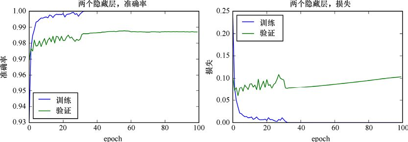

> **圖片描述：** 雙層模型的準確率和損失曲線。左圖：訓練和驗證準確率隨epoch上升。右圖：訓練損失趨近0，驗證損失約0.10趨穩。


圖24.7　雙層模型的準確率和損失隨epoch的變化曲線


與之前的結果相比，新的曲線在開始的時候更加彎曲，這表明更大的網路需要更長的時間才能穩定下來。正如我們所懷疑的那樣，系統和以前一樣過擬合訓練資料，但它過擬合得更快，導致驗證損失比以前回升得更快。在第23章中，我們看到，在最初的下降之後，驗證損失在100個epoch內從大約0.06上升到大約0.09。現在驗證損失超過0.10，而且還在上升。正如預期的那樣，該系統的過擬合更快。


所以在這個問題上投入更多的神經元並不能讓一切變得更好。驗證準確率提高了一點，但損失看起來更糟，我們仍然嚴重過擬合。


### 24.2.5　少即是多


有太多的神經元會使神經網路過於強大。它有足夠的能力來完成這項任務，所以它利用它的額外能力從訓練集中提取越來越多的特殊細節，從而使自己過擬合。


我們通常想要利用最小的、最簡單的網路來得到我們想要的結果。一個簡單的網路，不僅訓練和預測速度更快，而且不容易過擬合，因為它沒有多餘的計算能力被訓練資料中無關的細節分心。


讓我們回到單全連接層，但要把它變得小得多，只有64個神經元。這大概是每12個輸入元素對應一個神經元。新的結構如圖24.8所示。


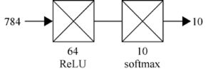

> **圖片描述：** 64神經元隱藏層的兩層模型架構圖。輸入784，隱藏層64個神經元（ReLU），輸出層10個神經元（softmax）。


圖24.8　一個新的雙層模型，在第一個全連接層（隱藏層）中，我們只使用了64個神經元


我們只需要改變定義這個層的那一行就可以給它64個神經元而不是784個。清單24.2展示了這次更改。


**清單24.2　**創建一個模型，其中第一個（也是唯一一個）隱藏層只有64個神經元。


```
def make_smaller_one_hidden_layer_model():
    model = Sequential()
    model.add(Dense(64, input_shape=[number_of_pixels],
                    activation=′relu′))
    model.add(Dense(number_of_classes, activation=′softmax′))
    model.compile(loss=′categorical_crossentropy′,
                  optimizer=′adam′,
                  metrics=[′accuracy′])
    return model
```


100個epoch的準確率和損失結果如圖24.9所示。


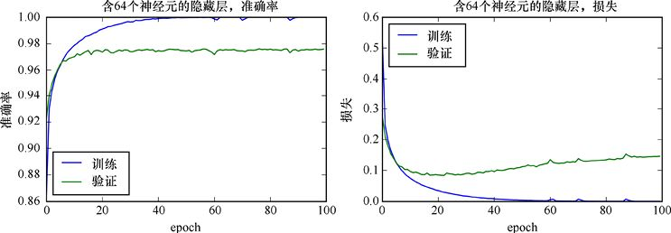

> **圖片描述：** 圖24.8中64神經元模型的訓練曲線。準確率和損失的變化趨勢。


圖24.9　圖24.8中模型的準確率和損失


這個神經網路的準確率比第一層有784個神經元的神經網路略低，但即便如此，它仍然是過擬合的。要做什麼嗎?現在試著用24.2.4節介紹的想法，用兩個隱藏層而不是一個，但我們會保持相同數量的神經元，並將它們平均分開。換句話說，我們將有兩個隱藏層，每個層有32個神經元，如圖24.10所示。


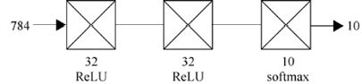

> **圖片描述：** 三層模型架構圖。輸入784，兩個隱藏層各32個神經元（ReLU），輸出層10個神經元（softmax）。


圖24.10　更深的3層模型。我們將之前模型中含64個神經元的隱藏層分割成兩個獨立的、密集的32個神經元的隱藏層


100個epoch訓練的準確率和損失結果如圖24.11所示。


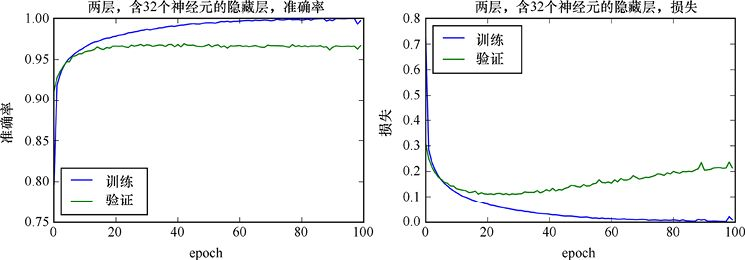

> **圖片描述：** 三層32神經元模型的訓練曲線。準確率和損失的變化。


圖24.11　圖24.10中模型的準確率和損失


在100個epoch後，圖24.10所示模型的驗證準確率從圖24.8所示模型的大約97.5%下降到了大約97%。損失也增加了，我們似乎比以前更快地過擬合了。


我們已經後退了一步。雖然是一小步，但測量結果更糟，而且仍然過擬合。


雖然將層分割成多個小塊有時可以工作，但是在這個例子中它並沒有幫助我們很多。


事情往往是這樣的：我們試著做不同的選擇，選擇那些有用的想法，把那些不能讓結果變得更好的想法放在一邊。


在我們放棄這兩個小層之前，讓我們看看是否可以嘗試另一個技巧來控制過擬合。


### 24.2.6　添加dropout


因為對於這個模型和資料來說，過擬合是一個問題，所以讓我們嘗試使用dropout。正如我們在第20章中所討論的，這是一種明確設計用於解決過擬合問題的正則化技術。dropout在每個epoch訓練之前暫時刪除隨機選擇的部分神經元，並在最後把它們放回原處。直覺告訴我們，按照這種方法神經元將不太可能特殊化（以及潛在的過度專門化），因為它們都需要能夠補償隨機缺失的神經元。


為了在Keras中應用dropout，我們創建了一個新的dropout**層**，並將其添加到不斷增長的網路中，就放在我們想要刪除一些節點的層之後。當使用dropout時，被隨機選擇的神經元在一個epoch內都與網路隔離，因此它對預測沒有幫助，也不知道什麼時候網路的權重被更新。當epoch結束時，神經元恢復，在下一個epoch之前，一個新的隨機神經元集合被斷開。


dropout被當作一個層包含在其中，可能看起來有點奇怪。它沒有任何神經元，也不參與反向傳播或計算，那它怎麼可能是一個層呢？稱其為層實際上只是一個概念。我們不僅想要將其應用於全連接層，還想應用於其他類型的層，比如卷積層和循環層，我們會在本章後面講到。Keras沒有在每個層中創建dropout，而是讓我們指定這種“資訊”層，它不做任何計算，但會告訴Keras我們想讓它做的事情。把像dropout這樣的操作看作由它們自己的層實作的，這使我們能夠保持模型的概念性視圖簡單和乾淨。我們有一大堆層。有些層有神經元，有些層對其他層或資料執行操作。


在這種情況下，dropout層對Keras“說”：“將dropout應用到前一層。”例如，在這個dropout層之前有3個全連接層，只有最近的一個受到影響。如果我們想要對所有3個全連接層應用dropout，就必須對每個層分別使用它自己的dropout層。


Keras中的dropout層只接收一個參數，而且是強制的。它是一個介於0和1之間的浮點數，用來描述每批神經元被臨時移除的百分比。0表示禁用dropout，而1表示使前一層完全消失。最初關於dropout的論文的作者建議的值是0.2，這通常是一個很好的初始值[Srivastava14]。


該論文的作者還建議在全連接層上限制權重的總大小，因為這一層的權重會受到dropout的影響。一般來說，人們擔心的是，當一些節點被移除時，其他節點可能會通過將權重調高來過度補償。在不涉及數學的情況下，我們可以採納他們的建議，在將經過dropout的全連接層上設置一個可選的參數。該參數稱為kernel_constraint，上面引用的論文的作者的建議是將它設置為3，所以我們將這樣做。我們只需要將這個選項添加到全連接層中，這些層將應用dropout，如清單24.3所示。


帶dropout的兩層模型的完整模型說明如圖24.12所示。這裡我們將dropout應用到兩個隱藏層。


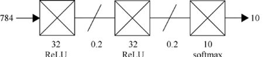

> **圖片描述：** 帶dropout的三層模型架構圖。每個全連接隱藏層後都有dropout層（斜線符號），以減緩過擬合。


圖24.12　我們將更改圖24.10中的模型，在每個隱藏層（全連接層）之後添加dropout層。在這裡， 我們使用的dropout符號是：連接兩個層的線上的斜槓。每個dropout層應用到它前面的層


在圖24.12中，我們展示了一個dropout層的示意圖符號。它是一條斜線，穿過傳輸資料的線，來表明一些資料被刪除。


製作這個模型的程式碼如清單24.3所示。這段程式碼中出現了一些新的東西。


**清單24.3　**兩個由32個神經元組成的全連接層後面都是dropout層。我們使用dropout的參數為0.2。我們還在全連接層中設置了kernel_constraint。


```
from keras.layers import Dropout
from keras.constraints import maxnorm
def two_layers_with_dropout_model():
    model = Sequential()
    model.add(Dense(32, input_shape=[number_of_pixels],
                activation=′relu′,
                kernel_constraint=maxnorm(3)))
    model.add(Dropout(0.2))
    model.add(Dense(32,
                activation=′relu′,
                kernel_constraint=maxnorm(3)))
    model.add(Dropout(0.2))
    model.add(Dense(number_of_classes, activation=′softmax′))
    *# compile the model to turn it from specification to code*
    model.compile(loss=′categorical_crossentropy′,
                  optimizer=′adam′,
                  metrics=[′accuracy′])
    return model

model = two_layers_with_dropout_model()
```


首先，我們要添加dropout層。參數0.2是用來告訴層，使用dropout的提出者建議的20%的dropout率。


正如我們上面提到的，關於dropout的原始論文也建議在經過dropout的層上設置一個權重限制條件，這個建議得到了廣泛的遵循。在清單24.3中，我們通過將可選參數kernel_constraint添加到每個受dropout影響的層的參數列表中，並將該參數的值設置為maxnorm(3)（注意，為了使用它，我們必須導入maxnorm()來實作這一點）。這個步驟背後的思想，解釋了maxnorm()正在做什麼，這在最初的論文[Srivastava14]中得到了解釋。我們可以把它看作一種用來防止權重值變大的機制。


將該模型訓練100個epoch，結果如圖24.13所示。


我們克服了過擬合問題！損失曲線不再發散。dropout為我們做了一件偉大的工作。


準確率有點奇怪，因為我們在驗證資料上的準確率要比訓練資料高。驗證的準確率似乎也受到了一些打擊，因為它還沒有達到以前的98.3%。我們也許可以通過降低dropout率來提高準確率，或者在全連接層上增加一些神經元。


關於dropout的論文還建議我們使用10～100倍的學習率來配置最佳化器。我們可以告訴Adam通過設置它的可選參數lr（小寫字母l後面跟著小寫字母r，表示“學習率”）來初始化任何特定的學習率。此值預設為0.001。


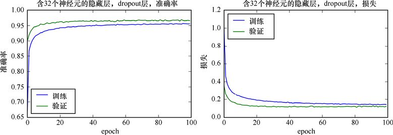

> **圖片描述：** 帶dropout和32神經元的模型訓練曲線。左圖：準確率約0.96。右圖：損失曲線，訓練和驗證損失較為接近，顯示dropout有效減少過擬合。


圖24.13　圖24.12中模型的準確率和損失


為了將這個參數傳遞給Adam，我們必須像前面一樣創建一個Adam對象，並將我們的新值傳遞給學習率參數。清單24.4展示瞭如何將初始學習率設置為0.1。這將替換以前呼叫model. compile()的那一行。


**清單24.4　**在編譯時，我們可以提供自己的最佳化器對象，而不是依賴於預設值。在這裡用我們自己選擇的學習率創建了一個Adam對象。


```
from keras.optimizers import Adam

*# make our own Adam object*
adam_optimizer = Adam(lr=0.1)

*# optimizer gets our object, rather than a string*
model.compile(loss=′categorical_crossentropy′,
              optimizer=adam_optimizer, metrics=[′accuracy′])
```


清單24.5展示了一種更簡單的編寫方法，其中我們創建Adam對象並對其進行分配，而不需要用臨時變量來保存它。


**清單24.5　**我們不需要將新的Adam對象存儲在它自己的變量中。這種更精簡的方法更常見。


```
model.compile(loss=′categorical_crossentropy′,
              optimizer=Adam(lr=0.1),
              metrics=[′accuracy′])
```


圖24.14展示了令人驚訝的結果。


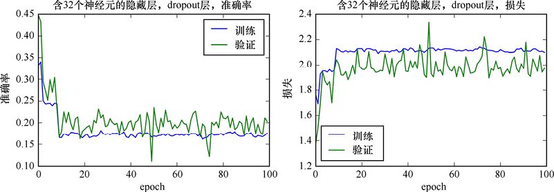

> **圖片描述：** Adam學習率0.1時dropout模型的訓練曲線。曲線可能不穩定，顯示學習率過大的效果。


圖24.14　當我們將Adam的初始學習率設為0.1時，模型在dropout情況下的準確率和損失


哇，這些圖看起來糟透了。


對於這個資料和模型結構，以0.1的學習率開始Adam的學習太激進了。訓練的準確率驟降到0.18左右，這太可怕了。驗證的準確率似乎在0.2左右徘徊，但它有很多**噪聲**。損失也很糟，比以前糟糕10倍多。


如果將學習率降低到0.01，我們會得到更好的性能，如圖24.15所示。


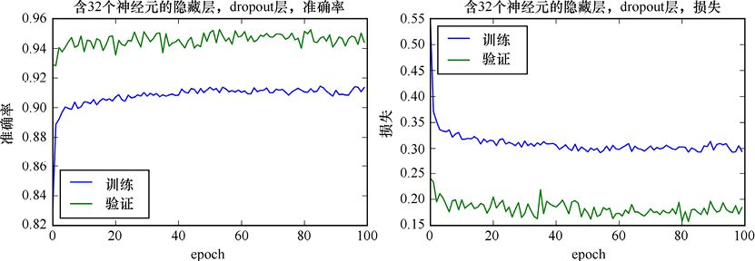

> **圖片描述：** Adam學習率0.01時dropout模型的訓練曲線。


圖24.15　dropout模型的準確率和損失，Adam的初始學習率設置為0.01


這些結果並不像我們採用預設的0.001學習率時那麼好，但是值得一試。現在看起來要好得多，我們的準確率都在90%以上。並且我們還沒有過擬合。


我們可以嘗試各種不同的學習率來看看什麼值對這個模型和資料最有效，但那將需要大量的輸入和等待。


如果我們能讓搜索自動化就太好了，這樣電腦就能在我們做其他事情的同時，為我們測試各種學習率。在24.3節中，我們將看到如何使用scikit-learn中的工具來完成這項工作。


### 24.2.7　觀察


我們才剛剛開始調試和改進模型。修改一個像這樣的實用模型來尋找最好的結果是很花費時間的，但它磨鍊了我們的直覺，並且可以幫助指導我們在未來碰到其他更大的資料庫和模型時做出更好的選擇。


在這種情況下，說“這個練習留給讀者”是完全合適的。坐下來研究一個深度學習模型，調整它的結構和超參數，以瞭解模型在資料上的行為，這是無法替代的。


當使用實際部署在現實世界中的模型時，我們希望能夠開發出性能最好的模型。當模型變得如此之大，以至於需要幾天（甚至幾周）的時間來訓練時，對可能起作用的部分有一個很好的認識是很重要的。因為它讓我們開始時離終點線更近，而不是隨便組裝一個模型。即使我們將參數搜索自動化，但仍然希望能將搜索集中在最值得搜索的地方。


我們發現，對於這些資料來說，一個巨大的全連接隱藏層是多餘的。它幾乎立刻就開始過擬合，訓練的準確率也下降了。更糟糕的是，訓練損失在穩步上升，最終導致訓練準確率下降。我們在這個問題上投入了太多的計算資源，系統利用這些資源進行過擬合，即使在訓練資料具有完美的準確率之後，它也對訓練資料的特性瞭解得太多。


通過顯著減小層的大小，我們避免了過擬合，但是準確率下降了。


然後通過將單層分解成兩部分，並添加dropout，我們的性能得到了提升，並停止了過擬合。


還有其他的許多東西需要嘗試。使用更多的層總是值得考慮的。也許每一層都比之前的一層小一點，會迫使系統尋找更大的模式。或者我們可以在兩個較大的層之間設置一個小的“扼流”層。我們可以嘗試只對某些層應用dropout，或者更激進地應用它（也就是說，增加我們正在抑制的神經元的數量）。


## 24.3　使用scikit-learn


到目前為止，我們一直在手動搜索超參數。它很有啟發性，但也需要大量的人工工作。


我們在第15章中看到，scikit-learn庫提供了一些例程來交叉驗證我們的模型（以評估它有多好），並對它的超參數進行網格搜索（以找到性能最好的組合）。


Keras並沒有直接提供這兩種工具中的任何一種，因為它提供了一種方法來使用已經存在於scikit-learn中的工具。


讓我們暫停一下，考慮一下我們可能需要從這些工具中得到什麼。如果一個模型需要3個小時來訓練，那麼使用10折的交叉驗證需要10倍的時間，即30個小時。如果我們進行網格搜索，比如3個超參數，每個超參數都有5個值（這不是一個非常大的搜索），那麼需要125倍的時間，也就是超過5個月!


有什麼辦法可以縮短這個時間嗎?


一種流行的方法是提取資料集的一小部分，仔細選擇它們以代表整個資料集，然後進行搜索。這樣每次訓練的運行速度會快得多。


通過對這些小型代理資料庫中的一個或多個進行交叉驗證和網格搜索，我們可以得到一些關於哪些模型和超參數值得在更大範圍內進行探索的指導。然後，我們就可以利用這些知識，處理越來越大的資料集，在每個步驟中調優超參數。我們的希望是，可以得到一組很好的超參數，使我們在訓練完整的資料庫時，只需要進行少量搜索，甚至根本不需要搜索。


### 24.3.1　Keras包裝器


直接在Keras模型上使用scikit-learn的交叉驗證和網格搜索工具是很好的。但是，Keras是一個位於scikit-learn“頂端”的庫。這意味著scikit-learn對Keras及其模型一無所知。但這也意味著Keras知道了關於scikit-learn的所有東西。


特別是，Keras知道scikit-learn如何期望它的評估器的行為。有了這個，Keras就可以把它的一個模型“打扮”得像一個scikit-learn的評估器，來彌合差距。


這種偽裝讓我們可以將Keras模型放入scikit-learn中，然後進行交叉驗證、網格搜索或任何其他我們喜歡的操作。從scikit-learn的角度來看，這個對象只是一些我們編寫並提供給它的定製評估器。它不知道里面隱藏著一個很深的網路。


我們通過將Keras模型嵌入KerasClassifier或KerasRegressor類型的對象中來實作這個技巧，這取決於它的作用。這些對象稱為**包裝器**（wrapper），因為它們“包裝”了Keras模型，使其外觀和行為都像一個scikit-learn的評估器。我們不需要以任何方式修改網路來包裝它。我們只需要創建一個包裝器對象，將網路放入其中，就完成了。


由於這兩個包裝器的工作原理相同，我們將選擇KerasClassifier作為示例，以便繼續使用我們到目前為止所討論的MNIST分類器。


我們不會把模型交給包裝器函數。相反，我們將交給包裝器一個創建模型的函數名稱。當我們思考這個問題時，這是有道理的。例如，搜索過程可能會創建具有不同超參數的模型的許多版本。如果我們給它一個創建和編譯的模型，就讓它沒有辦法制作不同的版本。通過給它一個創建模型的函數，搜索程式可以呼叫這個函數，並根據它的需要來設置各種參數。


包裝器創建者的其他參數是傳遞過來的參數。有些傳給了模型製作函數，有些則被傳給了scikit-learn。


讓我們從模型製作函數開始。


這個參數名為build_fn，是“創建函數”的縮寫。它的值是我們編寫的一個函數，它將創建、編譯並返回Keras模型，就像我們在清單24.3中看到的一樣。在清單24.3中，函數two_layers_with_dropout_model()創建、編譯並返回模型。


還有一些高級選項，但通常我們在程式碼中為這個參數指定一個函數的名稱，例如two_layers_ with_dropout_model。注意，這裡省略了括號，因為我們沒有呼叫函數，而只是提供了它的名稱。通常我們會用參數來實例化這個函數。


例如，我們可能會在前兩層尋找最優的神經元數量。當我們創建模型的時候用這些數字作為參數。


如前所述，當需要創建模型時，scikit-learn會自動呼叫這個模型製作函數。當我們進行網格搜索時，模型通常會在搜索的每一個新步驟開始時被創建。


我們有模型製作函數，它接收參數、包裝器以及scikit-learn，它會呼叫我們的函數。我們如何讓scikit-learn在呼叫模型製作函數時包含我們想要的參數?


幸運的是，這個機制很簡單。訣竅在於我們的參數的命名。回想一下第15章，當我們使用scikit-learn創建搜索時，我們為它提供了一個字典，它將我們希望它搜索的每個參數作為鍵一樣命名，並對鍵值進行搜索。然後，Python可以將這些字典名稱與它呼叫的函數中的參數名稱進行匹配。


在有包裝器的情況下，事情就變得更簡單了。由於Python能夠“知道”函數中的參數名，我們甚至不需要字典。我們可以只命名要賦值的參數，以及我們希望它們具有的值。


例如，如果模型製作函數使用一個參數來控制它所生成的神經元的數量（可能稱為number_ of_neuron），那麼我們可以使用一個值將其放入包裝器的參數列表中，就像在呼叫函數時為它賦值一樣。在模型製作函數中，任何與包裝器製作步驟中的參數名稱匹配的參數都將被賦值。


為了看到實際情況中怎樣使用包裝器，讓我們從一個接收參數的模型製作函數開始。清單24.6展示了一個示例，它基於我們之前導入和處理MNIST資料的程式碼創建。


**清單24.6　**模型製作函數make_model()接收4個可選參數。兩個是整數，一個是浮點數，一個是字符串。它按照我們的要求創建儘可能多的全連接層，在每個層後面都添加一個dropout層。


```
def make_model(number_of_layers=2, neurons_per_layer=32,
               dropout_ratio=0.2, optimizer=′adam′):
    model = Sequential()
    *　*
    *# first layer is special, because it sets input_shape*
    model.add(Dense(neurons_per_layer,
            input_shape=[number_of_pixels],
            activation=′relu′, kernel_constraint=maxnorm(3)))
    model.add(Dropout(dropout_ratio))
    *# now add in all the rest of the dense-dropout layers*

    for i in range(number_of_layers-1):
        model.add(Dense(neurons_per_layer,
                        activation=′relu′,
                        kernel_constraint=maxnorm(3)))
    model.add(Dropout(dropout_ratio))

    *# finish up with a softmax layer with 10 outputs*
    model.add(Dense(number_of_classes, activation=′softmax′))

    *# compile the model and return it*
    model.compile(loss=′categorical_crossentropy′,
                  optimizer=optimizer, metrics=[′accuracy′])
    return model
```


清單24.7展示瞭如何將參數傳遞給新的make_model()函數，該函數接收參數。有一些方法可以使程式碼更短（例如使用Python的**kwargs技術），但與往常一樣，我們選擇了清晰而不是簡潔的方法。


**清單24.7　**我們在KerasClassifier中包裝make_model()，併為創建模型和控制scikit-learn的訓練過程所需的所有變量賦預設值。當scikit-learn呼叫make_model()時，它將為函數的參數賦予我們在創建KerasClassifier時提供的值。


```
from keras.wrappers.scikit_learn import KerasClassifier
kc_model = KerasClassifier(build_fn=make_model,
               *# parameters for the model-making function*
               number_of_layers=2, neurons_per_layer=32,
               optimizer = ′adam′,
               *# parameters for scikit-learn*
               epochs=100, batch_size=256, verbose=0)
```


實際上，包裝器只接收我們提供給它的值，並將它們傳遞給同名的模型製作函數參數。語法有點混亂，因為KerasClassifier本身似乎接收了這些參數，但這是一種不遵循通用規則的另類Python使用。


將包裝對象分配給稱為model的變量是一種慣例，但這可能與更典型的使用model來表示正常的或未包裝的神經網路混淆。為了強調這不是一個簡單的Keras模型，我們將其稱為kc_model以表示“Keras分類器模型”。通過這種方式，我們可以描述包裝對象（kc_model）和使用build_fn函數創建的模型，並繼續將其簡單地稱為“模型”。


如果我們把kc_model交給scikit-learn進行交叉驗證，make_model()會被呼叫並將值2 傳遞給number_of_layers，將值32傳給neurons_per_layer，將字符串“adam”傳給最佳化器，就像我們會自己分配預設值一樣。因為我們沒有給KerasClassifier 的dropout_ratio賦值，它不指定任何參數的值，所以make_model()將使用其預設值的參數。


如果我們使用kc_model進行網格搜索，那麼當呼叫函數來製作模型時，搜索器可以將自己的值分配給這些參數中的任何一個。任何我們沒有顯式重新分配的參數都將在製作包裝器時使用指定的預設值。


KerasClassifier()的最後3個參數（epochs、batch_size和verbose）不是給模型的，而是給scikit-learn的。它們被傳遞給交叉驗證器的fit()例程以控制訓練過程。


除了為fit()提供參數外，我們還可以命名傳遞給predict()、predict_proba()和score()的參數，以便在呼叫這些函數時使用。


只要我們保持所有的參數名不同，Python就會正確地將所需的值傳遞給交叉驗證和網格搜索中涉及的每個函數。


這是一個靈活的系統。例如，這意味著我們可以在搜索網格時調整batch_size的值，或者通過搜索嘗試不同的number_of_neurons值來調整網路的大小，或者通過嘗試optimizer_choice中不同的字符串來調整最佳化器。


要記住的關鍵一點是，包裝器基本上是記住模型製作函數中的參數應該使用哪些值，預設情況下它將使用這些值。它還能記住一些傳遞給scikit-learn的值。只要我們在包裝器中指定的名稱與模型製作例程中的名稱匹配，所有東西都會自動匹配。


### 24.3.2　交叉驗證


現在使用Keras包裝器對我們最近的3層深度學習系統（如圖24.12和清單24.3所示）進行交叉驗證，其中有兩個分別包含32個神經元的全連接層（每個層都有dropout）和一個包含10個神經元的全連接輸出層。


應用交叉驗證似乎毫無意義。畢竟，我們已經有了一個優秀的大型測試集。通過使用驗證資料，我們還能從交叉驗證中學到什麼新的東西呢?


在這種情況下，能學到的新東西並不多。我們應該期望交叉驗證的結果與上面看到的非常接近。


但是，擁有我們自己的高質量訓練集和資料集是一種我們不能總是依賴的“奢侈品”。因為有時可能沒有驗證集，有時我們有驗證集，但不確定它是否很好。例如，給定一副新的牌，不考慮任何小丑或其他紙牌，新紙牌的一種典型排列是從紅桃A到紅桃K，然後是梅花A到梅花K，然後是方塊和黑桃。這稱為“新牌順序”[Cain13]。假設有人打開一副新牌，拿走了底部的25%，稱之為驗證資料。這組被拿走的牌絕對不能代表其他牌，因為它沒有任何花色的紅牌，剩下的牌也沒有黑桃。


當我們使用原始資料集的小版本時是驗證集的另一個挑戰。如果這個資料集很小，就像我們在第8章看到的那樣，交叉驗證是一種很好的評估方法，而不需要通過專門的驗證集使訓練集變得更小。


因此，儘管MNIST的資料為我們提供了一個很好的驗證集，但我們會假設事實並非如此，所以我們可以看到如何在一般情況下評估訓練模型的質量問題。


我們將首先做一些簡單但不完整的事情，只是為了對這個過程有一個感覺。然後我們將添加缺失的步驟。


交叉驗證需要訓練，然後用稍微不同的資料反覆驗證整個模型。我們將使用10折交叉驗證，因此交叉驗證器的每次驗證花費的時間將是本章前面的訓練過程的10倍。


我們開始吧，因為它幾乎什麼都沒有。我們將製作模型，然後使用scikit-learn進行交叉驗證，如第15章所示。


如上所述，我們將重複清單24.7的模型，並使用包含32個神經元的兩層網路，每層都有dropout。我們將繼續使用預設的Adam最佳化器，不過我們可以像以前一樣創建自己的Adam對象，並在這裡使用它。


為了製作模型，我們將使用在清單24.6中提供的通用模型製作例程make_model()，這些參數構成了我們想要的網路。


在清單24.8中，我們使用新的例程make_model()創建了KerasClassifier的包裝器。我們給出了兩個與make_model()中的參數匹配的參數（number_of_layers和neurons_per_layer），因此它們將在模型創建時傳入。我們還設置了在呼叫fit()時需要提供的參數（optimizer、epochs、batch_size和verbose）。現在kc_model可以像其他任何評估器一樣在scikit-learn中使用。


**清單24.8　**將模型放入Keras包裝器中。


```
kc_model = KerasClassifier(build_fn=make_model,
                           number_of_layers=2,
                           neurons_per_layer=32,
                           optimizer=′adam′,
                           epochs=100, batch_size=256, verbose=0)
```


在我們做這個之前，有幾個細節需要注意。


一個問題是scikit-learn的交叉驗證函數cross_val_score()不需要標籤資料的獨熱編碼版本。它需要包含整數列表的原始版本。碰巧的是，我們一直在把原始標籤保存在它們自己的變量中，所以我們有了例程需要的東西。


另一個問題與我們傳遞給交叉驗證系統的資料有關。正如我們之前所做的那樣，我們只是假裝沒有驗證集，並將訓練資料視為整個資料集。我們將讓交叉驗證器為我們管理訓練驗證部分。


現在讓我們開始交叉驗證。有兩個任務要執行。首先，我們將創建驅動交叉驗證過程的對象。讓我們使用“老朋友”StratifiedKFold()（見第15章）將資料分成10份。我們將資料洗牌，並將可選的random_state變量設置為我們已有的random_seed值。這對調試很有用。


我們可以使用清單24.9來創建StratifiedKFold對象。


**清單24.9　**創建將構建交叉驗證訓練和測試集的StratifiedKFold對象。


```
from sklearn.model_selection import StratifiedKFold

kfold = StratifiedKFold(n_splits=10, shuffle=True,
                        random_state=random_seed)
```


現在我們準備開始了。使用與我們在第15章看到的相同的技術，我們只是讓scikit-learn運行交叉驗證器，並通過使用模型、訓練資料、原始標籤以及StratifiedKFold對象呼叫cross_val_score()來記錄分數，如清單24.10所示。


**清單24.10　**使用包裝器中的Keras模型kc_model，在scikit-learn中運行交叉驗證。


```
from sklearn.model_selection import cross_val_score

results = cross_val_score(kc_model, X_train, original_y_train,
                          cv=kfold, verbose=0)
```


將它們放在一起，我們得到清單24.11。


**清單24.11　**使用MNIST資料進行交叉驗證。


```
from keras.datasets import mnist
from keras.models import Sequential
from keras.layers import Dense
from keras.layers import Dropout
from keras.constraints import maxnorm
from keras import backend as keras_backend
from keras.utils import np_utils
from keras.models import load_model
from keras.wrappers.scikit_learn import KerasClassifier
from sklearn.model_selection import StratifiedKFold
from sklearn.model_selection import cross_val_score
import numpy as np
random_seed = 42
np.random.seed(random_seed)

*# load MNIST data and save sizes*
(X_train, y_train), (X_test, y_test) = mnist.load_data()
image_height = X_train.shape[1]
image_width = X_train.shape[2]
number_of_pixels = image_height * image_width

*# convert to floating-point*
X_train = keras_backend.cast_to_floatx(X_train)
X_test = keras_backend.cast_to_floatx(X_test)
# scale data to range [0, 1]
X_train /= 255.0
X_test /= 255.0

*# save y_train and y_test for use when cross-validating*
original_y_train = y_train
original_y_test = y_test

*# replace label data with one-hot encoded versions*
number_of_classes = 1 + max(np.append(y_train, y_test))
y_train = to_categorical(y_train, num_classes=number_of_classes)
y_test = to_categorical(y_test, num_classes=number_of_classes)

*# reshape samples to 2D grid, one line per image*
X_train = X_train.reshape(X_train.shape[0], number_of_pixels)
X_test = X_test.reshape(X_test.shape[0], number_of_pixels)

def make_model(number_of_layers=2, neurons_per_layer=32,
               dropout_ratio=0.2, optimizer=′adam′):
    model = Sequential()
    *# first layer is special, because it sets input_shape*
    model.add(Dense(neurons_per_layer,
                    input_shape=[number_of_pixels],
                    activation=′relu′,
                    kernel_constraint=maxnorm(3)))
    model.add(Dropout(dropout_ratio))
    *# now add in all the rest of the dense-dropout layers*
    for i in range(number_of_layers-1):
        model.add(Dense(neurons_per_layer, activation=′relu′,
                        kernel_constraint=maxnorm(3)))
        model.add(Dropout(dropout_ratio))
    *# finish up with a softmax layer with 10 outputs*
    model.add(Dense(number_of_classes,
          kernel_initializer=′normal′,
          activation=′softmax′))
    *# compile the model and return it*
    model.compile(loss=′categorical_crossentropy′,
                  optimizer=optimizer, metrics=[′accuracy′])
    return model

*# make the model and wrap it up for scikit-learn*
kc_model = KerasClassifier(build_fn=make_model,
                    number_of_layers=2, neurons_per_layer=32,
                    optimizer=′adam′,
                    epochs=100, batch_size=256, verbose=0)

*# create cross-validator*
kfold = StratifiedKFold(n_splits=10, shuffle=True, random_
state=random_seed)

results = cross_val_score(kc_model, X_train, original_y_train,
                          cv=kfold, verbose=0)

print(′results = {}\nresults.mean = {}′.format(
                                results, results.mean()))
```


這裡有很多程式碼，但它只是我們已經見過的程式碼片段的組合。


運行這段程式碼得到如清單24.12所示的輸出。


**清單24.12　**在簡單的Keras模型上運行交叉驗證的第一個結果。


```
results =[ 0.95221445 0.95019157 0.95617397 0.9525
           0.95116667 0.96166028 0.95999333 0.95415903
           0.95797899 0.95346898]
results.mean=0.9549507265070032
```


交叉驗證運行結果告訴我們，在60000張圖像的原始資料集上，我們得到了超過95%的準確率。這與我們在圖24.13中看到的模型的結果基本相同，驗證準確率略高於95%。


這是讓人安心的。這說明，整個包裝和交叉驗證方案產生的結果與我們自己訓練和測試模型時得到的結果相同。


雖然在這個例子中交叉驗證沒有給我們帶來任何好處，因為我們已經有了一個很好的驗證集，但現在我們知道了如果沒有這樣的測試集，如何去評估模型。


### 24.3.3　正規化交叉驗證


之前我們說過這個過程中缺少了一些東西。我們忽略了在每次運行交叉驗證之前對資料進行正規化。


在這種情況下，我們僥倖逃過一劫，因為當我們把它除以255時就已經將訓練資料正規化到範圍[0,1]。因此，當交叉驗證隨機獲取這些樣本中的90%並對其進行訓練時，很可能會得到0～1的樣本。


但那只是因為我們已經正規化了資料，事情很簡單。通常，從資料庫中選擇並用於交叉驗證的資料不會被正規化為[0,1]。我們要做的就是在那裡實作正規化，然後將相同的轉換應用到在運行中為測試而預留的那部分資料。


幸運的是，這很簡單。我們只需要創建一條pipeline。


正如我們在第15章看到的，我們可以通過創建一個由兩個步驟組成的pipeline對象來正規化為每個通過交叉驗證而創建的特定訓練資料段：一個後面跟著模型的歸一器。


讓我們首先創建對象，然後將它們組裝成pipeline對象。出於演示目的，我們的pipeline將包含來自scikit-learn的MinMaxScaler，後面是我們的模型。MinMaxScaler很有吸引力，因為它不需要設置參數或選擇選項。MinMaxScaler並不是這種情況下的完美選擇，因為它可以獨立調整每個像素，這可能導致出現亮點或暗點。但是對於這個資料的演示應該是可以的。清單24.13展示瞭如何創建兩步pipeline。


**清單24.13　**使用命名的組件創建兩步pipeline。


```
from sklearn.pipeline import Pipeline
from sklearn.preprocessing import MinMaxScaler
estimators = []
estimators.append((′normalize_step′, MinMaxScaler()))
estimators.append((′model_step′, kc_model))
pipeline = Pipeline(estimators)
```


當我們以後想要引用各個步驟時，用這種方式創建pipeline是很有用的。當我們使用網格搜索時，很快就需要這樣做。


但是對於這個交叉驗證步驟，我們不需要那種訪問。我們經常會看到使用make_pipeline()函數在一行中創建pipeline的程式碼。清單24.14展示了該步驟。


**清單24.14　**使用簡寫符號創建pipeline，每個步驟都沒有名稱。


```
pipeline = make_pipeline(MinMaxScaler(), kc_model)
```


這兩個pipeline對象是相同的。唯一的區別是，在第一個版本中，我們給每個步驟取了自己的名字。


要使用pipeline對象，我們只需將其交給cross_val_score()來代替模型（或包裝模型）。scikit-learn將會意識到這是一個pipeline，並處理所有其他的事情。因此，每次通過循環時，cross_val_score()將選擇其中一個折作為驗證集。它將把訓練資料提供給MinMaxScaler()（使用所有預設參數）。一旦資料分析完成，MinMaxScaler發現的轉換將應用於當前的訓練資料和驗證資料，然後模型將從訓練資料中學習。訓練完成後，系統將使用模型運行轉換後的驗證集，預測其類別，將其與標籤進行比較，並計算誤差分數。


這包含了巨大的工作量，所有的工作都來自一個函數呼叫!這個呼叫如清單24.15所示，我們只是用pipeline替換了清單24.11中的kc_model。


**清單24.15　**我們對pipeline進行交叉驗證，就像對模型進行交叉驗證一樣。


```
results = cross_val_score(pipeline, X_train, original_y_train,
                          cv=kfold, verbose=0)
```


將這些新行放在一起，我們得到一個新的程式碼塊，它將替換清單24.11的最後幾行。清單24.16展示了新程式碼以及使用它運行該過程時所得到的輸出。


**清單24.16　**使用pipeline設置和呼叫交叉驗證器。


```
pipeline = make_pipeline(MinMaxScaler(), kc_model)
kfold = StratifiedKFold(n_splits=10, shuffle=True,
                        random_state=random_seed)
results = cross_val_score(pipeline, X_train, original_y_train,
                          cv=kfold, verbose=2)
print(′results = {}\nresults.mean = {}′.format(
                           results, results.mean()))

results =[ 0.95454545   0.9508579   0.95534078   0.952
           0.95283333   0.963994    0.95749292   0.95415903
           0.95781224   0.95380253]
results.mean=0.9552838183370085
```


這個值約為0.955，與我們之前的平均準確率相符。


在這種情況下，使用歸一器創建pipeline的額外工作並沒有帶來任何新的好處或對準確率有任何提升。這可能是因為從訓練集中隨機移走一批樣本後正規化，可能對樣本沒有什麼影響，因為它們已經正規化了。


但對於所有的資料集來說，這肯定不是正確的，我們永遠不應該認為這是理所當然的。除非我們非常確信輸入資料及其統計資料，否則使用pipeline並且處理資料通常是值得的。與訓練和測試相比，計算和應用最常見的轉換只需要很短的額外計算時間。


我們隨便選了一個MinMaxScaler，但我們知道，不同的資料集需要不同類型的預處理。使用pipeline機制，我們可以應用所需的任何步驟。


交叉驗證是瞭解模型質量的好方法。當訓練時間太長開始挑戰我們的耐心時，情況就不那麼好了，因為每一折本質上都是一個全新的、完整的訓練和測試過程。使用10折需要連續訓練，並測試10次我們的模型。


所需的時間增長得很快。但是如果我們沒有一個好的驗證集，那麼在資料集的子集上運行交叉驗證測試，使用不同的參數，可以告訴我們很多資料中發生的事情。這些知識反過來可以幫助我們設計一個高效的、更大的網路來處理整個資料集。


### 24.3.4　超參數搜索


在這一章中，我們使用了一些隨意挑選的數字。例如，我們已經確定了一個結構，2個分別包含32個神經元的層，但沒有任何特殊原因。


今後，我們將經常提到“參數”，而不是更尷尬的“超參數”。這些值中有許多是作為函數的參數提供給系統的，不僅可讀性更好，而且是有意義的。


我們可以使用scikit-learn提供的網格搜索演算法來幫助我們。有了這些例程，我們就可以為多個參數自動測試多個設置的所有不同組合。我們可以自己做一些嵌套循環，但交給scikit-learn來搜索會更容易實作。


網格搜索對象GridSearchCV將測試我們給它的每個參數組合，並使用交叉驗證來度量每個模型的性能。預設情況下，它使用3折來節省時間，但是我們可以通過一個可選參數來增加折數。


我們認為這是“搜索”，因為我們認為每個參數的組合都是某個非常高維空間中的一點，稱為**搜索空間**（search space）。搜索空間中的每個點都代表一些參數的組合，該組合的值（即通過這些參數訓練模型得到的準確率或損失）是與該點相關的值。換句話說就是，我們在這個空間中搜索，從一個點到另一個點，從一個區域到另一個區域，尋找性能最高的點。


圖24.16展示了一個具有二維的搜索空間示例。當我們處理更多的維度的時候，這個想法就形成了。雖然我們不能將它們可視化，但可以把它們類比成類似於圖24.16的東西，並討論兩組參數是接近的還是遠離的，甚至討論空間中我們似乎找到了好結果的區域。


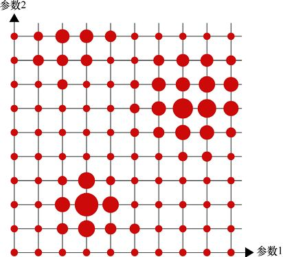

> **圖片描述：** 二維超參數搜索空間的視覺化。網格上的紅色圓圈大小表示結果品質，大圓代表高品質。左下方和右上方有較大的圓，表示最佳參數組合的區域。


圖24.16　二維搜索空間。對於兩個參數的每一對值，圓的大小表示結果的質量，較大的圓優於較小的圓。左下方似乎有一個高質量的小區域，右上方和左上方還有另外兩個有希望的區域。既然我們知道在哪裡可以找到好的結果，就可以用更好的分辨率來研究那些區域，以找到最佳的參數組合


正如我們前面所討論的，在搜索時，我們通常只使用訓練資料的子集，以便它運行得更快。當我們使用這個更小的資料集找到模型參數的最佳值時，可以使用一個更大的版本，並逐步應用到完整的資料集。


為了簡單起見，在本次討論中，我們將在搜索時繼續使用MNIST和整個X_train資料庫。


我們希望再次使用正規化pipeline，因為一般來說，這是必要的，或者至少是一個非常好的想法。


正如我們在第15章看到的，當我們為網格搜索準備pipeline時，需要告訴GridSearchCV，它正在搜索的每個參數應該傳遞到哪裡。這意味著我們需要確定pipeline中的不同步驟。如果使用清單24.13中的pipeline創建方法，這就很容易了，在這種方法中，我們命名了每個步驟。


正如我們在第15章看到的，pipeline內部的參數是巴洛克式的。讓我們簡要回顧一下。


我們創建一個字典，其中每個鍵是pipeline中某個步驟的參數的名稱，它的值是我們想要研究的所有值的列表。每個名稱都是通過將pipeline中的步驟名稱和參數名稱與兩個“_”字符（如step_ _parameter）組合而成的。在某些字體中，兩個**下畫線**看起來就像一個大**下畫線**，這很不幸，但事實就是如此。相比之下，這裡有one_underscore和two_ _underscores。


讓我們創建一個字典來搜索模型的3個參數：全連接層的數量（每個都有dropout），全連接層的神經元的數量，以及兩個不同的最佳化器。清單24.17展示了這個字典。注意鍵不是字符串。


**清單24.17　**我們希望用於搜索的參數字典。每個鍵是一個參數，通過將pipeline步驟的名稱與其參數的名稱組合在一起命名，中間有兩個下畫線。每個值都是要嘗試的設置列表。


```
param_grid = dict(model__number_of_layers=[ 2, 3, 4 ],
                  model__neurons_per_layer=[ 20, 30, 40 ],
                  model__optimizer=[ ′adam′, ′adadelta′ ])
```


我們可以使用字典和在清單24.14中創建的pipeline來創建搜索對象，如清單24.18所示。


**清單24.18　**創建GridSearchCV對象，該對象將遍歷參數網格，為每個選項組合組裝一個模型，並交叉驗證該模型。


```
grid_searcher = GridSearchCV(estimator=pipeline,
                             param_grid=param_grid, verbose=2)
```


現在我們可以開始了。我們只對資料呼叫搜索器的fit()例程，然後讓它運行。


清單24.19將搜索程式碼組合在一起。我們將給每個變量加上後綴1，因為接下來將運行版本2的網格搜索。


**清單24.19　**合併網格構造、GridSearchCV對象構造，然後呼叫fit()來運行搜索。


```
from sklearn.model_selection import GridSearchCV

param_grid1 = dict(model__number_of_layers=[ 2, 3, 4 ],
                   model__neurons_per_layer=[ 20, 30, 40 ],
                   model__optimizer=[ ′adam′, ′adadelta′ ])
grid_searcher1 = GridSearchCV(estimator=pipeline,
                    param_grid=param_grid1, verbose=2)
search_results1 = grid_searcher1.fit(X_train, original_y_train)
```


**警告!**網格搜索速度很慢。


一旦啟動，搜索器就會報告它將要執行的完整的3折交叉驗證的總數。清單24.20展示了剛剛定義的搜索的結果。


**清單24.20　**正如網格搜索fit()的輸出所示，這種窮舉的交叉驗證將在模型上呼叫fit() 54次。


```
Fitting 3 folds for each of 18 candidates, totaling 54 fits
```


數字54來自將摺疊數（預設為3）乘以變量組合數。在本例中，我們有3個變量列表，長度分別為3、3和2。把這些乘在一起可以得到可能性的總數：3×3×2=18。因為每個可能性必須經過3個步驟的交叉驗證，我們將呼叫fit()共3×18=54次。


如果訓練和評估模型需要一分鐘，那麼運行這個搜索大約需要一個小時。


我們返回的變量search_results1包含很多資訊。search_results1中的一個對象是一個名為cv_results_的字典（回想一下，scikit-learn的所有內部變量都以**下畫線**作為後綴）。cv_results_字典包含關於交叉驗證結果的詳細資訊。


因為我們對找到參數的最佳組合很感興趣，所以對其中兩個字典項特別感興趣。“params”項告訴我們這組參數對應的每個分數。“mean_test_score”項告訴我們每組參數的交叉驗證平均值。


讓我們首先看看“params”條目，如清單24.21所示。


**清單24.21　**search_results1.cv_results_[′params′]的內容。其中刪除了每個參數的前綴model_step，以使列表更適合閱讀。我們還刪除了輸出內容中間的10行程式碼。


```
search_results1.cv_results_[′params′]

{*‘*neurons_per_layer*’*: 20, *‘*number_of_layers*’*: 2, *‘*optimizer*’*: *‘*adam*’*},
{*‘*neurons_per_layer*’*: 20, *‘*number_of_layers*’*: 2, *‘*optimizer*’*: *‘*adadelta*’*},
{*‘*neurons_per_layer*’*: 20, *‘*number_of_layers*’*: 3, *‘*optimizer*’*: *‘*adam*’*},
{*‘*neurons_per_layer*’*: 20, *‘*number_of_layers*’*: 3, *‘*optimizer*’*: *‘*adadelta*’*},
      ... 10 lines manually deleted ...
{*‘*neurons_per_layer*’*: 40, *‘*number_of_layers*’*: 3, *‘*optimizer*’*: *‘*adam*’*},
{*‘*neurons_per_layer*’*: 40, *‘*number_of_layers*’*: 3, *‘*optimizer*’*: *‘*adadelta*’*},
{*‘*neurons_per_layer*’*: 40, *‘*number_of_layers*’*: 4, *‘*optimizer*’*: *‘*adam*’*},
{*‘*neurons_per_layer*’*: 40, *‘*number_of_layers*’*: 4, *‘*optimizer*’*: *‘*adadelta*’*}
```


我們可以看到搜索演算法檢查了每個組合，但是它的順序與param_grid1字典不同。外部循環遍歷neurons_per_layer的3個值，其中嵌套的循環遍歷number_of_layers的3個值，最後內部循環遍歷optimizer的2個值。因為Python字典不能保證以任何特定的順序返回它們的結果，所以在運行搜索之前，我們無法預測搜索的順序。


描述交叉驗證測試性能的數值資料放在mean_test_score中，如清單24.22所示。


**清單24.22　**搜索的交叉驗證分數。


```
search_results1.cv_results_[′mean_test_score′]

array([ 0.92901667,   0.91761667, 0.93081667,   0.91146667,
        0.92288333,   0.90051667, 0.9472    ,   0.93373333,
        0.94561667,   0.93166667, 0.94333333,   0.92621667,
        0.95566667,   0.9424    , 0.95376667,   0.94185,
        0.95413333,   0.9402     ])
```


使用NumPy的工具函數argmax()，我們可以在這個列表中找到最大的索引值，然後從“params”項中提取相應的元素，所以我們可以看到這組參數給了我們最好的分數。清單24.23展示了這一步。


**清單24.23　**從交叉驗證結果中找到最佳測試分數的程式碼片段，並輸出該分數的參數。輸出稍微進行了格式調整，以更好地展示。


```
best_index1 = np.argmax(
            search_results1.cv_results_[′mean_test_score′])
print(′best set of parameters:\n index {}\n {}\n′.format(
             best_index1,
             search_results1.cv_results_[′params′][best_index1]))

best set of parameters:
index 12
{′model_step__optimizer′: ′adam′,
 ′model_step__neurons_per_layer′: 40,
 ′model_step__number_of_layers′: 2}
```


所以我們最好的組合使用了2層網路，每層有40個神經元，還有Adam最佳化器。但是這個比其他組合好多少呢？讓我們繪製mean_test_score的所有值，以便了解每個組合的執行結果，如圖24.17所示。


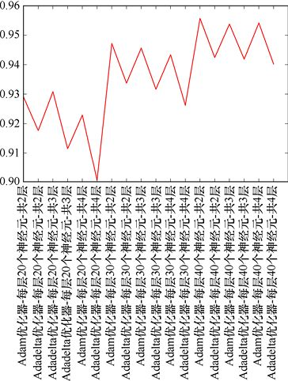

> **圖片描述：** 網格搜索結果圖。x軸為不同的參數組合（最佳化器、神經元數、層數），y軸為交叉驗證準確率（0.90至0.96）。折線顯示各組合的表現，最高點對應最佳配置。


圖24.17　在清單24.19的字典中，搜索每個參數組合的最佳交叉驗證結果所得到的mean_test_score的值。最高的準確率來自每層40個神經元，共2層，使用Adam最佳化器的網路


在標籤的指引下，我們可以把這幅圖解釋為3個主要部分，分別代表20、30和40個神經元。在每個部分中，我們有3對，每對對應2層、3層和4層。最後，每一對值代表Adam和Adadelta的性能。


圖中自左邊開始不重複計數每一對點對的斜率都向下，所以我們可以說Adam一直比Adadelta的表現要好。


圖中自左邊開始不重複計數每隔一個點構成的點對的總體趨勢也是向下的，所以添加更多的層通常會導致性能的損失。


最大的組中是每6個一組，不重複計數，我們可以看出總體趨勢是向上的，這表明更多的神經元比較少的好。


如清單24.23所示，最好的參數集使用了每層40個神經元的2層網路，而且經過Adam最佳化器。


有趣的是，到目前為止，每層20個神經元的4個全連接dropout層的表現是最糟糕的。這是該資料要避免的結構。


記住，我們總是將“層”稱為全連接層和dropout層的組合，使用預設的dropout率（0.2）。


讓我們在參數空間的這個區域進行搜索。因為看起來較少的層比更多的層表現更好，讓我們嘗試在1層或2層的網路中搜索。由於更多的神經元比較少的表現更好，我們將試著從40開始增加找一些更大的數值。


我們可以探索其他的最佳化器，但這次我們將繼續使用Adam。


做出這些選擇並沒有硬性規定或快速的技巧。我們需要使用基於我們對模型和資料的瞭解做出的判斷，以及試驗結果，來指導我們的搜索策略。如果我們使用太細微的網格搜索，會浪費很多時間，但是如果使用太粗略的網格，又可能會錯過性能處於高峰的一個區域。一般來說，搜索性能是一項依靠直覺和分析的任務。


清單24.24展示了第二次參數搜索的字典。


**清單24.24　**第二次參數搜索的字典。


```
param_grid2 = dict(model_step__number_of_layers=[ 1, 2],
                   model_step__neurons_per_layer=[
                                   50, 80, 110, 140, 170 ])
```


結果如圖24.18所示。


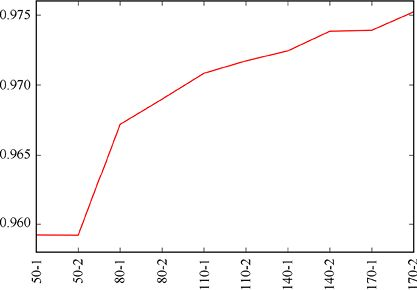

> **圖片描述：** 搜索神經元數量增加的結果圖。x軸為不同配置，y軸為準確率，展示1層和2層網路在不同神經元數量下的表現比較。


圖24.18　在1層和2層的網路中搜索神經元數量增加的層。結果與1層的版本交替，然後是2層的版本


這告訴我們，更多的神經元可以更好地工作，也表明我們的直覺是正確的。2層網路比1層網路看起來更穩定。


讓我們把神經元的數量和搜索範圍都加大一點。清單24.25展示了第三次參數搜索的字典。


**清單24.25　**第三次參數搜索的字典。


```
ram_grid3 = dict(model_step__number_of_layers=[ 1, 2 ],
                 model_step__neurons_per_layer=[
                                180, 280, 380, 480, 580 ])
```


結果如圖24.19所示。


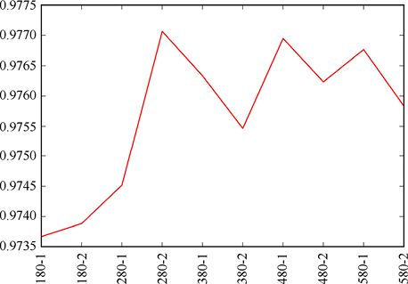

> **圖片描述：** 搜索大量神經元的結果圖。類似圖24.18但神經元數量更大，展示性能隨神經元增加的變化。


圖24.19　在1層和2層的網路中搜索具有大量神經元的層。結果與1層版本交替，然後是2層版本


從圖24.19可以看出，最好的性能來自每層280個神經元的2層網路。當我們增加更多的神經元，表現開始緩慢地下降。這也許是過擬合的原因，儘管我們需要更仔細地觀察才能確定。


注意數值刻度的大小。我們在圖24.17中看到，從最糟糕的表現到最好的表現大約有0.055的提高，而在最近的圖24.19中，差異只有大約0.0035，大約是1/15。


曲線的整體感覺：雖然當我們放大很多的時候，它會跳來跳去，但似乎是變平了。對於這組參數，我們可能非常接近最佳選擇。


我們將在這裡停止搜索，但是我們可以繼續嘗試所有這些參數的不同值，或者一些甚至沒有嘗試過的值（比如任何一個Normalization對象的參數，或者我們自己的模型中的dropout_ratio）。


執行完全網格搜索所需的時間可能很快變得不切實際，因為搜索器會詳盡地測試搜索參數的所有可能組合。所以使用最小數量的組合總是一個好主意，我們可以僥倖從做大量搜索的工作中逃脫，僅搜索最小數量的資料，這將給我們一個模型性能的合理預測。


一個好的策略是從搜索開始，搜索範圍很廣，只有幾個值。當看到模型的最佳表現時，我們可以運行另一個更密集的搜索來探索該區域周圍的區域。這就是所謂的**多分辨率搜索**（multi- resolution searching），它只是我們在現實世界中尋找東西時的演算法版本。這就像我們在圖書館憑一個號碼找一本書：我們根據這個號碼走到圖書館的右邊，然後找到正確的書庫、正確的書架，等等，使用一系列範圍越來越小的搜索，直到找到所要找的書。


我們在越來越小的搜索區域做同樣的事情，直到找到一組最有效的參數值。


scikit-learn的RandomizedSearchCV演算法提供了一個有用的替代方案，可以替代網格搜索器執行的窮舉搜索。正如第15章所討論的，網格搜索的這種變體選擇了每次運行時搜索參數的未開發的隨機組合。例如，我們可以搜索總組合的1/3。我們會比一個完整的網格搜索早3倍時間得到答案，但它是不完整的。不過，從一個好的方面來說，正因為它是不完整的，所以它給了我們一個在整個參數空間中幾乎相等的點散射。這可能足以引導我們選擇更小、更有針對性的搜索區域。


## 24.4　卷積網路


我們來搭建一些**卷積神經網路**，也叫**卷積網路**，或者更常見的CNN。


在第21章中，我們討論了一些關於CNN的神奇之處。回想一下，每個卷積層都包含一組**過濾器**（或**內核**），它們是數字的矩形（通常是一個小的正方形，一邊是3、5或7個元素）。當我們對圖像使用二維卷積層時，第一層中的每個過濾器依次應用到輸入中的每個像素。過濾器的輸出變成了在層輸出時產生的新張量中該位置元素的值。如果有多個過濾器，則輸出張量包含多個**通道**，就像彩色圖像的紅、綠、藍通道一樣。


雖然模型的第一個卷積層的原始輸入通常是通過網路的資料流的圖像，但我們通常不這麼認為。例如，如果一個層有32個過濾器，那麼輸出將有32個通道。它可能與輸入具有相同的寬度和高度（儘管我們將看到這些度量也經常改變），但它不再是一個真正的“圖像”。因此，雖然我們很容易隨便地把卷積層說成是處理由“像素”構成的“圖像”，但把它們稱為由元素構成的張量是一個更好的主意。


回想一下第21章，我們可以通過過濾器可移動的維數大小來描述卷積層。如果過濾器只在一維中移動（例如向下移動），那麼我們稱之為一維卷積層。通常情況下，當我們處理圖像時，會在張量的二維的寬度和高度上移動過濾器，所以我們通常使用二維卷積層來處理圖像。Keras還提供了用於處理體積資料的三維卷積層。


在這一章，我們將關注圖像，所以將使用二維卷積層。


在下面的部分中，我們將看到如何搭建和訓練我們自己的CNN。正如我們稍後將討論的，實際上我們並不經常從頭開始搭建和訓練一個新的CNN。相反，我們通常儘可能從一個現有的網路開始，通過修改它，然後用我們自己的資料對它進行更多的訓練，使其專門化以完成我們的任務。這種**遷移學習**很有吸引力，因為我們可以從已知的工作良好的現有結構開始，並且可以節省用於訓練我們正在搭建的模型的時間（有時是幾天或幾周）。我們還能從網路訓練的資料中獲益，而這些資料我們可能無法使用。


但是知道如何從零開始搭建我們自己的網路是很重要的。這讓我們可以在需要的時候重新開始，併為我們提供了在需要的時候修改現有網路的工具。無論我們使用的是自己的模型還是已有的模型，瞭解模型內部的情況可以幫助我們診斷問題並從模型中獲得最佳性能。


讓我們從建立一些基本的想法開始，當我們搭建CNN時，這些想法將會對我們有幫助。


### 24.4.1　工具層


我們將簡要回顧在第20章中看到的一些工具層，重點關注那些在CNN中有用的層。


像dropout層，這些並不是完全的計算層。相反，它們通常是“資訊”層，告訴Keras如何處理或操縱流經該層的資料，或如何影響前一層。Keras將這些構造為層，這樣我們就可以把模型一致地看作層的堆棧。


下面描述的大多數層都有一、二和三維的形式。在處理圖像時，我們幾乎總是使用二維版本，所以這就是我們在這裡要介紹的全部內容。


圖24.20概括了主要層類型的示意圖符號。


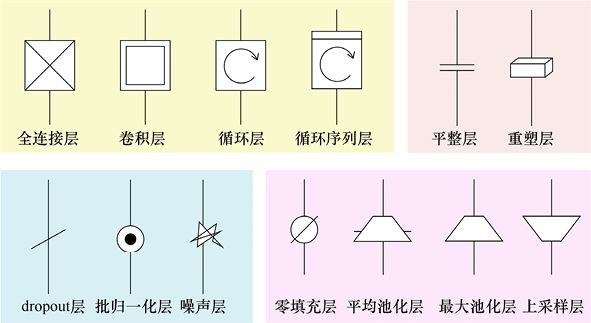

> **圖片描述：** 不同類型層的圖形符號總覽。黃色背景：全連接層、卷積層、循環層、循環序列層。粉紅色：平整層、重塑層。藍色：dropout層、批歸一化層、噪聲層。綠色：零填充層、平均池化層、最大池化層、上取樣層。


圖24.20　重複第20章的圖，顯示不同層的示意圖符號


**平整層**採用任意維數的張量，並將其所有內容排列成一個一維列表。它總是以相同的順序進行平整，所以我們可以預測張量中的每個元素會出現在哪個列表中（我們通常不關心元素是以什麼順序列出的，只要從一個樣本到下一個樣本是一致的）。Keras稱這個層為Flatten。


**池化層**查看組成輸入塊的元素，從中計算單個值，並將該值保存到輸出以替代所有輸入元素。池化最常見的用途是減小其輸入。例如，如果塊是2×2，並且它們沒有重疊，那麼輸出將是輸入寬度和高度的一半。Keras提供兩種類型的池化層。MaxPooling2D層在每個塊中找到最大的值。我們可以告訴它要使用的塊的大小、步幅，或者在每個塊之後水平和垂直移動多少個元素。通常我們使用2×2的塊，每個維度的步幅為2。AveragePooling2D層以相同的方式工作，但它是計算每個塊的平均值。


正如我們在第21章中所討論的那樣，卷積層之後的池化層正在“失寵”，取而代之的是在卷積層內部步進，以獲得類似的結果。步幅和卷積方法產生相似但不同的結果。通常我們不關心這種差異，但有時這很重要，所以有時仍然使用池化層。


**裁剪層**去掉了張量的最外層元素，只留下了內矩形。Keras將其稱為Cropping2D層，它接收讓我們描述從4個邊分別刪除多少元素的參數。


為了使輸入張量變大，**上取樣層**被設計出來。在該層中，每個元素只是水平和垂直地重複了給定的次數。Keras稱這個層為UpSampling2D（注意名稱中間的大寫S）。


正如我們在第21章中提到的，在卷積層之後的顯式上取樣層的另一種替代方法是在卷積層本身中使用轉置卷積（或分數步幅）。與正常的步幅和最大池化一樣，轉置卷積產生的結果與上取樣相似，但不同。


**批正規化層**對流經它的每批資料執行正規化，使其平均值為0、標準差為1。這有助於防止權重過大。


**噪聲層**給張量中的每個元素都添加了一些隨機噪聲。這種方法很少使用，但如果某些神經元在匹配最終並不重要的特定特徵時表現過於激進，那麼這種方法是有幫助的。


最後，一個**零填充層**將0放置在輸入的周邊。這通常是為了使卷積核不會“從邊上掉下來”並試圖訪問不存在的資料。Keras稱其為ZeroPadding2D層（注意大寫的P），因為Keras現在在卷積層中提供了這個特徵，所以在Keras的兩個模型中，卷積之前的顯式零填充是很少見的。


### 24.4.2　為CNN準備資料


我們將繼續使用MNIST作為示例資料集。


我們為CNN準備MNIST資料集的過程與之前所做的幾乎相同，當時第一層是全連接層。


區別在於特徵資料的形狀。在之前，我們已經在二維網格中塑造了我們的特徵資料，每個圖像有一行，每行包含該圖像的所有像素。


當我們將圖像平整成網格時，發生了一件重要的事情：我們丟失了空間資訊，這些資訊告訴我們哪些像素在垂直方向上相鄰（從技術上講，它仍然存在，但肯定不在一個容易使用的結構中）。CNN的一大優點是，它以多維張量的形式工作，而不是一維長列表。例如，過濾器的感知區域包含了一組空間相關的元素。


使用CNN時，不需要平整輸入的二維網格。我們將把所有的輸入維護為三維長方體，其中每個輸入圖像都有高度、寬度和深度。


三維的一個重要用途是將表示彩色圖像的資料通道捆綁在一起。一個典型的數字彩色圖像有3個通道，分別代表紅色、綠色和藍色。如果我們把這些堆疊起來，就會得到一個3層的方塊。準備印刷的圖像則通常有4個通道：青色、品紅、黃色和黑色。這需要一個4層的塊，如圖24.21所示。


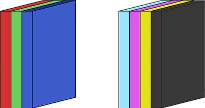

> **圖片描述：** 兩種彩色圖像格式。左側：RGB圖像的三個通道（紅、綠、藍三色平面堆疊）。右側：CMYK印刷圖像的四個通道（青、品紅、黃、黑四色平面）。


(a)　　　　　　　　　　　　　　　　　　　　　　　　 (b)


圖24.21　經常使用多個二維網格來表示更豐富的圖像類型。(a)典型的數字彩色圖像使用3個通道，分別表示紅色、綠色和藍色；(b)準備印刷的圖像通常有4個通道，分別是青色、品紅、黃色和黑色


MNIST的資料是黑白的，所以我們只有一個像素資料通道。但是仍然需要，通過使它成為輸入張量的維數之一明確地告訴Keras我們只有一個通道。


命名維度的順序取決於我們使用的選項是channels_first還是channels_last，正如我們在第23章開始時所討論的那樣。我們在這裡將繼續使用channels_last，從前面到後面堆疊圖像，如圖24.21所示。回想一下，我們是按順序來數的，先往下，再往右。


通過添加通道維度，每個MNIST圖像將成為一個尺寸為1×28×28的三維塊。我們的輸入資料結構將包含60000個三維塊。這意味著完整張量的第一維度是60000，然後是每個圖像的形狀。


使用channels_last約定，這個張量的維數是60000×28×28×1。


我們不能畫一個四維張量，但是可以在一個列表中表示很多三維張量。圖24.22使用這種方法描繪我們的資料集。


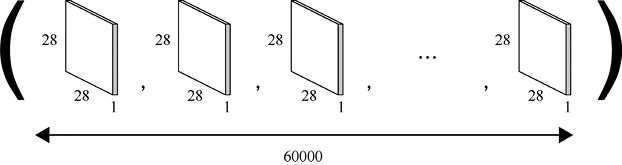

> **圖片描述：** MNIST資料重塑為四維張量。每張圖像為28x28x1的三維塊，60000張圖像排列成一行，以括號包圍表示整體張量結構。


圖24.22　由於我們使用channels_last約定，輸入中的每個圖像都將被重塑為一個尺寸為28×28×1的三維塊。然後我們把所有的60000個三維塊堆疊在一起形成一個60000× 1×28×28的四維張量，這將作為CNN的輸入


正如我們前面所討論的，可以更簡單地將其看作一組嵌套列表，而不是一個四維結構：最外層的列表包含60000個圖像，每個圖像包含一個通道，每個通道包含28行，每一行包含28個元素。


這意味著每個像素都用4個數字來命名，依次是圖像編號、通道編號、*y*位置和*x*位置。


CNN的輸入資料調整為−1～1時表現最好[Karpathy16b]。這意味著我們不能把每個像素都除以255。相反，我們使用NumPy的interp()函數將每個在[0,255]範圍內的輸入值轉換到[−1,1]，如清單24.26所示。


**清單24.26　**使用NumPy的interp()函數將所有輸入值從[0,255]轉換到[−1,1]。


```
X_train = np.interp(X_train, [0, 255], [-1,1])
X_test = np.interp(X_test, [0, 255], [-1,1])
```


接下來，我們將把資料重塑成剛才討論的形狀。我們只是告訴NumPy如何取原始版本的X_train，它是60000×28×28，然後把它重塑成四維張量，即60000×1×28×28。我們不改變元素的總數，只是把我們想要的維度交給NumPy，所以它可以完成這項工作。清單24.27展示了該程式碼。


**清單24.27　**將輸入MNIST資料轉換為CNN所期望的四維張量。


```
*# reshape sample data to 4D tensor using channels_last convention*
X_train = X_train.reshape(X_train.shape[0],
                             image_height, image_width, 1)
X_test = X_test.reshape(X_test.shape[0],
                             image_height, image_width, 1)
```


我們將把這些重塑行放在縮放步驟之後。為了完整起見，清單24.28彙總了所有的預處理。這包括我們將需要的所有import語句。除了import語句和最終的重塑之外，這些預處理與我們之前所做的完全相同。畢竟，CNN也是另一個深度神經網路，只不過增加了一些新類型的層。


我們假設channels_last選項已經在Keras配置文件中被選中。如果不是這樣，那麼要麼修改文件，要麼導入後端，幷包含一個呼叫來設置image_data_format的值，正如我們在第23章看到的那樣。


**清單24.28　**CNN對MNIST資料進行分類的預處理步驟。


```
from keras.datasets import mnist
from keras.models import Sequential
from keras.layers.core import Dense, Dropout, Activation, Flatten
from keras.layers.convolutional import Conv2D, MaxPooling2D
from keras.constraints import maxnorm
from keras.optimizers import Adam, SGD, RMSprop
from keras import backend as keras_backend
from keras.utils import np_utils
from keras.preprocessing.image import ImageDataGenerator
from keras.utils.np_utils import to_categorical
import numpy as np
random_seed = 42
np.random.seed(random_seed)
*　*
*# load MNIST data and save sizes*
(X_train, y_train), (X_test, y_test) = mnist.load_data()
image_height = X_train.shape[1]
image_width = X_train.shape[2]
number_of_pixels = image_height * image_width

*# convert to floating-point*
X_train = keras_backend.cast_to_floatx(X_train)
X_test = keras_backend.cast_to_floatx(X_test)

*# scale data to range [-1, 1]*
X_train = np.interp(X_train, [0, 255], [-1,1])
X_test = np.interp(X_test, [0, 255], [-1,1])

*# save original y_train and y_test*
original_y_train = y_train
original_y_test = y_test

*# replace label data with one-hot encoded versions*
number_of_classes = 1 + max(np.append(y_train, y_test))
y_train = to_categorical(y_train, num_classes=number_of_classes)
y_test = to_categorical(y_test, num_classes=number_of_classes)

*# reshape sample data to 4D tensor using channels_last convention*
X_train = X_train.reshape(X_train.shape[0],
                     image_height, image_width, 1)
X_test = X_test.reshape(X_test.shape[0],
                     image_height, image_width, 1)
```


將特徵資料重塑成這些四維張量是必要的預處理步驟。它把資料維數轉換成位於CNN的開始的卷積層所期望的那樣。


### 24.4.3　卷積層


讓我們更仔細地看看如何定義卷積層。我們看到Keras提供了一、二、三維的卷積層。我們將選擇二維版本，因為這是我們通常使用的圖像資料，就像運行示例MNIST資料。


該層名為Conv2D，我們通過從模組keras.layers.convolutional中導入來訪問它。


Conv2D層在其參數列表的開頭接收兩個未命名的強制參數，後面是各種可選參數。


第一個強制參數是一個整數，指定層應該管理的過濾器的數量。回想一下第21章，每個過濾器獨立地應用於輸入，併產生自己的輸出。因此，如果輸入只有一個通道（就像我們的輸入一樣），並且在卷積層中使用5個過濾器，那麼輸出將有5個通道，如圖24.23所示。


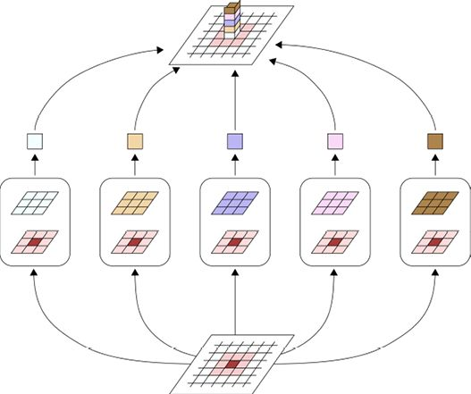

> **圖片描述：** 單通道輸入經5個過濾器產生5通道輸出的示意圖。底部為輸入圖像，5個不同顏色的過濾器分別處理，每個產生一個輸出通道，頂部為5通道堆疊的輸出張量。


圖24.23　如果我們有一個通道輸入和5個過濾器，輸出張量將有5個通道，每個過濾器輸出一個通道。這裡我們展示了5個過濾器在輸入的單個元素上的操作，併產生5個通道的輸出


Conv2D層的第二個強制參數是一個列表，用於提供該層上的過濾器的維數。在Keras中，就像在許多庫中一樣，給定層中的所有過濾器都具有相同的大小，因此我們只為整個層指定一個過濾器大小。繼續之前的例子，如果我們有5個過濾器，每個過濾器是3×3，那麼這些參數就是5、[3,3]。這告訴層自動分配和初始化5個形狀為3×3×1的長方體（後面的1是通道的數量）。


在實踐中，我們幾乎總是使用方形的內核，通常在一邊有3～5個元素。經驗表明，這些大小，加上輸入的減小（通過池化或卷積步幅），代表了計算和結果的良好權衡。有時使用較大的核，但它們並不常見。


請記住，這些過濾器的內核是三維長方體，因為內核中有一個通道對應輸入中的每個通道。例如，假設第一層的輸入圖像是彩色圖像，而我們的層使用的是5×5的內核。因為有3個通道，所以每個過濾器被創建為一個5×5×3的塊。這個塊在二維圖像上移動（因此稱為Conv2D），並且在每個元素中，輸入的75個值乘以相應的在內核中的75個元素，結果都加在一起，就是這個內核在該元素的輸出，如圖24.24所示。


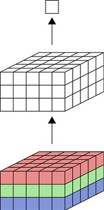

> **圖片描述：** 5x5過濾器應用於3通道輸入。底部75個輸入值（5x5x3），中間的過濾器也有3個通道，所有75個乘積加總產生頂部的一個輸出值。


圖24.24　每個過濾器自動容納輸入中所有的通道。這裡一個5×5的過濾器被應用到一個3通道的輸入，所以系統自動給過濾器3個通道。輸入中的75個值（底部）都乘以過濾器中相應的值（中間），所有這些乘積加在一起產生一個數字（頂部），即該過濾器對輸入位置的輸出


如果在一個給定的卷積層中有幾個這樣的過濾器，那麼我們將產生幾個輸出，這與圖24.23類似，除了現在是處理一個多通道輸入。圖24.25展示了這個想法。


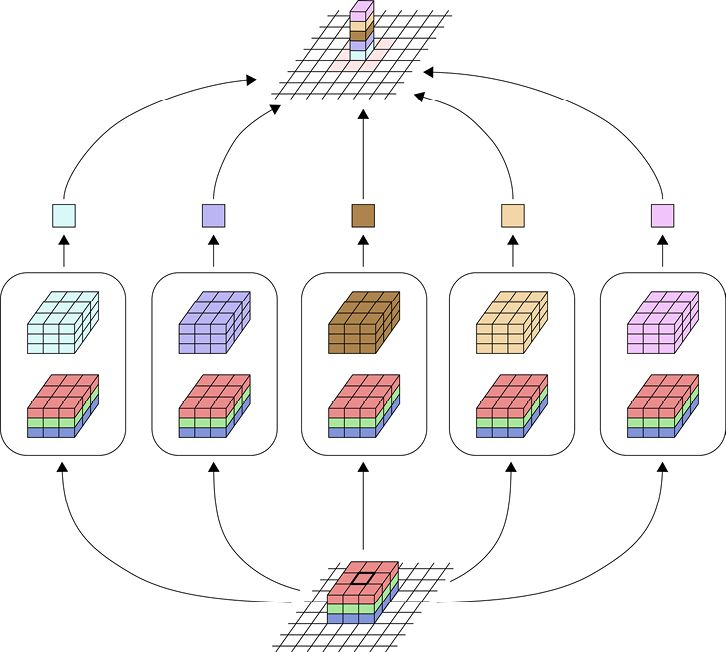

> **圖片描述：** 多通道輸入配合多個過濾器。底部為多通道輸入張量，中間多個多通道過濾器，頂部輸出張量的通道數等於過濾器數量。


圖24.25　如果我們對多通道輸入應用多個過濾器，那麼每個過濾器也將有多個通道。輸出中的通道數量由所使用的過濾器的數量給出


跟蹤所有這些形狀將是一項管理挑戰，Keras會為我們管理它們。因此，我們可以創建卷積層序列，只需要告訴Keras我們想在每個層上使用多少個過濾器，以及它們的足跡應該是怎樣的。Keras跟蹤來自前一層的通道數量，並使過濾器達到必要的大小，**無須**我們太費功夫。


例如，假設我們創建了一個包含5個過濾器的卷積層，每個過濾器都是5×5的。它產生的每個輸出都有5個通道。如果下一層也是卷積層，那麼說我們想要2個3×3的過濾器，Keras會自動知道讓每個過濾器有5個通道，因為這是前一層的輸出。簡而言之，每個過濾器的通道數等於輸入的通道數，而通道數又等於前一個卷積層中使用的過濾器數。圖24.26直觀地展示了這個概念。


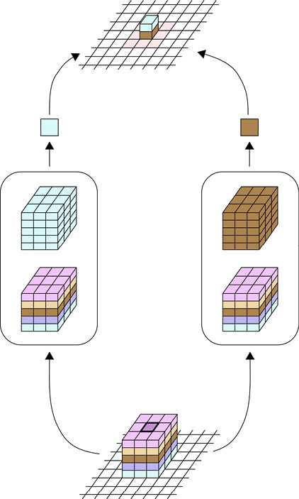

> **圖片描述：** 兩個卷積層串聯的過濾器通道自動配置。第一層過濾器產生的多通道輸出自動成為第二層過濾器的輸入通道數。


圖24.26　當一個卷積過濾器跟隨另一個卷積過濾器時，第二層的過濾器被自動配置為具有與前一層中一樣多的通道


使用像Keras這樣的庫的最大樂趣之一就是自動調整過濾器的大小。我們不需要自己管理這些，因為庫已經有了所有它需要知道的東西，以保證工作正常進行。


讓我們創建一個有15個3×3的過濾器的卷積層。清單24.29展示了創建層並將其放入模型的程式碼。


**清單24.29　**創建一個包含15個3×3的過濾器的卷積層。


```
convolution_layer = Conv2D(15, (3, 3))
model.add(convolution_layer)
```


在實踐中，我們通常一步完成，就像我們在前面章節中對其他層所做的那樣。清單24.30展示了通常用於此任務的一行程式碼。


**清單24.30　**向模型添加捲積層的更常用方法。


```
model.add(Conv2D(15, (3, 3)))
```


Conv2D層接收許多可選參數，所有這些參數都在文檔中有所描述。我們將只討論我們需要的那些。


我們將首先從卷積層特有的參數開始，然後擴展到我們在使用全連接層時已經見過的參數。方便起見，我們繼續將輸入張量元素稱為“像素”，不過正如我們前面所討論的那樣，在第一層之後就沒有意義了。


卷積層有一個不錯的可選特性是：如果需要，我們可以在層本身中包含零填充，而不是在模型中創建一個顯式的零填充層。更好的是，如果我們希望輸出與輸入具有相同的形狀，那麼Keras可以自動計算需要多少零填充。它使用過濾器的大小，以及我們的步幅選擇（如果需要的話），並在外部添加足夠的0，以確保過濾器永遠不會從輸入的“邊上掉下來”。


為了應用零填充，我們設置了可選參數padding到字符串“same”，意為“使輸出和輸入的大小相同”。填充的預設值是字符串“valid”，意思是“僅放置過濾器到有效資料可用的地方”。這是一種冗長的說法，換句話說就是“沒有填充”。


我們在第21章看到步幅可以讓過濾器每一步移動任何的距離。我們使用可選參數strides設置步幅。它接收一個包含兩個數字的列表，給出了水平和垂直移動的像素數量。這個列表預設為(1,1)。例如，如果我們將步幅值設置為(2,2)，那麼輸出將是輸入寬度和高度的一半。注意，輸出通道的數量不受步幅的影響，因為它來自過濾器的數量。


為了方便起見，我們可以將strides設置為單個數字，它將在兩個方向上都使用這個數字。所以我們不用列表(2,2)，只需要給出單個值2。


最後一個選項是activation。就像我們之前討論的全連接層一樣，卷積層產生的每個值都經過一個激活函數。該激活函數預設是一個線性函數，實際上它什麼也不做。我們可以通過將激活函數的名稱提供為字符串來設置它。我們在第17章中討論的所有函數都是可用的，還有其他一些函數（請參閱Keras文檔）。隱藏卷積層的選擇通常是“relu”和“tanh”。


回想一下，當且僅當該層是網路中的第一層時，全連接層需要參數input_shape。卷積層以同樣的方式工作，如果它們是第一層，則需要為input_shape分配一個值。


我們應用到全連接層的input_shape參數是一個只有一個值的列表：表示圖像的列表的長度。與這些層一樣，卷積層希望input_shape不是描述整個資料集的形狀，而只是一個樣本。我們知道MNIST示例中有60000個樣本，每個都是28×28×1。因此，input_shape的值是列表(28,28,1)，用來描述一個圖像。


既然我們已經涵蓋了所有背景知識，讓我們創建一個二維卷積層。這將是模型中的第一層，因此我們需要input_shape參數。假設我們需要16個5×5的過濾器。為了進行演示，我們將選擇激活函數ReLU，零填充，以便輸出與輸入大小相同，*x*和*y*中的步幅為2。清單24.31展示了我們如何將它添加到名為model的模型中。


**清單24.31　**向模型添加一個二維卷積層。第一個參數是過濾器的數量，然後是每個濾波器的寬度和高度。另一個命名的參數（input_shape除外）是可選的。這裡，我們將激活函數設置為ReLU，選擇零填充使輸出與輸入大小相同，將padding設置為same，將步幅設置為(2,2)，並使用channels_last約定指定輸入張量的形狀。


```
model.add(Conv2D(16, (5, 5), activation=′relu′,
                 strides=(2, 2), padding=′same′,
                 input_shape=(image_height, image_width, 1)))
```


在所有這些討論之後，即使有可選的參數，機制也會非常簡短。


這涵蓋了使用卷積層的基礎知識。其他一切都和以前一樣：我們創建模型，添加層，編譯它，然後訓練它。然後我們可以讓它預測。


Keras負責所有的工作，包括：創建大小合適的過濾器內核，使用良好的值初始化它們，以及使用反向傳播來改進。


現在我們知道了如何創建卷積層，讓我們來搭建一個完整的CNN。


### 24.4.4　對MNIST使用卷積


讓我們創建一個CNN來對MNIST的圖像進行分類。首先，我們要製作一個簡單的卷積層、一個平整層、一個全連接輸出層。


我們的預處理步驟與清單24.28中的步驟一樣。它讀取我們的資料，對其進行正規化，將特徵重塑為四維通道優先張量，並對標籤進行獨熱編碼。


模型的結構如圖24.27所示。


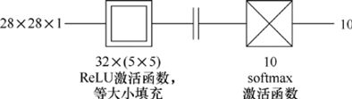

> **圖片描述：** 簡單CNN的架構圖。輸入28x28x1，32個5x5卷積（ReLU），平整層，10個softmax全連接層。


圖24.27　一個小CNN的結構。我們有一個卷積層，有32個過濾器，每個過濾器都是5×5的正方形。接下來是一個平整層，然後是一個包含10個神經元的全連接層，用來顯示我們的分類輸出


為了創建模型，我們像以前一樣，先創建一個Sequential類型的新對象，然後一次添加一個層。


我們將從一個包含32個內核的二維卷積層開始，每個內核都是5×5的。我們將使用一個ReLU激活函數，設置padding=′same′，這將給層一個臨時的零填充環，所以輸出將有相同的水平和垂直大小作為輸入。因為全連接層結束時需要一個列表作為輸入，我們將使用一個Flatten層把28×28×32的張量變成28 ×28×32=25088的列表元素。和之前一樣，我們在最後一層使用softmax。


和往常一樣，我們將把所有這些都打包在一個小函數中，這個函數創建模型，編譯它，並返回最終結果。


清單24.32展示了該程式碼。


**清單24.32　**用於分類MNIST圖像的第一個CNN。


```
def make_simple_cnn_model():
    model = Sequential()
    model.add(Conv2D(32, (5, 5),
                     activation=′relu′, padding=′same′,
                     input_shape=(image_height, image_width, 1)))
    model.add(Flatten())
    model.add(Dense(number_of_classes, activation=′softmax′))
    model.compile(loss=′categorical_crossentropy′,
                  optimizer=′adam′,
                  metrics=[′accuracy′])
    return model
```


就Keras而言，這只是一個Sequential對象，與其他對象一樣。我們可以像往常一樣訓練這個模型，通過呼叫fit()和所有必要的參數。為了完整起見，清單24.33展示了程式碼。與24.3節中的實驗一樣，我們將在100個epoch中使用批大小256來運行這個模型。


**清單24.33　**要訓練CNN，我們只需要使用通常的參數呼叫fit()。


```
simple_cnn_model = make_simple_cnn_model()
simple_cnn_history = simple_cnn_model.fit(X_train, y_train,
                     validation_data=(X_test, y_test),
                     epochs=100, batch_size=256)
```


我們這次訓練的結果如圖24.28所示。


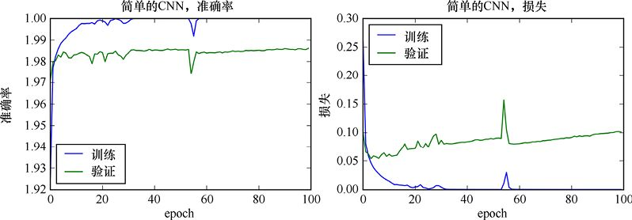

> **圖片描述：** 簡單CNN的訓練曲線。準確率和損失隨epoch的變化。


圖24.28　簡單的CNN的準確率和損失


清單24.34展示了最後一個epoch的數值。


**清單24.34　**圖24.28中的最終值。我們移去了一些空格使該行方便顯示。


```
Epoch 100/100
66s-loss: 2.7044e-04-acc: 1.0000-val_loss: 0.1016-val_acc: 0.9862
```


關於這些結果的好消息是，一切似乎都運行得很好。系統對訓練資料進行學習，並能很好地預測驗證資料的類，準確率約為98.6%。


此外，這些曲線看起來並不好。在35個epoch左右的時間內，訓練的準確率達到了1.0左右，而驗證的準確率似乎也停滯不前。這是可以的，但是損失曲線卻告訴了我們一個不同的結果。這個系統甚至在10個epoch之前就開始過擬合，而且隨著時間的推移，它變得更糟。


像往常一樣，要解決這樣的問題，就需要遵循我們的直覺。讓我們猜一下，如果我們使用更大的模型，可能會得到更好的性能。我們將把卷積層的數量從1增加到3，為了控制過擬合，我們會在每一層後面加上dropout層。


圖24.29展示了我們新的、更大的結構。


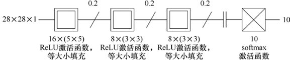

> **圖片描述：** 更大CNN的架構圖。包含多個卷積層和dropout層，展示更複雜的卷積網路結構。


圖24.29　使用多個卷積層和dropout層的更大的CNN


第一個卷積層使用了16個5×5的過濾器，然後我們在接下來的兩層中使用了8個3×3的過濾器。所有這些數字或多或少都是任意的，都是來自最初的猜測和一些反覆試驗。我們跟蹤每一個帶有dropout層的卷積層，在最後，我們把結果壓平，然後像往常一樣，使用softmax將其輸入到有10個神經元的全連接層。


因為我們使用border_mode =′same′選項，還有預設的1×1步幅，所以每個卷積的輸出寬度和高度是和輸入相同的。


清單24.35展示了一個用於創建新模型的函數。注意，我們正在將可選參數kernel_constraint設置為值maxnorm(3)，就像前面對全連接層所做的一樣。對於卷積層，它可以防止過濾器中的值變大，就像它可以防止全連接層中的權重變大一樣。


**清單24.35　**創建圖24.29中的模型。


```
def make_bigger_cnn_model():
    model = Sequential()
    model.add(Conv2D(16, (5, 5), activation=′relu′,
                     padding=′same′,
                     kernel_constraint=maxnorm(3),
                     input_shape=(image_height, image_width, 1)))
    model.add(Dropout(0.2))
    model.add(Conv2D(8, (3, 3), activation=′relu′, padding=′same′,
                     kernel_constraint=maxnorm(3)))
    model.add(Dropout(0.2))
    model.add(Conv2D(8, (3, 3), activation=′relu′, padding=′same′,
                     kernel_constraint=maxnorm(3)))
    model.add(Dropout(0.2))
    model.add(Flatten())
    model.add(Dense(number_of_classes, activation=′softmax′))
    model.compile(loss=′categorical_crossentropy′,
                  optimizer=′adam′,
                  metrics=[′accuracy′])
    return model
```


清單24.36展示瞭如何呼叫這個函數來創建一個新模型。


**清單24.36　**訓練清單24.35中的模型。


```
bigger_cnn_model = make_bigger_cnn_model()
bigger_cnn_history = bigger_cnn_model.fit(X_train, y_train,
                     validation_data=(X_test, y_test),
                     epochs=100, batch_size=256)
```


結果如圖24.30所示。


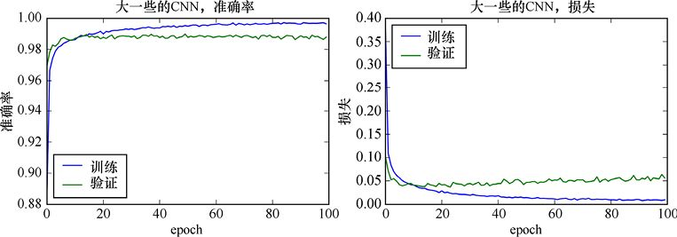

> **圖片描述：** 更大CNN（100 epoch）的訓練曲線。準確率趨近0.99，損失趨近0。


圖24.30　100個epoch內圖24.29中的模型訓練的準確率和損失


清單24.37展示了運行結束時的數值。


**清單24.37　**訓練我們更大的CNN的最後一行的數值。


```
Epoch 100/100
127s-loss: 0.0094-acc: 0.9965-val_loss: 0.0565-val_acc: 0.9879
```


我們幾乎消除了過擬合，儘管驗證的準確率比以前略低。就驗證準確率而言，我們似乎可以在大約40個epoch後停止。


可能還會有少量的過擬合，我們可以通過調整超參數來降低它，就像我們之前做的那樣。


在2014年末的iMac上，在沒有GPU支援的情況下，使用TensorFlow後端，這個模型每個epoch會花兩分鐘多一點。這大約是我們第一個只有一個卷積層的模型所需時間的兩倍。


既然我們已經嘗試了更大的網路，則可以繼續考慮尋找更好的表現。但是我們從哪裡開始呢？


深度學習結構的進展通常來自其他人開發和發佈的結果。看一下MNIST的頁面[LeCun13]，我們可以看到卷積網路的結構在這個資料集上運行得很好。其中大多數都有一些高級或實驗性的特徵，但我們仍然可以模擬它們的基本結構。


讓我們試著讓圖像變得越來越小，就像當它通過網路時那樣。這樣，每一層都能處理較大區域的原始圖像。


我們將首先使用池化層來做這件事。雖然我們已經注意到池化層在CNN中不受歡迎，但仍將使用它們，因為它們向我們顯式地展示了當張量流經網路時，張量大小是如何減小的。


每個池化層將查看2×2個不重疊的框，並返回由4個輸入元素組成的組中最大的值。因此，每個層的輸出都是其輸入寬度和高度的一半。輸入的圖像是28像素×28像素，所以第一個最大池化層的輸出是14像素×14像素，第二個的輸出是7像素×7像素。當然，這些張量的深度是由前一個卷積層中的過濾器的數量決定的。


我們將在最後包含3個全連接層，同樣是逐漸減小的尺寸。這基本上是一種預感，因為只有很少的輸入到達最後的全連接層（總共只有7×7=49個值），我們可以從這些值的更多處理中受益。暫時不管它，我們仍在每個卷積層後面都加上dropout。


圖24.31展示了這個結構。


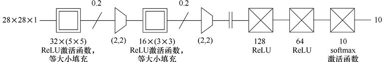

> **圖片描述：** 帶dropout和池化層的CNN架構圖。展示卷積、池化和dropout層的組合。


圖24.31　一個具有dropout和池化層的CNN


清單24.38展示了一個用於創建新模型的函數。


**清單24.38　**創建圖24.31中的模型。


```
def make_pooling_cnn_model():
    model = Sequential()
    model.add(Conv2D(30, (5, 5), activation=′relu′,
                     padding=′same′,
                     kernel_constraint=maxnorm(3),
                     input_shape=(image_height, image_width, 1)))
    model.add(Dropout(0.2))
    model.add(MaxPooling2D(pool_size=(2, 2), padding=′same′))
    model.add(Conv2D(16, (3, 3), activation=′relu′,
                     padding=′same′,
                     kernel_constraint=maxnorm(3)))
    model.add(Dropout(0.2))
    model.add(MaxPooling2D(pool_size=(2, 2), padding=′same′))
    model.add(Flatten())
    model.add(Dense(128, activation=′relu′))
    model.add(Dense(64, activation=′relu′))
    model.add(Dense(number_of_classes, activation=′softmax′))
    model.compile(loss=′categorical_crossentropy′,
                     optimizer=′adam′,
                     metrics=[′accuracy′])
    return model
```


清單24.39展示瞭如何呼叫這個函數來創建一個新模型。


**清單24.39　**創建用於訓練圖24.31中的模型。


```
pooling_cnn_model = make_pooling_cnn_model()
pooling_cnn_history = pooling_cnn_model.fit(X_train, y_train,
                          validation_data=(X_test, y_test),
                          epochs=100, batch_size=256)
```


結果如圖24.32所示。


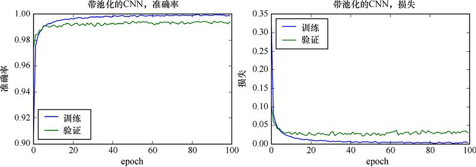

> **圖片描述：** 帶pool和dropout的CNN訓練曲線。


圖24.32　圖24.31中的模型訓練100個epoch的結果


運行結束時的數值如清單24.40所示。


**清單24.40　**訓練圖24.31中的模型100個epoch後的最後一行數值。


```
Epoch 100/100
147s-loss: 0.0038-acc: 0.9988-val_loss: 0.0304-val_acc: 0.9939
```


我們在驗證準確率方面得到了一個小但有意義的提高，從0.9879提高到0.9939。正如我們前面所提到的，在這一點上的進展通常以微小的幅度進行。這實際上已經相當大了，因為我們把到1的距離縮短了一半。


我們似乎沒有過擬合。事實上，大約在50個epoch之後一切都安定下來了。


我們提到過，卷積後的池化層現在被卷積層本身的步幅取代。讓我們實作它，用2×2的步幅替換2×2的最大池化層。結果會有一點不同，因為卷積核步進的過程並不等同於通過單個步驟移動然後池化它們，但是我們預計大致會相似。


圖24.33展示了這個結構。


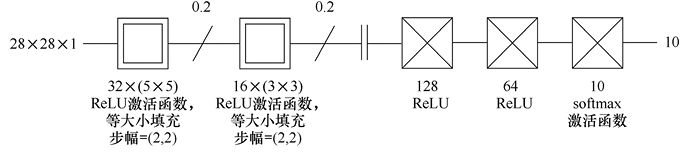

> **圖片描述：** 步進CNN的架構圖。28x28x1輸入，32個5x5卷積（ReLU，步幅2x2，等大填充），0.2 dropout，16個3x3卷積（ReLU，步幅2x2，等大填充），0.2 dropout，平整，128 ReLU全連接，64 ReLU全連接，10 softmax輸出。


圖24.33　從圖24.31的模型開始，我們用卷積層中的步進替換了池化層


清單24.41展示了一個用於創建新模型的函數。


**清單24.41　**創建圖24.33的步進CNN。


```
def make_striding_cnn_model():
    model = Sequential()
    model.add(Conv2D(30, (5, 5), activation=′relu′,
                     padding=′same′, strides=(2, 2),
                     kernel_constraint=maxnorm(3),
                     input_shape=(image_height, image_width, 1)))
    model.add(Dropout(0.2))
    model.add(Conv2D(16, (3, 3), activation=′relu′,
                     padding=′same′, strides=(2, 2),
                     kernel_constraint=maxnorm(3)))
    model.add(Dropout(0.2))
    model.add(Flatten())
    model.add(Dense(128, activation=′relu′))
    model.add(Dense(64, activation=′relu′))
    model.add(Dense(number_of_classes, activation=′softmax′))
    model.compile(loss=′categorical_crossentropy′,
                  optimizer=′adam′,
                  metrics=[′accuracy′])
    return model
```


清單24.42展示瞭如何呼叫這個函數來創建一個新模型。


**清單24.42　**創建圖24.33的步進CNN。


```
striding_cnn_model = make_striding_cnn_model()
striding_cnn_history = striding_cnn_model.fit(X_train, y_train,
                           validation_data=(X_test, y_test),
                           epochs=100, batch_size=256)
```


結果如圖24.34所示。


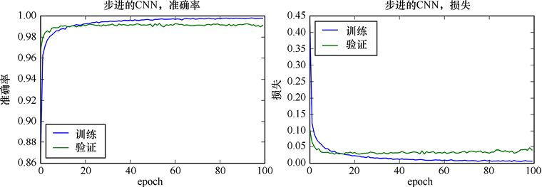

> **圖片描述：** 步進CNN的訓練曲線。準確率和損失隨epoch的變化。


圖24.34　訓練圖24.33的步進CNN 100個epoch的準確率和損失


清單24.43展示了運行結束時的數值。


**清單24.43　**訓練圖24.33中的模型100個epoch後的最後一行數值。


```
Epoch 100/100
36s-loss: 0.0062-acc: 0.9978-val_loss: 0.0400-val_acc: 0.9912
```


在訓練集和驗證集中，我們已經丟失了一點準確率，但是在其他方面，這些數字和它們的圖看起來很像我們使用顯式池化層時所看到的。


但改變了很多的是時間。如清單24.40所示，在沒有GPU的2014年末iMac上，池化模型每個epoch需要147秒，而步進版本每個epoch只需要36秒。步進的epoch只需要使用顯式池化epoch 25%的時間。時鐘時間可能會誤導人，但很難有人不喜歡只用25%的時間和精力就能得到幾乎相同的性能。


我們能進一步提高性能嗎?


我們可以改變網路的任何方面，例如可以在每個層添加或刪除過濾器，改變它們的大小，增加dropout百分比，添加更多的卷積層，等等。為了多樣性，讓我們嘗試用批正規化層替換dropout層。這兩種方法都是為了減少過擬合，因此我們可以看到這兩種方法中哪一種最適合這個網路和這個資料。


圖24.35展示了這個結構。


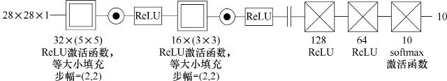

> **圖片描述：** 批正規化CNN的架構圖。用批正規化層替換了dropout層。


圖24.35　圖24.33中的模型，其中我們用批正規化層替換了每個dropout層


清單24.44展示了一個用於創建新模型的函數。我們將卷積層中的activation參數設置為None，因為，正如我們在第20章中看到的，批正規化層在一個層的輸出和其激活函數之間工作。因此，我們在每個卷積層之後加一個BatchNormalization層，然後用一層來應用ReLU激活函數（回想一下，批正規化層是設計在一個層的輸出之後，但在激活函數之前）。


**清單24.44　**創建圖24.35的步進-批正規化CNN。注意，我們把BatchNormalization層放在卷積層和它的ReLU激活函數之間，放在它自己的層上。


```
def make_striding_batchnorm_cnn_model():
    model = Sequential()
    model.add(Conv2D(30, (5, 5), activation=None,
                     padding=′same′, strides=(2, 2),
                     input_shape=(image_height, image_width, 1)))
    model.add(BatchNormalization())
    model.add(Activation(′relu′))
    model.add(Conv2D(16, (3, 3), activation=None,
                     padding=′same′, strides=(2, 2)))
    model.add(BatchNormalization())
    model.add(Activation(′relu′))
    model.add(Flatten())
    model.add(Dense(128, activation=′relu′))
    model.add(Dense(64, activation=′relu′))
    model.add(Dense(number_of_classes, activation=′softmax′))
    model.compile(loss=′categorical_crossentropy′,
                  optimizer=′adam′,
                  metrics=[′accuracy′])
    return model
```


清單24.45展示瞭如何呼叫這個函數來創建一個新模型。


**清單24.45　**創建圖24.35的步進-批正規化CNN。


```
striding_batchnorm_cnn_model = \
                 make_striding_batchnorm_cnn_model()
striding_batchnorm_cnn_history = \
                 striding_batchnorm_cnn_model.fit(
                         X_train, y_train,
                         validation_data=(X_test, y_test),
                         epochs=100, batch_size=256)
```


結果如圖24.36所示。


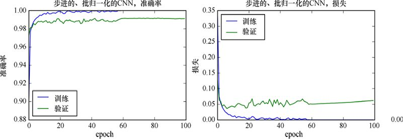

> **圖片描述：** 批正規化CNN的訓練曲線。


圖24.36　100個epoch的訓練中，步進-批正規化CNN的準確率和損失


清單24.46展示了運行結束時的數值。


**清單24.46　**訓練圖24.35中的模型100個epoch後的最後一行數值。


```
Epoch 100/100
45s-loss: 2.6886e-04-acc: 1.0000-val_loss: 0.0618-val_acc: 0.9911
```


驗證的準確率與我們之前得到的大致相同，但是我們似乎得到了少量的過擬合。而epoch也需要大約多25%的時間來運行。


曲線上的**噪聲**是一個值得關注的問題。當停止訓練時，我們需要小心，以確保沒有處於驗證損失的峰值（或相應的驗證準確率的低谷）。在這種情況下，保留多個檢查點是很有意義的，然後根據性能圖來選擇一個檢查點。


總的來說，這種變化似乎沒有給我們帶來比以前更好的東西。這就是試驗的價值： 除非我們嘗試，否則無法確定網路和特定資料集將如何表現。


### 24.4.5　模式


許多CNN都是通過重複幾種可識別的模組來組裝的[Karpathy16a]。這樣的塊是一組卷積層，然後是池化層，這個塊被重複幾次，可能在這些卷積層上使用不同的參數；然後是一系列全連接層。圖24.37展示了這種結構的一個示例。


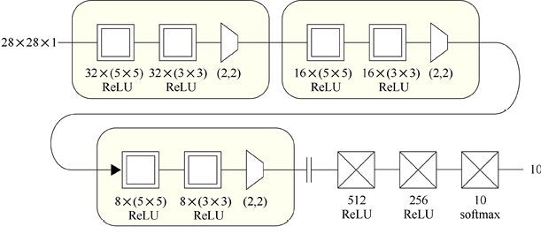

> **圖片描述：** CNN的重複模組結構模式。黃色方塊表示卷積層組，每組後接池化層，此模式重複3次，展示典型的CNN建構方式。


圖24.37　CNN通常由重複模組組成。一個受歡迎的模式是一些帶著池化層的卷積層，我們在這裡看到重複了3次。通常，卷積的參數從一個塊（用黃色表示）更改為下一個塊


池化層通常用2×2的塊來平整輸入。也就是說，感知域是2×2，我們使用(2,2)的步幅，這樣就產生了一個沒有重疊或空洞的平鋪面。這使得輸出的寬度和高度只有輸入的一半。


這個網路是我們以前見過的VGG16網路的簡化版本，在這裡畫出來是為了演示重複模組的概念。但是為了好玩，讓我們在MNIST資料上運行它，結果如圖24.38所示。


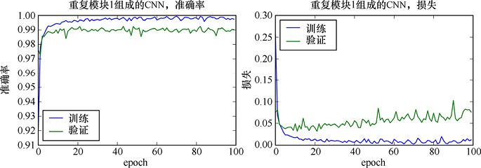

> **圖片描述：** 使用重複模組結構的CNN在MNIST上的訓練曲線。


圖24.38　使用圖24.37中的結構來評估MNIST資料


訓練的最後一行程式碼如清單24.47所示。


**清單24.47　**訓練圖24.37中的模型的最後一行程式碼。


```
Epoch 100/100
339s-loss: 0.0119-acc: 0.9974-val_loss: 0.0760-val_acc: 0.9902
```


這不是我們見過的最好的資料，也有一些過擬合，但對於一個本質上隨便創建的網路來說，這並不壞。運行每個epoch確實需要相當長的時間，正如我們從所有這些層中所期望的那樣。


正如我們之前所做的，讓我們將池化層替換為每個集合的最後卷積層的步進，如圖24.39所示。我們通常把其他層的步幅保持在1。這正成為一個更有吸引力的選擇，因為省略池化層給我們提供了一個更小、更快的網路，當參數得到很好的調整時，性能似乎沒有損失[Karpathy16a] [Springenberg15]。步幅大小通常是(2,2)，就像我們要替換的池化層一樣。


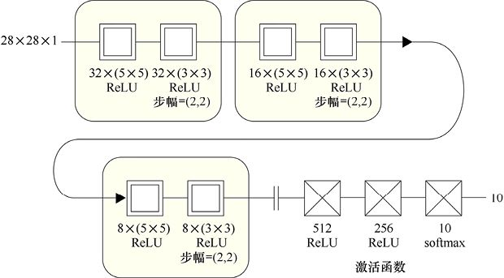

> **圖片描述：** 用步進替換池化層的重複模組CNN架構圖。


圖24.39　用卷積層中的步進替換圖24.37的池化層


結果如圖24.40所示。


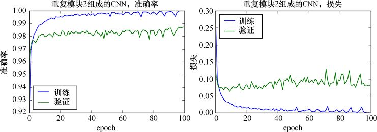

> **圖片描述：** 步進替換池化的CNN訓練曲線。


圖24.40　使用圖24.39中的模型來評估MNIST資料


訓練的最後一行程式碼如清單24.48所示。


**清單24.48　**訓練圖24.39中的模型的最後一行程式碼。


```
Epoch 100/100
186s-loss: 2.8056e-04-acc: 1.0000-val_loss: 0.0815-val_acc: 0.9873
```


訓練結果中的**噪聲**比以前稍微多一點，但它們落在了大致相同的地方。我們甚至把每個epoch的時間縮短了一半，這表明在卷積層步進的速度明顯快於隨後的池化層。這是有道理的，因為步進卷積意味著我們使用卷積過濾器的頻率更低，並且我們可以完全跳過後續的池化後處理步驟。


### 24.4.6　圖像資料增強


提高任何模型性能的最佳方法之一是儘可能多地提供訓練資料，同時避免過擬合。


當我們處理圖像時，可以很容易地通過簡單地操作已有的圖像來創建大量的新資料，在原始資料的基礎上創建各種各樣的變體。我們可以將每個圖像向左、向右、向上或向下移動，使其變得更小或更大，順時針或逆時針旋轉一定角度，或者水平或垂直翻轉。圖24.41展示了歐亞雕梟圖像的一些變體。我們特意使用了極端的轉換，這樣更容易看出它們的效果。


> **圖片描述：** 資料增強示例。一張歐亞雕梟照片經過旋轉、翻轉、縮放等變換產生多個變體，左上角為原圖，展示誇張的變換效果。


圖24.41　用旋轉、翻轉和縮放的方法擴充一幅歐亞雕梟的圖像。左上角是原圖。這些變換在此有意誇張以便展示它們的效果


通過創建變體來擴大資料集的過程稱為**資料放大**或**資料擴充**（data augmentation）。


當我們專門處理圖像時，Keras提供了一個內置對象來執行資料擴充，稱為**ImageData Generator**。它執行所有我們剛剛提到的以及其他的一些修改。


顧名思義，這個對象是一個“生成器”，它是Python語言中的一種特定對象[PythonWiki17]。簡而言之，生成器可以被認為是運行有內部循環的函數，通常可執行計算和生成資料。當該循環到達一個yield語句時，生成器將控制權返回給呼叫它的程式，並將yield的參數設置為函數值，就像return語句一樣。但是如果我們再次呼叫該函數，則循環會從最近停止的位置繼續進行，就好像它從未被中斷過一樣。


ImageDataGenerator以這種方式設置，是因為這樣我們可以配置它，使它為我們的每個輸入圖像產生大量變體。這可能需要大量的時間和電腦記憶體。因此，生成器按需創建批量圖像，而不是提前計算所有變體並將它們保存到需要的時候。每次我們呼叫生成器時，它都會生成並返回另一批圖像。我們將在下面看到fit()方法的一個變體，它使用生成器作為訓練資料的來源，而不是我們傳入的張量。程式每次需要更多資料時，它會一遍又一遍地呼叫生成器。


為了顯示它們的效果，我們應用於圖24.41中圖像的轉換被故意誇大了。實際上，我們希望產生與輸入足夠接近的、合理的新資料。畢竟，沒有理由從失真的輸入中學習，這些輸入不能代表我們期待看到的資料。事實上，那樣做可能會損害最終性能，因為網路的部分性能將無用地用於處理那樣的輸入。


如果我們想稍後再次使用我們生成的資料，可以通過告訴生成器在給定目錄中讀取和寫入其圖像來節省時間。然後，每當我們要另一批圖像時，它會讀取並返回已保存的已轉換文件（如果它們可用），要不然就生成它們，保存它們，然後返回它們。當我們想要查看生成的文件時，此功能也很有用，它可以確保我們選擇了獲取我們所要的各種變體的正確選項。如果存儲空間非常寶貴並且我們的時間並不緊迫，我們可以一直跳過整個磁盤存儲，並根據需要不斷更新轉換後的圖像。


ImageDataGenerator是一個能夠對圖像應用各種變換的重要工具。我們只需要在構建對象時列出我們想要的圖像轉換操作，它就會全部使用它們。我們將通過幾個轉換來演示這個過程。Keras文檔提供了所有可用選項的完整列表。


整個設置和使用該生成器的過程只需兩步：首先，使用我們想要的選項創建ImageData Generator；其次，訓練我們的模型。但是我們使用fit_generator()而不是fit()來開始訓練。這兩個都採用相同的參數，但有一點例外：fit_generator()的第一個參數是一個返回批量樣本的函數。


我們為fit_generator()提供的常用函數是一個名為flow()的函數，它是作為ImageDataGenerator對象的一部分自動為我們創建的。生成器按需生成的資料流，就像我們轉動水龍頭把手時流出的水一樣。呼叫flow()會提供一系列訓練樣本供我們使用。


fit_generator()和flow()一起管理批量圖像的生成，並將它們以訓練為目的呈現給我們的模型。清單24.49展示了ImageDataGenerator的典型用法。


**清單24.49　**使用一個ImageDataGenerator來產生轉換過的圖像。每幅圖都可能被隨機水平翻轉過，或者向某個方向被旋轉了至多100°。


```
*# create the image generator with rotations and flips*
image_generator = ImageDataGenerator(
                         rotation_range=100,
                         horizontal_flip=True)
*# fit our model using images produced by the image generator*
model.fit_generator(image_generator.flow(
                    X_train, Y_train, batch_size=256),
                    seed=42, epochs=100,
                    samples_per_epoch=len(X_train))
```


ImageDataGenerator使用來自MNIST訓練集的單個樣本生成的一些圖像如圖24.42所示。


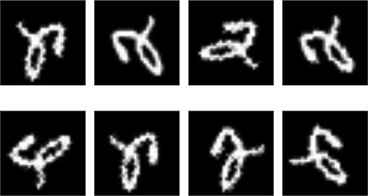

> **圖片描述：** MNIST數字2的ImageDataGenerator變體。多張由數字2經旋轉和翻轉產生的變形圖像，包括水平翻轉和大範圍旋轉。


圖24.42　基於單張MNIST資料集中數字2的樣本，使用一個ImageDataGenerator來產生變體。出於演示目的，我們允許水平翻轉，以及大範圍的旋轉。實際上，對於這個資料，我們很可能只會用小得多的角度的旋轉，我們也不會允許翻轉，因為“2”的鏡像根本不是一個“2”。另外，圖中低分辨率原圖重取樣的邊緣附近可見一些噪聲


通常，此程式碼的每次運行都會產生不同的結果。對於測試和調試，每次都返回相同的序列通常很有用。因此我們可以通過在呼叫flow()時設置seed參數來強制執行此操作，正如我們之前所做的。這與為隨機數生成器設置種子的目的相同，即將其設置為始終生成相同的偽隨機值序列。


在清單24.49中，我們還告訴了flow()每批需要多少個樣本，以及多少個樣本構成一個epoch，以及我們想要多少epoch。


必須指定每個epoch的樣本數似乎很奇怪，因為到目前為止，庫已經能夠從輸入張量的大小推斷出它。但是隻要我們繼續呼叫生成器，它就會不斷地產生變體，因此遍歷通常稱為一個epoch的“所有資料”並不會有真正意義。然而，設定epochs很重要。例如，統計資訊是在一個epoch結束時被採集的，我們的回調函數也是此時被呼叫的。因此我們告訴flow()在它簡單地聲明一個epoch結束之前要生成多少張圖像。samples_per_epoch的值必須是batch_size的倍數，否則我們將收到錯誤提示。


### 24.4.7　合成資料


構建網路通常是因為我們希望將它們能被部署到實際使用中，因此我們用實際資料訓練它們。但是，測試和訓練資料集對於幫助我們試驗架構、預處理策略和超參數非常有用。


創建一個我們可以控制一切的環境的一個好方法是訓練我們自己的資料，這是我們按需生成的。那麼我們可以製作我們想要的資料，而不是搜索那些接近的東西。


我們使用**合成資料**這個詞來描述我們自己創建的資料，這通常是使用演算法動態實作的。我們在第15章中就看到了合成資料，當時我們使用scikit-learn的內置演算法來製作半月形和斑點。


生成合成資料的好處在於，我們可以根據需要製作儘可能多的資料，然後像往常一樣使用它進行訓練。


這在概念上很容易實作。我們只要將資料生成程式掛鉤到ImageDataGenerator對象的變體中即可。


這裡的技巧是修改ImageDataGenerator對象中的flow()程式。通常，flow()從訓練集中提取下一個樣本，然後將我們請求的轉換應用於它。我們可以修改該步驟，以使它不是從訓練集中提取樣本，而是呼叫程式來創建全新的樣本及其標籤。然後，像往常一樣，新樣本被轉換並返回。


雖然說起來很容易，但這項技術有點複雜，需要Python中的一些巧妙技巧，並且這方面的指導文檔很少。該資源可以在本章的筆記本中找到，它改編自一個在線示例[Xie16]。


為了演示這個想法，我們編寫了一個小程式，在64像素×64像素的方形內繪製圖像。有5種類型的圖像：“Z”形、加號形、三條垂直線、一個方形U和一個圓形。每當我們繪製其中一個圖像時，會將這些點稍微擺動一點，這樣就不會有兩個相同的形狀。該函數返回它繪製的圖像和標籤。標籤是0～4的數字，用於標識圖像是哪種類型。


圖24.43展示了這些圖像的隨機集合。請注意，這些變化是在構成圖像的點上執行的，與我們在獲得圖像後通過ImageDataGenerator應用的變形類型（縮放、旋轉等）所獲得的圖像有本質上的不同。


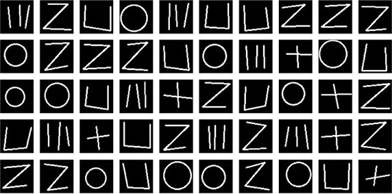

> **圖片描述：** 合成幾何形狀圖像集。5行10列的白色線條圖在黑色背景上，包含平行線、Z形、L形、圓形、十字形等基本形狀，位置略有隨機擾動。


圖24.43　一個小程式生成的合成圖像。5種圖像中的每一種都包括在初始位置附近隨機擾動的點（若是圓的話，則為半徑）


我們使用瞭如上修改的ImageDataGenerator版本來訓練圖24.44所示的簡單CNN。


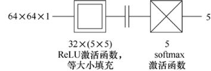

> **圖片描述：** 用於合成資料分類的簡單CNN架構圖。


圖24.44　用於對合成資料進行分類的簡單CNN


結果如圖24.45所示。


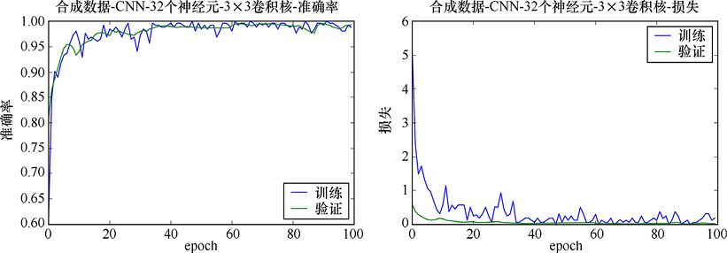

> **圖片描述：** 合成資料CNN的訓練曲線。準確率和損失的即時變化。


圖24.45　我們的簡單模型在合成資料上即時產生的準確率與損失


儘管它只有分類CNN的最小規模，但網路可以在測試資料上保持令人印象深刻的準確性，而且沒有出現明顯的過擬合。


### 24.4.8　CNN的參數搜索


深層的網路可能需要很長時間才能訓練好，特別是當我們使用大資料集時。如果我們使用前面用過的GridSearchCV或RandomizedSearchCV對象來搜索超參數，那麼可能沒有在合理的時間內產生結果的足夠的計算能力。


有一些更快的選擇，但是它們需要一些工作來設置和使用，所以我們不會在這裡討論它們。一個學習自動參數搜索的好地方是Spearmint項目[Snoek16a] [Snoek16b]。


## 24.5　RNN


正如我們在第22章中看到的那樣，循環神經網路（RNN）對於**序列資料**（sequential data）非常有用。我們一直在使用的MNIST圖像資料不是序列，因為圖像沒有順序。


另外，序列資料本質上是有序的。典型的例子是日常溫度、股票的每日價格和潮汐的每小時高度。也有一些資料是有序的，但不一定是時序的，例如按身高排列的兒童、圖書館書架上的書，以及彩虹的顏色。


在所有這些現象中，我們希望使用輸入序列中的資訊來幫助我們產生新的輸出。


在RNN術語中，我們仍然有一個由樣本組成的資料集，其中每個樣本包含多個特徵。但現在每個特徵都包含多個值，稱為**時間步長**（time step）。回想一下，我們也可以將“時間步長”視為“給定特徵的一系列測量值”。我們在第22章的例子中想象了一個山頂的氣象站，在白天8個小時的時間內每小時進行測量。每天的結果組成一個樣本，每種類型的測量（如溫度和風速）都是一個特徵。每個特徵包含8個時間步長，每小時有一個值。


在本章中，我們一直在對MNIST資料進行分類。但是MNIST資料沒有序列性質，且我們現在的目標不是分類，而是預測序列中的下一個值。因此，在24.5.1節中，我們將生成一些我們自己的新資料，並使用它們來展示如何設置和運行RNN。


### 24.5.1　生成序列資料


有許多可用的連續資料集，但其中一些很複雜或難以繪製。因此，讓我們創建自己的簡單資料集，以便輕鬆地繪製和解釋。


我們將僅僅添加一堆正弦波，例如圖24.46中頂部的正弦波。每個正弦波有其頻率、振幅和相位（或位移）。我們將編寫一個程式，該程式使用由freqs（頻率）、amps（振幅）和phase（相位）分別組成的列表，並藉此在許多點累加所有的波。圖24.46展示了這個想法。


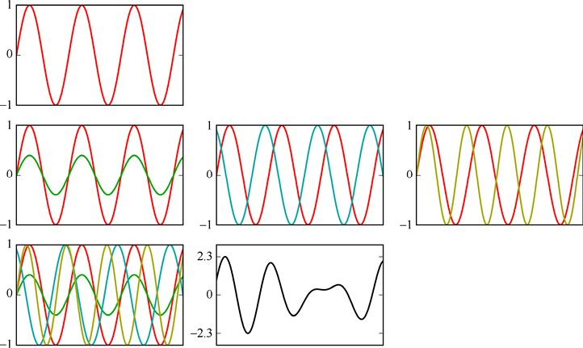

> **圖片描述：** 累加正弦波的構造過程。第1行為單一正弦波。第2行展示不同振幅、相位和頻率的正弦波疊加。第3行為所有波疊加的結果。展示如何構建複雜的測試信號。


圖24.46　累加正弦波。第1行：一個單一的正弦波。第2行左圖：初始波，以及一個振幅更小的波。第2行中圖：初始波，以及一個相位不同的波。第2行右圖：初始波，以及一個頻率不同的波。第3行左圖：全部重疊在一起的4個波。第3行右圖：累加在一起的4個波


我們的曲線構建小程式需要另外3個參數。第一個是一個名為number_of_steps的整數，它告訴程式要生成多少個點。第二個是一個名為d_theta的浮點數，它告訴程式樣本的間距（該名稱來自基於角度的正弦波，其通常用小寫的希臘字母θ表示）。最後，是一個名為skip_steps的提供起點偏移量的整數，因此我們並不總是從0開始。這對於創建測試資料很有用，測試資料可以從訓練資料的右側開始。


小程式sum_of_sines()如清單24.50所示。我們寫它是為了清晰地敘述。由於這完全是Python編程，而不是特定的機器學習，我們不會詳細介紹。


**清單24.50　**產生由多種不同正弦波加和而成的列表的小程式。


```
def sum_of_sines(number_of_steps, d_theta, skip_steps,
                 freqs, amps, phases):
    ′′′Add together multiple sine waves and return
         a list of values that is number_of_steps long.
         d_theta is the step (in radians) between samples.
         skip_steps determines the start of the sequence.
         The lists freqs, amps, and phases should all be
         the same length (but we don′t check!)′′′
    values = []
    for step_num in range(number_of_steps):
         angle = d_theta * (step_num + skip_steps)
         sum = 0
         for wave in range(len(freqs)):
             y = amps[wave] * math.sin(
                          freqs[wave]*(phases[wave] + angle))
             sum += y
         values.append(sum)
    return np.array(values)
```


我們將使用此例程生成兩個不同的資料集，並將其稱為資料集0和資料集1。我們用於構建它們的值是通過反覆試驗找到的，一個是為了不會太難預測而直到產生感覺“平靜”的圖形為止來得到的，另一個則是為迎接更難的挑戰而直到令人覺得“繁忙”為止來得到的。


我們將用於評估的資料視為一個測試集，該測試集僅使用一次，而並非在評估不同形式的網路時可以使用多次的驗證集。


資料集0是兩個波較為平緩的加和。我們通過將freqs設置為[1,2]，使第二個波的速度為第一個波的兩倍；通過將amps設置為[1,2]，使第二個波的高度為第一個波的兩倍；通過將phases設置為[0,0]，使兩個波都從0開始。我們的訓練資料來自使用200步（number_of_steps=200）、步長約為0.057弧度（d_theta=0.057）且沒有偏移（skip_steps=0）的參數。通過觀察我們選擇了這個奇異的步長，以使200個樣本產生我們覺得對一個簡單測試例子來說數量不錯的資料。


訓練集長度為200個樣本，從0開始。測試集是從訓練集的右側開始的另外200個點。清單24.51展示了要產生資料集時的程式呼叫。


**清單24.51　**創建資料集0。


```
train_sequence_1 = sum_of_sines(
                         200, 0.057, 0, [1, 2], [1, 2], [0, 0])
test_sequence_1 = sum_of_sines(
                         200, 0.057, 400, [1, 2], [1, 2], [0, 0])
```


得到的訓練序列和測試序列如圖24.47所示。


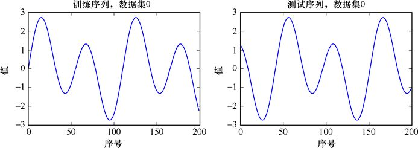

> **圖片描述：** 第一組（平靜的）正弦波的訓練和測試序列。規則的波形曲線，左半段為訓練資料，右半段為測試資料。


圖24.47　第一組正弦波的訓練序列和測試序列


資料集1是使用4個波組成的更難的挑戰。對於這個集合，我們將freqs設置為[1.1,1.7,3.1,7]，將amps設置為[1,2,2,3]，然後再次將所有相位保持為0，即phases為[0,0,0,0]。之所以選擇特殊的頻率是為了使圖案不會在成千上萬的樣本中重複出現。其他變量與產生資料集0時使用的相同。清單24.52展示了創建此資料集的程式。


**清單24.52　**創建資料集1。


```
train_sequence_2 = sum_of_sines(200, 0.057, 0,
                                [1.1, 1.7, 3.1, 7],
                                [1, 2, 2, 3], [0, 0, 0, 0])

test_sequence_2 = sum_of_sines(200, 0.057, 400,
                               [1.1, 1.7, 3.1, 7],
                               [1, 2, 2, 3], [0, 0, 0, 0])
```


得到的訓練序列和測試序列如圖24.48所示。


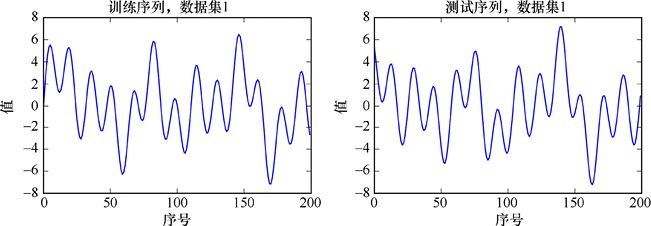

> **圖片描述：** 第二組（較複雜的）正弦波的訓練和測試序列。波形更加不規則，振幅和頻率變化較大。


圖24.48　第二組更繁忙一些的正弦波的訓練序列和測試序列


### 24.5.2　RNN資料準備


在Keras中為RNN準備資料的機制比我們目前使用的更復雜，因為我們必須執行幾個重塑步驟才能使用我們想要的所有的庫程式。我們還需要提取我們的小窗口子列表，由於沒有任何庫程式可以幫助我們完成，這個列表我們必須自己創建。


讓我們深入瞭解各個步驟，然後按順序將它們逐個完成。


和以前一樣，我們希望將資料正規化到[0,1]的範圍內。來自scikit-learn的MinMaxScaler是完成這項工作的完美工具。但是回想第15章可知，這個程式要求我們的特徵垂直排列，如圖24.49所示。


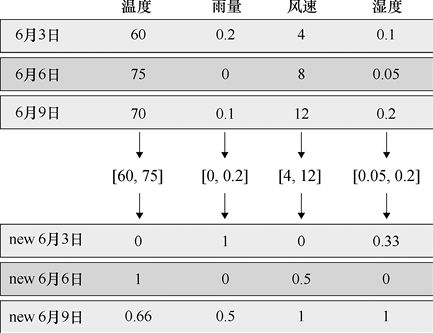

> **圖片描述：** MinMaxScaler正規化操作示意。左側為原始資料表格，右側為正規化後的表格，每列獨立縮放到[0,1]範圍。


圖24.49　MinMaxScaler，像大多數逐特徵歸一器一樣，讀入每個特徵的所有值，找到其最小值和最大值，然後將該資料縮放到[0,1]範圍內。每種特徵（這個例子中的每一列）都單獨縮放（這是圖12.37的一種變體）


正弦波資料只有一種特徵，有很多時間步長，它是一個一維列表（也就是說，它不是MinMaxScaler期望的一列）。因此，讓我們將資料重新整理成一列。在Python中，這意味著製作一個與我們的測量值集合一樣高的二維網格，並且只有一個元素寬，如圖24.50所示。


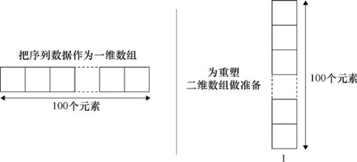

> **圖片描述：** 將正弦波值列表重塑為二維網格。左側為一維列表，箭頭指向右側的單列二維網格格式。


(a)　　　　　　　　　　　　　　　　　　　　　　　　　　　　　(b)


圖24.50　將正弦波值列表重塑為一個只有一列的二維網格


我們可以使用reshape()來實作這一點，如清單24.53所示。其中train_sequence和test_sequence可以是來自資料集0或資料集1的相應變量。


**清單24.53　**我們的輸入資料包括兩個名為train_sequence和test_sequence的一維列表。為了讓它們為MinMaxScaler做準備，我們將每個列表轉換成一列元素。


```
train_sequence = np.reshape(train_sequence,
                               (train_sequence.shape[0], 1))
test_sequence = np.reshape(test_sequence,
                               (test_sequence.shape[0], 1))
```


現在資料有提供給MinMaxScaler的正確格式了，我們將創建該對象的實例，然後在訓練資料上呼叫其fit()程式。它會找到最小值和最大值，並記住它們。然後，像往常一樣，我們通過呼叫縮放器transform()的方法將轉換應用於訓練和測試資料，如清單24.54所示。為了清楚起見，我們將賦予結果前綴為scaled的新名稱。


**清單24.54　**我們基於訓練資料形成該轉換，然後將其應用到訓練資料和測試資料上，並將結果保存在新變量中。


```
from sklearn.preprocessing import MinMaxScaler

min_max_scaler = MinMaxScaler(feature_range=(0, 1))
min_max_scaler.fit(train_sequence)
scaled_train_sequence = min_max_scaler.transform(train_sequence)
scaled_test_sequence = min_max_scaler.transform(test_sequence)
```


注意，像往常一樣，我們首先將縮放對象擬合到訓練資料，然後將該轉換應用於測試（或驗證）資料上。min_max_scaler對象會記住它的變換，所以我們之後能夠將它的逆轉換應用於神經網路的輸出，來給出一個與輸入相同範圍的結果。


現在資料已經標準化，我們可以創建構成訓練和測試資料的小窗口子列表了，如圖24.51所示。


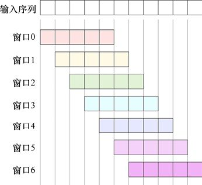

> **圖片描述：** 滑動窗口截取序列的過程。一條水平時間線上標示多個重疊窗口，每個窗口框住固定長度的子序列，窗口之間有重疊。


圖24.51　將輸入序列截取為一系列小窗口子列表。每個子列表有相同的長度（即窗口長度）。在這個例子中，窗口之間是相互重疊的，每個窗口從前一窗口右側的第一個元素開始


一旦有了窗口，我們就可以將它們分成樣本（即除了最後一個元素之外的所有內容）以及目標（即最後一個元素），如圖24.52所示。


> **圖片描述：** 窗口資料的訓練格式。每個窗口的前n-1個元素作為樣本輸入，最後一個元素作為預測目標。


圖24.52　我們將每個窗口化的列表中除最後一個元素之外的部分作為樣本，將最後一個元素作為目標


在使用RNN時，構建這些窗口是一種常見的操作。或許有無數種寫程式的方法來完成這項工作。我們將提供一個清晰說明的版本。它將給定大小的窗口的起始點從序列的開始移動到結束前的某一位，即停止在能使整個窗口仍然全部處於輸入序列內的最後位置。因為這是直接的Python編程，並且與機器學習沒有什麼關係，所以我們不會深入研究細節。清單24.55展示了我們的例程。


**清單24.55　**一個將一個列表的元素及窗口尺寸轉換為兩個新列表的Python程式。第一個新列表包含多個由初始列表產生的相互重疊的子序列。每個子序列長度比給定的窗口尺寸小1。第二個新列表則包含初始序列中每個上述子序列的下一個元素，它在訓練和測試中將被用作我們的目標。


```
def samples_and_targets_from_sequence(sequence, window_size):
    ′′′Return lists of samples and targets built from overlapping
    windows of the given size. Windows start at the beginning of
    the input sequence and move right by 1 element.′′′
    samples = []
    targets = []
    *# i is starting position*
    for i in range(sequence.shape[0]-window_size):
        *# sub-list of elements*
        sample = sequence[i:i+window_size]
        *# element following sample*
        target = sequence[i+window_size]
        *# append sample to list*
        samples.append(sample)
        *# append target to list*
        targets.append(target[0])
        *# return as Numpy arrays*
        return (np.array(samples), np.array(targets))
```


我們現在可以通過將縮放過的序列交給此程式來創建訓練資料和測試資料了，如清單24.56所示。和以前一樣，我們把窗口化的訓練資料分配給變量X_train和y_train，把窗口化的測試資料分配給X_test和y_test。我們假設已經設置了整數變量window_size。


**清單24.56　**使用清單24.55中的工具函數創建訓練資料和測試資料。


```
(X_train, y_train) = samples_and_targets_from_sequence(
                            scaled_train_sequence, window_size)
(X_test, y_test) = samples_and_targets_from_sequence(
                            scaled_test_sequence, window_size)
```


現在我們有了資料，還必須確保它具有必要的**形狀**。


將資料的形狀變為網路所需的正確格式，對於RNN及我們見過的所有其他類型的網路一樣重要。如果我們用與網路預期不匹配的方式組織資料，要麼遇到錯誤，要麼網路會陷入混亂併產生瘋狂的結果。


好消息是我們已經完成了這項任務，因為我們編寫了程式samples_and_targets_from_ sequence，它會按我們在Keras中訓練RNN所需的形狀返回資料。


讓我們看一下這些形狀，以便清楚地瞭解資料的結構。


比較簡單的部分是目標部分，存儲在y_train和y_test中，它們只是一維列表。


我們在X_train和X_test中保存的訓練和測試資料是三維塊。X_train塊與我們能夠生成的窗口數（即樣本數）一樣深，並且與窗口尺寸本身一樣高（即時間步長）。該塊與我們正在學習的特徵數量一樣寬。由於此資料集中我們只有1個要素，因此該塊只有1個元素寬。


這是我們在Keras中訓練RNN所需的結構。塊的深度告訴我們所要訓練的樣本數量。時間步長垂直排列、特徵水平排列。圖24.53對一個帶有3個樣本的假想資料集進行了這樣的分解，每個樣本由2個特徵組成，每個特徵有7個時間步長。


> **圖片描述：** RNN訓練資料的三維結構。X_train為多個樣本x多個特徵x多個時間步的立方體。右側依序展示：第一個樣本、第一個特徵、前三個時間步的提取過程。


　　　　　　　　　　　　(a)　　　　　　　　　　　　　　　　　　　　　 (b)　　　　　　　　　　　　(c)　　　　　　　　　　　　　(d)


圖24.53　為RNN訓練準備的資料的結構。我們有3個樣本，每個樣本包括2個特徵，每個特徵包含7個時間步。(a)準備好用於訓練RNN的X_train資料集。(b)X_train的第一個樣本是塊中最靠近我們的那個切片。在這裡元素用A到G標記。這可以被表示為一個二維網格。(c)這個樣本的第一個特徵位於最左側那列。(d)這一列中的元素是對應特徵的時間步長


如前所述，我們設置了預處理，使得資料現在處於合適的形狀，如圖24.54所示。


至此，資料的預處理就完成了，可以進行訓練了。


> **圖片描述：** 訓練資料形狀示意。一個三維長方體標示95個樣本、窗口尺寸7，旁邊展示測試資料的類似但較小的形狀。


圖24.54　訓練資料的形狀。假設我們有95個樣本、窗口尺寸為7。測試資料有相似的形狀，儘管樣本數更少


### 24.5.3　創建並訓練RNN


既然資料已經被恰當地正規化和結構化，我們就可以創建網路並訓練它了。


我們將創建一個非常簡單的RNN以便快速運行，但它仍然展示了所有基本原理。我們將有一個循環層，然後是一個全連接層，如圖24.55所示。注意，全連接層沒有列出激活函數。這是因為我們不希望它修改計算出的值，該值是我們的預測。在這裡，要麼說我們沒有使用激活函數，要麼說我們已經將它設置為線性函數了。


> **圖片描述：** 簡單RNN架構圖。底部輸入時間步長，一個循環層（3個記憶元素），頂部一個全連接層（1個神經元，無激活函數）。


圖24.55　第一個RNN將有一個帶有3個記憶元素的循環層，跟隨著一個僅有一個單元的全連接層。輸入包含與窗口相同的時間步長。該全連接層沒有激活函數


回顧第22章，RNN中使用了兩種標準類型的構建塊：LSTM（長短期記憶）和GRU（門控循環單元）。Keras支援這兩種方法，並且這些層以它們使用的單元命名。


讓我們使用LSTM吧。除非另有明確說明，否則圖24.55所示的RNN圖標代表LSTM單元。


要創建LSTM層，我們只需使用我們想要的選項創建一個LSTM對象，然後像往常一樣使用add()將其放入模型中。


該層的狀態應該有多少記憶體？讓我們從3個元素開始。


當製作LSTM層時，我們要指定所需的單元數。因為這將是第一層網路，我們還必須給出輸入維度。像往常一樣，我們將參數input_shape設置為一個樣本的形狀。從上面的討論中，我們知道每個樣本都是一個二維網格，其高度是時間步長（即窗口的高度），其寬度是特徵的數量（這裡只有1個），如我們在圖24.53中所見的一樣。


清單24.57展示瞭如何創建這個層。


**清單24.57　**創建一個LSTM層對象。第一個參數是這層中LSTM單元的數量。第二個參數是input_shape，告訴了單個樣本的尺寸。


```
lstm_layer = LSTM(3, input_shape=[window_size, 1])
```


我們用一個只有單個神經元的全連接層緊隨其後。如果我們沒有在全連接層中指定激活函數，則Keras預設其為None。這種情況下對我們有好處，因為我們不希望將輸出壓縮到[0,1]、[−1,1]或任何其他範圍。為了明確，我們將包含一個多餘的None賦值給激活函數。


完整的模型如清單24.58所示。


**清單24.58　**創建RNN 模型。我們只需要像平時一樣以Sequential對象創建一個模型，加上RNN層（這個例子中，是一個LSTM對象），然後在最後放上一個單神經元全連接層。


```
# create and fit the LSTM network
model = Sequential()
model.add(LSTM(3, input_shape=[window_size, 1]))
model.add(Dense(1, activation=None))
```


這就是創建RNN模型所要做的事。現在我們只需要編譯並運行它。


像往常一樣，要編譯模型，我們需要提供損失函數和最佳化器。在本章中我們一直使用Adam最佳化器並且它一直運行良好，所以讓我們繼續使用它。對於損失函數，我們不再使用和之前相同的分類函數，因為我們不再進行分類。我們想要的是能將網路輸出的單一值與該樣本的目標值進行比較的函數。在Keras文檔中查看損失函數列表，我們可以看到mean_squared_error損失函數的功能就是這個，所以讓我們使用它。


編譯步驟如清單24.59所示。


**清單24.59　**編譯RNN。我們使用之前那樣的“adam”最佳化器並選擇使用“mean_squared_error”損失函數，它更適合於這個RNN。


```
model.compile(loss=′mean_squared_error′, optimizer=′adam′)
```


既然模型已經被編譯了，我們就通過呼叫fit()函數來像訓練所有其他模型一樣訓練它。我們在這裡做的唯一改變是使用的批量大小為1，因為一些試驗表明，對於這個小型網路和這個小資料集，這樣做產生了最好的結果。清單24.60展示瞭如何訓練RNN。


**清單24.60　**用fit()訓練RNN。除了將batch_size設置為1這一點，其他步驟與所有訓練步驟一樣。


```
history = model.fit(X_train, y_train, epochs=number_of_epochs,
                    batch_size=1, verbose=2)
```


將這些步驟放在一起便有了清單24.61中的程式碼。這就構建了RNN，然後按我們設定並保存在變量number_of_epoches中的任何訓練epochs數來訓練它。


**清單24.61　**構建和訓練RNN。


```
*# create and fit the LSTM network*
model = Sequential()
model.add(LSTM(3, input_shape=[window_size, 1]))
model.add(Dense(1))
model.compile(loss=′mean_squared_error′, optimizer=′adam′)
history = model.fit(X_train, y_train, epochs=number_of_epochs,
                    batch_size=1, verbose=2)
```


現在我們已經訓練了模型，就可以進行預測了。在清單24.62中，我們計算了訓練資料和測試資料兩者的預測。


**清單24.62　**和往常一樣，我們通過給模型的predict()方法傳遞樣本資料來從模型得到預測。


```
y_train_predict = model.predict(X_train)
y_test_predict = model.predict(X_test)
```


查看結果之前，需要強調的是，在用網路進行預測時，我們很少直接使用結果。


問題是我們已將MinMaxScaler應用於輸入資料（包括訓練和測試），將其從初始值轉換為更適合訓練的範圍。這**意味著網路的預測資料也被轉換了**。例如，如果我們的原始資料在[−6,6]的範圍內，那麼在轉換之後它將在[0,1]的範圍內。這意味著預測資料也將在[0,1]的範圍內。


因此，我們無法直接將預測資料與原始資料進行比較。在簡單縮放的情況下，就像我們在這裡做的這樣，這不是一個主要問題。但是如果我們執行了一個更復雜的處理步驟，那麼主觀地解釋預測資料可能變得非常困難。


正如我們在第12章中看到的，一般的解決方案是**反向轉換**預測的資料。像大多數scikit-learn的轉換程式一樣，MinMaxScaler提供了一個名為inverse_transform()的特定方法。


在清單24.63中，我們使用min_max_ scaler（我們的MinMaxScaler對象）的inverse_ transform()方法來逆轉換預測資料。我們還將逆轉換訓練資料和測試目標資料。


**清單24.63　**我們逆轉換了原本的目標資料和來自訓練集與測試集的預測目標資料。這個過程撤銷了我們用min_max_scaler()的transform()方法執行的測量操作。


```
# inverse-transform original targets
inverse_y_train = min_max_scaler.inverse_transform([y_train])
inverse_y_test = min_max_scaler.inverse_transform([y_test])
# inverse-transform predictions
inverse_y_train_predict = \
        min_max_scaler.inverse_transform(y_train_predict)
inverse_y_test_predict = \
        min_max_scaler.inverse_transform(y_test_predict)
```


反轉（即逆轉換）初始目標y_train和y_test可能看起來很浪費。為什麼不簡單地保存反轉的初始目標，並在此處使用它們呢？


讓我們再看一下清單24.54的最後兩行，在這裡重複為清單24.64。


**清單24.64　**清單24.54的最後兩行，在這裡我們對資料進行了轉換。


```
scaled_train_sequence = min_max_scaler.transform(train_sequence)
scaled_test_sequence = min_max_scaler.transform(test_sequence)
```


可以看到，在將它們分成樣本和標籤之前，我們已經轉換了整個窗口序列，所以在此之前我們從未真正將標籤y_train和y_test放在未轉換的變量中。


我們只是為了清晰和簡單才以這種方式構建程式碼。在標籤轉換之前提取和保存它們是合理的，這樣我們就不需要在這裡**撤銷**轉換。無論哪種方式都有效。我們將繼續使用剛才提出的版本。


現在我們已將預測結果返回到原始資料範圍內了，這樣就可以用原始資料繪製它們，並查看預測結果有多好。我們還可以使用它們來獲得準確率的快速數值摘要——使用稱為**均方根誤差**或**RMS誤差**的度量方式。這是一種衡量誤差的標準方法，可以讓我們看到多個網路比較同一東西時的區別。拋卻其中的平方根，均方根誤差與“mean_squared_error”損失函數的計算結果是相近的。我們使用math模組中的平方根函數sqrt()和scikit-learn中的mean_squared_error()函數來計算這個值，如清單24.65所示。


**清單24.65　**計算並報告訓練和測試集的預測結果的RMS誤差。


```
from sklearn.metrics import mean_squared_error
trainScore = math.sqrt(mean_squared_error(
                            inverse_trainY[0],
                            inverse_y_train_predict[:,0]))
print(′Training RMS error: {:.2f}′.format(trainScore))

testScore = math.sqrt(mean_squared_error(inverse_testY[0],
                            inverse_y_test_predict[:,0]))
print(′Test RMS error: {:.2f}′.format(testScore))
```


有趣的索引源於原始目標與對應預測結果資料形狀的不同。在程式碼中，inverse_ y_train和inverse_y_test是隻有一行的二維網格（例如，如果每個集合中有30個目標，它們的形狀將是1×30），因此，通過選擇inverse_y_train [0]，我們得到在第一行（也是僅有的一行）存儲的資料列表。另外，從model.predict()返回的預測結果是具有一列的二維網格（因此它們將是30×1）。我們通過選擇inverse_y_train_predict [：，0]來得到第一（也是唯一的）列中的資料列表。


諸如使這些索引正確的問題通常是很難預料的，因此我們通常只有在編寫一些看似合理其實一團糟的程式碼時才會發現它們。以交互方式使用解釋後的Python程式能讓我們逐步、逐行地檢查變量的形狀，並進行適當的調整和選擇，以便我們在每一步選擇所需的資料。


### 24.5.4　分析RNN性能


讓我們在這個微小的RNN上試試正弦波資料。我們將從圖24.47中比較簡單的資料集0開始，如圖24.56所示。


> **圖片描述：** 平靜資料集的兩條曲線（訓練和測試），展示規則的正弦波形。


圖24.56　“平靜”資料集。這個是圖24.47的重複展示。在這個資料集中共有200個資料點


回想一下，那個命名笨拙的資料生成程式samples_and_targets_from_sequence()會接收一個名為window_size的參數，該參數允許我們指定每個樣本中要使用的時間步長。


讓我們任意地選擇大小為3個時間步長的窗口。這意味著每個樣本將有3個值，我們將要求網路預測隨後的值。我們將始終把該值作為目標提供，以便在訓練期間，系統可以學習匹配該值，並且在測試期間，我們可以看到其表現如何。


像往常一樣，我們將訓練100個epoch。在每個epoch之後，我們得到一個數，由此獲悉，資料集的損失（通過預測的值與目標之間的差異來衡量）。


損失如圖24.57所示。


> **圖片描述：** RNN在資料集0上的訓練損失曲線。損失隨epoch快速下降後趨於穩定。


圖24.57　在窗口尺寸為3個時間步長的資料集0上訓練RNN 100個epoch產生的損失


損失迅速下降到大約0.06，然後在第8個epoch附近平緩地下降到接近0，並在接下來的約60個epoch裡繼續下降，最終在大約80個epoch後達到一個在視覺上很難與0區分開的值。


讓我們根據資料繪製預測值，以便我們能夠看出最終的表現。


圖24.58用黑色表示訓練資料，用紅色表示預測值。注意，我們在訓練集中使用了200個樣本。


> **圖片描述：** RNN對資料集0訓練資料的預測。黑色為實際值，紅色為預測值，兩者幾乎完全重合。


圖24.58　在資料集0中的訓練資料用黑色表示。重疊其上的是來自我們用時間步為3的窗口訓練100個epoch後的RNN預測值


對於只有1個包含3個狀態元素的LSTM單元及1個後續神經元的網路來說，這是非常驚人的效果。儘管預測值和實際值之間的匹配並不完美，正如我們從山峰和山谷底部附近看到的，但它已經非常棒了。


預測值是從訓練資料的起點稍微往後的地方開始的，因為第一次預測的是訓練資料的第4個元素。這在圖中很難看出來，更容易在後面的結果中發現。


我們現在看一下測試資料。圖24.59以黑色表示測試資料，以紅色表示預測值。注意，我們在測試集中也使用了200個樣本。


> **圖片描述：** RNN對資料集0測試資料的預測。黑色為實際值，紅色為預測值，預測與實際高度吻合。


圖24.59　RNN在資料集0的測試資料上的預測結果。這是在用時間步長為3的窗口訓練100個epoch後的效果


測試資料看起來與訓練資料很相似，因為它是由相同的重複正弦波組成的，只是位於訓練序列的後面。測試的預測值很接近，也同樣再次在山峰和山谷的極點附近出現混亂。


也許我們在窗口中甚至不需要3個樣本。如果窗口中只有一個樣本呢？我們可以給網路一個值，並要求它預測下一個。因為資料集可能沒有任何完全重複的數字，所以這種方法只有一線希望。因此，如果它可以學習訓練集中每個值之後的值，就能複製這些數字。這種情況下訓練的損失如圖24.60所示。


> **圖片描述：** 窗口尺寸為1時RNN的損失曲線。損失下降較慢。


圖24.60　RNN用時間步為1的窗口在資料集0上訓練100個epoch的損失情況


圖24.61展示了這個模型對測試資料的預測。


> **圖片描述：** 窗口尺寸為1時RNN的測試預測。預測品質較差。


圖24.61　RNN對資料集0的測試集的預測。這是在用時間步長為1的窗口訓練100個epoch後的效果


我們顯然失去了相當“可觀”的性能，但這個網路在記憶輸入/輸出對方面做得很好。


儘管3個時間步長可以很好地預測測試資料了，但讓我們找另外一種方法，並將窗口大小調至5個時間步長。由於我們現在只是試圖瞭解事物，而不是進行詳細的分析，我們將跳過顯示預測訓練資料的曲線，並直接進入損失曲線和對測試資料的預測。圖24.62展示了5個時間步長窗口的損失曲線。


> **圖片描述：** 窗口尺寸為5時RNN的損失曲線。


圖24.62　RNN對測試資料集的損失。這來自在資料集0上用時間步長為5的窗口訓練100個epoch的效果


圖24.63展示了我們在5個時間步長的窗口情況下對測試集的預測。


> **圖片描述：** 窗口尺寸為5時RNN的測試預測。黑色實際值和紅色預測值高度重合，預測品質良好。


圖24.63　RNN對資料集0的測試資料的預測。這是在用5個時間步長訓練100個epoch後得到的


直觀看來，這很像我們在圖24.59中的3個時間步長的窗口的效果。也許一個包含3段資料的窗口足以讓網路在預測第4個值時做得足夠好。


讓我們試試第二個測試集中更復雜的資料（見圖24.48），此處在圖24.64中重複這種情況。


> **圖片描述：** 更複雜的資料集1的訓練和測試曲線。波形不規則，振幅和頻率變化大。


圖24.64　資料集1。本圖是對圖24.48的重複


由於時間步長3的窗口對於簡單資料運行良好，讓我們用它再試一次。測試集的損失如圖24.65所示。


> **圖片描述：** RNN在資料集1上的訓練損失曲線。


圖24.65　測試集上的損失。這是由RNN在資料集1上用時間步長為3的窗口訓練100個epoch得到的


與第一個資料集一樣，損失在開始時迅速下跌，然後其下降速度減緩。在第4個epoch附近有一個轉折，在第50個epoch附近有一個更為平緩的轉折，直到80個epoch左右達到0值。這表明這個測試集對於網路來說比上一個測試集更難學習，這是講得通的。


讓我們來看看這個時間步長為3的窗口的模型與測試資料的匹配程度。圖24.66展示了我們的結果。


> **圖片描述：** RNN在資料集1測試資料上的預測。黑色為實際值，紅色為預測值，預測大致追蹤了整體趨勢但細節有偏差。


圖24.66　RNN對資料集1的測試資料的預測。這是在用時間步長為3的窗口訓練100個epoch後的效果


對於這麼小的網路和如此扭曲的資料集來說，這是一個非常好的匹配結果，特別是只用了這麼小的窗口。讓我們嘗試一個包含5個時間步長的窗口，如圖24.67所示。


> **圖片描述：** 窗口尺寸5時RNN在複雜資料上的預測。紅色預測線追蹤黑色實際值，但在劇烈波動處有延遲。


圖24.67　用時間步長為5的窗口對該複雜資料集的預測


將窗口從3增加到5似乎適得其反，儘管在某些地方如第140個epoch周圍的波峰處的匹配有所改善。


回顧一下這些結果，我們只有1個帶3步記憶的LSTM單元及1個最終神經元的微小網路在兩個測試集上都做得很好。窗口大小通常會帶來些影響。對於這些簡單的資料集，似乎3個或5個時間步長的窗口通常都做得非常好。正如我們稍後將看到的，更復雜的資料集通常需要更大的窗口。


### 24.5.5　一個更復雜的資料集


到目前為止，我們只使用了一個循環層，因為它工作得很好。但我們可以通過簡單地添加更多的循環層來構建**深度循環神經網路**。添加的層數根據資料而定，或許有時最好只有幾個循環層，每個層都有很多狀態記憶體單元；或許有時最好有許多層，每個層只有少量記憶體。


我們可以對正弦波資料做一個小的改動，使RNN學習起來更具挑戰性：任何時候曲線都下降，我們都會繞著*x*軸翻轉它，以使它向上移動。我們的曲線將從平滑變為跌宕起伏，帶有突然的跳躍。這是我們為我們的網路創建更具挑戰性的資料集而嘗試的完全隨意的操作。


圖24.68展示了將這個操作應用於第二組波中的訓練資料——它創建了第三組資料，即資料集2。


> **圖片描述：** 修改後的上行資料集。將向下部分沿x軸反射，使所有曲線趨勢都向上。


圖24.68　用第二個資料集的訓練資料創建第三個資料集，就只需要當曲線開始向下走的時候，我們才會沿*x*軸反射它。這是用於訓練深度RNN的資料


我們理所當然地將這個修改後的資料製造函數稱為sum_of_upsloping_sines()，如清單24.66所示。


**清單24.66　**對sum_of_sines()的修改。此處我們將任意往下走的曲線翻轉到了上面。新加入的程式碼是其中的if語句及其之後的賦值語句。


```
def sum_of_upsloping_sines(number_of_steps, d_theta,
                            skip_steps, freqs, amps, phases):
    ′′′Like sum_of_sines(), but always sloping upwards′′′
    values = []
    for step_num in range(number_of_steps):
        angle = d_theta * (step_num + skip_steps)
        sum = 0
        for wave in range(len(freqs)):
            y = amps[wave] * math.sin(
                      freqs[wave]*(phases[wave] + angle))
            sum += y
        values.append(sum)
        if step_num > 0: # are we past the first sample?
            # find the direction we′re headed in
            sum_change = sum - prev_sum
            if sum_change < 0:          # are we going downward?
               values[-1] *= -1         # if so, flip the last
```


讓我們用與最近的實驗相同的小網路來運行新資料集，保持窗口大小為5。損失結果如圖24.69所示。


> **圖片描述：** 上行資料的RNN訓練損失曲線。


圖24.69　用3個單元、5個時間步長的窗口的RNN運行上行測試資料所造成的損失


損失在一開始快速下降，改善後速度減慢很多。在第60個epoch左右，它似乎已經穩定下來，或許從那時起就只有一點點改善了。


該模型對修改後的測試資料的預測如圖24.70所示。


> **圖片描述：** RNN對修改後上行測試資料的預測。


圖24.70　該模型對修改後的測試資料的預測


此處，延後開始（前4個值不預測）更容易在最左邊被看到。這個結果非常糟糕。預測值確實傾向於追蹤測試資料更直的部分，但是經常超過或未達到峰值和谷值。


小網路運行得出奇地好，但我們還是想要更好的效果。


### 24.5.6　深度RNN


讓我們添加第二個循環層，它也由3個LSTM單元組成，如圖24.71所示。


> **圖片描述：** 雙層RNN架構圖。兩個堆疊的循環層，第一層末端有小方框表示return_sequences=True，第二層輸出到全連接層。


圖24.71　雙層RNN的示意圖。第一層LSTM末端輸出處的小方框意味著它已將return_sequences設置為True


清單24.67展示瞭如何構建雙層深度RNN模型，它使用兩個LSTM層，各有3個LSTM單元。


第一個LSTM需要包含一個新參數return_sequences，我們需要將其設置為True。我們通過LSTM圖標右側的一個小方框指示這一點（或者，當網路從下到上繪製時，它在頂部）。我們將很快討論這個return_sequences是關於什麼的，但是現在我們可以將它視為無論何時在一層LSTM後再創建一層LSTM所必須包含的東西。


如清單24.67所示，在第一層LSTM中將return_sequences設置為True。


**清單24.67　**組建一個深度RNN僅僅意味著要添加更多的循環層。所有在另一個循環層之前的循環層都必須將它們的可選參數return_sequences設置為True。


```
model = Sequential()
model.add(LSTM(3, return_sequences=True,
                      input_shape=[window_size, 1]))
model.add(LSTM(3))
model.add(Dense(1))
```


就Keras而言，這只是另一個Sequential模型，因此我們可以像以前一樣訓練這個模型並從中獲得預測。


讓我們看看它在新資料上執行時的效果。圖24.72展示了訓練期間該模型的損失。


> **圖片描述：** 雙層RNN的訓練損失曲線。


圖24.72　用帶兩層各3個LSTM單元的循環層訓練我們的模型產生的損失


損失降到略高於0.02，這與我們之前看到的大致相同。所以我們不應該對預測結果過於樂觀。


圖24.73展示了對測試資料的預測。


> **圖片描述：** 雙層RNN在測試資料上的預測。黑色實際值和紅色預測值，預測品質因資料複雜性而有差異。


圖24.73　用兩層、每層3個LSTM單元的循環層訓練出的模型在測試資料上的預測


這很糟糕。在130～180個樣本附近，模型似乎無法追蹤資料值了，儘管它大致模仿了它的上升和下降。似乎添加第二層使事情變得更糟了。


讓我們看看是否可以通過更深的模型獲得更好的結果。讓我們製作3個LSTM層，尺寸逐漸減小，分別為9、6和3個單元，如圖24.74所示。


> **圖片描述：** 三層RNN架構圖。三個堆疊的循環層（9、6、3個LSTM單元），最後接全連接層。


圖24.74　3層RNN的示意圖


清單24.68展示了構建模型的程式碼。


**清單24.68　**構建一個更深的、有3個循環層（其LSTM單元數逐漸減少）的RNN。


```
model = Sequential()
model.add(LSTM(9, return_sequences=True,
                           input_shape=[window_size, 1]))
model.add(LSTM(6, return_sequences=True))
model.add(LSTM(3))
model.add(Dense(1))
```


再一次地，每個給另一個LSTM傳遞值的LSTM都需要將return_sequences設置為True，由圖標右側的小方框標明。


圖24.75展示了訓練期間3層模型的損失情況。


> **圖片描述：** 三層RNN的訓練損失曲線。


圖24.75　訓練帶有3個循環層（各有9、6和3個LSTM單元）的模型的損失


這是令人鼓舞的，因為雖然100個epoch的損失與之前的運行一樣仍然只有0.025左右，但損失仍然在下降，而之前的損失曲線是平的。如果我們繼續學習，應該能期待進一步的改進。然而這並不是一個顯著的進步。


圖24.76展示了這種更深的RNN的預測結果。


> **圖片描述：** 三層RNN在測試資料上的預測。


圖24.76　各層依次有9、6和3個LSTM單元的深度RNN對測試資料做出的預測


有所改觀的損失資料是令人鼓舞的，但在直觀上網路仍然沒有做得很好。或許這甚至比以前更糟糕了。


### 24.5.7　更多資料的價值


請記住我們的一般原則，即更多資料通常比更高級的演算法更好。因此，不要繼續調整網路，讓我們去獲得更多的資料。


使用合成資料的樂趣之一是我們可以根據需要製作儘可能多的資料。測試資料集2中的頻率值很長時間段內都不會重複，因此我們可以生成大量資料（超過40000個樣本）而沒有重複。我們將訓練集的大小從200個樣本增加到2000個。為了匹配訓練樣本10倍地增加，讓我們將窗口從5增加到13，保持所有其他參數不變。


訓練期間的損失如圖24.77所示。


> **圖片描述：** 2000樣本、窗口13時三層RNN的損失曲線。


圖24.77　用2000個樣本和尺寸為13個時間步的窗口訓練3層RNN的損失


損失值有了巨大的下降。圖24.75中在訓練100個epoch後損失降至約0.025。在這裡，損失值看起來約為0.004。


如果我們繪製所有2000個樣本，就會發現它們會擠在一起並返回一個黑色矩形，所以讓我們看一下前200個樣本。這樣做的額外好處是我們會更熟悉這些樣本。圖24.78展示了對測試資料的預測。


> **圖片描述：** 2000樣本、窗口13的三層RNN測試預測。


圖24.78　在將2000個樣本被13個時間步長的窗口裁剪後，3層RNN對測試資料進行訓練得到的預測結果


這是一個很大的進步。雖然仍然存在一些過度和不足的情況，但總體來說與之前相比有了更好的匹配。


更多資料確實有幫助！


多虧了程式資料生成器，它可以將訓練集的規模擴大10倍，能讓我們看到還會發生什麼。我們將其他所有內容保持不變，只將訓練集從2000個樣本增加到20000個樣本。


損失結果如圖24.79所示。損失已降至約0.0015，不到我們之前大約0.004的一半。


> **圖片描述：** 20000樣本、窗口13時三層RNN的損失曲線。損失降得更低。


圖24.79　用20000個樣本和13個時間步的窗口訓練3層RNN時的損失


圖24.80展示了對測試資料的預測。這是我們目前看到過的對這個困難資料集的最佳預測集。雖然仍有一些明顯的失誤，但與之前的結果相比，這已經非常接近了。


> **圖片描述：** 20000樣本的三層RNN測試預測。紅色預測與黑色實際更加吻合。


圖24.80　在將20000個樣本用13個時間步長的窗口裁剪後，我們訓練出的3層RNN對測試資料做出的預測


更多的資料更有幫助！


值得注意的是，學習這些越來越大的訓練集所花費的時間大致與樣本數量成正比。20000個樣本訓練集的每個epoch訓練使用2014年年末iMac上的CPU（即沒有GPU加速）僅花了5秒多一點的時間。所以，圖24.80花了28個多小時來計算。這些訓練輪次中的每一個epoch都比2000個樣本集的每一個epoch花費了大約10倍長的時間，2000個樣本的情況則比訓練200個樣本集的時間長約10倍。更多的資料當然很棒，但處理它是需要付出代價的。


好消息是我們只需要在訓練期間一次性地付出這個代價。我們一直在不改變模型的情況下穩步改進3層RNN，因此所有這些模型在訓練結束後需要相同的時間來預測新值。我們的前期訓練成本可以永遠分攤到每一次對模型的使用中去。


正如我們所見，RNN對訓練方式很敏感。深度RNN更加敏感。因為我們在添加新圖層時根本沒有調整這些架構，所以可能還會留下很多性能提升空間。通過調整窗口大小、學習率、Adam最佳化器的參數以及我們選擇的損失函數，我們可以改進圖24.80中的最佳結果。在實踐中，探索不同建模和訓練參數的影響是很值得的，它可以用來了解哪種方法對於給定的網路和資料是最有效的。


### 24.5.8　返回序列


在上述深度RNN中，我們使用一個RNN的輸出作為另一個RNN的輸入。我們看到前序的RNN層（為下一個RNN層提供輸入的層）需要一個新的參數。這個參數的名字是return_sequences，我們將它設置為True（預設值為False）。現在是時候兌現我們的承諾來討論這個問題了。


讓我們回到第一個簡單的尾隨全連接層的RNN，如圖24.55所示。我們要給網路傳遞一系列時間步長，然後讓它預測序列之後的下一個值。


樣本只包含一個特徵，它保留了一維曲線的一系列值。這些構成了時間步。


當我們給RNN樣本時，它會讀取第1個時間步長併產生一個輸出。在通過RNN內部的選擇門之後，此輸出是內部狀態的內容。輸出可以被認為是RNN對曲線的下一個值的預測。


但是我們並不關心那個預測，因為我們已經知道了第2個時間步長。Keras知道我們還有更多的時間步長，因此它會自動忽略該輸出，甚至不會將它發送到全連接層。相反，它給了RNN第2個時間步步長。同樣，RNN產生了輸出，Keras再次忽略了它。圖24.81展示了該概念在具有4個狀態元素的RNN中的情況。在這裡，我們已經給RNN傳遞了第3個時間步長，它產生了第3個輸出，我們會忽略它。


> **圖片描述：** 4個狀態元素的RNN處理單特徵序列的流程。輸入一個特徵的多個時間步，每步產生4個輸出，只使用最後時間步的輸出。


圖24.81　使用一個具有4個狀態元素的RNN。輸入樣本只有一個特徵，包含了一系列時間步長。每個時間步長被評估後，RNN會產生4個元素數的輸出，如此處可見的第3個時間步長一樣。我們會忽略除了最後一個時間步長之外的所有輸出


我們反覆這樣做，給RNN連續傳遞時間步長並忽略輸出，直到給出樣本中的最後一個時間步長。該時間步長的輸出是在輸入結束後對序列值的預測，因此是我們一直以來想要的值。我們把它傳遞給全連接層，輸出就是預測結果。


假設輸入有多個特徵。如果資料是在山頂進行的天氣測量，那麼每個樣本可能都包括溫度、風速和溼度。假設我們想要從RNN那裡得到的是預測當時的無線電接收在山上會有多好。那麼，在每個時間步長，我們為RNN提供該時間步長的所有3個特徵的值。輸出再次是RNN在選擇門之後的內部狀態，因此它具有與內部狀態中的元素數一樣多的元素。和以前一樣，我們從每個時間步長的輸入都得到一個這樣的輸出，但只關注最後一個，如圖24.82所示。


圖24.82中有一些值得注意的事情。首先，輸入是三維張量。在此示例中，它有1個樣本、7個時間步和3個特徵，因此它具有1×7×3的尺寸。時間步長和特徵數不會出現在輸出中，輸出時形狀為1×4的二維張量。1是因為我們只關心一個輸出（最後一個），而4來自RNN的內部狀態，我們假設它有4個元素。


> **圖片描述：** 多特徵RNN的輸入方式。多個特徵在每個時間步同時傳遞給RNN單元。


圖24.82　當樣本中有多個特徵時，我們將所有特徵按給定的時間步長提供給RNN


我們“丟失”了特徵的數量，因為它們是在RNN的內部被用來控制內部狀態的遺忘、記憶和選擇的。我們“丟失”了時間步長，因為我們選擇忽略除最後一個之外的所有時間步長。


我們的輸入可能有19個特徵和37個時間步長，而輸出仍然是1×4。


讓我們稍微擴展圖片以使它包含展開的RNN圖。在圖24.83中，我們有一個包含5個時間步長和3個特徵的樣本。再一次，RNN的內部狀態有4個元素。我們可以在圖中看到，在每個時間步長，整行特徵被傳遞到RNN，產生一個輸出。然後RNN的狀態發生變化，為下一個輸入設置RNN，如向下的空心箭頭所示。我們只關心最後的輸出。輸出的是1×4的二維網格。


> **圖片描述：** 垂直展開的RNN示意圖。展示一個樣本如何逐時間步通過RNN處理，除最後一步外的輸出被忽略。


圖24.83　給一個RNN傳遞一個樣本。展開的RNN示意圖垂直顯示。和之前一樣，除了最後一個時間步長之外的輸出都被忽略了


如果我們想將此輸出提供給全連接層，則不必做任何事情。


但是假設我們想要獲取輸出序列並將它們作為輸入序列呈現給另一個RNN層，就像我們在上面的一些深度RNN模型中所做的那樣。我們知道RNN需要三維輸入，輸出在這裡是二維。


我們可以給它一個1的深度，產生1×1×4的形狀。雖然現在這對於RNN來說是合法的，但它沒有任何意義。具有此形狀的張量將被解釋為具有1個時間步長（第二個1）的單個樣本（第一個1），它包含4個特徵（末尾為4）。這與我們具有5個時間步長和3個特徵的單個樣本完全不同。


丟失時間步長資訊是一個大問題，因為這是RNN的核心想法。我們給第一層5個時間步長，它產生5個輸出。然後我們想將這5個輸出交給下一層。每個輸出將有4個元素（因為我們假設RNN有4個內部狀態元素），所以這4個值將被下一個RNN解釋為4個特徵。但我們需要5個時間步長。


這實際上很容易做到。我們只需要告訴Keras在每一步之後**不要**忽略輸出。我們告訴它留下輸出並將它們疊加成一個網格。這個網路將與時間步長一樣高，並且與內部狀態中的元素一樣寬。現在我們可以將網格的深度設為1，而它作為RNN的輸入是有意義的，如圖24.84所示。


> **圖片描述：** RNN輸出作為下一層輸入的資料轉換。每個時間步的輸出堆疊成二維網格，加上深度維度形成三維張量供下一層使用。


圖24.84　為了將一個RNN的輸出傳給另一個RNN，我們只需要記住它在每個時間步長的輸出。這些輸出疊加到一起，形成一個二維網格，然後我們賦予它一個為1的深度來表明它總共是一個樣本。這樣我們就準備好將這個輸出值給另一個RNN了


為了告訴Keras在每個時間步之後記住輸出並建立這個網格，我們告訴它我們希望RNN不只是返回單個輸出，而是返回與輸入序列對應的整個輸出序列。


通過將可選參數return_sequences設置為True，我們告訴Keras完全按照圖24.84所示來操作。


現在我們知道了return_sequences是做什麼的了，通常可以在不考慮所有這些的情況下呼叫它。如果RNN的輸出會進入另一個RNN，我們只需將return_sequences設置為True即可。如果我們只想在最後一個時間步長之後輸出，則可以將return_sequences設置為False，或者不管它，因為這是預設值。


將return_sequences設置為False和True的一些輸入的形狀及其輸出，如圖24.85所示。


> **圖片描述：** 4單元RNN對不同輸入形狀的輸出表格。多個格子展示不同的輸入形狀、return_sequences=False和True時的輸出形狀。


圖24.85　一個有4個單元的RNN對於不同形狀輸入的輸出。在每個格子中，輸入形狀在左邊，return_sequences設置為False情況下的輸出在中間，return_sequences設置為True情況下的輸出在右邊


一眼就能看出RNN是僅返回最終輸出還是完整序列是很有用的。我們將在輸出端用小方框標記會返回一個序列的RNN的圖標，表明它有多個輸出，如圖24.86b所示。


> **圖片描述：** RNN單元的兩種圖標。(a) return_sequences=False：方框內有順時針箭頭。(b) return_sequences=True：方框內有順時針箭頭且方框較寬，表示返回完整序列。


(a)　　　　　　　　　　　　　　　　　　　　 (b)


圖24.86　RNN單元的圖標。(a)當return_sequences設置為False時，RNN只返回序列的最終輸出。(b)當return_sequences設置為True時，RNN返回每個時間步的輸出。我們在圖標的輸出那一側用一個小方框來標記


### 24.5.9　有狀態的RNN


我們一直在一次專注於一個樣本，但實際上我們通常以小批量進行訓練。因為RNN的內部記憶總是受到前序輸入的影響，這給我們提出了一個有趣的問題：什麼時候我們應該清除那個記憶並讓RNN重新開始？


通常的方法是在新批次或小批量開始時清除內部記憶。我們不會清除或重置屬於RNN內部神經元的權重，因為這些權重會告訴它如何完成其工作。我們只清除它不斷變化的記憶，這些記憶掌握著最近看到的輸入。我們的想法是，當一個新的批處理開始時，所獲得的資料可能不是最近樣本的延續，所以我們不想記住以前的東西。


通常，我們會在各個epoch訓練之間對樣本進行重新洗牌，因此每次都會以不可預測的順序到達。但是，如果我們願意的話，就可以在每一個epoch都保持它們的順序。當呼叫fit()來訓練模型時，我們可以通過將可選參數shuffle設置為False（預設值為True）來實作這一點。


當樣本始終按順序到達時，就沒有理由在每個批處理開始時重置記憶了，因為這些樣本延續著上一批中的樣本。換句話說，批量只是打破了樣本的分組，而不是它們的序列。在這種情況下，我們可以告訴Keras在每個批處理開始時不重置記憶。這有時可以幫助我們加快訓練速度。


在Keras中，當我們承擔起清除記憶的職責時，我們會說RNN處於有狀態模式。在這種模式下，Keras只在我們告訴它時才重置記憶。通常這發生於每一個epoch的開始（或結束）。


有狀態模式可以使訓練更快一些，但它有侷限性。這時批處理大小必須事先確定，併成為模型的一部分。資料集必須是此批處理大小的倍數。例如，如果批處理大小為100，則資料集樣本必須為100、200、300等。如果是130或271個樣本，我們會收到錯誤提示。


當我們稍後將新資料提供給模型以供其評估時，該資料也必須以訓練時使用的批處理大小進入。如果我們只需要一個預測，但批處理大小為100，那麼可以用預測的99個副本填充一次請求，或者只用0加載批處理中的所有未使用的條目。不過，我們仍然需要等待網路評估所有這些樣本。


要構建有狀態的網路，我們需要做4件事。


第一，我們需要將可選參數stateful包含在每個RNN（如LSTM或GRU）中，並將其設置為True。這會告訴Keras我們關心何時重置單元的狀態。


第二，我們需要將參數batch_size包含到所製作的第一個RNN中，並將其設置為我們將在訓練期間使用的批處理大小。


第三，呼叫fit()時，我們需要將shuffle設置為False。


第四，如果想重置狀態，那麼我們需要在模型上顯式地呼叫reset_states()。


清單24.69展示了構建一個小RNN時遵循上述前兩點的示例，其中有兩個帶1個神經元的LSTM層和1個在結尾的全連接層。這是根據Keras文檔中的stateful_lstm.py示例改編的[Chollet17b]。我們假設變量time_steps保存輸入中的時間步，batch_size設置為我們計劃使用的批處理大小。


**清單24.69　**構建一個有狀態的RNN。我們需要給第一個LSTM一個batch_size的值，並在每個LSTM中設定stateful=True（改編自[Chollet17b]）。


```
model = Sequential()
model.add(LSTM(50,
               input_shape=(time_steps, 1),
               return_sequences=True,
               batch_size=batch_size, stateful=True))
model.add(LSTM(50, stateful=True))
model.add(Dense(1))
```


為了訓練模型，我們需要記得告訴fit()不要打亂資料。我們想在每一個epoch之後重置狀態，所以不想和往常一樣告訴fit()要訓練多少個epoch然後就不管了，因為那樣的話RNN永遠不會被重置。


我們將告訴fit()僅訓練一個epoch，然後把這個呼叫放在一個循環中。循環將重複我們想要訓練的epoch數。這樣做可以讓我們在每一個epoch訓練後呼叫reset_states()，如清單24.70所示。


**清單24.70　**訓練一個有狀態的RNN。我們需要告訴fit()不要打亂資料，然後需要在每個epoch之後呼叫reset_ states()（改編自[Chollet17b]）。


```
for i in range(number_of_epochs):
    model.fit(X_train, y_train, batch_size=batch_size,
              epochs=1, verbose=1, shuffle=False)
    model.reset_states()
```


### 24.5.10　時間分佈層


正如我們所看到的，在將RNN單元的return_sequences參數設置為True時，Keras會在每個時間步長後保存其輸出。


我們在圖24.84中看到，樣本中的每個時間步長都有一個輸出。一個樣本的輸出彙總到一個網格中，而多個樣本的網格聚集在一起組成一個塊。


假設我們想要在全連接層中處理此輸出塊，需要先將其展平為一維列表，然後將該列表填充到層中。


有時這沒問題，但有些時候，我們希望全連接層逐個處理各個輸出。因此，我們希望在圖24.84中RNN出來的每個單獨列表上運行全連接層，而不是在它們組裝的二維網格上。


一旦將這些列表組裝成網格，就很難將它們分開。我們可以編寫自己的自定義層，或使用Functional API（後文會討論）製作一個自定義的設計，但我們想要一種更簡單的方法，可以逐個處理這些單獨的輸出。


Keras為這項工作提供了一個專用層。它稱為**TimeDistributed**（時間分佈）**層**。但它並不是真正的網路層。Keras稱之為**包裝層**。我們的想法是，它是一個容器，我們將一個或多個層放入其中，然後以特殊方式處理這些層。


為了瞭解TimeDistributed層為我們做了什麼，讓我們構建一個沒有它的微小網路。圖24.87展示了一個具有4個狀態元素的RNN，其後跟隨一個具有5個神經元的全連接層。由於RNN圖標頂部沒有小方框，我們知道它不會返回序列。


> **圖片描述：** 使用TimeDistributed層的微小網路架構圖。


圖24.87　一個按我們對TimeDistributed層的討論設置的微小網路


我們可以看到，輸入是1個樣本，由1個特徵組成，有5個時間步長。通過RNN後，我們得到一個包含4個元素的列表。然後我們可以將它直接傳遞到5個神經元的全連接層中，在輸出處得到5個值的列表。


我們通過將RNN中的參數return_sequences設置為True來返回單個序列輸出。現在我們有圖24.88a，這裡我們必須在RNN和全連接層之間插入一個Flatten層。


> **圖片描述：** TimeDistributed層的工作原理。RNN的三維序列輸出不能直接進入全連接層，通過TimeDistributed包裝可以對每個時間步獨立應用全連接層。


(a)　　　　　　　　　　　　　　　　　　　　　　　　　　 (b)


圖24.88　當一個RNN返回一個序列時，我們可以對序列的每一個時間步長應用一些其他層，這是通過將其他層包裝在TimeDistributed層中實作的。(a)RNN的三維輸出不匹配全連接層所需的一維列表，因此我們可以先使它平整。但在那之後全連接層會一次性處理所有20個輸出。(b)如果我們把全連接層包裝在一個TimeDistributed層中，Keras會輪流處理上述輸出的每一個序列，然後再把結果組合起來


在圖24.88a中，雖然平整了RNN輸出之後能夠運行，但這並不是我們想要的。問題是全連接層將同時處理來自RNN的所有20個值。我們想要的是它分別處理每個時間步長。


如果我們將全連接層包裝在TimeDistributed層中，就會呼叫Keras內部的一堆機制，它們為我們提供了圖24.88b所示的操作。每個時間步長單獨傳遞到全連接層，然後組合結果。注意，在此圖中，只有一個全連接層被應用到所有5個時間步長上。


圖24.88b的另一個版本如圖24.89所示。在左側，我們將展示如何有計劃地繪製網路。全連接層周圍的五邊形是TimeDistributed層的圖標。底部的“V”形用於表示圖24.88b中的線的分支，說明輸入正在被擴展。右側是TimeDistributed層內部發生的過程的展開圖。同樣，只有一個全連接層應用於此示例中的每個時間步長。


> **圖片描述：** TimeDistributed全連接層的處理過程。RNN的每個時間步輸出分別經過全連接層處理，結果重新組裝為新的張量。


圖24.89　通過將全連接層包裝在TimeDistributed層中，全連接層會單獨地處理RNN每個序列的輸出，然後這些結果會被組裝為一個新的張量


要創建一個包裝在TimeDistributed層中的層，我們只需嵌套呼叫，如清單24.71所示。


**清單24.71　**將LSTM層的輸出傳遞給全連接層，把全連接層包裝在TimeDistributed層中，如圖24.89所示。


```
model = Sequential()
model.add(LSTM(4, return_sequences=True,
                      input_shape=[window_size, 1]))
model.add(TimeDistributed(Dense(5))
```


圖24.90展示了具有不同內容的TimeDistributed層的圖標。使用Functional API，我們可以使用一個TimeDistributed層包裝多個層，也可以單獨包裝每一個。


> **圖片描述：** 三個TimeDistributed層集合的架構圖。每個集合內包含不同的處理層。


圖24.90　3個網路層集合，每個都在一個TimeDistributed層內


### 24.5.11　生成文本


在第22章中，我們曾嘗試根據夏洛克·福爾摩斯的小說生成新文本。


這並不難，但需要的不僅是幾行Python程式碼。本節的筆記本包含用於製作新文本的所有程式碼，可以是逐字母，也可以是逐詞地進行。我們不會詳細介紹所有細節，而只是介紹一些重要內容並提及一些亮點。程式碼受到了一份源自網上很受歡迎的展示的影響[Karpathy15]。


在本章的前幾個筆記本中，我們已經將程式碼呈現為一個按順序執行的大型列表。我們將各行程式碼分解為概念塊並將它們放在單元格中，但那樣不會改變我們編寫或使用程式碼的方式。為了有所改變，這次我們將每個步驟打包成自己的程式。然後，準備好製作文本時，我們只需呼叫其中一些程式並讓它們完成工作。


第一步是讀取源文本。我們用單個空格替換了多個空格，並刪除了換行符，因為它們沒有任何語義。


這段程式碼如清單24.72所示。在這裡我們將讀取文件並將其處理工作封裝在一個名為get_text()的函數中。


**清單24.72　**為了產生新文本，我們從讀取和處理源文本文件開始。


```
from keras.models import Sequential
from keras.layers import Dense, Activation
from keras.layers import LSTM
from keras.optimizers import RMSprop
import numpy as np
import random
import sys
def get_text(input_file):
    *# open the input file and do minor processing*
    file = open(input_file, ′r′)
    text = file.read()
    file.close()
    #text = text.lower()
    *# replace newlines with blanks, double blanks with singles*
    text = text.replace(′\n′,′ ′)
    text = text.replace(′ ′, ′ ′)
    print(′corpus length:′, len(text))
    return text
```


現在我們必須將輸入切分成重疊的窗口。我們需要選擇窗口大小以及它們重疊的程度。函數build_fragments()為我們創建了這些小片段，如清單24.73所示。


**清單24.73　**通過切分輸入文本為有重疊的片段來構建文本碎片，每個文本碎片有 window_ length個字符。


```
def build_fragments(text, window_length):
    *# make overlapping fragments of window_length characters*
    fragments = []
    targets = []
    for i in range(0, len(text)-window_length, window_step):
        fragments.append(text[i: i + window_length])
        targets.append(text[i + window_length])
    print(′number of fragments of length window_length=′,
        window_length,′:′, len(fragments))
    return (fragments, targets)
```


由於網路需要的是數字，而不是字母，我們將為每個字母分配唯一的編號。為了方便查閱，我們將製作兩本詞典。一個詞典鍵入字符並返回其編號，另一個詞典鍵入數字並返回其字符。我們將該數字稱為“索引”。我們可以通過使用Python的set()方法來獲取字符類別的總數。通常，我們會在使用該列表之前對它進行排序。清單24.74展示了執行該任務的函數build_dictionaries()。


**清單24.74　**構建一對字典，將每個字符轉換為唯一的數字，反之亦然。


```
def build_dictionaries(text):
    unique_chars = sorted(list(set(text)))
    print(′total unique chars:′, len(unique_chars))
    char_to_index =
        dict((ch, index) for index, ch in enumerate(unique_chars))
    index_to_char = dict((index, ch) for \
                      index, ch in enumerate(unique_chars))
    return (unique_chars, char_to_index, index_to_char)
```


現在我們想把樣本和目標轉變成獨熱向量。我們已經熟悉使用獨熱目標了，也會在這裡對樣本使用獨熱編碼，因為我們想讓每個字母都變成資料中的一個特徵。該特徵會有和資料中字符種類相同的時間步長。它們都會是0，除了對應表示該字符的那一位是1。


清單24.75給出了一種構建獨熱版本的方法。我們會組建一對全是0的網格，然後將需要的地方設置為1。


**清單24.75　**將片段和目標轉化為名為X和y的獨熱版本。


```
def encode_training_data(fragments, window_length, targets,
                            char_to_index, index_to_char):
    *# Turn inputs and targets into one-hot versions*
    X = np.zeros((len(fragments), window_length,
             len(char_to_index)), dtype=np.bool)
    y = np.zeros((len(fragments), len(char_to_index)),
             dtype=np.bool)
    for i, fragment in enumerate(fragments):
        for t, char in enumerate(fragment):
            X[i, t, char_to_index[char]] = 1
        y[i, char_to_index[targets[i]]] = 1
    return (X, y)
```


現在讓我們構建模型。經過一番嘗試，我們選擇了圖24.91所示的簡單深度模型。它只有兩個LSTM層和唯一的全連接層。第一個LSTM層的return_sequences=True，因為它要被提供給另一個LSTM層。第二個LSTM層產生單個輸出——它將我們引向網路預測的字母。為了得到這個字母，我們使用一個全連接層，其中每個字母有一個神經元和一個softmax輸出。這將為我們提供每個字符是下一個字符的機率。


> **圖片描述：** 逐字母文字生成的深度模型架構圖。


圖24.91　一次生成一個字母文本的簡單深度模型


清單24.76給出了構建此模型的源程式碼。


**清單24.76　**構建小RNN模型。


```
def build_model(window_length, num_unique_chars):
    *# build the model. Two layers of a single LSTM cell with 128*
    *# elements of memory,then a dense layer with as many outputs*
    *# as there are characters.*
    *# We′ll train with the RMSprop optimizer. Some experiments*
    *# suggest starting with a learning rate of 0.01*
    model = Sequential()
    model.add(LSTM(128, return_sequences=True,
              input_shape=(window_length, num_unique_chars)))
    model.add(LSTM(128))
    model.add(Dense(num_unique_chars, activation=′softmax′))
    optimizer = RMSprop(lr=0.01)
    model.compile(loss=′categorical_crossentropy′,
                          optimizer=optimizer)
    return model
```


現在我們準備生成文本了。我們將呼叫一個名為generate_text()的新程式來訓練單個epoch的模型，然後輸出它生成的一些文本。通過這種方式，我們可以看到文本質量如何隨著時間的推移而提高。


每次通過呼叫fit()訓練模型之後，我們會在原始文本中選擇一個隨機的起始點，並從那裡提取字符。我們將選擇與所訓練的窗口大小一樣多的字符。我們將對該字符序列進行獨熱編碼並將結果傳遞給predict()。這將為我們提供原始文本中每個字符的機率值，即告訴我們這個字符是在輸入文本之後的下一個字符的可能性。


我們可以只使用最可能的字符，但在實踐中這往往會導致出現很多重複的詞。一種不錯的選擇是稍微調整機率，以便使不太可能的字母也有機會被選中。一個很好的演算法可以為改變機率值增加隱含的“熱度”[Chollet17c]。我們把它包含在一個名為choose_probability()的函數中——該函數位於筆記本中。


一旦對下一個字符進行了預測，我們就會將該預測附加到不斷增長的輸出字符串中。然後我們將新字符追加到模型輸入的末尾，同時從該字符串中刪除第一個字符，於是輸入始終是訓練窗口的長度。最後，我們讓系統再訓練一個epoch並再一次進行所有操作。


generated_text()的程式碼如清單24.77所示。我們不是簡單地將字符串輸出，而是將它們交給一個名為print_string()的函數，這個函數將它們輸出並保存在打開的文件中。


**清單24.77　**用訓練出的模型生成新文本。


```
def generate_text(model, X, y, number_of_epochs, temperatures,
                  index_to_char, char_to_index, file_writer):
    *# train the model, output generated text after each iteration*
    for iteration in range(number_of_epochs):
        print_string(′--------------------------------------\n′,
                     file_writer)
        print_string(′Iteration ′+str(iteration)+′\n′,
                     file_writer)
        history = model.fit(X, y, batch_size=batch_size, epochs=1)
        start_index = random.randint(0, len(text)-window_length-1)
        for temperature in temperatures:
            print_string(′\n----- temperature: ′+\
                        str(temperature)+′\n′,
                        file_writer)
            seed = text[start_index: start_index+window_length]
            generated = seed
            print_string(′----- Generating with seed:′+\
                        ′<′ +seed+′>\n′,
                        file_writer)
            for i in range(generated_text_length):
                x = np.zeros((1, window_length,
                                    len(index_to_char)))
                for t, char in enumerate(seed):
                    x[0, t, char_to_index[char]] = 1.
                preds = model.predict(x, verbose=0)[0]
                next_index = choose_probability(preds,
                                                temperature)
                next_char = index_to_char[next_index]
                generated += next_char
                seed = seed[1:] + next_char
        print_string(generated+′\n\n′, file_writer)
        file_writer.flush()
```


該程式的大部分工作涉及打亂資料、製作詞典和窗口以及進行獨熱編碼等。實際的神經網路程式碼中，只有幾行構建網路的程式碼，以及兩行分別用來訓練它和獲得預測的程式碼。


為了訓練系統，我們選擇了一個長度為40個字符的窗口，並且步長為3，因此每個訓練字符串與前一個字符串重疊37個字符。我們使用100的批處理大小，並在每個訓練步驟後使用0.5、1.0和1.5的“溫度”生成1000個新的字符。溫度為0.5的文本經常產生相同的單詞，溫度為1.5的文本產生最多的單詞，但也有許多不是單詞的字符串。調整溫度來找到能產生有趣輸出的最佳位置的過程很好玩，偶爾有奇怪的、似是而非的單詞。


正如我們在第22章中提到的，這可能需要很長時間才能運行。在2014年年末版本的iMac上，沒有GPU支援，每次迭代大約需要1400秒，也就是略微超過23分鐘。像這樣的網路通常需要800個epoch左右的時間來生成接近源文本的文本。這將是大約13天的不眠不休的運算。所以我們在亞馬遜雲服務上使用100個epoch運行了這個網路，看著損失從大約2.6降到1.1。


下面是在經過那麼多訓練之後產生的文本的開頭，從種子“last time in my life. Certainly a gray m”開始，溫度為1.0。


last time in my life. Certainly a gray myself under the great tautoh; harm I should be a busy because cameful allo done.” “Why dud that you dedy hour any one of these chimnes of this pricaption is to his, If the tall. Up appeared to very set over with Mr.Trem, there, if we confeeliin, I fawny of days if so far


顯然，我們還有很長的路要走。但請記住，這是一個字母一個字母得來的，從一個不懂英語或語言或任何此類結構的系統得來的。鑑於它從零開始並且只進行了如此少量的訓練，這已經非常棒了。


我們在第22章討論的另一種可選擇的生成文本的方法是關注單詞序列而不是字母。這在許多方面更具有吸引力，但訓練速度也較慢。如果我們有7000個或8000個獨特的單詞，那麼要做的工作比89個獨特的字符多得多。


我們對此進行了一些試驗，並選擇了圖24.92所示的模型逐詞生成新文本。隨附的筆記本中提供了完整的程式碼。


> **圖片描述：** 逐詞生成文字的模型架構圖。


圖24.92　用於逐詞生成新文本的模型


我們用文本中最常用的8000個單詞進行了訓練，用GLORP標記替換了所有其他的單詞。


下面是第一個epoch之後的輸出，從種子“tell her future husband the whole story and to trust to his generosity.” Milverton chuckled. “You evidently do not know the Earl，” said he . From the baffled look upon Holmes’s face, I could” 開始。請注意標點符號和它們所屬詞是相互獨立的。


tell her future husband the whole story and to trust to his GLORP . ” Milverton chuckled. “You evidently do not know the Earl, ” said he. From the baffled look upon Holmes’s face, I could each clear at screen At there by put got His you openly is do that were once Your plans from my He greatest life to did mantle it first India” drive as come really It black build my is put hearty Stanley sprang, afraid once quite whom had comes sole snuff Francisco


在亞馬遜雲服務上啟用支援GPU的 p2.xlarge實例，每一個epoch需花費15分鐘。在前10個epoch，訓練損失從大約6.8下降到大約5.3。但是由於有數以千計的單詞可供選擇，事情並沒有變得更好。


下面是第10個epoch的輸出，從這個種子開始，“it would be a grief to me to be forced to take any extreme measure. You smile, sir, but I assure you that it really would.’ GLORP is part of my trade,’ I”。


it would be a grief to me to be forced to take any extreme measure. You smile, sir, but I assure you that it really would. ‘GLORP is part of my trade,’ I door small little who very lamps into dropped imagine the the GLORP,. his that the would nose, tell. Smith said was the The and is. a know to would are none very had there was are It a Mother upon away my for-and the about are not the for to I open one, it far ?


在結果變得有趣之前，我們不得不花費大量時間來訓練這個模型。本節的筆記本提供了生成新文本的源程式碼，要麼是逐字母的，要麼是逐單詞的，這是為那些具有計算能力和耐心去挖掘的人準備的。


## 24.6　函數式API


到目前為止，在本章中，我們通過放置一個個層來構建模型。我們一直在使用的**順序**API（Sequential API）就是為這種架構而設計的。Keras提供了第二種構建模型的方法，稱為**函數式**API（Functional API）。


之所以存在第二種API，是因為有時我們想要構建沒有嚴格先後順序的模型。例如，在第25章中，我們將構建一個名為**變分自動編碼器**（variational autoencoder）的模型。它從一系列層開始，但在這之後它分成了兩個分支，兩個不同的層從同一個前序層那裡獲得輸入，如圖24.93所示。然後我們將這兩個層又重新組合成一個層並繼續使用順序模型。


> **圖片描述：** 非順序網路架構圖。底部輸入經過多個層後分支，分支再合併，展示無法用順序API構建的分支結構。


圖24.93　這個模型不能用順序API構建，而需要用函數式API來構建它


我們不能使用順序API構建圖24.93所示的模型，因為它假定每個層都獲得輸入並至多將輸出發送到一個層。


使用函數式API時，創建網路層和連接它們是兩個獨立的操作。我們可以先製作需要的任何層，然後按自己的喜好將它們連接在一起。


函數式API功能強大，但它也是複雜而微妙的。在這裡，我們只注重能夠製作出圖24.93所示的模型所需的基礎知識。如果我們只想創建一個直的層鏈，就像順序API構建的那樣，也可以使用函數式API來實作。


這種方法的關鍵是要知道每個網路層都是它自己的對象。也就是說，我們創建它並將其分配給變量。一旦創建了一個網路層，它就包含自己的權重、參數和內部處理過程。然後，我們將該層連接到其他層以構建模型。


由於每個網路層都是一個對象，因此我們可以多次使用它。讓我們看一下可能用於圖像分類的假想模型。我們已經確定前兩層將是包含100個和200個神經元的全連接層，如圖24.94a所示。


假設之後我們想要為大致相同的任務再構建不同的模型。但是這次我們想在最後放置一個卷積層，如圖24.94b所示。我們可以重複使用第一個模型的前兩層。這些不是副本，而是相同的層，只是被放進了這個新網路中。它們保留了當它們是別的網路的一部分時所學到的所有權重。因此，當我們訓練任何一個模型時，另一個模型也會被訓練。


> **圖片描述：** Keras中複用層的概念。(a)包含兩個紅色隱藏層的小網路。(b)另一個網路複用(a)的紅色層作為其第一階段。紅色層的權重在兩個模型間共享。


圖24.94　在Keras中複用層。(a)一個使用兩個隱藏全連接層的小網路，用紅色表示。(b)一個不同的網路，它複用(a)部分的兩個紅色網路層作為它的第一個階段。我們可以構建兩個模型，先使用一個，再使用下一個。紅色標註的層並不是被複制，而是被共享了，因此從一個模型學到的東西也會被用於另一個模型


將網路層、連接和模型視為3種不同的概念可能會有所幫助。我們從一堆“像湯一樣的”層開始，所有層都浮著、沒有連接任何東西，如圖24.95a所示。然後我們決定從一個層到下一個層建立一些連接，這組連接是一個模型，如圖24.95b所示。然後我們可以構建第二組連接，製作第二組模型，如圖24.95c所示。我們在每個模型中重複使用相同的網路層，只是改變了它們的輸入來自何處以及輸出的去向。當任何層學習時，該變化將成為任何使用該層的其他模型的一部分。


> **圖片描述：** 函數式API中層和模型的關係。(a)一堆獨立的層。(b)層通過連接構成一個模型。(c)同樣的層以不同方式連接構成另一個模型。訓練在共享層中保持。


(a)　　　　　　　　　　　　　　　　　 (b)　　　　　　　　　　　　　　　　　 (c)


圖24.95　在函數式API中，我們根據它們如何連接來區分層。(a)一堆網路層。(b)網路層間的連接構成一個模型。(c)網路層間另一個不同的連接集，最左側的網路層參與組成了另一個模型。任意模型內發生的訓練都將留在學習它的網路層內，其他模型也將從這些已經改善過的權重中受益


層的連接和複用的這種靈活性允許我們執行稱為**預訓練**的有用操作。在這種技術中，我們在訓練整個項目之前，先孤立地訓練一個網路。我們的想法是構建一個只有想要訓練的層的小型網路，並教它一段時間。當我們預測訓練網路的某一部分需要花費的時間遠遠超過其餘部分時，這是一種有用的技術。我們可以先在隔離環境中訓練困難的部分，這通常比訓練整個項目要快得多。當這些層變得擅長它們的工作後，我們將它們連接到更大的模型並訓練整個項目。


這個想法甚至可以推廣到模型級別。我們可以創建一個模型，然後創建包含第一個模型的第二個模型。我們甚至不需要明確包含所有層。Keras允許我們按名稱將一個模型放入另一個模型，就像它是一個層一樣。


### 24.6.1　輸入層


函數式API支援順序 API提供的所有層，包括我們在上面看到的所有層。但它需要一個額外的層作為輸入層。


回想一下，輸入層通常是隱式的，因為它只是一個“停放”傳入的資料的地方。在創建一個順序模型時，我們使用第一層上的input_shape參數告訴Keras輸入層的大小，而Keras為我們創建一個輸入層，其大小合適，可以容納該形狀的一個樣本。


在函數式API中，我們的工作是明確地創建該層並將其添加到模型中。


新的層稱為**Input**（輸入）**層**，它採用一個名為shape的參數來告訴自己輸入的結構。這與input_shape的使用相同，所以它們有不同的名稱是件不幸的事情。


讓我們回想一下MNIST資料集。要為一條包含784個元素列表的、平整過的MNIST資料集創建輸入，我們可以編寫清單24.78所示的程式碼。


**清單24.78　**為784個元素列表創建一個輸入層。


```
input_layer = Input(shape=[784])
```


在Python中編寫單元素列表的常用替代方法是（784,），其中逗號告訴系統這不僅是括號中的數字784，而是包含一個元素的列表。


假設第一個隱藏層緊跟在輸入層之後，它是一個需要形狀為28×28×1的輸入張量的卷積層。我們可以使用清單24.79所示的程式碼創建該輸入層。


**清單24.79　**創建一個包含28×28×1個元素的輸入層。


```
input_layer = Input(shape=[28,28,1])
```


現在有了輸入層，我們可以繼續製作模型了。


### 24.6.2　製作函數式模型


要在函數式 API中構建模型，我們將每個層創建為自己的對象，然後通過確定它的輸入來源來將其添加到模型中。


第一個工作是創建一個層，我們將其保存在變量中。要在模型中使用它，我們需要指定其輸入。我們不需要指定輸出的位置，因為系統可以從其他層中找到。假設當前的網路層名為layer_1，稍後我們創建一個名為layer_2的層，並指定它從layer_1獲取輸入。這樣，系統就很容易找出layer_2是layer_1的輸出之一。如果我們願意，多個層都可以從layer_1獲取輸入。


我們設想一個簡單的模型，它將784個值的扁平列表作為輸入，並返回一個數字，給出圖像是MNIST樣式數字的機率。我們不是在這裡對輸入進行分類，而只是在輸出處顯示一個告訴輸入是否是MNIST樣式數字的機率值。讓我們嘗試用圖24.96所示的網路來完成工作。我們可以使用順序 API輕鬆製作此模型，但現在使用函數式API來看看它是如何完成的。


> **圖片描述：** MNIST數字辨識的簡單網路架構。從輸入到輸出的層堆疊，用於判斷輸入是否為MNIST手寫數字。


圖24.96　一個告訴我們輸入是否是MNIST樣式數字的簡單網路


要創建此模型，我們需要一個Input層和3個全連接層。清單24.80創建了這些層並將每個層保存在一個變量中。我們將這些稱為“未連接的層”，因為它們沒有與任何東西連接。


**清單24.80　**為圖24.96所示的網路創建層。


```
input = Input(shape=(784,))
dense_1 = Dense(1000, activation=′relu′)
dense_2 = Dense(500, activation=′relu′)
output = Dense(1, activation=′sigmoid′)
```


現在我們需要連接這些層。我們將創建一個名為“連接層”的新對象。就像我們之前看到的一些層一樣，這實際上只是一個包裝器或容器。連接層指向兩個對象：未連接的層和另一個連接層。這使我們可以構建一系列定義整個網路的連接層。


讓我們看看它是如何工作的。在圖24.97的右側，我們可以看到剛剛在清單24.80中被創建的4個未連接的網路層。讓我們開始使用輸入層在底部構建連接層。輸入層是一種特殊情況，不會從任何其他層獲取輸入。正如我們前面所說的，連接層指向兩個對象。首先是它所對應的層，在這種情況下是輸入層。另一個對象是為該層提供輸入的連接層。由於此層不接收輸入，因此我們將該指針留空。我們剛建立了第一個連接層。我們將這個層稱為C1_input，其中C是指這是一個連接層，1是為了將它與我們稍後將要製作的其他這樣的層區分開來。


> **圖片描述：** 函數式API中連接層的建立過程。右側為未連接的獨立層，左側為建立連接後的連接層鏈。每個連接層指向其對應的未連接層和前序連接層。


圖24.97　構建連接層。右側是原本的未連接的層。左側是連接層。每個連接層都指向一個未連接的層及其前序的連接層。其中輸入層的連接層是一種特殊情況


現在，讓我們向上移動到第一個隱藏層（dense_1）。要構建其連接層，我們將第一個值指向未連接的層dense_1，然後將它指向為dense_1提供輸入的連接層，即我們剛剛製作的C1_input。這就是我們稱之為C1_dense_1的連接層。


繼續向上移動，我們為接下來的兩層重複這個過程。


網路層的鏈是我們構建模型所需的一切。當Keras編寫程式碼以將每個層的輸出發送到其他層時，它就是跟隨著連接層鏈的。


關鍵是連接層不會複製未連接的層。如果創建另一個連接層，例如指向dense_2的，那麼我們不會以任何方式修改dense_2。


清單24.81展示了構建連接層的程式碼。通過將每個未連接的層視為一個函數，並給它所指向的連接層的參數，我們可以隱式地創建連接層。這句話可能看起來有點奇怪。Keras可以很容易地創建連接層C1_input，它只需要指向未連接的輸入層。


**清單24.81　**構建連接層，將一個網路層和它之前的層結合起來。這裡只有input_layer沒有輸入。


```
*# The input layer has no previous connections*
C1_input = input
C1_dense_1 = dense_1(C1_input)
C1_dense_2 = dense_2(C1_dense_1)
C1_output = output(C1_dense_2)
```


現在我們有4個以“C1_”為前綴的新變量。每一個都告訴我們一個層以及它從哪裡得到輸入。我們可以通過把輸入和輸出連接層作為參數呼叫Model()，從而在這些連接層中創建模型，如清單24.82所示。


**清單24.82　**基於輸入和輸出連接層構建模型。其他層被隱含在內。


```
network_1 = Model(C1_input, C1_output)
```


注意，我們不必指定輸入和輸出之間的所有連接層。Keras可以發現它們是被需要的，因為它可以沿著連接層鏈從輸出層追溯到輸入層。


現在有了模型，我們可以像對待上面看到的順序模型一樣對待它。我們將用compile()來實際構建模型，然後使用fit()來訓練它。


如果以後我們想要使用這種架構來解決問題，也許可以通過用跟隨著平整層的卷積層替換dense_2層中的倒數第二階段來提升性能。我們不想從頭開始訓練，因為第一個全連接層和輸出層（也是一個全連接層）是相同的。我們想從第一個模型的片段中得出第二個模型，但不想拆開第一個模型。


這對使用函數式API來說很容易。我們先做幾個新的未連接層（卷積層和平整層）。現在我們構建一組新的連接層，如圖24.98所示。前兩個層和最後一個層將複用第一個模型中的網路層。它們之前所有學到的權重會隨之而來。


> **圖片描述：** 建立連接層的詳細步驟示意圖。展示如何逐步將各層連接起來。


圖24.98　建立連接層


我們甚至可以反覆翻轉，訓練一會兒第一個模型，然後訓練一會兒第二個模型，然後再回到第一個模型。


構建這個新模型的程式碼如清單24.83所示。


**清單24.83　**用一些來自第一個模型的網路層構建新模型。


```
*# define the new layers*
convo_1 = Conv2D(32, (5,5))
flatten_1 = Flatten()
*# Build the new connection layers*
C2_input = input
C2_dense_1 = dense_1(C2_input)
C2_convo_1 = convo_1(C2_dense_1)
C2_flatten_1 = flatten_1(C2_convo_1)
C2_output = output(C2_flatten_1)
*# build the model*
model2 = Model(C2_input, C2_output)
```


有時我們不想更改共享的層。例如，我們可能發現dense_1會發生很大變化，這取決於所訓練的是第一個模型還是第二個模型。也許我們希望保持第一個模型中的所有網路層的位置不變，而只是訓練第二個模型中的兩個新層。在這種情況下，我們可以使用凍結機制來防止任意層的變化。我們只需將任意網路層的可選參數trainable設置為False即可將其凍結，如果稍後想再次訓練它，就將其設置為True。


我們是考慮到使用順序API構建分支型結構很困難才來討論函數式API的，這種結構的一個版本如圖24.93和圖24.99a所示。


> **圖片描述：** 使用函數式API的分支型結構。(a)左側為想要構建的網路圖：輸入層→全連接層1→全連接層2→分支為卷積層1和卷積層2→合併（相加層）→輸出層。(b)右側為對應的連接層集合，每一步用箭頭標示建構順序。


(a)　　　　　　　　　　　　　　　　　　　　　　　　　　　　　　　　　　　　　　　　　　　　　　　　　　　　　 (b)


圖24.99　一個使用了函數式API的分支型結構。(a)想要構建的結構；(b)代表它的一個連接層集合


圖24.99b展示了可以完成該項工作的一組連接層的結構。注意，兩個卷積層的連接層從相同的、與dense_2相關聯的連接層那裡獲取輸入。使用函數式API時，這種分支不需要任何特殊的工作，因為我們只是將連接層指向我們想要它們去的位置。


圖24.99b有一個名為相加（add）的層，我們還沒有討論過。Keras為我們提供了許多可以組合多層的層。它們稱為“Merge Layers”（合併層），並且Keras文檔給出了6種選項[Chollet17a]。這些層都使用模型中的其他層的列表，並組合它們的輸出。如果我們需要一些尚未提供的操作，那麼也可以編寫自己的自定義層。在此處例子中，該層將兩個卷積層的輸出張量相加。當然，它們的尺寸必須相同才有意義。


我們已經看到函數式API可以用於在多個模型中複用網路層，並可以構建連接不僅是網路層簡單疊加的模型。


構建更復雜結構的指南可以從網上各種博客、GitHub repos以及Keras文檔中找到。


## 參考資料


[Cain13]　Cain, *Answer to What is New Deck Order?*, The Magic Cafe, 2013.


[Chollet17a]　François Chollet, *Keras Documentation*, 2017.


[Chollet17b]　François Chollet, *stateful_lstm.py*, Keras documen-tation, 2017.


[Chollet17c]　François Chollet, *Deep Learning with Python*, Manning Publications, 2017.


[Karpathy15]　Andrej Karpathy, T*he Unreasonable Effectiveness of Recurrent Neural Networks*, Andrej Karpathy Blog, 2015.


[Karpathy16a]　Andrej Karpathy, *Convolutional Neural Networks (CNN/ConvNets)*, Stanford CS 231n Course Notes, 2016.


[Karpathy16b]　Andrej Karpathy, *Convolutional Neural Networks for Visual Recognition*, Stanford CS 231 Course Notes, 2016.


[LeCun13]　Yann LeCun, Corinna Cortes, Christopher J.C. Burges, *The MNIST Database of Handwritten Digits*, 2013.


[PythonWiki17]　Python Wiki contributors, *Generators*, The Python Wiki, 2017.


[Snoek16a]　Jasper Snoek, *Spearmint*, 2016.


[Snoek16b]　Jasper Snoek, *Spearmint* (updated), 2016.


[Springenberg15]　Jost Tobias Springenberg, Alexey Dosovitskiy, Thomas Brox, Martin Riedmiller, *Striving for Simplicity: The All Convolutional Net*, ICLR 2015, 2015.


[Srivastava14]　Nitish Srivastava, Geoffrey Hinton, Alex Krizhevsky, Ilya Sutskever, Ruslan Salakhutdinov, *Dropout: A Simple Way to Prevent Neural Networks from Overfitting*, Journal of Machine Learning Research, Number 15, pp. 1929-1958, 2014.


[Xie16]　He Xie, *Easy to use Keras ImageDataGenerator*, 2016.
