# 第25章　自編碼器

自編碼器（autoencoder）會學習如何將輸入進行壓縮（compression）。我們可以對壓縮後的資料進行不同的處理，以生成與輸入項類似的新資料。

## 25.1　為什麼這一章出現在這裡

在本章中，我們將講述一種特別的學習結構——**自編碼器**。

有一種理解標準的自編碼器的方式是將它看作一種學習機制，該機制將學習如何將輸入項進行**壓縮**，且壓縮後的版本能夠重新被解壓成類似原先輸入的版本（往往解壓縮完的結果是輸入項的一個退化版本）。

換句話來說，一個自編碼器可以學習如何壓縮輸入來節省存儲空間並且更快地傳輸，就像MP3編碼器壓縮音樂文件或者JPG編碼器壓縮圖片文件一樣。但不同於這些高度特殊化的演算法，一個自編碼器可以對任何輸入進行壓縮。

自編碼器的壓縮方式會隨著訓練集的特性而自動調整，所以它並不是一個通用的編碼器，因此不用擔心JPG和MP3這兩種編碼器會被自編碼器取代。如果我們用時長為3分鐘的流行音樂訓練一個自編碼器，然後試著用這個自編碼器去壓縮一段時長為40分鐘的交響樂，那麼結果必然不會很好。

在實際應用中，我們一般用自編碼器進行以下兩種工作：從資料集中移除**噪聲**，以及找到一種將資料集自動降維的方法。我們可以直接用自編碼器來進行壓縮和解壓（有時候自編碼器確實是這樣使用），但通常我們可以針對某種特定的需要壓縮的資料開發更特殊的演算法，例如JPG和MP3編碼器，來得到更好的壓縮結果。

去噪和降維的價值就在於：相對於原始的資料集來說，新的資料集往往能夠使訓練速度更快，結果更理想。

一種特殊的自編碼器稱為**變分自編碼器**（Variational Auto Encoder，VAE）。雖然它是一個自編碼器，但相對於“標準的”自編碼器而言，它可以在不同的標準下工作。並且能夠給我們一種很好的新特性：如果將隨機數輸入給VAE的後半部分，我們就可以**生成**無限的資料，這些資料與原始輸入資料相似但又不完全相同。還有一種更好的特性，那就是我們可以將一個VAE產生的輸出與另一個VAE產生的輸出完美地**混合**。

自編碼器可以被應用到各種各樣的資料上，如圖片、聲音、電影片段、天氣資料或者其他抽象的、離散的資料類型。對於這些資料，我們希望能去除**噪聲**、（為之後的訓練過程）壓縮它們或者生成更多相似的資料。

## 25.2　引言

壓縮在很多地方都是一種有用的工具。

使得電子音樂流行起來的關鍵發明就是MP3編碼標準，這是一種能夠極大程度上壓縮音樂文件（一般能壓縮10倍甚至以上，並且基本保留原有音質）的演算法[Wikipedia16c]。在電子音樂需要CD光碟來存儲的時代，能夠在同一張光碟上存儲10倍數量的音樂無疑是一項巨大的優勢，當然，在更多更加昂貴的固態存儲設備中（包括平板電腦和手機）也能夠存儲更多的音樂。

同樣的故事也發生在圖片上，它們受益於JPG（或者JPEG）壓縮演算法。在大多數情況下，一張照片能被壓縮至原來大小的1/15（甚至1/20），且看上去依舊沒有失真[Wikipedia16a]。這意味著圖片可以放在網頁中，因為它們僅需要更小的存儲空間，這使得傳輸變得更加迅速。同時也是這種壓縮方式造就了我們現在看到的被圖片所充斥的網頁。

MP3和JPG的模式都是：讀取一種**輸入**（音樂文件或者圖片文件）並將它**編碼**成一種佔據空間更小的**壓縮**形式，然後再將壓縮文件**解碼**（decode）**（**或者**解壓縮）**成能還原部分原文件資訊的文件。壓縮的**質量**越高，解壓後的文件在我們所需的方面就會和原文件更相似。

MP3和JPG的編碼器是完全不同的，但是它們都有一個特點：兩者都是**有損編碼**。接下來，讓我們一起看看這是什麼意思。

### 25.2.1　有損編碼和無損編碼

在之前的章節中，我們用“損失”這個詞語作為誤差的同義詞，網路的誤差函數也稱為損失函數。

在這一部分中我們也會用到這個詞，但是側重點有所改變。“損失”這個詞在本章中指一段資料在經歷了壓縮與解壓的過程後，它的內容的退化（損失）程度。原始資料和經過壓縮再解壓後的資料之間的差別越大，損失也就越大。

損失（或者說輸入項的退化）和輸入資料大小的減小是不同的概念。例如，在第6章中我們看到了如何用莫爾斯電碼來傳遞資訊，這些從字符到莫爾斯電碼的轉換並沒有經歷損失，因為沒有任何資訊在轉換的過程中被遺漏。因此，這樣從資訊到莫爾斯電碼的轉換（或者說編碼）稱為**無損**轉換，因為過程中資訊沒有損失。我們只是改變了資訊的格式，就像改變了一本書的字體或者顏色。

讓我們來看看在哪些地方可能發生資訊的損失。先假設我們在一座山上露營，我們的朋友Sara正在附近的一座山上過生日。我們沒有無線電通信設備或者手機，但我們兩組人都有鏡子，我們發現可以通過用鏡子折射太陽光來發送和接收莫爾斯電碼，以此進行交流。

假設我們想要發送這樣的消息，“SARA HAPPY BIRTHDAY BEST WISHES FROM DIANA”（為了簡便，我們去除了標點），算上空格，總共有42個字符，這就需要對鏡子進行多次的擺動。所以我們決定去除元音音節，發送“SR HPP BRTHD BST WSHS FRM DN”來代替原有的資訊，那就只有28個字符。現在我們就可以在發送原有消息的2/3時間內完成這段消息的發送。經過這樣的操作，我們說原有的消息被**壓縮**了。

新消息在壓縮時已經損失了一些資訊（元音音節），我們沒辦法通過特定的替換系統來還原原有的消息。換句話說，在技術層面上，沒有元音音節的消息比原始消息含有更少的資訊，因此我們說這樣的壓縮方式是**有損**的。

我們沒辦法輕易地判斷“對某一消息來說損失一些資訊是否無傷大雅”，如果出現損失，那麼可容忍的損失程度取決於消息本身以及發送消息的背景。

例如，假如我們的朋友Sara及其好友Suri在另一座山上露營，恰好她們兩個同一天生日。在這種背景下，“HPP BRTHD”（生日快樂）的敘述可能還比較明確，但“SR”就可能會產生歧義，因為她們無法分辨這個“SR”指的是誰。同樣，如果我們和Dan在同一座山上，她們也不知道這條消息是由Diana發送的還是Dan發送的。

這就是為什麼發送消息時的背景很重要。如果Sara是和Bob還有Mary一起露營，那麼“SR”就比較明確，而如果我們是和Howard而不是Dan一起露營，那麼“DN”也就不會顯得模糊了。

所以，省去元音音節可以縮短消息，但也有損失一些資訊的風險。

一種簡單的判斷壓縮是有損還是無損的方法是考慮它是否可逆（或者說可恢復），以此判斷這段壓縮是否可以給我們提供原始的資訊。對於標準的莫爾斯電碼來說，我們可以將字母轉換成點和線的圖像，然後再轉換成原始的字母，這中間沒有任何資訊損失。但之前我們提到的省去元音音節的方式就會永久地損失一些字母，我們只能猜測原來的消息，這樣就有可能會出錯（如之前提到的名字的縮寫）。因此，用省去音節的方式進行壓縮是一種有損編碼。

### 25.2.2　區域編碼

MP3和JPG都是有損編碼。事實上，它們的損失情況都比較嚴重，一般都會丟棄90%甚至以上的原有資訊。但這兩者都是精心設計過的演算法，因此丟棄的部分都是“正確”部分。所以在多數情況下，我們無法分辨壓縮後的文件與原始文件的區別（也許可以，但兩者間的區別微乎其微）。

要達到這樣的效果，需要仔細地研究各種資料的性質以及這些資料是如何被人們接收的。MP3資料不僅是基於聲音的特性，也基於音樂的特性以及人類的聽覺系統。同樣，JPG演算法不僅基於圖像內部的結構，也基於人類視覺系統的資訊。

在理想情況下，壓縮文件可以非常小，並且壓縮後的文件可以與原始文件完美匹配。但在現實世界中，我們需要在壓縮後的文件的保真度（或者說準確性，也就是它與原圖像的匹配程度）和大小之間做取捨。一般來說，壓縮後的文件越大，那麼它和原文件就越相似。這具有很重要的意義。由此我們可以觀察到文件的尺寸對應於文件所包含的資訊，小文件肯定比大文件所包含的資訊要少。

有損壓縮演算法的設計者努力地去選取出那些對於我們來說最不重要的部分，然後將這部分在壓縮的過程中摒棄掉。通常來說，哪些部分“重要”是因人而異的，這也就導致了不同的有損編碼方式（例如，對於音頻文件有FLAC和AAC，對於圖像文件則有TIFF和JPG）。

僅供娛樂地嘗試一下，假設我們想要用MP3編碼器來壓縮圖像文件，會發生什麼事呢？為簡便起見，我們就用灰度圖像。我們從上到下逐行寫入資料，由此將一張老虎的圖像轉換成一段音頻文件，然後再將這段音頻文件用MP3壓縮，再嘗試逆向操作來還原圖像。圖25.1是一張老虎的灰度圖像以及對它進行最大程度上的MP3壓縮（穩定的8kbit/s）後的文件。這裡MP3編碼器的效果出奇的好。與此同時，我們也展示了一張用JPG進行最大程度壓縮（品質設置為0）後的圖像。

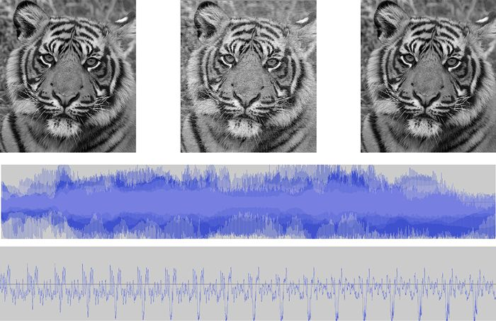

> **圖片描述：** 上方展示三張老虎灰度圖像的對比：左圖為原始512x512像素灰度老虎圖像，中圖為經過MP3編碼器（8kbit/s）最大程度壓縮後的版本，右圖為JPG編碼器最大壓縮後的版本。下方展示了將老虎圖像轉換為音頻檔案後的波形圖，包括完整波形與前17行音頻的特寫，可見尖銳的極值點對應老虎耳朵的黑色末梢。

圖25.1　用MP3編碼器壓縮圖像。第一行左圖：原始的512像素×512像素的老虎的灰度圖像。第一行中圖：經過MP3編碼器（8kbit/s）最大程度上的壓縮後的老虎圖像。第一行右圖：經過JPG編碼器最大程度上的壓縮後的老虎圖像。上方音頻圖特寫：在MP3壓縮前的老虎圖像的音頻文件。下方音頻圖特寫：原始音頻文件開頭的特寫，展示了從最上方開始的前17行音頻文件

圖25.1底部的音頻圖特寫中那些尖銳的極值點對應的是老虎耳朵上黑色的末梢，播放時，音頻聽起來像是頭頂上方直升機螺旋槳的聲音。原始文件、MP3文件以及JPG文件的大小分別是262000字節、37000字節以及26000字節，所以MP3文件大約壓縮了原文件的85%，而JPG文件則壓縮了約90%。很明顯，雖然MP3版本的壓縮似乎使得圖像更明亮了一些，但兩種壓縮（甚至對於鬍鬚這種細節來說）都有著不錯的效果。這說明JPG和MP3演算法都是設計得非常完善的演算法。因為即使輸入不是預設的資料類型，壓縮後的效果都讓人很滿意。

圖25.2是圖25.1的3張圖像中對於老虎眼睛的特寫。

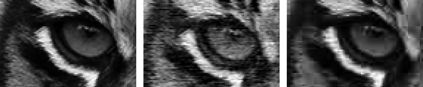

(a)　　　　　　　　　　　　　　　　　　　　　　　　　 (b)　　　　　　　　　　　　　　　　　　　　　　　　　(c)

圖25.2　對圖25.1中的圖像的特寫。(a)原始老虎圖像；(b)MP3壓縮圖像；(c)JPG壓縮圖像

需要注意圖25.2b中圖像的條紋，說明了MP3壓縮的本質是處理音頻文件的時間順序（資料是逐行保存聲音的，所以每一行代表了一小段聲音片段，而下一行則是接下來的一小段聲音），而從圖25.2c的圖像可以看出塊狀結構是JPG處理圖片資料的核心。

MP3文件相較於原始文件和JPG文件來說，**噪聲**很大且有起伏。這並不奇怪，畢竟MP3並不是為了對圖片進行編碼而設計的。相反，它對圖片的壓縮效果比預想要好，畢竟它丟棄的資訊是針對人耳聽到的聲音序列做出的判斷而非基於人眼的二維平面上像素點的排列。

### 25.2.3　混合展示

在本章的後半段，我們會介紹多種輸入項的數值表達方式，並將它們混合起來用於創造新的資料，這些新的資料與原資料類似但不相同。

一般來說有兩種常用的混合資料的方法。

第一種方法可以稱為**內容混合**（content blending），就是將兩段資料的內容互相摻雜在一起。例如，如果我們將奶牛和斑馬的圖像放在一起，就會得到圖25.3所示的結果。

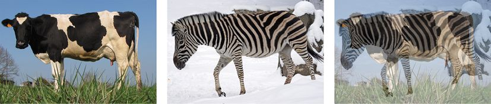

圖25.3　將奶牛和斑馬的圖像進行內容混合，將各自的50%混合在一起，所導致的結果是兩張圖像的疊加而不是一個半奶牛半斑馬的動物

這種方法的結果就是兩張圖像的疊加，而不是一種半奶牛半斑馬的中間物種。

想要得到中間物種的結果，我們就需要第二種方法，稱為**參數混合**（parametric blending），或者**表示混合**（representation blending）。這種方法所處理的是用於描述事物的參數。通過將兩組參數混合起來（這種混合的方式取決於參數自身以及用來生成目標的演算法），我們就可以生成融合了事物本身內在特性的結果。

例如，假設有兩個圓圈，每個圓圈都是通過圓心、半徑以及顏色來定義，如圖25.4所示。

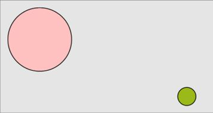

圖25.4　兩個待混合的圓圈

如果我們用內容混合的方式來處理，就會得到兩個透明度為原來一半的圓圈，如圖25.5所示。

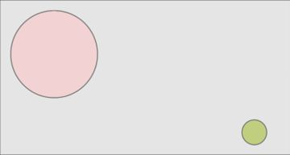

圖25.5　對兩個圓圈進行內容混合意味著用到了各自圖像透明度的50%

但如果我們將兩個圓圈進行參數混合（也就是說，我們將表示兩個圓圈圓心的*x*軸上的分量的進行混合，將*y*軸上的分量也進行混合，同時，對半徑和顏色也進行同樣的處理），就能得到它們中間的“過渡”圓圈，如圖25.6所示。

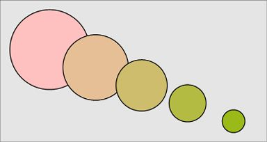

圖25.6　對兩個圓圈進行參數混合意味著混合它們的參數（圓心、半徑和顏色），這裡我們畫出了兩個原始圓圈以25%、50%和75%的比例進行混合後的“過渡”圓圈

對於沒有被壓縮過的對象來說，這種方法效果不錯。但如果我們試著用這種方法處理壓縮過的對象，則很少能得到合理的“過渡”結果。問題在於壓縮後的資料可能已經和原始的一些內在結構沒有什麼共同點了，而這些內在結構正是我們需要的對於對象混合有意義的部分。

舉個例子，我們需要提取“Cherry”和“Orange”這兩個單詞的聲音，聲音是我們需要操作的對象。我們可以讓兩個人同時說出這兩個單詞，然後我們將聲音混合在一起，那麼就會生成像圖25.3中混合奶牛和斑馬圖像那樣去混合的音頻文件。

我們可以選擇的一種壓縮的形式是將這些聲音轉換成文字。例如，如果說出“Cherry”這個單詞需要半秒，那麼用常用的128kbit/s的MP3壓縮就需要大約8000字節的空間[AudioMountain16]。而用簡便且常用的每個字母佔用一個字節的格式進行轉換，得到的文字形式就只需要極小的6字節。

因為字母都是從字母表中提取出來的，而字母表有給定的順序，所以我們可以根據字母表的順序對字母進行參數混合。雖然理論上這種方法對字母不適用，但現在讓我們先用這種方法去處理，因為之後我們會用到這個結果。

“Cherry”和“Orange”的首字母是C和O。在字母表中，以這兩個字母為開頭和結尾的一段是CDEFGHIJKLMNO。正中間的字母是I，所以這就是混合後的第一個字母。當第一個單詞的字母在字母表中的位置是在第二個單詞的字母之後，我們就將字母表反序排列。例如，兩個單詞的第三個字母是E和A，那麼兩者中間的字母就是DCB。而當位於兩字母中間的字母數是偶數時，我們便取前一個。如圖25.7所示，混合後的字母序列是IMCPMO。

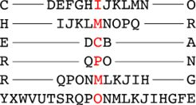

圖25.7　找到每組相互對應的字母在字母表裡的中點來混合“Cherry”和“Orange”這兩個單詞。對於R和G這樣的情況，我們就選取中點前面的字母作為混合結果

我們想要的是一個在未壓縮時聽起來介於“Cherry”和“Orange”兩者之間的發音，而將“imcpmo”念出來顯然不滿足這個要求。這甚至是一個沒有意義的字母序列，它不對應於任何水果名稱，也不是任何一個英文單詞。

在這種情況下，參數混合就無法得到合理的混合對象。

而自編碼器（尤其是本章最後會**涉及**的VAE）的一個顯著特點就是它們可以混合壓縮過後的資料並且可以還原原始資料在混合之後的結果。

## 25.3　最簡單的自編碼器

我們可以搭建一個深度學習系統來為任何資料尋找一個壓縮的演算法，其關鍵在於在網路中創建一個地方，在這裡所有資料都需要用比輸入資料少的資料量來進行表達，這也就是壓縮的全部內容。

例如，假設輸入資料是100像素×100像素的灰度圖像，圖像內容是各種不同的動物，我們希望建立一個用來壓縮它們的體系。每張圖像都有100×100=10000個像素點，所以輸入層需要容納10000個數字。任意取一個數字（如20），我們想要找到僅用20個數字就能表示這些圖像的最優方法。

一種方法是搭建一個圖25.8所示的網路，該網路**只有**一層。

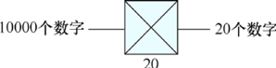

> **圖片描述：** 一個簡單的單層網路架構圖。左側輸入為10000個數字，經過一個僅含20個神經元的全連接層（以交叉方塊符號表示），輸出為20個數字。這是最簡單的編碼器結構。

圖25.8　編碼的第一步是一個單層（或者說全連接層），該層輸入10000個數字，輸出20個數字

輸入是10000個數字，進入一個只有20個神經元的全連接層。這些神經元的輸出就是我們將這幅圖像壓縮後的結果。換句話說，僅僅用一個單層網路，我們就搭建了一個編碼器。

現在，最難的問題就在於如何將壓縮後的20個數字還原為原始的10000個數字，或者接近於還原。

想要做到這一點，我們就需要在編碼器後緊接著加上一個解碼器，就像圖25.9所示的那樣。在這裡，我們僅用了一個有10000個神經元的全連接層，每個神經元對應一個數字。

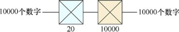

> **圖片描述：** 完整的自編碼器架構圖。左側藍色部分為編碼器，將10000個輸入數字壓縮為20個隱藏變量；右側米黃色部分為解碼器，將20個隱藏變量還原為10000個數字。整體形成一個瓶頸結構。

圖25.9　編碼器（藍色）將10000個輸入轉換成20個變量，然後解碼器（米黃色）將這些變量還原成10000個數字

在這個系統中，資料的數量一開始是10000個，中間是20個，最後又是10000個，所以我們說我們創建了一個“瓶頸”，因為這種結構與瓶頸比底座小的瓶子相似，如圖25.10所示。

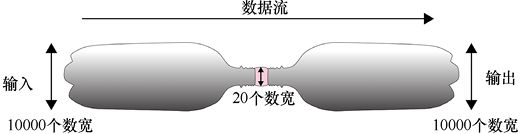

圖25.10　我們說圖25.9所示的網路的中間部分就是一個“瓶頸”，因為該網路的形狀就像兩個有著較窄頂部的瓶子的拼接

現在就可以訓練**網路**了，每張輸入的圖片就是最終輸出想要達到的目標。該網路試著將輸入壓縮成20個數字，而這20個數字解壓縮後應當儘量與目標（也就是輸入）相匹配。

這就是一個**自編碼器**。這個名字的由來是因為它能夠自動找到最好的將輸入進行編碼的方式，這樣解碼後的結果就可以儘量與輸入相符了。

在瓶頸處的壓縮表示稱為**碼**，或者**隱藏變量**（“latent”這個詞源於拉丁語中的單詞“lateo”，意思是“隱藏，潛伏”[Wikipedia16b]）。

通常來說，我們在深度網路中會用一個較小的層來作為瓶頸，很自然地，這一層常被稱作**隱藏層**（latent layer）或者**瓶頸層**（bottleneck lager）。該層中單元的輸出稱為**隱變量**（latent variable），這些變量在一定程度上能表示一張圖片。

需要注意一下，自編碼器的設計中有一些奇怪的地方：它沒有分類的標籤（像分類器那樣），也沒有目標（像迴歸模型那樣），除了我們需要進行壓縮和解壓的輸入以外，我們沒有任何其他關於這個系統的資訊。

我們稱自編碼器是**半監督學習**的一個例子，它有點像監督學習，因為我們給了系統確切的目標（輸出應該和輸入相同）；它也有點不像監督學習，因為我們不需要手動決定輸入項的標籤。

圖25.9是自編碼器最簡單的版本。那麼如果用它來訓練老虎圖像，效果如何呢？我們會將圖像輸入很多次，之後用損失函數來讓網路儘量輸出一個老虎的圖像，儘管在網路的瓶頸層資料會被壓縮到只有20個數字。

訓練會一直進行，直到它的效果看上去不再有什麼進步。圖25.11展示了訓練的結果。圖25.11c中所顯示的每一個誤差值都是用原始像素點的值減去對應的輸出像素點的數值（像素點的數值和以往一樣被規範到了[0,1]）。

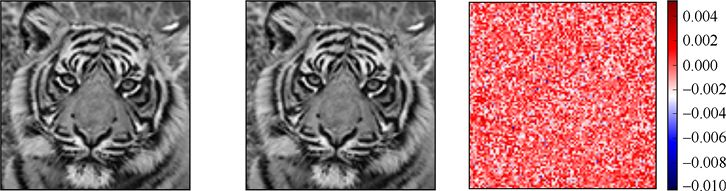

　　　　 (a)　　　　　　　　　　　　　　　　　　　　　　　　　　　(b)　　　　　　　　　　　　　　　　　　　　　　　　　　　(c)

圖25.11　僅用老虎圖像作為輸入對圖25.9所示的自編碼器網路進行訓練。(a)輸入的老虎圖像；(b)輸出的老虎圖像；(c)原始圖像和輸出圖像逐個像素點的差異。自編碼器的效果似乎已經很完美了，畢竟瓶頸層只有20個數字

這太讓人驚訝了！輸入是一個由10000個數字組成的圖像，將它壓縮成20個數字，再將整張圖像還原，結果甚至能精細到老虎的鬍鬚。像素點的數值範圍為0～1，而最大的誤差也只有1%。看起來我們已經找到了一個壓縮的完美方案。

但是等一下，想一想這樣似乎不合理，應該沒有辦法僅用20個數字且暗中不去耍什麼手段就能還原出一張老虎的圖像。在這個例子中，暗中耍的手段就是這個網路已經記住了這幅圖像。它僅僅預設好了10000個輸出單元，然後不論輸入的是哪20個數字，它都會輸出預設好的10000個單元來還原原始的10000個輸入。換句話說，整個網路僅能做一件事情：輸出一個特定的老虎圖像。我們並沒有真正壓縮任何東西，10000個輸入中，每個數字都要進入瓶頸層的20個神經元，這需要20×10000=200000個權重。接下來瓶頸層的20個神經元的輸出項每個都要進入輸出層的10000個神經元（也就是最後輸出“還原”的老虎圖像的神經元），這又需要200000個權重。所以我們只是找到了一個“僅”用400000個數字來存儲10000個數字的“好”方法。

事實上，這些數字的大部分是沒有相互關聯的。回憶之前提到的，每個神經元都會有一個加在權重上的偏置。而輸出神經元所輸出的值大部分都是依賴於添加的偏置而非輸入。為了驗證這一觀點，我們給這個自編碼器輸入了一張樓梯圖像（見圖25.12），而它並沒有對樓梯的圖像進行壓縮和解壓。相反，它完全忽略了這一樓梯圖像，而是返回給我們一張已經被網路所記憶的老虎圖像。輸出項並不完全是之前輸入的老虎圖像（見圖25.12c），但僅看輸出的圖像，我們完全找不到樓梯的圖像對於輸出的影響在哪裡。

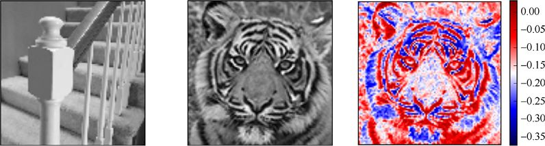

(a)　　　　　　　　　　　　　　　　　　　　　　　　　　　(b)　　　　　　　　　　　　　　　　　　　　　　　　　　　(c)

圖25.12　(a)給之前訓練的自編碼器輸入一張樓梯的圖像；(b)輸出居然是老虎的圖像；(c)輸出圖像和原始的老虎圖像的差異

圖25.12c所示的誤差條說明所得到的誤差要遠遠大於圖25.11中的誤差，但是輸出圖像中的老虎看起來依舊和原始圖像差不多。

讓我們進行一個真正的測試，來驗證這個網路是不是更依賴於添加的偏置的值。我們給這個自編碼器輸入一個每個像素點都為0的圖像。這樣一來就沒有一個輸入點的數值是有用的了。也就是說，只有偏置的數值會對最後的輸出產生影響，如圖25.13所示。

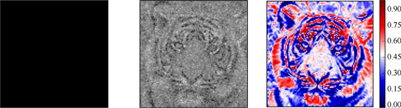

(a)　　　　　　　　　　　　　　　　　　　　　　　　　　　　 (b)　　　　　　　　　　　　　　　　　　　　　　　　　　　(c)

圖25.13　在向訓練好的那個自編碼器輸入一張全黑色圖像時，它用偏置值給我們返回了一張很模糊但依舊可識別的老虎圖像。(a)全黑色的輸入圖像；(b)輸出的圖像；(c)輸出圖像和原始老虎圖像的差異。注意到每個像素點的誤差基本為0～1，不像圖25.12那樣誤差為−0.4～0

也就是說，不論我們給這個網路的輸入是什麼，它都會返回一幅老虎的圖像作為輸出。這個自編碼器已經訓練出了一個每次都生成老虎圖像的網路。

而要訓練一個真正的自編碼器，我們應該給它輸入一組圖像然後觀察它壓縮這些圖像的效果。在這裡我們用了25張圖像對自編碼器進行訓練，如圖25.14所示。

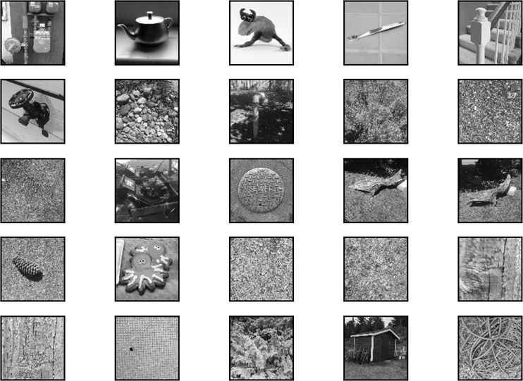

圖25.14　除了老虎圖像，我們用來訓練自編碼器的25張圖像。之後，每張圖像都會被旋轉90°、180°以及270°，所以這一組圖像實際上有100張

我們通過對圖像進行旋轉來擴大資料集，對圖像分別進行了90°、180°和270°的旋轉，現在的訓練集變為：老虎圖像（包括它在3個方向的旋轉）以及圖25.14所示的100張（包含旋轉後的）圖像，總共104張。

現在網路會試著去學習如何僅用20個數字表示這104張圖像，不難想到這個網路並不能取得很好的效果。圖25.15展示了訓練後自編碼器壓縮和解壓老虎圖像的結果。

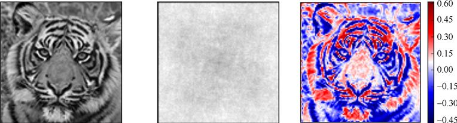

(a)　　　　　　　　　　　　　　　　　　　　　　　　　　　 (b)　　　　　　　　　　　　　　　　　　　　　　　　　　 (c)

圖25.15　用圖25.14中的100張圖像（每張圖像以及它旋轉過後的圖像）和老虎在3個方向旋轉後的圖像去訓練圖25.9中的自編碼器。訓練結束後，我們輸入(a)中的老虎圖像，得到的輸出是(b)中的圖像

現在這個網路不被允許作弊了，輸出的結果也就完全不像老虎了。我們可以在圖像中隱約看到3個方向的旋轉對稱，因為我們的訓練集所包含的圖像都是用同一張圖像在3個方向上旋轉得到的。

圖25.15所示的結果看起來更合理。

我們可以通過增加瓶頸層（或稱隱藏層）的神經元數量來達到更好的結果，但既然想要得到的結果是儘可能多地對輸入進行壓縮，那麼在瓶頸層添加神經元就應該是最後不得已而為之的手段。我們更願意用最少的瓶頸層神經元數量來達到儘可能好的壓縮效果。

接下來我們會試著用比上述所用的、僅含兩個全連接層的網路更復雜的結構來提升壓縮效果。

## 25.4　更好的自編碼器

在這一部分，我們會探索各種自編碼器的結構。為了比較它們的效果，我們會用到在第21章中見過的MNIST資料集。回顧一下，這是一個龐大的、免費的數字0～9的手寫灰度圖像集。圖25.16所示的是MNIST資料集中一些經典的手寫數字圖像。

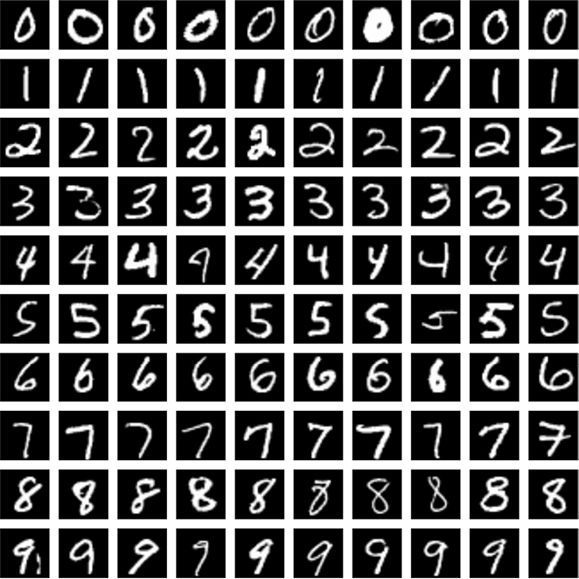

圖25.16　從MNIST資料集中提取出來的一些經典的手寫數字圖片

如果要用這組資料來測試之前的簡單的自編碼器，我們就需要改變圖25.9中的輸入輸出的大小來適應MNIST資料集。我們將輸入層和輸出層由原來的10000個單元變為現在的784個單元（因為28×28=784），而在瓶頸層我們依舊保留20個單元，如圖25.17所示。

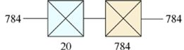

圖25.17　為MNIST資料集設計的兩層自編碼器，其中的編碼器是有20個單元的第一個隱藏層，而解碼器是有784個單元的輸出層

接下來我們將對資料進行50輪的訓練（也就是說，我們會遍歷60000個資料50次），希望相較圖25.14而言，更大的訓練集能夠產生更好的訓練效果。

圖25.18略微有點讓人驚訝，我們的兩層網路學會了如何將784個像素點壓縮成20個數值，然後再將它們解壓縮成784個像素點。輸出的數字雖然有些許模糊，但依舊可以分辨。

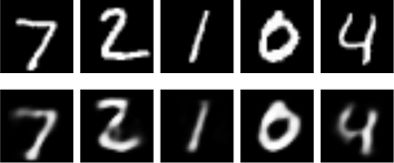

圖25.18　對訓練好的圖25.17中的自編碼器輸入5個數字。上方：輸入資料。下方：解壓後的圖像

接下來試著將隱藏變量減少為10個，理論上效果應該會更差，而實際如圖25.19所示。它們的還原效果確實更差了。

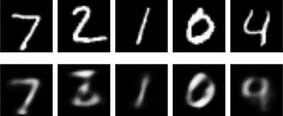

圖25.19　上方：原始MNIST資料集中的圖像。下方：用含有10個隱藏變量的自編碼器壓縮並還原的結果

相對來說，這樣的網路的訓練效果就比較差，2這個數字在經過壓縮和還原後看起來像3，而4這個數字則看起來像9。這是因為我們將網路的瓶頸層神經元數量縮小到了10個，這個數量並不足以幫助網路完全地把握輸入資料的資訊。

如果我們執行一個更荒謬的操作，將瓶頸層的神經元數量縮小到3個，會怎麼樣呢？結果如圖25.20所示。

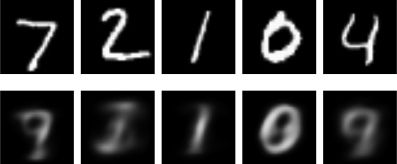

圖25.20　上方：原始MNIST資料集中的圖像。下方：用含有3個隱藏變量的自編碼器壓縮並還原的結果

這樣結果就更糟糕了。但是即使這個網路沒有準確地還原輸入的數字，我們也還是可以判斷出輸出的圖片內容是一個模糊的數字。

這告訴我們，自編碼器不僅需要足夠的計算能力（也就是足夠數量的權重）來學習如何對資料進行編碼，也需要足夠的隱藏變量（也就是中間值）來找到一個對於輸入資料來說有價值的壓縮形式。

讓我們看看深度模型會是什麼樣子。我們可以用任意的深度學習方式來搭建編碼器和解碼器：對於一般資料來說是多層網路，對於圖片來說是卷積層，而對於序列資料而言是遞歸神經網路。我們可以構造有很多層的深層自編碼器，也可以構造只有幾層的淺層自編碼器，這都取決於輸入的資料。

現在，讓我們繼續使用全連接層來構建自編碼器，但我們會添加層數來構建深層自編碼器。首先在編碼階段增加幾個隱藏層，各個層中的神經元數量會逐漸減少，直到到達瓶頸層。之後在解碼階段同樣增加幾個隱藏層，神經元數會逐漸增加直到輸出的大小與輸入的大小相同。

圖25.21所示的就是這種結構。現在我們的編碼器有3層，解碼器也有3層。

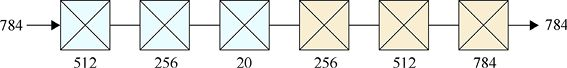

> **圖片描述：** 一個由多層全連接層構成的深度自編碼器架構圖。藍色部分為三層編碼器，神經元數量依次遞減（784→512→256→20）；米黃色部分為三層解碼器，神經元數量依次遞增（20→256→512→784），形成對稱的瓶頸結構。

圖25.21　一個由全連接層（或稱密集層）構造的自編碼器。藍色：3層的編碼器。米黃色：3層的解碼器

我們一般使全連接層的每一層的神經元數量比前一層增加（或減少）兩倍，比如這一層的神經元數為512，那麼下一層的神經元數就是256。這樣的選擇看起來效果不錯，但具體如何選擇每層的神經元數量並沒有明確的規則。

像之前一樣訓練這個自編碼器，也訓練50輪。圖25.22是訓練後的結果。

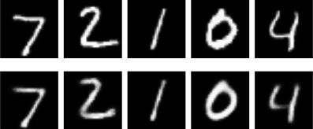

圖25.22　圖25.21中的深度自編碼器的預測。上方：原始MNIST資料集中的圖像。下方：訓練後的自編碼器的輸出結果

輸出的結果**只有**一點模糊，且它們可以清晰地和原數字對應。相較於同樣用了20個隱藏變量的圖25.18的結果，這些輸出的圖像顯然更加清楚。所以，通過增強找到（編碼器中的）變量以及（解碼器中）用來還原它們的計算能力，我們可以僅僅用20個隱藏變量去得到更好的壓縮還原效果。

## 25.5　探索自編碼器

接下來我們會通過更細緻地研究圖25.21所示的網路的輸出結果來更深入地瞭解自編碼器。

### 25.5.1　深入地觀察隱藏變量

我們知道了隱藏變量是輸入資料的壓縮形式，但我們並沒有研究隱藏變量本身。圖25.23所示的是20個隱藏變量的圖像和解碼器通過它們還原出來的圖像。

這個網路對於這些確切的數字有多敏感呢？讓我們試著加一點**噪聲**。理想情況下的結果是僅僅微調了一下這些數字，稍稍扭曲形狀，可能將數字“2”底部的橫線延長一些，或者使數字“4”的頂部閉合。

讓我們試試看。從圖25.23中可以看到，隱藏變量的數值在0到300的範圍內，我們在−1到1之間隨機取一個數字加到每個數值上去，然後再用解碼器去復原這些有偏移的數值，結果如圖25.24所示。

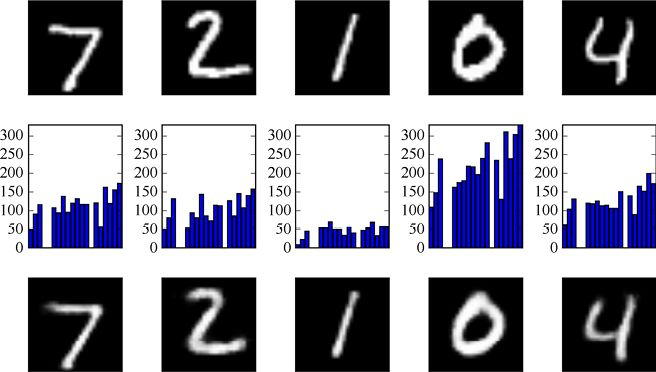

圖25.23　第一行：MNIST資料集中的5張圖像。第二行：每張圖片對應的20個隱藏變量。第三行：從第一行圖像中壓縮還原出來的數字圖像

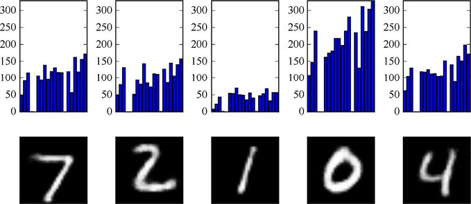

圖25.24　對每個數字圖像的輸出結果。我們在每個隱藏變量的數值上加上−1～1的隨機數，之後再用解碼器復原，基本看不出有什麼區別

這與圖25.22相比看不出什麼明顯的區別，所以加這麼小的噪聲應該沒有太大的影響。試著將添加的噪聲值增加到−10～10，結果如圖25.25所示。

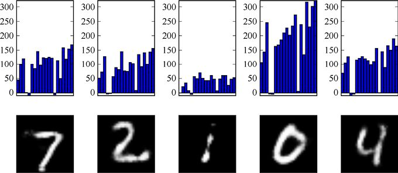

圖25.25　對圖25.23中每個隱藏變量的數值添加−10～10的隨機數，這樣看起來比之前的效果糟糕多了

這樣處理過後，還原後的數字圖像明顯有一些“磨損”。邊緣變得更加粗糙了，數字“1”甚至有些部分被“腐蝕”了，但大部分的數字還是可以識別的。

再試試將噪聲值的範圍添加到−100～100呢？結果如圖25.26所示。

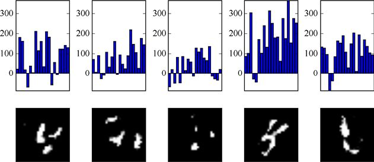

圖25.26　在每個隱藏變量的數值上添加−100～100的隨機數

這樣結果看起來就非常糟糕了，幾乎無法猜測出每張圖像對應哪個數字，所以添加−100～100的噪聲值會使效果明顯下降。

但如果我們只改變一個隱藏變量的值，也許就可以看到明顯的改變了。試著將在−100～100的隨機噪聲值僅添加到每個圖像的第一個隱藏變量上，結果如圖25.27所示。

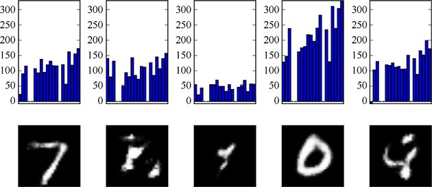

圖25.27　僅在圖25.23中圖像的第一個隱藏變量上添加−100～100的隨機數

可以看到，數字“7”和數字“0”不怎麼依賴於第一個隱藏變量，所以復原結果還算不錯。但其他幾個數字就比較依賴於第一個隱藏變量，因為它們的形狀幾乎垮掉了。

接下來試著使用完全隨機的隱藏變量。在圖25.28中，每個隱藏變量的數值都是0～25的隨機數。

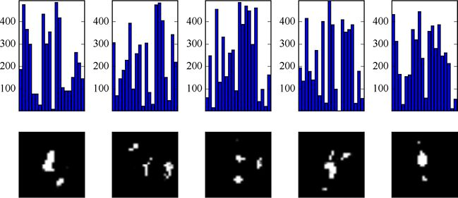

圖25.28　對完全隨機的隱藏變量進行解碼

這些白色的斑點顯然不是數字，所以一般情況下，對於這個自編碼器來說，隨機的隱藏變量會生成看起來隨機且無意義的圖像。

### 25.5.2　參數空間

之前證實了，用隨機數填充隱藏變量無法使得輸出有任何可預測的結果，改變隱藏變量會使輸出的數字圖像效果越來越差。

但也許隱藏變量中有一些其他的結構是我們可以利用的，讓我們試著找找那樣的結構。

我們將通過圖25.21中的自編碼器來深入研究隱藏變量，但與之前編碼器最後一個全連接層使用20個神經元不同，我們將這個數字減少到2個，也就是隻有2個隱藏變量。從圖25.20可以看出，3個隱藏變量的輸出結果非常模糊並且與原輸入完全不同，顯然用2個隱藏變量會使效果更糟糕。但2個數值可以用點在平面上表示出來，所以先讓我們繼續進行。我們知道這個編碼器效果會很差，直覺上輸出的圖像會很模糊，但也許僅用2個隱藏變量可以讓我們深入地看到隱藏變量內部的一些結構。

在圖25.29中，我們用10000張MNIST圖像對自編碼器進行訓練並且找出每張圖片的兩個隱藏變量，最後在圖上畫出它們，每個點的顏色都對應於圖中數字標籤的顏色。

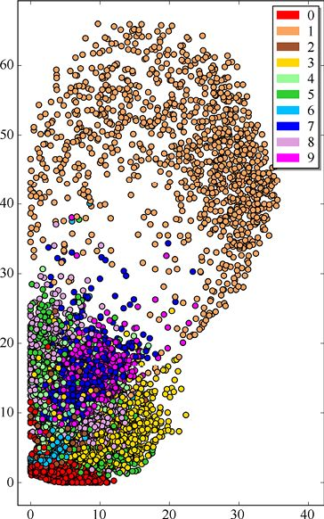

> **圖片描述：** 散佈圖展示了10000張MNIST圖像經由僅有兩個隱藏變量的深度自編碼器訓練後的隱藏變量分佈。每個點代表一張圖像，顏色對應數字標籤（0-9）。可見不同數字的點大致聚集在不同區域，例如「1」的點集中在右上方，「0」的點在左下方，而「7」和「9」的點雲有較多重疊。

圖25.29　在訓練一個僅有兩個隱藏變量的深度自編碼器之後，我們畫出了10000張MNIST圖像的隱藏變量

從這裡可以看到很多結構！隱藏變量並不是完全隨機的，相反，類似的數字圖像對應的隱藏變量也是類似的。

事實上，大部分的數字對應的隱藏變量都聚集在一起。例如，“0”“1”“3”對應的隱藏變量看起來像有它們各自的領域，而“7”“9”的隱藏變量則有很多重疊的部分（和“4”的隱藏變量也有共享的部分）。這告訴我們這個模型並不能完全分辨出這3種類型的圖片，所以才會使這3種類型的圖片的隱藏變量有很多重疊的部分。

如果我們從這些隱藏變量的橫座標和縱座標的範圍中等距選取座標作為新的隱藏變量，並將這些新的隱藏變量作為解碼器的輸入，那麼產生的圖像將如圖25.30所示。

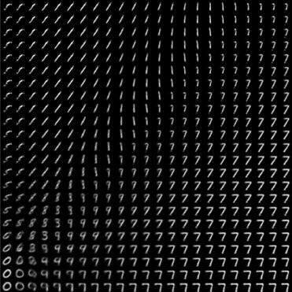

圖25.30　從圖25.29的橫座標和縱座標範圍內選取的隱藏變量所生成的圖像

其他的數字在圖25.29的左下角被雜亂地混合在一起。圖25.31所示的是這塊區域放大後的圖像。

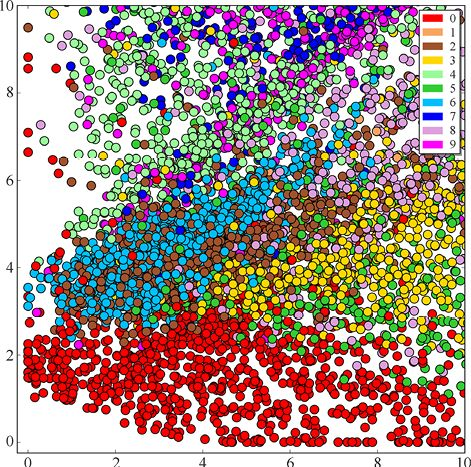

圖25.31　圖25.29左下角的放大圖

可以看到，左下角並非是完全混亂的。“0”這個數字有它自己的區域，而“3”和“5”這兩個數字則完全混合在了一起，“6”和“2”這兩個數字也完全混合在一起。

讓我們看看這塊更小區域內的圖像，如圖25.32所示。

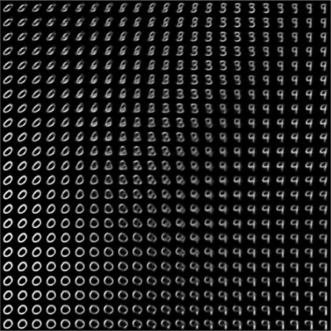

圖25.32　用圖25.31所示範圍內的隱藏變量生成的圖像。這個區域內的數字彼此混合在一起，以至於大部分圖像看上去都無法準確分辨具體是哪個數字

如果有更多的隱藏變量，那麼我們相信這些數字的隱藏變量所表示的“點”會更分散、更明顯，雖然我們無法畫出這些更高維度空間的圖像。

儘管如此，我們還是知道了即使在僅保留2個隱藏變量這樣極致的壓縮後，系統還是能夠大致地將不同數字區分開來，也就是將不同數字的隱藏變量所表示的“點”分配到不同的區域。

讓我們更深入地看看這個結構。圖25.33所示的是位於圖中4條帶箭頭的直線上的隱藏變量所生成的圖像。

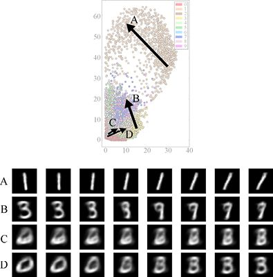

圖25.33　圖中的4個箭頭所掠過的隱藏變量對應生成的下面4行圖像

在A行中，我們可以看到：代表數字“1”的區域從一個豎直的直線開始，以一條斜著的線結束。所以並不是“1”都聚集在一起，而是更為相似的“1”會被聚集在一起。在B行中，我們看到了一個可識別的“3”逐漸轉變為一個更像是“9”的圖像。而C行則是途經了左下角的一小塊區域，該區域有數字“0”“2”以及“6”的點雲。最後的D行從靠近C行的位置開始，但往數字“3”的區域移動。

可以推斷出，編碼器會為相似的圖像分配相似的隱藏變量，也會為不同的圖像創造不同的聚集區域，這就是這個結構的全部內容。不難想象，當我們將隱藏變量的數量從小到甚至荒謬的2增加到更大的數字時，編碼器依舊會繼續創造聚集區域的工作，並且不同區域之間會區分得更加明顯，重疊部分也會更少。

### 25.5.3　混合隱藏變量

既然我們現在瞭解了隱藏變量的內在結構，那就來運用它。更具體地說，我們要將幾對隱藏變量混合在一起，再看一下我們是否得到了一個“過渡”圖像。換句話說，我們將要對圖像進行參數混合（之前提到過），而隱藏變量就是這些參數。

事實上，當我們沿著箭頭路徑生成圖像時，就已經將圖25.33中的箭頭兩端的2個隱藏變量從直線的一端到另一端進行了混合。但當時我們只是用了一個包含2個隱藏變量的自編碼器，所以它並不能很好地展示圖像。儘管C行中出現了一些相對詭異的形狀，但生成的結果大部分是能被識別的，因為樣本是將屬於相同類型的兩個數字進行了混合或者插入（interpolation）。接下來我們會嘗試更多的隱藏變量，這樣就可以得到在更復雜的模型中這種混合的直觀感受。

回到有20個隱藏變量的深度自編碼器。我們挑選出一些圖像對，找到它們各自的隱藏變量，並將每對圖像對應的每對隱藏變量混合取平均值。然後我們就可以將這些結果輸入解碼器並觀察生成的最終結果。

換句話說，我們會找到每對圖像的第一個隱藏變量並將兩者取平均，再找到每對圖像的第二個隱藏變量再取平均，以此類推，直到有20個平均值。

圖25.34展示了5對圖像用這種方式進行混合的結果。

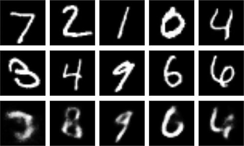

圖25.34　將深度自編碼器中的隱藏變量混合之後的結果。第一行：MNIST資料集中的5張圖像。第二行：另外5張隨機的圖像。第三行：將第一行圖像和第二行圖像的隱藏變量取平均後，用解碼器解壓縮所得到的圖像

如我們所預期的那樣，這個系統並不是簡單地用內容混合的方式（圖25.3所示的混合奶牛和斑馬的圖像）將圖像混合起來，自編碼器會試著找到同時具有兩張輸入圖像的特點的“過渡”圖像。

這些結果並不抽象，大部分或多或少像兩張輸入圖像中的一張。雖然在第二列中，數字“2”和“4”的混合看起來更像“8”，但這也確實合理。在圖25.30中，如果僅設置兩個隱藏變量，那麼數字“2”“4”和“8”的隱藏變量對應的點靠得很近，所以在二十維空間中它們依舊靠得很近。

讓我們看看將隱藏變量距離很近的數字進行混合的結果。圖25.35所示的是3組新的數字圖像，以及6組等距“過渡”圖像。

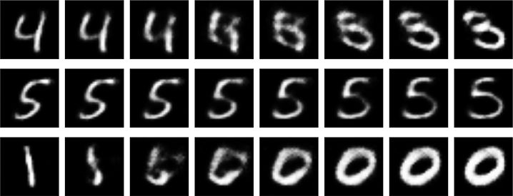

圖25.35　以不同的程度混合圖像的隱藏變量，每行最左和最右是MNIST資料集中的一對圖像。對每對圖像，我們取20個隱藏變量，然後生成6組等距混合的隱藏變量，再用解碼器生成圖像

這個系統的目標是從一個圖像過渡到另一個圖像，但是它並沒有生成很合理的“過渡”數字圖像。即使對於中間一行（從“5”過渡到“5”）來說，中間的“過渡”圖像也有幾乎“斷裂”的部分，最後又連接到一起了。而對於上面一行和下面一行來說，中間的某些圖像甚至不像任何一個數字。雖然兩邊的數字都可以識別，但混合起來就會無法識別。

用這個自編碼器混合隱藏變量可以平滑地從一個數字過渡到另一個數字，但過程中會生成古怪的形狀，它們看上去並不像數字。前面幾張圖像已經證實了這一點，這是因為在過渡的過程中會移動到一些（隱藏變量集中）密集的區域，在該區域中，相近的隱藏變量可能會被解碼成為不同的數字。

但有些時候，我們會移動到隱藏變量不對應於任何數字的區域。換句話說，我們要求解碼器從某些隱藏變量中復原一個數字，但並沒有給過編碼器這些隱藏變量的意義。所以系統是在生成一些結果，而這些結果有鄰近區域的一些性質。但因為隱藏變量並不會被解碼成任何有意義的圖像，所以很難去預測生成的結果是什麼。

### 25.5.4　對不同類型的輸入進行預測

嘗試用剛剛那個用MNIST資料集訓練好的深度自編碼器來壓縮並解壓圖25.1中的老虎圖像。為了匹配網路的輸入尺寸，我們將老虎圖像壓縮成28像素×28像素的大小。

這張老虎圖像和該網路之前遇到的任何一張圖像都完全不同，所以理論上它無法處理這種資料。這個網路應該會試著從圖像中找到一個數字，再生成對應的圖像。圖25.36所示的就是輸出的結果。

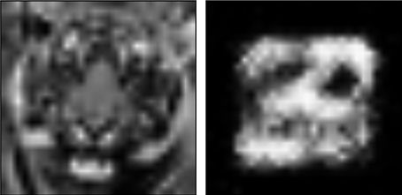

圖25.36　用MNIST資料集訓練的有20個隱藏變量的深度自編碼器壓縮並解壓圖25.1的老虎圖像（28像素×28像素的大小）。這個要求對於這個網路來說很不公平，而結果也和預想的一樣糟糕

看起來這個演算法正在試著融合不同的數字來匹配老虎的形狀。可以看到的是，結果的周圍是黑色的邊界，因為大部分MNIST資料集的邊界是黑色的，所以在這塊區域上，幾乎沒有資料能給網路提供用來填充邊界的資訊。對於中間區域來說，那些白色斑點也不怎麼能和老虎的圖像相匹配，而且它也不應該與老虎的圖像匹配。

用從數字圖像中學到的資訊去壓縮並解壓一個老虎圖像就像試著用卷筆刀中的鉛筆屑去造一把吉他一樣，即使用盡全力，也無法造出一把好吉他。

自編碼器只有在處理用於訓練它的資料時才能有較好的表現，因為它為這些資料的隱藏變量賦予了一定的意義，而自編碼器只有通過隱藏變量才能將資料表示出來。換句話說，它用20個壓縮後的數字找到了如何表示手寫數字的方法。當我們驚訝於它生成了一些完全不一樣的結果（如用老虎圖像作為輸入）時，它已經盡力了，只是最後的結果不盡如人意罷了。

## 25.6　討論

在第12章中，我們提及了**主成分分析**（Principal Component Analysis，PCA），那時我們見過類似於自編碼器的東西。回想一下，PCA會找到哪一個維度上資料的變化量最大，然後保留這些維度上的資料，並丟棄其他維度上的資料。

要將自編碼器和PCA聯繫起來，可以寫出描述圖25.21中自編碼器的數學表達式以及描述PCA的數學表達式，之後比較它們。經過一些推導，我們可以證明這兩個不同的方法最後會產生一樣的結果[Virie14]。而一個足夠複雜的自編碼器甚至可以完成PCA完成不了的任務。

我們現在對自編碼器有了一個直觀的認識：它試著將輸入項中儘可能多的資訊用最有效率的方式壓縮到每個中間值裡。

自編碼器的內部結構多種多樣。既然我們在處理圖像，而一般來說，卷積是處理這種圖像的比較好的方法，那麼我們就試著在自編碼器中添加捲積層吧。

## 25.7　卷積自編碼器

之前說過，在編碼和解碼階段，我們可以把任何類型的層加到自編碼器中。因為我們的例子用的是圖片資料，所以讓我們來嘗試一下使用卷積層。換句話說，我們會構建一個卷積自編碼器（convolutional autoencoder）。

在編碼階段，我們要將原始的28像素×28像素尺寸縮小到7像素×7像素，所用的所有卷積都是3像素×3像素的過濾器。最終的卷積層會有3個這樣的過濾器，所以這個模型會有7像素×7像素×3像素=147個隱藏變量。第一個卷積層有16個過濾器，再通過一個2像素×2像素的最大池化層，至此輸出是一個14像素×14像素×16像素的張量；然後再加一個有8個過濾器的卷積層和一個2像素×2像素的最大池化層，輸出是7像素×7像素×7像素的張量；最後再用一個有3個過濾器的卷積層（和之前的一樣），所以在瓶頸層就會有一個7像素×7像素×3像素的張量，如圖25.37所示。

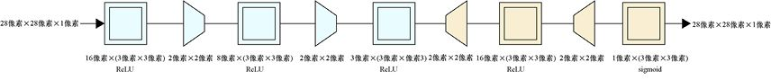

> **圖片描述：** 卷積自編碼器的完整架構圖。左側編碼器包含三個卷積層（過濾器數量分別為16、8、3），前兩個卷積層後各有一個最大池化層，將輸入逐步壓縮為7x7x3的張量。右側解碼器使用卷積層搭配上取樣層，將瓶頸層的張量逐步還原為28x28x1的輸出。

圖25.37　卷積自編碼器的結構。左邊：在編碼階段，有3個卷積層。前兩個卷積層後都有一個最大池化層，所以最後在該階段生成的是一個7像素×7像素×3像素的張量。右邊：用卷積層和上取樣層的解碼器將瓶頸層的張量復原成28像素×28像素×1像素的輸出

解碼器是對編碼器進行逆向操作。第一個上取樣層生成一個14像素×14像素×3像素的張量，而下一個卷積層和上取樣層生成一個28像素×28像素×16像素的張量，最後一個卷積層生成28像素×28像素×1像素的張量。

需要注意的是，在編碼階段，卷積層過濾器的數量一開始是16，然後下降到8，最後到3。所以在解碼階段，要先將過濾器數量從3逐步升高到16，再下降到1作為輸出。

因為這個結構中有147個隱藏變量，再加上卷積層的計算能力，我們應該可以期望這個結構有著不錯的效果。像之前一樣用這個卷積自編碼器對訓練集進行50epoch訓練。雖然這時候模型的訓練效果還在繼續提升，但為了與之前的模型進行比較，我們就在50epoch時停止訓練。

圖25.38所示的是測試集裡的前5張圖像以及經過卷積自編碼器處理後的解壓縮版本。

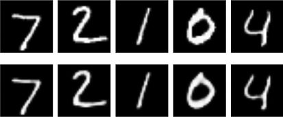

圖25.38　上方：MNIST測試集中的前5張圖像。下方：以第一行圖像作為輸入時，卷積自編碼器的輸出

這些結果看上去很不錯，雖然圖像不是完全一樣，但也很接近了。

像之前一樣，我們在中間的每個隱藏變量中加入一個隨機數，而且是從−1～1的隨機數開始添加，結果如圖25.39所示。

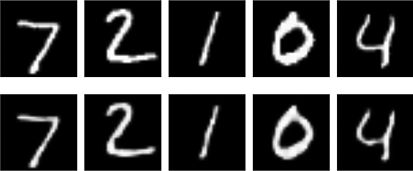

圖25.39　上方：MNIST測試集中的前5張圖像。下方：以第一行圖像作為輸入，且在瓶頸層輸出的每個隱藏變量中添加−1～1的隨機數，之後觀察到的卷積自編碼器的輸出。結果和之前所得到的相比幾乎沒有什麼改變

可以看到，輸出的圖像有些許視覺上的變化，但還是很相似。接下來，我們試著將添加的噪聲值範圍擴大至−5～5，結果如圖25.40所示。

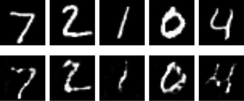

圖25.40　上方：MNIST測試集中的前5張圖像。下方：以第一行圖像作為輸入，且在瓶頸層輸出的每個隱藏變量中添加−5～5的隨機數，之後觀察到的卷積自編碼器的輸出。結果比之前稍微差了一點

這些數字有些變形了。其中的大部分還是可以識別的，但最後的“4”這個數字看上去似乎有些“溶解”了。

再將添加的噪聲值增加至−10～10，結果如圖25.41所示。

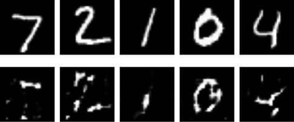

圖25.41　上方：MNIST測試集中的前5張圖像。下方：以第一行圖像作為輸入，且在瓶頸層輸出的每個隱藏變量中添加−10～10的隨機數，之後觀察到的卷積自編碼器的輸出。結果看起來已經和輸入不太一樣了

這些輸出的圖像看起來就像在黑色地板上隨意地滴上白色顏料一樣，只有數字“0”有可能被識別，但也只是“有可能”。

最後一個測試，像之前一樣給解碼器輸入單純的噪聲。因為隱藏變量是一個7像素×7像素×3像素的張量，所以噪聲的數值也需要構成同樣尺寸的三維空間。這裡我們只取出了最上面一層的7像素×7像素的隨機噪聲值，結果如圖25.42所示。

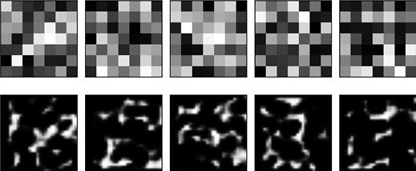

圖25.42　每張圖像都是將隨機生成的張量輸入到解碼器後的結果。上方：每個隱藏變量最上面的一層（大小為7像素×7像素）的圖像。在這裡為了和輸出的大小相同，我們將它們放大了。下方：輸出的圖像，它們看上去不像數字，也不像任何物體

和之前的自編碼器一樣，以隨機生成的隱藏變量作為輸入時，卷積自編碼器只會生成隨機的有白點的圖像。

### 25.7.1　混合卷積自編碼器中的隱藏變量

將卷積自編碼器中的隱藏變量進行混合會發生什麼呢？

圖25.43所示的是與圖25.34中一樣的圖組。我們找出了圖中前兩行的每張圖像的隱藏變量，求它們的平均值，再將平均值解碼成最下面一行的圖像。

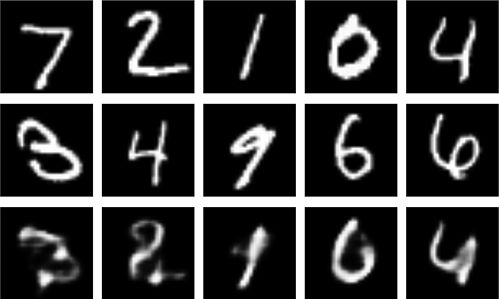

圖25.43　混合卷積自編碼器的隱藏變量。第一行和第二行：MNIST資料集中的樣本。第三行：將前兩行圖像的隱藏變量平均混合後生成的圖像

結果雖然有種將上面兩張圖像混合在一起的感覺，但看上去有些模糊。

對於卷積自編碼器進行圖25.35所示的分步過程，結果如圖25.44所示。

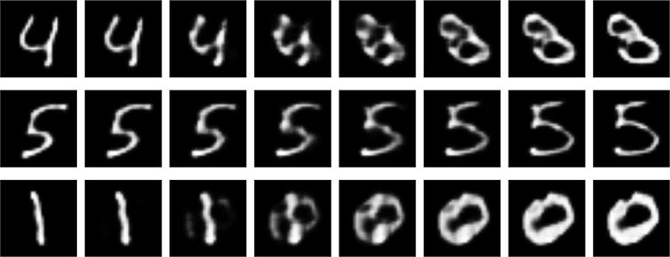

圖25.44　將2張MNIST資料集圖像的隱藏變量進行混合再解碼。每行最左和最右的是直接輸入MNIST資料集中的圖像後的解碼結果，中間的是混合隱藏變量之後解碼的結果

我們的重點在於觀察系統是如何從一張圖像過渡到另一張圖像的。在圖25.44的第一行中，“4”不是直接過渡成“8”的，在中間它變成了“4”和“8”的混合體。“5”的過渡看起來很完美，因為每張圖像都能清晰地被識別成“5”，這樣的結果比全是全連接層的自編碼器要好很多。而從“1”到“0”的過渡看起來更像交叉溶解而不是簡單地從一根豎直的線轉變成一個圓圈。

### 25.7.2　在CNN中對不同類型的輸入進行預測

為了好玩，讓我們重複一下之前不公平的測試，也就是給CNN輸入低像素的老虎圖像，結果如圖25.45所示。

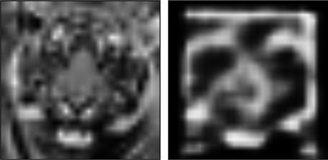

圖25.45　給卷積自編碼器輸入的低像素老虎圖像以及輸出結果，結果不是很像老虎

結果居然不錯得令人吃驚。如果不經意地掃一眼，我們會發現眼睛周圍一圈黑色的區域、嘴巴的兩邊還有鼻子似乎都被保留了下來。

和之前用全連接層構建的自編碼器一樣，卷積自編碼器也是試著在數字的隱藏變量中找一隻老虎，但看上去效果更好。

## 25.8　降噪

自編碼器的一個很重要的用處是從樣本中去除**噪聲**，而一個特別有趣的應用就是用自編碼器去除電腦生成的圖像中不時出現的噪點[Bak017][Chaitanya17]。當我們快速生成一個圖像而不對其進行改善時，這些亮點或暗點就會出現（它們看起來像是靜電或者雪花）。

來看看自編碼器是如何移除圖像中亮點或暗點的吧。我們依舊用MNIST資料集，只是這次會在圖像中添加隨機的噪點。在每個像素點，我們都會根據高斯分佈隨機生成一個數值添加上去，然後再把像素點的值規範到0～1。圖25.46所示就是添加了隨機噪聲後的MNIST訓練集圖像。

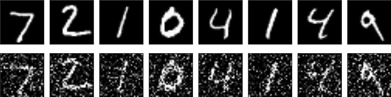

圖25.46　上方：MNIST訓練集中的圖像。下方：添加了隨機噪聲後的圖像

我們的目標是給訓練好的自編碼器提供像圖25.46下面一行那樣添加了噪聲的數字圖像，之後讓編碼器返回圖25.46上面一行那樣沒有噪聲的圖像。所以在訓練過程中，我們會用有噪聲的圖像作為編碼器的輸入，而用無噪聲的圖像作為輸出。我們希望系統能夠學會一種將有噪聲的圖像進行編碼的方法，使得我們將編碼所得到的隱藏變量解碼後可以得到無噪聲的圖像。

我們會交替使用上取樣和下采樣的卷積層來構造自編碼器[Chollet17]。第一層使用的是尺寸為3像素×3像素、過濾器數量為32的卷積層，然後是2像素×2像素的下采樣層，這樣輸出的張量尺寸就是14像素×4像素×32像素。重複一遍前面的步驟，輸出變為7像素×7像素×32像素的張量。現在我們需要再添加一個卷積層，然後添加一個上取樣層來使得長寬加倍，並且重複一遍這兩種添加，現在輸出的張量尺寸是28像素×28像素×32像素。最後再通過一個過濾器數量為1的卷積層。該結構如圖25.47所示。

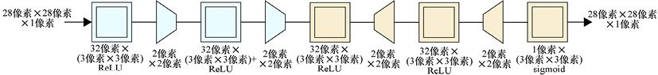

　　　激活函數　　　 激活函數　　　　激活函數　　　 激活函數　　　 激活函數

圖25.47　一個降噪自編碼器

要訓練這個自編碼器，我們要以圖25.45中的有噪聲圖像為輸入，希望得到沒有噪聲的圖像，並且使用60000個訓練圖像訓練100epoch。

圖25.47中編碼階段最後的張量尺寸為7像素×7像素×32像素（也就是經過第二個下采樣層後輸出的張量），總共有1568個數字，所以該模型的瓶頸層資料實際上比輸入資料還要大。

如果我們的目標是壓縮，那麼這種結構不合適，但這裡我們的目標是去除噪聲，所以隱藏變量數量的多少並不是特別關鍵的事。

那麼這種結構去除噪聲的效果有多好呢？圖25.48給出了一些有噪聲的輸入和自編碼器的輸出。顯然，它清理了那些有亮點和暗點的像素，還原出了更清晰的圖像。

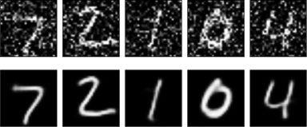

圖25.48　上方：添加了噪聲的數字圖像。下方：經過圖25.47中的模型去噪處理後的圖像

在第21章中我們說過，上取樣層和下采樣層已經不受人們歡迎了，取而代之的是步幅卷積層和轉置卷積層。那麼讓我們將圖25.47中的模型簡化成圖25.49中的模型。現在它由5個卷積層組成，前4個卷積層將上取樣層和下采樣層替換為步幅和分數步幅。

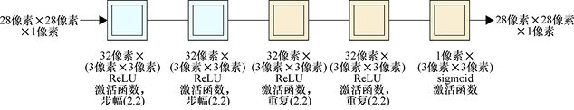

圖25.49　圖25.47的自編碼器，只是將上取樣和下采樣的步驟放在了卷積層中。“重複”的值指的是用分數步幅來重複每個輸入元素，以此來擴展輸入張量的長度和寬度

結果如圖25.50所示。

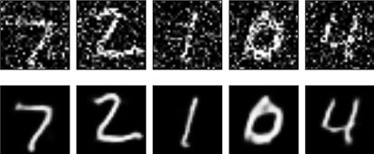

圖25.50　圖25.49中的去噪模型所產生的結果

雖然在一些小地方可以看出差別（如“0”的左下角），但結果整體看起來很接近。第一個模型有著明確的上取樣層和下采樣層（見圖25.47），每個循環在無GPU支援的、2014下半年版本的iMac上運行大約需要300秒。圖25.49中簡化過的模型則只需要大約200秒，節省了大概1/3的時間。

想要判斷這些模型是否能在某個任務上比其他模型達到更好的效果，則需要更加詳細的問題陳述、測試和結果檢驗。

## 25.9　VAE

迄今為止，我們見到的自動編碼器試圖找到最有效的方式來壓縮輸入，以便稍後重新創建它們將輸入壓縮成一些隱藏變量（或者一些程式碼），這些壓縮後的資料會被解碼器當作輸入來進行還原。

雖然**變分自編碼器**（VAE）和這些網路的總體結構相似（有一些比較重要的不同點），但它們實作的功能不同。最終的模型可以被用作一個**生成器**（generator），它可以生成無限的與輸入類似卻不相同的新資料。

如果能完成這樣的結構，那麼我們就可以用MNIST資料集來生成10000張（甚至1000萬張）新數字的圖像，每張圖像都與原始MNIST資料集類似但不完全相同（僅有一些微小的變化）。

可以類比一個實例，假設我們被分配到一個任務，這個任務是將一個櫻桃樹園中的每棵樹都畫下來。當畫了足夠多張圖的時候，我們就很瞭解櫻桃樹有哪些特性，例如樹的高度、顏色、樹皮的質地以及樹枝的形狀等。這樣我們就可以通過想象畫出新的樹來。這些新的樹不只是對已知的樹的簡單變化，也不會僅僅是將已知的樹進行拼接（像弗蘭肯斯坦的怪物那樣[Shelley18]），它們會是全新的、看起來像真樹的圖像。也就是說，我們會成為一個櫻桃樹圖像的生成器。

我們之前試著通過給解碼器輸入隨機數字來將自編碼器轉化成生成器，但那時的輸出結果只是有斑點的圖像而不是數字圖像。所以為了得到更好的結果，VAE需要進行一些特殊的操作。

關於如何構建VAE有一個有趣的事情，對於之前的自編碼器來說，一旦它們被訓練好了，就是**確定性的**。也就是說，相同的輸入永遠會產生相同的隱藏變量，也會生成相同的輸出。但VAE在編碼階段用到了機率（也就是隨機數），所以如果對同一個輸入運行幾次，那麼每次都會得到一個略微不一樣的結果。

在講述VAE時，我們還是會繼續用圖像資料作為處理的對象，但和其他機器學習演算法一樣，VAE也可以被應用到任何其他的資料類型上，如聲音、天氣、影評等。

### 25.9.1　隱藏變量的分佈

在之前的自編碼器中，我們沒有給隱藏變量的結構強加任何條件。從圖25.51（複用了圖25.29的內容）中可以看到，對於一個二維的全連接層自編碼器來說，編碼器會自然地將隱藏變量分組並從(0,0)點開始向右上方發散。這種結構並不是設計的目標，而只是構造出來的網路的自然特點。

圖25.51　複用了圖25.29，添加了密集區域和稀疏區域所表示的樣本

這裡我們有一大片白色的沒有樣本的區域，也有很多樣本混合在一起的區域。圖25.51中標出了密集區域和稀疏區域的隱藏變量所產生的圖像。當我們想要用隨機隱藏變量生成新資料時，這些空白的或者混合的區域就會成為一個問題。如果我們選擇了一對與已有資料距離很遠的隱藏變量，那麼結果就可能會變形（就像圖片右側的“3”那樣）；如果我們在密集區域中選點，又可能會得到模稜兩可的圖像（就像圖片底部那張模糊的“6”那樣）。

我們希望得到的結果是，每一種數字都聚集在自己的區域，且不同數字的區域間沒有重疊部分，也沒有空白的部分。但是，沒有很明顯的改變自編碼器結構的方法能實作這個效果。

我們很難填充空白區域，因為沒有輸入資料處於這些區域。但我們可以試著將混合的區域分開來，這樣每個數字就都能有自己的區域。

VAE在實作這些功能上有著不錯的效果。

### 25.9.2　VAE的結構

像許多好主意一樣，VAE也是由兩組不同的人同時且獨立發明出來的[Kingma14] [Rezende14]。想要從數學角度詳細地理解這一技巧是有一定難度的，即使只理解精華部分[Durr16]。

因為不希望涉及太多數學理論，所以在這裡我們會用近似和概念化的方法來進行講解。這意味著我們會拋棄更多的細節並對很多地方進行近似，這並無不妥，因為我們是要抓住方法的重點而不是它的詳細機制。

回憶一下，VAE的最終目標是創建一個可以生成任意隱藏變量的生成器，並且生成合理的新資料。想要達到這個效果，我們需要讓隱藏變量擁有以下3個關鍵性質：第一，它們需要被集中在一塊區域內，這樣就可以控制生成的隨機值的範圍；第二，類似的輸入（也就是表示同一個數字的輸入圖像）的隱藏變量需要被聚集在一起；第三，儘量減小不同數字區域間的空隙，這樣就可以保證在生成輸出時有資料可以提取。

我們會用兩種方法來達到這些目標：第一，需要設計一種有能力完成目標的學習模型的結構；第二，需要手動設計一個誤差項，在系統生成了不符合條件的隱藏變量時對系統進行懲罰。因為系統的目的就是減小誤差，所以最終它會生成我們想要的隱藏變量，學習模型和誤差項會同時運作。

我們的第一個目標是將所有隱藏變量聚集在一塊區域內。為了達成這個目標，我們需要添加一條強制性規則（或稱為限制）。同時，正如我們提到過的，如果編碼器生成的隱藏變量不符合條件，就需要給系統施加懲罰。

我們的限制是：繪製出每一個隱藏變量後，我們需要得到一個高斯分佈。在第2章中我們提到過，高斯分佈是一個著名的“鐘形曲線”，如圖25.52所示。

圖25.52　高斯曲線

我們將兩條高斯曲線放到平面上，一條在*x*軸上，另一條在*y*軸上，就會得到一個二維的凸塊，如圖25.53所示。

圖25.53　如果有兩個維度，並且一個維度上繪製一條高斯曲線，它們就會共同形成一個二維凸塊

只要在*z*軸上再加入一條高斯曲線，我們就可以將這個形狀拓展到三維空間。如果我們將生成的凸塊的大小想象成密度，那麼三維高斯曲面就像蒲公英（中心密集，外側稀疏）。

類似地，只要每個維度上的值都遵循高斯曲線，我們就可以想象出任何維度的高斯曲面，這也就是我們要做的。我們會讓VAE去學習如何生成隱藏變量的值。所以，當我們查看訓練集的隱藏變量並且記錄每個數值出現個數的時候，各個變量的個數應該形成一個平均值（中心點）為0、標準差（範圍）為1的高斯分佈，如圖25.54所示。我們在第2章中提到，這意味著每個隱藏變量中大約68%的數值分佈在−1～1之間。

圖25.54　一個高斯曲面可以用它的平均值（中心點的位置）以及標準差（包含大約68%總面積的區域到中心的對稱距離）來描述。這幅圖中，平均值是0，標準差是1

訓練完成後，我們就會知道隱藏變量是根據這樣的規律分佈的，所以需要從這個分佈中挑選數值去作為解碼器的輸入項（也就是說，相對於兩邊數值來說，我們更容易選到靠近中間的在凸塊內部的數值）。這樣我們就更容易生成與訓練集中學到的數值接近的隱藏變量，也就可以生成類似訓練集資料的輸出。

這樣也就自然地將隱藏變量集合到一塊相同的區域，因為它們都是儘量滿足平均值為0的高斯分佈的。

然而，得到完全符合高斯曲面的隱藏變量的分佈是一種理想化的情況，事實上我們很少能達到。在變量滿足高斯分佈的程度和系統還原輸入的準確率上會有一個取捨[Frans16]。系統會在訓練時自動學習這種取捨（平衡輸入圖片和輸出圖片之間的差異）和隱藏變量的結構。

想要使得表示相同數字的圖像聚集在同一個區域，需要用到一些隨機性的技巧，這種方法有些巧妙。

假設我們已經達到了這個目標。來看看從一個特別的角度上說，這意味著什麼，明白了這一點也就知道了如何實作這一目標。

換句話說，假設對於一張表示“2”的圖像來說，每一組隱藏變量都和其他表示“2”的圖像的隱藏變量相近。雖然我們可能會做得更好。這其中有一些“2”的左下角會有一個圈。所以除了讓所有“2”聚集在一起外，我們還需要讓所有左下角有圈的“2”聚集在一起，所有左下角沒有圈的“2”也聚集在一起，而它們中間的區域就是那些似乎有一點圈的“2”，如圖25.55所示。

圖25.55　一組“2”，相鄰的兩兩相似

現在將這個想法實行到極限，不論一張標籤是“2”的圖像的形狀、風格、線條粗細、傾斜度等如何，它的隱藏變量都會靠近那些同樣標籤是“2”的、有著同樣形狀和風格的圖像的隱藏變量。所以我們會將左下角有圈（或沒有圈）的“2”聚集在一起、將用直線（或曲線）畫的“2”聚集在一起、將線條粗（或細）的“2”聚集在一起、將比較高的“2”聚集在一起……這樣就會用到非常多的隱藏變量，它們讓我們能夠將這些特徵的不同組合各自都聚集在一起，這顯然不可能僅用兩個隱藏變量就能夠完成。所以在某個地方，我們會聚集用線條細的、用直線畫的、沒有圈的“2”，而在另一個地方，會聚集線條粗的、用曲線畫的、沒有圈的“2”等（每種特徵的組合都會有各自的一個區域）

如果需要我們自己去區分所有的特徵，那麼這種方法顯然是不實際的。但VAE不僅會學習不同的特徵，也會在它學習的時候自動創建不同的分組。一般來說，我們只需要輸入圖像集，剩下的事情交給系統做就行了。

這種“靠近”程度的標準是在一個想象空間中測量的，在這個想象空間中，每個隱藏變量都擁有一個維度。在二維空間中，我們的每組隱藏變量都是平面上的一個點，它們的距離（或者“靠近”程度）就是它們之間線段的長度。之後我們可以將這個概念拓展到任意維度的空間，這樣就永遠可以找到兩組隱藏變量之間的距離，無論每組隱藏變量中有30個數值還是300個數值。

假設系統的輸入是數字“2”的圖像，編碼器找到了它的隱藏變量。在將這些數值傳輸給解碼器之前，我們給每個數值加上了一個隨機數，再將這些修改過數值的隱藏變量作為解碼器的輸入，如圖25.56所示。

圖25.56　一種在編碼器的輸出上加入隨機數的方法。在將隱藏變量傳遞給解碼器之前，在隱藏變量的每個數值上都添加一個隨機數

因為我們的假設是所有同類的樣本都聚集在一起，所以用這種添加過隨機數的隱藏變量生成的“2”會和輸入類似。因此，輸出圖像就會和輸入圖像類似，兩個圖像之間的誤差就會很微小。只要用這種方法（在同一組隱藏變量上添加不一樣的隨機數），我們就可以生成很多類似輸入的新的數字“2”的圖像。

這就是在聚集同類數字後，系統的運作。

為了實作這一點，我們需要做的就是執行這個從輸入到輸出的過程，並且當輸出和輸入不相似時給予系統一個比較大的誤差值。那麼這個嘗試最小化誤差值的系統就會自動改變它在編碼器中計算隱藏變量的方式（以及在解碼器中運算的方式），這樣目標就可以實作了。

但我們剛剛偷了個懶，以至於無法實際進行操作。如果我們僅僅像在圖25.56中那樣添加隨機數，那麼訓練的時候就不能用到第18章中提到的反向傳播了。這樣問題就來了，因為系統需要反向傳播來計算網路的梯度。但像圖25.56中那樣的操作的數學表達式無法計算我們需要的梯度。沒有反向傳播，整個學習過程也就無法實作了。

所以VAE用了一個巧妙的辦法來解決這個問題。它用一個類似的想法來代替了添加隨機數這一過程，這個想法不僅可以實作一樣的功能，還可以計算出梯度。這一技巧稱為**再參數化。**

這個技巧是值得學習的。在閱讀關於VAE（這裡面還會**涉及**很多數學技巧，但我們不會深入地講解）的文章時，這一技巧會經常出現。

這個技巧是這樣的：用在機率分佈中選取隨機變量的方法代替簡單地取一個較小的隨機數添加在隱藏變量上，而這個選取出來的數值就是新的隱藏變量[Doersch16]。在第2章中我們提到，一個機率分佈可以在我們需要的時候生成隨機數，但每次生成的數值都會比較接近。在這裡我們再次用到了高斯分佈，這意味著當需要一個隨機數時，我們最有可能得到的是0周圍的數字（這塊區域凸起部分比較高），而得到遠離0的數字的機率比較小。

因為每個高斯分佈都需要中心點（平均值）以及範圍（標準差），所以編碼器會為每個隱藏變量生成一組高斯分佈的參數。那麼如果系統有8個隱藏變量，編碼器就會生成8組數字：對每個隱藏變量都生成一個平均值和一個標準差。對於每個隱藏變量，我們都會從對應的高斯分佈中選取一個隨機數，這個數就作為該隱藏變量輸入給解碼器。換句話說，我們生成一個與已知隱藏變量相近的隨機數來代替在已知隱藏變量上添加一個隨機數。這兩個方法看上去很類似，但前者可以使用反向傳播。該過程如圖25.57所示。

圖25.57　在VAE中，編碼器的每個輸出都會被傳遞到兩個獨立的層中。一個用於估算高斯曲線的平均值，另一個用於估算標準差。然後我們根據該高斯分佈隨機選取數值，該數值就會作為編碼器最終輸出的新的隱藏變量。對於每一個隱藏變量都重複該操作

為了將這一部分應用到自編碼器網路中，在編碼器生成了所有隱藏變量後，我們需要將網路**分割**開。建立一層用來計算高斯曲線的平均值，再建立一層來計算高斯曲線的標準差，然後再建立一層用來將前面兩層的資料**整合**在一起。也就是用前兩層生成的資料作為參數的高斯分佈來隨機選取數值，選出的數值就是編碼器最終輸出的新的隱藏變量。具體過程圖25.58所示。

圖25.58　VAE產生3個隱藏變量的過程中的分割和整合步驟。首先由編碼器產生3個值，對每個值計算出一箇中心和範圍，再對這3個不同的高斯分佈進行隨機取樣，選出的值將作為隱藏變量被輸入解碼器中

這步操作解釋了每次給VAE輸入同一個樣本，卻得到略有不同的結果的原因。我們的解碼器部分是確定性的，對於每個隱藏變量，我們都會得到相同的高斯曲線。但在最後一步中，由於是從高斯分佈中進行隨機選取，所以每次都會有不同的數值。

## 25.10　探索VAE

圖25.59所示的是這裡我們所用到的VAE結構。它就像圖25.21中用全連接層構造的深度自編碼器一樣，但是又有兩個不同點。

> **圖片描述：** VAE（變分自編碼器）的完整架構圖。左側編碼器由三個全連接層組成（784→512→256→20），使用ReLU激活函數。編碼器輸出後分成兩個分支：一個計算高斯分佈的中心（平均值），另一個計算範圍（標準差），然後從該高斯分佈中隨機取樣。右側解碼器同樣由三個全連接層組成（20→256→512→784），最後使用sigmoid激活函數。

圖25.59　訓練MNIST資料集的VAE結構。該模型有20個隱藏變量

第一個不同點在於在編碼器的結束階段添加了隨機過程，第二個不同點在於用了不同的損失函數（或者誤差函數），雖然在圖像中並沒有體現出來。

除了之前提到的“損失函數會測量輸入和輸出之間的差異”，新的損失函數還會測量編碼階段和解碼階段之間的差異。畢竟，不論編碼階段對輸入做了什麼，我們都希望解碼階段能撤銷這些操作。測量用到了在第6章中學到的KL散度，它可以測量非最優編碼方式壓縮資訊時所得到的誤差（這裡所說的最優編碼器是指解碼器的逆運算，反之亦然）。所以總體想法是：網路在試著降低誤差的同時，也在降低編碼器和解碼器之間的差異（也就是讓編碼器和解碼器越來越鏡像）[Altosaar16]。

當這個VAE訓練好後，我們為它輸入一些MNIST樣本，所得到的結果如圖25.60所示。

圖25.60　圖25.59中VAE的預測結果。上方：MNIST輸入資料。下方：VAE的輸出

如預想的那樣，這些結果和輸入的匹配度很高。網路用了很強大的計算能力來生成這些圖像。但根據之前的分析可以知道，即使輸入相同的圖像，VAE也會生成不同的輸出圖像。從測試集中取一張“2”的圖片出來，讓VAE運行8次，結果如圖25.61所示。

圖25.61　VAE每次看到同一個輸入都會有不同的輸出。第一行：輸入的圖像。第二行：讓VAE對該輸入運行8次，每次運行後的輸出。第三行：輸入和每張輸出的逐個像素點的差異。紅色越亮說明正差異越大，藍色越亮說明負差異越大

VAE的這8個輸出很相似，但也可以看出明顯的差異。我們可以注意一下圖像右下角，也就是“2”尾巴處的變化。

回到原來的5張圖像，但我們在編碼器輸出的隱藏變量中添加一些噪聲（就像之前所做的那樣）。這可以讓我們更好地測試出：在隱藏變量的空間中，訓練集裡相同類別圖像所對應的隱藏變量是否聚集在了一起。而在之前的測試中，我們發現添加噪聲幾乎會使自編碼器完全失效。

試著在每個隱藏變量上添加至多10%的噪聲，結果如圖25.62所示。

圖25.62　在隱藏變量上添加至多10%的噪聲後VAE的輸出。上方：MNIST資料集的輸入。下方：添加噪聲後解碼器的輸出

可以看出，添加這些噪聲對結果沒有太大的影響。試著將噪聲增大到至多30%，結果如圖25.63所示。

圖25.63　將噪聲增加到隱藏變量數值的30%。上方：MNIST資料集的輸入。下方：添加噪聲後解碼器的輸出

即使是如此大的噪聲，輸出圖像看起來依舊是數字。即使“7”的外形改變有些大，但它也只是把“7”的下半部分彎曲了一些而沒有輸出像之前那樣的“隨機斑點圖”。

再嘗試將數字進行參數混合。圖25.64所示的是之前看到過的5對數字進行等距混合的結果。

圖25.64　將VAE中隱藏變量進行參數混合。第一行和第二行：MNIST的輸入資料。第三行：每對圖像等距混合後解碼的結果

有趣的是，這些圖片看起來都或多或少像其中一個數字（最左邊的圖像是最不像數字的圖像，但它依然有一個連續的形狀）。

再來看看一些線性混合。圖25.65所示的是之前見到過的3對圖像的“過渡”圖像。

圖25.65　VAE將隱藏變量進行了線性混合。每行最左側和最右側的圖像都是VAE對某一特定輸入的輸出，而中間的圖像都是混合隱藏變量後的輸出

中間這一行從一個“5”到另一個“5”的過渡看起來棒極了，而上下兩行中有許多看起來不像數字的圖像，它們與之前的自編碼器處理混合隱藏變量的結果比較相似。

再試著輸入老虎圖像。記住，這是一個非常非常不公平的命令，而且自編碼器也不應該生成有意義的輸出。結果如圖25.66所示。

圖25.66　在VAE上運行低像素的老虎圖像

VAE似乎將老虎看作圓圈。有趣的是，圖像看起來並不像隨機塗鴉，而是像數字一樣的連續結構，雖然它並不是一個真正的數字。

這些實驗都告訴我們，隱藏變量如我們所希望的那樣聚集在一起：如果我們在隱藏變量的空間中隨便取一點，得到的都會是長得很像數字的形狀，即使它不是真正的數字。

為了更直觀地驗證這一結論，我們再次用僅有兩個隱藏變量的VAE進行訓練，結果如圖25.67所示。

圖25.67　僅有兩個隱藏變量的VAE在10000張MNIST圖像上訓練後的隱藏變量分佈

這個結果已經非常理想了。由兩個維度上高斯曲線的凸起所形成的區域（我們希望隱藏變量儘量位於該區域）在圖中用黑色的圓標註了出來，而結果也確實是大部分點位於該圓內。不同數字對應的點也基本上聚集在不同的區域，雖然在正中間有一些交集（因為可能會存在一些寫得很古怪的數字）。但要記住，這幅圖展示的是僅有兩個隱藏變量的VAE，所以如果隱藏變量更多，那麼效果肯定會更好。

畫一張對應於兩個隱藏變量的網狀圖像集，因為依舊只有兩個隱藏變量，我們可以將每個點的(*x*,*y*)座標的值輸入解碼器，也就是將這兩個座標軸上的數值當作隱藏變量。我們所取的範圍是兩個軸上的−3～3，也就是圖25.67中黑圈在*x*軸和*y*軸上的範圍。換句話說，我們會在圖25.67的*x*軸和*y*軸上−3～3的範圍內假想出一個網格，並且將每個網格的中心點都輸入給解碼器。得到的結果如圖25.68所示。

圖25.68　將每組(*x*,*y*)的值作為VAE的輸入時，所得到的輸出圖像。*x*軸和*y*軸上取值的範圍都是−3～3

可以看到，相同的數字都很好地聚集在了一起。雖然有一些地方，圖像有些許模糊，但其他大部分圖像看上去都是數字形狀的，而且這是僅僅用兩個隱藏變量所生成的圖像。

我們有一個目標就是希望可以生成類似於輸入的新資料，所以試試去實作這個目標。和對之前的自編碼器進行的操作一樣，我們會給VAE輸入完全隨機的隱藏變量。換句話說，我們會移除編碼器，之後直接從高斯分佈中選取隱藏變量，然後對它們進行解碼，如圖25.69所示。

圖25.69　想要將VAE用作一個生成器，我們只需要在解碼階段輸入20個隨機數

我們依舊使用只有兩個隱藏變量的VAE（也就是用生成圖25.68的VAE）。圖25.70所示的是將VAE用作生成器時得到的部分結果。

圖25.70　將VAE用作生成器時的輸出圖像。這些圖像不是手動挑選的。我們只是生成了80組隱藏變量（每組2個），然後對它們進行解碼，再將圖像保存下來

圖中大部分圖像看起來很完美。雖然有一些圖像形狀有些古怪或者有些模糊，但大多是可識別的數字。在模糊的圖像中，許多圖像看起來是從“8”和“1”的邊界部分解碼而來的，產生的是寬度比較小的“8”。

大部分數字都是模糊的，因為我們僅僅用了兩個隱藏變量。接下來我們試著用有更多隱藏變量的深度VAE進行處理。圖25.71展示了我們的新的VAE。這個結構是基於Caffe機器學習庫中的MLP自編碼器得來的[Jia16][Donahue15]（MLP的全稱是Multi-Level Perceptron，意思是全部由全連接層組成的網路）。

圖25.71　深度VAE的結構圖。它是基於Caffe機器學習庫所提供的自編碼器搭建的結構

對有50個隱藏變量的VAE進行25epoch訓練，然後再生成另一組隨機圖像。生成圖像時，我們依舊僅用了VAE中的解碼部分，如圖25.72所示。

圖25.72　用深度VAE的解碼部分來生成新的數字圖像，也就是輸入50個隨機數字作為解碼器的輸入來生成新的圖像

結果如圖25.73所示。

圖25.73　用完全隨機的數字作為輸入時，深度VAE的輸出圖像

這幅圖像的數字邊界明顯比圖25.70中的要清晰，且其中的大部分圖像清晰可讀。也就是說我們用完全隨機的隱藏變量生成了清晰且可讀的數字，這其中還有一些古怪且不像數字的圖像。這些古怪圖像的產生可能是因為不同數字間仍舊存在一些空白區域，且不同數字之間可能還會存在重疊區域，所以會出現不同形狀的混合。

一旦VAE訓練完成，我們就不需要編碼器了，僅保留解碼器就可以。現在它就是一個可以用來生成無限個數字圖像的生成器了。

## 參考資料

[Altosaar16]　Jaan Altosaar, *Tutorial-What is a variational autoencoder?*, Blog post, 2016.

[AudioMountain16]　Audio Mountain authors, *Audio File Size Calculations*, AudioMountain.com Tech Resources, 2016.

[Bako17]　Steve Bako, Thijs Vogels, Brian McWilliams, Mark Meyer,Jan Novák, Alex Harvill, Prdeep Sen, Tony DeRose, Fabrice Rousselle, *Kernel-Predicting Convolutional Networks for Denoising Monte Carlo Renderings*, Proceedings of SIGGRAPH 17, ACM Transactions on Graphics Vol 36, No.4, 2017.

[Chaitanya17]　Chakravarty R Alla Chaitanya, Anton Kaplanyan, Christoph Schied, Marco Salvi, Aaron Lefohn, Derek Nowrouzezahrai, Timo Aila, *Interactive Reconstruction of Monte Carlo Image Sequences using a Recurrent Denoising Autoencoder*, Proceedings of SIGGRAPH 17, ACM Transactions on Graphics Vol 36, No. 4, 2017.

[Chollet17]　François Chollet, *Building Autoencoders in Keras*, The Keras Blog, 2017.

[Doersch16]　Carl Doersch, *Tutorial on Variational Autoencoders*, arXiv 1606.05908, 2016.

[Donahue15]　Je Donahue, *mnist_autoencoder.prototxt*, 2015.

[Dürr16]　Oliver Dürr, *Variational Autoencoders*, 2016.

[Frans16]　Kevin Frans, *Variational Autoencoders Explained*, Blog post, 2016.

[Jia16]　Yangqing Jia and Evan Shelhamer, *Caffe*, online documentation, 2016.

[Kingma14]　Diederik P Kingma and Max Welling, *Auto-encoding variational Bayes*, Interna- tional Conference on Learning Representations, 2014.

[Rezende14]　Danilo Jimenez Rezende, Shakir Mohamed, and Daan Wierstra, *Stochastic back- propagation and approximate inference in deep generative models*, International Conference on Learning Representations, 2014.

[Shelley18]　Mary Shelley, *Frankenstein; or, The Modern Prometheus*, Lackington, Hughes, Harding, Mavor & Jones, 1818.

[Virie14]　Patrick Virie, *Linear Autoencoders Do PCA*, Virie’s mindset blog, 2014.

[Wikipedia16a]　Wikipedia, *JPEG*, 2016.

[Wikipedia16b]　Wikipedia, *Latent variable*, 2016.

[Wikipedia16c]　Wikipedia, *MP3*, 2016.

