# 第26章　強化學習

另一種教系統按照我們喜歡的方式進行工作的方法是在它做得好的時候獎勵它。在這一章中，我們將把這一原則轉化為有效的學習演算法。

## 26.1　為什麼這一章出現在這裡

有很多方法可以訓練機器學習系統。如果我們有一組帶標記的樣本，就可以使用監督學習來教電腦預測出每個樣本的正確標籤；如果我們不能提供任何回饋，就可以使用無監督學習來使電腦的學習達到最好的效果。

但有時我們介於這兩個極端之間。也許，我們知道系統需要學習的一些**東西**，但是這些東西並不像給樣本貼上標籤那樣清晰。也許，我們所知道的僅僅是如何將一個糟糕的解決方案改為一個較好的解決方案。

例如，我們可能正在嘗試教一種新型的類人機器人如何用兩條腿走路。我們不知道如何使它保持平衡，也不知道如何使它移動，但是知道應該讓它保持直立而不倒下。如果機器人試圖用腹部滑行，又或者單腿跳躍，我們就會告訴它這是錯誤的；而當機器人把兩條腿放在地面上，然後用雙腿完成一些向前的動作時，我們就可以告訴它這些行為是正確的，並且讓它不斷地進行探索。

這種策略稱為**強化學習**，是在獎勵我們所認可的進步[Sutton17]。這個術語描述了一種通用的學習方法，而不是一個特定的演算法。

總體思路是這樣的，**智能體**（或者說**行動者**）在**環境**中採取**行動**（action）。然後，環境會將**回饋**發送給智能體，這個回饋會通過我們喜歡的一種標準來描述“我們認為這些行動是多麼‘好’”。我們也給智能體返回環境的最新狀態（環境會因為這些行動而發生變化）。

通過反覆試驗，智能體可以發現：在給定情況下，哪些行動比其他行動更重要。這樣的話，如果相同的情況再次出現，它就可以選擇一個更好的行動了。

## 26.2　目標

在我們還不知道最好的行動是什麼的情況下，強化學習方法尤其有效。舉個例子，我們需要在一棟又高又繁忙的辦公大樓裡安裝電梯。即便只是弄清楚“電梯在什麼時候應該去哪裡”，也是很困難的。電梯應該總是回到底層嗎？是否應該在頂層等待？它們是否應該均勻分佈地停在頂層和底層之間樓層？也許停靠策略應該隨著時間的推移而改變，比如在清晨和午飯後，電梯應該在一樓，等著人們從街上走過來，但是在下午晚些時候，它們應該在高層，準備幫助人們下樓回家。

對於特定的建築，沒有明確的答案去告訴我們應該如何安排電梯的運行，這將完全取決於這棟建築的平均流量模式（而這種模式本身可能取決於時間、季節或天氣）。

這是強化學習的一個很理想的問題。電梯的控制系統可以創建一個策略去引導空電梯的移動，然後通過環境的回饋（如等待電梯的人數、他們的平均等待時間、電梯的載客密度等）來幫助其基於我們所測量的指標來調整策略。

另一個很好的例子是如何種植農作物以幫助它們生長。我們應該什麼時候播下種子？種植多深？相隔多遠？最好的澆水計劃是什麼？儘管要找到理想的策略可能要花很多時間，但最終物理環境都會為我們的選擇提供一個回饋，我們可以利用這些回饋來不斷地改進我們所做出的決定。

強化學習可以幫助我們解決一些問題。對於這些問題，我們並不知道什麼是最好的結果，可能也無法提供像遊戲問題中那樣的“贏得條件”，我們有的可能只是對這一結果更好或是更壞的判斷。

以下是一個關鍵點：可能會不存在任何客觀、一致的“正確”或者說“最佳”的答案，相反，我們正在根據我們所衡量的指標，去試圖找到我們所能得到的最好的答案。我們不尋求“正確”的答案，因為可能並不存在這種答案，我們只是尋找答案中最好的那個。

在某些情況下，我們甚至不知道自己在這個過程中的表現如何。例如，對於一個複雜的遊戲，在輸贏結果確定之前，我們可能無法判斷當前是領先還是落後。在這些情況下，我們只能根據任務完成時的最終結果來評估我們的行為。

強化學習提供了一種很好的方式來模擬不確定性。原則上，在簡單的基於規則的遊戲中，假定其他玩家總是做出同樣的動作，我們可以評估任何一個棋局，並選擇最佳的動作。但在現實世界中，其他玩家往往會做出讓我們吃驚的舉動：在某些日子裡人們比在其他的日子更需要電梯、種了莊稼但是遲遲不下雨（或者下了太多的雨）。這時我們就需要一些策略，可以在面對這些情況下繼續表現良好，而強化學習是一個很好的選擇。

讓我們以一個具體的例子來更詳細地研究強化學習。

### 學習一個新遊戲

假設我們想教一個朋友玩**井字遊戲**（也叫**井字棋**，或者Xs與Os）。玩遊戲時，玩家需要輪流在3×3的格子裡放置一個X或O，而第一個將3個相同符號（在任意方向）排成一行的玩家是獲勝者。現在，我們放置O，而我們的朋友放置X。

圖26.1展示了這一遊戲中的一系列可能發生的棋局。

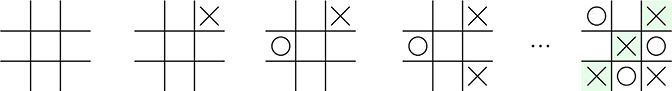

> **圖片描述：** 井字遊戲的一系列棋局演變過程，從左至右展示。從空的3x3格子開始，玩家輪流放置X和O，直到X在對角線上連成三個，遊戲結束。

圖26.1　井字遊戲。從左到右來看，我們從其中一個空格開始，先走X，再走O，然後再走X……直到X在對角線上連成3個，則朋友獲勝

現在我們想要教朋友來玩這個遊戲，但不會說“她要求學這個遊戲”——這個想法在整個過程中都不會出現。在教她怎麼玩這個遊戲時，第一個不同尋常的策略就是：我們不會告訴她發生了什麼事。

記住，在這個過程中，我們不會告訴她我們在玩遊戲。也許她認為在幫我們把東西放在商店的貨架上，抑或在幫我們設計一個有吸引力的地板瓷磚圖案。也可能她完全被搞糊塗了，但她願意出於友誼和好奇來進行接下來的活動。

我們不會告訴她“如何贏得或輸掉這場比賽”，也不會告訴她應該怎麼玩。所以這位朋友幾乎不知道發生了什麼事。

這裡的關鍵詞是“幾乎”。因為朋友在這個強化學習的類比中扮演了智能體的角色，而我們會把自己想象成環境。作為環境，我們將給朋友提供4項重要的資訊。

首先，我們需要給她當前的棋局，如圖26.2的第1步所示。

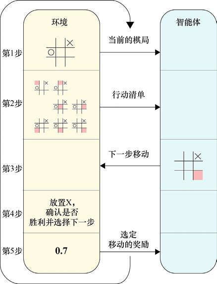

> **圖片描述：** 展示井字遊戲中智能體與環境之間五個步驟的資訊交換流程圖。左側為環境（顯示棋盤狀態和行動清單），右側為智能體。五個步驟依序為：(1)向智能體展示當前棋局、(2)給智能體可能動作列表、(3)智能體選擇動作、(4)環境處理動作並回應、(5)環境發送獎勵信號。

圖26.2　在一個井字遊戲中，智能體和環境之間基本資訊的循環交換。在這個例子中，環境和智能體需要輪流傳遞資訊，兩方都需要等待對方的資訊。1：向智能體展示當前的棋局。2：給智能體一個包含全部可能動作的列表。3：智能體選擇一個動作。4：環境對這個動作進行處理並返回一個還擊的動作。5：環境向智能體發送一個獎勵信號

其次，我們還將為她提供包含全部可能的動作的列表，如圖26.2的第2步所示。在這種情況下，我們會給她一個包含7個空單元的列表，她可以在其中任一單元放置一個X。

或者，我們也可以給她所有的9個單元作為可能的動作，這9個單元中包括已經有X或O的單元。重複放置是非法的，但是她不知道。這樣做（把包括非法動作的全部動作提供給她）的目的是：希望智能體能自己學會如何發現這些非法行為。這種思想是為了讓智能體更多地瞭解遊戲（包括不可以做什麼），這樣她就能玩得更好。在這個例子中，智能體要做的事稍微容易一些，因為她不會做出非法的舉動。

一旦我們的朋友有了當前的棋局和行動清單，她就可以以她喜歡的任一方式來選擇其中的一個，也就是圖26.2的第3步。注意，她並沒有在她選擇的單元中放置X，她只是指出了她希望我們（環境）為她做的事情。

在她告訴我們她選擇了哪一個動作之後，我們就需要執行她的選擇。如果這是非法的，我們就會馬上告訴她。否則，我們會檢查這樣做是否會贏得勝利（如果她贏了這場比賽，我們會告訴她這個結果）。而如果這兩件事都不是真的，我們就會給出一個動作作為回應。這個過程如圖26.2的第4步所示。

現在我們可以給她第3條資訊：一個**獎勵信號**作為回饋。這是一個數字，假設在0和1之間。它是為了告訴我們的朋友，根據她所不知道的某種神秘規則，這一行為有多“好”。這個過程如圖26.2的第5步所示。如果她做了非法的動作，那麼這一回饋將是0；如果她完全輸掉了比賽，這一回饋也將會是0；如果她贏得了這場比賽，這個獲勝的動作就將會得到1分。但通常，回饋值是在兩種極端分數（1分或0分）之間的一個值，表達了我們認為這一舉動是多麼的“好”。動作越好，回饋的值就越大。

我們會讓這個獎勵信號成為我們的朋友喜歡的某種東西，這樣她就會想要得到她能得到的最大、最頻繁的獎勵。

在每個動作後，我們都會給出這種回饋。但有些時候，在最終結果產生之前，我們是不知道這個行為做得有多好的。在這種情況下，只有當遊戲結束時，才會出現回饋信號。我們會在後面的章節中看到一個關於這種情況的例子。

我們告訴她的第4個資訊並沒有在圖中展示出來，因為這是一個總體的指導，她應該爭取最大的獎勵。“0”的獎勵是很糟糕的，而“1”的獎勵是最好的，“1”意味著她已經成功地完成了我們希望她做的任何事情（在這種情況下，是得到3個在一行的X）。有時“1”的獎勵被稱作**終極獎勵**（ultimate reward）或**最終獎勵**（final reward）。

回顧一下，我們向我們的朋友展示了當前的棋局和行動清單，她選擇了一個行動，之後由我們來實施並給予回應。我們給她了一個獎勵信號，告訴她這個選擇有多好。當她再次行動時，我們會向她展示新的棋局和行動清單，這個過程會再次重複。

有時我們會以略微不同的方式來敘述這個循環，把第2步看作起始，然後是第3、4、5步，最後是第1步。資訊的流動並沒有改變，但從概念上講，這讓我們把新的棋局看成了回饋的一部分，這樣智能體就可以把它（新的棋局）和獎勵信號放在一起進行考慮。這個循環的版本如圖26.3所示。

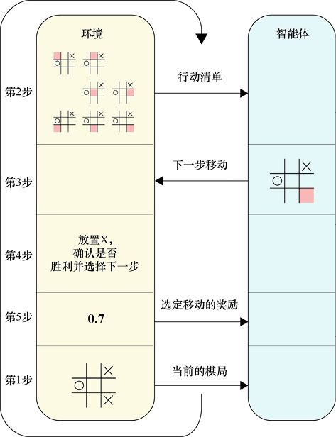

圖26.3　另一種思考資訊流動的方式，是通過一個資訊交換的循環進行的。我們從圖26.2中的第2步開始，然後繼續執行第3、4、5步，之後是第1步。這個循環所使用的起始棋局狀態與圖26.2中的第1步相同，其中右上和中左的單元格被佔用

這兩種循環的思考方式是沒有實際區別的，因為資訊的流動是一樣的。它們之間的區別只是一個概念上的選擇：我們是傾向於將棋局與行動清單（見圖26.2）相關聯，還是傾向於將棋局與獎勵信號（見圖26.3）相關聯。

作為智能體，我們的朋友在“如何解釋獎勵信號”以及“如何選擇行動”兩方面有完全的自由。她也可以根據自己的喜好保留一些她的個人隱私，在這裡，我們假設她已經接受了我們的建議（即她會努力爭取最好的回報）。

那麼她應該怎麼做？

下面我們將看到一種可能的策略，它幾乎可以很好地工作，但是仍舊不符合標準。我們會稍微對它進行調整，以便讓它更好地工作。

在深入討論之前，請回憶一下我們在第11章中關於操作性條件反射的討論，這種基於行為主義的訓練方法將使用獎勵和懲罰來鼓勵或阻止更多的特定的行為。強化學習則很自然地融入了這個框架。

## 26.3　強化學習的結構

讓我們把上面的例子歸納為一個更抽象的描述。這將讓我們可以處理超出遊戲本身的其他情況，如“電梯控制”以及“種植農作物”的例子。

圖26.4展示了這種更一般化的強化學習，可以整理成3個步驟。下面我們將詳細介紹這些步驟。

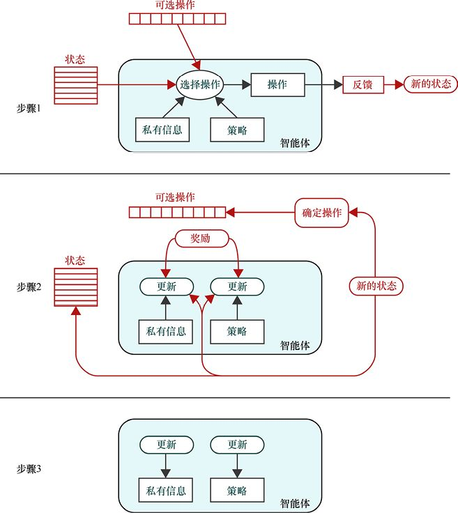

> **圖片描述：** 強化學習的三步驟概述流程圖。步驟1：智能體根據狀態和私有資訊，透過策略選擇操作，操作被送入環境產生回饋與新狀態。步驟2：環境將獎勵、新狀態和可選操作回傳給智能體，智能體內部的私有資訊和策略準備進行更新。步驟3：智能體用更新後的私有資訊和策略取代舊版本。

圖26.4　強化學習的概述，分為3個步驟。步驟1：智能體選擇一個動作。步驟2：環境做出響應。步驟3：智能體進行自我更新

我們的目標是讓智能體學習“如何越來越好地從動作列表中做出選擇”。也就是說，我們希望它**從經驗中學習**到“如何表現得越來越好”。

當我們把環境置於**初始狀態**時，整個過程就開始了。在一個棋盤遊戲中，這就會開始一個新遊戲，而一個完整的訓練週期（比如從頭到尾地玩一輪遊戲）稱為**一節**（episode）。我們通常期望通過大量的“節”對智能體進行訓練。

讓我們依次看看這3個步驟中的每一個。

### 26.3.1　步驟1：智能體選擇一個動作

我們從圖26.4的步驟1開始，如圖26.5所示。

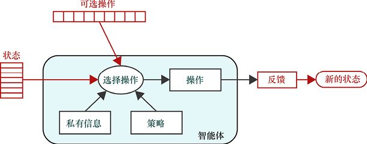

圖26.5　圖26.4中的強化學習過程的步驟1。首先環境為智能體提供當前的整體環境以及可以選擇的動作。之後智能體會選擇一個動作，而這個動作將由環境實作

環境是智能體的所有行為的發生場所，由一組數字完整描述，這些數字被統稱為**環境狀態**、**狀態變量**或簡單地稱為**狀態**。它可能是一個簡短的列表，也可能是一個很長的列表，這取決於環境的複雜性。在棋盤遊戲中，環境通常指棋盤上所有棋子的位置，以及每個玩家所持有的遊戲資產（如遊戲幣、道具、隱藏卡等）。

我們也有一個智能體，它能夠觀察環境並採取可能影響環境的行動。我們經常將智能體擬人化，之後討論智能體“想要”如何實作某些結果。在基本的強化學習中，智能體在接收環境的回饋之前是空閒的，環境會告訴智能體什麼時間該採取行動。

智能體使用一種稱為**策略**的演算法從列表中選擇動作，同時智能體的選擇也會受到它所希望保護的**私有資訊**（private information）的影響。

我們通常把智能體的私有資訊看作一個資料庫，它可能包含對策略的描述，或是包含在某些特定狀態下所採取的行動的歷史記錄（包括採取這一行動所返回的獎勵）。

相比之下，策略通常是一種由一組參數控制的演算法。通常，在智能體玩遊戲的過程中，隨著它對動作選擇策略的改進，參數會隨著時間的變化而變化。策略的演算法也可能隨著時間的推移而改變，但這種情況並不經常發生。

如果我們願意，我們可以把策略的參數看作是智能體的私有資訊的一部分。但是，從概念上區分“由智能體存到保留資訊資料庫的資訊（私有資訊）”以及“指導其選擇行動的演算法和參數（結合在一起就是策略）”通常是有幫助的。我們的總體目標是讓智能體使用私有資訊來不斷改進策略的參數，讓它能夠從成功和失敗中進行學習。

我們通常不認為是智能體執行了它的動作。相反，它所選擇的動作都會被報告給環境，由環境負責執行操作。這是因為即使動作正在被執行而尚未完成，環境還是可能會由於動作而改變。

當環境執行智能體所選擇的動作時，環境本身通常會發生變化。當環境對其自身的變化做出響應時，就可能會產生一系列的進一步的活動，之後再發生變化來對這些進一步的活動做出回應，以此類推。回到我們的雙足機器人，我們的控制器（智能體）可能會引導機器人把它的右腳向前推進。當機器人（環境）這樣做的時候，它可能會發現它需要低頭向前，這樣才能將重心放在腳掌上。但是，機器人又需要看向前方，以便注意到路上的障礙，所以，為了保持重心平衡，機器人選擇伸出一隻手，這就是它如何調動身體的其他部分來使得自己不會摔倒的過程，以此類推。該控制器可能會等待機器人變得穩定，然後評估當前狀態並引導機器人採取另一種行動。

在我們的井字遊戲中，環境的變化將包括在智能體選擇的單元中放置一個X，然後進行一個新的動作（即在空的單元格中放置一個O）。

當環境改變時，它更新後的配置將保存在狀態變量中。

### 26.3.2　步驟2：環境做出響應

讓我們繼續講解圖26.4的步驟2，如圖26.6所示。

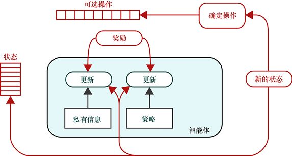

圖26.6　圖26.4中的強化學習過程的步驟2。在這一步中，環境保存了它的新狀態，為智能體準備可執行動作的列表，並將新狀態發送給智能體。與此同時，它也會給予智能體回饋，新狀態將它的變量保存在了最左邊的狀態變量欄中

在這個步驟中，環境對自身進行了更新，並準備好需要向智能體傳遞的資訊，以提供對其操作的回饋。

環境通過狀態變量保存了它的新狀態，以便在智能體下一次選擇動作時，它能夠提供給智能體新的環境，新的狀態變量取代了舊的。

環境也將使用它的新狀態來確定智能體在下一步移動中可以選擇什麼動作，這個新的動作列表將取代舊的列表。

同時，環境還會提供一個**獎勵信號**，這個信號會告訴智能體它最後選擇的動作是多麼的“好”。而“好”的定義則完全依賴於系統的需要。在遊戲中，一個“好”的行為會引導走向更有利的戰局（甚至是勝利）。而在電梯調度系統中，“好”的操作可能會大大縮短等待的時間。對於一個機器人來說，“好”的行動可以使它保持直立並向前移動。

讓我們看一下智能體的內部，這裡有兩個更新區域，分別用於私有資訊和策略。每個更新區域接收環境提供的回饋，接收的資訊會連同當前的私有資訊以及策略配置一起，去更新這兩部分機制。

在這種構建流程中，更新區域會在這個步驟中收集它們需要的資訊，並在接下來的環節裡創建更新後的版本。

### 26.3.3　步驟3：智能體進行自我更新

讓我們來看圖26.4的步驟3，如圖26.7所示。

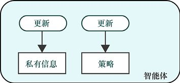

圖26.7　圖26.4中的強化學習過程的步驟3。在這裡，新的、更新後的私有資訊及策略取代了舊的私有資訊及策略

在這一步驟中，智能體會保存更新後的私有資訊和策略參數。

步驟3之後，智能體可能會安靜地等待，直到環境告訴它應當再次採取行動，或者它也有可能積極地計劃下一步的行動。這取決於在最後一個動作被完全處理後，它從環境中學習到了什麼。這對於即時系統（即當環境要求採取行動時，需要快速做出反應的系統）來說非常有用。

通常在玩遊戲時，會有一個標誌遊戲結束的點，這時環境會向智能體發出**最後的獎勵信號**（或者說**最終獎勵**）。如果智能體試圖贏得一個遊戲或完成其他定界任務，這個信號通常會告訴智能體遊戲已經結束了，這標誌著這**節**訓練的結束。

強化學習的目標是在特定場景中找到幫助智能體的方法，使得智能體能夠從回饋中學習“如何選擇帶來最好回報的行為”。無論是贏得比賽、種植農作物還是移動機器人，我們都想要創造一種能從經驗中學習的媒介，使其在操縱環境的過程中獲得積極的回報。

### 26.3.4　簡單版本的變體

上面的描述代表了智能體和環境之間的一種基本的交流方式，這種方式也可以變得更有趣。

我們將區分兩種行為。第一種是**自由運行**（free-running），指的是不管外界的干預如何，一個對象（智能體或環境）都在不斷地行動和改變。第二種是**觸發**（triggered），指的是一個對象的狀態是靜止不變的，直到外力使它行動。

這兩種行為類型對智能體和環境都適用，圖26.8給我們提供了4種組合。

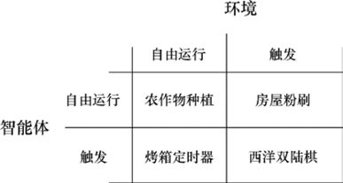

圖26.8　假設智能體和環境都歸於這兩種行為類型中的一個，一個自由運行的對象能夠自己發生變化，而被觸發的對象只有在被請求時才會有所行動。在文中我們會對這4種情況進行討論

左上方格子裡的是農作物種植，其中的智能體是農民，而環境是農場和天氣。其中環境和智能體都是自由運行的。環境是自由運行的，因為農作物、田地、天氣、昆蟲等都在做自己的事情，即使農民什麼也不做，它們也在改變；而農民也是自由運行的，因為他可以決定他什麼時間想要農作。

右上方格子裡的是房屋粉刷，其中智能體是房子的油漆工，而環境是房子外牆面。這個油漆工是自由運行的，因為他可以決定什麼時間粉刷什麼區域。而環境則是被觸發的，因為只有當油漆工塗上顏料時，牆面才會改變。

左下方格子裡的行為模式與右上方相反，其中智能體是一個在準備餐點的廚師，環境則是一個烤箱定時器。計時器是自由運行的，因為（一旦它啟動了）它會自己計算出廚師是否需要做什麼事情。而廚師則是被觸發的，因為只有計時器停止時，她才能夠把餐點從烤箱裡拿出來。

右下方格子裡是西洋雙陸棋，它的智能體是一個玩家，而環境是另一個玩家、棋盤和骰子。智能體是被觸發的，因為只有輪到他的時候，他才可以搖骰子和移動。環境也是被觸發的，因為輪到智能體的時候，環境需要等待，只有當智能體結束動作後，環境才會發生改變。

最後一個變體形式在電腦中最容易建模，因為它的資料流是很容易被預測和控制的，但其他的變體也很有用。

在本章中，我們繼續以簡單的棋盤遊戲作為示例，但強化學習是完全可以適用於其他情況的。

在本章剩餘部分，環境清晰的情況下，我們會把自己想象成智能體。因此，我們會經常談論到“我們的策略”和“我們的經驗”（指的就是智能體的策略或經驗）。

### 26.3.5　回到主體部分

有很多方法可以使強化學習的結構形式化。我們可以對圖26.4中的步驟進行概括，來歸納對智能體和環境的觸發及非觸發情況。

一般來說，我們可以想象智能體是一個抽象的實體，它通過動作來操縱環境從一個狀態轉換為另一個狀態。我們將這些動作稱為**轉換**，因為它們導致環境發生了變化（或者說使得環境進行了一個過渡），從一個狀態（即一組狀態變量）轉換到另一個狀態（即另一組狀態變量）。這樣來看，我們的學習問題基本上可以歸納為**狀態**、**過渡**（transition）和**獎勵**3個部分。這種對事物的思考方式（再加上一些額外的資訊）稱為**馬爾可夫決策過程**（或者說MDP）。馬爾可夫決策過程就是利用狀態的集合來模擬一個系統（隨著時間過去而發生）的行為，從一個狀態過渡到下一個狀態，同時模擬出一個分佈，這個分佈可以給我們每一個轉換髮生的機率[Shalizi07]。從初始狀態開始，我們就會根據分佈隨機選擇狀態轉換，直到結束狀態。將我們教智能體的目標建立成一個馬爾可夫決策過程提供了一個豐富的理論框架，但在這裡我們還不需要它。

當智能體更新它的策略時，它可能會訪問所有的狀態參數，也可能只訪問其中的一些參數。如果一個智能體能看到全部的狀態，我們就說它具有**完整可觀察性**（full observability），否則它就只有**有限可觀察性**（limited observability）或者說**部分可觀察性**（partial observability）。只給一個智能體有限的觀察能力的原因是：有些參數的計算成本很高，但是我們無法確定它們是相關的還是不相關的。因此，我們需要先阻止智能體訪問這些參數，去觀察這樣是否會損害智能體的性能。如果把它們排除在外沒有害處，我們就可以把它們完全排除在外以節省精力。

一旦我們開始考慮用回饋來訓練智能體（像我們一直在討論的那樣），就會發現自己面臨著兩個利益問題。

首先，**信用分配問題**（credit assignment problem）要求我們找到一種方法來通過最終的獎勵（比如贏或輸掉一場比賽）修訂沿途的每一個動作。

舉個例子，假設我們在玩一個遊戲並且取得勝利，那麼這一個動作就會得到很好的回饋並且被記住。但我們還想要以某種方式將這個獎勵（**信用**）**分配**到沿途的每個動作（每一個使得我們走向勝利的動作）上。因為這樣的話，在我們再次看到這些中間的棋局和動作時，就更有可能去選擇那些可以獲勝的動作。

出於同樣的原因，如果我們輸了，就會想讓我們的每一步行動去承擔一部分責任，這樣在下一次選擇時，才不太可能再次選到它們。

其次是**探索或開發困境**（explore or exploit dilemma），它詢問了我們是否想要謹慎行事，去選擇那些我們認為會得到好結果的行動，或者說我們想要冒險去嘗試一些可能會得到更好的結果的新舉措。當然，這些未知的舉動也可能帶來可怕的後果。

例如，在玩遊戲時，已知某一特定的行動會讓我們處於一個有利的位置，但仍舊存在某個未嘗試的新行動也可能會讓我們到達更有利的狀態。要想知道新舉措是否會更好，唯一的辦法就是去嘗試它。

一方面，我們希望我們的智能體能夠**探索**每一種可能，這樣它就能夠找到最佳的選擇。而另一方面，訓練時間總是不夠用，往往無法嘗試所有的選擇，這就需要我們繼續**開發**已知的好的動作，並利用已知資訊去找到能夠帶來勝利的路徑，即使它們不是最快的路徑（甚至不是最可靠的路徑）。

在選擇每一個動作時，我們需要一種方式來做出決定：是用我們以前嘗試過的動作來保證安全，還是冒險採取新的行動。

### 26.3.6　保存經驗

假設我們是玩遊戲的智能體，每走出一步，我們都會得到一個獎勵信號（直到最後一步），我們可以在私有資訊中記住這些獎勵。

讓我們把它作為一個總體計劃：我們將在本地存儲器中保存每款遊戲的每步動作所得到的每個獎勵。本地存儲器將從一場遊戲（或者說一節）延續到下一場遊戲，所以本地存儲器中將包含我們玩過的每一場遊戲的歷史，也包含每一場遊戲中的每一步所獲得的獎勵。

除了每個動作的獎勵，我們還會保存一個**分數**，這是我們對這個動作有多麼“好”的總體評估。換句話說，如果再次看到一個相同的棋局，我們就會知道：在這個情況下，我們嘗試過的所有動作中，得分最高的動作（最好的動作）是哪一個。

當我們要玩一場新遊戲時，會需要選擇一個行動，這種情況下，我們就可以諮詢我們的歷史記錄，看看從以前的經驗（曾見過的相同的棋局）中能夠學到什麼。在這裡，我們沒有嘗試過的動作會被標記，而嘗試過的動作則會有一個與之相關的分數，它反映出我們對於這個動作的綜合體驗，得分高意味著這一舉動帶來了更好的回報。

當我們選擇行動的時候，我們可以選擇安全的方式（也就是去選擇最高分數的動作），又或者我們可以冒險嘗試一個新的動作。

### 26.3.7　獎勵

在強化學習中，我們試圖找到一種策略，它可以引導智能體選擇能帶來最高回報（獎勵）的行為。在這個大背景下，“獎勵的本質是什麼”以及“如何明智地利用獎勵”是值得我們花時間去琢磨的。

我們可以將獎勵分為兩類：**即時性的**和**長期的**。即時性的獎勵是指在執行完一個操作後由環境交付給智能體的那部分獎勵，而長期的獎勵指的是我們的總體目標（比如贏得一場比賽）。

我們希望在知道所有給定遊戲（或者一節）中的獎勵的情況下來理解即時性的獎勵。有很多方法可以解釋這些獎勵以及解釋它們對我們來說意味著什麼。我們將會看到一種流行的方法稱為**折扣未來獎勵**（discounted future reward），或者說DFR，這種方法可以表示我們在26.3.6節末尾所討論過的分數。

為了瞭解DFR的工作原理，我們需要展開一下獎勵的過程。假定我們是一個玩遊戲的智能體。

當遊戲完成後，我們可以將我們收集到的遊戲獎勵放置在一個列表中，一個接一個地按照它們被接收的順序放置（放置時包含獲得這些獎勵的動作）。之後，我們把所有的獎勵加起來就能得到這個遊戲的**總獎勵**，如圖26.9所示。

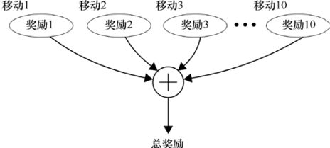

圖26.9　與某一節（一場遊戲）相關的總獎勵是指這一節從第一步到最後一步所獲得的所有獎勵的總和

我們也可以把這個列表的任何部分加起來，比如把前5個條目加起來，又或者把後8個條目加起來。特別地，假設我們在遊戲的中間選擇了一個特定的步驟，並將這一步之後的所有獎勵相加（直到遊戲結束），如圖26.10所示。

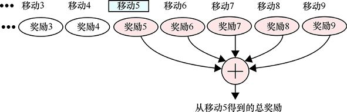

圖26.10　任何一個動作的未來總獎勵是指從這個動作起到這一節結束的所有獎勵的加和。為了清晰起見，這裡我們只是展示了從移動3開始的動作，同時加和了從移動5開始到遊戲結束的獎勵

圖26.10向我們展示了與遊戲中第5步相關聯的**未來總獎勵**（total future reward），或者說TFR。它是這場遊戲的全部獎勵的一部分，包括第5步及第5步之後的全部動作的獎勵。換句話說，這是該行動的未來回報，而不是過去回報。

遊戲的第一個動作是特別的，因為它的未來總獎勵和遊戲的總回報是一樣的。由於我們的獎勵總是0或正數，所以每一個後續動作的TFR將總是等於或小於它之前的動作的TFR。

未來總獎勵是對我們剛剛結束的遊戲中所發生的事情的一個很好的描述，但是它無法描述下一場遊戲中可能發生的事情，即使下一場遊戲與當前遊戲的動作順序完全相同。

這是因為真實環境是**不可預測的**。

如果我們在玩一個多人遊戲，我們就無法確定其他玩家（一名或多名）在下一場比賽中是否會像在前一場比賽中那樣做出動作。如果他們進行了不同的操作，那麼就將會改變遊戲的軌跡，從而改變我們的獎勵，甚至還可以改變輸贏的結果。即使我們在玩紙牌遊戲，也會面臨洗牌或者其他“隨機”的情況。所以我們不能確定未來會發生什麼，即使我們動作的方式和過去完全一樣。

即時性的獎勵更可靠，我們有兩種即時性的獎勵。第一種即時性的獎勵可以告訴我們“在環境做出響應之前，我們進行的動作的質量”，這種獎勵是完全可以預測的。如果我們以後再面對相同的環境，並做出同樣的舉動，我們就將得到同樣的獎勵。

第二種即時性的獎勵告訴我們“在環境做出響應之後，我們所做的動作的質量”，這種獎勵是會受到環境影響的。這種類型的獎勵不像第一種那樣可以預測，因為在每次我們採取行動時，環境會以不同的方式回應。例如，在通過遠程控制來打開設備的場景下，我們可以拿起遙控器，按下電源鍵，打開設備並把遙控器放回去，以這樣相同的方式連續進行100次。但是我們不知道電池耗盡的情況，所以在我們第101次嘗試時，可能就無法打開設備了。

如果獎勵是根據是否按下按鈕來給的（也就是說，是在環境響應之前的即時性獎勵），那麼我們就會得到滿分。但是，如果獎勵是打開設備（也就是說，是在環境響應之後的即時性獎勵），那麼第101次嘗試就將得到一個很低的分數（甚至是0分）。

儘管環境是不可預測的，但是盡我們所能地去考慮它依舊很重要。一般來說，我們採取行動的目的都不是簡單地要去做某件事，而是希望能得到一個結果。所以，即使我們無法確定會發生什麼，我們也需要知道這個結果的好壞，它是理解我們是否做出了一個“好”的選擇的重要部分。

真實的環境具有不可預測的元素，所以我們說真實環境是**隨機的**。相比之下，一個完全可預測的環境（例如純粹基於邏輯的遊戲）就是**確定的**。

不可預測性（或者說**隨機性**）在不同情況下是不一樣的。如果不可預測性很低（也就是說，環境在很大程度上是確定的），那麼我們就可以比較有信心地說同樣動作的獎勵在未來的遊戲中也會相同（或相近）。如果不可預測性很高（也就是說，環境在很大程度上是隨機的），那麼在我們重複同樣的行為時，對未來獎勵所進行的任何預測都有可能是錯誤的。

我們需要某個固定的方式去適應這些隨機的情況。

一種方法是去修改未來獎勵的值，使它與我們多大程度上相信“遊戲會以相同的方式再次進行”掛鉤。越不確定，修改後的TFR值就會越低。這樣的話，我們感到自信的動作就會有很高的分數，而其他動作的得分就會很低。

可以用一個**折扣因子**（discount factor）來量化我們對環境的不確定程度（或者說不確定性）的估計。這是一個介於0和1之間的數字，通常用小寫的希臘字母γ（gamma）表示。我們所選擇的*γ*值代表了我們對環境的可重複性的信心。如果我們認為環境是接近於確定性的，每個給定動作都會得到相同的獎勵，我們就將*γ*設為接近於1的值。而如果我們認為環境是混亂而不可預測的，我們就會把*γ*設為接近於0的值。

我們可以使用折扣因子來創建一個未來總獎勵的版本，稱為**折扣未來獎勵**（discount future reward），或者說DFR。這不是像TFR那樣把一個動作之後的所有獎勵加起來。在計算折扣未來獎勵時，我們是從某一步的即時性獎勵開始的，並將之後的每一步乘以（一個或多個）*γ*以減少它們的獎勵，每往後一步就多乘一次，所以這步之後的一步的獎勵要乘一個*γ*，再下一步的獎勵要乘兩個*γ*，以此類推。這表明了一個事實，那就是我們認為這些動作的可重複性越來越低了（獎勵的值越來越不可靠）。圖26.11以圖形方式進行了展示。

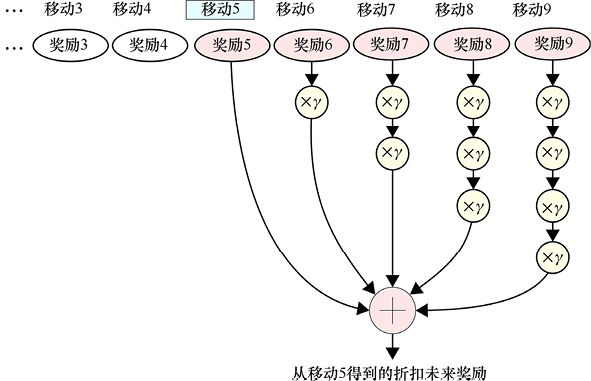

圖26.11　折扣未來獎勵（或者說DFR）是將某步之後的每一步的即時性獎勵加在一起。在相加時，下一步的即時性獎勵要乘以*γ*，再下一步的即時性獎勵要乘以兩次*γ*，以此類推

注意，在圖26.11中，每個後繼的值都需要乘以*γ*至少一次。乘法次數可以帶來顯著的效果。

讓我們在行動中看看效果。我們將使用多個*γ*值來考慮開局動作所得到的獎勵和折扣未來獎勵。圖26.12展示了一場具有10個動作的比賽的即時性獎勵。

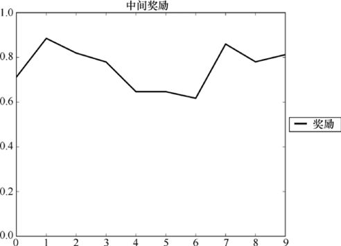

圖26.12　一場具有10個動作的比賽的即時性獎勵。這場比賽以沒有一個明確的贏家作為結尾

根據圖26.12，對這些獎勵應用不同的未來折扣，之後得到了圖26.13所示的曲線。可以明顯看到的是，當折扣因子減小時，獎勵的下降速度會迅速加快直到0，這意味著我們對未來的預測不自信。

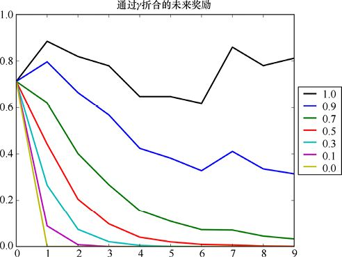

圖26.13　圖26.12的獎勵乘上不同的*γ*值的結果。當*γ*是1時，就可以認為遊戲是以同樣的方式運行的，也就是說，系統是確定的。而隨著*γ*值的減小，我們對未來的值的信心降低，它的獎勵就會迅速下降。當*γ*達到0時，我們就認為這個系統是完全隨機的。除了當前動作的即時性獎勵外，我們對其他獎勵都沒有信心

將圖26.13中每條曲線上的值相加，我們就會得到第一個動作的折扣未來獎勵（針對不同的*γ*值），如圖26.14所示。注意，當我們認為未來越來越不可預測（也就是說，*γ*值越來越小了）的時候，DFR也變得更小了，因為我們對獲得未來的獎勵不那麼有信心了。

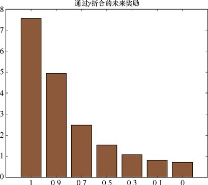

圖26.14　從圖26.13中獲得的折扣未來獎勵（針對不同的*γ*值）。*γ*值從最左邊的1陸續降到最右邊的0。隨著*γ*的減小，我們越來越不相信系統是確定性的（也就是可重複的），因此我們越來越多地減少未來獎勵的數量。最後，當*γ*為0時，我們就忽略了所有未來獎勵，DFR也只是即時性獎勵的值了

當*γ*值接近1時，未來獎勵不會減少很多，所以DFR接近TFR。換句話說，我們認為：如果再次採取行動，我們得到的總獎勵將與現在得到的總獎勵相似。

但是當*γ*值接近於0時，未來獎勵就會減少到幾乎不產生任何影響的程度，我們所得到的就只有即時性獎勵。換句話說，當再次進行遊戲時，我們沒有信心認為遊戲會像這次一樣進行，所以我們唯一能確定的獎勵就是即時性獎勵。

在許多強化學習場景中，我們通常會選擇一個0.8（或0.9）附近的*γ*值作為開始。隨著對系統的隨機性有了更多的認識，並對智能體的學習程度有了更多的瞭解後，我們會對*γ*值進行不斷的調整。

## 26.4　翻轉

在接下來的章節中，我們將討論學習翫一個遊戲的實際演算法。為了讓我們專注於演算法而不是遊戲，我們將把井字遊戲簡化成一個新的紙牌遊戲，稱為“翻轉”。

我們將在一個正方形網格上玩“翻轉”（從一個3像素×3像素的網格開始），每個單元格內都有一塊瓦片，它會圍繞一個柱子旋轉，如圖26.15所示。

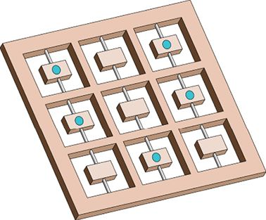

圖26.15 “翻轉”遊戲的棋盤，每一塊瓦片都有一面是空白的，而另一面有一個點。遊戲的動作就是輕彈（或者說旋轉）一塊瓦片

每塊瓦片的一面都是空白的，而另一面則有一個點。每做一次動作，玩家都會按下一塊瓦片來使其翻轉。也就是說，如果它本身是一個點，那麼這個點就會消失，反之亦然。

遊戲以隨機狀態開始，如果3個藍點垂直或水平地連在一起就代表勝利，這時其他瓦片都應該是空白。

這可能不是有史以來發明的智力要求最高的遊戲。我們從隨機狀態開始，想要在最少的步數內達到目標。注意，有6種不同的狀態（3個水平行和3個垂直列）都是可以滿足目標的，所以達到這6種狀態中的任何一種都可以算作勝利（斜著排成一行不算）。

圖26.16展示了一個例子，我們用符號來表示動作。比賽從左到右進行，除了最後一個狀態外，其他狀態都給出了動作進行前的局面。其中一個單元格以紅色突出顯示，這就是將要翻轉的瓦片。

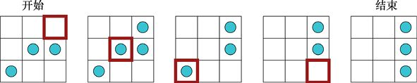

(a)　　　　　　　　　　　 (b)　　　　　　　　　　　　(c)　　　　　　　　　　　 (d)　　　　　　　　　　　　(e)

圖26.16 “翻轉”遊戲。(a)初始狀態，展示了3個點，紅色方塊表示我們想要翻轉的瓦片。(b)翻轉(a)後的狀態，右上角的瓦片已經從空白變成了點，我們的下一個動作是翻轉中間的瓦片。(c)到(e)展示了遊戲的後續步驟，而(e)則是一個成功狀態

現在我們已經明白這是一個什麼樣的遊戲，那麼就讓我們看看如何使用強化學習來贏得比賽。

## 26.5　L學習

讓我們用我們目前所學到的東西來建立一個完整的系統去學習如何玩“翻轉”遊戲。這個開始的版本會非常糟糕，我們稱之為L**學習**（L-learning）。在這裡，L代表“糟糕”（lousy），而我們則會在26.6節中完善這個演算法。請注意，L學習是我們發明的一個“踏腳石”，它可以幫助我們更好地完成一些事情，但它卻不是在文獻中出現的那種實用演算法。畢竟，它的表現很糟糕。

為了讓事情變得簡單，我們將使用一個非常簡單的獎勵系統，除了最後的勝利外，我們在“翻轉”遊戲中所做的每一個動作所得到的即時性獎勵都是0。因為“翻轉”遊戲是一款單人紙牌遊戲，每一場遊戲最終都是可以贏的，所以並沒有什麼驚喜。想要證明每場遊戲都能贏，我們只需要將一個隨機的開始狀態上的所有顯示點的瓦片都翻轉，然後將任意行或列上的3塊瓦片翻轉回來，這樣就可以取得勝利。

而我們不僅要贏得勝利，還要用最少的行動去贏得勝利。

最後的獲勝動作會得到一個取決於比賽時間長短的獎勵。如果它只用一步就贏得了比賽，那麼它獲得的獎勵就是1，但如果它需要用很多步才能贏得比賽，那麼它所獲得的獎勵就會隨著所需的動作的數量迅速下降。這條曲線的具體公式不是那麼的重要，重要的是它是快速下降的，而且總是在變小。圖26.17展示了我們獲得的最終獎勵與遊戲時間長度的關係。

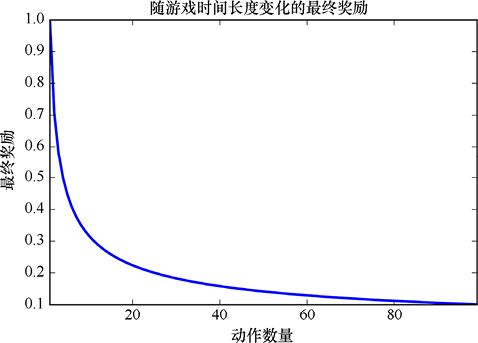

圖26.17　如果能夠迅速取得勝利（一步獲勝），那麼獲得的獎勵就是1，而隨著贏得比賽所需的動作的增加，獎勵的大小將迅速下降

**系統**的核心將是一個數字網格，我們稱之為L**表格**（L-table），同樣，L代表“糟糕”。

L表格的每一行表示棋局的一個狀態。/也就是說，表格中的每一行都表示了棋局中點和空白的相同排列方式。而每一列則代表著應對該狀態的9個響應動作中的一個，所以每一列代表著這一步我們想要翻轉的瓦片。

表格中每個單元格的內容將是一個單獨的數字，我們稱之為L值（L-value）。圖26.18展示了一個示意圖。

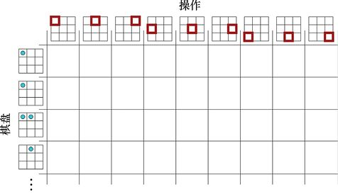

圖26.18　L表格為512種可能的棋局狀態（每個格是點還是空）都準備了一個行，而9個可能的動作都有一個列，表格的內容稱為L值

這個表格是比較大的，有512行和9列，總共512×9 = 4608個單元格。

我們將使用L表格來幫助我們選擇（對於每種棋局狀態來說）獲得獎勵最高的行為。為了實作這一點，我們將根據經驗用一個數字來填充每個單元格，它告訴我們相應的動作有多好。這個值就是我們在之前提到的分數，它告訴我們這個動作有多“好”。

使用L表格有兩個步驟：填充它和使用它來進行遊戲。

在將值賦給L表格之前，我們需要在每個單元格中對它進行初始化。

玩遊戲時，我們會記下所做的所有動作，當遊戲結束後，我們會回顧整個遊戲中的動作和獎勵，為每一個動作都確定一個值。然後將這個值和相應單元中已有的數字組合起來，為這個動作生成一個新的值（稍後我們將討論這個機制）。這稱為**更新規則**（update rule）。

玩遊戲時（學習階段或者應用階段），我們會通過觀察相應的行來選擇一個動作。在這裡會用到一個**策略**來告訴我們：我們需要選擇這一行的哪個動作。

讓我們把這些步驟具體化。

首先，在每一場比賽（或者一節）後，我們需要確定我們想要分配給每一個動作的分數。這需要使用我們在26.3.7節討論的未來總獎勵（或者TFR）。回想一下，首先我們需要對所有動作和獎勵進行排隊，然後將某個行動後的所有獎勵加起來，就會得到TFR。

在玩這個遊戲的時候，每一個動作得到的獎勵都是0，但是最後的動作所得到的獎勵是基於之前的步數的。這意味著我們在途中所採取的每一個動作的TFR都與最終的獎勵相同，耗時短的遊戲的TFR會比耗時長的遊戲的TFR大。

其次，讓我們選擇一個非常簡單的更新規則，在每次遊戲結束後，單元格內的東西將被完全更新為新的TFR。換句話說，在最新一輪遊戲中的每個動作的TFR都將會變成單元格中的新的值，這個值在表格中所對應的動作和棋局狀態，就是我們採取這個動作時對應的棋局狀態。

這個簡單的更新規則有利於我們熟悉L學習系統的工作方式，但是因為它沒有把新的經驗和學過的東西加以結合，所以這個規則將成為導致演算法不能很好地執行的一個重要原因。

我們需要一種策略，以據此得知：對於給定的棋局，我們應該採取什麼行動。目前的策略是選擇該行中最大的L值所對應的動作，如果有多個具有相同的最大值的單元格，我們就隨機選擇其中一個，如圖26.19所示。

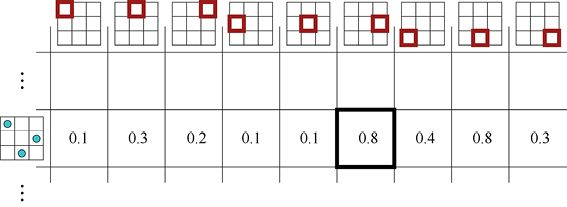

圖26.19　策略是為一個固定的棋局選擇一個動作作為響應。這裡我們看到的是L表格的一部分，這一行對應於最左邊的棋局，每一列都指的是最新計算的這個動作的TFR。在L學習中，我們需要選擇最大的值所對應的動作，這意味著我們要翻轉中間偏右的瓦片

現在讓我們把上面的部分組合成一個學習演算法。

從構建L表格開始，如前所述，它是一個512行×9列的表格。我們用0來初始化每個單元格，然後就可以開始學習了。

假設我們是智能體，第一場比賽（或者說第一節）開始時，我們會看到第一個棋局，點是隨機填充的（可能根本沒有點，或者有9個，又或者0～9的任意數量的點）。

第一場比賽開始時，像每場比賽的開始一樣，我們會在私有資訊中創建一個列表，用來記住遊戲中所進行的每個動作。每一個動作由4個條目表示（不會馬上用到）：我們在進行的棋局狀態（表中的行序號）、採取的動作（列序號）、動作所得到的獎勵（除了最後一步外，總是0）以及動作所導致的結果（也是表格中的行序號）。圖26.20展示了這個想法。在遊戲開始時，列表是空的。

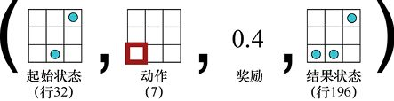

圖26.20　每當進行一個動作時，我們都會在一個不斷增長的列表的末尾附加4個值。這其中包含了“起始狀態”“我們選擇的動作”“我們得到的獎勵”以及“在採取行動後，環境返回給我們的狀態”。如果我們使用一個固定的數字（即L表格的行序號）來表示棋盤狀態和對應的9個單元格（動作），那麼所有的東西就都可以用一個數字表示。只要前後保持一致，這些數字具體是什麼不重要

進行第一個動作時，我們需要看一下對應於起始棋盤狀態的L表格的那一行，這一行包括9個數字。因為這是我們的第一個動作，所以值都是0。策略告訴我們需要隨機選擇一個動作，於是我們隨機選取一個列，這就是我們要採取的行動。

環境會為我們翻轉這個瓦片，要麼讓一個點出現，要麼讓一個點消失。然後，環境會向我們回饋一個獎勵以及新的棋盤狀態。我們會用組合在一起的4個值來表示這個動作：起始狀態、我們選擇的動作、我們得到的獎勵以及由此產生的新狀態。我們把這4個值放在動作列表的最後。

因為我們在玩單人紙牌遊戲，所以環境本身不會有任何動作。在它給我們回饋之後，就會讓我們採取新的行動。

作為回應，我們重複上述過程：看向新的狀態，在L表格中找到對應於它的行，找到那一行的單元格中最大的數字之後把它作為我們的新動作。我們就又會得到一個獎勵和一個新的狀態，然後我們向列表中添加新組合在一起的4個值來描述這個動作。

這種情況會一直持續到遊戲結束。而最後一步的獎勵是我們會得到的唯一的非零獎勵，這是基於我們在遊戲中所玩的動作獲得的獎勵，它隨著動作的增加而快速下降，就像我們在圖26.17中看到的那樣。

得到最後的非零獎勵後，我們就知道遊戲已經結束了，是時候開始從我們的經驗中學習了。

首先，在動作列表中查看每一個元素。我們把棋局狀態、產生的移動以及它們對應的獎勵依次排列，如圖26.21所示。我們一個接一個地觀察每一個動作，並把這個動作後的所有獎勵相加，來找到它的TFR。因為我們知道所有中間分數都是0，所以每個動作的TFR都是最終獎勵，但是我們仍舊可以通過改進演算法來尋找單個動作的TFR。

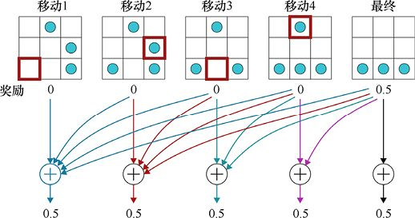

圖26.21　為每個動作尋找TFR，我們將每個動作的即時性獎勵（直接顯示在它下面）及它的後續動作的即時性獎勵相加。在我們的遊戲中，除了最終獎勵，每一個動作的即時性獎勵都是0，所以這些總和都是一樣的

然後，我們使用簡單的更新規則，將每個動作的TFR更新到L表格中對應於這一狀態的這一動作的單元格，如圖26.22所示。

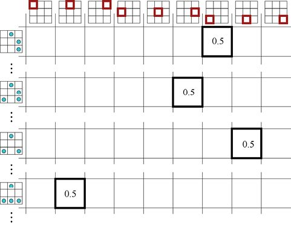

圖26.22　用遊戲中每個動作的TFR值更新L表格。表格的行對應於採取這一動作時的遊戲狀態，而列對應於所做的動作，新的TFR成為這個單元格的新的值

如果想要再次學習更多的東西，我們需要回到這個過程開始的時候，建立一個空的動作列表，然後開始玩一輪遊戲。遊戲結束後，我們為所選的每一個動作計算出一個TFR值，並將其存儲在相應的單元格中（覆蓋單元格內容）。注意，在每次遊戲結束後，我們不會重置L表格，所以在我們進行很多輪（或者說節）遊戲的過程中，它會逐漸被TFR值填滿。

一旦停止訓練開始實戰，我們會像以前一樣使用L表格選擇動作。也就是說，在選擇每一個動作時，我們都會根據當前狀態選擇L表格中對應的一行，之後選擇這一行中最大的L值所對應的動作。

讓我們看看系統是如何工作的。

我們先玩3000epoch“翻轉”遊戲（從遊戲開始到結束是1個epoch），這時L表格可以很好地被充滿。

在3000epoch的訓練後，我們進行了一局“翻轉”遊戲，如圖26.23所示。這並不是一個很好的結果，這局的開場狀態顯然通過兩步就可以達到勝利：翻轉左中的單元格，然後翻轉左上方的單元格（其他順序執行也可以）。演算法卻不這樣走，它似乎是隨機的，6步之後，它終於找到了一個方案。

我們將之前的L表格進行了旋轉，以使之更好地適應可用區域，如圖26.23所示。每一個垂直的列表示一個棋局的配置（或者說狀態），而9種可能的操作則顯示在每一行中（以紅色突出顯示）。加粗的黑線表示我們從該列表中選擇的動作，而完成這一動作後的新的狀態展示在（右側的）下一列中。用陰影表示的單元格是我們所採取的動作。如果這個動作使得一個點出現，那麼這一步就被標記為一個實心的紅點；如果這個動作使點消失，那麼它就會被標記為一個空心的紅點。每個棋局下面的綠色進度條顯示了它在表格中的L值，較長的條形對應較大的L值。

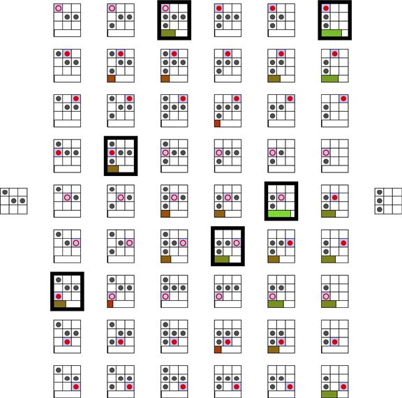

圖26.23　在用L表格演算法進行了3000epoch訓練後，我們重新玩一局“翻轉”遊戲。遊戲順序是從左到右

靠近右邊的遊戲狀態比左邊的有著更大的L值，這是因為這些狀態中有許多被隨機選擇為遊戲的開始狀態。（對於這些更接近勝利結果的狀態來說）如果我們選擇了一個好的動作，並且贏得了比賽（或者我們僅僅通過幾個動作，就贏得了比賽），那麼最終獎勵就會很大。

回到這個遊戲，從最左邊的位置開始，演算法的第一步是翻轉左下方的單元格，引入一個新的點。之後它又翻轉了最左中間的單元格，再次引入了一個點。下一步，它翻轉了左上方的單元格，去掉了一個點。遊戲以這種方式繼續，直到結束（達到勝利）。

圖26.24展示了另一個簡單的初始狀態，在中間的列中已經有3個連在一起的點了。該演算法只需要在最右邊的列中翻轉兩個點，使它們消失，但實際上它卻需要走6步。

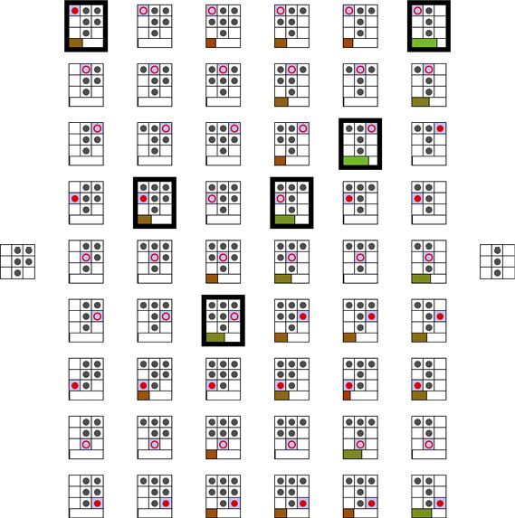

圖26.24　還是用L表格演算法進行了3000epoch訓練，只是我們從另一個簡單的棋局狀態開始。只需要2步就能贏，但該演算法用了6步

我們希望通過更多的訓練來改進演算法，也確實這樣做了。圖26.25所示的是與圖26.23相同的遊戲，但訓練次數增加了1倍（即6000epoch訓練）。

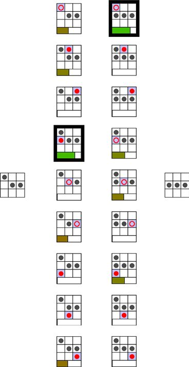

圖26.25　與圖26.23中相同的遊戲，但這次是對演算法進行了6000epoch訓練。最終，該演算法找到了通往成功的捷徑

這很好，這個演算法找到了快速達到勝利的方法。而圖26.26是與圖26.24中相同的遊戲。

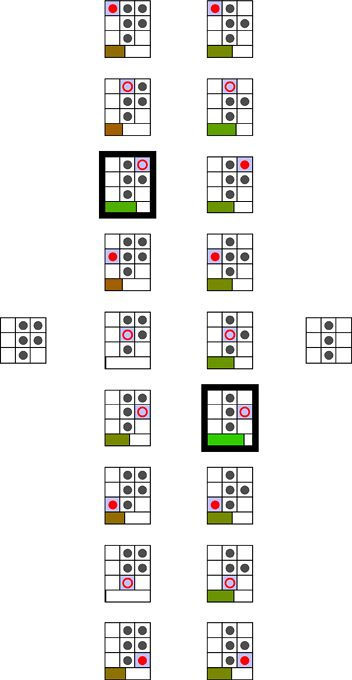

圖26.26　進行了6000epoch訓練後，再次進行圖26.24中的遊戲。同樣，演算法找到了最快的解決方案並可以很好地應用它

我們似乎已經創造了一個可以用於學習和娛樂的偉大演算法，那麼為什麼用代表糟糕的“L”來稱呼這個演算法呢？它似乎運行得很好。這是因為它的良好運行只是建立在環境是完全可預測的基礎上的，而在這一章的早些時候，我們討論過不可預測的環境。事實上，在現實中，大多數環境是不可預測的。

基於邏輯的紙牌遊戲，比如我們一直在看的“翻轉”遊戲，是為數不多的可以完全確定環境的遊戲。

如果我們只是想在完全確定的環境中玩紙牌遊戲，就能夠完美地執行每一個預定的動作，並且環境每次都會給我們相同的回饋，那麼這個演算法就不能稱為糟糕了。

但這種確定性的遊戲很少見，只要有第二個玩家出現，就會有不確定性，遊戲就會變得不可預測。在環境不是完全確定的任何情況下，L學習演算法都將會陷入困境。

讓我們先來看看為什麼，然後就可以學習如何修復它。

### 處理不可預測情況

在玩“翻轉”遊戲時，我們是沒有對手的，所以這是一個完全確定的系統。每次我們採取行動，都能夠得到同樣的結果。

但在現實世界中，即使是單人遊戲也可能出現無法預測的事情。電子遊戲常常會給我們帶來意外的驚喜，一臺割草機可能因為撞到一塊石頭而跳到一邊，或者我們可能會因為網路延遲而錯過在拍賣會上贏得競拍的機會。

處理不可預測情況是非常重要的，讓我們來看看把一些人為的隨機因素引入“翻轉”遊戲中，L學習演算法將如何反應。

隨機模型是這樣的：一輛大卡車會不時地從遊戲區域中開過，干擾棋局，使得一塊或多塊瓦片出現翻轉。當然，即使面對這樣的“驚喜”，我們仍然想要玩好比賽並取得勝利。但是面對這樣的情況，L學習演算法幾乎無法提供幫助。

這一問題是由策略和更新規則所導致的。記住，在我們開始學習之前，每個單元格內都是0，而當遊戲獲勝時，（根據動作數量的多少）每個動作都會得到相同的分數，如圖26.22所示。再次玩遊戲時，面對同樣的遊戲局面，我們會選擇分數最大的單元格。

假設我們正在進行一場比賽，所面對的局面曾經作為開場局面出現過，之後我們只用兩步就贏了，這樣，每一步都會獲得一個很高的分數並被填寫到L表格中。當再次比賽時，每一步我們都會選擇最高得分的動作以求獲勝。

但就在我們第一次行動後，大卡車隆隆地駛過，翻轉了一塊瓦片。面對新的局面，我們會需要很多動作才能獲勝。所以，卡車經過使得同一動作的TFR大大降低。

這裡出現的問題是：較小的值會覆蓋每個單元格（獲勝所需的全部動作）中原先的值。換句話說，因為這個事件，我們的每個動作的L值都會降低。特別是，剛剛我們舉的例子中那個非常完美的開局步驟，只需要再多一步就可以取得勝利，但是現在它的分數變得非常低。

那麼，當再次遇到這個局面時，我們可能會發現另一個單元格的數值比我們上次選擇的單元格的數值要高，這樣，我們就可能會錯過一些非常完美的動作。

換句話說，這個一次性的隨機事件將會讓我們不再選擇我們在這一點上找到的最好的動作。我們將會“忘記”這是一個完美的舉動，因為一個隨機事件已經把它變成了一個糟糕的動作，這個低分使得我們不太可能再次選擇這個動作。

讓我們在實際中看看這個問題。圖26.27展示了一個完全確定情況下的例子。我們從一個有3個點的棋局開始，這一行的最大的值是0.6，對應於中心瓦片的翻轉，所以我們就選擇了這個動作。假設下一個動作也選得很好，我們在兩步中取得了勝利，0.7的獎勵值取代了我們第一次移動時的值0.6，鞏固了這個動作的地位（下次還會選它）。現在一切順利。

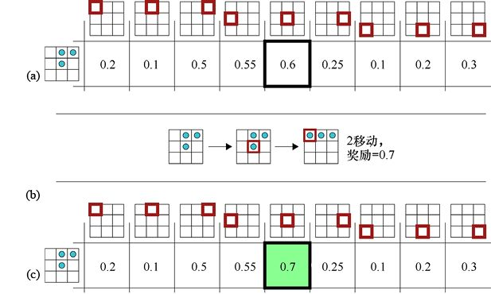

圖26.27　當沒有驚喜時，演算法就能很好地工作。(a)開場局面對應於L表格的這一行，最好的動作的值是0.6，它對應於中心瓦片的翻轉，那麼我們就將選擇並進行這一動作。(b)比賽結束了，只用了兩步，獲得的獎勵是0.7。(c)值0.7覆蓋了完成遊戲的每一步的值

我們在圖26.28中引入了卡車。在翻轉了中間的瓦片之後，卡車搖動了棋局，右下方的瓦片被翻轉了。這讓我們走上了一條全新的道路。假設這個演算法在這一步之後的4個動作內取得了勝利，那麼總的移動數量是5，取得勝利的每一步所獲得的獎勵就都是0.44。

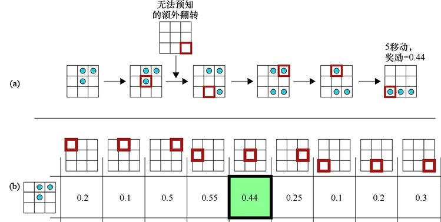

圖26.28　(a)當一輛卡車隆隆地駛過時，它會翻轉右下方的瓦片，這使得這場比賽需要5步才能獲勝。(b)0.44的新獎勵覆蓋了0.6的舊值，這個單元格不再是這一行中得分最高的了

這是很可怕的，我們一下子“忘記”了最好的動作。在這個例子中，另外兩個動作成為了高分動作。當我們再次面對同樣的棋局時，得分為0.55的動作將被選中，而這個動作無法使我們像之前那樣在兩步內取得勝利。換句話說，最好的動作已經被遺忘了，我們所選擇的將永遠是一個相對糟糕的動作。

而有一天，卡車可能會再次隆隆地駛過，這也許會幫助我們再次記起這個動作，但這將需要很長時間。在這種情況發生之前，每當面臨這個棋局，我們都會做出不是那麼好的動作。那麼即使卡車經過，把最優的動作恢復，其他的動作也會出錯。

換句話說，L表格所選的動作幾乎總是比它應該選的動作差勁。因此平均來說，我們的遊戲會持續更長的時間，而我們則會得到更低的獎勵值。

一個意外的驚喜，使得我們“忘記”如何玩好這個遊戲。

這就是我們稱這個演算法“糟糕”的原因。

但它並不是丟掉了所有東西。我們研究了這個演算法，是因為這個糟糕的版本是可以被改進的。演算法的大部分都是沒有問題的，我們只是需要解決這個問題“在不可預測的情況下，它為什麼會失敗”。

從現在開始，我們假設，每當我們玩“翻轉”遊戲時，那輛大卡車總是會駛過並造成不可預測的結果，比如翻轉一塊瓦片。

在26.6節中，我們將看到“如何優雅地處理這種不可預測事件”，並生成一個改進的學習演算法。

## 26.6　Q學習

不需要付出太多的努力，我們就可以將L學習升級到一種更有效的演算法，這種演算法在今天被廣泛使用，稱為Q**學習**（Q-learning），其中Q代表“質量”（quality）[Watkins89] [Eden15]。Q學習看起來很像L學習，但它會用Q值（Q-value）來填充Q表格（Q-table）。最大的改進是Q學習在隨機環境中也可以有很好的表現。

從L學習到Q學習，我們將進行3次升級：如何計算Q表格中單元格的新的值、如何更新現有的變量，以及我們用於選擇動作的策略。

Q表格演算法從兩個重要的原則開始。首先，我們認為結果中是有不確定性因素的，所以一開始就考慮到它。其次，在遊戲的過程中，我們就已經計算出了新的Q值，而不是等待最終獎勵給出後再進行計算。

第二個想法使得我們可以處理持續時間很長的遊戲（或過程），甚至一些永遠得不出結論的遊戲。通過更新，我們可以在沒有得到最終獎勵的情況下，不斷完善我們的表格。

為了完成這項工作，我們需要更新26.5節中提到的L學習的超級簡單的獎勵策略——除了最後的動作外，其他獎勵都是0。在這裡，我們需要返回可以對每一個動作進行評估的即時性獎勵。

### 26.6.1　Q值與更新

Q值是一種隱性的、估計未來總獎勵的方法，即使我們不知道這局遊戲最終會如何結束。

為了找到Q值，我們需要把即時性獎勵都加在一起，包括所有將要到來的獎勵，這是對未來總獎勵的定義。但是我們估計將要到來的獎勵的方式是在下一個狀態中來進行尋找。

回想一下，在圖26.20中，我們說過，對於每一個動作我們將會保留4條資訊：起始狀態、我們選擇的動作、我們得到的獎勵以及這個動作讓我們進入的新狀態。那麼現在，我們就將利用這個新狀態來估算將獲得的未來獎勵。

關鍵是注意到我們的下一個動作是從這個新狀態開始，而從我們的策略來看，我們將始終選擇單元格的Q值最大的動作。如果這個單元格的Q值是該動作的未來總獎勵，那麼用當前動作的即時性獎勵與該單元格的值加在一起就會得到當前動作的未來總獎勵。這是可行的，因為我們的策略保證了我們總是會選擇具有最大的Q值的單元格所對應的動作。

讓我們用一個類比來說明這個問題。假設我們正在為月底的瘋狂搶購攢錢，所以我們每天都會往銀行卡里存一些錢。在這個月的第11天，我們存入了10美元（1美元≈7元），這時我們想知道我們是否能在月底存足夠的錢來支付我們的購買費用。現在我們還沒有辦法預測這一點，但如果我們（某種程度上）知道從明天（12月12日）開始存入的總金額將是200美元，那麼就可以把200美元加到剛剛存入的10美元上，這樣就可以知道在月底會有210美元的存款了。

同樣，Q表格就是使用了下一個狀態的未來總獎勵，它將從該狀態開始到遊戲結束的所有獎勵進行了加和，我們可以將其添加到我們當前的獎勵中，以獲得當前的未來總獎勵。

如果下一個狀態的多個單元格（動作）都具有最大值，那麼選擇哪一個就不重要了，我們所關心的僅僅是下一個動作所帶來的未來總獎勵。

圖26.29直觀地展示了這個想法。注意，我們在這一步中計算的值並不是最終的Q值，但是已經很接近了。

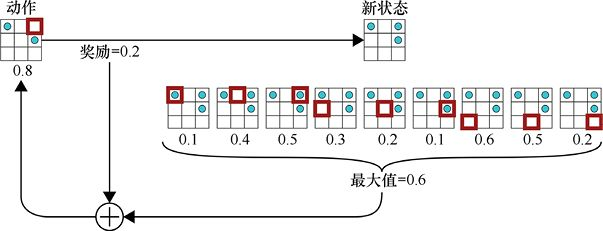

圖26.29　計算一個單元格的新的Q值的部分過程，新的值是兩個部分的加和。第一個部分是單元格對應的動作的即時性獎勵，在這裡是0.2。第二個部分是新狀態的所有動作的最大Q值，在這裡是0.6

這裡缺少了一個步驟，那就是Q學習對隨機性的說明。

我們不應該直接使用下一個單元格的值，而應該使用該單元的**折現**值。回想一下，這是指我們需要將它乘以一個折扣因子（一個0～1的數字，通常被寫作*γ*）。正如我們之前討論過的那樣，*γ*的值越小，我們就越不確定未來的不可預測事件是否會改變這個值，如圖26.30所示。

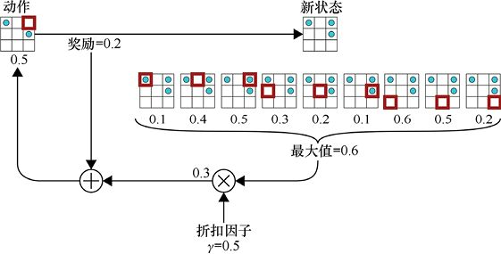

圖26.30　為了找到Q值，我們對圖26.29進行了修改，加入了折扣因子*γ*以減少未來獎勵，它基於我們多大程度上不確定未來的不可預測事件是否會改變未來獎勵

注意，這個方案會自動進行圖26.11所示的折扣未來獎勵中的許多乘法。在這裡，我們只明確列出第一個乘法，除此之外所進行的乘法都是在計算下一個狀態下的單元格的Q值時進行計算。

既然我們已經計算出了一個新的值，那麼應該如何更新當前的值呢？在L學習時我們可以看到，在非確定的情況下，簡單地用新值替換當前值是一個糟糕的選擇。但是我們又需要在某種程度上更新單元格的Q值，否則永遠無法得到改進。

Q學習對這個難題的解決方案是將單元格的值更新為舊的和新的值的混合，而混合的比例是我們指定的，作為一個參數存在。

混合比例由0～1的一個數字控制，通常被寫作小寫的希臘字母*α*。在*α*=0的極端情況下，單元格的值是不會改變的。當*α*=1時，舊的值將完全被新的值取代。而當*α*為0～1的一個數字時，我們就會將這兩個值進行混合，如圖26.31所示。

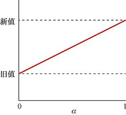

圖26.31　從舊值（當*α*= 0）到新值（當*α*= 1）的過渡過程中，*α*的取值情況

參數*α*稱為**學習率**，它是由我們設置的。非常不方便的一點是，反向傳播中的更新速度也稱為學習率，但通常情況下，上下文可以清楚地說明我們所指的“學習率”是哪一個。

在實踐中，我們通常將*α*設置為接近1的值，如0.9（甚至0.99）。當這個值接近1時，新的值會主導單元格的值。例如，當*α*= 0.9時，存儲在單元格中的值=10%×舊的值+90%×新的值。但即使是0.99，它也和1有非常大的區別，因為即使是1%的舊的值也足以產生一定的影響。

有了這個值之後，我們就需要運行系統（通過一些資料訓練），來看看它工作的效果怎麼樣。然後，我們就可以根據結果來調整參數的值，之後再試一次，不斷重複這個過程，直到我們找到最有效的值。這個過程通常會自動進行，這樣就不需要不斷地動手操作了。

此時，顯而易見而又被忽視的是：所有的行為都是基於我們已經對下一個狀態的各個動作都有了正確的Q值，即使我們還沒有到達下一個狀態。但是它們是從哪裡來的呢？如果我們已經有了正確的Q值，那為什麼還要做這些呢？

這些都是很合理的問題，在看完新的策略規則後，我們再回來看這些問題。

### 26.6.2　Q學習策略

回憶一下，策略告訴我們在給定環境狀態下，我們應該選擇哪一個動作。在學習和實際開始遊戲的過程中，都需要使用這個策略。

我們在L學習中使用的策略是：始終選擇與當前棋局狀態相對應的行中最大的L值所代表的動作。這是有道理的，因為我們已知這個動作給我們帶來的獎勵最高。

但是，這一策略忽視了探索或開發的平衡，它使得我們只關注“探索”。如果一個動作比其他動作得分都高，那麼我們就會一直只選擇它。而在一個不可預知的環境中，帶來最好獎勵的動作可能不會再次給我們帶來最好的獎勵。如果我們給那些從未嘗試過的動作一個機會，它們的表現可能會好得多。

儘管如此，我們還是不想隨機選擇一些動作，因為我們確實偏愛那些已知會帶來高獎勵的動作，只是不需要每次都選擇它們。

Q學習做了一個折中。

在Q學習中，大部時間裡，我們會選擇最大的Q值所對應的動作，而剩下的時間裡，我們則會選擇另一個值。讓我們來看看這兩種流行的策略。

我們將看到的第一種策略稱為epsilon-**貪婪**或epsilon-**柔軟**（epsilon是希臘小寫字母ε，因此有時也稱為ε**-貪婪**或ε**-柔軟**）。這兩種演算法幾乎是相同的。我們在0～1選一個數字，通常是一個很小的數字（非常接近於0），比如0.01或更小。

每次我們準備在一行中選擇一個動作時，就要求系統從一個均勻分佈中隨機選擇一個0～1的數字。如果隨機數大於ε，那麼我們將照常進行，在行中選擇最大的Q值所對應的動作。但是在偶然的情況下，如果隨機數小於ε，這時，我們就會隨機從行的其他動作中選擇一個動作。通過這種方式，在大多數情況下，我們都會選擇最有“前途”的動作，但極其偶然的時候，我們也會選擇其他的動作，看看它會把我們引向何方，如圖26.32所示。

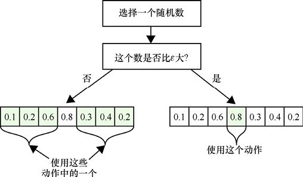

圖26.32　*e* -貪婪策略是指：每當我們想從Q表格的一行中選擇一個動作時，我們會先從0～1選擇一個隨機數。如果它大於*ε*的值（通常是0.01），我們就會選擇行中分數最高的動作，否則，我們就會隨機選擇其他動作中的一個

我們要看的另一種策略稱為**柔性最大值傳輸**（softmax），這與我們在第17章中討論的softmax層類似。在這種策略中，我們需要暫時改變一行中的Q值，使得它們加起來可以等於1。這樣，我們就可以把得到的值作為離散機率分佈處理，然後根據機率的大小來選擇一個動作。

通過這種方式，我們通常會得到最大的分數，偶爾也會得到第二高的分數，而得到第三高的分數的情況會更少，以此類推，如圖26.33所示。

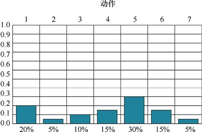

圖26.33　用於選擇動作的softmax策略。首先需要縮放一行中的所有動作，使它們加起來為1。然後我們就可以從這個機率分佈中隨機選取一個數字。在這種策略中，每個動作被選擇的機率等於它的Q值除以一行中所有Q值的總和

這個方案一個吸引人的特性是，每個動作被選擇的機率總是可以反映出所有動作（與給定遊戲狀態相關的動作）的當前Q值。Q值會隨著時間的變化而變化，所以，動作被選擇的機率也會隨著時間的變化而變化。

有時，softmax策略所進行的計算會導致系統無法穩定在一組較好的Q值上。還有一種是稱為“mellowmax”的策略，它會使用一些稍稍不同的數學知識[Asadi17]。

### 26.6.3　把所有東西放在一起

我們可以用幾句話和一個圖來總結Q學習策略及其更新規則。

當它需要進行動作時，我們會通過當前狀態對應到Q表格中的一行，然後根據策略從這一行中選擇一個動作（要麼是ε-貪婪，要麼是ε-柔軟，要麼是softmax）。之後採取行動，獲得獎勵和一個新的狀態。現在我們想要更新Q值來反映我們從返回的獎勵中學到了什麼。我們觀察這個新狀態所對應的Q值並選擇分數最高的一個，之後根據我們所認為環境的不可預測程度將這個值乘以一個折扣因子，再把它加到剛剛得到的即時性獎勵中，這樣就得到了一個值。我們會將這個值與當前的Q值混合，混合後得到一個新的值，並將它保存到表格中。

圖26.34總結了這個過程。

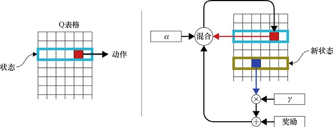

(a)　　　　　　　　　　　　　　　　　　　　　　　　　　　　　　　　　　　　　　(b)

圖26.34　Q學習策略和更新過程。(a)我們有一個棋局狀態，之後根據它找到Q表格的相應的行，然後用我們的策略選擇一個動作（這裡用紅色表示），並把這個動作回饋給環境。(b)環境會返回一個分數和一個新狀態，之後我們需要找到Q表格中對應於新狀態的行，並選擇這一行裡最大的獎勵，將它乘以*γ*，然後把結果與動作的即時性獎勵相加，所得就是我們選擇的動作的新的值。使用*α*值將舊的值和新的值混合，混合後的結果會被放置到Q表格的單元格內（對應於我們最初選擇的動作）

學習率*α*和折扣因子*γ*的最優值都必須通過反覆試驗得到。它們依賴於我們的環境的特定性質和我們正在處理的資料。經驗和直覺往往可以為我們提供良好的起點，但對於某個特定的學習系統來說，沒有什麼比傳統的試錯法更能找到最優值了。

### 26.6.4　顯而易見而又被忽略的事實

之前我們說過會再次討論這個問題，那就是我們需要有準確的Q值來評估更新規則，但這些Q值本身又是由更新規則計算出來的，而且使用的是下一個動作的值，並以此類推（下一個動作的值用的又是再下一個動作的值）。那麼，如何使用那些我們還沒有得到的資料呢？

這裡有一個簡單明瞭的答案：忽略這個問題。

確實很令人難以置信，我們可以從全部都是0的Q表格開始學習。在開始的時候，系統會表現得很瘋狂，因為在Q表格中沒有任何東西可以幫助它去選擇單元格（動作）。這時，它會隨機選取其中一個動作報告給環境，環境會返回一個結果狀態，但這個新狀態中的所有動作的值也都是0。所以根據更新規則，無論我們的*α*和*γ*選擇什麼值，單元格的得分將始終為0。

系統將會把遊戲玩得很混亂和愚蠢，做出一些很糟糕的選擇，而錯過了明顯的好動作。

但最終，這個系統會因為某個巧合而取得勝利，這個勝利將得到一個正的獎勵，而這個獎勵會更新導致它的動作的Q值。再過一段時間，能導致這個動作的動作就會獲得很大的獎勵，這是因為Q學習在更新時會看下一個狀態的各個動作的得分。隨著新的遊戲進入各種狀態（最終獲勝的狀態），這種連鎖效應將繼續緩慢地反向發揮作用，貫穿整個系統。

注意，資訊實際上並沒有向後傳播，每一場比賽都是從頭到尾進行的，每次更新都是在動作之後進行的。資訊看起來像向後傳播的是因為：Q學習在進行更新規則時需要看向下一步動作。因此，下一個動作的分數能夠影響這一步的分數。

在某種程度上，由於策略有時會選擇嘗試新的動作，而每一個動作最終都會通向勝利，獲得勝利後的獎勵也會向後影響導致它的動作。因此，Q表格最終會被每個動作的精確預測的獎勵填滿。再次進行遊戲只是在不斷提高這些值的準確性，最終獲得幾乎不再變化的結果，這個過程稱為**收斂**（convergence）。我們說Q學習演算法是**收斂的**。

我們可以從數學上證明Q學習是收斂的[Melo15]。這保證了Q表格是在逐步變好的。但是我們無法確定收斂需要多長時間，因為表格越大，環境越難以預測，需要的訓練時間就會越長。同時，收斂的速度也取決於系統試圖學習的任務的性質以及它能夠提供的回饋，當然我們所選擇的學習率*α*和折扣因子*γ*的值也會對速度產生影響。與以往一樣，在學習任何特定系統的特定特性時，沒有什麼可以代替傳統的試錯法。

注意，Q學習演算法很好地解決了我們之前討論的兩個問題。

首先是**信用分配問題**，它要求我們確保能夠取得勝利的動作會得到獎勵（即使是在環境不返回獎勵的情況下）。而Q學習的更新規則的本質就是解決這個問題，它成功地將動作的獎勵從最後一步開始向前一步回饋，直到第一步。

該演算法還通過ε-貪婪（或softmax）策略解決了**探索或開發困境**。這兩種策略都傾向於選擇那些已經被證明的好行為（開發），但是它們有時也會嘗試其他的動作，去看看如果選擇這些動作會發生什麼（探索）。

### 26.6.5　Q學習的動作

讓我們把Q學習應用到實踐中，看看它是否能在不可預知的環境中學會如何玩“翻轉”遊戲。衡量演算法性能的一種方法是讓訓練好的模型多次開始隨機初始化的遊戲，看看它們花了多長時間。一個演算法越擅長尋找好的動作並避開壞的動作，它玩一輪遊戲（在取得勝利前）所需的動作就越少。

快速地對這款遊戲進行了分析之後，我們認為它取得勝利的步數不應該超過6步，大多數都是3或4步。我們希望我們的演算法能夠找到更快的解決方案，在6步或是更少步數的情況下贏得每一場比賽。

為了瞭解訓練次數對演算法的影響，我們會在不同的訓練次數下，去研究贏得比賽所需的步數（通過進行大量的遊戲），並把它們繪製下來。

我們畫出的圖中會展示玩遊戲的結果，這些遊戲的開始狀態是512種可能的點和空白的組合模式中的一個，這512種都會被遍歷一遍。之後在一個有相當程度的不可預測的環境中，每個開始狀態進行10場比賽，這樣一共就是5120場比賽。在遊戲步數超過100時，我們會中斷比賽。

我們將*α*值設為0.95，所以每個單元在更新時只保留5%的舊的值，這樣我們就不會完全失去以前學過的東西。但同時，我們覺得新的值會比舊的值更好，因為它會基於改進過的Q表格來選擇下一步。

選擇動作時，我們使用了較高的ε值（ε-貪婪策略），即ε=0.1。這意味著我們鼓勵演算法在10次動作中有一次去探索新動作。

我們引入了很多不可預測事件。在每個動作後，卡車都有1/10的機率出現，每出現一次都會隨機翻轉一塊瓦片。考慮到這一點，我們將折扣因子*γ*設置為0.2。這麼低的值意味著，由於這些隨機事件的存在，對於未來狀態變化與過去相同這件事，我們只有20%的把握。我們設置的*γ*值比我們已知的隨機程度要高（10%），因為我們希望大多數遊戲在3～4個動作內獲勝，所以與超過10步才能完成的遊戲相比，它們看到的隨機事件的可能性要小一些。

我們對*α*、*γ*和*ε*的值的設定基本上都是有根據地進行猜測。特別是*γ*值，它是根據我們對隨機事件發生的頻率的瞭解而選擇的。而實際上，我們很少會提前知道隨機事件的發生頻率，我們通常會通過對參數進行嘗試來找出最適合這個遊戲和這種隨機情況的值。

在僅訓練了300輪後，我們開始使用演算法進行遊戲。圖26.35展示了遊戲所需的步數（即遊戲長度）。可以看出，這個演算法在進行少量的訓練後就能夠在一些情況下快速地取得勝利。

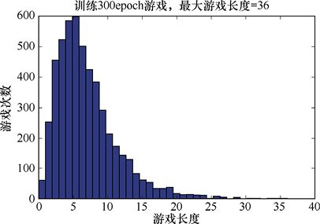

圖26.35　這是一個已經訓練了300epoch遊戲的Q表格取得勝利所需的步數，共計5120場比賽（對於512種情況，每一種都進行了10次）

“立刻勝利”出現在第一列，對應於0步取勝。這些遊戲的起始狀態就已經是3個點排列在垂直或水平的列或行中了。一共有6種這樣的起始狀態，而且我們對於每種起始狀態都會運行10次。因此，我們會從一個已經是成功狀態的棋盤開始60次。

圖26.35中的任何一輪遊戲都沒有達到100步（100步會自動中斷），所以我們可以判斷出這個演算法從來沒有陷入一個長期的循環中。一個循環可能是兩個狀態反覆交替，也可能是一長串的動作的反覆進行。循環在“翻轉”遊戲中是可能發生的，而在基本的Q學習演算法中也沒有任何明確的阻止系統進入循環的部分。

我們可能會說：這個系統“發現”循環不會通向勝利，因此不會帶來任何回報，所以它學會了避免它們。如果在某一刻，它確實回到了以前訪問過的狀態（可能是一個動作的結果，也可能是隨機引入的翻轉的結果），那麼相對較高的ε值意味著它最終很有可能會選擇一個新的動作，從而進入一個新的方向（不會陷入長期循環）。

讓我們把訓練的數量增加到3000輪，如圖26.36所示。

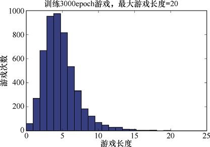

圖26.36　這是一個已經訓練了3000epoch遊戲的Q表格取得勝利所需的步數，共計5120場比賽

這個演算法已經學會了很多東西，最長的遊戲現在也只有20步，大多數遊戲可以在10步或更少的步數內完成。令人欣喜的是，許多遊戲長度聚集在4步和5步附近。

另一種探查演算法性能的方法是將Q表格本身的值繪製出來。在圖26.37中，我們繪製了一個Q表格。每一行對應於一個棋局狀態，在每一行中繪製了9個點，它們代表這一行的每個單元格的Q值（對應於**橫軸**的位置）。我們可以看到，這個演算法有很多未被嘗試過的單元格（它們保持著它們的起始值0），而其他大多數單元格只有一個非常小的正值，可能是因為它們對一場耗時很長的遊戲做出了貢獻。

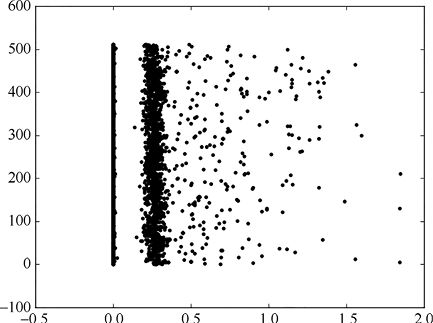

圖26.37　3000epoch訓練之後的Q表格，每一行對應於一個狀態。而每個點在水平軸上的位置表示了它的Q值。我們可以看到許多動作仍然保持著0的初始值，但大多數的動作都有返回的獎勵（表示它們至少參與過一場取得勝利的遊戲）

圖26.37中的一些值是大於1的。這個結果很正常，因為我們向即時性獎勵中添加了下一個動作的Q值。

讓我們來看看在進行3000epoch訓練之後，演算法所進行的一些遊戲，這裡只選出一些比較典型的遊戲。圖26.38展示了一個演算法用8步取勝的遊戲。遊戲順序是從左到右的。

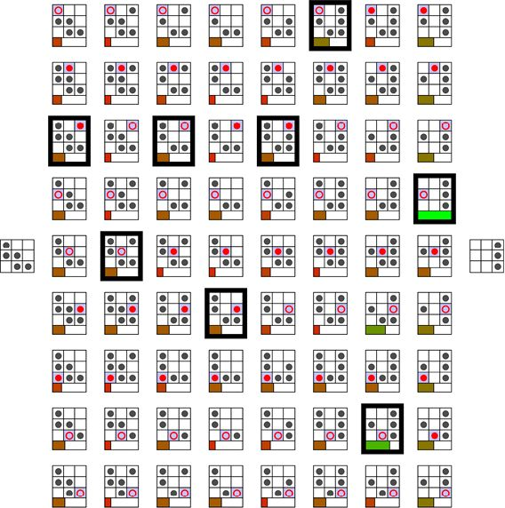

圖26.38　用訓練了3000epoch的Q學習去玩一場“翻轉”遊戲

圖26.38並不是一個很令人開心的結果。只要看一下開始的棋盤，我們就能發現至少4種不同的方式可以贏得這場比賽。例如，翻轉左下角的瓦片後，在中間和右邊的列上翻轉3個點。但我們的演算法似乎在進行隨機翻轉，雖然最終偶然發現了一個解決方案，但這肯定不是一個很好的方案。

圖26.39展示了另一個遊戲，也需要8步才能獲勝。在棋盤的底部已經有3個點排成一排了，所以我們只需要翻轉中間和頂部的4個點就可以取勝。但我們的演算法卻在兩個空的瓦片上添加了點，使得棋局被完全填滿，然後再去把其中的6個點一個一個地移除。

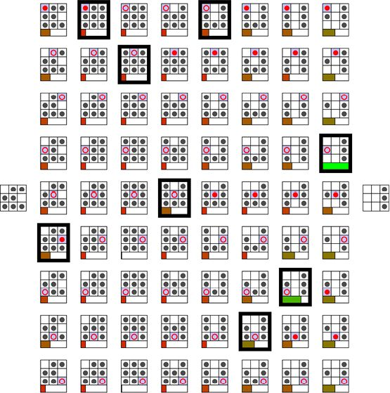

圖26.39　另一場經過3000epoch訓練後進行的比賽

我們通常認為，對演算法進行的訓練越多，它的性能就越能夠得到改善。再次進行3000次訓練（這樣總共就是6000epoch訓練了），我們得到了圖26.40所示的結果。

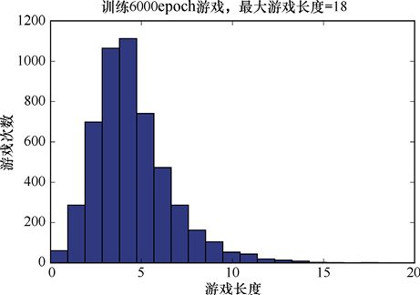

圖26.40　這是一個已經訓練了6000epoch遊戲的Q表格取得勝利所需的步數，共計5120場比賽

與圖26.36中的結果相比，再次經過3000epoch訓練後，最長的遊戲長度從20步縮減到了18步，而3步和4步就可以完成的遊戲數量增加了。

6000epoch訓練後的Q表格如圖26.41所示。

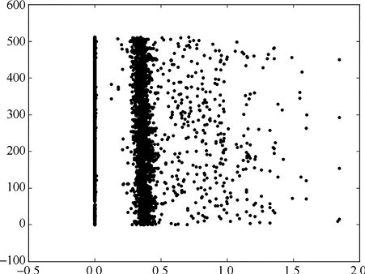

圖26.41　經過6000epoch訓練後的Q表格

這些圖讓我們對“演算法是如何學習的”有了全面的瞭解，但是當它（經過6000epoch訓練的演算法）玩遊戲時，它是如何表現的呢？事實上，這個演算法在性能上已經有了很大的飛躍。

圖26.42所示的是與圖26.38中相同的遊戲。在圖26.38中，它需要8步才能獲勝。但是現在只需要4步，這是這個起始狀態要獲得勝利所需的最小步數（儘管有不止一種方法可以實作它）。

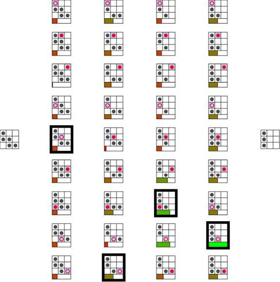

圖26.42　得益於更多的訓練，Q學習能夠更有效地解決圖26.38中的起始狀態

圖26.43所示的是與圖26.39中相同的遊戲，同樣做出了改進，之前它需要8步才能獲勝。而現在，只需要4步，這同樣是取得勝利所需的最小步數。

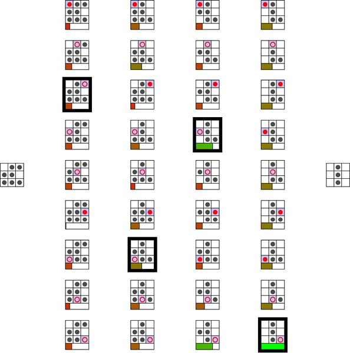

圖26.43　圖26.39中的遊戲起始狀態。得益於更多的訓練，Q學習變得更加有效

即使在這個高度不可預測的學習環境（在進行10%的動作後，會隨機選擇一塊瓦片翻轉）中，Q學習也做得非常好。僅在進行6000epoch訓練之後，它就經受住了這種不可預測性的考驗，並設法為大多數遊戲找到了理想的解決方案。

## 26.7　SARSA

Q學習的效果很好，但它有一個缺陷，這個缺陷會降低所依賴的Q值的準確率。

在圖26.34中我們可以看到，Q學習的更新規則使用了下一個狀態的最大的Q值。換句話說，更新規則已經假設了我們將在下一步中選擇這個動作，而它對新的Q值的計算也是基於這個假設的。這並不是一個沒有根據的假設，因為不管是ε-貪婪策略，還是softmax策略，通常都會選擇最有益的動作。但是，當策略選擇其他動作時，這種假設就是錯誤的。

換句話說，Q學習是在假設下一步採取最優動作的情況下去計算Q值，但有時我們的策略會選擇另一個動作。

當策略選擇其他動作（而不是我們在更新規則中選取的動作）時，對Q值的計算使用的就是錯誤資料，這樣，我們為這個動作計算的新的Q值的準確率就會降低，如圖26.44所示。

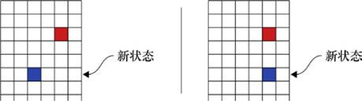

(a)　　　　　　　　　　　　　　　　　　　　　　　　　　 (b)

圖26.44　Q學習演算法在計算一個動作的新的Q值時可能會犯錯誤。(a)我們通過在下一個狀態中的最佳的動作（藍色）來計算當前狀態（紅色）的Q值；(b)有時當我們到達下一個狀態時，策略會選擇不同的動作，這導致我們之前的計算發生錯誤

最好能夠保持Q學習的所有優點，同時避免犯這樣的錯誤。

我們僅需要對Q學習做一點修改就可以實作這個目標，修改後我們得到一個名為SARSA的新演算法[Rummery94]。這是“狀態-動作-獎勵-狀態-動作”（state-action-reward-state-action）的縮寫。“SARS”的部分是我們從圖26.20開始就已經在做的，也就是，保存開始狀態（S）、動作（A）、獎勵（R）和結果狀態（S），這裡的新內容是最後的“A”。

SARSA解決了下一個狀態會選擇錯誤的單元格的問題，方法是用我們的策略選擇一個單元格（而不是選擇Q值最大的單元格），並記住這個選擇（也就是最後的“A”）。之後，當我們需要選擇新動作時，直接選擇先前計算並保存的動作。

換句話說，我們已經調整了選擇策略的應用時間。我們不是在動作開始前選擇要做哪一個動作，而是在計算上一個動作的Q值時就已經選擇好了。並且我們記住了這個選擇，這使得我們可以使用真正會進行的動作來計算新的Q值。

這兩個變化（更改選擇動作的時機、記住我們選擇的動作）是SARSA和Q學習的全部區別，但僅僅是這兩個區別就可以對學習速度產生很大的影響。

讓我們看一下SARSA演算法中的連續的3步。第一步如圖26.45所示。因為這是第一步，所以我們會使用策略來選擇一個動作。在這3步裡這是我們唯一一次這樣做。一旦有了選好的動作，我們就會用策略來選擇下一步動作。

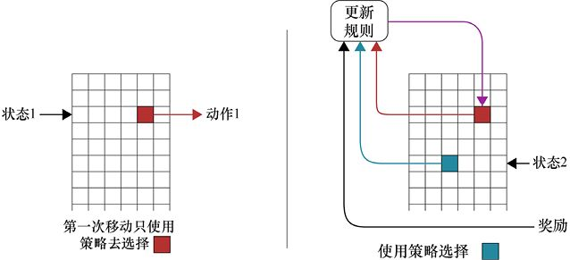

(a)　　　　　　　　　　　　　　　　　　　　　　　　　　　　　　　　　　　　 (b)

圖26.45　SARSA演算法連續的3步中的第一步。(a)用策略選擇當前的動作；(b)用策略選擇下一個動作，並使用下一個動作的Q值來更新當前動作的Q值

第二步如圖26.46所示。在這裡我們會進行上一步中已經選好的動作，之後再選擇下一個動作並用它來確定當前動作的新的Q值。

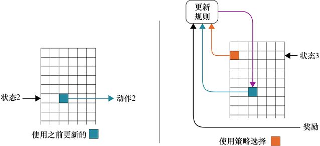

(a)　　　　　　　　　　　　　　　　　　　　　　　　　　　　　　　　　　　　　(b)

圖26.46　SARSA演算法連續的3步中的第二步。(a)進行上一步中已經選好的動作；(b)選擇下一個動作，並使用它的Q值來更新當前動作的Q值

第三步如圖26.47所示。在這裡，我們再次進行預先決定好的動作，併為下一步（第四步）選定動作。

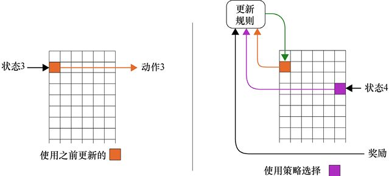

(a)　　　　　　　　　　　　　　　　　　　　　　　　　　　　　　　　　　　　　 (b)

圖26.47　SARSA演算法連續的3步中的第三步。(a)我們採取了在第二步中確定好的動作；(b)為第四步選擇好一個動作，並使用它的Q值來更新當前動作的Q值。

非常幸運，我們可以證明SARSA演算法也是收斂的。和以前一樣，我們不能保證它一共需要多長時間，但是它通常會比Q學習更快地產生結果，之後也會快速地進行改進。

### 26.7.1　實際中的SARSA

讓我們來看看SARSA是如何玩“翻轉”遊戲的，我們給出了與Q學習相同的使用場景。

對SARSA演算法進行3000epoch訓練後，我們用它來玩5120epoch遊戲（與Q學習中相同），結果如圖26.48所示。在這裡，我們使用與Q學習中相同的參數：學習率*α*為0.95，隨機翻轉機率為0.1，折扣因子*γ*為0.2，選擇動作的策略是*ε*-貪婪策略，*ε*的值為0.1。

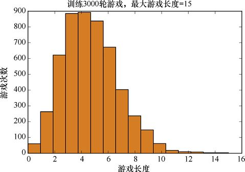

圖26.48　這是一個已經訓練了3000epoch遊戲的SARSA演算法取得勝利所需的動作數量，共計5120次比賽。需要注意的是，只有很少量的遊戲需要超過6步才能取勝

效果看起來非常好，大多數遊戲集中在4步左右。最長的遊戲也只有11步，並且很少有超過8步才能獲勝的遊戲。

和以前一樣，讓我們畫出Q表格的值，如圖26.49所示。其中的每一行對應於一個遊戲的狀態，行中的每個點對應於這一行的一個單元格的值。

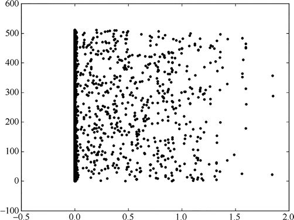

圖26.49　經過3000epoch訓練後，SARSA演算法的Q表格

讓我們來看看幾場典型的遊戲。圖26.50展示了一場遊戲，按照從左向右的順序進行，用該演算法需要7步才能獲勝。

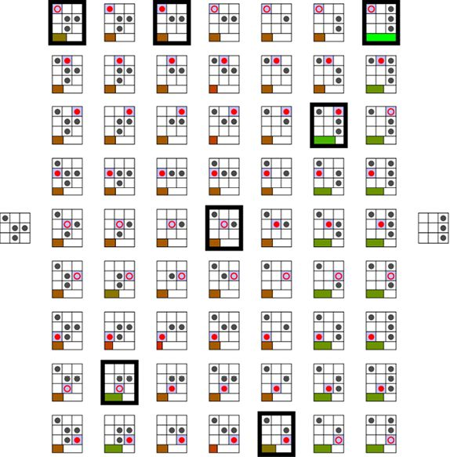

圖26.50　在對SARSA進行了3000epoch的訓練後，玩的一場“翻轉”遊戲

圖26.51展示另一輪遊戲，用該演算法需要8步才能獲勝。

圖26.51　在對SARSA進行了3000epoch的訓練後，玩的另一場“翻轉”遊戲

像往常一樣，更多的訓練應該會帶來更好的表現，所以我們把訓練epoch數增加到6000。

在6000epoch訓練後，用SARSA演算法去玩5120epoch遊戲的結果如圖26.52所示。

圖26.52　用訓練了6000epoch遊戲的SARSA演算法取得勝利所需的動作數量，共計5120epoch比賽。需要注意的是，大多數遊戲變得很短（幾步就能取勝），沒有遊戲會陷入長期循環

最長的一場遊戲從15步下降到14步，降得並不多，但是僅需要3步和4步就能完成的遊戲數量明顯有所增加。

經過6000epoch訓練後的SARSA演算法的Q表格如圖26.53所示。

圖26.53　經過6000epoch訓練後，SARSA演算法的Q表格

這些圖讓我們對“演算法是如何學習的”有了全面的瞭解，但是當它（經過6000epoch訓練的演算法）玩遊戲時，它是如何表現的呢？事實上，這個演算法在性能上已經有了很大的飛躍。

圖26.54所示的是與圖26.50中相同的遊戲，在圖26.50中，它需要7步才能獲勝。但現在只需要3步，這是這個起始狀態要獲得勝利所需的最小步數（儘管有不止一種方法可以實作它）。

圖26.54　與圖26.50中相同的遊戲，又進行3000epoch的訓練後的結果（一共6000epoch訓練）

圖26.55所示的是與圖26.51中相同的遊戲，之前它需要8步才能獲勝，而現在只需要4步。

圖26.55　與圖26.51中相同的遊戲，又進行了3000epoch的訓練後的結果（一共6000epoch訓練）

### 26.7.2　對比Q學習和SARSA

讓我們比較一下Q學習和SARSA演算法。圖26.56展示了Q學習和SARSA在進行了6000epoch的訓練之後，玩之前那5120epoch遊戲的結果。因為每次的結果都是由演算法運行產生的，而再次運行演算法時產生的隨機事件會與前一次不同，所以這些結果與之前的略有不同。

圖26.56　在進行了6000epoch訓練後，讓Q學習和SARSA再去玩那5120epoch遊戲所得到的結果。SARSA的最大遊戲長度是12步，而Q學習的最大遊戲長度是18步

它們是大致相當的，但Q學習會有幾場比較長的遊戲（相對於SARSA的12步而言）。

更多的訓練可以改進Q學習，同時也會改進SARSA。我們把訓練次數增加10倍，也就是會對每種演算法進行60000epoch遊戲的訓練，之後的結果如圖26.57所示。

圖26.57　與圖26.56中相同的場景，但在這裡，演算法已經經過60000epoch的訓練了

經過如此多次的訓練後，SARSA在“翻轉”遊戲中做得很好——幾乎所有遊戲都可以在6步以內完成（只有很少的遊戲需要7步）；而Q學習的整體表現就相對差一些，最多的時候需要16步才能取得勝利，但使用4步或更少步數就能取勝的遊戲場數也在增加。

在這個簡單的遊戲中，我們還有另一種可以比較Q學習和SARSA的方法，那就是繪製出進行長時間的訓練後的遊戲的平均長度。這可以讓我們知道它們的學習效率，如圖26.58所示。

圖26.58　訓練1～100000萬epoch後（以1000次遞增），演算法玩遊戲所需的平均長度

很容易看出這裡的趨勢，兩種演算法所用的時間都快速下降，然後趨於平穩。但一直是SARSA表現得更好，並且最終，SARSA會比Q學習節省大概一半的時間（或者說，每玩兩次遊戲，就可以少走一步）。

當進行了100000epoch訓練時，兩種演算法看上去都停止了學習，或者至少它們停止了表現的提升。看上去每個演算法的Q表格都進入了穩定的狀態，只會在由環境引入的隨機改變下隨時間而產生輕微波動。

為了驗證它的正確性，讓我們看看每個Q表格中的平均值。我們希望可以看到，對於任何的訓練量，SARSA都應該填充更少的Q表格的單元格，因為它強大的前瞻功能使它可以避免一些糟糕行為而產生的計算量。這可以使SARSA擁有更低的Q表格平均值，因為更多的單元格會保留它們為0的初始值。圖26.59展示了這些平均值。

圖26.59　平均值

正如預料的那樣，Q表格平均值從前1000epoch遊戲訓練時相對較小，而隨著時間增長，Q表格平均值持續增加。

為了驗證我們上面提出的“由於SARSA只填充了很少的Q表格的單元格，因此它會有更低的Q表格平均值這一解釋”，讓我們數數每個演算法實際有多少個單元格為非0值，如圖26.60所示。

圖26.60　Q學習以及SARSA 的非0單元格的比例。橫軸為以1000為增長單位、從1000epoch增長至100000epoch的遊戲訓練輪數

這幅圖與我們認為的SARSA比Q學習填充的單元格更少的想法一致，雖然看上去在進行大量的訓練以後，SARSA的這一個值幾乎要趕上Q學習的了，並且一些隨機事件會使它訪問到一些之前從未訪問過的單元格。

正如這些圖所示，Q學習與SARSA在學習如何玩“翻轉”遊戲上都表現不錯。對於任何給定的訓練次數，SARSA都會相對錶現得更好，且進行遊戲的時間長度通常會更短。

## 26.8　強化學習的全貌

讓我們對於所有已經構建過的系統做一次大局上的回顧。系統裡都有一個環境以及一個智能體。環境為智能體提供兩個數字的集合，或者是列表（狀態變量以及可進行的動作）。智能體會用這兩個集合，以及所有它內部的私有資訊來從動作列表中挑選出一個值，並將它返回給環境。作為回應，環境會為智能體返回一個數字以及兩個新的列表。

這也就是真正在發生的變化：一些數字上的小交換。

將這兩個列表解釋為棋盤以及棋盤上的移動是很棒的，因為這讓我們可以把Q學習看作在學習如何玩一個遊戲。但是智能體本身並不知道自己是在進行著遊戲，不知道有什麼規則，甚至可以說基本什麼也不知道。它僅僅知道自己會得到兩個列表的數字，以及它需要從其中一個列表挑選出一個數字，之後會得到一個獎勵值以及兩組新的數字列表作為回應。這樣一個小進程卻能實作如此強大的功能，令人印象深刻。不過只要我們可以找到一種描述環境及環境中可能發生的行為的方法，並將它們用數字的集合來表示，並且我們能找到即使是最原始的方式來區分一個好的行為以及一個糟糕的行為，那麼這個演算法就可以學習如何去產生那些高質量的行為。

對於簡單的翻轉棋遊戲，這個演算法工作得不錯，但是在實際操作中，建立這樣一個Q表格是否符合實際？在翻轉棋裡，總共只有9個方塊，其中每個可以有一個點或者為空白，因此這個遊戲需要一個512行、9列，或者說4608個單元格的Q表格。在井字棋中，同樣也有9個方塊，其中每個有3種符號的可能：空白、X或者O。因此對於這個遊戲，Q表格的大小就會是20000行以及9列，或者說180000個單元格。

這樣一個Q表格是挺大的，不過對於一臺現代電腦來說還能接受。但是如果我們想要學習一些稍有挑戰性的遊戲呢？如果不是在3×3的棋盤上玩井字棋，而是在4×4的棋盤上玩呢？這將會產生大於4300萬種棋盤的可能，因此我們的Q表格會需要4300萬行以及9列，或者接近3億9000萬個單元格。這樣一個Q表格對於現代電腦來說甚至都是相當大的。讓我們僅再稍微增加一小步，在5×5的棋盤上玩井字棋。看上去這就有點駭人了。現在我們的棋盤有著將近8500億種可能的狀態。如果我們再在13×13大小的棋盤上玩這個遊戲，會得到一個比全宇宙原子數量還要大的值[Villanueva15]。事實上，這差不多是10億個宇宙的原子數量的值。

為這個遊戲而存儲這樣一張表顯然是不可能的，不過想要做這樣一件事（在13×13大小的棋盤上玩井字棋）完全是合理的。甚至更合理的是，我們也許希望可以讓系統學習下圍棋。圍棋的標準棋盤為19×19的直線，棋子擺在這些直線的交點上，每個交點可以是空的，也可以放著黑棋或者放著白棋。因此，這和井字棋的棋盤差不多，只是大了很多。我們需要一個行數為173位數字的表格。這樣數量級的數字不僅僅處理它很不現實，而且也無法讓人理解。

對這個**深度強化學習**（deep reinforcement learning）方法的一個重要觀點是，它消除了Q表格的外在存儲需求。我們可以將表格想象成一個函數，它以棋盤的狀態作為自己的輸入，並且將一個動作數以及Q值作為輸出。正如我們所看到的那樣，神經網路十分適合預測這樣的東西。

因此，我們可以建立一個深度學習系統，它採用相同的棋盤輸入，並且在我們確實掌控了棋盤的時候，預測我們會得到的動作數和Q值。在足夠的訓練之後，這樣一個網路可以變得足夠準確，因此我們可以拋棄Q表格而僅僅使用這個網路。

訓練這樣一個系統是十分有挑戰性的，但它確實是可以完成的，並且會給我們出色的結果[Mnih13][Matiisen15]。

## 26.9　經驗回放

即便使用*ε*-貪婪策略以及隨機環境事件，強化學習依舊會陷入困境。如果在一段時間內沒有用到一些有用的策略，強化學習還會漸漸地忘記它們。這需要在一段時間後重新發現這些策略。

一種減少這些問題的方法是使用經驗回放[Wawrzyński13]。

經驗回放的想法就像一位音樂家重新觸碰多年未曾用過的樂器。她可能必須得從自己當年的早期練習以及簡單的樂曲開始復建。她並非第一次學習這些知識，但再次經歷這樣一個過程可以重新激活她的肌肉記憶，幫助她記起那些處於休眠狀態的技巧。

為了將這個想法應用於強化學習，我們將希望系統記住的狀態序列及行為保存下來。在訓練中，當遇到這些序列中的某個初始狀態時，我們將它們“回放”給學習系統。

也就是說，我們間斷性地將環境斷開，並用我們所保存著的回饋序列來代替它。

我們要求系統做出一個選擇，然後用之前記錄下的選擇覆蓋它。然後我們會給系統與它上一次得到的相同的回饋（獎勵、新行為以及新的狀態）。系統會根據這個行為更新它的Q值，然後我們再要求它做出一個新選擇。我們再用自己記錄裡的序列中所保存的下一個選擇來覆蓋它，然後重複上面那些步驟。對於記錄裡的所有行為，我們都會進行這個操作。

對記錄裡的所有行為進行了操作之後，我們會把環境重新連接至智能體，並讓它們像先前那樣繼續訓練。

也許我們會把所有這些看作強迫智能體再次體驗“舊時的記憶”，只不過它會將這些記憶看作是真實的，並予以回饋。

這樣做的結果是，每個記憶中的行為都會經歷一個小小的Q值提升，使得它們更有可能在將來被選中。

為強化學習系統增加經驗回放可以幫助它“想起”所學到的東西，即使在那之後這些知識再也沒有被用到。這些成功的行為不會漸漸消退，它們的分數會被稍稍提高，因此在未來它們仍然是具有吸引力的選擇。

## 26.10　兩個應用

讓我們簡略地看看強化學習的兩個應用。

第一個應用是關於圍棋的。正如我們之前所提到的那樣，這是一個有著多到不可思議的狀態數量的遊戲。雖然棋類遊戲是多年來科學家們所關注的重點，但圍棋一直被認為是一個相當大的挑戰[Levinovitz14]。

AlphaGo的團隊使用深度強化學習技術創造了一位世界級的選手[DeepMind16]。這個系統與大量的人類知識相結合。而被稱作AlphaGo Zero的第二個系統被設計為從頭開始學習圍棋。它並未與人類進行遊戲，也沒有被輸入人類的經驗以及其他任何指導，而僅僅是知道規則，以及將勝利作為自己的動力[Hassabis17]。

強化學習再次被使用，不過這次，遊戲雙方都被納入其中。還記得我們說過，對於一個智能體而言，世界上其他的所有東西都是環境的一部分。因此，當玩家1到了自己的回合，它就是智能體，並且會根據環境而做出一些行為，這個環境也包括玩家2。而當到了玩家2的回合時，玩家1就變成了環境的一部分。通過交替變更每局遊戲中的玩家視角，一個系統就可以進行自我學習。

世界上至今還沒有任何一臺實際的設備可以保存圍棋中的所有可能狀態，因此它無法使用我們上面提到的，通過建立一張表格來保存對於所有棋盤狀態的某個行為的質量評分。取而代之的是，當系統在學習如何下棋時，它同樣也在訓練一個將棋盤狀態作為輸入來幫助選擇最佳行為的神經網路。這個網路就會代替那個複雜的表格。

這個方法正是訓練AlphaGo Zero的核心。在與自己進行了接近500萬次對戰之後，如今AlphaGo Zero已經是世界上極具爭議的最佳圍棋選手了[Silver17]。

第二個應用則與遊戲無關。

在電腦圖像領域，人們所做的就是利用電腦程式來創造圖像。這些圖像經常被用來捕捉三維場景。在某些情況下，我們希望這些圖像是現實世界的一個準確預測，比如在我們計劃建造一幢新大樓或者一座新花園時。在另一些情況下，我們則想要創造一些更加新奇的圖像，比如為遊戲或者動作電影做一些簡化的或者抽象的世界設定。

在所有這些應用中，想讓一張圖像看上去是一個合理的三維場景，會需要多種學科裡的許多技術。但在這些過程中，我們幾乎總是需要判定圖像的質量以及從場景中的一處照射到另一處的光線顏色。通過光在環境周圍的反射，我們最終可以模擬出相機拍出來的光影效果，這使我們可以真正地創造圖像[Glassner94]。

計算這種光的分佈是一項計算量很大的工作。它不僅需要我們考慮場景中媒介以及各種表面的性質，也同樣需要我們考慮哪裡的東西是透明的。例如，如果在兩點間有一個完全不透明的物件，那麼沒有任何光線可以在兩點間穿過（當然，除非這個物體穿著一件隱形衣[Vandervelde16]）。通常來說我們必須評估數百萬種光路才能創造出一幅圖像。通常我們將光線的傳播建模為想象一束光線從一點傳播到另一點，再計算這樣一條光路的描述。這項技術稱為**光線追跡**[Glassner89]。

通常來說，評估的光束越多，所得到的圖像質量就越好（它們看上去會更加平滑，也更接近真實照片，而不是如同被一些雪花般的光點所覆蓋）。然而由於評估光路十分費時，我們總是希望儘量少地執行這個步驟。我們還希望對這些計算進行優先級排列，因此會創造出那些沿著看上去對於預測入射光最重要的方向的光束。這通常意味著我們希望看到在那些方向中，哪裡的入射光是最亮的，或者哪裡攜帶著最多的顏色資訊。

一篇關於電腦圖像領域的文章展示了由物理學家發展出的數學表達式，它可以描述亞原子尺度微粒的運動，也可以被用來描述光在環境中傳播的表現[Kajiya86]。

令人驚訝的是，這個電腦圖像的公式有著和Q學習基本表達式幾乎相同的結構[Dahm17a]。這不僅僅是一個巧合。它暗示著在兩個看似毫無關係的活動間深刻的概念相似性。

如果將這兩個式子放在一起，我們就可以找出強化學習與電腦圖形學思想之間的對應關係。Q學習中的一個狀態正對應了場景中一個被選擇的點，並且一個動作就是計算光束從其他特定點返回到被選中點的過程。獎勵也就對應著接收到的光線的描述。

因此在創建一張圖像時，我們會集中精力去找對於這個圖像來說最重要的光線。Q學習使得這個過程變得更有效率，因為我們不用再浪費時間去評估那些不會在圖像中造成太大差別的入射光線。我們與其從一個給定的棋盤狀態中去找到可以獲得最佳獎勵的最佳行為，不如從一個場景中給定的點往最佳方向看，以獲得最多的有關抵達該點的光線的資訊。

收集到了入射光線後，還有很多工作等著我們去完成，不過收集光線資訊是創建一個圖像的必要的第一步。因為評估光線是一個非常緩慢的過程，而且在創建一個圖像的過程中，這一過程會被重複多次，所以通過使用這樣的Q學習的類似系統來提升該過程的效率，創建看上去不錯的圖像現在所花費的時間比以前少得多[Dahm17b]。

## 參考資料

更多有關強化學習的資訊參見[Champandard02]、[Lee04]以及[Sutton17]。

[Asadi17]　Kavosh Asadi and Michael L. Littman, *An Alternative Softmax Operator for Reinforcement Learning*, Proceedings of the 34th International Conference on Machine Learning, Sydney, Australia, 2017.

[Champandard02]　Alex J Champandard, *Reinforcement Learning*, Reinforcement Learning Warehouse, Artificial Intelligence Depot, 2002.

[Dahm17a]　Ken Dahm, Alexander Keller, *Learning Light Transport the Reinforced Way*, arXiv 1712.07403, 2017.

[Dahm17b]　Ken Dahm, Alexander Keller, *Machine Learning and Integral Equations*, arXiv 1712.06115, 2017.

[DeepMind16]　DeepMind team, *Alpha Go*, 2016.

[Eden15]　Tim Eden, Anthony Knittel and Raphael van Uffelen, *Reinforcement Learning*, University of New South Wales, 2015.

[Glassner89]　Andrew Glassner, James Arvo, Robert L.Cook, Eric Haines, Pat Hanrahan, Paul S. Heckbert, Pat Hanrahan, *A Introduction to Ray Tracing*, Academic Press, 1989.

[Glassner94]　Andrew Glassner, *Principles of Digital Image Synthesis*, Morgan-Kauffmann, 1994.

[Hassabis17]　Demis Hassabis and David Silver, *AlphaGo Zero：Learning From Scratch*, DeepMind Blog, 2017.

[Kajiya86]　James T Kajiya, *The Rendering Equation*, SIGGRAPH ‘86 (Proceedings of the 13th Annual Conference on Computer Graphics and Interactive Techniques), 1986.

[Lee04]　Mark Lee, *The Reinforcement Learning Problem*, University of Alberta, 2004.

[Levinovitz14]　Alan Levinovitz, *The Mystery of Go, the Ancient Game That Computers Still Can’t Win*, Wired, 2017.

[Matiisen15]　Tambet Matiisen, *Demystifying Deep Reinforcement Learning*, Nervana, 2015.

[Melo15]　Francisco S. Melo, *Convergence of Q-learning：A Simple Proof*, Institute for Systems and Robotics, Instituto Superior Técnico, Portugal, 2015.

[Mnih13]　Volodymyr Mnih, Koray Kavukcuoglu, David Silver, Alex Graves, Ioannis Antonoglou, Daan Wierstra, Martin Riedmiller, *Playing Atari with Deep Reinforcement Learning*, NIPS Deep Learning Workshop, 2013.

[Rummery94]　G.A. Rummery and M. Niranjan, *On-Line Q-learning Using Connectionist Systems*, Engineering Department, Cambridge University, 1994.

[Silver17]　David Silver, Julian Schrittwieser, Karen Simonyan, Ioannis Antonoglou, Aja Huang, Arthur Guez, Thomas Hubert, Lucas Baker, Matthew Lai, Adrian Bolton, Yutian Chen, Timothy Lillicrap, Fan Hui, Laurent Sifre, George van den Driessche, Thore Graepel, Demis Hassabis, *Mastering the Game of Go Without Human Knowledge*, Nature, number 24270, 2017.

[Shalizi07]　Cosma Shalizi, *Markov Processes*, Lecture notes on Stochastic Processes, Carnegie Mellon University Computer Science Course 36-754, 2007.

[Sutton17]　Richard S Sutton and Andrew G. Baro, *Reinforcement Learning：An Introduction*, A Bradford Book, MIT Press, 2017.

[Vandervelde16]　Thomas Vandervelde, *Beyond Invisibility — Engineering Light with Metamaterials*, Phys.org blog, 2016.

[Villanueva15]　John Carl Villanueva, *How Many Atoms Are There In The Universe?*, Universe Today, 2015.

[Watkins89]　C.J.C.H. Watkins, *Learning from Delayed Rewards*, Ph.D. thesis, Cam-bridge University, 1989.

[Wawrzyński13]　Paweł Wawrzyński and Ajay Kumar Tanwani, *Autonomous Reinforcement Learning with Experience Replay*, Neural Networks, vol 41, pp. 156-167, 2013.

