# 第27章　生成對抗網路

讓系統瞭解資料集特徵的一種方法是將它與另一個試圖欺騙它的系統進行配對。當學習器能夠區分真實的資料和偽造的資料時，我們就可以使用它來生成更多類似於輸入資料的資料。

## 27.1　為什麼這一章出現在這裡

生成資料令人興奮。它讓我們可以製作出與其輸入相似的新畫作、歌曲和雕塑。

我們在第25章中看到了如何用VAE生成新資料。在本章中，我們將研究一種完全不同的方法來生成類似於訓練資料的資料。

這種技術使我們能夠生成遠遠超出VAE提供的資料類型。一個有趣的應用程式允許我們基於不同但相似的媒體的現有示例創建特定類型的新媒體。例如，我們可以回答這些問題：“如果凡·高把這張大峽谷照片畫出來會怎樣？”[Zhu17]，或者“如果巴赫創作了20世紀60年代的流行音樂會怎樣？”[Bayless93]，或“如果迷幻搖滾樂隊以雷鬼樂的風格演唱他們的歌曲會怎樣？”[EasyStar03]。

這些都是有趣的問題，但人們都很好地回答了這些問題，他們給出了更多機智、有深度的答覆，而不是單純地偽造統計。

但是，如果我們可以隨意生成新資料，它就可以幫助我們訓練其他神經網路。我們已經看到大型網路需要大資料，並且難以獲得高質量的標記資料。如果我們自己生成這些資料，則可以根據自己的喜好製作儘可能多的資料。

生成新資料的另一個用途是為我們提供想法和選擇。假設我們正在規劃一個標準的花園。我們可以為電腦提供我們可用的空間及其位置。由此，電腦可以查看當地的氣候，來大致瞭解預期的日曬和雨水類型。接著我們可以為它提供任何我們所喜歡的花園樣式，而它可以產生無窮多可能的樣式設計。我們可能不會喜歡它們中的任何一個，但它們可以激發新的想法，併成為我們自己創造力的起點。

或者假設我們需要為我們的房子選擇新傢俱。我們可以給一個訓練有素的系統一張家裡當前傢俱的照片，然後它可以合成一個適合我們現在裝飾的新椅子或沙發。那個設計就可以送到工匠那裡開始製作。請注意，這不僅僅是對現有照片的選擇，而是一種全新的傢俱，與其他物品在美學上相匹配。

我們將看到的這類系統稱為**生成對抗網路**（Generative Adversarial Network，GAN）。它基於一種巧妙的策略，即兩個不同的深層網路互相攻擊，其目標是讓一個網路創建與訓練資料不同的新樣本，但是它們非常接近，以至於其他網路無法分辨出哪些是合成的，哪些屬於原始訓練集。

一旦在資料集上訓練了一個GAN，無論是花園圖片、音樂作品、機器零件、小說，還是更抽象的資料，我們都可以製作出自己喜歡的新資料。在最純粹的想法中，理想情況下，新樣本與訓練資料無法區分。也就是說，給定任何樣本，我們將無法判斷它是輸入樣本之一還是由生成器創建的內容。

在許多情況下，我們甚至可以平滑地從一個樣本混合到另一個樣本，創建的中間樣本（在最好的情況下）也與輸入資料無法區分。

## 27.2　一個比喻：偽造鈔票

引入GAN的通常方法是設想一種偽造操作。與典型的演示方法不同，我們將介紹它的一種變體，以更好地揭示關鍵想法。

故事始於兩個陰謀家，我們稱之為Glenn和Dawn。Glenn的名字以G開頭，因為他將扮演**生成器**（generator）的角色，在這種情況下他會偽造鈔票。Dawn的名字以D開頭，因為她將扮演**鑑別器**（discriminator），負責鑑別任意給定的鈔票是真實的，還是Glenn的偽造品之一。他們將共同努力，以使他們儘可能地做好自己的工作，在這個過程中，迫使對方變得越來越好。

作為生成器，Glenn整天坐在一間密室裡，精心製作金屬板和列印虛假鈔票。Dawn是負責質量控制的。她的工作是將真正的鈔票與Glenn的偽造品混在一起，並鑑別哪些是真的。

Glenn和Dawn所在的國家對製作偽鈔的處罰是終身監禁，所以他們都很想製作沒有人可以分辨出的鈔票。我們可以稱他們國家的鈔票為Solar，而他們想要偽造10000張Solar鈔票。

值得注意的是，10000張Solar鈔票都不一樣。至少，每張鈔票都有唯一的序列號。但真正的鈔票也會被磨損、摺疊、塗畫、撕裂、弄髒或者經過了什麼別的處理。因為新的、清晰的鈔票一眼就會被認出來，所以Glenn和Dawn更想要生產看起來就像所有其他鈔票一樣的被磨損的鈔票。

在真實的情境下，Glenn和Dawn肯定會從一大堆真實鈔票開始，並對每個細節進行深入研究，學習他們所能做的一切。但我們只是把他們的工作用作一個比喻，所以將採取一些限制措施，使這種情況更好地與本章的演算法相匹配。

首先，我們會簡化一些事情，比如先只關心鈔票的一面。也許這種鈔票背面是空白的，方便人們在上面寫購物清單和其他筆記。

其次，在開始之前，我們不會分別給Glenn和Dawn供他們學習的鈔票。事實上，我們幾乎什麼都不給他們。因此，開始製作時，Dawn和Glenn都不知道真正的鈔票是什麼樣的。顯然，這將使事情變得更加艱難。我們馬上就會證明這一點。我們給Glenn的是：一大堆空白矩形紙，有正確的形狀和大小來做10000張Solar鈔票。

我們將給他們分配些日常工作。每天，Glenn都會坐下來，用他已掌握的所有資訊製作一些偽造品。起初，他什麼都不知道，所以他可能會在紙上塗上不同顏色的墨水。或許他會畫出一些面孔或數字，但基本上只是畫隨機的東西。

每天快結束時，Dawn將前往銀行並提取10000張Solar鈔票。她會非常輕地用鉛筆在每張鈔票的背面寫上“真”這個詞，然後收集Glenn的偽造品，並在每張背面輕輕寫下“假”字樣。之後她會把它們混在一起，如圖27.1所示。

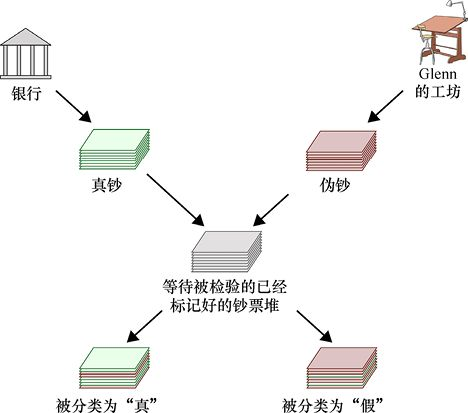

> **圖片描述：** 流程圖展示Dawn檢測偽鈔的工作流程。左上方銀行提供真鈔（綠色），右上方Glenn的工坊製作偽鈔（粉色）。Dawn在每張真鈔背面標記「真」，在偽鈔背面標記「假」，然後將所有鈔票混合打亂。最終她只看正面，將鈔票分類為「被分類為真」和「被分類為假」兩堆。

圖27.1　Dawn在檢測偽造品方面的工作。她首先會從銀行獲得一套真實的鈔票。在每張背後，她輕輕地寫下“真”這個詞。然後她從Glenn那裡收集了他一天的成果。在那些鈔票背後，她輕輕地寫下“假”。然後她將鈔票一起打亂，只看正面，將每一張分類為“真”或“假”。在這個例子中，她在兩個類別中都犯了一些錯誤

現在Dawn完成了她真正的工作。她逐一查看鈔票正面，而不看後面，將每張鈔票分類為真或假。她在問自己，“這張鈔票是否真實？”，然後，“是”的答案可以稱為對該鈔票的積極回應，而答案為“否”將是對該鈔票的消極回應。

Dawn仔細地將初始鈔票分成兩堆：真和假。由於每張鈔票可能是真的或假的，因此有4種可能性，如圖27.2所示。

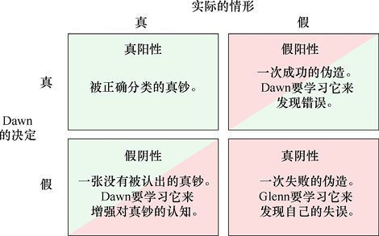

> **圖片描述：** 2x2矩陣展示Dawn檢查鈔票時的四種可能性。橫軸為實際情形（真/假），縱軸為Dawn的決定（真/假）。左上為真陽性（正確識別真鈔），右上為假陽性（將偽鈔誤認為真鈔，Dawn需學習發現錯誤），左下為假陰性（將真鈔誤認為偽鈔，Dawn需增強認知），右下為真陰性（正確識別偽鈔，Glenn需學習改進）。

圖27.2　當Dawn檢查鈔票時，它可能是真的或假的，並且她可能宣稱它是真的或假的。這裡給出了4種可能性

當Dawn查看鈔票時，如果它是真的並且她說這是真的，那麼她的“積極”決定（它是真實的）是準確的，這是一個真陽性（TP）。如果該鈔票是真實的，但她的決定是“消極的”（她認為這是假的），那麼這是一個假陰性（FN）。如果該鈔票是假的，但她認為這是真的，則這是假陽性（FP）。最後，如果該鈔票是假的並且她正確地將其識別為假的，則這是真陰性（TN）。在除真陽性外的所有情況下，Dawn或Glenn使用這個例子來改進他們的工作。

圖27.2看起來很像我們在第11章中看到的操作性條件反射矩陣。有趣的是，這裡對於真陽性沒有獎勵。相反，Dawn會因為她為那些假鈔鑑定成真品而受到“懲罰”，這可以迫使她去學習自己分類錯誤的鈔票，而Glenn則會因為製作出了那些被鑑定為真陰性的假鈔而受到“懲罰”，這可以迫使他去研究那些被鑑別出來的鈔票以提高工作質量。

一旦Dawn對每張鈔票進行了分類，她就會回過頭來檢查她的工作。

例如，她決定先檢查她歸類為“真”的鈔票。如果這些鈔票之一的背面寫著“真”，那麼它是**真陽性**，因為Dawn將它歸類為“真”（“這張鈔票是真的嗎？”，她回答說“是的”），且她做對了。她能夠對自己的技能感到滿意，並繼續判斷下一張鈔票。

否則，這是**假陽性**。因為當鈔票不是真的時，她歸類為“真”。每次誤報都是她瞭解這些鈔票的機會。由於Dawn是質量檢查員，她需要弄清楚她錯過了哪些可以讓她發現偽造的線索。Dawn能夠正確發現假鈔是至關重要的，因為如果她被愚弄而警察沒有，那麼這個團隊就可能入獄。

當她處理了歸類為“真”的鈔票堆，她會檢查歸類為“假”的鈔票堆。如果這些鈔票之一的背面寫著“真”，那麼它是**假陰性**，因為當鈔票不是假的時，她歸類為“假”。這對團隊來說是一個問題，因為它表明Dawn需要提高她從假鈔中發現真鈔的能力。

否則，該鈔票是偽造的，且Dawn正確地將其識別出來。這是**真陰性**。現在是時候讓Glenn瞭解他做錯了什麼，導致這張鈔票是偽造的事實被發現，並且儘量不再重複。

### 27.2.1　從經驗中學習

我們已經說過，Dawn和Glenn都需要從他們的錯誤中吸取教訓，但是怎麼做呢？

讓我們不把Dawn和Glenn看作是兩個人，而假設他們是兩個不同的神經網路，以此來回答這個問題。

Dawn的分類是神經網路的結果，它將每個輸入分為兩類：真或假。當預測錯誤時，該網路的誤差函數將具有較大的值。正如我們在第18章中看到的那樣，反向傳播將使用此誤差開始通過Dawn的網路驅動誤差梯度，調整權重，以便下次更有可能使該類別分類正確。

Glenn的工作有點複雜。當Dawn認為他的一個偽造品是真正的鈔票時，他的網路不需要改變，因為他成功完成了他的工作。但是當Dawn捕獲偽造品時，我們會通過在網路末端發出一個較大的誤差以將此資訊傳達給Glenn的網路。現在，Glenn的網路將採用反向傳播調整權重，以便新的輸出不太可能被Dawn捕獲。

Glenn的網路是如何改進的，並製造出足以瞞過Dawn的假鈔呢？它是通過緩慢、漸進的方式進行的。每次檢測到偽造品後，Glenn的網路會稍微調整一下。隨著時間的推移，良好的變化將會逐漸積累，使得Glenn的產出將越來越難以與真鈔區分開。

我們可以很自然地認為這是Glenn學習的荒謬笨拙的方式。為什麼是盲目地試錯呢？為什麼不向Glenn（或他的網路）展示一些真正的鈔票，並告訴他直接從它們中學習呢？正如我們在第24章中看到的那樣，這個方法適用於變分自動編碼器。它們產生的輸出看起來很像輸入。

我們在這裡不這樣做，因為有很多其他重要問題無法用這種方法解決。

例如，Glenn試圖通過將各種百分比的不同成分混合在一起來偽造昂貴的葡萄酒。Glenn可能沒有技術或能力來反向設計他試圖偽造的葡萄酒的化學成分。即使他可以，他也許不知道如何混合和準備大量的初始成分來產生這些特定的結果。它們可能需要加熱、冷卻或老化，或Glenn甚至無法猜測的其他過程。相反，他可以嘗試很多不同的組合，並逐漸發現正確的選擇，以讓他的作品能越來越頻繁地騙過Dawn，一位現在越來越專業的葡萄酒品鑑師。

有時訓練資料的逆向工程根本是無法進行的。我們假設Glenn正試圖為一件電子設備偽造集成電路。他試圖偽造的電路用環氧樹脂和其他材料密封，使它們幾乎不可能分開。相反，他必須在自己沒有任何相關知識的條件下，嘗試拼湊出運行表現相同的電路。

在另一種情況下，Glenn可能會嘗試著以著名藝術家的風格偽造繪畫。他被給予了各種場景的照片，並希望能夠製作出那個場景的圖像。他希望這份贗品足以欺騙藝術家，讓他們誤認為這是一幅大師遺失的作品。Glenn如何對他偽造的繪畫風格進行逆向工程？當然，正如傳統的偽造者所做的那樣，他可以長時間工作，試圖列舉畫筆、顏色和繪畫筆畫的選擇等。但這需要長期細緻的研究。然而運行一個嘗試對照片進行大量風格修改的程式，然後將它們與主人的真實繪畫進行比較要容易得多。如果現在擔任藝術史學家的Dawn無法從真正的繪畫中分辨出Glenn的偽造品，那麼Glenn就完成了他的任務。

Glenn為了對它們進行逆向工程而研究原件，與他逐漸學習偽造這些原件的方法之間的差異實際上只是一種基本的方法區分的再現，即設計可手動調整的特徵和使用電腦為我們找到特徵之間的不同。

回想一下我們在第1章中對特徵工程的討論，識別手寫數字的早期方法是使用人類設計的特徵來尋找8的兩個循環，或7的水平和角度線，諸如此類。當問題變得複雜時，很難建立這樣的特徵列表，並且它們很快就被異常值和變量所淹沒。機器學習所採用的純統計方法並不需要顯式地標註特徵。相反，它只是統計分析像素中發生的事情，並使用這些統計資料來識別數字。事實證明，它比手工構建的特徵列表更快、更準確、更健壯。

### 27.2.2　用神經網路偽造

Dawn和Glenn覺得他們已經太久沒有度假了，於是決定偽造一些可以購買飛往異國機票的鈔票，並將他們的工作交給一對神經網路。

Dawn用一個她稱之為**鑑別器**的網路代替自己。該網路可以使用我們想要的任何類型的層。示例中的鑑別器將圖像作為輸入，並返回單個值作為其輸出，描述圖像是真鈔還是假鈔。我們可以將鑑別器看作二元（“真實”和“偽造”）分類器。

Glenn用一個他稱之為**生成器**的網路代替自己。這也可以有任何類型的架構。生成器的工作是生產新的偽鈔。但正如我們所看到的，真實鈔票之間並非完全相同。因此，生成器的輸出將是一個圖像流，它由無數嶄新且獨一無二的圖像組成，圖像間彼此不同，但都與真實鈔票的圖像無法區分。

在圖27.2中，我們根據真或假，以及陽性或陰性來確定Dawn決策的4種類型。讓我們就鑑別器和生成器，以流程圖的形式說明這些。

從真陽性開始，鑑別器正確地報告輸入的真鈔圖像確實是真的鈔票。由於這正是我們希望鑑別器在這種情況下所做的，所以沒有學習要做，如圖27.3所示。

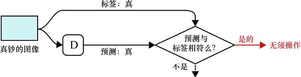

圖27.3　在真陽性情況下，鑑別器（D）接收真鈔的圖像並正確地預測它是真的。在這種情況下，什麼也不需要發生

接下來，當鑑別器錯誤地宣佈真鈔是假的時，我們得到假陰性。因此，鑑別器需要了解有關真鈔的更多資訊，以免重複此錯誤，如圖27.4所示。

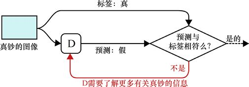

圖27.4　當鈔票真即時，鑑別器說這是假的，我們得到假陰性。在這種情況下，鑑別器需要再次瞭解有關真鈔的更多資訊，以免重複這些錯誤

當鑑別器被生成器愚弄，並宣佈偽造的鈔票是真的時，就會出現誤報。在這種情況下，鑑別者需要更仔細地研究該鈔票，並發現任何錯誤或不準確之處，以免再次被愚弄，如圖27.5所示。

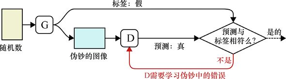

圖27.5　在假陽性情況下，鑑別器從生成器（G）接收偽鈔的圖像，但將其分類為真鈔。這意味著生成器已經創造了令人信服的偽造品。為了迫使生成器變得更好，鑑別器從錯誤中學習，以便這種特殊的偽造不會再次被遺漏

最後，真陰性發生在鑑別器正確識別偽造的情況下。這種情況如圖27.6所示。生成器需要了解它做錯了什麼並改善其輸出。

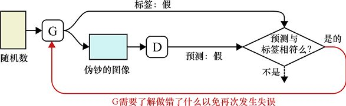

圖27.6　在真陰性場景中，我們向鑑別器提供來自生成器的假鈔，鑑別器正確地將其識別為假的。在這種情況下，生成器瞭解到其輸出不夠好，並且必須提高其偽造技能

注意，在這4種可能性中，其中一種（TP）對任一網路都沒有影響，其中兩種（FN和FP）會使鑑別器提高識別真鈔和假鈔的能力，並且只有一種（TN）會讓生成器學習並避免重複錯誤。

### 27.2.3　一個學習回合

我們可以使用回饋循環來驅動訓練過程。

通常，我們會一遍又一遍地重複4個步驟。在每一步中，我們都會給鑑別器一張真或假的鈔票，然後根據其決定採取正確的學習行動。

首先，我們訓練鑑別器，然後是生成器，接著是鑑別器，最後是生成器。這個想法是測試一個或另一個網路需要學習的3種情況中的每一種。生成器學習的真陰性情況會重複兩次，原因我們稍後會講到。這4個步驟如圖27.7所示。

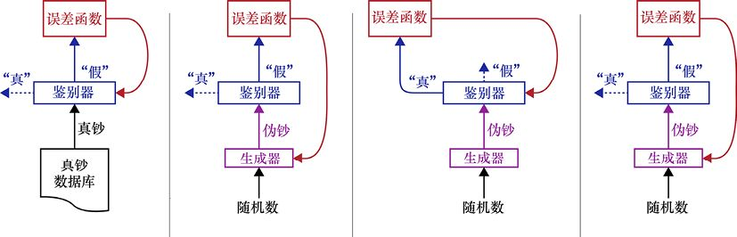

> **圖片描述：** 四個子圖展示GAN學習回合的四個步驟。(a)向鑑別器(D)提供真鈔，若歸類為假則為假陰性，鑑別器需學習。(b)生成器(G)產生偽鈔，若鑑別器識別為假則為真陰性，生成器需改進。(c)生成器產生偽鈔，若鑑別器被騙認為真則為假陽性，鑑別器需改進。(d)重複步驟(b)，讓生成器有額外的學習機會，確保兩個網路以相近的速率學習。

(a)　　　　　　　　　　　　　　　　　　　　　 (b)　　　　　　　　　　　　　　　　　　　　　　　　　(c)　　　　　　　　　　　　　　　　　　　　　　(d)

圖27.7　學習回合的4個步驟。(a)我們向鑑別器提供真正的鈔票。如果它將其歸類為“假”，那麼就有假陰性，我們需要教導鑑別器以更好地識別真鈔。(b)我們生成假鈔。如果鑑別器將其標記為“假”，則生成器必須變得更聰明。(c)我們生成假鈔。如果鑑別器將其標記為“真”，則鑑別器必須學習如何不被愚弄。(d)重複(b)的步驟，使鑑別器和生成器以大致相等的速率學習

第1步，我們試圖從假陰性中學習。我們給鑑別器提供來自真鈔資料庫的隨機鈔票。如果它將其錯誤分類為偽造，我們會告訴鑑別器從這個錯誤中吸取教訓。

第2步，我們尋找真陰性。我們給生成器提供一些隨機數，生成偽鈔，並將其交給鑑別器。如果鑑別器捕獲了偽造品，我們告訴生成器，它試圖學會產生更好的偽鈔。

第3步，我們尋找假陽性。我們向生成器提供一批新的隨機數，並讓它生成新的假鈔，我們將其交給鑑別器。如果鑑別器被愚弄並且說鈔票是真的，則鑑別器從其錯誤中學習。

第4步，我們從第2步開始重複真陰性測試。我們給生成器提供新的隨機數，製作新的假鈔，如果鑑別器捕獲偽造品，則生成器學習。

重複兩次生成器學習步驟的原因是，實踐表明，最有效的學習計劃是以大致相同的速率更新兩個網路。由於鑑別器從兩種類型的錯誤中學習，而生成器只從一種錯誤中學習，我們將生成器的學習機會數量增加一倍，使它們能夠以大致相同的速率學習。

總而言之，這個過程完成了3個工作。首先，鑑別器學習識別表徵真實樣本的特徵。其次，鑑別器學會識別揭示假樣本的特徵。最後，生成器學習如何避免包括鑑別器已經學會發現的特徵。我們還沒有說過如何進行學習，但我們很快就會開始這項討論。

因此，鑑別器在識別真實鈔票和發現偽造品中的錯誤方面變得越來越好，並且生成器反過來越來越好地找到如何製作無法與真品區分的偽造品的方法。這對網路組合在一起組成單一的GAN。

我們可以用“學習之戰”[Geitgey16]來描繪這兩個網路。隨著鑑別器越來越好地發現假鈔，生成器必須相應變得更好，使鑑別器更好地找到偽造品，使生成器在製造假鈔時變得更好，等等。

我們的最終目標是擁有一個儘可能好的鑑別器，它對實際資料的每個方面都有深入而廣泛的瞭解；以及一個仍然可以通過鑑別器獲得偽造品的生成器。這告訴我們，偽造品現在與真實的樣本不同，但在統計意義上與它們無法區分，而這一直是我們的目標。

## 27.3　為什麼要用“對抗”

根據上面的描述，“生成對抗網路”這個名稱可能看起來很奇怪。這兩個網路似乎是合作的，而不是對立的。

“對抗”這個詞來自以稍微不同的方式看待情況，而不是我們在Dawn和Glenn之間所描述的合作。我們可以想象Dawn是與警察合作的偵探，而Glenn是獨自工作的。為了使這個比喻有效，我們還必須想象Glenn有一些方法可以知道他的偽造鈔票中有哪些會被發現（也許他的同謀在Dawn的辦公室找到了並將這些資訊轉發給他）。

如果我們把偽造者和偵探描繪成彼此相對的，那麼他們確實是在相互對抗。這就是GAN在這篇原始論文中主題部分的表達 [Goodfellow14]。這種對抗性的觀點並沒有改變我們如何建立或訓練網路，但它提供了一種不同的方式來思考它們[Goodfellow16]。

“對抗”這個詞反過來來自一個稱為**博弈論**（game theory）的數學分支[Watson13]。博弈論非常有名，因為它向我們展示瞭如何對遊戲進行正式和系統的研究。雖然博弈論可以描述像國際象棋和棒球這樣的傳統遊戲，但它實際上包含了各種各樣的基於規則的衝突，從國際關係到共享公共生活中的資源。每當我們有一個或多個以某種方式反對的團體，並且遵循一套描述良好的規則時，我們就會有一個博弈論候選人。職業撲克選手、經濟學家和政治科學家都使用博弈論。

我們可以把偵探和偽造者之間的對立衝突**看作**一種遊戲。如果偽造者可以讓他的錢被識別成真鈔，他就贏了；而如果偵探捕獲了偽造品，則贏了的人是她。通過這種方式，我們可以使用博弈論的數學工具來更深入地瞭解GAN的工作方式和原因[Goodfellow14]。

關於像偽造者與偵探衝突這樣的遊戲，一個有趣的事情是兩個玩家分享遊戲並相互影響，但每個玩家都只對自己的決定負責。在實際意義上，當我們用假樣本訓練鑑別器時，只有鑑別器在該步驟中學習，儘管我們依賴於生成器來產生假樣本。另一方面，為了訓練生成器，我們依賴於鑑別器的決定，以便它可以學習什麼情況下會被鑑別器捕獲並避免重複該錯誤。

## 27.4　GAN的實作

我們將從多個模型中構建一個GAN。在本節中，“模型”一詞指的是學習架構（在這種情況下，是一組層），以及系統從訓練中學到的權重。

我們通常通過為生成器製作一個模型，為鑑別器製作一個模型，然後將它們連接在一起形成第三個模型來構建一組GAN。第三個模型使用與其他兩個模型完全相同的層。也就是說，它不會創建一個全新的具有相同形式的層，但它使用的是相同的層。這意味著當我們更新第三個模型中的權重時，這些更改將自動成為其他兩個模型的一部分，反之亦然。

讓我們看看這個過程，然後看看一些結果。

### 27.4.1　鑑別器

鑑別器是3種模型中最簡單的一種，如圖27.8所示。其輸入是樣本，其輸出是單個值，用於報告網路對輸入來自訓練集的可信度，而不是嘗試偽造。

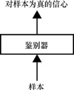

圖27.8　鑑別器的框圖

我們如何構建鑑別器沒有任何其他限制。它可以是淺的或深的，並且使用任何類型的層：全連接層、卷積層、循環層等。

在偽造鈔票的示例中，輸入將是鈔票的圖像，輸出是反映網路決策的實數。值為1表示它是真實的鈔票，值為0表示它是假的，值為0.5意味著鑑別器無法分辨。

### 27.4.2　生成器

生成器將一堆隨機數作為輸入。如果我們將生成器構建為確定性的，那麼相同的輸入將始終產生相同的輸出。從這個意義上講，我們可以將輸入值視為潛在變量。但是這裡的潛在變量並沒有通過分析輸入來發現，因為它們是第24章中的VAE。相反，它們只代表包含我們樣本集的空間，或者說雲的一個版本。生成器使用這些值來創建與該點相對應的樣本。

生成器的輸出是合成樣本。生成器的框圖如圖27.9所示。

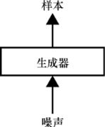

圖27.9　生成器的框圖

在偽造鈔票的例子中，輸出將是一張圖像。

雖然我們將輸入稱為“噪聲”或“隨機數”，但這僅僅是因為我們如何生成它們。實際上，這些值是對生成器產生的內容的完全合理的描述（允許生成器本身內部的隨機性）。所以我們可以說進入生成器的值描述了“鉛筆的圖像”，但是直到我們通過生成器運行這些值之前，我們通常不知道具體的這種類型的實例何時會出現。一旦得到輸出，那麼我們可以說，例如，“這些數字代表一張未削尖的黃色＃2鉛筆的圖像，在它旁邊有一個略微使用過的橡皮擦”。但在看到輸出之前，我們並不知道，所以我們稱之為“隨機數”或“噪聲”。

圖27.9中生成器的損失函數本身都是無關緊要的，在某些實作中我們可能完全不用它。正如我們將看到的那樣，我們通過將生成器連接到鑑別器來訓練生成器，因此生成器將從應用於整個網路的損失函數中學習。

與鑑別器一樣，我們如何構建生成器沒有任何其他限制。我們可以使用自己喜歡的任何類型的層。

一旦GAN經過全面訓練，我們就會丟棄鑑別器並保留生成器。畢竟，鑑別器的目的是訓練生成器，以便我們可以使用它來製作新資料。

當生成器與鑑別器斷開連接時，我們可以使用生成器為自己提供無限量的新資料，以便我們以任何我們喜歡的方式使用。

### 27.4.3　訓練GAN

我們現在來看看如何訓練GAN。我們將擴展圖27.7所示的學習回合中的4個步驟，以顯示應用更新的位置。

第一步是尋找假陰性，因此我們向鑑別器提供真鈔，如圖27.10所示。在這一步中，我們根本不涉及生成器。誤差函數旨在當鑑別器將真實鈔票報告為假的時，對它施以懲罰。如果發生這種情況，誤差函數會通過鑑別器驅動反向傳播步驟，更新其權重，以使鑑別器更好地識別真鈔。

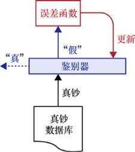

圖27.10　在假陰性步驟中，鑑別器被連接到一個誤差函數，以懲罰它將真鈔分類為假。如果發生這種情況，我們使用反向傳播來改進鑑別器，這樣就不太可能再次出現這個錯誤

第二步是尋找真陰性。在這一步中，我們使用一個模型，該模型開始以隨機數進入生成器，如圖27.11所示。生成器的輸出是偽鈔，然後送到鑑別器。如果這張偽鈔被正確識別為假的，則誤差函數被設計為具有較大的值，這意味著生成器被發現在進行偽造。

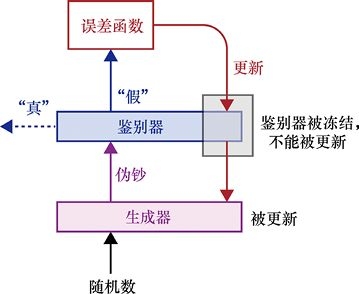

圖27.11　在真陰性步驟中，隨機數為生成器提供資料，從而生成偽鈔，然後將其提供給鑑別器。如果鑑別器捕獲它，則通過網路發回誤差函數。鑑別器沒有更新，因為它被“凍結”。這意味著它的權重不會受到影響。誤差信號向下傳遞到生成器，然後像往常一樣用反向傳播更新

在圖27.11中，我們將鑑別器的更新步驟變為灰色。這是因為鑑別器正確地對這張鈔票進行了分類，所以我們不想改變它的權重。我們說凍結了網路，這意味著我們不會更新權重。但是，我們仍然應用反向傳播，因為我們希望通過鑑別器將梯度資訊推送到生成器。然後我們更新生成器，這樣可以更好地學習然後去“欺騙”鑑別器。

現在我們尋找假陽性。我們會生成偽鈔，如果鑑別器將其分類為真，我們就懲罰鑑別器，如圖27.12所示。

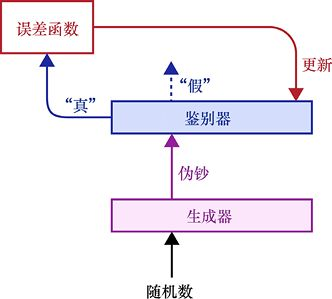

圖27.12　在假陽性步驟中，我們給鑑別器一張偽鈔。如果它將其歸類為真，那麼我們更新鑑別器以更好地發現偽鈔

最後，我們重複圖27.11中的真陰性步驟，這樣鑑別器和生成器都有兩次機會在每輪訓練中得到更新。

### 27.4.4　博弈

考慮GAN的一個有趣方式是使用兩個對手在互相博弈的觀點。

有些遊戲涉及競爭無限制的資源。例如，在撲克遊戲中，理論上，底池可以無限制地變得越來越大。

在其他遊戲中，玩家競爭固定且資源池有限。例如，在基於地圖的遊戲中，只有確定大小的區域可以被佔用。因此，當玩家競爭資源、聲明並來回交易時，每個玩家的資源總數可以改變，但是可用的資源總數不會改變。這稱為**零和博弈**（zero-sum），因為每次玩家獲得一個資源（並且總計增加一個），另一個玩家就會失去它（並從總數中減去一個），因為整體淨變化為零[Chen16]。

在零和博弈遊戲中，每個玩家都可以嘗試設置，以使其他玩家的最佳操作產生的優勢儘可能少。這稱為**極小極大**（minimax）**演算法**或minmax技術[Myers02]。例如，讓我們想象一下兩個玩家正試圖建立領土的棋盤遊戲。在特定的回合中，一個玩家意識到她的每一個可用行為都會讓她獲得一塊領土。但是根據她選擇的是哪一個，她的對手可以進行一次獲得5、10或20個領土的行動。她希望儘量減少對她的負面影響（即對手的最大收益）。在預期她的對手將始終做出最好的操作的條件下，她的操作讓棋盤處於對手的最佳操作只獲得5個領土的狀態。

我們訓練GAN的目標是生產兩個儘可能好的網路。換句話說，我們最終沒有“勝利者”。相反，鑑於其他網路阻止它的能力，兩個網路都已達到其峰值能力。遊戲理論家將這種狀態稱為**納什均衡**（Nash equilibrium），其中每個網路相對於另一個網路處於最佳配置[Goodfellow16]。

## 27.5　實際操作中的GAN

讓我們構建一個GAN系統並對其進行訓練。我們將選擇一些非常簡單的東西，以便我們可以繪製一些二維圖像來解釋這個過程。

讓我們將訓練集中的所有樣本描繪成一些抽象空間中的點雲。畢竟，每個樣本最終都是一個數字列表，我們可以將它們視為具有與數字一樣多的維度的空間中的座標。

我們的“真實”樣本集將是屬於具有二維高斯形狀的雲的點。回想一下第2章，高斯曲線在中心有一個大的凸起，所以我們預計大多數點都會接近凸起，當我們向外移動時，點越來越少。每個樣本都是該分佈的單個點。為了好玩，讓我們將(5,5)作為這一二維圖像的中心，並給它一個標準差1。圖27.13展示了這種分佈。

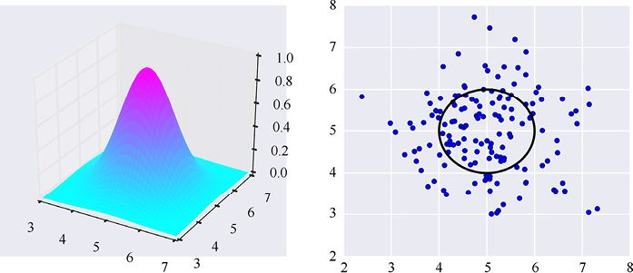

(a)　　　　　　　　　　　　　　　　　　　　　　　　　　　　　　　　　　　　　　　 (b)

圖27.13　我們的初始分佈是以(5,5)為中心的高斯凸起，標準差為1。如果我們從該分佈中隨機選擇點，其中約68%將落入點(5,5)周圍的半徑為1的圓中。(a)三維中的塊；(b)顯示二維中塊的一個標準差的位置的圓圈，以及從該分佈中繪製的一些有代表性的隨機點

通過這種解釋，生成器試圖學習如何將它給出的隨機數轉換為似乎屬於雲的點。目標是做到這一點，以至於讓鑑別器無法從生成器創建的合成點中分辨出真實點。

換句話說，我們希望生成器接收隨機數，並輸出可能是從以(5,5)為中心的原始高斯雲中拾取隨機點的結果。

如圖27.14所示，鑑於只有一個點，如果它是從我們的高斯雲中提取的原始樣本或由生成器創建的合成樣本，那麼對鑑別器可以確切地鑑別來說是一個挑戰。

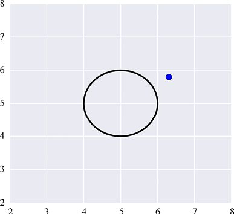

圖27.14　我們只有一個樣本，需要確定它是否符合高斯分佈。用如此少的資訊來做出這個決定是艱難的

我們可以通過使用第18章中的mini-batch（或通常只是batch）來使鑑別器更容易工作。

我們通常不會每次僅讓一個樣本通過系統，而是同時運行許多的樣本，數量通常為232～2128。給定數量更多的點可以更容易確定它們是否符合高斯雲。圖27.15展示了生成器可能產生的幾組點。很容易說這些點不太可能來自原始分佈。

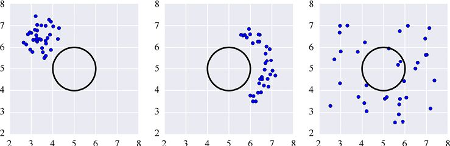

圖27.15　一些點不太可能是從初始高斯分佈中選取隨機值的結果

我們希望生成器產生的點比起圖27.15中的3幅圖更貼近圖27.13b的樣子。我們希望鑑別器將這些點集合分類為偽造，因為它們不太可能是原始高斯資料的一部分。

讓我們為這個問題構建鑑別器和生成器網路。因為原始分佈（二維高斯雲）非常簡單，所以網路也很簡單。

不過，在深入研究機制之前，我們需要注意一件事。眾所周知，GAN非常挑剔和敏感。它們是出了名的難訓練[Achlioptas17]。生成器或鑑別器的體系結構的微小變化，或者甚至一些參數的小變化（例如學習率或dropout率）就可以將一個本來無用的GAN變得表現出眾，反之亦然。更糟糕的是，我們必須訓練的不是一個網路而是兩個網路，並讓它們一起工作，因此搜索和微調的參數選擇數量可能變得令人壓力巨大[Bojanowski17]。這樣一來，在開發GAN時，我們必須嘗試使用想要從中學習的特定資料。

在下面的討論中，我們將跳過所嘗試過的許多陷入僵局以及表現不佳的模型，而直接跳到我們發現適用於此資料集的模型。很可能我們將展示的架構可以通過進一步的改變得到顯著改進（也就是說，它們可以更快、更準確地學習），或者甚至可以在正確的位置進行小的調整。

讓我們從生成器開始，如圖27.16所示。

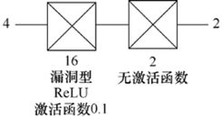

圖27.16　一個簡單的生成器。它接收4個隨機數並計算(*x*,*y*)對

該模型接收4個隨機數，在從0到1的範圍內隨機選擇。我們從一個全連接層開始，它有16個神經元和一個漏洞型ReLU激活函數（從第17章回憶一下漏洞型ReLU，如圖27.17所示，它就像一個正常的ReLU，但不是為負值返回0，而是將它們縮小為一個小數，在這種情況下為0.1）。

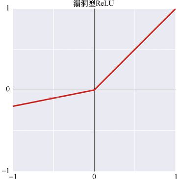

圖27.17　漏洞型ReLU將負點縮放為0.1

接下來是另一個全連接層，它只有兩個神經元，沒有激活函數。這就是生成器，它產生的兩個值是點的*x*座標和*y*座標。

我們對這層的要求相當高，儘管它們總共只有18個神經元。我們希望它們學習如何將一組4個均勻分佈的隨機數轉換成二維點，這個點可以符合我們的高斯雲分佈：中心位於(5,5)，標準差為1。但我們永遠不會告訴它雲的中心或大小。我們只會告訴它什麼時候它的一小部分點沒有與那個雲完全匹配，並留給神經元來弄清楚它們出錯的地方以及如何使它正確。

我們通常希望鑑別器比生成器更強大，因為它不僅需要學習真實的分佈，還需要學習如何發現假的分佈。我們的鑑別器如圖27.18所示。

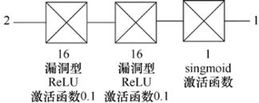

圖27.18　一個簡單的鑑別器。它包含的兩個有16個神經元和一個漏洞型ReLU激活函數的全連接層。最後一層也是全連接層，具有一個神經元和sigmoid激活函數

這只是與生成器有相同形式的兩層：一對16個神經元的全連接層，具有漏洞型ReLU激活函數；最後是一個全連接層，它只有一個神經元和一個sigmoid激活函數。輸出是單個數字，它表明網路對輸入來自與訓練資料相同的資料集的可信度。

最後，我們將生成器和鑑別器放在一起製作第3個模型，有時稱為生成鑑別器，有時簡稱為GAN本身。圖27.19展示了這種組合。

由於生成器在其輸出端呈現(*x*,*y*)對，並且鑑別器在其輸入端採用(*x*,*y*)對，因此兩個網路完美地結合在一起。輸入是一組（4個）隨機數，輸出告訴我們生成器創建的點有多大可能來自訓練集的分佈。

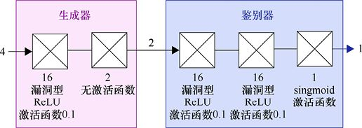

圖27.19　將生成器和鑑別器放在一起為我們提供了完整的GAN

重要的是要記住，標有“生成器”和“鑑別器”的模型不是我們早期模型的副本，但它們實際上是相同的模型，只是一個接一個地連接在一起構成一個大模型。換句話說，只有一個生成器模型和一個鑑別器模型。在製作圖27.19的組合模型時，我們只將這兩個現有模型連接在一起。現代的深度學習庫讓我們可以為這種應用從共享組件中創建多個模型。

在這些不同的配置中使用相同的模型是有意義的，因為組合模型需要使用最新版本的生成器和鑑別器。

另一個重點是，當我們使用圖27.19的組合模型訓練生成器時，我們並不想訓練鑑別器。我們在圖27.11中看到了這一點，我們在更新步驟中將鑑別器變灰。我們需要通過鑑別器運行反向傳播，因為它是網路的一部分，但我們只將更新步驟應用於生成器中的權重。

請記住，我們希望在交替傳遞中訓練鑑別器和生成器。如果我們將反向傳播應用於圖27.19的整個網路，那麼我們將同時更新鑑別器和生成器中的權重。因為我們想要以大致相同的速率訓練兩個模型，並且我們知道我們將分別訓練鑑別器（因為它還需要訓練真實資料），所以我們想告訴我們的庫**僅**更新生成器的權重。

控制一個層是否應更新其權重的機制是特定於庫的，但一般來說，我們可以**凍結**（freeze）、**鎖定**或**禁用**每個層上的**更新**。然後，當我們希望這些層能夠學習時，我們可以**解凍**（unfreeze）、**解鎖**或**啟用更新**。正如我們之前討論的那樣，反向傳播演算法仍然貫穿這些層，因為我們需要將梯度計算到生成器中。我們只是不將更新步驟應用於鑑別器。

總結訓練過程：我們從訓練集中的一個mini-batch的點開始，然後按照圖27.7中的4個步驟，交替訓練鑑別器和生成器。

我們來看看一些結果。

為了訓練我們的GAN，我們首先通過從我們的初始高斯雲中挑選10000個隨機點來製作訓練集，然後使用32個點的mini-batch訓練網路。系統運行所有10000點，就構成了一輪。

15epoch訓練的部分結果如圖27.20所示。

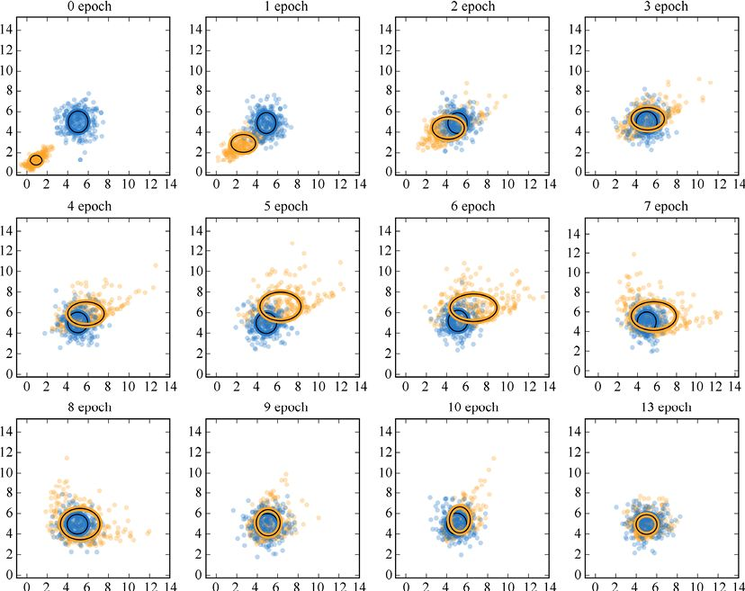

圖27.20　簡單GAN正在運行中。從左到右、從上到下看圖。初始高斯分佈顯示為藍色點，藍色圓圈顯示其平均值和標準差。GAN正在學習的分佈以橙色顯示，橢圓顯示生成的mini-batch的點的平均值和標準差。這些圖顯示了0～10輪訓練之後的結果，然後是第13輪

我們可以看到GAN生成的點開始時是西南−東北方向的一條模糊的線，大致以(1,1)為中心。通過每次相互間的影響，它們更接近原始資料的中心和形狀。在第4輪周圍，生成的樣本越過了中心，並且變得越來越偏向橢圓而不是圓形。但是它們回來並糾正了這兩個性質，直到看起來匹配得非常好的第13輪。

鑑別器和生成器的損失曲線如圖27.21所示。理想情況下，它們的值都會達到0.5並留在那裡。我們可以看到，非常簡單的模型很好地接近了這個目標。

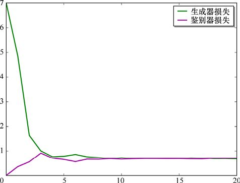

圖27.21　GAN的損失。它們看起來重合並且保持在略高於理想值0.5的地方

## 27.6　DCGAN

我們可以使用自己喜歡的任何類型的架構來構建鑑別器和生成器。簡單模型由全連接層組成，這對於小的二維資料集表現很好。但如果我們想處理圖像，那麼可能更喜歡使用卷積層。因為正如我們在第21章中看到的那樣，它們非常適合處理圖像。由卷積層構建的GAN有自己的首字母縮寫詞DCGAN，代表**深度卷積對抗生成網路**（deep convolutional generative adversarial network）。

讓我們在前面章節中看到的MNIST資料集上使用DCGAN。我們將使用[Gildenblat16]提出的模型。生成器和鑑別器如圖27.22所示。

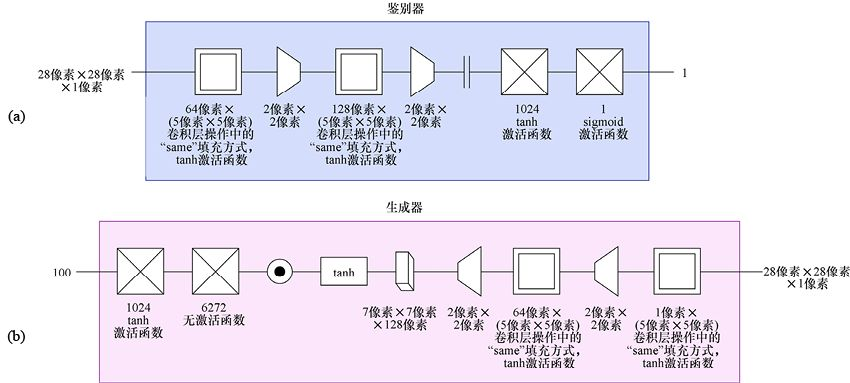

圖27.22　(a)鑑別器；(b)生成器。每個處理層都使用tanh激活函數，但鑑別器的最後一層上的sigmoid除外。鑑別器和組合的生成鑑別器都用標準二進制交叉熵損失函數和Nesterov SGD最佳化器訓練，其參數設置為0.0005的學習率和0.9的動量（來自[Gildenblat16]的模型）

在這個網路中，我們在鑑別器中使用顯式下采樣（或池化）層，在生成器中使用上取樣（或擴展）層，因為這就是該網路最初提出的方式。我們將把這些操作合併到下面的相關卷積層中。

生成器中的第二個全連接層使用6272個神經元。這個數字的出現是因為試驗表明，給第一個卷積層提供128個通道的張量效果很好。我們可以看到生成器有一對2×2的上取樣層，因此我們想要28×28的輸出，第一個上取樣層的輸入應該是7×7。所以這個層的輸入需要7×7×128 = 6272個數字。我們簡單地給第二個全連接層提供了這麼多神經元，並且在進入第一個上取樣層之前我們將輸出重新變形為三維張量。

我們在第20章中看到，批正規化層被設計成位於層的輸出和激活函數之間，我們就是這樣在生成器中設置批正規化層的。

鑑別器遵循與生成器大致相同的過程，但是順序相反。我們有幾個卷積層，每個後面都有2×2的最大池化層。我們通過使用平整層將輸出重新變形為一個列表（也可以使用重塑層）。這樣一來我們有了幾個全連接層，其中第二個有一個單獨的輸出。

正如我們所預料的那樣，在訓練1輪之後，生成器的結果非常難以理解，如圖27.23所示。

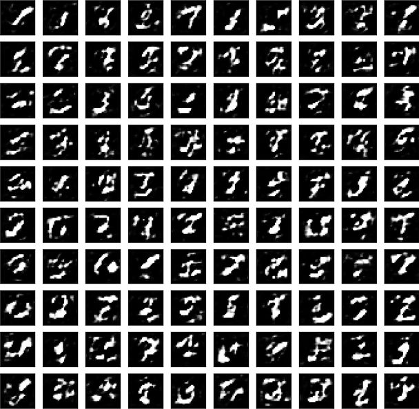

圖27.23　訓練1輪後生成器產生的結果

經過100輪訓練後，生成器產生了圖27.24所示的結果。

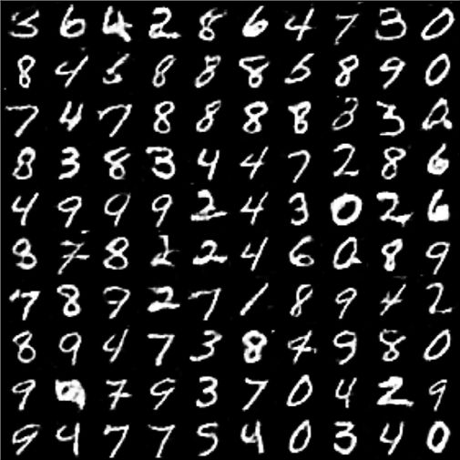

> **圖片描述：** 展示DCGAN在MNIST資料集上經過100個訓練輪次後，生成器產生的手寫數字圖像網格。大多數生成的數字清晰可辨認，包括0至9的各種數字，雖有少數失誤，但整體品質令人印象深刻——生成器從未見過真實資料，僅透過與鑑別器的對抗學習就學會了產生逼真的手寫數字。

圖27.24　在MNIST資料集上進行100epoch訓練之後，圖27.22的DCGAN的輸出

當我們退回去考慮這個過程時，這是一個令人吃驚的結果。記住，生成器從未見過資料集。它不知道MNIST資料是什麼樣的。它所做的一切都是隨機創建28×28的數字網格，然後收到回饋，告訴它這些網格中的值有多好或多壞。隨著時間的推移，它產生了看起來像數字的網格。這裡面有一些失誤，但大多數數字很容易辨認。

### 經驗法則

之前提到，GAN對其特定的體系結構和訓練變量非常敏感。一篇著名的論文研究了基於卷積層的GAN，並發現了一些似乎可以產生良好結果的經驗法則[Radford16]。

首先，不要在鑑別器中使用池化層來減小資料。這與我們在第21章中看到的[Springenberg15]的建議相呼應。不在卷積層後使用池化層，而是使用帶有跨步的卷積層。例如，要將輸入寬度和高度的大小減半，應該在每個維度中使用步幅為2的跨步。

當將輸入的噪聲樣本放大到整個圖像時，該建議也適用於生成器。不是使用重複取樣資料的上取樣層（可能使用插值）來使形狀更大，而是使用轉置卷積（或分數步幅）來實作相同的效果。例如，要將資料放大兩倍，我們將在轉置卷積層的每個維度中使用步幅為2的跨步。

同樣再提醒一下[Springenberg15]，應該將全連接層僅僅用作網路中的第一層或最後一層。

生成器和鑑別器都應該使用Adam最佳化器進行訓練。生成器的典型初始學習率為0.001（1×10−3），鑑別器的初始學習率為0.0001（1×10−4）。

接下來，在兩個網路中的每個卷積層之後應用批正規化層，除了生成器中的最終卷積層和鑑別器中的第一個卷積層。請記住，批正規化層應出現在卷積層的輸出和激活函數之間。

最後，我們應該在兩個網路中使用特定的激活函數。在生成器中，任何地方都可以使用ReLU，但在最後一層，我們應該使用tanh。在生成器中，對所有層使用漏洞型ReLU。

這些要點是指導，而不是嚴格的規則。它們並非適用於我們設計的每個網路以及我們從中學習的每個資料集。但經驗表明，它們是很好的初始選擇。

值得注意的是，圖27.22的模型違反了許多這些規則。這些網路可能已經經歷了一個試驗和調整過程[Gildenblat16]。我們嘗試以簡單的方式將上述經驗法則應用於這些網路，但結果是性能大幅下降。

一個原因可能是生成器中的擴展層位於卷積層之前，而轉置卷積層則在卷積完成後進行上取樣。通常這種變化並沒有太大的區別，但在這些網路中，它似乎很重要。

當我們已經擁有一個可以使用的已經調好的網路時，以有效的形式使用它是有意義的。但是，當我們從頭開始創建自己的網路時，最好遵循這些經驗法則。

## 27.7　挑戰

也許使用GAN的最大挑戰是練習它們對結構和參數的敏感性。玩貓捉老鼠遊戲需要雙方在任何時候都緊密匹配。如果鑑別器或生成器過快地比另一個好，那麼另一個將永遠無法趕上。正如我們前面提到的，獲得所有這些值的正確組合對於從GAN獲得良好性能至關重要，但發現這種組合可能具有挑戰性[Arjovsky17a] [Achlioptas17]。在構建新的DCGAN時，通常建議遵循上面給出的經驗法則。

關於GAN的一個理論上的問題是我們目前沒有證據證明它們是**收斂**的。回想一下第10章的唯一感知機，它找到了兩個可線性分離的資料集之間的分界線。我們可以證明，只要有足夠的訓練時間，感知機就能找到分界線。但是當事情變得複雜時，包括GAN在內，這些證據都無處可尋。我們可以說的是，當我們找到合適的參數時，GAN似乎確實在大多數情況下都能達到良好的性能，但除此之外無法保證。

### 27.7.1　使用大樣本

當我們嘗試訓練生成器生成高分辨率圖像（例如1000像素×1000像素）時，GAN的基本結構會遇到麻煩。關於計算的問題是，對於所有資料，鑑別器很容易從真實圖像中分辨出生成的假貨。試圖同時修復所有這些像素會導致梯度產生誤差，這會使生成器的輸出幾乎沿隨機方向移動，而不是更接近匹配輸入[Karras17]。最重要的是，如何能找到足夠的計算能力、記憶體和時間來處理大量這些大樣本的實際問題。回想一下，每個像素都是一個特徵，因此每一個1000像素×1000像素的圖像都有100萬個特徵（如果它是彩色圖像則為300萬個）。

因為我們希望最終高分辨率圖像能夠經受嚴格審查，所以我們會使用大型訓練集。快速瀏覽大量高分辨率圖像所需的時間將快速疊加。即使是再快的硬體也可能無法在我們需要的時間內完成工作。

一種解決方法是首先將訓練集中的圖像調整為各種較小的尺寸，例如，一邊512像素，然後是128像素，然後是64像素，以此類推，另一邊是4像素。然後，構建一個小型生成器和鑑別器，每個只有幾個卷積層，使用4像素×4像素的圖像訓練這些小型網路。當它們做得很好時，在每個網路的末尾添加一些卷積層，再用8像素×8像素的圖像訓練它們。同樣，當結果良好時，在每個網路的末尾繼續添加一些卷積層，並在16像素×16像素的圖像上訓練它們。

通過這種方式，生成器和鑑別器能夠隨著圖像大小的增長而進行訓練。這意味著當我們一直工作到一邊是1024像素的全尺寸圖像時，我們已經有了一個GAN，它可以很好地生成和區分一邊是512像素的圖像。我們不需要對較大的圖像進行太多額外的訓練，直到系統也能很好地運行它們。這個過程完成的時間要比我們從一開始只使用全尺寸圖像訓練的時間少得多[Karras17]。

### 27.7.2　模態崩潰

另一個問題是GAN特有的。假設我們正在努力訓練我們的GAN來生成貓的圖像。假設生成器設法找到了一張被鑑別器判定為真實的貓圖像。然後，狡猾的生成器每次都可以生成該圖像。無論我們使用什麼值來進行噪聲輸入，我們總會得到這張圖像。鑑別器告訴我們，它獲得的每個圖像都是真實的，因此生成器已經完成了目標並停止了學習。

這是另一個神經網路為我們希望它們學習的東西找到一個特例解決方案的例子。生成器完全符合我們的要求，因為它可以將隨機數轉換為全新的樣本，鑑別器無法區分真實樣本。問題是生成器製造的每個樣本都是相同的。它做了我們要求的，但不是我們想要的。

只產生一次成功輸出的問題稱為**模態崩潰**（modal collapse）（請注意，第一個單詞是“模態”，發音為“mode’-ull”，指的是模式或工作方式，而不是“模型”）。如果生成器只安置在一個樣本中（在這種情況下，只是貓的一張圖像），則情況被描述為**全模態崩潰**（full modal collapse）或Helvetica**場景**（Helvetica scenario）［Popper12］。更常見的是系統產生相同的少量輸出或它們的微小變化的情況。這種情況稱為**部分模態崩潰**（partial modal collapse）。

圖27.25展示了使用一些選擇不當的參數進行3epoch訓練之後，我們的DCGAN的運行情況。顯然，系統正在向一種模式崩潰。在這種模式下，它幾乎只輸出類似於1的東西。

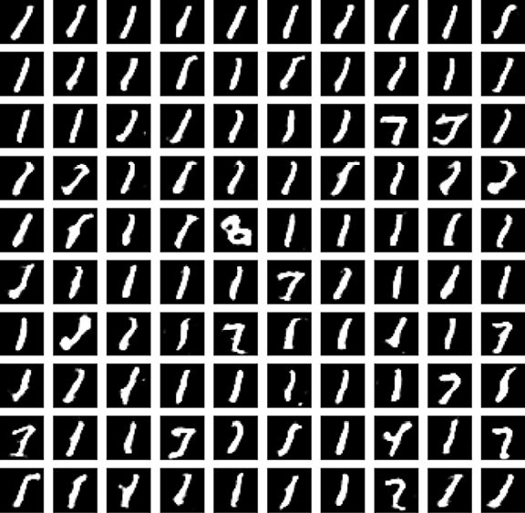

圖27.25　在僅3輪訓練之後，這個DCGAN顯示出明顯的模態崩潰跡象

解決這個問題的方案有許多，但目前最好的建議是如前面所述的，使用mini-batch資料。這之後我們可以用一些附加項來擴展鑑別器的損失函數，以測量該mini-batch產生的輸出的多樣性。如果輸出分為幾組，而它們全部相同或幾乎相同，則鑑別器可以為結果分配更大的誤差。生成器將變得多樣化，因為該行為會減小誤差[Arjovsky17b]。

## 參考資料

[Achlioptas17]　Panos Achlioptas, Olga Diamanti, Ioannis Mitliagkas, Leonidas Guibas, *Repre- sentation Learning and Adversarial Generation of 3D Point Clouds*.

[Arjovsky17a]　Martin Arjovsky and Léon Bottou, *Towards Principled Methods for Training Generative Adversarial Networks*, 2017.

[Arjovsky17b]　Martin Arjovsky, Soumith Chintala, and Léon Bottou, *Wasserstein GAN*, 2017.

[Bayless93]　John Bayless, *Bach on Abbey Road*, CD, Proarte, 1993.

[Bojanowski17]　Piotr Bojanowski, Armand Joulin, David Lopez-Paz, Arthur Szlam, *Optimizing the Latent Space of Generative Networks*, arXiv: 1717.05776, 2017.

[Chen16]　Janet Chen, Su-I Lu, Dan Vekhter, *Strategies of Play*, Stanford Department of Computer Science, 2016.

[EasyStar93]　Easy Star All-Stars, Dub Side of the Moon, CD, Easy Star, 1993.

[Geitgey16]　Adam Geitgey, *Abusing Generative Adversarial Networks to Make 8-bit Pixel Art*, Blog post, 2016.

[Gildenblat16]　Jacob Gildenblat, *KERAS-DCGAN*, GitHub repository, 2016.

[Goodfellow14]　Ian J. Goodfellow, Jean Pouget-Abadie, Mehdi Mirza, Bing Xu, David Warde-Farley, Sherjil Ozair, Aaron Courville, and Yoshua Bengio, *Generative Adversarial Networks*, 2014.

[Goodfellow16]　Ian Goodfellow, *NIPS 2016 Tutorial： Generative Adversarial Networks*, 2016.

[Karras17]　Tero Karras, Timo Aila, Samuli Laine, Jaakko Lehtinen, *Progressive Growing of GANs for Improved Quality, Stability, and Variation*, arXiv: 1710.10196, 2017.

[Myers02]　Andrew Myers, *CS312 Recitation 21： Minimax search and Alpha-Beta Pruning*, Computer Science Department, Cornell University, 2002.

[Popper12]　Robert Popper and Peter Serafinowicz, *Look Around You： Calcium, Part 1*, BBC, June 2012.

[Radford16]　Alec Radford, Luke Metz, Soumith Chintala, *Unsupervised Representation Learning with Deep Convolutional Generative Adversarial Networks*, 2016.

[Springenberg15]　Jost Tobias Springenberg, Alexey Dosovitskiy, Thomas Brox, and Martin Riedmiller, *Striving for Simplicity：The All Convolutional Net*, 2015.

[Watson13]　Joel Watson, *Strategy： An Introduction to Game Theory (Third Edition)*, W.W. Norton and Company, 2013.

[Zhu17]　Jun-Yan Zhu, Taesung Park, Phillip Isola, and Alexei A. Efros,, *Unpaired Image-to- Image Translation using Cycle-Consistent Adversarial Networks*, arXiv：1703.10593, 2017.

