# 第28章　創造性應用

讓我們使用深度學習器來創造一些有意思的應用！我們將使用系統生成一些很酷炫的圖像，甚至為本書生成一些文本。

## 28.1　為什麼這一章出現在這裡

我們已經到了本書的尾聲，所以讓我們放鬆一下，做一點有趣的事情。在本章中，我們將研究一些創造性的方法，利用神經網路來創造藝術作品。

## 28.2　可視化過濾器

在第21章中，我們對CNN中的過濾器進行了圖像或可視化處理。

在本章，我們將使用這種技術的兩種變體。為了做足準備，讓我們複習一下這個過程，但會比以前更詳細一點。然後，我們將修改這種方法來創造藝術作品。

### 28.2.1　選擇網路

為了可視化過濾器，我們需要知道它來自哪個網路。對於本章中的大多數項目，我們使用VGG16網路 [Simonyan14]，但是可以使用任何訓練好的CNN替代VGG16。正如我們在21章中討論的，VGG16是由5個卷積層塊組成的，塊與塊之間進行下采樣，如圖28.1所示。

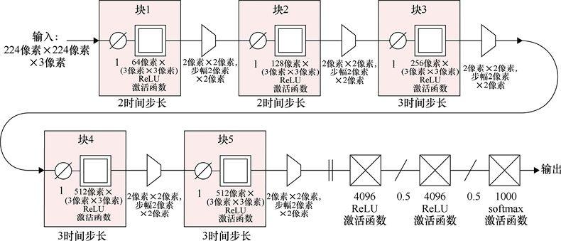

> **圖片描述：** VGG16網路的完整架構圖。輸入為224x224x3的彩色圖像，依序通過5個卷積層塊（Block 1-5），每個塊包含多個卷積層（使用3x3過濾器和ReLU激活函數），塊與塊之間通過2x2最大池化層進行下取樣。過濾器數量從64逐步增加到512。最後接三個全連接層（4096→4096→1000），最終使用softmax輸出1000類別的分類結果。

圖28.1　VGG16網路。像標記的那樣，每個塊在一行中重複2次或3次

為了簡化流程圖，我們不會在每個卷積層之前繪製零填充層。我們還將刪除所有在整個網路中一致的標籤。這些包括卷積層上的ReLU激活函數、3×3大小的濾波器以及2×2大小和步幅的最大池化層。最後，我們丟棄塊5之後的所有內容。這是因為我們並不是為了訓練這個網路，所以不會在意它的最終預測。我們只想實作給定輸入，並查看卷積層中的過濾器如何反應。VGG16的簡化圖如圖28.2 所示。注意，我們沒有從原本的網路遺漏任何內容，只是簡化了圖。

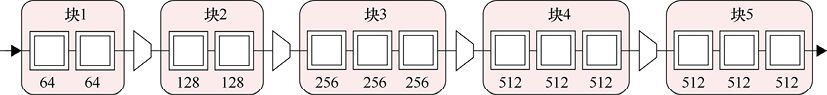

> **圖片描述：** VGG16卷積部分的簡化架構圖。展示五個區塊（Block 1-5），每個區塊內的卷積層以方塊圖示表示，區塊之間以箭頭連接。Block 1和2各有2個卷積層，Block 3、4、5各有3個卷積層。每個區塊下方標示過濾器數量：64、128、256、512、512。

圖28.2　圖28.1中完整VGG16結構的簡化圖。在這幅簡化圖中， 我們省略了零填充層、激活函數和過濾器大小、池化步驟標籤以及塊5之後的所有內容

VGG16是在ImageNet ILSVRC-2014資料庫上進行訓練的[ImageNet14]。該資料庫包含大約50多萬張照片，被人工標記為1000類。這些照片包括許多動物，以及常見的一些物品。

預訓練的VGG16網路以及它的權重應用廣泛。在許多機器學習庫中，我們可以輕鬆地訪問 VGG16（見第24章）。

### 28.2.2　可視化一個過濾器

讓我們從VGG16中選擇一個過濾器進行可視化。我們把這個過濾器稱為“目標過濾器”。

開始之前，我們將創建一個充滿隨機噪聲的圖像。我們將圖像的像素值設置為−1～1的值。所以每個像素點的3個顏色通道會在初始化時被分配一個隨機數，它們的值通常服從均勻分佈 （見第2章）。讓我們稱之為“噪聲圖像”。圖28.3展示了一個噪聲圖像的例子。

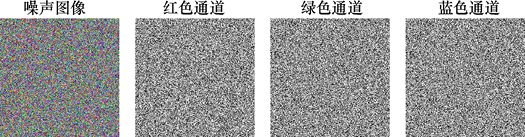

圖28.3　最左邊的圖像是一張由均勻噪聲構成的彩色圖像，為了顯示效果，像素值已被縮放至[0,255]。右邊的圖像依次分別顯示了3個顏色通道。圖像大小，正如VGG16的輸入大小要求，是224像素×224像素

現在，我們使用CNN處理噪聲圖像，如圖28.4 所示。

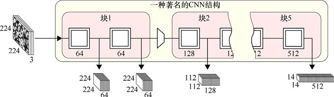

圖28.4　在VGG16中運行噪聲圖像。每個卷積層的輸出是一個張量，每個通道都是用該通道的過濾器卷積得到的

每個卷積層的輸出為三維張量。寬度和高度與該層輸入的寬度和高度相同。在該層，每個過濾器處理一個通道。回想第21章中的內容，我們稱每個過濾器的輸出為它的**激活映射**，所以輸出張量中的每個通道都是一個過濾器的激活映射。

在圖28.4中，輸入是3通道224像素×224像素大小的圖像。所以第一個卷積層的輸出有64個過濾器，是64通道224像素×224像素的張量。第二個卷積層的輸出具有相同的形狀。

塊1中第二個卷積層的輸出被送進一個最大池化層，用於將輸入的寬度和高度的大小縮減為原來的一半。因此塊2中第一個卷積層的輸入大小為64通道112像素×112像素。因為該層具有128個過濾器，因此其輸出大小是128通道112像素×112像素。重複這樣的變化直到最後一層，輸出一個512通道14像素×14像素的張量。

為了可視化目標過濾器，除了屬於我們關注的過濾器的激活映射，我們將忽略所有這些輸出。假設我們要查看塊2的第一個卷積層中過濾器編號為17的激活映射，如圖28.5所示。

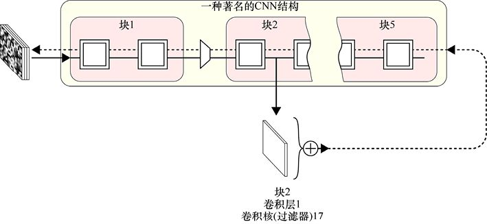

圖28.5　我們將噪聲圖像放到VGG16運行，然後觀察網路中某處的單個過濾器的輸出。我們獲取該過濾器的激活映射，並將所有的值加在一起。在反向傳播期間，我們使用激活映射的和作為損失函數（如虛線顯示）來修改輸入，以進一步激勵過濾器

為了瞭解這個過濾器對輸入的響應有多強烈，我們只需將激活映射中的所有值相加，就可以得到一個數字。在實際的程式碼中，我們通常在將每個值相加之前，將它們相乘。這一步操作有許多好處，例如，確保損失函數總是與一個正數相加。這樣的實作細節將運用到我們將在本章中看到的許多演算法。由於這些細節並不能促進我們對演算法本身的理解，我們通常會把它們忽略。

我們繼續研究過濾器通過加和激活映射的值來響應的強烈程度。當過濾器在輸入中找到匹配項的區域越多時，激活映射值就越大，因此它們的總和就越大。我們稱，激活映射之和表明過濾器的**激勵**強烈程度。我們總是希望這個數字儘可能大。

我們通常通過查看最後一層的輸出，並找出它與正確值之間的偏差，來計算一個網路的誤差或損失。然後，我們嘗試最小化該值。但在這種情況下，我們正在從一個內部層中推導出我們想要的測量值，我們的目標是最大化這個值。為了避免發明新的術語，我們保留通常的叫法，稱這個（從圖28.5所示的加號中出來的）測量值為誤差或損失，儘管這些名稱並不完全符合我們使該值儘可能大的意圖。

當在這種情況下運行反向傳播時，我們不更新網路。我們執行反向傳播，但我們跳過更新步驟，所以權重沒有改變。重要的是要記住，我們不會改變任何權重。畢竟，我們在這一點上沒有興趣教網路任何東西。相反，我們將把反向傳播誤差梯度一直推到輸入層。這給每個像素提供了一個梯度，告訴我們如何調整它來使我們測量的損失更大或更小。

我們想讓損失更大，使過濾器被進一步激勵，因為我們希望創建一個圖像，使它能夠儘可能地激勵過濾器。因此，我們跟隨梯度“上坡”產生更大的損失值，而不是跟隨它“下坡”產生一個較小的損失值。換言之，我們根據其梯度調整每個像素來進一步激勵過濾器，稱為**梯度上升**。

### 28.2.3　可視化層

我們可以推廣這個方法來可視化我們是如何激勵所有給定層上的過濾器的。

我們只用關注從該層輸出的每個激活映射，把它們的值加起來，然後將所有激活映射中的值相加。換句話說，我們只是把從該層輸出的張量的所有值相加。這給了我們一個數，代表著在這一層的過濾器合起來對於輸入的響應多麼強烈。

圖28.6直觀地展示了這個想法。

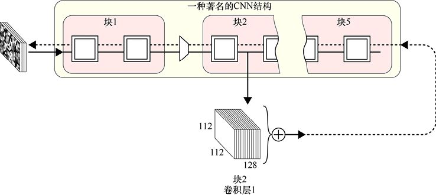

圖28.6　與其將單個過濾器的響應相加，不如將給定層中所有過濾器的響應相加，並將其作為我們的損失，激勵輸入更好地刺激整個層

使用反向傳播在網路中運行整個層的損失會導致噪聲圖像中的像素髮生變化，從而它們就能更多地激勵該層的過濾器。

讓我們試試看。圖28.7展示了VGG16網路中每個卷積層的結果。

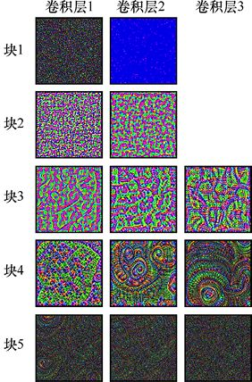

圖28.7　可視化整個層。這些圖像是VGG16中的每個層使用圖28.6的結構運行得到的結果。因為它們是從隨機噪聲開始，每次我們生成這些圖像，都將得到一個不同但類似的結果

在塊4的第二個和第三個過濾器中，似乎顯示了很多的同心圓、螺旋片和看起來像由部分圓組成的部分管片。我們將很快再次看到這些結構。

我們剛才討論的演算法的一個變體可以讓我們說一些過濾器比其他的更重要。在將每個過濾器的輸出添加到總和之前，我們可以將每個過濾器的輸出按某個值進行縮放，而不僅僅是將所有的過濾器的激活映射相加。每個像素將被最強烈地推向擁有最大縮放因子的過濾器。現在，當我們想要找到一個層的激活映射時，我們將加和所有的過濾器而不進行縮放，也就是說所用的過濾器同等重要。

## 28.3　deep dreaming

既然我們可以調整像素以更好地激勵一個層，那麼讓我們調整它們來激勵多個層。這讓我們可以創建一些看起來很酷炫的圖像。

為了製作這些圖像，我們將對圖28.6進行兩個更改。

首先，我們將加和多個層的結果，而不僅僅是單層。我們將按關聯的縮放因子縮放每個層的輸出，然後將這些縮放的響應相加。這些縮放因子是我們在生成圖像之前設置的超參數。

我們對圖28.6的第二個更改是用所選擇的圖像替換噪聲輸入。運行示例如圖28.8所示。

圖28.8　一張青蛙照片

要找到對於這隻青蛙的**多層損失**，我們只需選擇一些層和權重，並運行我們剛剛講述的過程。圖28.9展示了對於選擇3層的想法。

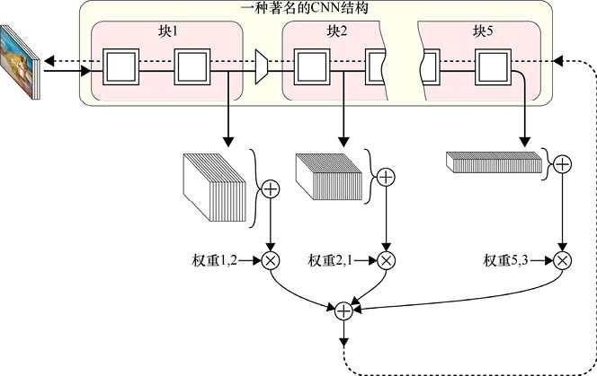

圖28.9　deep dreaming演算法使用了從多層得到的損失。我們找到選定層所有過濾器的激活映射，使用我們選定的值加權求和所有層的值，來得到我們的損失。圖像將被修改來激勵我們選擇的所有過濾器，並且優先於激勵那些具有最大權重的過濾器

此技術的原始名稱是**開始主義**（inceptionism）[Mordvintsev15]，但現在它更常稱為deep dreaming。這個名字詩意地表明CNN正在“dreaming”原始圖像，返回的圖像顯示我們的網路“夢到了”什麼。

與我們用於可視化過濾器和層的噪聲圖像一樣，如果初始圖像中的任何像素塊碰巧在我們選擇使用的層中引起了響應，它們將被調整以增加響應。所以像素值將逐漸更改，來進一步激勵我們所選層上的過濾器。對初始圖像的修改通常看起來很夢幻。

圖28.10展示了對我們的網路因為青蛙圖像做的一些“夢”。

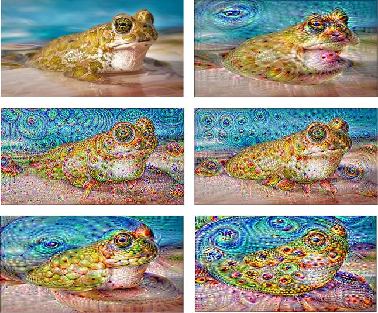

> **圖片描述：** 六張圖像展示青蛙照片經過deep dreaming處理後的結果。左上角為原始青蛙圖像，其餘五張展示了使用VGG16不同層和權重組合所產生的夢境效果。圖像呈現出迷幻的色彩增強效果，青蛙身上出現了同心圓、眼睛狀圖案和螺旋紋理等由神經網路「夢見」的特徵，展現了超現實主義的藝術風格。

圖28.10　對應最初青蛙圖像（左上角圖像）的一些deep dreaming結果。這些圖像完全是由演算法得出的，應用了圖28.9所示的結構，並且使用VGG16不同層和權重的組合

有時該網路的“夢”以一種清晰的方式增強了原始圖像。圖28.11展示了一條狗的圖像的deep dreaming結果。

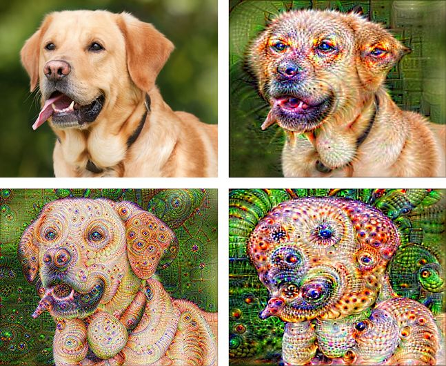

圖28.11　從左上角狗的圖像開始的deep dreaming結果

有時，結果可能是超現實主義的，如圖28.12所示。

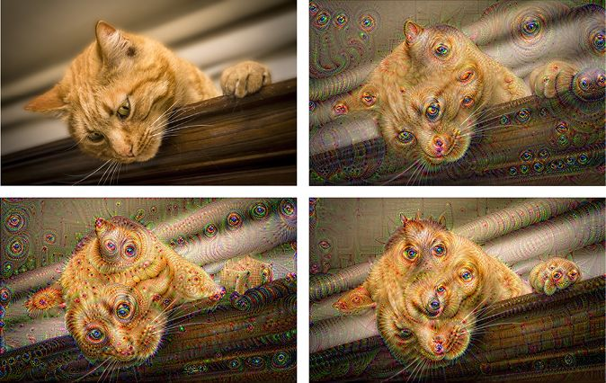

圖28.12　從左上角貓的圖像開始的deep dreaming結果

如果我們增加了權重，或者讓系統運行了很長時間，就可以得到一些極端的結果，如圖28.13 所示。

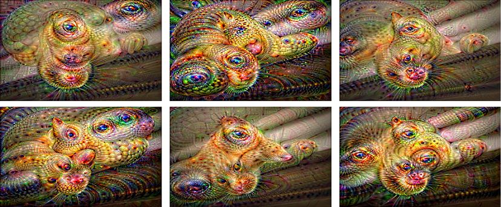

圖28.13　從圖28.12左上角的貓的圖像開始的deep dreaming結果。這些圖像不太像原來的貓，而是有它們自己的特點

許多由上面描述的基本演算法的變體已經被實作[Tyka15]，但是僅僅觸及了表面。我們可以想象出新的方法，自動確定每層的權重，甚至對在每一層上的過濾器應用不同的權重。我們可以“掩蓋”激活映射，然後再將它們加起來，這樣某些區域（如背景）就可以被忽略。或者我們可以“掩蓋”像素的更新，這樣原始圖像中的某些像素就不會因為響應一組層輸出而改變，但是允許在響應其他組層輸出時改變很多。我們甚至可以將不同的層和權重組合應用到輸入圖像的不同區域。

實作deep dreaming沒有“正確”或“最好”的方法。這是一個創造性的過程，我們遵循我們的美學、預感，或炫酷的構想，以尋覓我們為之動容的圖像。預測從任何特殊組合的層和權重能夠產生的輸出是十分困難的，所以這個過程需要耐心和大量的試驗。在這個意義上，它很像是尋找漂亮分形的過程[Beddard11][Ragets15]。

使用預訓練網路的一個結果是，我們將看到訓練資料在我們的做夢圖像中產生的回聲。例如，圖28.7中的同心圓和管片很容易在我們的做夢結果中看到，就像完整的眼睛（大概是因為很多VGG16的訓練圖像都是有眼睛的動物）。如果我們訓練一個新的網路，使用一些辦公用品的圖像，那麼我們應該會在我們的增強圖像中看到訂書機和磁帶分配器的片段。

製作藝術的deep dreaming的方法仍有許多空間值得挖掘。

本節中用於創建生成的圖像的程式碼來自[Bonaccorso17]。

## 28.4　神經風格遷移

我們可以用另一種方式使用過濾器和層響應來做一些了不起的事情：把一個藝術家的繪畫風格轉移到另一張圖像上。此過程稱為**神經風格遷移**（nerual style transfer）。

藝術家獨特的視覺風格往往是不同文化所崇尚的。那麼讓我們專注於繪畫。是什麼鑄就了畫作的風格？

這是一個很大的問題，因為“風格”可以涵蓋某人的世界觀，它影響著他們的選擇，如題材、構圖、材料和工具。這裡我們只關注視覺外觀。即使以這種方式縮小範圍，也很難準確地確定“風格”對於一幅畫意味著什麼，但我們可以說，它是指如何使用顏色和形狀來創建一些表現形式，以及這些表現形式在畫布上的類型和分佈[ArtStory17][Wikipedia17]。

讓我們來看看我們是否能找到一些看起來類似的描述，而不是試圖提煉這個描述。同時這也是一些我們可以用深度CNN的層和過濾器來形式化的內容。

本節的目標是拍攝一張我們想要修改的圖片，稱為**基本圖像**，和另一張具有著我們想匹配的風格的圖片，稱為**參考風格**。例如，我們的青蛙圖片可能是我們的基本圖像，任何繪畫都可以是參考風格。我們將使用這些創建一張新的圖像，稱為**生成圖像**，它有基本圖像的內容，但是以參考風格的風格來表達的。

開始之前，我們做一個可能聽起來很瘋狂的斷言。我們認為，我們可以通過觀察一幅畫所產生的層激活來確定它的風格。

這個想法源於一篇在2015年發表的開創性論文[Gatys15]。它工作的原理是，我們不僅使用卷積層輸出的激活映射，而是以一種特殊的方式處理它們，從每個輸出生成一個二維表。這些表保存了繪畫風格的表示。

因為這些表對演算法來說非常關鍵，所以讓我們看看如何得到它們。

### 28.4.1　在矩陣中捕獲風格

讓我們想象一個卷積層，它接收的輸入值是8像素×8像素。我們假設該層有6個過濾器，所以它的輸出張量是8像素×8像素×6像素。

我們將搭建單一的二維網格或表，用來表示在這一層發生的事情。

為了搭建表，我們考慮每對激活映射（即輸出張量中的每對通道）。首先我們來看激活映射0和1，然後激活映射0和2，以此類推，然後激活映射1和2，然後激活映射1和3，一直到激活映射4和5。

我們將每對激活映射逐元素相乘後加在一起。這個步驟所產生的數字將進入我們的表中，座標位置由過濾器編號給出。我們用這種方法搭建的表稱為**格拉姆矩陣**。

讓我們來看一個例子。圖28.14展示了過濾器1和2的輸出，以及將它們乘起來的結果。將所有這些相乘值加起來得到10.90，所以這是進入表在位置(1,2)的值。因為映射的順序在這個操作中無關緊要，同樣的結果會來自過濾器2和過濾器1，所以我們把剛剛計算得到的值複製到位置(2,1)。

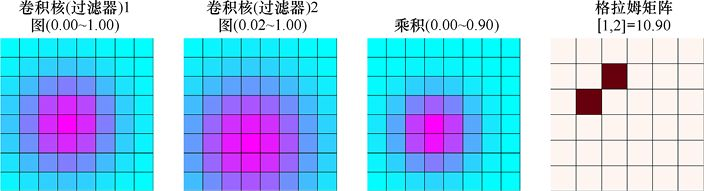

> **圖片描述：** 展示格拉姆矩陣（Gram Matrix）的計算過程。左側兩個8x8彩色網格分別代表過濾器1和過濾器2的激活映射（值範圍標示於上方），以藍色到紫紅色的顏色映射表示數值大小。第三個網格為兩者逐元素相乘的結果。所有乘積值加總得到10.90，此數值填入右側6x6格拉姆矩陣的(1,2)和(2,1)位置。

圖28.14　左邊兩幅圖顯示了在一個總共有6個過濾器的卷積層中，假想的過濾器1和2的響應。在這兩幅圖中，響應值都是正的。在它們右邊的是逐元素相乘得到的結果。將相乘的結果所有值加起來得到10.90。這個值是放置在格拉姆矩陣中的(1,2)和(2,1)處。因為在這個圖中的每一個網路都有不同的值範圍（顯示在每個網格的頂部）。為了顯示，在圖中左邊3個網格的每個值（以及那些後續網格）已獨立縮放，從藍色的0到紫色的1

在圖28.14中，過濾器激活映射為8像素×8像素，匹配層輸入的寬度和高度。我們在最右邊得到的表是6像素×6像素，因為這一層有6個過濾器。

在圖28.14中，過濾器1和2的響應重疊了很多，所以從它們的相乘像素圖中我們得到了一個大的總和。讓我們將過濾器1的激活映射與另一個假想過濾器3的激活映射進行比較。這一次，它們重疊得不多，所以它們相乘的總和只有1.36，如圖28.15所示。

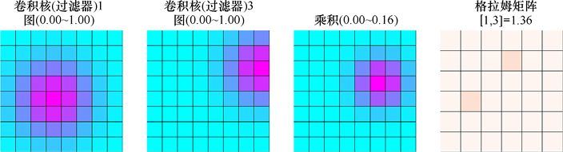

圖28.15　查找過濾器1和3的激活映射的格拉姆矩陣項。過濾器1具有與之前相同的響應。這些響應重疊不及過濾器1和2的，所以它們的求和值很小。這個值放到(1,3)和(3,1)處

我們再來看一對吧。過濾器4在輸入中找到了3個不同的匹配項，而過濾器5在偏右下角處找到了一些。圖28.16為這兩個過濾器重複以上步驟。

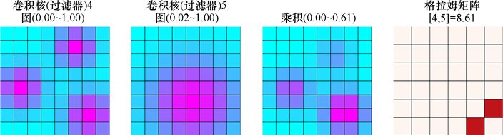

圖28.16　獲得過濾器4和5響應的格拉姆矩陣項。由於兩個激活映射都有很大的值，所以第3個網格中的相應值也很大。第3個網格中的值的總和保存在(4,5)和(5,4)處

這些格拉姆矩陣是我們前面提到的二維表，它保存了生成過濾器響應的圖像的樣式。

為什麼會這樣呢？為什麼從激活映射創建二維表的這個方法與圖像的樣式有關？我們稍後再討論這個問題。

### 28.4.2　宏觀藍圖

讓我們回顧一下我們的計劃。

我們的整體目標是創建一張看起來像是基本圖像的生成圖像，但風格與我們的參考風格相同。

我們將像可視化過濾器和層那樣，從一個充滿噪聲的圖像開始繼續探索。我們之所以使用噪聲圖像，是因為它不假定輸出應該是什麼樣子。

噪聲圖像作為生成圖像的初稿。我們會用反向傳播逐漸細化這個有噪聲的圖像。每次通過網路運行生成圖像時，我們都會計算一個損失，然後修改我們生成的圖像，使它變得更像我們希望的那樣。因此噪聲圖像將逐漸轉化為我們的基本圖像的版本，但是有著參考風格的樣式。

在deep dreaming中，我們希望最大化測量的損失，因為我們想要激勵選定層上的過濾器。

在神經風格遷移中，我們希望回到更常見的方法中，儘量減少網路的損失。那是因為現在的損失將告訴我們兩件事。第一，**內容損失**告訴我們生成的圖像有多不像內容中的基本圖像。第二，**風格損失**告訴我們生成的圖像有多不類似風格引用中的樣式。損失將是這些值之和。我們希望生成的圖像能夠匹配內容和樣式，所以將更改像素值以最小化此損失。

通過同時使用兩種損失，我們希望生成圖像中的像素將以一種方式改變，使它們看起來更像基本圖像，而同時使它們具有更像參考風格的風格。

讓我們看看這兩種損失。

### 28.4.3　內容損失

為了計算內容損失，在開始製作生成圖像之前，我們採取了預處理的步驟。我們只需要讓基本圖像通過網路，保存每個卷積層的輸出張量，如圖28.17所示。這裡繼續使用預先訓練的VGG16網路。

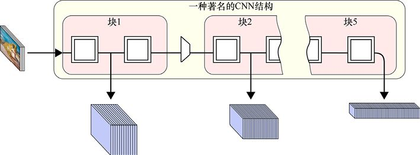

圖28.17　在開始風格遷移之前，我們讓基本圖像通過網路。我們為每個層保存激活映射，這將用於圖像重建過程。這裡顯示了任意3層的輸出

現在想象一下，我們正在進行風格遷移。因為我們剛開始，生成圖像充滿了噪聲。我們將把這個圖像呈現給網路並收集每層生成的激活映射。

所以現在對於每一層，我們都有兩個張量。第一，我們有在給網路提供基本圖像時保存的激活映射。第二，我們有響應剛剛送入網路的生成圖像產生的新的激活映射。我們會找到這兩個張量中的每一個對應的值的差異（我們通常先將每個這樣的差異平方，這樣它就總是非負了，更大的差異代表著有更多的影響）。我們將所有這些差異加在一起，這就是該層的損失。我們將每個想要被包含的層的損失加在一起，就得到了輸入圖像的內容損失，如圖28.18所示。

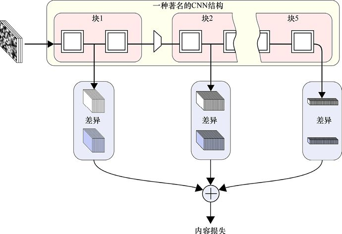

圖28.18　為了計算內容損失，我們需要求出當前圖像的輸出（白色），並逐元素地與基本圖像（藍色）中保存的輸出進行比較。所有這些差異的總和是內容損失。在此圖中，圓角矩形內有代表逐元素求出兩個張量間差異的操作，最後將這些差異加在一起

讓我們通過查看這些保存的激活映射值來獲得一種直觀印象。我們將按照前面使用過的方法來可視化某一層，而不是從多個層彙總輸出。我們將遵循圖28.18的基本方法，只是在這裡我們只查找由於單層而造成的損失。我們將生成圖像的響應與從基本圖像中保存的響應進行比較。它們越不同，就會產生越大的損失，最終引起像素的改變，從而降低損失。我們會不斷運行這一過程，直到損失結果停止改變。

用青蛙的圖像作為基本圖像，則內容激活如圖28.19所示。

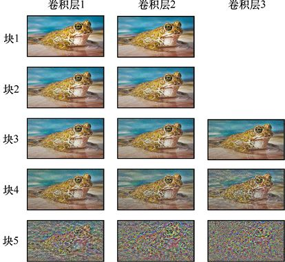

圖28.19　從噪聲圖像合成一個新圖像的結果。分別屬於嘗試匹配VGG16不同層激活映射的結果

正如所期望的那樣，早期激活會在輸入圖像中獲取詳細資訊，所以在嘗試匹配它們時，我們得到的東西很像產生這些激活的青蛙圖像。隨著我們進入網路的深層，這些層正在尋找更強大的特徵，所以我們試圖匹配每個層的輸出，圖像看起來也就越來越不像青蛙。

我們將保存基本圖像的激活層輸出，用於我們風格遷移時計算內容損失。

### 28.4.4　風格損失

風格損失還取決於在風格遷移之前所採取的預處理步驟。在這一步中，我們保存一些參考風格通過網路產生的結果。

本節中的參考風格將是巴勃羅·畢加索1907年的自畫像，如圖28.20所示。

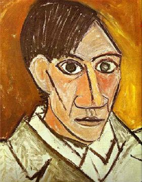

圖28.20　巴勃羅·畢加索1907年的自畫像。這將是我們在下面圖像中的參考風格

與內容損失一樣，我們將讓參考風格通過網路並保存一些值。但我們並不是保存每個層的激活映射，而是保存從這些激活映射輸出生成的格拉姆矩陣，如圖28.21 所示。

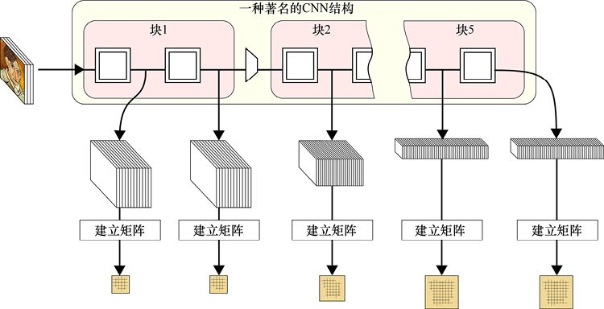

圖28.21　我們讓參考風格通過網路，併為我們想要在重建過程中使用的每一層建立和保存一個格拉姆矩陣。每個矩陣的大小由所在層的過濾器的數量給出，所以當我們到VGG16更深層時表的大小也隨之增大

為了計算風格損失，我們將採取類似計算內容損失的方法。我們將輸入通過網路，並比較感興趣的每一層的格拉姆矩陣與我們從參考風格中保存的矩陣，如圖28.22所示。

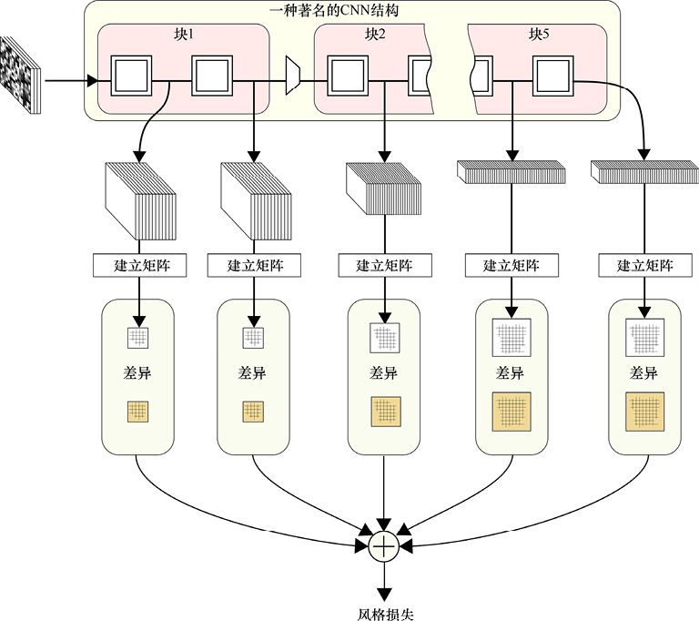

圖28.22　計算風格損失。讓當前圖像通過網路，並從每個層的輸出張量計算一個格拉姆矩陣。然後，我們逐元素地計算出當前圖像每個矩陣與在圖28.21中從參考風格保存的格拉姆矩陣的差異。我們將所有這些差異相加，以獲得風格損失。圓角矩形告訴我們要逐元素地計算矩陣的差異，最後把它們都加在一起

此損失將導致輸入圖像的像素值被更改，使得根據結果的激活映射計算出的格拉姆矩陣，更接近我們從參考風格中保存的格拉姆矩陣。

讓我們將噪聲圖像通過**網路**，並嘗試使它匹配我們從參考風格保存的格拉姆矩陣。

我們按照對內容損失的做法，每次僅匹配一個層，即運行圖 28.22，但每次只測量一個層的損失。使用與青蛙圖像長寬比一致的噪聲圖像作為輸入，我們得到圖28.23所示的結果。

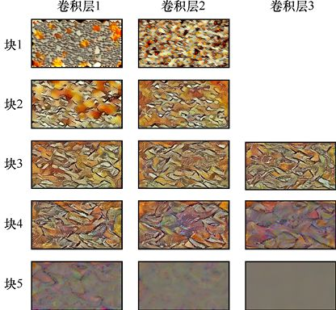

圖28.23　使噪聲圖像匹配VGG16每層的格拉姆矩陣的結果

這是了不起的。它表明，格拉姆矩陣似乎真的能夠捕獲繪畫風格資訊。尤其是，塊3中各層表現十分不錯。它們顯示的是以黑線為邊緣的色塊，就像參考風格顯示的那樣。

讓我們對演算法嘗試小的變化，即計算層的累積損失而不是逐層計算損失。所以對於每一層，我們將所有層的損失總和作為風格損失，如圖28.24所示。

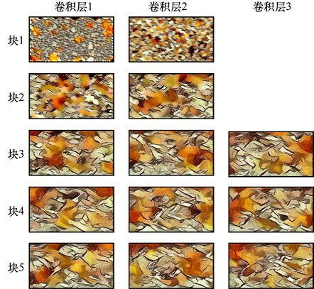

圖28.24　用噪聲圖像匹配VGG16中格拉姆矩陣的結果，但在每個情況下我們計算包括本層在內的所有之前層的損失作為該層的損失。例如，塊3的卷積層2使用了塊1中的兩層、塊2中的兩層和塊3中的前兩層的損失和

圖像變得更好了！當我們到達塊3時，我們生成的簡圖與圖28.20 中的原始參考風格有很多相似之處。顏色斑點顯示相似的漸進顏色變化，甚至還有看似粗糙的筆畫紋理。塊4和塊5中的層沒有提供其他太多的風格資訊（見圖28.23）。

### 28.4.5　實作風格遷移

在前面小節裡，我們已經得到了進行風格遷移所需的所有部分。

我們把一些隨機噪聲輸入網路。我們從所關心的所有層收集激活映射。從一些層中，我們計算得到內容損失。從一些層中，我們計算得到風格損失。

我們再加一步：加權內容和風格損失。所以我們可以決定哪一個損失最有影響力。然後，我們添加這些值，求得總損失，運行反向傳播，調整像素，並重復這一過程。漸漸地，像素將以同時減少兩個損失的方式改變。最終，生成圖像看起來像基本圖像，但具有參考風格的樣式，如圖28.25所示。

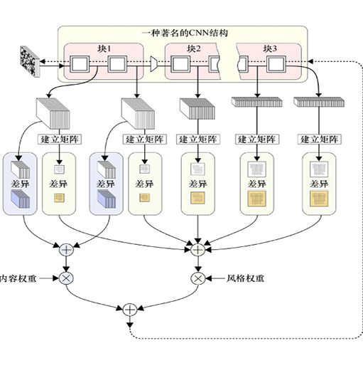

> **圖片描述：** 神經風格遷移的完整架構流程圖。頂部將噪聲圖像輸入一個CNN（顯示塊1至塊3）。中間層向下分支出兩條路徑：左側計算內容損失（將各層激活映射與基本圖像的激活映射比較差異後加總，乘以內容權重）；右側計算風格損失（從各層輸出建立格拉姆矩陣，與參考風格的格拉姆矩陣比較差異後加總，乘以風格權重）。兩種損失最終相加得到總損失，用於透過反向傳播調整輸入像素。

圖28.25　風格遷移。從一張噪聲圖像開始，我們比較選定層上過濾器的激活映射值與我們為內容保存的值。將它們的差異加起來，並根據我們希望這種風格對結果有多大影響進行縮放。我們從輸入建立格拉姆矩陣，然後和那些我們在選定層保存的格拉姆矩陣進行比較。我們累加了所有損失，然後根據風格權重進行縮放。將內容損失和風格損失值相加，得到最終的損失。我們使用反向傳播找出如何調整輸入像素，使其更好地同時匹配內容和風格

讓我們看看一些結果。圖28.26展示了9種不同的繪畫，每個都有不同的風格。下面我們將用這些圖像作為參考風格。

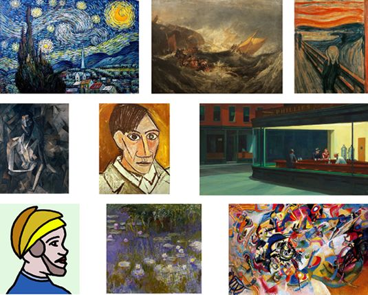

圖28.26　9張圖像具有不同的風格，這將作為我們的參考風格。這9張圖像從左至右、從上到下分別是凡·高的《星月夜》、J.M.W.特納的《米諾陶洛斯的沉船》、愛德華·蒙克的《吶喊》、巴勃羅·畢加索的《坐著的女性裸體》、巴勃羅·畢加索的《自畫像1907》、愛德華·霍普的《夜遊者》、佚名作品《Croce中士》、克洛德·莫奈的《睡蓮、黃色和淡紫色》以及瓦西里·康定斯基的《第七交響曲》

讓我們把這些風格應用到我們的青蛙圖像。在將每張圖像發送到 VGG16之前， 我們將其縮放到預期大小（224像素×224像素）。為了在這裡顯示結果，我們將每個輸出都縮放回原始圖像的大小。結果如圖28.27所示。

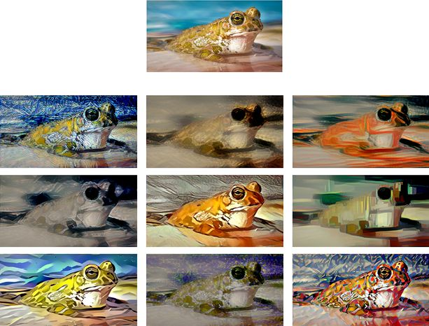

> **圖片描述：** 展示神經風格遷移的驚人效果。頂部為原始青蛙照片，下方九張圖分別將九種不同繪畫風格遷移到青蛙圖像上。每張生成圖像保留了青蛙的基本輪廓和構圖，但呈現出完全不同的藝術風格——包括凡高的旋渦筆觸、蒙克的流動線條、畢加索的幾何色塊、莫奈的柔和色調等，展現了風格遷移技術的強大能力。

圖28.27　將圖28.26中的9種風格應用於青蛙圖像（頂部圖）

哇！得到的圖像效果很好。

這些圖像經得起細緻的檢查，因為在上面有很多細節。乍一看，我們可以看到每種參考風格的調色板已經遷移到青蛙圖像。但請注意紋理和邊緣，以及顏色塊如何重新成型的。這些圖像不只是顏色變換的青蛙，也不只是對兩張圖像進行某種疊加或混合。相反，這些是高質量具有細節的不同風格的青蛙圖像。為了更清楚地看到這一點，我們在圖28.28中展示了每個青蛙圖像相同的放大區域。

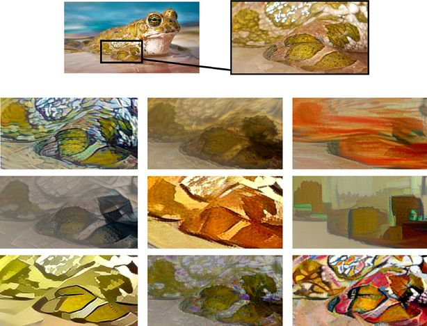

圖28.28　圖28.27中9種風格的青蛙。在最上面的圖中我們標記青蛙一部分前腿周圍的區域。下面的圖展示了應用不同風格的上述區域

從左向右、從上到下觀察，我們可以看到基於《星月夜》的青蛙是由許多短筆畫組成的，每一個都塗上多種顏色。基於《米諾陶洛斯的沉船》的青蛙顯示出平滑而有質感的區域。基於《吶喊》的青蛙由長而流暢的筆畫組成，大部分相鄰的筆畫顏色相似。基於《坐著的女性裸體》的青蛙是有點令人失望的，因為它似乎沒有顯示出原作中強烈的邊緣和線條，但相似顏色區域內的低對比度是匹配的。基於《自畫像1907》的青蛙展現了原作的粗糙筆觸。基於《夜遊者》的青蛙是用固定顏色塊呈現的。基於《Crose中士》的青蛙使用的大部分都是純色，其中一些用了黑色的輪廓。基於《睡蓮》的青蛙是用柔和的調色板上的顏色繪製的。而基於《第七交響曲》的青蛙則具有一種充滿活力的彩色，高對比度的形狀，這些都是繪畫的特徵。

我們似乎已經成功地遷移了風格！讓我們看看如何將這些風格應用到另一個圖像中。

在圖28.29中 ，我們在一張山景觀的圖像上應用9種風格。

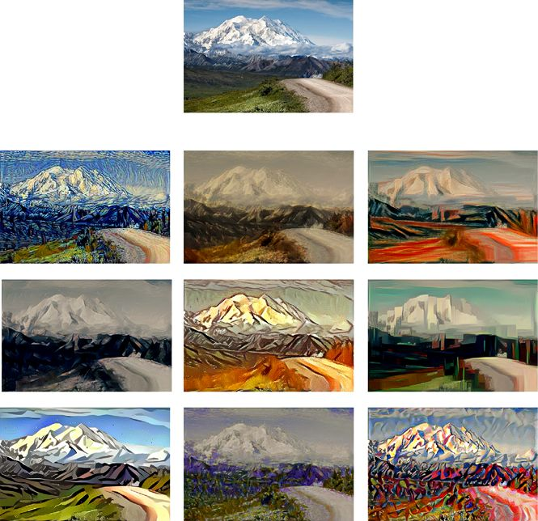

圖28.29　將圖28.26中的9種風格應用於山景觀圖像（頂部圖）

最後，在圖28.30中，我們將風格應用到一個小鎮的圖像中。

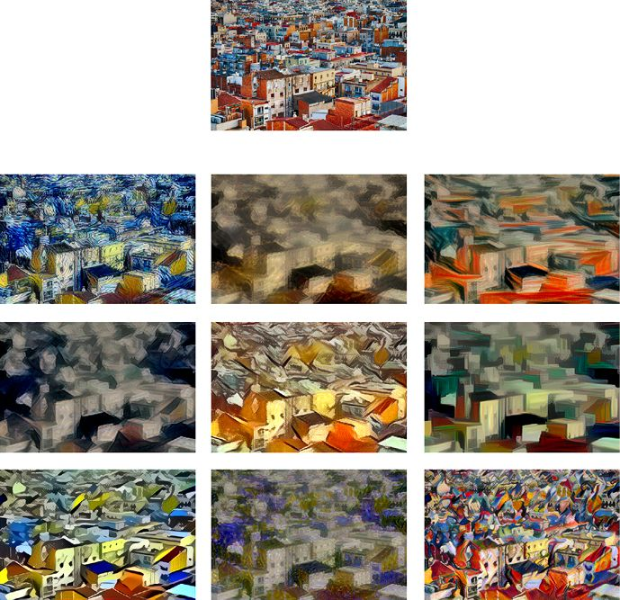

圖28.30　應用圖28.26的9種風格到一個小鎮的圖像（頂部圖）

這些圖像更了不起的是，它們是用一幅**噪聲**圖像訓練得到的。

為了製作這些圖像，我們使用了VGG16網路。對於內容損失，我們只使用塊1上第二個卷積層的輸出（我們這樣選擇是因為，比起第一個卷積層它似乎產生更少的像素級斑點）。對於風格損失，我們使用了網路中所有的卷積層的輸出。

我們將內容損失加權為0.025，風格損失加權為1，因此風格對像素的變化的影響比內容多40倍。在這些例子中，一點點內容的改變需要很長的時間訓練。

我們還用了很小的第三種損失。這是通過在生成圖像中添加相鄰像素之間的差異來找到的。這個想法是，大多數像素應該接近鄰域的顏色。所以通過最小化這一損失，我們抑制了在像素級別上還有的一點斑點。這個損失的權重大約為0.0001，幾乎是可以忽略的。

所有這些參數是通過試驗和損失選擇的。不同的內容和風格想要達到最好的遷移效果可能需要不同的參數。

我們用來在本節中創建生成圖像的程式碼是從[Chollet17]和[Majumdar17]中改編而成的。

### 28.4.6　討論

如圖28.30所示，神經風格遷移的基本演算法產生了很好的結果。該技術已經在許多方面被擴展修改，這提高了演算法的靈活性。其產生的結果類型，以及可控制的範圍，方便了藝術家的創作[Jing17]。它甚至被應用於影片以及完全環繞觀看者的環視圖像[Ruder17]。

整個演算法的核心是我們如何計算損失。

我們度量內容損失的方式似乎是合理的。如果生成圖像導致早期網路層上的過濾器響應的方式與對基本圖像的響應相同，則生成圖像中的詳細資訊可能會類似於基本圖像。

不過，風格損失則有點神秘。我們之前說過要回答這個問題，現在我們來解決它。為什麼這些格拉姆矩陣可以完成這樣一個奇妙的工作，捕獲我們對風格的看法？

不負責任的答案是沒有人真正知道它的原理[Li17]。有不同的方法來寫下格拉姆矩陣所度量的數學內容，但這並不能幫助我們理解為什麼這個技巧能捕獲我們稱之為“風格”的難以捉摸的想法。關於神經風格遷移的論文[Gatys15]，以及更詳細的後續論文[Gatys16]，都沒有解釋作者是如何想出這個想法或為什麼它有如此好的效果。

考慮它的一種方法是，格拉姆矩陣對於成對的過濾器具有較大的值，這些過濾器對層輸入中的相同位置都有很強的響應。正如我們在圖28.14、圖28.15和圖28.16中看到的那樣，如果被比較的兩個過濾器的激活映射圖有很多重疊，並且它們的值在重疊時很大，那麼我們將得到格拉姆矩陣在相應位置具有很大的值。因此，每當格拉姆矩陣中具有較大值時，我們可以說它對應的兩個過濾器都對層輸入中的許多相似位置做出強烈響應。

這就是我們可以解釋的了。事後看來，也許這種方法能夠捕獲風格是因為風格是一致使用兩種或多種方式構造圖像外觀的結果。

例如，如果大部分表面都包含大部分純色的塊，這些塊用直線相互鄰接；或許這幅畫有相同的顏色塊，但它們之間通常有一條黑線，我們可以說一幅畫具有某種風格。也許我們可以說畫筆行筆是平滑的並且在它們的長度上緩慢地改變顏色，還以相同質量和幾乎相同顏色的其他筆畫為邊界。

如果，這只是如果，上述這些事情是我們所謂的“風格”，那麼格拉姆矩陣的方法是有意義的。畢竟，過濾器檢測圖像的質量（如顏色塊或筆畫流動），格拉姆矩陣告訴我們，兩個或更多的過濾器在相同的地方找到了它們要找的東西。

如果是這樣的話，那麼當使用3種類型的外觀品質，或4種，或更多的具體風格，我們或許也能分辨特定風格。這可能是建立一個三維表並填寫3個過濾器之間的相似之處，或4個過濾器的四維表，然後看看我們能獲取什麼樣的結果。

與deep dreaming一樣，神經風格遷移是一種允許進行大量變體和探索的通用演算法。肯定會有許多有趣而美麗的藝術效果等待你去發現。

## 28.5　為本書生成更多的內容

為了好玩，我們將本書（除了本節）的文本通過一個 RNN，以生成新的文本單詞，如第22章所述。全文包括程式碼清單和圖片說明，但不包括參考資料，包含約42.7萬個單詞，這些單詞來自包含約10300個單詞的詞彙表。為了學習這個文本，我們使用了由兩層LSTM構建的網路，其中每層有128個單元。

該演算法通過找到下一個最有可能的單詞來生成它的輸出，這樣就產生了文本。然後又是下一個最有可能的詞，然後是再下一個，等等，直到我們停止它。通過這種方式生成文本就像根據我們迄今為止使用過的詞從手機建議的詞中選擇來創建消息一樣[Lowensohn14]。當然，這並非巧合，因為大多數手機可能都在使用類似演算法選擇它們提供的單詞。唯一的區別是我們自動選擇單詞。

一旦我們度過了新奇階段，閱讀逐字逐句生成的大塊文本變得並不那麼有趣，因為這些鬆散的文本沒有意義。

因此，這裡是250次迭代後從輸出中手動選擇的幾個句子。它們完全包含在生成的文本中，包括標點符號。

The responses of the samples in all the red circles share two numbers, like the bottom of the last step, when their numbers would influence the input with respect to its category.

The gradient depends on the loss are little pixels on the wall.

We know how to measure the error as a sequence of layers blended in the transformation being selected until we see some negative values.

But before that’s finding an action that accepts the probability that the cars have been correctly dependent on the GPU that was looking at those bills.

Let’s look at the code for different dogs in this syllogism.

讓人驚訝的是，這些句子都十分接近現實有意義的句子!

整個句子都很有趣，但是我們發現在訓練開始後不久只能得到碎片的時候，會得到最有趣的片段。以下是一些僅10個訓練週期以後手工節選的碎片，沒有經過修飾再次逐字呈現。

Set of of apply, we + the information.

Because to # function with only 4 is the because which training.

Suppose us only parametric.

This by this know we on value autoencoder.

The usually quirk (alpha train had we than that to use them way up).

這些碎片大多是“語無倫次”的，但從這些合成詞組可以得到一個結論：本書的主要目標之一就是“+資訊”。

## 參考資料

[ArtStory17]　The Art Story Foundation, *Modern Movements and Styles-Full List*, Art Story site, 2018.

[Beddard11]　Tom Beddard, *FractalLab*: *Interactive WebGL Fractal Explorer*, *Sub-Blue blog*, 2011.

[Bonaccorso17]　Giuseppe Bonaccorso, *Neural_Artistic_ Style_Transfer*,GitHub, 2018.

[Chollet17]　François Chollet, *Deep Learning with Python*, Manning Publications, 2017.

[Gatys15]　Leon A Gatys, Alexander S Ecker, Matthias Bethge, *Neural Algorithm of Artistic Style*, arXiv: 1508.06576, 2015.

[Gatys16]　Leon A Gatys, Alexander S Ecker, Matthias Bethge, *Image Style Transfer Using Convolutional Neural Networks*, Proceedings of the IEEE Conference on Computer Vision and Pattern Recognition, 2016.

[ImageNet14]　ImageNet authors, *ImageNet Large Scale Visual Recognition Challenge 2014* (ILSVRC2014), ImageNet web site, 2014.

[Jing17]　Yongcheng Jing, Yezhou Yang, Zunlei Feng, Jingwen Ye, Mingli Song, *Neural Style Transfer：A Review*, arXiv: 1705.04058v1, 2017.

[Li17]　Yanghao Li, Naiyan Wang, Jiaying Liu, Xiaodi Hou, *Demystifying Neural Style Transfer*, arXiv: 1701.01036, 2017.

[Lowensohn14]　Josh Lowensohn, *I Let Apple’s QuickType Keyboard Take Over My iPhone*, The Verge blog, 2014.

[Majumdar17]　Somshubra Majumdar (Titu1994), *Neural-Style-Transfer*, GitHub, 2017.

[Mordvintsev15]　Alexander Mordvintsev, Christopher Olah, Mike Tyka, *Inceptionism: Going Deeper into Neural Networks*, Google Research Blog, 2015.

[Ragets15]　Stan Ragets, *Fractal Art： How to Create Grand Julians in Apophysis*, Envato Tuts+, 2015.

[Ruder17]　Manuel Ruder, Alexey Dosovitskiy, Thomas Brox, *Artistic Style Transfer for Videos and Spherical Images*, arXiv: 1708.04538, 2017.

[Simonyan14]　Karen Simonyan and Andrew Zisserman, *Very Deep Convolutional Networks for Large-Scale Visual Recognition*, Visual Geometry Group blog, University of Oxford, 2014.

[Tyka15]　Mike Tyka, *Deepdream/Inceptionism-recap*, Mike Tyka’s blog, 2015.

[Wikipedia17]　Wikipedia authors, *Style (visual arts)*, Wikipedia, 2018.

